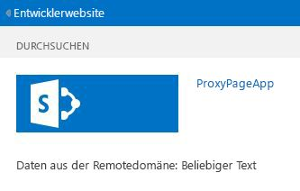

# <a name="create-a-custom-proxy-page-for-the-cross-domain-library-in-sharepoint"></a>Erstellen einer benutzerdefinierten Proxyseite für die domänenübergreifende Bibliothek in SharePoint
In diesem Artikel erfahren Sie, wie eine benutzerdefinierte Proxyseite für den Zugriff auf Daten in einem Remotedienst von einer SharePoint-Webseite aus unter Verwendung der domänenübergreifenden Bibliothek in SharePoint erstellt wird. 
 

 **Hinweis** Der Name „Apps für SharePoint“ wird in „SharePoint-Add-Ins“ geändert. Während des Übergangszeitraums wird in der Dokumentation und der Benutzeroberfläche einiger SharePoint-Produkte und Visual Studio-Tools möglicherweise weiterhin der Begriff „Apps für SharePoint“ verwendet. Weitere Informationen finden Sie unter [Neuer Name für Office- und SharePoint-Apps](new-name-for-apps-for-sharepoint.md#bk_newname).
 

Beim Erstellen von SharePoint-Add-Ins müssen in der Regel Daten von verschiedenen Quellen eingebunden werden. Aus Sicherheitsgründen gibt es jedoch Sperrmechanismen, die eine gleichzeitige Kommunikation mit mehr als einer Domäne verhindern.
 

Über die domänenübergreifende Bibliothek können Sie auf Daten in Ihrem Remote-Add-In zugreifen, wenn Sie eine benutzerdefinierte Proxyseite bereitstellen, die in der Infrastruktur des Remote-Add-Ins gehostet wird. Als Entwickler sind Sie für die Implementierung der benutzerdefinierten Proxyseite verantwortlich und müssen für die benutzerdefinierte Logik sorgen, also auch den Authentifizierungsmechanismus für das Remote-Add-In. Verwenden Sie die domänenübergreifende Bibliothek mit einer benutzerdefinierten Proxyseite, wenn die Kommunikation auf Clientebene erfolgen soll.
 


## <a name="prerequisites-for-using-the-examples-in-this-article"></a>Voraussetzungen für die Verwendung der Beispiele in diesem Artikel
<a name="SP15Createcustomproxypage_Prereq"> </a>

Sie benötigen eine Entwicklungsumgebung, wie unter [Erste Schritte beim Erstellen von von einem Anbieter gehosteten SharePoint-Add-Ins](get-started-creating-provider-hosted-sharepoint-add-ins.md) erläutert.
 

 

### <a name="core-concepts-to-know-before-using-a-custom-proxy-page-with-sharepoint-add-ins"></a>Kernkonzepte, die Ihnen vor der Verwendung einer benutzerdefinierten Proxyseite mit SharePoint-Add-Ins bekannt sein sollten

In der folgenden Tabelle werden einige wichtige Artikel aufgelistet, in denen die relevanten Konzepte für ein domänenübergreifendes Szenario für SharePoint-Add-Ins erläutert werden.
 

 

**Tabelle 1. Kernkonzepte der Verwendung einer benutzerdefinierten Proxyseite**


|**Titel des Artikels**|**Beschreibung**|
|:-----|:-----|
| [SharePoint-Add-Ins](sharepoint-add-ins.md)|Hier finden Sie Informationen über das neue Add-In-Modell in SharePoint, das es Ihnen ermöglicht, Add-Ins als kompakte, einfach zu verwendende Lösungen für Endbenutzer zu erstellen.|
| [Sicherer Datenzugriff und Clientobjektmodelle für SharePoint-Add-Ins](secure-data-access-and-client-object-models-for-sharepoint-add-ins.md)|In diesem Artikel erhalten Sie Informationen über Zugriffsoptionen in SharePoint-Add-Ins. Zudem dient er als Leitfaden für Alternativen auf oberer Ebene, aus denen Sie bei der Arbeit mit Daten in Ihrem Add-In auswählen müssen.|
| [Hostwebs, Add-In-Webs und SharePoint-Komponenten in SharePoint](host-webs-add-in-webs-and-sharepoint-components-in-sharepoint.md)|In diesem Artikel erfahren Sie, welche Unterschiede zwischen Hostwebsites und Add-In-Websites bestehen. Sie erfahren zudem, welche SharePoint-Komponenten in eine SharePoint-Add-In aufgenommen werden können, welche Komponenten für die Hostwebsite und welche für die Add-In-Website bereitgestellt werden und wie die Add-In-Website in einer isolierten Domäne bereitgestellt wird.|
| [Clientseitige domänenübergreifende Sicherheit](http://msdn.microsoft.com/en-us/library/cc709423%28v=vs.85%29.aspx)|In diesem Artikel werden domänenübergreifende Bedrohungen und Anwendungsfälle sowie Sicherheitsprinzipien für ursprungsübergreifende Anforderungen beschrieben und die Risiken für Entwickler bewertet, die den domänenübergreifenden Zugriff von Webanwendungen, die im Browser ausgeführt werden, verbessern möchten.|

## <a name="code-example-access-remote-data-using-a-custom-proxy-page-for-the-cross-domain-library"></a>Codebeispiel: Zugreifen auf Remotedaten unter Verwendung einer benutzerdefinierten Proxyseite für die domänenübergreifende Bibliothek
<a name="SP15Createcustomproxypage_Codeexample"> </a>

Führen Sie die folgenden Schritte aus, um Daten vom Remotedienst zu lesen: 
 

 

1. Erstellen Sie ein SharePoint-Add-In-Projekt.
    
 
2. Ändern Sie das Add-In-Manifest, um die Kommunikation vom Remote-Add-In zu erlauben.
    
 
3. Erstellen Sie die benutzerdefinierte Proxyseite und eine Inhaltsseite im Webprojekt.
    
 
4. Erstellen Sie eine Seite, die die domänenübergreifende Bibliothek im SharePoint-Add-In-Projekt verwendet.
    
 

### <a name="to-create-the-sharepoint-add-in-project"></a>So erstellen Sie das SharePoint-Add-In-Projekt


1. Öffnen Sie Visual Studio als Administrator. (Klicken Sie dazu im Menü **Start** mit der rechten Maustaste auf das Visual Studio-Symbol, und wählen Sie **Als Administrator ausführen** aus.)
    
 
2. Erstellen Sie das vom Anbieter gehostete SharePoint-Add-In wie unter [Erste Schritte beim Erstellen von von einem Anbieter gehosteten SharePoint-Add-Ins](get-started-creating-provider-hosted-sharepoint-add-ins.md) erläutert, und nennen Sie es „ProxyPageApp“. 
    
 

### <a name="to-edit-the-add-in-manifest-file"></a>So bearbeiten Sie die Add-In-Manifestdatei


1. Klicken Sie im **Projektmappen-Explorer** mit der rechten Maustaste auf die Datei **AppManifest.xml**, und wählen Sie **Code anzeigen** aus.
    
 
2. Ersetzen Sie das gesamte **AppPrincipal**-Element durch Folgendes.
    
```XML
  <AppPrincipal>
    <Internal AllowedRemoteHostUrl="~remoteAppUrl"/>
</AppPrincipal>
```


     **Note**  The  **AllowedRemoteHostUrl** attribute is used to specify the remote domain. The **~remoteAppUrl** resolves to the remote add-in URL. For more information about tokens, see [Explore the app manifest structure and the package of a SharePoint Add-in](explore-the-app-manifest-structure-and-the-package-of-a-sharepoint-add-in.md).

### <a name="to-create-a-custom-proxy-page"></a>So erstellen Sie eine benutzerdefinierte Proxyseite


1. Klicken Sie nach dem Erstellen der Visual Studio-Projektmappe mit der rechten Maustaste auf das Webanwendungsprojekt (nicht das SharePoint-Add-In-Projekt), und fügen Sie ein neues Webformular hinzu, indem Sie **Hinzufügen** > **Neues Element** > **Web** > **Webformular** auswählen. Geben Sie dem Formular den Namen „Proxy.aspx“.
    
 
2. Ersetzen Sie das gesamte HTML-Element und seine untergeordneten Elemente in der Datei Proxy.aspx durch den folgenden HTML-Code. Behalten Sie das gesamte Markup oberhalb des HTML-Elements wie vorhanden bei. Der HTML-Code enthält ein Markup und JavaScript, das die folgenden Aufgaben ausführt:
    
      - Es stellt einen Platzhalter für die Datei JavaScript der domänenübergreifenden Bibliothek bereit.
    
 
  - Es extrahiert die URL der Add-In-Website aus dem Verweiser.
    
 
  - Es lädt die JavaScript-Datei der domänenübergreifenden Bibliothek dynamisch in den Platzhalter.
    
 
  - Es stellt Einstellungen für das **RequestExecutorMessageProcessor**-Objekt bereit.
    
 
  - Es initialisiert das **RequestExecutorMessageProcessor**-Objekt.
    
 

```HTML
  <html xmlns="http://www.w3.org/1999/xhtml">
<head runat="server">
    <meta http-equiv="X-UA-Compatible" content="IE=8" /> 
    <title>Custom Proxy Host Page</title>
    <script 
        src="http://ajax.aspnetcdn.com/ajax/4.0/1/MicrosoftAjax.js" 
        type="text/javascript">
    </script>
    <script 
        type="text/javascript" 
        src="http://ajax.aspnetcdn.com/ajax/jQuery/jquery-1.7.2.min.js">
    </script>

    <!-- Script to load the cross-domain library js file -->
    <script type="text/javascript">
        var hostweburl;

        $(document).ready(function(){
            //Get the URI decoded host web URL.
            hostweburl =
                decodeURIComponent(
                    getQueryStringParameter("SPHostUrl")
            );

            // The cross-domain js file is in a URL in the form:
            // host_web_url/_layouts/15/SP.RequestExecutor.js
            var scriptbase = hostweburl + "/_layouts/15/";

            // Load the js file 
            $.getScript(scriptbase + "SP.RequestExecutor.js", initCustomProxy);
        });

        //Function to initialize the custom proxy page
        //  must set the appropriate settings and implement
        //  proper authentication mechanism
        function initCustomProxy() {
            var settings =
            {
                originAuthorityValidator: function (messageOriginAuthority) {
                    // This page must implement the authentication for the
                    //   remote add-in.
                       // You should validate if messageOriginAuthority is
                       //  an approved domain to receive calls from.
                    return true;
                }
            };
            SP.RequestExecutorMessageProcessor.init(settings);
        }

        // Function to retrieve a query string value.
        // For production purposes you may want to use
        //  a library to handle the query string.
        function getQueryStringParameter(paramToRetrieve) {
            var params =
                document.URL.split("?")[1].split("&amp;");
            var strParams = "";
            for (var i = 0; i < params.length; i = i + 1) {
                var singleParam = params[i].split("=");
                if (singleParam[0] == paramToRetrieve)
                    return singleParam[1];
            }
        }
    </script>
</head>
<body>
    
</body>
</html>


```


     **Important**  In a production SharePoint Add-in, you must provide the authorization logic and return the appropriate value in the  **originAuthorityValidator** object in settings.

### <a name="to-create-a-content-page"></a>So erstellen Sie eine Inhaltsseite


1. Klicken Sie im **Projektmappen-Explorer** mit der rechten Maustaste auf das Webanwendungsprojekt, und fügen Sie ein neues Webformular hinzu, indem Sie **Hinzufügen** > **Neues Element** > **Web** > **Webformular** auswählen. Geben Sie dem Formular den Namen „Content.aspx“.
    
 
2. Kopieren Sie den folgenden Code, und fügen Sie ihn in die **Page_Load**-Methode in der CodeBehind-Datei ein. Der Code führt die folgenden Aufgaben aus:
    
      - Legt den **content-type** der Ausgabe auf **text/plain** fest
    
 
  - Schreibt den Inhalt in den Ausgabepuffer
    
 
  - Beendet die Verbindung
    
 

```C#
  string content;
content = "Just some text.";
Response.ContentType="text/plain";
Response.Write(content);
Response.End();

```


### <a name="to-create-a-sharepoint-webpage-that-uses-the-cross-domain-library"></a>So erstellen Sie eine SharePoint-Webseite, die die domänenübergreifende Bibliothek verwendet


1. Klicken Sie mit der rechten Maustaste auf das SharePoint-Add-In-Projekt, und wählen Sie **Hinzufügen** > **Neues Element** > **Office/SharePoint** > **Modul** aus.
    
 
2. Geben Sie dem Modul den Namen „Pages“, und wählen Sie dann **Hinzufügen** aus.
    
 
3. Klicken Sie mit der rechten Maustaste auf den Ordner **Pages**, und wählen Sie **Hinzufügen** > **Neues Element**>  **Office/SharePoint** > **Seite** aus. 
    
 
4. Geben Sie der Seite den Namen „Home.aspx“, und wählen Sie dann **Hinzufügen** aus.
    
 
5. Öffnen Sie die Seite **Home.aspx**, falls sie nicht automatisch geöffnet wird.
    
 
6. Kopieren Sie den folgenden Code, und fügen Sie ihn in das **PlaceHolderMain**-Inhaltstag ein.
    
```
  <!-- The page dynamically loads the cross-domain library's
    js file, rescript acts as the placeholder. -->
<script 
    type="text/javascript"
    id="rescript"
    src="../_layouts/15/SP.RequestExecutor.js">
</script>
    Data from the remote domain: <span id="TextData"></span>

    <!-- Main script to retrieve the host web's title -->
    <script type="text/javascript">
    (function () {
        var executor;
        var hostweburl;
        var remotedomain;

        remotedomain = "<your_remote_add-in_domain>";

        //Get the URI decoded host web URL.
        hostweburl =
            decodeURIComponent(
                getQueryStringParameter("SPHostUrl")
        );

        // Initialize the RequestExecutor with the custom proxy URL.
        executor = new SP.RequestExecutor(remotedomain);
        executor.iFrameSourceUrl = "Proxy.aspx?SPHostUrl=" + hostweburl;

        // Issue the call against the remote endpoint.
        // The response formats the data in plain text.
        // The functions successHandler and errorHandler attend the
        //      sucess and error events respectively.
        executor.executeAsync(
            {
                url:
                    remotedomain + "Content.aspx",
                method: "GET",
                headers: { "Accept": "text/plain" },
                success: successHandler,
                error: errorHandler
            }
        );
    })();

    // Function to handle the success event.
    // Prints the data to the placeholder.
    function successHandler(data) {
        document.getElementById("TextData").innerText =
            data.body;
    }

    // Function to handle the error event.
    // Prints the error message to the page.
    function errorHandler(data, errorCode, errorMessage) {
        document.getElementById("TextData").innerText =
            "Could not complete cross-domain call: " + errorMessage;
    }

    // Function to retrieve a query string value.
    // For production purposes you may want to use
    //  a library to handle the query string.
    function getQueryStringParameter(paramToRetrieve) {
        var params =
            document.URL.split("?")[1].split("&amp;");
        var strParams = "";
        for (var i = 0; i < params.length; i = i + 1) {
            var singleParam = params[i].split("=");
            if (singleParam[0] == paramToRetrieve)
                return singleParam[1];
        }
    }
    </script>

```

7. Suchen Sie im vorstehenden, von Ihnen eingefügten Code nach der Zeile `remotedomain = "<your_remote_add-in_domain>";`, und ersetzen Sie den Platzhalter _<your_remote_add-in_domain>_ durch die Localhost-URL, die Ihre Webanwendung verwendet, wenn Sie das Add-In mit F5 in Visual Studio ausführen. Sie finden diesen Wert, indem Sie das Webanwendungsprojekt im **Projektmappen-Explorer** auswählen. Die Eigenschaft **URL** befindet sich im Bereich **Eigenschaften**. Verwenden Sie den gesamten Wert, einschließlich Protokoll, Port und schließendem Schrägstrich, z. B. „http://localhost:45072“.
    
 
8. Speichern und schließen Sie die Datei.
    
 
9. Öffnen Sie die Datei „appmanifest.xml“, und legen Sie den Wert **Startseite** auf **ProxyPageApp/Pages/Home.aspx** fest.
    
 

### <a name="to-build-and-run-the-solution"></a>So erstellen Sie die Lösung und führen sie aus


1. Stellen Sie sicher, dass das "SharePoint-Add-In"-Projekt als Startprojekt festgelegt ist.
    
 
2. Drücken Sie F5.
    
     **Hinweis** Wenn Sie F5 drücken, erstellt Visual Studio die Lösung, stellt das Add-In bereit und öffnet die Berechtigungsseite für das Add-In.
3. Klicken Sie auf die Schaltfläche **Vertrauen**.
    
    Die Startseite wird geöffnet und sollte wie folgt aussehen. Es kann einige Sekunden dauern, bis der Begriff „Nur etwas Text" angezeigt wird, da er von der Content.aspx-Seite der Remotedomäne abgerufen wird.
    

    **Daten aus dem Remotedienst auf einer SharePoint-Webseite**

 

  
 

 

 

**Tabelle 2: Problembehandlung für die Lösung**


|**Problem**|**Lösung**|
|:-----|:-----|
|Der Browser wird nicht geöffnet, nachdem Sie F5 gedrückt haben.|Legen Sie das SharePoint-Add-In-Projekt als Startprojekt fest.|
|Unbehandelte Ausnahme **SP ist undefiniert**.|Stellen Sie sicher, dass Sie in einem Browserfenster auf die Datei „SP.RequestExecutor.js“ zugreifen können.|

## <a name="next-steps"></a>Nächste Schritte
<a name="SP15Createcustomproxypage_Nextsteps"> </a>

In diesem Artikel wurde gezeigt, wie mit einer benutzerdefinierten Proxyseite für die domänenübergreifende Bibliothek in SharePoint auf Remotedaten zugegriffen wird. Als Nächstes können Sie sich über andere Datenzugriffsoptionen in SharePoint-Add-Ins informieren. Nähere Einzelheiten finden Sie unter:
 

 

-  [Codebeispiel: Abrufen von Daten unter Verwendung einer Proxyseite für die domänenübergreifende Bibliothek](http://code.msdn.microsoft.com/SharePoint-Get-data-10039ff1)
    
 
-  [Zugreifen auf SharePoint-Daten über Add-Ins mithilfe der domänenübergreifenden Bibliothek](access-sharepoint-data-from-add-ins-using-the-cross-domain-library.md)
    
 
-  [Abfragen eines Remotediensts mithilfe des Webproxys in SharePoint](query-a-remote-service-using-the-web-proxy-in-sharepoint.md)
    
 

## <a name="additional-resources"></a>Zusätzliche Ressourcen
<a name="SP15Createcustomproxypage_Addresources"> </a>


-  [Einrichten einer lokalen Entwicklungsumgebung für SharePoint-Add-Ins](set-up-an-on-premises-development-environment-for-sharepoint-add-ins.md)
    
 
-  [Arbeiten mit externen Daten in SharePoint](work-with-external-data-in-sharepoint.md)
    
 
-  [Sicherer Datenzugriff und Clientobjektmodelle für SharePoint-Add-Ins](secure-data-access-and-client-object-models-for-sharepoint-add-ins.md)
    
 
-  [Autorisierung und Authentifizierung für Add-Ins in SharePoint](authorization-and-authentication-of-sharepoint-add-ins.md)
    
 
-  [Verwenden von OData-Abfragevorgängen in SharePoint REST-Anforderungen](use-odata-query-operations-in-sharepoint-rest-requests.md)
    
 
-  [Drei Ansätze, um Entwurfsentscheidungen für SharePoint-Add-Ins zu treffen](three-ways-to-think-about-design-options-for-sharepoint-add-ins.md)
    
 
-  [Kritische Aspekte der Architektur und der Entwicklungslandschaft für SharePoint-Add-Ins](important-aspects-of-the-sharepoint-add-in-architecture-and-development-landscap.md)
    
 
-  [Datenspeicheroptionen in SharePoint Add-Ins](important-aspects-of-the-sharepoint-add-in-architecture-and-development-landscap.md#Data)
    
 

