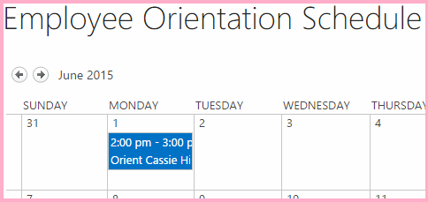

# Erstellen einer benutzerdefinierten Menübandschaltfläche im Hostweb eines SharePoint-Add-InsCreate a custom ribbon button in the host web of a SharePoint Add-in
Erfahren Sie, wie Sie benutzerdefinierte Menübandschaltflächenbefehle zum Hostweb eines SharePoint-Add-Ins hinzufügen.Add custom ribbon button commands to the host web of a spappsing.
 

 **Hinweis** Der Name „Apps für SharePoint“ wird in „SharePoint-Add-Ins“ geändert. Während des Übergangszeitraums wird in der Dokumentation und der Benutzeroberfläche einiger SharePoint-Produkte und Visual Studio-Tools möglicherweise weiterhin der Begriff „Apps für SharePoint“ verwendet. Weitere Informationen finden Sie unter [Neuer Name für Office- und SharePoint-Apps](new-name-for-apps-for-sharepoint#bk_newname).The name "apps for SharePoint" is changing to "SharePoint Add-ins". During the transition, the documentation and the UI of some SharePoint products and Visual Studio tools might still use the term "apps for SharePoint". For details, see [New name for apps for Office and SharePoint](new-name-for-apps-for-sharepoint#bk_newname).
 

Dies ist der neunte in einer Reihe von Artikeln über die Grundlagen der Entwicklung von von SharePoint gehosteten SharePoint-Add-Ins. Machen Sie sich zunächst mit [SharePoint-Add-Ins](sharepoint-add-ins) und den vorherigen Artikeln in dieser Reihe vertraut:Add custom ribbon button commands to the host web of a SharePoint Add-in. This is the ninth in a series of articles about the basics of developing SharePoint-hosted SharePoint Add-ins. You should first be familiar with  [SharePoint Add-ins](sharepoint-add-ins) and the previous articles in this series:
 

-  [Erste Schritte beim Erstellen von von SharePoint gehosteten SharePoint-Add-InsGet started creating SharePoint-hosted SharePoint Add-ins](get-started-creating-sharepoint-hosted-sharepoint-add-ins)
    
 
-  [Bereitstellung und Installation eines von SharePoint gehosteten SharePoint-Add-InsDeploy and install a SharePoint-hosted SharePoint Add-in](deploy-and-install-a-sharepoint-hosted-sharepoint-add-in)
    
 
-  [Hinzufügen von benutzerdefinierten Spalten zu einem von SharePoint gehosteten SharePoint-Add-InAdd custom columns to a SharePoint-hostedSharePoint Add-in](add-custom-columns-to-a-sharepoint-hostedsharepoint-add-in)
    
 
-  [Hinzufügen eines benutzerdefinierten Inhaltstyps zu einem von SharePoint gehosteten SharePoint-Add-InAdd a custom content type to a SharePoint-hostedSharePoint Add-in](add-a-custom-content-type-to-a-sharepoint-hostedsharepoint-add-in)
    
 
-  [Hinzufügen eines Webparts zu einer Seite in einem von SharePoint gehosteten SharePoint-Add-InAdd a Web Part to a page in a SharePoint-hosted SharePoint Add-in](add-a-web-part-to-a-page-in-a-sharepoint-hosted-sharepoint-add-in)
    
 
-  [Hinzufügen eines Workflows zu einem von SharePoint gehosteten SharePoint-Add-InAdd a workflow to a SharePoint-hosted SharePoint Add-in](add-a-workflow-to-a-sharepoint-hosted-sharepoint-add-in)
    
 
-  [Hinzufügen einer benutzerdefinierten Seite und Formatvorlage zu einem von SharePoint gehosteten SharePoint-Add-InAdd a custom page and style to a SharePoint-hosted SharePoint Add-in](add-a-custom-page-and-style-to-a-sharepoint-hosted-sharepoint-add-in)
    
 
-  [Hinzufügen des benutzerdefinierten clientseitigen Renderings für ein von SharePoint gehostetes SharePoint-Add-InAdd custom client-side rendering to a SharePoint-hosted SharePoint Add-in](add-custom-client-side-rendering-to-a-sharepoint-hosted-sharepoint-add-in)
    
 

 **Hinweis** Wenn Sie diese Reihe zu von SharePoint gehosteten Add-Ins durchgearbeitet haben, haben Sie eine Visual Studio-Projektmappe, die Sie verwenden können, um mit diesem Thema fortzufahren. Sie können außerdem das Repository unter [SharePoint_SP-Hosted_Add-Ins_Tutorials](https://github.com/OfficeDev/SharePoint_SP-hosted_Add-Ins_Tutorials) herunterladen und die Datei „BeforeRibbon.sln“ öffnen.**Note** If you have been working through this series about SharePoint-hosted add-ins, then you have a Visual Studio solution that you can use to continue with this topic. You can also download the repository at  [SharePoint_SP-hosted_Add-Ins_Tutorials](https://github.com/OfficeDev/SharePoint_SP-hosted_Add-Ins_Tutorials) and open the BeforeRibbon.sln file.
 

Alle SharePoint-Add-Ins können von der Seite **Websiteinhalte** des Hostwebs ausgeführt werden, indem Sie auf die Kachel des Add-Ins klicken. Die Funktionalität eines SharePoint-Add-Ins kann auch über benutzerdefinierte Aktionen im Hostweb zur Verfügung gestellt werden, die benutzerdefinierte Menübandschaltflächen oder benutzerdefinierte Menüelemente sind. In diesem Artikel fügen Sie eine Schaltfläche zum Menüband eines Hostwebs hinzu.All SharePoint Add-ins can be run from the **Site Contents** page of the host web by clicking the add-in's tile. The functionality of a SharePoint Add-in can also be exposed on the host web through custom actions, which are custom ribbon buttons or custom menu items. In this article you add a button to the ribbon on a host web.
 

## Vorbereiten des HostwebsPrepare the host web

Die Schaltfläche wird dem Menüband eines Kalenders im Hostweb hinzugefügt. Führen Sie die folgenden Schritte in der Benutzeroberfläche Ihrer SharePoint-Entwicklerwebsite aus.You will add the button to the ribbon of a calendar on the host web. Take the following steps in the UI of your SharePoint developer site.
 

 

1. Wählen Sie auf der Startseite der Website **Websiteinhalte** > **Add-In hinzufügen** > **Kalender** aus.From the home page of the site, choose **Site Contents** > **add and add-in** > **Calendar**.
    
 
2. Geben Sie im Dialogfeld **Kalender hinzufügen** „Planung für Orientierung für Mitarbeiter“ in das Feld **Name** ein, und wählen Sie dann **Erstellen** aus.On the **Adding Calendar** dialog, typeEmployee Orientation Schedule for the **Name**, and then choose **Create**.
    
 
3. Wenn der Kalender geöffnet wird, setzen Sie den Cursor auf ein beliebiges Datum, bis der Link **Hinzufügen** auf dem Datum angezeigt wird, und klicken Sie dann auf **Hinzufügen**.When the calendar opens, put the cursor on any date until the **Add** link appears on the date, and then click **Add**. 
    
 
4. Geben Sie im Dialogfeld **Planung für Orientierung für Mitarbeiter - neues Element** den Text „Orientierung Cassi Hicks“ in das Feld **Titel** ein. Behalten Sie für die anderen Felder die Standardwerte bei, und klicken Sie auf **Speichern**.On the **Employee Orientation Schedule - New Item** dialog, typeOrient Cassi Hicks for the **Title**. Leave the other fields at their defaults and click **Save**.
    
    Der Kalender sollte ähnlich wie im folgenden Beispiel aussehen:The calendar should look similar to the following:
    

    **Benutzerdefinierter Kalender****Custom calendar**

 

  
 

 

 

 

 

 **Wichtig** Im nächsten Verfahren muss der Kalender in der Benutzeroberfläche von Visual Studio sichtbar sein, was aber nicht der Fall sein wird, wenn Visual Studio geöffnet war, als Sie den Kalender erstellt haben. Bevor Sie fortfahren, schließen Sie Visual Studio, und melden Sie sich auch von allen Browserfenstern und PowerShell-Konsolen ab, mit denen Sie bei Ihrer Entwicklerwebsite angemeldet sind.**Important** The next procedure requires that the calendar be visible in the UI of Visual Studio, but it won't be if If Visual Studio was open when you created the calendar. Before you continue, close Visual Studio and also log out of any browser windows and PowerShell consoles where you are logged into your developer site.
 

## Hinzufügen einer benutzerdefinierten MenübandaktionAdd a ribbon custom action

1. Klicken Sie im **Projektmappen-Explorer** mit der rechten Maustaste auf das Projekt **EmployeeOrientation**, und wählen Sie **Hinzufügen** > **Neues Element** > **Office/SharePoint** > **Benutzerdefinierte Menübandaktion** aus. Nennen Sie sie „RunOrientationAdd-in“, und wählen Sie **Hinzufügen** aus.In **Solution Explorer**, right-click the **EmployeeOrientation** project, and choose **Add** > **New Item** > **Office/SharePoint** > **Ribbon Custom Action**. Name it RunOrientationAdd-in, and then choose **Add**.
    
 
2. Der Assistent **Benutzerdefinierte Aktion für das Menüband erstellen** stellt Ihnen eine Reihe von Fragen. Geben Sie die Antworten aus der folgenden Tabelle ein:The **Create Custom Action for Ribbon** wizard asks you a series of questions. Give the answers from the following table:
    

|**Frage zur Eigenschaft****Property question**|**Antwort****Answer**|
|:-----|:-----|
|Wo möchten Sie die benutzerdefinierte Aktion verfügbar machen?Where do you want to expose the custom action?|Wählen Sie **Hostweb**.Choose **Host Web**.|
|Wo gilt die benutzerdefinierte Aktion?Where is the custom action scoped to?|Wählen Sie **Listeninstanz** ( *nicht* Listenvorlage) aus.Choose **List Instance** ( *not*  List Template).|
|Für welches spezielle Element gilt die benutzerdefinierte Aktion?Which particular item is the custom action scoped to?|Wählen Sie **Planung für Orientierung für Mitarbeiter** aus.Choose **Employee Orientation Schedule**.|
|Wo befindet sich das Steuerelement?Where is the control located?|Verwenden Sie nicht die Dropdownauswahl. Geben Sie stattdessen **Ribbon.Calendar.Events.Actions.Controls._children** ein. (Der dritte Teil, **Events**, identifiziert die Registerkarte des Menübands, und der vierte Teil, **Actions**, die Schaltflächengruppe.) Do not use the drop down selections. Instead, type **Ribbon.Calendar.Events.Actions.Controls._children**. (The third part, **Events**, identifies the tab of the ribbon, and the fourth part, **Actions**, identifies the button group.)|
|Wie lautet der Text im Menüelement?What is the text on the menu item?|Geben Sie **Orientierung für Mitarbeiter** ein.Type **Employee Orientation**.|
|Wohin navigiert die benutzerdefinierte Aktion?Where does the custom action navigate to?|Verwenden Sie nicht die Dropdownauswahlen. Geben Sie stattdessen **~appWebUrl/Lists/NewEmployeesInSeattle** ein. Dies ist die Seite mit der Listenansicht für die Liste, die sich im Add-In-Web befindet, damit die Menübandschaltfläche im Hostweb eine Seite im Add-In-Web öffnet.Do not use the drop down selections. Instead, type **~appWebUrl/Lists/NewEmployeesInSeattle**. This is the list view page for the list, which is on the add-in web, so the ribbon button on the host web opens a page on the add-in web.|
3. Wählen Sie **Fertig stellen**.Choose **Finish**. 
    
 

## Überprüfen des Add-In-Web-FeaturesInspect the add-in web Feature

Erweitern Sie im **Projektmappen-Explorer** den Ordner **Features**, und wählen Sie das Feature **NewEmployeeOrientationComponents** aus. Der Feature-Designer wird geöffnet.In **Solution Explorer**, expand the **Features** folder and choose the **NewEmployeeOrientationComponents** feature. The Feature designer opens.
 

 
Beachten Sie, dass die benutzerdefinierte Aktion, die Sie erstellt haben, **RunOrientationAdd-in**, in **Elemente in der Lösung**, jedoch nicht in **Elemente im Feature** aufgelistet wird. Der Grund dafür ist, dass das Feature an das Add-In-Web, Ihre benutzerdefinierte Aktion aber an das Hostweb bereitgestellt wird. Wenn Sie das Add-In in Visual Studio zur Bereitstellung für die Produktion packen oder F5 in Visual Studio drücken, erstellen die Office Developer Tools für Visual Studio ein spezielles Hostwebfeature, fügen die benutzerdefinierte Aktion hinzu und stellen sie an das Hostweb bereit. Sie sollten das Hostwebfeature niemals bearbeiten. Darum wird es erst zum Zeitpunkt des Packens erstellt.Notice that the custom action that you created, **RunOrientationAdd-in**, is listed in **Items in the solution**, but not in **Items in the feature**. This is because the Feature is deployed to the add-in web, but your custom action is deployed to the host web. When you package the add-in in Visual Studio for deployment to production, or when you press F5 in Visual Studio, the Office Developer Tools for Visual Studio creates a special host web Feature, adds the custom action to it, and deploys it to the host web. You should never edit the host web Feature. That is why it is not created until packaging-time.
 

 

**Feature-Designer****Feature designer**

 

 

 

 

 

## Ausführen und Testen des Add-InsRun and test the add-in

 

 

1. Verwenden Sie die F5-TASTE, um Ihr Add-In bereitzustellen und auszuführen. Visual Studio führt eine temporäre Installation des Add-Ins auf Ihrer SharePoint-Testwebsite durch und führt das Add-In sofort aus.Use the F5 key to deploy and run your add-in. Visual Studio makes a temporary installation of the add-in on your test SharePoint site and immediately runs the add-in. 
    
 
2. Die Standardseite des SharePoint-Add-Ins wird geöffnet. Navigieren Sie zur Startseite Ihrer Entwicklerwebsite (die das Hostweb ist). In der linken oberen Ecke der Seite finden Sie einen Breadcrumblink dahin.The default page of the SharePoint Add-in opens. Navigate to the home page of your developer site (which is the host web). There is a breadcrumb link to it in the upper left of the page.
    
 
3. Wählen Sie auf der Startseite des Hostwebs **Websiteinhalte**, und klicken Sie auf der Seite **Websiteinhalte** auf den Kalender **Planung für Orientierung für Mitarbeiter**(nicht das Add-In **Orientierung für Mitarbeiter**).On the host web's home page, choose **Site Contents**, and on the **Site Contents** page, click the **Employee Orientation Schedule** calendar (not the **Employee Orientation** add-in).
    
 
4. Wenn der Kalender geöffnet wird, klicken Sie auf das Ereignis **Orientierung Cassie Hicks**. Wenn die Registerkarte **Ereignisse** im Menüband nicht automatisch geöffnet wird, öffnen Sie sie manuell. Sie sollte etwa wie folgt aussehen:When the calendar opens, click the event **Orient Cassie Hicks**. If the **Events** tab on the ribbon doesn't open automatically, open it. It should look similar to the following:
    
    **Menüband-Registerkarte „Ereignisse“ mit benutzerdefinierter Schaltfläche ****Events ribbon tab with custom button**

 

  
 

 

 
5. Klicken Sie in der Gruppe **Aktionen** im Menüband auf **Orientierung für Mitarbeiter**. Die Seite mit der Listenansicht für **Neue Mitarbeiter in Seattle** wird geöffnet.In the **Actions** group on the ribbon, click **Employee Orientation**. The list view page for **New Employees in Seattle** opens.
    
 
6. Schließen Sie zum Beenden der Debugsitzung das Browserfenster, oder beenden Sie das Debuggen in Visual Studio. Jedes Mal, wenn Sie F5 drücken, zieht Visual Studio die vorherige Version des Add-Ins zurück und installiert die neueste.To end the debugging session, close the browser window or stop debugging in Visual Studio. Each time that you press F5, Visual Studio will retract the previous version of the add-in and install the latest one.
    
 
7. Da Sie mit diesem Add-In und dieser Visual Studio-Projektmappe in anderen Artikeln arbeiten werden, hat es sich bewährt, das Add-In ein letztes Mal zurückzuziehen, wenn Sie Ihre Arbeit daran für eine Weile abgeschlossen haben. Klicken Sie mit der rechten Maustaste auf das Projekt im **Projektmappen-Explorer**, und wählen Sie **Zurückziehen** aus.You will work with this add-in and Visual Studio solution in other articles, and it's a good practice to retract the add-in one last time when you are done working with it for a while. Right-click the project in **Solution Explorer** and choose **Retract**.
    
 

## 

Im nächsten Artikel dieser Reihe fügen Sie JavaScript zum SharePoint-Add-In hinzu und greifen auf SharePoint-Daten mit dem JavaScript-Objektmodell von SharePoint zu:  [Verwenden von SharePoint-JavaScript-APIs zum Arbeiten mit SharePoint-Daten](use-the-sharepoint-javascript-apis-to-work-with-sharepoint-data).In the next article in this series, you'll add JavaScript to the SharePoint Add-in and access SharePoint data with SharePoint's JavaScript object model:  [Use the SharePoint JavaScript APIs to work with SharePoint data](use-the-sharepoint-javascript-apis-to-work-with-sharepoint-data).
 

 

