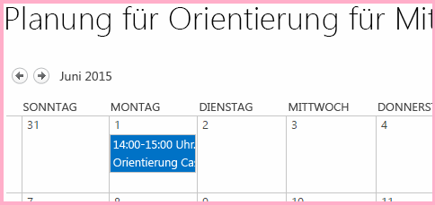

# Erstellen einer benutzerdefinierten Menüband-Schaltfläche im Hostweb eines SharePoint-Add-Ins

Dies ist der neunte einer Reihe von Artikeln über die Grundlagen der Entwicklung von von SharePoint gehosteten SharePoint-Add-Ins. Machen Sie sich zunächst mit [SharePoint-Add-Ins](sharepoint-add-ins.md) und den vorherigen Artikeln dieser Reihe vertraut, die Sie unter [Erste Schritte beim Erstellen von von SharePoint gehosteten SharePoint-Add-Ins](get-started-creating-sharepoint-hosted-sharepoint-add-ins.md#Nextsteps) finden. 
    
> [!NOTE]
> Wenn Sie unsere Artikelreihe zum Thema SharePoint-gehostete Add-Ins durchgearbeitet haben, haben Sie bereits eine Visual Studio-Lösung, die Sie für diesen Artikel verwenden können. Sie können auch das Repository unter [SharePoint_SP-hosted_Add-Ins_Tutorials](https://github.com/OfficeDev/SharePoint_SP-hosted_Add-Ins_Tutorials) herunterladen und die Datei „BeforeRibbon.sln“ öffnen.

Alle SharePoint-Add-Ins können von der Seite **Websiteinhalte** des Hostwebs ausgeführt werden, indem Sie auf die Kachel des Add-Ins klicken. Die Funktionalität eines SharePoint-Add-Ins kann auch über benutzerdefinierte Aktionen im Hostweb zur Verfügung gestellt werden, die benutzerdefinierte Menübandschaltflächen oder benutzerdefinierte Menüelemente sind. In diesem Artikel fügen Sie eine Schaltfläche zum Menüband eines Hostwebs hinzu.

## Vorbereiten des Hostwebs

Zum Hinzufügen der Schaltfläche zum Menüband eines Kalenders im Hostweb führen Sie die folgenden Schritte in der Benutzeroberfläche Ihrer SharePoint-Entwicklerwebsite aus.

1. Wählen Sie auf der Startseite der Website **Websiteinhalte** > **Add-In hinzufügen** > **Kalender** aus.

2. Geben Sie im Dialogfeld **Kalender hinzufügen** für **Name** den Wert **Planung für Orientierung für Mitarbeiter** ein, und wählen Sie dann **Erstellen** aus.

3. Wenn der Kalender geöffnet wird, setzen Sie den Cursor auf ein beliebiges Datum, bis der Link **Hinzufügen** auf dem Datum angezeigt wird, und wählen Sie dann **Hinzufügen** aus. 

4. Geben Sie im Dialogfeld **Planung für Orientierung für Mitarbeiter - neues Element** für **Titel** den Text **Orientierung Cassi Hicks** ein. Behalten Sie für die anderen Felder die Standardwerte bei, und wählen Sie dann **Speichern** aus.
    
   Der Kalender sollte ähnlich wie im folgenden Beispiel aussehen:

   *Abbildung 1. Benutzerdefinierter Kalender*

   

> [!IMPORTANT]
> Im nächsten Verfahren muss der Kalender in der Benutzeroberfläche von Visual Studio sichtbar sein, was aber nicht der Fall sein wird, wenn Visual Studio geöffnet war, als Sie den Kalender erstellt haben. Bevor Sie fortfahren, schließen Sie Visual Studio, und melden Sie sich auch von allen Browserfenstern und PowerShell-Konsolen ab, mit denen Sie bei Ihrer Entwicklerwebsite angemeldet sind.

## Hinzufügen einer benutzerdefinierten Menübandaktion

1. Klicken Sie im **Projektmappen-Explorer** mit der rechten Maustaste auf das Projekt **EmployeeOrientation**, und wählen Sie **Hinzufügen** > **Neues Element** > **Office/SharePoint** > **Benutzerdefinierte Menübandaktion** aus. Nennen Sie sie **RunOrientationAdd-in**, und wählen Sie dann **Hinzufügen** aus.

2. Der Assistent „Benutzerdefinierte Aktion für das Menüband erstellen“ stellt Ihnen eine Reihe von Fragen. Geben Sie die Antworten aus der folgenden Tabelle ein, und wählen Sie dann **Fertig stellen** aus. 

    |**Frage zur Eigenschaft**|**Antwort**|
    |:-----|:-----|
    |Wo möchten Sie die benutzerdefinierte Aktion verfügbar machen?|Wählen Sie **Hostweb** aus.|
    |Wo gilt die benutzerdefinierte Aktion?|Wählen Sie **Listeninstanz** (*nicht* Listenvorlage) aus.|
    |Für welches spezielle Element gilt die benutzerdefinierte Aktion?|Wählen Sie **Planung für Orientierung für Mitarbeiter** aus.|
    |Wo befindet sich das Steuerelement?|Verwenden Sie nicht die Dropdown-Auswahlmöglichkeiten. Geben Sie stattdessen `Ribbon.Calendar.Events.Actions.Controls._children` ein. (Der dritte Teil, **Events**, identifiziert die Registerkarte des Menübands und der vierte Teil, **Actions**, identifiziert die Schaltflächengruppe.)|
    |Wie lautet der Text im Menüelement?|Geben Sie **Orientierung für Mitarbeiter** ein.|
    |Wohin navigiert die benutzerdefinierte Aktion?|Verwenden Sie nicht die Dropdown-Auswahlmöglichkeiten. Geben Sie stattdessen `~appWebUrl/Lists/NewEmployeesInSeattle` ein. Dies ist die Listenansichtsseite für die Liste, die sich im Add-In-Web befindet, damit die Menübandschaltfläche im Hostweb eine Seite im Add-In-Web öffnet.|

## Überprüfen des Add-In-Web-Features

Erweitern Sie im **Projektmappen-Explorer** den Ordner **Features**, und wählen Sie das Feature **NewEmployeeOrientationComponents** aus. Der Feature-Designer wird geöffnet.

Beachten Sie, dass die benutzerdefinierte Aktion, die Sie erstellt haben, **RunOrientationAdd-in**, in **Elemente in der Lösung**, jedoch nicht in **Elemente im Feature** aufgelistet wird. Der Grund dafür ist, dass das Feature an das Add-In-Web, Ihre benutzerdefinierte Aktion aber an das Hostweb bereitgestellt wird. 

Wenn Sie das Add-In in Visual Studio zur Bereitstellung für die Produktion packen oder F5 in Visual Studio drücken, erstellen die Office Developer Tools für Visual Studio ein spezielles Hostwebfeature, fügen die benutzerdefinierte Aktion hinzu und stellen sie an das Hostweb bereit. Sie sollten das Hostwebfeature niemals bearbeiten. Darum wird es erst zum Zeitpunkt des Packens erstellt.

*Abbildung 2. Feature-Designer*

## Ausführen und Testen des Add-Ins

1. Verwenden Sie die F5-TASTE, um Ihr Add-In bereitzustellen und auszuführen. Visual Studio führt eine temporäre Installation des Add-Ins auf Ihrer SharePoint-Testwebsite durch und führt das Add-In sofort aus. 

2. Die Standardseite des SharePoint-Add-Ins wird geöffnet. Navigieren Sie zur Startseite Ihrer Entwicklerwebsite (die das Hostweb ist). In der linken oberen Ecke der Seite finden Sie einen Breadcrumblink dahin.

3. Wählen Sie auf der Startseite des Hostwebs **Websiteinhalte** aus, und wählen Sie auf der Seite **Websiteinhalte** den Kalender **Planung für Orientierung für Mitarbeiter** aus (nicht das Add-In **Orientierung für Mitarbeiter**).

4. Wenn der Kalender geöffnet wird, wählen Sie das Ereignis **Orientierung Cassie Hicks** aus. Wenn die Registerkarte **Ereignisse** im Menüband nicht automatisch geöffnet wird, öffnen Sie sie. Sie sollte ähnlich wie im folgenden Beispiel aussehen:
    
   *Abbildung 3. Menüband-Registerkarte „Ereignisse“ mit benutzerdefinierter Schaltfläche*

   

5. Wählen Sie in der Gruppe **Aktionen** im Menüband die Option **Orientierung für Mitarbeiter** aus. Die Listenansichtsseite für **Neue Mitarbeiter in Seattle** wird geöffnet.

6. Schließen Sie zum Beenden der Debugsitzung das Browserfenster, oder beenden Sie das Debuggen in Visual Studio. Jedes Mal, wenn Sie F5 drücken, zieht Visual Studio die vorherige Version des Add-Ins zurück und installiert die neueste.

7. Da Sie mit diesem Add-In und dieser Visual Studio-Lösung in anderen Artikeln arbeiten werden, hat es sich bewährt, das Add-In ein letztes Mal zurückzuziehen, wenn Sie Ihre Arbeit daran für eine Weile abgeschlossen haben. Klicken Sie im **Projektmappen-Explorer** mit der rechten Maustaste auf das Projekt, und wählen Sie die Option **Zurückziehen** aus.

## Nächste Schritte

Im nächsten Artikel dieser Reihe fügen Sie JavaScript zum SharePoint-Add-In hinzu und greifen auf SharePoint-Daten mit dem JavaScript-Objektmodell von SharePoint zu: [Verwenden von SharePoint-JavaScript-APIs zum Arbeiten mit SharePoint-Daten](use-the-sharepoint-javascript-apis-to-work-with-sharepoint-data.md).
 

 

