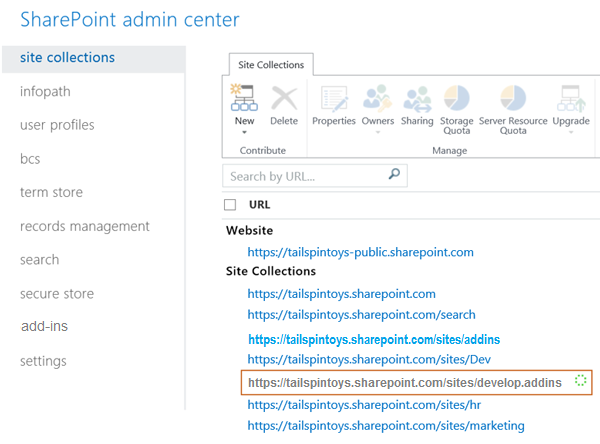

# Erstellen einer Entwicklerwebsite in einem vorhandenen Office 365-Abonnement
Eine Office 365-Entwicklerwebsite erleichtert Ihnen die Einrichtung und den Einstieg in das Erstellen, Testen und Bereitstellen Ihrer Office- und SharePoint-Add-Ins. Viele Office 365 Business-, Enterprise-, Education- und Government-Abonnements enthalten eine Websitevorlage, die Sie zum Erstellen einer Entwicklerwebsite verwenden können.
 

 **Hinweis** Der Name „Apps für SharePoint“ wird in „SharePoint-Add-Ins“ geändert. Während des Übergangszeitraums wird in der Dokumentation und der Benutzeroberfläche einiger SharePoint-Produkte und Visual Studio-Tools möglicherweise weiterhin der Begriff „Apps für SharePoint“ verwendet. Weitere Informationen finden Sie unter [Neuer Name für Office- und SharePoint-Apps](new-name-for-apps-for-sharepoint#bk_newname).
 

 **Bevor Sie beginnen**
 

-  **Stellen Sie sicher, dass Sie ein Office 365-Abonnement besitzen, das eine Entwicklerwebsite unterstützt.** Wenn Sie eins der folgenden Office 365 Abonnementpläne besitzen, können Sie in Ihrem vorhandenen Abonnement eine Website für Entwickler erstellen:
    
    - Office 365 Midsize Business
    
 
- Office 365 Enterprise E1, E3, E4, E5 oder K1
    
 
- Office 365 Education A2, A3 oder A4
    
 
- Office 365 Government G1, G3, G4 oder K1
    
 
-  **Wenn Sie ein Office 365 Small Business-Abonnement besitzen,** unterstützt es nur eine einzelne Websitesammlung, sie können damit also keine Entwickler-Websitesammlung erstellen. Weitere Informationen über Office 365-Pläne für Ihr Unternehmen finden Sie unter [SharePoint Online: Softwarelimits und -beschränkungen](http://office.microsoft.com/en-us/office365-sharepoint-online-enterprise-help/sharepoint-online-software-boundaries-and-limits-HA102694293.aspx).
    
 
- Weitere Informationen zu den Office 365 Enterprise-Angeboten finden Sie unter [Pläne &amp; Preise](http://products.office.com/en-us/business/office-365-enterprise-e1-business-software ).
    
 

## Erstellen einer Entwicklerwebsite

1. Melden Sie sich bei Office 365 als globaler oder SharePoint Online-Administrator an.
    
     **Sie müssen als globaler oder SharePoint Online-Administrator angemeldet sein, um neue Websitesammlungen** wie z. B. eine Website für Entwickler zu erstellen. Nur Administratoren werden nach dem Anmelden an Office 365 Administratoroptionen angezeigt. Wenn Sie kein Administrator sind, müssen Sie einen Administrator in Ihrem Unternehmen kontaktieren, der für Sie eine der folgenden Aufgaben ausführen muss:
    
      - Ihnen Administratorrechte gewähren, damit Sie die Entwicklerwebsite selbst erstellen können.
    
 
  - Die Website für Entwickler für Sie erstellen und Sie als Administrator für die Websitesammlung angeben.
    
 
2. Klicken Sie auf die Schaltfläche „App-Startfeld“ ganz links auf der Navigationsleiste am oberen Bildschirmrand.
    
 
3. Klicken Sie auf die Kachel **Admin**.
    
 
4. Erweitern Sie in der Navigationsstruktur links den Eintrag **Admin**, und wählen Sie **SharePoint** aus.
    
 
5. Klicken Sie im **SharePoint Admin Center** auf der Registerkarte **Websitesammlungen** auf **Neu > Private Websitesammlung**.
    
  
 

 

 
6. Geben Sie im Dialogfeld **Neue Websitesammlung** Informationen zu Ihrer Entwicklerwebsite an.
    
|**Feld**|**Wert**|
|:-----|:-----|
|**Titel**|Der Name, den Sie Ihrer Entwicklerwebsite geben möchten.|
|Liste **Öffentliche Websiteadresse**|Ein Domänenname und ein URL-Pfad – entweder **/sites/** oder **/teams/**; geben Sie dann einen URL-Namen für die Websitesammlung ein.|
|Liste **Sprache auswählen** im Abschnitt **Vorlagenauswahl**|Eine Primärsprache für Ihre Entwicklerwebsite. **Stellen Sie sicher, dass Sie die gewünschte Sprache für die Websitesammlung „Entwicklerwebsite“ auswählen, da diese nach der Auswahl nicht mehr geändert werden kann. **Das Auswählen einer Sprache für Ihre Entwicklerwebsite hat keine Auswirkungen auf die Sprachen, die Sie in Ihren Office- und SharePoint- Add-Ins verfügbar machen können. Sie können für Ihre Websites die mehrsprachige SharePoint-Oberfläche aktivieren, doch die Primärsprache der Websitesammlung wählen Sie hier aus.|
|Abschnitt **Vorlagenauswahl** auf der Registerkarte **Zusammenarbeit** unter **Vorlage auswählen**|Klicken Sie auf **Entwicklerwebsite**.|
|**Zeitzone**|Die zum Gebietsschema Ihrer Enwicklerwebsite gehörige Zeitzone.|
|**Administrator**|Der Benutzername des Websitesammlungsadministrators.|
|**Speicherkontingent**|Die Anzahl der Megabytes (MB), die Sie dieser Websitesammlung zuordnen möchten.|
|**Serverressourcenkontingent**|Die Menge an Ressourcen, die Sie der Websitesammlung zuordnen möchten. Dieser Wert ist eine Kombination von Leistungsmetriken (wie Prozessorzeit und unbehandelten Ausnahmen), die zu Code in Sandkastenlösungen gehören. Wenn der Wert ein Tageskontingent überschreitet, wird der Sandkasten für diese Websitesammlung deaktiviert.|
7. Klicken Sie auf **OK**.
    
    Die URL der neuen Entwicklerwebsite wird in der Liste **Websitesammlungen** angezeigt. Wenn die Erstellung der Website abgeschlossen ist, können Sie zur URL navigieren, um Ihre Entwicklerwebsite zu öffnen.
    
  
 

 

 

## Zusätzliche Ressourcen

-  [SharePoint-Add-Ins](sharepoint-add-ins)
    
 
-  [Erstellen oder Löschen einer Websitesammlung](http://office.microsoft.com/en-us/office365-sharepoint-online-enterprise-help/create-or-delete-a-site-collection-HA102772354.aspx?CTT=1)
    
 

