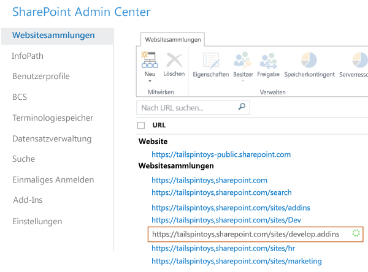

# Erstellen einer Entwicklerwebsite in einem vorhandenen Office 365-Abonnement

Eine Office 365-Entwicklerwebsite erleichtert Ihnen das Einrichten, Erstellen, Testen und Bereitstellen Ihrer Office- und SharePoint-Add-Ins. Viele Office 365 Business-, Enterprise-, Education- und Government-Abonnements beinhalten eine Websitevorlage, die Sie zum Erstellen einer Entwicklerwebsite verwenden können.

### Vor der Bereitstellung

**Stellen Sie sicher, dass Sie ein Office 365-Abonnement besitzen, das eine Entwicklerwebsite unterstützt.** Wenn Sie eins der folgenden Office 365 Abonnementpläne besitzen, können Sie in Ihrem vorhandenen Abonnement eine Website für Entwickler erstellen:
    
- Office 365 Midsize Business
- Office 365 Enterprise E1, E3, E4, E5 oder K1
- Office 365 Education A2, A3 oder A4
- Office 365 Government G1, G3, G4 oder K1

**Wenn Sie ein Office 365 Small Business-Abonnement besitzen**, wird nur eine einzelne Websitesammlung unterstützt, sodass Sie keine Entwicklerwebsitesammlung erstellen können. Wenn Sie weitere Informationen zu Office 365-Plänen für Ihr Unternehmen benötigen, lesen Sie bitte den Abschnitt [SharePoint Online: Softwarebeschränkungen und -grenzen](http://office.microsoft.com/de-DE/office365-sharepoint-online-enterprise-help/sharepoint-online-software-boundaries-and-limits-HA102694293.aspx).
    
Weitere Informationen zu den Office 365 Enterprise-Angeboten finden Sie unter [Pläne &amp; Preise](http://products.office.com/de-DE/business/office-365-enterprise-e1-business-software).

## Erstellen einer Entwicklerwebsite

1. Melden Sie sich bei Office 365 als globaler oder SharePoint Online-Administrator an.
    
   **Sie müssen als Global- oder SharePoint Online-Administrator angemeldet sein, um neue Websitesammlungen, wie** z.B. eine Entwicklerwebsite, zu erstellen. Nur Administratoren können bei der Anmeldung bei Office 365 Administratoroptionen anzeigen. Wenn Sie kein Administrator sind, wenden Sie sich an einen Administrator in Ihrem Unternehmen, damit dieser eine der folgenden Aktionen ausführt:
    
   - Ihnen Administratorrechte gewähren, damit Sie die Entwicklerwebsite selbst erstellen können.
   - Die Website für Entwickler für Sie erstellen und Sie als Administrator für die Websitesammlung angeben.

2. Wählen Sie die Schaltfläche „App-Startfeld“ ganz links auf der Navigationsleiste oben auf der Seite.

3. Wählen Sie die Kachel **Admin** aus. 

4. Erweitern Sie in der Navigationsstruktur links den Eintrag **Admin**, und wählen dann Sie **SharePoint** aus.

5. Klicken Sie im **SharePoint Admin Center** auf der Registerkarte **Websitesammlungen** auf **Neu** > **Private Websitesammlung**.
  
   *Abbildung 1. Option für neue Websitesammlung im SharePoint Admin Center*

   

6. Geben Sie im Dialogfeld **Neue Websitesammlung** Informationen zu Ihrer Entwicklerwebsite an.
    
   |**Field**|**Wert**|
   |:-----|:-----|
   |**Titel**|Der Name, den Sie Ihrer Entwicklerwebsite geben möchten.|
   |Liste **Öffentliche Websiteadresse**|Einen Domänennamen und einen URL-Pfad – entweder **/Sites/** oder **/teams/**, und geben Sie dann einen URL-Namen für die Websitesammlung ein.|
   |Liste **Sprache auswählen** im Abschnitt **Vorlagenauswahl**|Eine Primärsprache für Ihre Entwicklerwebsite. *Stellen Sie sicher, dass Sie die gewünschte Sprache für Ihre Entwicklerwebsite auswählen, da diese nach der Auswahl nicht mehr geändert werden kann.* Das Auswählen einer Sprache für Ihre Entwicklerwebsite hat keine Auswirkungen auf die Sprachen, die Sie in Ihren Add-Ins für Office und SharePoint verfügbar machen. Sie können für Ihre Websites die mehrsprachige SharePoint-Oberfläche aktivieren, doch die Primärsprache der Websitesammlung wählen Sie hier aus.|
   |Abschnitt **Vorlagenauswahl** auf der Registerkarte **Zusammenarbeit** unter **Vorlage auswählen**|Wählen Sie **Entwicklerwebsite** aus.|
   |**Zeitzone**|Die zum Gebietsschema Ihrer Enwicklerwebsite gehörige Zeitzone.|
   |**Administrator**|Der Benutzername des Websitesammlungsadministrators.|
   |**Speicherkontingent**|Die Anzahl der Megabytes (MB), die Sie dieser Websitesammlung zuordnen möchten.|
   |**Serverressourcenkontingent**|Die Größe der Ressourcen, die Sie der Websitesammlung zuordnen möchten. Dieser Wert ist eine Kombination von Leistungsmetriken (wie Prozessorzeit und unbehandelten Ausnahmen), die zu Code in Sandkastenlösungen gehören. Wenn der Wert ein Tageskontingent überschreitet, wird der Sandkasten für diese Websitesammlung deaktiviert.|

7. Wählen Sie **OK** aus. Die neue Entwicklerwebsite-URL finden Sie in der Liste **Websitesammlungen**. Wenn die Websiteerstellung abgeschlossen ist, können Sie auf die URL zugreifen, um Ihre Entwicklerwebsite zu öffnen
    
   *Abbildung 2. Bereitstellung der neuen Websitesammlung*

   
 
## Siehe auch

-  [SharePoint-Add-Ins](sharepoint-add-ins.md)
-  [Erstellen oder Löschen einer Websitesammlung](http://office.microsoft.com/en-us/office365-sharepoint-online-enterprise-help/create-or-delete-a-site-collection-HA102772354.aspx?CTT=1)
    
 

