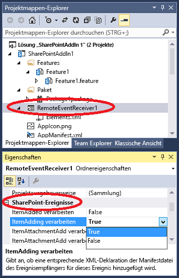

# <a name="create-a-remote-event-receiver-in-sharepoint-add-ins"></a><span data-ttu-id="a43cf-102">Erstellen eines Remoteereignisempfängers in Add-Ins für SharePoint</span><span class="sxs-lookup"><span data-stu-id="a43cf-102">Create a remote event receiver in SharePoint Add-ins</span></span>
<span data-ttu-id="a43cf-103">Erstellen Sie einen Remoteereignisempfängers (RER), der Listen- und Listenelementereignisse in einem SharePoint-Add-In verarbeitet.</span><span class="sxs-lookup"><span data-stu-id="a43cf-103">Create a remote event receiver (RER) that handles list and list item events in a SharePoint Add-in.</span></span>
 

 <span data-ttu-id="a43cf-p101">**Hinweis** Der Name „Apps für SharePoint“ wird in „SharePoint-Add-Ins“ geändert. Während des Übergangszeitraums wird in der Dokumentation und der Benutzeroberfläche einiger SharePoint-Produkte und Visual Studio-Tools möglicherweise weiterhin der Begriff „Apps für SharePoint“ verwendet. Weitere Informationen finden Sie unter [Neuer Name für Office- und SharePoint-Apps](new-name-for-apps-for-sharepoint.md#bk_newname).</span><span class="sxs-lookup"><span data-stu-id="a43cf-p101">**Note**  The name "apps for SharePoint" is changing to "SharePoint Add-ins". During the transition, the documentation and the UI of some SharePoint products and Visual Studio tools might still use the term "apps for SharePoint". For details, see  [New name for apps for Office and SharePoint](new-name-for-apps-for-sharepoint.md#bk_newname).</span></span>
 


## <a name="prerequisites"></a><span data-ttu-id="a43cf-107">Voraussetzungen</span><span class="sxs-lookup"><span data-stu-id="a43cf-107">Prerequisites</span></span>
<span data-ttu-id="a43cf-108"><a name="SP15appevent_prereq"> </a></span><span class="sxs-lookup"><span data-stu-id="a43cf-108"></span></span>

<span data-ttu-id="a43cf-p102">Sie sollten die Grundlagen vom Anbieter gehosteter SharePoint-Add-Ins verstehen und bereits ein paar entwickelt haben, die wenigstens geringfügig über die Komplexität von "Hello World" hinausgehen. Ferner sollten Sie mit dem  [Behandeln von Ereignissen in SharePoint-Add-Ins](handle-events-in-sharepoint-add-ins.md) vertraut sein.</span><span class="sxs-lookup"><span data-stu-id="a43cf-p102">It is helpful if you first have an understanding of provider-hosted SharePoint Add-ins, and for you to have developed a few that go a least a little beyond the "Hello World" level. Also, you should be familiar with  [Handle events in SharePoint Add-ins](handle-events-in-sharepoint-add-ins.md).</span></span> 
 

 

## <a name="create-a-remote-event-receiver"></a><span data-ttu-id="a43cf-111">Erstellen eines Remoteereignisempfängers</span><span class="sxs-lookup"><span data-stu-id="a43cf-111">Create a remote event receiver</span></span>
<span data-ttu-id="a43cf-112"><a name="MakeRER"> </a></span><span class="sxs-lookup"><span data-stu-id="a43cf-112"></span></span>

<span data-ttu-id="a43cf-p103">In diesem Artikel wird gezeigt, wie Sie eine SharePoint-Add-In durch Hinzufügen eines Remoteereignisempfängers (RER) erweitern, der das ItemAdded-Ereignis für eine benutzerdefinierte Liste im Add-In-Web verarbeitet. Der RER ist im Add-In-Web mit deklarativem Markup registriert. RERs werden programmgesteuert beim  *Hostweb*  registriert. Ein Codebeispiel dazu finden Sie unter [OfficeDev/PnP/Samples/Core.EventReceivers](https://github.com/OfficeDev/PnP/tree/master/Samples/Core.EventReceivers).</span><span class="sxs-lookup"><span data-stu-id="a43cf-p103">This article shows how you extend a SharePoint Add-in by adding a remote event receiver (RER) that handles the ItemAdded event for a custom list in the add-in web. The RER is registered with the add-in web using declarative markup. RERs are registered with the  *host web*  programmatically. For a code sample that does so, see [OfficeDev/PnP/Samples/Core.EventReceivers](https://github.com/OfficeDev/PnP/tree/master/Samples/Core.EventReceivers).</span></span>
 

 
<span data-ttu-id="a43cf-p104">Ein RER muss ein SOAP-Webdienst sein. Im fortlaufenden Beispiel wird dieser als WCF-Dienst (Windows Communication Foundation) implementiert. Es ist jedoch im Prinzip möglich, einen RER auf einem nicht von Microsoft stammenden Stapel zu implementieren.</span><span class="sxs-lookup"><span data-stu-id="a43cf-p104">An RER must be a SOAP web service. The continuing example implements this as a Windows Communication Foundation (WCF) service; but it is possible in principle to implement an RER on a non-Microsoft stack.</span></span>
 

 
<span data-ttu-id="a43cf-119">Um diesem Artikel zu folgen und den Code selbst einzugeben, laden Sie das Beispiel von der Website  [SharePoint-Add-in-CSOM-BasicDataOperations](https://github.com/OfficeDev/SharePoint-Add-in-CSOM-BasicDataOperations) herunter, und öffnen Sie das Beispiel anschließend in Visual Studio.</span><span class="sxs-lookup"><span data-stu-id="a43cf-119">To follow along with this article and enter the code yourself, download the sample from  [SharePoint-Add-in-CSOM-BasicDataOperations](https://github.com/OfficeDev/SharePoint-Add-in-CSOM-BasicDataOperations), and then open the sample in Visual Studio.</span></span>
 

 

 <span data-ttu-id="a43cf-p105">**Hinweis** Dieses Beispiel verwendet eine TokenHelper.cs-Datei, die mithilfe der Office Developer Tools für Visual Studio generiert wurde. Bei Erstellung des Beispiels war dies die aktuelle Version, aber wenn Sie diesen Artikel lesen, ist dies möglicherweise nicht die aktuellste Version. Das Beispiel ist weiterhin hervorragend für das Erstellen Ihres ersten RER geeignet. Aber wenn Sie bereit sind, darüber hinaus zu gehen, sollten Sie sich die Beispiele im Abschnitt „Nächste Schritte“ ansehen. Diese sind wahrscheinlich auf dem neuesten Stand.</span><span class="sxs-lookup"><span data-stu-id="a43cf-p105">**Note**  This sample use a TokenHelper.cs file that is generated by Office Developer Tools for Visual Studio. It was the current version when the sample was created, but may not be the most recent version when you read this. The sample is still great for creating your first RER. But when you are ready to move beyond that, you should look at the samples listed in the Next Steps section below. They are more likely to be kept up-to-date.</span></span>
 


### <a name="to-register-a-remote-event-receiver"></a><span data-ttu-id="a43cf-125">So registrieren Sie einen Remoteereignisempfänger</span><span class="sxs-lookup"><span data-stu-id="a43cf-125">To register a remote event receiver</span></span>


1. <span data-ttu-id="a43cf-126">Öffnen Sie das SharePoint-Add-In-Projekt in Visual Studio.</span><span class="sxs-lookup"><span data-stu-id="a43cf-126">Open the SharePoint Add-in project in Visual Studio.</span></span> 
    
 
2.  <span data-ttu-id="a43cf-127">Wählen Sie im **Projektmappen-Explorer** den Knoten des Add-In-Projekts aus.</span><span class="sxs-lookup"><span data-stu-id="a43cf-127">In **Solution Explorer**, choose the add-in project's node.</span></span>
    
 
3. <span data-ttu-id="a43cf-128">Wählen Sie in der Menüleiste **Projekt**, **Neues Element hinzufügen** aus.</span><span class="sxs-lookup"><span data-stu-id="a43cf-128">On the menu bar, choose  **Project**,  **Add New Item**.</span></span>
    
 
4. <span data-ttu-id="a43cf-129">Wählen Sie im Bereich **Installierte Vorlagen** den Knoten **Office/SharePoint** aus.</span><span class="sxs-lookup"><span data-stu-id="a43cf-129">In the  **Installed Templates** pane, choose the **Office/ SharePoint** node.</span></span>
    
 
5. <span data-ttu-id="a43cf-130">Wählen Sie im Bereich **Vorlagen** die Vorlage **Remoteereignisempfänger** aus.</span><span class="sxs-lookup"><span data-stu-id="a43cf-130">In the  **Templates** pane, choose the **Remote Event Receiver** template.</span></span>
    
 
6. <span data-ttu-id="a43cf-131">Lassen Sie den Standardnamen im Feld **Name** unverändert (RemoteEventReceiver1), und wählen Sie dann **Hinzufügen** aus.</span><span class="sxs-lookup"><span data-stu-id="a43cf-131">In the  **Name** box, keep the default name (RemoteEventReceiver1), and then choose the  **Add** button.</span></span>
    
 
7. <span data-ttu-id="a43cf-132">Wählen Sie in der Liste **Welchen Typ soll der Ereignisempfänger aufweisen?** die Option **Listenelementereignisse** aus.</span><span class="sxs-lookup"><span data-stu-id="a43cf-132">In the  **What type of event receiver do you want?** list, choose **List Item Events**.</span></span>
    
 
8. <span data-ttu-id="a43cf-133">Wählen Sie in der Liste **Welches Element soll als Ereignisquelle dienen?** die Option **Benutzerdefinierte Liste** aus.</span><span class="sxs-lookup"><span data-stu-id="a43cf-133">In the  **What item should be the event source?** list, choose **Custom List**.</span></span>
    
    <span data-ttu-id="a43cf-p106">Im fortlaufenden Beispiel wird eine benutzerdefinierte generische Liste verwendet. Aber ein RER kann auch Ereignisse behandeln, die in SharePoint-Standardlisten auftreten, beispielsweise **Ankündigungen** oder **Kontakte**.</span><span class="sxs-lookup"><span data-stu-id="a43cf-p106">The continuing example uses a custom generic list. But an RER can also handle events that occur in standard SharePoint lists, such as  **Announcements** or **Contacts**.</span></span>
    
 
9. <span data-ttu-id="a43cf-136">Wählen Sie in der Liste **Die folgenden Ereignisse behandeln** die Option **Ein Element wird hinzugefügt** aus, und klicken Sie anschließend auf **Fertig stellen**.</span><span class="sxs-lookup"><span data-stu-id="a43cf-136">In the  **Handle the following events** list, choose **An item is being added**, and then choose the  **Finish** button.</span></span>
    
    <span data-ttu-id="a43cf-p107">Der Webanwendung wird ein Webdienst zur Behandlung des von Ihnen angegebenen Remoteereignisses hinzugefügt. Der SharePoint-Add-In wird ein Remoteereignisempfänger hinzugefügt, und auf das Listenelementereignis wird in der Datei "Elements.xml" des Empfängers verwiesen, die wiederum im Add-In-Web-Feature enthalten ist.</span><span class="sxs-lookup"><span data-stu-id="a43cf-p107">A web service is added to the web application to handle the remote event that you specified. A remote event receiver is added to the SharePoint Add-in and the list item event is referenced in the receiver's Elements.xml file that is itself contained in the add-in web Feature.</span></span>
    
 

### <a name="to-create-the-list"></a><span data-ttu-id="a43cf-139">So erstellen Sie die Liste</span><span class="sxs-lookup"><span data-stu-id="a43cf-139">To create the list</span></span>


1. <span data-ttu-id="a43cf-140">Wählen Sie im **Projektmappen-Explorer** den Knoten des Add-In-Projekts aus.</span><span class="sxs-lookup"><span data-stu-id="a43cf-140">In  **Solution Explorer** select the add-in project's node.</span></span>
    
 
2. <span data-ttu-id="a43cf-141">Wählen Sie in der Menüleiste **Projekt**, **Neues Element hinzufügen** aus.</span><span class="sxs-lookup"><span data-stu-id="a43cf-141">On the menu bar, choose  **Project**,  **Add New Item**.</span></span>
    
 
3. <span data-ttu-id="a43cf-142">Wählen Sie im Bereich **Installierte Vorlagen** den Knoten **Office/SharePoint** aus.</span><span class="sxs-lookup"><span data-stu-id="a43cf-142">In the  **Installed Templates** pane, choose the **Office SharePoint** node.</span></span>
    
 
4. <span data-ttu-id="a43cf-143">Wählen Sie im Bereich **Vorlagen** die Vorlage **Liste** aus.</span><span class="sxs-lookup"><span data-stu-id="a43cf-143">In the  **Templates** pane, choose the **List** template.</span></span>
    
 
5. <span data-ttu-id="a43cf-144">Lassen Sie den Standardnamen im Feld **Name** unverändert (List1), und wählen Sie dann **Hinzufügen** aus.</span><span class="sxs-lookup"><span data-stu-id="a43cf-144">In the  **Name** box, leave the default name (List1), and then choose the  **Add** button.</span></span>
    
 
6. <span data-ttu-id="a43cf-145">Aktivieren Sie das Optionsfeld **Listeninstanz basierend auf einer bestehenden Listenvorlage erstellen**, wählen Sie in der Liste **Benutzerdefinierte Liste** aus, und klicken Sie auf **Fertig stellen**.</span><span class="sxs-lookup"><span data-stu-id="a43cf-145">Choose the  **Create a list instance based on an existing list template** option button, choose **Custom List** in the list, and then choose the **Finish** button.</span></span>
    
 

### <a name="to-add-functionality-to-the-remote-event-receiver"></a><span data-ttu-id="a43cf-146">So fügen Sie dem Remoteereignisempfänger Funktionen hinzu</span><span class="sxs-lookup"><span data-stu-id="a43cf-146">To add functionality to the remote event receiver</span></span>


1. <span data-ttu-id="a43cf-p108">Wenn sich die SharePoint-Testfarm nicht auf dem Computer mit Visual Studio befindet (oder Sie einen SharePoint Online-Mandanten als SharePoint-Testwebsite verwenden), konfigurieren Sie das Projekt für das Debuggen mit dem Microsoft Azure Service Bus. Weitere Informationen finden Sie unter  [Debugging und Problembehandlung eines Remoteereignisempfängers in einem Add-In für SharePoint](debug-and-troubleshoot-a-remote-event-receiver-in-a-sharepoint-add-in.md).</span><span class="sxs-lookup"><span data-stu-id="a43cf-p108">If your test SharePoint farm is not on the same computer that is running Visual Studio, (or you are using an SharePoint Online tenancy as your test SharePoint site), configure the project for debugging using the Microsoft Azure Service Bus. For more information, see the  [Debug and troubleshoot a remote event receiver in a SharePoint Add-in](debug-and-troubleshoot-a-remote-event-receiver-in-a-sharepoint-add-in.md).</span></span> 
    
 
2. <span data-ttu-id="a43cf-149">Ersetzen Sie den Inhalt der Codedatei für den Dienst des Remoteereignisempfängers (d. h. RemoteEventReceiver1.svc.cs) durch den folgenden Code.</span><span class="sxs-lookup"><span data-stu-id="a43cf-149">In the code file for the service of the remote event receiver (that is, RemoteEventReceiver1.svc.cs), replace the contents with the following code.</span></span>
    
    <span data-ttu-id="a43cf-150">Dieser Code führt die folgenden Aufgaben aus.</span><span class="sxs-lookup"><span data-stu-id="a43cf-150">This code performs the following tasks.</span></span>
    
      - <span data-ttu-id="a43cf-151">Er ruft einen gültigen Clientkontextobjekt ab. </span><span class="sxs-lookup"><span data-stu-id="a43cf-151">Gets a valid client context object.</span></span> 
    
 
  - <span data-ttu-id="a43cf-152">Wenn nicht bereits eine Liste mit dem Namen **EventLog** vorhanden ist, erstellt er eine für die Namen der auftretenden Remoteereignisse.</span><span class="sxs-lookup"><span data-stu-id="a43cf-152">If a list that's named  **EventLog** doesn't already exist, creates one to contain the names of the remote events that occur.</span></span>
    
 
  - <span data-ttu-id="a43cf-153">Er fügt der Liste einen Eintrag für das Ereignis hinzu, einschließlich Uhrzeit- und Datumsstempel.</span><span class="sxs-lookup"><span data-stu-id="a43cf-153">Adds an entry to the list for the event, including a time and date stamp.</span></span>
    
 

     <span data-ttu-id="a43cf-p109">**Hinweis** Zu dem Zeitpunkt, zu dem dieser Artikel geschrieben wurde, wurden von den Office Developer Tools für Visual Studio beim Erstellen des Empfängers Verweise auf alle benötigten Assemblys hinzugefügt. In höheren Versionen der Tools ist dies möglicherweise nicht der Fall. Wenn Compilerfehler auftreten, fügen Sie einfach die fehlenden Verweise hinzu. Möglicherweise müssen Sie Verweise auf „System.ServiceModel“ oder „System.ComponentModel.DataAnnotations“ hinzufügen.</span><span class="sxs-lookup"><span data-stu-id="a43cf-p109">**Note**  At the time this article was written the Office Developer Tools for Visual Studio add references to all the needed assemblies when the receiver is created, but later versions of the tools may not. If you get compiler errors, simply add the missing references; for example, you may need to add references to System.ServiceModel or System.ComponentModel.DataAnnotations.</span></span>


```C#
  using System;
using System.Collections.Generic;
using System.Linq;
using System.Net;
using System.Text;
using Microsoft.SharePoint.Client;
using Microsoft.SharePoint.Client.EventReceivers;
using System.Runtime.Serialization;
using System.ServiceModel;
using System.ServiceModel.Channels;


namespace BasicDataOperationsWeb.Services
{
    public class RemoteEventReceiver1 : IRemoteEventService
    {
        public SPRemoteEventResult ProcessEvent(SPRemoteEventProperties properties)
        {
            // When a "before" event occurs (such as ItemAdding), call the event 
            // receiver code.
            ListRemoteEventReceiver(properties);
            return new SPRemoteEventResult();
        }

        public void ProcessOneWayEvent(SPRemoteEventProperties properties)
        {
            // When an "after" event occurs (such as ItemAdded), call the event 
            // receiver code.            
        }

        public static void ListRemoteEventReceiver(SPRemoteEventProperties properties)
        {
            string logListTitle = "EventLog";

            // Return if the event is from the EventLog list itself. Otherwise, it may go into
            // an infinite loop.
            if (string.Equals(properties.ItemEventProperties.ListTitle, logListTitle, 
                  StringComparison.OrdinalIgnoreCase))
                return;

            // Get the token from the request header.
            HttpRequestMessageProperty requestProperty = 
                  (HttpRequestMessageProperty)OperationContext
                   .Current.IncomingMessageProperties[HttpRequestMessageProperty.Name];
            string contextTokenString = requestProperty.Headers["X-SP-ContextToken"];

            // If there is a valid token, continue.
            if (contextTokenString != null)
            {
                SharePointContextToken contextToken =
                    TokenHelper.ReadAndValidateContextToken(contextTokenString, 
                         requestProperty.Headers[HttpRequestHeader.Host]);

                Uri sharepointUrl = new Uri(properties.ItemEventProperties.WebUrl);
                string accessToken = TokenHelper.GetAccessToken(contextToken, 
                                                      sharepointUrl.Authority).AccessToken;
                bool exists = false;

                // Retrieve the log list "EventLog" and add the name of the event that occurred
                // to it with a date/time stamp.
                using (ClientContext clientContext = 
                     TokenHelper.GetClientContextWithAccessToken(sharepointUrl.ToString(), 
                                                                                                         accessToken))
                {
                    clientContext.Load(clientContext.Web);
                    clientContext.ExecuteQuery();
                    List logList = clientContext.Web.Lists.GetByTitle(logListTitle);

                    try
                    {
                        clientContext.Load(logList);
                        clientContext.ExecuteQuery();
                        exists = true;
                    }

                    catch (Microsoft.SharePoint.Client.ServerUnauthorizedAccessException)
                    {
                        // If the user doesn't have permissions to access the server that's 
                        // running SharePoint, return.
                        return;
                    }

                    catch (Microsoft.SharePoint.Client.ServerException)
                    {
                        // If an error occurs on the server that's running SharePoint, return.
                        exists = false;
                    }

                    // Create a log list called "EventLog" if it doesn't already exist.
                    if (!exists)
                    {
                        ListCreationInformation listInfo = new ListCreationInformation();
                        listInfo.Title = logListTitle;
                        // Create a generic custom list.
                        listInfo.TemplateType = 100;
                        clientContext.Web.Lists.Add(listInfo);
                        clientContext.Web.Context.ExecuteQuery();
                    }

                    // Add the event entry to the EventLog list.
                    string itemTitle = "Event: " + properties.EventType.ToString() + 
                          " occurred on: " + 
                          DateTime.Now.ToString(" yyyy/MM/dd/HH:mm:ss:fffffff");
                    ListCollection lists = clientContext.Web.Lists;
                    List selectedList = lists.GetByTitle(logListTitle);
                    clientContext.Load<ListCollection>(lists);
                    clientContext.Load<List>(selectedList);
                    ListItemCreationInformation listItemCreationInfo = 
                          new ListItemCreationInformation();
                    var listItem = selectedList.AddItem(listItemCreationInfo);
                    listItem["Title"] = itemTitle;
                    listItem.Update();
                    clientContext.ExecuteQuery();
                }
            }
        }
    }
}
```

3. <span data-ttu-id="a43cf-156">Ändern Sie in „Home.aspx.cs“ alle Instanzen von `SPHostUrl` in `SPAppWebUrl`.</span><span class="sxs-lookup"><span data-stu-id="a43cf-156">In Home.aspx.cs, change all instances of  `SPHostUrl` to `SPAppWebUrl`.</span></span>
    
    <span data-ttu-id="a43cf-157">Beispielsweise sollte `sharepointUrl = new Uri(Request.QueryString["SPHostUrl"]);` in `sharepointUrl = new Uri(Request.QueryString["SPAppWebUrl"]);` geändert werden.</span><span class="sxs-lookup"><span data-stu-id="a43cf-157">For example,  `sharepointUrl = new Uri(Request.QueryString["SPHostUrl"]);` should be changed to `sharepointUrl = new Uri(Request.QueryString["SPAppWebUrl"]);`.</span></span> 
    
 

## <a name="run-and-test-the-event-handler"></a><span data-ttu-id="a43cf-158">Ausführen und Testen des Ereignishandlers</span><span class="sxs-lookup"><span data-stu-id="a43cf-158">Run and test the event handler</span></span>
<span data-ttu-id="a43cf-159"><a name="RunAndTest"> </a></span><span class="sxs-lookup"><span data-stu-id="a43cf-159"></span></span>

<span data-ttu-id="a43cf-160">Testen Sie den Handler mit dem folgenden Verfahren.</span><span class="sxs-lookup"><span data-stu-id="a43cf-160">Test your handler with the following procedure.</span></span>
 

 

1. <span data-ttu-id="a43cf-161">Drücken Sie **F5**, um das Projekt auszuführen.</span><span class="sxs-lookup"><span data-stu-id="a43cf-161">Press  **F5** key to run the project.</span></span>
    
 
2. <span data-ttu-id="a43cf-162">Vertrauen Sie dem Add-In, wenn Sie dazu aufgefordert werden.</span><span class="sxs-lookup"><span data-stu-id="a43cf-162">Trust the add-in when prompted to do so.</span></span>
    
    <span data-ttu-id="a43cf-163">Ihr SharePoint-Add-In wird ausgeführt, und eine Tabelle mit verfügbaren Listen wird angezeigt und enthält **List1**.</span><span class="sxs-lookup"><span data-stu-id="a43cf-163">Your SharePoint Add-in runs, and a table of available lists appears and includes  **List1**.</span></span>
    
 
3. <span data-ttu-id="a43cf-164">Wählen Sie die ID von **List1** aus.</span><span class="sxs-lookup"><span data-stu-id="a43cf-164">Choose the ID of  **List1**.</span></span>
    
    <span data-ttu-id="a43cf-165">Die ID wird in das Feld **Listenelemente abrufen** kopiert.</span><span class="sxs-lookup"><span data-stu-id="a43cf-165">That ID is copied to the  **Retrieve List Items** box.</span></span>
    
 
4. <span data-ttu-id="a43cf-166">Klicken Sie auf die Schaltfläche **Listenelemente abrufen**.</span><span class="sxs-lookup"><span data-stu-id="a43cf-166">Choose the  **Retrieve List Items** button.</span></span>
    
     <span data-ttu-id="a43cf-167">**List1** wird ohne Elemente angezeigt.</span><span class="sxs-lookup"><span data-stu-id="a43cf-167">**List1** appears with no items in it.</span></span>
    
 
5. <span data-ttu-id="a43cf-168">Geben Sie im Feld **Element hinzufügen** den Wert „Erstes Element“ ein, und klicken Sie anschließend auf **Element hinzufügen**.</span><span class="sxs-lookup"><span data-stu-id="a43cf-168">In the  **Add Item** box, specifyFirst Item, and then choose the  **Add Item** button.</span></span>
    
    <span data-ttu-id="a43cf-169">Ein Listeneintrag mit dem Namen **Erstes Element** wird der Liste **List1** hinzugefügt, was dazu führt, dass der Remoteereignisempfänger ausgelöst wird und einen Eintrag im Ereignisprotokoll („EventLog“) hinzufügt.</span><span class="sxs-lookup"><span data-stu-id="a43cf-169">A list item that's named  **First Item** is added to **List1**, which causes the remote event receiver to fire and add an entry to the EventLog list.</span></span>
    
 
6. <span data-ttu-id="a43cf-170">Klicken Sie auf die Schaltfläche **Liste aktualisieren**, um zur Tabelle mit den Listen zurückzukehren.</span><span class="sxs-lookup"><span data-stu-id="a43cf-170">Choose the  **Refresh Lists** button to return to the table of lists.</span></span>
    
    <span data-ttu-id="a43cf-171">In der Tabelle wird eine neue Liste mit dem Namen **EventLog** angezeigt.</span><span class="sxs-lookup"><span data-stu-id="a43cf-171">In the table, a new list that's named  **EventLog** appears.</span></span>
    
 
7. <span data-ttu-id="a43cf-172">Wählen Sie den GUID-Wert **ListID** für **EventLog** aus, und klicken Sie anschließend auf die Schaltfläche **Listenelemente abrufen**.</span><span class="sxs-lookup"><span data-stu-id="a43cf-172">Choose the  **ListID** GUID value for **EventLog**, and then choose the  **Retrieve List Items** button.</span></span>
    
    <span data-ttu-id="a43cf-173">Eine Tabelle für **EventLog** wird mit einem Eintrag für das Ereignis **Handle ItemAdding** angezeigt, das aufgetreten ist, als Sie das Element der Liste **List1** hinzugefügt haben.</span><span class="sxs-lookup"><span data-stu-id="a43cf-173">A table for  **EventLog** appears with an entry for the **Handle ItemAdding** event that occurred when you added the item to **List1**.</span></span>
    
 

## <a name="add-or-remove-event-handlers-using-visual-studio"></a><span data-ttu-id="a43cf-174">Hinzufügen oder Entfernen von Ereignishandlern mit Visual Studio</span><span class="sxs-lookup"><span data-stu-id="a43cf-174">Add or remove event handlers using Visual Studio</span></span>
<span data-ttu-id="a43cf-175"><a name="Handle"> </a></span><span class="sxs-lookup"><span data-stu-id="a43cf-175"></span></span>


1. <span data-ttu-id="a43cf-176">Wählen Sie im **Projektmappen-Explorer** den Projektknoten für den Remoteereignisempfänger aus.</span><span class="sxs-lookup"><span data-stu-id="a43cf-176">In  **Solution Explorer**, choose the project node for the remote event receiver.</span></span>
    
 
2. <span data-ttu-id="a43cf-177">Legen Sie im Bereich **Eigenschaften** die Eigenschaften von Ereignissen, die Sie behandeln möchten, auf **True** fest.</span><span class="sxs-lookup"><span data-stu-id="a43cf-177">In the  **Properties** pane, set the properties for the events that you want to handle to **True**.</span></span>
    
    <span data-ttu-id="a43cf-p110">Wenn Sie beispielsweise darauf reagieren möchten, wenn ein Benutzer ein Listenelement hinzufügt, legen Sie die Eigenschaft **Handle ItemAdding** auf **True** fest. Wenn Sie dieses Ereignis nicht behandeln möchten, legen Sie diese Eigenschaft auf **False** fest.</span><span class="sxs-lookup"><span data-stu-id="a43cf-p110">For example, if you want to respond whenever a user adds a list item, set the value of the  **Handle ItemAdding** property to **True**. If you don't want to handle that event, set the value of that property to  **False**.</span></span>
    

    <span data-ttu-id="a43cf-180">**Abbildung 1. SharePoint-Remoteereignisse in Visual Studio**</span><span class="sxs-lookup"><span data-stu-id="a43cf-180">**Figure 1. SharePoint remote events in Visual Studio**</span></span>

 

  
 

 

 
3. <span data-ttu-id="a43cf-182">Wenn Sie ein Ereignis hinzugefügt haben, dann fügen Sie den Ereignishandlercode so wie bei den vorherigen Ereignissen der Codedatei für den Webdienst hinzu.</span><span class="sxs-lookup"><span data-stu-id="a43cf-182">If you added an event, add the event-handling code to the code file for the web service as you did with previous events.</span></span>
    
    <span data-ttu-id="a43cf-p111">Zur Behandlung eines anderen Ereignistyps fügen Sie der SharePoint-Add-In einen weiteren Remoteereignisempfänger hinzu. Wenn ein Remoteereignisempfänger z. B. Listenelementereignisse behandelt, dann können sie ihm ein weiteres Listenelementereignis hinzufügen. Zur Behandlung von Listenereignissen müssen Sie jedoch einen weiteren Remoteereignisempfänger hinzufügen.</span><span class="sxs-lookup"><span data-stu-id="a43cf-p111">To handle a different type of event, add another remote event receiver to the SharePoint Add-in. For example, if a remote event receiver handles list item events, you can add another list item event to it. But you must add another remote event receiver if you want to handle list events.</span></span> 
    
 

## <a name="url-and-hosting-restrictions-for-production-remote-event-receivers"></a><span data-ttu-id="a43cf-186">URL- und Hostingeinschränkungen für Remoteereignisempfänger in der Produktion</span><span class="sxs-lookup"><span data-stu-id="a43cf-186">URL and hosting restrictions for production remote event receivers</span></span>
<span data-ttu-id="a43cf-187"><a name="Handle"> </a></span><span class="sxs-lookup"><span data-stu-id="a43cf-187"></span></span>

<span data-ttu-id="a43cf-p112">Der Remoteereignisempfänger kann in der Cloud oder auf einem lokalen Server gehostet werden, der nicht auch als SharePoint-Server verwendet wird. Die URL eines Produktionsempfängers kann keinen bestimmten Port angeben. Dies bedeutet, dass Sie entweder Port 443 für HTTPS (Empfehlung) oder Port 80 für HTTP verwenden müssen. Wenn Sie HTTPS verwenden und der Empfängerdienst lokal gehostet wird, das Add-In sich jedoch auf Microsoft SharePoint Online befindet, muss der Hostserver über ein öffentlich vertrauenswürdiges Zertifikat von einer Zertifizierungsstelle verfügen. (Ein selbst signiertes Zertifikat funktioniert nur, wenn sich das Add-In in einer lokalen SharePoint-Farm befindet.)</span><span class="sxs-lookup"><span data-stu-id="a43cf-p112">The remote event receiver can be hosted in the cloud or in an on-premise server that is not also being used as a SharePoint server. The URL of a production receiver cannot specify a particular port. This means that you must use either port 443 for HTTPS, which we recommend, or port 80 for HTTP. If you are using HTTPS and the receiver service is hosted on-premise, but the add-in is on Microsoft SharePoint Online, then the hosting server must have a publically trusted certificate from a certificate authority. (A self-signed certificate works only if the add-in is in an on-premise SharePoint farm.)</span></span>
 

 

## <a name="next-steps"></a><span data-ttu-id="a43cf-193">Nächste Schritte</span><span class="sxs-lookup"><span data-stu-id="a43cf-193">Next Steps</span></span>
<span data-ttu-id="a43cf-194"><a name="Handle"> </a></span><span class="sxs-lookup"><span data-stu-id="a43cf-194"></span></span>

<span data-ttu-id="a43cf-195">Verwenden Sie die folgenden Codebeispiele, um Ihr Verständnis von RERs zu vertiefen:</span><span class="sxs-lookup"><span data-stu-id="a43cf-195">Use the following code samples to improve your understanding of RERs:</span></span>
 

 

-  [<span data-ttu-id="a43cf-196">OfficeDev/PnP/Samples/Core.EventReceivers</span><span class="sxs-lookup"><span data-stu-id="a43cf-196">OfficeDev/PnP/Samples/Core.EventReceivers</span></span>](https://github.com/OfficeDev/PnP/tree/master/Samples/Core.EventReceivers)
    
 
-  [<span data-ttu-id="a43cf-197">OfficeDev/PnP/Samples/Provisioning.ReR</span><span class="sxs-lookup"><span data-stu-id="a43cf-197">OfficeDev/PnP/Samples/Provisioning.ReR</span></span>](
https://github.com/OfficeDev/PnP/tree/master/Samples/Provisioning.ReR)
    
 
-  [<span data-ttu-id="a43cf-198">OfficeDev/PnP/Scenarios/ECM.AutoTagging</span><span class="sxs-lookup"><span data-stu-id="a43cf-198">OfficeDev/PnP/Scenarios/ECM.AutoTagging</span></span>](https://github.com/OfficeDev/PnP/tree/master/Samples/ECM.AutoTagging)
    
 

## <a name="additional-resources"></a><span data-ttu-id="a43cf-199">Zusätzliche Ressourcen</span><span class="sxs-lookup"><span data-stu-id="a43cf-199">Additional resources</span></span>
<span data-ttu-id="a43cf-200"><a name="Additional"> </a></span><span class="sxs-lookup"><span data-stu-id="a43cf-200"></span></span>


-  [<span data-ttu-id="a43cf-201">Behandeln von Ereignissen in SharePoint-Add-Ins</span><span class="sxs-lookup"><span data-stu-id="a43cf-201">Handle events in SharePoint Add-ins</span></span>](handle-events-in-sharepoint-add-ins.md)
    
 
-  [<span data-ttu-id="a43cf-202">Debugging und Problembehandlung eines Remoteereignisempfängers in einem SharePoint-Add-In</span><span class="sxs-lookup"><span data-stu-id="a43cf-202">Debug and troubleshoot a remote event receiver in a SharePoint Add-in</span></span>](debug-and-troubleshoot-a-remote-event-receiver-in-a-sharepoint-add-in.md)
    
 
-  [<span data-ttu-id="a43cf-203">FAQ für Remoteereignisempfänger</span><span class="sxs-lookup"><span data-stu-id="a43cf-203">Remote Event Receivers FAQ</span></span>](handle-events-in-sharepoint-add-ins.md#RERFAQ)
    
 

