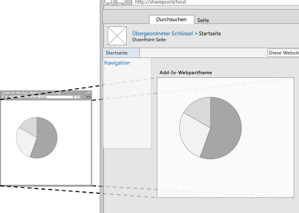
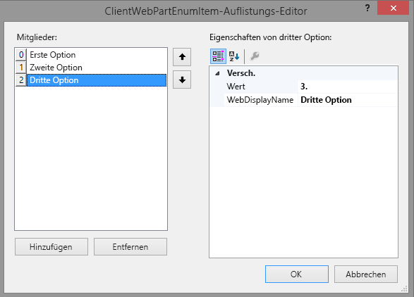

# <a name="create-add-in-parts-to-install-with-your-sharepoint-add-in"></a><span data-ttu-id="b40dd-102">Erstellen von Add-In-Webparts zur Installation mit Ihrem SharePoint-Add-In</span><span class="sxs-lookup"><span data-stu-id="b40dd-102">Create add-in parts to install with your SharePoint Add-in</span></span>
<span data-ttu-id="b40dd-103">In diesem Artikel erfahren Sie, wie Sie ein Add-In-Webpart in SharePoint erstellen, das im Webpartkatalog des Hostwebs verfügbar ist, wenn Sie das SharePoint-Add-In bereitstellen.</span><span class="sxs-lookup"><span data-stu-id="b40dd-103">Learn how to create an add-in part in SharePoint that is available in the Web Part gallery of the host web when you install your SharePoint Add-in.</span></span>
 

 <span data-ttu-id="b40dd-p101">**Hinweis** Der Name „Apps für SharePoint“ wird in „SharePoint-Add-Ins“ geändert. Während des Übergangszeitraums wird in der Dokumentation und der Benutzeroberfläche einiger SharePoint-Produkte und Visual Studio-Tools möglicherweise weiterhin der Begriff „Apps für SharePoint“ verwendet. Weitere Informationen finden Sie unter [Neuer Name für Office- und SharePoint-Apps](new-name-for-apps-for-sharepoint.md#bk_newname).</span><span class="sxs-lookup"><span data-stu-id="b40dd-p101">**Note**  The name "apps for SharePoint" is changing to "SharePoint Add-ins". During the transition, the documentation and the UI of some SharePoint products and Visual Studio tools might still use the term "apps for SharePoint". For details, see  [New name for apps for Office and SharePoint](new-name-for-apps-for-sharepoint.md#bk_newname).</span></span>
 

<span data-ttu-id="b40dd-p102">Mit Add-In-Webparts können Sie die Benutzererfahrung Ihres Add-Ins direkt auf den SharePoint-Websiteseiten anzeigen. Ein Add-In-Webpart zeigt die von Ihnen angegebene Webseite (normalerweise ein interaktives Formular oder eine dynamische Anzeige von Daten) mithilfe eines **IFrame** (der auch als Frame bezeichnet wird) auf einer Seite im [Hostweb](http://msdn.microsoft.com/library/fp179925.aspx) an. Weitere Informationen zu Add-In-Webparts finden Sie in den folgenden Artikeln:</span><span class="sxs-lookup"><span data-stu-id="b40dd-p102">With add-in parts, you can show your add-in user experience right in the SharePoint website pages. An add-in part displays the webpage (which is typically an interactive form or a dynamic display of data) that you specify by using an  **IFrame** (also referred to as a frame) in a page in the [host web](http://msdn.microsoft.com/library/fp179925.aspx). For more background about add-in parts, see the following articles:</span></span>
 

-  [<span data-ttu-id="b40dd-110">Zugreifen auf das Add-In über die Benutzeroberfläche</span><span class="sxs-lookup"><span data-stu-id="b40dd-110">Accessing the add-in from the UI</span></span>](important-aspects-of-the-sharepoint-add-in-architecture-and-development-landscap.md#AccessingApp)
    
 
-  [<span data-ttu-id="b40dd-111">UX-Design für SharePoint-Add-Ins</span><span class="sxs-lookup"><span data-stu-id="b40dd-111">UX design for SharePoint Add-ins</span></span>](ux-design-for-sharepoint-add-ins.md)
    
 
-  [<span data-ttu-id="b40dd-112">Erweitern der SharePoint-Benutzeroberfläche in Add-Ins</span><span class="sxs-lookup"><span data-stu-id="b40dd-112">Extending SharePoint UI in add-ins</span></span>](sharepoint-add-ins-ux-design-guidelines.md#UXGuide_Extending)
    
 
<span data-ttu-id="b40dd-113">In Abbildung 1 ist gezeigt, wie der Inhalt des Add-In-Webparts auf einer SharePoint-Seite angezeigt wird.</span><span class="sxs-lookup"><span data-stu-id="b40dd-113">Figure 1 shows how the add-in part content is displayed in a SharePoint page.</span></span>
 

<span data-ttu-id="b40dd-114">**Abbildung 1: Inhalt des Add-In-Webparts dargestellt auf einer SharePoint-Seite**</span><span class="sxs-lookup"><span data-stu-id="b40dd-114">**Figure 1. Add-in part content displayed in a SharePoint page**</span></span>

 

 

 
<span data-ttu-id="b40dd-p103">Ein Add-In-Webpart wird mit der Klasse **ClientWebPart** implementiert und steht wie alle Webparts im Add-In-Webpartkatalog zur Verfügung, wenn ein Benutzer das SharePoint Add-In installiert, in dem es enthalten ist. Ihre Benutzer können das Add-In-Webpart mit den von Ihnen bereitgestellten Eigenschaften weiter anpassen. (Ein Beispiel für konfigurierbare Eigenschaften in einem Add-In-Webpart finden Sie in Abbildung 2 unten.)</span><span class="sxs-lookup"><span data-stu-id="b40dd-p103">An add-in part is implemented with the  **ClientWebPart** class, and like all Web Parts it is a available in the Web Part gallery after a user installs the SharePoint Add-in that includes it. Your users can further customize the add-in part using the properties that you provide. (See figure 2 below for an example of configurable properties in an add-in part.)</span></span>
 
<span data-ttu-id="b40dd-p104">Das Beispiel in diesem Artikel verwendet eine nicht in SharePoint, sondern auf einem Remoteserver gehostete Webseite als Inhaltsseite. Bedenken Sie, dass Sie den Inhalt des Add-In-Webparts auch auf SharePoint-Seiten hosten können, wie im Abschnitt [Weitere gängige Szenarien mit Add-In-Webparts](#SP15Createappparts_Nextsteps) weiter unten in diesem Artikel beschrieben.</span><span class="sxs-lookup"><span data-stu-id="b40dd-p104">The example in this article uses a webpage that is hosted on a remote server, not on SharePoint, as the content page. Keep in mind that you can also use SharePoint pages to host the add-in part content, as described in the  [Other common scenarios add-in parts](#SP15Createappparts_Nextsteps) section later in this article.</span></span>
 

## <a name="prerequisites-for-using-the-example-in-this-article"></a><span data-ttu-id="b40dd-121">Voraussetzungen für die Verwendung des Beispiels in diesem Artikel</span><span class="sxs-lookup"><span data-stu-id="b40dd-121">Prerequisites for using the example in this article</span></span>
<span data-ttu-id="b40dd-122"><a name="SP15Createappparts_Prereq"> </a></span><span class="sxs-lookup"><span data-stu-id="b40dd-122"><a name="SP15Createappparts_Prereq"> </a></span></span>

<span data-ttu-id="b40dd-123">Um die Schritte in diesem Beispiel auszuführen, benötigen Sie Folgendes:</span><span class="sxs-lookup"><span data-stu-id="b40dd-123">To follow the steps in this example, you need the following:</span></span>
 

 

- <span data-ttu-id="b40dd-124">Visual Studio</span><span class="sxs-lookup"><span data-stu-id="b40dd-124">Visual Studio</span></span>
    
 
- <span data-ttu-id="b40dd-125">Microsoft Office Developer Tools für Visual Studio</span><span class="sxs-lookup"><span data-stu-id="b40dd-125">Microsoft Office Developer Tools for Visual Studio</span></span>
    
 
- <span data-ttu-id="b40dd-p105">Eine SharePoint-Entwicklungsumgebung. Wenn Sie Hilfe beim Einrichten einer Entwicklungsumgebung benötigen, finden Sie weitere Informationen unter [Erste Schritte beim Erstellen von von einem Anbieter gehosteten SharePoint-Add-Ins](get-started-creating-provider-hosted-sharepoint-add-ins.md).</span><span class="sxs-lookup"><span data-stu-id="b40dd-p105">A SharePoint development environment. If you need help setting up a development environment, see  [Get started creating provider-hosted SharePoint Add-ins](get-started-creating-provider-hosted-sharepoint-add-ins.md).</span></span>
    
 

 

 

## <a name="create-an-add-in-part-to-install-on-the-host-web"></a><span data-ttu-id="b40dd-128">Erstellen eines Add-In-Webparts zur Installation auf dem Hostweb</span><span class="sxs-lookup"><span data-stu-id="b40dd-128">Create an add-in part to install on the host web</span></span>
<span data-ttu-id="b40dd-129"><a name="SP15Createappparts_Codeexample"> </a></span><span class="sxs-lookup"><span data-stu-id="b40dd-129"><a name="SP15Createappparts_Codeexample"> </a></span></span>

<span data-ttu-id="b40dd-130">Es gibt mehrere Aufgaben, die erforderlich sind, um Ihr Add-In-Webpart zu erstellen und auf dem Hostweb zu installieren:</span><span class="sxs-lookup"><span data-stu-id="b40dd-130">There are several tasks required to create and install your add-in part to the host web:</span></span>
 

 

1. <span data-ttu-id="b40dd-131">Erstellen Sie die SharePoint-Add-In- und Remotewebprojekte.</span><span class="sxs-lookup"><span data-stu-id="b40dd-131">Create the SharePoint Add-in and remote web projects.</span></span>
    
 
2. <span data-ttu-id="b40dd-132">Hinzufügen eines Formulars für den Inhalt des Add-In-Webparts</span><span class="sxs-lookup"><span data-stu-id="b40dd-132">Add a form for the add-in part content.</span></span>
    
 
3. <span data-ttu-id="b40dd-133">Fügen Sie dem SharePoint-Add-In-Projekt das Add-In-Webpart hinzu.</span><span class="sxs-lookup"><span data-stu-id="b40dd-133">Add the add-in part to the SharePoint Add-in project.</span></span>
    
 
<span data-ttu-id="b40dd-p106">Wenn Sie die Aufgaben abgeschlossen haben, sollte Ihr Add-In-Webpart ähnlich aussehen wie in Abbildung 2, wenn es sich im Bearbeitungsmodus befindet. Hier zu sehen ist (1) der Add-In-Inhalt, der auf einer SharePoint-Seite dargestellt wird, und (2) die benutzerdefinierten Eigenschaften des Add-In-Webparts.</span><span class="sxs-lookup"><span data-stu-id="b40dd-p106">After completing the tasks, your add-in part should look similar to Figure 2 when the add-in part is in edit mode. Here we can see (1) the add-in content displayed in a SharePoint page, and (2) the add-in part custom properties.</span></span>
 

 

<span data-ttu-id="b40dd-136">**Abbildung 2: SharePoint-Seite als Host für ein Add-In-Basiswebpart**</span><span class="sxs-lookup"><span data-stu-id="b40dd-136">**Figure 2. SharePoint page hosting a basic add-in part**</span></span>

 

 

 

### <a name="add-a-form-for-the-add-in-part-content"></a><span data-ttu-id="b40dd-138">Hinzufügen eines Formulars für den Inhalt des Add-In-Webparts</span><span class="sxs-lookup"><span data-stu-id="b40dd-138">Add a form for the add-in part content</span></span>


1. <span data-ttu-id="b40dd-139">Erstellen Sie ein vom Anbieter gehostetes Add-In, wie unter [Erste Schritte beim Erstellen von von einem Anbieter gehosteten SharePoint-Add-Ins](get-started-creating-provider-hosted-sharepoint-add-ins.md) beschrieben, aber geben Sie dem Projekt den Namen TestAppPart.</span><span class="sxs-lookup"><span data-stu-id="b40dd-139">Create a provider-hosted SharePoint Add-in as described in  [Get started creating provider-hosted SharePoint Add-ins](get-started-creating-provider-hosted-sharepoint-add-ins.md), but name the project TestAppPart.</span></span>
    
 
2. <span data-ttu-id="b40dd-p107">Klicken Sie nach dem Erstellen der Visual Studio-Lösung mit der rechten Maustaste auf das Webanwendungsprojekt (nicht das SharePoint-Add-In-Projekt), und fügen Sie ein neues Webformular hinzu, indem Sie **Hinzufügen** > **Neues Element** > **Web** > **Webformular** auswählen. Geben Sie dem Formular den Namen „AppPartContent.aspx“.</span><span class="sxs-lookup"><span data-stu-id="b40dd-p107">After the Visual Studio solution has been created, right-click the web application project (not the SharePoint Add-in project) and add a new Web Form by choosing  **Add** > **New Item** > **Web** > **Web Form**. Name the form AppPartContent.aspx.</span></span>
    
 
3. <span data-ttu-id="b40dd-p108">Ersetzen Sie das gesamte HTML-Element und seine untergeordneten Elemente in der Datei AppPartContent.aspx durch den folgenden HTML-Code. Behalten Sie das gesamte Markup oberhalb des HTML-Elements wie vorhanden bei. Der HTML-Code enthält JavaScript, das die folgenden Aufgaben ausführt:</span><span class="sxs-lookup"><span data-stu-id="b40dd-p108">In the AppPartContent.aspx file, replace the entire html element and it's children with the following HTML code. Leave all the markup above the html element as it is. The HTML code contains JavaScript that performs the following tasks:</span></span>
    
      - <span data-ttu-id="b40dd-145">Extrahieren der Standardeigenschaftswerte aus der Abfragezeichenfolge</span><span class="sxs-lookup"><span data-stu-id="b40dd-145">Extracts the default property values from the query string</span></span>
    
 
  - <span data-ttu-id="b40dd-146">Rendern der Eigenschaftswerte</span><span class="sxs-lookup"><span data-stu-id="b40dd-146">Renders the property values</span></span>
    
 

    <span data-ttu-id="b40dd-p109">Beachten Sie, dass der Code einige Parameter in der Abfragezeichenfolge erwartet. Das Add-In-Webpart stellt seine benutzerdefinierten Eigenschaften durch die Abfragezeichenfolge bereit, sodass die Webseite sie nutzen kann. In der nächsten Aufgabe wird erklärt, wie Sie benutzerdefinierte Eigenschaften festlegen und diese für die Add-In-Webseite verfügbar machen.</span><span class="sxs-lookup"><span data-stu-id="b40dd-p109">Note that the code expects some parameters in the query string. The add-in part provides its custom properties through the query string so the webpage can use them. The next task explains how to declare custom properties and how to make them available to the add-in webpage.</span></span>
    


```HTML
  <html>
    <body>
        <div id="content">
            <!-- Placeholders for properties -->
            String property: <span id="strProp"></span><br />
            Integer property: <span id="intProp"></span><br />
            Boolean property: <span id="boolProp"></span><br />
            Enumeration property: <span id="enumProp"></span><br />
        </div>

    <!-- Main JavaScript function, controls the rendering
         logic based on the custom property values -->
    <script lang="javascript">
        "use strict";

        var params = document.URL.split("?")[1].split("&amp;");
        var strProp;
        var intProp;
        var boolProp;
        var enumProp;

        // Extracts the property values from the query string.
        for (var i = 0; i < params.length; i = i + 1) {
            var param = params[i].split("=");
            if (param[0] == "strProp")
                strProp = decodeURIComponent(param[1]);
            else if (param[0] == "intProp")
                intProp = parseInt(param[1]);
            else if (param[0] == "boolProp")
                boolProp = (param[1] == "true");
            else if (param[0] == "enumProp")
                enumProp = decodeURIComponent(param[1]);
        }

        document.getElementById("strProp").innerText = strProp;
        document.getElementById("intProp").innerText = intProp;
        document.getElementById("boolProp").innerText = boolProp;
        document.getElementById("enumProp").innerText = enumProp;
    </script>
    </body>
</html>
```

4. <span data-ttu-id="b40dd-150">Speichern und schließen Sie die Datei.</span><span class="sxs-lookup"><span data-stu-id="b40dd-150">Save and close the file.</span></span>
    
 

### <a name="add-the-add-in-part-to-the-sharepoint-add-in-project"></a><span data-ttu-id="b40dd-151">Hinzufügen des Add-In-Webparts zum SharePoint-Add-In-Projekt</span><span class="sxs-lookup"><span data-stu-id="b40dd-151">Add the add-in part to the SharePoint Add-in project</span></span>


1. <span data-ttu-id="b40dd-p110">Klicken Sie mit der rechten Maustaste auf das SharePoint-Add-In-Projekt (nicht das Webanwendungsprojekt), und wählen Sie dann **Hinzufügen** > **Neues Element** > **Office/SharePoint** > **Clientwebpart (Hostweb)** aus. („Clientwebpart“ ist eine andere Bezeichnung für „Add-In-Webpart“.)</span><span class="sxs-lookup"><span data-stu-id="b40dd-p110">Right-click the SharePoint Add-in project (not the web application project), and then choose  **Add** > **New Item** > **Office/SharePoint** > **Client Web Part (Host Web)**. ("Client Web Part" is another name for "add-in part".)</span></span>
    
 
2. <span data-ttu-id="b40dd-154">Geben Sie dem Webpart den Namen „Add-In-Basiswebpart“.</span><span class="sxs-lookup"><span data-stu-id="b40dd-154">Name the part Basic add-in part.</span></span>
    
 
3. <span data-ttu-id="b40dd-p111">Wählen Sie im Dialogfeld **Clientwebpart-Seite angeben** die Option **URL für eine vorhandene Webseite auswählen oder eingeben** aus. Wählen Sie in der Dropdownliste die Seite **TestAppWebPart/AppPartContent.aspx** aus. (Nachdem Sie Ihre Auswahl getroffen haben, wurde bei der Seiten-URL im Feld möglicherweise „TestAppWebPart“ durch **~remoteAppUrl** ersetzt und den Abfrageparametern **{StandardTokens }** hinzugefügt.)</span><span class="sxs-lookup"><span data-stu-id="b40dd-p111">In the  **Specify the client web part page** dialog box, choose **Select or enter a URL for an existing web page**. Choose the  **TestAppWebPart/AppPartContent.aspx** page in the drop-down list. (After you've made your choice, the page URL may appear in the box with "TestAppWebPart" replaced by **~remoteAppUrl** and with **{StandardTokens }** added for the query parameters.)</span></span>
    
 
4. <span data-ttu-id="b40dd-158">Wählen Sie **Fertig stellen**.</span><span class="sxs-lookup"><span data-stu-id="b40dd-158">Choose  **Finish**.</span></span>
    
 
5. <span data-ttu-id="b40dd-159">Klicken Sie im **Projektmappen-Explorer** mit der rechten Maustaste auf **Add-In-Basiswebpart**, und wählen Sie **Eigenschaften** aus.</span><span class="sxs-lookup"><span data-stu-id="b40dd-159">Right-click  **Basic add-in part** in **Solution Explorer**, and choose  **Properties**.</span></span>
    
 
6. <span data-ttu-id="b40dd-160">Wählen Sie im Bereich **Eigenschaften** die Option **Benutzerdefinierte Eigenschaften** aus, und klicken Sie dann auf die Popupschaltfläche ( **...**).</span><span class="sxs-lookup"><span data-stu-id="b40dd-160">In the  **Properties** pane, select **Custom properties** and choose the callout ( **...**) button.</span></span>
    
 
7. <span data-ttu-id="b40dd-p112">Verwenden Sie das Dialogfeld **Benutzerdefinierte Eigenschaften**, um dem Add-In-Webpart vier benutzerdefinierte Eigenschaften hinzuzufügen. Sie müssen für jede der vier benutzerdefinierten Eigenschaften fünf Attribute festlegen. Die Namen der Attribute und Werte sind in Tabelle 1 aufgeführt. Erstellen Sie die Eigenschaften mithilfe des folgenden Verfahrens.</span><span class="sxs-lookup"><span data-stu-id="b40dd-p112">Use the  **Custom Properties** dialog to add four custom properties to the add-in part. You have to set five attributes of each of the four custom properties. The attribute names and values are listed in Table 1. Create the properties using the following procedure.</span></span>
    
      1. <span data-ttu-id="b40dd-165">Wählen Sie **Hinzufügen** aus.</span><span class="sxs-lookup"><span data-stu-id="b40dd-165">Choose  **Add**.</span></span>
    
 
  2. <span data-ttu-id="b40dd-166">Wählen Sie in der Attributliste das erste Attribut aus Tabelle 1 aus: **DefaultValue**.</span><span class="sxs-lookup"><span data-stu-id="b40dd-166">In the attribute list, select the first attribute from Table 1:  **DefaultValue**.</span></span> 
    
 
  3. <span data-ttu-id="b40dd-167">Legen Sie den Wert fest, z. B. „Standardwert der Zeichenfolge“.</span><span class="sxs-lookup"><span data-stu-id="b40dd-167">Set the value, for example, String default value.</span></span>
    
 
  4. <span data-ttu-id="b40dd-168">Wählen Sie das nächste Attribut, **Name**, aus, und legen Sie seinen Wert fest, z. B. strProp.</span><span class="sxs-lookup"><span data-stu-id="b40dd-168">Select the next attribute,  **Name**, and set its value, for example, strProp.</span></span>
    
 
  5. <span data-ttu-id="b40dd-169">Fahren Sie mit den Attributen **Type**, **WebCategory** und **WebDisplayName** fort.</span><span class="sxs-lookup"><span data-stu-id="b40dd-169">Continue with the  **Type**,  **WebCategory**, and  **WebDisplayName** attributes.</span></span>
    
 
  6. <span data-ttu-id="b40dd-p113">Wählen Sie erneut **Hinzufügen** aus, und wiederholen Sie den Vorgang für alle vier Zeilen in Tabelle 1. Schließen Sie das Dialogfeld *nicht*.</span><span class="sxs-lookup"><span data-stu-id="b40dd-p113">Choose  **Add** again and repeat the process for all four rows of Table 1. Do *not*  close the dialog.</span></span>
    
    <span data-ttu-id="b40dd-172">**Tabelle 1: Attribute für die benutzerdefinierten Eigenschaften des Add-In-Webparts**</span><span class="sxs-lookup"><span data-stu-id="b40dd-172">**Table 1. Attributes for the add-in part's custom properties**</span></span>


|<span data-ttu-id="b40dd-173">**DefaultValue**</span><span class="sxs-lookup"><span data-stu-id="b40dd-173">**DefaultValue**</span></span>|<span data-ttu-id="b40dd-174">**Name**</span><span class="sxs-lookup"><span data-stu-id="b40dd-174">**Name**</span></span>|<span data-ttu-id="b40dd-175">**Type**</span><span class="sxs-lookup"><span data-stu-id="b40dd-175">**Type**</span></span>|<span data-ttu-id="b40dd-176">**WebCategory**</span><span class="sxs-lookup"><span data-stu-id="b40dd-176">**WebCategory**</span></span>|<span data-ttu-id="b40dd-177">**WebDisplayName**</span><span class="sxs-lookup"><span data-stu-id="b40dd-177">**WebDisplayName**</span></span>|
|:-----|:-----|:-----|:-----|:-----|
|<span data-ttu-id="b40dd-178">Standardwert für Zeichenfolge</span><span class="sxs-lookup"><span data-stu-id="b40dd-178">String default value</span></span>|<span data-ttu-id="b40dd-179">strProp</span><span class="sxs-lookup"><span data-stu-id="b40dd-179">strProp</span></span>|<span data-ttu-id="b40dd-180">string</span><span class="sxs-lookup"><span data-stu-id="b40dd-180">string</span></span>|<span data-ttu-id="b40dd-181">Kategorie Add-In-Basiswebpart</span><span class="sxs-lookup"><span data-stu-id="b40dd-181">Basic add-in part category</span></span>|<span data-ttu-id="b40dd-182">Eine Eigenschaft vom Typ "string"</span><span class="sxs-lookup"><span data-stu-id="b40dd-182">A property of type string</span></span>|
|<span data-ttu-id="b40dd-183">0</span><span class="sxs-lookup"><span data-stu-id="b40dd-183">0</span></span>|<span data-ttu-id="b40dd-184">intProp</span><span class="sxs-lookup"><span data-stu-id="b40dd-184">intProp</span></span>|<span data-ttu-id="b40dd-185">int</span><span class="sxs-lookup"><span data-stu-id="b40dd-185">int</span></span>|<span data-ttu-id="b40dd-186">Kategorie Add-In-Basiswebpart</span><span class="sxs-lookup"><span data-stu-id="b40dd-186">Basic add-in part category</span></span>|<span data-ttu-id="b40dd-187">Eine Eigenschaft vom Typ "integer"</span><span class="sxs-lookup"><span data-stu-id="b40dd-187">A property of type integer</span></span>|
|<span data-ttu-id="b40dd-188">false</span><span class="sxs-lookup"><span data-stu-id="b40dd-188">false</span></span>|<span data-ttu-id="b40dd-189">boolProp</span><span class="sxs-lookup"><span data-stu-id="b40dd-189">boolProp</span></span>|<span data-ttu-id="b40dd-190">boolean</span><span class="sxs-lookup"><span data-stu-id="b40dd-190">boolean</span></span>|<span data-ttu-id="b40dd-191">Kategorie Add-In-Basiswebpart</span><span class="sxs-lookup"><span data-stu-id="b40dd-191">Basic add-in part category</span></span>|<span data-ttu-id="b40dd-192">Eine Eigenschaft vom Typ "boolean"</span><span class="sxs-lookup"><span data-stu-id="b40dd-192">A property of type boolean</span></span>|
|<span data-ttu-id="b40dd-193">1st</span><span class="sxs-lookup"><span data-stu-id="b40dd-193">1st</span></span>|<span data-ttu-id="b40dd-194">enumProp</span><span class="sxs-lookup"><span data-stu-id="b40dd-194">enumProp</span></span>|<span data-ttu-id="b40dd-195">enum</span><span class="sxs-lookup"><span data-stu-id="b40dd-195">enum</span></span>|<span data-ttu-id="b40dd-196">Kategorie Add-In-Basiswebpart</span><span class="sxs-lookup"><span data-stu-id="b40dd-196">Basic add-in part category</span></span>|<span data-ttu-id="b40dd-197">Eine Eigenschaft vom Typ "enumeration"</span><span class="sxs-lookup"><span data-stu-id="b40dd-197">A property of type enumeration</span></span>|

 <span data-ttu-id="b40dd-198">An diesem Punkt sollte das Dialogfeld wie folgt aussehen:</span><span class="sxs-lookup"><span data-stu-id="b40dd-198">At this point the dialog should look like the following:</span></span>
    
 <span data-ttu-id="b40dd-199">**Dialogfeld „Benutzerdefinierte Eigenschaften“ für Clientwebpart**</span><span class="sxs-lookup"><span data-stu-id="b40dd-199">**Custom Properties dialog for ClientWebPart**</span></span>


 

8. <span data-ttu-id="b40dd-201">Wählen Sie die Eigenschaft **EnumProp**, dann das Attribut **EnumItems** und schließlich die Popupschaltfläche ( **...**) aus.</span><span class="sxs-lookup"><span data-stu-id="b40dd-201">Select the  **enumProp** property, select the **EnumItems** attribute, and then choose the callout ( **...**) button.</span></span> 
    
 
9. <span data-ttu-id="b40dd-p114">Verwenden Sie den **ClientWebPartEnumItem-Auflistungs-Editor**, um drei Elemente hinzuzufügen. Sie müssen für jedes der drei Elemente zwei Attribute festlegen. Die Namen und Werte der Attribute sind in Tabelle 2 aufgeführt. Erstellen Sie die Eigenschaften mithilfe des folgenden Verfahrens.</span><span class="sxs-lookup"><span data-stu-id="b40dd-p114">Use the  **ClientWebPartEnumItem Collection Editor** to add three items. You have to set two attributes of each of the three. The attribute names and values are listed in Table 2. Create the properties using the following procedure.</span></span>
    
      1. <span data-ttu-id="b40dd-206">Wählen Sie **Hinzufügen** aus.</span><span class="sxs-lookup"><span data-stu-id="b40dd-206">Choose  **Add**.</span></span>
    
 
  2. <span data-ttu-id="b40dd-207">Wählen Sie in der Attributliste das erste Attribut aus Tabelle 2 aus: **Value**.</span><span class="sxs-lookup"><span data-stu-id="b40dd-207">In the attribute list, select the first attribute from Table 2:  **Value**.</span></span> 
    
 
  3. <span data-ttu-id="b40dd-208">Legen Sie den Wert des Attributs fest, z. B. „1st“.</span><span class="sxs-lookup"><span data-stu-id="b40dd-208">Set the value of the attribute, for example, 1st.</span></span>
    
 
  4. <span data-ttu-id="b40dd-209">Wählen Sie das nächste Attribut, **WebDisplayName**, aus, und legen Sie seinen Wert fest, z. B. „Erste Option“.</span><span class="sxs-lookup"><span data-stu-id="b40dd-209">Select the next attribute,  **WebDisplayName**, and set its value, for example, First option.</span></span>
    
 
  5. <span data-ttu-id="b40dd-210">Wählen Sie erneut **Hinzufügen** aus, und wiederholen Sie den Vorgang für alle Zeilen in Tabelle 2.</span><span class="sxs-lookup"><span data-stu-id="b40dd-210">Choose  **Add** again and repeat the process for all rows of Table 2.</span></span>
    
    <span data-ttu-id="b40dd-211">**Tabelle 2: Enumerationselemente der enumProp-Eigenschaft**</span><span class="sxs-lookup"><span data-stu-id="b40dd-211">**Table 2. Enum items of the enumProp property**</span></span>


|<span data-ttu-id="b40dd-212">**Value**</span><span class="sxs-lookup"><span data-stu-id="b40dd-212">**Value**</span></span>|<span data-ttu-id="b40dd-213">**WebDisplayName**</span><span class="sxs-lookup"><span data-stu-id="b40dd-213">**WebDisplayName**</span></span>|
|:-----|:-----|
|<span data-ttu-id="b40dd-214">1st</span><span class="sxs-lookup"><span data-stu-id="b40dd-214">1st</span></span>|<span data-ttu-id="b40dd-215">Erste Option</span><span class="sxs-lookup"><span data-stu-id="b40dd-215">First option</span></span>|
|<span data-ttu-id="b40dd-216">2nd</span><span class="sxs-lookup"><span data-stu-id="b40dd-216">2nd</span></span>|<span data-ttu-id="b40dd-217">Zweite Option</span><span class="sxs-lookup"><span data-stu-id="b40dd-217">Second option</span></span>|
|<span data-ttu-id="b40dd-218">3rd</span><span class="sxs-lookup"><span data-stu-id="b40dd-218">3rd</span></span>|<span data-ttu-id="b40dd-219">Dritte Option</span><span class="sxs-lookup"><span data-stu-id="b40dd-219">Third option</span></span>|

<span data-ttu-id="b40dd-220">Das Dialogfeld sollte wie folgt aussehen, wenn Sie fertig sind:</span><span class="sxs-lookup"><span data-stu-id="b40dd-220">The dialog should look like the following when you are finished:</span></span>
    

<span data-ttu-id="b40dd-221">**ClientWebPartEnumItem-Auflistungs-Editor**</span><span class="sxs-lookup"><span data-stu-id="b40dd-221">**ClientWebPartEnumItem Collection Editor**</span></span>

 


 

 

 
  6. <span data-ttu-id="b40dd-223">Wählen Sie **OK** aus, um das Dialogfeld zu schließen, und wählen Sie dann erneut **OK** aus, um das Dialogfeld **Benutzerdefinierte Eigenschaften** zu schließen.</span><span class="sxs-lookup"><span data-stu-id="b40dd-223">Choose  **OK** to close the dialog, and then choose **OK** again to close the **Custom Properties** dialog.</span></span>
    
 
10. <span data-ttu-id="b40dd-p115">Visual Studio generiert den folgenden XML-Code in der Datei „elements.xml“ des Add-In-Webparts (aus Gründen der Übersichtlichkeit wurden Zeilenumbrüche hinzugefügt). Beachten Sie, dass das Attribut **Title** des Elements **ClientWebPart** auf „Titel des Add-In-Basiswebparts“ und die Beschreibung auf „Beschreibung für Add-In-Basiswebpart“ festgelegt sind. Löschen Sie das Wort „Titel“ aus Ersterem, und ersetzen Sie Zweiteres durch „Ein Add-In-Basiswebpart“.</span><span class="sxs-lookup"><span data-stu-id="b40dd-p115">Visual Studio generates the following XML code in the elements.xml file of the add-in part (line breaks added for clarity). Note that the  **Title** attribute of the **ClientWebPart** element is set to "Basic add-in part Title" and the Description is set to "Basic add-in part Description". Delete the word "Title" from the first, and replace the second withA basic add-in part.</span></span> 
    
```XML
  <?xml version="1.0" encoding="UTF-8"?>
<Elements xmlns="http://schemas.microsoft.com/sharepoint/">
    <ClientWebPart
        Name="Basic add-in part"
        Title="Basic add-in part Title"
        Description="Basic add-in part Description" >
        
        <!--  The properties are passed through the query string 
                using the following notation: _propertyName_
                in the Src property of the Content element.  
          -->
        <Content
            Src="~remoteAppUrl/AppPartContent.aspx?strProp=_strProp_&amp;amp;intProp=_intProp_&amp;amp;boolProp=_boolProp_&amp;amp;enumProp=_enumProp_"
            Type="html"/>
        <Properties>
            <Property
                Name="strProp"
                Type="string"
                RequiresDesignerPermission="true"
                DefaultValue="String default value"
                WebCategory="Basic add-in part category"
                WebDisplayName="A property of type string.">
            </Property>
            <Property
                Name="intProp"
                Type="int"
                RequiresDesignerPermission="true"
                DefaultValue="0"
                WebCategory="Basic add-in part category"
                WebDisplayName="A property of type integer.">
            </Property>
            <Property
                Name="boolProp"
                Type="boolean"
                RequiresDesignerPermission="true"
                DefaultValue="false"
                WebCategory="Basic add-in part category"
                WebDisplayName="A property of type boolean.">
            </Property>
            <Property
                Name="enumProp"
                Type="enum"
                RequiresDesignerPermission="true"
                DefaultValue="1st"
                WebCategory="Basic add-in part category"
                WebDisplayName="A property of type enum.">
                <EnumItems>
                    <EnumItem WebDisplayName="First option" Value="1st"/>
                    <EnumItem WebDisplayName="Second option" Value="2nd"/>
                    <EnumItem WebDisplayName="Third option" Value="3rd"/>
                </EnumItems>
            </Property>
        </Properties>
    </ClientWebPart>
</Elements>               

```


### <a name="set-the-add-in-start-page-to-the-host-web-home-page"></a><span data-ttu-id="b40dd-227">Festlegen der Add-In-Startseite auf die Hostweb-Startseite</span><span class="sxs-lookup"><span data-stu-id="b40dd-227">Set the add-in start page to the host web home page</span></span>


1. <span data-ttu-id="b40dd-p116">Im fortlaufenden Beispiel-SharePoint-Add-In wird kein Add-In-Web verwendet, und die Remotewebanwendung ist nur vorhanden, um das Formular zu hosten. In diesem Add-In ist keine ganzseitige, immersive Erfahrung vorhanden. Deshalb sollte die Startseite des Add-Ins auf die Startseite des Hostwebs festgelegt werden.</span><span class="sxs-lookup"><span data-stu-id="b40dd-p116">The continuing sample SharePoint Add-in doesn't have any add-in web and its remote web application exists only to host the form. There isn't any full page, immersive experience for this add-in. So the start page of the add-in should be set to the home page of the host web.</span></span> 
    
    <span data-ttu-id="b40dd-231">Wählen Sie zunächst das SharePoint-Add-In-Projekt (nicht das Webanwendungsprojekt) im **Projektmappen-Explorer** aus, und kopieren Sie den Wert der Eigenschaft **Website-URL**, einschließlich des Protokolls (z. B. **https://contoso.sharepoint.com**), in die Zwischenablage.</span><span class="sxs-lookup"><span data-stu-id="b40dd-231">To begin, select the SharePoint Add-in project (not the web application project) in  **Solution Explorer** and copy the value of the **Site URL** property, including the protocol (for example **https://contoso.sharepoint.com**) into the clipboard.</span></span> 
    
 
2. <span data-ttu-id="b40dd-232">Öffnen Sie das Add-In-Manifest, und fügen Sie die URL in das Feld **Startseite** ein.</span><span class="sxs-lookup"><span data-stu-id="b40dd-232">Open the add-in manifest, and then paste the URL into the  **Start Page** box.</span></span>
    
 
3. <span data-ttu-id="b40dd-233">Optional können Sie die Seite „Default.aspx“ aus dem Webanwendungsprojekt löschen, da sie nicht im SharePoint-Add-In verwendet wird.</span><span class="sxs-lookup"><span data-stu-id="b40dd-233">Optionally, you can delete the Default.aspx page from the web application project, because it is not used in the SharePoint Add-in.</span></span>
    
 

### <a name="build-and-test-the-solution"></a><span data-ttu-id="b40dd-234">Erstellen und Testen der Lösung</span><span class="sxs-lookup"><span data-stu-id="b40dd-234">Build and test the solution</span></span>


1. <span data-ttu-id="b40dd-235">Drücken Sie F5.</span><span class="sxs-lookup"><span data-stu-id="b40dd-235">Press the F5 key.</span></span>
    
     <span data-ttu-id="b40dd-236">**Hinweis** Wenn Sie F5 drücken, erstellt Visual Studio die Lösung, installiert das Add-In und öffnet die Berechtigungsseite für das Add-In.</span><span class="sxs-lookup"><span data-stu-id="b40dd-236">**Note**  When you press F5, Visual Studio builds the solution, installs the add-in, and opens the permissions page for the add-in.</span></span>
2. <span data-ttu-id="b40dd-237">Klicken Sie auf die Schaltfläche **Vertrauen**.</span><span class="sxs-lookup"><span data-stu-id="b40dd-237">Choose the  **Trust It** button.</span></span>
    
 
3. <span data-ttu-id="b40dd-p117">Fügen Sie das **Add-In-Basiswebpart** aus dem Add-In-Webpartkatalog hinzu. Ausführliche Anweisungen finden Sie unter [Hinzufügen eines Add-In-Webparts zu einer Seite](https://support.office.com/article/Add-an-App-Part-to-a-page-6f06c0b7-44b8-4c69-b4ad-85197eee8d78).</span><span class="sxs-lookup"><span data-stu-id="b40dd-p117">Add the  **Basic add-in part** from the Add-in Part gallery. For detailed instructions, see [Add an Add-in Part to a page](https://support.office.com/article/Add-an-App-Part-to-a-page-6f06c0b7-44b8-4c69-b4ad-85197eee8d78).</span></span>
    
    <span data-ttu-id="b40dd-p118">Wenn das Add-In auf dem Hostweb installiert ist, ist das **Add-In-Basiswebpart** im Add-In-Webpartkatalog verfügbar. Es sollte weitestgehend wie in Abbildung 3 aussehen.</span><span class="sxs-lookup"><span data-stu-id="b40dd-p118">When the add-in is installed on the host web, the  **Basic add-in part** is available in the Add-in Part gallery. It should look a lot like Figure 3.</span></span>
    

    <span data-ttu-id="b40dd-242">**Abbildung 3: Add-In-Webpart im Webpartkatalog**</span><span class="sxs-lookup"><span data-stu-id="b40dd-242">**Figure 3. Add-in part in the Add-in Part gallery**</span></span>

 

  
 

 

 
4. <span data-ttu-id="b40dd-244">Nachdem Sie das Add-In-Webpart hinzugefügt haben, wählen Sie die Pfeilspitze nach unten rechts neben dem Titel **Add-In-Basiswebpart** und dann **Webpart bearbeiten** aus.</span><span class="sxs-lookup"><span data-stu-id="b40dd-244">After you have added the add-in part, choose the down arrow head to the right of the title  **Basic add-in part**, and then choose  **Edit web part**.</span></span>
    
    <span data-ttu-id="b40dd-245">Das Add-In-Webpart sollte im Bearbeitungsmodus ähnlich wie in Abbildung 1 oben angezeigt werden.</span><span class="sxs-lookup"><span data-stu-id="b40dd-245">You should see the add-in part in edit mode similar to Figure 1 above.</span></span>
    
 
5. <span data-ttu-id="b40dd-246">Öffnen Sie **Add-In-Basiswebpartkategorie**, und ändern Sie einige der Eigenschaftswerte.</span><span class="sxs-lookup"><span data-stu-id="b40dd-246">Open  **Basic add-in part category** and change some of the property values.</span></span>
    
 
6. <span data-ttu-id="b40dd-247">Klicken Sie auf **OK**, um Ihre Änderungen zu speichern, und stellen Sie sicher, dass die Eigenschaften im Add-In-Webpart geändert wurden.</span><span class="sxs-lookup"><span data-stu-id="b40dd-247">Click  **OK** to save your changes and verify that the properties have changed in the add-in part.</span></span>
    
 
7. <span data-ttu-id="b40dd-p119">Wenn Sie die Debugsitzung beenden und für eine Weile nicht mehr F5 bei diesem Projekt verwenden, sollten Sie das SharePoint-Add-In ein letztes Mal zurückziehen, um sicherzustellen, dass das Test-Add-In-Webpart von Ihrer Startseite entfernt wird. Klicken Sie mit der rechten Maustaste auf das SharePoint-Add-In-Projekt, und wählen Sie **Zurückziehen** aus.</span><span class="sxs-lookup"><span data-stu-id="b40dd-p119">When you end the debugging session, and you won't be using F5 again on this project for a while, it is a good practice to retract the SharePoint Add-in one last time to ensure that the test add-in part is removed from your home page. Right-click the SharePoint Add-in project and choose  **Retract**.</span></span>
    
 

## <a name="troubleshooting"></a><span data-ttu-id="b40dd-250">Problembehandlung</span><span class="sxs-lookup"><span data-stu-id="b40dd-250">Troubleshooting</span></span>
<span data-ttu-id="b40dd-251"><a name="SP15Createappparts_Codeexample"> </a></span><span class="sxs-lookup"><span data-stu-id="b40dd-251"><a name="SP15Createappparts_Codeexample"> </a></span></span>


<span data-ttu-id="b40dd-252">**Tabelle 3: Problembehandlung für die Lösung**</span><span class="sxs-lookup"><span data-stu-id="b40dd-252">**Table 3. Troubleshooting the solution**</span></span>


|<span data-ttu-id="b40dd-253">**Problem**</span><span class="sxs-lookup"><span data-stu-id="b40dd-253">**Problem**</span></span>|<span data-ttu-id="b40dd-254">**Lösung**</span><span class="sxs-lookup"><span data-stu-id="b40dd-254">**Solution**</span></span>|
|:-----|:-----|
|<span data-ttu-id="b40dd-p120">Das Add-In-Webpart zeigt keinen Inhalt an. Das Add-In-Webpart zeigt folgenden Fehler an: **Die Navigation zu der Webseite wurde abgebrochen**. Dieser Fehler tritt auf, weil der Browser die Inhaltsseite gesperrt hat.</span><span class="sxs-lookup"><span data-stu-id="b40dd-p120">The add-in part does not display any content. The add-in part displays the following error:  **Navigation to the webpage was canceled**. This error occurs because the browser has blocked the content page.</span></span>| <span data-ttu-id="b40dd-p121">Aktivieren Sie gemischte Inhalte. Abhängig vom verwendeten Browser sind verschiedene Vorgehensweisen möglich: In Internet Explorer 9 und 10 wird unten auf der Seite die folgende Meldung angezeigt: **Nur sicherer Inhalt wird angezeigt**. Wählen Sie **Gesamten Inhalt anzeigen**, um den Inhalt des Add-In-Webparts anzuzeigen. In Internet Explorer 8 wird ein Dialogfeld mit der folgenden Meldung angezeigt: **Möchten Sie nur die Webseiteninhalte anzeigen, die über eine sichere Verbindung übermittelt wurden?** Wählen Sie **Nein**, um den Inhalt des Add-In-Webparts anzuzeigen. Alternativ können Sie gemischte Inhalte für die Internetzone aktivieren, an der Sie arbeiten. Für die meisten Entwickler lautet die Internetzone **Lokales Intranet**. Wenn dies bei Ihnen nicht der Fall ist, ersetzen Sie **Lokales Intranet** durch die Internetzone, an der Sie arbeiten. Klicken Sie in Internet Explorer auf **Extras** > **Internetoptionen**. Wählen Sie im Dialogfeld **Internetoptionen** auf der Registerkarte **Sicherheit** die Option **Lokales Intranet** aus, und klicken Sie dann auf die Schaltfläche **Stufe anpassen**. Aktivieren Sie im Dialogfeld **Sicherheitseinstellungen** im Abschnitt **Verschiedenes** die Option **Gemischte Inhalte anzeigen**.</span><span class="sxs-lookup"><span data-stu-id="b40dd-p121">Enable mixed content. The procedure might be different depending on the browser you are using: Internet Explorer 9 and 10 display the following message at the bottom of the page: **Only secure content is displayed**. Choose **Show all content** to display the add-in part content. Internet Explorer 8 shows a dialog box with the following message: **Do you want to view only the webpage content that was delivered securely?** Choose **No** to display the add-in part content. Alternatively, you can enable mixed content in the Internet zone that you are working on. For most developers the Internet zone is **Local intranet**. If this is not the case for you, substitute **Local intranet** for the Internet zone you are working on. In Internet Explorer, choose **Tools** > **Internet Options**.   In the **Internet Options** dialog box, on the **Security** tab, choose **Local intranet**, and then choose the  **Custom level** button.  In the **Security Settings** dialog box, enable **Display mixed content** in the **Miscellaneous** section.</span></span> |

## <a name="other-common-scenarios-add-in-parts"></a><span data-ttu-id="b40dd-269">Andere gängige Szenarien mit Add-In-Webparts</span><span class="sxs-lookup"><span data-stu-id="b40dd-269">Other common scenarios add-in parts</span></span>
<span data-ttu-id="b40dd-270"><a name="SP15Createappparts_Nextsteps"> </a></span><span class="sxs-lookup"><span data-stu-id="b40dd-270"><a name="SP15Createappparts_Nextsteps"> </a></span></span>

<span data-ttu-id="b40dd-p122">In diesem Artikel wurde gezeigt, wie Sie ein Add-In-Basiswebpart mit benutzerdefinierten Eigenschaften mit einer Remotewebseite als Inhaltsseite erstellen. Darüber hinaus können Sie auch die folgenden Szenarien und Details zu Add-In-Webparts erkunden.</span><span class="sxs-lookup"><span data-stu-id="b40dd-p122">This article shows how to create a basic add-in part with custom properties using a remote webpage as the content page. You can also explore the following scenarios and details about add-in parts.</span></span>
 

 

### <a name="use-a-sharepoint-page-as-the-content-page"></a><span data-ttu-id="b40dd-273">Verwenden einer SharePoint-Seite als Inhaltsseite</span><span class="sxs-lookup"><span data-stu-id="b40dd-273">Use a SharePoint page as the content page</span></span>

<span data-ttu-id="b40dd-p123">In den meisten Fällen kann eine Webseite nicht in einem Frame angezeigt werden, wenn sie in der Antwort einen **X-Frame-Options**-HTTP-Header sendet. SharePoint-Seiten enthalten den **X-Frame-Options**-Header standardmäßig. Wenn Sie eine SharePoint-Webseite verwenden, die im Add-In-Web gehostet wird, tritt möglicherweise folgender Fehler auf (siehe Abbildung 4): **Dieser Inhalt kann nicht in einem Frame dargestellt werden**</span><span class="sxs-lookup"><span data-stu-id="b40dd-p123">In most cases, a webpage can't be displayed in a frame if it sends an  **X-Frame-Options** HTTP header in the response. By default, SharePoint pages include the **X-Frame-Options** header. If you are using a SharePoint webpage hosted on the add-in web, you might run into the following error (shown in Figure 4): **This content cannot be displayed in a frame**</span></span>
 

 

<span data-ttu-id="b40dd-277">**Abbildung 4: Add-In-Webpart, dessen Inhalt nicht in einem Frame angezeigt werden kann**</span><span class="sxs-lookup"><span data-stu-id="b40dd-277">**Figure 4. Add-in part that can't display its content in a frame**</span></span>

 

 

 
<span data-ttu-id="b40dd-p124">Bedenken Sie, dass bestimmte Szenarien anfällig für „[ClickJacking](http://blogs.msdn.com/b/ieinternals/archive/2010/03/30/combating-clickjacking-with-x-frame-options.aspx)“-Angriffe sind, wenn die Webseiten in einem Frame angezeigt werden. Überprüfen Sie sorgfältig, ob Ihre Szenarien vor **ClickJacking**-Angriffen sicher sind.</span><span class="sxs-lookup"><span data-stu-id="b40dd-p124">Be aware that certain scenarios are susceptible to " [ClickJacking](http://blogs.msdn.com/b/ieinternals/archive/2010/03/30/combating-clickjacking-with-x-frame-options.aspx)" attacks when the webpages are displayed in a frame. Carefully evaluate your add-in part scenarios to make sure there is no risk of  **ClickJacking** attacks.</span></span>
 

 
<span data-ttu-id="b40dd-p125">Wenn Ihre im Add-In-Web gehostete Seite nicht für ClickJacking-Angriffe anfällig ist, können Sie das Webpart **AllowFraming** verwenden, um den Header **X-Frame-Options** aus der Antwort Ihrer Seite zu entfernen. Im folgenden Codebeispiel wird veranschaulicht, wie Sie das Webpart **AllowFraming** auf einer SharePoint-Seite verwenden. Kopieren Sie dieses Markup in die Seite, die im Add-In-Web gehostet wird. Platzieren Sie es direkt über dem ersten **asp:content**-Element auf der Seite. Es sollte kein untergeordnetes Element eines anderen Elements sein.</span><span class="sxs-lookup"><span data-stu-id="b40dd-p125">If your page hosted on the add-in web is not susceptible to ClickJacking attacks, you can use the  **AllowFraming** Web Part to suppress the **X-Frame-Options** header from your page's response. The following code example shows how to use the **AllowFraming** Web Part on a SharePoint page. Copy this markup into the page that is hosted on the add-in web. Put it just above the first **asp:content** element in the page. It should not be a child of any other element.</span></span>
 

 


```XML
<WebPartPages:AllowFraming ID="AllowFraming1" runat="server" />
```

<span data-ttu-id="b40dd-286">Sie können ein [Codebeispiel für ein Add-In-Webpart](http://code.msdn.microsoft.com/SharePoint-Display-be8dac16) herunterladen, das zeigt, wie Sie eine SharePoint-Seite als Inhaltsseite verwenden.</span><span class="sxs-lookup"><span data-stu-id="b40dd-286">You can download an  [add-in part code sample](http://code.msdn.microsoft.com/SharePoint-Display-be8dac16) that shows how to use a SharePoint page as the content page.</span></span>
 

 

### <a name="resize-the-add-in-part"></a><span data-ttu-id="b40dd-287">Ändern der Größe des Add-In-Webparts</span><span class="sxs-lookup"><span data-stu-id="b40dd-287">Resize the add-in part</span></span>

<span data-ttu-id="b40dd-p126">Wenn Sie in Ihrem Add-In-Webpart dynamische Inhalte verwenden, ändern sich möglicherweise Breite und Höhe des Inhalts. Der Inhalt passt dann aufgrund seiner dynamischen Größe nicht mehr in den Frame. Möglicherweise wird auch zu viel Platz verbraucht. Bei Verwendung dynamischer Inhalte ist es schwierig, eine feste Größe in der Deklaration des Add-In-Webparts anzugeben. Sie können allerdings die Größe des Frames an die Breite und Höhe des Inhalts anpassen.</span><span class="sxs-lookup"><span data-stu-id="b40dd-p126">If you're using dynamic content in your add-in part, the content might change its width and height. Due to the dynamic nature of the content, it may not fit in the frame. You may also be using too much space. With dynamic content, it could be difficult to specify a fixed size in your add-in part declaration. However, you can resize the frame to fit the content's width and height.</span></span>
 

 
<span data-ttu-id="b40dd-p127">Sie können POST-Meldungen von Ihrer Inhaltswebseite verwenden, um die Größe des Frames anzugeben. Das folgende JavaScript-Beispiel zeigt, wie Sie eine POST-Meldung senden, um die Größe des Frames zu ändern, in dem Ihr Add-In-Webpart gehostet wird. In der Regel verwenden Sie dafür eine JavaScript-Methode in einer JavaScript-Datei, die Sie von der Seite aufrufen. Die Seite könnte z. B. über ein Steuerelement verfügen, in dem der Benutzer die Größe des Add-In-Webpartfensters angibt. Die benutzerdefinierte Methode wird dann vom **onchange**-Handler des Steuerelements aufgerufen. Ein vollständiges Beispiel finden Sie unter [Codebeispiel: Dynamisches Ändern der Größe von Add-In-Webparts in SharePoint-Add-Ins](http://code.msdn.microsoft.com/officeapps/SharePoint-Resize-app-594acc88).</span><span class="sxs-lookup"><span data-stu-id="b40dd-p127">You can use POST messages from your content webpage to specify the frame's size. The following JavaScript example shows you how to send a POST message to resize the frame in which your add-in part is hosted. Typically, you would have this in a JavaScript method in a JavaScript file that you call from the page. For example, the page could have a control in which the user specifies the size of the add-in part window. The custom method is then called from  **onchange** handler of the control. For a full sample, see [Code sample: Resize add-in parts dynamically in SharePoint Add-ins](http://code.msdn.microsoft.com/officeapps/SharePoint-Resize-app-594acc88).</span></span> 
 

 


```
window.parent.postMessage("<message senderId={SenderId}>resize(120, 300)</message>", {hostweburl});
```

<span data-ttu-id="b40dd-p128">In dem Beispiel oben wird der **senderId**-Wert vom Add-In-Webpartcode automatisch auf die Abfragezeichenfolge gesetzt, sobald die Seite gerendert wird. Ihre Seite muss nur den **SenderId**-Wert aus der Abfragezeichenfolge auslesen und bei der Anforderung einer Größenänderung verwenden. Sie können die Hostweb-URL aus der Abfragezeichenfolge abrufen und die Token **StandardTokens** oder **HostUrl** an das **Src**-Attribut in Ihrer Add-In-Webpartdefinition anhängen. Wenn Sie [Beispielcode für die Größenänderung von Add-In-Webparts](http://code.msdn.microsoft.com/officeapps/SharePoint-Resize-app-594acc88) herunterladen, sehen Sie ein Add-In-Webpart, das dynamisch seine Größe ändert.</span><span class="sxs-lookup"><span data-stu-id="b40dd-p128">In the example above, the  **senderId** value will be set on the query string of the page automatically by the add-in part code when the page is rendered. Your page would just need to read the **SenderId** value off of the query string and use it when requesting a resize. You can retrieve the host web URL from the query string by appending the **StandardTokens** or **HostUrl** tokens to the **Src** attribute in your add-in part definition. You can download the [Resize add-in parts code sample](http://code.msdn.microsoft.com/officeapps/SharePoint-Resize-app-594acc88) to see an add-in part that dynamically resizes.</span></span>
 

 

### <a name="use-the-sharepoint-style-sheet-in-your-add-in-part-content"></a><span data-ttu-id="b40dd-303">Verwenden des SharePoint-Stylesheets in Ihrem Add-In-Webpart-Inhalt</span><span class="sxs-lookup"><span data-stu-id="b40dd-303">Use the SharePoint style sheet in your add-in part content</span></span>

<span data-ttu-id="b40dd-p129">Da Ihr Add-In-Webpart auf einer SharePoint-Seite gehostet wird, soll der Add-In-Webpart-Inhalt möglicherweise aussehen, als sei er Teil der Webseite. Eine Möglichkeit, ein ähnliches Erscheinungsbild zu erzielen, ist die Verwendung derselben Formatklassen wie bei der SharePoint-Seite, die das Add-In-Webpart hostet. Sie können das Stylesheet der SharePoint-Website für das Add-In-Webpart verfügbar machen. Dazu müssen Sie im Add-In-Web auf die Datei **defaultcss.ashx** verweisen.</span><span class="sxs-lookup"><span data-stu-id="b40dd-p129">Since your add-in part is hosted within a SharePoint page, you might want to make the add-in part content look like it is part of the page. One way to achieve a similar look and feel is to use the same style classes as the SharePoint page that is hosting the add-in part. You can make the SharePoint website's style sheet available to the add-in part by adding a reference to the  **defaultcss.ashx** file from the add-in web.</span></span>
 

 
<span data-ttu-id="b40dd-307">Unter  [Verwenden des Stylesheets einer SharePoint-Website in Add-Ins für SharePoint](use-a-sharepoint-website-s-style-sheet-in-sharepoint-add-ins.md) finden Sie eine Erläuterung, wie Sie in Ihren SharePoint-Add-Ins auf die Datei **defaultcss.ashx** verweisen. Sie können auch das [coffeemaker-Codebeispiel](http://code.msdn.microsoft.com/office/SharePoint-App-part-9d83703c.md) herunterladen, um ein Add-In-Webpart zu sehen, das auf das Stylesheet verweist.</span><span class="sxs-lookup"><span data-stu-id="b40dd-307">You can see  [Use a SharePoint website's style sheet in SharePoint Add-ins](use-a-sharepoint-website-s-style-sheet-in-sharepoint-add-ins.md) for an explanation on how to reference the **defaultcss.ashx** file in your SharePoint Add-ins. You can also download the [coffeemaker code sample](http://code.msdn.microsoft.com/office/SharePoint-App-part-9d83703c.md) to see an add-in part that references the style sheet.</span></span>
 

 

### <a name="detect-when-the-add-in-part-is-in-edit-mode"></a><span data-ttu-id="b40dd-308">Erkennen, wenn sich das Add-In-Webpart im Bearbeitungsmodus befindet</span><span class="sxs-lookup"><span data-stu-id="b40dd-308">Detect when the add-in part is in edit mode</span></span>

<span data-ttu-id="b40dd-p130">Benutzer können das Add-In-Webpart bearbeiten, um seine Eigenschaften zu ändern. Ein Benutzer möchte z. B. möglicherweise die Eigenschaft **Darstellung** oder **Layout** ändern. (Siehe Abbildung 2 oben.) Wenn sich Ihr Add-In-Webpart im Bearbeitungsmodus befindet, empfiehlt es sich, die Renderinglogik zu ändern oder zu verhindern, dass unnötige Verarbeitungsschritte stattfinden. Denken Sie beispielsweise an ein Add-In-Webpart, das eine Back-End-Datenbank aufruft, wenn die Hostseite geladen wird. Das Ändern des Eigenschaftswerts eines Add-In-Webparts im Bearbeitungsmodus führt dazu, dass eine Seite neu geladen wird, aber möglicherweise möchten Sie in diesem Fall nicht, dass der Netzwerkaufruf ausgelöst wird. Sie können das Token **_editMode_** verwenden, um zu ermitteln, ob Benutzer Ihr Add-In-Webpart bearbeiten.</span><span class="sxs-lookup"><span data-stu-id="b40dd-p130">Users can edit the add-in part to change its properties. For example, a user might want to change one of the add-in part's  **Appearance** or **Layout** properties. (See Figure 2 above.) If your add-in part is in edit mode, you might want to modify the rendering logic or prevent some unnecessary processing from happening. Consider, for example, an add-in part that calls a backend database whenever the host page reloads. Changing an add-in part property value in edit mode causes a page reload, but you might not want the network call to be triggered in that case. You can use the **_editMode_** token to detect if users are editing your add-in part.</span></span>
 

 
<span data-ttu-id="b40dd-315">Um das **_editMode_**-Token zu verwenden, fügen Sie in der Add-In-Webpart-Deklaration eine Abfragezeichenfolge an das **Src**-Attribut des **Content**-Elements an.</span><span class="sxs-lookup"><span data-stu-id="b40dd-315">To use the  **_editMode_** token, add a query string parameter to the **Src** attribute of the **Content** element in the add-in part declaration.</span></span>
 

 


```XML
<Content Src="content_page_url&amp;amp;editmode=_editMode_">
```

<span data-ttu-id="b40dd-p131">Über das **_editMode_**-Token kann die Inhaltsseite bestimmen, ob sich das Add-In-Webpart im Bearbeitungsmodus befindet. Wenn sich das Add-In-Webpart im Bearbeitungsmodus befindet, wird das **_editMode_**-Token zu 1 ausgewertet, andernfalls zu 0.</span><span class="sxs-lookup"><span data-stu-id="b40dd-p131">The  **_editMode_** token lets your content page determine if the add-in part is in edit mode. If the add-in part is in edit mode, the **_editMode_** token resolves to 1; otherwise, the token resolves to 0.</span></span>
 

 

## <a name="additional-resources"></a><span data-ttu-id="b40dd-318">Zusätzliche Ressourcen</span><span class="sxs-lookup"><span data-stu-id="b40dd-318">Additional resources</span></span>
<span data-ttu-id="b40dd-319"><a name="SP15Createappparts_AddResources"> </a></span><span class="sxs-lookup"><span data-stu-id="b40dd-319"><a name="SP15Createappparts_AddResources"> </a></span></span>


-  [<span data-ttu-id="b40dd-320">Codebeispiel: Anzeigen von Remote-Add-In-Inhalten im Hostweb mit einem Add-In-Webpart</span><span class="sxs-lookup"><span data-stu-id="b40dd-320">Code sample: Display remote add-in content in the host web using an add-in part</span></span>](http://code.msdn.microsoft.com/SharePoint-Display-03c28286)
    
 
-  [<span data-ttu-id="b40dd-321">Codebeispiel: Anzeigen von Add-In-Web-Inhalten im Hostweb mithilfe eines Add-In-Webparts</span><span class="sxs-lookup"><span data-stu-id="b40dd-321">Code sample: Display add-in web content in the host web using an add-in part</span></span>](http://code.msdn.microsoft.com/SharePoint-Display-be8dac16)
    
 
-  [<span data-ttu-id="b40dd-322">Codebeispiel: Dynamisches Anpassen der Größe von Add-In-Webparts in SharePoint-Add-Ins</span><span class="sxs-lookup"><span data-stu-id="b40dd-322">Code sample: Resize add-in parts dynamically in SharePoint Add-ins</span></span>](http://code.msdn.microsoft.com/officeapps/SharePoint-Resize-app-594acc88)
    
 
-  [<span data-ttu-id="b40dd-323">Codebeispiel: Anzeigen des Inhalts einer Remotewebseite mit dem Coffeemaker-Add-In-Webpart</span><span class="sxs-lookup"><span data-stu-id="b40dd-323">Code sample: Display remote webpage content using the coffeemaker add-in part</span></span>](http://code.msdn.microsoft.com/SharePoint-App-part-9d83703c)
    
 
-  [<span data-ttu-id="b40dd-324">Einrichten einer lokalen Entwicklungsumgebung für SharePoint-Add-Ins</span><span class="sxs-lookup"><span data-stu-id="b40dd-324">Set up an on-premises development environment for SharePoint Add-ins</span></span>](set-up-an-on-premises-development-environment-for-sharepoint-add-ins.md)
    
 
-  [<span data-ttu-id="b40dd-325">UX-Design für SharePoint-Add-Ins</span><span class="sxs-lookup"><span data-stu-id="b40dd-325">UX design for SharePoint Add-ins</span></span>](ux-design-for-sharepoint-add-ins.md)
    
 
-  [<span data-ttu-id="b40dd-326">Designrichtlinien für die Benutzerfreundlichkeit von Add-Ins für SharePoint</span><span class="sxs-lookup"><span data-stu-id="b40dd-326">SharePoint Add-ins UX design guidelines</span></span>](sharepoint-add-ins-ux-design-guidelines.md)
    
 
-  [<span data-ttu-id="b40dd-327">Erstellen von UX-Komponenten in SharePoint</span><span class="sxs-lookup"><span data-stu-id="b40dd-327">Create UX components in SharePoint</span></span>](create-ux-components-in-sharepoint.md)
    
 
-  [<span data-ttu-id="b40dd-328">Drei Ansätze, um Entwurfsentscheidungen für SharePoint-Add-Ins zu treffen</span><span class="sxs-lookup"><span data-stu-id="b40dd-328">Three ways to think about design options for SharePoint Add-ins</span></span>](three-ways-to-think-about-design-options-for-sharepoint-add-ins.md)
    
 
-  [<span data-ttu-id="b40dd-329">Kritische Aspekte der Architektur und der Entwicklungslandschaft für SharePoint-Add-Ins</span><span class="sxs-lookup"><span data-stu-id="b40dd-329">Important aspects of the SharePoint Add-in architecture and development landscape</span></span>](important-aspects-of-the-sharepoint-add-in-architecture-and-development-landscap.md)
    
 
