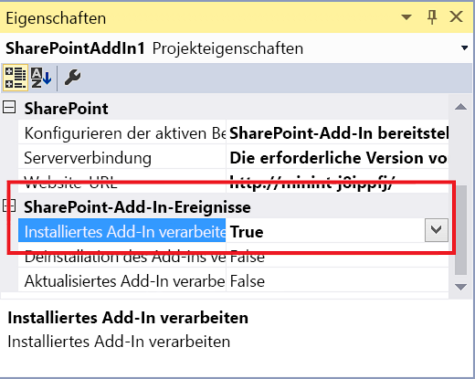

# <a name="create-an-add-in-event-receiver-in-sharepoint-add-ins"></a>Erstellen eines Add-In-Ereignisempfängers in SharePoint-Add-Ins
Erstellen von Handlern für SharePoint-Add-In-Installations- und Deinstallationsereignisse in SharePoint-Add-Ins.
 

 **Hinweis** Der Name „Apps für SharePoint“ wird in „SharePoint-Add-Ins“ geändert. Während des Übergangszeitraums wird in der Dokumentation und der Benutzeroberfläche einiger SharePoint-Produkte und Visual Studio-Tools möglicherweise weiterhin der Begriff „Apps für SharePoint“ verwendet. Weitere Informationen finden Sie unter [Neuer Name für Office- und SharePoint-Apps](new-name-for-apps-for-sharepoint.md#bk_newname).
 


## <a name="prerequisites"></a>Voraussetzungen
<a name="SP15appevent_prereq"> </a>

In diesem Artikel wird vorausgesetzt, dass Sie die Grundlagen vom Anbieter gehosteter SharePoint-Add-Ins verstehen und bereits Apps entwickelt haben, die wenigstens geringfügig über die Komplexität von "Hello World" hinausgehen. Ferner sollten Sie mit dem  [Behandeln von Ereignissen in SharePoint-Add-Ins](handle-events-in-sharepoint-add-ins.md) vertraut sein. 
 

 

## <a name="get-more-code-samples"></a>Abrufen weiterer Codebeispiele
<a name="SP15appevent_prereq"> </a>

Wenn Sie das fortlaufende Beispiel in diesem Artikel durcharbeiten, verfügen Sie über ein fertiges Codebeispiel. Im Folgenden finden Sie weitere Beispiele. Sie folgen nicht alle der hier beschriebenen Architektur. Es kann mehr als eine gute Möglichkeit geben, einen Add-In-Ereignisempfänger zu entwerfen. Bedenken Sie auch, dass Microsoft möglicherweise mit der Zeit weitere Anleitungen bereitstellen wird. 
 

 

-  [OfficeDev/PnP/Samples/Core.AppEvents.HandlerDelegation](https://github.com/OfficeDev/PnP/tree/master/Samples/Core.AppEvents.HandlerDelegation) stimmt weitgehend mit dem fortlaufenden Beispiel in diesem Artikel überein.
    
 
-  [OfficeDev/PnP/Samples/Core.AppEvents](https://github.com/OfficeDev/PnP/tree/master/Samples/Core.AppEvents) zeigt, wie Sie dieselbe Aufgabe wie im vorstehenden Beispiel in Szenarien durchführen können, in denen die Handlerdelegierungsstrategie nicht verwendet werden kann.
    
 
-  [OfficeDev/PnP/Samples/Core.EventReceivers](https://github.com/OfficeDev/PnP/tree/master/Samples/Core.EventReceivers)
    
 
-  [Erstellen eines vom Anbieter gehosteten Add-Ins mit angepasster Add-In-Installation](https://code.msdn.microsoft.com/SharePoint-Create-a-f27752e0)
    
 

## <a name="add-an-add-in-installed-event-receiver"></a>Hinzufügen eines Ereignisempfängers für das installierte Add-In
<a name="SP15appevent_prereq"> </a>


1. Öffnen Sie in Visual Studio das Projekt für das vom Anbieter gehostete SharePoint-Add-In. (Wenn Sie einen Add-In-Ereignishandler für ein in SharePoint gehostetes Add-In hinzufügen, wird sie von den Office-Entwicklertools für Visual Studio in ein vom Anbieter gehostetes Add-In umgewandelt.)
    
 
2. Wählen Sie im **Projektmappen-Explorer** den Knoten für das SharePoint-Add-In aus.
    
 
3. Legen Sie im Fenster **Eigenschaften** den Wert von **Installiertes Add-In verarbeiten** auf **True** fest. 
    
    **Abbildung 1: Add-In-Ereignisse im Eigenschaftenfenster**

 

  
 

    Von den Office-Entwicklertools für Visual Studio wird Folgendes ausgeführt:
    
 

      - Eine Datei AppEventReceiver.svc mit grundlegendem C#- (oder VB.NET-)Code wird hinzugefügt. Dies ist der Dienst, der das Add-In-Ereignis behandelt.
    
 
  - Der folgende Eintrag wird im Abschnitt **Eigenschaften** der Datei AppManifest.xml hinzugefügt: `<InstalledEventEndpoint>~remoteAppUrl/AppEventReceiver.svc</InstalledEventEndpoint>`. Dieser Eintrag registriert den Add-In-Ereignisempfänger in SharePoint. (Beachten Sie, dass das Token **~remoteAppUrl** das gleiche ist, das für die Remotewebanwendung in dem vom Anbieter gehosteten SharePoint-Add-In verwendet wurde. In den Office Developer Tools für Visual Studio wird davon ausgegangen, dass die Domäne der Webanwendung mit der des Ereignishandlers identisch ist. In den seltenen Fällen, wo dies nicht gilt, müssen Sie das Token **~remoteAppUrl** manuell durch die tatsächliche Domäne des Diensts ersetzen.)
    
 
  - Wenn das SharePoint-Add-In-Projekt nicht bereits ein Webprojekt aufweist, wird eines von den Office Developer Tools für Visual Studio erstellt. Die Tools stellen außerdem sicher, dass das Add-In-Manifest für ein vom Anbieter gehostetes Add-In konfiguriert ist. Außerdem fügen sie Seiten, Skripts, CSS-Dateien und andere Artefakte hinzu. (Wenn die einzige Remotekomponente, die Ihr Add-In benötigt, der Webdienst für die Ereignisbehandlung ist, können Sie diese aus dem Projekt löschen. Außerdem sollten Sie sicherstellen, dass das **StartPage**-Element im Add-In-Manifest nicht auf eine Seite verweist, die Sie gelöscht haben.)
    
 
4. Wenn sich die SharePoint-Testfarm nicht auf dem Computer mit Visual Studio befindet, konfigurieren Sie das Projekt zum Debuggen mit dem Microsoft Azure Service Bus. Weitere Informationen finden Sie unter  [Debugging und Problembehandlung eines Remoteereignisempfängers in einem Add-In für SharePoint](debug-and-troubleshoot-a-remote-event-receiver-in-a-sharepoint-add-in.md). 
    
 
5. Wenn die Datei AppEventReceiver.svc eine `ProcessOneWayEvent`-Methode enthält, sollte ihre Implementierung lediglich die Zeile `throw new NotImplementedException();` umfassen, da diese Methode nicht in einem Add-In-Ereignishandler verwendet werden kann. *Add-In-Ereignishandler müssen ein Objekt zurückgeben, das SharePoint mitteilt, ob das Ereignis abgeschlossen oder zurückgesetzt werden soll. Die `ProcessOneWayEvent`-Methode gibt jedoch nichts zurück.* 
    
 
6. Die Datei enthält eine  `ProcessEvent`-Methode, die etwa wie folgt aussieht. (Sie kann auch einen Codeblock enthalten, der veranschaulicht, wie ein Clientkontext abgerufen wird. Löschen Sie diesen, oder kommentieren Sie ihn aus.)
    
    Beachten Sie Folgendes zu diesem Code:
    
      - Das  **SPRemoteEventProperties** -Objekt wird an den Handlerwebdienst als SOAP-Nachricht gesendet, die Kontextinformationen von SharePoint enthält, beispielsweise eine **EventType** -Eigenschaft zur Identifizierung des Ereignisses.
    
 
  - Das vom Handler zurückgegebene **SPRemoteEventResult**-Objekt enthält eine **Status**-Eigenschaft mit den möglichen Werten **SPRemoteEventServiceStatus**. **Continue**, **SPRemoteEventServiceStatus.CancelNoError** und **SPRemoteEventServiceStatus.CancelWithError**. Der Standardwert der **Status**-Eigenschaft ist **Continue** und weist SharePoint an, das Ereignis abzuschließen. Die anderen beiden Werte weisen SharePoint an, Folgendes zu tun:
    
      - Der Handler wird noch maximal drei Mal ausgeführt.
    
 
  - Wenn weiterhin ein „Cancel“-Status zurückgegeben wird, wird das Ereignis abgebrochen, und alles, was als Teil des Ereignisses ausgeführt wurde, wird zurückgesetzt. 
    
 


```C#
  public SPRemoteEventResult ProcessEvent(SPRemoteEventProperties properties)
{
    SPRemoteEventResult result = new SPRemoteEventResult();

    return result;
}
```

7. Fügen Sie direkt unter der Zeile mit der Deklaration der `result`-Variable die folgende Verzweigungsstruktur hinzu, um das behandelte Ereignis zu identifizieren.
    
```C#
  switch (properties.EventType)
{
    case SPRemoteEventType.AppInstalled:
        break;
    case SPRemoteEventType.AppUpgraded:
        break;
    case SPRemoteEventType.AppUninstalling:
        break;
}
```


     **Note**  The  **AppInstalled**,  **AppUpdated**, and  **AppInstalling** events, if you have handlers for them, will each get their own URL registered in the add-in manifest. So you *can*  have different endpoints for them; but this article (and the Office Developer Tools for Visual Studio) assume they have exactly the same endpoint; that's why the code needs to determine which event called it.
8. Wie unter [Einbeziehen von Rollbacklogik und „Bereits erledigt“-Logik in Add-In-Ereignishandler](handle-events-in-sharepoint-add-ins.md#Rollback) erläutert wurde, möchten Sie bei einem Fehler in der Installationslogik fast immer, dass die Installation des Add-Ins abgebrochen wird und alle Installationsaktionen von SharePoint zurückgesetzt werden. Außerdem sollen die Aktionen Ihres Handlers zurückgesetzt werden. Eine Möglichkeit dazu besteht darin, folgenden Code in der **case**-Struktur für das AppInstalled-Ereignis hinzuzufügen.
    
```C#
  case SPRemoteEventType.AppInstalled:
  try
  {
      // Add-in installed event logic goes here.
  }
  catch (Exception e)
  {
      result.ErrorMessage = e.ErrorMessage;
      result.Status = SPRemoteEventServiceStatus.CancelWithError;

      // Rollback logic goes here.
  }
  break;
```


     **Note**  Move installation code that takes more than 30 seconds into the add-in itself. You can add it to "first run" logic that executes the first time the add-in runs. The add-in can display a message saying something like "We're getting things ready for you." Alternatively, the add-in can prompt the user to run the initialization code.If "first run" logic is not feasible for your add-in, another option is to have your event handler start a remote asynchronous process and then immediately return a  **SPRemoteEventResult** object with the **Status** set to **Continue**. A weakness of this strategy is that if the remote process fails, it has no way to tell SharePoint to roll back the add-in installation.
9. Wie unter  [Strategien für die Architektur von Add-In-Ereignishandlern](handle-events-in-sharepoint-add-ins.md#Strategies) erläutert, wird die Handlerdelegierungsstrategie bevorzugt, auch wenn sie nicht in jedem Szenario möglich ist. Im fortlaufenden Beispiel zeigen wir Ihnen, wie Sie die Handlerdelegierungsstrategie implementieren, wenn Sie eine Liste zum Hostweb hinzufügen. (Informationen zum Erstellen eines ähnlichen AppInstalled-Ereignishandlers, der nicht die Handlerdelegierungsstrategie verwendet, finden Sie im Beispiel [OfficeDev/PnP/Samples/Core.AppEvents](https://github.com/OfficeDev/PnP/tree/master/Samples/Core.AppEvents).)
    
    Im Folgenden finden Sie die neue Version des **case**-Blocks für AppInstalled. Beachten Sie, dass Initialisierungslogik, die für alle Ereignisse gilt, über dem **switch**-Block steht. Da die gleiche Liste, die installiert wird, im AppUninstalling-Ereignishandler entfernt wird, wird die Liste hier identifiziert.
    


```C#
  SPRemoteEventResult result = new SPRemoteEventResult();
String listTitle = "MyList";

switch (properties.EventType)
{               
    case SPRemoteEventType.AppInstalled:
                    
   try
   {
        string error = TryCreateList(listTitle, properties);
        if (error != String.Empty)
        {
            throw new Exception(error);            
        }
   }
    catch (Exception e)
   {
        // Tell SharePoint to cancel the event.
        result.ErrorMessage = e.Message;
        result.Status = SPRemoteEventServiceStatus.CancelWithError;               
    }
        break;
    case SPRemoteEventType.AppUpgraded:
       break;
    case SPRemoteEventType.AppUninstalling:
       break;
}                      
```

10. Fügen Sie die Listenerstellungsmethode zur **AppEventReceiver**-Klasse als **private**-Methode mit folgendem Code hinzu. Beachten Sie, dass die `TokenHelper`-Klasse eine besondere Methode aufweist, die für das Abrufen eines Clientkontexts für ein Add-In-Ereignis optimiert ist. Durch die Übergabe von **false** für den letzten Parameter wird sichergestellt, dass der Kontext für das Hostweb gilt.
    
```C#
  private string TryCreateList(String listTitle, SPRemoteEventProperties properties)
 {    
    string errorMessage = String.Empty;          

    using (ClientContext clientContext =
        TokenHelper.CreateAppEventClientContext(properties, useAppWeb: false))
    {
        if (clientContext != null)
        {
        }
    }
    return errorMessage;
}

```

11. Rollbacklogik besteht im Wesentlichen aus Ausnahmebehandlungslogik, und das SharePoint-CSOM (clientseitige Objektmodell) hat einen **ExceptionHandlingScope**, der es Ihrem Webdienst ermöglicht, die Ausnahmebehandlung an den SharePoint-Server zu delegieren. (Siehe auch [Gewusst wie: Verwenden des Ausnahmebehandlungsbereichs](http://msdn.microsoft.com/library/103619ef-1ba3-44e3-93e1-5e0685bc616e%28Office.15%29.aspx).) Fügen Sie den folgenden Code im **if**-Block des vorhergehenden Codeausschnitts hinzu.
    
```C#
  ExceptionHandlingScope scope = new ExceptionHandlingScope(clientContext); 

using (scope.StartScope()) 
{ 
    using (scope.StartTry()) 
    { 
    }         
    using (scope.StartCatch()) 
    {                                 
    } 
    using (scope.StartFinally()) 
    { 
    } 
} 
 clientContext.ExecuteQuery();

if (scope.HasException)
{
    errorMessage = String.Format("{0}: {1}; {2}; {3}; {4}; {5}", 
        scope.ServerErrorTypeName, scope.ErrorMessage, 
        scope.ServerErrorDetails, scope.ServerErrorValue, 
        scope.ServerStackTrace, scope.ServerErrorCode);
}
```

12. Es gibt nur einen Aufruf von SharePoint ( **ExecuteQuery**) im vorherigen Codeausschnitt, aber leider bleibt es nicht bei dem einen. Jedes Objekt, auf das in unserem Ausnahmebereich verwiesen wird, muss zuerst in den Client geladen werden. Fügen Sie also den folgenden Code  *über*  dem Konstruktor für den **ExceptionHandlingScope** hinzu.
    
```C#
  ListCollection allLists = clientContext.Web.Lists;
IEnumerable<List> matchingLists =
    clientContext.LoadQuery(allLists.Where(list => list.Title == listTitle));
clientContext.ExecuteQuery();

var foundList = matchingLists.FirstOrDefault();
 List createdList = null;
```

13. Der Code zum Erstellen einer Hostwebliste gehört in den **StartTry** -Block, aber zuerst muss überprüft werden, ob die Liste bereits hinzugefügt wurde (wie unter [Einbeziehen von Rollbacklogik und „Bereits erledigt“-Logik in Add-In-Ereignishandler](handle-events-in-sharepoint-add-ins.md#Rollback) erläutert). If-then-else-Logik kann über die **ConditionalScope** -Klasse an den SharePoint-Server delegiert werden. (Siehe auch [Gewusst wie: Verwenden des bedingten Bereichs](http://msdn.microsoft.com/library/560112e9-c3ed-4b8f-9cd4-c8bc5d60d63c%28Office.15%29.aspx).) Fügen Sie den folgenden Code im **StartTry**-Block hinzu.
    
```C#
  ConditionalScope condScope = new ConditionalScope(clientContext, 
        () => foundList.ServerObjectIsNull.Value == true, true);
using (condScope.StartScope())
{
    ListCreationInformation listInfo = new ListCreationInformation();
    listInfo.Title = listTitle;
    listInfo.TemplateType = (int)ListTemplateType.GenericList;
    listInfo.Url = listTitle;
    createdList = clientContext.Web.Lists.Add(listInfo);                                
}
```

14. Der  **StartCatch** -Block sollte die Erstellung der Liste rückgängig machen, aber zuvor muss überprüft werden, ob die Liste erstellt wurde. Denn möglicherweise wurde eine Ausnahme im **StartTry**-Block ausgelöst, bevor die Erstellung der Liste abgeschlossen war. Fügen Sie den folgenden Code im **StartCatch**-Block hinzu.
    
```C#
  ConditionalScope condScope = new ConditionalScope(clientContext, 
        () => createdList.ServerObjectIsNull.Value != true, true);
using (condScope.StartScope())
{
    createdList.DeleteObject();
} 
```


     **Tip**   **TROUBLESHOOTING:** To test whether your **StartCatch** block is entered when it should be, you need a way to throw a runtime exception on the SharePoint server. Using a **throw** or dividing by zero won't work because they cause *client-side*  exceptions before the client runtime can even bundle up the code and send it to the server (with the **ExecuteQuery** method). Instead, add the following lines to the **StartTry** block. The client-side runtime accepts this, but it causes a server-side exception, which is what you want. `List fakeList = clientContext.Web.Lists.GetByTitle("NoSuchList");`
 
 `clientContext.Load(fakeList);`

    The entire TryCreateList method should look like the following. (The  **StartFinally** block is required even when it is not being used.)
    


```C#
  private string TryCreateList(String listTitle, SPRemoteEventProperties properties)
{    
    string errorMessage = String.Empty;  

    using (ClientContext clientContext = 
        TokenHelper.CreateAppEventClientContext(properties, useAppWeb: false))
    {
        if (clientContext != null)
        {
            ListCollection allLists = clientContext.Web.Lists;
            IEnumerable<List> matchingLists = 
                clientContext.LoadQuery(allLists.Where(list => list.Title == listTitle));
            clientContext.ExecuteQuery();
            var foundList = matchingLists.FirstOrDefault();
            List createdList = null;

            ExceptionHandlingScope scope = new ExceptionHandlingScope(clientContext); 
            using (scope.StartScope()) 
            { 
                using (scope.StartTry()) 
                { 
                    ConditionalScope condScope = new ConditionalScope(clientContext, 
                            () => foundList.ServerObjectIsNull.Value == true, true);  
                    using (condScope.StartScope())
                    {
                        ListCreationInformation listInfo = new ListCreationInformation();
                        listInfo.Title = listTitle;
                        listInfo.TemplateType = (int)ListTemplateType.GenericList;
                        listInfo.Url = listTitle;
                        createdList = clientContext.Web.Lists.Add(listInfo);
                    }
                } 
                
                using (scope.StartCatch()) 
                { 
                    ConditionalScope condScope = new ConditionalScope(clientContext, 
                            () => createdList.ServerObjectIsNull.Value != true, true);
                    using (condScope.StartScope())
                    {
                        createdList.DeleteObject();
                    }    
                } 

                using (scope.StartFinally()) 
                { 
                } 
            } 
            clientContext.ExecuteQuery();

            if (scope.HasException)
            {
                    errorMessage = String.Format("{0}: {1}; {2}; {3}; {4}; {5}", 
                    scope.ServerErrorTypeName, scope.ErrorMessage, 
                    scope.ServerErrorDetails, scope.ServerErrorValue, 
                    scope.ServerStackTrace, scope.ServerErrorCode);
            }
        }
    }
    return errorMessage;
}
```


     **Tip**   **DEBUGGING:** Regardless of whether you are using the handler delegation strategy, when you are stepping through the code with the debugger, keep in mind that, in any scenario in which your handler returns a cancel status, SharePoint is going to call your handler again, up to three more times. So the debugger will cycle through the code up to four times.

     **Tip**   **CODE ARCHITECTURE:** Since you can install components on the add-in web with declarative markup outside your handler, you usually won't want to use up any of the 30 seconds your handler has available to interact with the add-in web. But if you do, keep in mind that your code requires a separate **ClientContext** object for the add-in web. This means that the add-in web and host web are different components, just as much as an SQL Server database is different from each of them. So a method that calls to the add-in web is in the **try** block of the AppInstalled **case** block, just like the TryCreateList method in the continuing example. However, your handler does *not*  need to roll back actions taken on the add-in web. If it encounters an error, it only needs to cancel the event, because SharePoint will delete the entire add-in web if the event is cancelled.

## <a name="create-an-add-in-uninstalling-event-receiver"></a>Erstellen eines Ereignisempfängers für die Deinstallation des Add-Ins
<a name="SP15appevent_prereq"> </a>


1. Legen Sie die Eigenschaft **Deinstallation des Add-Ins verarbeiten** des Projekts auf **True** fest. Von den Tools wird *keine* weitere Webdienstdatei erstellt, falls eine vorhanden ist. Aber sie fügen dem Add-In-Manifest ein **UninstallingEventEndpoint**-Element hinzu.
    
 
2. Code im **case**-Block für AppUninstalling sollte Artefakte des Add-Ins entfernen, die nicht mehr benötigt werden, nachdem das Add-In aus dem endgültigen Papierkorb entfernt wurde, wodurch das Ereignis ausgelöst wird. Allerdings müssen Sie die Komponenten möglichst „außer Kraft setzen“, anstatt sie vollständig zu löschen. Der Grund ist, dass Sie sie wiederherstellen müssen, wenn das Deinstallationsereignis rückgängig gemacht werden muss. In diesem Fall befindet sich das Add-In noch im endgültigen Papierkorb, und ein Benutzer kann es wiederherstellen und erneut verwenden. Das Neuerstellen einer gelöschten Komponente in der Rollbacklogik ist möglicherweise ausreichend, um das Add-In wieder funktionsfähig zu machen, aber Daten oder Konfigurationseinstellungen in der Komponente würden dann verloren gehen.
    
    Diese Strategie ist für SharePoint-Komponenten relativ einfach, da SharePoint über einen Papierkorb verfügt, aus dem Elemente wiederhergestellt werden können, und es CSOM-APIs für den Zugriff gibt. Spätere Schritte in diesem Verfahren zeigen, wie das geht. Für andere Plattformen können unterschiedliche Techniken erforderlich sein. Wenn Sie beispielsweise eine Zeile in einer SQL Server-Tabelle in Ihrem Add-In-Deinstallationshandler außer Kraft setzen möchten, kann eine gespeicherte T-SQL-Prozedur im Ereignishandler eine IsDeleted-Spalte zur Tabelle hinzufügen und für die Zeile auf **True** festlegen. Wenn in der Prozedur ein Fehler auftritt, setzt die Rollbacklogik den Wert auf **False** zurück. Wenn die Prozedur ohne Fehler abgeschlossen wird, kann sie kurz vor der Rückgabe eines Erfolgsflags einen Zeitgeberauftrag für die spätere Löschung der Zeile festlegen.
    
    Manchmal möchten Sie Daten, wie z. B. Listen, auch nach dem Löschen des Add-Ins behalten, aber als Beispiel in diesem Artikel wird im folgenden Deinstallationsereignishandler die Liste gelöscht, die mit dem Installationsereignishandler erstellt wurde.
    


```C#
  case SPRemoteEventType.AppUninstalling:

try
{
    string error = TryRecycleList(listTitle, properties);
    if (error != String.Empty)
    {
        throw new Exception(error);
    }
}
catch (Exception e)
{
    // Tell SharePoint to cancel the event.
    result.ErrorMessage = e.Message;
    result.Status = SPRemoteEventServiceStatus.CancelWithError;
}
break;
```

3. Fügen Sie die Hilfsmethode für die Wiederverwendung der Liste hinzu. Beachten Sie Folgendes zu diesem Code:
    
      - Der Code verschiebt die Liste in den Papierkorb, anstatt sie dauerhaft zu löschen. Dies ermöglicht das Wiederherstellen der Liste und der zugehörigen Daten nach einem Fehler im Ereignis, was im **StartCatch**-Block geschieht. Wenn die Methode erfolgreich ist und das Ereignis abgeschlossen ist, wird das Add-In dauerhaft aus dem endgültigen Papierkorb gelöscht, aber die Liste befindet sich noch im Papierkorb.
    
 
  - Der Code prüft das Vorhandensein der Liste, bevor sie wieder verwendet wird, da ein Benutzer sie bereits auf der SharePoint-Benutzeroberfläche wieder verwendet haben könnte. Auf ähnliche Weise überprüft der Rollbackcode das Vorhandensein der Liste im Papierkorb, bevor sie wiederhergestellt wird, da ein Benutzer sie möglicherweise bereits wiederhergestellt haben oder in den endgültigen Papierkorb verschoben haben könnte. 
    
 
  - Es gibt zwei bedingte Bereiche, die das Vorhandensein einer Liste testen, indem sie überprüfen, ob ein Verweis darauf **null** ist. Aber beide verfügen über einen inneren **if**-Block, der dasselbe Objekt ein zweites Mal auf null überprüft. Die äußeren Tests mit Blocks mit bedingten Bereichen werden auf dem Server ausgeführt, aber die inneren Tests auf null sind ebenfalls erforderlich. Denn die Client-Laufzeit durchläuft den Code Zeile für Zeile zum Erstellen der XML-Meldung, die die **ExecuteQuery**-Methode an den Server sendet. Wenn die Verweise auf die Objekte **foundList** und **recycledList** erreicht werden, löst die eine oder andere dieser Zeilen eine Nullverweisausnahme aus, sofern sie nicht innerhalb der inneren null-Überprüfungen eingeschlossen sind.
    
 

```C#
  private string TryRecycleList(String listTitle, SPRemoteEventProperties properties)
{
    string errorMessage = String.Empty;

    using (ClientContext clientContext = 
        TokenHelper.CreateAppEventClientContext(properties, useAppWeb: false))
    {
        if (clientContext != null)
        {
            ListCollection allLists = clientContext.Web.Lists;
            IEnumerable<List> matchingLists = 
                clientContext.LoadQuery(allLists.Where(list => list.Title == listTitle));
            RecycleBinItemCollection bin = clientContext.Web.RecycleBin;
            IEnumerable<RecycleBinItem> matchingRecycleBinItems = 
                clientContext.LoadQuery(bin.Where(item => item.Title == listTitle));        
            clientContext.ExecuteQuery();

            List foundList = matchingLists.FirstOrDefault();
            RecycleBinItem recycledList = matchingRecycleBinItems.FirstOrDefault();    

            ExceptionHandlingScope scope = new ExceptionHandlingScope(clientContext);
            using (scope.StartScope())
            {
                using (scope.StartTry())
                {
                    ConditionalScope condScope = new ConditionalScope(clientContext, 
                        () => foundList.ServerObjectIsNull.Value == false, true);
                    using (condScope.StartScope())
                    {
                        if (foundList != null)
                        {
                            foundList.Recycle();
                        }
                    }
                }
                using (scope.StartCatch())
                {
                    ConditionalScope condScope = new ConditionalScope(clientContext, 
                         () => recycledList.ServerObjectIsNull.Value == false, true);
                    using (condScope.StartScope())
                    {
                        if (recycledList != null)
                        {
                            recycledList.Restore(); 
                        }
                    }
                }
                using (scope.StartFinally())
                {
                }
            }
            clientContext.ExecuteQuery();

            if (scope.HasException)
            {
                errorMessage = String.Format("{0}: {1}; {2}; {3}; {4}; {5}", 
                    scope.ServerErrorTypeName, scope.ErrorMessage, 
                    scope.ServerErrorDetails, scope.ServerErrorValue, 
                    scope.ServerStackTrace, scope.ServerErrorCode);
            }
        }
    }
    return errorMessage;
}
```


### <a name="to-debug-and-test-an-add-in-uninstalling-event-receiver"></a>So debuggen und testen Sie einen Ereignisempfänger für die Deinstallation des Add-Ins


1. Öffnen Sie alle folgenden Seiten in verschiedenen Fenstern oder Registerkarten:
    
      -  **Websiteinhalte**
    
 
  -  **Websiteeinstellungen – Papierkorb** (_layouts/15/AdminRecycleBin.aspx?ql=1)
    
 
  -  **Papierkorb – Endgültiger Papierkorb** (_layouts/15/AdminRecycleBin.aspxView=2&amp;?ql=1)
    
 
2. Drücken Sie F5, und vertrauen Sie dem Add-In, wenn Sie dazu aufgefordert werden. Die Startseite des Add-Ins wird geöffnet. Wenn Sie nur den Deinstallationsereignishandler testen möchten, können Sie dieses Browserfenster schließen.  *Wenn Sie den Handler jedoch debuggen, lassen Sie es geöffnet. Beim Schließen wird die Debuggingsitzung beendet.* 
    
 
3. Aktualisieren Sie die Seite **Websiteinhalte**, und wenn das Add-In angezeigt wird, entfernen Sie es.
    
 
4. Aktualisieren Sie die Seite **Websiteeinstellungen – Papierkorb**. Das Add-In wird als das erste Element angezeigt. Aktivieren Sie das Kontrollkästchen daneben, und klicken Sie auf **Auswahl löschen**.
    
 
5. Aktualisieren Sie die Seite **Papierkorb – Endgültiger Papierkorb**. Das Add-In wird als das erste Element angezeigt. Aktivieren Sie das Kontrollkästchen daneben, und klicken Sie auf **Auswahl löschen**. SharePoint wird sofort Ihren Ereignishandler für die Deinstallation des Add-Ins aufrufen.
    
 

## <a name="create-an-add-in-updated-event-receiver"></a>Erstellen eines Ereignisempfängers für die Aktualisierung des Add-Ins
<a name="SP15appevent_prereq"> </a>

Ausführliche Informationen zum Erstellen eines Handlers für das aktualisierte Add-In finden Sie unter [Erstellen eines Handlers für das Updateereignis in SharePoint-Add-Ins](create-a-handler-for-the-update-event-in-sharepoint-add-ins.md).
 

 

## <a name="url-and-hosting-restrictions-on-production-add-in-event-receivers"></a>URL- und Hostingeinschränkungen für Add-In-Ereignisempfänger in Produktion
<a name="SP15appevent_prereq"> </a>

Der Add-In-Ereignisempfänger kann in der Cloud oder auf einem lokalen Server gehostet werden, der nich gleichzeitig als SharePoint-Server verwendet wird. Die URL eines Produktionsempfängers kann keinen bestimmten Port angeben. Daher müssen Sie entweder Port 443 für HTTPS verwenden, was empfohlen wird, oder Port 80 für HTTP. Wenn Sie HTTPS verwenden und der Empfängerdienst lokal gehostet wird, sich das Add-In jedoch auf Microsoft SharePoint Online befindet, muss der Hostingserver über ein öffentlich vertrauenswürdiges Zertifikat einer Zertifikatstelle verfügen. (Ein selbstsigniertes Zertifikat kann nur verwendet werden, wens sich das Add-In in einer lokalen SharePoint-Farm befindet.)
 

 

## <a name="additional-resources"></a>Zusätzliche Ressourcen
<a name="SP15appevent_addlresources"> </a>


-  [Behandeln von Ereignissen in SharePoint-Add-Ins](handle-events-in-sharepoint-add-ins.md)
    
 

