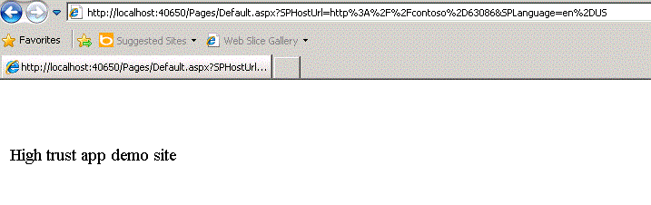

# <a name="create-high-trust-sharepoint-add-ins"></a><span data-ttu-id="afa98-101">Erstellen besonders vertrauenswürdiger Add-Ins für SharePoint</span><span class="sxs-lookup"><span data-stu-id="afa98-101">Create high-trust SharePoint Add-ins</span></span>
<span data-ttu-id="afa98-p101">Hier erfahren Sie, wie eine besonders vertrauenswürdige SharePoint-Add-In erstellt wird. Eine besonders vertrauenswürdige App verwendet digitale Zertifikate, um eine Vertrauensstellung zwischen einer Remotewebanwendung und SharePoint einzurichten. Besonders vertrauenswürdige Apps können nur in lokalen SharePoint-Installationen installiert werden, nicht in Microsoft SharePoint Online. Sie dienen darüber hinaus vorrangig der Verwendung in einer lokalen Installation statt in einer cloudbasierten Webanwendung.</span><span class="sxs-lookup"><span data-stu-id="afa98-p101">Learn how to create a high-trust SharePoint Add-in. A high-trust add-in uses digital certificates to establish a trust between the remote web application and SharePoint. High-trust add-ins can only be installed to on premises SharePoint, not to Microsoft SharePoint Online, and they are primarily intended for use with an on premises, rather than cloud-based, web application.</span></span>
 

 <span data-ttu-id="afa98-p102">**Hinweis** Der Name „Apps für SharePoint“ wird in „SharePoint-Add-Ins“ geändert. Während des Übergangszeitraums wird in der Dokumentation und der Benutzeroberfläche einiger SharePoint-Produkte und Visual Studio-Tools möglicherweise weiterhin der Begriff „Apps für SharePoint“ verwendet. Weitere Informationen finden Sie unter [Neuer Name für Office- und SharePoint-Apps](new-name-for-apps-for-sharepoint#bk_newname).</span><span class="sxs-lookup"><span data-stu-id="afa98-p102">The name "apps for SharePoint" is changing to "SharePoint Add-ins". During the transition, the documentation and the UI of some SharePoint products and Visual Studio tools might still use the term "apps for SharePoint". For details, see [New name for apps for Office and SharePoint](new-name-for-apps-for-sharepoint#bk_newname).</span></span>
 


## <a name="prerequisites-for-creating-high-trust-add-ins"></a><span data-ttu-id="afa98-108">Voraussetzungen für das Erstellen besonders vertrauenswürdiger Add-Ins</span><span class="sxs-lookup"><span data-stu-id="afa98-108">Prerequisites for creating high-trust add-ins</span></span>
<span data-ttu-id="afa98-109"><a name="Prereqs"> </a></span><span class="sxs-lookup"><span data-stu-id="afa98-109"></span></span>

<span data-ttu-id="afa98-110">Um die Verfahren in diesem Artikel ausführen zu können, benötigen Sie Folgendes:</span><span class="sxs-lookup"><span data-stu-id="afa98-110">To follow the procedures in this article, be sure you have the following:</span></span>
 

 

- <span data-ttu-id="afa98-p103">Eine lokale SharePoint-Entwicklungsumgebung. Eine Anleitung zur Einrichtung finden Sie unter  [Einrichten einer lokalen Entwicklungsumgebung für SharePoint-Add-Ins](set-up-an-on-premises-development-environment-for-sharepoint-add-ins). Achten Sie insbesondere darauf. dass Sie die Schritte im Abschnitt  [Konfigurieren von Diensten in SharePoint für die Verwendung in Server-zu-Server-Add-Ins](set-up-an-on-premises-development-environment-for-sharepoint-add-ins#Servertoserver) ordnungsgemäß ausführen.</span><span class="sxs-lookup"><span data-stu-id="afa98-p103">An on-premises SharePoint development environment. See  [Set up an on-premises development environment for SharePoint Add-ins](set-up-an-on-premises-development-environment-for-sharepoint-add-ins) for the setup instructions. In particular, be sure you have completed the steps in the section [Configure services in SharePoint for server-to-server add-in use](set-up-an-on-premises-development-environment-for-sharepoint-add-ins#Servertoserver).</span></span>
    
 
- <span data-ttu-id="afa98-p104">Erfahrung im Erstellen eines von einem Anbieter gehosteten SharePoint-Add-Ins. Weitere Informationen finden Sie unter [Erste Schritte beim Erstellen von von einem Anbieter gehosteten SharePoint-Add-Ins](get-started-creating-provider-hosted-sharepoint-add-ins).</span><span class="sxs-lookup"><span data-stu-id="afa98-p104">Experience creating a provider-hosted SharePoint Add-in. See  [Get started creating provider-hosted SharePoint Add-ins](get-started-creating-provider-hosted-sharepoint-add-ins).</span></span>
    
 
- <span data-ttu-id="afa98-116">Installation von Visual Studio, entweder remote oder auf dem Computer, auf dem SharePoint installiert ist.</span><span class="sxs-lookup"><span data-stu-id="afa98-116">Visual Studio installed either remotely or on the computer where you have installed SharePoint.</span></span>
    
 
- <span data-ttu-id="afa98-117">Microsoft Office-Entwicklertools für Visual Studio.</span><span class="sxs-lookup"><span data-stu-id="afa98-117">Microsoft Office Developer Tools for Visual Studio.</span></span>
    
 
- <span data-ttu-id="afa98-118">Gute Kenntnisse im Bereich digitale Zertifikate - Art und Nutzung</span><span class="sxs-lookup"><span data-stu-id="afa98-118">Familiarity with digital certificates—what they are and how to use them.</span></span>
    
 
<span data-ttu-id="afa98-119">Lesen Sie die folgenden Artikel, um ein besseres Verständnis von SharePoint-Add-Ins und digitalen Zertifikate zu erhalten.</span><span class="sxs-lookup"><span data-stu-id="afa98-119">Read the following articles to get a better understanding of SharePoint Add-ins and digital certificates.</span></span>
 

 

<span data-ttu-id="afa98-120">**Tabelle 1. Kernkonzepte der Einrichtung von SharePoint zur Ausführung besonders vertrauenswürdiger Add-Ins**</span><span class="sxs-lookup"><span data-stu-id="afa98-120">**Table 1. Core concepts for setting up SharePoint to run high-trust add-ins**</span></span>


|<span data-ttu-id="afa98-121">**Titel des Artikels**</span><span class="sxs-lookup"><span data-stu-id="afa98-121">**Article title**</span></span>|<span data-ttu-id="afa98-122">**Beschreibung**</span><span class="sxs-lookup"><span data-stu-id="afa98-122">**Description**</span></span>|
|:-----|:-----|
| [<span data-ttu-id="afa98-123">Erste Schritte beim Erstellen von von einem Anbieter gehosteten SharePoint-Add-Ins</span><span class="sxs-lookup"><span data-stu-id="afa98-123">Get started creating provider-hosted SharePoint Add-ins</span></span>](get-started-creating-provider-hosted-sharepoint-add-ins)|<span data-ttu-id="afa98-124">Erfahren Sie, wie Sie eine grundlegende von einem Anbieter gehostete SharePoint-Add-In mit Office-Entwicklertools für Visual Studio erstellen und wie Sie unter Verwendung des SharePoint-CSOM mit SharePoint-Sites interagieren.</span><span class="sxs-lookup"><span data-stu-id="afa98-124">Learn how to create a basic provider-hosted SharePoint Add-in with the Office Developer Tools for Visual Studio, how to interact with SharePoint sites by using the SharePoint CSOM.</span></span>|
| [<span data-ttu-id="afa98-125">Digitale Zertifikate](http://msdn.microsoft.com/library/e523b335-0156-4f47-b55c-b80495587c4f.aspx) und [Arbeiten mit Zertifikaten</span><span class="sxs-lookup"><span data-stu-id="afa98-125">Digital Certificates](http://msdn.microsoft.com/library/e523b335-0156-4f47-b55c-b80495587c4f.aspx) and [Working with Certificates</span></span>](http://msdn.microsoft.com/library/6ffb8682-8f07-4a45-afbb-8d2487e9dbc3.aspx)|<span data-ttu-id="afa98-126">Lernen Sie die grundlegenden Ideen hinter digitalen Zertifikaten kennen.</span><span class="sxs-lookup"><span data-stu-id="afa98-126">Learn the basic ideas behind digital certificates.</span></span>|

## <a name="introduction-to-running-high-trust-add-ins"></a><span data-ttu-id="afa98-127">Einführung in die Ausführung besonders vertrauenswürdiger Add-Ins</span><span class="sxs-lookup"><span data-stu-id="afa98-127">Introduction to running high-trust add-ins</span></span>
<span data-ttu-id="afa98-128"><a name="Intro"> </a></span><span class="sxs-lookup"><span data-stu-id="afa98-128"></span></span>

<span data-ttu-id="afa98-p105">Eine besonders vertrauenswürdige App ist eine von einem Anbieter gehostete SharePoint-Add-In, die digitale Zertifikate verwendet, um eine Vertrauensstellung zwischen der Remotewebanwendung und SharePoint einzurichten. "Besonders vertrauenswürdig" ist nicht gleichbedeutend mit "voll vertrauenswürdig". Eine besonders vertrauenswürdige App muss dennoch App-Berechtigungen anfordern. Die App gilt als "besonders vertrauenswürdig", da sie jede Benutzeridentität verwenden darf, die sie benötigt. Die App ist für die Erstellung des Benutzeranteils des Zugriffstoken verantwortlich, der an SharePoint übergeben wird.</span><span class="sxs-lookup"><span data-stu-id="afa98-p105">A high-trust add-in is a provider-hosted SharePoint Add-in that uses the digital certificates to establish trust between the remote web application and SharePoint. "High-trust" is not the same as "full trust". A high-trust add-in must still request add-in permissions. The add-in is considered "high-trust" because it is trusted to use any user identity that the add-in needs, because the add-in is responsible for creating the user portion of the access token that it passes to SharePoint.</span></span>
 

 
<span data-ttu-id="afa98-p106">Eine besonders vertrauenswürdige SharePoint-Add-In wird in erster Linie für die Verwendung in einer lokalen, standortgebundenen Umgebung erstellt. Sie kann nicht für Microsoft SharePoint Online installiert werden, und die Remotekomponenten werden in der Regel ebenfalls lokal installiert - innerhalb der Unternehmensfirewall. Auf diese Weise sind die Instanzen von SharePoint-Add-In spezifisch für jedes einzelne Unternehmen.</span><span class="sxs-lookup"><span data-stu-id="afa98-p106">A high-trust SharePoint Add-in is primarily intended for use in an on-premises environment. The high-trust add-in cannot be installed to Microsoft SharePoint Online, and the remote components are typically installed on premises, too, within the corporate firewall. Thus, the instances of the SharePoint Add-in are specific to each individual company.</span></span>
 

 
<span data-ttu-id="afa98-p107">Für eine besonders vertrauenswürdige App wird zum Einrichten der Vertrauensstellung anstelle eines Kontexttoken ein Zertifikat verwendet. (Eine vom Anbieter gehostete App, die für die Verwendung des Microsoft Azure Access Control Service (ACS) als Vertrauensbroker erstellt wurde, muss geändert werden, um als besonders vertrauenswürdige App verwendet werden zu können.) Für besonders vertrauenswürdige Apps ist die Konfiguration in der SharePoint-Farm und auf dem Server erforderlich, auf dem die Remotewebanwendung gehostet wird. In diesem Thema werden die Konfigurationsschritte erläutert, die erforderlich sind, damit das Visual Studio-Debugging ( **F5**) verwendet werden kann. Für die Konfiguration einer Test-, Staging- oder Produktionsumgebung weichen diese Schritte leicht ab. Sie sind im Thema  [Packen und Veröffentlichen besonders vertrauenswürdiger Add-Ins für SharePoint](package-and-publish-high-trust-sharepoint-add-ins) beschrieben.</span><span class="sxs-lookup"><span data-stu-id="afa98-p107">A high-trust add-in uses a certificate instead of a context token to establish trust. (A provider-hosted add-in that's built to use Microsoft Azure Access Control Service (ACS) as its trust broker needs to be modified to work as a high-trust app.) High-trust add-ins require some configuration on the SharePoint farm and on the server hosting the remote web application. This topic describes the configuration steps that are needed to get Visual Studio debugging ( **F5**) working. Configuring a test, staging, or production environment are somewhat different and are described in the topic  [Package and publish high-trust SharePoint Add-ins](package-and-publish-high-trust-sharepoint-add-ins).</span></span> 
 

 
<span data-ttu-id="afa98-p108">In SharePoint stellt der Server-zu-Server-Sicherheitstokendienst Zugriffstoken für die Server-zu-Server-Authentifizierung bereit. Der Server-zu-Server-Sicherheitstokendienst gewährt temporären Zugriffstoken Zugriff auf andere Anwendungsdienste, z. B. Exchange 2013, Lync 2013 und Add-Ins für SharePoint. Mithilfe von Windows PowerShell-Cmdlets und eines Zertifikats richten Sie eine Vertrauensstellung zwischen den Anwendungsdiensten ein (beispielsweise die Vertrauensstellung zwischen SharePoint und einem Remote-Add-In) .</span><span class="sxs-lookup"><span data-stu-id="afa98-p108">In SharePoint, the server-to-server security token service (STS) provides access tokens for server-to-server authentication. The server-to-server STS enables temporary access tokens to access other application services such as Exchange 2013, Lync 2013, and add-ins for SharePoint. You establish a trust relationship between the application services (for example, establishing trust between SharePoint and a remote add-in) by using Windows PowerShell cmdlets and a certificate.</span></span>
 

 

 <span data-ttu-id="afa98-p109">**Hinweis** Der Server-zu-Server-Sicherheitstokendienst ist nicht für die Benutzerauthentifizierung vorgesehen. Daher wird der Server-zu-Server-Sicherheitstokendienst weder auf der Benutzeranmeldeseite noch im Abschnitt **Authentifizierungsanbieter** der Zentraladministration oder der Personenauswahl in SharePoint angezeigt.</span><span class="sxs-lookup"><span data-stu-id="afa98-p109">**Note** The server-to-server STS isn't intended for user authentication. Therefore, you won't see the server-to-server STS listed on the user sign-in page, in the **Authentication Provider** section in Central Administration, or in the People Picker in SharePoint.</span></span>
 

<span data-ttu-id="afa98-p110">In diesem Artikel wird beschrieben, wie Sie ein besonders vertrauenswürdiges Add-In erstellen. Außerdem werden Ausweisungen bereitgestellt, wie Sie das Add-In so einrichten, dass es in Visual Studio durch Drücken der Taste **F5** ausgeführt werden kann. Sie erfahren Folgendes:</span><span class="sxs-lookup"><span data-stu-id="afa98-p110">This article shows you how to create a high-trust add-in and provides setup instructions for running it within Visual Studio by pressing **F5**. You'll learn to:</span></span>
 

 

- <span data-ttu-id="afa98-147">Konfigurieren eines Add-Ins für die Verwendung als besonders vertrauenswürdiges Add-In.</span><span class="sxs-lookup"><span data-stu-id="afa98-147">Configure an add-in for use as a high-trust add-in.</span></span>
    
 
- <span data-ttu-id="afa98-148">Konfigurieren von SharePoint für die Verwendung von besonders vertrauenswürdigen Apps.</span><span class="sxs-lookup"><span data-stu-id="afa98-148">Configure SharePoint to use high-trust add-ins.</span></span>
    
 
- <span data-ttu-id="afa98-149">Erstellen einer einfachen besonders vertrauenswürdigen App.</span><span class="sxs-lookup"><span data-stu-id="afa98-149">Create a basic high-trust add-in.</span></span>
    
 

## <a name="obtain-a-certificate-or-create-a-public-and-private-test-certificate"></a><span data-ttu-id="afa98-150">Abrufen eines Zertifikat oder Erstellen eines öffentlichen und privaten Testzertifikats</span><span class="sxs-lookup"><span data-stu-id="afa98-150">Obtain a certificate or create a public and private test certificate</span></span>
<span data-ttu-id="afa98-151"><a name="Cert2"> </a></span><span class="sxs-lookup"><span data-stu-id="afa98-151"></span></span>

<span data-ttu-id="afa98-p111">Sie benötigen ein digitales X.509-Zertifikat für die Remotewebanwendung Ihrer besonders vertrauenswürdigen App. Damit Sie Ihre SharePoint-Add-In umfassend testen können, benötigen Sie ein von einer Domäne ausgestelltes oder kommerzielles Zertifikat, das von einer Zertifizierungsstelle ausgegeben wurde. Zu Beginn des Debuggings können Sie jedoch auch ein selbstsigniertes Zertifikat verwenden. Im folgenden Vorgang wird beschrieben, wie Sie mit IIS ein Testzertifikat erstellen und exportieren. Im nachfolgenden Abschnitt  [Abschließen des Debuggings mit einem von der Domäne ausgestellten oder kommerziellen Zertifikat](#NewCertificate) erfahren Sie, wie Sie das selbstsignierte Zertifikat durch ein von einer Domäne ausgestelltes oder kommerzielles Zertifikat ersetzen.</span><span class="sxs-lookup"><span data-stu-id="afa98-p111">You need an X.509 digital certificate for the remote web application of your high-trust add-in. To fully test your SharePoint Add-in, you need a domain-issued certificate or a commercial certificate issued by a Certificate Authority. However, for the initial phase of debugging, you can use a self-signed certificate. The following procedure describes how to create and export a test certificate by using IIS. You'll learn how to replace the self-signed certificate with a domain-issued or commercial certificate in the section  [Complete debugging with a domain issued or commercial certificate](#NewCertificate) below.</span></span>
 

 
<span data-ttu-id="afa98-p112">Alternativ können Sie auch mit dem Testprogramm MakeCert ein X.509-Zertifikat erstellen. Weitere Informationen zur Verwendung von MakeCert finden Sie unter  [Signing and checking code with Authenticode](http://msdn.microsoft.com/en-us/library/ms537364%28VS.85%29.aspx).</span><span class="sxs-lookup"><span data-stu-id="afa98-p112">Alternatively, you can also use the MakeCert test program to generate a X.509 certificate. For more information about how to use MakeCert, see  [Signing and checking code with Authenticode](http://msdn.microsoft.com/en-us/library/ms537364%28VS.85%29.aspx).</span></span>
 

 
<span data-ttu-id="afa98-p113">Erstellen Sie zunächst eine PFX-Zertifikat-Testdatei und dann eine entsprechende CER-Testdatei. Das PFX-Zertifikat enthält den privaten Schlüssel, der von der Remotewebanwendung verwendet wird, um die Kommunikation mit SharePoint zu signieren. Die CER-Datei enthält den öffentlichen Schlüssel, über den SharePoint Meldungen entschlüsselt und sicherstellt, dass diese von einer Remotewebanwendung stammen und außerdem sicherstellt, dass die Remotewebanwendung über einen Zugriffstoken von einem Tokenherausgeber verfügt, dem SharePoint vertraut. Weitere Informationen zu den PFX- und CER-Dateien finden Sie unter  [Softwareherausgeberzertifikat](http://msdn.microsoft.com/en-us/library/windows/hardware/ff552299%28v=vs.85%29.aspx)</span><span class="sxs-lookup"><span data-stu-id="afa98-p113">You'll create a test .pfx certificate file first, and then a corresponding test .cer file. The .pfx certificate contains the private key that is used by the remote web application to sign its communications to SharePoint. The .cer contains the public key that SharePoint uses to decrypt the messages, verify that they come from the remote web application, and verify that the remote web application has an access token from a token issuer that SharePoint trusts. For more information about .pfx and .cer files, see  [Software Publisher Certificate](http://msdn.microsoft.com/en-us/library/windows/hardware/ff552299%28v=vs.85%29.aspx)</span></span>
 

 

### <a name="to-create-a-self-signed-test-pfx-certificate-file"></a><span data-ttu-id="afa98-163">So erstellen Sie eine selbstsignierte PFX-Zertifikatstestdatei</span><span class="sxs-lookup"><span data-stu-id="afa98-163">To create a self-signed test .pfx certificate file</span></span>


1. <span data-ttu-id="afa98-p114">Wenn Sie eine besonders vertrauenswürdige SharePoint-Add-In in Visual Studio debuggen, wird die Remotewebanwendung in IIS Express auf dem Computer gehostet, auf dem Visual Studio installiert ist. Daher verfügt der Computer mit der Remotewebanwendung nicht über den IIS-Manager, in dem Sie das Zertifikat erstellen können. Aus diesem Grund verwenden Sie IIS auf dem  *SharePoint*  -Testserver für die Erstellung des Zertifikats. Wählen Sie im IIS-Manager in der Strukturansicht auf der linken Seite den Knoten _ServerName_ aus.</span><span class="sxs-lookup"><span data-stu-id="afa98-p114">When you are debugging a high-trust SharePoint Add-in in Visual Studio, the remote web application is hosted in IIS Express on the machine where Visual Studio is installed. So the remote web application computer doesn't have an IIS Manager where you can create the certificate. For this reason, you use the IIS on the  *SharePoint*  test server to create the certificate. In IIS manager, select the _ServerName_ node in the tree view on the left.</span></span>
    
 
2. <span data-ttu-id="afa98-168">Wählen Sie das Symbol **Serverzertifikate** aus, das in Abbildung 1 zu sehen ist.</span><span class="sxs-lookup"><span data-stu-id="afa98-168">Select the **Server Certificates** icon, as shown in Figure 1.</span></span>
    
    <span data-ttu-id="afa98-169">**Abbildung 1. Option „Serverzertifikat“" in IIS**</span><span class="sxs-lookup"><span data-stu-id="afa98-169">**Figure 1. Server Certificates option in IIS**</span></span>

 

  
 

 

 
3. <span data-ttu-id="afa98-171">Wählen Sie in der Gruppe mit den Links auf der rechten Seite den Link **Selbstsigniertes Zertifikat erstellen** aus, wie in Abbildung 2 dargestellt.</span><span class="sxs-lookup"><span data-stu-id="afa98-171">Select the **Create Self-Signed Certificate** link from the set of links on the right side, as shown in Figure 2.</span></span>
    
    <span data-ttu-id="afa98-172">**Abbildung 2. Link zum Erstellen selbstsignierten Zertifikats**</span><span class="sxs-lookup"><span data-stu-id="afa98-172">**Figure 2. Create Self-Signed Certificate link**</span></span>

 

  
 

 

 
4. <span data-ttu-id="afa98-174">Geben Sie für das Zertifikat den Namen „HighTrustSampleCert“ ein, und wählen Sie dann **OK**.</span><span class="sxs-lookup"><span data-stu-id="afa98-174">Name the certificate HighTrustSampleCert, and then choose **OK**.</span></span>
    
 
5. <span data-ttu-id="afa98-175">Klicken Sie mit der rechten Maustaste auf das Zertifikat, und wählen Sie dann **Exportieren** aus, wie in Abbildung 3 dargestellt.</span><span class="sxs-lookup"><span data-stu-id="afa98-175">Right-click the certificate, and then select **Export**, as shown in Figure 3.</span></span>
    
    <span data-ttu-id="afa98-176">**Abbildung 3: Exportieren eines Testzertifikats**</span><span class="sxs-lookup"><span data-stu-id="afa98-176">**Figure 3. Exporting a test certificate**</span></span>

 

  
 

 

 
6. <span data-ttu-id="afa98-178">Erstellen Sie in Windows oder in einer Befehlszeile einen Ordner namens „C:\Certs“.</span><span class="sxs-lookup"><span data-stu-id="afa98-178">In Windows, or at a command line, create a folder called C:\Certs.</span></span>
    
 
7. <span data-ttu-id="afa98-p115">Exportieren Sie im IIS-Manager die Datei nach „C:\Certs“, und weisen Sie ihr Kennwort zu. In diesem Beispiel lautet das Kennwort **password**.</span><span class="sxs-lookup"><span data-stu-id="afa98-p115">Back in IIS Manager, export the file to C:\Certs and give it a password. In this example, the password is **password**.</span></span>
    
 
8. <span data-ttu-id="afa98-p116">Wenn sich Ihre SharePoint-Testinstallation nicht auf demselben Computer befindet, auf dem Visual Studio ausgeführt wird, erstellen Sie auf dem Visual Studio-Computer einen Ordner mit dem Namen „C:\Certs“, und verschieben Sie die Datei „HighTrustSampleCert.pfx“ in diesen Ordner. Dies ist der Computer, auf dem die Remotewebanwendung ausgeführt wird, wenn Sie ein Debugging in Visual Studio ausführen.</span><span class="sxs-lookup"><span data-stu-id="afa98-p116">If your test SharePoint installation is not on the same computer where vsnv is running, create a folder C:\Certs on the vsnv computer and move the HighTrustSampleCert.pfx file to it. This is the computer where the remote web application runs when you are debugging in vsnv.</span></span>
    
 

### <a name="to-create-a-corresponding-cer-file"></a><span data-ttu-id="afa98-183">So erstellen Sie eine entsprechende CER-Datei</span><span class="sxs-lookup"><span data-stu-id="afa98-183">To create a corresponding .cer file</span></span>


1. <span data-ttu-id="afa98-184">Stellen Sie auf dem SharePoint-Server sicher, dass die Add-In-Pool-Identitäten für die folgenden IIS-Add-In-Pools über Leseberechtigungen für den Ordner „C:\Certs“ verfügen:</span><span class="sxs-lookup"><span data-stu-id="afa98-184">On the SharePoint server, be sure that the app pool identity for the following IIS app pools have Read rights to the C:\Certs folder:</span></span>
    
      -  <span data-ttu-id="afa98-185">**SecurityTokenServiceApplicationPool**</span><span class="sxs-lookup"><span data-stu-id="afa98-185">**SecurityTokenServiceApplicationPool**</span></span>
    
 
  - <span data-ttu-id="afa98-p117">Der Add-In-Pool, der die IIS-Website bedient, die die übergeordnete SharePoint-Webanwendung für Ihre SharePoint-Testwebsite hostet. Für die IIS-Website **SharePoint - 80** wird der Pool als **OServerPortalAppPool** bezeichnet.</span><span class="sxs-lookup"><span data-stu-id="afa98-p117">The add-in pool that serves the IIS web site that hosts the parent SharePoint web application for your test SharePoint website. For the **SharePoint - 80** IIS website, the pool is called **OServerPortalAppPool**.</span></span>
    
 
2. <span data-ttu-id="afa98-188">Wählen Sie im IIS-Manager in der Strukturansicht auf der linken Seite den Knoten _ServerName_ aus.</span><span class="sxs-lookup"><span data-stu-id="afa98-188">In IIS Manager, select the  _ServerName_ node in the tree view on the left.</span></span>
    
 
3. <span data-ttu-id="afa98-189">Doppelklicken Sie auf **Serverzertifikate**.</span><span class="sxs-lookup"><span data-stu-id="afa98-189">Double-click **Server Certificates**.</span></span>
    
 
4. <span data-ttu-id="afa98-190">Doppelklicken Sie in der Ansicht **Serverzertifikate** auf **HighTrustSampleCert**, um die Zertifikatdetails anzuzeigen.</span><span class="sxs-lookup"><span data-stu-id="afa98-190">In **Server Certificates** view, double-click **HighTrustSampleCert** to display the certificate details.</span></span>
    
 
5. <span data-ttu-id="afa98-191">Wählen Sie auf der Registerkarte **Details** die Option **In Datei kopieren**, um den **Zertifikatexport-Assistenten** zu starten. Klicken Sie anschließend auf **Weiter**.</span><span class="sxs-lookup"><span data-stu-id="afa98-191">On the **Details** tab, choose **Copy to File** to launch the **Certificate Export Wizard**, and then choose **Next**.</span></span>
    
 
6. <span data-ttu-id="afa98-192">Verwenden Sie den Standardwert **Nein, privaten Schlüssel nicht exportieren**, und wählen Sie dann **Weiter**.</span><span class="sxs-lookup"><span data-stu-id="afa98-192">Use the default value **No, do not export the private key**, and then choose **Next**.</span></span>
    
 
7. <span data-ttu-id="afa98-p118">Verwenden Sie die Standardwerte. Wählen Sie **Weiter**.</span><span class="sxs-lookup"><span data-stu-id="afa98-p118">Use the default values. Choose **Next**.</span></span>
    
 
8. <span data-ttu-id="afa98-p119">Wählen Sie **Durchsuchen**, navigieren Sie zu „C:\Certs“, geben Sie als Namen des Zertifikats **HighTrustSampleCert** an, und wählen Sie dann **Speichern**. Das Zertifikat wird als CER-Datei gespeichert.</span><span class="sxs-lookup"><span data-stu-id="afa98-p119">Choose **Browse**, browse to C:\Certs, name the certificate **HighTrustSampleCert**, and then choose **Save**. The certificate is saved as a .cer file.</span></span>
    
 
9. <span data-ttu-id="afa98-197">Wählen Sie **Weiter**.</span><span class="sxs-lookup"><span data-stu-id="afa98-197">Choose **Next**.</span></span>
    
 
10. <span data-ttu-id="afa98-198">Wählen Sie **Fertig stellen**.</span><span class="sxs-lookup"><span data-stu-id="afa98-198">Choose **Finish**.</span></span>
    
 

## <a name="configure-sharepoint-to-use-certificates-and-configure-trust-for-your-add-in"></a><span data-ttu-id="afa98-199">Konfigurieren von SharePoint für die Verwendung von Zertifikaten und Konfigurieren einer Vertrauensstellung für das Add-In</span><span class="sxs-lookup"><span data-stu-id="afa98-199">Configure SharePoint to use certificates and configure trust for your add-in</span></span>
<span data-ttu-id="afa98-200"><a name="Configure2"> </a></span><span class="sxs-lookup"><span data-stu-id="afa98-200"></span></span>

<span data-ttu-id="afa98-p120">Das Windows PowerShell-Skript, das Sie in diesem Abschnitt erstellen, soll die Verwendung von **F5** in Visual Studio unterstützen. Es dient *nicht* zur ordnungsgemäßen Konfiguration einer SharePoint-Staging- oder -Produktionsinstallation. Anweisungen zur Konfiguration einer SharePoint-Staging- oder -Produktionsinstallation zur Verwendung von Zertifikaten finden Sie unter [Packen und Veröffentlichen besonders vertrauenswürdiger Add-Ins für SharePoint](package-and-publish-high-trust-sharepoint-add-ins).</span><span class="sxs-lookup"><span data-stu-id="afa98-p120">The Windows PowerShell script that you create in this section is intended to support the use of **F5** in Visual Studio. It will *not*  properly configure a staging or production SharePoint installation. For instructions on configuring a production SharePoint to use certificates, see [Package and publish high-trust SharePoint Add-ins](package-and-publish-high-trust-sharepoint-add-ins).</span></span>
 

 

 <span data-ttu-id="afa98-p121">**Hinweis** Stellen Sie sicher, dass Sie die Schritte unter [Konfigurieren von Diensten in SharePoint für die Verwendung in Server-zu-Server-Add-Ins](set-up-an-on-premises-development-environment-for-sharepoint-add-ins#Servertoserver) (dies wird als Voraussetzung für diesen Artikel aufgeführt) ordnungsgemäß ausgeführt haben. Andernfalls müssen Sie die Konfiguration jetzt vornehmen, um den Vorgang fortsetzen zu können.</span><span class="sxs-lookup"><span data-stu-id="afa98-p121">**Note** Double-check that you have completed the steps in  [Configure services in SharePoint for server-to-server add-in use](set-up-an-on-premises-development-environment-for-sharepoint-add-ins#Servertoserver) (which is listed as a prerequisite for this article). If not, you must configure it now, before you proceed.</span></span>
 


### <a name="to-configure-sharepoint"></a><span data-ttu-id="afa98-206">So konfigurieren Sie SharePoint</span><span class="sxs-lookup"><span data-stu-id="afa98-206">To configure SharePoint</span></span>


1. <span data-ttu-id="afa98-207">Beginnen Sie in einem Text-Editor oder Windows PowerShell-Editor eine neue Datei, und fügen Sie die folgenden Zeilen hinzu, um ein Zertifikatsobjekt zu erstellen:</span><span class="sxs-lookup"><span data-stu-id="afa98-207">In a text editor or Windows PowerShell editor, start a new file and add the following lines to it to create a certificate object:</span></span>
    
```
  $publicCertPath = "C:\Certs\HighTrustSampleCert.cer"
$certificate = New-Object System.Security.Cryptography.X509Certificates.X509Certificate2($publicCertPath)

```

2. <span data-ttu-id="afa98-208">Fügen Sie die folgende Zeile hinzu, um sicherzustellen, dass SharePoint das Zertifikat als Stammzertifizierungsstelle behandelt.</span><span class="sxs-lookup"><span data-stu-id="afa98-208">Add the following line to ensure that SharePoint treats the certificate as a root authority.</span></span>
    
```
  New-SPTrustedRootAuthority -Name "HighTrustSampleCert" -Certificate $certificate 

```

3. <span data-ttu-id="afa98-209">Fügen Sie die folgende Zeile hinzu, um die ID des Autorisierungsbereichs abzurufen.</span><span class="sxs-lookup"><span data-stu-id="afa98-209">Add the following line to get the ID of the authorization realm.</span></span>
    
```
  $realm = Get-SPAuthenticationRealm

```

4. <span data-ttu-id="afa98-p122">Ihre Remotewebanwendung verwendet ein Zugriffstoken, um Zugriff auf SharePoint-Daten zu erhalten. Das Zugriffstoken muss von einem Tokenaussteller ausgegeben werden, dem SharePoint vertraut. In einem besonders vertrauenswürdigen SharePoint-Add-In ist das Zertifikat der Tokenaussteller. Fügen Sie die folgenden Zeilen hinzu, um eine Aussteller-ID in dem von SharePoint geforderten Format zu erstellen: **\_specific\_issuer\_GUID\_@\_realm\_GUID\_**.</span><span class="sxs-lookup"><span data-stu-id="afa98-p122">Your remote web application will use an access token to get access to SharePoint data. The access token must be issued by a token issuer that SharePoint trusts. In a high-trust SharePoint Add-in, the certificate is the token issuer. Add the following lines to construct an issuer ID in the format that SharePoint requires:  specific_issuer_GUID  realm_GUID .</span></span>
    
```
  $specificIssuerId = "11111111-1111-1111-1111-111111111111"
$fullIssuerIdentifier = $specificIssuerId + '@' + $realm 

```


     **Note**  The  `$specificIssuerId` value must be a GUID because in a production environment each certificate must have a unique issuer. However, in this context, where you use the same certificate to debug all your high-trust add-ins, you can hard code the value. If for any reason, you use a different GUID from the one used here, * **be sure that any letters in the GUID are lower case***  . The SharePoint infrastructure currently requires lower case for certificate issuer GUIDs.
5. <span data-ttu-id="afa98-p123">Fügen Sie die folgenden Zeilen hinzu, um das Zertifikat als vertrauenswürdigen Tokenherausgeber zu registrieren. Der  `-Name`-Parameter muss eindeutig sein. Daher ist es in einer Produktionskonfiguration üblich, eine GUID teilweise (oder vollständig) als Namen zu verwenden. Sie können in diesem Zusammenhang jedoch auch einen Anzeigenamen verwenden. Mit dem  `-IsTrustBroker`-Switch wird sichergestellt, dass Sie dasselbe Zertifikat für alle besonders vertrauenswürdigen Apps, die Sie entwickeln, verwenden können. Der Befehl  `iisreset` ist erforderlich, damit Ihr Tokenherausgeber sofort registriert ist. Andernfalls müssen Sie möglicherweise bis zu 24 Stunden warten, bis der neue Aussteller registriert ist.</span><span class="sxs-lookup"><span data-stu-id="afa98-p123">Add the following lines to register the certificate as a trusted token issuer. The  `-Name` parameter must be unique so in a production configuration, it is common to use a GUID as part (or all) of the name, but in this context, you can use a friendly name. The `-IsTrustBroker` switch is needed to ensure that you can use the same certificate for all the high-trust add-ins you develop. The `iisreset` command is required to make your token issuer registered immediately. Without it, you might have to wait as long as 24 hours for the new issuer to be registered.</span></span>
    
```
  New-SPTrustedSecurityTokenIssuer -Name "High Trust Sample Cert" -Certificate $certificate -RegisteredIssuerName $fullIssuerIdentifier -IsTrustBroker
iisreset 

```

6. <span data-ttu-id="afa98-p124">In SharePoint werden normalerweise keine selbstsignierten Zertifikate akzeptiert. Wenn Sie also ein selbstsigniertes Zertifikat für das Debuggen verwenden, fügen Sie die folgenden Zeilen hinzu, um die normalen SharePoint-Anforderungen zur Verwendung von HTTPS zu deaktivieren, sobald Remotewebanwendungen in SharePoint aufgerufen werden. Andernfalls erhalten Sie eine Meldung vom Typ **403 (forbidden)**, wenn die Remotewebanwendung SharePoint mithilfe eines selbstsignierten Zertifikats aufruft. Sie können diesen Schritt in einem späteren Vorgang rückgängig machen. Wenn Sie die HTTPS-Anforderung deaktivieren, werden Anfragen von der Remotewebanwendung an SharePoint nicht verschlüsselt. Das Zertifikat kann jedoch immer noch als vertrauenswürdiger Aussteller von Zugriffstoken verwendet werden, die Hauptaufgabe des Zertifikats in besonders vertrauenswürdigen SharePoint-Add-Ins.</span><span class="sxs-lookup"><span data-stu-id="afa98-p124">SharePoint does not normally accept self-signed certificates. So when you are using a self-signed certificate for debugging, add the following lines to turn off SharePoint's normal requirement that HTTPS be used when remote web applications call into SharePoint. If you don't, then you'll get a **403 (forbidden)** message when the remote web application calls SharePoint using a self-signed certificate. You will reverse this step in a later procedure. Turning off the HTTPS requirement means that requests from the remote web application to SharePoint are not encrypted, but the certificate is still used as a trusted issuer of access tokens which is its main purpose in high-trust SharePoint Add-ins.</span></span>
    
```
  $serviceConfig = Get-SPSecurityTokenServiceConfig
$serviceConfig.AllowOAuthOverHttp = $true
$serviceConfig.Update()

```

7. <span data-ttu-id="afa98-224">Speichern Sie die Datei unter dem Namen „HighTrustConfig-ForDebugOnly.ps1“.</span><span class="sxs-lookup"><span data-stu-id="afa98-224">Save the file with the name HighTrustConfig-ForDebugOnly.ps1.</span></span>
    
 
8. <span data-ttu-id="afa98-225">Öffnen Sie die **SharePoint-Verwaltungsshell** als Administrator, und führen Sie die Datei mit der folgenden Zeile aus:</span><span class="sxs-lookup"><span data-stu-id="afa98-225">Open the **SharePoint Management Shell** as an administrator and run the file with the following line:</span></span>
    
```
  ./HighTrustConfig-ForDebugOnly.ps1
```


## <a name="create-a-high-trust-sharepoint-add-in"></a><span data-ttu-id="afa98-226">Erstellen eines besonders vertrauenswürdigen SharePoint-Add-Ins</span><span class="sxs-lookup"><span data-stu-id="afa98-226">Create a high-trust SharePoint Add-in</span></span>
<span data-ttu-id="afa98-227"><a name="Createapp2"> </a></span><span class="sxs-lookup"><span data-stu-id="afa98-227"></span></span>

<span data-ttu-id="afa98-228">In diesem Abschnitt erfahren Sie, wie Sie ein besonders vertrauenswürdiges SharePoint-Add-In mit Visual Studio erstellen.</span><span class="sxs-lookup"><span data-stu-id="afa98-228">In this section, you learn how to create a high-trust SharePoint Add-in using Visual Studio.</span></span>
 

 

 <span data-ttu-id="afa98-p125">**Hinweis** Wie im Abschnitt [Voraussetzungen für die Erstellung von besonders vertrauenswürdigen Add-Ins](#Prereq) angegeben, wird in diesem Artikel davon ausgegangen, dass Sie wissen, wie ein von einem Anbieter gehostetes SharePoint-Add-In erstellt wird. Weitere Informationen finden Sie unter [Erste Schritte beim Erstellen von von einem Anbieter gehosteten SharePoint-Add-Ins](get-started-creating-provider-hosted-sharepoint-add-ins).</span><span class="sxs-lookup"><span data-stu-id="afa98-p125">**Note** As stated in the  [Prerequisites for creating high-trust add-ins](#Prereq) section, this article assumes you know how to create a provider-hosted SharePoint Add-in. For more information, see [Get started creating provider-hosted SharePoint Add-ins](get-started-creating-provider-hosted-sharepoint-add-ins).</span></span>
 


### <a name="to-create-a-high-trust-sharepoint-add-in"></a><span data-ttu-id="afa98-231">So erstellen Sie ein besonders vertrauenswürdiges SharePoint-Add-In</span><span class="sxs-lookup"><span data-stu-id="afa98-231">To create a high-trust SharePoint Add-in</span></span>


1. <span data-ttu-id="afa98-232">Wählen Sie in Visual Studio die Optionen **Datei**, **Neu**, **Projekt**.</span><span class="sxs-lookup"><span data-stu-id="afa98-232">In Visual Studio, choose **File**, **New**, **Project**.</span></span>
    
 
2. <span data-ttu-id="afa98-233">Erweitern Sie im Assistenten **Neues Projekt** den Knoten **Visual C#** oder **Visual Basic** und anschließend den Knoten **Office/SharePoint**.</span><span class="sxs-lookup"><span data-stu-id="afa98-233">In the **New Project** wizard, expand the **Visual C#** or **Visual Basic** node, and then expand the **Office/SharePoint** node.</span></span>
    
 
3. <span data-ttu-id="afa98-234">Klicken Sie auf **Add-Ins**, und wählen Sie dann die Option zum Erstellen eines Projekts vom Typ **Add-In für SharePoint**.</span><span class="sxs-lookup"><span data-stu-id="afa98-234">Choose **Add-ins**, and then choose to create an **Add-in for SharePoint** project.</span></span>
    
 
4. <span data-ttu-id="afa98-235">Nennen Sie das Projekt „HighTrustSampleApp“.</span><span class="sxs-lookup"><span data-stu-id="afa98-235">Name the project HighTrustSampleApp.</span></span>
    
 
5. <span data-ttu-id="afa98-236">Speichern Sie das Projekt an einem Speicherort Ihrer Wahl, und wählen Sie dann **OK**.</span><span class="sxs-lookup"><span data-stu-id="afa98-236">Save the project in a location you choose, and then choose **OK**.</span></span>
    
 
6. <span data-ttu-id="afa98-p126">Geben Sie die vollständige URL der SharePoint-Entwicklerwebsite an. Beispiel: http://TestServer/sites/devsite/</span><span class="sxs-lookup"><span data-stu-id="afa98-p126">Specify the full URL of the SharePoint developer site. For example, http://TestServer/sites/devsite/</span></span>
    
 
7. <span data-ttu-id="afa98-239">Wählen Sie die Option **Von Anbieter gehostet** und dann die Schaltfläche **Weiter** aus.</span><span class="sxs-lookup"><span data-stu-id="afa98-239">Select the **Provider-hosted** option, and then choose the **Next** button.</span></span>
    
 
8. <span data-ttu-id="afa98-240">Wenn Sie aufgefordert werden, die Art des Webprojekts anzugeben, wählen Sie **ASP.NET Webformular-Anwendung** für das fortlaufende Beispiel dieses Artikels aus, und wählen Sie dann die Schaltfläche **Weiter**.</span><span class="sxs-lookup"><span data-stu-id="afa98-240">If you are prompted to specify the type of web project, select **ASP.NET Web Forms Application** for the continuing example in this topic, and then choose the **Next** button.</span></span>
    
 
9. <span data-ttu-id="afa98-p127">Die Seite **Authentifizierungseinstellungen konfigurieren** des Assistenten wird geöffnet. Die Werte, die Sie in diesem Formular hinzufügen, werden automatisch der Datei „web.config“ hinzugefügt. Wählen Sie unter **Wie soll Ihrr Add-In authentifiziert werden?** die Option **Zertifikat verwenden** aus.</span><span class="sxs-lookup"><span data-stu-id="afa98-p127">The **Configure authentication settings** page of the wizard opens. The values that you add to this form will be added to the web.config file automatically. Under **How do you want your app to authenticate?**, choose **Use a certificate**.</span></span>
    
 
10. <span data-ttu-id="afa98-p128">Klicken Sie neben dem Feld **Speicherort des Zertifikats** auf die Schaltfläche **Durchsuchen**, und navigieren Sie zum Speicherort des selbstsignierten Zertifikats (PFX-Datei), das Sie erstellt haben (C:\Certs). Der Wert des Felds sollte der vollständige Pfad „C:\Certs\HighTrustSampleCert.pfx“ sein.</span><span class="sxs-lookup"><span data-stu-id="afa98-p128">Click the **Browse** button next to the **Certificate location** box and navigate to the location of the self-signed certificate (.pfx file) that you created (C:Certs). The value of this field should be the full pathC:CertsHighTrustSampleCert.pfx.</span></span> 
    
 
11. <span data-ttu-id="afa98-p129">Geben Sie das Kennwort für dieses Zertifikat im Feld **Kennwort** ein. In diesem Fall lautet es „password“.</span><span class="sxs-lookup"><span data-stu-id="afa98-p129">Type the password for this certificate in the **Password** box. In this case, it is "password".</span></span>
    
 
12. <span data-ttu-id="afa98-248">Geben Sie die Aussteller-ID ( `11111111-1111-1111-1111-111111111111`) in das Feld **Aussteller-ID** ein.</span><span class="sxs-lookup"><span data-stu-id="afa98-248">Type the issuer ID ( `11111111-1111-1111-1111-111111111111`) in the **Issuer ID** box.</span></span>
    
 
13. <span data-ttu-id="afa98-p130">Wählen Sie die Option **Fertig stellen**. Ein Großteil der Konfiguration wird beim Öffnen der Projektmappe durchgeführt. In der Visual Studio-Projektmappe werden zwei Projekte erstellt: eines für das SharePoint-Add-In und das andere für die ASP.NET-Webanwendung.</span><span class="sxs-lookup"><span data-stu-id="afa98-p130">Choose **Finish**. Much of the configuration is done when the solution opens. Two projects are created in the Visual Studio solution, one for the SharePoint Add-in and the other for the ASP.NET web application.</span></span>
    
 

### <a name="to-run-and-debug-the-add-in"></a><span data-ttu-id="afa98-252">So führen Sie das Add-In aus und debuggen es</span><span class="sxs-lookup"><span data-stu-id="afa98-252">To run and debug the add-in</span></span>


1. <span data-ttu-id="afa98-p131">Office Developer Tools für Visual Studio generiert automatisch eine Datei mit dem Namen „default.aspx“ und eine Datei mit dem Namen „default.aspx.cs“, wenn das ASP.NET-Projekt erstellt wird. Der generierte Code ruft den Titel des SharePoint-Hostweb ab und druckt diesen auf der Standardseite der Remotewebanwendung. Das genaue Markup und der Code in diesen Dateien variieren je nach Version der Tools. Für dieses Thema können Sie die erstellten Dateien „default.aspx“ und „default.aspx.cs“ ohne Änderung verwenden.</span><span class="sxs-lookup"><span data-stu-id="afa98-p131">vstoshort automatically generates a default.aspx and default.aspx.cs file when the aspnetshortnovers project is created. The generated code fetches the title of the SharePoint host web and prints it on the default page of the remote web application. The exact markup and code in these files varies depending on the version of the tools. For this topic, you use the generated default.aspx and default.aspx.cs files without modification.</span></span>
    
 
2. <span data-ttu-id="afa98-p132">Drücken Sie zum Testen des SharePoint-Add-Ins und der zugehörigen Remotewebanwendung in Visual Studio die Taste **F5**. Die Webanwendung wird an IIS Express auf *localhost* bereitgestellt. Das SharePoint-Add-In wird auf der SharePoint-Zielwebsite installiert. Sie werden von SharePoint aufgefordert, die Berechtigungen zu gewähren, die vom SharePoint-Add-In angefordert werden. Einige Versionen vonOffice Developer Tools für Visual Studio starten das Add-In sofort, andere öffnen die Seite **Websiteinhalte** der SharePoint-Zielwebsite, und Sie können sehen, dass das neue Add-In dort aufgeführt wird.</span><span class="sxs-lookup"><span data-stu-id="afa98-p132">To test the SharePoint Add-in and its remote web application, press **F5** in Visual Studio. The web application will be deployed to IIS Express at *localhost*  . The SharePoint Add-in will be installed to the target SharePoint website. You'll be prompted by SharePoint to grant the permissions that the SharePoint Add-in requests. Some versions of Office Developer Tools for Visual Studio will launch the add-in immediately, others will open the **Site Contents** page of your target SharePoint website and you'll see the new add-in listed there.</span></span>
    
    <span data-ttu-id="afa98-p133">Starten Sie das Add-In, wenn es nicht automatisch gestartet wird. Die Remotewebanwendung wird mit der Seite geöffnet, die in der Datei „AppManifest.xml“ als **Startseite** angegeben ist – Default.aspx. Ihr Add-In sollte etwa wie in Abbildung 4 aussehen.</span><span class="sxs-lookup"><span data-stu-id="afa98-p133">Launch the app, if it is not launched automatically. The remote web application opens to the page that is specified as **Start Page** in the AppManifest.xml file, which is Default.aspx. Your app should look similar to Figure 4.</span></span>
    

    <span data-ttu-id="afa98-265">**Abbildung 4. Beispiel-Add-In, das SharePoint Server aufruft und den Titel des SharePoint-Hostweb abruft**</span><span class="sxs-lookup"><span data-stu-id="afa98-265">**Figure 4. Sample add-in calling SharePoint Server and retrieving the title of the SharePoint host web.**</span></span>

 

  
 

 

 

## <a name="complete-debugging-with-a-domain-issued-or-commercial-certificate"></a><span data-ttu-id="afa98-267">Durchführen des Debugging für ein von einer Domäne ausgestelltes oder kommerzielles Zertifikat</span><span class="sxs-lookup"><span data-stu-id="afa98-267">Complete debugging with a domain issued or commercial certificate</span></span>
<span data-ttu-id="afa98-268"><a name="NewCertificate"> </a></span><span class="sxs-lookup"><span data-stu-id="afa98-268"></span></span>

<span data-ttu-id="afa98-p134">Mit dem zuvor erstellten Windows PowerShell-Skript wurde die übliche Anforderung von SharePoint, dass Remotewebanwendungen mit HTTPS-Protokoll auf SharePoint zugreifen, deaktiviert. Bei deaktiviertem HTTPS übersehen Sie als Entwickler während der Erstellung der App möglicherweise bestimmte Probleme, die in einer Produktionsumgebung auftreten würden, in der HTTPS erforderlich ist. Daher sollten Sie die Entwicklungs- und Debugging-Phasen nicht als abgeschlossen ansehen, bis Sie das Testzertifikat durch ein von der Domäne ausgestelltes Zertifikat bzw. kommerzielles Zertifikat ersetzt und die App anschließend erneut getestet haben, und zwar mit aktivierter HTTPS-Anforderung.</span><span class="sxs-lookup"><span data-stu-id="afa98-p134">The Windows PowerShell script you created earlier turned off SharePoint's usual requirement that remote web applications use the HTTPS protocol to access SharePoint. Working with HTTPS turned off might cause you as a developer to miss certain issues when building an add-in that would occur during a production deployment where HTTPS is required. Accordingly, you should not consider the developing and debugging phases completed until you have replaced the test certificate with a domain-issued or commercial certificate and then retested the add-in with the HTTPS requirement turned on.</span></span>
 

 
<span data-ttu-id="afa98-p135">Wenn Sie das neue Zertifikat abgerufen haben, müssen Sie - sofern Sie dies noch nicht getan haben - ein Kennwort hinzuzufügen. In einer Produktionsumgebung sollten Sie ein sicheres Kennwort verwenden, für das Debuggen einer SharePoint-Add-In können Sie ein beliebiges Kennwort verwenden. Sie benötigen das Zertifikat im PFX- und CER-Format. Wenn es beim Abrufen nicht im PFX-Format vorliegt, müssen Sie es mithilfe eines Dienstprogramms in das PFX-Format konvertieren. Wenn Sie über eine PFX-Datei verfügen, können Sie sie in IIS importieren und die CER-Datei wie im folgenden Verfahren beschrieben exportieren.</span><span class="sxs-lookup"><span data-stu-id="afa98-p135">When you have obtained the new certificate, you need to add a password to it, if it doesn't already have one. In a production environment, you would use a strong password, but for debugging a SharePoint Add-in, you can use anything. You will need the certificate in two formats, pfx and cer. If it is not in pfx format when you obtain it, you may need to convert it to pfx using a utility. When you have a pfx file, you can import it into IIS and export the cer file as described in the following procedure.</span></span>
 

 

### <a name="to-import-the-new-certificate"></a><span data-ttu-id="afa98-277">So importieren Sie das neue Zertifikat</span><span class="sxs-lookup"><span data-stu-id="afa98-277">To import the new certificate</span></span>


1. <span data-ttu-id="afa98-p136">Legen Sie die PFX-Datei unter „C:\Certs“ auf dem SharePoint-Server ab. In diesem Artikel wird davon ausgegangen, dass die Datei den Namen _MyCert_.pfx aufweist. Sie sollten „MyCert“ in sämtlichen Anweisungen durch dem tatsächlichen Namen Ihres Zertifikats ersetzen.</span><span class="sxs-lookup"><span data-stu-id="afa98-p136">Put the .pfx file in C:\Certs on the SharePoint server. for purposes of this article, we assume that the file is named _MyCert_.pfx. You should replace "MyCert" in all of these instructions with the actual name of your certificate.</span></span>
    
 
2. <span data-ttu-id="afa98-281">Wählen Sie im IIS-Manager in der Strukturansicht auf der linken Seite den Knoten _ServerName_ aus.</span><span class="sxs-lookup"><span data-stu-id="afa98-281">In IIS Manager, select the  _ServerName_ node in the tree view on the left.</span></span>
    
 
3. <span data-ttu-id="afa98-282">Doppelklicken Sie auf das Symbol **Serverzertifikate**.</span><span class="sxs-lookup"><span data-stu-id="afa98-282">Double-click the **Server Certificates** icon.</span></span>
    
 
4. <span data-ttu-id="afa98-283">Wählen Sie im Bereich **Aktionen** auf der rechten Seite **Importieren** aus.</span><span class="sxs-lookup"><span data-stu-id="afa98-283">Select **Import** in the **Actions** pane on the right.</span></span>
    
 
5. <span data-ttu-id="afa98-284">Verwenden Sie im Dialogfeld **Zertifikat importieren** die Schaltfläche „Durchsuchen“, um zu „C:\Certs\ _MyCert_.pfx“ zu navigieren, und geben Sie dann das Kennwort des Zertifikats ein.</span><span class="sxs-lookup"><span data-stu-id="afa98-284">On the **Import Certificate** dialog, use the browse button to browse to C:\Certs\_MyCert_.pfx, and then enter the password of the certificate.</span></span>
    
 
6. <span data-ttu-id="afa98-285">Achten Sie darauf, dass **Dieses Zertifikat darf exportiert werden** aktiviert ist. Klicken Sie auf **OK**.</span><span class="sxs-lookup"><span data-stu-id="afa98-285">Be sure that **Allow this certificate to be exported** is enabled and click **OK**.</span></span>
    
 
7. <span data-ttu-id="afa98-286">Klicken Sie in der Liste **Serverzertifikate** mit der rechten Maustaste auf das Zertifikat, und wählen Sie dann **Exportieren** aus, wie oben in Abbildung 3 gezeigt.</span><span class="sxs-lookup"><span data-stu-id="afa98-286">In the **Server Certificates** list, right-click the certificate, and then select **Export**, as shown in Figure 3 above.</span></span>
    
 
8. <span data-ttu-id="afa98-287">Exportieren Sie die Datei nach „C:\Certs“, und geben Sie das Kennwort an.</span><span class="sxs-lookup"><span data-stu-id="afa98-287">Export the file to C:\Certs and specify its password.</span></span>
    
 
9. <span data-ttu-id="afa98-288">Wenn sich Ihre SharePoint-Testinstallation nicht auf demselben Computer befindet, auf dem Visual Studio ausgeführt wird, verschieben Sie die Datei _MyCert_.pfx in den Ordner „C:\Certs“ auf dem Computer mit Visual Studio.</span><span class="sxs-lookup"><span data-stu-id="afa98-288">If your test SharePoint installation is not on the same computer where vsnv is running, move the MyCert.pfx file to the C:\Certs folder on the vsnv computer.</span></span> 
    
 
10. <span data-ttu-id="afa98-289">Doppelklicken Sie in der Ansicht **Serverzertifikate** auf _MyCert_, um die Zertifikatdetails anzuzeigen.</span><span class="sxs-lookup"><span data-stu-id="afa98-289">In **Server Certificates** view, double-click _MyCert_ to display the certificate details.</span></span>
    
 
11. <span data-ttu-id="afa98-290">Wählen Sie auf der Registerkarte **Details** die Option **In Datei kopieren**, um den **Zertifikatexport-Assistenten** zu starten. Klicken Sie anschließend auf **Weiter**.</span><span class="sxs-lookup"><span data-stu-id="afa98-290">On the **Details** tab, choose **Copy to File** to launch the **Certificate Export Wizard**, and then choose **Next**.</span></span>
    
 
12. <span data-ttu-id="afa98-291">Verwenden Sie den Standardwert **Nein, privaten Schlüssel nicht exportieren**, und wählen Sie dann **Weiter**.</span><span class="sxs-lookup"><span data-stu-id="afa98-291">Use the default value **No, do not export the private key**, and then choose **Next**.</span></span>
    
 
13. <span data-ttu-id="afa98-p137">Verwenden Sie die Standardwerte. Wählen Sie **Weiter**.</span><span class="sxs-lookup"><span data-stu-id="afa98-p137">Use the default values. Choose **Next**.</span></span>
    
 
14. <span data-ttu-id="afa98-p138">Wählen Sie **Durchsuchen** aus, navigieren Sie zu „C:\Certs“, geben Sie als Namen des Zertifikats _MyCert_ ein, und wählen Sie dann **Speichern** aus. Das Zertifikat wird in einer CER-Datei gespeichert.</span><span class="sxs-lookup"><span data-stu-id="afa98-p138">Choose **Browse**, browse to C:\Certs, name the certificate _MyCert_, and then choose **Save**. The certificate is saved as a .cer file.</span></span>
    
 
15. <span data-ttu-id="afa98-296">Wählen Sie **Weiter**.</span><span class="sxs-lookup"><span data-stu-id="afa98-296">Choose **Next**.</span></span>
    
 
16. <span data-ttu-id="afa98-297">Wählen Sie **Fertig stellen**.</span><span class="sxs-lookup"><span data-stu-id="afa98-297">Choose **Finish**.</span></span>
    
 

### <a name="to-configure-sharepoint-to-use-the-new-certificate"></a><span data-ttu-id="afa98-298">So konfigurieren Sie SharePoint für die Verwendung des neuen Zertifikats</span><span class="sxs-lookup"><span data-stu-id="afa98-298">To configure SharePoint to use the new certificate</span></span>


1. <span data-ttu-id="afa98-299">Öffnen Sie die Datei „HighTrustConfig-ForDebugOnly.ps1“ zur Bearbeitung, und nehmen Sie die folgenden Änderungen vor:</span><span class="sxs-lookup"><span data-stu-id="afa98-299">Open the HighTrustConfig-ForDebugOnly.ps1file for editing and make the following changes:</span></span>
    
      1. <span data-ttu-id="afa98-300">Ersetzen Sie `HighTrustSampleCert` an beiden Stellen, an denen die Zeichenfolge angezeigt wird, durch _MyCert_.</span><span class="sxs-lookup"><span data-stu-id="afa98-300">Replace  `HighTrustSampleCert` in both places where it appears with _MyCert_.</span></span>
    
 
  2. <span data-ttu-id="afa98-301">Ersetzen Sie die spezifische Aussteller-ID `11111111-1111-1111-1111-111111111111`, durch `22222222-2222-2222-2222-222222222222`.</span><span class="sxs-lookup"><span data-stu-id="afa98-301">Replace the specific issuer ID,  `11111111-1111-1111-1111-111111111111`, with  `22222222-2222-2222-2222-222222222222`.</span></span>
    
 
  3. <span data-ttu-id="afa98-302">Ersetzen Sie „High Trust Sample Cert“ durch „My Cert“ oder einen anderen entsprechenden Anzeigenamen.</span><span class="sxs-lookup"><span data-stu-id="afa98-302">Replace "High Trust Sample Cert" with "My Cert" or some other appropriate friendly name.</span></span>
    
 
  4. <span data-ttu-id="afa98-p139">Ersetzen Sie in der Zeile `$serviceConfig.AllowOAuthOverHttp = $true` den Wert `true` durch `false`. Hierdurch wird die Anforderung, dass HTTPS verwendet wird, wieder aktiviert.</span><span class="sxs-lookup"><span data-stu-id="afa98-p139">In the line  `$serviceConfig.AllowOAuthOverHttp = $true`, replace the  `true` with `false`. This will turn back on the requirement that HTTPS be used.</span></span>
    
 
2. <span data-ttu-id="afa98-305">Speichern Sie die Datei.</span><span class="sxs-lookup"><span data-stu-id="afa98-305">Save the file.</span></span>
    
 
3. <span data-ttu-id="afa98-306">Öffnen Sie die **SharePoint-Verwaltungsshell** als Administrator, und führen Sie die Datei mit der folgenden Zeile aus:</span><span class="sxs-lookup"><span data-stu-id="afa98-306">Open the **SharePoint Management Shell** as an administrator and run the file with the following line:</span></span>
    
```
  ./HighTrustConfig-ForDebugOnly.ps1
```


### <a name="to-reconfigure-the-remote-web-application"></a><span data-ttu-id="afa98-307">So konfigurieren Sie die Remotewebanwendung um</span><span class="sxs-lookup"><span data-stu-id="afa98-307">To reconfigure the remote web application</span></span>


1. <span data-ttu-id="afa98-308">Öffnen Sie in Visual Studio die Datei „web.config“ des Webanwendungsprojekts, und nehmen Sie die folgenden Änderungen vor:</span><span class="sxs-lookup"><span data-stu-id="afa98-308">In vsnv, open the web.config file of the web application project and make the following changes:</span></span>
    
      1. <span data-ttu-id="afa98-309">Ersetzen Sie im Schlüssel `ClientSigningCertificatePath` den Pfad `C:\Certs\HighTrustSampleCert.pfx` durch `C:\Certs\` _MyCert_ `.pfx`.</span><span class="sxs-lookup"><span data-stu-id="afa98-309">In the  `ClientSigningCertificatePath` key, replace `C:\Certs\HighTrustSampleCert.pfx` with `C:\Certs\` _MyCert_ `.pfx`.</span></span>
    
 
  2. <span data-ttu-id="afa98-310">Ersetzen Sie den Wert des Schlüssels `ClientSigningCertificatePassword` durch das tatsächliche Kennwort des Zertifikats.</span><span class="sxs-lookup"><span data-stu-id="afa98-310">Replace the  `ClientSigningCertificatePassword` key value with the actual password of the certificate.</span></span>
    
 
  3. <span data-ttu-id="afa98-311">Ersetzen Sie den Wert des Schlüssels `IssuerId` durch `22222222-2222-2222-2222-222222222222`.</span><span class="sxs-lookup"><span data-stu-id="afa98-311">Replace the  `IssuerId` key value with `22222222-2222-2222-2222-222222222222`.</span></span>
    
 
2. <span data-ttu-id="afa98-312">Drücken Sie **F5**, um das Add-In zu debuggen.</span><span class="sxs-lookup"><span data-stu-id="afa98-312">Press **F5** to debug the add-in.</span></span>
    
 
<span data-ttu-id="afa98-313">Lesen Sie nach Abschluss der Entwicklung Ihrer besonders vertrauenswürdigen App unter  [Packen und Veröffentlichen besonders vertrauenswürdiger Add-Ins für SharePoint](package-and-publish-high-trust-sharepoint-add-ins) die Anweisungen zum Verpacken und Veröffentlichen dieser Art von SharePoint-Add-In.</span><span class="sxs-lookup"><span data-stu-id="afa98-313">When you are done developing your high-trust add-in, check  [Package and publish high-trust SharePoint Add-ins](package-and-publish-high-trust-sharepoint-add-ins) for instructions on how to package and publish this kind of SharePoint Add-in.</span></span>
 

 

## <a name="what-do-the-tokenhelper-and-sharepointcontext-files-do"></a><span data-ttu-id="afa98-314">Welche Funktion haben die Dateien „TokenHelper“ und „SharePointContext“?</span><span class="sxs-lookup"><span data-stu-id="afa98-314">What do the TokenHelper and SharePointContext files do?</span></span>
<span data-ttu-id="afa98-315"><a name="TokenHelper"> </a></span><span class="sxs-lookup"><span data-stu-id="afa98-315"></span></span>

<span data-ttu-id="afa98-p140">Office Developer Tools für Visual Studio enthält eine Datei mit dem Namen „TokenHelper.cs“ (oder „TokenHelper.vb“) in der Remotewebanwendung. Einige Versionen der Tools umfassen auch eine Datei mit dem Namen „SharePointContext.cs“ (oder „SharePointContext.vb“). Der Code in diesen Dateien führt Folgendes aus:</span><span class="sxs-lookup"><span data-stu-id="afa98-p140">vstoshort includes a TokenHelper.cs (or .vb) file in the remote web application. Some versions of the tools also include a SharePointContext.cs (or .vb) file. The code in these files does the following:</span></span>
 

 

- <span data-ttu-id="afa98-319">Konfigurieren von .NET zum Anerkennen von Zertifikaten als vertrauenswürdig beim Ausführen von Netzwerkaufrufen.</span><span class="sxs-lookup"><span data-stu-id="afa98-319">Configure .NET to trust certificates when making network calls.</span></span> 
    
 
- <span data-ttu-id="afa98-320">Abrufen eines Server-zu-Server-Zugriffstoken, das vom privaten Zertifikat der Remotewebanwendung im Namen des angegebenen **WindowsIdentity**-Objekts signiert wurde und von SharePoint zum Einrichten der Vertrauensstellung verwendet wird.</span><span class="sxs-lookup"><span data-stu-id="afa98-320">Retrieve a server-to-server access token that is signed by the remote web application's private certificate on behalf of the specified **WindowsIdentity** object and that the SharePoint uses to establish trust.</span></span>
    
 
- <span data-ttu-id="afa98-321">Abrufen des SharePoint-Sicherheitstokendienst (STS)-Zertifikats.</span><span class="sxs-lookup"><span data-stu-id="afa98-321">Get the SharePoint security token service (STS) certificate.</span></span>
    
 
- <span data-ttu-id="afa98-p141">In Anwendungen, die ein Autorisierungssystem mit niedriger anstelle von hoher Vertrauenswürdigkeit verwenden, verfügen diese Dateien über zusätzliche Aufgaben, beispielsweise die Behandlung von OAuth-Token für das unter  [OAuth-Ablauf mit Kontexttoken für Add-Ins in SharePoint](context-token-oauth-flow-for-sharepoint-add-ins) beschriebene Szenario. Eine Beschreibung dieses Szenarios würde den Rahmen dieses Artikels jedoch sprengen.</span><span class="sxs-lookup"><span data-stu-id="afa98-p141">In add-ins that use the low-trust rather than the high-trust authorization system, these files have additional tasks, such as handling OAuth tokens for the scenario described in  [Context Token OAuth flow for SharePoint Add-ins](context-token-oauth-flow-for-sharepoint-add-ins). That scenario is outside the scope of this article.</span></span> 
    
 
<span data-ttu-id="afa98-324">Weitere Informationen zu TokenHelper und SharePointContext finden Sie in den Kommentare in den Dateien.</span><span class="sxs-lookup"><span data-stu-id="afa98-324">For more details about TokenHelper and SharePointContext, see the comments in the files.</span></span>
 

 
<span data-ttu-id="afa98-p142">In einer besonders vertrauenswürdigen App gibt es kein Kontexttoken. Das Kontexttoken ist spezifisch für Konfigurationen, die eine Autorisierung mit niedriger Vertrauensebene verwenden. Es ist jedoch auch weiterhin ein Zugriffstoken erforderlich. Wenn Sie eine besonders vertrauenswürdige Konfiguration verwenden, muss Ihre Webanwendung den Benutzer auf dieselbe Weise authentifizieren, wie dies in SharePoint erfolgt (d. h., die App ist für die Erstellung des Zugriffstoken, einschließlich der IDs des Benutzers und des Identitätsanbieters verantwortlich).</span><span class="sxs-lookup"><span data-stu-id="afa98-p142">In a high-trust add-in, there is no context token. The context token is specific to configurations that use low-trust authorizaton. However, an access token is still required. If you're using a high-trust configuration, your web application has to authenticate the user just as SharePoint does (that is, the add-in is responsible for creating the access token including the IDs of the user and the identity provider).</span></span> 
 

 
<span data-ttu-id="afa98-p143">Wenn Sie ein Debugging in Visual Studio mit **F5** ausführen, verwendet Microsoft Office Developer Tools für Visual Studio die Windows-Authentifizierung, und die zwei erstellten Codedateien verwenden die Windows-Identität der Person, die das Add-In ausführt, zum Erstellen des Zugriffstokens. Wenn Ihr Add-In veröffentlicht wird, müssen Sie die Remotewebanwendung im IIS-Manager so konfigurieren, dass die Windows-Authentifizierung verwendet wird, wenn Sie die zwei erstellten Dateien ohne Änderung verwenden möchten. Wenn Ihre Anwendung keine Windows-Authentifizierung in der Produktionsumgebung verwendet, müssen Sie die generierten Codedateien (TokenHelper und/oder SharePointContext) anpassen, damit sie ein anderes Authentifizierungssystem verwenden. Sie müssen diese Dateien auch anpassen, wenn Ihre Remotewebanwendung mit einer anderen Identität als der des Benutzers, der das SharePoint-Add-In ausführt, auf SharePoint zugreift. Schließlich muss Ihr Code, wenn die Remotewebanwendung PHP, node.js, Java oder eine andere Nicht-ASP.NET-Plattform ist, die ID des Benutzers von dem jeweiligen Authentifizierungssystem abrufen und diese ID dann zu dem Zugriffstoken hinzufügen, das zusammengestellt wird. Weitere Informationen finden Sie unter [Packen und Veröffentlichen besonders vertrauenswürdiger Add-Ins für SharePoint](package-and-publish-high-trust-sharepoint-add-ins), [Erstellen und Verwenden von Zugriffstoken in von einem Anbieter gehosteten besonders vertrauenswürdigen SharePoint-Add-Ins](create-and-use-access-tokens-in-provider-hosted-high-trust-sharepoint-add-ins) und [Verwenden von SharePoint-Add-Ins mit SAML- und FBA-Websites in SharePoint](http://blogs.technet.com/b/speschka/archive/2012/12/07/using-sharepoint-apps-with-saml-and-fba-sites-in-sharepoint-2013.aspx).</span><span class="sxs-lookup"><span data-stu-id="afa98-p143">When you are debugging in Visual Studio with **F5**, Microsoft Office Developer Tools for Visual Studio uses Windows Authentication, and the two generated code files use the Windows identity of the person running the add-in to create the access token. When your add-in is published, you need to configure the remote web application in IIS Manager to use Windows Authentication if you want to use the two generated files without modification. If your add-in will not use Windows Authentication on the production environment, you will need to customize the generated code files, TokenHelper and/or SharePointContext, to use a different authentication system. You would also customize these files if your remote web application accesses SharePoint in an identity other than the user who is running the SharePoint Add-in. Finally, if the remote web application is PHP, node.js, Java, or some other non-ASP.NET platform, then your code needs to obtain the user's ID from whatever authentication system is being used, and then add that ID into the access token it constructs. For more information, see  [Package and publish high-trust SharePoint Add-ins](package-and-publish-high-trust-sharepoint-add-ins),  [Create and use access tokens in provider-hosted high-trust SharePoint Add-ins](create-and-use-access-tokens-in-provider-hosted-high-trust-sharepoint-add-ins) and [Using SharePoint Add-ins with SAML and FBA Sites in SharePoint](http://blogs.technet.com/b/speschka/archive/2012/12/07/using-sharepoint-apps-with-saml-and-fba-sites-in-sharepoint-2013.aspx).</span></span>
 

 

## <a name="additional-resources"></a><span data-ttu-id="afa98-335">Zusätzliche Ressourcen</span><span class="sxs-lookup"><span data-stu-id="afa98-335">Additional resources</span></span>
<span data-ttu-id="afa98-336"><a name="bk_addresources"> </a></span><span class="sxs-lookup"><span data-stu-id="afa98-336"></span></span>


-  [<span data-ttu-id="afa98-337">Packen und Veröffentlichen besonders vertrauenswürdiger SharePoint-Add-Ins</span><span class="sxs-lookup"><span data-stu-id="afa98-337">Package and publish high-trust SharePoint Add-ins</span></span>](package-and-publish-high-trust-sharepoint-add-ins)
    
 
-  [<span data-ttu-id="afa98-338">Tipps zur Problembehandlung für besonders vertrauenswürdige Add-Ins unter SharePoint</span><span class="sxs-lookup"><span data-stu-id="afa98-338">Troubleshooting Tips for High Trust Add-ins on SharePoint</span></span>](http://blogs.technet.com/b/speschka/archive/2012/11/01/more-troubleshooting-tips-for-high-trust-apps-on-sharepoint-2013.aspx)
    
 
-  [<span data-ttu-id="afa98-339">Registrieren von SharePoint 2013-Add-Ins</span><span class="sxs-lookup"><span data-stu-id="afa98-339">Register SharePoint Add-ins 2013</span></span>](register-sharepoint-add-ins-2013)
    
 
-  [<span data-ttu-id="afa98-340">Autorisierung und Authentifizierung von SharePoint-Add-Ins</span><span class="sxs-lookup"><span data-stu-id="afa98-340">Authorization and authentication of SharePoint Add-ins</span></span>](authorization-and-authentication-of-sharepoint-add-ins)
    
 
-  [<span data-ttu-id="afa98-341">Ankündigung der neuen SharePointContext-Hilfsklasse in SharePoint 2013-Add-Ins</span><span class="sxs-lookup"><span data-stu-id="afa98-341">Announcing the new SharePointContext helper in SharePoint Add-ins 2013</span></span>](http://blogs.msdn.com/b/officeapps/archive/2013/11/07/announcing-the-new-sharepointcontext-helper-in-apps-for-sharepoint-2013.aspx)
    
 
-  [<span data-ttu-id="afa98-342">Add-In-Berechtigungen in SharePoint</span><span class="sxs-lookup"><span data-stu-id="afa98-342">Add-in permissions in SharePoint</span></span>](add-in-permissions-in-sharepoint-2013)
    
 
-  [<span data-ttu-id="afa98-343">Erste Schritte beim Erstellen von von einem Anbieter gehosteten SharePoint-Add-Ins</span><span class="sxs-lookup"><span data-stu-id="afa98-343">Get started creating provider-hosted SharePoint Add-ins</span></span>](get-started-creating-provider-hosted-sharepoint-add-ins)
    
 

