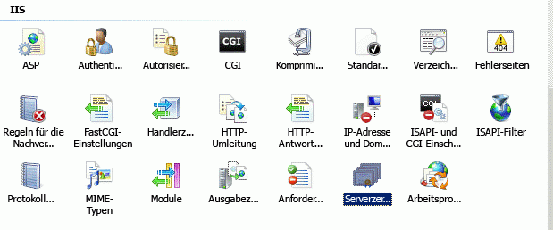
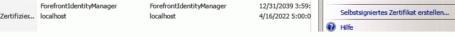
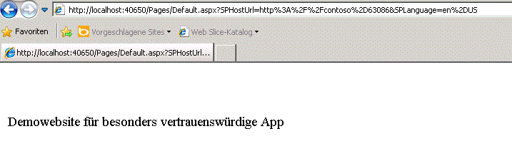

# <a name="create-high-trust-sharepoint-add-ins"></a>Erstellen besonders vertrauenswürdiger Add-Ins für SharePoint
Hier erfahren Sie, wie eine besonders vertrauenswürdige SharePoint-Add-In erstellt wird. Eine besonders vertrauenswürdige App verwendet digitale Zertifikate, um eine Vertrauensstellung zwischen einer Remotewebanwendung und SharePoint einzurichten. Besonders vertrauenswürdige Apps können nur in lokalen SharePoint-Installationen installiert werden, nicht in Microsoft SharePoint Online. Sie dienen darüber hinaus vorrangig der Verwendung in einer lokalen Installation statt in einer cloudbasierten Webanwendung.
 

 **Hinweis** Der Name „Apps für SharePoint“ wird in „SharePoint-Add-Ins“ geändert. Während des Übergangszeitraums wird in der Dokumentation und der Benutzeroberfläche einiger SharePoint-Produkte und Visual Studio-Tools möglicherweise weiterhin der Begriff „Apps für SharePoint“ verwendet. Weitere Informationen finden Sie unter [Neuer Name für Office- und SharePoint-Apps](new-name-for-apps-for-sharepoint.md#bk_newname).
 


## <a name="prerequisites-for-creating-high-trust-add-ins"></a>Voraussetzungen für das Erstellen besonders vertrauenswürdiger Add-Ins
<a name="Prereqs"> </a>

Um die Verfahren in diesem Artikel ausführen zu können, benötigen Sie Folgendes:
 

 

- Eine lokale SharePoint-Entwicklungsumgebung. Eine Anleitung zur Einrichtung finden Sie unter  [Einrichten einer lokalen Entwicklungsumgebung für SharePoint-Add-Ins](set-up-an-on-premises-development-environment-for-sharepoint-add-ins.md). Achten Sie insbesondere darauf. dass Sie die Schritte im Abschnitt  [Konfigurieren von Diensten in SharePoint für die Verwendung in Server-zu-Server-Add-Ins](set-up-an-on-premises-development-environment-for-sharepoint-add-ins.md#Servertoserver) ordnungsgemäß ausführen.
    
 
- Erfahrung im Erstellen eines von einem Anbieter gehosteten SharePoint-Add-Ins. Weitere Informationen finden Sie unter [Erste Schritte beim Erstellen von von einem Anbieter gehosteten SharePoint-Add-Ins](get-started-creating-provider-hosted-sharepoint-add-ins.md).
    
 
- Installation von Visual Studio, entweder remote oder auf dem Computer, auf dem SharePoint installiert ist.
    
 
- Microsoft Office-Entwicklertools für Visual Studio.
    
 
- Gute Kenntnisse im Bereich digitale Zertifikate - Art und Nutzung
    
 
Lesen Sie die folgenden Artikel, um ein besseres Verständnis von SharePoint-Add-Ins und digitalen Zertifikate zu erhalten.
 

 

**Tabelle 1. Kernkonzepte der Einrichtung von SharePoint zur Ausführung besonders vertrauenswürdiger Add-Ins**


|**Titel des Artikels**|**Beschreibung**|
|:-----|:-----|
| [Erste Schritte beim Erstellen von von einem Anbieter gehosteten SharePoint-Add-Ins](get-started-creating-provider-hosted-sharepoint-add-ins.md)|Erfahren Sie, wie Sie eine grundlegende von einem Anbieter gehostete SharePoint-Add-In mit Office-Entwicklertools für Visual Studio erstellen und wie Sie unter Verwendung des SharePoint-CSOM mit SharePoint-Sites interagieren.|
| [Digitale Zertifikate](http://msdn.microsoft.com/library/e523b335-0156-4f47-b55c-b80495587c4f.aspx) und [Arbeiten mit Zertifikaten](http://msdn.microsoft.com/library/6ffb8682-8f07-4a45-afbb-8d2487e9dbc3.aspx)|Lernen Sie die grundlegenden Ideen hinter digitalen Zertifikaten kennen.|

## <a name="introduction-to-running-high-trust-add-ins"></a>Einführung in die Ausführung besonders vertrauenswürdiger Add-Ins
<a name="Intro"> </a>

Eine besonders vertrauenswürdige App ist eine von einem Anbieter gehostete SharePoint-Add-In, die digitale Zertifikate verwendet, um eine Vertrauensstellung zwischen der Remotewebanwendung und SharePoint einzurichten. "Besonders vertrauenswürdig" ist nicht gleichbedeutend mit "voll vertrauenswürdig". Eine besonders vertrauenswürdige App muss dennoch App-Berechtigungen anfordern. Die App gilt als "besonders vertrauenswürdig", da sie jede Benutzeridentität verwenden darf, die sie benötigt. Die App ist für die Erstellung des Benutzeranteils des Zugriffstoken verantwortlich, der an SharePoint übergeben wird.
 

 
Eine besonders vertrauenswürdige SharePoint-Add-In wird in erster Linie für die Verwendung in einer lokalen, standortgebundenen Umgebung erstellt. Sie kann nicht für Microsoft SharePoint Online installiert werden, und die Remotekomponenten werden in der Regel ebenfalls lokal installiert - innerhalb der Unternehmensfirewall. Auf diese Weise sind die Instanzen von SharePoint-Add-In spezifisch für jedes einzelne Unternehmen.
 

 
Für eine besonders vertrauenswürdige App wird zum Einrichten der Vertrauensstellung anstelle eines Kontexttoken ein Zertifikat verwendet. (Eine vom Anbieter gehostete App, die für die Verwendung des Microsoft Azure Access Control Service (ACS) als Vertrauensbroker erstellt wurde, muss geändert werden, um als besonders vertrauenswürdige App verwendet werden zu können.) Für besonders vertrauenswürdige Apps ist die Konfiguration in der SharePoint-Farm und auf dem Server erforderlich, auf dem die Remotewebanwendung gehostet wird. In diesem Thema werden die Konfigurationsschritte erläutert, die erforderlich sind, damit das Visual Studio-Debugging ( **F5**) verwendet werden kann. Für die Konfiguration einer Test-, Staging- oder Produktionsumgebung weichen diese Schritte leicht ab. Sie sind im Thema  [Packen und Veröffentlichen besonders vertrauenswürdiger Add-Ins für SharePoint](package-and-publish-high-trust-sharepoint-add-ins.md) beschrieben. 
 

 
In SharePoint stellt der Server-zu-Server-Sicherheitstokendienst Zugriffstoken für die Server-zu-Server-Authentifizierung bereit. Der Server-zu-Server-Sicherheitstokendienst gewährt temporären Zugriffstoken Zugriff auf andere Anwendungsdienste, z. B. Exchange 2013, Lync 2013 und Add-Ins für SharePoint. Mithilfe von Windows PowerShell-Cmdlets und eines Zertifikats richten Sie eine Vertrauensstellung zwischen den Anwendungsdiensten ein (beispielsweise die Vertrauensstellung zwischen SharePoint und einem Remote-Add-In) .
 

 

 **Hinweis** Der Server-zu-Server-Sicherheitstokendienst ist nicht für die Benutzerauthentifizierung vorgesehen. Daher wird der Server-zu-Server-Sicherheitstokendienst weder auf der Benutzeranmeldeseite noch im Abschnitt **Authentifizierungsanbieter** der Zentraladministration oder der Personenauswahl in SharePoint angezeigt.
 

In diesem Artikel wird beschrieben, wie Sie ein besonders vertrauenswürdiges Add-In erstellen. Außerdem werden Ausweisungen bereitgestellt, wie Sie das Add-In so einrichten, dass es in Visual Studio durch Drücken der Taste **F5** ausgeführt werden kann. Sie erfahren Folgendes:
 

 

- Konfigurieren eines Add-Ins für die Verwendung als besonders vertrauenswürdiges Add-In.
    
 
- Konfigurieren von SharePoint für die Verwendung von besonders vertrauenswürdigen Apps.
    
 
- Erstellen einer einfachen besonders vertrauenswürdigen App.
    
 

## <a name="obtain-a-certificate-or-create-a-public-and-private-test-certificate"></a>Abrufen eines Zertifikat oder Erstellen eines öffentlichen und privaten Testzertifikats
<a name="Cert2"> </a>

Sie benötigen ein digitales X.509-Zertifikat für die Remotewebanwendung Ihrer besonders vertrauenswürdigen App. Damit Sie Ihre SharePoint-Add-In umfassend testen können, benötigen Sie ein von einer Domäne ausgestelltes oder kommerzielles Zertifikat, das von einer Zertifizierungsstelle ausgegeben wurde. Zu Beginn des Debuggings können Sie jedoch auch ein selbstsigniertes Zertifikat verwenden. Im folgenden Vorgang wird beschrieben, wie Sie mit IIS ein Testzertifikat erstellen und exportieren. Im nachfolgenden Abschnitt  [Abschließen des Debuggings mit einem von der Domäne ausgestellten oder kommerziellen Zertifikat](#NewCertificate) erfahren Sie, wie Sie das selbstsignierte Zertifikat durch ein von einer Domäne ausgestelltes oder kommerzielles Zertifikat ersetzen.
 

 
Alternativ können Sie auch mit dem Testprogramm MakeCert ein X.509-Zertifikat erstellen. Weitere Informationen zur Verwendung von MakeCert finden Sie unter  [Signing and checking code with Authenticode](http://msdn.microsoft.com/de-DE/library/ms537364%28VS.85%29.aspx).
 

 
Erstellen Sie zunächst eine PFX-Zertifikat-Testdatei und dann eine entsprechende CER-Testdatei. Das PFX-Zertifikat enthält den privaten Schlüssel, der von der Remotewebanwendung verwendet wird, um die Kommunikation mit SharePoint zu signieren. Die CER-Datei enthält den öffentlichen Schlüssel, über den SharePoint Meldungen entschlüsselt und sicherstellt, dass diese von einer Remotewebanwendung stammen und außerdem sicherstellt, dass die Remotewebanwendung über einen Zugriffstoken von einem Tokenherausgeber verfügt, dem SharePoint vertraut. Weitere Informationen zu den PFX- und CER-Dateien finden Sie unter  [Softwareherausgeberzertifikat](http://msdn.microsoft.com/de-DE/library/windows/hardware/ff552299%28v=vs.85%29.aspx)
 

 

### <a name="to-create-a-self-signed-test-pfx-certificate-file"></a>So erstellen Sie eine selbstsignierte PFX-Zertifikatstestdatei


1. Wenn Sie eine besonders vertrauenswürdige SharePoint-Add-In in Visual Studio debuggen, wird die Remotewebanwendung in IIS Express auf dem Computer gehostet, auf dem Visual Studio installiert ist. Daher verfügt der Computer mit der Remotewebanwendung nicht über den IIS-Manager, in dem Sie das Zertifikat erstellen können. Aus diesem Grund verwenden Sie IIS auf dem  *SharePoint*  -Testserver für die Erstellung des Zertifikats. Wählen Sie im IIS-Manager in der Strukturansicht auf der linken Seite den Knoten _ServerName_ aus.
    
 
2. Wählen Sie das Symbol **Serverzertifikate** aus, das in Abbildung 1 zu sehen ist.
    
    **Abbildung 1. Option „Serverzertifikat“" in IIS**

 

  
 

 

 
3. Wählen Sie in der Gruppe mit den Links auf der rechten Seite den Link **Selbstsigniertes Zertifikat erstellen** aus, wie in Abbildung 2 dargestellt.
    
    **Abbildung 2. Link zum Erstellen selbstsignierten Zertifikats**

 

  
 

 

 
4. Geben Sie für das Zertifikat den Namen „HighTrustSampleCert“ ein, und wählen Sie dann **OK**.
    
 
5. Klicken Sie mit der rechten Maustaste auf das Zertifikat, und wählen Sie dann **Exportieren** aus, wie in Abbildung 3 dargestellt.
    
    **Abbildung 3: Exportieren eines Testzertifikats**

 

  
 

 

 
6. Erstellen Sie in Windows oder in einer Befehlszeile einen Ordner namens „C:\Certs“.
    
 
7. Exportieren Sie im IIS-Manager die Datei nach „C:\Certs“, und weisen Sie ihr Kennwort zu. In diesem Beispiel lautet das Kennwort **password**.
    
 
8. Wenn sich Ihre SharePoint-Testinstallation nicht auf demselben Computer befindet, auf dem Visual Studio ausgeführt wird, erstellen Sie auf dem Visual Studio-Computer einen Ordner mit dem Namen „C:\Certs“, und verschieben Sie die Datei „HighTrustSampleCert.pfx“ in diesen Ordner. Dies ist der Computer, auf dem die Remotewebanwendung ausgeführt wird, wenn Sie ein Debugging in Visual Studio ausführen.
    
 

### <a name="to-create-a-corresponding-cer-file"></a>So erstellen Sie eine entsprechende CER-Datei


1. Stellen Sie auf dem SharePoint-Server sicher, dass die Add-In-Pool-Identitäten für die folgenden IIS-Add-In-Pools über Leseberechtigungen für den Ordner „C:\Certs“ verfügen:
    
      -  **SecurityTokenServiceApplicationPool**
    
 
  - Der Add-In-Pool, der die IIS-Website bedient, die die übergeordnete SharePoint-Webanwendung für Ihre SharePoint-Testwebsite hostet. Für die IIS-Website **SharePoint - 80** wird der Pool als **OServerPortalAppPool** bezeichnet.
    
 
2. Wählen Sie im IIS-Manager in der Strukturansicht auf der linken Seite den Knoten _ServerName_ aus.
    
 
3. Doppelklicken Sie auf **Serverzertifikate**.
    
 
4. Doppelklicken Sie in der Ansicht **Serverzertifikate** auf **HighTrustSampleCert**, um die Zertifikatdetails anzuzeigen.
    
 
5. Wählen Sie auf der Registerkarte **Details** die Option **In Datei kopieren**, um den **Zertifikatexport-Assistenten** zu starten. Klicken Sie anschließend auf **Weiter**.
    
 
6. Verwenden Sie den Standardwert **Nein, privaten Schlüssel nicht exportieren**, und wählen Sie dann **Weiter**.
    
 
7. Verwenden Sie die Standardwerte. Wählen Sie **Weiter**.
    
 
8. Wählen Sie **Durchsuchen**, navigieren Sie zu „C:\Certs“, geben Sie als Namen des Zertifikats **HighTrustSampleCert** an, und wählen Sie dann **Speichern**. Das Zertifikat wird als CER-Datei gespeichert.
    
 
9. Wählen Sie **Weiter**.
    
 
10. Wählen Sie **Fertig stellen**.
    
 

## <a name="configure-sharepoint-to-use-certificates-and-configure-trust-for-your-add-in"></a>Konfigurieren von SharePoint für die Verwendung von Zertifikaten und Konfigurieren einer Vertrauensstellung für das Add-In
<a name="Configure2"> </a>

Das Windows PowerShell-Skript, das Sie in diesem Abschnitt erstellen, soll die Verwendung von **F5** in Visual Studio unterstützen. Es dient *nicht* zur ordnungsgemäßen Konfiguration einer SharePoint-Staging- oder -Produktionsinstallation. Anweisungen zur Konfiguration einer SharePoint-Staging- oder -Produktionsinstallation zur Verwendung von Zertifikaten finden Sie unter [Packen und Veröffentlichen besonders vertrauenswürdiger Add-Ins für SharePoint](package-and-publish-high-trust-sharepoint-add-ins.md).
 

 

 **Hinweis** Stellen Sie sicher, dass Sie die Schritte unter [Konfigurieren von Diensten in SharePoint für die Verwendung in Server-zu-Server-Add-Ins](set-up-an-on-premises-development-environment-for-sharepoint-add-ins.md#Servertoserver) (dies wird als Voraussetzung für diesen Artikel aufgeführt) ordnungsgemäß ausgeführt haben. Wenn dies nicht der Fall ist, müssen Sie jetzt die Konfiguration vornehmen, um fortfahren zu können.
 


### <a name="to-configure-sharepoint"></a>Konfigurieren von SharePoint


1. Beginnen Sie in einem Text-Editor oder Windows PowerShell-Editor eine neue Datei, und fügen Sie die folgenden Zeilen hinzu, um ein Zertifikatsobjekt zu erstellen:
    
```
  $publicCertPath = "C:\Certs\HighTrustSampleCert.cer"
$certificate = New-Object System.Security.Cryptography.X509Certificates.X509Certificate2($publicCertPath)

```

2. Fügen Sie die folgende Zeile hinzu, um sicherzustellen, dass SharePoint das Zertifikat als Stammzertifizierungsstelle behandelt.
    
```
  New-SPTrustedRootAuthority -Name "HighTrustSampleCert" -Certificate $certificate 

```

3. Fügen Sie die folgende Zeile hinzu, um die ID des Autorisierungsbereichs abzurufen.
    
```
  $realm = Get-SPAuthenticationRealm

```

4. Ihre Remotewebanwendung verwendet ein Zugriffstoken, um Zugriff auf SharePoint-Daten zu erhalten. Das Zugriffstoken muss von einem Tokenaussteller ausgegeben werden, dem SharePoint vertraut. In einem besonders vertrauenswürdigen SharePoint-Add-In ist das Zertifikat der Tokenaussteller. Fügen Sie die folgenden Zeilen hinzu, um eine Aussteller-ID in dem von SharePoint geforderten Format zu erstellen: **\_specific\_issuer\_GUID\_@\_realm\_GUID\_**.
    
```
  $specificIssuerId = "11111111-1111-1111-1111-111111111111"
$fullIssuerIdentifier = $specificIssuerId + '@' + $realm 

```


     **Note**  The  `$specificIssuerId` value must be a GUID because in a production environment each certificate must have a unique issuer. However, in this context, where you use the same certificate to debug all your high-trust add-ins, you can hard code the value. If for any reason, you use a different GUID from the one used here, * **be sure that any letters in the GUID are lower case***  . The SharePoint infrastructure currently requires lower case for certificate issuer GUIDs.
5. Fügen Sie die folgenden Zeilen hinzu, um das Zertifikat als vertrauenswürdigen Tokenherausgeber zu registrieren. Der  `-Name`-Parameter muss eindeutig sein. Daher ist es in einer Produktionskonfiguration üblich, eine GUID teilweise (oder vollständig) als Namen zu verwenden. Sie können in diesem Zusammenhang jedoch auch einen Anzeigenamen verwenden. Mit dem  `-IsTrustBroker`-Switch wird sichergestellt, dass Sie dasselbe Zertifikat für alle besonders vertrauenswürdigen Apps, die Sie entwickeln, verwenden können. Der Befehl  `iisreset` ist erforderlich, damit Ihr Tokenherausgeber sofort registriert ist. Andernfalls müssen Sie möglicherweise bis zu 24 Stunden warten, bis der neue Aussteller registriert ist.
    
```
  New-SPTrustedSecurityTokenIssuer -Name "High Trust Sample Cert" -Certificate $certificate -RegisteredIssuerName $fullIssuerIdentifier -IsTrustBroker
iisreset 

```

6. In SharePoint werden normalerweise keine selbstsignierten Zertifikate akzeptiert. Wenn Sie also ein selbstsigniertes Zertifikat für das Debuggen verwenden, fügen Sie die folgenden Zeilen hinzu, um die normalen SharePoint-Anforderungen zur Verwendung von HTTPS zu deaktivieren, sobald Remotewebanwendungen in SharePoint aufgerufen werden. Andernfalls erhalten Sie eine Meldung vom Typ **403 (forbidden)**, wenn die Remotewebanwendung SharePoint mithilfe eines selbstsignierten Zertifikats aufruft. Sie können diesen Schritt in einem späteren Vorgang rückgängig machen. Wenn Sie die HTTPS-Anforderung deaktivieren, werden Anfragen von der Remotewebanwendung an SharePoint nicht verschlüsselt. Das Zertifikat kann jedoch immer noch als vertrauenswürdiger Aussteller von Zugriffstoken verwendet werden, die Hauptaufgabe des Zertifikats in besonders vertrauenswürdigen SharePoint-Add-Ins.
    
```
  $serviceConfig = Get-SPSecurityTokenServiceConfig
$serviceConfig.AllowOAuthOverHttp = $true
$serviceConfig.Update()

```

7. Speichern Sie die Datei unter dem Namen „HighTrustConfig-ForDebugOnly.ps1“.
    
 
8. Öffnen Sie die **SharePoint-Verwaltungsshell** als Administrator, und führen Sie die Datei mit der folgenden Zeile aus:
    
```
  ./HighTrustConfig-ForDebugOnly.ps1
```


## <a name="create-a-high-trust-sharepoint-add-in"></a>Erstellen eines besonders vertrauenswürdigen SharePoint-Add-Ins
<a name="Createapp2"> </a>

In diesem Abschnitt erfahren Sie, wie Sie ein besonders vertrauenswürdiges SharePoint-Add-In mit Visual Studio erstellen.
 

 

 **Hinweis** Wie im Abschnitt [Voraussetzungen für die Erstellung von besonders vertrauenswürdigen Add-Ins](#Prereqs) angegeben, wird in diesem Artikel davon ausgegangen, dass Sie wissen, wie ein von einem Anbieter gehostetes SharePoint-Add-In erstellt wird. Weitere Informationen finden Sie unter [Erste Schritte beim Erstellen von von einem Anbieter gehosteten SharePoint-Add-Ins](get-started-creating-provider-hosted-sharepoint-add-ins.md).
 


### <a name="to-create-a-high-trust-sharepoint-add-in"></a>So erstellen Sie ein besonders vertrauenswürdiges SharePoint-Add-In


1. Wählen Sie in Visual Studio die Optionen **Datei**, **Neu**, **Projekt**.
    
 
2. Erweitern Sie im Assistenten **Neues Projekt** den Knoten **Visual C#** oder **Visual Basic** und anschließend den Knoten **Office/SharePoint**.
    
 
3. Klicken Sie auf **Add-Ins**, und wählen Sie dann die Option zum Erstellen eines Projekts vom Typ **Add-In für SharePoint**.
    
 
4. Nennen Sie das Projekt „HighTrustSampleApp“.
    
 
5. Speichern Sie das Projekt an einem Speicherort Ihrer Wahl, und wählen Sie dann **OK**.
    
 
6. Geben Sie die vollständige URL der SharePoint-Entwicklerwebsite an. Beispiel: http://TestServer/sites/devsite/
    
 
7. Wählen Sie die Option **Von Anbieter gehostet** und dann die Schaltfläche **Weiter** aus.
    
 
8. Wenn Sie aufgefordert werden, die Art des Webprojekts anzugeben, wählen Sie **ASP.NET Webformular-Anwendung** für das fortlaufende Beispiel dieses Artikels aus, und wählen Sie dann die Schaltfläche **Weiter**.
    
 
9. Die Seite **Authentifizierungseinstellungen konfigurieren** des Assistenten wird geöffnet. Die Werte, die Sie in diesem Formular hinzufügen, werden automatisch der Datei „web.config“ hinzugefügt. Wählen Sie unter **Wie soll Ihrr Add-In authentifiziert werden?** die Option **Zertifikat verwenden** aus.
    
 
10. Klicken Sie neben dem Feld **Speicherort des Zertifikats** auf die Schaltfläche **Durchsuchen**, und navigieren Sie zum Speicherort des selbstsignierten Zertifikats (PFX-Datei), das Sie erstellt haben (C:\Certs). Der Wert des Felds sollte der vollständige Pfad „C:\Certs\HighTrustSampleCert.pfx“ sein. 
    
 
11. Geben Sie das Kennwort für dieses Zertifikat im Feld **Kennwort** ein. In diesem Fall lautet es „password“.
    
 
12. Geben Sie die Aussteller-ID ( `11111111-1111-1111-1111-111111111111`) in das Feld **Aussteller-ID** ein.
    
 
13. Wählen Sie die Option **Fertig stellen**. Ein Großteil der Konfiguration wird beim Öffnen der Projektmappe durchgeführt. In der Visual Studio-Projektmappe werden zwei Projekte erstellt: eines für das SharePoint-Add-In und das andere für die ASP.NET-Webanwendung.
    
 

### <a name="to-run-and-debug-the-add-in"></a>So führen Sie das Add-In aus und debuggen es


1. Office Developer Tools für Visual Studio generiert automatisch eine Datei mit dem Namen „default.aspx“ und eine Datei mit dem Namen „default.aspx.cs“, wenn das ASP.NET-Projekt erstellt wird. Der generierte Code ruft den Titel des SharePoint-Hostweb ab und druckt diesen auf der Standardseite der Remotewebanwendung. Das genaue Markup und der Code in diesen Dateien variieren je nach Version der Tools. Für dieses Thema können Sie die erstellten Dateien „default.aspx“ und „default.aspx.cs“ ohne Änderung verwenden.
    
 
2. Drücken Sie zum Testen des SharePoint-Add-Ins und der zugehörigen Remotewebanwendung in Visual Studio die Taste **F5**. Die Webanwendung wird an IIS Express auf *localhost* bereitgestellt. Das SharePoint-Add-In wird auf der SharePoint-Zielwebsite installiert. Sie werden von SharePoint aufgefordert, die Berechtigungen zu gewähren, die vom SharePoint-Add-In angefordert werden. Einige Versionen vonOffice Developer Tools für Visual Studio starten das Add-In sofort, andere öffnen die Seite **Websiteinhalte** der SharePoint-Zielwebsite, und Sie können sehen, dass das neue Add-In dort aufgeführt wird.
    
    Starten Sie das Add-In, wenn es nicht automatisch gestartet wird. Die Remotewebanwendung wird mit der Seite geöffnet, die in der Datei „AppManifest.xml“ als **Startseite** angegeben ist – Default.aspx. Ihr Add-In sollte etwa wie in Abbildung 4 aussehen.
    

    **Abbildung 4. Beispiel-Add-In, das SharePoint Server aufruft und den Titel des SharePoint-Hostweb abruft**

 

  
 

 

 

## <a name="complete-debugging-with-a-domain-issued-or-commercial-certificate"></a>Durchführen des Debugging für ein von einer Domäne ausgestelltes oder kommerzielles Zertifikat
<a name="NewCertificate"> </a>

Mit dem zuvor erstellten Windows PowerShell-Skript wurde die übliche Anforderung von SharePoint, dass Remotewebanwendungen mit HTTPS-Protokoll auf SharePoint zugreifen, deaktiviert. Bei deaktiviertem HTTPS übersehen Sie als Entwickler während der Erstellung der App möglicherweise bestimmte Probleme, die in einer Produktionsumgebung auftreten würden, in der HTTPS erforderlich ist. Daher sollten Sie die Entwicklungs- und Debugging-Phasen nicht als abgeschlossen ansehen, bis Sie das Testzertifikat durch ein von der Domäne ausgestelltes Zertifikat bzw. kommerzielles Zertifikat ersetzt und die App anschließend erneut getestet haben, und zwar mit aktivierter HTTPS-Anforderung.
 

 
Wenn Sie das neue Zertifikat abgerufen haben, müssen Sie - sofern Sie dies noch nicht getan haben - ein Kennwort hinzuzufügen. In einer Produktionsumgebung sollten Sie ein sicheres Kennwort verwenden, für das Debuggen einer SharePoint-Add-In können Sie ein beliebiges Kennwort verwenden. Sie benötigen das Zertifikat im PFX- und CER-Format. Wenn es beim Abrufen nicht im PFX-Format vorliegt, müssen Sie es mithilfe eines Dienstprogramms in das PFX-Format konvertieren. Wenn Sie über eine PFX-Datei verfügen, können Sie sie in IIS importieren und die CER-Datei wie im folgenden Verfahren beschrieben exportieren.
 

 

### <a name="to-import-the-new-certificate"></a>So importieren Sie das neue Zertifikat


1. Legen Sie die PFX-Datei unter „C:\Certs“ auf dem SharePoint-Server ab. In diesem Artikel wird davon ausgegangen, dass die Datei den Namen _MyCert_.pfx aufweist. Sie sollten „MyCert“ in sämtlichen Anweisungen durch dem tatsächlichen Namen Ihres Zertifikats ersetzen.
    
 
2. Wählen Sie im IIS-Manager in der Strukturansicht auf der linken Seite den Knoten _ServerName_ aus.
    
 
3. Doppelklicken Sie auf das Symbol **Serverzertifikate**.
    
 
4. Wählen Sie im Bereich **Aktionen** auf der rechten Seite **Importieren** aus.
    
 
5. Verwenden Sie im Dialogfeld **Zertifikat importieren** die Schaltfläche „Durchsuchen“, um zu „C:\Certs\ _MyCert_.pfx“ zu navigieren, und geben Sie dann das Kennwort des Zertifikats ein.
    
 
6. Achten Sie darauf, dass **Dieses Zertifikat darf exportiert werden** aktiviert ist. Klicken Sie auf **OK**.
    
 
7. Klicken Sie in der Liste **Serverzertifikate** mit der rechten Maustaste auf das Zertifikat, und wählen Sie dann **Exportieren** aus, wie oben in Abbildung 3 gezeigt.
    
 
8. Exportieren Sie die Datei nach „C:\Certs“, und geben Sie das Kennwort an.
    
 
9. Wenn sich Ihre SharePoint-Testinstallation nicht auf demselben Computer befindet, auf dem Visual Studio ausgeführt wird, verschieben Sie die Datei _MyCert_.pfx in den Ordner „C:\Certs“ auf dem Computer mit Visual Studio. 
    
 
10. Doppelklicken Sie in der Ansicht **Serverzertifikate** auf _MyCert_, um die Zertifikatdetails anzuzeigen.
    
 
11. Wählen Sie auf der Registerkarte **Details** die Option **In Datei kopieren**, um den **Zertifikatexport-Assistenten** zu starten. Klicken Sie anschließend auf **Weiter**.
    
 
12. Verwenden Sie den Standardwert **Nein, privaten Schlüssel nicht exportieren**, und wählen Sie dann **Weiter**.
    
 
13. Verwenden Sie die Standardwerte. Wählen Sie **Weiter**.
    
 
14. Wählen Sie **Durchsuchen** aus, navigieren Sie zu „C:\Certs“, geben Sie als Namen des Zertifikats _MyCert_ ein, und wählen Sie dann **Speichern** aus. Das Zertifikat wird in einer CER-Datei gespeichert.
    
 
15. Wählen Sie **Weiter**.
    
 
16. Wählen Sie **Fertig stellen**.
    
 

### <a name="to-configure-sharepoint-to-use-the-new-certificate"></a>So konfigurieren Sie SharePoint für die Verwendung des neuen Zertifikats


1. Öffnen Sie die Datei „HighTrustConfig-ForDebugOnly.ps1“ zur Bearbeitung, und nehmen Sie die folgenden Änderungen vor:
    
      1. Ersetzen Sie `HighTrustSampleCert` an beiden Stellen, an denen die Zeichenfolge angezeigt wird, durch _MyCert_.
    
 
  2. Ersetzen Sie die spezifische Aussteller-ID `11111111-1111-1111-1111-111111111111`, durch `22222222-2222-2222-2222-222222222222`.
    
 
  3. Ersetzen Sie „High Trust Sample Cert“ durch „My Cert“ oder einen anderen entsprechenden Anzeigenamen.
    
 
  4. Ersetzen Sie in der Zeile `$serviceConfig.AllowOAuthOverHttp = $true` den Wert `true` durch `false`. Hierdurch wird die Anforderung, dass HTTPS verwendet wird, wieder aktiviert.
    
 
2. Speichern Sie die Datei.
    
 
3. Öffnen Sie die **SharePoint-Verwaltungsshell** als Administrator, und führen Sie die Datei mit der folgenden Zeile aus:
    
```
  ./HighTrustConfig-ForDebugOnly.ps1
```


### <a name="to-reconfigure-the-remote-web-application"></a>So konfigurieren Sie die Remotewebanwendung um


1. Öffnen Sie in Visual Studio die Datei „web.config“ des Webanwendungsprojekts, und nehmen Sie die folgenden Änderungen vor:
    
      1. Ersetzen Sie im Schlüssel `ClientSigningCertificatePath` den Pfad `C:\Certs\HighTrustSampleCert.pfx` durch `C:\Certs\` _MyCert_ `.pfx`.
    
 
  2. Ersetzen Sie den Wert des Schlüssels `ClientSigningCertificatePassword` durch das tatsächliche Kennwort des Zertifikats.
    
 
  3. Ersetzen Sie den Wert des Schlüssels `IssuerId` durch `22222222-2222-2222-2222-222222222222`.
    
 
2. Drücken Sie **F5**, um das Add-In zu debuggen.
    
 
Lesen Sie nach Abschluss der Entwicklung Ihrer besonders vertrauenswürdigen App unter  [Packen und Veröffentlichen besonders vertrauenswürdiger Add-Ins für SharePoint](package-and-publish-high-trust-sharepoint-add-ins.md) die Anweisungen zum Verpacken und Veröffentlichen dieser Art von SharePoint-Add-In.
 

 

## <a name="what-do-the-tokenhelper-and-sharepointcontext-files-do"></a>Welche Funktion haben die Dateien „TokenHelper“ und „SharePointContext“?
<a name="TokenHelper"> </a>

Office Developer Tools für Visual Studio enthält eine Datei mit dem Namen „TokenHelper.cs“ (oder „TokenHelper.vb“) in der Remotewebanwendung. Einige Versionen der Tools umfassen auch eine Datei mit dem Namen „SharePointContext.cs“ (oder „SharePointContext.vb“). Der Code in diesen Dateien führt Folgendes aus:
 

 

- Konfigurieren von .NET zum Anerkennen von Zertifikaten als vertrauenswürdig beim Ausführen von Netzwerkaufrufen. 
    
 
- Abrufen eines Server-zu-Server-Zugriffstoken, das vom privaten Zertifikat der Remotewebanwendung im Namen des angegebenen **WindowsIdentity**-Objekts signiert wurde und von SharePoint zum Einrichten der Vertrauensstellung verwendet wird.
    
 
- Abrufen des SharePoint-Sicherheitstokendienst (STS)-Zertifikats.
    
 
- In Anwendungen, die ein Autorisierungssystem mit niedriger anstelle von hoher Vertrauenswürdigkeit verwenden, verfügen diese Dateien über zusätzliche Aufgaben, beispielsweise die Behandlung von OAuth-Token für das unter  [OAuth-Ablauf mit Kontexttoken für Add-Ins in SharePoint](context-token-oauth-flow-for-sharepoint-add-ins.md) beschriebene Szenario. Eine Beschreibung dieses Szenarios würde den Rahmen dieses Artikels jedoch sprengen. 
    
 
Weitere Informationen zu TokenHelper und SharePointContext finden Sie in den Kommentare in den Dateien.
 

 
In einer besonders vertrauenswürdigen App gibt es kein Kontexttoken. Das Kontexttoken ist spezifisch für Konfigurationen, die eine Autorisierung mit niedriger Vertrauensebene verwenden. Es ist jedoch auch weiterhin ein Zugriffstoken erforderlich. Wenn Sie eine besonders vertrauenswürdige Konfiguration verwenden, muss Ihre Webanwendung den Benutzer auf dieselbe Weise authentifizieren, wie dies in SharePoint erfolgt (d. h., die App ist für die Erstellung des Zugriffstoken, einschließlich der IDs des Benutzers und des Identitätsanbieters verantwortlich). 
 

 
Wenn Sie ein Debugging in Visual Studio mit **F5** ausführen, verwendet Microsoft Office Developer Tools für Visual Studio die Windows-Authentifizierung, und die zwei erstellten Codedateien verwenden die Windows-Identität der Person, die das Add-In ausführt, zum Erstellen des Zugriffstokens. Wenn Ihr Add-In veröffentlicht wird, müssen Sie die Remotewebanwendung im IIS-Manager so konfigurieren, dass die Windows-Authentifizierung verwendet wird, wenn Sie die zwei erstellten Dateien ohne Änderung verwenden möchten. Wenn Ihre Anwendung keine Windows-Authentifizierung in der Produktionsumgebung verwendet, müssen Sie die generierten Codedateien (TokenHelper und/oder SharePointContext) anpassen, damit sie ein anderes Authentifizierungssystem verwenden. Sie müssen diese Dateien auch anpassen, wenn Ihre Remotewebanwendung mit einer anderen Identität als der des Benutzers, der das SharePoint-Add-In ausführt, auf SharePoint zugreift. Schließlich muss Ihr Code, wenn die Remotewebanwendung PHP, node.js, Java oder eine andere Nicht-ASP.NET-Plattform ist, die ID des Benutzers von dem jeweiligen Authentifizierungssystem abrufen und diese ID dann zu dem Zugriffstoken hinzufügen, das zusammengestellt wird. Weitere Informationen finden Sie unter [Packen und Veröffentlichen besonders vertrauenswürdiger Add-Ins für SharePoint](package-and-publish-high-trust-sharepoint-add-ins.md), [Erstellen und Verwenden von Zugriffstoken in von einem Anbieter gehosteten besonders vertrauenswürdigen SharePoint-Add-Ins](create-and-use-access-tokens-in-provider-hosted-high-trust-sharepoint-add-ins.md) und [Verwenden von SharePoint-Add-Ins mit SAML- und FBA-Websites in SharePoint](http://blogs.technet.com/b/speschka/archive/2012/12/07/using-sharepoint-apps-with-saml-and-fba-sites-in-sharepoint-2013.aspx).
 

 

## <a name="additional-resources"></a>Zusätzliche Ressourcen
<a name="bk_addresources"> </a>


-  [Packen und Veröffentlichen besonders vertrauenswürdiger SharePoint-Add-Ins](package-and-publish-high-trust-sharepoint-add-ins.md)
    
 
-  [Tipps zur Problembehandlung für besonders vertrauenswürdige Add-Ins unter SharePoint](http://blogs.technet.com/b/speschka/archive/2012/11/01/more-troubleshooting-tips-for-high-trust-apps-on-sharepoint-2013.aspx)
    
 
-  [Registrieren von SharePoint-Add-Ins 2013](register-sharepoint-add-ins.md)
    
 
-  [Autorisierung und Authentifizierung für Add-Ins in SharePoint](authorization-and-authentication-of-sharepoint-add-ins.md)
    
 
-  [Ankündigung der neuen SharePointContext-Hilfsklasse in SharePoint 2013-Add-Ins](http://blogs.msdn.com/b/officeapps/archive/2013/11/07/announcing-the-new-sharepointcontext-helper-in-apps-for-sharepoint-2013.aspx)
    
 
-  [Add-In-Berechtigungen in SharePoint](add-in-permissions-in-sharepoint.md)
    
 
-  [Erste Schritte beim Erstellen von von einem Anbieter gehosteten SharePoint-Add-Ins](get-started-creating-provider-hosted-sharepoint-add-ins.md)
    
 

