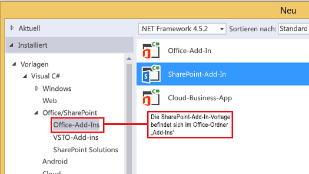

# <a name="customize-a-list-view-in-sharepoint-add-ins-using-client-side-rendering"></a><span data-ttu-id="76ce2-102">Anpassen einer Listenansicht in SharePoint-Add-Ins durch clientseitiges Rendering</span><span class="sxs-lookup"><span data-stu-id="76ce2-102">Customize a list view in SharePoint Add-ins using client-side rendering</span></span>
<span data-ttu-id="76ce2-103">Erfahren Sie, wie Sie eine Listenansicht in einem von SharePoint gehosteten Add-In mithilfe der clientseitigen Renderingtechnologie in SharePoint anpassen.</span><span class="sxs-lookup"><span data-stu-id="76ce2-103">Learn how to customize a list view in a SharePoint-hosted add-in by using the client-side rendering technology in SharePoint.</span></span>
 

 <span data-ttu-id="76ce2-p101">**Hinweis** Der Name „Apps für SharePoint“ wird in „SharePoint-Add-Ins“ geändert. Während des Übergangszeitraums wird in der Dokumentation und der Benutzeroberfläche einiger SharePoint-Produkte und Visual Studio-Tools möglicherweise weiterhin der Begriff „Apps für SharePoint“ verwendet. Weitere Informationen finden Sie unter [Neuer Name für Office- und SharePoint-Apps](new-name-for-apps-for-sharepoint.md#bk_newname).</span><span class="sxs-lookup"><span data-stu-id="76ce2-p101">**Note**  The name "apps for SharePoint" is changing to "SharePoint Add-ins". During the transition, the documentation and the UI of some SharePoint products and Visual Studio tools might still use the term "apps for SharePoint". For details, see  [New name for apps for Office and SharePoint](new-name-for-apps-for-sharepoint.md#bk_newname).</span></span>
 

<span data-ttu-id="76ce2-p102">In SharePoint stellt das clientseitige Rendering eine Möglichkeit dar, wie Sie Ihre eigene Ausgabe für eine Gruppe von Steuerelementen, die in einer SharePoint-Seite gehostet werden, erzeugen können. Es ermöglicht Ihnen, weit verbreitete Technologien wie HTML und JavaScript zum Definieren der Renderinglogik von SharePoint-Listenansichten zu verwenden. Beim clientseitigen Rendering können Sie Ihre eigenen JavaScript-Ressourcen definieren und sie in den für Ihre Add-Ins verfügbaren Datenspeicheroptionen hosten, beispielsweise in einer Dokumentbibliothek. Ein von SharePoint gehostetes Add-In enthält nur SharePoint-Komponenten. Die Ressourcen eines von SharePoint gehosteten Add-Ins befinden sich auf einer isolierten Unterwebsite des Hostwebs, die als Add-In-Web bezeichnet wird.</span><span class="sxs-lookup"><span data-stu-id="76ce2-p102">In SharePoint, client-side rendering provides a way for you to produce your own output for a set of controls that are hosted in a SharePoint page. It enables you to use well-known technologies, such as HTML and JavaScript, to define the rendering logic of SharePoint list views. With client-side rendering, you can specify your own JavaScript resources and host them in the data storage options that are available to your add-ins, such as in a document library. A SharePoint-hosted add-in includes only SharePoint components. A SharePoint-hosted add-in has its resources in an isolated subsite of the host web, called the add-in web.</span></span>
 

## <a name="prerequisites-for-using-the-examples-in-this-article"></a><span data-ttu-id="76ce2-112">Voraussetzungen für die Verwendung der Beispiele in diesem Artikel</span><span class="sxs-lookup"><span data-stu-id="76ce2-112">Prerequisites for using the examples in this article</span></span>
<span data-ttu-id="76ce2-113"><a name="SP15CSRlistview_Prereq"> </a></span><span class="sxs-lookup"><span data-stu-id="76ce2-113"></span></span>

<span data-ttu-id="76ce2-114">Um die Schritte in diesem Beispiel auszuführen, benötigen Sie Folgendes:</span><span class="sxs-lookup"><span data-stu-id="76ce2-114">To follow the steps in this example, you will need the following:</span></span>
 

 

-  [<span data-ttu-id="76ce2-115">Visual Studio 2015 und die neuesten Microsoft Office Developer Tools </span><span class="sxs-lookup"><span data-stu-id="76ce2-115">Visual Studio 2015 and the latest Microsoft Office Developer Tools </span></span>](https://www.visualstudio.com/features/office-tools-vs)
    
 
- <span data-ttu-id="76ce2-116">Eine SharePoint-Entwicklungsumgebung (Add-In-Isolierung für lokale Szenarios erforderlich)</span><span class="sxs-lookup"><span data-stu-id="76ce2-116">A SharePoint development environment (add-in isolation required for on-premises scenarios)</span></span>
    
 
<span data-ttu-id="76ce2-117">Anweisungen zum Einrichten einer Entwicklungsumgebung, die Ihren Anforderungen entspricht, finden Sie unter [Office-Entwicklung](http://msdn.microsoft.com/library/187f8c8c-1b15-471c-80b5-69a40e67deea.aspx).</span><span class="sxs-lookup"><span data-stu-id="76ce2-117">For guidance on how to set up a development environment that fits your needs, see  [Start building Office and SharePoint Add-ins](http://msdn.microsoft.com/library/187f8c8c-1b15-471c-80b5-69a40e67deea.aspx).</span></span>
 

 

### <a name="core-concepts-to-help-you-understand-list-view-customization-with-client-side-rendering"></a><span data-ttu-id="76ce2-118">Kernkonzepte zum Verständnis der Anpassung von Listenansichten mittels clientseitigem Rendering</span><span class="sxs-lookup"><span data-stu-id="76ce2-118">Core concepts to help you understand list view customization with client-side rendering</span></span>

<span data-ttu-id="76ce2-119">Die folgende Tabelle enthält eine Liste hilfreicher Artikel, die es Ihnen erleichtern können, die für die Anpassung von Listenansichten relevanten Konzepte zu verstehen.</span><span class="sxs-lookup"><span data-stu-id="76ce2-119">The following table lists useful articles that can help you understand the concepts that are involved in a list view customization scenario.</span></span>
 

 

<span data-ttu-id="76ce2-120">**Tabelle 1. Kernkonzepte für die Anpassung von Listenansichten in einem Add-In**</span><span class="sxs-lookup"><span data-stu-id="76ce2-120">**Table 1. Core concepts for list view customization in an add-in**</span></span>


|<span data-ttu-id="76ce2-121">**Titel des Artikels**</span><span class="sxs-lookup"><span data-stu-id="76ce2-121">**Article title**</span></span>|<span data-ttu-id="76ce2-122">**Beschreibung**</span><span class="sxs-lookup"><span data-stu-id="76ce2-122">**Description**</span></span>|
|:-----|:-----|
| [<span data-ttu-id="76ce2-123">SharePoint-Add-Ins</span><span class="sxs-lookup"><span data-stu-id="76ce2-123">SharePoint Add-ins</span></span>](sharepoint-add-ins.md)|<span data-ttu-id="76ce2-124">In diesem Artikel erfahren Sie mehr über das neue Add-In-Modell in Microsoft SharePoint, das Sie zur Erstellung von Add-Ins verwenden können, die einfache, benutzerfreundliche Lösungen für Endbenutzer darstellen.</span><span class="sxs-lookup"><span data-stu-id="76ce2-124">Learn about the new add-in model in Microsoft SharePoint that enables you to create add-ins, which are small, easy-to-use solutions for end users.</span></span>|
| [<span data-ttu-id="76ce2-125">UX-Design für SharePoint-Add-Ins</span><span class="sxs-lookup"><span data-stu-id="76ce2-125">UX design for SharePoint Add-ins</span></span>](ux-design-for-sharepoint-add-ins.md)|<span data-ttu-id="76ce2-126">Hier erfahren Sie mehr über die UX-Optionen beim Erstellen von SharePoint-Add-Ins.</span><span class="sxs-lookup"><span data-stu-id="76ce2-126">Learn about the UX options that you have when you are building SharePoint Add-ins.</span></span>|
| [<span data-ttu-id="76ce2-127">Hostwebs, Add-In-Webs und SharePoint-Komponenten in SharePoint</span><span class="sxs-lookup"><span data-stu-id="76ce2-127">Host webs, add-in webs, and SharePoint components in SharePoint</span></span>](host-webs-add-in-webs-and-sharepoint-components-in-sharepoint.md)|<span data-ttu-id="76ce2-p103">In diesem Artikel erfahren Sie, welche Unterschiede zwischen Hostwebs und App-Webs bestehen. Sie erfahren zudem, welche SharePoint-Komponenten in eine SharePoint-Add-In aufgenommen werden können, welche Komponenten für das Hostweb und welche für das App-Web bereitgestellt werden und wie das App-Web in einer isolierten Domäne bereitgestellt wird.</span><span class="sxs-lookup"><span data-stu-id="76ce2-p103">Learn about the difference between host webs and add-in webs. Find out which SharePoint components can be included in a SharePoint Add-in, which components are deployed to the host web, which components are deployed to the add-in web, and how the add-in web is deployed in an isolated domain.</span></span>|

## <a name="code-example-customize-a-list-view-by-using-client-side-rendering"></a><span data-ttu-id="76ce2-130">Codebeispiel: Anpassen einer Listenansicht durch clientseitiges Rendering</span><span class="sxs-lookup"><span data-stu-id="76ce2-130">Code example: Customize a list view by using client-side rendering</span></span>
<span data-ttu-id="76ce2-131"><a name="SP15CSRlistview_Codeexample"> </a></span><span class="sxs-lookup"><span data-stu-id="76ce2-131"></span></span>

<span data-ttu-id="76ce2-132">Um eine Listenansicht anzupassen, die mittels clientseitigem Rendering im Add-In-Web bereitgestellt wird, führen Sie folgende Schritte aus:</span><span class="sxs-lookup"><span data-stu-id="76ce2-132">To customize a list view that is deployed to the add-in web by using client-side rendering, follow these steps:</span></span>
 

 

1. <span data-ttu-id="76ce2-133">Erstellen Sie das SharePoint-Add-In-Projekt.</span><span class="sxs-lookup"><span data-stu-id="76ce2-133">Create the SharePoint Add-in project.</span></span>
    
 
2. <span data-ttu-id="76ce2-134">Erstellen Sie eine neue Listendefinition mit einer benutzerdefinierten Ansicht.</span><span class="sxs-lookup"><span data-stu-id="76ce2-134">Create a new list definition with a custom view.</span></span>
    
 
3. <span data-ttu-id="76ce2-135">Stellen Sie die benutzerdefinierte Renderinglogik in einer JavaScript-Datei bereit.</span><span class="sxs-lookup"><span data-stu-id="76ce2-135">Provide the custom rendering logic in a JavaScript file.</span></span>
    
 
<span data-ttu-id="76ce2-136">Abbildung 1 zeigt eine clientseitig gerenderte Ansicht einer Liste mit Ankündigungen.</span><span class="sxs-lookup"><span data-stu-id="76ce2-136">Figure 1 shows a client-side rendered view of an announcements list.</span></span>
 

 

<span data-ttu-id="76ce2-137">**Abbildung 1. Benutzerdefinierte Ansicht einer Liste mit Ankündigungen**</span><span class="sxs-lookup"><span data-stu-id="76ce2-137">**Figure 1. Custom view of an announcements list**</span></span>

 

 

 

### <a name="to-create-the-sharepoint-add-in-project"></a><span data-ttu-id="76ce2-139">So erstellen Sie das SharePoint-Add-In-Projekt</span><span class="sxs-lookup"><span data-stu-id="76ce2-139">To create the SharePoint Add-in project</span></span>


1. <span data-ttu-id="76ce2-p104">Öffnen Sie Visual Studio 2015 als Administrator. (Klicken Sie dazu im Menü **Start** mit der rechten Maustaste auf das Symbol für **Visual Studio**, und wählen Sie **Als Administrator ausführen** aus.)</span><span class="sxs-lookup"><span data-stu-id="76ce2-p104">Open Visual Studio 2015 as administrator. (To do this, right-click the  **Visual Studio** icon on the **Start** menu, and choose **Run as administrator**.)</span></span>
    
 
2. <span data-ttu-id="76ce2-142">Erstellen Sie ein neues Projekt unter Verwendung der Vorlage **SharePoint-Add-In**.</span><span class="sxs-lookup"><span data-stu-id="76ce2-142">Create a new project using the  **SharePoint Add-in** template.</span></span>
    
    <span data-ttu-id="76ce2-143">Abbildung 2 zeigt den Speicherort der Vorlage **SharePoint-Add-In** in Visual Studio 2015 unter **Vorlagen**, **Visual C#**, **Office/SharePoint**, **Office-Add-Ins**.</span><span class="sxs-lookup"><span data-stu-id="76ce2-143">Figure 2 shows the location of the  **SharePoint Add-in** template in Visual Studio 2015, under **Templates**,  **Visual C#**,  **Office/SharePoint**,  **Office Add-ins**.</span></span>
    

    <span data-ttu-id="76ce2-144">**Abbildung 2. Visual Studio-Vorlage „SharePoint-Add-In“**</span><span class="sxs-lookup"><span data-stu-id="76ce2-144">**Figure 2. Add-in for SharePoint Visual Studio template**</span></span>

 

  
 

 

 
3. <span data-ttu-id="76ce2-146">Geben Sie die URL der SharePoint-Website an, die Sie für das Debugging verwenden möchten.</span><span class="sxs-lookup"><span data-stu-id="76ce2-146">Provide the URL of the SharePoint website that you want to use for debugging.</span></span>
    
 
4. <span data-ttu-id="76ce2-147">Wählen Sie **Von SharePoint gehostet** als Hostingoption für Ihr Add-In aus.</span><span class="sxs-lookup"><span data-stu-id="76ce2-147">Select  **SharePoint-hosted** as the hosting option for your add-in.</span></span>
    
 

### <a name="to-create-a-new-list-definition"></a><span data-ttu-id="76ce2-148">So erstellen Sie eine neue Listendefinition</span><span class="sxs-lookup"><span data-stu-id="76ce2-148">To create a new list definition</span></span>


1. <span data-ttu-id="76ce2-p105">Klicken Sie mit der rechten Maustaste auf das SharePoint-Add-In-Projekt, und fügen Sie dann ein neues Element vom Typ **Liste** hinzu. Erstellen Sie eine anpassbare Liste, die auf Ankündigungen basiert.</span><span class="sxs-lookup"><span data-stu-id="76ce2-p105">Right-click the SharePoint Add-in project, and add a new  **List** item. Create a customizable list based on Announcements.</span></span>
    
 
2. <span data-ttu-id="76ce2-p106">Kopieren Sie das folgende Markup, und fügen Sie es in das **Views**-Element der Datei „Schema.xml“ des Listenfeatures ein. Das Markup führt folgende Aufgaben aus:</span><span class="sxs-lookup"><span data-stu-id="76ce2-p106">Copy the following markup and paste it in the  **Views** element in the Schema.xml file of your list feature. The markup performs the following tasks:</span></span>
    
      - <span data-ttu-id="76ce2-153">Deklarieren einer neuen Ansicht namens „Overridable“ mit der BaseViewID 2.</span><span class="sxs-lookup"><span data-stu-id="76ce2-153">Declares a new view named Overridable with a BaseViewID=2.</span></span>
    
 
  - <span data-ttu-id="76ce2-154">Bereitstellen eines Werts für das **JSLink**-Element, das auf eine JavaScript-Datei zeigt, die zusammen mit dem Add-In bereitgestellt wird.</span><span class="sxs-lookup"><span data-stu-id="76ce2-154">Provides a value for the  **JSLink** element that points to a JavaScript file that is provisioned with the add-in.</span></span>
    
     <span data-ttu-id="76ce2-p107">**Hinweis** Die JSLink-Eigenschaft wird für Umfrage- oder Ereignislisten nicht unterstützt. Ein SharePoint-Kalender ist eine Ereignisliste.</span><span class="sxs-lookup"><span data-stu-id="76ce2-p107">**Note**  The JSLink property is not supported on Survey or Events lists. A SharePoint calendar is an Events list.</span></span>

```XML
  <View BaseViewID="2" 
      Name="8d2719f3-c3c3-415b-989d-33840d8e2ddb" 
      DisplayName="Overridable" 
      Type="HTML" 
      WebPartZoneID="Main" 
      SetupPath="pages\viewpage.aspx" 
      Url="Overridable.aspx"
      DefaultView="TRUE">
  <ViewFields>
    <FieldRef Name="Title" />
  </ViewFields>
  <Query />
  <Toolbar Type="Standard" />
  <XslLink>main.xsl</XslLink>
  <JSLink Default="TRUE">~site/Scripts/CSRListView.js</JSLink>
</View>
```


### <a name="to-provide-the-custom-rendering-logic-in-a-javascript-file"></a><span data-ttu-id="76ce2-157">So stellen Sie eine benutzerdefinierte Renderinglogik in einer JavaScript-Datei bereit</span><span class="sxs-lookup"><span data-stu-id="76ce2-157">To provide the custom rendering logic in a JavaScript file</span></span>


1. <span data-ttu-id="76ce2-p108">Klicken Sie mit der rechten Maustaste auf den Ordner **Skripts**, und fügen Sie eine neue JavaScript-Datei ein. Geben Sie der Datei den Namen „CSRListView.js“.</span><span class="sxs-lookup"><span data-stu-id="76ce2-p108">Right-click the  **Scripts** folder, and add a new JavaScript file. Name the fileCSRListView.js.</span></span>
    
 
2. <span data-ttu-id="76ce2-p109">Kopieren Sie den folgenden Code, und fügen Sie ihn in die Datei „CSRListView.js“ ein. Der Code führt folgende Aufgaben aus:</span><span class="sxs-lookup"><span data-stu-id="76ce2-p109">Copy the following code and paste it in the CSRListView.js file. The code performs the following tasks:</span></span>
    
      - <span data-ttu-id="76ce2-162">Bereitstellen von Ereignishandlern für die Ereignisse **PreRender** und **PostRender**</span><span class="sxs-lookup"><span data-stu-id="76ce2-162">Provides event handlers for the  **PreRender** and **PostRender** events.</span></span>
    
 
  - <span data-ttu-id="76ce2-163">Bereitstellen von Vorlagen für die Vorlagengruppen „Header“, „Footer“ und „Item“.</span><span class="sxs-lookup"><span data-stu-id="76ce2-163">Provides templates for the Header, Footer, and Item template sets.</span></span>
    
 
  - <span data-ttu-id="76ce2-164">Registrieren der Vorlagen</span><span class="sxs-lookup"><span data-stu-id="76ce2-164">Registers the templates.</span></span>
    
 

```
  (function () {
    // Initialize the variable that stores the objects.
    var overrideCtx = {};
    overrideCtx.Templates = {};

    // Assign functions or plain html strings to the templateset objects:
    // header, footer and item.
    overrideCtx.Templates.Header = "<B><#=ctx.ListTitle#></B>" +
        "<hr><ul id='unorderedlist'>";

    // This template is assigned to the CustomItem function.
    overrideCtx.Templates.Item = customItem;
    overrideCtx.Templates.Footer = "</ul>";

    // Set the template to the:
    //  Custom list definition ID
    //  Base view ID
    overrideCtx.BaseViewID = 2;
    overrideCtx.ListTemplateType = 10057;

    // Assign a function to handle the
    // PreRender and PostRender events
    overrideCtx.OnPreRender = preRenderHandler;
    overrideCtx.OnPostRender = postRenderHandler;

    // Register the template overrides.
    SPClientTemplates.TemplateManager.RegisterTemplateOverrides(overrideCtx);
})();

// This function builds the output for the item template.
// It uses the context object to access announcement data.
function customItem(ctx) {

    // Build a listitem entry for every announcement in the list.
    var ret = "<li>" + ctx.CurrentItem.Title + "</li>";
    return ret;
}

// The preRenderHandler attends the OnPreRender event
function preRenderHandler(ctx) {

    // Override the default title with user input.
    ctx.ListTitle = prompt("Type a title", ctx.ListTitle);
}

// The postRenderHandler attends the OnPostRender event
function postRenderHandler(ctx) {

    // You can manipulate the DOM in the postRender event
    var ulObj;
    var i, j;

    ulObj = document.getElementById("unorderedlist");
    
    // Reverse order the list.
    for (i = 1; i < ulObj.children.length; i++) {
        var x = ulObj.children[i];
        for (j = 1; j < ulObj.children.length; j++) {
            var y = ulObj.children[j];
            if(x.innerText<y.innerText){                  
                ulObj.insertBefore(y, x);
            }
        }
    }
}
```


### <a name="to-build-and-run-the-solution"></a><span data-ttu-id="76ce2-165">So erstellen Sie die Lösung und führen Sie sie aus</span><span class="sxs-lookup"><span data-stu-id="76ce2-165">To build and run the solution</span></span>


1. <span data-ttu-id="76ce2-166">Drücken Sie F5.</span><span class="sxs-lookup"><span data-stu-id="76ce2-166">Press the F5 key.</span></span>
    
     <span data-ttu-id="76ce2-167">**Hinweis** Wenn Sie F5 drücken, erstellt Visual Studio die Lösung, stellt das Add-In bereit und öffnet die Berechtigungsseite für das Add-In.</span><span class="sxs-lookup"><span data-stu-id="76ce2-167">**Note**  When you press F5, Visual Studio builds the solution, deploys the add-in, and opens the permissions page for the add-in.</span></span>
2. <span data-ttu-id="76ce2-168">Klicken Sie auf die Schaltfläche **Vertrauen**.</span><span class="sxs-lookup"><span data-stu-id="76ce2-168">Choose the  **Trust It** button.</span></span>
    
 
3. <span data-ttu-id="76ce2-p110">Navigieren Sie zu der benutzerdefinierten Liste, indem Sie die Adresse  _/Lists/<your_list_instance>_ relativ zum App-Verzeichnis in der App-Webdomäne (nicht der Hostwebdomäne) eingeben. Fügen Sie eine oder zwei Ankündigungen hinzu. Wählen Sie im Menüband die Ansicht **Überschreibbar** aus.</span><span class="sxs-lookup"><span data-stu-id="76ce2-p110">Go to your custom List by entering the  _/Lists/<your_list_instance>_ address relative to your add-in directory in the add-in web domain (not the host web domain). Add one or two announcements. On the ribbon, choose the **Overridable** view.</span></span>
    
 

## <a name="next-steps"></a><span data-ttu-id="76ce2-172">Nächste Schritte</span><span class="sxs-lookup"><span data-stu-id="76ce2-172">Next steps</span></span>
<span data-ttu-id="76ce2-173"><a name="SP15CSRlistview_Nextsteps"> </a></span><span class="sxs-lookup"><span data-stu-id="76ce2-173"></span></span>

<span data-ttu-id="76ce2-p111">In diesem Artikel wird gezeigt, wie Sie mithilfe des clientseitigen Renderings eine Listenansicht in einer SharePoint-Add-In anpassen können. Als Nächstes können Sie sich über andere UX-Komponenten informieren, die für SharePoint-Add-Ins verfügbar sind. Nähere Einzelheiten finden Sie unter:</span><span class="sxs-lookup"><span data-stu-id="76ce2-p111">This article demonstrated how to customize a list view in a SharePoint Add-in by using client-side rendering. As a next step, you can learn about the other UX components that are available for SharePoint Add-ins. To learn more, see the following:</span></span>
 

 

-  [<span data-ttu-id="76ce2-176">Codebeispiel: Anpassen einer Listenansicht in einem Add-In durch clientseitiges Rendering</span><span class="sxs-lookup"><span data-stu-id="76ce2-176">Code sample: Customize a list view in an add-in using client-side rendering</span></span>](http://code.msdn.microsoft.com/SharePoint-Customize-61761017)
    
 
-  [<span data-ttu-id="76ce2-177">Verwenden des Stylesheets einer SharePoint-Website in SharePoint-Add-Ins</span><span class="sxs-lookup"><span data-stu-id="76ce2-177">Use a SharePoint website's style sheet in SharePoint Add-ins</span></span>](use-a-sharepoint-website-s-style-sheet-in-sharepoint-add-ins.md)
    
 
-  [<span data-ttu-id="76ce2-178">Verwenden des Client-Chromsteuerelements in SharePoint-Add-Ins</span><span class="sxs-lookup"><span data-stu-id="76ce2-178">Use the client chrome control in SharePoint Add-ins</span></span>](use-the-client-chrome-control-in-sharepoint-add-ins.md)
    
 
-  [<span data-ttu-id="76ce2-179">Erstellen benutzerdefinierter Aktionen zur Bereitstellung mit SharePoint-Add-Ins</span><span class="sxs-lookup"><span data-stu-id="76ce2-179">Create custom actions to deploy with SharePoint Add-ins</span></span>](create-custom-actions-to-deploy-with-sharepoint-add-ins.md)
    
 
-  [<span data-ttu-id="76ce2-180">Erstellen von Add-In-Webparts zur Installation mit Ihrem SharePoint-Add-In</span><span class="sxs-lookup"><span data-stu-id="76ce2-180">Create add-in parts to install with your SharePoint Add-in</span></span>](create-add-in-parts-to-install-with-your-sharepoint-add-in.md)
    
 

## <a name="additional-resources"></a><span data-ttu-id="76ce2-181">Zusätzliche Ressourcen</span><span class="sxs-lookup"><span data-stu-id="76ce2-181">Additional resources</span></span>
<span data-ttu-id="76ce2-182"><a name="SP15CSRlistview_AddResources"> </a></span><span class="sxs-lookup"><span data-stu-id="76ce2-182"></span></span>


-  [<span data-ttu-id="76ce2-183">Einrichten einer lokalen Entwicklungsumgebung für SharePoint-Add-Ins</span><span class="sxs-lookup"><span data-stu-id="76ce2-183">Set up an on-premises development environment for SharePoint Add-ins</span></span>](set-up-an-on-premises-development-environment-for-sharepoint-add-ins.md)
    
 
-  [<span data-ttu-id="76ce2-184">UX-Design für SharePoint-Add-Ins</span><span class="sxs-lookup"><span data-stu-id="76ce2-184">UX design for SharePoint Add-ins</span></span>](ux-design-for-sharepoint-add-ins.md)
    
 
-  [<span data-ttu-id="76ce2-185">Erstellen von UX-Komponenten in SharePoint</span><span class="sxs-lookup"><span data-stu-id="76ce2-185">Create UX components in SharePoint</span></span>](create-ux-components-in-sharepoint.md)
    
 
-  [<span data-ttu-id="76ce2-186">Drei Ansätze, um Entwurfsentscheidungen für SharePoint-Add-Ins zu treffen</span><span class="sxs-lookup"><span data-stu-id="76ce2-186">Three ways to think about design options for SharePoint Add-ins</span></span>](three-ways-to-think-about-design-options-for-sharepoint-add-ins.md)
    
 
-  [<span data-ttu-id="76ce2-187">Kritische Aspekte der Architektur und der Entwicklungslandschaft für SharePoint-Add-Ins</span><span class="sxs-lookup"><span data-stu-id="76ce2-187">Important aspects of the SharePoint Add-in architecture and development landscape</span></span>](important-aspects-of-the-sharepoint-add-in-architecture-and-development-landscap.md)
    
 

