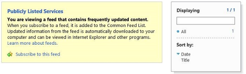

# Debugging und Problembehandlung eines Remoteereignisempfängers in einem Add-In für SharePointDebug and troubleshoot a remote event receiver in a SharePoint Add-in
Richten Sie die Entwicklungsumgebung zum Debuggen von Remoteereignissen mithilfe von Visual Studio ein.Set up the your development environment to debug remote events in by using Visual Studio.
 

 **Hinweis** Der Name „Apps für SharePoint“ wird in „SharePoint-Add-Ins“ geändert. Während des Übergangszeitraums wird in der Dokumentation und der Benutzeroberfläche einiger SharePoint-Produkte und Visual Studio-Tools möglicherweise weiterhin der Begriff „Apps für SharePoint“ verwendet. Weitere Informationen finden Sie unter [Neuer Name für Office- und SharePoint-Apps](new-name-for-apps-for-sharepoint#bk_newname).The name "apps for SharePoint" is changing to "SharePoint Add-ins". During the transition, the documentation and the UI of some SharePoint products and Visual Studio tools might still use the term "apps for SharePoint". For details, see [New name for apps for Office and SharePoint](new-name-for-apps-for-sharepoint#bk_newname).
 

## Konfigurieren des Debuggens für eine SharePoint-RemotetestwebsiteConfigure debugging for a remote SharePoint test site

 **Hinweis** Die Verfahren in diesem Abschnitt gelten nur, wenn sich die SharePoint-Testwebsite auf einem anderen Computer als Visual Studio befindet (oder wenn Sie eine SharePoint Online-Entwicklerwebsite als Testwebsite verwenden). Wenn sich SharePoint und Visual Studio auf demselben Computer befinden, überspringen Sie diesen Abschnitt.**Note** The procedures in this section apply only when your test SharePoint site is on a different computer from Visual Studio or you are using an SharePoint Online Developer Site as your test site. If SharePoint and Visual Studio are on the same computer, skip this section.
 

Wenn ein SharePoint-Add-In-Projekt in Visual Studio einen Remoteereignisempfänger (RER) oder einen Add-In-Ereignisempfänger enthält, müssen Sie einige zusätzliche schnelle Konfigurationsschritte in den Projekteigenschaften vornehmen, bevor Sie das Add-In mit (F5) debuggen können. Für diese Konfiguration ist wiederum eine Azure-Konfigurationsänderung erforderlich. Sie müssen die Azure-Konfiguration nicht für jedes Projekt mit einem RER oder einem Add-In-Ereignisempfänger wiederholen. (Wenn das Add-In einen AppInstalled-Ereignishandler enthält, wird das Add-In sogar erst mit F5 oder STRG+F5 [Ausführen ohne Debuggen] ausgeführt, nachdem Sie die in diesem Abschnitt beschriebene Konfiguration durchgeführt haben.)When a SharePoint Add-in project in Visual Studio includes a remote event receiver (RER) or an add-in event receiver, you have to do some additional quick configuration in the project properties before you can debug the add-in with (F5). This configuration, in turn, requires that you do some Azure configuration. You do not have to repeat the Azure configuration for every project that has an RER or add-in event. (If the add-in includes an AppInstalled event handler, the add-in won't even run with either F5 or Ctrl-F5 [run without debugging] unless you carry out the configuration in this section.)
 

 

### So konfigurieren Sie AzureTo configure Azure

1. Erwerben Sie ein Microsoft Azure-Abonnement, falls noch nicht geschehen. Ein solches Abonnement ist beispielsweise als Zusatz in einem [MSDN-Abonnement](http://azure.microsoft.com/en-us/pricing/member-offers/msdn-benefits/) enthalten.If you don't already have one, get an Microsoft Azure subscription. One is included as a benefit with an  [MSDN Subscription](http://azure.microsoft.com/en-us/pricing/member-offers/msdn-benefits/).
    
 
2. Führen Sie die Anweisungen unter [How To: Create or Modify a Service Bus Service Namespace](http://msdn.microsoft.com/library/fa561f70-007c-45aa-b34d-56317dbbfc87.aspx) aus.Carry out the instructions in  [How To: Create or Modify a Service Bus Service Namespace](http://msdn.microsoft.com/library/fa561f70-007c-45aa-b34d-56317dbbfc87.aspx).
    
 

### So konfigurieren Sie das SharePoint-Add-In-Projekt in Visual StudioTo configure the SharePoint Add-in project in Visual Studio

1. Sie sollten über die neueste Version von Office Developer Tools für Visual Studio 2013 verfügen,  [führen Sie daher das WebPI-Installationsprogramm hier](http://aka.ms/OfficeDevToolsForVS2013) aus oder [Installationsprogramm für Office Developer Tools für Visual Studio 2015](http://aka.ms/OfficeDevToolsForVS2015). .You should have the latest version of the Office Developer Tools for Visual Studio 2013, so  [run the WebPI installer here](http://aka.ms/OfficeDevToolsForVS2013), or  [installer for Office Developer Tools for Visual Studio 2015](http://aka.ms/OfficeDevToolsForVS2015).
    
 
2. Klicken Sie nach dem Hinzufügen eines RER oder eines Add-In-Ereignishandlers zu einem SharePoint-Add-In-Projekt in Visual Studio im **Projektmappen-Explorer** mit der rechten Maustaste auf das Projekt, und wählen Sie **Eigenschaften** aus.After you add a RER or add-in event handler to a SharePoint Add-in project in Visual Studio, right-click the project in **Solution Explorer** and select **Properties**.
    
 
3. Öffnen Sie im Eigenschaftenbereich die Registerkarte **SharePoint**, und scrollen Sie nach unten.In the properties pane, open the **SharePoint** tab and scroll to the bottom.
    
 
4. Aktivieren Sie das Kontrollkästchen **Debuggen über Microsoft Azure Service Bus aktivieren**.Select the check box for **Enable debugging via Microsoft Azure Service Bus**.
    
 
5. Geben Sie die vollständige Verbindungszeichenfolge in das bereitgestellte Textfeld ein. Sie erhalten die Zeichenfolge mit den folgenden Schritten.Enter the complete connection string in the text box provided. You obtain the string with these steps.
    
      1. Melden Sie sich beim Azure-Portal an, und öffnen Sie die Registerkarte **Service Bus**.Log in to the Azure portal and open the **Service Bus** tab.
    
 
  2. Öffnen Sie den Namespace, den Sie für das RER-Debugging erstellt haben, und navigieren Sie zu der Verbindungszeichenfolge. Die Benutzeroberfläche des Azure-Portals ändert sich häufig. Wenn Sie die Verbindungszeichenfolgen nicht finden können, finden Sie weitere Informationen in der  [Hilfe zum Azure-Portal](https://msdn.microsoft.com/en-us/library/azure/dn578292.aspx).Open the namespace that you created for RER debugging and navigate to the connection strings. The Azure portal UI changes frequently. See  [Azure portal help](https://msdn.microsoft.com/en-us/library/azure/dn578292.aspx) if you can't find the connection strings.
    
 
  3. Kopieren Sie die **SAS**-Verbindungszeichenfolge. Das ist die Zeichenfolge, die Sie in den Visual Studio-Projekteigenschaften eingeben.Copy the **SAS** connection string. This is the string you enter in the Visual Studio project properties.
    
 
Wen Sie in Zukunft SharePoint-Add-In-Projekte in Visual Studio erstellen, sind diese Informationen bereits ausgefüllt, sodass Sie nicht jedes Mal das Azure-Portal öffnen müssen.In the future, when you create SharePoint Add-in projects in Visual Studio, this information is prefilled, so you don't have to open the Azure portal each time.
 

## Testen der KonfigurationTest the configuration

Verwenden Sie die Verfahren in diesem Abschnitt, um sicherzustellen, dass Sie ein RER debuggen können.Use the procedures in this section to verify that you can debug an RER.
 

 

### So erstellen Sie ein RemoteereignisempfängerprojektTo create a remote event receiver project

1. Erstellen Sie in Visual Studio ein vom Anbieter gehostetes SharePoint-Add-In.In Visual Studio, create a provider-hosted SharePoint Add-in.
    
    Weitere Informationen dazu finden Sie unter [Erste Schritte beim Erstellen von von einem Anbieter gehosteten SharePoint-Add-Ins](get-started-creating-provider-hosted-sharepoint-add-ins).See  [Get started creating provider-hosted SharePoint Add-ins](get-started-creating-provider-hosted-sharepoint-add-ins).
    
 
2. Wählen Sie im **Projektmappen-Explorer** den Knoten des Add-In-Projekts aus.In **Solution Explorer**, choose the add-in project's node.
    
 
3. Wählen Sie in der Menüleiste **Projekt**, **Neues Element hinzufügen** aus.On the menu bar, choose **Project**, **Add New Item**.
    
 
4. Wählen Sie im Bereich **Vorlagen** die Vorlage **Liste** aus, und wählen Sie dann die Schaltfläche **Hinzufügen** aus.In the **Templates** pane, choose the **List** template, and then choose the **Add** button.
    
 
5. Wählen Sie die Schaltfläche **Fertig stellen** aus, um dem Add-In-Projekt eine benutzerdefinierte Standardliste hinzuzufügen.Choose the **Finish** button to add a default custom list to the add-in project.
    
 
6. Fügen Sie dem Add-In-Projekt ein weiteres Element hinzu, indem Sie im Bereich **Vorlagen** die Vorlage **Remoteereignisempfänger** auswählen.Add another item to the add-in project by, in the **Templates** pane, choosing the **Remote Event Receiver** template.
    
 
7. Lassen Sie den Standardnamen im Feld **Name** unverändert (RemoteEventReceiver1), und wählen Sie dann **Hinzufügen** aus.In the **Name** box, leave the default name (RemoteEventReceiver1), and then choose the **Add** button.
    
 
8. Wählen Sie in der Liste **Welchen Typ soll der Ereignisempfänger aufweisen?** die Option **Listenelementereignisse** aus.In the **What type of event receiver do you want?** list, choose **List Item Events**. 
    
    Belassen Sie die Ereignisquelle als **List1**, die Liste, die Sie im vorhergehenden Schritt hinzugefügt haben.Leave the event source as **List1**, the list that you added in the previous steps.
    
 
9. Wählen Sie in der Liste **Die folgenden Ereignisse behandeln** die Option **Ein Element wird hinzugefügt** aus, und klicken Sie anschließend auf **Fertig stellen**.In the **Handle the following events** list, choose **An item is being added**, and then choose the **Finish** button.
    
    Der Webanwendung wird ein Webdienst zur Behandlung des von Ihnen angegebenen Remoteereignisses hinzugefügt. Der SharePoint-Add-In wird ein Remoteereignisempfänger hinzugefügt. Der Empfänger referenziert den Webdienst und das Listenelementereignis in der Datei "Elements.xml" des Ereignisempfängers.A web service is added to the web application to handle the remote event that you specified. A remote event receiver is added to the SharePoint Add-in. The receiver references the web service and the list item event in the event receiver's Elements.xml file.
    
 
10. Öffnen Sie in der Add-In-Projekt die Datei „AppManifest.xml“.In the add-in project, open AppManifest.xml.
    
 
11. Ändern Sie die Startseite in die Seite der Liste: _AddInProjectName _/Lists/List1.Change the start page to the list's page:  _AddInProjectName_/Lists/List1.
    
    Ersetzen Sie  _AddInProjectName_ durch den Namen des Add-In-Projekts, z. B.SharePointAddIn4/Lists/List1. Bei diesem Beispiel legen wir die Seite der Liste als Startseite fest. Bei einem typischen Add-In würden Sie allerdings wahrscheinlich auf Ihre eigene UI auf der Webprojektseite verweisen.Replace  _AddInProjectName_ with the name of your add-in project, such asSharePointAddIn4/Lists/List1. For this example, we're setting the start page to the list's page. However, in a typical add-in, you'd likely point to your own UI on the web project page.
    
 

### So führen Sie das Debuggen des Ereignishandlers aus und testen esTo run and test event handler debugging

1. Schließen Sie, falls noch nicht geschehen, das im früheren Verlauf dieses Artikels beschriebene Verfahren **So konfigurieren Sie das SharePoint-Add-In-Projekt in Visual Studio** ab.If you haven't done so already, complete the **To configure the SharePoint Add-in project in Visual Studio** procedure earlier in this article.
    
 
2. Öffnen Sie im Webprojekt den Remoteereignisempfänger-Dienst (RemoteEventReceiver1.svc), und fügen Sie dann in der  `ProcessEvent()`-Methode in eine beliebige Codezeile einen Haltepunkt ein.In the web project, open the remote event receiver service (RemoteEventReceiver1.svc), and then add a breakpoint to any line of code inside the  `ProcessEvent()` method.
    
 
3. Drücken Sie **F5**, um das Projekt auszuführen.Choose the **F5** key to run the project.
    
 
4. Wählen Sie die Schaltfläche **Neues Element hinzufügen** aus, um der Liste ein neues Element hinzuzufügen.Choose the **+ New item** button to add an item to the list.
    
 
5. Geben Sie für das Element eine Bezeichnung an, und wählen Sie dann die Schaltfläche **Speichern** aus.Provide a title for the item, and then choose the **Save** button.
    
    Der Haltepunkt, den Sie zum Remoteereignisempfänger hinzugefügt haben, wird erreicht, was bestätigt, dass Sie den Remoteereignisempfänger debuggen.The breakpoint that you added to the remote event receiver is hit, verifying that you're debugging the remote event receiver.
    
 
6. Wählen Sie die Taste **F5** aus, um das Projekt weiter auszuführen, und halten Sie dann das Debuggen an, wenn Sie fertig sind.Choose the **F5** key to continue to run the project, and then stop debugging when you're done.
    
 

## Aktivieren/Deaktivieren der Visual Studio-Benachrichtigung, dass das Ereignisdebugging konfiguriert werden mussTurn on/off the notification from Visual Studio that event debugging needs to be configured

Wenn Ihr Projekt ein Remoteereignis umfasst und Sie das Remotedebugging nicht konfiguriert haben, fordert Visual Studio Sie zum Konfigurieren von Remoteereignisdebugging auf (siehe Abbildung 1). Sie können dieses Verhalten ändern, indem Sie das Kontrollkästchen **Mich benachrichtigen, wenn Remoteereignisdebugging nicht konfiguriert ist** auf der Registerkarte **SharePoint** deaktivieren.If you have a remote event in your project and have not configured remote event debugging, Visual Studio prompts you to configure remote event debugging (see Figure 1). You can change this behavior by clearing the **Notify me if remote event debugging is not configured** check box on the **SharePoint** tab.
 

 

**Abbildung 1. Benachrichtigung zum Remoteereignisdebugging****Figure 1. Remote event debugging notification**

 

 

 

 

 

## Sicherstellen, dass der Dienst im Servicebus gehostet wirdVerify that your service is hosted in the Service Bus

Nachdem Sie F5 gedrückt und dem Add-In vertraut haben, wechseln Sie in Ihrem Browser zum Servicebus-Namespace. Beispiel: http://mynamespace.servicebus.windows.net und Ihr Endpunkt als Zahl. Abbildung 2 zeigt, wie die Seite aussieht, wenn ein Namespace  *nicht*  aufgeführt ist, d. h. bevor Sie F5 drücken.After you press F5 and trust the add-in, go to the Service Bus namespace in your browser; for example http://mynamespace.servicebus.windows.net, and you should see your endpoint listed as a number. Figure 2 shows what the page looks like when a namespace is  *not*  listed; that is, before you press F5.
 

 

**Abbildung 2. Navigieren zum Servicebus-Namespace****Figure 2. Browsing to the Service Bus namespace**

 

 

 

 

 

## RER erreicht nicht den HaltepunktRER does not hit the breakpoint

Je nach Ereignis kann das Remoteereignis synchron oder asynchron sein. Bei einem asynchronen Ereignis dauert es möglicherweise einige Sekunden oder mehr, bis der Haltepunkt erreicht wird.Depending on the event, the remote event may be synchronous or asynchronous. It might take a few seconds or more to hit your breakpoint if it is asynchronous.
 

 

## Fehler: „Es war kein abhörender Endpunkt vorhanden“Error: "There was no endpoint listening"

Wenn Ihr Handler in der Produktionsumgebung ausgeführt wird, erhalten Sie die folgende Fehlermeldung:You get the following error when your handler runs in production:
 

 
"Das Aufrufen des Remoteereignisempfängers ist fehlgeschlagen. Details: An https:// _{domain}_: _nnnnn_/ _{path}_/AppEventReceiver.svc war kein abhörender Endpunkt vorhanden, der die Nachricht annehmen konnte. Dies wird häufig durch eine fehlerhafte Adresse oder SOAP-Aktion verursacht."  _nnnnn_ steht dabei für einen Port."The remote event receiver callout failed. Details: There was no endpoint listening at https:// _{domain}_: _nnnnn_/ _{path}_/AppEventReceiver.svc that could accept the message. This is often caused by an incorrect address or SOAP action." where  _nnnnn_ is a port.
 

 
SharePoint erfordert, dass kein expliziter Port in der URL des Handlers in der Produktion verwendet wird. Dies bedeutet, dass Sie entweder Port 443 für HTTPS (Empfehlung) oder Port 80 für HTTP verwenden müssen.SharePoint requires that there be no explicit port in the URL of the handler in production. This means that you must use either port 443 for HTTPS, which we recommend, or port 80 for HTTP. 
 

 

## Fehler: „Es konnte keine Vertrauensstellung für den sicheren SSL/TLS-Channel mit Autorität eingerichtet werden“Error: "Could not establish trust relationship for the SSL/TLS secure channel with authority"

Wenn Ihr Handler in der Produktionsumgebung ausgeführt wird, erhalten Sie die folgende Fehlermeldung:You get the following error when your handler runs in production:
 

 
"Das Aufrufen des Remoteereignisempfängers ist fehlgeschlagen. Details: Es konnte keine Vertrauensstellung für den sicheren SSL/TLS-Channel mit Autorität eingerichtet werden."The remote event receiver callout failed. Details: Could not establish trust relationship for the SSL/TLS secure channel with authority"
 

 
Wenn sich das Add-In in Microsoft SharePoint Online befindet, der Remoteereignisempfänger-Dienst jedoch lokal ist und wie empfohlen HTTPS verwendet, kann der Server, auf dem der Empfänger gehostet wird, kein selbst signiertes Zertifkat in der Produktion verwenden. Der Server benötigt ein öffentlich akzeptiertes Zertifikat von einer Zertifizierungsstelle. Wenn sich das Add-In in einer lokalen SharePoint-Farm befindet, sind selbst signierte Zertifikate akzeptabel.When the add-in is in Microsoft SharePoint Online, but the remote event receiver service is on-premise, and is using HTTPS as we recommend, the server that is hosting the receiver cannot use a self-signed certificate in production. The server must have a publicly accepted certificate from a certificate authority. If the add-in is in an on-premise SharePoint farm, self-signed certificates are acceptable.
 

 

## Zusätzliche RessourcenAdditional resources

-  [Behandeln von Ereignissen in SharePoint-Add-InsHandle events in SharePoint Add-ins](handle-events-in-sharepoint-add-ins)
    
 
-  [Debuggen von SharePoint-Remoteereignissen mit Visual Studio 2012Debugging SharePoint remote events using Visual Studio 2012](http://blogs.msdn.com/b/officeapps/archive/2013/03/21/update-to-debugging-sharepoint-2013-remote-events-using-visual-studio-2012.aspx)
    
 

