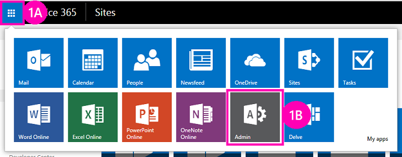

# Bereitstellung und Installation eines von SharePoint gehosteten SharePoint-Add-InsDeploy and install a SharePoint-hosted SharePoint Add-in
Erfahren Sie, wie SharePoint-Add-Ins bereitgestellt und installiert werden.Learn how spappplural are deployed and installed.
 

 **Hinweis** Der Name „Apps für SharePoint“ wird in „SharePoint-Add-Ins“ geändert. Während des Übergangszeitraums wird in der Dokumentation und der Benutzeroberfläche einiger SharePoint-Produkte und Visual Studio-Tools möglicherweise weiterhin der Begriff „Apps für SharePoint“ verwendet. Weitere Informationen finden Sie unter [Neuer Name für Office- und SharePoint-Apps](new-name-for-apps-for-sharepoint#bk_newname).The name "apps for SharePoint" is changing to "SharePoint Add-ins". During the transition, the documentation and the UI of some SharePoint products and Visual Studio tools might still use the term "apps for SharePoint". For details, see [New name for apps for Office and SharePoint](new-name-for-apps-for-sharepoint#bk_newname).
 

Dies ist der zweite einer Reihe von Artikeln über die Grundlagen der Entwicklung von von SharePoint gehosteten SharePoint-Add-Ins. Machen Sie sich zunächst mit dem Thema [SharePoint-Add-Ins](sharepoint-add-ins) und den vorherigen Themen der Reihe vertraut:Learn how SharePoint Add-ins are deployed and installed. This is the second in a series of articles about the basics of developing SharePoint-hosted SharePoint Add-ins. You should first be familiar with the topic  [SharePoint Add-ins](sharepoint-add-ins) and the preceding topics in the series:
 

-  [Erste Schritte beim Erstellen von von SharePoint gehosteten SharePoint-Add-InsGet started creating SharePoint-hosted SharePoint Add-ins](get-started-creating-sharepoint-hosted-sharepoint-add-ins)
    
 

 **Hinweis** Wenn Sie diese Reihe zu von SharePoint gehosteten Add-Ins durchgearbeitet haben, haben Sie eine Visual Studio-Projektmappe, die Sie verwenden können, um mit diesem Thema fortzufahren. Sie können außerdem das Repository unter [SharePoint_SP-Hosted_Add-Ins_Tutorials](https://github.com/OfficeDev/SharePoint_SP-hosted_Add-Ins_Tutorials) herunterladen und die Datei „BeforeColumns.sln“ öffnen.**Note** If you have been working through this series about SharePoint-hosted add-ins, then you have a Visual Studio solution that you can use to continue with this topic. You can also download the repository at  [SharePoint_SP-hosted_Add-Ins_Tutorials](https://github.com/OfficeDev/SharePoint_SP-hosted_Add-Ins_Tutorials) and open the BeforeColumns.sln file.
 

Sie werden feststellen, dass die Entwicklung von SharePoint gehosteter SharePoint-Add-Ins viel einfacher ist, wenn Sie wissen, wie Benutzer bereitgestellt und Ihre Add-Ins installiert werden. Deshalb unterbrechen wir in diesem Artikel kurz die Codierung, um einen Add-In-Katalog zu erstellen und zu verwenden, und installieren dann das Add-In, an dem Sie gearbeitet haben.You'll find it a lot easier to develop SharePoint-hosted SharePoint Add-ins if you are familiar with how users deploy and install your add-ins. So, in this article, we'll take a brief break from coding to create and use an add-in catalog, and then install the add-in you've been working on.
 

## Erstellen eines Add-In-KatalogsCreate an add-in catalog

 

 

1. Melden Sie sich als Administrator bei Ihrem Office 365-Abonnement an. Wählen Sie das Add-In-Startprogrammsymbol, und wählen Sie dann das Add-In **Admin**.Login to your Office 365 subscription as an administrator. Choose the add-in launcher icon, and then choose the  **Admin** add-in.
    
    **Add-In-Startprogramm für Office 365****Office 365 add-in launcher**

 

  
 

    
    
 
2. Erweitern Sie im **Admin Center** den Knoten **Admin** im Aufgabenbereich, und wählen Sie dann **SharePoint**.In the  **Admin Center**, expand the  **Admin** node in the task pane and then choose **SharePoint**.
    
 
3. Wählen Sie im **SharePoint Admin Center** die Option **Add-Ins** im Aufgabenbereich.In the  **SharePoint Admin Center**, choose  **add-ins** in the task pane.
    
 
4. Wählen Sie auf der Seite **Add-Ins** die Option **Add-In-Katalog** aus. (Wenn bereits eine Add-In-Katalog-Websitesammlung im Abonnement vorhanden ist, wird diese geöffnet, und Sie sind fertig. Sie können nicht mehrere Add-In-Kataloge in einem Abonnement erstellen.)On the  **add-ins** page, choose **Add-in Catalog**. (If there is already an add-in catalog site collection in the subscription, it will open and you are done. You cannot create more than one add-in catalog in a subscription.)
    
 
5. Wählen Sie auf der Seite **Add-In-Katalogwebsite** **OK** aus, um die Standardoption zu akzeptieren und eine neue Add-In-Katalogwebsite zu erstellen.On the  **Add-in Catalog Site** page, choose **OK** to accept the default option and create a new add-in catalog site.
    
 
6. Geben Sie im Dialogfeld **Add-In-Katalog-Websitesammlung erstellen** den Titel und die Websiteadresse Ihrer App-Katalogwebsite an. Es wird empfohlen, „Katalog" in den Titel und die URL einzuschließen, damit Sie sich beides besser merken und im **SharePoint Admin Center** leichter erkennen können.On the  **Create Add-in Catalog Site Collection** dialog, specify the title and web site address of your add-in catalog site. We recommend that you include "catalog" in the title and URL to make it memorable and distinguishable in the **SharePoint Admin Center**.
    
 
7. Geben Sie eine **Zeitzone** an, und legen Sie sich selbst als **Administrator** fest.Specify a  **Time Zone** and set yourself as the **Administrator**.
    
 
8. Legen Sie das **Speicherkontingent** auf den niedrigsten möglichen Wert fest (derzeit 110, das kann sich jedoch ändern), da die Add-In-Pakete, die Sie an diese Websitesammlung hochladen, sehr klein sind.Set the  **Storage Quota** to the lowest possible value (currently 110, but that can change), because the add-in packages you upload to this site collection are very small.
    
 
9. Legen Sie das **Serverressourcenkontingent** auf 0 (Null) fest, und wählen Sie dann **OK** aus. (Das Serverressourcenkontingent bezieht sich auf die Einschränkung von Sandkastenlösungen mit schlechter Leistung, aber Sie werden keine Sandkastenlösungen auf Ihrer Add-In-Katalogwebsite installieren.)Set the  **Server Resource Quota** to 0 (zero), and then choose **OK**. (The server resource quota is related to throttling poorly performing sandboxed solutions, but you won't be installing any sandboxed solutions on your add-in catalog site.)
    
 
Wenn die Websitesammlung erstellt wird, bringt SharePoint Sie zurück zum **SharePoint Admin Center**. Nach ein paar Minuten sehen Sie, dass die Websitesammlung erstellt wurde.As the site collection is being created, SharePoint takes you back to the  **SharePoint Admin Center**. After a few minutes, you'll see that the collection has been created.
 

## Packen des Add-Ins und Hochladen in den KatalogPackage the add-in and upload it to the catalog

 

 

1. Öffnen Sie die Visual Studio-Projektmappe, und klicken Sie anschließend im **Projektmappen-Explorer** mit der rechten Maustaste auf den Projektknoten. Wählen Sie **Veröffentlichen**.Open the Visual Studio solution, and then right-click the project node in  **Solution Explorer**. Choose  **Publish**.
    
 
2. Wählen Sie im Bereich **Veröffentlichen** die Option **Add-In verpacken** aus. Das Add-In wird gepackt und als APP-Datei im Ordner „\bin\debug\web.publish\1.0.0.0“ der Projektmappe gespeichert.In the **Publish** pane, choose **Package the add-in**. The add-in is packaged and saved as an *.app file in the solution's \bin\debug\web.publish\1.0.0.0 folder.
    
 
3. Öffnen Sie die Add-In-Katalogwebsite in einem Browser, und wählen Sie **SharePoint-Add-Ins** in der Navigationsleiste.Open your add-in catalog site in a browser and choose  **SharePoint Add-ins** in the navigation bar.
    
 
4. Der **SharePoint-Add-Ins**-Katalog ist eine Standard-SharePoint-Objektbibliothek. Laden Sie das Add-In-Paket mithilfe einer der Methoden zum Hochladen von Dateien in SharePoint-Bibliotheken in den Katalog hoch.The  **SharePoint Add-ins** catalog is a standard SharePoint asset library. Upload the add-in package to it using any of the methods of uploading files to SharePoint libraries.
    
 

## Installieren des Add-Ins als EndbenutzerInstall the add-in as end users do

1. Navigieren Sie zu einer beliebigen Website im SharePoint Online-Abonnement, und öffnen Sie die Seite **Websiteinhalt**.Navigate to any website in the SharePoint Online subscription and open the  **Site Contents** page.
    
 
2. Wählen Sie **Add-In hinzufügen**, um die Seite **Ihre Add-Ins** zu öffnen.Choose  **add an add-in** to open the **Your Add-ins** page.
    
 
3. Suchen Sie das Add-In **Orientierung für Mitarbeiter** im Abschnitt **Add-Ins, die Sie hinzufügen können**, und klicken Sie auf die zugehörige Kachel.Find the  **Employee Orientation** add-in in the **Add-ins you can add** section and click its tile.
    
 
4. Wählen Sie im Zustimmungsdialogfeld **Vertrauen** aus. Die Seite **Websiteinhalt** wird automatisch geöffnet, und das Add-In wird mit dem Hinweis angezeigt, dass sie installiert wird. Nach der Installation können Benutzer die Kachel auswählen, um das Add-In auszuführen.Choose  **Trust It** on the consent dialog. The **Site Contents** page automatically opens and the add-in appears with a notation that it is installing. After it installs, users can choose the tile to run the add-in.
    
 

## Entfernen des Add-InsRemove the add-in

Um das gleiche SharePoint-Add-In in Visual Studio noch weiter zu verbessern (siehe [nächste Schritte](#Nextsteps)), entfernen Sie das Add-In mit den folgenden Schritten:In order to continue enhancing the same SharePoint Add-in in Visual Studio (see  [Next steps](#Nextsteps)), remove the add-in with these steps:
 

 

1. Bewegen Sie den Cursor auf der Seite **Websiteinhalte** über das Add-In, sodass die Popupschaltfläche **...** angezeigt wird.In the  **Site Contents** page, move the cursor over the add-in so that the callout button **...** appears.
    
 
2. Klicken Sie auf die Popupschaltfläche, und wählen Sie dann **ENTFERNEN** im Popup.Choose the callout button and then choose  **REMOVE** on the callout.
    
 
3. Navigieren Sie zurück zur Add-In-Katalogwebsite, und wählen Sie **SharePoint-Add-Ins** in der Navigationsleiste.Navigate back to your add-in catalog site and choose  **SharePoint Add-ins** in the navigation bar.
    
 
4. Markieren Sie das Add-In, wählen Sie **Verwalten** auf der Taskleiste direkt oberhalb der Liste, und wählen Sie dann **Löschen** im Verwaltungsmenü.Highlight the add-in and choose  **manage** on the task bar just above the list, and then choose **Delete** on the manage menu.
    
 

## 

Es wird dringend empfohlen, mit dieser Reihe zu von SharePoint gehosteten Add-Ins fortzufahren, bevor Sie zu den fortgeschritteneren Themen übergehen. Als Nächstes kehren wir in  [Hinzufügen von benutzerdefinierten Spalten zu einem von SharePoint gehosteten Add-In für SharePoint](add-custom-columns-to-a-sharepoint-hostedsharepoint-add-in) zum Codieren zurück.We strongly recommend that you continue with this series about SharePoint-hosted add-ins before you go on to the more advanced topics. Next we get back to coding in  [Add custom columns to a SharePoint-hostedSharePoint Add-in](add-custom-columns-to-a-sharepoint-hostedsharepoint-add-in).
 

 

