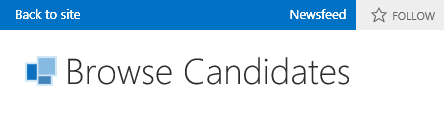

# Aktivieren eines Newsfeesd für ein Cloud-Business-Add-InEnable a newsfeed for a cloud business add-in
Mit den Features für soziale Netzwerke und die Zusammenarbeit in SharePoint für Office 365 können Benutzer Aktivitäten in einer Liste verfolgen und Kommentare hinzufügen. Sie können mühelos einen Newsfeed für Ihr Cloud-Geschäfts-Add-In erstellen, indem Sie einige Eigenschaften aktivieren.Social and collaboration features in SharePoint for Office 365 allow users to track activity on a list and add comments. You can easily create a newsfeed for your Cloud Business Add-in by enabling a couple of properties.
 

 **Hinweis** Der Name „Apps für SharePoint“ wird in „SharePoint-Add-Ins“ geändert. Während des Übergangszeitraums wird in der Dokumentation und der Benutzeroberfläche einiger SharePoint-Produkte und Visual Studio-Tools möglicherweise weiterhin der Begriff „Apps für SharePoint“ verwendet. Weitere Informationen finden Sie unter [Neuer Name für Office- und SharePoint-Apps](new-name-for-apps-for-sharepoint#bk_newname).The name "apps for SharePoint" is changing to "SharePoint Add-ins". During the transition, the documentation and the UI of some SharePoint products and Visual Studio tools might still use the term "apps for SharePoint". For details, see [New name for apps for Office and SharePoint](new-name-for-apps-for-sharepoint#bk_newname).
 

## VoraussetzungenPrerequisites

Zum Hosten des Newsfeeds benötigen Sie in Office 365 eine SharePoint-Entwicklerwebsite, die Sie unter  [Registrieren für eine Office 365-Entwicklerwebsite](http://go.microsoft.com/fwlink/?LinkId=263490) erhalten.To host the newsfeed, you'll need a SharePoint Developer site on Office 365, which you can get from  [Sign up for an Office 365 Developer Site](http://go.microsoft.com/fwlink/?LinkId=263490).
 

 

## VerfahrenProcedures

### So aktivieren Sie einen NewsfeedTo enable a newsfeed

1. Öffnen Sie im Projektmappen-Explorer die Entität, die die Liste repräsentiert, der Sie einen Newsfeed hinzufügen möchten, und klicken Sie dann in der Leiste **Perspektive** auf die Registerkarte **Server**.In Solution Explorer, open the entity representing the list where you want to add a newsfeed, and then on the **Perspective** bar choose the **Server** tab.
    
 
2. Aktivieren Sie im Fenster **Eigenschaften** die Kontrollkästchen **Nach dem Erstellen posten** und/oder **Nach dem Aktualisieren posten**.In the **Properties** window, select the **Post when Created** and/or **Post when Updated** check boxes.
    
  
 

     Durch Aktivieren von **Nach dem Erstellen posten** wird für jedes neue Listenelement ein Thread zum Newsfeed hinzugefügt. Durch Aktivieren von **Nach dem Aktualisieren posten** wird ein Thread hinzugefügt, wenn ein Wert eines Listenelements geändert wird. Postauslöser ermitteln, welche Felder in dem Element einen Posts auslösen.**Post when Created** adds a thread to the newsfeed for each new list item. **Post when Updated** adds a thread when the value for an item in the list is changed. Post triggers determine which fields in the item will trigger a post.
    
 
3. Klicken Sie auf den Link **Auswählen von Postauslösern**.Choose the **Choose post triggers** link.
    
    Das Dialogfeld **Auswählen von Postauslösern** wird geöffnet.The **Choose post triggers** dialog box appears.
    
 
4. Aktivieren Sie im Dialogfeld **Auswählen von Postauslösern** die Kontrollkästchen aller Felder, die einen Post auslösen sollen, und klicken Sie anschließend auf die Schaltfläche **OK**.In the **Choose post triggers** dialog box, select the check boxes for all fields that you want to trigger a post, and then choose the **OK** button.
    
    Ein einzelner Thread wird für alle Änderungen in einem Element erstellt, unabhängig davon, wie viele Felder Sie auswählen.A single thread will be created for all changes in an item no matter how many fields you choose.
    
 

### So greifen Sie auf einen Newsfeed zuTo access a newsfeed

1. Klicken Sie auf der Menüleiste auf **Debuggen**, **Debuggen starten**, um die Anwendung auszuführen.On the menu bar, choose **Debug**, **Start Debugging** to run the application.
    
 
2. Öffnen Sie in der laufenden Anwendung den Suchbildschirm der Entität, die die Liste repräsentiert, der Sie einen Newsfeed hinzugefügt haben. Wenn Sie die Option **Nach dem Erstellen posten** aktiviert haben, müssen Sie ein neues Element hinzufügen. Wenn Sie die Option **Nach dem Aktualisieren posten** aktiviert haben, müssen Sie die Felder bearbeiten, die Sie im Dialogfeld **Auswählen von Postauslösern** ausgewählt haben.In the running application, open the browse screen for the entity representing the list where you added a newsfeed. If you enabled **Post when Created**, add a new item. If you enabled **Post when Updated**, edit the fields that you selected in the **Choose post triggers** dialog box.
    
 
3. Klicken Sie auf der SharePoint-Chromleiste auf den Link **Newsfeed**.On the SharePoint chrome bar, choose the **Newsfeed** link.
    
  
 

    Die Seite **Newsfeed** wird in einem neuen Browserfenster geöffnet und zeigt die Einträge der hinzugefügten und/oder aktualisierten Elemente an. Sie können für einen Beitrag auf den Link **Gefällt mir** klicken oder auf den Link **Antworten** klicken, um einen Kommentar hinzuzufügen.The **Newsfeed** page opens in a new browser window with entries for the added and/or updated items. You can choose the **Like** link for a post, or you can choose the **Reply** link to add a comment.
    
 

## Zusätzliche RessourcenAdditional resources

-  [Entwickeln von Cloud-Business-Add-InsDevelop cloud business add-ins](develop-cloud-business-add-ins)
    
 
-  [Soziale Funktionen und Zusammenarbeit in SharePointSocial and collaboration features in SharePoint](http://msdn.microsoft.com/en-us/library/office/jj163280.aspx)
    
 
-  [Erstellen eines Cloud-Business-Add-Ins mit einem sozialen NewsfeedCreate a cloud business add-in with a social newsfeed](create-a-cloud-business-add-in-with-a-social-newsfeed)
    
 

