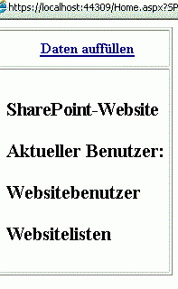

# <a name="get-started-creating-provider-hosted-sharepoint-add-ins"></a>Erste Schritte beim Erstellen eines von einem Anbieter gehosteten SharePoint-Add-Ins

Vom Anbieter gehostete Add-Ins sind eine der zwei Haupttypen von SharePoint-Add-Ins. Einen schnellen Überblick über SharePoint-Add-Ins und die zwei verschiedenen Typen finden Sie unter [SharePoint Add-Ins](sharepoint-add-ins.md). 

Es folgt eine Zusammenfassung zu vom Anbieter gehosteten Add-Ins:

- Sie enthalten Webanwendungen, Dienste oder Datenbanken, die extern über eine SharePoint-Farm oder ein SharePoint Online-Abonnement gehostet werden. Sie können auch SharePoint-Komponenten enthalten. Sie können die externen Komponenten in einem beliebigen Webhostingstapel, einschließlich des LAMP-Stapels (Linux, Apache, MySQL und PHP) hosten.
- Die benutzerdefinierte Geschäftslogik im Add-In muss entweder in den externen Komponenten oder in JavaScript auf benutzerdefinierten SharePoint-Seiten ausgeführt werden.

In diesem Artikel führen Sie die folgenden Schritte aus:

- Einrichten der Entwicklungsumgebung
- Erstellen des Add-In-Projekts
- Programmieren des Add-Ins

<a name="Setup"> </a>
## <a name="set-up-your-dev-environment"></a>Einrichten der Entwicklungsumgebung

Es gibt zahlreiche verschiedene Möglichkeiten, eine Entwicklungsumgebung für SharePoint-Add-Ins einzurichten. In diesem Abschnitt wird die einfachste von ihnen beschrieben. Informationen zu Alternativen, z. B. Einrichten einer lokalen Umgebung, finden Sie unter [Tools](tools-and-environments-for-developing-sharepoint-add-ins.md).

### <a name="get-the-tools"></a>Installieren der Tools

- Falls Sie **Visual Studio 2013** oder höher noch nicht installiert haben: Installieren Sie es mithilfe der Anweisungen unter [Installieren von Visual Studio](https://docs.microsoft.com/de-DE/visualstudio/install/install-visual-studio). Wir empfehlen die Verwendung der [aktuellen Version aus dem Microsoft Download Center](https://www.visualstudio.com/downloads/download-visual-studio-vs).
 
- Visual Studio umfasst die **Microsoft Office Developer Tools für Visual Studio**. Gelegentlich wird jedoch zwischen zwei Updates von Visual Studio eine neue Version der Tools veröffentlicht. Führen Sie das [Installationsprogramm für Office Developer Tools für Visual Studio 2013](http://aka.ms/OfficeDevToolsForVS2013) oder das [Installationsprogramm für Office Developer Tools für Visual Studio 2015](http://aka.ms/OfficeDevToolsForVS2015) aus, um sicherzustellen, dass Sie die aktuelle Version der Tools haben. 

Als Referenz dienen [frühere Versionen von Visual Studio](http://msdn.microsoft.com/library/da049020-cfda-40d7-8ff4-7492772b620f.aspx) oder andere [Visual Studio-Dokumentation](https://docs.microsoft.com/de-DE/visualstudio/).

<a name="o365_signup"> </a>
### <a name="sign-up-for-an-office-365-developer-site"></a>Registrieren für eine Office 365-Entwicklerwebsite

> [!NOTE]
> Möglicherweise haben Sie bereits Zugriff auf eine Office 365-Entwicklerwebsite: 
> - **Sind Sie MSDN-Abonnent?** Visual Studio Ultimate und Visual Studio Premium mit MSDN-Abonnenten erhalten als Bonus ein einjähriges Office 365 Developer-Abonnement. [Lösen Sie Ihren Bonus heute ein.](https://msdn.microsoft.com/subscriptions/manage/default.aspx) 
> - **Besitzen Sie einen der folgenden Office 365-Abonnementpläne?** Wenn ja, kann ein Administrator des jeweiligen Office 365-Abonnements über das [Office 365 Admin Center](https://portal.microsoftonline.com/admin/default.aspx) eine Entwicklerwebsite für Sie erstellen. Weitere Informationen finden Sie unter [Erstellen einer Entwicklerwebsite in einem vorhandenen Office 365-Abonnement](create-a-developer-site-on-an-existing-office-365-subscription.md). 

Sie haben drei Möglichkeiten, einen Office 365-Plan zu erhalten: 

- Sie können die [kostenlose 30-Tage-Testversion](https://portal.microsoftonline.com/Signup/MainSignUp.aspx?OfferId=6881A1CB-F4EB-4db3-9F18-388898DAF510&amp;DL=DEVELOPERPACK) nutzen, die eine einzige Benutzerlizenz enthält.

- Sie können ein [Office 365-Entwicklerabonnement](https://portal.microsoftonline.com/Signup/MainSignUp.aspx?OfferId=C69E7747-2566-4897-8CBA-B998ED3BAB88&amp;DL=DEVELOPERPACK) erwerben. 

- Sie können sich über das Office 365-Entwicklerprogramm für ein Office 365-Entwicklerkonto mit einem Jahr Laufzeit registrieren. Weitere Informationen finden Sie [hier](http://dev.office.com/devprogram). Alternativ können Sie direkt das [Registrierungsformular](https://profile.microsoft.com/RegSysProfileCenter/wizardnp.aspx?wizid=14b845d0-938c-45af-b061-f798fbb4d170) ausfüllen. Nach der Registrierung für das Entwicklerprogramm erhalten Sie eine E-Mail mit einem Link, unter dem Sie sich für ein Entwicklerkonto registrieren können. Nachfolgend finden Sie eine Anleitung.

> [!TIP]
> Öffnen Sie diese Links in einem anderen Fenster oder auf einer anderen Registerkarte, damit Sie die Anleitung jederzeit einsehen können.

1. Die erste Seite des Registrierungsformulars ist selbsterklärend. Geben Sie die geforderten Informationen ein, und klicken Sie anschließend auf **Next**.
    
2. Geben Sie auf der zweiten Seite, die in Abbildung 1 gezeigt ist, eine Benutzer-ID für den Administrator des Abonnements an.
    
   *Abbildung 1: Domänenname der Office 365-Entwicklerwebsite*

   

3. Erstellen Sie eine Unterdomäne von **.onmicrosoft.com**, zum Beispiel contoso.onmicrosoft.com.
    
   Sobald die Registrierung abgeschlossen ist, können Sie sich mit den daraus resultierenden Anmeldeinformationen (im Format *Benutzer-ID@ihredomäne.onmicrosoft.com*) bei Ihrer Office 365-Portalwebsite anmelden und dort Ihr Konto verwalten. Ihre SharePoint Online-Entwicklerwebsite wird in Ihrer neuen Domäne eingerichtet: `http://yourdomain.sharepoint.com`.
    
4. Klicken Sie auf **Next**, und füllen Sie die letzte Seite des Formulars aus. Wenn Sie sich telefonisch einen Bestätigungscode durchgeben lassen möchten, können Sie wahlweise eine Mobiltelefonnummer oder eine Festnetznummer angeben. VoIP-Nummern (Voice over Internet Protocol) werden jedoch *nicht* unterstützt.
    
   > [!NOTE]
   > Falls Sie zum Zeitpunkt Ihrer Registrierung für ein Entwicklerkonto noch bei einem anderen Microsoft-Konto angemeldet sind, wird unter Umständen die folgende Meldung angezeigt: „Sorry, that user ID you entered didn‘t work. It looks like it's not valid. Be sure you enter the user ID that your organization assigned to you. Your user ID usually looks like *someone@example.com* or *someone@example.onmicrosoft.com*.“ 
   
   > Sollte diese Meldung angezeigt werden, müssen Sie sich von dem betreffenden Microsoft-Konto abmelden und die Registrierung erneut versuchen. Wird Ihnen die Meldung weiterhin angezeigt: Leeren Sie den Cache Ihres Browsers, oder schalten Sie um auf **InPrivate-Browsen**, und füllen Sie das Formular erneut aus.

   Sobald der Registrierungsprozess abgeschlossen ist, wird in Ihrem Browser die Office 365-Installationsseite geöffnet. Klicken Sie auf das Symbol „Admin“, um das Admin Center zu öffnen.
 
   *Abbildung 2: Office 365 Admin Center-Seite*

   

5. Warten Sie, bis der Einrichtungsprozess für Ihre Entwicklerwebsite abgeschlossen ist. Nach Abschluss der Bereitstellung aktualisieren Sie die Admin Center-Seite im Browser.
     
6. Klicken Sie oben links auf der Seite auf **Build Add-ins**, um Ihre Entwicklerwebsite zu öffnen. Nun sollten Sie eine Website sehen, die wie Abbildung 3 aussieht. Dass die Liste **Add-ins in Testing** auf der Seite angezeigt wird, ist der Beleg dafür, dass die Website auf Basis der Vorlage für SharePoint-Entwicklerwebsites erstellt wurde. Falls stattdessen eine normale Teamwebsite angezeigt wird: Warten Sie einige Minuten, und starten Sie dann die Website neu.
    
7. Notieren Sie die URL der Website. Diese wird verwendet, wenn Sie SharePoint-Add-Ins-Projekte in Visual Studio erstellen.
    
   *Abb. 3: Die Startseite Ihrer Entwicklerwebsite mit der Liste der Add-Ins im Test*

   
 
<a name="Create"> </a>
## <a name="create-the-add-in-project"></a>Erstellen des Add-In-Projekts

1. Starten Sie Visual Studio mit der Option **Als Administrator ausführen**.
    
2. Klicken Sie in Visual Studio auf **Datei** > **Neu** > **Neues Projekt**.
    
3. Erweitern Sie im Dialogfeld **Neues Projekt** den Knoten **Visual C#**, dann den Knoten **Office/SharePoint**, und wählen Sie den Knoten **Add-Ins** > **SharePoint-Add-In** aus.
    
4. Geben Sie dem Projekt den Namen **SampleAddIn**, und wählen Sie dann **OK**.
   
5. Gehen Sie im Dialogfeld **Einstellungen für das SharePoint-Add-In angeben** folgendermaßen vor:
    
   - Geben Sie die komplette URL der SharePoint-Website an, die Sie für das Debugging Ihres Add-Ins verwenden möchten. Gemeint ist die URL der Entwicklerwebsite. Verwenden Sie HTTPS und nicht HTTP in der URL. An einem bestimmten Punkt während dieses Vorgangs oder kurz nachdem dieser Vorgang abgeschlossen wurde, werden Sie aufgefordert, sich bei dieser Website anzumelden. Der Zeitpunkt der Aufforderung ist unterschiedlich. Verwenden Sie die Administratoranmeldeinformationen (in der Domäne \*.onmicrosoft.com), die Sie bei der Anmeldung bei Ihrer Entwicklerseite erstellt haben, z. B. MyName@contoso.onmicrosoft.com.    

   - Wählen Sie unter **Wie soll Ihr Add-In für SharePoint gehostet werden** die Option **Von Anbieter gehostet** aus.

   - Wählen Sie **Weiter** aus.  
 
6. Wählen Sie auf der Seite **Ziel-SharePoint-Version angeben** die Option **SharePoint Online** und dann **Weiter** aus.

7. Wählen Sie unter **Welchen Webanwendungsprojekttyp möchten Sie erstellen?**** ASP.NET Webformular-Anwendung**. Wählen Sie dann **Weiter** aus.

8. Wählen Sie unter **Wie soll Ihr Add-In authentifiziert werden?**** Microsoft Azure-Zugriffssteuerungsdienst verwenden** aus.

9. Wählen Sie im Assistenten **Fertig stellen** aus.
    
   Ein Großteil der Konfiguration wird beim Öffnen der Lösung ausgeführt. In der Visual Studio-Projektmappe werden zwei Projekte erstellt, eines für die SharePoint-Add-In und das andere für die ASP.NET-Webanwendung.

<a name="Code"> </a>
## <a name="code-your-add-in"></a>Codieren Ihres Add-Ins

1. Öffnen Sie die Datei AppManifest.xml. Geben Sie auf der Registerkarte **Berechtigungen** den Bereich der **Websitesammlung** und die **Lese**berechtigungsstufe an.

2. Löschen Sie alle Markups innerhalb des `<body>`-Tags der Datei „Pages/Default.aspx“ Ihrer Webanwendung, und fügen Sie dann die folgenden HTML- und ASP.NET-Steuerelemente in `<body>` ein. In diesem Beispiel wird das [UpdatePanel](http://msdn2.microsoft.com/de-DE/library/bb359258)-Steuerelement verwendet, um ein teilweises Seitenrendering zu aktivieren.
    
    ```HTML
     <form id="form1" runat="server">
       <div>
         <asp:ScriptManager ID="ScriptManager1" runat="server"
                 EnablePartialRendering="true" />
         <asp:UpdatePanel ID="PopulateData" runat="server" UpdateMode="Conditional">
           <ContentTemplate>      
             <table border="1" cellpadding="10">
              <tr><th><asp:LinkButton ID="CSOM" runat="server" Text="Populate Data" 
                                    OnClick="CSOM_Click" /></th></tr>
              <tr><td>

             <h2>SharePoint Site</h2>
             <asp:Label runat="server" ID="WebTitleLabel"/>

             <h2>Current User:</h2>
             <asp:Label runat="server" ID="CurrentUserLabel" />

             <h2>Site Users</h2>
             <asp:ListView ID="UserList" runat="server">     
                 <ItemTemplate >
                   <asp:Label ID="UserItem" runat="server" 
                                     Text="<%# Container.DataItem.ToString()  %>">
                   </asp:Label><br />
                </ItemTemplate>
             </asp:ListView>

             <h2>Site Lists</h2>
                    <asp:ListView ID="ListList" runat="server">
                        <ItemTemplate >
                          <asp:Label ID="ListItem" runat="server" 
                                     Text="<%# Container.DataItem.ToString()  %>">
                         </asp:Label><br />
                       </ItemTemplate>
                   </asp:ListView>
                 </td>              
               </tr>
              </table>
            </ContentTemplate>
          </asp:UpdatePanel>
       </div>
     </form>
    ```

3. Fügen Sie in der Datei „Default.aspx.cs“ der Webanwendung folgende Deklarationen hinzu.
    
    ```C#
       using Microsoft.SharePoint.Client;
       using Microsoft.IdentityModel.S2S.Tokens;
       using System.Net;
       using System.IO;
       using System.Xml;
    ```

4. Fügen Sie in der Datei „Default.aspx.cs“ der Webanwendung folgende Variablen in der [Page](http://msdn2.microsoft.com/de-DE/library/dfbt9et1)-Klasse hinzu.
    
   ```C#
     SharePointContextToken contextToken;
     string accessToken;
     Uri sharepointUrl;
     string siteName;
     string currentUser;
     List<string> listOfUsers = new List<string>();
     List<string> listOfLists = new List<string>();
   ```

5. Fügen Sie die `RetrieveWithCSOM`-Methode in der [Page](http://msdn2.microsoft.com/de-DE/library/dfbt9et1)-Klasse hinzu. In dieser Methode wird SharePoint CSOM verwendet, um Informationen zu Ihrer Website abzurufen und auf der Seite anzuzeigen.
    
    ```C#
        // This method retrieves information about the host web by using the CSOM.
      private void RetrieveWithCSOM(string accessToken)
      {

          if (IsPostBack)
          {
              sharepointUrl = new Uri(Request.QueryString["SPHostUrl"]);
          }            

          ClientContext clientContext =
                          TokenHelper.GetClientContextWithAccessToken(
                              sharepointUrl.ToString(), accessToken);

          // Load the properties for the web object.
          Web web = clientContext.Web;
          clientContext.Load(web);
          clientContext.ExecuteQuery();

          // Get the site name.
          siteName = web.Title;

          // Get the current user.
          clientContext.Load(web.CurrentUser);
          clientContext.ExecuteQuery();
          currentUser = clientContext.Web.CurrentUser.LoginName;

          // Load the lists from the Web object.
          ListCollection lists = web.Lists;
          clientContext.Load<ListCollection>(lists);
          clientContext.ExecuteQuery();

          // Load the current users from the Web object.
          UserCollection users = web.SiteUsers;
          clientContext.Load<UserCollection>(users);
          clientContext.ExecuteQuery();

          foreach (User siteUser in users)
          {
              listOfUsers.Add(siteUser.LoginName);
          }

          foreach (List list in lists)
          {
              listOfLists.Add(list.Title);
          }
      }
    ```

6. Fügen Sie die `CSOM_Click`-Methode in der [Page](http://msdn2.microsoft.com/de-DE/library/dfbt9et1)-Klasse hinzu. Diese Methode löst das Ereignis aus, das auftritt, wenn der Benutzer auf den Link **Daten auffüllen** klickt.
    
    ```C#
      protected void CSOM_Click(object sender, EventArgs e)
    {
        string commandAccessToken = ((LinkButton)sender).CommandArgument;
        RetrieveWithCSOM(commandAccessToken);
        WebTitleLabel.Text = siteName;
        CurrentUserLabel.Text = currentUser;
        UserList.DataSource = listOfUsers;
        UserList.DataBind();
        ListList.DataSource = listOfLists;
        ListList.DataBind();    
     }
    ```

7. Ersetzen Sie zunächst die vorhandene `Page_Load`-Methode durch diese. Die `Page_Load`-Methode verwendet Methoden in der Datei „TokenHelper.cs", um den Kontext aus dem `Request`-Objekt abzurufen und ein Zugriffstoken von Microsoft Azure Access Control Service (ACS) anzufordern.
    
    ```C#
      // The Page_load method fetches the context token and the access token. 
    // The access token is used by all of the data retrieval methods.
    protected void Page_Load(object sender, EventArgs e)
    {
         string contextTokenString = TokenHelper.GetContextTokenFromRequest(Request);

        if (contextTokenString != null)
        {
            contextToken =
                TokenHelper.ReadAndValidateContextToken(contextTokenString, Request.Url.Authority);

            sharepointUrl = new Uri(Request.QueryString["SPHostUrl"]);
            accessToken =
                        TokenHelper.GetAccessToken(contextToken, sharepointUrl.Authority)
                        .AccessToken;

             // For simplicity, this sample assigns the access token to the button's CommandArgument property. 
             // In a production add-in, this would not be secure. The access token should be cached on the server-side.
            CSOM.CommandArgument = accessToken;
        }
        else if (!IsPostBack)
        {
            Response.Write("Could not find a context token.");
            return;
        }
    }
    ```

8. Die Datei „Default.aspx.cs“ sollte wie folgt aussehen, wenn Sie fertig sind.
    
    ```C#
      using System;
      using System.Collections.Generic;
      using System.Linq;
      using System.Web;
      using System.Web.UI;
      using System.Web.UI.WebControls;

      using Microsoft.SharePoint.Client;
      using Microsoft.IdentityModel.S2S.Tokens;
      using System.Net;
      using System.IO;
      using System.Xml;

      namespace SampleAddInWeb
      {
          public partial class Default : System.Web.UI.Page
          {
              SharePointContextToken contextToken;
              string accessToken;
              Uri sharepointUrl;
              string siteName;
              string currentUser;
              List<string> listOfUsers = new List<string>();
              List<string> listOfLists = new List<string>();

              protected void Page_PreInit(object sender, EventArgs e)
              {
                  Uri redirectUrl;
                  switch (SharePointContextProvider.CheckRedirectionStatus(Context, out redirectUrl))
                  {
                      case RedirectionStatus.Ok:
                          return;
                      case RedirectionStatus.ShouldRedirect:
                          Response.Redirect(redirectUrl.AbsoluteUri, endResponse: true);
                          break;
                      case RedirectionStatus.CanNotRedirect:
                          Response.Write("An error occurred while processing your request.");
                          Response.End();
                          break;
                  }
              }

              protected void CSOM_Click(object sender, EventArgs e)
              {
                  string commandAccessToken = ((LinkButton)sender).CommandArgument;
                  RetrieveWithCSOM(commandAccessToken);
                  WebTitleLabel.Text = siteName;
                  CurrentUserLabel.Text = currentUser;
                  UserList.DataSource = listOfUsers;
                  UserList.DataBind();
                  ListList.DataSource = listOfLists;
                  ListList.DataBind();
              }

              // This method retrieves information about the host web by using the CSOM.
              private void RetrieveWithCSOM(string accessToken)
              {

                  if (IsPostBack)
                  {
                      sharepointUrl = new Uri(Request.QueryString["SPHostUrl"]);
                  }

                  ClientContext clientContext =
                          TokenHelper.GetClientContextWithAccessToken(
                              sharepointUrl.ToString(), accessToken);

                  // Load the properties for the web object.
                  Web web = clientContext.Web;
                  clientContext.Load(web);
                  clientContext.ExecuteQuery();

                  // Get the site name.
                  siteName = web.Title;

                  // Get the current user.
                  clientContext.Load(web.CurrentUser);
                  clientContext.ExecuteQuery();
                  currentUser = clientContext.Web.CurrentUser.LoginName;

                  // Load the lists from the Web object.
                  ListCollection lists = web.Lists;
                  clientContext.Load<ListCollection>(lists);
                  clientContext.ExecuteQuery();

                  // Load the current users from the Web object.
                  UserCollection users = web.SiteUsers;
                  clientContext.Load<UserCollection>(users);
                  clientContext.ExecuteQuery();

                  foreach (User siteUser in users)
                  {
                      listOfUsers.Add(siteUser.LoginName);
                  }

                  foreach (List list in lists)
                  {
                      listOfLists.Add(list.Title);
                  }
              }

              protected void Page_Load(object sender, EventArgs e)
              {
                  string contextTokenString = 
                       TokenHelper.GetContextTokenFromRequest(Request);

                  if (contextTokenString != null)
                  {
                      contextToken =
                          TokenHelper.ReadAndValidateContextToken(contextTokenString, Request.Url.Authority);

                      sharepointUrl = new Uri(Request.QueryString["SPHostUrl"]);
                      accessToken =
                          TokenHelper.GetAccessToken(contextToken, sharepointUrl.Authority)
                                     .AccessToken;
                      CSOM.CommandArgument = accessToken;
                  }
                  else if (!IsPostBack)
                  {
                      Response.Write("Could not find a context token.");
                      return;
                  }
              }
          }
      }
     
    ```

9. Drücken Sie auf die F5-TASTE, um Ihr Add-In bereitzustellen und auszuführen. Wenn ein Dialogfeld **Sicherheitshinweis** angezeigt wird, das Sie danach fragt, ob Sie dem selbstsignierten Localhost-Zertifikat vertrauen, klicken Sie auf **Ja**.
    
10. Wählen Sie **Vertrauen** auf der Zustimmungsseite, um die Berechtigungen für das Add-In zu erteilen. Visual Studio installiert die Webanwendung in IIS Express, installiert dann das Add-In in Ihrer Test-SharePoint-Website und startet diese. Es wird eine Seite mit der im folgenden Screenshot gezeigten Tabelle angezeigt. Wenn Sie zusammenfassende Informationen zu Ihrer SharePoint-Website anzeigen möchten, wählen Sie **Daten auffüllen**.

   *Abbildung 4. Startseite des grundlegenden vom Anbieter gehosteten Beispiel-Add-Ins*

   
 

<a name="SP15createprovider_nextsteps"> </a>    
## <a name="next-steps"></a>Nächste Schritte

Um Ihre Add-Ins zu erstellen, führen Sie die folgenden Schritte in der folgenden Reihenfolge aus:
 
1.  [Übertragen des SharePoint-Aussehens und -Verhaltens auf Ihr vom Anbieter gehostetes Add-In](give-your-provider-hosted-add-in-the-sharepoint-look-and-feel.md)
2.  [Einfügen einer benutzerdefinierten Schaltfläche in das vom Anbieter gehostete Add-In](include-a-custom-button-in-the-provider-hosted-add-in.md)
3.  [Schnelle Übersicht über das SharePoint-Objektmodell](get-a-quick-overview-of-the-sharepoint-object-model.md)
4.  [Hinzufügen von SharePoint-Schreibvorgängen zum vom Anbieter gehosteten Add-In](add-sharepoint-write-operations-to-the-provider-hosted-add-in.md)
5.  [Einfügen eines Add-In-Webparts in das vom Anbieter gehostete Add-In](include-an-add-in-part-in-the-provider-hosted-add-in.md)
6.  [Verarbeiten von Add-In-Ereignissen im vom Anbieter gehosteten Add-In](handle-add-in-events-in-the-provider-hosted-add-in.md)
7.  [Hinzufügen der Logik für die erste Ausführung zum vom Anbieter gehosteten Add-In](add-first-run-logic-to-the-provider-hosted-add-in.md)
8.  [Programmgesteuertes Bereitstellen einer benutzerdefinierten Schaltfläche in anbietergehosteten Add-Ins](programmatically-deploy-a-custom-button-in-the-provider-hosted-add-in.md)
9.  [Verarbeiten von Listenelementereignissen in anbietergehosteten Add-Ins](handle-list-item-events-in-the-provider-hosted-add-in.md)


