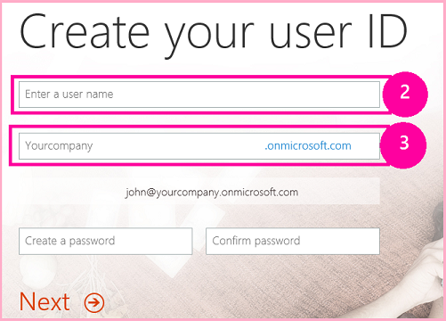
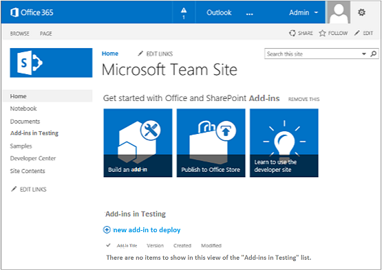

# <a name="get-started-creating-provider-hosted-sharepoint-add-ins"></a><span data-ttu-id="d4097-101">Erste Schritte beim Erstellen von einem Anbieter gehosteten SharePoint-Add-Ins</span><span class="sxs-lookup"><span data-stu-id="d4097-101">Get started creating provider-hosted SharePoint Add-ins</span></span>
<span data-ttu-id="d4097-102">Einrichten einer Entwicklungsumgebung und Erstellen Ihres ersten von einem Anbieter gehosteten SharePoint-Add-Ins.</span><span class="sxs-lookup"><span data-stu-id="d4097-102">Set up a development environment and create your first provider-hosted spappsing.</span></span>
 

 <span data-ttu-id="d4097-p101">**Hinweis** Der Name „Apps für SharePoint“ wird in „SharePoint-Add-Ins“ geändert. Während des Übergangszeitraums wird in der Dokumentation und der Benutzeroberfläche einiger SharePoint-Produkte und Visual Studio-Tools möglicherweise weiterhin der Begriff „Apps für SharePoint“ verwendet. Weitere Informationen finden Sie unter [Neuer Name für Office- und SharePoint-Apps](new-name-for-apps-for-sharepoint#bk_newname).</span><span class="sxs-lookup"><span data-stu-id="d4097-p101">The name "apps for SharePoint" is changing to "SharePoint Add-ins". During the transition, the documentation and the UI of some SharePoint products and Visual Studio tools might still use the term "apps for SharePoint". For details, see [New name for apps for Office and SharePoint](new-name-for-apps-for-sharepoint#bk_newname).</span></span>
 

<span data-ttu-id="d4097-p102">Vom Anbieter gehostete Add-Ins sind eine der zwei Haupttypen von SharePoint-Add-Ins. Einen schnellen Überblick über SharePoint-Add-Ins und die zwei verschiedenen Typen finden Sie unter [SharePoint Add-ins](sharepoint-add-ins). Hier ist eine Zusammenfassung zu vom Anbieter gehosteten Add-Ins:</span><span class="sxs-lookup"><span data-stu-id="d4097-p102">Set up a development environment and create your first provider-hosted SharePoint Add-in. Provider-hosted add-ins are one of the two major types of SharePoint Add-ins. For an overview of SharePoint Add-ins and the two different types, see  [SharePoint Add-ins](sharepoint-add-ins). Here's a summary of provider-hosted add-ins:</span></span>
 

- <span data-ttu-id="d4097-p103">Sie umfassen eine Webanwendung oder einen Dienst oder eine Datenbank, die extern von der SharePoint-Farm oder dem SharePoint Online-Abonnement gehostet wird. Sie können außerdem SharePoint-Komponenten enthalten. Die externen Komponenten können auf einem beliebigen Webhostingstapel gehostet werden, darunter dem LAMP-Stapel (Linux, Apache, MySQL und PHP).</span><span class="sxs-lookup"><span data-stu-id="d4097-p103">They include a web application, or service, or database that is hosted externally from the SharePoint farm or SharePoint Online subscription. They may also include SharePoint components. You can host the external components on any web-hosting stack, including the LAMP (Linux, Apache, MySQL, and PHP) stack.</span></span>
    
 
- <span data-ttu-id="d4097-112">Die benutzerdefinierte Geschäftslogik im Add-In muss entweder in den externen Komponenten oder in JavaScript auf benutzerdefinierten SharePoint-Seiten ausgeführt werden.</span><span class="sxs-lookup"><span data-stu-id="d4097-112">The custom business logic in the add-in has to run on either the external components or in JavaScript on custom SharePoint pages.</span></span>
    
 
- [<span data-ttu-id="d4097-113">Schritt 1: Einrichten der Entwicklungsumgebung</span><span class="sxs-lookup"><span data-stu-id="d4097-113">Step 1 Set up your dev environment</span></span>](get-started-creating-provider-hosted-sharepoint-add-ins#Setup) 

- [<span data-ttu-id="d4097-114">Schritt 2: Erstellen des App-Projekts</span><span class="sxs-lookup"><span data-stu-id="d4097-114">Step 2 Create the app project</span></span>](get-started-creating-provider-hosted-sharepoint-add-ins#Create) 

- [<span data-ttu-id="d4097-115">Schritt 3: Codieren Ihrer App</span><span class="sxs-lookup"><span data-stu-id="d4097-115">Step 3 Code your app</span></span>](get-started-creating-provider-hosted-sharepoint-add-ins#Code)
 
## <a name="set-up-your-dev-environment"></a><span data-ttu-id="d4097-116">Einrichten der Entwicklungsumgebung</span><span class="sxs-lookup"><span data-stu-id="d4097-116">Set up your dev environment</span></span>
<span data-ttu-id="d4097-117"><a name="Setup"> </a></span><span class="sxs-lookup"><span data-stu-id="d4097-117"></span></span>

<span data-ttu-id="d4097-p104">Es gibt verschiedene Möglichkeiten zum Einrichten einer Entwicklungsumgebung für SharePoint-Add-Ins. In diesem Abschnitt wird die einfachste Möglichkeit erläutert. Alternativen finden Sie unter  [Zusätzliche Ressourcen](#bk_addresources).</span><span class="sxs-lookup"><span data-stu-id="d4097-p104">There are many ways to set up a development environment for SharePoint Add-ins. This section explains the simplest way. For alternatives, see  [Additional Resources](#bk_addresources).</span></span>
 

 

### <a name="get-the-tools"></a><span data-ttu-id="d4097-121">Abrufen der Tools</span><span class="sxs-lookup"><span data-stu-id="d4097-121">Get the tools</span></span>


- <span data-ttu-id="d4097-p105">Wenn Sie **Visual Studio** 2013 oder höher noch nicht installiert haben, installieren Sie es mit den Anweisungen unter [Install Visual Studio](http://msdn.microsoft.com/library/da049020-cfda-40d7-8ff4-7492772b620f.aspx). Wir empfehlen die Verwendung der  [neuesten Version aus dem Microsoft Download Center](https://www.visualstudio.com/downloads/download-visual-studio-vs).</span><span class="sxs-lookup"><span data-stu-id="d4097-p105">If you don't already have **Visual Studio** 2013 or later installed, install it using the instructions at [Install Visual Studio](http://msdn.microsoft.com/library/da049020-cfda-40d7-8ff4-7492772b620f.aspx). We recommend using the  [latest version from the Microsoft Download Center](https://www.visualstudio.com/downloads/download-visual-studio-vs).</span></span>
    
 
- <span data-ttu-id="d4097-p106">Visual Studio enthält die **Microsoft Office-Entwicklertools für Visual Studio**, aber manchmal wird eine Version der Tools zwischen Updates von Visual Studio veröffentlicht. Um sicherzustellen, dass Sie die neueste Version der Tools verwenden, führen Sie das [Installationsprogramm für Office Developer Tools für Visual Studio 2013](http://aka.ms/OfficeDevToolsForVS2013) oder das [Installationsprogramm für Office Developer Tools für Visual Studio 2015](http://aka.ms/OfficeDevToolsForVS2015) aus.</span><span class="sxs-lookup"><span data-stu-id="d4097-p106">Visual Studio includes the **Microsoft Office Developer Tools for Visual Studio**. Sometimes a version of the tools is released between updates of Visual Studio. To be sure that you have the latest version of the tools, run the [installer for Office Developer Tools for Visual Studio 2013](http://aka.ms/OfficeDevToolsForVS2013), or the  [installer for Office Developer Tools for Visual Studio 2015](http://aka.ms/OfficeDevToolsForVS2015).</span></span> 
    
 

### <a name="sign-up-for-an-office-365-developer-site"></a><span data-ttu-id="d4097-127">Registrieren für eine Office 365-Entwicklerwebsite</span><span class="sxs-lookup"><span data-stu-id="d4097-127">Sign up for an Office 365 Developer Site</span></span>
<span data-ttu-id="d4097-128"><a name="o365_signup"> </a></span><span class="sxs-lookup"><span data-stu-id="d4097-128"></span></span>


 <span data-ttu-id="d4097-p107">**Hinweis** Sie haben möglicherweise bereits Zugriff auf eine Office 365-Entwicklerwebsite: **Sind Sie MSDN-Abonnent?** Visual Studio Ultimate und Visual Studio Premium mit MSDN-Abonnenten erhalten ein Office 365-Entwicklerabonnement als Vorteil. [Lösen Sie Ihren Vorteil noch heute ein. ](https://msdn.microsoft.com/subscriptions/manage/default.aspx) **Haben Sie einen der folgenden Office 365-Abonnementpläne?** **Wenn ja, kann ein Administrator des Office 365-Abonnements eine Entwicklerwebsite erstellen**, und zwar im [Office 365 Admin Center](https://portal.microsoftonline.com/admin/default.aspx). Weitere Informationen finden Sie unter [Erstellen einer Entwicklerwebsite in einem vorhandenen Office 365-Abonnement](create-a-developer-site-on-an-existing-office-365-subscription).</span><span class="sxs-lookup"><span data-stu-id="d4097-p107">**Note**   You might already have access to an Office 365 Developer Site: **Are you an MSDN subscriber?** Visual Studio Ultimate and Visual Studio Premium with MSDN subscribers receive an Office 365 Developer Subscription as a benefit. [Redeem your benefit today.](https://msdn.microsoft.com/subscriptions/manage/default.aspx) **Do you have one of the following Office 365 subscription plans?** **If so, an administrator of the Office 365 subscription can create a Developer Site** by using the [Office 365 admin center](https://portal.microsoftonline.com/admin/default.aspx). For more info, see  [Create a developer site on an existing Office 365 subscription](create-a-developer-site-on-an-existing-office-365-subscription).</span></span> 
 

<span data-ttu-id="d4097-135">Es gibt drei Wege, um einen Office 365-Plan zu erhalten.</span><span class="sxs-lookup"><span data-stu-id="d4097-135">There are three ways to get an Office 365 plan.</span></span> 
 

 

- <span data-ttu-id="d4097-p108">Registrieren Sie sich über das Office 365-Entwicklerprogramm für ein kostenloses einjähriges Office 365-Entwicklerkonto.  [Informieren Sie sich ausführlicher](http://dev.office.com/devprogram), oder wechseln Sie direkt zum  [Registrierungsformular](https://profile.microsoft.com/RegSysProfileCenter/wizardnp.aspx?wizid=14b845d0-938c-45af-b061-f798fbb4d170). Nach der Registrierung für das Entwicklerprogramm erhalten Sie eine E-Mail mit einem Link, über den Sie sich für das Entwicklerkonto registrieren können. Beachten Sie die nachstehenden Anweisungen.</span><span class="sxs-lookup"><span data-stu-id="d4097-p108">Sign up for a free, one year Office 365 developer account through the Office 365 Developer Program.  [Get more information](http://dev.office.com/devprogram), or go straight to  [the sign-up form](https://profile.microsoft.com/RegSysProfileCenter/wizardnp.aspx?wizid=14b845d0-938c-45af-b061-f798fbb4d170). You'll get an e-mail after you sign up for the developer program with a link to sign up for the developer account. Use the instructions below.</span></span>
    
 
- <span data-ttu-id="d4097-140">Beginnen Sie mit einer [kostenlosen 30-Tage-Testversion](https://portal.microsoftonline.com/Signup/MainSignUp.aspx?OfferId=6881A1CB-F4EB-4db3-9F18-388898DAF510&amp;DL=DEVELOPERPACK) mit einer Benutzerlizenz.</span><span class="sxs-lookup"><span data-stu-id="d4097-140">Start with a  [free 30-day trial](https://portal.microsoftonline.com/Signup/MainSignUp.aspx?OfferId=6881A1CB-F4EB-4db3-9F18-388898DAF510&amp;DL=DEVELOPERPACK) with one user license.</span></span>
    
 
- <span data-ttu-id="d4097-141">Erwerben Sie ein [Office 365 Developer-Abonnement](https://portal.microsoftonline.com/Signup/MainSignUp.aspx?OfferId=C69E7747-2566-4897-8CBA-B998ED3BAB88&amp;DL=DEVELOPERPACK).</span><span class="sxs-lookup"><span data-stu-id="d4097-141">Buy an  [Office 365 developer subscription](https://portal.microsoftonline.com/Signup/MainSignUp.aspx?OfferId=C69E7747-2566-4897-8CBA-B998ED3BAB88&amp;DL=DEVELOPERPACK).</span></span> 
    
 

 <span data-ttu-id="d4097-142">**Tipp** Öffnen Sie diese Links in einem anderen Fenster oder einer anderen Registerkarte, damit die nachfolgenden Anweisungen übersichtlich bleiben.</span><span class="sxs-lookup"><span data-stu-id="d4097-142">**TIP** Open these links in another window or tab in order to keep the following instructions handy.</span></span>
 


<span data-ttu-id="d4097-143">**Abb. 1. Domänenname der Office 365-Entwicklerwebsite**</span><span class="sxs-lookup"><span data-stu-id="d4097-143">**Figure 1. Office 365 Developer Site domain name**</span></span>

 

 

 

 

 

 

1. <span data-ttu-id="d4097-145">Die erste Seite (nicht abgebildet) des Registrierungsformulars ist selbsterklärend. Geben Sie einfach die erforderlichen Informationen zu Ihrer Person an, und wählen Sie **Weiter** aus.</span><span class="sxs-lookup"><span data-stu-id="d4097-145">The first page (not shown) of the signup form is self-explanatory; supply the requested information and then choose **Next**.</span></span>
    
 
2. <span data-ttu-id="d4097-146">Geben Sie auf der zweiten Seite, die in Abbildung 1 gezeigt ist, eine Benutzer-ID für den Administrator des Abonnements an.</span><span class="sxs-lookup"><span data-stu-id="d4097-146">On the second page, shown in Figure 1, specify a user ID for the administrator of the subscription.</span></span>
    
 
3. <span data-ttu-id="d4097-147">Erstellen Sie eine Unterdomäne von **.onmicrosoft.com**, zum Beispiel contoso.onmicrosoft.com.</span><span class="sxs-lookup"><span data-stu-id="d4097-147">Create a subdomain of **.onmicrosoft.com**; for example, contoso.onmicrosoft.com.</span></span>
    
    <span data-ttu-id="d4097-p109">Nach der Registrierung müssen Sie die resultierenden Anmeldeinformationen (im Format  _UserID_@ _IhreDomäne_.onmicrosoft.com) benutzen, um sich auf Ihrer Office 365-Portalwebsite anzumelden, auf der Sie Ihr Konto verwalten. Ihre SharePoint Online-Entwicklerwebsite wird unter Ihrer neuen Domäne **http:// _IhreDomäne_.sharepoint.com** bereitgestellt.</span><span class="sxs-lookup"><span data-stu-id="d4097-p109">After signup, you use the resulting credentials (in the format  _UserID_@ _yourdomain_.onmicrosoft.com) to sign in to your Office 365 portal site where you administer your account. Your SharePoint Online Developer Site is set up at your new domain: **http:// _yourdomain_.sharepoint.com**.</span></span>
    
 
4. <span data-ttu-id="d4097-p110">Wählen Sie **Weiter** aus, und füllen Sie die letzte Seite des Formulars aus. Wenn Sie eine Telefonnummer bereitstellen, um Ihren Bestätigungscode zu erhalten, können Sie eine Mobil- oder Festnetznummer, aber *keine*  VoIP-Nummer (Voice over Internet Protocol) benutzen.</span><span class="sxs-lookup"><span data-stu-id="d4097-p110">Choose **Next** and fill out the final page of the form. If you choose to provide a telephone number to get a confirmation code, you can provide a mobile or land line telephone number, but *not*  a VoIP (Voice over Internet Protocol) number.</span></span>
    
 

    
 <span data-ttu-id="d4097-p111">**Hinweis** Wenn Sie beim Versuch, sich bei einem Entwicklerkonto anzumelden, bei einem anderen Microsoft-Konto angemeldet sind, wird möglicherweise die folgende Nachricht angezeigt: „Die eingegebene Benutzer-ID hat leider nicht funktioniert. Sie ist anscheinend nicht gültig. Geben Sie die Benutzer-ID ein, die Ihnen von Ihrem Unternehmen zugewiesen wurde. Ihre Benutzer-ID hat in der Regel das Format *someone@example.com* oder *someone@example.onmicrosoft.com*.“ Wenn diese Meldung angezeigt wird, melden Sie sich von dem Microsoft-Konto ab, das Sie verwendet haben, und versuchen Sie es erneut. Wenn Sie weiterhin die Meldung erhalten, löschen Sie den Browsercache, oder wechseln Sie zu **InPrivate-Browsen**, und füllen Sie dann das Formular aus.</span><span class="sxs-lookup"><span data-stu-id="d4097-p111">**Note**  If you're logged on to another Microsoft account when you try to sign up for a developer account, you might see this message: "Sorry, that user ID you entered didn't work. It looks like it's not valid. Be sure you enter the user ID that your organization assigned to you. Your user ID usually looks like  *someone@example.com*  or *someone@example.onmicrosoft.com*  ."If you see that message, log out of the Microsoft account you were using and try again. If you still get the message, clear your browser cache or switch to  **InPrivate Browsing** and then fill out the form.</span></span>
 

<span data-ttu-id="d4097-p112">Nachdem Sie die Registrierung abgeschlossen haben, wird in Ihrem Browser die Office 365-Installationsseite geöffnet. Wählen Sie das Admin-Symbol aus, um die Admin Center-Seite zu öffnen.</span><span class="sxs-lookup"><span data-stu-id="d4097-p112">After you finish the signup process, your browser opens the Office 365 installation page. Choose the Admin icon to open the admin center page.</span></span>
 

 

<span data-ttu-id="d4097-159">**Abb. 2. Office 365 Admin Center-Seite**</span><span class="sxs-lookup"><span data-stu-id="d4097-159">**Figure 2. Office 365 admin center page**</span></span>

 

 

 

 

1. <span data-ttu-id="d4097-p113">Warten Sie, bis der Einrichtungsprozess für Ihre Entwicklerwebsite abgeschlossen ist. Nach Abschluss der Bereitstellung aktualisieren Sie die Admin Center-Seite im Browser.</span><span class="sxs-lookup"><span data-stu-id="d4097-p113">Wait for your Developer Site to finish setting up. After provisioning is complete, refresh the admin center page in your browser.</span></span>
    
 
2. <span data-ttu-id="d4097-p114">Wählen Sie dann links oben den Link **Add-Ins erstellen** aus, um Ihre Website für Entwickler zu öffnen. Sie sollten eine Website wie in Abbildung 3 dargestellt sehen. Mit der Liste **Add-Ins im Test** auf der Seite wird bestätigt, dass die Website mit der Entwicklerwebsitevorlage von SharePoint erstellt wurde. Wird stattdessen eine Teamwebsite angezeigt, warten Sie einige Minuten und starten dann Ihre Website erneut.</span><span class="sxs-lookup"><span data-stu-id="d4097-p114">Then, choose the **Build Add-ins** link in the upper left corner of the page to open your Developer Site. You should see a site that looks like the one in Figure 3. The **Add-ins in Testing** list on the page confirms that the website was made with SharePoint Developer Site template. If you see a regular team site instead, wait a few minutes and then restart your site.</span></span>
    
 
3. <span data-ttu-id="d4097-167">Notieren Sie die URL der Website. Diese wird verwendet, wenn Sie SharePoint-Add-Ins-Projekte in Visual Studio erstellen.</span><span class="sxs-lookup"><span data-stu-id="d4097-167">Make a note of the URL of the site; it's used when you create SharePoint Add-ins projects in Visual Studio.</span></span>
    
 

<span data-ttu-id="d4097-168">**Abb. 3: Die Startseite Ihrer Entwicklerwebsite mit der Liste der Add-Ins im Test**</span><span class="sxs-lookup"><span data-stu-id="d4097-168">**Figure 3. Your Developer Site home page with the Add-ins in Testing list**</span></span>

 

 

 

 

 

## <a name="create-the-add-in-project"></a><span data-ttu-id="d4097-170">Erstellen des Add-In-Projekts</span><span class="sxs-lookup"><span data-stu-id="d4097-170">Create the add-in project</span></span>
<span data-ttu-id="d4097-171"><a name="Create"> </a></span><span class="sxs-lookup"><span data-stu-id="d4097-171"></span></span>


1. <span data-ttu-id="d4097-172">Starten Sie Visual Studio mit der Option **Als Administrator ausführen**.</span><span class="sxs-lookup"><span data-stu-id="d4097-172">Start Visual Studio using the **Run as administrator** option.</span></span>
    
 
2. <span data-ttu-id="d4097-173">Wählen Sie in Visual Studio **Datei** > **Neu** > **Projekt** aus.</span><span class="sxs-lookup"><span data-stu-id="d4097-173">In Visual Studio, choose **File** > **New** > **Project**.</span></span>
    
 
3. <span data-ttu-id="d4097-174">Erweitern Sie im Dialogfeld **Neues Projekt** den Knoten **Visual C#**, dann den Knoten **Office/SharePoint**, und wählen Sie den Knoten **Add-Ins** > **SharePoint-Add-In** aus.</span><span class="sxs-lookup"><span data-stu-id="d4097-174">In the  **New Project** dialog box, expand the **Visual C#** node, expand the **Office/SharePoint** node, and then choose **Add-ins** > **SharePoint Add-in**.</span></span>
    
 
4. <span data-ttu-id="d4097-175">Geben Sie dem Projekt den Namen SampleAddIn, und klicken Sie dann auf **OK**.</span><span class="sxs-lookup"><span data-stu-id="d4097-175">Name the project SampleAddIn, and then choose **OK**.</span></span>
    
 
5. <span data-ttu-id="d4097-176">Gehen Sie im ersten Dialogfeld **Einstellungen für das SharePoint-Add-In angeben** folgendermaßen vor:</span><span class="sxs-lookup"><span data-stu-id="d4097-176">In the first **Specify the SharePoint Add-in Settings** dialog box, do the following:</span></span>
    
      - <span data-ttu-id="d4097-p115">Geben Sie die vollständige URL der SharePoint-Website an, die Sie zum Debuggen Ihres Add-Ins verwenden möchten. Dies ist die URL der Website für Entwickler. Verwenden Sie HTTPS und nicht HTTP in der URL. Während dieses Vorgangs oder kurz danach werden Sie aufgefordert, sich bei dieser Website anzumelden. Der Zeitpunkt der Eingabeaufforderung variiert. Verwenden Sie die Administratoranmeldeinformationen (in der Domäne „*.onmicrosoft.com"), die Sie bei der Registrierung für Ihre Entwicklerwebsite erstellt haben, beispielsweise „MyName@contoso.onmicrosoft.com".</span><span class="sxs-lookup"><span data-stu-id="d4097-p115">Provide the full URL of the SharePoint site that you want to use to debug your add-in. This is the URL of the Developer Site. Use HTTPS, not HTTP in the URL. At some point during this procedure, or shortly after it completes, you will be prompted to login to this site. The timing of the prompt varies. Use the administrator credentials. (in the *.onmicrosoft.com domain) that you created when you signed up for your Developer Site; for example MyName@contoso.onmicrosoft.com.</span></span> 
    
 
  - <span data-ttu-id="d4097-184">Wählen Sie unter **Wie soll Ihr Add-In für SharePoint gehostet werden** die Option **Von Anbieter gehostet** aus.</span><span class="sxs-lookup"><span data-stu-id="d4097-184">Under **How do you want to host your SharePoint Add-in**, choose **Provider-hosted**.</span></span>
    
 
  -  <span data-ttu-id="d4097-185">Wählen Sie **Weiter** aus.</span><span class="sxs-lookup"><span data-stu-id="d4097-185">Choose **Next**.</span></span>
    
 
6. <span data-ttu-id="d4097-186">Wählen Sie auf der Seite **Ziel-SharePoint-Version angeben** die Option **SharePoint Online** und dann **Weiter** aus.</span><span class="sxs-lookup"><span data-stu-id="d4097-186">On the **Specify the target SharePoint version** page, choose **SharePoint Online**, and then choose **Next**.</span></span>
    
 
7. <span data-ttu-id="d4097-p116">Wählen Sie unter **Welchen Webanwendungsprojekttyp möchten Sie erstellen?**** ASP.NET Webformular-Anwendung**. Wählen Sie **Weiter** aus.</span><span class="sxs-lookup"><span data-stu-id="d4097-p116">Under **Which type of web application project do you want to create?**, choose **ASP.NET Web Forms Application**. Choose **Next**.</span></span>
    
 
8. <span data-ttu-id="d4097-189">Wählen Sie unter **Wie soll Ihr Add-In authentifiziert werden?**** Microsoft Azure-Zugriffssteuerungsdienst verwenden** aus.</span><span class="sxs-lookup"><span data-stu-id="d4097-189">Under **How do you want your add-in to authenticate?**, choose **Use Windows Azure Access Control Service**.</span></span>
    
 
9. <span data-ttu-id="d4097-190">Wählen Sie im Assistenten die Option **Fertig stellen**.</span><span class="sxs-lookup"><span data-stu-id="d4097-190">In the wizard, choose **Finish**.</span></span>
    
    <span data-ttu-id="d4097-p117">Ein Großteil der Konfiguration wird beim Öffnen der Lösung ausgeführt. In der Visual Studio-Projektmappe werden zwei Projekte erstellt, eines für die SharePoint-Add-In und das andere für die ASP.NET-Webanwendung.</span><span class="sxs-lookup"><span data-stu-id="d4097-p117">Much of the configuration is done when the solution opens. Two projects are created in the Visual Studio solution - one for the SharePoint Add-in and the other for the ASP.NET web application.</span></span>
    
 

## <a name="code-your-add-in"></a><span data-ttu-id="d4097-193">Codieren Ihres Add-Ins</span><span class="sxs-lookup"><span data-stu-id="d4097-193">Code your add-in</span></span>
<span data-ttu-id="d4097-194"><a name="Code"> </a></span><span class="sxs-lookup"><span data-stu-id="d4097-194"></span></span>


1. <span data-ttu-id="d4097-p118">Öffnen Sie die Datei AppManifest.xml. Geben Sie auf der Registerkarte **Berechtigungen** den Bereich der **Websitesammlung** und die **Lese**berechtigungsstufe an.</span><span class="sxs-lookup"><span data-stu-id="d4097-p118">Open the AppManifest.xml file. On the **Permissions** tab, specify the **Site Collection** scope and the **Read** permission level.</span></span>
    
 
2. <span data-ttu-id="d4097-p119">Löschen Sie alle Markups innerhalb des **<body>**-Tags der Datei „Pages/Default.aspx" Ihrer Webanwendung, und fügen Sie dann den folgenden HTML-Code und ASP.NET-Steuerelemente in **<body>** ein. Dieses Beispiel verwendet das [UpdatePanel](http://msdn2.microsoft.com/EN-US/library/bb359258) -Steuerelement, um ein teilweises Seitenrendering zu erzielen.</span><span class="sxs-lookup"><span data-stu-id="d4097-p119">Delete any markup inside the **<body>** tag of the Pages/Default.aspx file of your web application, and then add the following HTML and ASP.NET controls inside the **<body>**. This sample uses the  [UpdatePanel](http://msdn2.microsoft.com/EN-US/library/bb359258) control to enable partial page rendering.</span></span>
    
```HTML
  <form id="form1" runat="server">
  <div>
    <asp:ScriptManager ID="ScriptManager1" runat="server"
            EnablePartialRendering="true" />
    <asp:UpdatePanel ID="PopulateData" runat="server" UpdateMode="Conditional">
      <ContentTemplate>      
        <table border="1" cellpadding="10">
         <tr><th><asp:LinkButton ID="CSOM" runat="server" Text="Populate Data" 
                               OnClick="CSOM_Click" /></th></tr>
         <tr><td>

        <h2>SharePoint Site</h2>
        <asp:Label runat="server" ID="WebTitleLabel"/>

        <h2>Current User:</h2>
        <asp:Label runat="server" ID="CurrentUserLabel" />

        <h2>Site Users</h2>
        <asp:ListView ID="UserList" runat="server">     
            <ItemTemplate >
              <asp:Label ID="UserItem" runat="server" 
                                Text="<%# Container.DataItem.ToString()  %>">
              </asp:Label><br />
           </ItemTemplate>
        </asp:ListView>

        <h2>Site Lists</h2>
               <asp:ListView ID="ListList" runat="server">
                   <ItemTemplate >
                     <asp:Label ID="ListItem" runat="server" 
                                Text="<%# Container.DataItem.ToString()  %>">
                    </asp:Label><br />
                  </ItemTemplate>
              </asp:ListView>
            </td>              
          </tr>
         </table>
       </ContentTemplate>
     </asp:UpdatePanel>
  </div>
</form>
```

3. <span data-ttu-id="d4097-199">Fügen Sie in der Datei „Default.aspx.cs“ der Webanwendung folgende Deklarationen hinzu.</span><span class="sxs-lookup"><span data-stu-id="d4097-199">Add the following declarations to the Default.aspx.cs file of your web application.</span></span>
    
```C#
  using Microsoft.SharePoint.Client;
using Microsoft.IdentityModel.S2S.Tokens;
using System.Net;
using System.IO;
using System.Xml;
```

4. <span data-ttu-id="d4097-200">Fügen Sie in der Datei „Default.aspx.cs“ der Webanwendung folgende Variablen in der [Page](http://msdn2.microsoft.com/EN-US/library/dfbt9et1)-Klasse hinzu.</span><span class="sxs-lookup"><span data-stu-id="d4097-200">In the Default.aspx.cs file of your web application, add these variables inside the  [Page](http://msdn2.microsoft.com/EN-US/library/dfbt9et1) class.</span></span>
    
```C#
  SharePointContextToken contextToken;
string accessToken;
Uri sharepointUrl;
string siteName;
string currentUser;
List<string> listOfUsers = new List<string>();
List<string> listOfLists = new List<string>();
```

5. <span data-ttu-id="d4097-p120">Fügen Sie die Methode  `RetrieveWithCSOM` in der [Page](http://msdn2.microsoft.com/EN-US/library/dfbt9et1) -Klasse hinzu. In dieser Methode wird SharePoint CSOM verwendet, um Informationen zu Ihrer Website abzurufen und auf der Seite anzuzeigen.</span><span class="sxs-lookup"><span data-stu-id="d4097-p120">Add the  `RetrieveWithCSOM` method inside the [Page](http://msdn2.microsoft.com/EN-US/library/dfbt9et1) class. This method uses the SharePoint CSOM to retrieve information about your site and display it on the page.</span></span>
    
```C#
  // This method retrieves information about the host web by using the CSOM.
private void RetrieveWithCSOM(string accessToken)
{

    if (IsPostBack)
    {
        sharepointUrl = new Uri(Request.QueryString["SPHostUrl"]);
    }            

    ClientContext clientContext =
                    TokenHelper.GetClientContextWithAccessToken(
                        sharepointUrl.ToString(), accessToken);

    // Load the properties for the web object.
    Web web = clientContext.Web;
    clientContext.Load(web);
    clientContext.ExecuteQuery();

    // Get the site name.
    siteName = web.Title;

    // Get the current user.
    clientContext.Load(web.CurrentUser);
    clientContext.ExecuteQuery();
    currentUser = clientContext.Web.CurrentUser.LoginName;

    // Load the lists from the Web object.
    ListCollection lists = web.Lists;
    clientContext.Load<ListCollection>(lists);
    clientContext.ExecuteQuery();

    // Load the current users from the Web object.
    UserCollection users = web.SiteUsers;
    clientContext.Load<UserCollection>(users);
    clientContext.ExecuteQuery();

    foreach (User siteUser in users)
    {
        listOfUsers.Add(siteUser.LoginName);
    }


    foreach (List list in lists)
    {
        listOfLists.Add(list.Title);
    }
}
```

6. <span data-ttu-id="d4097-p121">Fügen Sie die `CSOM_Click`-Methode in der [Page](http://msdn2.microsoft.com/EN-US/library/dfbt9et1)-Klasse hinzu. Diese Methode löst das Ereignis aus, das auftritt, wenn der Benutzer auf den Link **Daten auffüllen** klickt.</span><span class="sxs-lookup"><span data-stu-id="d4097-p121">Add the  `CSOM_Click` method inside the [Page](http://msdn2.microsoft.com/EN-US/library/dfbt9et1) class. This method triggers the event that occurs when the user clicks the **Populate Data** link.</span></span>
    
```C#
  protected void CSOM_Click(object sender, EventArgs e)
{
    string commandAccessToken = ((LinkButton)sender).CommandArgument;
    RetrieveWithCSOM(commandAccessToken);
    WebTitleLabel.Text = siteName;
    CurrentUserLabel.Text = currentUser;
    UserList.DataSource = listOfUsers;
    UserList.DataBind();
    ListList.DataSource = listOfLists;
    ListList.DataBind();    
 }
```

7. <span data-ttu-id="d4097-p122">Ersetzen Sie die vorhandene  `Page_Load`-Methode durch diese. Die  `Page_Load`-Methode verwendet Methoden in der Datei „TokenHelper.cs", um den Kontext aus dem  `Request`-Objekt abzurufen und ein Zugriffstoken von Microsoft Azure Access Control Service (ACS) anzufordern.</span><span class="sxs-lookup"><span data-stu-id="d4097-p122">Replace the existing  `Page_Load` method with this one. The `Page_Load` method uses methods in the TokenHelper.cs file to retrieve the context from the `Request` object and get an access token from Microsoft Azure Access Control Service (ACS).</span></span>
    
```C#
  // The Page_load method fetches the context token and the access token. 
// The access token is used by all of the data retrieval methods.
protected void Page_Load(object sender, EventArgs e)
{
     string contextTokenString = TokenHelper.GetContextTokenFromRequest(Request);

    if (contextTokenString != null)
    {
        contextToken =
            TokenHelper.ReadAndValidateContextToken(contextTokenString, Request.Url.Authority);

        sharepointUrl = new Uri(Request.QueryString["SPHostUrl"]);
        accessToken =
                    TokenHelper.GetAccessToken(contextToken, sharepointUrl.Authority)
                    .AccessToken;

         // For simplicity, this sample assigns the access token to the button's CommandArgument property. 
         // In a production add-in, this would not be secure. The access token should be cached on the server-side.
        CSOM.CommandArgument = accessToken;
    }
    else if (!IsPostBack)
    {
        Response.Write("Could not find a context token.");
        return;
    }
}
```

8. <span data-ttu-id="d4097-207">Die Datei „Default.aspx.cs“ sollte wie folgt aussehen, wenn Sie fertig sind.</span><span class="sxs-lookup"><span data-stu-id="d4097-207">The Default.aspx.cs file should look like this when you're done.</span></span>
    
```C#
  using System;
using System.Collections.Generic;
using System.Linq;
using System.Web;
using System.Web.UI;
using System.Web.UI.WebControls;

using Microsoft.SharePoint.Client;
using Microsoft.IdentityModel.S2S.Tokens;
using System.Net;
using System.IO;
using System.Xml;

namespace SampleAddInWeb
{
    public partial class Default : System.Web.UI.Page
    {
        SharePointContextToken contextToken;
        string accessToken;
        Uri sharepointUrl;
        string siteName;
        string currentUser;
        List<string> listOfUsers = new List<string>();
        List<string> listOfLists = new List<string>();

        protected void Page_PreInit(object sender, EventArgs e)
        {
            Uri redirectUrl;
            switch (SharePointContextProvider.CheckRedirectionStatus(Context, out redirectUrl))
            {
                case RedirectionStatus.Ok:
                    return;
                case RedirectionStatus.ShouldRedirect:
                    Response.Redirect(redirectUrl.AbsoluteUri, endResponse: true);
                    break;
                case RedirectionStatus.CanNotRedirect:
                    Response.Write("An error occurred while processing your request.");
                    Response.End();
                    break;
            }
        }

        protected void CSOM_Click(object sender, EventArgs e)
        {
            string commandAccessToken = ((LinkButton)sender).CommandArgument;
            RetrieveWithCSOM(commandAccessToken);
            WebTitleLabel.Text = siteName;
            CurrentUserLabel.Text = currentUser;
            UserList.DataSource = listOfUsers;
            UserList.DataBind();
            ListList.DataSource = listOfLists;
            ListList.DataBind();
        }

        // This method retrieves information about the host web by using the CSOM.
        private void RetrieveWithCSOM(string accessToken)
        {

            if (IsPostBack)
            {
                sharepointUrl = new Uri(Request.QueryString["SPHostUrl"]);
            }


            ClientContext clientContext =
                    TokenHelper.GetClientContextWithAccessToken(
                        sharepointUrl.ToString(), accessToken);


            // Load the properties for the web object.
            Web web = clientContext.Web;
            clientContext.Load(web);
            clientContext.ExecuteQuery();

            // Get the site name.
            siteName = web.Title;

            // Get the current user.
            clientContext.Load(web.CurrentUser);
            clientContext.ExecuteQuery();
            currentUser = clientContext.Web.CurrentUser.LoginName;

            // Load the lists from the Web object.
            ListCollection lists = web.Lists;
            clientContext.Load<ListCollection>(lists);
            clientContext.ExecuteQuery();

            // Load the current users from the Web object.
            UserCollection users = web.SiteUsers;
            clientContext.Load<UserCollection>(users);
            clientContext.ExecuteQuery();

            foreach (User siteUser in users)
            {
                listOfUsers.Add(siteUser.LoginName);
            }

            foreach (List list in lists)
            {
                listOfLists.Add(list.Title);
            }
        }

        protected void Page_Load(object sender, EventArgs e)
        {
            string contextTokenString = 
                 TokenHelper.GetContextTokenFromRequest(Request);

            if (contextTokenString != null)
            {
                contextToken =
                    TokenHelper.ReadAndValidateContextToken(contextTokenString, Request.Url.Authority);

                sharepointUrl = new Uri(Request.QueryString["SPHostUrl"]);
                accessToken =
                    TokenHelper.GetAccessToken(contextToken, sharepointUrl.Authority)
                               .AccessToken;
                CSOM.CommandArgument = accessToken;
            }
            else if (!IsPostBack)
            {
                Response.Write("Could not find a context token.");
                return;
            }
        }
    }
}
```

9. <span data-ttu-id="d4097-p123">Drücken Sie auf die F5-TASTE, um Ihr Add-In bereitzustellen und auszuführen. Wenn ein Dialogfeld **Sicherheitshinweis** angezeigt wird, das Sie danach fragt, ob Sie dem selbstsignierten Localhost-Zertifikat vertrauen, klicken Sie auf **Ja**.</span><span class="sxs-lookup"><span data-stu-id="d4097-p123">Use the F5 key to deploy and run your add-in. If you see a **Security Alert** window that asks you to trust the self-signed Localhost certificate, choose **Yes**.</span></span>
    
    <span data-ttu-id="d4097-p124">Wählen Sie auf der Zustimmungsseite die Option **Vertrauen** aus, um dem Add-In Berechtigungen zu gewähren. Visual Studio installiert die Webanwendung für IIS Express und installiert dann das Add-In zum Testen der SharePoint-Website und startet es. Es wird eine Seite mit der im nachfolgenden Screenshot dargestellten Tabelle angezeigt. Wählen Sie **Daten auffüllen**, um zusammenfassende Informationen zu Ihrer SharePoint-Website anzuzeigen.</span><span class="sxs-lookup"><span data-stu-id="d4097-p124">Choose **Trust It** on the consent page to grant permissions to the add-in. Visual Studio will install the web application to IIS Express and then install add-in to your test SharePoint site and launch it. You'll see a page that has the table shown in the following screen shot. Choose **Populate Data** to see summary information about your SharePoint site.</span></span>
    

    <span data-ttu-id="d4097-214">**Startseite des grundlegenden vom Anbieter gehosteten Beispiel-Add-Ins**</span><span class="sxs-lookup"><span data-stu-id="d4097-214">**Launch page of the basic provider-hosted add-in sample**</span></span>

 

  
 

 

 

## <a name="next-steps"></a><span data-ttu-id="d4097-216">Nächste Schritte</span><span class="sxs-lookup"><span data-stu-id="d4097-216">Next steps</span></span>
<span data-ttu-id="d4097-217"><a name="SP15createprovider_nextsteps"> </a></span><span class="sxs-lookup"><span data-stu-id="d4097-217"></span></span>

<span data-ttu-id="d4097-218">Unter [Erteilen des Aussehens und Verhaltens von SharePoint für Ihr von einem Anbieter gehostetes Add-In](give-your-provider-hosted-add-in-the-sharepoint-look-and-feel) erfahren Sie, wie Sie ein Add-In in das Benutzeroberflächenschema von SharePoint integrieren.</span><span class="sxs-lookup"><span data-stu-id="d4097-218">See  [Give your provider-hosted add-in the SharePoint look-and-feel](give-your-provider-hosted-add-in-the-sharepoint-look-and-feel) to learn how to integrate an add-in into SharePoint's UI scheme.</span></span>
 

 

## <a name="additional-resources"></a><span data-ttu-id="d4097-219">Zusätzliche Ressourcen</span><span class="sxs-lookup"><span data-stu-id="d4097-219">Additional resources</span></span>
<span data-ttu-id="d4097-220"><a name="bk_addresources"> </a></span><span class="sxs-lookup"><span data-stu-id="d4097-220"></span></span>


- <span data-ttu-id="d4097-221">Andere Möglichkeiten zum Einrichten einer Entwicklungsumgebung, beispielsweise einer „rein lokalen" Umgebung, finden Sie im Abschnitt  [Tools](tools-and-environments-for-developing-sharepoint-add-ins) im SharePoint-Add-Ins-Inhaltsverzeichnis.</span><span class="sxs-lookup"><span data-stu-id="d4097-221">For other ways of setting up a development environment, such as an "all on-premise" environment, see the  [Tools](tools-and-environments-for-developing-sharepoint-add-ins) section in the SharePoint Add-ins table of contents.</span></span>
    
 

