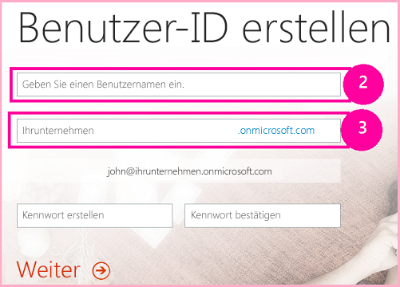

# <a name="get-started-creating-provider-hosted-sharepoint-add-ins"></a><span data-ttu-id="53bfa-103">Erste Schritte beim Erstellen eines von einem Anbieter gehosteten SharePoint-Add-Ins</span><span class="sxs-lookup"><span data-stu-id="53bfa-103">Get started creating provider-hosted SharePoint Add-ins</span></span>

<span data-ttu-id="53bfa-104">Vom Anbieter gehostete Add-Ins sind eine der zwei Haupttypen von SharePoint-Add-Ins. Einen schnellen Überblick über SharePoint-Add-Ins und die zwei verschiedenen Typen finden Sie unter [SharePoint Add-Ins](sharepoint-add-ins.md).</span><span class="sxs-lookup"><span data-stu-id="53bfa-104">Provider-hosted add-ins are one of the two major types of SharePoint Add-ins. For an overview of SharePoint Add-ins and the two different types, see [SharePoint Add-ins](sharepoint-add-ins.md).</span></span> 

<span data-ttu-id="53bfa-105">Es folgt eine Zusammenfassung zu vom Anbieter gehosteten Add-Ins:</span><span class="sxs-lookup"><span data-stu-id="53bfa-105">Here's a summary of provider-hosted add-ins:</span></span>

- <span data-ttu-id="53bfa-106">Sie enthalten Webanwendungen, Dienste oder Datenbanken, die extern über eine SharePoint-Farm oder ein SharePoint Online-Abonnement gehostet werden.</span><span class="sxs-lookup"><span data-stu-id="53bfa-106">They include a web application, service, or database that is hosted externally from the SharePoint farm or SharePoint Online subscription.</span></span> <span data-ttu-id="53bfa-107">Sie können auch SharePoint-Komponenten enthalten.</span><span class="sxs-lookup"><span data-stu-id="53bfa-107">They may also include SharePoint components.</span></span> <span data-ttu-id="53bfa-108">Sie können die externen Komponenten in einem beliebigen Webhostingstapel, einschließlich des LAMP-Stapels (Linux, Apache, MySQL und PHP) hosten.</span><span class="sxs-lookup"><span data-stu-id="53bfa-108">You can host the external components on any web-hosting stack, including the LAMP (Linux, Apache, MySQL, and PHP) stack.</span></span>
- <span data-ttu-id="53bfa-109">Die benutzerdefinierte Geschäftslogik im Add-In muss entweder in den externen Komponenten oder in JavaScript auf benutzerdefinierten SharePoint-Seiten ausgeführt werden.</span><span class="sxs-lookup"><span data-stu-id="53bfa-109">The custom business logic in the add-in has to run on either the external components or in JavaScript on custom SharePoint pages.</span></span>

<span data-ttu-id="53bfa-110">In diesem Artikel führen Sie die folgenden Schritte aus:</span><span class="sxs-lookup"><span data-stu-id="53bfa-110">In this article, you'll complete the following steps:</span></span>

- <span data-ttu-id="53bfa-111">Einrichten der Entwicklungsumgebung</span><span class="sxs-lookup"><span data-stu-id="53bfa-111">Set up your dev environment</span></span>
- <span data-ttu-id="53bfa-112">Erstellen des Add-In-Projekts</span><span class="sxs-lookup"><span data-stu-id="53bfa-112">Create the add-in project</span></span>
- <span data-ttu-id="53bfa-113">Programmieren des Add-Ins</span><span class="sxs-lookup"><span data-stu-id="53bfa-113">Code your add-in</span></span>

<span data-ttu-id="53bfa-114"><a name="Setup"> </a></span><span class="sxs-lookup"><span data-stu-id="53bfa-114"></span></span>
## <a name="set-up-your-dev-environment"></a><span data-ttu-id="53bfa-115">Einrichten der Entwicklungsumgebung</span><span class="sxs-lookup"><span data-stu-id="53bfa-115">Set up your dev environment</span></span>

<span data-ttu-id="53bfa-116">Es gibt zahlreiche verschiedene Möglichkeiten, eine Entwicklungsumgebung für SharePoint-Add-Ins einzurichten. In diesem Abschnitt wird die einfachste von ihnen beschrieben.</span><span class="sxs-lookup"><span data-stu-id="53bfa-116">There are many ways to set up a development environment for SharePoint Add-ins. This section explains the simplest way.</span></span> <span data-ttu-id="53bfa-117">Informationen zu Alternativen, z. B. Einrichten einer lokalen Umgebung, finden Sie unter [Tools](tools-and-environments-for-developing-sharepoint-add-ins.md).</span><span class="sxs-lookup"><span data-stu-id="53bfa-117">For alternatives, such as setting up an "all on-premises" environment, see [Tools](tools-and-environments-for-developing-sharepoint-add-ins.md).</span></span>

### <a name="get-the-tools"></a><span data-ttu-id="53bfa-118">Installieren der Tools</span><span class="sxs-lookup"><span data-stu-id="53bfa-118">Get the tools</span></span>

- <span data-ttu-id="53bfa-119">Falls Sie **Visual Studio 2013** oder höher noch nicht installiert haben: Installieren Sie es mithilfe der Anweisungen unter [Installieren von Visual Studio](https://docs.microsoft.com/de-DE/visualstudio/install/install-visual-studio).</span><span class="sxs-lookup"><span data-stu-id="53bfa-119">If you don't already have **Visual Studio** 2013 or later installed, install it by using the instructions at [Install Visual Studio](https://docs.microsoft.com/de-DE/visualstudio/install/install-visual-studio).</span></span> <span data-ttu-id="53bfa-120">Wir empfehlen die Verwendung der [aktuellen Version aus dem Microsoft Download Center](https://www.visualstudio.com/downloads/download-visual-studio-vs).</span><span class="sxs-lookup"><span data-stu-id="53bfa-120">We recommend using the [latest version from the Microsoft Download Center](https://www.visualstudio.com/downloads/download-visual-studio-vs).</span></span>
 
- <span data-ttu-id="53bfa-121">Visual Studio umfasst die **Microsoft Office Developer Tools für Visual Studio**.</span><span class="sxs-lookup"><span data-stu-id="53bfa-121">Visual Studio includes the **Microsoft Office Developer Tools for Visual Studio**.</span></span> <span data-ttu-id="53bfa-122">Gelegentlich wird jedoch zwischen zwei Updates von Visual Studio eine neue Version der Tools veröffentlicht.</span><span class="sxs-lookup"><span data-stu-id="53bfa-122">Sometimes a version of the tools is released between updates of Visual Studio.</span></span> <span data-ttu-id="53bfa-123">Führen Sie das [Installationsprogramm für Office Developer Tools für Visual Studio 2013](http://aka.ms/OfficeDevToolsForVS2013) oder das [Installationsprogramm für Office Developer Tools für Visual Studio 2015](http://aka.ms/OfficeDevToolsForVS2015) aus, um sicherzustellen, dass Sie die aktuelle Version der Tools haben.</span><span class="sxs-lookup"><span data-stu-id="53bfa-123">To be sure that you have the latest version of the tools, run the [installer for Office Developer Tools for Visual Studio 2013](http://aka.ms/OfficeDevToolsForVS2013), or the [installer for Office Developer Tools for Visual Studio 2015](http://aka.ms/OfficeDevToolsForVS2015).</span></span> 

<span data-ttu-id="53bfa-124">Als Referenz dienen [frühere Versionen von Visual Studio](http://msdn.microsoft.com/library/da049020-cfda-40d7-8ff4-7492772b620f.aspx) oder andere [Visual Studio-Dokumentation](https://docs.microsoft.com/de-DE/visualstudio/).</span><span class="sxs-lookup"><span data-stu-id="53bfa-124">Reference [earlier versions of Visual Studio](http://msdn.microsoft.com/library/da049020-cfda-40d7-8ff4-7492772b620f.aspx) or other [Visual Studio documentation](https://docs.microsoft.com/de-DE/visualstudio/).</span></span>

<span data-ttu-id="53bfa-125"><a name="o365_signup"> </a></span><span class="sxs-lookup"><span data-stu-id="53bfa-125"></span></span>
### <a name="sign-up-for-an-office-365-developer-site"></a><span data-ttu-id="53bfa-126">Registrieren für eine Office 365-Entwicklerwebsite</span><span class="sxs-lookup"><span data-stu-id="53bfa-126">Sign up for an Office 365 Developer Site</span></span>

> [!NOTE]
> <span data-ttu-id="53bfa-127">Möglicherweise haben Sie bereits Zugriff auf eine Office 365-Entwicklerwebsite:</span><span class="sxs-lookup"><span data-stu-id="53bfa-127">You might already have access to an Office 365 Developer Site:</span></span> 
> - <span data-ttu-id="53bfa-p105">**Sind Sie MSDN-Abonnent?** Visual Studio Ultimate und Visual Studio Premium mit MSDN-Abonnenten erhalten als Bonus ein einjähriges Office 365 Developer-Abonnement. [Lösen Sie Ihren Bonus heute ein.](https://msdn.microsoft.com/subscriptions/manage/default.aspx)</span><span class="sxs-lookup"><span data-stu-id="53bfa-p105">**Are you an MSDN subscriber?** Visual Studio Ultimate and Visual Studio Premium with MSDN subscribers receive an Office 365 Developer Subscription as a benefit. [Redeem your benefit today.](https://msdn.microsoft.com/subscriptions/manage/default.aspx)</span></span> 
> - <span data-ttu-id="53bfa-131">**Besitzen Sie einen der folgenden Office 365-Abonnementpläne?**</span><span class="sxs-lookup"><span data-stu-id="53bfa-131">**Do you have one of the following Office 365 subscription plans?**</span></span> <span data-ttu-id="53bfa-132">Wenn ja, kann ein Administrator des jeweiligen Office 365-Abonnements über das [Office 365 Admin Center](https://portal.microsoftonline.com/admin/default.aspx) eine Entwicklerwebsite für Sie erstellen.</span><span class="sxs-lookup"><span data-stu-id="53bfa-132">If so, an administrator of the Office 365 subscription can create a Developer Site by using the [Office 365 admin center](https://portal.microsoftonline.com/admin/default.aspx).</span></span> <span data-ttu-id="53bfa-133">Weitere Informationen finden Sie unter [Erstellen einer Entwicklerwebsite in einem vorhandenen Office 365-Abonnement](create-a-developer-site-on-an-existing-office-365-subscription.md).</span><span class="sxs-lookup"><span data-stu-id="53bfa-133">For more information, see [Create a developer site on an existing Office 365 subscription](create-a-developer-site-on-an-existing-office-365-subscription.md).</span></span> 

<span data-ttu-id="53bfa-134">Sie haben drei Möglichkeiten, einen Office 365-Plan zu erhalten:</span><span class="sxs-lookup"><span data-stu-id="53bfa-134">There are three ways to get an Office 365 plan:</span></span> 

- <span data-ttu-id="53bfa-135">Sie können die [kostenlose 30-Tage-Testversion](https://portal.microsoftonline.com/Signup/MainSignUp.aspx?OfferId=6881A1CB-F4EB-4db3-9F18-388898DAF510&amp;DL=DEVELOPERPACK) nutzen, die eine einzige Benutzerlizenz enthält.</span><span class="sxs-lookup"><span data-stu-id="53bfa-135">Start with a [free 30-day trial](https://portal.microsoftonline.com/Signup/MainSignUp.aspx?OfferId=6881A1CB-F4EB-4db3-9F18-388898DAF510&amp;DL=DEVELOPERPACK) with one user license.</span></span>

- <span data-ttu-id="53bfa-136">Sie können ein [Office 365-Entwicklerabonnement](https://portal.microsoftonline.com/Signup/MainSignUp.aspx?OfferId=C69E7747-2566-4897-8CBA-B998ED3BAB88&amp;DL=DEVELOPERPACK) erwerben.</span><span class="sxs-lookup"><span data-stu-id="53bfa-136">Buy an [Office 365 developer subscription](https://portal.microsoftonline.com/Signup/MainSignUp.aspx?OfferId=C69E7747-2566-4897-8CBA-B998ED3BAB88&amp;DL=DEVELOPERPACK).</span></span> 

- <span data-ttu-id="53bfa-137">Sie können sich über das Office 365-Entwicklerprogramm für ein Office 365-Entwicklerkonto mit einem Jahr Laufzeit registrieren.</span><span class="sxs-lookup"><span data-stu-id="53bfa-137">Sign up for a free, one-year Office 365 developer account through the Office 365 Developer Program.</span></span> <span data-ttu-id="53bfa-138">Weitere Informationen finden Sie [hier](http://dev.office.com/devprogram). Alternativ können Sie direkt das [Registrierungsformular](https://profile.microsoft.com/RegSysProfileCenter/wizardnp.aspx?wizid=14b845d0-938c-45af-b061-f798fbb4d170) ausfüllen.</span><span class="sxs-lookup"><span data-stu-id="53bfa-138">[Get more information](http://dev.office.com/devprogram), or go straight to [the sign-up form](https://profile.microsoft.com/RegSysProfileCenter/wizardnp.aspx?wizid=14b845d0-938c-45af-b061-f798fbb4d170).</span></span> <span data-ttu-id="53bfa-139">Nach der Registrierung für das Entwicklerprogramm erhalten Sie eine E-Mail mit einem Link, unter dem Sie sich für ein Entwicklerkonto registrieren können.</span><span class="sxs-lookup"><span data-stu-id="53bfa-139">You'll get an email after you sign up for the developer program with a link to sign up for the developer account.</span></span> <span data-ttu-id="53bfa-140">Nachfolgend finden Sie eine Anleitung.</span><span class="sxs-lookup"><span data-stu-id="53bfa-140">Use the following instructions.</span></span>

> [!TIP]
> <span data-ttu-id="53bfa-141">Öffnen Sie diese Links in einem anderen Fenster oder auf einer anderen Registerkarte, damit Sie die Anleitung jederzeit einsehen können.</span><span class="sxs-lookup"><span data-stu-id="53bfa-141">Open these links in another window or tab to keep the following instructions handy.</span></span>

1. <span data-ttu-id="53bfa-142">Die erste Seite des Registrierungsformulars ist selbsterklärend. Geben Sie die geforderten Informationen ein, und klicken Sie anschließend auf **Next**.</span><span class="sxs-lookup"><span data-stu-id="53bfa-142">The first page of the sign-up form is self-explanatory; supply the requested information, and then select **Next**.</span></span>
    
2. <span data-ttu-id="53bfa-143">Geben Sie auf der zweiten Seite, die in Abbildung 1 gezeigt ist, eine Benutzer-ID für den Administrator des Abonnements an.</span><span class="sxs-lookup"><span data-stu-id="53bfa-143">On the second page, shown in Figure 1, specify a user ID for the administrator of the subscription.</span></span>
    
   <span data-ttu-id="53bfa-144">*Abbildung 1: Domänenname der Office 365-Entwicklerwebsite*</span><span class="sxs-lookup"><span data-stu-id="53bfa-144">*Figure 1. Office 365 Developer Site domain name*</span></span>

   

3. <span data-ttu-id="53bfa-146">Erstellen Sie eine Unterdomäne von **.onmicrosoft.com**, zum Beispiel contoso.onmicrosoft.com.</span><span class="sxs-lookup"><span data-stu-id="53bfa-146">Create a subdomain of **.onmicrosoft.com**; for example, contoso.onmicrosoft.com.</span></span>
    
   <span data-ttu-id="53bfa-147">Sobald die Registrierung abgeschlossen ist, können Sie sich mit den daraus resultierenden Anmeldeinformationen (im Format *Benutzer-ID@ihredomäne.onmicrosoft.com*) bei Ihrer Office 365-Portalwebsite anmelden und dort Ihr Konto verwalten.</span><span class="sxs-lookup"><span data-stu-id="53bfa-147">After you sign up, you use the resulting credentials (in the format *UserID@yourdomain.onmicrosoft.com*) to sign in to your Office 365 portal site where you administer your account.</span></span> <span data-ttu-id="53bfa-148">Ihre SharePoint Online-Entwicklerwebsite wird in Ihrer neuen Domäne eingerichtet: `http://yourdomain.sharepoint.com`.</span><span class="sxs-lookup"><span data-stu-id="53bfa-148">Your SharePoint Online Developer Site is set up at your new domain: `http://yourdomain.sharepoint.com`.</span></span>
    
4. <span data-ttu-id="53bfa-149">Klicken Sie auf **Next**, und füllen Sie die letzte Seite des Formulars aus.</span><span class="sxs-lookup"><span data-stu-id="53bfa-149">Select **Next** and fill out the final page of the form.</span></span> <span data-ttu-id="53bfa-150">Wenn Sie sich telefonisch einen Bestätigungscode durchgeben lassen möchten, können Sie wahlweise eine Mobiltelefonnummer oder eine Festnetznummer angeben. VoIP-Nummern (Voice over Internet Protocol) werden jedoch *nicht* unterstützt.</span><span class="sxs-lookup"><span data-stu-id="53bfa-150">If you choose to provide a telephone number to get a confirmation code, you can provide a mobile or landline telephone number, but *not* a VoIP (Voice over Internet Protocol) number.</span></span>
    
   > [!NOTE]
   > <span data-ttu-id="53bfa-151">Falls Sie zum Zeitpunkt Ihrer Registrierung für ein Entwicklerkonto noch bei einem anderen Microsoft-Konto angemeldet sind, wird unter Umständen die folgende Meldung angezeigt: „Sorry, that user ID you entered didn‘t work.</span><span class="sxs-lookup"><span data-stu-id="53bfa-151">If you're signed in to another Microsoft account when you try to sign up for a developer account, you might see this message: "Sorry, that user ID you entered didn't work.</span></span> <span data-ttu-id="53bfa-152">It looks like it's not valid.</span><span class="sxs-lookup"><span data-stu-id="53bfa-152">It looks like it's not valid.</span></span> <span data-ttu-id="53bfa-153">Be sure you enter the user ID that your organization assigned to you.</span><span class="sxs-lookup"><span data-stu-id="53bfa-153">Be sure you enter the user ID that your organization assigned to you.</span></span> <span data-ttu-id="53bfa-154">Your user ID usually looks like *someone@example.com* or *someone@example.onmicrosoft.com*.“</span><span class="sxs-lookup"><span data-stu-id="53bfa-154">Your user ID usually looks like *someone@example.com* or *someone@example.onmicrosoft.com*."</span></span> 
   
   > <span data-ttu-id="53bfa-155">Sollte diese Meldung angezeigt werden, müssen Sie sich von dem betreffenden Microsoft-Konto abmelden und die Registrierung erneut versuchen.</span><span class="sxs-lookup"><span data-stu-id="53bfa-155">If you see that message, sign out of the Microsoft account you were using and try again.</span></span> <span data-ttu-id="53bfa-156">Wird Ihnen die Meldung weiterhin angezeigt: Leeren Sie den Cache Ihres Browsers, oder schalten Sie um auf **InPrivate-Browsen**, und füllen Sie das Formular erneut aus.</span><span class="sxs-lookup"><span data-stu-id="53bfa-156">If you still get the message, clear your browser cache or switch to **InPrivate Browsing** and then fill out the form.</span></span>

   <span data-ttu-id="53bfa-157">Sobald der Registrierungsprozess abgeschlossen ist, wird in Ihrem Browser die Office 365-Installationsseite geöffnet.</span><span class="sxs-lookup"><span data-stu-id="53bfa-157">After you finish the sign-up process, your browser opens the Office 365 installation page.</span></span> <span data-ttu-id="53bfa-158">Klicken Sie auf das Symbol „Admin“, um das Admin Center zu öffnen.</span><span class="sxs-lookup"><span data-stu-id="53bfa-158">Select the Admin icon to open the admin center page.</span></span>
 
   <span data-ttu-id="53bfa-159">*Abbildung 2: Office 365 Admin Center-Seite*</span><span class="sxs-lookup"><span data-stu-id="53bfa-159">*Figure 2. Office 365 admin center page*</span></span>

   

5. <span data-ttu-id="53bfa-p113">Warten Sie, bis der Einrichtungsprozess für Ihre Entwicklerwebsite abgeschlossen ist. Nach Abschluss der Bereitstellung aktualisieren Sie die Admin Center-Seite im Browser.</span><span class="sxs-lookup"><span data-stu-id="53bfa-p113">Wait for your Developer Site to finish setting up. After provisioning is complete, refresh the admin center page in your browser.</span></span>
     
6. <span data-ttu-id="53bfa-163">Klicken Sie oben links auf der Seite auf **Build Add-ins**, um Ihre Entwicklerwebsite zu öffnen.</span><span class="sxs-lookup"><span data-stu-id="53bfa-163">Select the **Build Add-ins** link in the upper-left corner of the page to open your Developer Site.</span></span> <span data-ttu-id="53bfa-164">Nun sollten Sie eine Website sehen, die wie Abbildung 3 aussieht.</span><span class="sxs-lookup"><span data-stu-id="53bfa-164">You should see a site that looks like the one in Figure 3.</span></span> <span data-ttu-id="53bfa-165">Dass die Liste **Add-ins in Testing** auf der Seite angezeigt wird, ist der Beleg dafür, dass die Website auf Basis der Vorlage für SharePoint-Entwicklerwebsites erstellt wurde.</span><span class="sxs-lookup"><span data-stu-id="53bfa-165">The **Add-ins in Testing** list on the page confirms that the website was made with the SharePoint Developer Site template.</span></span> <span data-ttu-id="53bfa-166">Falls stattdessen eine normale Teamwebsite angezeigt wird: Warten Sie einige Minuten, und starten Sie dann die Website neu.</span><span class="sxs-lookup"><span data-stu-id="53bfa-166">If you see a regular team site instead, wait a few minutes and then restart your site.</span></span>
    
7. <span data-ttu-id="53bfa-167">Notieren Sie die URL der Website. Diese wird verwendet, wenn Sie SharePoint-Add-Ins-Projekte in Visual Studio erstellen.</span><span class="sxs-lookup"><span data-stu-id="53bfa-167">Make a note of the site's URL; it's used when you create SharePoint Add-ins projects in Visual Studio.</span></span>
    
   <span data-ttu-id="53bfa-168">*Abb. 3: Die Startseite Ihrer Entwicklerwebsite mit der Liste der Add-Ins im Test*</span><span class="sxs-lookup"><span data-stu-id="53bfa-168">*Figure 3. Your Developer Site home page with the Add-ins in Testing list*</span></span>

   
 
<span data-ttu-id="53bfa-170"><a name="Create"> </a></span><span class="sxs-lookup"><span data-stu-id="53bfa-170"></span></span>
## <a name="create-the-add-in-project"></a><span data-ttu-id="53bfa-171">Erstellen des Add-In-Projekts</span><span class="sxs-lookup"><span data-stu-id="53bfa-171">Create the add-in project</span></span>

1. <span data-ttu-id="53bfa-172">Starten Sie Visual Studio mit der Option **Als Administrator ausführen**.</span><span class="sxs-lookup"><span data-stu-id="53bfa-172">Start Visual Studio by using the **Run as administrator** option.</span></span>
    
2. <span data-ttu-id="53bfa-173">Klicken Sie in Visual Studio auf **Datei** > **Neu** > **Neues Projekt**.</span><span class="sxs-lookup"><span data-stu-id="53bfa-173">In Visual Studio, select **File** > **New** > **New Project**.</span></span>
    
3. <span data-ttu-id="53bfa-174">Erweitern Sie im Dialogfeld **Neues Projekt** den Knoten **Visual C#**, dann den Knoten **Office/SharePoint**, und wählen Sie den Knoten **Add-Ins** > **SharePoint-Add-In** aus.</span><span class="sxs-lookup"><span data-stu-id="53bfa-174">In the **New Project** dialog box, expand the **Visual C#** node, expand the **Office/SharePoint** node, and then select **Add-ins** > **SharePoint Add-in**.</span></span>
    
4. <span data-ttu-id="53bfa-175">Geben Sie dem Projekt den Namen **SampleAddIn**, und wählen Sie dann **OK**.</span><span class="sxs-lookup"><span data-stu-id="53bfa-175">Name the project **SampleAddIn**, and then select **OK**.</span></span>
   
5. <span data-ttu-id="53bfa-176">Gehen Sie im Dialogfeld **Einstellungen für das SharePoint-Add-In angeben** folgendermaßen vor:</span><span class="sxs-lookup"><span data-stu-id="53bfa-176">In the **Specify the SharePoint Add-in Settings** dialog box, do the following:</span></span>
    
   - <span data-ttu-id="53bfa-177">Geben Sie die komplette URL der SharePoint-Website an, die Sie für das Debugging Ihres Add-Ins verwenden möchten.</span><span class="sxs-lookup"><span data-stu-id="53bfa-177">Provide the full URL of the SharePoint site that you want to use to debug your add-in.</span></span> <span data-ttu-id="53bfa-178">Gemeint ist die URL der Entwicklerwebsite.</span><span class="sxs-lookup"><span data-stu-id="53bfa-178">This is the URL of the Developer Site.</span></span> <span data-ttu-id="53bfa-179">Verwenden Sie HTTPS und nicht HTTP in der URL.</span><span class="sxs-lookup"><span data-stu-id="53bfa-179">Use HTTPS, not HTTP in the URL.</span></span> <span data-ttu-id="53bfa-180">An einem bestimmten Punkt während dieses Vorgangs oder kurz nachdem dieser Vorgang abgeschlossen wurde, werden Sie aufgefordert, sich bei dieser Website anzumelden.</span><span class="sxs-lookup"><span data-stu-id="53bfa-180">At some point during this procedure, or shortly after it completes, you will be prompted to sign in to this site.</span></span> <span data-ttu-id="53bfa-181">Der Zeitpunkt der Aufforderung ist unterschiedlich.</span><span class="sxs-lookup"><span data-stu-id="53bfa-181">The timing of the prompt varies.</span></span> <span data-ttu-id="53bfa-182">Verwenden Sie die Administratoranmeldeinformationen (in der Domäne \*.onmicrosoft.com), die Sie bei der Anmeldung bei Ihrer Entwicklerseite erstellt haben, z. B. MyName@contoso.onmicrosoft.com.</span><span class="sxs-lookup"><span data-stu-id="53bfa-182">Use the administrator credentials (in the \*.onmicrosoft.com domain) that you created when you signed up for your Developer Site; for example MyName@contoso.onmicrosoft.com.</span></span>    

   - <span data-ttu-id="53bfa-183">Wählen Sie unter **Wie soll Ihr Add-In für SharePoint gehostet werden** die Option **Von Anbieter gehostet** aus.</span><span class="sxs-lookup"><span data-stu-id="53bfa-183">Under **How do you want to host your SharePoint Add-in**, select **Provider-hosted**.</span></span>

   - <span data-ttu-id="53bfa-184">Wählen Sie **Weiter** aus.</span><span class="sxs-lookup"><span data-stu-id="53bfa-184">Select **Next**.</span></span>  
 
6. <span data-ttu-id="53bfa-185">Wählen Sie auf der Seite **Ziel-SharePoint-Version angeben** die Option **SharePoint Online** und dann **Weiter** aus.</span><span class="sxs-lookup"><span data-stu-id="53bfa-185">On the **Specify the target SharePoint version** page, select **SharePoint Online**, and then select **Next**.</span></span>

7. <span data-ttu-id="53bfa-186">Wählen Sie unter **Welchen Webanwendungsprojekttyp möchten Sie erstellen?**** ASP.NET Webformular-Anwendung**. Wählen Sie dann **Weiter** aus.</span><span class="sxs-lookup"><span data-stu-id="53bfa-186">Under **Which type of web application project do you want to create?**, select **ASP.NET Web Forms Application**, and then select **Next**.</span></span>

8. <span data-ttu-id="53bfa-187">Wählen Sie unter **Wie soll Ihr Add-In authentifiziert werden?**** Microsoft Azure-Zugriffssteuerungsdienst verwenden** aus.</span><span class="sxs-lookup"><span data-stu-id="53bfa-187">Under **How do you want your add-in to authenticate?**, select **Use Windows Azure Access Control Service**.</span></span>

9. <span data-ttu-id="53bfa-188">Wählen Sie im Assistenten **Fertig stellen** aus.</span><span class="sxs-lookup"><span data-stu-id="53bfa-188">In the wizard, select **Finish**.</span></span>
    
   <span data-ttu-id="53bfa-189">Ein Großteil der Konfiguration wird beim Öffnen der Lösung ausgeführt.</span><span class="sxs-lookup"><span data-stu-id="53bfa-189">Much of the configuration is done when the solution opens.</span></span> <span data-ttu-id="53bfa-190">In der Visual Studio-Projektmappe werden zwei Projekte erstellt, eines für die SharePoint-Add-In und das andere für die ASP.NET-Webanwendung.</span><span class="sxs-lookup"><span data-stu-id="53bfa-190">Two projects are created in the Visual Studio solution: one for the SharePoint Add-in and the other for the ASP.NET web application.</span></span>

<span data-ttu-id="53bfa-191"><a name="Code"> </a></span><span class="sxs-lookup"><span data-stu-id="53bfa-191"></span></span>
## <a name="code-your-add-in"></a><span data-ttu-id="53bfa-192">Codieren Ihres Add-Ins</span><span class="sxs-lookup"><span data-stu-id="53bfa-192">Code your add-in</span></span>

1. <span data-ttu-id="53bfa-p117">Öffnen Sie die Datei AppManifest.xml. Geben Sie auf der Registerkarte **Berechtigungen** den Bereich der **Websitesammlung** und die **Lese**berechtigungsstufe an.</span><span class="sxs-lookup"><span data-stu-id="53bfa-p117">Open the AppManifest.xml file. On the **Permissions** tab, specify the **Site Collection** scope and the **Read** permission level.</span></span>

2. <span data-ttu-id="53bfa-195">Löschen Sie alle Markups innerhalb des `<body>`-Tags der Datei „Pages/Default.aspx“ Ihrer Webanwendung, und fügen Sie dann die folgenden HTML- und ASP.NET-Steuerelemente in `<body>` ein.</span><span class="sxs-lookup"><span data-stu-id="53bfa-195">Delete any markup inside the `<body>` tag of the Pages/Default.aspx file of your web application, and then add the following HTML and ASP.NET controls inside the `<body>`.</span></span> <span data-ttu-id="53bfa-196">In diesem Beispiel wird das [UpdatePanel](http://msdn2.microsoft.com/de-DE/library/bb359258)-Steuerelement verwendet, um ein teilweises Seitenrendering zu aktivieren.</span><span class="sxs-lookup"><span data-stu-id="53bfa-196">This sample uses the [UpdatePanel](http://msdn2.microsoft.com/de-DE/library/bb359258) control to enable partial page rendering.</span></span>
    
    ```HTML
     <form id="form1" runat="server">
       <div>
         <asp:ScriptManager ID="ScriptManager1" runat="server"
                 EnablePartialRendering="true" />
         <asp:UpdatePanel ID="PopulateData" runat="server" UpdateMode="Conditional">
           <ContentTemplate>      
             <table border="1" cellpadding="10">
              <tr><th><asp:LinkButton ID="CSOM" runat="server" Text="Populate Data" 
                                    OnClick="CSOM_Click" /></th></tr>
              <tr><td>

             <h2>SharePoint Site</h2>
             <asp:Label runat="server" ID="WebTitleLabel"/>

             <h2>Current User:</h2>
             <asp:Label runat="server" ID="CurrentUserLabel" />

             <h2>Site Users</h2>
             <asp:ListView ID="UserList" runat="server">     
                 <ItemTemplate >
                   <asp:Label ID="UserItem" runat="server" 
                                     Text="<%# Container.DataItem.ToString()  %>">
                   </asp:Label><br />
                </ItemTemplate>
             </asp:ListView>

             <h2>Site Lists</h2>
                    <asp:ListView ID="ListList" runat="server">
                        <ItemTemplate >
                          <asp:Label ID="ListItem" runat="server" 
                                     Text="<%# Container.DataItem.ToString()  %>">
                         </asp:Label><br />
                       </ItemTemplate>
                   </asp:ListView>
                 </td>              
               </tr>
              </table>
            </ContentTemplate>
          </asp:UpdatePanel>
       </div>
     </form>
    ```

3. <span data-ttu-id="53bfa-197">Fügen Sie in der Datei „Default.aspx.cs“ der Webanwendung folgende Deklarationen hinzu.</span><span class="sxs-lookup"><span data-stu-id="53bfa-197">Add the following declarations to the Default.aspx.cs file of your web application.</span></span>
    
    ```C#
       using Microsoft.SharePoint.Client;
       using Microsoft.IdentityModel.S2S.Tokens;
       using System.Net;
       using System.IO;
       using System.Xml;
    ```

4. <span data-ttu-id="53bfa-198">Fügen Sie in der Datei „Default.aspx.cs“ der Webanwendung folgende Variablen in der [Page](http://msdn2.microsoft.com/de-DE/library/dfbt9et1)-Klasse hinzu.</span><span class="sxs-lookup"><span data-stu-id="53bfa-198">In the Default.aspx.cs file of your web application, add these variables inside the [Page](http://msdn2.microsoft.com/de-DE/library/dfbt9et1) class.</span></span>
    
   ```C#
     SharePointContextToken contextToken;
     string accessToken;
     Uri sharepointUrl;
     string siteName;
     string currentUser;
     List<string> listOfUsers = new List<string>();
     List<string> listOfLists = new List<string>();
   ```

5. <span data-ttu-id="53bfa-199">Fügen Sie die `RetrieveWithCSOM`-Methode in der [Page](http://msdn2.microsoft.com/de-DE/library/dfbt9et1)-Klasse hinzu.</span><span class="sxs-lookup"><span data-stu-id="53bfa-199">Add the `RetrieveWithCSOM` method inside the [Page](http://msdn2.microsoft.com/de-DE/library/dfbt9et1) class.</span></span> <span data-ttu-id="53bfa-200">In dieser Methode wird SharePoint CSOM verwendet, um Informationen zu Ihrer Website abzurufen und auf der Seite anzuzeigen.</span><span class="sxs-lookup"><span data-stu-id="53bfa-200">This method uses the SharePoint CSOM to retrieve information about your site and display it on the page.</span></span>
    
    ```C#
        // This method retrieves information about the host web by using the CSOM.
      private void RetrieveWithCSOM(string accessToken)
      {

          if (IsPostBack)
          {
              sharepointUrl = new Uri(Request.QueryString["SPHostUrl"]);
          }            

          ClientContext clientContext =
                          TokenHelper.GetClientContextWithAccessToken(
                              sharepointUrl.ToString(), accessToken);

          // Load the properties for the web object.
          Web web = clientContext.Web;
          clientContext.Load(web);
          clientContext.ExecuteQuery();

          // Get the site name.
          siteName = web.Title;

          // Get the current user.
          clientContext.Load(web.CurrentUser);
          clientContext.ExecuteQuery();
          currentUser = clientContext.Web.CurrentUser.LoginName;

          // Load the lists from the Web object.
          ListCollection lists = web.Lists;
          clientContext.Load<ListCollection>(lists);
          clientContext.ExecuteQuery();

          // Load the current users from the Web object.
          UserCollection users = web.SiteUsers;
          clientContext.Load<UserCollection>(users);
          clientContext.ExecuteQuery();

          foreach (User siteUser in users)
          {
              listOfUsers.Add(siteUser.LoginName);
          }

          foreach (List list in lists)
          {
              listOfLists.Add(list.Title);
          }
      }
    ```

6. <span data-ttu-id="53bfa-201">Fügen Sie die `CSOM_Click`-Methode in der [Page](http://msdn2.microsoft.com/de-DE/library/dfbt9et1)-Klasse hinzu.</span><span class="sxs-lookup"><span data-stu-id="53bfa-201">Add the `CSOM_Click` method inside the [Page](http://msdn2.microsoft.com/de-DE/library/dfbt9et1) class.</span></span> <span data-ttu-id="53bfa-202">Diese Methode löst das Ereignis aus, das auftritt, wenn der Benutzer auf den Link **Daten auffüllen** klickt.</span><span class="sxs-lookup"><span data-stu-id="53bfa-202">This method triggers the event that occurs when the user clicks the **Populate Data** link.</span></span>
    
    ```C#
      protected void CSOM_Click(object sender, EventArgs e)
    {
        string commandAccessToken = ((LinkButton)sender).CommandArgument;
        RetrieveWithCSOM(commandAccessToken);
        WebTitleLabel.Text = siteName;
        CurrentUserLabel.Text = currentUser;
        UserList.DataSource = listOfUsers;
        UserList.DataBind();
        ListList.DataSource = listOfLists;
        ListList.DataBind();    
     }
    ```

7. <span data-ttu-id="53bfa-203">Ersetzen Sie zunächst die vorhandene `Page_Load`-Methode durch diese.</span><span class="sxs-lookup"><span data-stu-id="53bfa-203">Replace the existing `Page_Load` method with this one.</span></span> <span data-ttu-id="53bfa-204">Die `Page_Load`-Methode verwendet Methoden in der Datei „TokenHelper.cs", um den Kontext aus dem `Request`-Objekt abzurufen und ein Zugriffstoken von Microsoft Azure Access Control Service (ACS) anzufordern.</span><span class="sxs-lookup"><span data-stu-id="53bfa-204">The `Page_Load` method uses methods in the TokenHelper.cs file to retrieve the context from the `Request` object and get an access token from Microsoft Azure Access Control Service (ACS).</span></span>
    
    ```C#
      // The Page_load method fetches the context token and the access token. 
    // The access token is used by all of the data retrieval methods.
    protected void Page_Load(object sender, EventArgs e)
    {
         string contextTokenString = TokenHelper.GetContextTokenFromRequest(Request);

        if (contextTokenString != null)
        {
            contextToken =
                TokenHelper.ReadAndValidateContextToken(contextTokenString, Request.Url.Authority);

            sharepointUrl = new Uri(Request.QueryString["SPHostUrl"]);
            accessToken =
                        TokenHelper.GetAccessToken(contextToken, sharepointUrl.Authority)
                        .AccessToken;

             // For simplicity, this sample assigns the access token to the button's CommandArgument property. 
             // In a production add-in, this would not be secure. The access token should be cached on the server-side.
            CSOM.CommandArgument = accessToken;
        }
        else if (!IsPostBack)
        {
            Response.Write("Could not find a context token.");
            return;
        }
    }
    ```

8. <span data-ttu-id="53bfa-205">Die Datei „Default.aspx.cs“ sollte wie folgt aussehen, wenn Sie fertig sind.</span><span class="sxs-lookup"><span data-stu-id="53bfa-205">The Default.aspx.cs file should look like this when you're finished.</span></span>
    
    ```C#
      using System;
      using System.Collections.Generic;
      using System.Linq;
      using System.Web;
      using System.Web.UI;
      using System.Web.UI.WebControls;

      using Microsoft.SharePoint.Client;
      using Microsoft.IdentityModel.S2S.Tokens;
      using System.Net;
      using System.IO;
      using System.Xml;

      namespace SampleAddInWeb
      {
          public partial class Default : System.Web.UI.Page
          {
              SharePointContextToken contextToken;
              string accessToken;
              Uri sharepointUrl;
              string siteName;
              string currentUser;
              List<string> listOfUsers = new List<string>();
              List<string> listOfLists = new List<string>();

              protected void Page_PreInit(object sender, EventArgs e)
              {
                  Uri redirectUrl;
                  switch (SharePointContextProvider.CheckRedirectionStatus(Context, out redirectUrl))
                  {
                      case RedirectionStatus.Ok:
                          return;
                      case RedirectionStatus.ShouldRedirect:
                          Response.Redirect(redirectUrl.AbsoluteUri, endResponse: true);
                          break;
                      case RedirectionStatus.CanNotRedirect:
                          Response.Write("An error occurred while processing your request.");
                          Response.End();
                          break;
                  }
              }

              protected void CSOM_Click(object sender, EventArgs e)
              {
                  string commandAccessToken = ((LinkButton)sender).CommandArgument;
                  RetrieveWithCSOM(commandAccessToken);
                  WebTitleLabel.Text = siteName;
                  CurrentUserLabel.Text = currentUser;
                  UserList.DataSource = listOfUsers;
                  UserList.DataBind();
                  ListList.DataSource = listOfLists;
                  ListList.DataBind();
              }

              // This method retrieves information about the host web by using the CSOM.
              private void RetrieveWithCSOM(string accessToken)
              {

                  if (IsPostBack)
                  {
                      sharepointUrl = new Uri(Request.QueryString["SPHostUrl"]);
                  }

                  ClientContext clientContext =
                          TokenHelper.GetClientContextWithAccessToken(
                              sharepointUrl.ToString(), accessToken);

                  // Load the properties for the web object.
                  Web web = clientContext.Web;
                  clientContext.Load(web);
                  clientContext.ExecuteQuery();

                  // Get the site name.
                  siteName = web.Title;

                  // Get the current user.
                  clientContext.Load(web.CurrentUser);
                  clientContext.ExecuteQuery();
                  currentUser = clientContext.Web.CurrentUser.LoginName;

                  // Load the lists from the Web object.
                  ListCollection lists = web.Lists;
                  clientContext.Load<ListCollection>(lists);
                  clientContext.ExecuteQuery();

                  // Load the current users from the Web object.
                  UserCollection users = web.SiteUsers;
                  clientContext.Load<UserCollection>(users);
                  clientContext.ExecuteQuery();

                  foreach (User siteUser in users)
                  {
                      listOfUsers.Add(siteUser.LoginName);
                  }

                  foreach (List list in lists)
                  {
                      listOfLists.Add(list.Title);
                  }
              }

              protected void Page_Load(object sender, EventArgs e)
              {
                  string contextTokenString = 
                       TokenHelper.GetContextTokenFromRequest(Request);

                  if (contextTokenString != null)
                  {
                      contextToken =
                          TokenHelper.ReadAndValidateContextToken(contextTokenString, Request.Url.Authority);

                      sharepointUrl = new Uri(Request.QueryString["SPHostUrl"]);
                      accessToken =
                          TokenHelper.GetAccessToken(contextToken, sharepointUrl.Authority)
                                     .AccessToken;
                      CSOM.CommandArgument = accessToken;
                  }
                  else if (!IsPostBack)
                  {
                      Response.Write("Could not find a context token.");
                      return;
                  }
              }
          }
      }
     
    ```

9. <span data-ttu-id="53bfa-206">Drücken Sie auf die F5-TASTE, um Ihr Add-In bereitzustellen und auszuführen.</span><span class="sxs-lookup"><span data-stu-id="53bfa-206">Use the F5 key to deploy and run your add-in.</span></span> <span data-ttu-id="53bfa-207">Wenn ein Dialogfeld **Sicherheitshinweis** angezeigt wird, das Sie danach fragt, ob Sie dem selbstsignierten Localhost-Zertifikat vertrauen, klicken Sie auf **Ja**.</span><span class="sxs-lookup"><span data-stu-id="53bfa-207">If you see a **Security Alert** window that asks you to trust the self-signed Localhost certificate, select **Yes**.</span></span>
    
10. <span data-ttu-id="53bfa-208">Wählen Sie **Vertrauen** auf der Zustimmungsseite, um die Berechtigungen für das Add-In zu erteilen.</span><span class="sxs-lookup"><span data-stu-id="53bfa-208">Select **Trust It** on the consent page to grant permissions to the add-in.</span></span> <span data-ttu-id="53bfa-209">Visual Studio installiert die Webanwendung in IIS Express, installiert dann das Add-In in Ihrer Test-SharePoint-Website und startet diese.</span><span class="sxs-lookup"><span data-stu-id="53bfa-209">Visual Studio will install the web application to IIS Express and then install the add-in to your test SharePoint site and launch it.</span></span> <span data-ttu-id="53bfa-210">Es wird eine Seite mit der im folgenden Screenshot gezeigten Tabelle angezeigt.</span><span class="sxs-lookup"><span data-stu-id="53bfa-210">You'll see a page that has the table shown in the following screen shot.</span></span> <span data-ttu-id="53bfa-211">Wenn Sie zusammenfassende Informationen zu Ihrer SharePoint-Website anzeigen möchten, wählen Sie **Daten auffüllen**.</span><span class="sxs-lookup"><span data-stu-id="53bfa-211">To see summary information about your SharePoint site, select **Populate Data**.</span></span>

   <span data-ttu-id="53bfa-212">*Abbildung 4. Startseite des grundlegenden vom Anbieter gehosteten Beispiel-Add-Ins*</span><span class="sxs-lookup"><span data-stu-id="53bfa-212">*Figure 4. Launch page of the basic provider-hosted add-in sample*</span></span>

   
 

<span data-ttu-id="53bfa-214"><a name="SP15createprovider_nextsteps"> </a></span><span class="sxs-lookup"><span data-stu-id="53bfa-214"></span></span>    
## <a name="next-steps"></a><span data-ttu-id="53bfa-215">Nächste Schritte</span><span class="sxs-lookup"><span data-stu-id="53bfa-215">Next steps</span></span>

<span data-ttu-id="53bfa-216">Um Ihre Add-Ins zu erstellen, führen Sie die folgenden Schritte in der folgenden Reihenfolge aus:</span><span class="sxs-lookup"><span data-stu-id="53bfa-216">To create your add-ins, walk through the following steps in this order:</span></span>
 
1.  [<span data-ttu-id="53bfa-217">Übertragen des SharePoint-Aussehens und -Verhaltens auf Ihr vom Anbieter gehostetes Add-In</span><span class="sxs-lookup"><span data-stu-id="53bfa-217">Give your provider-hosted add-in the SharePoint look-and-feel</span></span>](give-your-provider-hosted-add-in-the-sharepoint-look-and-feel.md)
2.  [<span data-ttu-id="53bfa-218">Einfügen einer benutzerdefinierten Schaltfläche in das vom Anbieter gehostete Add-In</span><span class="sxs-lookup"><span data-stu-id="53bfa-218">Include a custom button in the provider-hosted add-in</span></span>](include-a-custom-button-in-the-provider-hosted-add-in.md)
3.  [<span data-ttu-id="53bfa-219">Schnelle Übersicht über das SharePoint-Objektmodell</span><span class="sxs-lookup"><span data-stu-id="53bfa-219">Get a quick overview of the SharePoint object model</span></span>](get-a-quick-overview-of-the-sharepoint-object-model.md)
4.  [<span data-ttu-id="53bfa-220">Hinzufügen von SharePoint-Schreibvorgängen zum vom Anbieter gehosteten Add-In</span><span class="sxs-lookup"><span data-stu-id="53bfa-220">Add SharePoint write operations to the provider-hosted add-in</span></span>](add-sharepoint-write-operations-to-the-provider-hosted-add-in.md)
5.  [<span data-ttu-id="53bfa-221">Einfügen eines Add-In-Webparts in das vom Anbieter gehostete Add-In</span><span class="sxs-lookup"><span data-stu-id="53bfa-221">Include an add-in part in the provider-hosted add-in</span></span>](include-an-add-in-part-in-the-provider-hosted-add-in.md)
6.  [<span data-ttu-id="53bfa-222">Verarbeiten von Add-In-Ereignissen im vom Anbieter gehosteten Add-In</span><span class="sxs-lookup"><span data-stu-id="53bfa-222">Handle add-in events in the provider-hosted add-in</span></span>](handle-add-in-events-in-the-provider-hosted-add-in.md)
7.  [<span data-ttu-id="53bfa-223">Hinzufügen der Logik für die erste Ausführung zum vom Anbieter gehosteten Add-In</span><span class="sxs-lookup"><span data-stu-id="53bfa-223">Add first-run logic to the provider-hosted add-in</span></span>](add-first-run-logic-to-the-provider-hosted-add-in.md)
8.  [<span data-ttu-id="53bfa-224">Programmgesteuertes Bereitstellen einer benutzerdefinierten Schaltfläche in anbietergehosteten Add-Ins</span><span class="sxs-lookup"><span data-stu-id="53bfa-224">Programmatically deploy a custom button in the provider-hosted add-in</span></span>](programmatically-deploy-a-custom-button-in-the-provider-hosted-add-in.md)
9.  [<span data-ttu-id="53bfa-225">Verarbeiten von Listenelementereignissen in anbietergehosteten Add-Ins</span><span class="sxs-lookup"><span data-stu-id="53bfa-225">Handle list item events in the provider-hosted add-in</span></span>](handle-list-item-events-in-the-provider-hosted-add-in.md)


