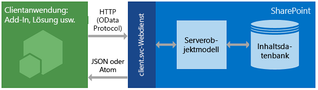

# <a name="get-to-know-the-sharepoint-rest-service"></a>Grundlegendes zum SharePoint REST-Dienst
Hier erhalten Sie grundlegende Informationen zum Verwenden des SharePoint REST-Diensts zum Zugreifen auf und Aktualisieren von SharePoint-Daten mithilfe der REST- und OData-Webprotokollstandards.
 

 **Hinweis** Der Name „Apps für SharePoint“ wird in „SharePoint-Add-Ins“ geändert. Während des Übergangszeitraums wird in der Dokumentation und der Benutzeroberfläche einiger SharePoint-Produkte und Visual Studio-Tools möglicherweise weiterhin der Begriff „Apps für SharePoint“ verwendet. Weitere Informationen finden Sie unter [Neuer Name für Office- und SharePoint-Apps](new-name-for-apps-for-sharepoint.md#bk_newname).
 

In SharePoint wurde ein REST-Dienst (Representational State Transfer) eingeführt, der mit den bestehenden SharePoint-[Clientobjektmodellen](http://msdn.microsoft.com/library/88e5e1b9-eab2-4f3b-a3f2-75c96b86f1f4%28Office.15%29.aspx) vergleichbar ist. Entwickler können nun über eine beliebige Technologie, die REST-Webanforderungen unterstützt, remote mit SharePoint-Daten interagieren. Dies bedeutet, dass Entwickler mithilfe von REST-Webtechnologien und der standardmäßigen Open Data Protocol(OData)-Syntax über SharePoint-Add-Ins, -Projektmappen und -Clientanwendungen CRUD-Vorgänge (**Erstellen**, **Lesen**, **Aktualisieren** und **Löschen**) ausführen können.
 

## <a name="prerequisites"></a>Voraussetzungen

In diesem Thema wird davon ausgegangen, dass Sie über grundlegende Kenntnisse in REST und im Erstellen von REST-Anfragen verfügen.
 

 

## <a name="how-the-sharepoint-rest-service-works"></a>Funktionsweise des SharePoint REST-Diensts
<a name="bk_how"> </a>

SharePoint bietet Ihnen jetzt die Möglichkeit, mithilfe von REST remote mit SharePoint-Websites zu interagieren. Sie können jetzt mithilfe jeder Technologie, die standardmäßige REST-Funktionen unterstützt, direkt mit SharePoint-Objekten interagieren.
 

 
Um mithilfe von REST auf SharePoint-Ressourcen zuzugreifen, erstellen Sie mithilfe des OData-Standards (Open Data Protocol), das der gewünschten Clientobjektmodell-API entspricht, eine RESTful-HTTP-Anforderung. Beispiel:
 

 
 *Clientobjektmodell-Methode:* 
 

 
List.GetByTitle(listname) 
 

 
 *REST-Endpunkt:* 
 

 
 `http://server/site/_api/lists/getbytitle('listname')`
 

 
Der client.svc-Webdienst in SharePoint verarbeitet die HTTP-Anforderung und liefert die entsprechende Antwort im Atom- oder JSON-Format (JavaScript Object Notation). Ihre Clientanwendung muss diese Antwort dann analysieren. Die unten stehende Abbildung zeigt eine allgemeine Übersicht über die REST-Architektur von SharePoint.
 

 

**Architektur des SharePoint REST-Diensts**

 

 

 
Aufgrund ihrer Funktionen und Benutzerfreundlichkeit bleiben Clientobjektmodelle die erste Entwicklungsoption für die Kommunikation mit SharePoint-Websites mithilfe von verwaltetem .NET Framework-Code, Silverlight oder JavaScript.
 

 

### <a name="use-http-commands-with-the-sharepoint-rest-service"></a>Verwenden von HTTP-Befehlen im SharePoint REST-Dienst
<a name="bk_usingHTTP"> </a>

Um die REST-Funktionen zu nutzen, die in SharePoint integriert sind, erstellen Sie mithilfe des OData-Standards, welcher der Clientobjektmodell-API entspricht, die Sie verwenden möchten, eine RESTful-HTTP-Anforderung. Der client.svc-Webdienst in SharePoint verarbeitet die HTTP-Anforderung und liefert die entsprechende Antwort im Atom- oder JSON-Format (JavaScript Object Notation). Die Clientanwendung muss diese Antwort dann analysieren.
 

 
Die Endpunkte im SharePoint REST-Dienst entsprechen den Typen und Membern in den SharePoint-Clientobjektmodellen. Mithilfe von HTTP-Anforderungen können Sie diese REST-Endpunkte verwenden, um typische CRUD-Vorgänge in SharePoint-Entitäten, z. B. Listen und Websites, auszuführen. 
 

 
Allgemein gilt:
 

 


|**Wenn Sie dies an einem Endpunkt ausführen möchten**|**Verwenden Sie diese HTTP-Anforderung**|**Zu berücksichtigen**|
|:-----|:-----|:-----|
|Lesen einer Ressource|**GET**||
|Erstellen oder Aktualisieren einer Ressource|**POST**|Verwenden Sie **POST**, um Entitäten wie Listen und Websites zu erstellen. Der SharePoint REST-Dienst unterstützt das Senden von **POST**-Befehlen mit Objektdefinitionen an Endpunkte, die Sammlungen darstellen. Bei **POST**-Vorgängen werden nicht erforderliche Eigenschaften auf ihre Standardwerte festgelegt. Wenn Sie versuchen, eine schreibgeschützte Eigenschaft als Teil des **POST**-Vorgangs festzulegen, gibt der Dienst eine Ausnahme zurück.|
|Aktualisieren oder Hinzufügen einer Ressource |**PUT**| Verwenden Sie **PUT**- und **MERGE**-Vorgänge, um vorhandene SharePoint-Objekte zu aktualisieren. Jeder Dienstendpunkt, der einen **set**-Vorgang einer Objekteigenschaft darstellt, unterstützt sowohl **PUT**- als auch **MERGE**-Anforderungen. Bei **MERGE**-Vorgängen ist das Festlegen von Eigenschaften optional; Eigenschaften, die Sie nicht explizit festlegen, behalten ihre aktuelle Eigenschaft. Wenn Sie bei **PUT**-Befehlen nicht alle erforderlichen Eigenschaften in Objektaktualisierungen angeben, gibt der REST-Dienst eine Ausnahme zurück. Zusätzlich werden alle nicht explizit festgelegten Eigenschaften auf ihre Standardeigenschaften festgelegt.|
|Löschen einer Ressource|**DELETE**|Verwenden Sie den HTTP-Befehl **DELETE** für die spezifische Endpunkt-URL, um das durch den Endpunkt dargestellte SharePoint-Objekt zu löschen. Bei wiederverwendbaren Objekten, wie Listen, Dateien und Listenelementen, führt dies zu einer **Recycle**-Operation.|

### <a name="construct-rest-urls-to-access-sharepoint-resources"></a>Erstellen von REST-URLs für den Zugriff auf SharePoint-Ressourcen
<a name="bk_constructURLs"> </a>

Wann immer möglich, bildet die URI für diese REST-Endpunkte die API-Signatur der Ressource im SharePoint-Clientobjektmodell streng nach. Die zentralen Einstiegspunkte für den REST-Service stellen die Websitesammlung und die Website des angegebenen Kontexts dar. 
 

 
Gehen Sie folgendermaßen vor, um auf eine bestimmte Websitesammlung zuzugreifen:
 

 
 `http://server/site/_api/site`
 

 
Gehen Sie folgendermaßen vor, um auf eine bestimmte Website zuzugreifen:
 

 
 `http://server/site/_api/web`
 

 
Dabei steht *server* für den Namen des Servers und *site* für den Namen der oder den Pfad zur entsprechenden Website.
 

 
Ausgehend davon können Sie dann spezifischere REST-URIs erstellen, indem Sie das Objektmodell mithilfe der durch Schrägstrich (/) getrennten Namen der APIs aus dem Clientobjektmodell durchsuchen.
 

 
Diese Syntax kann nicht für die SocialFeedManager- oder die SocialFollowingManager-REST-API verwendet werden. Weitere Informationen finden Sie in  [REST-API-Referenz für sozialen Feed für SharePoint](http://msdn.microsoft.com/library/f1cb914f-1e91-4e23-bf53-d2ab323eac13%28Office.15%29.aspx) und [REST-API-Referenz zum Folgen von Personen und Inhalten für SharePoint](http://msdn.microsoft.com/library/c05755df-846d-4a39-941d-950d066cc6d4%28Office.15%29.aspx).
 

 
Unter [Determine SharePoint REST service endpoint URIs](determine-sharepoint-rest-service-endpoint-uris.md) (Endpunkt-URIs des SharePoint REST-Dienstes bestimmen) finden Sie Richtlinien zur Ermittlung von URIs von SharePoint-REST-Endpunkten mithilfe der Signatur der entsprechenden Clientobjektmodell-APIs.
 

 

## <a name="sharepoint-rest-endpoint-examples"></a>Beispiele für SharePoint REST-Endpunkte
<a name="bk_URLexamples"> </a>

Die folgende Tabelle enthält Beispiele für typische REST-Endpunkt-URLs, um Ihnen den Einstieg in die Arbeit mit SharePoint-Daten zu erleichtern. Stellen Sie den in der Tabelle gezeigten URL-Fragmenten `http://server/site/_api/` voran, um eine vollständig qualifizierte REST-URL zu konstruieren. Wenn für **POST**-Befehle erforderlich, enthält die Tabelle Beispieldaten, die Sie im Hauptteil der HTTP-Anforderung übergeben müssen, um das angegebene SharePoint-Element zu erstellen. Elemente in Kursivschrift stellen Variablen dar, die Sie durch Ihre Werte ersetzen müssen.
 

 


|**Beschreibung**|**URL-Endpunkt**|**HTTP-Methode**|**Textkörper**|
|:-----|:-----|:-----|:-----|
|Ruft den Titel einer Liste ab| `web/title`|GET|–|
|Ruft alle Listen auf einer Website| `lists`|GET|–|
|Ruft die Metadaten einer einzelnen Liste ab| `lists/getbytitle('listname')`|GET|–|
|Ruft Elemente in einer Liste ab| `lists/getbytitle('listname')/items`|GET|Nicht zutreffend|
|Ruft eine bestimmte Eigenschaft eines Dokuments ab. (In diesem Fall den Titel des Dokuments.)| `lists/getbytitle('listname')?select=Title`|GET|–|
|Erstellt eine Liste| `lists`|POST|
```
{
  '__metadata':{'type':SP.List},
  'AllowContentTypes': true,
  'BaseTemplate': 104 ,
  'ContentTypesEnabled': true,
  'Description': 'My list description ',
  'Title': 'RestTest '
}
```

|Fügt ein Element zu einer Liste hinzu| `lists/getbytitle('listname')/items`|POST|
```
{
  '__metadata':{'type': SP.Data.'listname'.ListItem},
  'Title': 'MyItem'
}

```

|

## <a name="batch-job-support"></a>Unterstützung für Batchaufträge
<a name="batch"> </a>

Der SharePoint Online-REST-Dienst (und der Dienst von SharePoint 2016 (lokal) oder höher) unterstützt die Kombination mehrerer Anforderungen in einem einzelnen Dienstaufruf mithilfe der OData-Abfrageoption `$batch`. Einzelheiten und Links zu Codebeispielen finden Sie unter [Make batch requests with the REST APIs](make-batch-requests-with-the-rest-apis.md) (Erstellen von Batchanforderungen mit den REST-APIs).
 

 

## <a name="additional-resources"></a>Zusätzliche Ressourcen
<a name="bk_learnmore"> </a>

Verwenden Sie die unten aufgeführten Ressourcen, um weitere Informationen zum Verwenden des SharePoint REST-Diensts zu erhalten.
 

 

|**Titel**|**Beschreibung**|
|:-----|:-----|
| [Ausführen grundlegender Vorgänge unter Verwendung von SharePoint REST-Endpunkten](complete-basic-operations-using-sharepoint-rest-endpoints.md)|In diesem Artikel erfahren Sie, wie Sie grundlegende Erstellungs-, Lese-, Aktualisierungs- und Löschoperationen, auch als CRUD-Operationen (Create, Read, Update, Delete) bezeichnet, mit der SharePoint REST-Schnittstelle durchführen.|
| [Arbeiten mit Listen und Listenelementen unter Verwendung von REST](working-with-lists-and-list-items-with-rest.md)|In diesem Artikel erfahren Sie, wie Sie grundlegende Erstellungs-, Lese-, Aktualisierungs- und Löschoperationen, auch als CRUD-Operationen (Create, Read, Update, Delete) bezeichnet, für Listen und Listenelemente mit der SharePoint REST-Schnittstelle durchführen.|
| [Arbeiten mit Ordnern und Dateien unter Verwendung von REST](working-with-folders-and-files-with-rest.md)|In diesem Artikel erfahren Sie, wie Sie grundlegende Erstellungs-, Lese-, Aktualisierungs- und Löschoperationen, auch als CRUD.-Operationen (Create, Read, Update, Delete) bezeichnet, für Ordner und Dateien mit der SharePoint REST-Schnittstelle durchführen.|
| [Navigieren in der im REST-Dienst dargestellten SharePoint-Datenstruktur](navigate-the-sharepoint-data-structure-represented-in-the-rest-service.md)|Informationen zum Starten von einem REST-Endpunkt für einen gegebenen SharePoint-Element und Navigieren zu und Zugreifen auf dazugehörige Elemente, z. B. übergeordnete Standorte oder die Bibliotheksstruktur, in der sich das jeweilige Element befindet.|
| [Ermitteln von URIs von SharePoint REST-Dienstendpunkten](determine-sharepoint-rest-service-endpoint-uris.md)|Informieren Sie sich über allgemeine Richtlinien zur Ermittlung von URIs von SharePoint-REST-Endpunkten mithilfe der Signatur der entsprechenden Clientobjektmodell-APIs.|
| [Verwenden von OData-Abfragevorgängen in SharePoint REST-Anforderungen](use-odata-query-operations-in-sharepoint-rest-requests.md)|Hier erfahren Sie, wie Sie eine Reihe von OData-Abfragezeichenfolgeoperatoren verwenden, um die vom SharePoint REST-Dienst angeforderten Daten auszuwählen, zu filtern und zu ordnen.|
| [SharePoint - REST-API, Endpunkte und Beispiele](http://msdn.microsoft.com/library/rest-api-reference-and-samples%28Office.15%29.aspx)|Diese Seite enthält Links zu allen REST-Ressourcen, die auf MSDN für SharePoint-Entwickler verfügbar sind.|
| [Übersicht über die REST-API der SharePoint-Suche](http://msdn.microsoft.com/library/8a4f7863-e4c1-4099-9189-a1894db36930%28Office.15%29.aspx)|Fügen Sie Suchfunktionen zu Client- und mobilen Anwendungen hinzu, mit dem Search-REST-Dienst in SharePoint Server 2013 und jeder Technologie, die REST-Webanforderungen unterstützt.|
| [REST-API-Referenz für sozialen Feed für SharePoint](http://msdn.microsoft.com/library/f1cb914f-1e91-4e23-bf53-d2ab323eac13%28Office.15%29.aspx)|Informieren Sie sich über SharePoint-REST-Endpunkte für feedbezogene Aufgaben.|
| [REST-API-Referenz zum Folgen von Personen und Inhalten für SharePoint](http://msdn.microsoft.com/library/c05755df-846d-4a39-941d-950d066cc6d4%28Office.15%29.aspx)|Informieren Sie sich über SharePoint-REST-Endpunkte zum Folgen von Personen und Inhalten.|
| [Durchführen von Batchanforderungen mit den REST-APIs](make-batch-requests-with-the-rest-apis.md)|Erfahren Sie, wie Sie mehrere Anforderungen zu einem einzigen Aufruf an den REST-Dienst kombinieren.|
| [Synchronisieren von SharePoint-Elementen mit dem REST-Dienst](synchronize-sharepoint-items-using-the-rest-service.md)|Erfahren Sie, wie Sie mit der Ressource **GetListItemChangesSinceToken**, die Teil des SharePoint REST-Diensts ist, Elemente zwischen SharePoint und Ihren Add-ins oder Diensten synchronisieren.|
| [Verwenden von ETag-Werten zum Bestimmen der Version von Dokument- und Listenelementen über den REST-Dienst](http://msdn.microsoft.com/library/5f7e0579-46b7-44ab-b3b4-cdbc622dcd98%28Office.15%29.aspx)|Erfahren Sie, wie Sie HTML ETags mit dem SharePoint REST-Dienst für die Gleichzeitigkeitssteuerung von SharePoint-Listen und -Listenelementen verwenden.|

## <a name="odata-resources"></a>OData-Ressourcen
<a name="SP15startREST_bk_addlresources"> </a>


 

 

-  [Einführung OData](http://msdn.microsoft.com/de-DE/data/hh237663)
    
 
-  [Open Data Protocol – Beispiel](http://msdn.microsoft.com/de-DE/library/ff478141.aspx)
    
 
-  [Open Data Protocol](http://www.odata.org/)
    
 
-  [OData-Protokoll – URI-Konventionen](http://www.odata.org/documentation/odata-version-2-0/uri-conventions/)
    
 
-  [Adressieren von Dienstvorgängen](http://www.odata.org/documentation/odata-version-2-0/uri-conventions#AddressingServiceOperations)
    
 
-  [OData-Protokoll – Vorgänge](http://www.odata.org/documentation/odata-version-2-0/operations/)
    
 
-  [Fehlerbedingungen](http://www.odata.org/documentation/odata-version-2-0/operations#ErrorConditions)
    
 

