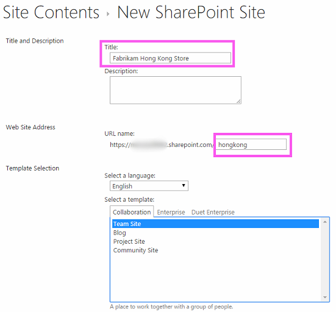
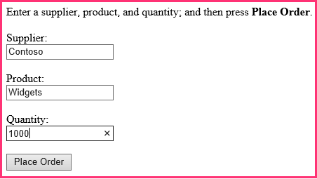
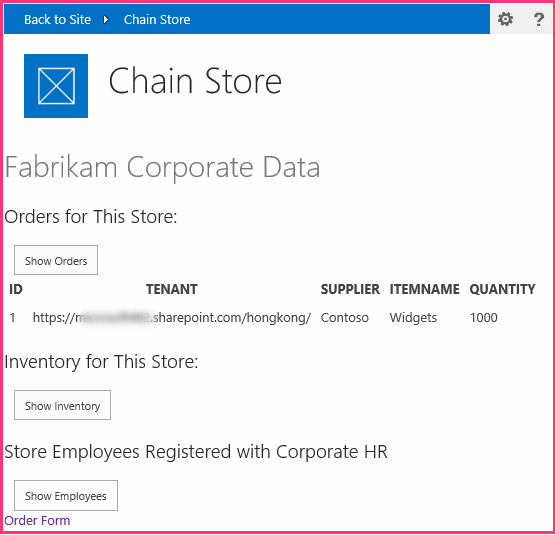
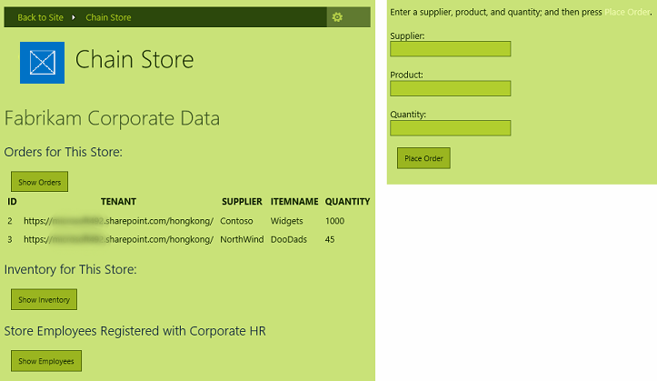

# <a name="give-your-provider-hosted-add-in-the-sharepoint-look-and-feel"></a><span data-ttu-id="4aa50-101">Übertragen des SharePoint-Aussehens und -Verhaltens auf Ihr vom Anbieter gehostetes Add-In</span><span class="sxs-lookup"><span data-stu-id="4aa50-101">Give your provider-hosted add-in the SharePoint look-and-feel</span></span>
<span data-ttu-id="4aa50-102">Erfahren Sie, wie Sie Ihren vom Anbieter gehosteten SharePoint-Add-Ins das Aussehen und Verhalten von SharePoint geben.</span><span class="sxs-lookup"><span data-stu-id="4aa50-102">Learn how to give your provider-hosted spappplural the look and feel of SharePoint.</span></span>
 

 <span data-ttu-id="4aa50-p101">**Hinweis** Der Name „Apps für SharePoint“ wird in „SharePoint-Add-Ins“ geändert. Während des Übergangszeitraums wird in der Dokumentation und der Benutzeroberfläche einiger SharePoint-Produkte und Visual Studio-Tools möglicherweise weiterhin der Begriff „Apps für SharePoint“ verwendet. Weitere Informationen finden Sie unter [Neuer Name für Office- und SharePoint-Apps](new-name-for-apps-for-sharepoint#bk_newname).</span><span class="sxs-lookup"><span data-stu-id="4aa50-p101">The name "apps for SharePoint" is changing to "SharePoint Add-ins". During the transition, the documentation and the UI of some SharePoint products and Visual Studio tools might still use the term "apps for SharePoint". For details, see [New name for apps for Office and SharePoint](new-name-for-apps-for-sharepoint#bk_newname).</span></span>
 

<span data-ttu-id="4aa50-p102">Dies ist der zweite in einer Reihe von Artikeln über die Grundlagen der Entwicklung von vom Anbieter gehosteten SharePoint-Add-Ins. Sie sollten sich zuerst mit [SharePoint Add-Ins](sharepoint-add-ins) und den vorherigen Artikeln in dieser Reihe vertraut machen:</span><span class="sxs-lookup"><span data-stu-id="4aa50-p102">Learn how to give your provider-hosted SharePoint Add-ins the look and feel of SharePoint. This is the second in a series of articles about the basics of developing provider-hosted SharePoint Add-ins. You should first be familiar with  [SharePoint Add-ins](sharepoint-add-ins) and the previous articles in this series:</span></span>
 

-  [<span data-ttu-id="4aa50-108">Erste Schritte beim Erstellen von einem Anbieter gehosteten SharePoint-Add-Ins</span><span class="sxs-lookup"><span data-stu-id="4aa50-108">Get started creating provider-hosted SharePoint Add-ins</span></span>](get-started-creating-provider-hosted-sharepoint-add-ins)
    
 
<span data-ttu-id="4aa50-p103">Im vorherigen Artikel dieser Reihe haben Sie gelernt, wie Sie eine Entwicklungsumgebung einrichten und Visual Studio verwenden, um ein erstes Add-In der Ebene „Hello World" zu erstellen, das SharePoint-Daten in der Remotewebanwendung des Add-Ins zur Verfügung stellt. In diesem Artikel beginnen wir mit einer SharePoint-Add-In-Projektmappe, die bereits erstellt wurde. Sie enthält eine ASP.NET-Web Forms-Anwendung und eine SQL Azure-Datenbank. Wir haben diese für Sie erstellt, da diese Reihe von Artikeln dafür vorgesehen ist, sich nur auf SharePoint-Add-Ins zu konzentrieren. Sie fügen weitere SharePoint-Funktionalität und die Integration in das Add-In mit jedem Artikel dieser Reihe hinzu.</span><span class="sxs-lookup"><span data-stu-id="4aa50-p103">In the previous article of this series you learned how to set up a development environment and how to use Visual Studio to create a first "Hello World" level add-in that exposes SharePoint data in the add-in's remote web application. In this article, we are going to start with an SharePoint Add-in solution that has already been created. It includes an ASP.NET Web Forms application and an SQL Azure database. We've created these for you because this series of articles is intended to focus only on SharePoint Add-ins. You'll be adding more SharePoint functionality and integration to the add-in with each article in this series.</span></span>
 

 

## <a name="get-to-know-the-base-add-in"></a><span data-ttu-id="4aa50-114">Einführung in das Basis-Add-In</span><span class="sxs-lookup"><span data-stu-id="4aa50-114">Get to know the base add-in</span></span>

<span data-ttu-id="4aa50-p104">Wir werden Ihnen in dieser Reihe keine Kenntnisse der ASP.NET- oder T-SQL-Programmierung vermitteln, aber Sie müssen ein wenig über die Remotekomponenten des Add-Ins wissen, bevor wir die Integration in SharePoint beginnen können. Das Szenario des Add-Ins umfasst eine Kette von Einzelhandelsgeschäften, und jedes Geschäft verfügt über eine Teamwebsite im SharePoint Online-Abonnement der Muttergesellschaft. Wenn ein Geschäft das Add-In auf der Teamwebsite installiert, ermöglicht das Add-In die Integration der SharePoint-Daten und den Umgang mit Daten in der Datenbank der Muttergesellschaft. Jede Instanz des Add-Ins verfügt über einen eigenen Mandanten in der Unternehmensdatenbank, und Benutzer können nur mit den Unternehmensdaten interagieren, die ihrem Geschäft zugeordnet sind.</span><span class="sxs-lookup"><span data-stu-id="4aa50-p104">We are not going to teach you ASP.NET or T-SQL programming in this series, but you need to know a little about the remote components of the add-in before we can start integrating it into SharePoint. The scenario of the add-in envisions a chain of retail stores and each store has a team website in the parent company's SharePoint Online subscription. When a store installs the add-in on its team site, the add-in enables them to integrate their SharePoint data and experience with data in the parent company's database. Each instance of the add-in has its own tenancy in the corporate database, and users can only interact with corporate data that is associated with their store.</span></span>
 

 

### <a name="begin-by-creating-team-sites-for-two-stores-in-the-chain"></a><span data-ttu-id="4aa50-119">Beginnen mit dem Erstellen von Teamwebsites für zwei Geschäfte der Kette</span><span class="sxs-lookup"><span data-stu-id="4aa50-119">Begin by creating team sites for two stores in the chain</span></span>


1. <span data-ttu-id="4aa50-p105">Öffnen Sie die Startseite von SharePoint Online, und klicken Sie dann auf den Link **Websiteinhalte** auf der Schnellstartleiste. Blättern Sie auf der Seite **Websiteinhalte** nach unten, bis Sie den Link **Neue Unterwebsite** sehen. Klicken Sie darauf.</span><span class="sxs-lookup"><span data-stu-id="4aa50-p105">Open the home page of your SharePoint Online and then click the **Site Contents** link on the quick launch. On the **Site Contents** page, scroll down until you see the **new subsite** link and click it.</span></span>
    
 
2. <span data-ttu-id="4aa50-122">Füllen Sie auf der Seite **Neue SharePoint-Website** das Formular für eine neue Teamwebsite mithilfe der Werte im folgenden Screenshot aus.</span><span class="sxs-lookup"><span data-stu-id="4aa50-122">On the **New SharePoint Site** page, fill out the form for a new team site by using the values in the following screen shot.</span></span>
    
  
 

 

 
3. <span data-ttu-id="4aa50-124">Behalten Sie für alle anderen Einstellungen die Standardeinstellungen bei, und klicken Sie auf **Erstellen**.</span><span class="sxs-lookup"><span data-stu-id="4aa50-124">Leave all other settings at their defaults and press **Create**.</span></span>
    
 

### <a name="explore-the-add-in"></a><span data-ttu-id="4aa50-125">Erkunden des Add-Ins</span><span class="sxs-lookup"><span data-stu-id="4aa50-125">Explore the add-in</span></span>


1. <span data-ttu-id="4aa50-p106">Wechseln Sie zu [SharePoint_Provider-hosted_Add-Ins_Tutorials](https://github.com/OfficeDev/SharePoint_Provider-hosted_Add-ins_Tutorials), und klicken sie auf die Schaltfläche zum **Herunterladen der ZIP-Datei**, um das Repository auf Ihren Desktop herunterzuladen. Entpacken Sie die Datei.</span><span class="sxs-lookup"><span data-stu-id="4aa50-p106">Go to  [SharePoint_Provider-hosted_Add-Ins_Tutorials](https://github.com/OfficeDev/SharePoint_Provider-hosted_Add-ins_Tutorials) and click the **Download ZIP** button to download the repository to your desktop. Unzip the file.</span></span>
    
 
2. <span data-ttu-id="4aa50-p107">Starten Sie Visual Studio *als Administrator*, und öffnen Sie dann die Datei „BeforeSharePointUI.sln“. Es gibt drei Projekte in der Lösung:</span><span class="sxs-lookup"><span data-stu-id="4aa50-p107">Launch Visual Studio *as an administrator*  and then open BeforeSharePointUI.sln. There are three projects in the solution:</span></span>
    
      -  <span data-ttu-id="4aa50-130">**ChainStore**: Das SharePoint-Add-In-Projekt.</span><span class="sxs-lookup"><span data-stu-id="4aa50-130">**ChainStore** - the SharePoint Add-in project.</span></span>
    
 
  -  <span data-ttu-id="4aa50-131">**ChainStoreWeb**: Die Remotewebanwendung.</span><span class="sxs-lookup"><span data-stu-id="4aa50-131">**ChainStoreWeb** - the remote web application.</span></span>
    
 
  -  <span data-ttu-id="4aa50-132">**ChainCorporateDB**: Die Azure SQL-Datenbank.</span><span class="sxs-lookup"><span data-stu-id="4aa50-132">**ChainCorporateDB** - the SQL Azure database.</span></span>
    
 
3. <span data-ttu-id="4aa50-p108">Wählen Sie das Projekt **ChainStore** aus, und legen Sie im Fenster **Eigenschaften** die Eigenschaft **Website-URL** auf die vollständige URL der Hongkong-Teamwebsite fest:https://{YOUR_SHAREPOINT_DOMAIN}/hongkong/. Achten Sie darauf, dass das Zeichen „/“ am Ende einzufügen. Klicken Sie auf die Schaltfläche **Speichern**.  *An einem bestimmten Punkt in diesem Prozess werden Sie aufgefordert, sich bei Ihrem SharePoint Online-Abonnement anzumelden.*</span><span class="sxs-lookup"><span data-stu-id="4aa50-p108">Select the **ChainStore** project and, in the **Properties** window, set the **Site URL** property to the full URL of the Hong Kong team site:https://{YOUR_SHAREPOINT_DOMAIN}/hongkong/. Be sure to include the "/" character at the end. Press the **Save** button. *At some point in this process, you will be prompted to login to your SharePoint Online subscription.*</span></span> 
    
 
4. <span data-ttu-id="4aa50-137">Klicken Sie mit der rechten Maustaste oben im **Projektmappen-Explorer** auf den Projektmappenknoten, und wählen Sie **Startprojekte festlegen** aus.</span><span class="sxs-lookup"><span data-stu-id="4aa50-137">Right-click the solution node at the top of **Solution Explorer** and select **Set startup projects**.</span></span>
    
 
5. <span data-ttu-id="4aa50-138">Stellen Sie sicher, dass alle drei Projekte in der Spalte **Aktion** auf **Start** festgelegt sind.</span><span class="sxs-lookup"><span data-stu-id="4aa50-138">Make sure all three projects are set to **Start** in the **Action** column.</span></span>
    
 
6. <span data-ttu-id="4aa50-p109">Verwenden Sie die F5-Taste, um das Ihr Add-In bereitzustellen und auszuführen. Visual Studio hostet die Remotewebanwendung in IIS Express und die SQL-Datenbank in SQL Express. Außerdem wird eine temporäre Installation des Add-Ins auf Ihrer SharePoint-Testwebsite durchgeführt, und das Add-In wird sofort ausgeführt. Sie werden aufgefordert, Berechtigungen für das Add-In zu erteilen, bevor die Startseite geöffnet wird.</span><span class="sxs-lookup"><span data-stu-id="4aa50-p109">Use the F5 key to deploy and run your add-in. Visual Studio hosts the remote web application in IIS Express and hosts the SQL database in SQL Express. It also makes a temporary installation of the add-in on your test SharePoint site and immediately runs the add-in. You are prompted to grant permissions to the add-in before it's start page opens.</span></span>
    
 
7. <span data-ttu-id="4aa50-p110">Die Add-In-Startseite sieht wie im folgenden Screenshot aus. Ganz oben wird der Name der SharePoint-Website angezeigt, auf der das Add-In installiert ist. Dies ist ein Nebeneffekt eines Beispielcodes, den Office-Entwicklertools für Visual Studio generiert. Dies wird in einem späteren Schritt geändert. Die Seite hat Bereiche, in denen Daten aus den SQL-Unternehmensdatenbanktabellen **Bestand**, **Aufträge** und **Mitarbeiter** angezeigt werden. Diese Tabellen sind zunächst leer.</span><span class="sxs-lookup"><span data-stu-id="4aa50-p110">The add-in's start page looks like the one in the screen shot below. At the very top is the name of the SharePoint website where the add-in is installed. This is a side effect of some sample code that the Office Developer Tools for Visual Studio generate. You'll change this in a later step. The page has areas where data from the corporate **Inventory**, **Orders**, and **Employees** SQL database tables can be seen. These tables are empty initially.</span></span>
    
  
 

 

 
8. <span data-ttu-id="4aa50-p111">Öffnen Sie den Link **Auftragsformular** am unteren Rand der Seite, um ein Auftragsformular zu öffnen. Geben Sie einige Werte in das Formular ein, und klicken Sie auf **Bestellung aufgeben**. Der folgende Screenshot zeigt ein Beispiel. Es sieht nicht so aus, als wäre etwas passiert, aber der Code hinter der Schaltfläche übergibt die Werte an eine parametrisierte gespeicherte Prozedur in der SQL-Datenbank. Das Verwenden von parametrisierten gespeicherten Prozeduren schützt die Datenbank vor Angriffen durch Einschleusung von SQL-Befehlen.</span><span class="sxs-lookup"><span data-stu-id="4aa50-p111">Open the **Order Form** link at the bottom of the page to open an order form. Enter some values in the form and press **Place Order**. The following screenshot shows an example. It won't appear that anything has nappened, but the code behind the button passes the values to a parameterized stored procedure in the SQL database. Using parameterized stored procedures protects the database from SQL injection attacks.</span></span>
    
  
 

 

 
9. <span data-ttu-id="4aa50-p112">Verwenden Sie die Schaltfläche „Zurück“ des Browsers, um zurück zur Startseite zu navigieren, und klicken Sie dann auf die Schaltfläche **Bestellungen anzeigen**. Die Seite wird aktualisiert, und Ihre Bestellung wird auf der Seite angezeigt, ähnlich wie im folgenden Screenshot.</span><span class="sxs-lookup"><span data-stu-id="4aa50-p112">Use the browser's back button to navigate back to the start page, and then press the **Show Orders** button. The page will refresh and your order will appear on the page similar to the following screenshot.</span></span>
    
    <span data-ttu-id="4aa50-p113">Die Tabelle weist ein Feld **Mandanten** mit der URL Ihrer SharePoint-Testwebsite als Wert. Dies bezieht sich nicht auf das SharePoint Online-Abonnement, das manchmal als Mandant bezeichnet wird, sondern jede Instanz des Add-Ins ist ein unterschiedlicher Mandant in der Datenbank des Unternehmens. Da nicht mehr als eine Instanz eines Add-Ins in einem bestimmten SharePoint-Hostweb installiert werden kann, kann die URL des Hostwebs als Mandantendiskriminator in der Datenbank verwendet werden. (Eine Wiederholung zum Unterschied zwischen Hostweb und Add-In-Web finden Sie unter [SharePoint-Add-Ins](sharepoint-add-ins).) Alle gespeicherten Prozeduren im Add-In enthalten den Diskriminatorwert, wenn sie an die Datenbank schreiben oder aus dieser lesen. Das sorgt dafür, dass beim Klicken auf die Schaltfläche **Bestellungen anzeigen** (oder **Mitarbeiter anzeigen** oder **Bestand anzeigen**) durch den Benutzer nur die Daten aus der Datenbank abgerufen werden, die dem Geschäft des Benutzers zugeordnet sind. Dieses Design stellt außerdem sicher, dass Benutzer nur für ihr eigenes Geschäft Bestellungen aufgeben und Mitarbeiter hinzufügen können.</span><span class="sxs-lookup"><span data-stu-id="4aa50-p113">The table has a **Tenant** field with the URL of your test SharePoint website as the value. This does not refer to the SharePoint Online subscription that is sometimes called a tenancy. Instead, each instance of the add-in is a distinct tenant in the corporate database. Since no more than one instance of an add-in can be installed on a specific SharePoint host web, the URL of the host web can be used as a tenant discriminator in the database. (For a refresher on the distinction between host web and add-in web, see [SharePoint Add-ins](sharepoint-add-ins).) All of the stored procedures in the add-in include the discriminator value when they write or read from the database. This ensures that when a user presses the **Show Orders** (or **Show Employees** or **Show Inventory**) button, only the data that is associated with the user's store is retrieved from the database. This design also ensures that users can only place orders and add employees for their own store.</span></span>
    
    <span data-ttu-id="4aa50-p114">Die Remotewebanwendung ruft die Hostweb-URL von einen Abfragezeichenfolgenparameter ab, den SharePoint zur URL der Startseite hinzufügt, wenn das Add-In gestartet wird. Da SSL verwendet wird, wird diese Abfragezeichenfolge verschlüsselt, während sie über das Internet an die Remotewebanwendung übergeben wird.</span><span class="sxs-lookup"><span data-stu-id="4aa50-p114">The remote web application obtains the host web URL from a query string parameter that SharePoint adds to the URL of the start page when it launches the add-in. Since SSL is being used, this query string is encrypted as it goes across the Internet to the remote web application.</span></span> 
    
  
 

 

 
10. <span data-ttu-id="4aa50-p116">Schließen Sie zum Beenden der Debugsitzung das Browserfenster, oder beenden Sie das Debuggen in Visual Studio. Jedes Mal, wenn Sie F5 drücken, zieht Visual Studio die vorherige Version des Add-Ins zurück und installiert die neueste.</span><span class="sxs-lookup"><span data-stu-id="4aa50-p116">To end the debugging session, close the browser window or stop debugging in Visual Studio. Each time that you press F5, Visual Studio will retract the previous version of the add-in and install the latest one.</span></span>
    
 
11. <span data-ttu-id="4aa50-p117">Das Add-In bleibt standardmäßig im SharePoint-Hostweb zwischen Debugsitzungen in Visual Studio installiert. Um anzuzeigen, wie Endbenutzer es nach der Installation starten, öffnen Sie die SharePoint-Website „Fabrikam Hong Kong“ in Ihrem Browser, und navigieren Sie zur Seite **Websiteinhalte**. Sie sehen die Kachel für das Add-In, wie im folgenden Screenshot gezeigt:</span><span class="sxs-lookup"><span data-stu-id="4aa50-p117">By default the add-in remains installed on the SharePoint host web in between debugging sessions in Visual Studio. To see how end users would launch it after it is installed, open the Fabrikam Hong Kong SharePoint website in your browser and navigate to the **Site Contents** page. You'll see the tile for the add-in as it is in the following screenshot:</span></span>
    
  
 

    
     <span data-ttu-id="4aa50-175">**Hinweis** Wenn Sie auf die Kachel klicken, wird die Startseite nicht geöffnet, weil Visual Studio die IIS Express-Sitzung schließt, wenn Sie das Debuggen beenden.</span><span class="sxs-lookup"><span data-stu-id="4aa50-175">**Note** If you click on the tile, the start page will not open because Visual Studio closes the IIS Express session when you stop debugging.</span></span>

## <a name="configure-visual-studio-to-rebuild-the-corporate-database-with-each-debugging-session"></a><span data-ttu-id="4aa50-176">Konfigurieren von Visual Studio zum Neuerstellen der Unternehmensdatenbank in jeder Debugsitzung</span><span class="sxs-lookup"><span data-stu-id="4aa50-176">Configure Visual Studio to rebuild the corporate database with each debugging session</span></span>
<span data-ttu-id="4aa50-177"><a name="Rebuild"> </a></span><span class="sxs-lookup"><span data-stu-id="4aa50-177"></span></span>

 <span data-ttu-id="4aa50-p118">Standardmäßig erstellt Visual Studio die SQL Express-Datenbank *nicht*  neu. Daher sind Bestellungen und andere Elemente, die Sie in einer Debugsitzung zur Datenbank hinzufügen, in späteren Sitzungen noch in der Datenbank enthalten. Es ist einfacher, jedes Mal, wenn Sie F5 Drücken, mit einer leeren Datenbank zu starten. Gehen Sie also wie folgt vor:</span><span class="sxs-lookup"><span data-stu-id="4aa50-p118">By default, Visual Studio will *not*  rebuild the SQL Express database. So orders and other items that you add to the database in one debugging session are still in the database in later sessions. It is easier to start with an empty database each time you press F5, so take these steps:</span></span>
 

 

1. <span data-ttu-id="4aa50-181">Klicken Sie mit der rechten Maustaste auf das Projekt **ChainCorporateDB**, und wählen Sie **Eigenschaften** aus.</span><span class="sxs-lookup"><span data-stu-id="4aa50-181">Right-click the **ChainCorporateDB** project and select **Properties**.</span></span>
    
 
2. <span data-ttu-id="4aa50-182">Öffnen Sie die Registerkarte **Debuggen**, und aktivieren Sie die Option **Datenbank immer neu erstellen**.</span><span class="sxs-lookup"><span data-stu-id="4aa50-182">Open the **Debug** tab and enable the **Always re-create database** option.</span></span>
    
 

## <a name="give-the-remote-web-application-the-look-and-feel-of-sharepoint"></a><span data-ttu-id="4aa50-183">Anwenden des Aussehens und Verhaltens von SharePoint auf die Remotewebanwendung</span><span class="sxs-lookup"><span data-stu-id="4aa50-183">Give the remote web application the look and feel of SharePoint</span></span>
<span data-ttu-id="4aa50-184"><a name="Rebuild"> </a></span><span class="sxs-lookup"><span data-stu-id="4aa50-184"></span></span>

<span data-ttu-id="4aa50-185">In einigen Szenarien sollen Ihre Remoteseiten ihr eigenes Branding haben, aber in den meisten Fällen sollten sie die Benutzeroberfläche von SharePoint imitieren, damit Benutzer den Eindruck haben, dass sie weiterhin in SharePoint arbeiten.</span><span class="sxs-lookup"><span data-stu-id="4aa50-185">In some scenarios, you want your remote pages to have their own branding, but in most cases they should mimic the UI of SharePoint so that users feel they are still inside SharePoint.</span></span>
 

 

### <a name="add-sharepoint-chrome-and-top-bar-to-the-start-page"></a><span data-ttu-id="4aa50-186">Hinzufügen der SharePoint-Chrome- und obere Leiste zur Startseite</span><span class="sxs-lookup"><span data-stu-id="4aa50-186">Add SharePoint chrome and top bar to the start page</span></span>


1. <span data-ttu-id="4aa50-p119">Navigieren Sie im **Projektmappen-Explorer** zu **ChainStoreWeb | Seiten**, und öffnen Sie die Datei „CorporateDataViewer.aspx“. Hierbei handelt es sich um die Startseite des Add-Ins.</span><span class="sxs-lookup"><span data-stu-id="4aa50-p119">In **Solution Explorer**, navigate to **ChainStoreWeb | Pages**, and open the CorporateDataViewer.aspx file. This is the add-in's start page</span></span>
    
 
2. <span data-ttu-id="4aa50-p120">Im Abschnitt **head** sehen Sie ein Skript, das eine Reihe von JavaScript-Bibliotheken lädt. Fügen Sie das folgende zusätzliche Skript darunter hinzu. Dieses Skript lädt die Datei „SP.UI.Controls.js“, die sich auf jeder SharePoint-Website im Ordner „/_layouts/15/“ befindet. Diese Datei lädt unter anderem die SharePoint-CSS-Bibliothek.</span><span class="sxs-lookup"><span data-stu-id="4aa50-p120">In the **head** section, you'll see a script that loads a couple of JavaScript libraries. Add the following additional script below it. This script loads the SP.UI.Controls.js file which is in every SharePoint website at the /_layouts/15/ folder. Among other things, this file will load the SharePoint CSS library.</span></span>
    
```
  <script type="text/javascript">
    var hostweburl;

    // Load the SharePoint resources.
    $(document).ready(function () {

        // Get the URI decoded add-in web URL.
        hostweburl =
            decodeURIComponent(
                getQueryStringParameter("SPHostUrl")
        );

        // The SharePoint js files URL are in the form:
        // web_url/_layouts/15/resource.js
        var scriptbase = hostweburl + "/_layouts/15/";

        // Load the js file and continue to the 
        // success handler.
        $.getScript(scriptbase + "SP.UI.Controls.js")
    });

    // Function to retrieve a query string value.
    function getQueryStringParameter(paramToRetrieve) {
        var params =
            document.URL.split("?")[1].split("&amp;");
        var strParams = "";
        for (var i = 0; i < params.length; i = i + 1) {
            var singleParam = params[i].split("=");
            if (singleParam[0] == paramToRetrieve)
                return singleParam[1];
        }
    }
</script>
```

3. <span data-ttu-id="4aa50-p121">Fügen Sie am Anfang des Textabschnitts der Seite das folgende Markup hinzu. Dadurch wird die obere Leiste von SharePoint, die als Chromsteuerelement bezeichnet wird, auf der Seite eingefügt. Die Details dieses Markups werden klarer, wenn das überarbeitete Add-In später in diesem Artikel getestet wird. (Die Zeichenfolge „App" wird in einigen der Eigenschaftennamen angezeigt, da Add-Ins zuvor als „Apps" bezeichnet wurden.)</span><span class="sxs-lookup"><span data-stu-id="4aa50-p121">At the top of the body section of the page, add the following markup. This will insert the SharePoint top bar, called the chrome control, onto the page. The details of this markup will become clearer when we test the revised add-in later in this article. (The string "app" appears in some of the property names because add-ins used to be called "apps".)</span></span>
    
```
  <!-- Chrome control placeholder. Options are declared inline.  -->
<div 
    id="chrome_ctrl_container"
    data-ms-control="SP.UI.Controls.Navigation"  
    data-ms-options=
        '{  
            "appHelpPageUrl" : "Help.aspx",
            "appIconUrl" : "/Images/AppIcon.png",
            "appTitle" : "Chain Store",
            "settingsLinks" : [
                {
                    "linkUrl" : "Account.aspx",
                    "displayName" : "Account settings"
                },
                {
                    "linkUrl" : "Contact.aspx",
                    "displayName" : "Contact us"
                }
            ]
         }'>
</div>
```

4. <span data-ttu-id="4aa50-p122">Die **H1**-Header und der Hyperlink im Textteil der Seite verwenden automatisch Formate, die in der CSS-Bibliothek von SharePoint gespeichert sind, und müssen deshalb nicht geändert werden. Zum Illustrieren der Verwendungsweise von SharePoint-Formaten legen Sie die Spaltenüberschriften in den drei **GridView**-Steuerelementen auf das Share-Point-Format „Großbuchstaben“ fest, indem Sie das Attribut **HeaderStyle-CssClass** zu jedem der Steuerelemente hinzufügen und den Wert auf `ms-uppercase` festlegen. Im Folgenden sehen Sie ein Beispiel. Nehmen Sie dieselbe Änderung an allen drei **GridView**-Steuerelementen vor.</span><span class="sxs-lookup"><span data-stu-id="4aa50-p122">The **H1** headers and the hyperlink in the body of the page will automatically use styles defined in SharePoint's CSS library, so they don't need to be changed. To illustrate how you can use the SharePoint styles, set the column headings in the three **GridView** controls to SharePoint's "all caps" style by adding the **HeaderStyle-CssClass** attribute to each of the controls and setting its value to " `ms-uppercase`". The following is an example. Make the same change to all three **GridView** controls.</span></span>
    
```XML
  <asp:GridView ID="ordersGridView" runat="server" CellPadding="5" GridLines="None" 
HeaderStyle-CssClass="ms-uppercase" />
```

5. <span data-ttu-id="4aa50-p123">Das Chromsteuerelement verwendet das Add-In-Symbol, deshalb wird eine zweite Kopie der Symboldatei auf dem Remotewebserver benötigt. Klicken Sie im **Projektmappen-Explorer** mit der rechten Maustaste auf die Datei AppIcon.png im Projekt **ChainStore**, und wählen Sie **Kopieren** aus.</span><span class="sxs-lookup"><span data-stu-id="4aa50-p123">The chrome control uses the add-in's icon, so we need a second copy of the icon file on the remote web server. In **Solution Explorer**, right-click the AppIcon.png file in the **ChainStore** project and choose **Copy**.</span></span> 
    
 
6. <span data-ttu-id="4aa50-203">Klicken Sie mit der rechten Maustaste auf den Ordner **Bilder** im Projekt **ChainStoreWeb**, und wählen Sie **Einfügen** aus.</span><span class="sxs-lookup"><span data-stu-id="4aa50-203">Right-click the **Images** folder in the **ChainStoreWeb** project and choose **Paste**.</span></span>
    
 
7. <span data-ttu-id="4aa50-204">Öffnen Sie die Datei „CorporateDataViewer.aspx.cs“.</span><span class="sxs-lookup"><span data-stu-id="4aa50-204">Open the CorporateDataViewer.aspx.cs file.</span></span>
    
 
8. <span data-ttu-id="4aa50-p124">Die  `CorporateDataViewer`-Klasse deklariert einen privaten Member des Typs **SharePointContext**. Diese Klasse ist in der SharePointContext.cs-Datei definiert, die die Office-Entwicklertools für Visual Studio generiert haben, als das Projekt erstellt wurde. Sie können sich das in etwa wie die **HttpContextBase**-Klasse von ASP.NET vorstellen, aber mit hinzugefügten kontextbezogenen SharePoint-Informationen wie der Hostweb-URL.</span><span class="sxs-lookup"><span data-stu-id="4aa50-p124">The  `CorporateDataViewer` class declares a private member of type **SharePointContext**. This class is defined in the SharePointContext.cs file that the Office Developer Tools for Visual Studio generated when the project was created. You can think of it as something like the **HttpContextBase** class of ASP.NET, but with SharePoint contextual information, such as the host web's URL, added to it.</span></span>
    
    <span data-ttu-id="4aa50-p125">In der Methode **Page_Load** gibt es eine **using**-Anweisung, die den Namen des SharePoint-Hostwebs an die Remotestartseite schreibt. Hierbei handelt es sich um Beispielcode, deshalb löschen Sie die gesamte **using**-Anweisung. (Aber behalten Sie die Zeile bei, die die Variable  `spContext` initialisiert.) Die Methode sollte jetzt wie folgt aussehen.</span><span class="sxs-lookup"><span data-stu-id="4aa50-p125">In the **Page_Load** method, there is a **using** statement that writes the name of the SharePoint host web to the remote start page. This is sample code, so delete the entire **using** statement. (But leave the line that initializes the `spContext` variable.) The method should now look like the following.</span></span>
    


```C#
  protected void Page_Load(object sender, EventArgs e)
{
    spContext = SharePointContextProvider.Current.GetSharePointContext(Context);
}
```

9. <span data-ttu-id="4aa50-211">Es gibt vier andere ASP.NET-Dateien, die die SharePoint-UI benötigen:</span><span class="sxs-lookup"><span data-stu-id="4aa50-211">There are four other ASP.NET files that need the SharePoint UI:</span></span> 
    
      - <span data-ttu-id="4aa50-212">Account.aspx</span><span class="sxs-lookup"><span data-stu-id="4aa50-212">Account.aspx</span></span>
    
 
  - <span data-ttu-id="4aa50-213">Contact.aspx</span><span class="sxs-lookup"><span data-stu-id="4aa50-213">Contact.aspx</span></span>
    
 
  - <span data-ttu-id="4aa50-214">Help.aspx</span><span class="sxs-lookup"><span data-stu-id="4aa50-214">Help.aspx</span></span>
    
 
  - <span data-ttu-id="4aa50-215">OrderForm.aspx</span><span class="sxs-lookup"><span data-stu-id="4aa50-215">OrderForm.aspx</span></span>
    
 

     <span data-ttu-id="4aa50-p126">**Hinweis** Die letzte aspx-Datei des Projekts, EmployeeAdder.aspx, wird tatsächlich nie gerendert, deshalb sollten Sie deren Benutzeroberfläche nicht ändern. Sie erfahren mehr darüber in einem späteren Artikel dieser Reihe.</span><span class="sxs-lookup"><span data-stu-id="4aa50-p126">**Note** The last aspx file in the project, EmployeeAdder.aspx, is never actually rendered, so you don't change its UI. You'll learn more about it in a later article of this series.</span></span> 

    <span data-ttu-id="4aa50-p127">Das Chromsteuerelement soll sich jedoch nicht auf diesen Seiten befinden. Wir möchten lediglich auf die SharePoint-CSS-Bibliothek zugreifen. Fügen Sie für jede dieser vier das folgende Markup zum Element **head** hinzu.</span><span class="sxs-lookup"><span data-stu-id="4aa50-p127">But we don't want the chrome control on these pages. We just want access to the SharePoint CSS library. For each of these four, add the following markup to the **head** element.</span></span>
    


```XML
  <link type="text/css" rel="stylesheet" 
href="<%= spContext.SPHostUrl.ToString() + "_layouts/15/defaultcss.ashx" %>" />
```

10. <span data-ttu-id="4aa50-p128">Dieser und der nächste Schritt wurden für die Seite „Auftragsformular" und „Konto" bereits durchgeführt, sie gelten also nur für die Seiten „Kontakt" und „Hilfe". Um das  `spContext`-Objekt auf jede der Seiten einzufügen, öffnen Sie die *.aspx-CodeBehind-Dateien für die drei aspx-Seiten. Fügen Sie in jeder den folgenden Member zur Klasse **Page** hinzu.</span><span class="sxs-lookup"><span data-stu-id="4aa50-p128">This step and the next one have already been done for the Order Form page and the Account page, so they apply only to the Contact, and Help pages. To get the  `spContext` object onto each of the pages, open the *.aspx.cs code behind files for the three aspx pages. In each of them, add the following member to the **Page** class.</span></span>
    
```C#
  protected SharePointContext spContext;
```

11. <span data-ttu-id="4aa50-p129">Ersetzen Sie die Methode **Page_Load** durch die folgende Version. Das Objekt wird aus dem Sitzungscache abgerufen. Es wurde zwischengespeichert, als es erstmals von der Methode **Page_Load** der Startseite des Add-Ins erstellt wurde.</span><span class="sxs-lookup"><span data-stu-id="4aa50-p129">Replace the **Page_Load** method with the following version. The object is being retrieved from the Session cache. It was cached there when it was first created by the **Page_Load** method of the add-in's start page.</span></span>
    
```C#
  protected void Page_Load(object sender, EventArgs e)
{
    spContext = Session["SPContext"] as SharePointContext;
}
```

12. <span data-ttu-id="4aa50-p130">Öffnen Sie die Seite „OrderForm.aspx“. Ersetzen Sie oben im Element **Label** das Element **<b>** auf dem Ausdruck **Bestellung aufgeben** durch Span-Tags, die auf die `ms-accentText`-CSS-Klasse verweisen. Das gesamte **Label**-Steuerelement sollte wie folgt aussehen, wenn Sie fertig sind.</span><span class="sxs-lookup"><span data-stu-id="4aa50-p130">Open the OrderForm.aspx page. In the top Label element, replace the  b  element on the phrase Place Order with span tags that reference the  CSS class. The entire Label control should look like this when you are done.</span></span>
    
```XML
  <asp:Label ID="lblOrderPrompt" runat="server"
         Text="Enter a supplier, product, and quantity; and then press <span class='ms-accentText'>Place Order</span>.">
</asp:Label>
```


## <a name="run-the-add-in-and-test-the-new-sharepoint-ui"></a><span data-ttu-id="4aa50-230">Ausführen des Add-Ins und Testen der neuen SharePoint-UI</span><span class="sxs-lookup"><span data-stu-id="4aa50-230">Run the add-in and test the new SharePoint UI</span></span>
<span data-ttu-id="4aa50-231"><a name="Rebuild"> </a></span><span class="sxs-lookup"><span data-stu-id="4aa50-231"></span></span>

1. <span data-ttu-id="4aa50-p131">Verwenden Sie die F5-TASTE, um Ihr Add-In bereitzustellen und auszuführen. Visual Studio hostet die Remotewebanwendung in IIS Express und die SQL-Datenbank in SQL Express. Außerdem wird eine temporäre Installation des Add-Ins auf Ihrer SharePoint-Testwebsite durchgeführt, und das Add-In wird sofort ausgeführt. Sie werden aufgefordert, Berechtigungen für das Add-In zu erteilen, bevor die Startseite geöffnet wird.</span><span class="sxs-lookup"><span data-stu-id="4aa50-p131">Use the F5 key to deploy and run your add-in. Visual Studio hosts the remote web application in IIS Express and hosts the SQL database in a SQL Express. It also makes a temporary installation of the add-in on your test SharePoint site and immediately runs the add-in. You are prompted to grant permissions to the add-in before it's start page opens.</span></span>
    
2. <span data-ttu-id="4aa50-p132">Wenn die Add-In-Startseite geöffnet wird, sieht sie jetzt wie eine SharePoint-Seite aus. Klicken Sie auf den Link **Auftragsformular**. Das Formular sieht jetzt ebenfalls wie ein SharePoint-Formular aus.</span><span class="sxs-lookup"><span data-stu-id="4aa50-p132">When the add-in's start page opens, it now looks like a SharePoint page. Click the **Order Form** link. It also now looks like a SharePoint form.</span></span>
    
  
 
3. <span data-ttu-id="4aa50-241">Erstellen Sie eine Bestellung, und klicken Sie auf **Bestellung aufgeben**.</span><span class="sxs-lookup"><span data-stu-id="4aa50-241">Create an order and press **Place Order**.</span></span>
    
4.  <span data-ttu-id="4aa50-p134">Verwenden Sie die Schaltfläche „Zurück" des Browsers, um zurück zur Add-In-Startseite zu navigieren, und klicken Sie dann auf **Bestellungen anzeigen**. Die Seite sollte jetzt ungefähr wie folgt aussehen. Beachten Sie, dass die Spaltenüberschriften jetzt in Großbuchstaben dargestellt sind.</span><span class="sxs-lookup"><span data-stu-id="4aa50-p134">Use the browser's back button to navigate back to the add-in start page, and then press **Show Orders**. The page should now look similar like the following. Note that the column headings are now all caps.</span></span> 
    
  
 

5. <span data-ttu-id="4aa50-p136">Klicken Sie auf das Symbol **?** am Ende des Chromsteuerelements. Eine einfache Hilfeseite wird geöffnet. Klicken Sie im Browser auf die Schaltfläche „Zurück“.</span><span class="sxs-lookup"><span data-stu-id="4aa50-p136">Press the **?** icon on the end of the chrome control. A simple help page opens. Click the browser's back button.</span></span>
    
 
6. <span data-ttu-id="4aa50-p137">Klicken Sie auf das Zahnradsymbol des Chromsteuerelements. Ein Menü mit Links zu einer Konto- und einer Kontaktseite wird geöffnet. Öffnen Sie die Kontoseite, und verwenden Sie im Browser die Schaltfläche „Zurück", um zur Startseite zurückzukehren. Gehen Sie genauso mit der Kontaktseite vor.</span><span class="sxs-lookup"><span data-stu-id="4aa50-p137">Press the gear icon on the chrome control. A menu opens with links for an Account and a Contact page. Open the Account page and use the browser's back button to get back to the start page. Do the same for the Contact page.</span></span>
    
 
7. <span data-ttu-id="4aa50-p138">Klicken Sie auf die Schaltfläche **Zurück zur Website** des Chromsteuerelements. Die Startseite des Hostwebs, die Teamwebsite des Geschäfts in Hongkong, wird geöffnet.</span><span class="sxs-lookup"><span data-stu-id="4aa50-p138">Click the **Back to Site** button on the chrome control. The home page of the host web, the Hong Kong store team site, opens.</span></span>
    
 
8. <span data-ttu-id="4aa50-257">Klicken Sie auf das Zahnradsymbol in der oberen Leiste, und wählen Sie dann **Aussehen ändern** aus.</span><span class="sxs-lookup"><span data-stu-id="4aa50-257">Click the gear icon on the top bar and then choose **Change the look**.</span></span>
    
 
9. <span data-ttu-id="4aa50-258">Folgen Sie den Anweisungen, um der Website ein anderes Aussehen zu verleihen.</span><span class="sxs-lookup"><span data-stu-id="4aa50-258">Follow the prompts to change the site to one of the alternative "looks".</span></span> 
    
 
10. <span data-ttu-id="4aa50-p139">Navigieren Sie zur Seite **Websiteinhalte**, und starten Sie die ChainStore-App über ihre Kachel. Ihre benutzerdefinierten Seiten haben das ausgewählte Aussehen übernommen. Die folgenden Screenshots zeigen, wie sie im zusammengesetzten Design **Natur** angezeigt werden.</span><span class="sxs-lookup"><span data-stu-id="4aa50-p139">Navigate to the **Site Contents** page and launch the Chain Store app from its tile. Your custom pages have taken on the chosen look. The following screenshots show how they appear in the **Nature** composed look.</span></span>
    
  
 

11. <span data-ttu-id="4aa50-263">Ändern Sie das Aussehen der Website wieder auf die Standardeinstellung, die als **Office** bezeichnet wird.</span><span class="sxs-lookup"><span data-stu-id="4aa50-263">Change the site's look back to the default, which is called **Office**.</span></span>
    
 
12. <span data-ttu-id="4aa50-p140">Schließen Sie zum Beenden der Debugsitzung das Browserfenster, oder beenden Sie das Debuggen in Visual Studio. Jedes Mal, wenn Sie F5 drücken, zieht Visual Studio die vorherige Version des Add-Ins zurück und installiert die neueste.</span><span class="sxs-lookup"><span data-stu-id="4aa50-p140">To end the debugging session, close the browser window or stop debugging in Visual Studio. Each time that you press F5, Visual Studio will retract the previous version of the add-in and install the latest one.</span></span>
    
 
13. <span data-ttu-id="4aa50-p141">Da Sie mit diesem Add-In und dieser Visual Studio-Projektmappe in anderen Artikeln arbeiten werden, hat es sich bewährt, das Add-In ein letztes Mal zurückzuziehen, wenn Sie Ihre Arbeit daran für eine Weile abgeschlossen haben. Klicken Sie mit der rechten Maustaste auf das Projekt im **Projektmappen-Explorer**, und wählen Sie **Zurückziehen** aus.</span><span class="sxs-lookup"><span data-stu-id="4aa50-p141">You will work with this add-in and Visual Studio solution in other articles, and it's a good practice to retract the add-in one last time when you are done working with it for a while. Right-click the project in **Solution Explorer** and choose **Retract**.</span></span>
    
 

## <a name="next-steps"></a><span data-ttu-id="4aa50-268">Nächste Schritte</span><span class="sxs-lookup"><span data-stu-id="4aa50-268">Next Steps</span></span>
<span data-ttu-id="4aa50-269"><a name="Nextsteps"> </a></span><span class="sxs-lookup"><span data-stu-id="4aa50-269"></span></span>

 <span data-ttu-id="4aa50-p142">Das Add-In sieht nun wie SharePoint aus, ist aber dennoch nur noch eine Webanwendung, die nicht wirklich in SharePoint integriert ist, außer dass sie über eine Kachel in SharePoint gestartet wird. Im nächsten Artikel fügen Sie einen benutzerdefinierten Befehl hinzu, der über eine benutzerdefinierte Menübandschaltfläche gestartet wird: [Einfügen einer benutzerdefinierten Schaltfläche in das vom Anbieter gehostete Add-In](include-a-custom-button-in-the-provider-hosted-add-in).</span><span class="sxs-lookup"><span data-stu-id="4aa50-p142">The add-in now looks like SharePoint, but it's still just a web application that doesn't really integrate with SharePoint beyond being launched from a tile in SharePoint. You'll add a custom command, launched from a custom ribbon button in the next article: [Include a custom button in the provider-hosted add-in](include-a-custom-button-in-the-provider-hosted-add-in).</span></span>
 

 

