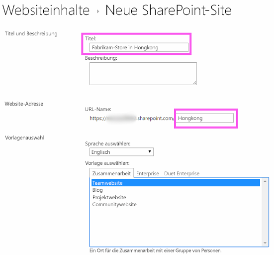
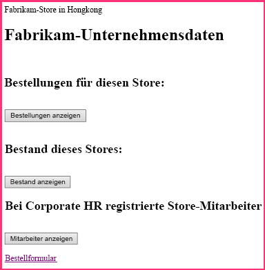
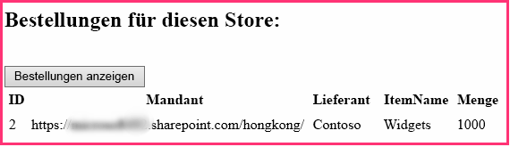
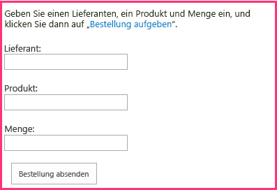

# <a name="give-your-provider-hosted-add-in-the-sharepoint-look-and-feel"></a>Implementieren von SharePoint-Verhalten und -Aussehen in anbietergehosteten Add-Ins

Dies ist der zweite in einer Reihe von Artikeln über die Grundlagen der Entwicklung von vom Anbieter gehosteten SharePoint-Add-Ins. Sie sollten sich zuerst mit [SharePoint Add-Ins](sharepoint-add-ins.md) und den vorherigen Artikeln in dieser Reihe vertraut machen:

-  [Erste Schritte beim Erstellen von von einem Anbieter gehosteten SharePoint-Add-Ins](get-started-creating-provider-hosted-sharepoint-add-ins.md)
    
Im vorherigen Artikel dieser Reihe haben Sie erfahren, wie eine Entwicklungsumgebung eingerichtet und Visual Studio verwendet wird, um ein erstes Hello World-Add-In zu erstellen, das SharePoint-Daten in der Remotewebanwendung des Add-Ins verfügbar macht. 

In diesem Artikel beginnen wir mit einer SharePoint-Add-In-Lösung, die bereits erstellt wurde. Diese umfasst eine ASP.NET Web Forms-Anwendung und eine SQL Azure-Datenbank. Diese wurden für Sie erstellt, da sich diese Artikelreihe nur auf SharePoint-Add-Ins konzentriert. Sie werden in jedem Artikel in dieser Reihe weitere SharePoint-Funktionen und eine Integration in das Add-In hinzufügen.

## <a name="get-to-know-the-base-add-in"></a>Einführung in das Basis-Add-In

Wir werden Sie in dieser Reihe nicht mit der Programmierung in ASP.NET oder T-SQL vertraut machen, Sie benötigen aber ein paar Informationen über die Remotekomponenten des Add-Ins, bevor wir beginnen können, dieses in SharePoint zu integrieren. Das Szenario des Add-Ins geht von einer Kette von Einzelhandelsgeschäften aus, und jedes Geschäft verfügt über eine Teamwebsite im SharePoint Online-Abonnement des übergeordneten Unternehmens. Wenn ein Geschäft das Add-In auf seiner Teamwebsite installiert, kann dieses seine SharePoint-Daten und die Oberfläche mit Daten über das Add-In in die Datenbank des übergeordneten Unternehmens integrieren. Jede Instanz des Add-Ins verfügt über seine eigene Mandantschaft in der Unternehmensdatenbank, und Benutzer können nur mit Unternehmensdaten interagieren, die mit dem jeweiligen Geschäften verknüpft sind.

### <a name="create-team-sites-for-two-stores-in-the-chain"></a>Erstellen von Teamwebsites für zwei Geschäfte der Kette

1. Öffnen Sie die Startseite Ihrer SharePoint Online-Website, und wählen Sie den Link **Websiteinhalte** im Schnellstart aus. Führen Sie auf der Seite **Websiteinhalte** einen Bildlauf nach unten aus, bis Sie den Link **Neue Unterwebsite** sehen, und klicken Sie darauf.
 
2. Füllen Sie auf der Seite **Neue SharePoint-Website** das Formular für eine neue Teamwebsite mithilfe der Werte im folgenden Screenshot aus.

   - **Titel**: Fabrikam-Store in Hongkong
   - **URL**: hongkong
    
   *Abbildung 1. Formular zum Erstellen einer neuen SharePoint-Unterwebsite*

   

3. Behalten Sie für alle anderen Einstellungen die Standardeinstellungen bei, und klicken Sie dann auf **Erstellen**.

### <a name="explore-the-add-in"></a>Erkunden des Add-Ins

1. Wechseln Sie zu [SharePoint_Provider-hosted_Add-Ins_Tutorials](https://github.com/OfficeDev/SharePoint_Provider-hosted_Add-ins_Tutorials), und klicken sie auf die Schaltfläche zum **Herunterladen der ZIP-Datei**, um das Repository auf Ihren Desktop herunterzuladen. Entpacken Sie die Datei.
 
2. Starten Sie Visual Studio *als Administrator*, und öffnen Sie dann die Datei „BeforeSharePointUI.sln“. Es gibt drei Projekte in der Lösung:
    
   - **ChainStore**: Das SharePoint-Add-In-Projekt.
   - **ChainStoreWeb**: Die Remotewebanwendung.
   - **ChainCorporateDB**: Die Azure SQL-Datenbank.

3. Wählen Sie das Projekt **ChainStore** aus, und legen Sie im Fenster **Eigenschaften** die Eigenschaft **Website-URL** auf die vollständige URL der Teamwebsite für Hongkong fest: `https://{YOUR_SHAREPOINT_DOMAIN}/hongkong/` (vergessen Sie nicht das Zeichen „/“ am Ende). Klicken Sie auf **Speichern**. *Während dieses Prozesses werden Sie aufgefordert, sich bei Ihrem SharePoint Online-Abonnement anzumelden.* 
    
4. Klicken Sie mit der rechten Maustaste oben im **Projektmappen-Explorer** auf den Projektmappenknoten, und wählen Sie **Startprojekte festlegen** aus.
 
5. Stellen Sie sicher, dass alle drei Projekte in der Spalte **Aktion** auf **Start** festgelegt sind.
    
6. Verwenden Sie die F5-Taste, um Ihr Add-In bereitzustellen und auszuführen. Visual Studio hostet die Remotewebanwendung in IIS Express und die SQL-Datenbank in SQL Express. Visual Studio führt zudem eine temporäre Installation des Add-Ins auf Ihrer SharePoint-Testwebsite durch und führt das Add-In sofort aus. Sie werden aufgefordert, Berechtigungen für das Add-In zu erteilen, bevor die Startseite geöffnet wird.
    
7. Die Startseite des Add-Ins sieht wie in Abbildung 2 aus. Ganz oben befindet sich der Name der SharePoint-Website, auf der das Add-In installiert ist. Dies ist ein Nebeneffekt von manchen Beispielcodes, die von den Office-Entwicklertools für Visual Studio generiert werden. Sie ändern dies in einem späteren Schritt. Die Seite weist Bereiche auf, auf der Daten aus den SQL-Datenbanktabellen **Bestellungen**, **Inventar** und **Mitarbeiter** des Unternehmens zu sehen sind. Diese Tabellen sind anfangs leer.
  
   *Abbildung 2. Startseite des Chain Store-Add-Ins*

   

8. Wählen Sie den Link **Bestellformular** unten auf der Seite auf, um ein Bestellformular zu öffnen. Geben Sie einige Werte in das Formular ein, und klicken Sie dann auf **Bestellung aufgeben**. Der Screenshot in Abbildung 3 zeigt ein Beispiel. Es sieht so aus, als würde nichts passieren, der Code hinter der Schaltfläche übergibt jedoch die Werte an einen parametrisierte gespeicherte Prozedur in der SQL-Datenbank. Durch Verwendung von parametrisierten gespeicherten Prozeduren wird die Datenbank vor Angriffen durch Einschleusung von SQL-Befehlen geschützt.

   *Abbildung 3. Bestellformular*

   

9. Verwenden Sie die Schaltfläche „Zurück“ des Browsers, um zur Startseite zurückzugehen, und klicken Sie dann auf die Schaltfläche **Bestellungen anzeigen**. Die Startseite wird aktualisiert, und Ihre Bestellungen werden auf der Seite ähnlich wie im Screenshot in Abbildung 4 angezeigt.

   *Abbildung 4. Startseite nach Auswahl von „Bestellungen anzeigen“*

   
    
   Die Tabelle weist ein Feld **Mandant** mit der URL Ihrer SharePoint-Testwebsite als Wert auf. Diese verweist nicht auf das SharePoint Online-Abonnement, das manchmal als Mandantschaft bezeichnet wird. Stattdessen handelt es sich bei jeder Instanz des Add-Ins um einen unterschiedlichen Mandanten in der Unternehmensdatenbank. Da nur eine Instanz des Add-Ins in einem bestimmten SharePoint-Hostweb installiert werden kann, kann die URL des Hostwebs als Mandantendiskriminator in der Datenbank verwendet werden. (Eine Auffrischung zur Unterscheidung zwischen Hostweb und Add-In-Web finden Sie unter [SharePoint-Add-Ins](sharepoint-add-ins.md).) 
   
   Alle gespeicherten Prozeduren im Add-In umfassen den Diskriminatorwert beim Schreiben oder Lesen aus der Datenbank. Dadurch wird sichergestellt, dass nur die Daten, die mit dem Geschäft des Benutzers verknüpft sind, aus der Datenbank abgerufen werden, wenn ein Benutzer auf **Bestellungen anzeigen** (oder **Lagerbestand anzeigen** oder **Mitarbeiter anzeigen** klickt.) Durch dieses Design wird auch sichergestellt, dass Benutzer nur für ihr eigenes Geschäft Bestellungen aufgeben und Mitarbeiter hinzufügen können.
    
   Die Remotewebanwendung ruft die Hostweb-URL von einem Abfragezeichenfolgenparameter ab, den SharePoint zu der URL der Startseite hinzufügt, wenn das Add-In gestartet wird. Da SSL verwendet wird, wird diese Abfragezeichenfolge verschlüsselt, während sie über das Internet an die Remotewebanwendung übertragen wird. 

10. Schließen Sie zum Beenden der Debugsitzung das Browserfenster, oder beenden Sie das Debuggen in Visual Studio. Jedes Mal, wenn Sie F5 drücken, zieht Visual Studio die vorherige Version des Add-Ins zurück und installiert die neueste.   
 
11. Standardmäßig bleibt das Add-In auf dem SharePoint-Hostweb zwischen Debugsitzungen in Visual Studio installiert. Um zu sehen, wie Endbenutzer das Add-In nach der Installation starten, öffnen Sie die SharePoint-Website für Fabrikam Hongkong in Ihrem Browser, und gehen Sie zur Seite **Websiteinhalte**. Die Kachel für das Add-In wird im in dem folgenden Screenshot angezeigt.

   *Abbildung 5. Startkachel für das Chain Store-Add-In*

   
 
   > [!NOTE]
   > Wenn Sie auf die Kachel klicken, wird die Startseite nicht geöffnet, weil Visual Studio die IIS Express-Sitzung schließt, wenn Sie das Debuggen beenden.

<a name="Rebuild"> </a>
## <a name="configure-visual-studio-to-rebuild-the-corporate-database-with-each-debugging-session"></a>Konfigurieren von Visual Studio zum Neuerstellen der Unternehmensdatenbank in jeder Debugsitzung

Standardmäßig wird in Visual Studio die SQL Express-Datenbank *nicht* neu erstellt. Bestellungen und andere Elemente, die Sie der Datenbank in einer Debugsitzung hinzufügen, sind daher auch in späteren Sitzungen noch in der Datenbank vorhanden. Es ist einfacher, jedes Mal, wenn Sie auf F5 drücken, mit einer leeren Datenbank zu beginnen. Führen Sie daher die folgenden Schritte aus:

1. Klicken Sie mit der rechten Maustaste auf das Projekt **ChainCorporateDB**, und wählen Sie **Eigenschaften** aus.

2. Öffnen Sie die Registerkarte **Debuggen**, und aktivieren Sie die Option **Datenbank immer neu erstellen**.  


## <a name="give-the-remote-web-application-the-look-and-feel-of-sharepoint"></a>Anwenden des Aussehens und Verhaltens von SharePoint auf die Remotewebanwendung

In einigen Szenarien sollen Ihre Remoteseiten ihr eigenes Branding haben, aber in den meisten Fällen sollten sie die Benutzeroberfläche von SharePoint imitieren, damit Benutzer den Eindruck haben, dass sie weiterhin in SharePoint arbeiten.

### <a name="add-sharepoint-chrome-and-top-bar-to-the-start-page"></a>Hinzufügen der SharePoint-Chrome- und oberen Leiste zur Startseite

1. Navigieren Sie im **Projektmappen-Explorer** zu **ChainStoreWeb** > **Seiten**, und öffnen Sie die Datei „CorporateDataViewer.aspx“. Hierbei handelt es sich um die Startseite des Add-Ins.

2. Im Abschnitt **head** sehen Sie ein Skript, das einige JavaScript-Bibliotheken lädt. Fügen Sie darunter das folgende zusätzliche Skript hinzu. Dieses Skript lädt die Datei „SP.UI.Controls.js“, die sich in jeder SharePoint-Website im Ordner „ /\_layouts/15/“ befindet. Diese Datei lädt unter anderem die SharePoint-CSS-Bibliothek.
    
    ```
      <script type="text/javascript">
        var hostweburl;

        // Load the SharePoint resources.
        $(document).ready(function () {

            // Get the URI decoded add-in web URL.
            hostweburl =
                decodeURIComponent(
                    getQueryStringParameter("SPHostUrl")
            );

            // The SharePoint js files URL are in the form:
            // web_url/_layouts/15/resource.js
            var scriptbase = hostweburl + "/_layouts/15/";

            // Load the js file and continue to the 
            // success handler.
            $.getScript(scriptbase + "SP.UI.Controls.js")
        });

        // Function to retrieve a query string value.
        function getQueryStringParameter(paramToRetrieve) {
            var params =
                document.URL.split("?")[1].split("&amp;");
            var strParams = "";
            for (var i = 0; i < params.length; i = i + 1) {
                var singleParam = params[i].split("=");
                if (singleParam[0] == paramToRetrieve)
                    return singleParam[1];
            }
        }
    </script>
    ```

3. Fügen Sie oben im Textabschnitt der Seite das folgende Markup hinzu. Dadurch wird die obere SharePoint-Leiste, die als Chromsteuerelement bezeichnet wird, auf der Seite eingefügt. Die Details dieses Markups werden klarer, wenn wir das überarbeitete Add-In später in diesem Artikel testen (die Zeichenfolge „App“ wird in einigen Eigenschaftenname angezeigt, da Add-Ins bisher als „Apps“ bezeichnet wurden).
    
    ```
      <!-- Chrome control placeholder. Options are declared inline.  -->
    <div 
        id="chrome_ctrl_container"
        data-ms-control="SP.UI.Controls.Navigation"  
        data-ms-options=
            '{  
                "appHelpPageUrl" : "Help.aspx",
                "appIconUrl" : "/Images/AppIcon.png",
                "appTitle" : "Chain Store",
                "settingsLinks" : [
                    {
                        "linkUrl" : "Account.aspx",
                        "displayName" : "Account settings"
                    },
                    {
                        "linkUrl" : "Contact.aspx",
                        "displayName" : "Contact us"
                    }
                ]
             }'>
    </div>
    ```

4. Die **H1**-Kopfzeilen und der Hyperlink im Text der Seite verwenden automatisch Formatvorlagen, die in der CSS-Bibliothek von SharePoint definiert sind und müssen daher nicht geändert werden. Um zu veranschaulichen, wie Sie die SharePoint-Formatvorlagen verwenden können, legen Sie die Spaltenüberschriften in den drei **GridView**-Steuerelementen auf die Formatvorlage „Großbuchstaben“ von SharePoint fest, indem Sie das **HeaderStyle-CssClass**-Attribut zu jedem der Steuerelemente hinzufügen und den Wert auf `ms-uppercase` festlegen. Es folgt ein Beispiel. Nehmen Sie dieselbe Änderung an allen drei **GridView**-Steuerelementen vor.
    
    ```XML
      <asp:GridView ID="ordersGridView" runat="server" CellPadding="5" GridLines="None" 
    HeaderStyle-CssClass="ms-uppercase" />
    ```

5. Das Chromsteuerelement verwendet das Symbol des Add-Ins, wir benötigen daher eine zweite Kopie der Symboldatei auf dem Remotewebserver. Klicken Sie im **Projektmappen-Explorer** mit der rechten Maustaste auf die Datei „AppIcon.png“ im **ChainStore**-Projekt, und wählen Sie **Kopieren** aus. 
    
6. Klicken Sie mit der rechten Maustaste auf den Ordner **Bilder** im Projekt **ChainStoreWeb**, und wählen Sie **Einfügen** aus.
 
7. Öffnen Sie die Datei „CorporateDataViewer.aspx.cs“. 
 
8. Die `CorporateDataViewer`-Klasse deklariert einen privaten Member vom Typ **SharePointContext**. Diese Klasse wird in der Datei „SharePointContext.cs“ definiert, die von den Office-Entwicklertools für Visual Studio generiert wird, wenn das Projekt erstellt wird. Sie können sich dies wie die **HttpContextBase**-Klasse von ASP.NET vorstellen, jedoch mit SharePoint-Kontextinformationen, z. B. die URL des Hostwebs, die hinzugefügt wurde. 
    
   In der **Page_Load**-Methode schreibt eine **using**-Anweisung den Namen des SharePoint-Hostwebs in die Remotestartseite. Dies ist Beispielcode, löschen Sie daher die **using**-Anweisung (lassen Sie jedoch die Zeile stehen, die die `spContext`-Variable initialisiert). Die Methode sollte jetzt wie folgt aussehen.

    ```C#
      protected void Page_Load(object sender, EventArgs e)
    {
        spContext = SharePointContextProvider.Current.GetSharePointContext(Context);
    }
    ```

9. Es gibt vier andere ASP.NET-Dateien, die die SharePoint-UI benötigen: 
    
   - Account.aspx
   - Contact.aspx
   - Help.aspx
   - OrderForm.aspx

   > [!NOTE]
   > Die letzte aspx-Datei des Projekts, EmployeeAdder.aspx, wird tatsächlich nie gerendert, deshalb sollten sie deren Benutzeroberfläche nicht ändern. Sie erfahren mehr darüber in einem späteren Artikel dieser Reihe. 

   Das Chromsteuerelement soll auf diesen Seiten nicht angezeigt werden. Wir möchten nur Zugriff auf die SharePoint-CSS-Bibliothek haben. Fügen Sie für jede dieser vier Dateien das folgende Markup zum **head**-Element hinzu.

    ```XML
      <link type="text/css" rel="stylesheet" 
    href="<%= spContext.SPHostUrl.ToString() + "_layouts/15/defaultcss.ashx" %>" />
    ```

10. Dieser Schritt und der nächste wurden für die Seite „Bestellformular“ und „Konto“ bereits ausgeführt, sie gelten also nur für die Kontaktseite und die Hilfeseite. Um das `spContext`-Objekt auf jeder der Seiten zu platzieren, öffnen Sie die Code-Behind-Dateien \*.aspx.cs für die drei ASPX-Seiten. Fügen Sie in jeder den folgenden Member zur **Page**-Klasse hinzu.
    
    ```C#
      protected SharePointContext spContext;
    ```

11. Ersetzen Sie die Methode **Page_Load** durch die folgende Version. Das Objekt wird aus dem Sitzungscache abgerufen. Es wurde zwischengespeichert, als es erstmals von der Methode **Page_Load** der Startseite des Add-Ins erstellt wurde.
    
    ```C#
      protected void Page_Load(object sender, EventArgs e)
    {
        spContext = Session["SPContext"] as SharePointContext;
    }
    ```

12. Öffnen Sie die Seite „OrderForm.aspx“. Ersetzen Sie im **Label**-Element das `<b>`-Element im Ausdruck **Bestellung aufgeben** durch span-Tags, die auf die `ms-accentText`-CSS-Klasse verweisen. Das gesamte **Label**-Steuerelement sollte wie folgt aussehen, wenn Sie fertig sind.
    
    ```XML
      <asp:Label ID="lblOrderPrompt" runat="server"
             Text="Enter a supplier, product, and quantity; and then press <span class='ms-accentText'>Place Order</span>.">
    </asp:Label>
    ```

## <a name="run-the-add-in-and-test-the-new-sharepoint-ui"></a>Ausführen des Add-Ins und Testen der neuen SharePoint-UI

1. Verwenden Sie die F5-Taste, um Ihr Add-In bereitzustellen und auszuführen. Visual Studio hostet die Remotewebanwendung in IIS Express und die SQL-Datenbank in SQL Express. Visual Studio führt zudem eine temporäre Installation des Add-Ins auf Ihrer SharePoint-Testwebsite durch und führt das Add-In sofort aus. Sie werden aufgefordert, Berechtigungen für das Add-In zu erteilen, bevor die Startseite geöffnet wird.
    
2. Wenn die Startseite des Add-Ins geöffnet wird, sieht diese nun wie eine SharePoint-Seite aus. Klicken Sie auf den Link **Bestellformular**. Dieses sieht nun auch wie ein SharePoint-Formular aus.
  
   *Abbildung 6. Das Bestellformuar mit Schriftart Segoe und hervorgehobener Option „Bestellen“*

   
 
3. Erstellen Sie eine Bestellung, und klicken Sie dann auf **Bestellung aufgeben**.
    
4. Verwenden Sie die Schaltfläche „Zurück“ des Browsers, um zur Startseite zurückzugehen, und klicken Sie dann auf **Bestellungen anzeigen**. Die Seite sollte jetzt etwa wie folgt aussehen. Beachten Sie, dass die Spaltenüberschriften nun in Großbuchstaben sind. 
  
   *Abbildung 7. Die Startseite mit einem Chromsteuerelement *

   

5. Klicken Sie auf das Symbol **?** am Ende des Chromsteuerelements. Eine einfache Hilfeseite wird geöffnet. Wählen Sie die Schaltfläche „Zurück“ des Browsers aus.

6. Klicken Sie auf das Zahnradsymbol im Chromsteuerelement. Es wird ein Menü mit Links für eine Kontoseite und eine Kontaktseite geöffnet. Öffnen Sie die Kontoseite, und verwenden Sie die Schaltfläche „Zurück“ des Browsers, um zurück zur Startseite zu gelangen. Gehen Sie für die Kontaktseite genauso vor.

7. Wählen Sie die Schaltfläche **Zurück zur Website** auf dem Chromsteuerelement aus. Die Startseite des Hostwebs, die Teamwebsite des Geschäfts in Hongkong, wird geöffnet.

8. Klicken Sie auf das Zahnradsymbol in der oberen Leiste, und wählen Sie dann **Aussehen ändern** aus.

9. Folgen Sie den Anweisungen, um der Website ein anderes Aussehen zu verleihen.

10. Navigieren Sie zur Seite **Websiteinhalte**, und starten Sie die ChainStore-App über ihre Kachel. Ihre benutzerdefinierten Seiten haben das ausgewählte Aussehen übernommen. Die folgenden Screenshots zeigen, wie sie im zusammengesetzten Design **Natur** angezeigt werden.

   *Abbildung 8. Startseite und Bestellformular des zusammengesetzten Designs „Natur“* 

   

11. Ändern Sie das Aussehen der Website wieder auf die Standardeinstellung, die als **Office** bezeichnet wird.

12. Schließen Sie zum Beenden der Debugsitzung das Browserfenster, oder beenden Sie das Debuggen in Visual Studio. Jedes Mal, wenn Sie F5 drücken, zieht Visual Studio die vorherige Version des Add-Ins zurück und installiert die neueste.

13. Da Sie mit diesem Add-In und dieser Visual Studio-Lösung in anderen Artikeln arbeiten werden, hat es sich bewährt, das Add-In ein letztes Mal zurückzuziehen, wenn Sie Ihre Arbeit daran für eine Weile abgeschlossen haben. Klicken Sie mit der rechten Maustaste auf das Projekt im **Projektmappen-Explorer**, und wählen Sie **Zurückziehen** aus.

## <a name="next-steps"></a>Nächste Schritte
<a name="Nextsteps"> </a>

Das Add-In sieht nun wie SharePoint aus, ist aber dennoch nur noch eine Webanwendung, die nicht wirklich in SharePoint integriert ist, außer dass sie über eine Kachel in SharePoint gestartet wird. Im nächsten Artikel fügen Sie einen benutzerdefinierten Befehl hinzu, der über eine benutzerdefinierte Menübandschaltfläche gestartet wird: [Einfügen einer benutzerdefinierten Schaltfläche in das vom Anbieter gehostete Add-In](include-a-custom-button-in-the-provider-hosted-add-in.md).
 

