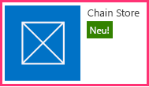
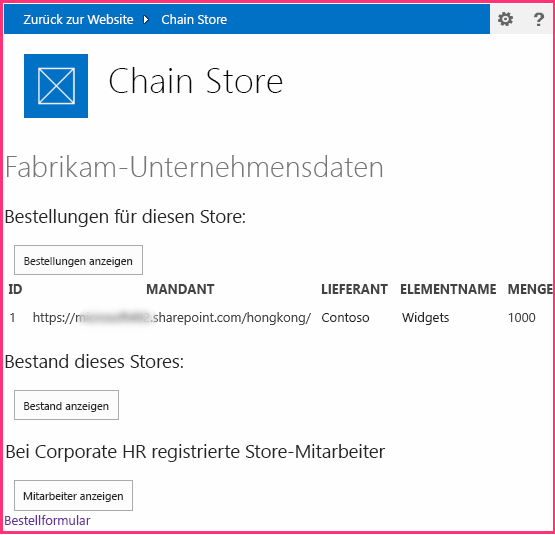
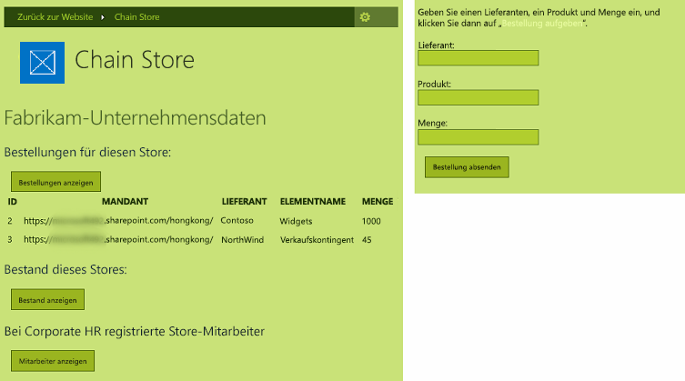

# <a name="give-your-provider-hosted-add-in-the-sharepoint-look-and-feel"></a><span data-ttu-id="d333b-103">Implementieren von SharePoint-Verhalten und -Aussehen in anbietergehosteten Add-Ins</span><span class="sxs-lookup"><span data-stu-id="d333b-103">Give your provider-hosted add-in the SharePoint look-and-feel</span></span>

<span data-ttu-id="d333b-104">Dies ist der zweite in einer Reihe von Artikeln über die Grundlagen der Entwicklung von vom Anbieter gehosteten SharePoint-Add-Ins. Sie sollten sich zuerst mit [SharePoint Add-Ins](sharepoint-add-ins.md) und dem Übersichtsartikel in dieser Reihe vertraut machen:</span><span class="sxs-lookup"><span data-stu-id="d333b-104">This is the second in a series of articles about the basics of developing provider-hosted SharePoint Add-ins. You should first be familiar with the topic [SharePoint Add-ins](sharepoint-add-ins.md) and the previous article in this series:</span></span>

-  [<span data-ttu-id="d333b-105">Erste Schritte beim Erstellen von von einem Anbieter gehosteten SharePoint-Add-Ins</span><span class="sxs-lookup"><span data-stu-id="d333b-105">Get started creating provider-hosted SharePoint Add-ins</span></span>](get-started-creating-provider-hosted-sharepoint-add-ins.md)
    
<span data-ttu-id="d333b-106">Im vorherigen Artikel dieser Reihe haben Sie erfahren, wie eine Entwicklungsumgebung eingerichtet und Visual Studio verwendet wird, um ein erstes Hello World-Add-In zu erstellen, das SharePoint-Daten in der Remotewebanwendung des Add-Ins verfügbar macht.</span><span class="sxs-lookup"><span data-stu-id="d333b-106">In the previous article of this series you learned how to set up a development environment and how to use Visual Studio to create a first "Hello World" level add-in that exposes SharePoint data in the add-in's remote web application.</span></span> 

<span data-ttu-id="d333b-107">In diesem Artikel beginnen wir mit einer SharePoint-Add-In-Lösung, die bereits erstellt wurde.</span><span class="sxs-lookup"><span data-stu-id="d333b-107">In this article, we start with a SharePoint Add-in solution that has already been created.</span></span> <span data-ttu-id="d333b-108">Diese umfasst eine ASP.NET Web Forms-Anwendung und eine SQL Azure-Datenbank.</span><span class="sxs-lookup"><span data-stu-id="d333b-108">It includes an ASP.NET Web Forms application and a SQL Azure database.</span></span> <span data-ttu-id="d333b-109">Diese wurden für Sie erstellt, da sich diese Artikelreihe nur auf SharePoint-Add-Ins konzentriert. Sie werden in jedem Artikel in dieser Reihe weitere SharePoint-Funktionen und eine Integration in das Add-In hinzufügen.</span><span class="sxs-lookup"><span data-stu-id="d333b-109">We've created these for you because this series of articles is intended to focus only on SharePoint Add-ins. You'll be adding more SharePoint functionality and integration to the add-in with each article in this series.</span></span>

## <a name="get-to-know-the-base-add-in"></a><span data-ttu-id="d333b-110">Einführung in das Basis-Add-In</span><span class="sxs-lookup"><span data-stu-id="d333b-110">Get to know the base add-in</span></span>

<span data-ttu-id="d333b-111">Wir werden Sie in dieser Reihe nicht mit der Programmierung in ASP.NET oder T-SQL vertraut machen, Sie benötigen aber ein paar Informationen über die Remotekomponenten des Add-Ins, bevor wir beginnen können, dieses in SharePoint zu integrieren.</span><span class="sxs-lookup"><span data-stu-id="d333b-111">We are not going to teach you ASP.NET or T-SQL programming in this series, but you need to know a little about the remote components of the add-in before we can start integrating it into SharePoint.</span></span> <span data-ttu-id="d333b-112">Das Szenario des Add-Ins geht von einer Kette von Einzelhandelsgeschäften aus, und jedes Geschäft verfügt über eine Teamwebsite im SharePoint Online-Abonnement des übergeordneten Unternehmens.</span><span class="sxs-lookup"><span data-stu-id="d333b-112">The scenario of the add-in envisions a chain of retail stores, and each store has a team website in the parent company's SharePoint Online subscription.</span></span> <span data-ttu-id="d333b-113">Wenn ein Geschäft das Add-In auf seiner Teamwebsite installiert, kann dieses seine SharePoint-Daten und die Oberfläche mit Daten über das Add-In in die Datenbank des übergeordneten Unternehmens integrieren.</span><span class="sxs-lookup"><span data-stu-id="d333b-113">When a store installs the add-in on its team site, the add-in enables them to integrate their SharePoint data and experience with data in the parent company's database.</span></span> <span data-ttu-id="d333b-114">Jede Instanz des Add-Ins verfügt über seine eigene Mandantschaft in der Unternehmensdatenbank, und Benutzer können nur mit Unternehmensdaten interagieren, die mit dem jeweiligen Geschäften verknüpft sind.</span><span class="sxs-lookup"><span data-stu-id="d333b-114">Each instance of the add-in has its own tenancy in the corporate database, and users can only interact with corporate data that is associated with their store.</span></span>

### <a name="create-team-sites-for-two-stores-in-the-chain"></a><span data-ttu-id="d333b-115">Erstellen von Teamwebsites für zwei Geschäfte der Kette</span><span class="sxs-lookup"><span data-stu-id="d333b-115">Create team sites for two stores in the chain</span></span>

1. <span data-ttu-id="d333b-116">Öffnen Sie die Startseite Ihrer SharePoint Online-Website, und wählen Sie den Link **Websiteinhalte** im Schnellstart aus.</span><span class="sxs-lookup"><span data-stu-id="d333b-116">Open the home page of your SharePoint Online site, and then select the **Site Contents** link on the quick launch.</span></span> <span data-ttu-id="d333b-117">Führen Sie auf der Seite **Websiteinhalte** einen Bildlauf nach unten aus, bis Sie den Link **Neue Unterwebsite** sehen, und klicken Sie darauf.</span><span class="sxs-lookup"><span data-stu-id="d333b-117">On the **Site Contents** page, scroll down until you see the **new subsite** link, and then select it.</span></span>
 
2. <span data-ttu-id="d333b-118">Füllen Sie auf der Seite **Neue SharePoint-Website** das Formular für eine neue Teamwebsite mithilfe der Werte im folgenden Screenshot aus.</span><span class="sxs-lookup"><span data-stu-id="d333b-118">On the **New SharePoint Site** page, fill out the form for a new team site by entering these values (also shown in the following screen shot):</span></span>

   - <span data-ttu-id="d333b-119">**Titel**: Fabrikam-Store in Hongkong</span><span class="sxs-lookup"><span data-stu-id="d333b-119">**Title**: Fabrikam Hong Kong Store</span></span>
   - <span data-ttu-id="d333b-120">**URL**: hongkong</span><span class="sxs-lookup"><span data-stu-id="d333b-120">**URL**: hongkong</span></span>
    
   <span data-ttu-id="d333b-121">*Abbildung 1. Formular zum Erstellen einer neuen SharePoint-Unterwebsite*</span><span class="sxs-lookup"><span data-stu-id="d333b-121">*Figure 1. Form for creating a new SharePoint subsite*</span></span>

   

3. <span data-ttu-id="d333b-123">Behalten Sie für alle anderen Einstellungen die Standardeinstellungen bei, und klicken Sie dann auf **Erstellen**.</span><span class="sxs-lookup"><span data-stu-id="d333b-123">Leave all other settings at their defaults, and then select **Create**.</span></span>

### <a name="explore-the-add-in"></a><span data-ttu-id="d333b-124">Erkunden des Add-Ins</span><span class="sxs-lookup"><span data-stu-id="d333b-124">Explore the add-in</span></span>

1. <span data-ttu-id="d333b-125">Wechseln Sie zu [SharePoint_Provider-hosted_Add-Ins_Tutorials](https://github.com/OfficeDev/SharePoint_Provider-hosted_Add-ins_Tutorials), und klicken sie auf die Schaltfläche zum **Herunterladen der ZIP-Datei**, um das Repository auf Ihren Desktop herunterzuladen.</span><span class="sxs-lookup"><span data-stu-id="d333b-125">Go to [SharePoint_Provider-hosted_Add-Ins_Tutorials](https://github.com/OfficeDev/SharePoint_Provider-hosted_Add-ins_Tutorials) and select the **Download ZIP** button to download the repository to your desktop.</span></span> <span data-ttu-id="d333b-126">Entpacken Sie die Datei.</span><span class="sxs-lookup"><span data-stu-id="d333b-126">Unzip the file.</span></span>
 
2. <span data-ttu-id="d333b-127">Starten Sie Visual Studio *als Administrator*, und öffnen Sie dann die Datei „BeforeSharePointUI.sln“.</span><span class="sxs-lookup"><span data-stu-id="d333b-127">Launch Visual Studio *as an administrator*, and then open BeforeSharePointUI.sln.</span></span> <span data-ttu-id="d333b-128">Es gibt drei Projekte in der Lösung:</span><span class="sxs-lookup"><span data-stu-id="d333b-128">There are three projects in the solution:</span></span>
    
   - <span data-ttu-id="d333b-129">**ChainStore**: Das SharePoint-Add-In-Projekt.</span><span class="sxs-lookup"><span data-stu-id="d333b-129">**ChainStore**: the SharePoint Add-in project</span></span>
   - <span data-ttu-id="d333b-130">**ChainStoreWeb**: Die Remotewebanwendung.</span><span class="sxs-lookup"><span data-stu-id="d333b-130">**ChainStoreWeb**: the remote web application</span></span>
   - <span data-ttu-id="d333b-131">**ChainCorporateDB**: Die Azure SQL-Datenbank.</span><span class="sxs-lookup"><span data-stu-id="d333b-131">**ChainCorporateDB**: the SQL Azure database</span></span>

3. <span data-ttu-id="d333b-132">Wählen Sie das Projekt **ChainStore** aus, und legen Sie im Fenster **Eigenschaften** die Eigenschaft **Website-URL** auf die vollständige URL der Teamwebsite für Hongkong fest: `https://{YOUR_SHAREPOINT_DOMAIN}/hongkong/` (vergessen Sie nicht das Zeichen „/“ am Ende).</span><span class="sxs-lookup"><span data-stu-id="d333b-132">Select the **ChainStore** project and, in the **Properties** window, set the **Site URL** property to the full URL of the Hong Kong team site: `https://{YOUR_SHAREPOINT_DOMAIN}/hongkong/` (be sure to include the "/" character at the end).</span></span> <span data-ttu-id="d333b-133">Klicken Sie auf **Speichern**.</span><span class="sxs-lookup"><span data-stu-id="d333b-133">Select **Save**.</span></span> <span data-ttu-id="d333b-134">*Während dieses Prozesses werden Sie aufgefordert, sich bei Ihrem SharePoint Online-Abonnement anzumelden.*</span><span class="sxs-lookup"><span data-stu-id="d333b-134">*At some point in this process, you will be prompted to sign in to your SharePoint Online subscription.*</span></span> 
    
4. <span data-ttu-id="d333b-135">Klicken Sie mit der rechten Maustaste oben im **Projektmappen-Explorer** auf den Projektmappenknoten, und wählen Sie **Startprojekte festlegen** aus.</span><span class="sxs-lookup"><span data-stu-id="d333b-135">Right-click the solution node at the top of **Solution Explorer**, and then select **Set startup projects**.</span></span>
 
5. <span data-ttu-id="d333b-136">Stellen Sie sicher, dass alle drei Projekte in der Spalte **Aktion** auf **Start** festgelegt sind.</span><span class="sxs-lookup"><span data-stu-id="d333b-136">Ensure that all three projects are set to **Start** in the **Action** column.</span></span>
    
6. <span data-ttu-id="d333b-137">Verwenden Sie die F5-Taste, um Ihr Add-In bereitzustellen und auszuführen.</span><span class="sxs-lookup"><span data-stu-id="d333b-137">Use the F5 key to deploy and run your add-in.</span></span> <span data-ttu-id="d333b-138">Visual Studio hostet die Remotewebanwendung in IIS Express und die SQL-Datenbank in SQL Express.</span><span class="sxs-lookup"><span data-stu-id="d333b-138">Visual Studio hosts the remote web application in IIS Express and hosts the SQL database in SQL Express.</span></span> <span data-ttu-id="d333b-139">Zudem installiert Visual Studio das Add-In vorübergehend auf Ihrer SharePoint-Testwebsite und führt es sofort aus.</span><span class="sxs-lookup"><span data-stu-id="d333b-139">It also makes a temporary installation of the add-in on your test SharePoint site and immediately runs the add-in.</span></span> <span data-ttu-id="d333b-140">Sie werden aufgefordert, Berechtigungen für das Add-In zu erteilen, bevor die Startseite geöffnet wird.</span><span class="sxs-lookup"><span data-stu-id="d333b-140">You are prompted to grant permissions to the add-in before its start page opens.</span></span>
    
7. <span data-ttu-id="d333b-141">Die Startseite des Add-Ins sieht wie in Abbildung 2 aus.</span><span class="sxs-lookup"><span data-stu-id="d333b-141">The add-in's start page looks like the one in Figure 2.</span></span> <span data-ttu-id="d333b-142">Ganz oben befindet sich der Name der SharePoint-Website, auf der das Add-In installiert ist.</span><span class="sxs-lookup"><span data-stu-id="d333b-142">At the very top is the name of the SharePoint website where the add-in is installed.</span></span> <span data-ttu-id="d333b-143">Dies ist ein Nebeneffekt von manchen Beispielcodes, die von den Office-Entwicklertools für Visual Studio generiert werden.</span><span class="sxs-lookup"><span data-stu-id="d333b-143">This is a side effect of some sample code that the Office Developer Tools for Visual Studio generates.</span></span> <span data-ttu-id="d333b-144">Sie ändern dies in einem späteren Schritt.</span><span class="sxs-lookup"><span data-stu-id="d333b-144">You'll change this in a later step.</span></span> <span data-ttu-id="d333b-145">Die Seite weist Bereiche auf, auf der Daten aus den SQL-Datenbanktabellen **Bestellungen**, **Inventar** und **Mitarbeiter** des Unternehmens zu sehen sind.</span><span class="sxs-lookup"><span data-stu-id="d333b-145">The page has areas where data from the corporate **Orders**, **Inventory**, and **Employees** SQL database tables can be seen.</span></span> <span data-ttu-id="d333b-146">Diese Tabellen sind anfangs leer.</span><span class="sxs-lookup"><span data-stu-id="d333b-146">These tables are empty initially.</span></span>
  
   <span data-ttu-id="d333b-147">*Abbildung 2. Startseite des Chain Store-Add-Ins*</span><span class="sxs-lookup"><span data-stu-id="d333b-147">*Figure 2. Start page of the chain store add-in*</span></span>

   

8. <span data-ttu-id="d333b-149">Wählen Sie den Link **Bestellformular** unten auf der Seite auf, um ein Bestellformular zu öffnen.</span><span class="sxs-lookup"><span data-stu-id="d333b-149">Select the **Order Form** link at the bottom of the page to open an order form.</span></span> <span data-ttu-id="d333b-150">Geben Sie einige Werte in das Formular ein, und klicken Sie dann auf **Bestellung aufgeben**.</span><span class="sxs-lookup"><span data-stu-id="d333b-150">Enter some values in the form, and then select **Place Order**.</span></span> <span data-ttu-id="d333b-151">Der Screenshot in Abbildung 3 zeigt ein Beispiel.</span><span class="sxs-lookup"><span data-stu-id="d333b-151">The screenshot in Figure 3 shows an example.</span></span> <span data-ttu-id="d333b-152">Es sieht so aus, als würde nichts passieren, der Code hinter der Schaltfläche übergibt jedoch die Werte an einen parametrisierte gespeicherte Prozedur in der SQL-Datenbank.</span><span class="sxs-lookup"><span data-stu-id="d333b-152">It won't appear that anything has happened, but the code behind the button passes the values to a parameterized stored procedure in the SQL database.</span></span> <span data-ttu-id="d333b-153">Durch Verwendung von parametrisierten gespeicherten Prozeduren wird die Datenbank vor Angriffen durch Einschleusung von SQL-Befehlen geschützt.</span><span class="sxs-lookup"><span data-stu-id="d333b-153">Using parameterized stored procedures protects the database from SQL injection attacks.</span></span>

   <span data-ttu-id="d333b-154">*Abbildung 3. Bestellformular*</span><span class="sxs-lookup"><span data-stu-id="d333b-154">*Figure 3. Order form*</span></span>

   

9. <span data-ttu-id="d333b-156">Verwenden Sie die Schaltfläche „Zurück“ des Browsers, um zur Startseite zurückzugehen, und klicken Sie dann auf die Schaltfläche **Bestellungen anzeigen**.</span><span class="sxs-lookup"><span data-stu-id="d333b-156">Use the browser's back button to go back to the start page, and then select the **Show Orders** button.</span></span> <span data-ttu-id="d333b-157">Die Startseite wird aktualisiert, und Ihre Bestellungen werden auf der Seite ähnlich wie im Screenshot in Abbildung 4 angezeigt.</span><span class="sxs-lookup"><span data-stu-id="d333b-157">The start page refreshes and your order appears on the page similar to the screenshot in Figure 4.</span></span>

   <span data-ttu-id="d333b-158">*Abbildung 4. Startseite nach Auswahl von „Bestellungen anzeigen“*</span><span class="sxs-lookup"><span data-stu-id="d333b-158">*Figure 4. Start page after selecting Show Orders*</span></span>

   
    
   <span data-ttu-id="d333b-161">Die Tabelle weist ein Feld **Mandant** mit der URL Ihrer SharePoint-Testwebsite als Wert auf.</span><span class="sxs-lookup"><span data-stu-id="d333b-161">The table has a **Tenant** field with the URL of your test SharePoint website as the value.</span></span> <span data-ttu-id="d333b-162">Diese verweist nicht auf das SharePoint Online-Abonnement, das manchmal als Mandantschaft bezeichnet wird.</span><span class="sxs-lookup"><span data-stu-id="d333b-162">This does not refer to the SharePoint Online subscription that is sometimes called a tenancy.</span></span> <span data-ttu-id="d333b-163">Stattdessen handelt es sich bei jeder Instanz des Add-Ins um einen unterschiedlichen Mandanten in der Unternehmensdatenbank.</span><span class="sxs-lookup"><span data-stu-id="d333b-163">Instead, each instance of the add-in is a distinct tenant in the corporate database.</span></span> <span data-ttu-id="d333b-164">Da nur eine Instanz des Add-Ins in einem bestimmten SharePoint-Hostweb installiert werden kann, kann die URL des Hostwebs als Mandantendiskriminator in der Datenbank verwendet werden.</span><span class="sxs-lookup"><span data-stu-id="d333b-164">Because no more than one instance of an add-in can be installed on a specific SharePoint host web, the URL of the host web can be used as a tenant discriminator in the database.</span></span> <span data-ttu-id="d333b-165">(Eine Auffrischung zur Unterscheidung zwischen Hostweb und Add-In-Web finden Sie unter [SharePoint-Add-Ins](sharepoint-add-ins.md).)</span><span class="sxs-lookup"><span data-stu-id="d333b-165">(For a refresher on the distinction between host web and add-in web, see [SharePoint Add-ins](sharepoint-add-ins.md).)</span></span> 
   
   <span data-ttu-id="d333b-166">Alle gespeicherten Prozeduren im Add-In umfassen den Diskriminatorwert beim Schreiben oder Lesen aus der Datenbank.</span><span class="sxs-lookup"><span data-stu-id="d333b-166">All the stored procedures in the add-in include the discriminator value when they write or read from the database.</span></span> <span data-ttu-id="d333b-167">Dadurch wird sichergestellt, dass nur die Daten, die mit dem Geschäft des Benutzers verknüpft sind, aus der Datenbank abgerufen werden, wenn ein Benutzer auf **Bestellungen anzeigen** (oder **Lagerbestand anzeigen** oder **Mitarbeiter anzeigen** klickt.)</span><span class="sxs-lookup"><span data-stu-id="d333b-167">This ensures that when a user selects **Show Orders** (or **Show Inventory** or **Show Employees**), only the data that is associated with the user's store is retrieved from the database.</span></span> <span data-ttu-id="d333b-168">Durch dieses Design wird auch sichergestellt, dass Benutzer nur für ihr eigenes Geschäft Bestellungen aufgeben und Mitarbeiter hinzufügen können.</span><span class="sxs-lookup"><span data-stu-id="d333b-168">This design also ensures that users can only place orders and add employees for their own store.</span></span>
    
   <span data-ttu-id="d333b-169">Die Remotewebanwendung ruft die Hostweb-URL von einem Abfragezeichenfolgenparameter ab, den SharePoint zu der URL der Startseite hinzufügt, wenn das Add-In gestartet wird.</span><span class="sxs-lookup"><span data-stu-id="d333b-169">The remote web application obtains the host web URL from a query string parameter that SharePoint adds to the URL of the start page when it launches the add-in.</span></span> <span data-ttu-id="d333b-170">Da SSL verwendet wird, wird diese Abfragezeichenfolge verschlüsselt, während sie über das Internet an die Remotewebanwendung übertragen wird.</span><span class="sxs-lookup"><span data-stu-id="d333b-170">Because SSL is being used, this query string is encrypted as it goes across the Internet to the remote web application.</span></span> 

10. <span data-ttu-id="d333b-171">Schließen Sie zum Beenden der Debugsitzung das Browserfenster, oder beenden Sie das Debuggen in Visual Studio.</span><span class="sxs-lookup"><span data-stu-id="d333b-171">To end the debugging session, close the browser window or stop debugging in Visual Studio.</span></span> <span data-ttu-id="d333b-172">Jedes Mal, wenn Sie F5 drücken, zieht Visual Studio die vorherige Version des Add-Ins zurück und installiert die neueste.</span><span class="sxs-lookup"><span data-stu-id="d333b-172">Each time you select F5, Visual Studio retracts the previous version of the add-in and installs the latest one.</span></span>   
 
11. <span data-ttu-id="d333b-173">Standardmäßig bleibt das Add-In auf dem SharePoint-Hostweb zwischen Debugsitzungen in Visual Studio installiert.</span><span class="sxs-lookup"><span data-stu-id="d333b-173">By default, the add-in remains installed on the SharePoint host web in between debugging sessions in Visual Studio.</span></span> <span data-ttu-id="d333b-174">Um zu sehen, wie Endbenutzer das Add-In nach der Installation starten, öffnen Sie die SharePoint-Website für Fabrikam Hongkong in Ihrem Browser, und gehen Sie zur Seite **Websiteinhalte**.</span><span class="sxs-lookup"><span data-stu-id="d333b-174">To see how end users would launch it after it is installed, open the Fabrikam Hong Kong SharePoint website in your browser and go to the **Site Contents** page.</span></span> <span data-ttu-id="d333b-175">Die Kachel für das Add-In wird im in dem folgenden Screenshot angezeigt.</span><span class="sxs-lookup"><span data-stu-id="d333b-175">You'll see the tile for the add-in as it is in the following screenshot.</span></span>

   <span data-ttu-id="d333b-176">*Abbildung 5. Startkachel für das Chain Store-Add-In*</span><span class="sxs-lookup"><span data-stu-id="d333b-176">*Figure 5. Launch tile for the Chain Store add-in*</span></span>

   
 
   > [!NOTE]
   > <span data-ttu-id="d333b-178">Wenn Sie auf die Kachel klicken, wird die Startseite nicht geöffnet, weil Visual Studio die IIS Express-Sitzung schließt, wenn Sie das Debuggen beenden.</span><span class="sxs-lookup"><span data-stu-id="d333b-178">If you select the tile, the start page does not open because Visual Studio closes the IIS Express session when you stop debugging.</span></span>

<span data-ttu-id="d333b-179"><a name="Rebuild"> </a></span><span class="sxs-lookup"><span data-stu-id="d333b-179"><a name="Rebuild"> </a></span></span>
## <a name="configure-visual-studio-to-rebuild-the-corporate-database-with-each-debugging-session"></a><span data-ttu-id="d333b-180">Konfigurieren von Visual Studio zum Neuerstellen der Unternehmensdatenbank in jeder Debugsitzung</span><span class="sxs-lookup"><span data-stu-id="d333b-180">Configure Visual Studio to rebuild the corporate database with each debugging session</span></span>

<span data-ttu-id="d333b-181">Standardmäßig wird in Visual Studio die SQL Express-Datenbank *nicht* neu erstellt.</span><span class="sxs-lookup"><span data-stu-id="d333b-181">By default, Visual Studio will *not*  rebuild the SQL Express database.</span></span> <span data-ttu-id="d333b-182">Bestellungen und andere Elemente, die Sie der Datenbank in einer Debugsitzung hinzufügen, sind daher auch in späteren Sitzungen noch in der Datenbank vorhanden.</span><span class="sxs-lookup"><span data-stu-id="d333b-182">Therefore, orders and other items that you add to the database in one debugging session are still in the database in later sessions.</span></span> <span data-ttu-id="d333b-183">Es ist einfacher, jedes Mal, wenn Sie auf F5 drücken, mit einer leeren Datenbank zu beginnen. Führen Sie daher die folgenden Schritte aus:</span><span class="sxs-lookup"><span data-stu-id="d333b-183">It is easier to start with an empty database each time you select F5, so take these steps:</span></span>

1. <span data-ttu-id="d333b-184">Klicken Sie mit der rechten Maustaste auf das Projekt **ChainCorporateDB**, und wählen Sie **Eigenschaften** aus.</span><span class="sxs-lookup"><span data-stu-id="d333b-184">Right-click the **ChainCorporateDB** project, and select **Properties**.</span></span>

2. <span data-ttu-id="d333b-185">Öffnen Sie die Registerkarte **Debuggen**, und aktivieren Sie die Option **Datenbank immer neu erstellen**.</span><span class="sxs-lookup"><span data-stu-id="d333b-185">Open the **Debug** tab and enable the **Always re-create database** option.</span></span>  


## <a name="give-the-remote-web-application-the-look-and-feel-of-sharepoint"></a><span data-ttu-id="d333b-186">Anwenden des Aussehens und Verhaltens von SharePoint auf die Remotewebanwendung</span><span class="sxs-lookup"><span data-stu-id="d333b-186">Give the remote web application the look and feel of SharePoint</span></span>

<span data-ttu-id="d333b-187">In einigen Szenarien sollen Ihre Remoteseiten ihr eigenes Branding haben, aber in den meisten Fällen sollten sie die Benutzeroberfläche von SharePoint imitieren, damit Benutzer den Eindruck haben, dass sie weiterhin in SharePoint arbeiten.</span><span class="sxs-lookup"><span data-stu-id="d333b-187">In some scenarios, you want your remote pages to have their own branding, but in most cases they should mimic the UI of SharePoint so that users feel they are still inside SharePoint.</span></span>

### <a name="add-sharepoint-chrome-and-top-bar-to-the-start-page"></a><span data-ttu-id="d333b-188">Hinzufügen der SharePoint-Chrome- und oberen Leiste zur Startseite</span><span class="sxs-lookup"><span data-stu-id="d333b-188">Add SharePoint chrome and top bar to the start page</span></span>

1. <span data-ttu-id="d333b-189">Navigieren Sie im **Projektmappen-Explorer** zu **ChainStoreWeb** > **Seiten**, und öffnen Sie die Datei „CorporateDataViewer.aspx“. Hierbei handelt es sich um die Startseite des Add-Ins.</span><span class="sxs-lookup"><span data-stu-id="d333b-189">In **Solution Explorer**, go to **ChainStoreWeb** > **Pages**, and open the CorporateDataViewer.aspx file (the add-in's start page).</span></span>

2. <span data-ttu-id="d333b-190">Im Abschnitt **head** sehen Sie ein Skript, das einige JavaScript-Bibliotheken lädt.</span><span class="sxs-lookup"><span data-stu-id="d333b-190">In the **head** section, you'll see a script that loads some JavaScript libraries.</span></span> <span data-ttu-id="d333b-191">Fügen Sie darunter das folgende zusätzliche Skript hinzu.</span><span class="sxs-lookup"><span data-stu-id="d333b-191">Add the following additional script under it.</span></span> <span data-ttu-id="d333b-192">Dieses Skript lädt die Datei „SP.UI.Controls.js“, die sich in jeder SharePoint-Website im Ordner „ /\_layouts/15/“ befindet.</span><span class="sxs-lookup"><span data-stu-id="d333b-192">This script loads the SP.UI.Controls.js file, which is in every SharePoint website at the /\_layouts/15/ folder.</span></span> <span data-ttu-id="d333b-193">Diese Datei lädt unter anderem die SharePoint-CSS-Bibliothek.</span><span class="sxs-lookup"><span data-stu-id="d333b-193">Among other things, this file loads the SharePoint CSS library.</span></span>
    
    ```
      <script type="text/javascript">
        var hostweburl;

        // Load the SharePoint resources.
        $(document).ready(function () {

            // Get the URI decoded add-in web URL.
            hostweburl =
                decodeURIComponent(
                    getQueryStringParameter("SPHostUrl")
            );

            // The SharePoint js files URL are in the form:
            // web_url/_layouts/15/resource.js
            var scriptbase = hostweburl + "/_layouts/15/";

            // Load the js file and continue to the 
            // success handler.
            $.getScript(scriptbase + "SP.UI.Controls.js")
        });

        // Function to retrieve a query string value.
        function getQueryStringParameter(paramToRetrieve) {
            var params =
                document.URL.split("?")[1].split("&amp;");
            var strParams = "";
            for (var i = 0; i < params.length; i = i + 1) {
                var singleParam = params[i].split("=");
                if (singleParam[0] == paramToRetrieve)
                    return singleParam[1];
            }
        }
    </script>
    ```

3. Fügen Sie oben im Textabschnitt der Seite das folgende Markup hinzu. Dadurch wird die obere SharePoint-Leiste, die als Chromsteuerelement bezeichnet wird, auf der Seite eingefügt. <span data-ttu-id="d333b-196">Die Details dieses Markups werden klarer, wenn wir das überarbeitete Add-In später in diesem Artikel testen (die Zeichenfolge „App“ wird in einigen Eigenschaftenname angezeigt, da Add-Ins bisher als „Apps“ bezeichnet wurden).</span><span class="sxs-lookup"><span data-stu-id="d333b-196">The details of this markup will become clearer when we test the revised add-in later in this article (the string "app" appears in some of the property names because add-ins used to be called "apps").</span></span>
    
    ```
      <!-- Chrome control placeholder. Options are declared inline.  -->
    <div 
        id="chrome_ctrl_container"
        data-ms-control="SP.UI.Controls.Navigation"  
        data-ms-options=
            '{  
                "appHelpPageUrl" : "Help.aspx",
                "appIconUrl" : "/Images/AppIcon.png",
                "appTitle" : "Chain Store",
                "settingsLinks" : [
                    {
                        "linkUrl" : "Account.aspx",
                        "displayName" : "Account settings"
                    },
                    {
                        "linkUrl" : "Contact.aspx",
                        "displayName" : "Contact us"
                    }
                ]
             }'>
    </div>
    ```

4. <span data-ttu-id="d333b-197">Die **H1**-Kopfzeilen und der Hyperlink im Text der Seite verwenden automatisch Formatvorlagen, die in der CSS-Bibliothek von SharePoint definiert sind und müssen daher nicht geändert werden.</span><span class="sxs-lookup"><span data-stu-id="d333b-197">The **H1** headers and the hyperlink in the body of the page automatically use styles defined in SharePoint's CSS library, so they don't need to be changed.</span></span> <span data-ttu-id="d333b-198">Um zu veranschaulichen, wie Sie die SharePoint-Formatvorlagen verwenden können, legen Sie die Spaltenüberschriften in den drei **GridView**-Steuerelementen auf die Formatvorlage „Großbuchstaben“ von SharePoint fest, indem Sie das **HeaderStyle-CssClass**-Attribut zu jedem der Steuerelemente hinzufügen und den Wert auf `ms-uppercase` festlegen.</span><span class="sxs-lookup"><span data-stu-id="d333b-198">To illustrate how you can use the SharePoint styles, set the column headings in the three **GridView** controls to SharePoint's "all caps" style by adding the **HeaderStyle-CssClass** attribute to each of the controls and setting its value to `ms-uppercase`.</span></span> <span data-ttu-id="d333b-199">Es folgt ein Beispiel.</span><span class="sxs-lookup"><span data-stu-id="d333b-199">The following is an example.</span></span> <span data-ttu-id="d333b-200">Nehmen Sie dieselbe Änderung an allen drei **GridView**-Steuerelementen vor.</span><span class="sxs-lookup"><span data-stu-id="d333b-200">Make the same change to all three **GridView** controls.</span></span>
    
    ```XML
      <asp:GridView ID="ordersGridView" runat="server" CellPadding="5" GridLines="None" 
    HeaderStyle-CssClass="ms-uppercase" />
    ```

5. <span data-ttu-id="d333b-201">Das Chromsteuerelement verwendet das Symbol des Add-Ins, wir benötigen daher eine zweite Kopie der Symboldatei auf dem Remotewebserver.</span><span class="sxs-lookup"><span data-stu-id="d333b-201">The chrome control uses the add-in's icon, so we need a second copy of the icon file on the remote web server.</span></span> <span data-ttu-id="d333b-202">Klicken Sie im **Projektmappen-Explorer** mit der rechten Maustaste auf die Datei „AppIcon.png“ im **ChainStore**-Projekt, und wählen Sie **Kopieren** aus.</span><span class="sxs-lookup"><span data-stu-id="d333b-202">In **Solution Explorer**, right-click the AppIcon.png file in the **ChainStore** project, and select **Copy**.</span></span> 
    
6. <span data-ttu-id="d333b-203">Klicken Sie mit der rechten Maustaste auf den Ordner **Bilder** im Projekt **ChainStoreWeb**, und wählen Sie **Einfügen** aus.</span><span class="sxs-lookup"><span data-stu-id="d333b-203">Right-click the **Images** folder in the **ChainStoreWeb** project, and select **Paste**.</span></span>
 
7. <span data-ttu-id="d333b-204">Öffnen Sie die Datei „CorporateDataViewer.aspx.cs“.</span><span class="sxs-lookup"><span data-stu-id="d333b-204">Open the CorporateDataViewer.aspx.cs file.</span></span> 
 
8. <span data-ttu-id="d333b-205">Die `CorporateDataViewer`-Klasse deklariert einen privaten Member vom Typ **SharePointContext**.</span><span class="sxs-lookup"><span data-stu-id="d333b-205">The `CorporateDataViewer` class declares a private member of type **SharePointContext**.</span></span> <span data-ttu-id="d333b-206">Diese Klasse wird in der Datei „SharePointContext.cs“ definiert, die von den Office-Entwicklertools für Visual Studio generiert wird, wenn das Projekt erstellt wird.</span><span class="sxs-lookup"><span data-stu-id="d333b-206">This class is defined in the SharePointContext.cs file that the Office Developer Tools for Visual Studio generated when the project was created.</span></span> <span data-ttu-id="d333b-207">Sie können sich dies wie die **HttpContextBase**-Klasse von ASP.NET vorstellen, jedoch mit SharePoint-Kontextinformationen, z. B. die URL des Hostwebs, die hinzugefügt wurde. </span><span class="sxs-lookup"><span data-stu-id="d333b-207">You can think of it as something like the **HttpContextBase** class of ASP.NET, but with SharePoint contextual information such as the host web's URL added to it.</span></span>
    
   <span data-ttu-id="d333b-208">In der **Page_Load**-Methode schreibt eine **using**-Anweisung den Namen des SharePoint-Hostwebs in die Remotestartseite.</span><span class="sxs-lookup"><span data-stu-id="d333b-208">In the **Page_Load** method, a **using** statement writes the name of the SharePoint host web to the remote start page.</span></span> <span data-ttu-id="d333b-209">Dies ist Beispielcode, löschen Sie daher die **using**-Anweisung (lassen Sie jedoch die Zeile stehen, die die `spContext`-Variable initialisiert).</span><span class="sxs-lookup"><span data-stu-id="d333b-209">This is sample code, so delete the entire **using** statement (but leave the line that initializes the `spContext` variable).</span></span> <span data-ttu-id="d333b-210">Die Methode sollte jetzt wie folgt aussehen.</span><span class="sxs-lookup"><span data-stu-id="d333b-210">The method should now look like the following.</span></span>

    ```C#
      protected void Page_Load(object sender, EventArgs e)
    {
        spContext = SharePointContextProvider.Current.GetSharePointContext(Context);
    }
    ```

9. <span data-ttu-id="d333b-211">Es gibt vier andere ASP.NET-Dateien, die die SharePoint-UI benötigen:</span><span class="sxs-lookup"><span data-stu-id="d333b-211">There are four other ASP.NET files that need the SharePoint UI:</span></span> 
    
   - <span data-ttu-id="d333b-212">Account.aspx</span><span class="sxs-lookup"><span data-stu-id="d333b-212">Account.aspx</span></span>
   - <span data-ttu-id="d333b-213">Contact.aspx</span><span class="sxs-lookup"><span data-stu-id="d333b-213">Contact.aspx</span></span>
   - <span data-ttu-id="d333b-214">Help.aspx</span><span class="sxs-lookup"><span data-stu-id="d333b-214">Help.aspx</span></span>
   - <span data-ttu-id="d333b-215">OrderForm.aspx</span><span class="sxs-lookup"><span data-stu-id="d333b-215">OrderForm.aspx</span></span>

   > [!NOTE]
   > <span data-ttu-id="d333b-p124">Die letzte aspx-Datei des Projekts, EmployeeAdder.aspx, wird tatsächlich nie gerendert, deshalb sollten sie deren Benutzeroberfläche nicht ändern. Sie erfahren mehr darüber in einem späteren Artikel dieser Reihe.</span><span class="sxs-lookup"><span data-stu-id="d333b-p124">The last aspx file in the project, EmployeeAdder.aspx, is never actually rendered, so you don't change its UI. You'll learn more about it in a later article of this series.</span></span> 

   <span data-ttu-id="d333b-218">Das Chromsteuerelement soll auf diesen Seiten nicht angezeigt werden.</span><span class="sxs-lookup"><span data-stu-id="d333b-218">We don't want the chrome control on these pages.</span></span> <span data-ttu-id="d333b-219">Wir möchten nur Zugriff auf die SharePoint-CSS-Bibliothek haben.</span><span class="sxs-lookup"><span data-stu-id="d333b-219">We just want access to the SharePoint CSS library.</span></span> <span data-ttu-id="d333b-220">Fügen Sie für jede dieser vier Dateien das folgende Markup zum **head**-Element hinzu.</span><span class="sxs-lookup"><span data-stu-id="d333b-220">For each of these four files, add the following markup to the **head** element.</span></span>

    ```XML
      <link type="text/css" rel="stylesheet" 
    href="<%= spContext.SPHostUrl.ToString() + "_layouts/15/defaultcss.ashx" %>" />
    ```

10. <span data-ttu-id="d333b-221">Dieser Schritt und der nächste wurden für die Seite „Bestellformular“ und „Konto“ bereits ausgeführt, sie gelten also nur für die Kontaktseite und die Hilfeseite.</span><span class="sxs-lookup"><span data-stu-id="d333b-221">This step and the next one have already been done for the Order Form page and the Account page, so they apply only to the Contact page and Help page.</span></span> <span data-ttu-id="d333b-222">Um das `spContext`-Objekt auf jeder der Seiten zu platzieren, öffnen Sie die Code-Behind-Dateien \*.aspx.cs für die drei ASPX-Seiten.</span><span class="sxs-lookup"><span data-stu-id="d333b-222">To get the `spContext` object onto each of the pages, open the \*.aspx.cs code behind files for the three aspx pages.</span></span> <span data-ttu-id="d333b-223">Fügen Sie in jeder den folgenden Member zur **Page**-Klasse hinzu.</span><span class="sxs-lookup"><span data-stu-id="d333b-223">In each of them, add the following member to the **Page** class.</span></span>
    
    ```C#
      protected SharePointContext spContext;
    ```

11. <span data-ttu-id="d333b-p127">Ersetzen Sie die Methode **Page_Load** durch die folgende Version. Das Objekt wird aus dem Sitzungscache abgerufen. Es wurde zwischengespeichert, als es erstmals von der Methode **Page_Load** der Startseite des Add-Ins erstellt wurde.</span><span class="sxs-lookup"><span data-stu-id="d333b-p127">Replace the **Page_Load** method with the following version. The object is being retrieved from the Session cache. It was cached there when it was first created by the **Page_Load** method of the add-in's start page.</span></span>
    
    ```C#
      protected void Page_Load(object sender, EventArgs e)
    {
        spContext = Session["SPContext"] as SharePointContext;
    }
    ```

12. <span data-ttu-id="d333b-227">Öffnen Sie die Seite „OrderForm.aspx“.</span><span class="sxs-lookup"><span data-stu-id="d333b-227">Open the OrderForm.aspx page.</span></span> <span data-ttu-id="d333b-228">Ersetzen Sie im **Label**-Element das `<b>`-Element im Ausdruck **Bestellung aufgeben** durch span-Tags, die auf die `ms-accentText`-CSS-Klasse verweisen.</span><span class="sxs-lookup"><span data-stu-id="d333b-228">In the top **Label** element, replace the `<b>` element on the phrase **Place Order** with span tags that reference the `ms-accentText` CSS class.</span></span> <span data-ttu-id="d333b-229">Das gesamte **Label**-Steuerelement sollte wie folgt aussehen, wenn Sie fertig sind.</span><span class="sxs-lookup"><span data-stu-id="d333b-229">The entire **Label** control should look like this when you are finished.</span></span>
    
    ```XML
      <asp:Label ID="lblOrderPrompt" runat="server"
             Text="Enter a supplier, product, and quantity; and then press <span class='ms-accentText'>Place Order</span>.">
    </asp:Label>
    ```

## <a name="run-the-add-in-and-test-the-new-sharepoint-ui"></a><span data-ttu-id="d333b-230">Ausführen des Add-Ins und Testen der neuen SharePoint-UI</span><span class="sxs-lookup"><span data-stu-id="d333b-230">Run the add-in and test the new SharePoint UI</span></span>

1. <span data-ttu-id="d333b-231">Verwenden Sie die F5-Taste, um Ihr Add-In bereitzustellen und auszuführen.</span><span class="sxs-lookup"><span data-stu-id="d333b-231">Use the F5 key to deploy and run your add-in.</span></span> <span data-ttu-id="d333b-232">Visual Studio hostet die Remotewebanwendung in IIS Express und die SQL-Datenbank in SQL Express.</span><span class="sxs-lookup"><span data-stu-id="d333b-232">Visual Studio hosts the remote web application in IIS Express and hosts the SQL database in SQL Express.</span></span> <span data-ttu-id="d333b-233">Zudem installiert Visual Studio das Add-In vorübergehend auf Ihrer SharePoint-Testwebsite und führt es sofort aus.</span><span class="sxs-lookup"><span data-stu-id="d333b-233">It also makes a temporary installation of the add-in on your test SharePoint site and immediately runs the add-in.</span></span> <span data-ttu-id="d333b-234">Sie werden aufgefordert, Berechtigungen für das Add-In zu erteilen, bevor die Startseite geöffnet wird.</span><span class="sxs-lookup"><span data-stu-id="d333b-234">You are prompted to grant permissions to the add-in before its start page opens.</span></span>
    
2. <span data-ttu-id="d333b-235">Wenn die Startseite des Add-Ins geöffnet wird, sieht diese nun wie eine SharePoint-Seite aus.</span><span class="sxs-lookup"><span data-stu-id="d333b-235">When the add-in's start page opens, it now looks like a SharePoint page.</span></span> <span data-ttu-id="d333b-236">Klicken Sie auf den Link **Bestellformular**.</span><span class="sxs-lookup"><span data-stu-id="d333b-236">Select the **Order Form** link.</span></span> <span data-ttu-id="d333b-237">Dieses sieht nun auch wie ein SharePoint-Formular aus.</span><span class="sxs-lookup"><span data-stu-id="d333b-237">It also now looks like a SharePoint form.</span></span>
  
   <span data-ttu-id="d333b-238">*Abbildung 6. Das Bestellformuar mit Schriftart Segoe und hervorgehobener Option „Bestellen“*</span><span class="sxs-lookup"><span data-stu-id="d333b-238">*Figure 6. The Order Form with Segoe fonts and a highlighted Place Order*</span></span>

   
 
3. <span data-ttu-id="d333b-241">Erstellen Sie eine Bestellung, und klicken Sie dann auf **Bestellung aufgeben**.</span><span class="sxs-lookup"><span data-stu-id="d333b-241">Create an order, and then select **Place Order**.</span></span>
    
4. <span data-ttu-id="d333b-242">Verwenden Sie die Schaltfläche „Zurück“ des Browsers, um zur Startseite zurückzugehen, und klicken Sie dann auf **Bestellungen anzeigen**.</span><span class="sxs-lookup"><span data-stu-id="d333b-242">Use the browser's back button to go back to the add-in start page, and then select **Show Orders**.</span></span> <span data-ttu-id="d333b-243">Die Seite sollte jetzt etwa wie folgt aussehen.</span><span class="sxs-lookup"><span data-stu-id="d333b-243">The page should now look similar to the following.</span></span> <span data-ttu-id="d333b-244">Beachten Sie, dass die Spaltenüberschriften nun in Großbuchstaben sind.</span><span class="sxs-lookup"><span data-stu-id="d333b-244">Note that the column headings are now all caps.</span></span> 
  
   <span data-ttu-id="d333b-245">*Abbildung 7. Die Startseite mit einem Chromsteuerelement *</span><span class="sxs-lookup"><span data-stu-id="d333b-245">*Figure 7. The start page with a chrome control*</span></span>

   

5. <span data-ttu-id="d333b-248">Klicken Sie auf das Symbol **?**</span><span class="sxs-lookup"><span data-stu-id="d333b-248">Select the **?**</span></span> <span data-ttu-id="d333b-249">am Ende des Chromsteuerelements.</span><span class="sxs-lookup"><span data-stu-id="d333b-249">icon on the end of the chrome control.</span></span> <span data-ttu-id="d333b-250">Eine einfache Hilfeseite wird geöffnet.</span><span class="sxs-lookup"><span data-stu-id="d333b-250">A simple help page opens.</span></span> <span data-ttu-id="d333b-251">Wählen Sie die Schaltfläche „Zurück“ des Browsers aus.</span><span class="sxs-lookup"><span data-stu-id="d333b-251">Select the browser's back button.</span></span>

6. <span data-ttu-id="d333b-252">Klicken Sie auf das Zahnradsymbol im Chromsteuerelement.</span><span class="sxs-lookup"><span data-stu-id="d333b-252">Select the gear icon on the chrome control.</span></span> <span data-ttu-id="d333b-253">Es wird ein Menü mit Links für eine Kontoseite und eine Kontaktseite geöffnet.</span><span class="sxs-lookup"><span data-stu-id="d333b-253">A menu opens with links for an Account page and a Contact page.</span></span> <span data-ttu-id="d333b-254">Öffnen Sie die Kontoseite, und verwenden Sie die Schaltfläche „Zurück“ des Browsers, um zurück zur Startseite zu gelangen.</span><span class="sxs-lookup"><span data-stu-id="d333b-254">Open the Account page, and use the browser's back button to get back to the start page.</span></span> <span data-ttu-id="d333b-255">Gehen Sie für die Kontaktseite genauso vor.</span><span class="sxs-lookup"><span data-stu-id="d333b-255">Do the same for the Contact page.</span></span>

7. <span data-ttu-id="d333b-256">Wählen Sie die Schaltfläche **Zurück zur Website** auf dem Chromsteuerelement aus.</span><span class="sxs-lookup"><span data-stu-id="d333b-256">Select the **Back to Site** button on the chrome control.</span></span> <span data-ttu-id="d333b-257">Die Startseite des Hostwebs, die Teamwebsite des Geschäfts in Hongkong, wird geöffnet.</span><span class="sxs-lookup"><span data-stu-id="d333b-257">The home page of the host web, the Hong Kong store team site, opens.</span></span>

8. <span data-ttu-id="d333b-258">Klicken Sie auf das Zahnradsymbol in der oberen Leiste, und wählen Sie dann **Aussehen ändern** aus.</span><span class="sxs-lookup"><span data-stu-id="d333b-258">Select the gear icon on the top bar, and then select **Change the look**.</span></span>

9. <span data-ttu-id="d333b-259">Folgen Sie den Anweisungen, um der Website ein anderes Aussehen zu verleihen.</span><span class="sxs-lookup"><span data-stu-id="d333b-259">Follow the prompts to change the site to one of the alternative "looks."</span></span>

10. <span data-ttu-id="d333b-p137">Navigieren Sie zur Seite **Websiteinhalte**, und starten Sie die ChainStore-App über ihre Kachel. Ihre benutzerdefinierten Seiten haben das ausgewählte Aussehen übernommen. Die folgenden Screenshots zeigen, wie sie im zusammengesetzten Design **Natur** angezeigt werden.</span><span class="sxs-lookup"><span data-stu-id="d333b-p137">Navigate to the **Site Contents** page and launch the Chain Store app from its tile. Your custom pages have taken on the chosen look. The following screenshots show how they appear in the **Nature** composed look.</span></span>

   <span data-ttu-id="d333b-263">*Abbildung 8. Startseite und Bestellformular des zusammengesetzten Designs „Natur“*</span><span class="sxs-lookup"><span data-stu-id="d333b-263">*Figure 8. The start page and order form with the Nature composed look*</span></span> 

   

11. <span data-ttu-id="d333b-265">Ändern Sie das Aussehen der Website wieder auf die Standardeinstellung, die als **Office** bezeichnet wird.</span><span class="sxs-lookup"><span data-stu-id="d333b-265">Change the site's look back to the default, which is called **Office**.</span></span>

12. <span data-ttu-id="d333b-266">Schließen Sie zum Beenden der Debugsitzung das Browserfenster, oder beenden Sie das Debuggen in Visual Studio.</span><span class="sxs-lookup"><span data-stu-id="d333b-266">To end the debugging session, close the browser window or stop debugging in Visual Studio.</span></span> <span data-ttu-id="d333b-267">Jedes Mal, wenn Sie F5 drücken, zieht Visual Studio die vorherige Version des Add-Ins zurück und installiert die neueste.</span><span class="sxs-lookup"><span data-stu-id="d333b-267">Each time you select F5, Visual Studio retracts the previous version of the add-in and installs the latest one.</span></span>

13. <span data-ttu-id="d333b-268">Da Sie mit diesem Add-In und dieser Visual Studio-Lösung in anderen Artikeln arbeiten werden, hat es sich bewährt, das Add-In ein letztes Mal zurückzuziehen, wenn Sie Ihre Arbeit daran für eine Weile abgeschlossen haben.</span><span class="sxs-lookup"><span data-stu-id="d333b-268">You will work with this add-in and Visual Studio solution in other articles, and it's a good practice to retract the add-in one last time when you are done working with it for a while.</span></span> <span data-ttu-id="d333b-269">Klicken Sie im **Projektmappen-Explorer** mit der rechten Maustaste auf das Projekt, und wählen Sie die Option **Zurückziehen** aus.</span><span class="sxs-lookup"><span data-stu-id="d333b-269">Right-click the project in **Solution Explorer** and select **Retract**.</span></span>

## <a name="next-steps"></a><span data-ttu-id="d333b-270">Nächste Schritte</span><span class="sxs-lookup"><span data-stu-id="d333b-270">Next steps</span></span>
<span data-ttu-id="d333b-271"><a name="Nextsteps"> </a></span><span class="sxs-lookup"><span data-stu-id="d333b-271"><a name="Nextsteps"> </a></span></span>

<span data-ttu-id="d333b-p140">Das Add-In sieht nun wie SharePoint aus, ist aber dennoch nur noch eine Webanwendung, die nicht wirklich in SharePoint integriert ist, außer dass sie über eine Kachel in SharePoint gestartet wird. Im nächsten Artikel fügen Sie einen benutzerdefinierten Befehl hinzu, der über eine benutzerdefinierte Menübandschaltfläche gestartet wird: [Einfügen einer benutzerdefinierten Schaltfläche in das vom Anbieter gehostete Add-In](include-a-custom-button-in-the-provider-hosted-add-in.md).</span><span class="sxs-lookup"><span data-stu-id="d333b-p140">The add-in now looks like SharePoint, but it's still just a web application that doesn't really integrate with SharePoint beyond being launched from a tile in SharePoint. You'll add a custom command, launched from a custom ribbon button in the next article: [Include a custom button in the provider-hosted add-in](include-a-custom-button-in-the-provider-hosted-add-in.md).</span></span>
 

