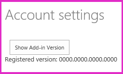

# <a name="handle-add-in-events-in-the-provider-hosted-add-in"></a><span data-ttu-id="988e8-101">Verarbeiten von Add-In-Ereignissen im vom Anbieter gehosteten Add-In</span><span class="sxs-lookup"><span data-stu-id="988e8-101">Handle add-in events in the provider-hosted add-in</span></span>
<span data-ttu-id="988e8-102">Erfahren Sie, wie Sie die Installation eines vom Anbieter gehosteten SharePoint-Add-Ins anpassen.</span><span class="sxs-lookup"><span data-stu-id="988e8-102">Learn how to customize the installation of a provider-hosted spappsing.</span></span>
 

 <span data-ttu-id="988e8-p101">**Hinweis** Der Name „Apps für SharePoint“ wird in „SharePoint-Add-Ins“ geändert. Während des Übergangszeitraums wird in der Dokumentation und der Benutzeroberfläche einiger SharePoint-Produkte und Visual Studio-Tools möglicherweise weiterhin der Begriff „Apps für SharePoint“ verwendet. Weitere Informationen finden Sie unter [Neuer Name für Office- und SharePoint-Apps](new-name-for-apps-for-sharepoint#bk_newname).</span><span class="sxs-lookup"><span data-stu-id="988e8-p101">The name "apps for SharePoint" is changing to "SharePoint Add-ins". During the transition, the documentation and the UI of some SharePoint products and Visual Studio tools might still use the term "apps for SharePoint". For details, see [New name for apps for Office and SharePoint](new-name-for-apps-for-sharepoint#bk_newname).</span></span>
 

<span data-ttu-id="988e8-p102">Dies ist der siebte in einer Reihe von Artikeln über die Grundlagen der Entwicklung von vom Anbieter gehosteten SharePoint-Add-Ins. Sie sollten sich zuerst mit [SharePoint Add-Ins](sharepoint-add-ins) und den vorherigen Artikeln in dieser Reihe vertraut machen:</span><span class="sxs-lookup"><span data-stu-id="988e8-p102">Learn how to customize the installation of a provider-hosted SharePoint Add-in. This is the seventh in a series of articles about the basics of developing provider-hosted SharePoint Add-ins. You should first be familiar with  [SharePoint Add-ins](sharepoint-add-ins) and the previous articles in this series:</span></span>
 

-  [<span data-ttu-id="988e8-108">Erste Schritte beim Erstellen von von einem Anbieter gehosteten SharePoint-Add-Ins</span><span class="sxs-lookup"><span data-stu-id="988e8-108">Get started creating provider-hosted SharePoint Add-ins</span></span>](get-started-creating-provider-hosted-sharepoint-add-ins)
    
 
-  [<span data-ttu-id="988e8-109">Übertragen des SharePoint-Aussehens und -Verhaltens auf Ihr vom Anbieter gehostetes Add-In</span><span class="sxs-lookup"><span data-stu-id="988e8-109">Give your provider-hosted add-in the SharePoint look-and-feel</span></span>](give-your-provider-hosted-add-in-the-sharepoint-look-and-feel)
    
 
-  [<span data-ttu-id="988e8-110">Einfügen einer benutzerdefinierten Schaltfläche in das vom Anbieter gehostete Add-In</span><span class="sxs-lookup"><span data-stu-id="988e8-110">Include a custom button in the provider-hosted add-in</span></span>](include-a-custom-button-in-the-provider-hosted-add-in)
    
 
-  [<span data-ttu-id="988e8-111">Schnelle Übersicht über das SharePoint-Objektmodell</span><span class="sxs-lookup"><span data-stu-id="988e8-111">Get a quick overview of the SharePoint object model</span></span>](get-a-quick-overview-of-the-sharepoint-object-model)
    
 
-  [<span data-ttu-id="988e8-112">Hinzufügen von SharePoint-Schreibvorgängen zum vom Anbieter gehosteten Add-In</span><span class="sxs-lookup"><span data-stu-id="988e8-112">Add SharePoint write operations to the provider-hosted add-in</span></span>](add-sharepoint-write-operations-to-the-provider-hosted-add-in)
    
 
-  [<span data-ttu-id="988e8-113">Einfügen eines Add-In-Webparts in das vom Anbieter gehostete Add-In</span><span class="sxs-lookup"><span data-stu-id="988e8-113">Include an add-in part in the provider-hosted add-in</span></span>](include-an-add-in-part-in-the-provider-hosted-add-in)
    
 

 <span data-ttu-id="988e8-p103">**Hinweis** Wenn Sie diese Reihe zu vom Anbieter gehosteten Add-Ins durchgearbeitet haben, haben Sie eine Visual Studio-Projektmappe, die Sie verwenden können, um mit diesem Thema fortzufahren. Sie können außerdem das Repository unter [SharePoint_Provider-hosted_Add-Ins_Tutorials](https://github.com/OfficeDev/SharePoint_Provider-hosted_Add-ins_Tutorials) herunterladen und die Datei „BeforeAdd-inEventHandlers.sln“ öffnen.</span><span class="sxs-lookup"><span data-stu-id="988e8-p103">**Note** If you have been working through this series about provider-hosted add-ins, then you have a Visual Studio solution that you can use to continue with this topic. You can also download the repository at  [SharePoint_Provider-hosted_Add-Ins_Tutorials](https://github.com/OfficeDev/SharePoint_Provider-hosted_Add-ins_Tutorials) and open the BeforeAdd-inEventHandlers.sln file.</span></span>
 

<span data-ttu-id="988e8-p104">In diesem Artikel passen wir die Verarbeitung einer Art von Ereignis in SharePoint an, die als Add-In-Ereignisse bezeichnet wird. Insbesondere erstellen wir Ereignishandler für die Add-In-Installation und -Deinstallation. Es gibt außerdem Listen- und Listenelementereignisse, die eine benutzerdefinierte Verarbeitung abrufen können. Sie erfahren mehr über diese in einem späteren Artikel dieser Reihe. Alle diese Ereignisse werden in SharePoint ausgelöst, aber Ihr benutzerdefinierter Code, der jedes Ereignis verarbeitet, befindet sich in Ihrer Remotewebanwendung. Sie konfigurieren SharePoint zum Aufrufen Ihres benutzerdefinierten Handlers, indem Sie die URL für den Handler bei dem SharePoint-Ereignis registrieren.</span><span class="sxs-lookup"><span data-stu-id="988e8-p104">In this article, we will customize the handling of a kind of event in SharePoint, called add-in events. Specifically, we will create handlers for the add-in installation and uninstallation events. There are also list and list item events that can get custom handling. You'll learn about these in a later article in this series. All of these events are triggered in SharePoint, but your custom code that handles each event is in your remote web application. You configure SharePoint to call your custom handler by registering the handler's URL with the SharePoint event.</span></span>
 

## <a name="two-places-to-programmatically-deploy-sharepoint-components"></a><span data-ttu-id="988e8-122">Zwei Orte für die programmgesteuerte Bereitstellung von SharePoint-Komponenten</span><span class="sxs-lookup"><span data-stu-id="988e8-122">Two places to programmatically deploy SharePoint components</span></span>

<span data-ttu-id="988e8-p105">Unser ChainStore-Add-In soll die Listen **Lokale Mitarbeiter** und **Erwartete Lieferungen** automatisch erstellen und bereitstellen. Ein Add-In kann SharePoint-Komponenten wie eine benutzerdefinierte Liste jederzeit bereitstellen. Aber wenn ein Add-In von einer bestimmten Komponente wie einer benutzerdefinierten Liste abhängt, sollte die Komponente bereitgestellt werden, *bevor* Benutzer beginnen, mit dem Add-In zu arbeiten. Für solche wichtigen Komponenten gibt es zwei Orte, an denen sich die benutzerdefinierte Bereitstellungslogik befinden kann:</span><span class="sxs-lookup"><span data-stu-id="988e8-p105">We want our Chain Store add-in to create and deploy the **Local Employees** and **Expected Shipments** lists automatically. An add-in can deploy SharePoint components, such as a custom list, any time. But when an add-in depends on a specific component, such as a custom list, then the component really should be deployed *before*  users start working with the add-in. For such vital components, there are two places where the custom deployment logic can go:</span></span>
 

 

- <span data-ttu-id="988e8-127">In einem Handler für das Add-In-Installationsereignis.</span><span class="sxs-lookup"><span data-stu-id="988e8-127">In a handler for the add-in installation event.</span></span>
    
 
- <span data-ttu-id="988e8-128">In einer Logik für die erste Ausführung, die ausgeführt wird, wenn das Add-In zum ersten Mal in SharePoint gestartet wird</span><span class="sxs-lookup"><span data-stu-id="988e8-128">In "first run" logic that executes the first time the add-in is launched in SharePoint.</span></span>
    
 
<span data-ttu-id="988e8-p106">Die Entscheidung, welcher für ein bestimmtes Add-In am besten geeignet ist, ist ein weiterführendes Thema. In diesem Artikel können nur einige Vergleichspunkte erwähnt werden:</span><span class="sxs-lookup"><span data-stu-id="988e8-p106">Deciding which is best for a given add-in is an advanced topic. In this article, we can only mention a few points of comparison:</span></span>
 

 

- <span data-ttu-id="988e8-p107">Ein benutzerdefinierter Installationshandler muss in 30 Sekunden abgeschlossen sein. Es gibt keine Beschränkung für die Dauer der Ausführung der Logik für die erste Ausführung.</span><span class="sxs-lookup"><span data-stu-id="988e8-p107">A custom installation handler has to complete in 30 seconds. There is no limit to how long first-run logic can take.</span></span>
    
 
- <span data-ttu-id="988e8-p108">Wenn es während der Add-In-Installation zu Zwischenfällen kommt, führt SharePoint ein Rollback aller Aktionen durch, die als Teil der Installation durchgeführt wurden. Ein benutzerdefinierter Installationshandler wird ausgeführt,  *nachdem*  SharePoint alles ausgeführt hat, was für die Installation des Add-Ins erforderlich ist, deshalb kann ein benutzerdefinierter Handler an diesem System teilnehmen. Wenn Ihre benutzerdefinierte Logik eine Ausnahme auslöst, können Sie z. B. SharePoint anweisen, ein Rollback der gesamten Add-In-Installation durchzuführen. Wenn ein Fehler in der benutzerdefinierten Logik für die erste Ausführung auftritt, bleibt das Add-In installiert und funktioniert vermutlich nicht ordnungsgemäß.</span><span class="sxs-lookup"><span data-stu-id="988e8-p108">If anything goes wrong during an add-in installation, SharePoint will roll back everything it has done as part of the installation. A custom installation handler runs  *after*  SharePoint has done everything its going to do to install the add-in, so a custom handler can participate in this system. For example, if your custom logic throws an exception, you can tell SharePoint to roll back the entire add-in installation. If something goes wrong in custom first-run logic, however, the add-in remains installed and presumably won't work properly.</span></span>
    
 
- <span data-ttu-id="988e8-p109">SharePoint gibt nicht auf, wenn ein Rollback einer Add-In-Installation durchgeführt werden muss. Die Installation wird sofort erneut versucht. SharePoint führt bis zu 4 Versuche durch (wobei für jeden Versuch die 30-Sekunden-Zeitbegrenzung gilt). Bei jedem erneuten Versuch wird der benutzerdefinierte Installationshandler wieder ausgeführt,  *von Anfang an*  . Wenn der Handler es z. B. geschafft hat, vor dem Rollback eine Liste zu installieren, versucht er, beim erneuten dieselbe Liste erneut zu installieren. Um dies zu verhindern, muss der Code in einen Handler für die Installation so geschrieben werden, dass erst eine Aktionen (z. B. das Bereitstellen einer Komponente) durchgeführt wird, wenn überprüft wurde, ob diese Aktion bereits durchgeführt wurde. Dadurch wird die Logik eines Handlers für die Installation komplexer als die Logik für erste Ausführung, da letztere keinen erneuten Versuch durchführt (es sei denn, Sie codieren sie explizit dafür). Das Überprüfen, ob eine Komponente bereits bereitgestellt wurde, erfordert außerdem in der Regel einen zeitaufwändigen Aufruf über das Internet vom Remotehandler an SharePoint. Und dann ist ein zweiter Aufruf erforderlich, um die Komponente tatsächlich bereitzustellen (falls sich herausstellt, dass sie noch bereits bereitgestellt wurde).</span><span class="sxs-lookup"><span data-stu-id="988e8-p109">SharePoint doesn't give up if it has to roll back an add-in installation. It will immediately try the installation again. It makes up to 4 attempts (The 30 second time limit applies on each attempt.) Each time it retries, the custom installation handler runs again,  *from the beginning*  . If the handler managed to install, say, a list, before the roll back, it will try to install the same list again on the retry. To prevent this from happening, code in an installation handler has to be written so that it won't take any action (such as, deploy a component) unless if first checks to see if that action has already been done. This makes the logic of an installation handler more complex than first-run logic, since first-run logic won't retry (unless you specifically code it to do so). Also, checking to see if a component has already been deployed usually requires a time-consuming call over the internet from the remote handler to SharePoint. And then a second call is needed to actually deploy the component (if it turns not to have already been deployed).</span></span>
    
 
<span data-ttu-id="988e8-p110">Für das ChainStore-Add-In werden diese Strategien kombiniert. In diesem Artikel erstellen Sie einen Installationshandler, der das Hostweb als Mandanten in der Unternehmensdatenbank registiert, und legen dann ein Signal fest, das angibt, ob das Add-In schon im Hostweb ausgeführt wurde. In einem späteren Artikel dieser Reihe fügen Sie Logik für die erste Ausführung zur Methode **Page_Load** der Add-In-Startseite hinzu. Diese Logik stellt die zwei benutzerdefinierten Listen bereit und führt einige andere Aktionen aus.</span><span class="sxs-lookup"><span data-stu-id="988e8-p110">For the Chain Store add-in, we'll combine these strategies. In this article, you'll create an installation handler that will register the host web as a tenant in the corporate database and then set a signal that specifies whether the add-in has been run yet on the host web. In a later article in this series, you'll put first-run logic in the **Page_Load** method of the add-ins start page. This logic will deploy the two custom lists and do some other things too.</span></span>
 

 

## <a name="configure-the-solution-for-event-receiver-debugging"></a><span data-ttu-id="988e8-149">Konfigurieren der Projektmappe für das Debuggen des Ereignisempfängers</span><span class="sxs-lookup"><span data-stu-id="988e8-149">Configure the solution for event receiver debugging</span></span>
<span data-ttu-id="988e8-150"><a name="RERDebug"> </a></span><span class="sxs-lookup"><span data-stu-id="988e8-150"></span></span>

<span data-ttu-id="988e8-p111">Für das Debuggen von Ereignisempfängern muss der Azure-Dienstbus verwendet werden. Befolgen Sie die Anweisungen unter  [Debugging und Problembehandlung eines Remoteereignisempfängers in einem Add-In für SharePoint](debug-and-troubleshoot-a-remote-event-receiver-in-a-sharepoint-add-in). Da Sie eine SharePoint Online-Website als Testwebsite verwenden, sollten Sie die Anweisungen für einen Remotewebsitetest befolgen. Im restlichen Teil dieser Reihe wird davon ausgegangen, dass Sie das Debuggen erfolgreich konfiguriert haben.</span><span class="sxs-lookup"><span data-stu-id="988e8-p111">Debugging of event receivers requires the use of the Azure Service Bus. Follow the instructions at  [Debug and troubleshoot a remote event receiver in a SharePoint Add-in](debug-and-troubleshoot-a-remote-event-receiver-in-a-sharepoint-add-in). Since you are using a SharePoint Online website as your test site, be sure carry out the instructions for a remote test site. The remainder of this series will assume you have configured debugging successfully.</span></span> 
 

 

## <a name="create-the-installation-handler"></a><span data-ttu-id="988e8-155">Erstellen des Installationshandlers</span><span class="sxs-lookup"><span data-stu-id="988e8-155">Create the installation handler</span></span>
<span data-ttu-id="988e8-156"><a name="RERDebug"> </a></span><span class="sxs-lookup"><span data-stu-id="988e8-156"></span></span>


 

 

 <span data-ttu-id="988e8-p112">**Hinweis** Die Einstellungen für Startprojekte in Visual Studio werden normalerweise auf die Standardwerte zurückgesetzt, wann immer die Projektmappe erneut geöffnet wird. Führen Sie die folgenden Schritte immer unmittelbar nach dem erneuten Öffnen der Beispielprojektmappe in dieser Artikelreihe durch: Klicken Sie mit der rechten Maustaste oben im **Projektmappen-Explorer** auf den Projektmappenknoten, und wählen Sie **Startprojekte festlegen** aus. Stellen Sie sicher, dass alle drei Projekte in der Spalte **Aktion** auf **Starten** festgelegt sind.</span><span class="sxs-lookup"><span data-stu-id="988e8-p112">**Note**   The settings for Startup Projects in Visual Studio tend to revert to defaults whenever the solution is reopened. Always take these steps immediately after reopening the sample solution in this series of articles: Right-click the solution node at the top of **Solution Explorer** and select **Set startup projects**.  Make sure all three projects are set to **Start** in the **Action** column.</span></span>
 


1. <span data-ttu-id="988e8-160">Wählen Sie im **Projektmappen-Explorer** das **ChainStore**-Projekt aus, damit seine Eigenschaften im Bereich **Eigenschaften** von Visual Studio angezeigt werden.</span><span class="sxs-lookup"><span data-stu-id="988e8-160">In **Solution Explorer**, select the **ChainStore** project, so its properties appear in the **Properties** pane of Visual Studio.</span></span>
    
 
2. <span data-ttu-id="988e8-p113">Legen Sie den Wert von **Installiertes Add-In behandeln** auf **True** fest. (Möglicherweise heißt die Option immer noch **Installierte App behandeln**.) Damit werden zwei Aktionen ausgeführt:</span><span class="sxs-lookup"><span data-stu-id="988e8-p113">Set the value of **Handle Add-in Installed** to **True**. (It may still be called **Handle App Installed**.) This does two things:</span></span>
    
      - <span data-ttu-id="988e8-p114">Ein Ordner namens **Dienste** wird im **ChainStoreWeb**-Projekt (nicht im **ChainStore**-Projekt) erstellt, und ihm werden zwei Dateien hinzugefügt: eine AppEventReceiver.svc-Datei und ihre CodeBehind-Datei AppEventReceiver.svc.cs. (Die Dateinamen beginnen mit der Zeichenfolge „App“, weil Add-Ins früher als Apps bezeichnet wurden. *Benennen Sie diese Dateien nicht um.* Die Office Developer Tools für Visual Studio gehen davon aus, dass die Dateien diese Namen behalten. )</span><span class="sxs-lookup"><span data-stu-id="988e8-p114">A folder called **Services** is created in the **ChainStoreWeb** project (not the **ChainStore** project) and two files are added to it: a AppEventReceiver.svc file and its code behind AppEventReceiver.svc.cs file. (The file names begin with the string "App", because add-ins used to be called "apps". *Don't rename these files.*  The Office Developer Tools for Visual Studio assume the files will keep these names. )</span></span>
    
 
  - <span data-ttu-id="988e8-p115">Die Handler-URL ist im Add-In-Manifest registriert. Dieser Teil des Manifests ist nicht im Manifest-Designer sichtbar. Klicken Sie zum Anzeigen mit der rechten Maustaste in die Datei AppManifest.xml, und wählen Sie **Code anzeigen** aus. Es gibt ein neues untergeordnetes Element des Elements **Eigenschaften**, das wie folgt aussieht. Dieses Markup weist SharePoint an, die Methode **ProcessEvent** dieses Dienstes aufzurufen, nachdem alle eigenen Arbeiten im Zusammenhang mit der Installation des Add-Ins abgeschlossen wurden. Der benutzerdefinierte Handler wird zuletzt als Teil der Installation ausgeführt. Die Zeichenfolge `~remoteAppUrl` ist ein Platzhalter, dem die Office Developer Tools für Visual Studio durch die Diensthost-URL ersetzen. Beim Debuggen ist das eine Azure-Dienstbus-URL. Wenn Sie das Paket für die Bereitstellung an die Produktion erstellen, ist es die Produktions-URL.</span><span class="sxs-lookup"><span data-stu-id="988e8-p115">The handler URL is registered in the add-in manifest. This part of the manifest is not visible in the manifest designer. To see it, right-click the AppManifest.xml file and select **View Code**. There is a new child of the **Properties** element that looks like the following. This markup tells SharePoint to call the **ProcessEvent** method of this service when it has finished doing all of its own work related to installing the add-in. The custom handler is the last thing that runs as part of the installation. The string `~remoteAppUrl` is a placeholder that the Office Developer Tools for Visual Studio will replace with the service host URL. When you are debugging, it is an Azure Service Bus URL. When you create the package for deployment to production, it is the production URL.</span></span>
    
```XML
  <InstalledEventEndpoint>~remoteAppUrl/Services/AppEventReceiver.svc</InstalledEventEndpoint>
```

3. <span data-ttu-id="988e8-177">Öffnen Sie die Datei AppEventReceiver.svc.cs.</span><span class="sxs-lookup"><span data-stu-id="988e8-177">Open the AppEventReceiver.svc.cs file.</span></span>
    
 
4. <span data-ttu-id="988e8-p116">Sie sehen, dass die Office Developer Tools für Visual Studio eine Beispielimplementierung der Methode **ProcessEvent** erstellt haben. Alle Implementierungen dieser Methode beginnen mit der Initialisierung eines **SPRemoteEventResult**-Objekts und enden durch das Zurückgeben dieses Objekts an SharePoint. Unter anderem weist dieses Objekt SharePoint an, ob das Ereignis zurückgesetzt werden soll, weil ein Fehler bei der benutzerdefinierten Verarbeitungslogik aufgetreten ist. Möglicherweise haben die Tools auch einen **using**-Block in diese Methode eingefügt, der ein **ClientContext**-Objekt erstellt. Der benutzerdefinierte Handler im ChainStore-Add-In führt keinen Rückruf an SharePoint durch und kann deshalb gelöscht werden. Die Methode sollte jetzt wie folgt aussehen.</span><span class="sxs-lookup"><span data-stu-id="988e8-p116">You'll see that the Office Developer Tools for Visual Studio have created a sample implementation of the **ProcessEvent** method. All implementations of this method begin by initializing a **SPRemoteEventResult** object and they all end by returning that object to SharePoint. Among other things, this object tells SharePoint whether or not it should roll back the event because the custom handling logic has failed. The tools may also have included a **using** block in this method that creates a **ClientContext** object. The custom handler in the Chain Store add-in isn't going to call back into SharePoint, so delete this block. The method should now look like the following.</span></span>
    
```C#
  public SPRemoteEventResult ProcessEvent(SPRemoteEventProperties properties)
{
    SPRemoteEventResult result = new SPRemoteEventResult();


    return result;
}
```

5. <span data-ttu-id="988e8-p117">Der Ereignisempfänger kann von jedem der drei möglichen Add-In-Ereignisse aufgerufen werden. Fügen Sie deshalb die folgende **switch**-Struktur zur Methode **ProcessEvent** zwischen den Zeilen hinzu, die das Objekt `result` erstellen und zurückgeben. Die Ereignisnamen enthalten die Zeichenfolge „App“, da Add-Ins früher als Apps bezeichnet wurden.</span><span class="sxs-lookup"><span data-stu-id="988e8-p117">The event receiver could be called by any of three possible add-in events, so add the following **switch** structure to the **ProcessEvent** method in between the lines that create and return the `result` object. The event names have the string "App" in them because add-ins used to be called "apps".</span></span>
    
```C#
  switch (properties.EventType)
{
    case SPRemoteEventType.AppInstalled:

        // TODO2: Custom installation logic goes here.

        break;
    case SPRemoteEventType.AppUpgraded:
        // This sample does not implement an add-in upgrade handler.
        break;
    case SPRemoteEventType.AppUninstalling:

        // TODO3: Custom uninstallation logic goes here.         
         
        break;
}
```

6. <span data-ttu-id="988e8-p118">Unsere Installationslogik ruft eine in SQL gespeicherte Prozedur auf, um den Store in Hongkong als Mandant in der Remotewebanwendung zu registrieren. Falls bei diesem Prozess ein Fehler auftritt, ist es sehr wichtig, dass der Handler SharePoint signalisiert, die Installation des Add-Ins zurückzusetzen. Fügen Sie deshalb die folgenden **try/catch**-Blöcke anstelle von `TODO2` hinzu. Beachten Sie Folgendes bei diesem Code:</span><span class="sxs-lookup"><span data-stu-id="988e8-p118">Our installation logic is going to call an SQL stored procedure to register the Hong Kong store as a tenant in the remote web application. It is very important that, if this process fails, the handler signals SharePoint to roll back the installation of the add-in, so add the following **try/catch** blocks in place of `TODO2`. Note the following about this code:</span></span>
    
      - <span data-ttu-id="988e8-189">Sie erstellen das `tenantName`-Objekt und die `CreateTenant`-Methode in einem späteren Schritt.</span><span class="sxs-lookup"><span data-stu-id="988e8-189">You will create the  `tenantName` object and `CreateTenant` method in a later step.</span></span>
    
 
  - <span data-ttu-id="988e8-p119">Die Eigenschaft **Status** des Objekts **SPRemoteEventResult** kann drei Werte aufweisen: **Continue** (Standard), **CancelNoError** und **CancelWithError**. Die beiden Letzteren weisen SharePoint an, ein Rollback des Ereignisses durchzuführen.</span><span class="sxs-lookup"><span data-stu-id="988e8-p119">The **Status** property of the **SPRemoteEventResult** object can have three possible values: **Continue** (the default), **CancelNoError**, and **CancelWithError**. Either of the latter two tell SharePoint to roll back the event.</span></span>
    
 

```C#
  try
{
    CreateTenant(tenantName);
 }
catch (Exception e)
{
     // Tell SharePoint to cancel and roll back the event.
    result.ErrorMessage = e.Message;
    result.Status = SPRemoteEventServiceStatus.CancelWithError;
}
```

7. <span data-ttu-id="988e8-p120">Die Hostweb-URL, die im Beispiel der Mandantendiskriminator ist, ist Teil der Informationen, die SharePoint im Parameter **SPRemoteEventProperties** an den Empfänger übergibt. Fügen Sie die folgende Zeile zur Methode **ProcessEvent** in der Zeile hinzu, die sich unterhalb der Initialisierung des Objekts **SPRemoteEventResult** befindet.</span><span class="sxs-lookup"><span data-stu-id="988e8-p120">The host web URL, which is the sample's tenant discriminator, is part of the information that SharePoint passes to the receiver in the **SPRemoteEventProperties** parameter. Add the following line to the **ProcessEvent** method on line that is just below the initialization of the **SPRemoteEventResult** object.</span></span>
    
```C#
  string tenantName = properties.AppEventProperties.HostWebFullUrl.ToString();
```

8. <span data-ttu-id="988e8-p121">Jetzt muss unser Code mit einer kleinen Tücke der Eigenschaft **AppEventProperties.HostWebFullUrl** umgehen. In den meisten anderen Kontexten enthält SharePoint ein schließendes /-Zeichen am Ende der Hostweb-URL, sodass die Logik im Beispielcode annimmt, dass dieses Zeichen vorhanden ist. Aber SharePoint fügt dieses Zeichen am Ende des Werts **HostWebFullUrl** hinzu, wenn, und nur wenn, das Hostweb die Stammwebsite einer Websitesammlung ist. Da unsere Hongkong-Website eine Unterwebsite in der Websitesammlung ist, müssen wir dieses Zeichen hinzufügen, um sicherzustellen, dass im gesamten Beispiel dieselbe Zeichenfolge für den Mandantennamen verwendet wird. Fügen Sie folgenden Code unterhalb der Initialisierung des Objekts `tenantName` hinzu.</span><span class="sxs-lookup"><span data-stu-id="988e8-p121">Now our code has to deal with a little quirk of the **AppEventProperties.HostWebFullUrl** property. In most other contexts, SharePoint includes a closing "/" character at the end of the host web URL, so the logic of our sample code assumes that this character is present. But SharePoint adds this character at the end of the **HostWebFullUrl** value if, and only if, the host web is the root web of a site collection. Since our Hong Kong website is a subweb in the site collection, we need to add this character to ensure that the same tenant name string is used throughout the sample. Add the following code below the initialization of the `tenantName` object.</span></span>
    
```C#
  if (!tenantName.EndsWith("/"))
{
    tenantName += "/";
}
```

9. <span data-ttu-id="988e8-199">Fügen Sie die folgenden **using**-Anweisungen am Anfang der Datei hinzu.</span><span class="sxs-lookup"><span data-stu-id="988e8-199">Add the following **using** statements to the top of the file.</span></span>
    
```
  using System.Data.SqlClient;
using System.Data;
using ChainStoreWeb.Utilities;
```

10. <span data-ttu-id="988e8-p122">Fügen Sie die folgende Methode zur Klasse  `AppEventReceiver` hinzu. Dies wird nicht ausführlich behandelt, da der Zweck dieser Artikelreihe darin besteht, Kenntnisse zur SharePoint-Add-In-Programmierung zu vermitteln, nicht zur SQL Server-/Azure-Programmierung.</span><span class="sxs-lookup"><span data-stu-id="988e8-p122">Add the following method to the  `AppEventReceiver` class. We don't discuss this in detail because the purpose of this series of articles is to teach SharePoint Add-in programming, not SQL Server/Azure programming.</span></span>
    
    <span data-ttu-id="988e8-p123">Diese Methode erstellt eine Zeile in einer Datenbanktabelle namens **Mandanten**. Zusätzlich zur Spalte **Name** enthält die Tabelle auch die Spalte **Version** mit dem Standardwert 0000.0000.0000.0000. In einem späteren Artikel dieser Reihe erstellen Sie die Logik für die erste Ausführung, die sich diesen Wert ansieht, um zu bestimmen, ob das Add-In bereits im Hostweb installiert wurde. Wenn die Version 0000.0000.0000.0000 ist, stellt Ihr Code die Listen **Lokale Mitarbeiter** und **Erwartete Lieferungen** bereit, und erhöht dann die Versionsnummer.</span><span class="sxs-lookup"><span data-stu-id="988e8-p123">This method is going to create a row in a database table called **Tenants**. In addition to the **Name** column, the table also has a **Version** column with a default value set to0000.0000.0000.0000. In a later article in this series, you will create first-run logic that looks at this value to determine whether or not the add-in has already been installed on the host web. If the version is 0000.0000.0000.0000, your code will deploy the **Local Employees** and **Expected Shipments** lists, and then raise the version number.</span></span>
    


```C#
  private void CreateTenant(string tenantName)
{
    // Do not catch exceptions. Allow them to bubble up and trigger roll back
    // of installation.

    using (SqlConnection conn = SQLAzureUtilities.GetActiveSqlConnection())
    using (SqlCommand cmd = conn.CreateCommand())
    {
        conn.Open();
        cmd.CommandText = "AddTenant";
        cmd.CommandType = CommandType.StoredProcedure;
        SqlParameter name = cmd.Parameters.Add("@Name", SqlDbType.NVarChar);
        name.Value = tenantName;
        cmd.ExecuteNonQuery();
    }//dispose conn and cmd
}
```


## <a name="create-the-uninstallation-handler"></a><span data-ttu-id="988e8-206">Erstellen des Deinstallationshandlers</span><span class="sxs-lookup"><span data-stu-id="988e8-206">Create the uninstallation handler</span></span>
<span data-ttu-id="988e8-207"><a name="RERDebug"> </a></span><span class="sxs-lookup"><span data-stu-id="988e8-207"></span></span>

<span data-ttu-id="988e8-p124">Normalerweise empfiehlt es sich, das Deinstallationsereignis zu verarbeiten, wann immer Sie das Installationsereignis verarbeiten. Die grundlegende Idee ist, dass der Deinstallationshandler Dinge löscht oder recycelt, die der Installationshandler bereitgestellt wird. Es gibt jedoch viele Ausnahmen, und deshalb sollten Sie die Anwendungsfälle Ihres Add-Ins wirklich verstehen. Beispielsweise hat eine Liste, die mit einem Add-In bereitgestellt und mit dem Add-In ausgefüllt wird, möglicherweise immer einen Wert, selbst nachdem das Add-In selbst deinstalliert wurde, was bedeuten würde, dass Sie die Liste nicht im Deinstallationshandler deinstallieren möchten.</span><span class="sxs-lookup"><span data-stu-id="988e8-p124">It is usually good practice to handle the uninstalling event whenever you are handling the installed event. The basic idea is that the uninstalling handler deletes or recycles things that the installed handler deployed. There are, however, many exceptions, so you really need to understand the use cases of your add-in. For example, a list that is deployed with an add-in and populated with the add-in might still have value even after the add-in itself is uninstalled in which case you wouldn't want to uninstall the list in the uninstalling event handler.</span></span> 
 

 
<span data-ttu-id="988e8-p125">Das Deinstallationsereignis wird nicht wie zu erwarten ausgeführt, wenn ein Benutzer das Add-In von der Seite **Websiteinhalte** entfernt. Dadurch wird das Add-In nur in den Papierkorb der Website verschoben. Ein Benutzer kann es wiederherstellen, aber durch das Wiederherstellen wird der Ereignishandler für die Installation nicht erneut ausgeführt, und Sie möchten, dass alles, was mit dem Installationsereignishandler bereitgestellt wurde, weiterhin vorhanden ist, wenn das Add-In wiederhergestellt wird. SharePoint-Komponenten können aus dem Papierkorb in den endgültigen Papierkorb verschoben werden. Das Deinstallationsereignis wird nur durchgeführt, wenn ein Add-In aus dem endgültigen Papierkorb gelöscht wird. Und wenn ein Benutzer das ausführt, ist das Add-In sowieso nicht wiederherstellbar. Wir möchten also den Mandaten des Stores in Hongkong an diesem Punkt aus der Unternehmensdatenbank entfernen.</span><span class="sxs-lookup"><span data-stu-id="988e8-p125">The uninstallation event does not run, as you might expect, when a user removes the add-in from the **Site Contents** page. Doing so only moves the add-in to the website's Recycle Bin. A user could restore it, but restoring does not rerun the installed even handler, so you'd want anything that was deployed with the installed event handler to still exist if the add-in is restored. SharePoint components can be moved from the Recycle Bin to the second-stage Recycle Bin. It is only when an add-in is deleted from the second-stage that the uninstalling event happens; and when a user does that, the add-in is unrestorable anyway, so we want the Hong Kong store's tenancy to be removed from the corporate database at that point.</span></span>
 

 

1. <span data-ttu-id="988e8-p126">Legen Sie den Wert von **Deinstallation des Add-Ins verarbeiten** auf **True** fest. (Möglicherweise heißt die Option immer noch **Deinstallierende App behandeln**.) Dadurch wird der Handler ebenso in der Datei AppManifest.xml registriert, wie Sie zuvor den Installationshandler registriert haben. Wenn Sie die Datei betrachten, sehen Sie, dass die URL exakt identisch ist. Die Office Developer Tools für Visual Studio gehen davon aus, dass Sie dieselbe *.svc-Datei verwenden, so wie wir in diesem Beispiel. Das ist eine Standardmethode.</span><span class="sxs-lookup"><span data-stu-id="988e8-p126">Set the value of **Handle Add-in Uninstalling** to **True**. (It may still be called **Handle App Uninstalling**.) This registers the handler in the AppManifest.xml file just as you earlier registered the installation handler. If you look at the file, you'll see that they have exactly the same URL. The Office Developer Tools for Visual Studio assume that you are using the same *.svc file. We are doing that in this sample, and it is a standard practice.</span></span> 
    
 
2. <span data-ttu-id="988e8-p127">Fügen Sie den folgenden Code anstelle von `TODO3` in der Datei AppEventReceiver.svc.cs hinzu. Beachten Sie Folgendes zu diesem Code:</span><span class="sxs-lookup"><span data-stu-id="988e8-p127">Add the following code in place of  `TODO3` in the AppEventReceiver.svc.cs file. Note the following about this code:</span></span>
    
      - <span data-ttu-id="988e8-224">Die Methode `DeleteTenant` wird im nächsten Schritt hinzugefügt.</span><span class="sxs-lookup"><span data-stu-id="988e8-224">The  `DeleteTenant` method is added in the next step.</span></span>
    
 
  - <span data-ttu-id="988e8-225">Ein Rollback der Deinstallation des Add-Ins würde das Add-In im endgültigen Papierkorb hinterlassen, aus dem es immer noch wiederhergestellt werden kann.</span><span class="sxs-lookup"><span data-stu-id="988e8-225">Rolling back the uninstallation of the add-in would leave it in the second-stage Recycle Bin, from which it could still be restored.</span></span>
    
 

```C#
  try
{
    DeleteTenant(tenantName);
 }
catch (Exception e)
{
     // Tell SharePoint to cancel and roll back the event.
    result.ErrorMessage = e.Message;
    result.Status = SPRemoteEventServiceStatus.CancelWithError;
}
```

3. <span data-ttu-id="988e8-226">Fügen Sie der Klasse `AppEventReceiver` die folgende Methode hinzu.</span><span class="sxs-lookup"><span data-stu-id="988e8-226">Add the following method to the  `AppEventReceiver` class.</span></span>
    
```C#
  private void DeleteTenant(string tenantName)
{
    // Do not catch exceptions. Allow them to bubble up and trigger roll back
    // of un-installation (removal from 2nd level Recycle Bin).

    using (SqlConnection conn = SQLAzureUtilities.GetActiveSqlConnection())
    using (SqlCommand cmd = conn.CreateCommand())
    {
        conn.Open();
        cmd.CommandText = "RemoveTenant";
        cmd.CommandType = CommandType.StoredProcedure;
        SqlParameter name = cmd.Parameters.Add("@Name", SqlDbType.NVarChar);
        name.Value = tenantName;
        cmd.ExecuteNonQuery();                
    }//dispose conn and cmd
}
```


 <span data-ttu-id="988e8-p128">**Hinweis** In einem früheren Artikel dieser Reihe haben Sie das Projekt so konfiguriert, dass die Datenbank des Unternehmens jedes Mal neu erstellt wird, wenn Sie F5 drücken. Damit wird die Tabelle **Mandanten** geleert.</span><span class="sxs-lookup"><span data-stu-id="988e8-p128">**Note** In an earlier article in this series, you configured the project to rebuild the corporate database each time you press F5. This empties the **Tenants** table.</span></span>
 


## <a name="run-the-add-in-and-test-the-installation-handler"></a><span data-ttu-id="988e8-229">Ausführen des Add-Ins und Testen des Installationshandlers</span><span class="sxs-lookup"><span data-stu-id="988e8-229">Run the add-in and test the installation handler</span></span>
<span data-ttu-id="988e8-230"><a name="RERDebug"> </a></span><span class="sxs-lookup"><span data-stu-id="988e8-230"></span></span>


1. <span data-ttu-id="988e8-p129">Verwenden Sie die F5-Taste, um das Bereitstellen und Ausführen von Add-Ins. Visual Studio hostet die Remotewebanwendung in IIS Express und SQL-Datenbank in eine SQL Express hostet. Es stellt auch eine temporäre Installation des Add-Ins auf Ihrer SharePoint-Website, wird der Ereignishandler für die Installation ausgeführt und sofort das Add-In ausgeführt wird. Sie werden aufgefordert, zum Erteilen von Berechtigungen für das Add-in, bevor sie beginnen geöffnet wird.</span><span class="sxs-lookup"><span data-stu-id="988e8-p129">Use the F5 key to deploy and run your add-in. Visual Studio hosts the remote web application in IIS Express and hosts the SQL database in a SQL Express. It also makes a temporary installation of the add-in on your test SharePoint site and, runs the installation event handler, and immediately runs the add-in. You are prompted to grant permissions to the add-in before it's start page opens.</span></span> 
    
 
2. <span data-ttu-id="988e8-235">Wenn die Startseite des Add-Ins geöffnet wird, drücken Sie auf das Zahnradsymbol im Chromsteuerelement oben und wählen **Kontoeinstellungen** aus.</span><span class="sxs-lookup"><span data-stu-id="988e8-235">When the add-in's start page opens, press the gear icon on the chrome control at the top, and select **Account settings**.</span></span>
    
 
3. <span data-ttu-id="988e8-p130">Klicken Sie auf der Seite **Konten** auf die Schaltfläche **Add-In-Version anzeigen**. Die Version wird als 0000.0000.0000.0000 angezeigt.</span><span class="sxs-lookup"><span data-stu-id="988e8-p130">On the **Accounts** page, press the **Show Add-in Version** button. The version shows as0000.0000.0000.0000.</span></span>
    
  
 

 

 
4. <span data-ttu-id="988e8-p132">Schließen Sie zum Beenden der Debugsitzung das Browserfenster, oder beenden Sie das Debuggen in Visual Studio. Jedes Mal, wenn Sie F5 drücken, zieht Visual Studio die vorherige Version des Add-Ins zurück und installiert die neueste.</span><span class="sxs-lookup"><span data-stu-id="988e8-p132">To end the debugging session, close the browser window or stop debugging in Visual Studio. Each time that you press F5, Visual Studio will retract the previous version of the add-in and install the latest one.</span></span>
    
 
5. <span data-ttu-id="988e8-p133">Da Sie mit diesem Add-In und dieser Visual Studio-Projektmappe in anderen Artikeln arbeiten werden, hat es sich bewährt, das Add-In ein letztes Mal zurückzuziehen, wenn Sie Ihre Arbeit daran für eine Weile abgeschlossen haben. Klicken Sie mit der rechten Maustaste auf das Projekt im **Projektmappen-Explorer**, und wählen Sie **Zurückziehen** aus.</span><span class="sxs-lookup"><span data-stu-id="988e8-p133">You will work with this add-in and Visual Studio solution in other articles, and it's a good practice to retract the add-in one last time when you are done working with it for a while. Right-click the project in **Solution Explorer** and choose **Retract**.</span></span>
    
 

## 
<span data-ttu-id="988e8-244"><a name="Nextsteps"> </a></span><span class="sxs-lookup"><span data-stu-id="988e8-244"></span></span>

 <span data-ttu-id="988e8-245">Im nächsten Artikel der Reihe fügen Sie Logik für die erste Ausführung zum Add-In hinzu, die programmgesteuert die Liste **Lokale Mitarbeiter** und die benutzerdefinierten Menübandschaltfläche bereitstellt: [Hinzufügen der Logik für die erste Ausführung zum vom Anbieter gehosteten Add-In](add-first-run-logic-to-the-provider-hosted-add-in)</span><span class="sxs-lookup"><span data-stu-id="988e8-245">In the next article of the series, you will add first-run logic to the add-in that will programmatically deploy the **Local Employees** list and the custom ribbon button: [Add first-run logic to the provider-hosted add-in](add-first-run-logic-to-the-provider-hosted-add-in)</span></span>
 

 

