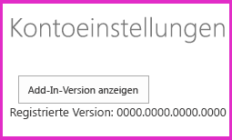

# <a name="handle-add-in-events-in-the-provider-hosted-add-in"></a><span data-ttu-id="c3463-103">Verarbeiten von Add-In-Ereignissen in anbietergehosteten Add-Ins</span><span class="sxs-lookup"><span data-stu-id="c3463-103">Handle add-in events in the provider-hosted add-in</span></span>

<span data-ttu-id="c3463-104">Dies ist der siebte einer Reihe von Artikeln über die Grundlagen der Entwicklung von vom Anbieter gehosteten SharePoint-Add-Ins. Machen Sie sich zunächst mit [SharePoint-Add-Ins](sharepoint-add-ins.md) und den vorherigen Artikeln dieser Reihe vertraut, die Sie unter [Erste Schritte beim Erstellen von von einem Anbieter gehosteten SharePoint-Add-Ins](get-started-creating-provider-hosted-sharepoint-add-ins.md#SP15createprovider_nextsteps) finden.</span><span class="sxs-lookup"><span data-stu-id="c3463-104">This is the seventh in a series of articles about the basics of developing provider-hosted SharePoint Add-ins. You should first be familiar with [SharePoint Add-ins](sharepoint-add-ins.md) and the previous articles in this series:</span></span> 

> [!NOTE]
> <span data-ttu-id="c3463-105">Wenn Sie unsere Artikelreihe zum Thema anbietergehostete Add-Ins durchgearbeitet haben, haben Sie bereits eine Visual Studio-Lösung, die Sie für diesen Artikel verwenden können.</span><span class="sxs-lookup"><span data-stu-id="c3463-105">If you have been working through this series about provider-hosted add-ins, you have a Visual Studio solution that you can use to continue with this topic.</span></span> <span data-ttu-id="c3463-106">Alternativ können Sie das Repository unter [SharePoint_Provider-hosted_Add-Ins_Tutorials](https://github.com/OfficeDev/SharePoint_Provider-hosted_Add-ins_Tutorials) herunterladen und die Datei „BeforeAdd-inEventHandlers.sln“ öffnen.</span><span class="sxs-lookup"><span data-stu-id="c3463-106">You can also download the repository at [SharePoint_Provider-hosted_Add-Ins_Tutorials](https://github.com/OfficeDev/SharePoint_Provider-hosted_Add-ins_Tutorials) and open the BeforeAdd-inEventHandlers.sln file.</span></span>

<span data-ttu-id="c3463-107">In diesem Artikel passen Sie die Verarbeitung einer bestimmten Art von SharePoint-Ereignissen an: Add-In-Ereignissen.</span><span class="sxs-lookup"><span data-stu-id="c3463-107">In this article, we customize the handling of a kind of event in SharePoint called add-in events.</span></span> <span data-ttu-id="c3463-108">Konkret erstellen Sie Handler für Add-In-Installationsereignisse und Add-In-Deinstallationsereignisse.</span><span class="sxs-lookup"><span data-stu-id="c3463-108">Specifically, we create handlers for the add-in installation and uninstallation events.</span></span> <span data-ttu-id="c3463-109">Auch Listenereignisse und Listenelementereignisse können benutzerdefiniert verarbeitet werden. Wie das funktioniert, erfahren Sie in einem der noch folgenden Artikel in unserer Reihe.</span><span class="sxs-lookup"><span data-stu-id="c3463-109">List and list item events can also get custom handling; you'll learn about these in a later article in this series.</span></span> <span data-ttu-id="c3463-110">Alle diese Ereignisse werden in SharePoint ausgelöst; der benutzerdefinierte Code, der die einzelnen Ereignisse verarbeitet, befindet sich jedoch in Ihrer Remotewebanwendung.</span><span class="sxs-lookup"><span data-stu-id="c3463-110">All of these events are triggered in SharePoint, but your custom code that handles each event is in your remote web application.</span></span> <span data-ttu-id="c3463-111">Damit SharePoint Ihren benutzerdefinierten Handler aufruft, müssen Sie die URL des Handlers im betreffenden SharePoint-Ereignis registrieren.</span><span class="sxs-lookup"><span data-stu-id="c3463-111">You configure SharePoint to call your custom handler by registering the handler's URL with the SharePoint event.</span></span>

## <a name="two-places-to-programmatically-deploy-sharepoint-components"></a><span data-ttu-id="c3463-112">Zwei geeignete Stellen für die programmgesteuerte Bereitstellung von SharePoint-Komponenten</span><span class="sxs-lookup"><span data-stu-id="c3463-112">Two places to programmatically deploy SharePoint components</span></span>

<span data-ttu-id="c3463-113">Unser ChainStore-Add-In soll die Listen **Lokale Mitarbeiter** und **Erwartete Lieferungen** automatisch erstellen und bereitstellen.</span><span class="sxs-lookup"><span data-stu-id="c3463-113">We want our Chain Store add-in to create and deploy the **Local Employees** and **Expected Shipments** lists automatically.</span></span> <span data-ttu-id="c3463-114">Add-Ins können SharePoint-Komponenten wie benutzerdefinierte Listen jederzeit bereitstellen.</span><span class="sxs-lookup"><span data-stu-id="c3463-114">An add-in can deploy SharePoint components, such as a custom list, any time.</span></span> <span data-ttu-id="c3463-115">Wenn ein Add-In jedoch von einer bestimmten Komponente wie beispielsweise einer benutzerdefinierten Liste abhängig ist, sollte diese Komponente bereitgestellt werden, *bevor* der Benutzer beginnt, mit dem Add-In zu arbeiten.</span><span class="sxs-lookup"><span data-stu-id="c3463-115">But when an add-in depends on a specific component such as a custom list, the component really should be deployed *before* users start working with the add-in.</span></span> <span data-ttu-id="c3463-116">Die benutzerdefinierte Bereitstellungslogik für solche essenziellen Komponenten kann an zwei Stellen platziert werden:</span><span class="sxs-lookup"><span data-stu-id="c3463-116">For such vital components, there are two places where the custom deployment logic can go:</span></span>

- <span data-ttu-id="c3463-117">In einem Handler für das Add-In-Installationsereignis</span><span class="sxs-lookup"><span data-stu-id="c3463-117">In a handler for the add-in installation event.</span></span>
- <span data-ttu-id="c3463-118">In einer Logik für die erste Ausführung, die ausgeführt wird, wenn das Add-In zum ersten Mal in SharePoint gestartet wird</span><span class="sxs-lookup"><span data-stu-id="c3463-118">In "first run" logic that executes the first time the add-in is launched in SharePoint.</span></span>

<span data-ttu-id="c3463-p104">Die Entscheidung, welcher für ein bestimmtes Add-In am besten geeignet ist, ist ein weiterführendes Thema. In diesem Artikel können nur einige Vergleichspunkte erwähnt werden:</span><span class="sxs-lookup"><span data-stu-id="c3463-p104">Deciding which is best for a given add-in is an advanced topic. In this article, we can only mention a few points of comparison:</span></span>

- <span data-ttu-id="c3463-p105">Die Ausführung eines benutzerdefinierten Installationshandlers muss innerhalb von 30 Sekunden abgeschlossen sein. Für die Ausführung von zuerst auszuführender Logik (First-Run-Logik) gibt es kein Zeitlimit.</span><span class="sxs-lookup"><span data-stu-id="c3463-p105">A custom installation handler has to complete in 30 seconds. There is no limit to how long first-run logic can take.</span></span>

- <span data-ttu-id="c3463-123">Treten während der Add-In-Installation Fehler auf, führt SharePoint ein Rollback aller während der Installation durchgeführten Aktionen aus.</span><span class="sxs-lookup"><span data-stu-id="c3463-123">If anything goes wrong during an add-in installation, SharePoint rolls back everything it has done as part of the installation.</span></span> <span data-ttu-id="c3463-124">Ein benutzerdefinierter Installationshandler wird ausgeführt, *nachdem* SharePoint sämtliche zur Add-In-Installation nötigen Aktionen durchgeführt hat; er kann sich also in dieses System einklinken.</span><span class="sxs-lookup"><span data-stu-id="c3463-124">A custom installation handler runs *after* SharePoint has done everything it's going to do to install the add-in, so a custom handler can participate in this system.</span></span> 

   <span data-ttu-id="c3463-125">Gibt die benutzerdefinierte Logik beispielsweise eine Ausnahme zurück, können Sie SharePoint anweisen, ein Rollback der gesamten Add-In-Installation auszuführen.</span><span class="sxs-lookup"><span data-stu-id="c3463-125">For example, if your custom logic throws an exception, you can tell SharePoint to roll back the entire add-in installation.</span></span> <span data-ttu-id="c3463-126">Tritt jedoch bei der Ausführung einer benutzerdefinierten First-Run-Logik ein Fehler auf, bleibt das Add-In installiert und wird vermutlich nicht mehr korrekt funktionieren.</span><span class="sxs-lookup"><span data-stu-id="c3463-126">If something goes wrong in custom first-run logic, however, the add-in remains installed and presumably won't work properly.</span></span>

- <span data-ttu-id="c3463-127">SharePoint stellt seine Aktivitäten nach dem Rollback einer Add-In-Installation nicht ein.</span><span class="sxs-lookup"><span data-stu-id="c3463-127">SharePoint doesn't give up if it has to roll back an add-in installation.</span></span> <span data-ttu-id="c3463-128">Stattdessen wird sofort ein erneuter Installationsversuch unternommen.</span><span class="sxs-lookup"><span data-stu-id="c3463-128">It immediately tries the installation again.</span></span> <span data-ttu-id="c3463-129">Insgesamt macht SharePoint bis zu vier Versuche. (Dabei gilt das 30-Sekunden-Zeitlimit für jeden Versuch.)</span><span class="sxs-lookup"><span data-stu-id="c3463-129">It makes up to four attempts (the 30-second time limit applies on each attempt).</span></span> <span data-ttu-id="c3463-130">Bei jedem erneuten Versuch wird der benutzerdefinierte Installationshandler wieder *komplett ab seinem ersten Schritt* ausgeführt.</span><span class="sxs-lookup"><span data-stu-id="c3463-130">Each time it retries, the custom installation handler runs again *from the beginning*.</span></span> <span data-ttu-id="c3463-131">Angenommen, der Handler konnte vor dem Rollback eine Liste installieren. Bei einem erneuten Installationsversuch würde der Handler dann versuchen, dieselbe Liste nochmals zu installieren.</span><span class="sxs-lookup"><span data-stu-id="c3463-131">If the handler managed to install, say, a list, before the rollback, it tries to install the same list again on the retry.</span></span> 

   <span data-ttu-id="c3463-132">Um dies zu verhindern, müssen Sie den Code in dem Installationshandler so verfassen, dass Aktionen wie die Bereitstellung einer Komponente erst ausgeführt werden, nachdem geprüft wurde, ob die betreffende Aktion bereits zuvor ausgeführt wurde.</span><span class="sxs-lookup"><span data-stu-id="c3463-132">To prevent this from happening, code in an installation handler has to be written so that it won't take any action (such as deploy a component) unless it first checks to see if that action has already been done.</span></span> <span data-ttu-id="c3463-133">Das macht die Logik eines Installationshandlers komplexer als First-Run-Logik: First-Run-Logik führt keine erneuten Versuch durch (es sei denn, Sie programmieren sie explizit entsprechend).</span><span class="sxs-lookup"><span data-stu-id="c3463-133">This makes the logic of an installation handler more complex than first-run logic because first-run logic won't retry (unless you specifically code it to do so).</span></span> <span data-ttu-id="c3463-134">Darüber hinaus erfordert die Prüfung auf eine bereits zuvor durchgeführte Bereitstellung einer Komponente einen zeitintensiven, internetbasierten Aufruf vom Remotehandler an SharePoint.</span><span class="sxs-lookup"><span data-stu-id="c3463-134">Also, checking to see if a component has already been deployed usually requires a time-consuming call over the Internet from the remote handler to SharePoint.</span></span> <span data-ttu-id="c3463-135">Wurde die Komponente noch nicht bereitgestellt, ist zur eigentlichen Bereitstellung dann noch ein zweiter Aufruf erforderlich.</span><span class="sxs-lookup"><span data-stu-id="c3463-135">A second call is also needed to actually deploy the component (if it has not already been deployed).</span></span>

<span data-ttu-id="c3463-136">In unserem ChainStore-Add-In kombinieren wir diese Strategien.</span><span class="sxs-lookup"><span data-stu-id="c3463-136">For the Chain Store add-in, we combine these strategies.</span></span> <span data-ttu-id="c3463-137">In diesem Artikel erstellen Sie einen Installationshandler, der das Hostweb als Mandant in der Unternehmensdatenbank registriert und anschließend ein Signal setzt, das angibt, ob das Add-In bereits im Hostweb ausgeführt worden ist.</span><span class="sxs-lookup"><span data-stu-id="c3463-137">In this article, you create an installation handler that registers the host web as a tenant in the corporate database and then sets a signal that specifies whether the add-in has been run yet on the host web.</span></span> 

<span data-ttu-id="c3463-138">In einem der folgenden Artikel dieser Reihe platzieren Sie First-Run-Logik in der Methode **Page_Load** der Add-In-Startseite.</span><span class="sxs-lookup"><span data-stu-id="c3463-138">In a later article in this series, you'll put first-run logic in the **Page_Load** method of the add-ins start page.</span></span> <span data-ttu-id="c3463-139">Diese Logik stellt die zwei benutzerdefinierten Listen bereit und führt verschiedene andere Aktionen durch.</span><span class="sxs-lookup"><span data-stu-id="c3463-139">This logic deploys the two custom lists and does some other things, too.</span></span>

<span data-ttu-id="c3463-140"><a name="RERDebug"> </a></span><span class="sxs-lookup"><span data-stu-id="c3463-140"></span></span>
## <a name="configure-the-solution-for-event-receiver-debugging"></a><span data-ttu-id="c3463-141">Konfigurieren der Lösung für das Debuggen des Ereignisempfängers</span><span class="sxs-lookup"><span data-stu-id="c3463-141">Configure the solution for event receiver debugging</span></span>

<span data-ttu-id="c3463-142">Das Debuggen von Ereignisempfängern erfordert die Verwendung von Azure Service Bus.</span><span class="sxs-lookup"><span data-stu-id="c3463-142">Debugging of event receivers requires the use of the Azure Service Bus.</span></span> <span data-ttu-id="c3463-143">Befolgen Sie die Anweisungen unter [Debugging und Problembehandlung eines Remoteereignisempfängers in einem Add-In für SharePoint](debug-and-troubleshoot-a-remote-event-receiver-in-a-sharepoint-add-in.md).</span><span class="sxs-lookup"><span data-stu-id="c3463-143">Follow the instructions at [Debug and troubleshoot a remote event receiver in a SharePoint Add-in](debug-and-troubleshoot-a-remote-event-receiver-in-a-sharepoint-add-in.md).</span></span> <span data-ttu-id="c3463-144">Da Sie eine SharePoint Online-Website als Testwebsite verwenden, müssen Sie die Anweisungen für Remotetestwebsites befolgen.</span><span class="sxs-lookup"><span data-stu-id="c3463-144">Because you are using a SharePoint Online website as your test site, ensure that you carry out the instructions for a remote test site.</span></span> <span data-ttu-id="c3463-145">In den übrigen Artikeln dieser Reihe gehen wir davon aus, dass Sie das Debugging erfolgreich konfiguriert haben.</span><span class="sxs-lookup"><span data-stu-id="c3463-145">The remainder of this series assumes you have configured debugging successfully.</span></span> 

## <a name="create-the-installation-handler"></a><span data-ttu-id="c3463-146">Erstellen des Installationshandlers</span><span class="sxs-lookup"><span data-stu-id="c3463-146">Create the installation handler</span></span>

> [!NOTE]
> <span data-ttu-id="c3463-147">Die Einstellungen für Startprojekte in Visual Studio werden in der Regel nach jedem erneuten Öffnen der Lösung wieder auf die Standardwerte zurückgesetzt.</span><span class="sxs-lookup"><span data-stu-id="c3463-147">The settings for Startup Projects in Visual Studio tend to revert to defaults whenever the solution is reopened.</span></span> <span data-ttu-id="c3463-148">Wann immer Sie beim Durcharbeiten dieser Artikelreihe die Beispiellösung erneut öffnen, müssen Sie umgehend die folgenden Schritte durchführen:</span><span class="sxs-lookup"><span data-stu-id="c3463-148">Always take these steps immediately after reopening the sample solution in this series of articles:</span></span> 
> 1. <span data-ttu-id="c3463-149">Klicken Sie oben im **Projektmappen-Explorer** mit der rechten Maustaste auf den Lösungsknoten, und wählen Sie die Option **Startprojekte festlegen** aus.</span><span class="sxs-lookup"><span data-stu-id="c3463-149">Right-click the solution node at the top of **Solution Explorer**, and then select **Set startup projects**.</span></span>  
> 2. <span data-ttu-id="c3463-150">Stellen Sie sicher, dass alle drei Projekte in der Spalte **Aktion** auf **Start** festgelegt sind.</span><span class="sxs-lookup"><span data-stu-id="c3463-150">Ensure that all three projects are set to **Start** in the **Action** column.</span></span>

1. <span data-ttu-id="c3463-151">Wählen Sie im **Projektmappen-Explorer** das Projekt **ChainStore** aus. Die Eigenschaften des Projekts werden im Visual Studio-Bereich **Eigenschaften** angezeigt.</span><span class="sxs-lookup"><span data-stu-id="c3463-151">In **Solution Explorer**, select the **ChainStore** project so that its properties appear in the **Properties** pane of Visual Studio.</span></span>

2. <span data-ttu-id="c3463-152">Legen Sie für **Installiertes Add-In verarbeiten** den Wert **Wahr ** fest. (Möglicherweise heißt die Option in Ihrer Version noch **Installierte App behandeln**.)</span><span class="sxs-lookup"><span data-stu-id="c3463-152">Set the value of **Handle Add-in Installed** to **True** (it may still be called **Handle App Installed**).</span></span> <span data-ttu-id="c3463-153">Diese Festlegung bewirkt zwei Dinge:</span><span class="sxs-lookup"><span data-stu-id="c3463-153">This does two things:</span></span>
    
   - <span data-ttu-id="c3463-154">Ein Ordner mit dem Namen **Dienste** wird im Projekt **ChainStoreWeb** erstellt (nicht im Projekt **ChainStore**), und diesem Ordner werden zwei Dateien hinzugefügt: die Datei „AppEventReceiver.svc“ und deren CodeBehind-Datei „AppEventReceiver.svc.cs“. (Die Dateinamen beginnen mit der Zeichenfolge „App“, weil Add-Ins früher als Apps bezeichnet wurden. *Benennen Sie diese Dateien nicht um!* Office Developer Tools für Visual Studio erwartet, dass die Dateien noch dieselben Namen haben).</span><span class="sxs-lookup"><span data-stu-id="c3463-154">A folder called **Services** is created in the **ChainStoreWeb** project (not the **ChainStore** project), and two files are added to it: an AppEventReceiver.svc file and its code-behind AppEventReceiver.svc.cs file (the file names begin with the string "App" because add-ins used to be called "apps"; *don't rename these files* because the Office Developer Tools for Visual Studio assumes that the files will keep these names).</span></span>

   - <span data-ttu-id="c3463-155">Die Handler-URL wird im Add-In-Manifest registriert.</span><span class="sxs-lookup"><span data-stu-id="c3463-155">The handler URL is registered in the add-in manifest.</span></span> <span data-ttu-id="c3463-156">Dieser Teil des Manifests ist im Manifest-Designer nicht sichtbar.</span><span class="sxs-lookup"><span data-stu-id="c3463-156">This part of the manifest is not visible in the manifest designer.</span></span> <span data-ttu-id="c3463-157">Damit er angezeigt wird, müssen Sie mit der rechten Maustaste auf die Datei „AppManifest.xml“ klicken und die Option **Code anzeigen** auswählen.</span><span class="sxs-lookup"><span data-stu-id="c3463-157">To see it, right-click the AppManifest.xml file and select **View Code**.</span></span> <span data-ttu-id="c3463-158">Ein neues untergeordnetes Element des Elements **Properties** sieht wie folgt aus:</span><span class="sxs-lookup"><span data-stu-id="c3463-158">A new child of the **Properties** element looks like the following.</span></span> 
   
      ```XML
        <InstalledEventEndpoint>~remoteAppUrl/Services/AppEventReceiver.svc</InstalledEventEndpoint>
      ``` 
   
     <span data-ttu-id="c3463-159">Dieses Markup weist SharePoint an, die Methode **ProcessEvent** dieses Diensts aufzurufen, sobald alle SharePoint-eigenen Aufgaben zur Installation des Add-Ins ausgeführt wurden.</span><span class="sxs-lookup"><span data-stu-id="c3463-159">This markup tells SharePoint to call the **ProcessEvent** method of this service when it has finished doing all of its own work related to installing the add-in.</span></span> <span data-ttu-id="c3463-160">Der benutzerdefinierte Handler ist das letzte Element, das während der Installation ausgeführt wird.</span><span class="sxs-lookup"><span data-stu-id="c3463-160">The custom handler is the last thing that runs as part of the installation.</span></span> <span data-ttu-id="c3463-161">Die Zeichenfolge `~remoteAppUrl` ist ein Platzhalter, den Office Developer Tools für Visual Studio durch die Host-URL des Diensts ersetzt.</span><span class="sxs-lookup"><span data-stu-id="c3463-161">The string `~remoteAppUrl` is a placeholder that the Office Developer Tools for Visual Studio replaces with the service host URL.</span></span> <span data-ttu-id="c3463-162">Beim Debuggen wird eine Azure Service Bus-URL eingefügt.</span><span class="sxs-lookup"><span data-stu-id="c3463-162">When you are debugging, it is an Azure Service Bus URL.</span></span> <span data-ttu-id="c3463-163">Wenn Sie das Paket für die Bereitstellung in der Produktionsumgebung erstellen, wird die Produktions-URL eingefügt.</span><span class="sxs-lookup"><span data-stu-id="c3463-163">When you create the package for deployment to production, it is the production URL.</span></span>

3. <span data-ttu-id="c3463-164">Öffnen Sie die Datei „AppEventReceiver.svc.cs“.</span><span class="sxs-lookup"><span data-stu-id="c3463-164">Open the AppEventReceiver.svc.cs file.</span></span>
    
4. <span data-ttu-id="c3463-165">Wie Sie sehen, hat Office Developer Tools für Visual Studio eine Beispielimplementierung der Methode **ProcessEvent** erstellt.</span><span class="sxs-lookup"><span data-stu-id="c3463-165">You see that the Office Developer Tools for Visual Studio has created a sample implementation of the **ProcessEvent** method.</span></span> <span data-ttu-id="c3463-166">Alle Implementierungen dieser Methode beginnen mit der Initialisierung eines Objekts des Typs **SPRemoteEventResult** und enden mit der Rückgabe dieses Objekts an SharePoint.</span><span class="sxs-lookup"><span data-stu-id="c3463-166">All implementations of this method begin by initializing an **SPRemoteEventResult** object, and they all end by returning that object to SharePoint.</span></span> <span data-ttu-id="c3463-167">Unter anderem teilt dieses Objekt SharePoint mit, ob für das Ereignis ein Rollback ausgeführt werden soll, falls in der benutzerdefinierten Verarbeitungslogik ein Fehler auftritt.</span><span class="sxs-lookup"><span data-stu-id="c3463-167">Among other things, this object tells SharePoint whether or not it should roll back the event because the custom handling logic has failed.</span></span> 

   <span data-ttu-id="c3463-168">Möglicherweise haben die Tools auch einen Block des Typs **using** in die Methode aufgenommen, der ein Objekt des Typs **ClientContext** erstellt.</span><span class="sxs-lookup"><span data-stu-id="c3463-168">The tools may also have included a **using** block in this method that creates a **ClientContext** object.</span></span> <span data-ttu-id="c3463-169">Der benutzerdefinierte Handler im ChainStore-Add-In wird keinen Rückruf an SharePoint senden, daher können Sie diesen Block löschen.</span><span class="sxs-lookup"><span data-stu-id="c3463-169">The custom handler in the Chain Store add-in isn't going to call back into SharePoint, so delete this block.</span></span> <span data-ttu-id="c3463-170">Die Methode sollte jetzt wie folgt aussehen:</span><span class="sxs-lookup"><span data-stu-id="c3463-170">The method should now look like the following.</span></span>
    
    ```C#
       public SPRemoteEventResult ProcessEvent(SPRemoteEventProperties properties)
     {
         SPRemoteEventResult result = new SPRemoteEventResult();

         return result;
     }
    ```

5. <span data-ttu-id="c3463-171">Der Ereignisempfänger kann von jedem der drei möglichen Add-In-Ereignisse aufgerufen werden. Fügen Sie deshalb die folgende Struktur des Typs **switch** zur Methode **ProcessEvent** hinzu, zwischen den Zeilen, die das Objekt des Typs `result` erstellen und zurückgeben. (Die Ereignisnamen enthalten die Zeichenfolge „App“, da Add-Ins früher als Apps bezeichnet wurden.)</span><span class="sxs-lookup"><span data-stu-id="c3463-171">The event receiver could be called by any of three possible add-in events, so add the following **switch** structure to the **ProcessEvent** method in between the lines that create and return the `result` object (the event names have the string "App" in them because add-ins used to be called "apps").</span></span>
    
    ```C#
      switch (properties.EventType)
    {
        case SPRemoteEventType.AppInstalled:

            // TODO2: Custom installation logic goes here.

            break;
        case SPRemoteEventType.AppUpgraded:
            // This sample does not implement an add-in upgrade handler.
            break;
        case SPRemoteEventType.AppUninstalling:

            // TODO3: Custom uninstallation logic goes here.         

            break;
    }
    ```

6. <span data-ttu-id="c3463-172">Unsere Installationslogik wird eine gespeicherte SQL-Prozedur aufrufen, um den Hongkong-Store als Mandant in der Remotewebanwendung zu registrieren.</span><span class="sxs-lookup"><span data-stu-id="c3463-172">Our installation logic is going to call an SQL stored procedure to register the Hong Kong store as a tenant in the remote web application.</span></span> <span data-ttu-id="c3463-173">Es ist sehr wichtig, dass der Handler SharePoint bei einem Fehlschlagen dieses Prozesses signalisiert, ein Rollback der Add-In-Installation auszuführen. Ersetzen Sie daher `TODO2` durch die folgenden Blöcke des Typs **try/catch**:</span><span class="sxs-lookup"><span data-stu-id="c3463-173">It is very important that, if this process fails, the handler signals SharePoint to roll back the installation of the add-in, so add the following **try/catch** blocks in place of `TODO2`.</span></span> 

    ```C#
      try
    {
        CreateTenant(tenantName);
     }
    catch (Exception e)
    {
         // Tell SharePoint to cancel and roll back the event.
        result.ErrorMessage = e.Message;
        result.Status = SPRemoteEventServiceStatus.CancelWithError;
    }
    ```

   <span data-ttu-id="c3463-174">Zu diesem Code ist Folgendes anzumerken:</span><span class="sxs-lookup"><span data-stu-id="c3463-174">Note the following about this code:</span></span>

   - <span data-ttu-id="c3463-175">Das Objekt des Typs `tenantName` und die Methode `CreateTenant` erstellen Sie in einem späteren Schritt.</span><span class="sxs-lookup"><span data-stu-id="c3463-175">You create the `tenantName` object and `CreateTenant` method in a later step.</span></span>
   - <span data-ttu-id="c3463-p120">Die Eigenschaft **Status** des Objekts **SPRemoteEventResult** kann drei Werte aufweisen: **Continue** (Standard), **CancelNoError** und **CancelWithError**. Die beiden Letzteren weisen SharePoint an, ein Rollback des Ereignisses durchzuführen.</span><span class="sxs-lookup"><span data-stu-id="c3463-p120">The **Status** property of the **SPRemoteEventResult** object can have three possible values: **Continue** (the default), **CancelNoError**, and **CancelWithError**. Either of the latter two tell SharePoint to roll back the event.</span></span>

7. <span data-ttu-id="c3463-178">Die Hostweb-URL ist der Mandantendiskriminator des Beispielcodes und eine der Informationen, die SharePoint im Parameter **SPRemoteEventProperties** an den Empfänger übergibt.</span><span class="sxs-lookup"><span data-stu-id="c3463-178">The host web URL, which is the sample's tenant discriminator, is part of the information that SharePoint passes to the receiver in the **SPRemoteEventProperties** parameter.</span></span> <span data-ttu-id="c3463-179">Fügen Sie die folgende Zeile zur Methode **ProcessEvent** hinzu, in der Zeile unmittelbar unterhalb des Codes für die Initialisierung des Objekts des Typs **SPRemoteEventResult**:</span><span class="sxs-lookup"><span data-stu-id="c3463-179">Add the following line to the **ProcessEvent** method on the line that is just under the initialization of the **SPRemoteEventResult** object.</span></span>
    
    ```C#
      string tenantName = properties.AppEventProperties.HostWebFullUrl.ToString();
    ```

8. <span data-ttu-id="c3463-180">Jetzt müssen Sie in Ihrem Code noch eine kleine Besonderheit der Eigenschaft **AppEventProperties.HostWebFullUrl** berücksichtigen:</span><span class="sxs-lookup"><span data-stu-id="c3463-180">Now our code has to deal with a little quirk of the **AppEventProperties.HostWebFullUrl** property.</span></span> <span data-ttu-id="c3463-181">Da SharePoint in den meisten anderen Kontexten `"/"` als abschließendes Zeichen am Ende der Hostweb-URL setzt, erwartet die Logik unseres Codebeispiels dieses Zeichen ebenfalls.</span><span class="sxs-lookup"><span data-stu-id="c3463-181">In most other contexts, SharePoint includes a closing `"/"` character at the end of the host web URL, so the logic of our sample code assumes that this character is present.</span></span> <span data-ttu-id="c3463-182">Jedoch setzt SharePoint dieses Zeichen am Ende des Werts **HostWebFullUrl** ausschließlich dann, wenn das Hostweb das Stammweb einer Websitesammlung ist.</span><span class="sxs-lookup"><span data-stu-id="c3463-182">But SharePoint adds this character at the end of the **HostWebFullUrl** value if, and only if, the host web is the root web of a site collection.</span></span> <span data-ttu-id="c3463-183">Da unsere Hongkong-Website eine Unterwebsite in der Websitesammlung ist, müssen Sie dieses Symbol hinzufügen, damit überall im Beispielcode dieselbe Zeichenfolge als Mandantenname verwendet wird.</span><span class="sxs-lookup"><span data-stu-id="c3463-183">Because our Hong Kong website is a subweb in the site collection, we need to add this character to ensure that the same tenant name string is used throughout the sample.</span></span> 

   <span data-ttu-id="c3463-184">Fügen Sie den folgenden Code unterhalb des Codes für die Initialisierung des Objekts des Typs `tenantName` ein:</span><span class="sxs-lookup"><span data-stu-id="c3463-184">Add the following code under the initialization of the `tenantName` object.</span></span>
    
    ```C#
      if (!tenantName.EndsWith("/"))
    {
        tenantName += "/";
    }
    ```

9. <span data-ttu-id="c3463-185">Fügen Sie die folgenden Anweisungen des Typs **using** oben in der Datei ein:</span><span class="sxs-lookup"><span data-stu-id="c3463-185">Add the following **using** statements to the top of the file.</span></span>
    
    ```C#
      using System.Data.SqlClient;
      using System.Data;
      using ChainStoreWeb.Utilities;
    ```

10. <span data-ttu-id="c3463-186">Fügen Sie der Klasse `AppEventReceiver` die unten aufgeführte Methode hinzu.</span><span class="sxs-lookup"><span data-stu-id="c3463-186">Add the following method to the `AppEventReceiver` class.</span></span> <span data-ttu-id="c3463-187">Auf diesen Schritt gehen wir an dieser Stelle nicht im Detail ein, weil wir uns in dieser Artikelreihe auf die Programmierung von SharePoint-Add-Ins konzentrieren, nicht auf die SQL Server/Azure-Programmierung.</span><span class="sxs-lookup"><span data-stu-id="c3463-187">We don't discuss this in detail because the purpose of this series of articles is to teach SharePoint Add-in programming, not SQL Server/Azure programming.</span></span>

     ```C#
       private void CreateTenant(string tenantName)
     {
         // Do not catch exceptions. Allow them to bubble up and trigger roll back
         // of installation.

         using (SqlConnection conn = SQLAzureUtilities.GetActiveSqlConnection())
         using (SqlCommand cmd = conn.CreateCommand())
         {
             conn.Open();
             cmd.CommandText = "AddTenant";
             cmd.CommandType = CommandType.StoredProcedure;
             SqlParameter name = cmd.Parameters.Add("@Name", SqlDbType.NVarChar);
             name.Value = tenantName;
             cmd.ExecuteNonQuery();
         }//dispose conn and cmd
     }
     ```

    <span data-ttu-id="c3463-188">Diese Methode erstellt eine Zeile in einer Datenbanktabelle namens **Mandanten**.</span><span class="sxs-lookup"><span data-stu-id="c3463-188">This method creates a row in a database table called **Tenants**.</span></span> <span data-ttu-id="c3463-189">Neben der Spalte **Name** enthält diese Tabelle auch eine Spalte **Version** mit einem Standardwert von „0000.0000.0000.0000“.</span><span class="sxs-lookup"><span data-stu-id="c3463-189">In addition to the **Name** column, the table also has a **Version** column with a default value set to 0000.0000.0000.0000.</span></span> <span data-ttu-id="c3463-190">In einem der nachfolgenden Artikel dieser Reihe erstellen Sie First-Run-Logik, die anhand dieses Wertes ermittelt, ob das Add-In bereits im Hostweb installiert worden ist.</span><span class="sxs-lookup"><span data-stu-id="c3463-190">In a later article in this series, you will create first-run logic that looks at this value to determine whether the add-in has already been installed on the host web.</span></span> <span data-ttu-id="c3463-191">Wenn als Version „0000.0000.0000.0000“ gesetzt ist, stellt der Code die Listen **Lokale Mitarbeiter** und **Erwartete Lieferungen** bereit und setzt anschließend die Versionsnummer herauf.</span><span class="sxs-lookup"><span data-stu-id="c3463-191">If the version is 0000.0000.0000.0000, your code deploys the **Local Employees** and **Expected Shipments** lists, and then raises the version number.</span></span>
    
## <a name="create-the-uninstallation-handler"></a><span data-ttu-id="c3463-192">Erstellen des Deinstallationshandlers</span><span class="sxs-lookup"><span data-stu-id="c3463-192">Create the uninstallation handler</span></span>

<span data-ttu-id="c3463-193">Wenn Sie das Installationsereignis verarbeiten, empfiehlt es sich in der Regel immer, auch das Deinstallationsereignis zu verarbeiten.</span><span class="sxs-lookup"><span data-stu-id="c3463-193">It is usually a good practice to handle the uninstalling event whenever you are handling the installed event.</span></span> <span data-ttu-id="c3463-194">Von der grundlegenden Idee her löscht oder recycelt der Deinstallationshandler Komponenten, die der Installationshandler bereitgestellt hat.</span><span class="sxs-lookup"><span data-stu-id="c3463-194">The basic idea is that the uninstalling handler deletes or recycles things that the installed handler deployed.</span></span> <span data-ttu-id="c3463-195">Jedoch gibt es hier zahlreiche Ausnahmen, sodass Sie sich immer zunächst über die Anwendungsfälle Ihres Add-Ins klar werden müssen.</span><span class="sxs-lookup"><span data-stu-id="c3463-195">There are, however, many exceptions, so you really need to understand the use cases of your add-in.</span></span> <span data-ttu-id="c3463-196">Ein Beispiel: Eine Liste, die mit einem Add-In bereitgestellt und befüllt wird, ist möglicherweise auch nach der Deinstallation des Add-Ins noch nützlich. Dann sollte der Deinstallationsereignishandler diese Liste nicht deinstallieren.</span><span class="sxs-lookup"><span data-stu-id="c3463-196">For example, a list that is deployed with an add-in and populated with the add-in might still have value even after the add-in itself is uninstalled, in which case you wouldn't want to uninstall the list in the uninstalling event handler.</span></span> 

<span data-ttu-id="c3463-197">Erwartungsgemäß wird das Deinstallationsereignis nicht ausgeführt, wenn ein Benutzer das Add-In von der Seite **Websiteinhalte** entfernt.</span><span class="sxs-lookup"><span data-stu-id="c3463-197">The uninstallation event does not run, as you might expect, when a user removes the add-in from the **Site Contents** page.</span></span> <span data-ttu-id="c3463-198">Dadurch verschiebt er das Add-In lediglich in den Papierkorb der Website.</span><span class="sxs-lookup"><span data-stu-id="c3463-198">Doing so only moves the add-in to the website's Recycle Bin.</span></span> <span data-ttu-id="c3463-199">Der Benutzer könnte das Add-In zwar anschließend wiederherstellen, dann würde jedoch der Installationsereignishandler nicht wieder ausgeführt werden. Alle Komponenten, die vom Installationsereignishandler bereitgestellt wurden, sollten also noch vorhanden sein, wenn das Add-In wiederhergestellt wird.</span><span class="sxs-lookup"><span data-stu-id="c3463-199">A user could restore it, but restoring does not rerun the installed event handler, so you'd want anything that was deployed with the installed event handler to still exist if the add-in is restored.</span></span> <span data-ttu-id="c3463-200">SharePoint-Komponenten können aus dem Papierkorb in den endgültigen Papierkorb verschoben werden.</span><span class="sxs-lookup"><span data-stu-id="c3463-200">SharePoint components can be moved from the Recycle Bin to the second-stage Recycle Bin.</span></span> <span data-ttu-id="c3463-201">Das Deinstallationsereignis wird nur ausgeführt, wenn ein Add-In aus dem endgültigen Papierkorb gelöscht wird. Tut ein Benutzer das, lässt sich das betreffende Add-In nicht wiederherstellen. In diesem Fall soll der Mandant des Hongkong-Stores aus der Unternehmensdatenbank entfernt werden.</span><span class="sxs-lookup"><span data-stu-id="c3463-201">It is only when an add-in is deleted from the second-stage that the uninstalling event happens; when a user does that, the add-in is unrestorable anyway, so we want the Hong Kong store's tenancy to be removed from the corporate database at that point.</span></span>

1. <span data-ttu-id="c3463-202">Legen Sie für **Deinstallation des Add-Ins verarbeiten** den Wert **Wahr** fest. (Möglicherweise heißt die Option in Ihrer Version noch **Handle App Uninstalling**.)</span><span class="sxs-lookup"><span data-stu-id="c3463-202">Set the value of **Handle Add-in Uninstalling** to **True** (it may still be called **Handle App Uninstalling**).</span></span> <span data-ttu-id="c3463-203">Dadurch wird der Handler in der Datei „AppManifest.xml“ registriert, genauso wie zuvor der Installationshandler registriert wurde.</span><span class="sxs-lookup"><span data-stu-id="c3463-203">This registers the handler in the AppManifest.xml file just as you earlier registered the installation handler.</span></span> <span data-ttu-id="c3463-204">Wie Sie sehen, haben die beiden Handler exakt dieselbe URL.</span><span class="sxs-lookup"><span data-stu-id="c3463-204">If you look at the file, you see that they have exactly the same URL.</span></span> <span data-ttu-id="c3463-205">Office Developer Tools für Visual Studio erwartet, dass Sie dieselbe \*.svc-Datei verwenden.</span><span class="sxs-lookup"><span data-stu-id="c3463-205">The Office Developer Tools for Visual Studio assumes that you are using the same \*.svc file.</span></span> <span data-ttu-id="c3463-206">Das ist eine Standardvorgehensweise, an die wir uns auch in diesem Codebeispiel halten.</span><span class="sxs-lookup"><span data-stu-id="c3463-206">We are doing that in this sample, and it is a standard practice.</span></span> 

2. <span data-ttu-id="c3463-207">Fügen Sie den folgenden Code anstelle von `TODO3` in die Datei „AppEventReceiver.svc.cs“ ein:</span><span class="sxs-lookup"><span data-stu-id="c3463-207">Add the following code in place of `TODO3` in the AppEventReceiver.svc.cs file.</span></span> 

    ```C#
      try
    {
        DeleteTenant(tenantName);
     }
    catch (Exception e)
    {
         // Tell SharePoint to cancel and roll back the event.
        result.ErrorMessage = e.Message;
        result.Status = SPRemoteEventServiceStatus.CancelWithError;
    }
    ```

   <span data-ttu-id="c3463-208">Zu diesem Code ist Folgendes anzumerken:</span><span class="sxs-lookup"><span data-stu-id="c3463-208">Note the following about this code:</span></span>

   - <span data-ttu-id="c3463-209">Die Methode `DeleteTenant` wird im nächsten Schritt hinzugefügt.</span><span class="sxs-lookup"><span data-stu-id="c3463-209">The `DeleteTenant` method is added in the next step.</span></span>
   - <span data-ttu-id="c3463-210">Nach einem Rollback der Add-In-Deinstallation verbleibt das Add-In im endgültigen Papierkorb, aus dem es immer noch wiederhergestellt werden kann.</span><span class="sxs-lookup"><span data-stu-id="c3463-210">Rolling back the uninstallation of the add-in leaves it in the second-stage Recycle Bin, from which it could still be restored.</span></span>

3. <span data-ttu-id="c3463-211">Fügen Sie der Klasse `AppEventReceiver` die unten aufgeführte Methode hinzu.</span><span class="sxs-lookup"><span data-stu-id="c3463-211">Add the following method to the `AppEventReceiver` class.</span></span>
    
    ```C#
      private void DeleteTenant(string tenantName)
    {
        // Do not catch exceptions. Allow them to bubble up and trigger roll back
        // of un-installation (removal from 2nd level Recycle Bin).

        using (SqlConnection conn = SQLAzureUtilities.GetActiveSqlConnection())
        using (SqlCommand cmd = conn.CreateCommand())
        {
            conn.Open();
            cmd.CommandText = "RemoveTenant";
            cmd.CommandType = CommandType.StoredProcedure;
            SqlParameter name = cmd.Parameters.Add("@Name", SqlDbType.NVarChar);
            name.Value = tenantName;
            cmd.ExecuteNonQuery();                
        }//dispose conn and cmd
    }
    ```

> [!NOTE]
> <span data-ttu-id="c3463-212">In einem der vorangegangenen Artikel dieser Reihe haben Sie das Projekt so konfiguriert, dass die Unternehmensdatenbank jedes Mal neu erstellt wird, wenn Sie F5 drücken.</span><span class="sxs-lookup"><span data-stu-id="c3463-212">In an earlier article in this series, you configured the project to rebuild the corporate database each time you select F5.</span></span> <span data-ttu-id="c3463-213">Dann wird die Tabelle **Mandanten** geleert.</span><span class="sxs-lookup"><span data-stu-id="c3463-213">This empties the **Tenants** table.</span></span>

## <a name="run-the-add-in-and-test-the-installation-handler"></a><span data-ttu-id="c3463-214">Ausführen des Add-Ins und Testen des Installationshandlers</span><span class="sxs-lookup"><span data-stu-id="c3463-214">Run the add-in and test the installation handler</span></span>

1. <span data-ttu-id="c3463-215">Drücken Sie die Taste F5, um das Add-In bereitzustellen und auszuführen.</span><span class="sxs-lookup"><span data-stu-id="c3463-215">Use the F5 key to deploy and run your add-in.</span></span> <span data-ttu-id="c3463-216">Visual Studio hostet die Remotewebanwendung in IIS Express und die SQL-Datenbank in SQL Express.</span><span class="sxs-lookup"><span data-stu-id="c3463-216">Visual Studio hosts the remote web application in IIS Express and hosts the SQL database in SQL Express.</span></span> <span data-ttu-id="c3463-217">Zudem installiert Visual Studio das Add-In vorübergehend auf Ihrer SharePoint-Testwebsite, führt den Installationsereignishandler aus und führt anschließend sofort das Add-In aus.</span><span class="sxs-lookup"><span data-stu-id="c3463-217">It also makes a temporary installation of the add-in on your test SharePoint site, runs the installation event handler, and immediately runs the add-in.</span></span> <span data-ttu-id="c3463-218">Bevor die Startseite des Add-Ins geöffnet wird, werden Sie aufgefordert, dem Add-In Berechtigungen zu erteilen.</span><span class="sxs-lookup"><span data-stu-id="c3463-218">You are prompted to grant permissions to the add-in before its start page opens.</span></span> 

2. <span data-ttu-id="c3463-219">Die Startseite des Add-Ins wird geöffnet. Klicken Sie oben im Chromsteuerelement auf das Zahnradsymbol, und wählen Sie die Option **Kontoeinstellungen** aus.</span><span class="sxs-lookup"><span data-stu-id="c3463-219">When the add-in's start page opens, select the gear icon on the chrome control at the top, and then select **Account settings**.</span></span>

3. <span data-ttu-id="c3463-220">Klicken Sie auf der Seite **Kontoeinstellungen** auf die Schaltfläche **Add-In-Version anzeigen**.</span><span class="sxs-lookup"><span data-stu-id="c3463-220">On the **Accounts settings** page, select the **Show Add-in Version** button.</span></span> <span data-ttu-id="c3463-221">Als Version wird „0000.0000.0000.0000“ angezeigt.</span><span class="sxs-lookup"><span data-stu-id="c3463-221">The version shows as 0000.0000.0000.0000.</span></span>
    
   <span data-ttu-id="c3463-222">*Abbildung 1: Seite „Kontoeinstellungen“*</span><span class="sxs-lookup"><span data-stu-id="c3463-222">*Figure 1. Account settings page*</span></span>

   

4. <span data-ttu-id="c3463-224">Schließen Sie zum Beenden der Debugsitzung das Browserfenster, oder beenden Sie das Debuggen in Visual Studio.</span><span class="sxs-lookup"><span data-stu-id="c3463-224">To end the debugging session, close the browser window or stop debugging in Visual Studio.</span></span> <span data-ttu-id="c3463-225">Wann immer Sie F5 drücken, zieht Visual Studio die bisherige Version des Add-Ins zurück und installiert die jeweils neueste Version.</span><span class="sxs-lookup"><span data-stu-id="c3463-225">Each time that you select F5, Visual Studio retracts the previous version of the add-in and installs the latest one.</span></span>

5. <span data-ttu-id="c3463-226">Da Sie mit diesem Add-In und dieser Visual Studio-Lösung auch in anderen Artikeln arbeiten werden, empfiehlt es sich, das Add-In ein letztes Mal zurückzuziehen, sobald Sie eine Weile nicht mehr an ihm arbeiten werden.</span><span class="sxs-lookup"><span data-stu-id="c3463-226">You will work with this add-in and Visual Studio solution in other articles, and it's a good practice to retract the add-in one last time when you are done working with it for a while.</span></span> <span data-ttu-id="c3463-227">Klicken Sie im **Projektmappen-Explorer** mit der rechten Maustaste auf das Projekt, und wählen Sie die Option **Zurückziehen** aus.</span><span class="sxs-lookup"><span data-stu-id="c3463-227">Right-click the project in **Solution Explorer** and select **Retract**.</span></span>

## <a name="next-steps"></a><span data-ttu-id="c3463-228">Nächste Schritte</span><span class="sxs-lookup"><span data-stu-id="c3463-228">Next steps</span></span>
<span data-ttu-id="c3463-229"><a name="Nextsteps"> </a></span><span class="sxs-lookup"><span data-stu-id="c3463-229"></span></span>

<span data-ttu-id="c3463-230">Im nächsten Artikel unserer Reihe fügen Sie dem Add-In First-Run-Logik hinzu, die die Liste **Lokale Mitarbeiter** und die benutzerdefinierte Menübandschaltfläche programmgesteuert bereitstellt: [Hinzufügen der Logik für die erste Ausführung zum vom Anbieter gehosteten Add-In](add-first-run-logic-to-the-provider-hosted-add-in.md).</span><span class="sxs-lookup"><span data-stu-id="c3463-230">In the next article of the series, you will add first-run logic to the add-in that programmatically deploys the **Local Employees** list and the custom ribbon button: [Add first-run logic to the provider-hosted add-in](add-first-run-logic-to-the-provider-hosted-add-in.md).</span></span>
 

 

