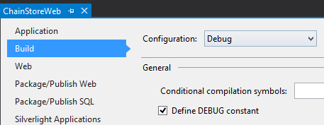
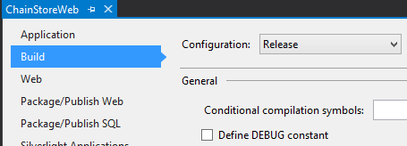

# <a name="handle-list-item-events-in-the-provider-hosted-add-in"></a><span data-ttu-id="0e445-101">Verarbeiten von Listenelementereignissen im vom Anbieter gehosteten Add-In</span><span class="sxs-lookup"><span data-stu-id="0e445-101">Handle list item events in the provider-hosted add-in</span></span>
<span data-ttu-id="0e445-102">Erfahren Sie, wie Sie Listenelementereignisse in einem vom Anbieter gehosteten SharePoin-Add-In verarbeiten.</span><span class="sxs-lookup"><span data-stu-id="0e445-102">Learn how to handle list item events in a provider-hosted spappsing.</span></span>
 

 <span data-ttu-id="0e445-p101">**Hinweis** Der Name „Apps für SharePoint“ wird in „SharePoint-Add-Ins“ geändert. Während des Übergangszeitraums wird in der Dokumentation und der Benutzeroberfläche einiger SharePoint-Produkte und Visual Studio-Tools möglicherweise weiterhin der Begriff „Apps für SharePoint“ verwendet. Weitere Informationen finden Sie unter [Neuer Name für Office- und SharePoint-Apps](new-name-for-apps-for-sharepoint#bk_newname).</span><span class="sxs-lookup"><span data-stu-id="0e445-p101">The name "apps for SharePoint" is changing to "SharePoint Add-ins". During the transition, the documentation and the UI of some SharePoint products and Visual Studio tools might still use the term "apps for SharePoint". For details, see [New name for apps for Office and SharePoint](new-name-for-apps-for-sharepoint#bk_newname).</span></span>
 

<span data-ttu-id="0e445-p102">Dies ist der zehnte in einer Reihe von Artikeln über die Grundlagen der Entwicklung von vom Anbieter gehosteten SharePoint-Add-Ins. Sie sollten sich zuerst mit [SharePoint Add-Ins](sharepoint-add-ins) und den vorherigen Artikeln in dieser Reihe vertraut machen:</span><span class="sxs-lookup"><span data-stu-id="0e445-p102">Learn how to give your provider-hosted SharePoint Add-ins the look and feel of SharePoint. This is the second in a series of articles about the basics of developing provider-hosted SharePoint Add-ins. You should first be familiar with  [SharePoint Add-ins](sharepoint-add-ins) and the previous articles in this series:</span></span>
 

-  [<span data-ttu-id="0e445-108">Erste Schritte beim Erstellen von von einem Anbieter gehosteten SharePoint-Add-Ins</span><span class="sxs-lookup"><span data-stu-id="0e445-108">Get started creating provider-hosted SharePoint Add-ins</span></span>](get-started-creating-provider-hosted-sharepoint-add-ins)
    
 
-  [<span data-ttu-id="0e445-109">Übertragen des SharePoint-Aussehens und -Verhaltens auf Ihr vom Anbieter gehostetes Add-In</span><span class="sxs-lookup"><span data-stu-id="0e445-109">Give your provider-hosted add-in the SharePoint look-and-feel</span></span>](give-your-provider-hosted-add-in-the-sharepoint-look-and-feel)
    
 
-  [<span data-ttu-id="0e445-110">Einfügen einer benutzerdefinierten Schaltfläche in das vom Anbieter gehostete Add-In</span><span class="sxs-lookup"><span data-stu-id="0e445-110">Include a custom button in the provider-hosted add-in</span></span>](include-a-custom-button-in-the-provider-hosted-add-in)
    
 
-  [<span data-ttu-id="0e445-111">Schnelle Übersicht über das SharePoint-Objektmodell</span><span class="sxs-lookup"><span data-stu-id="0e445-111">Get a quick overview of the SharePoint object model</span></span>](get-a-quick-overview-of-the-sharepoint-object-model)
    
 
-  [<span data-ttu-id="0e445-112">Hinzufügen von SharePoint-Schreibvorgängen zum vom Anbieter gehosteten Add-In</span><span class="sxs-lookup"><span data-stu-id="0e445-112">Add SharePoint write operations to the provider-hosted add-in</span></span>](add-sharepoint-write-operations-to-the-provider-hosted-add-in)
    
 
-  [<span data-ttu-id="0e445-113">Einfügen eines Add-In-Webparts in das vom Anbieter gehostete Add-In</span><span class="sxs-lookup"><span data-stu-id="0e445-113">Include an add-in part in the provider-hosted add-in</span></span>](include-an-add-in-part-in-the-provider-hosted-add-in)
    
 
-  [<span data-ttu-id="0e445-114">Verarbeiten von Add-In-Ereignissen im vom Anbieter gehosteten Add-In</span><span class="sxs-lookup"><span data-stu-id="0e445-114">Handle add-in events in the provider-hosted add-in</span></span>](handle-add-in-events-in-the-provider-hosted-add-in)
    
 
-  [<span data-ttu-id="0e445-115">Hinzufügen der Logik für die erste Ausführung zum vom Anbieter gehosteten Add-In</span><span class="sxs-lookup"><span data-stu-id="0e445-115">Add first-run logic to the provider-hosted add-in</span></span>](add-first-run-logic-to-the-provider-hosted-add-in)
    
 
-  [<span data-ttu-id="0e445-116">Programmgesteuertes Bereitstellen einer benutzerdefinierten Schaltfläche im vom Anbieter gehosteten Add-In</span><span class="sxs-lookup"><span data-stu-id="0e445-116">Programmatically deploy a custom button in the provider-hosted add-in</span></span>](programmatically-deploy-a-custom-button-in-the-provider-hosted-add-in)
    
 

 <span data-ttu-id="0e445-p103">**Hinweis** Wenn Sie diese Reihe zu vom Anbieter gehosteten Add-Ins durchgearbeitet haben, haben Sie eine Visual Studio-Projektmappe, die Sie verwenden können, um mit diesem Thema fortzufahren. Sie können außerdem das Repository unter [SharePoint_Provider-hosted_Add-Ins_Tutorials](https://github.com/OfficeDev/SharePoint_Provider-hosted_Add-ins_Tutorials) herunterladen und die Datei „BeforeAdd-BeforeRER.sln“ öffnen.</span><span class="sxs-lookup"><span data-stu-id="0e445-p103">**NOTE** If you have been working through this series about provider-hosted add-ins, then you have a Visual Studio solution that you can use to continue with this topic. You can also download the repository at  [SharePoint_Provider-hosted_Add-Ins_Tutorials](https://github.com/OfficeDev/SharePoint_Provider-hosted_Add-ins_Tutorials) and open the BeforeRibbonButton.sln file.</span></span>
 

<span data-ttu-id="0e445-p104">Sie haben in einem früheren Artikel dieser Reihe gesehen, dass ein platzierter Auftrag in die Tabelle **Aufträge** in der Unternehmensdatenbank eingefügt und automatisch ein Element für den Auftrag zur Liste **Erwartete Lieferungen** hinzugefügt wird. Wenn die Lieferung im lokalen Store ankommt, legt ein Benutzer die Spalte **Eingetroffen** auf **Ja** fest. Wenn ein Feldwert für ein Element geändert wird, wird ein Ereignis für aktualisierte Elemente erstellt, für das Sie einen benutzerdefinierten Handler hinzufügen können. In diesem Artikel erstellen Sie einen Handler für dieses Listenelementereignis und stellen ihn dann programmgesteuert in der Logik für die erste Ausführung des SharePoint-Add-Ins bereit. Der Handler fügt das Element zur Tabelle **Bestand** in der Unternehmensdatenbank hinzu. Dann wird die Spalte **Zum Bestand hinzugefügt** der Liste **Erwartete Lieferungen** auf **Ja** festgelegt. Sie erfahren auch, wie Sie verhindern, dass dieses zweite Ereignis für aktualisierte Elemente eine unendliche Reihe von Ereignissen für aktualisierte Elemente auslöst.</span><span class="sxs-lookup"><span data-stu-id="0e445-p104">You saw in an earlier article in this series that when an order is placed, it is added to the Orders table in the corporate database and an item for it is automatically added to the Expected Shipments list. When it arrives at the local store, a user sets the Arrived column to Yes. Changing a field value for an item creates an item updated event for which you can add a custom handler. In this article, you will create a handler for this list item event and then programmatically deploy it in the first-run logic of the spappsing. Your handler will add the item into the Inventory table in the corporate database. It will then set the Added to Inventory column of the Expected Shipments list to Yes. You will also learn how to prevent this second item updated event from setting off an infinite series of item updated events.</span></span>
 

## <a name="programmatically-deploy-the-expected-shipments-list"></a><span data-ttu-id="0e445-126">Programmgesteuertes Bereitstellen der Liste „Erwartete Lieferungen“</span><span class="sxs-lookup"><span data-stu-id="0e445-126">Programmatically deploy the Expected Shipments list</span></span>


 <span data-ttu-id="0e445-p105">**Hinweis** Die Einstellungen für Startprojekte in Visual Studio werden normalerweise jedes Mal auf die Standardwerte zurückgesetzt, wenn die Projektmappe erneut geöffnet wird. Führen Sie die folgenden Schritte immer unmittelbar nach dem erneuten Öffnen der Beispielprojektmappe in dieser Artikelreihe durch:</span><span class="sxs-lookup"><span data-stu-id="0e445-p105">**Note** The settings for Startup Projects in Visual Studio tend to revert to defaults whenever the solution is reopened. Always take these steps immediately after reopening the sample solution in this series of articles:</span></span>
 


1. <span data-ttu-id="0e445-p106">Öffnen Sie im **Projektmappen-Explorer** die Datei „Utilities\SharePointComponentDeployer.cs“ im Projekt **ChainStoreWeb**. Fügen Sie die folgende Methode zur Klasse `SharePointComponentDeployer` hinzu. Dieser Code führt keine Funktionen ein, die Sie nicht bereits in einem vorherigen Artikel dieser Reihe gesehen haben, aber beachten Sie Folgendes:</span><span class="sxs-lookup"><span data-stu-id="0e445-p106">In **Solution Explorer**, open the Utilities\SharePointComponentDeployer.cs file in the **ChainStoreWeb** project. Add the following method to the SharePointComponentDeployer`SharePointComponentDeployer` class. This code doesn't introduce any functionality that you haven't already seen in a previous article of this series, but note the following:</span></span>
    
      - <span data-ttu-id="0e445-p107">Das Attribut **Required** des Felds **Menge** wird auf **TRUE** festgelegt, sodass das Feld immer einen Wert enthalten muss. Der Standardwert wird dann auf 1 festgelegt.</span><span class="sxs-lookup"><span data-stu-id="0e445-p107">It sets the **Required** attribute of the **Quantity** field to **TRUE** so the field must always have a value. It then sets the default value to 1.</span></span>
    
 
  - <span data-ttu-id="0e445-134">Die Felder **Eingetroffen** und **Zum Bestand hinzugefügt** sind im Formular für ein neues Element ausgeblendet.</span><span class="sxs-lookup"><span data-stu-id="0e445-134">The **Arrived** and **Added to Inventory** fields are hidden on the New Item form.</span></span>
    
 
  - <span data-ttu-id="0e445-p108">Im Idealfall wäre das Feld **Zum Bestand hinzugefügt** im Formular zum Bearbeiten des Elements ebenfalls ausgeblendet, da es nur in **Ja** geändert werden sollte, wenn der Ereignishandler für aktualisierte Elemente das Element erstmals zur Unternehmenstabelle **Bestand** hinzufügt. Aus technischen Gründen, die in einem späteren Schritt erläutert werden, muss ein Feld im Formular zum Bearbeiten des Elements angezeigt werden, wenn in einem Ereignishandler für aktualisierte Elemente programmgesteuert in das Element geschrieben werden soll.</span><span class="sxs-lookup"><span data-stu-id="0e445-p108">Ideally, the **Added to Inventory** field would also be hidden on the Edit Item form, because it should only be changed to **Yes** when the item updated event handler has first added the item to the corporate **Inventory** table. For technical reasons that we'll explain in a later step, a field has to be visible in the Edit Item form, if we want to programmatically write to it in an item updated event handler.</span></span>
    
 

```C#
  private static void CreateExpectedShipmentsList()
 {
    using (var clientContext = sPContext.CreateUserClientContextForSPHost())
    {
        var query = from list in clientContext.Web.Lists
                    where list.Title == "Expected Shipments"
                    select list;
        IEnumerable<List> matchingLists = clientContext.LoadQuery(query);
        clientContext.ExecuteQuery();
                   
        if (matchingLists.Count() == 0)
        {
                ListCreationInformation listInfo = new ListCreationInformation();
                listInfo.Title = "Expected Shipments";
                listInfo.TemplateType = (int)ListTemplateType.GenericList;
                listInfo.Url = "Lists/ExpectedShipments";
                List expectedShipmentsList = clientContext.Web.Lists.Add(listInfo);

                Field field = expectedShipmentsList.Fields.GetByInternalNameOrTitle("Title");
                field.Title = "Product";
                field.Update();

                expectedShipmentsList.Fields.AddFieldAsXml("<Field DisplayName='Supplier'" 
                                                            + " Type='Text' />", 
                                                            true,
                                                            AddFieldOptions.DefaultValue);
                expectedShipmentsList.Fields.AddFieldAsXml("<Field DisplayName='Quantity'" 
                                                            + " Type='Number'" 
                                                            + " Required='TRUE' >" 
                                                            + "<Default>1</Default></Field>",
                                                            true, 
                                                            AddFieldOptions.DefaultValue);
                expectedShipmentsList.Fields.AddFieldAsXml("<Field DisplayName='Arrived'" 
                                                           + " Type='Boolean'"
                                                           + " ShowInNewForm='FALSE'>"
                                                           + "<Default>FALSE</Default></Field>",
                                                            true, 
                                                            AddFieldOptions.DefaultValue);
                expectedShipmentsList.Fields.AddFieldAsXml("<Field DisplayName='Added to Inventory'" 
                                                            + " Type='Boolean'" 
                                                            + " ShowInNewForm='FALSE'>"
                                                            + "<Default>FALSE</Default></Field>", 
                                                            true, 
                                                            AddFieldOptions.DefaultValue);

                clientContext.ExecuteQuery();
        }
     }
 }
```

2. <span data-ttu-id="0e445-137">Fügen Sie in der Methode `DeployChainStoreComponentsToHostWeb` die folgende Zeile direkt oberhalb der Zeile `RemoteTenantVersion = localTenantVersion` hinzu.</span><span class="sxs-lookup"><span data-stu-id="0e445-137">In the DeployChainStoreComponentsToHostWeb`DeployChainStoreComponentsToHostWeb` method, add the following line, just above the line RemoteTenantVersion = localTenantVersion`RemoteTenantVersion = localTenantVersion`.</span></span>
    
```
  CreateExpectedShipmentsList();
```


## <a name="create-the-list-item-event-receiver"></a><span data-ttu-id="0e445-138">Erstellen des Listenelement-Ereignisempfängers</span><span class="sxs-lookup"><span data-stu-id="0e445-138">Create the list item event receiver</span></span>


 <span data-ttu-id="0e445-p109">**Hinweis**Wenn Sie diese Reihe von Artikeln durchgearbeitet haben, haben Sie Ihre Entwicklungsumgebung bereits für das Debuggen von Remoteereignisempfängern konfiguriert. Wenn Sie dies nicht getan haben, lesen Sie zuerst [Konfigurieren der Projektmappe für das Debuggen des Ereignisempfängers](handle-add-in-events-in-the-provider-hosted-add-in#RERDebug), bevor Sie in diesem Thema fortfahren.</span><span class="sxs-lookup"><span data-stu-id="0e445-p109">If you have been working through this series of articles, then you have already configured your development environment for debugging remote event receivers. If you have not done that, see [Configure the solution for event receiver debugging](handle-add-in-events-in-the-provider-hosted-add-in#RERDebug) before you go any further in this topic.</span></span>
 

<span data-ttu-id="0e445-p110">Die Office Developer Tools für Visual Studio enthalten ein **Remoteereignisempfänger**-Element, das einer SharePoint-Add-In-Projektmappe hinzugefügt werden kann. Zum Zeitpunkt des Verfassens dieses Artikels nimmt dieses Projektelement jedoch an, dass sich die Liste (mit der der Empfänger registriert wird) im Add-In-Web befindet, und deshalb erstellen die Tools ein Add-In-Web und einige SharePoint-Artefakte darin. Aber der Empfänger des ChainStore-Add-Ins wird (in einem späteren Schritt) für die Liste **Erwartete Lieferungen** im Hostweb registriert, sodass das Add-In kein Add-In-Web benötigt. (Eine Wiederholung zum Unterschied zwischen Add-In-Webs und Hostwebs finden Sie unter [SharePoint-Add-Ins](sharepoint-add-ins).)</span><span class="sxs-lookup"><span data-stu-id="0e445-p110">The vstoshort include a Remote Event Receiver item that can be added to a spappsing solution. However, at the time this article was written, this project item assumes that the list (with which the receiver will be registered) is on the add-in web, and consequently the tools create an add-in web and some SharePoint artifacts in it. But the receiver for the Chain Store add-in is going to be registered (in a later step) with the Expected Shipments list on the host web, so the add-in does not need an add-in web. (For a reminder of the distinction between add-in webs and host webs, see SharePoint Add-ins.)</span></span>
 

 

 <span data-ttu-id="0e445-p111">**Hinweis** Listen- und Listenelement-Ereignisempfänger werden als Remoteereignisempfänger (RER) bezeichnet, da sich ihr Code remote von SharePoint befindet, entweder in der Cloud oder auf einem lokalen Server außerhalb der SharePoint-Farm. Allerdings befinden sich die Ereignisse, die sie auslösen, in SharePoint.</span><span class="sxs-lookup"><span data-stu-id="0e445-p111">List and list item event receivers are called remote event receivers (RER) because their code is remote from SharePoint, either in the cloud or in an on-premises server outside the SharePoint farm. However, the events that trigger them are in SharePoint.</span></span>
 


1. <span data-ttu-id="0e445-147">Klicken Sie im **Projektmappen-Explorer** mit der rechten Maustaste auf den Ordner **Dienste** im Projekt **ChainStoreWeb**, und wählen Sie **Hinzufügen | WCF-Dienst** aus.</span><span class="sxs-lookup"><span data-stu-id="0e445-147">In **Solution Explorer**, right-click the **Services** folder in the **ChainStoreWeb** project and select **Add | WCF Service**.</span></span>
    
 
2. <span data-ttu-id="0e445-148">Wenn Sie aufgefordert werden, nennen Sie den Dienst „RemoteEventReceiver1“, und klicken Sie dann auf **OK**.</span><span class="sxs-lookup"><span data-stu-id="0e445-148">When prompted, name the service RemoteEventReceiver1, and then press OK.</span></span> 
    
 
3. <span data-ttu-id="0e445-p112">Die Tools erstellen eine Schnittstellendatei, eine *.svc-Datei und eine CodeBehind-Datei. Da die Schnittstellendatei „IRemoteEventReceiver1.cs“ nicht benötigt wird, können Sie diese löschen. (Die Tools haben sie möglicherweise automatisch geöffnet. Wenn dies der Fall ist, schließen und löschen Sie die Datei.)</span><span class="sxs-lookup"><span data-stu-id="0e445-p112">The tools create an interface file, a *.svc file, and a code behind file. We don't need the interface file IRemoteEventReceiver1.cs, so delete it. (The tools may have opened it automatically. If so, close and delete it.)</span></span>
    
     <span data-ttu-id="0e445-p113">**Hinweis** Bei der Erstellung der Add-In-Ereignisempfänger für die Ereignisse „Installiert“ und „Deinstallieren“ in einem früheren Artikel dieser Reihe haben die Office Developer Tools für Visual Studio ihre URLs zur Add-In-Manifestdatei hinzugefügt. Listen- und Listenelement-Ereignisempfänger werden nicht im Add-In-Manifest registriert. Stattdessen werden sie (in einem vom Anbieter gehosteten Add-In) programmgesteuert registriert. Dies führen Sie in einem späteren Schritt durch.</span><span class="sxs-lookup"><span data-stu-id="0e445-p113">When you created the add-in event receivers for the installed and uninstalling events in an earlier article in this series, the vstoshort added their URLs to the app manifest file. List and list item event receivers are not registered in the app manifest. Instead, they are registered (in a provider-hosted add-in) programmatically. You'll do that in a later step.</span></span>
4. <span data-ttu-id="0e445-p114">Öffnen Sie die CodeBehind-Datei: RemoteEventReceiver1.svc.cs. Ersetzen Sie den gesamten Inhalt durch den folgenden Code. Beachten Sie die folgenden Informationen zu diesem Code:</span><span class="sxs-lookup"><span data-stu-id="0e445-p114">Open the code behind file: RemoteEventReceiver1.svc.cs. Replace its entire contents with the following code. Note the following about this code:</span></span>
    
      - <span data-ttu-id="0e445-160">Die Schnittstelle `IRemoteEventService` ist im Namespace **Microsoft.SharePoint.Client.EventReceivers** definiert.</span><span class="sxs-lookup"><span data-stu-id="0e445-160">The interface IRemoteEventService`IRemoteEventService` is defined in the **Microsoft.SharePoint.Client.EventReceivers** namespace.</span></span>
    
 
  - <span data-ttu-id="0e445-161">Im ChainStore-Add-In werden keine „Bevor“-Ereignisse verarbeitet, aber die Methode **ProcessEvent** ist für die Schnittstelle `IRemoteEventService` erforderlich.</span><span class="sxs-lookup"><span data-stu-id="0e445-161">There won't be any "before" events handled in the Chain Store add-in, but the **ProcessEvent** method is required by the IRemoteEventService`IRemoteEventService` interface.</span></span>
    
 

```C#
  using System;
using System.Collections.Generic;
using Microsoft.SharePoint.Client;
using Microsoft.SharePoint.Client.EventReceivers;
using System.Data.SqlClient;
using System.Data;
using ChainStoreWeb.Utilities;

namespace ChainStoreWeb.Services
{
    public class RemoteEventReceiver1 : IRemoteEventService
    {
        /// <summary>
        /// Handles events that occur before an action occurs, 
        /// such as when a user is adding or deleting a list item.
        /// </summary>
        /// <param name="properties">Holds information about the remote event.</param>
        /// <returns>Holds information returned from the remote event.</returns>
        public SPRemoteEventResult ProcessEvent(SPRemoteEventProperties properties)
        {
            throw new NotImplementedException();
        }

        /// <summary>
        /// Handles events that occur after an action occurs, 
        /// such as after a user adds an item to a list or deletes an item from a list.
        /// </summary>
        /// <param name="properties">Holds information about the remote event.</param>
        public void ProcessOneWayEvent(SPRemoteEventProperties properties)
        {

        }
    }
}
```

5. <span data-ttu-id="0e445-p115">Fügen Sie den folgenden Code zur Methode `ProcessOneWayEvent` hinzu. Beachten Sie, dass das **ItemUpdated**-Ereignis das einzige ist, das in diesem Beispiel verarbeitet wird. Wir hätten also eine einfache **if**-Struktur anstelle einer **switch**-Struktur verwenden können. Aber da Ereignisempfänger normalerweise mehrere Ereignisse verarbeiten, sollten Sie das Muster sehen können, das Sie in Ihren Ereignishandlern als SharePoint-Add-In-Entwickler am häufigsten verwenden.</span><span class="sxs-lookup"><span data-stu-id="0e445-p115">Add the following code to the ProcessOneWayEvent`ProcessOneWayEvent` method. Note that the **ItemUpdated** event is the only one that this sample will handle, so we could have used a simple **if** structure instead of a **switch**. But event receivers typically handle multiple events, so we want you to see the pattern you'll most commonly be using in your event handlers as a SharePoint add-in developer.</span></span>
    
```C#
  switch (properties.EventType)
{
    case SPRemoteEventType.ItemUpdated:

        // TODO12: Handle the item updated event.
                    
        break;
}  
```

6. <span data-ttu-id="0e445-p116">Ersetzen Sie `TODO12` durch den folgenden Code. Auch hier verwenden wir eine **switch**-Struktur, obwohl eine einfache **if**-Struktur ausreiched wäre, da Sie das typische Muster in SharePoint-Ereignisempfängern sehen sollen.</span><span class="sxs-lookup"><span data-stu-id="0e445-p116">Replace TODO12`TODO12` with the following code. Again, here, we are using a **switch** structure when a simple **if** structure would do, because we want you to see the common pattern in SharePoint event receivers.</span></span>
    
```C#
  switch (properties.ItemEventProperties.ListTitle)
{
    case "Expected Shipments":

        // TODO13: Handle the arrival of a shipment.

        break;
}
```

7. <span data-ttu-id="0e445-167">Der Code, der auf den Eingang einer Lieferung reagiert, sollten zwei Aufgaben ausführen:</span><span class="sxs-lookup"><span data-stu-id="0e445-167">The code that responds to the arrival of a shipment should do two things:</span></span>
    
      - <span data-ttu-id="0e445-168">Hinzufügen des Elements, das im Geschäft eingetroffen ist, zum Unternehmensbestand</span><span class="sxs-lookup"><span data-stu-id="0e445-168">Add the item that has arrived at the store into the corporate inventory.</span></span>
    
 
  - <span data-ttu-id="0e445-p117">Festlegen des Feld **Zum Bestand hinzugefügt** in der Liste **Erwartete Lieferungen** auf **Ja**. Dies sollte jedoch nur geschehen, wenn das Element erfolgreich zum Bestand hinzugefügt wurde.</span><span class="sxs-lookup"><span data-stu-id="0e445-p117">Set the **Added to Inventory** field on the **Expected Shipments** list to **Yes**. But this should only happen if the item was successfully added to the inventory.</span></span>
    
 

    <span data-ttu-id="0e445-p118">Fügen Sie den folgenden Code anstelle von `TODO13` hinzu. Die beiden Methoden, `TryUpdateInventory` und `RecordInventoryUpdateLocally`, werden in späteren Schritten erstellt.</span><span class="sxs-lookup"><span data-stu-id="0e445-p118">Add the following code in place of TODO13`TODO13`. The two methods, TryUpdateInventory`TryUpdateInventory` and RecordInventoryUpdateLocally`RecordInventoryUpdateLocally` are created in later steps.</span></span>
    


```C#
  bool updateComplete = TryUpdateInventory(properties);
if (updateComplete)
{
    RecordInventoryUpdateLocally(properties);
}
```


    The  `ProcessOneWayEvent` method should now look like the following:
    


```C#
  public void ProcessOneWayEvent(SPRemoteEventProperties properties)
{
    switch (properties.EventType)
    {
        case SPRemoteEventType.ItemUpdated:

            switch (properties.ItemEventProperties.ListTitle)
            {
                case "Expected Shipments":
                    bool updateComplete = UpdateInventory(properties);
                    if (updateComplete)
                    {
                        RecordInventoryUpdateLocally(properties);
                    }
                    break;
            }
            break;
    }          
}
```

8. <span data-ttu-id="0e445-173">Fügen Sie der Klasse `RemoteEventReceiver1` die folgende Methode hinzu.</span><span class="sxs-lookup"><span data-stu-id="0e445-173">Add the following method to the  `RemoteEventReceiver1` class.</span></span>
    
```C#
  private bool TryUpdateInventory(SPRemoteEventProperties properties)
{
    bool successFlag = false;

        // TODO14: Test whether the list item is changing because the product has arrived
        // or for some other reason. If the former, add it to the inventory and set the success flag
        // to true.     

    return successFlag;
}
```

9. <span data-ttu-id="0e445-p119">Die Liste **Erwartete Lieferungen** enthält fünf Spalten, aber der Ereignishandler soll auf die meisten Arten von Updates für ein Element nicht reagieren. Wenn ein Benutzer beispielsweise die Schreibweise des Namens eines Lieferanten korrigiert, wird das Ereignis für aktualisierte Elemente ausgelöst, aber unser Handler sollte keine Aktion ausführen. Der Handler sollte nur reagieren, wenn das Feld **Eingetroffen** gerade auf **Ja** festgelegt wurde.</span><span class="sxs-lookup"><span data-stu-id="0e445-p119">There are five columns on the **Expected Shipments** list, but we don't want to the handler to react to most kinds of updates to an item. For example, if a user corrects the spelling of a supplier's name, the item updated event is triggered, but our handler should do nothing. The handler should only act when the **Arrived** field has just been set to **Yes**.</span></span> 
    
    <span data-ttu-id="0e445-p120">Es gibt eine weitere Bedingung, die getestet werden muss. Nehmen Sie an, **Eingetroffen** ist auf **Ja ** festgelegt und das Produkt im Element wird zum Bestand hinzugefügt (und **Zum Bestand hinzugefügt** wird auf **Ja ** festgelegt). Aber später ändert ein Benutzer versehentlich das Feld **Eingetroffen** einer Lieferung zurück in **Nein** und korrigiert dann seinen Fehler, indem er es wieder auf **Eingetroffen** festlegt. Der Fehler und die Korrektur lösen das Ereignis für aktualisierte Ereignisse aus. Der Handler reagiert nicht auf den Fehler, da er nur reagiert, wenn **Eingetroffen** auf **Ja** festgelegt wird, er reagiert jedoch auf die Korrektur, bei der **Eingetroffen** zurück auf **Ja** festgelegt wird, was bedeutet, dass dasselbe Produkt und dieselbe Menge ein zweites Mal zum Bestand hinzugefügt werden. Aus diesem Grund sollte der Handler nur reagieren, wenn für **Zum Bestand hinzugefügt** der Wert **Nein** festgelegt ist.</span><span class="sxs-lookup"><span data-stu-id="0e445-p120">There's another condition that needs to be tested. Suppose **Arrived** is set to **Yes** and the product in the item is added to inventory (and **Added to Inventory** is set to **Yes**). But later a user mistakenly changes the **Arrived** field of a shipment back to **No** and then fixes his mistake by setting it again to **Arrived**. Both the mistake and the fix, trigger the item updated event. The handler won't react to the mistake because it only acts when **Arrived** is **Yes**, but it would react to the fix that sets **Arrived** back to **Yes**, so the same product and quantity would get added into the inventory a second time. For this reason, the handler should only act when the **Added to Inventory** value is **No**.</span></span> 
    
    <span data-ttu-id="0e445-p121">Der Handler muss also wissen, welche Werte diese Felder enthalten, direkt nachdem der Benutzer das Element aktualisiert hat. Das Objekt **SPRemoteEventProperties** verfügt über eine **ItemEventProperties**-Eigenschaft. Und es hat wiederum eine indizierte **AfterProperties**-Eigenschaft, die Werte der Felder im aktualisierten Element enthält. Der folgende Code testet anhand dieser Eigenschaften, ob der Handler reagieren soll. Fügen Sie diesen Code anstelle von `TODO14` ein.</span><span class="sxs-lookup"><span data-stu-id="0e445-p121">So the handler needs to know what the values of these fields are just after the user updates the item. The **SPRemoteEventProperties** object has an **ItemEventProperties** property. And, in turn, it has an indexed **AfterProperties** property that holds the values of the fields in the updated item. The following code uses these properties to test whether the handler should react. Put this in place of TODO14`TODO14`.</span></span>
    


```C#
  var arrived = Convert.ToBoolean(properties.ItemEventProperties.AfterProperties["Arrived"]);
var addedToInventory = Convert.ToBoolean(properties.ItemEventProperties.AfterProperties["Added_x0020_to_x0020_Inventory"]);

if (arrived &amp;&amp; !addedToInventory)
{

    // TODO15: Add the item to inventory

    successFlag = true;
}
```

10. <span data-ttu-id="0e445-p122">Ersetzen Sie `TODO15` durch den folgenden Code. Da es sich hierbei hauptsächlich um SQL- und ASP.NET-Programmierung handelt, werden wir nicht näher darauf eingehen, aber beachten Sie Folgendes:</span><span class="sxs-lookup"><span data-stu-id="0e445-p122">Replace TODO15`TODO15` with the following code. This is mainly SQL and ASP.NET programming, so we don't discuss it in detail, but note:</span></span>
    
      - <span data-ttu-id="0e445-190">Wir verwenden die Eigenschaft **ItemEventProperties.WebUrl**, um den Mandantennamen abzurufen, der der Hostweb-URL entspricht.</span><span class="sxs-lookup"><span data-stu-id="0e445-190">We use the **ItemEventProperties.WebUrl** property to get the tenant name, which is the host web URL.</span></span>
    
 
  - <span data-ttu-id="0e445-191">Wir verwenden erneut **AfterProperties**, um die Werte für Produktname und Menge abzurufen.</span><span class="sxs-lookup"><span data-stu-id="0e445-191">We use the **AfterProperties** again to get the values of the product name and quantity.</span></span>
    
 
  - <span data-ttu-id="0e445-192">Wir bezeichnen das Produktnamensfeld als „Titel“, obwohl der Anzeigename in „Produkt“ geändert wurde (in der Methode `CreateExpectedShipmentsList`), da auf Felder immer mit den internen Namen verwiesen wird.</span><span class="sxs-lookup"><span data-stu-id="0e445-192">We refer to the product name field as "Title", even though the display name was changed to "Product" (in the CreateExpectedShipmentsList`CreateExpectedShipmentsList` method) because fields are always referred to by their internal names.</span></span>
    
 

```C#
  using (SqlConnection conn = SQLAzureUtilities.GetActiveSqlConnection())
using (SqlCommand cmd = conn.CreateCommand())
{
    conn.Open();
    cmd.CommandText = "UpdateInventory";
    cmd.CommandType = CommandType.StoredProcedure;
    SqlParameter tenant = cmd.Parameters.Add("@Tenant", SqlDbType.NVarChar);
    tenant.Value = properties.ItemEventProperties.WebUrl + "/";
    SqlParameter product = cmd.Parameters.Add("@ItemName", SqlDbType.NVarChar, 50);
    product.Value = properties.ItemEventProperties.AfterProperties["Title"]; // not "Product"
    SqlParameter quantity = cmd.Parameters.Add("@Quantity", SqlDbType.SmallInt);
    quantity.Value = Convert.ToUInt16(properties.ItemEventProperties.AfterProperties["Quantity"]);
    cmd.ExecuteNonQuery();
}
```


    We are not finished with the  `TryUpdateInventory` method yet, but at this point it should look like the following.
    


```C#
  private bool TryUpdateInventory(SPRemoteEventProperties properties)
{
    bool successFlag = false;

    var arrived = Convert.ToBoolean(properties.ItemEventProperties.AfterProperties["Arrived"]);
    var addedToInventory = Convert.ToBoolean(properties.ItemEventProperties.AfterProperties["Added_x0020_to_x0020_Inventory"]);

    if (arrived &amp;&amp; !addedToInventory)
    {
        using (SqlConnection conn = SQLAzureUtilities.GetActiveSqlConnection())
        using (SqlCommand cmd = conn.CreateCommand())
        {
            conn.Open();
            cmd.CommandText = "UpdateInventory";
            cmd.CommandType = CommandType.StoredProcedure;
            SqlParameter tenant = cmd.Parameters.Add("@Tenant", SqlDbType.NVarChar);
            tenant.Value = properties.ItemEventProperties.WebUrl + "/";
            SqlParameter product = cmd.Parameters.Add("@ItemName", SqlDbType.NVarChar, 50);
            product.Value = properties.ItemEventProperties.AfterProperties["Title"]; // not "Product"
            SqlParameter quantity = cmd.Parameters.Add("@Quantity", SqlDbType.SmallInt);
            quantity.Value = Convert.ToUInt16(properties.ItemEventProperties.AfterProperties["Quantity"]);
            cmd.ExecuteNonQuery();
        }            
        successFlag = true;
    }  
    return successFlag;
}
```

11. <span data-ttu-id="0e445-p123">Wenn die Methode `TryUpdateInventory` **true** zurückgibt, ruft unser Ereignishandler eine Methode auf (die noch nicht geschrieben ist), die dasselbe Element in der Liste **Erwartete Lieferungen** aktualisiert, indem das Feld **Zum Bestand hinzugefügt** auf **Ja** festgelegt wird. Da dies selbst ein Ereignis zum Aktualisieren von Elementen ist, wird der Handler erneut aufgerufen. (Die Tatsache, dass das Feld **Zum Bestand hinzugefügt** jetzt auf **Ja** festgelegt ist, verhindert, dass der Handler dieselbe Lieferung ein zweites Mal zum Bestand hinzufügt, aber der Handler wird dennoch aufgerufen.)</span><span class="sxs-lookup"><span data-stu-id="0e445-p123">When the TryUpdateInventory`TryUpdateInventory` method returns **true**, our handler will call a method (not yet written) that will update the same item in the **Expected Shipments** list by setting the **Added to Inventory** field to **Yes**. This is itself a item update event, so the handler will be called again. (The fact that the **Added to Inventory** field is now **Yes**, will prevent the handler from adding the same shipment to inventory a second time, but the handler is still called.)</span></span> 
    
    <span data-ttu-id="0e445-p124">SharePoint verhält sich jedoch ein wenig anders, wenn das Ereignis für aktualisierte Elemente durch eine programmgesteuerte Aktualisierung ausgelöst wird: *Es schließt nur die Felder in **AfterProperties** ein, die bei der Aktualisierung geändert wurden.* Das heißt, dass das Feld **Eingetroffen** nicht vorhanden ist, da nur das Feld **Zum Bestand hinzugefügt** geändert wurde. Die Zeile –</span><span class="sxs-lookup"><span data-stu-id="0e445-p124">But SharePoint behaves a little differently when the item updated event is triggered by a programmatic update: *it only includes, in the **AfterProperties**, the fields that changed in the update.* So, the **Arrived** field won't be present, since only the **Added to Inventory** field changed. The line --</span></span>
    
     `var arrived = Convert.ToBoolean(properties.ItemEventProperties.AfterProperties["Arrived"]);`
    
     <span data-ttu-id="0e445-199">– löst eine **KeyNotFoundException** aus.</span><span class="sxs-lookup"><span data-stu-id="0e445-199">-- will throw a **KeyNotFoundException**.</span></span> 
    
    <span data-ttu-id="0e445-p125">Es gibt mehrere Möglichkeiten zur Behebung dieses Problems. In diesem Beispiel fangen wir die Ausnahme ab und verwenden den **catch**-Block, um sicherzustellen, dass `successFlag` auf **false** festgelegt ist. Dadurch wird sichergestellt, dass das Element nicht ein drittes Mal aktualisiert wird.</span><span class="sxs-lookup"><span data-stu-id="0e445-p125">There is more than one way to resolve this problem. In this sample we are going to catch the exception and use the **catch** block to ensure that the successFlag`successFlag` is set to **false**. Doing this ensures that the item isn't updated a third time.</span></span>
    
    <span data-ttu-id="0e445-203">Platzieren Sie alles, was sich in der Methode zwischen der ersten Zeile, `bool successFlag = false;`, und der letzten Zeile, `return successFlag;`, befindet, in einem **try**-Block.</span><span class="sxs-lookup"><span data-stu-id="0e445-203">Put everything in the method that is between the first line, bool successFlag = false;`bool successFlag = false;`, and the last line, return successFlag;`return successFlag;` , in a **try** block.</span></span>
    
 
12. <span data-ttu-id="0e445-204">Fügen Sie den folgenden **catch**-Block direkt unterhalb des **try**-Blocks hinzu.</span><span class="sxs-lookup"><span data-stu-id="0e445-204">Add the following **catch** block just below the **try** block.</span></span>
    
```C#
  catch (KeyNotFoundException)
{
    successFlag = false;
}
```


     **Note**  The  **KeyNotFoundException** is also the reason why we have to leave the **Added to Inventory** field visible on the Edit Item form. SharePoint does not include fields that are hidden on the Edit Item form in **AfterProperties**.

    The entire method should now look like the following.
    


```C#
  private bool TryUpdateInventory(SPRemoteEventProperties properties)
{
    bool successFlag = false;
    
    try 
    {
        var arrived = Convert.ToBoolean(properties.ItemEventProperties.AfterProperties["Arrived"]);
        var addedToInventory = Convert.ToBoolean(properties.ItemEventProperties.AfterProperties["Added_x0020_to_x0020_Inventory"]);

        if (arrived &amp;&amp; !addedToInventory)
        {
            using (SqlConnection conn = SQLAzureUtilities.GetActiveSqlConnection())
            using (SqlCommand cmd = conn.CreateCommand())
            {
                conn.Open();
                cmd.CommandText = "UpdateInventory";
                cmd.CommandType = CommandType.StoredProcedure;
                SqlParameter tenant = cmd.Parameters.Add("@Tenant", SqlDbType.NVarChar);
                tenant.Value = properties.ItemEventProperties.WebUrl + "/";
                SqlParameter product = cmd.Parameters.Add("@ItemName", SqlDbType.NVarChar, 50);
                product.Value = properties.ItemEventProperties.AfterProperties["Title"]; // not "Product"
                SqlParameter quantity = cmd.Parameters.Add("@Quantity", SqlDbType.SmallInt);
                quantity.Value = Convert.ToUInt16(properties.ItemEventProperties.AfterProperties["Quantity"]);
                cmd.ExecuteNonQuery();
            }            
            successFlag = true;
        }  
    }
    catch (KeyNotFoundException)
    {
        successFlag = false;
    }
    return successFlag;
}
```

13. <span data-ttu-id="0e445-p126">Fügen Sie die folgende Methode zur Klasse `RemoteEventReceiver1` hinzu. An diesem Punkt ist das Codemuster aus früheren Artikeln dieser Reihe vertraut. Beachten Sie jedoch einen Unterschied. Der Code ruft das **ClientContext**-Objekt durch Aufrufen der Methode **TokenHelper.CreateRemoteEventReceiverClientContext** anstellte der Methode **SharePointContext.CreateUserClientContextForSPHost** ab, die wir in Code verwendet haben, der Aufrufe an SharePoint von Seiten wie der EmployeeAdder-Seite durchgeführt hat. Der Hauptgrund für die Verwendung verschiedener Methoden zum Abrufen eines **ClientContext**-Objekts ist, dass SharePoint die für das Erstellen solcher Objekte erforderlichen Informationen an Ereignisempfänger anders übergibt als an Seiten. Für Ereignisempfänger wird ein **SPRemoteEventProperties**-Objekt übergeben, während für Seiten ein spezielles, als „Kontexttoken“ bezeichnetes Feld im Hauptteil der Anforderung übergeben wird, die die Add-In-Seite startet.</span><span class="sxs-lookup"><span data-stu-id="0e445-p126">Add the following method to the RemoteEventReceiver1`RemoteEventReceiver1` class. By now this pattern of code is familiar from earlier articles in this series. But note one difference. The code gets the **ClientContext** object by calling **TokenHelper.CreateRemoteEventReceiverClientContext** method, instead of the **SharePointContext.CreateUserClientContextForSPHost** method as we used in code that called into SharePoint from pages, such as the EmployeeAdder page. The primary reason for having different methods to get a **ClientContext** object is that SharePoint passes the information needed to create such objects differently to event receivers from how it passes it to pages. For event receivers, it passes a **SPRemoteEventProperties** object, but for pages it passes a special field, called a context token, in the body of the request that launches the add-in page.</span></span>
    
```C#
  private void RecordInventoryUpdateLocally(SPRemoteEventProperties properties)
{
    using (ClientContext clientContext = TokenHelper.CreateRemoteEventReceiverClientContext(properties))
    {
        List expectedShipmentslist = clientContext.Web.Lists.GetByTitle(properties.ItemEventProperties.ListTitle);
        ListItem arrivedItem = expectedShipmentslist.GetItemById(properties.ItemEventProperties.ListItemId);
        arrivedItem["Added_x0020_to_x0020_Inventory"] = true;
        arrivedItem.Update();
        clientContext.ExecuteQuery();
    }
}
```

14. <span data-ttu-id="0e445-211">Speichern und schließen Sie die Datei mit dem Empfängercode.</span><span class="sxs-lookup"><span data-stu-id="0e445-211">Save and close the receiver code file.</span></span>
    
 

## <a name="register-the-receiver"></a><span data-ttu-id="0e445-212">Registrieren des Empfängers</span><span class="sxs-lookup"><span data-stu-id="0e445-212">Register the receiver</span></span>

<span data-ttu-id="0e445-213">Die letzte Aufgabe besteht darin, SharePoint mitzuteilen, dass wir einen benutzerdefinierten Empfänger haben, den SharePoint immer dann aufrufen soll, wenn ein Element in der Liste **Erwartete Lieferungen** aktualisiert wird.</span><span class="sxs-lookup"><span data-stu-id="0e445-213">The final task is to tell SharePoint that we have a custom receiver that we want SharePoint to call whenever an item on the **Expected Shipments** list is updated.</span></span>
 

 

1. <span data-ttu-id="0e445-p127">Öffnen Sie die Datei „SharePointContentDeployer.cs“, und fügen Sie die folgende Zeile zur Methode `DeployChainStoreComponentsToHostWeb` direkt unterhalb der Zeile hinzu, die die Liste **Erwartete Lieferungen** erstellt. Diese Methode wird im nächsten Schritt hinzugefügt. Beachten Sie, dass an die Methode das **HttpRequest**-Objekt übergeben wird, das die Add-In-Startseite an die Methode `DeployChainStoreComponentsToHostWeb` übergeben hat.</span><span class="sxs-lookup"><span data-stu-id="0e445-p127">Open the SharePointContentDeployer.cs file and add the following line to the DeployChainStoreComponentsToHostWeb`DeployChainStoreComponentsToHostWeb` method just below the line that creates the **Expected Shipments** list. We'll add this method in the next step. Note that we are passing to the method the **HttpRequest** object that the add-in's start page passed to the DeployChainStoreComponentsToHostWeb`DeployChainStoreComponentsToHostWeb`method.</span></span>
    
```C#
  RegisterExpectedShipmentsEventHandler(request);
```

2. <span data-ttu-id="0e445-217">Fügen Sie der Klasse `SharePointComponentDeployer` die folgende Methode hinzu.</span><span class="sxs-lookup"><span data-stu-id="0e445-217">Add the following method to the  `SharePointComponentDeployer` class.</span></span>
    
```C#
  private static void RegisterExpectedShipmentsEventHandler(HttpRequest request)
{
    using (var clientContext = sPContext.CreateUserClientContextForSPHost())    
    {
        var query = from list in clientContext.Web.Lists
                    where list.Title == "Expected Shipments"
                    select list;
        IEnumerable<List> matchingLists = clientContext.LoadQuery(query);
        clientContext.ExecuteQuery();

        List expectedShipmentsList = matchingLists.Single();

        // TODO16: Add the event receiver to the list's collection of event receivers.       

        clientContext.ExecuteQuery();
    }
}
```

3. <span data-ttu-id="0e445-p128">Ersetzen Sie `TODO16` durch die folgenden Zeilen. Beachten Sie, dass es eine einfach ***CreationInformation**-Klasse für Ereignisempfänger ebenso wie für Listen und Listenelemente gibt.</span><span class="sxs-lookup"><span data-stu-id="0e445-p128">Replace TODO16`TODO16` with the following lines. Note that there is a light weight ***CreationInformation** class for event receivers just as there is for lists and list items.</span></span>
    
```C#
  EventReceiverDefinitionCreationInformation receiver = new EventReceiverDefinitionCreationInformation();
receiver.ReceiverName = "ExpectedShipmentsItemUpdated";
receiver.EventType = EventReceiverType.ItemUpdated;

 // TODO17: Set the URL of the receiver.

expectedShipmentsList.EventReceivers.Add(receiver);

```

4. <span data-ttu-id="0e445-p129">Jetzt müssen Sie SharePoint die URL des Ereignisempfängers mitteilen. In der Produktion befindet sich diese in derselben Domäne wie die Remoteseiten, im Pfad „/Services/RemoteEventReceiver1.svc“. Da der Handler in der Logik der ersten Ausführung auf der Startseite des Add-Ins registriert wird, befindet sich die Domäne im Hostheader des **HttpRequest**-Objekts für die Anforderung, die die Seite aufgerufen hat. Unser Code hat dieses Objekt von der Seite an die Methode `DeployChainStoreComponentsToHostWeb` übergeben, die es wiederum an die Methode `RegisterExpectedShipmentsEventHandler` übergeben hat. So können wir die Empfänger-URL mit dem folgenden Code festlegen.</span><span class="sxs-lookup"><span data-stu-id="0e445-p129">Now you need to tell SharePoint the URL of the event receiver. In production, it's going to be at the same domain as the remote pages, with the path of /Services/RemoteEventReceiver1.svc. Since the handler is being registered in first-run logic from the add-in's start page, the domain is in the host header of the **HttpRequest** object for the request that called the page. Our code has passed that object from the page to the DeployChainStoreComponentsToHostWeb`DeployChainStoreComponentsToHostWeb` method, which itself passed it to the RegisterExpectedShipmentsEventHandler`RegisterExpectedShipmentsEventHandler` method. So we can set the receiver's URL with the following code.</span></span>
    
     `receiver.ReceiverUrl = "https://" + request.Headers["Host"] + "/Services/RemoteEventReceiver1.svc";`
    
    <span data-ttu-id="0e445-p130">Leider funktioniert das nicht, wenn Sie das Add-In in Visual Studio debuggen. Beim Debuggen wird der Empfänger in Azure Service Bus und nicht in der Localhost-URL gehostet, in der die Remoteseiten gehostet werden. Wir müssen verschiedene URLs für den Empfänger festlegen, je nachdem, ob wir debuggen oder nicht. Ersetzen Sie deshalb `TODO17` durch die folgende Struktur, die C#-Compilerdirektiven verwendet. Beachten Sie, dass im Debugmodus die URL des Empfängers aus einer web.config-Einstellung gelesen wird. *Sie erstellen diese Einstellung in einem späteren Schritt.*</span><span class="sxs-lookup"><span data-stu-id="0e445-p130">Unfortunately, this won't work when you are debugging the add-in from vsnv. When you are debugging, the receiver is hosted in the Azure Service Bus, not in the localhost URL where the remote pages are hosted. We need to set distinct URLs for the receiver depending on whether we are debugging or not, so replace TODO17 with the following structure that uses C# compiler directives. Note that in debug mode the receiver's URL is read from a web.config setting. You will create this setting in a later step.</span></span> 
    


```C#
  #if DEBUG
                    receiver.ReceiverUrl = WebConfigurationManager.AppSettings["RERdebuggingServiceBusUrl"].ToString();
#else
                    receiver.ReceiverUrl = "https://" + request.Headers["Host"] + "/Services/RemoteEventReceiver1.svc"; 
#endif

```


    The whole  `RegisterExpectedShipmentsEventHandler` method should now look like the following.
    


```C#
  private static void RegisterExpectedShipmentsEventHandler(HttpRequest request)
{    
    using (var clientContext = sPContext.CreateUserClientContextForSPHost())
    {
        var query = from list in clientContext.Web.Lists
                    where list.Title == "Expected Shipments"
                    select list;
        IEnumerable<List> matchingLists = clientContext.LoadQuery(query);
        clientContext.ExecuteQuery();

        List expectedShipmentsList = matchingLists.Single();

        EventReceiverDefinitionCreationInformation receiver = new EventReceiverDefinitionCreationInformation();
        receiver.ReceiverName = "ExpectedShipmentsItemUpdated";
        receiver.EventType = EventReceiverType.ItemUpdated;

#if DEBUG
        receiver.ReceiverUrl = WebConfigurationManager.AppSettings["RERdebuggingServiceBusUrl"].ToString();
#else
        receiver.ReceiverUrl = "https://" + request.Headers["Host"] + "/Services/RemoteEventReceiver1.svc"; 
#endif
        expectedShipmentsList.EventReceivers.Add(receiver);
        clientContext.ExecuteQuery();
    }
}
```

5. <span data-ttu-id="0e445-230">Fügen Sie die folgende **using**-Anweisung am Anfang der Datei hinzu.</span><span class="sxs-lookup"><span data-stu-id="0e445-230">Add the following **using** statement to the top of the file.</span></span>
    
```C#
  using System.Web.Configuration;
```

6. <span data-ttu-id="0e445-231">Um sicherzustellen, dass `DEBUG` dann und nur dann „true“ ist, wenn das Add-In gedebuggt wird, führen Sie die folgende Unterprozedur aus:</span><span class="sxs-lookup"><span data-stu-id="0e445-231">To ensure that DEBUG`DEBUG` is true if, and only if, the add-in is being debugged, carry out the following subprocedure:</span></span>
    
1. <span data-ttu-id="0e445-232">Klicken Sie im **Projektmappen-Explorer** mit der rechten Maustaste auf das Projekt **ChainStoreWeb **, und wählen Sie **Eigenschaften** aus.</span><span class="sxs-lookup"><span data-stu-id="0e445-232">In **Solution Explorer**, right click the **ChainStoreWeb** project and select **Properties**.</span></span>
    
 
2. <span data-ttu-id="0e445-233">Öffnen Sie die Registerkarte **Build** der **Eigenschaften**, und wählen Sie dann **Debuggen** in der Dropdownliste **Konfiguration** im oberen Bereich aus.</span><span class="sxs-lookup"><span data-stu-id="0e445-233">Open the **Build** tab of the **Properties**, and then select **Debug** from the **Configuration** drop down at the top.</span></span>
    
 
3. <span data-ttu-id="0e445-p131">Stellen Sie sicher, dass das Kontrollkästchen **DEBUG-Konstante definieren** aktiviert ist. (Das ist normalerweise standardmäßig der Fall.) Der folgende Screenshot zeigt die richtige Einstellung.</span><span class="sxs-lookup"><span data-stu-id="0e445-p131">Ensure that the **Define DEBUG constant** box is checked. (It usually is by default.) The following screen shot shows the proper setting.</span></span>
    
  
 

 

 
4. <span data-ttu-id="0e445-p133">Ändern Sie die Auswahl in der Dropdownlinste **Konfiguration** in **Version**, und stellen Sie sicher, dass das Kontrollkästchen **DEBUG-Konstante definieren** ***nicht*** aktiviert ist. (Das ist normalerweise standardmäßig nicht der Fall.) Der folgende Screenshot zeigt die richtige Einstellung.</span><span class="sxs-lookup"><span data-stu-id="0e445-p133">Change the **Configuration** drop down to **Release**, and then ensure that the **Define DEBUG constant** box is ***not*** checked. (It usually is not by default.) The following screen shot shows the proper setting.</span></span>
    
  
 

 

 
5. <span data-ttu-id="0e445-244">Wenn Sie Änderungen vorgenommen haben, speichern Sie diese, und schließen Sie dann die Registerkarte **Eigenschaften**.</span><span class="sxs-lookup"><span data-stu-id="0e445-244">If you made any changes, save and then close the **Properties** tab.</span></span>
    
 
7. <span data-ttu-id="0e445-p135">Öffnen Sie die Datei „web.config“, und fügen Sie das folgende Markup als untergeordnetes Element des Elements **appSettings** hinzu. Der Wert der Einstellung wird im nächsten Abschnitt abgerufen.</span><span class="sxs-lookup"><span data-stu-id="0e445-p135">Open the web.config file, and add the following mark up as a child of the **appSettings** element. We get the value of the setting in the next section.</span></span>
    
```XML
  <add key="RERdebuggingServiceBusUrl" value="" />
```


## <a name="get-the-receiver-url-for-debugging"></a><span data-ttu-id="0e445-247">Abrufen der Empfänger-URL für das Debuggen</span><span class="sxs-lookup"><span data-stu-id="0e445-247">Get the receiver URL for debugging</span></span>

<span data-ttu-id="0e445-p136">Die Add-In-Ereignis- und -Listenelement Ereignisempfänger sind Windows Communication Service (WCF)-Dienste, und jeder WCF-Dienst kennt seinen eigenen Endpunkt und speichert ihn an mehreren Orten, darunter das Objekt **System.ServiceModel.OperationContext.Current.Channel.LocalAddress.Uri**. Beim Debuggen wird der Add-In-Empfänger in einem Azure Service Bus-Endpunkt gehostet, der nahezu identisch mit dem Endpunkt für den Listenelementempfänger ist. Der Unterschied besteht darin, dass die URL des Add-In-Endpunkts mit „AppEventReceiver.svc“ endet, die Listenelementempfänger-URL jedoch mit „RemoteEventReceiver1.svc“. Damit die URL des Endpunkts im Add-In-Empfänger abgerufen werden kann, nehmen Sie eine kleine Änderung am Ende vor, und verwenden Sie sie dann als Wert für die Einstellung **RERdebuggingServiceBusUrl** der web.config-Datei.</span><span class="sxs-lookup"><span data-stu-id="0e445-p136">The add-in event and list item event receivers are Windows Communication Service (WCF) services and every WCF service knows its own endpoint and stores it in multiple places, including the **System.ServiceModel.OperationContext.Current.Channel.LocalAddress.Uri** object. When you are debugging, the add-in receiver is hosted at an Azure Service Bus endpoint that is almost same as the endpoint for the list item receiver. The difference is that the URL of the add-in endpoint ends with "AppEventReceiver.svc", but the list item receivers URL ends with "RemoteEventReceiver1.svc". So we can get the URL of the endpoint in the add-in receiver, make a small change to the end of it, and then use it as the value of our web.config **RERdebuggingServiceBusUrl** setting.</span></span>
 

 

1. <span data-ttu-id="0e445-252">Öffnen Sie die Datei „AppEventReceiver.svc.cs“ im Ordner **Dienste** des Projekts **ChainStoreWeb**.</span><span class="sxs-lookup"><span data-stu-id="0e445-252">Open the AppEventReceiver.svc.cs file in the **Services** folder of the **ChainStoreWeb** project.</span></span>
    
 
2. <span data-ttu-id="0e445-253">Fügen Sie Folgendes als erste Zeile in der Methode **ProcessEvent** hinzu.</span><span class="sxs-lookup"><span data-stu-id="0e445-253">Add the following as the very first line in the **ProcessEvent** method.</span></span>
    
```C#
  string debugEndpoint = System.ServiceModel.OperationContext.Current.Channel.LocalAddress.Uri.ToString(); 
```

3. <span data-ttu-id="0e445-254">Fügen Sie einen Haltepunkt zur nächsten Zeile der Methode hinzu.</span><span class="sxs-lookup"><span data-stu-id="0e445-254">Add a breakpoint to the very next line of the method.</span></span>
    
 
4. <span data-ttu-id="0e445-p137">Drücken Sie F5, um das Add-In zu debuggen. Da „web.config“ geöffnet ist und Office Developer Tools für Visual Studio jedes Mal eine Einstellung darin ändert, wenn Sie F5 drücken, werden Sie aufgefordert, die Datei neu zu laden. Wählen Sie **Ja** aus.</span><span class="sxs-lookup"><span data-stu-id="0e445-p137">Press F5 to debug the add-in. Because web.config is open and vstoshort changes a setting in it every time you press F5, you will be prompted to reload it. Select Yes.</span></span> 
    
 
5. <span data-ttu-id="0e445-p138">Wenn der Haltepunkt erreicht ist, bewegen Sie den Cursor über die Variable `debugEndpoint`. Wenn der Visual Studio-Datentipp angezeigt wird, klicken Sie auf den Pfeil nach unten, und wählen Sie **Text-Schnellansicht** aus.</span><span class="sxs-lookup"><span data-stu-id="0e445-p138">When the breakpoint is hit, hover the cursor over the debugEndpoint variable. When the vsnv Data Tip appears, click the down arrow and select Text Visualizer.</span></span>
    
  
 

 

 
6. <span data-ttu-id="0e445-261">Kopieren Sie den Zeichenfolgenwert aus der Schnellansicht, und fügen Sie ihn an einer beliebigen anderen Stelle ein.</span><span class="sxs-lookup"><span data-stu-id="0e445-261">Copy the string value from the visualizer and paste it somewhere.</span></span>
    
 
7. <span data-ttu-id="0e445-262">Schließen Sie die Schnellansicht, und beenden Sie das Debuggen in Visual Studio.</span><span class="sxs-lookup"><span data-stu-id="0e445-262">Close the visualizer, and then stop debugging in vsnv.</span></span>
    
 
8. <span data-ttu-id="0e445-263">Löschen Sie die Zeile, die Sie im zweiten Schritt dieses Verfahrens hinzugefügt haben, oder kommentieren Sie sie aus, und löschen Sie auch den Haltepunkt.</span><span class="sxs-lookup"><span data-stu-id="0e445-263">Delete or comment out the line you added in the second step of this procedure, and then delete the breakpoint as well.</span></span>
    
 
9. <span data-ttu-id="0e445-264">Ersetzen Sie in der kopierten Zeichenfolge das „AppEventReceiver.svc“ am Ende durch „RemoteEventReceiver1.svc“.</span><span class="sxs-lookup"><span data-stu-id="0e445-264">In the string you copied, replace the "AppEventReceiver.svc" at the end with "RemoteEventReceiver1.svc".</span></span>
    
 
10. <span data-ttu-id="0e445-265">Kopieren Sie die geänderte URL, und fügen Sie sie als Wert für den Schlüssel **RERdebuggingServiceBusUrl** in der web.config-Datei ein.</span><span class="sxs-lookup"><span data-stu-id="0e445-265">Copy and paste the modified URL as the value of the **RERdebuggingServiceBusUrl** key in the web.config file.</span></span>
    
 

 <span data-ttu-id="0e445-p139">**Hinweis** Das manuelle Kopieren und Einfügen (einer modifizierten Version) der Servicebus-URL in die web.config-Datei ist nicht die einzige Möglichkeit für den Umgang mit der Notwendigkeit, beim Debuggen eines Remoteereignisempfängers eine andere URL als beim Ausführen in der Produktion zu verwenden. Wir könnten den Wert von **System.ServiceModel.OperationContext.Current.Channel.LocalAddress.Uri** programmgesteuert an einer beliebigen Stelle in SharePoint oder der Remotedatenbank speichern und ihn dann vom zuerst ausgeführten Code lesen und der Eigenschaft `receiver.ReceiverUrl` zuweisen lassen. Der Listenelement-Ereignisempfänger könnte als Teil des installierten Add-In-Ereignishandlers registriert werden. Dann könnte **System.ServiceModel.OperationContext.Current.Channel.LocalAddress.Uri** programmgesteuert gelesen, geändert und `receiver.ReceiverUrl` zugewiesen werden, ohne irgendwo gespeichert werden zu müssen. Diese Strategie würde erfordern, dass die Liste **Erwartete Lieferungen** ebenfalls im installierten Add-In-Ereignishandler erstellt wird, da sie vorhanden sein müsste, bevor der Handler bei ihr registriert werden kann. (Beachten Sie außerdem, dass der Add-In-Ereignisempfänger und der Listenelement-Ereignisempfänger in einem einzigen Empfänger kombiniert werden können (d. h. in denselben SVC- und SVC.CS-Dateien). In diesem Fall ist keine Änderung der URL erforderlich, bevor sie als Wert für `receiver.ReceiverUrl` verwendet wird.)</span><span class="sxs-lookup"><span data-stu-id="0e445-p139">**Note**   Manually copying the service bus URL and pasting (a modified version of) it into the web.config is not the only way of dealing with the need for a different URL when debugging a remote event receiver from when it is running in production. We could programmatically store the value of **System.ServiceModel.OperationContext.Current.Channel.LocalAddress.Uri** somewhere in SharePoint or the remote database, and then have our first-run code read it and assign it to the `receiver.ReceiverUrl` property. We could register the list item event receiver as part of the add-in installed event handler. Then we could programmatically read **System.ServiceModel.OperationContext.Current.Channel.LocalAddress.Uri**, modify it, and assign it to  `receiver.ReceiverUrl` without having to store it anywhere. This strategy would require that the **Expected Shipments** list also be created in the add-in installed event handler, since it would have to exist before the handler could be registered with it. (Note also, that we could combine our add-in event receiver and list item event receiver into a single receiver (that is, the same .svc and .svc.cs files). In that case, no modification of the URL is necessary before using it as the value of `receiver.ReceiverUrl`.)</span></span> 
 


## <a name="run-the-add-in-and-test-the-list-item-receiver"></a><span data-ttu-id="0e445-273">Ausführen des Add-Ins und Testen des Listenelementempfängers</span><span class="sxs-lookup"><span data-stu-id="0e445-273">Run the add-in and test the list item receiver</span></span>


 

 

1. <span data-ttu-id="0e445-274">Öffnen Sie die Seite **Websiteinhalte** der Website für den Hongkong-Store*, und entfernen Sie die Liste **Erwartete Lieferungen**, falls sie vorhanden ist*</span><span class="sxs-lookup"><span data-stu-id="0e445-274">Open the **Site Contents** page of the Hong Kong store's website *and remove the **Expected Shipments** list if there is one!*</span></span> 
    
 
2. <span data-ttu-id="0e445-p140">Verwenden Sie die F5-TASTE, um Ihr Add-In bereitzustellen und auszuführen. Visual Studio hostet die Remotewebanwendung in IIS Express und die SQL-Datenbank in SQL Express. Außerdem wird eine temporäre Installation des Add-Ins auf Ihrer SharePoint-Testwebsite durchgeführt, und das Add-In wird sofort ausgeführt. Sie werden aufgefordert, Berechtigungen für das Add-In zu erteilen, bevor die Startseite geöffnet wird.</span><span class="sxs-lookup"><span data-stu-id="0e445-p140">Use the F5 key to deploy and run your add-in. Visual Studio hosts the remote web application in IIS Express and hosts the SQL database in a SQL Express. It also makes a temporary installation of the add-in on your test SharePoint site and immediately runs the add-in. You are prompted to grant permissions to the add-in before it's start page opens.</span></span>
    
 
3. <span data-ttu-id="0e445-279">Wenn die Startseite des Add-Ins geöffnet wird, klicken Sie im Chromsteuerelement im oberen Bereich auf die Schaltfläche **Zurück zur Website**.</span><span class="sxs-lookup"><span data-stu-id="0e445-279">When the add-in's start page opens, click the **Back to Site** button on the chrome control at the top.</span></span>
    
 
4. <span data-ttu-id="0e445-280">Navigieren Sie von der Startseite des Hongkong-Stores zur Seite **Websiteinhalte**, und öffnen Sie die Liste **Erwartete Lieferungen**.</span><span class="sxs-lookup"><span data-stu-id="0e445-280">From the home page of the Hong Kong store, navigate to the **Site Contents** page and open the **Expected Shipments** list.</span></span>
    
 
5. <span data-ttu-id="0e445-p141">Erstellen Sie ein Element, und beachten Sie auf dem Formular für ein neues Element, dass die Felder **Eingetroffen** und **Zum Bestand hinzugefügt** nicht im Formular angezeigt werden.</span><span class="sxs-lookup"><span data-stu-id="0e445-p141">Create an item, and on the new item form. Notice that the **Arrived** and **Added to Inventory** fields do not appear on form.</span></span>
    
 
6. <span data-ttu-id="0e445-p142">Nachdem das Element erstellt wurde, öffnen Sie es erneut zur Bearbeitung. Aktivieren Sie das Kontrollkästchen **Eingetroffen**, und speichern Sie das Element. Dadurch wird das Ereignis für aktualisierte Elemente ausgelöst. Das Element wird zum Bestand hinzugefügt, und der Wert des Felds **Zum Bestand hinzugefügt** ändert sich in **Ja **. (Möglicherweise müssen Sie die Seite aktualisieren, um die Änderung an **Zum Bestand hinzugefügt** anzuzeigen.)</span><span class="sxs-lookup"><span data-stu-id="0e445-p142">After the item is created, reopen it for editing. Check the **Arrived** box and save the item. This will trigger the item updated event. The item will be added to inventory and the value of the **Added to Inventory** field will be changed to **Yes**. (You may have to refresh the page to see the change to **Added to Inventory**.)</span></span>
    
 
7. <span data-ttu-id="0e445-p143">Verwenden Sie im Browser die Schaltfläche „Zurück“, bis Sie wieder auf die Startseite für das ChainStore-Add-In zurückgekehrt sind, und klicken Sie dann auf die Schaltfläche **Bestand anzeigen**. Das Element, das Sie als **Eingetroffen** markiert haben, wird jetzt aufgeführt.</span><span class="sxs-lookup"><span data-stu-id="0e445-p143">Use the browser's back button until you are back at the start page for Chain Store add-in, and then press the **Show Inventory** button. The item you marked as **Arrived** is now listed.</span></span>
    
 
8. <span data-ttu-id="0e445-290">Navigieren Sie zurück zur Liste **Erwartete Lieferungen**, und fügen Sie ein weiteres Element *mit exakt demselben Produktnamen und Lieferantennamen*, aber einer anderen Menge hinzu.</span><span class="sxs-lookup"><span data-stu-id="0e445-290">Navigate back to the **Expected Shipments** list and add another item *with exactly the same product name and supplier name*, but a different quantity.</span></span>
    
 
9. <span data-ttu-id="0e445-p144">Nachdem das Element erstellt wurde, öffnen Sie es erneut zur Bearbeitung. Ändern Sie den Wert für **Eingetroffen** in **Ja**, und speichern Sie das Element.</span><span class="sxs-lookup"><span data-stu-id="0e445-p144">After the item is created, reopen it for editing. Change the value of **Arrived** to **Yes** and save the item.</span></span>
    
 
10. <span data-ttu-id="0e445-p145">Verwenden Sie im Browser die Schaltfläche „Zurück“, bis Sie wieder auf die Startseite für das ChainStore-Add-In zurückgekehrt sind, und klicken Sie dann auf die Schaltfläche **Bestand anzeigen**. Es ist immer noch nur ein Element für den Produktnamen und den Lieferanten vorhanden, aber die Menge ist jetzt die Summe der zwei Elemente in der Liste **Erwartete Lieferungen**.</span><span class="sxs-lookup"><span data-stu-id="0e445-p145">Use the browser's back button until you are back at the start page for Chain Store add-in, and then press the **Show Inventory** button. There is still just one item for the product name and supplier, but the quantity is now the total of the two items on the **Expected Shipments** list.</span></span>
    
 
11. <span data-ttu-id="0e445-p146">Schließen Sie zum Beenden der Debugsitzung das Browserfenster, oder beenden Sie das Debuggen in Visual Studio. Jedes Mal, wenn Sie F5 drücken, zieht Visual Studio die vorherige Version des Add-Ins zurück und installiert die neueste.</span><span class="sxs-lookup"><span data-stu-id="0e445-p146">To end the debugging session, close the browser window or stop debugging in Visual Studio. Each time that you press F5, Visual Studio will retract the previous version of the add-in and install the latest one.</span></span>
    
 
12. <span data-ttu-id="0e445-p147">Da Sie mit diesem Add-In und dieser Visual Studio-Projektmappe in anderen Artikeln arbeiten werden, hat es sich bewährt, das Add-In ein letztes Mal zurückzuziehen, wenn Sie Ihre Arbeit daran für eine Weile abgeschlossen haben. Klicken Sie mit der rechten Maustaste auf das Projekt im **Projektmappen-Explorer**, und wählen Sie **Zurückziehen** aus.</span><span class="sxs-lookup"><span data-stu-id="0e445-p147">You will work with this add-in and Visual Studio solution in other articles, and it's a good practice to retract the add-in one last time when you are done working with it for a while. Right-click the project in **Solution Explorer** and choose **Retract**.</span></span>
    
 

## 
<span data-ttu-id="0e445-299"><a name="Nextsteps"> </a></span><span class="sxs-lookup"><span data-stu-id="0e445-299"></span></span>

<span data-ttu-id="0e445-p148">Unter [Bereitstellen und Installieren von SharePoint-Add-Ins: Methoden und Optionen](deploying-and-installing-sharepoint-add-ins-methods-and-options) erfahren Sie, wie Sie Ihr Add-In auf einer SharePoint-Website veröffentlichen. Oder fahren Sie mit erweiterten Themen der SharePoint-Add-In-Entwicklung mit den folgenden Knoten in MSDN fort:</span><span class="sxs-lookup"><span data-stu-id="0e445-p148">See Deploying and installing SharePoint Add-ins 2013: methods and options to learn how to publish your add-in to a spnv site. Or go on to advanced work in SharePoint add-in development with these nodes of MSDN:</span></span>
 

 

-  [<span data-ttu-id="0e445-302">Entwerfen von SharePoint-Add-Ins</span><span class="sxs-lookup"><span data-stu-id="0e445-302">Design SharePoint Add-ins</span></span>](design-sharepoint-add-ins)
    
 
-  [<span data-ttu-id="0e445-303">Entwickeln von SharePoint-Add-Ins</span><span class="sxs-lookup"><span data-stu-id="0e445-303">Develop SharePoint Add-ins</span></span>](develop-sharepoint-add-ins)
    
 
-  [<span data-ttu-id="0e445-304">Veröffentlichen von SharePoint-Add-Ins</span><span class="sxs-lookup"><span data-stu-id="0e445-304">Publish SharePoint Add-ins</span></span>](publish-sharepoint-add-ins)
    
 
-  [<span data-ttu-id="0e445-305">Tools und Umgebungen für die Entwicklung von SharePoint-Add-Ins</span><span class="sxs-lookup"><span data-stu-id="0e445-305">Tools and environments for developing SharePoint Add-ins</span></span>](tools-and-environments-for-developing-sharepoint-add-ins)
    
 

