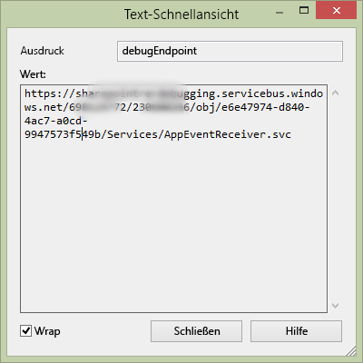

# <a name="handle-list-item-events-in-the-provider-hosted-add-in"></a>Verarbeiten von Listenelementereignissen im vom Anbieter gehosteten Add-In

Dies ist der zehnte in einer Reihe von Artikeln über die Grundlagen der Entwicklung von vom Anbieter gehosteten SharePoint-Add-Ins. Sie sollten sich zuerst mit [SharePoint Add-Ins](sharepoint-add-ins.md) und den vorherigen Artikeln in dieser Reihe vertraut machen:

-  [Erste Schritte beim Erstellen von von einem Anbieter gehosteten SharePoint-Add-Ins](get-started-creating-provider-hosted-sharepoint-add-ins.md)
-  [Übertragen des SharePoint-Aussehens und -Verhaltens auf Ihr vom Anbieter gehostetes Add-In](give-your-provider-hosted-add-in-the-sharepoint-look-and-feel.md)
-  [Einfügen einer benutzerdefinierten Schaltfläche in das vom Anbieter gehostete Add-In](include-a-custom-button-in-the-provider-hosted-add-in.md)
-  [Schnelle Übersicht über das SharePoint-Objektmodell](get-a-quick-overview-of-the-sharepoint-object-model.md)
-  [Hinzufügen von SharePoint-Schreibvorgängen zum vom Anbieter gehosteten Add-In](add-sharepoint-write-operations-to-the-provider-hosted-add-in.md)
-  [Einfügen eines Add-In-Webparts in das vom Anbieter gehostete Add-In](include-an-add-in-part-in-the-provider-hosted-add-in.md)
-  [Verarbeiten von Add-In-Ereignissen im vom Anbieter gehosteten Add-In](handle-add-in-events-in-the-provider-hosted-add-in.md)
-  [Hinzufügen der Logik für die erste Ausführung zum vom Anbieter gehosteten Add-In](add-first-run-logic-to-the-provider-hosted-add-in.md)
-  [Programmgesteuertes Bereitstellen einer benutzerdefinierten Schaltfläche in anbietergehosteten Add-Ins](programmatically-deploy-a-custom-button-in-the-provider-hosted-add-in.md)

> [!NOTE]
> Wenn Sie unsere Artikelreihe zum Thema anbietergehostete Add-Ins durchgearbeitet haben, haben Sie bereits eine Visual Studio-Lösung, die Sie für diesen Artikel verwenden können. Sie können auch das Repository unter [SharePoint_Provider-hosted_Add-Ins_Tutorials](https://github.com/OfficeDev/SharePoint_Provider-hosted_Add-ins_Tutorials) herunterladen und die Datei BeforeRER.sln öffnen.

In einem vorherigen Artikel dieser Reihe haben Sie gesehen, dass ein Auftrag bei der Auftragserteilung zur **Aufträge**-Tabelle der Unternehmensdatenbank und ein Element für diesen Auftrag automatisch zu der **Erwartete Lieferungen**-Liste hinzugefügt wird. Wenn die Lieferung im lokalen Geschäft eintrifft, setzt ein Benutzer die Spalte **Angekommen** auf **Ja**. Das Ändern eines Feldwerts für ein Element erstellt ein Element aktualisiert-Ereignis, für das Sie einen benutzerdefinierten Handler hinzufügen können. 

In diesem Artikel erstellen Sie einen Handler für dieses Listenelement-Ereignis und stellen es dann programmgesteuert in der ersten Ausführungslogik des SharePoint-Add-Ins bereit. Ihr Handler fügt das Element zur **Bestand**-Tabelle der Unternehmensdatenbank hinzu. Dann wird die **Zum Bestand hinzugefügt**-Spalte der **Erwartete Lieferungen**-Liste auf **Ja** gesetzt. Sie erfahren auch, wie Sie das zweite Elementaktualisierungsereignis vermeiden, indem Sie eine unbegrenzte Serie Elementaktualisierungsereignisse auslösen.

## <a name="programmatically-deploy-the-expected-shipments-list"></a>Programmgesteuertes Bereitstellen der Liste „Erwartete Lieferungen“

> [!NOTE]
> Die Einstellungen für Startprojekte in Visual Studio werden in der Regel nach jedem erneuten Öffnen der Lösung wieder auf die Standardwerte zurückgesetzt. Wann immer Sie beim Durcharbeiten dieser Artikelreihe die Beispiellösung erneut öffnen, müssen Sie umgehend die folgenden Schritte durchführen: 
> 1. Klicken Sie oben im **Projektmappen-Explorer** mit der rechten Maustaste auf den Lösungsknoten, und wählen Sie die Option **Startprojekte festlegen** aus.  
> 2. Stellen Sie sicher, dass alle drei Projekte in der Spalte **Aktion** auf **Start** festgelegt sind.

1. Öffnen Sie im **Projektmappen-Explorer** die Datei Utilities\SharePointComponentDeployer.cs im Projekt **ChainStoreWeb**. Fügen Sie der Klasse `SharePointComponentDeployer` die folgende Methode hinzu: 

     ```C#
      private static void CreateExpectedShipmentsList()
     {
        using (var clientContext = sPContext.CreateUserClientContextForSPHost())
        {
        var query = from list in clientContext.Web.Lists
                where list.Title == "Expected Shipments"
                select list;
        IEnumerable<List> matchingLists = clientContext.LoadQuery(query);
        clientContext.ExecuteQuery();

        if (matchingLists.Count() == 0)
        {
            ListCreationInformation listInfo = new ListCreationInformation();
            listInfo.Title = "Expected Shipments";
            listInfo.TemplateType = (int)ListTemplateType.GenericList;
            listInfo.Url = "Lists/ExpectedShipments";
            List expectedShipmentsList = clientContext.Web.Lists.Add(listInfo);

            Field field = expectedShipmentsList.Fields.GetByInternalNameOrTitle("Title");
            field.Title = "Product";
            field.Update();

            expectedShipmentsList.Fields.AddFieldAsXml("<Field DisplayName='Supplier'" 
                                    + " Type='Text' />", 
                                    true,
                                    AddFieldOptions.DefaultValue);
            expectedShipmentsList.Fields.AddFieldAsXml("<Field DisplayName='Quantity'" 
                                    + " Type='Number'" 
                                    + " Required='TRUE' >" 
                                    + "<Default>1</Default></Field>",
                                    true, 
                                    AddFieldOptions.DefaultValue);
            expectedShipmentsList.Fields.AddFieldAsXml("<Field DisplayName='Arrived'" 
                                   + " Type='Boolean'"
                                   + " ShowInNewForm='FALSE'>"
                                   + "<Default>FALSE</Default></Field>",
                                    true, 
                                    AddFieldOptions.DefaultValue);
            expectedShipmentsList.Fields.AddFieldAsXml("<Field DisplayName='Added to Inventory'" 
                                    + " Type='Boolean'" 
                                    + " ShowInNewForm='FALSE'>"
                                    + "<Default>FALSE</Default></Field>", 
                                    true, 
                                    AddFieldOptions.DefaultValue);

            clientContext.ExecuteQuery();
        }
         }
     }
     ```

    Der Code fügt nur Funktionen hinzu, die Sie bereits in vorherigen Artikeln dieser Reihe kennengelernt haben, beachten Sie jedoch Folgendes:
   
    - Das Attribut **Required** des Felds **Menge** wird auf **TRUE** festgelegt, sodass das Feld immer einen Wert enthalten muss. Der Standardwert wird dann auf 1 festgelegt.
   
    - Die Felder **Angekommen** und **Zum Bestand hinzugefügt** sind im Formular für ein neues Element ausgeblendet.
   
    - Idealerweise wäre das Feld **Zum Bestand hinzugefügt** auch auf dem Formular Element bearbeiten ausgeblendet, da es nur in **Ja** geändert werden sollte, wenn der aktualisierte Ereignishandler das Element zum ersten Mal zu der Tabelle **Bestand** hinzufügt. Aus technischen Gründen, die wir in einem späteren Schritt erläutern möchten, muss ein Feld im Formular Element bearbeiten angezeigt werden, wenn es in einem Elementaktualisierungsereignis-Handler programmgesteuert ausgefüllt werden soll.


2. Fügen Sie in der Methode **DeployChainStoreComponentsToHostWeb** die folgende Zeile direkt über der Zeile `RemoteTenantVersion = localTenantVersion` ein.
    
    ```C#
      CreateExpectedShipmentsList();
    ```

## <a name="create-the-list-item-event-receiver"></a>Erstellen des Listenelement-Ereignisempfängers

> [!NOTE]
> Wenn Sie diese Reihe von Artikeln durchgearbeitet haben, haben Sie bereits Ihre Entwicklungsumgebung für das Debuggen von Remote-Ereignisempfängern konfiguriert. Falls dies nicht der Fall ist, lesen Sie bitte [Konfigurieren der Lösung für das Debuggen des Ereignisempfängers](handle-add-in-events-in-the-provider-hosted-add-in.md#RERDebug), bevor Sie mit diesem Thema fortfahren.

Die Office Developer Tools für Visual Studio enthalten eine **Remote-Ereignisempfänger**-Element, das zu einer SharePoint-Add-In-Lösung hinzugefügt werden kann. Als dieser Artikel geschrieben wurde, nahm dieses Element jedoch an, dass sich die Liste (mit der der Empfänger registriert wird) im Add-In-Web befindet, und daher erstellen die Tools ein Add-In-Web mit einigen SharePoint-Artefakten. Der Empfänger für das Chain Store-Add-In wird (in einem späteren Schritt) mit der Liste **Erwartete Lieferungen** im Hostweb registriert, sodass das Add-In kein Add-In-Web benötigt. (Eine Auffrischung zur Unterscheidung zwischen Add-In-Webs und Hostwebs finden Sie unter [SharePoint-Add-Ins](sharepoint-add-ins.md).)
 
> [!NOTE]
> Listen- und Listenelement-Ereignisempfänger heißen Remoteereignisempfänger (RER), da sich ihr Code remote von SharePoint in der Cloud oder auf einem lokalen Server außerhalb der SharePoint-Farm befindet. Allerdings befinden sich die Ereignisse, die diese auslösen, in SharePoint.

1. Klicken Sie im **Projektmappen-Explorer** mit der rechten Maustaste auf den Ordner **Dienste** im Projekt **ChainStoreWeb**, und wählen Sie **Hinzufügen** > **WCF-Dienst Service** aus.

2. Wenn Sie aufgefordert werden, nennen Sie den Dienst **RemoteEventReceiver1**, und wählen Sie dann **OK**. 

3. Die Tools erstellen eine Schnittstellendatei, eine \*.svc-Datei und eine CodeBehind-Datei. Die Benutzeroberflächendatei IRemoteEventReceiver1.cs ist nicht erforderlich und kann gelöscht werden. (Möglicherweise wurde sie von den Tools automatisch geöffnet, falls dies der Fall ist, schließen und löschen Sie sie.)
    
   > [!NOTE]
   > Beim Erstellen des Add-In-Ereignisempfängers für die installierten und deinstallierten Ereignisse in einem früheren Artikel dieser Reihe wurden die URLs von den Office Developer Tools für Visual Studio zu der Manifestdatei hinzugefügt. Listen- und Listenelement-Ereignisempfänger werden nicht im App-Manifest registriert. Stattdessen werden sie (bei einem vom Anbieter gehosteten Add-in) programmgesteuert registriert. Dies wird in einem späteren Schritt behandelt.

4. Öffnen Sie die CodeBehind-Datei RemoteEventReceiver1.svc.cs. Ersetzen Sie den gesamten Inhalt durch den folgenden Code. 

    ```C#
      using System;
    using System.Collections.Generic;
    using Microsoft.SharePoint.Client;
    using Microsoft.SharePoint.Client.EventReceivers;
    using System.Data.SqlClient;
    using System.Data;
    using ChainStoreWeb.Utilities;

    namespace ChainStoreWeb.Services
    {
        public class RemoteEventReceiver1 : IRemoteEventService
        {
        /// <summary>
        /// Handles events that occur before an action occurs, 
        /// such as when a user is adding or deleting a list item.
        /// </summary>
        /// <param name="properties">Holds information about the remote event.</param>
        /// <returns>Holds information returned from the remote event.</returns>
        public SPRemoteEventResult ProcessEvent(SPRemoteEventProperties properties)
        {
            throw new NotImplementedException();
        }

        /// <summary>
        /// Handles events that occur after an action occurs, 
        /// such as after a user adds an item to a list or deletes an item from a list.
        /// </summary>
        /// <param name="properties">Holds information about the remote event.</param>
        public void ProcessOneWayEvent(SPRemoteEventProperties properties)
        {

        }
        }
    }
    ```

   Beachten Sie Folgendes zu diesem Code:
    
   - Die Schnittstelle `IRemoteEventService` ist im Namespace **Microsoft.SharePoint.Client.EventReceivers** definiert.
    
   - Im ChainStore-Add-In werden keine „Bevor“-Ereignisse verarbeitet, aber die Methode **ProcessEvent** ist für die Schnittstelle `IRemoteEventService` erforderlich.

5. Fügen Sie den folgenden Code zur **ProcessOneWayEvent**-Methode hinzu. Beachten Sie, dass das **ItemUpdated**-Ereignis das einzige ist, das in diesem Beispiel behandelt wird, daher hätten wir eine einfache **Wenn**-Struktur anstelle einer **Wechseln**-Struktur verwenden können. Aber Ereignisempfänger verarbeiten in der Regel mehrere Ereignisse, daher möchten wir die Vorgehensweise zeigen, die Sie als SharePoint-Add-In-Entwickler am häufigsten in Ihren Ereignishandlern verwenden werden.
    
    ```C#
      switch (properties.EventType)
    {
        case SPRemoteEventType.ItemUpdated:

        // TODO12: Handle the item updated event.

        break;
    }  
    ```

6. Ersetzen Sie `TODO12` durch den folgenden Code. Auch hier verwenden wir eine **switch**-Struktur, obwohl eine einfache **if**-Struktur ausreichend wäre, da Sie das typische Muster in SharePoint-Ereignisempfängern sehen sollen.
    
    ```C#
      switch (properties.ItemEventProperties.ListTitle)
    {
        case "Expected Shipments":

        // TODO13: Handle the arrival of a shipment.

        break;
    }
    ```

7. Der Code, der auf den Eingang einer Lieferung reagiert, sollten zwei Aufgaben ausführen:
    
   - Hinzufügen des Elements, das im Geschäft eingetroffen ist, zum Unternehmensbestand
    
   - Setzen Sie das **Zum Bestand hinzugefügt**-Feld der **Erwartete Lieferungen**-Liste auf **Ja**. Dies geschieht normalerweise nur, wenn das Element erfolgreich zum Bestand hinzugefügt wurde.
    
   Fügen Sie den folgenden Code anstelle von `TODO13` hinzu. Die beiden Methoden `TryUpdateInventory` und `RecordInventoryUpdateLocally` werden in späteren Schritten erstellt.

    ```C#
      bool updateComplete = TryUpdateInventory(properties);
    if (updateComplete)
    {
        RecordInventoryUpdateLocally(properties);
    }
    ```


8. Die **ProcessOneWayEvent**-Methode sollte jetzt wie folgt aussehen:

    ```C#
      public void ProcessOneWayEvent(SPRemoteEventProperties properties)
    {
        switch (properties.EventType)
        {
        case SPRemoteEventType.ItemUpdated:

            switch (properties.ItemEventProperties.ListTitle)
            {
            case "Expected Shipments":
                bool updateComplete = UpdateInventory(properties);
                if (updateComplete)
                {
                RecordInventoryUpdateLocally(properties);
                }
                break;
            }
            break;
        }          
    }
    ```

9. Fügen Sie der Klasse `RemoteEventReceiver1` die unten aufgeführte Methode hinzu.
    
    ```C#
      private bool TryUpdateInventory(SPRemoteEventProperties properties)
    {
        bool successFlag = false;

        // TODO14: Test whether the list item is changing because the product has arrived
        // or for some other reason. If the former, add it to the inventory and set the success flag
        // to true.     

        return successFlag;
    }
    ```

10. Es gibt fünf Spalten in der **Lieferung erwartet**-Liste, aber bei den meisten Arten der Updates möchten wir nicht, dass der Handler reagiert. Wenn ein Benutzer z.B. die Schreibweise des Namens eines Lieferanten korrigiert, wird das Elementaktualisierungsereignis ausgelöst, aber unser Handler sollte nicht reagieren. Der Handler sollte nur reagieren, wenn das **Angekommen**-Feld auf **Ja** gesetzt wurde. 
    
    Es gibt eine weitere Bedingung, die getestet werden muss. Nehmen wir einmal an, **Angekommen** wurde auf **Ja** festgelegt und das Produkt im Element wird zum Bestand hinzugefügt (und **Zum Bestand hinzugefügt** ist auf **Ja**) festgelegt. Später ändert ein Benutzer jedoch versehentlich das **Angekommen**-Feld einer Lieferung zurück auf **Nein**. Später behebt er den Fehler, indem er es erneut auf **Angekommen** setzt. Sowohl der Fehler als auch die Korrektur lösen das Elementaktualisierungsereignis aus. Der Handler reagiert nicht auf den Fehler, da er nur reagiert, wenn **Angekommen** auf **Ja** festgelegt ist, aber er reagiert auf die Korrektur, bei der **Angekommen** zurück auf **Ja** gesetzt wird, sodass das gleiche Produkt und die gleiche Menge ein zweites Mal zum Bestand hinzugefügt würden. Aus diesem Grund sollte der Handler nur reagieren, wenn der Wert **Zum Bestand hinzugefügt** auf **Nein** festgelegt ist. 
    
    Daher muss der Handler wissen, welche Werte diese Felder besitzen, nachdem der Benutzer das Element aktualisiert hat. Das **SPRemoteEventProperties**-Objekt verfügt über die **ItemEventProperties**-Eigenschaft. Es enthält aber auch eine indizierte **AfterProperties**-Eigenschaft mit den Werten der Felder des aktualisierten Elements. Der folgende Code verwendet diese Eigenschaften, um zu testen, ob der Handler reagieren soll. Setzen Sie dies an die Stelle von `TODO14`.

     ```C#
      var arrived = Convert.ToBoolean(properties.ItemEventProperties.AfterProperties["Arrived"]);
    var addedToInventory = Convert.ToBoolean(properties.ItemEventProperties.AfterProperties["Added_x0020_to_x0020_Inventory"]);

    if (arrived &amp;&amp; !addedToInventory)
    {

        // TODO15: Add the item to inventory

        successFlag = true;
    }
     ```

11. Ersetzen Sie `TODO15` durch den folgenden Code. 

     ```C#
      using (SqlConnection conn = SQLAzureUtilities.GetActiveSqlConnection())
    using (SqlCommand cmd = conn.CreateCommand())
    {
        conn.Open();
        cmd.CommandText = "UpdateInventory";
        cmd.CommandType = CommandType.StoredProcedure;
        SqlParameter tenant = cmd.Parameters.Add("@Tenant", SqlDbType.NVarChar);
        tenant.Value = properties.ItemEventProperties.WebUrl + "/";
        SqlParameter product = cmd.Parameters.Add("@ItemName", SqlDbType.NVarChar, 50);
        product.Value = properties.ItemEventProperties.AfterProperties["Title"]; // not "Product"
        SqlParameter quantity = cmd.Parameters.Add("@Quantity", SqlDbType.SmallInt);
        quantity.Value = Convert.ToUInt16(properties.ItemEventProperties.AfterProperties["Quantity"]);
        cmd.ExecuteNonQuery();
    }
     ```

    Da es sich hierbei hauptsächlich um SQL- und ASP.NET-Programmierung handelt, werden wir nicht näher darauf eingehen, aber beachten Sie Folgendes:
    
    - Wir verwenden die Eigenschaft **ItemEventProperties.WebUrl**, um den Mandantennamen abzurufen, der der Hostweb-URL entspricht.

    - Wir verwenden erneut **AfterProperties**, um die Werte für Produktname und Menge abzurufen.
    
    - Wir bezeichnen das Produktnamensfeld als „Titel“, obwohl der Anzeigename auf „Produkt“ geändert wurde (in der Methode **CreateExpectedShipmentsList**), da auf Felder immer mit den internen Namen verwiesen wird.
 

12. Wir sind noch nicht mit der **TryUpdateInventory**-Methode fertig, aber an diesem Punkt sollte sie wie folgt aussehen.
    
     ```C#
      private bool TryUpdateInventory(SPRemoteEventProperties properties)
    {
        bool successFlag = false;

        var arrived = Convert.ToBoolean(properties.ItemEventProperties.AfterProperties["Arrived"]);
        var addedToInventory = Convert.ToBoolean(properties.ItemEventProperties.AfterProperties["Added_x0020_to_x0020_Inventory"]);

        if (arrived &amp;&amp; !addedToInventory)
        {
        using (SqlConnection conn = SQLAzureUtilities.GetActiveSqlConnection())
        using (SqlCommand cmd = conn.CreateCommand())
        {
            conn.Open();
            cmd.CommandText = "UpdateInventory";
            cmd.CommandType = CommandType.StoredProcedure;
            SqlParameter tenant = cmd.Parameters.Add("@Tenant", SqlDbType.NVarChar);
            tenant.Value = properties.ItemEventProperties.WebUrl + "/";
            SqlParameter product = cmd.Parameters.Add("@ItemName", SqlDbType.NVarChar, 50);
            product.Value = properties.ItemEventProperties.AfterProperties["Title"]; // not "Product"
            SqlParameter quantity = cmd.Parameters.Add("@Quantity", SqlDbType.SmallInt);
            quantity.Value = Convert.ToUInt16(properties.ItemEventProperties.AfterProperties["Quantity"]);
            cmd.ExecuteNonQuery();
        }            
        successFlag = true;
        }  
        return successFlag;
    }
     ```

13. Wenn die **TryUpdateInventory**-Methode **true** zurückgibt, ruft der Handler eine Methode (noch nicht geschrieben) auf, die das gleiche Element in der **Lieferung erwartet**-Liste aktualisiert, indem das Feld **Zum Bestand hinzugefügt** auf **Ja** gesetzt wird. Dies ist wiederum ein Elementaktualisierungsereignis, sodass der Handler erneut aufgerufen wird. (Die Tatsache, dass das **Zum Bestand hinzugefügt**-Feld nun auf **Ja** gesetzt ist, verhindert, dass der Handler die gleiche Lieferung ein zweites Mal zum Bestand hinzufügt, aber der Handler wird trotzdem aufgerufen.) 
    
    SharePoint verhält sich ein wenig anders, wenn das Ereignis für aktualisierte Elemente durch eine programmgesteuerte Aktualisierung ausgelöst wird: *Es schließt nur die Felder in __AfterProperties__ ein, die bei der Aktualisierung geändert wurden.* Das heißt, dass das Feld **Angekommen** nicht vorhanden ist, da nur das Feld **Zum Bestand hinzugefügt** geändert wurde. 
    
     Die Zeile –
    
    `var arrived = Convert.ToBoolean(properties.ItemEventProperties.AfterProperties["Arrived"]);`
    
    löst eine **KeyNotFoundException** aus. 
    
    Es gibt mehre Möglichkeiten dieses Problem  zu beheben. In diesem Beispiel fangen wir die Ausnahme ab und verwenden den **catch**-Block, um sicherzustellen, dass `successFlag` auf **false** festgelegt ist. Auf diese Weise wird sichergestellt, dass das Element nicht ein drittes Mal aktualisiert wird.
    
    Platzieren Sie alles, was sich in der Methode zwischen der ersten Zeile, `bool successFlag = false;`, und der letzten Zeile, `return successFlag;`, befindet, in einem **try**-Block.
    
14. Fügen Sie den folgenden **catch**-Block direkt unterhalb des **try**-Blocks hinzu.
    
     ```C#
      catch (KeyNotFoundException)
    {
        successFlag = false;
    }
     ```

    > [!NOTE]
    > Die **KeyNotFoundException** ist auch ein Grund dafür, dass das **Zum Bestand hinzugefügt**-Feld im Formular Element bearbeiten angezeigt werden muss. SharePoint bezieht keine Felder mit ein, die im Formular Element bearbeiten in **AfterProperties** ausgeblendet sind.

15. Die gesamte Methode sollte jetzt wie folgt aussehen.

     ```C#
      private bool TryUpdateInventory(SPRemoteEventProperties properties)
    {
        bool successFlag = false;

        try 
        {
        var arrived = Convert.ToBoolean(properties.ItemEventProperties.AfterProperties["Arrived"]);
        var addedToInventory = Convert.ToBoolean(properties.ItemEventProperties.AfterProperties["Added_x0020_to_x0020_Inventory"]);

        if (arrived &amp;&amp; !addedToInventory)
        {
            using (SqlConnection conn = SQLAzureUtilities.GetActiveSqlConnection())
            using (SqlCommand cmd = conn.CreateCommand())
            {
            conn.Open();
            cmd.CommandText = "UpdateInventory";
            cmd.CommandType = CommandType.StoredProcedure;
            SqlParameter tenant = cmd.Parameters.Add("@Tenant", SqlDbType.NVarChar);
            tenant.Value = properties.ItemEventProperties.WebUrl + "/";
            SqlParameter product = cmd.Parameters.Add("@ItemName", SqlDbType.NVarChar, 50);
            product.Value = properties.ItemEventProperties.AfterProperties["Title"]; // not "Product"
            SqlParameter quantity = cmd.Parameters.Add("@Quantity", SqlDbType.SmallInt);
            quantity.Value = Convert.ToUInt16(properties.ItemEventProperties.AfterProperties["Quantity"]);
            cmd.ExecuteNonQuery();
            }            
            successFlag = true;
        }  
        }
        catch (KeyNotFoundException)
        {
        successFlag = false;
        }
        return successFlag;
    }
     ```

16. Fügen Sie der Klasse `RemoteEventReceiver1` die unten aufgeführte Methode hinzu. 

     ```C#
      private void RecordInventoryUpdateLocally(SPRemoteEventProperties properties)
    {
        using (ClientContext clientContext = TokenHelper.CreateRemoteEventReceiverClientContext(properties))
        {
        List expectedShipmentslist = clientContext.Web.Lists.GetByTitle(properties.ItemEventProperties.ListTitle);
        ListItem arrivedItem = expectedShipmentslist.GetItemById(properties.ItemEventProperties.ListItemId);
        arrivedItem["Added_x0020_to_x0020_Inventory"] = true;
        arrivedItem.Update();
        clientContext.ExecuteQuery();
        }
    }
     ```

    Bis hierhin ist das Codemuster aus früheren Artikeln dieser Reihe bekannt. Beachten Sie jedoch einen Unterschied:
    
    - Der Code erhält das **ClientContext**- Objekt durch Aufrufen der **TokenHelper.CreateRemoteEventReceiverClientContext**-Methode anstelle der ** SharePointContext.CreateUserClientContextForSPHost**-Methode, wie wir sie für den Code verwendet haben, der SharePoint über Seiten abgerufen hat, wie beispielsweise die Seite "EmployeeAdder". 
    
    - Der Hauptgrund für die beiden verschiedenen Methoden zum Abrufen eines **ClientContext**-Objekts ist, dass SharePoint die für die Erstellung eines solchen Objekts benötigten Informationen anders zu Ereignisempfängern weiterleitet als wenn SharePoint diese Informationen an Seiten übergibt. Für Ereignisempfänger gibt SharePoint ein **SPRemoteEventProperties**-Objekt weiter, aber für Seiten übergibt SharePoint ein spezielles Feld, das als Kontexttoken bezeichnet wird, in den Textkörper der Anforderung, die die Add-In-Seite startet.

17. Speichern und schließen Sie die Datei mit dem Empfängercode.
    
## <a name="register-the-receiver"></a>Registrieren des Empfängers

Die letzte Aufgabe besteht darin, SharePoint mitzuteilen, dass wir einen benutzerdefinierten Empfänger haben, den SharePoint immer dann aufrufen soll, wenn ein Element in der Liste **Erwartete Lieferungen** aktualisiert wird.

1. Öffnen Sie die Datei „SharePointComponentDeployer.cs“ und fügen Sie die folgende Zeile zur Methode **DeployChainStoreComponentsToHostWeb** hinzu, und zwar direkt unterhalb der Zeile, die die **Erwartete Lieferungen**-Liste erstellt (wir fügen diese Methode im nächsten Schritt hinzu). Beachten Sie, dass wir die Methode an das **HttpRequest**-Objekt übergeben, das die Add-In-Startseite an die Methode **DeployChainStoreComponentsToHostWeb** übergeben hat.
    
    ```C#
      RegisterExpectedShipmentsEventHandler(request);
    ```

2. Fügen Sie der Klasse `SharePointComponentDeployer` die folgende Methode hinzu.
    
    ```C#
      private static void RegisterExpectedShipmentsEventHandler(HttpRequest request)
    {
        using (var clientContext = sPContext.CreateUserClientContextForSPHost())    
        {
        var query = from list in clientContext.Web.Lists
                where list.Title == "Expected Shipments"
                select list;
        IEnumerable<List> matchingLists = clientContext.LoadQuery(query);
        clientContext.ExecuteQuery();

        List expectedShipmentsList = matchingLists.Single();

        // TODO16: Add the event receiver to the list's collection of event receivers.       

        clientContext.ExecuteQuery();
        }
    }
    ```

3. Ersetzen Sie `TODO16` durch die folgenden Zeilen. Beachten Sie, dass es eine einfache **CreationInformation**-Klasse für Ereignisempfänger ebenso wie für Listen und Listenelemente gibt.
    
    ```C#
    EventReceiverDefinitionCreationInformation receiver = new EventReceiverDefinitionCreationInformation();
    receiver.ReceiverName = "ExpectedShipmentsItemUpdated";
    receiver.EventType = EventReceiverType.ItemUpdated;

     // TODO17: Set the URL of the receiver.

    expectedShipmentsList.EventReceivers.Add(receiver);

    ```

4. Jetzt müssen Sie SharePoint die URL des Ereignisempfängers mitteilen. In der Produktion befindet sie sich in der gleichen Domäne wie die Remote-Seiten. Der Pfad lautet /Services/RemoteEventReceiver1.svc. Da der Handler in der ersten Ausführungslogik über die Add-In-Startseite registriert wird, befindet sich die Domäne im Hostheader des **HttpRequest**-Objekts der Anforderung, die die Seite aufgerufen hat. Unser Code hat dieses Objekt von der Seite an die **DeployChainStoreComponentsToHostWeb**-Methode übergeben, die es wiederum an die **RegisterExpectedShipmentsEventHandler**-Methode weitergegeben hat. Daher können wir die Empfänger-URL mit dem folgenden Code angeben.
    
    `receiver.ReceiverUrl = "https://" + request.Headers["Host"] + "/Services/RemoteEventReceiver1.svc";`
    
   Dies funktioniert leider nicht, wenn Sie das Add-In in Visual Studio debuggen. Beim Debuggen wird der Empfänger in der Azure Service Bus gehostet und nicht in der Localhost-URL, in der die Remote-Seiten gehostet werden. Je nachdem, ob wir debuggen oder nicht, müssen wir unterschiedliche URLs für den Empfänger festlegen. Ersetzen Sie also `TODO17` durch die folgende Struktur, die C#-Compiler-Richtlinien verwendet. Beachten Sie, dass die URL des Empfängers im Debugmodus von der Einstellung web.config gelesen wird (diese Einstellung wird in einem späteren Schritt erstellt). 

    ```C#
      #if DEBUG
                receiver.ReceiverUrl = WebConfigurationManager.AppSettings["RERdebuggingServiceBusUrl"].ToString();
    #else
                receiver.ReceiverUrl = "https://" + request.Headers["Host"] + "/Services/RemoteEventReceiver1.svc"; 
    #endif

    ```


5. Die gesamte **RegisterExpectedShipmentsEventHandler**-Methode sollte jetzt wie folgt aussehen.
    
    ```C#
      private static void RegisterExpectedShipmentsEventHandler(HttpRequest request)
    {    
        using (var clientContext = sPContext.CreateUserClientContextForSPHost())
        {
        var query = from list in clientContext.Web.Lists
                    where list.Title == "Expected Shipments"
                    select list;
        IEnumerable<List> matchingLists = clientContext.LoadQuery(query);
        clientContext.ExecuteQuery();

        List expectedShipmentsList = matchingLists.Single();

        EventReceiverDefinitionCreationInformation receiver = new EventReceiverDefinitionCreationInformation();
        receiver.ReceiverName = "ExpectedShipmentsItemUpdated";
        receiver.EventType = EventReceiverType.ItemUpdated;

    #if DEBUG
        receiver.ReceiverUrl = WebConfigurationManager.AppSettings["RERdebuggingServiceBusUrl"].ToString();
    #else
        receiver.ReceiverUrl = "https://" + request.Headers["Host"] + "/Services/RemoteEventReceiver1.svc"; 
    #endif
        expectedShipmentsList.EventReceivers.Add(receiver);
        clientContext.ExecuteQuery();
        }
    }
    ```

6. Fügen Sie die folgenden **using**-Anweisung an den Anfang der Datei hinzu.
    
    ```C#
      using System.Web.Configuration;
    ```

7. Um sicherzustellen, dass `DEBUG` dann und nur dann „true“ ist, wenn das Add-In gedebuggt wird, führen Sie die folgende Unterprozedur aus:
    
   1. Klicken Sie im **Projektmappen-Explorer** mit der rechten Maustaste auf das Projekt **ChainStoreWeb **, und wählen Sie **Eigenschaften** aus.
   
   2. Öffnen Sie die Registerkarte **Build** der **Eigenschaften**, und wählen Sie dann **Debuggen** in der Dropdownliste **Konfiguration** im oberen Bereich aus.
   
   3. Stellen Sie sicher, dass das **DEBUG-Konstante definieren**-Kontrollkästchen aktiviert ist (in der Regel ist es standardmäßig aktiviert). Im folgenden Screenshot ist die korrekte Einstellung abgebildet.

      *Abbildung 1. Erstellen einer untergeordneten Registerkarte der Registerkarte „Eigenschaften“ in Visual Studio*

      

   4. Ändern Sie die Auswahl in der Dropdownliste **Konfiguration** in **Version**, und stellen Sie sicher, dass das Kontrollkästchen **DEBUG-Konstante definieren** *nicht* aktiviert ist. (Das ist normalerweise standardmäßig nicht der Fall.) Im folgenden Screenshot ist die korrekte Einstellung abgebildet.
  
      *Abbildung 2. Erstellen einer untergeordneten Registerkarte der Registerkarte „Eigenschaften“ mit deaktiviertem Kontrollkästchen*

      

   5. Wenn Sie Änderungen vorgenommen haben, speichern Sie diese, und schließen Sie dann die Registerkarte **Eigenschaften**.
    
 
8. Öffnen Sie die Datei „web.config“, und fügen Sie das folgende Markup als untergeordnetes Element des Elements **appSettings** hinzu. (Der Wert der Einstellung wird im nächsten Abschnitt abgerufen.)
    
    ```XML
      <add key="RERdebuggingServiceBusUrl" value="" />
    ```

## <a name="get-the-receiver-url-for-debugging"></a>Abrufen der Empfänger-URL für das Debuggen

Das Add-In-Ereignis und die Listenelement-Ereignisempfänger sind Windows Communication Service (WCF)-Dienste, und jeder WCF-Dienst kennt seinen eigenen Endpunkt und speichert ihn an mehreren Orten, einschließlich des ** System.ServiceModel.OperationContext.Current.Channel.LocalAddress.Uri**-Objekts. 

Beim Debuggen wird der Add-In-Empfänger auf einem Azure Service Bus-Endpunkt gehostet, der nahezu identisch mit dem Endpunkt für den Listenelement-Empfänger ist. Der Unterschied besteht darin, dass die URL des Add-In-Endpunkts auf „AppEventReceiver.svc“ endet, aber die URL des Listenelement-Empfängers auf „RemoteEventReceiver1.svc“. Daher können wir die URL des Endpunkts des Add-In-Empfänger verwenden, ein paar Änderungen am Ende vornehmen und sie dann als Wert für die Einstellung **RERdebuggingServiceBusUrl** verwenden.

1. Öffnen Sie die Datei „AppEventReceiver.svc.cs“ im Ordner **Dienste** des Projekts **ChainStoreWeb**.

2. Fügen Sie Folgendes als erste Zeile in der Methode **ProcessEvent** hinzu.
    
    ```C#
      string debugEndpoint = System.ServiceModel.OperationContext.Current.Channel.LocalAddress.Uri.ToString(); 
    ```

3. Fügen Sie einen Haltepunkt zur nächsten Zeile der Methode hinzu.

4. Wählen Sie F5, um das Add-In zu debuggen. Da „web.config“ geöffnet ist und Office Developer Tools für Visual Studio jedes Mal eine Einstellung darin ändert, wenn Sie F5 wählen, werden Sie aufgefordert, die Datei neu zu laden. Wählen Sie **Ja**. 

5. Wenn der Haltepunkt erreicht ist, bewegen Sie den Cursor über die `debugEndpoint`-Variable. Wenn der Visual Studio-Datentipp angezeigt wird, wählen Sie den Pfeil nach unten, und wählen Sie dann **Text-Schnellansicht**.
  
   *Abbildung 3. Eine Textschnellansicht in Visual Studio mit einer Azure Service Bus-URL*

   

6. Kopieren Sie den Zeichenfolgenwert aus der Schnellansicht, und fügen Sie ihn an einer beliebigen anderen Stelle ein.

7. Schließen Sie die Schnellansicht, und beenden Sie das Debuggen in Visual Studio.

8. Löschen Sie die Zeile, die Sie im zweiten Schritt dieses Verfahrens hinzugefügt haben, oder kommentieren Sie sie aus, und löschen Sie auch den Haltepunkt.

9. Ersetzen Sie in der kopierten Zeichenfolge das „AppEventReceiver.svc“ am Ende durch „RemoteEventReceiver1.svc“.

10. Kopieren Sie die geänderte URL und fügen Sie sie als Wert für den Schlüssel **RERdebuggingServiceBusUrl** in der web.config-Datei ein.

> [!NOTE]
> Das manuelle Kopieren und Einfügen der Servicebus-URL (einer modifizierten Version davon) in die web.config-Datei ist nicht die einzige Möglichkeit für den Umgang mit der Notwendigkeit einer anderen URL beim Debuggen eines Remoteereignisempfängers, wenn dieser in der Produktion ausgeführt wird. Wir könnten den Wert von **System.ServiceModel.OperationContext.Current.Channel.LocalAddress.Uri** programmgesteuert an einer beliebigen Stelle in SharePoint oder der Remotedatenbank speichern und ihn dann vom zuerst ausgeführten Code lesen und der Eigenschaft `receiver.ReceiverUrl` zuweisen lassen. Wir könnten den Listenelement-Ereignisempfänger als Teil des im Add-In installierten Ereignishandlers registrieren. Dann könnten wir programmgesteuert **System.ServiceModel.OperationContext.Current.Channel.LocalAddress.Uri** ohne zu speichern lesen, ändern und `receiver.ReceiverUrl` zuweisen. 
>
> Diese Vorgehensweise erfordert, dass die **Erwartete Lieferungen**-Liste ebenfalls in dem im Add-In installierten Ereignishandler erstellt wird, da sie vorhanden sein muss, bevor der Handler damit registriert werden kann. 
>
> Beachten Sie auch, dass wir den Add-In-Ereignisempfänger und den Listenelement-Ereignisempfänger in einem einzigen Empfänger kombinieren könnten (d. h. in den gleichen .svc- und .svc-cs-Dateien). In diesem Fall ist erst eine Änderung der URL erforderlich, wenn sie als Wert `receiver.ReceiverUrl` verwendet wird.

## <a name="run-the-add-in-and-test-the-list-item-receiver"></a>Ausführen des Add-Ins und Testen des Listenelementempfängers

1. Öffnen Sie die Seite **Websiteinhalte** der Website für den Hongkong-Store, und entfernen Sie die Liste **Erwartete Lieferungen**, falls sie vorhanden ist. 

2. Drücken Sie auf die F5-TASTE, um Ihr Add-In bereitzustellen und auszuführen. Visual Studio hostet die Remotewebanwendung in IIS Express und die SQL-Datenbank in SQL Express. Zudem installiert Visual Studio das Add-In vorübergehend auf Ihrer SharePoint-Testwebsite und führt es sofort aus. Bevor die Startseite des Add-Ins geöffnet wird, werden Sie aufgefordert, dem Add-In Berechtigungen zu erteilen.

3. Die Startseite des Add-Ins wird geöffnet. Wählen Sie oben im Chromsteuerelement die Schaltfläche **Zurück zur Website**.

4. Wechseln Sie von der Startseite des Hongkong-Stores zur Seite **Websiteinhalte**, und öffnen Sie die Liste **Erwartete Lieferungen**.

5. Erstellen Sie ein Element, und beachten Sie auf dem Formular für ein neues Element, dass die Felder **Eingetroffen** und **Zum Bestand hinzugefügt** nicht angezeigt werden.
 
6. Nachdem das Element erstellt wurde, öffnen Sie es für die Bearbeitung. Wählen Sie das **Angekommen**-Kontrollkästchen, und speichern Sie das Element. Dadurch wird das Element aktualisiert-Ereignis ausgelöst. Das Element wird zum Bestand hinzugefügt, und der Wert des Feldes **Zum Bestand hinzugefügt** ändert sich in **Ja** (möglicherweise müssen Sie die Seite aktualisieren, damit die Änderung an **Zum Bestand hinzugefügt** sichtbar werden).

7. Verwenden Sie im Browser die Schaltfläche „Zurück“, bis Sie wieder auf die Startseite für das ChainStore-Add-In zurückgekehrt sind, und wählen Sie dann die Schaltfläche **Bestand anzeigen**. Das Element, das Sie als **Angekommen** gekennzeichnet haben, wird nun aufgeführt.

8. Gehen Sie zurück zur Liste **Erwartete Lieferungen**, und fügen Sie ein weiteres Element *mit exakt demselben Produktnamen und Lieferantennamen*, aber einer anderen Menge hinzu.

9. Nachdem das Element erstellt wurde, öffnen Sie es für die Bearbeitung. Ändern Sie den Wert für **Angekommen** auf **Ja** , und speichern Sie das Element.

10. Verwenden Sie im Browser die Schaltfläche „Zurück“, bis Sie wieder auf die Startseite für das ChainStore-Add-In zurückgekehrt sind, und wählen Sie dann die Schaltfläche **Bestand anzeigen**. Es gibt nur noch ein Element für den Produktname und Lieferanten, aber die Menge ist nun die Summe der beiden Elemente der **Erwartete Lieferungen**-Liste.

11. Schließen Sie zum Beenden der Debugsitzung das Browserfenster, oder beenden Sie das Debuggen in Visual Studio. Jedes Mal, wenn Sie F5 drücken, zieht Visual Studio die vorherige Version des Add-Ins zurück und installiert die neueste.

12. Da Sie mit diesem Add-In und dieser Visual Studio-Lösung in anderen Artikeln arbeiten werden, hat es sich bewährt, das Add-In ein letztes Mal zurückzuziehen, wenn Sie Ihre Arbeit daran für eine Weile abgeschlossen haben. Klicken Sie im **Projektmappen-Explorer** mit der rechten Maustaste auf das Projekt, und wählen Sie die Option **Zurückziehen** aus.

## <a name="next-steps"></a>Nächste Schritte
<a name="Nextsteps"> </a>

Um zu erfahren, wie Sie Ihr Add-In auf einer SharePoint-Website veröffentlichen, lesen Sie [Bereitstellen und Installieren von SharePoint-Add-Ins: Methoden und Optionen](deploying-and-installing-sharepoint-add-ins-methods-and-options.md). Weitere Arbeitsschritte für die SharePoint-Add-In-Entwicklung finden Sie auf den folgenden Seiten:

-  [Entwerfen von SharePoint-Add-Ins](design-sharepoint-add-ins.md)
-  [Entwickeln von SharePoint-Add-ins](develop-sharepoint-add-ins.md)
-  [Veröffentlichen von SharePoint-Add-Ins](publish-sharepoint-add-ins.md)
-  [Tools und Umgebungen für die Entwicklung von SharePoint-Add-Ins](tools-and-environments-for-developing-sharepoint-add-ins.md)
    
 

