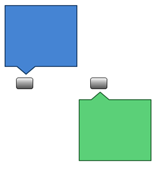
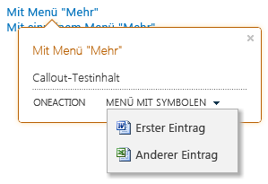

# <a name="highlight-content-and-enhance-the-functionality-of-sharepoint-hosted-sharepoint-add-ins-with-the-callout-control"></a><span data-ttu-id="f5c9a-102">Hervorheben von Inhalten und Erweitern der Funktionen in von SharePoint gehosteten SharePoint-Add-Ins mithilfe des Popupsteuerelements</span><span class="sxs-lookup"><span data-stu-id="f5c9a-102">Highlight content and enhance the functionality of SharePoint-hosted SharePoint Add-ins with the callout control</span></span>
<span data-ttu-id="f5c9a-p101">Das Popupsteuerelement von SharePoint ermöglicht eine flexible Interaktion mit dem Benutzer sowie die Präsentation der Funktionen Ihres von SharePoint gehosteten Add-Ins. Das Steuerelement kann auf vielfältige Weise konfiguriert werden, um es auf die UI Ihres Add-Ins zuzuschneiden. In diesem Artikel erfahren Sie, wie Sie dieses Steuerelement erstellen und Ihrer Seite hinzufügen sowie Darstellung und Verhalten des Steuerelements anpassen.</span><span class="sxs-lookup"><span data-stu-id="f5c9a-p101">The SharePoint callout control provides a flexible way to engage your user and showcase your SharePoint-hosted app's functionality. You can configure it in a variety of ways to suit your app's UI. This article shows you how to construct this control, add it to your page, and customize its appearance and behavior.</span></span>
 
<span data-ttu-id="f5c9a-p102">Bei Suchvorgängen auf einer SharePoint-Website sehen Sie das Popupsteuerelement in Aktion: Es erscheint immer dann, wenn Sie auf ein Suchergebnis zeigen. Abbildung 1 zeigt das Popup für ein einzelnes Suchergebnis sowie einige typische Elemente eines Inhaltssteuerelements: einen Titel, einige Informationen zum Element auf der Seite sowie Aktionen (**Öffnen** und **Senden**), die für das Element ausgeführt werden können. In diesem Fall sind die Informationen und Aktionen zwar relativ simpel, Sie können jedoch bereits zwei Vorteile erkennen. Erstens: Sie können zusätzliche Informationen zu Elementen auf einer Seite anzeigen, wenn dies erforderlich ist. Und zweitens: Der Funktionsumfang der Seite lässt sich so auf elegante Weise erweitern.</span><span class="sxs-lookup"><span data-stu-id="f5c9a-p102">When you do searches in a SharePoint site, you'll see examples of the callout control in action, as it pops up whenever you hover over a search result. Figure 1 shows the callout for a single search result and shows a few of the typical things in a content control: a title, some information about the item on the page, and actions ( **Open** and **Send**) that you can take on the item. In this case, the information and actions are relatively simple, but you can already see two advantages to using it. First, it lets you show additional information about elements in a page when that's needed, and second, it gives you an elegant way of adding functionality to the page.</span></span> 
 

<span data-ttu-id="f5c9a-110">**Abbildung 1: Beispiel des Popupsteuerelements auf einer Seite mit SharePoint-Suchergebnissen**</span><span class="sxs-lookup"><span data-stu-id="f5c9a-110">**Figure 1. Example of the callout control on a SharePoint search results page**</span></span>

 

 

 

 

 

 <span data-ttu-id="f5c9a-p103">**Hinweis** Der Name „Apps für SharePoint“ wird in „SharePoint-Add-Ins“ geändert. Während des Übergangszeitraums wird in der Dokumentation und der Benutzeroberfläche einiger SharePoint-Produkte und Visual Studio-Tools möglicherweise weiterhin der Begriff „Apps für SharePoint“ verwendet. Weitere Informationen finden Sie unter [Neuer Name für Office- und SharePoint-Apps](new-name-for-apps-for-sharepoint.md#bk_newname).</span><span class="sxs-lookup"><span data-stu-id="f5c9a-p103">**Note**  The name "apps for SharePoint" is changing to "SharePoint Add-ins". During the transition, the documentation and the UI of some SharePoint products and Visual Studio tools might still use the term "apps for SharePoint". For details, see  [New name for apps for Office and SharePoint](new-name-for-apps-for-sharepoint.md#bk_newname).</span></span>
 


## <a name="make-the-control-available-to-your-html-page-by-including-the-calloutjs-file"></a><span data-ttu-id="f5c9a-115">Verfügbarmachen des Steuerelements für die HTML-Seite durch Einbeziehen der Datei „callout.js“</span><span class="sxs-lookup"><span data-stu-id="f5c9a-115">Make the control available to your HTML page by including the callout.js file</span></span>
<span data-ttu-id="f5c9a-116"><a name="GettingStarted"> </a></span><span class="sxs-lookup"><span data-stu-id="f5c9a-116"><a name="GettingStarted"> </a></span></span>

<span data-ttu-id="f5c9a-117">In diesem Beispiel wird mithilfe der Methode `SP.SOD.executeFunc` sichergestellt, dass die Skriptdatei geladen wird, bevor Sie davon abhängigen Code ausführen.</span><span class="sxs-lookup"><span data-stu-id="f5c9a-117">This example uses the  `SP.SOD.executeFunc` method to ensure that the script file loads before you run any code that depends on it.</span></span>
 

 

```
SP.SOD.executeFunc("callout.js", "Callout", function () {
    });
```

<span data-ttu-id="f5c9a-p104">Die Funktion, die Sie an die Funktion  `SP.SOD.executeFunc` übergeben, enthält den Code, der ausgeführt werden soll, nachdem die Datei "callout.js" geladen wurde. Nach dem Laden dieser Dateien wird mithilfe des Objekts `CalloutManager` für jedes Seitenelement, dem ein Popupsteuerelement zugeordnet sein soll, ein Objekt vom Typ `Callout` erstellt. Bei `CalloutManager` handelt es sich um einen Singleton, mit dem Verweise auf sämtliche Objekte vom Typ `Callout` auf einer Seite innerhalb eines assoziativen Arrays gespeichert werden. Das Objekt `Callout` besitzt zwei erforderliche Elemente: `ID` und `launchPoint`. Das Element  `ID` ist der Schlüssel, der dem Objekt `Callout` in `CalloutManager` zugeordnet ist: `CalloutManager["value of the callout's ID member"]`. Das Element  `launchPoint` ist ein HTML-Seitenelement. Sie können beispielsweise ein Element vom Typ `div` auf Ihrer Seite erstellen oder abrufen und es als Element des Objekts `Callout` übergeben. Standardmäßig erscheint das Popupsteuerelement, wenn ein Benutzer auf das Element `launchPoint` klickt. Das folgende Beispiel zeigt, wie Sie das einfachste aller Popupsteuerelemente mit lediglich den beiden erforderlichen Elementen und einer Titelzeichenfolge erstellen:</span><span class="sxs-lookup"><span data-stu-id="f5c9a-p104">The function that you pass to the  `SP.SOD.executeFunc` function contains the code that you want to run after the callout.js file loads. After you load those files, you use the `CalloutManager` object to create a `Callout` object for each page element that needs to have a callout control associated with it. The `CalloutManager` is a singleton that stores references to every `Callout` object on a page inside an associative array. The `Callout` object has only two required members: `ID` and `launchPoint`. The  `ID` member is the key that is mapped to the `Callout` object in the `CalloutManager`:  `CalloutManager["value of the callout's ID member"]`. The  `launchPoint` member is an HTML page element. You can, for example, create or get a `div` element on your page and pass it as a member of the `Callout` object. By default, the callout control appears whenever a user clicks the `launchPoint` element. This example shows you how to create the simplest possible callout control with only the two required members and a title string.</span></span>
 

 


```
var calloutPageElement = document.createElement("div");
var callout = CalloutManager.createNew({
   ID: "unique identifier",
   launchPoint: calloutPageElement,
   title: "callout title"
});

```

<span data-ttu-id="f5c9a-p105">Dieses Popup wird mit einem Titel am oberen Rand des Steuerelements angezeigt, wenn ein Benutzer auf das Seitenelement klickt. Mithilfe der optionalen Elemente lassen sich Aspekte wie Darstellung, Verhalten, Position und Aktionen des Steuerelements auf vielfältige Weise und überaus wirkungsvoll anpassen. Das Popupsteuerelement verfügt auch über eine set-Methode, mit der Sie nach Erstellung einer Instanz des Steuerelements einen Wert für einen beliebigen Parameter festlegen können.</span><span class="sxs-lookup"><span data-stu-id="f5c9a-p105">This particular callout pops up and displays a title at the top of the control whenever a user clicks on the page element. You use the optional members to customize the control's appearance, behavior, positioning, and actions in some very powerful ways. The callout control also has a set method that you can use to set a value for any parameter after you create an instance of the control.</span></span>
 

 


```
callout.set({openOptions:{event: "hover"}});
```

<span data-ttu-id="f5c9a-130">Sie können auch Werte für alle Popupelemente in einem `CalloutOptions`-Objekt festlegen und dieses Objekt dann an die `createNew`-Methode übergeben.</span><span class="sxs-lookup"><span data-stu-id="f5c9a-130">You can also set values for all of the callout members in a  `CalloutOptions` object and then pass that object to the `createNew` method.</span></span>
 

 


```
var calloutPageElement = document.createElement("div");
var calloutOptions = new CalloutOptions();
calloutOptions.ID = unique identifier;
calloutOptions.launchPoint = calloutPageElement;
calloutOptions.title = callout title;
var callout = CalloutManager.createNew(calloutOptions);
```


## <a name="how-to-customize-the-appearance-of-the-callout-control"></a><span data-ttu-id="f5c9a-131">Anpassen der Darstellung des Popupsteuerelements</span><span class="sxs-lookup"><span data-stu-id="f5c9a-131">How to customize the appearance of the callout control</span></span>
<span data-ttu-id="f5c9a-132"><a name="Appearance"> </a></span><span class="sxs-lookup"><span data-stu-id="f5c9a-132"><a name="Appearance"> </a></span></span>

<span data-ttu-id="f5c9a-133">Die folgenden Elemente können zum Steuern der Anzeige des Popups verwendet werden.</span><span class="sxs-lookup"><span data-stu-id="f5c9a-133">You can use these members to control the display of callout.</span></span>
 

 


|<span data-ttu-id="f5c9a-134">**Element**</span><span class="sxs-lookup"><span data-stu-id="f5c9a-134">**Member**</span></span>|<span data-ttu-id="f5c9a-135">**Zweck**</span><span class="sxs-lookup"><span data-stu-id="f5c9a-135">**Purpose**</span></span>|<span data-ttu-id="f5c9a-136">**Gültige Werte (Standardwert in Fettformatierung)**</span><span class="sxs-lookup"><span data-stu-id="f5c9a-136">**Valid values (default in bold)**</span></span>|
|:-----|:-----|:-----|
|<span data-ttu-id="f5c9a-137">title</span><span class="sxs-lookup"><span data-stu-id="f5c9a-137">title</span></span>|<span data-ttu-id="f5c9a-138">Zeigt einen Titel am oberen Rand des Steuerelements an.</span><span class="sxs-lookup"><span data-stu-id="f5c9a-138">Display a title at the top of the control.</span></span>|<span data-ttu-id="f5c9a-139">Zeichenfolge, **NULL**, Zeichenfolge mit HTML</span><span class="sxs-lookup"><span data-stu-id="f5c9a-139">string,  **null**, string containing HTML</span></span>|
|<span data-ttu-id="f5c9a-140">content</span><span class="sxs-lookup"><span data-stu-id="f5c9a-140">content</span></span>|<span data-ttu-id="f5c9a-141">Zeigt HTML-Code innerhalb des Steuerelements an, wenn kein Wert für das Element `contentElement` vorhanden ist.</span><span class="sxs-lookup"><span data-stu-id="f5c9a-141">Display HTML inside the control whenever there is no value for the  `contentElement` member.</span></span>|<span data-ttu-id="f5c9a-142">Zeichenfolge mit HTML, **NULL**, muss NULL sein, wenn `contentElement` einen Wert besitzt</span><span class="sxs-lookup"><span data-stu-id="f5c9a-142">string containing HTML,  **null**, must be null if `contentElement` has a value</span></span>|
|<span data-ttu-id="f5c9a-143">contentElement</span><span class="sxs-lookup"><span data-stu-id="f5c9a-143">contentElement</span></span>|<span data-ttu-id="f5c9a-144">Zeigt ein HTML-Element innerhalb des Steuerelements an, wenn kein Wert für das Element `content` vorhanden ist.</span><span class="sxs-lookup"><span data-stu-id="f5c9a-144">Display an HTML element inside the control when there is no value for the  `content` member.</span></span>|<span data-ttu-id="f5c9a-145">Beliebiges HTML-Element, **NULL**, muss NULL sein, wenn `content` einen Wert besitzt</span><span class="sxs-lookup"><span data-stu-id="f5c9a-145">any HTML element,  **null**, must be null if `content` has a value</span></span>|
|<span data-ttu-id="f5c9a-146">contentWidth</span><span class="sxs-lookup"><span data-stu-id="f5c9a-146">contentWidth</span></span>|<span data-ttu-id="f5c9a-p106">Dient zum Angeben der Breite (in Pixel) des Popuptextcontainers. Dieser Container besitzt einen Rand mit einer Breite von einem Pixel sowie einen Abstand mit einer Breite von 15 Pixeln an jeder Seite, wodurch die Breite des Steuerelements die angegebene Textbreite um 32 Pixel übersteigt. Die CSS-Eigenschaft  `overflow` des Steuerelements ist auf `hidden` festgelegt, sodass der Inhalt abgeschnitten wird, falls er nicht in die angegebene Breite passt. Falls Sie dieses Element für ein geöffnetes Popup festlegen, wird die Änderung umgehend wirksam. Bei den anderen Elementen ist dies nicht der Fall. </span><span class="sxs-lookup"><span data-stu-id="f5c9a-p106">Specify the width, in pixels, of the callout body container. This container also has a 1-pixel border and 15-pixel padding on each side, so the control is 32 pixels wider than the body width that you specify. The control's CSS  `overflow` property is set to `hidden`, so your content will be clipped if it does not fit inside the width that you specify. If you set this member on an open callout, the change will take effect immediately. This is not true of the other members.</span></span>|<span data-ttu-id="f5c9a-152">Beliebige Zahl zwischen 240 und 610, **350** (wodurch die Breite des Steuerelements standardmäßig 382 Pixel beträgt)</span><span class="sxs-lookup"><span data-stu-id="f5c9a-152">Any number between 240 and 610,  **350** (making the control 382 pixels wide by default)</span></span>|
|<span data-ttu-id="f5c9a-153">beakOrientation</span><span class="sxs-lookup"><span data-stu-id="f5c9a-153">beakOrientation</span></span>|<span data-ttu-id="f5c9a-154">Gibt die Ausrichtung der Spitze oder des Zeigers des Popupsteuerelements an.</span><span class="sxs-lookup"><span data-stu-id="f5c9a-154">Specify the orientation of the beak or pointer of the callout control.</span></span>|<span data-ttu-id="f5c9a-155">**topBottom**, siehe Abbildung 2:**Abbildung 2: Position der Spitze des Popupsteuerelements bei Verwendung der Ausrichtung „topBottom“**  **leftRight**, siehe Abbildung 3:**Abbildung 3: Position der Spitze des Popupsteuerelements bei Verwendung der Ausrichtung „leftRight“** </span><span class="sxs-lookup"><span data-stu-id="f5c9a-155">**topBottom**, to look like this (Figure 2):**Figure 2. Where the callout control's beak appears with the topBottom orientation**  **leftRight**, to look like this (Figure 3):**Figure 3. Where the callout control's beak appears with the leftright orientation** </span></span>|

## <a name="how-to-customize-the-behavior-of-the-callout-control"></a><span data-ttu-id="f5c9a-156">Anpassen des Verhaltens des Popupsteuerelements</span><span class="sxs-lookup"><span data-stu-id="f5c9a-156">How to customize the behavior of the callout control</span></span>
<span data-ttu-id="f5c9a-157"><a name="Behavior"> </a></span><span class="sxs-lookup"><span data-stu-id="f5c9a-157"><a name="Behavior"> </a></span></span>

<span data-ttu-id="f5c9a-p107">Die folgenden Elemente dienen zum Steuern des Popupverhaltens. Beginnen Sie mit dem wichtigen Element  `openOptions`, da Sie damit angeben können, wie das Steuerelement geöffnet und geschlossen werden soll, wenn der Benutzer auf der Seite damit interagiert.</span><span class="sxs-lookup"><span data-stu-id="f5c9a-p107">You can use the following members to control the behavior of the callout. Begin with the important  `openOptions` member because it lets you specify how the control will open and close when the user interacts with it on the page.</span></span>
 

 


|<span data-ttu-id="f5c9a-160">**Werte für das Element `openOptions` **</span><span class="sxs-lookup"><span data-stu-id="f5c9a-160">**Use these values for the  `openOptions` member**</span></span>|<span data-ttu-id="f5c9a-161">**Zweck**</span><span class="sxs-lookup"><span data-stu-id="f5c9a-161">**Purpose**</span></span>|
|:-----|:-----|
|<span data-ttu-id="f5c9a-162">**{event: "click", closeCalloutOnBlur: true}**</span><span class="sxs-lookup"><span data-stu-id="f5c9a-162">**{event: "click", closeCalloutOnBlur: true}**</span></span>|<span data-ttu-id="f5c9a-p108">Das Popup erscheint, wenn der Benutzer mit einer Maus auf das Element  `launchPoint` klickt, und wird geschlossen, wenn der Benutzer die Maus vom Element `launchPoint` wegbewegt. Da `event` den Wert `click` besitzt, lautet der Wert der Option `showCloseButton` standardmäßig **true** und kann nicht geändert werden. Hierbei handelt es sich um die standardmäßige Wertekombination. </span><span class="sxs-lookup"><span data-stu-id="f5c9a-p108">Make the callout control appear when the user clicks on the  `launchPoint` element with a mouse and close whenever a user moves the mouse away from the `launchPoint` element. Because the value of `event` is `click`, the value of the  `showCloseButton` option is **true** by default and can't be changed. This is the default combination of values.</span></span>|
| `{event: "hover", showCloseButton: true}`|<span data-ttu-id="f5c9a-p109">Das Popup erscheint, wenn der Benutzer mit einer Maus auf das Element  `launchPoint` zeigt, und wird geschlossen, wenn der Benutzer auf ein **X** in der rechten oberen Ecke des Steuerelements klickt. Da `event` den Wert `hover` besitzt, ist der Wert von `closeCalloutOnBlur` nicht anwendbar und kann auch nicht festgelegt werden. </span><span class="sxs-lookup"><span data-stu-id="f5c9a-p109">Make the callout control appear when the user hovers over the  `launchPoint` element with a mouse and close whenever the user clicks on an **X** button in the upper right corner of the control. Because the value of `event` is `hover`, the value of  `closeCalloutOnBlur` is not applicable and can't be set.</span></span>|
| `{event: "click", closeCalloutOnBlur: false}`|<span data-ttu-id="f5c9a-p110">Das Popup erscheint, wenn der Benutzer mit einer Maus auf das Element  `launchPoint` zeigt, und wird nur geschlossen, wenn der Benutzer auf ein **X** in der rechten oberen Ecke des Steuerelements klickt. Da `event` den Wert `click` besitzt, lautet der Wert der Option `showClosebutton` standardmäßig **true** und kann nicht geändert werden. </span><span class="sxs-lookup"><span data-stu-id="f5c9a-p110">Make the callout control appear when the user hovers over the  `launchPoint` element with a mouse and close only whenever the user clicks on an **X** button in the upper right corner of the control. Since the value of `event` is `click`, the value of the  `showClosebutton` option is **true** by default and can't be changed.</span></span>|
<span data-ttu-id="f5c9a-170">Im Anschluss finden Sie die anderen Elemente, die Sie zum Steuern des Popupverhaltens festlegen können.</span><span class="sxs-lookup"><span data-stu-id="f5c9a-170">These are the other members that you can set to control the callout's behavior.</span></span>
 

 


|<span data-ttu-id="f5c9a-171">**Element**</span><span class="sxs-lookup"><span data-stu-id="f5c9a-171">**Use this member**</span></span>|<span data-ttu-id="f5c9a-172">**Zweck**</span><span class="sxs-lookup"><span data-stu-id="f5c9a-172">**Purpose**</span></span>|<span data-ttu-id="f5c9a-173">**Gültige Werte (Standardwert in Fettformatierung)**</span><span class="sxs-lookup"><span data-stu-id="f5c9a-173">**Valid values (default in bold)**</span></span>|
|:-----|:-----|:-----|
|<span data-ttu-id="f5c9a-174">onOpeningCallback</span><span class="sxs-lookup"><span data-stu-id="f5c9a-174">onOpeningCallback</span></span>|<span data-ttu-id="f5c9a-p111">Dient zum Ausführen von Aktionen, die vor dem Rendern des Popups auf der Seite ausgeführt werden müssen. Da das Objekt  `Callout` als Parameter an die angegebene Funktion übergeben werden muss, können Sie mithilfe dieses Elements Werte für Eigenschaften des Steuerelements festlegen, bevor das Steuerelement gerendert wird. Mit diesem Element können Sie auch asynchrone Aktionen starten, um dem Steuerelement Inhalte hinzuzufügen oder Inhalte des Steuerelements zu ändern. Für dieses Element kann nur einmal ein Wert festgelegt werden.</span><span class="sxs-lookup"><span data-stu-id="f5c9a-p111">Perform actions that must happen before the callout control is rendered on the page. Because the  `Callout` object must be passed as a parameter to the function that you supply, you can use this member to set values for any of the control's properties before the control is rendered. You can also use this member to begin asynchronous actions that add or change the content of the control. You can set a value for this member only once.</span></span>| <span data-ttu-id="f5c9a-179">`function(callout /*=Callout*/) {...}`, **null**</span><span class="sxs-lookup"><span data-stu-id="f5c9a-179">`function(callout /*=Callout*/) {...}`,  **null**</span></span>|
|<span data-ttu-id="f5c9a-180">onOpenedCallback</span><span class="sxs-lookup"><span data-stu-id="f5c9a-180">onOpenedCallback</span></span>|<span data-ttu-id="f5c9a-p112">Dient zum Ausführen von Aktionen, die ausgeführt werden müssen, nachdem das Popup gerendert und vollständig animiert wurde. Mit diesem Element können Sie beispielsweise das Dokumentobjektmodell (DOM) des Steuerelements ändern. Für dieses Element kann nur einmal ein Wert festgelegt werden.</span><span class="sxs-lookup"><span data-stu-id="f5c9a-p112">Perform actions that must happen after the callout control is rendered on the page and fully animated. You might use this member to manipulate the Document Object Model (DOM) of the control. You can set a value for this member only once.</span></span>| <span data-ttu-id="f5c9a-184">`function(callout /*=Callout*/) {...}`, **null**</span><span class="sxs-lookup"><span data-stu-id="f5c9a-184">`function(callout /*=Callout*/) {...}`,  **null**</span></span>|
|<span data-ttu-id="f5c9a-185">onClosingCallback</span><span class="sxs-lookup"><span data-stu-id="f5c9a-185">onClosingCallback</span></span>|<span data-ttu-id="f5c9a-p113">Dient zum Ausführen von Aktionen, die ausgeführt werden müssen, wenn das Steuerelement geschlossen wird, aber noch vollständig von der Seite entfernt wurde. Für dieses Element kann nur einmal ein Wert festgelegt werden.</span><span class="sxs-lookup"><span data-stu-id="f5c9a-p113">Perform actions that must happen while the callout control is closing but before it has fully been removed from the page. You can set a value for this member only once.</span></span>| <span data-ttu-id="f5c9a-188">`function(callout /*=Callout*/) {...}`, **null**</span><span class="sxs-lookup"><span data-stu-id="f5c9a-188">`function(callout /*=Callout*/) {...}`,  **null**</span></span>|
|<span data-ttu-id="f5c9a-189">onClosedCallback</span><span class="sxs-lookup"><span data-stu-id="f5c9a-189">onClosedCallback</span></span>|<span data-ttu-id="f5c9a-p114">Dient zum Ausführen von Aktionen, die ausgeführt werden müssen, wenn das Steuerelement geschlossen und vollständig von der Seite entfernt wurde. Für dieses Element kann nur einmal ein Wert festgelegt werden.</span><span class="sxs-lookup"><span data-stu-id="f5c9a-p114">Perform actions that must happen after the callout control has closed and been removed from the page. You can set a value for this member only once.</span></span>| <span data-ttu-id="f5c9a-192">`function(callout /*=Callout*/) {...}`, **null**</span><span class="sxs-lookup"><span data-stu-id="f5c9a-192">`function(callout /*=Callout*/) {...}`,  **null**</span></span>|

## <a name="how-to-use-the-callout-control-methods"></a><span data-ttu-id="f5c9a-193">Verwenden der Methoden des Popupsteuerelements</span><span class="sxs-lookup"><span data-stu-id="f5c9a-193">How to use the callout control methods</span></span>
<span data-ttu-id="f5c9a-194"><a name="CalloutMethods"> </a></span><span class="sxs-lookup"><span data-stu-id="f5c9a-194"><a name="CalloutMethods"> </a></span></span>

<span data-ttu-id="f5c9a-195">Sie können das Verhalten des Popupsteuerelements mit den folgenden Methoden anpassen.</span><span class="sxs-lookup"><span data-stu-id="f5c9a-195">You can use these methods to customize the behavior of the callout control.</span></span>
 

 


|<span data-ttu-id="f5c9a-196">**Methode**</span><span class="sxs-lookup"><span data-stu-id="f5c9a-196">**Use this method**</span></span>|<span data-ttu-id="f5c9a-197">**Zweck**</span><span class="sxs-lookup"><span data-stu-id="f5c9a-197">**Purpose**</span></span>|<span data-ttu-id="f5c9a-198">**Gültige Parameterwerte**</span><span class="sxs-lookup"><span data-stu-id="f5c9a-198">**Valid parameter values**</span></span>|
|:-----|:-----|:-----|
|<span data-ttu-id="f5c9a-199">set({member:value})</span><span class="sxs-lookup"><span data-stu-id="f5c9a-199">set({member:value})</span></span>|<span data-ttu-id="f5c9a-200">Legt Werte für Elemente fest, nachdem Sie eine Instanz des Steuerelements erstellt haben.</span><span class="sxs-lookup"><span data-stu-id="f5c9a-200">Set values for members after you have constructed an instance of the control.</span></span>|<span data-ttu-id="f5c9a-201">Ein Name-Wert-Paar, das einen Wert für ein beliebiges Element des Popupsteuerelements definiert.```var callout = new Callout({openOptions:{event: "click"}});callout.set({openOptions:{event: "hover"}});```</span><span class="sxs-lookup"><span data-stu-id="f5c9a-201">A name/value pair that defines a value for any callout control member.```var callout = new Callout({openOptions:{event: "click"}});callout.set({openOptions:{event: "hover"}});```</span></span>|
|<span data-ttu-id="f5c9a-202">getOrientation()</span><span class="sxs-lookup"><span data-stu-id="f5c9a-202">getOrientation()</span></span>|<span data-ttu-id="f5c9a-p115">Gibt ein Objekt vom Typ `CalloutOrientation` zurück, das angibt, in welche Richtung das Popupsteuerelement zeigt. Dieses Objekt besitzt vier boolesche Elemente: `up`, `down`, `left` und `right`. Wenn das Steuerelement geöffnet ist, sind zwei dieser Werte **true** und zwei **false** (beispielsweise `up` und `right`).</span><span class="sxs-lookup"><span data-stu-id="f5c9a-p115">Return a  `CalloutOrientation` object that indicates which way the callout control is pointing. This object has four Boolean members: `up`,  `down`,  `left`, and  `right`. While the control is open, two of these values will be  **true** and two will be **false** ( `up` and `right`, for example).</span></span>|<span data-ttu-id="f5c9a-206">Keine Parameter</span><span class="sxs-lookup"><span data-stu-id="f5c9a-206">No parameters</span></span>|
|<span data-ttu-id="f5c9a-207">addEventCallback(string eventName, CalloutCallback callback</span><span class="sxs-lookup"><span data-stu-id="f5c9a-207">addEventCallback(string eventName, CalloutCallback callback</span></span>|<span data-ttu-id="f5c9a-208">Registriert eine Rückruffunktion, die aufgerufen wird, wenn das Popupsteuerelement in den im Parameter `eventName` angegebenen Zustand wechselt.</span><span class="sxs-lookup"><span data-stu-id="f5c9a-208">Register a callback function that is called whenever the callout control changes to the state specified by the  `eventName` parameter.</span></span>|<span data-ttu-id="f5c9a-p116">Der Parameter  `eventName` muss einen der folgenden Werte besitzen: `opening`,  `open`,  `closing`,  `closed`. Beim Parameter  `callback` muss es sich um eine Funktion handeln, die eine Instanz des Popupsteuerelements als ersten Parameter verwendet. </span><span class="sxs-lookup"><span data-stu-id="f5c9a-p116">The  `eventName` parameter must be one of these values: `opening`,  `open`,  `closing`,  `closed`. The  `callback` parameter must be a function that takes an instance of the callout control as its first parameter.</span></span>|
|<span data-ttu-id="f5c9a-211">open()</span><span class="sxs-lookup"><span data-stu-id="f5c9a-211">open()</span></span>|<span data-ttu-id="f5c9a-p117">Dient zum Anzeigen des Steuerelements. Ist das Steuerelement bereits geöffnet oder wird es gerade geöffnet, gibt diese Methode nur **false** zurück.</span><span class="sxs-lookup"><span data-stu-id="f5c9a-p117">Display the control. If the control is already open or opening, this method returns  **false** and does nothing.</span></span>|<span data-ttu-id="f5c9a-214">Keine Parameter</span><span class="sxs-lookup"><span data-stu-id="f5c9a-214">No parameters</span></span>|
|<span data-ttu-id="f5c9a-215">close(bool useAnimation)</span><span class="sxs-lookup"><span data-stu-id="f5c9a-215">close(bool useAnimation)</span></span>|<span data-ttu-id="f5c9a-p118">Dient zum Ausblenden des Steuerelements. Ist das Steuerelement bereits geschlossen oder wird es gerade geschlossen, gibt diese Methode nur **false** zurück.</span><span class="sxs-lookup"><span data-stu-id="f5c9a-p118">Hide the control. If the control is closed or already closing, this method returns  **false** and does nothing.</span></span>|<span data-ttu-id="f5c9a-p119">Ein boolescher Wert, der angibt, ob das Steuerelement mit Animation geschlossen wird. Die Animation ist standardmäßig deaktiviert.</span><span class="sxs-lookup"><span data-stu-id="f5c9a-p119">A Boolean value that specifies whether the control closes with animation. Animation is off by default.</span></span>|
|<span data-ttu-id="f5c9a-220">toggle()</span><span class="sxs-lookup"><span data-stu-id="f5c9a-220">toggle()</span></span>|<span data-ttu-id="f5c9a-221">Dient zum Wechseln des Öffnungszustands des Steuerelements.</span><span class="sxs-lookup"><span data-stu-id="f5c9a-221">Toggle the control's open/close state.</span></span>|<span data-ttu-id="f5c9a-222">Keine Parameter</span><span class="sxs-lookup"><span data-stu-id="f5c9a-222">No parameters</span></span>|
|<span data-ttu-id="f5c9a-223">addAction(CallOutAction calloutAction)</span><span class="sxs-lookup"><span data-stu-id="f5c9a-223">addAction(CallOutAction calloutAction)</span></span>|<span data-ttu-id="f5c9a-p120">Hiermit können Sie dem Array von Objekten des Typs  `CalloutAction` für das Steuerelement eine neue Aktion vom Typ `CalloutAction` hinzufügen. Mithilfe dieser Objekte werden die Aktionen definiert, die in der Fußzeile des Steuerelements angezeigt werden sollen. Im Abschnitt [So wird's gemacht: Hinzufügen von Aktionen zum Popupsteuerelement](#AddActions) erfahren Sie, wie Sie diese Objekte erstellen. Aktionen können erst nach dem Erstellen einer Instanz des Steuerelements hinzugefügt werden. Das Steuerelement kann mit maximal drei Aktionen versehen werden. Beim Versuch, noch mehr Aktionen hinzuzufügen, tritt ein Ausnahmefehler auf. </span><span class="sxs-lookup"><span data-stu-id="f5c9a-p120">Add a new  `CalloutAction` to the callout control's array of `CalloutAction` objects. These objects define the actions to show in the footer of the control. The [How to add actions to the callout control](#AddActions) section explains how to construct these objects. You can add actions only after creating an instance of the control. The control can have no more than three actions, and if you try to add more you'll get an exception.</span></span>|<span data-ttu-id="f5c9a-229">Ein `CalloutAction`-Objekt.</span><span class="sxs-lookup"><span data-stu-id="f5c9a-229">A  `CalloutAction` object.</span></span>|
|<span data-ttu-id="f5c9a-230">refreshActions()</span><span class="sxs-lookup"><span data-stu-id="f5c9a-230">refreshActions()</span></span>|<span data-ttu-id="f5c9a-p121">Lädt alle Aktionen neu, die dem Steuerelement hinzugefügt wurden. Mithilfe dieser Methode können Sie Aktionen ändern, aktivieren oder deaktivieren, während das Steuerelement geöffnet ist.</span><span class="sxs-lookup"><span data-stu-id="f5c9a-p121">Reload all of the actions that have been added to the control. You can use this method to change, enable, or disable actions while the control is open.</span></span>|<span data-ttu-id="f5c9a-233">Keine Parameter</span><span class="sxs-lookup"><span data-stu-id="f5c9a-233">No parameters</span></span>|

## <a name="how-to-add-actions-to-the-callout-control"></a><span data-ttu-id="f5c9a-234">Hinzufügen von Aktionen zum Popupsteuerelement</span><span class="sxs-lookup"><span data-stu-id="f5c9a-234">How to add actions to the callout control</span></span>
<span data-ttu-id="f5c9a-235"><a name="AddActions"> </a></span><span class="sxs-lookup"><span data-stu-id="f5c9a-235"><a name="AddActions"> </a></span></span>

<span data-ttu-id="f5c9a-p122">Aktionen werden nach Erstellung einer Instanz des Popupsteuerelements hinzugefügt. Bei einer Popupaktion kann es sich um einzelne Aktion oder um ein Menü mit Aktionen handeln. Ein Popupsteuerelement kann mit bis zu drei Aktionen versehen werden. Nach Erstellung einer Popupaktion können Sie sie dem Objekt  `CalloutControl` mit der zugehörigen Methode vom Typ `addAction` hinzufügen. Die folgende Beispielaktion öffnet ein neues Browserfenster, wenn der Benutzer auf den Text klickt:</span><span class="sxs-lookup"><span data-stu-id="f5c9a-p122">You add actions after you've created an instance of the callout control. A callout action can consist of either a single action or a menu of actions. You can add up to three actions to a callout control. Once you have created a callout action, you add it to the  `CalloutControl` object with its `addAction` method. This sample action opens a new window in your browser after the user clicks on the text.</span></span>
 

 

```
//Create CalloutAction
var calloutAction = new CalloutAction({
            text: "Open window"
            onClickCallback: function() {                
                window.open(url);
            }
        });

//Add Action to an instance of the CalloutControl        
        myCalloutControl.addAction(calloutAction);
```

<span data-ttu-id="f5c9a-241">Sie können auch Werte für alle `CalloutAction`-Elemente in einem `CalloutActionOptions`-Objekt festlegen und dieses Objekt dann an den Konstruktor `CalloutAction` übergeben.</span><span class="sxs-lookup"><span data-stu-id="f5c9a-241">You can also set values for all of the  `CalloutAction` members in a `CalloutActionOptions` object and pass that object to the `CalloutAction` constructor.</span></span>
 

 


```
//Create CalloutAction
var calloutActionOptions = new CalloutActionOptions();
calloutActionOptions.text = "Open window";
actionOptions.onClickCallback = function() {
    window.open(url);
};
var calloutAction = new CalloutAction(calloutActionOptions);

//Add Action to an instance of the CalloutControl        
        myCalloutControl.addAction(calloutAction);
```

<span data-ttu-id="f5c9a-242">Die folgenden Elemente dienen zum Definieren des Verhaltens einer Popupaktion.</span><span class="sxs-lookup"><span data-stu-id="f5c9a-242">You can use these members to define the behavior of a callout action.</span></span>
 

 


|<span data-ttu-id="f5c9a-243">**Element**</span><span class="sxs-lookup"><span data-stu-id="f5c9a-243">**Use this member**</span></span>|<span data-ttu-id="f5c9a-244">**Zweck**</span><span class="sxs-lookup"><span data-stu-id="f5c9a-244">**Purpose**</span></span>|<span data-ttu-id="f5c9a-245">**Gültige Werte (Standardwert in Fettformatierung)**</span><span class="sxs-lookup"><span data-stu-id="f5c9a-245">**Valid values (default in bold)**</span></span>|
|:-----|:-----|:-----|
|<span data-ttu-id="f5c9a-246">text (erforderlich)</span><span class="sxs-lookup"><span data-stu-id="f5c9a-246">text (required)</span></span>|<span data-ttu-id="f5c9a-247">Dient zum Anzeigen einer Beschriftung für die Aktion.</span><span class="sxs-lookup"><span data-stu-id="f5c9a-247">Display a text label for the action.</span></span>|<span data-ttu-id="f5c9a-248">Zeichenfolge, **NULL**</span><span class="sxs-lookup"><span data-stu-id="f5c9a-248">string,  **null**</span></span>|
|<span data-ttu-id="f5c9a-249">onClickCallback</span><span class="sxs-lookup"><span data-stu-id="f5c9a-249">onClickCallback</span></span>|<span data-ttu-id="f5c9a-250">Definiert die Aktion, die auftritt, wenn der Benutzer auf die Aktionsbeschriftung des Popups klickt.</span><span class="sxs-lookup"><span data-stu-id="f5c9a-250">Define the action that occurs when the user clicks on the callout action label.</span></span>| <span data-ttu-id="f5c9a-251">`function(calloutAction /*=CalloutAction*/) {...}`, **null**</span><span class="sxs-lookup"><span data-stu-id="f5c9a-251">`function(calloutAction /*=CalloutAction*/) {...}`,  **null**</span></span>|
|<span data-ttu-id="f5c9a-252">isEnabledCallback</span><span class="sxs-lookup"><span data-stu-id="f5c9a-252">isEnabledCallback</span></span>|<span data-ttu-id="f5c9a-p123">Dient zum Definieren einer Rückruffunktion, die vor der Darstellung des Popups ausgeführt wird und bestimmt, ob die Aktion aktiviert ist. Gibt die Funktion **true** zurück, wird im Popup die aktivierte Aktion angezeigt. Bei **false** wird zwar der Aktionstext im Popup angezeigt, die Aktion wird jedoch deaktiviert. `function(calloutAction /*=CalloutAction*/) {...}`, **null**</span><span class="sxs-lookup"><span data-stu-id="f5c9a-p123">Define a callback function that runs before the callout displays and determines whether the action is enabled. If this function returns  **true**, the callout displays the enabled action. If it returns **false**, the callout displays the action text, but disables the action. `function(calloutAction /*=CalloutAction*/) {...}`,  **null**</span></span>|
|<span data-ttu-id="f5c9a-257">isVisibleCallback</span><span class="sxs-lookup"><span data-stu-id="f5c9a-257">isVisibleCallback</span></span>|<span data-ttu-id="f5c9a-p124">Dient zum Definieren einer Rückruffunktion, die vor der Darstellung des Popups ausgeführt wird und bestimmt, ob der Aktionstext angezeigt wird. Gibt die Funktion **true** zurück, wird im Popup der Aktionstext angezeigt. Bei **false** wird der Aktionstext nicht angezeigt. Weitere Aktionen rücken nach links, um die Position der ausgeblendeten Aktion einzunehmen.</span><span class="sxs-lookup"><span data-stu-id="f5c9a-p124">Define a callback function that runs before the callout displays and determines whether the action text displays. If this function returns  **true**, the callout displays the action text. If it returns **false**, the callout hides the action text. Additional actions will move left to take the place of the hidden action.</span></span>| <span data-ttu-id="f5c9a-262">`function(calloutAction /*=CalloutAction*/) {...}`, **null**</span><span class="sxs-lookup"><span data-stu-id="f5c9a-262">`function(calloutAction /*=CalloutAction*/) {...}`,  **null**</span></span>|
|<span data-ttu-id="f5c9a-263">tooltip</span><span class="sxs-lookup"><span data-stu-id="f5c9a-263">tooltip</span></span>|<span data-ttu-id="f5c9a-264">Zeigt Text an, wenn der Benutzer die Maus über den Aktionstext des Popups bewegt.</span><span class="sxs-lookup"><span data-stu-id="f5c9a-264">Display text when the user hovers over the callout action text.</span></span>|<span data-ttu-id="f5c9a-265">Zeichenfolge, **NULL**</span><span class="sxs-lookup"><span data-stu-id="f5c9a-265">string,  **null**</span></span>|
|<span data-ttu-id="f5c9a-266">disabledTooltip</span><span class="sxs-lookup"><span data-stu-id="f5c9a-266">disabledTooltip</span></span>|<span data-ttu-id="f5c9a-267">Zeigt Text an, wenn der Benutzer die Maus über den Aktionstext des Popups bewegt und die Popupaktion deaktiviert wurde (wenn die `isEnabledCallback`-Funktion **false** zurückgibt).</span><span class="sxs-lookup"><span data-stu-id="f5c9a-267">Display text when the user hovers over the callout action text and the callout action has been disabled (when the  `isEnabledCallback` function returns **false** ).</span></span>|<span data-ttu-id="f5c9a-268">Zeichenfolge, **NULL**</span><span class="sxs-lookup"><span data-stu-id="f5c9a-268">string,  **null**</span></span>|
|<span data-ttu-id="f5c9a-269">menuEntries</span><span class="sxs-lookup"><span data-stu-id="f5c9a-269">menuEntries</span></span>|<span data-ttu-id="f5c9a-p125">Dient zum Definieren eines Menüs mit Aktionen anstelle einer einzelnen Aktion. Wie Sie ein Element vom Typ  `CalloutActionMenuEntry` erstellen und einem Objekt vom Typ `CalloutAction` hinzufügen, erfahren Sie im nächsten Abschnitt. </span><span class="sxs-lookup"><span data-stu-id="f5c9a-p125">Define a menu of actions instead of a single action. The next section explains how to create a  `CalloutActionMenuEntry` and add it to a `CalloutAction` object.</span></span>|<span data-ttu-id="f5c9a-272">[ `CalloutActionMenuEntry`, ...], null</span><span class="sxs-lookup"><span data-stu-id="f5c9a-272">[ `CalloutActionMenuEntry`, ...], null</span></span>|

### <a name="how-to-add-action-menus-to-the-callout-control"></a><span data-ttu-id="f5c9a-273">Hinzufügen von Aktionsmenüs zum Popupsteuerelement</span><span class="sxs-lookup"><span data-stu-id="f5c9a-273">How to add action menus to the callout control</span></span>

<span data-ttu-id="f5c9a-274">Wenn eine Popupaktion anstelle einer einzelnen Aktion ein Menü enthält, wird dem Benutzer neben dem Aktionstext des Popups ein Abwärtspfeil angezeigt (siehe Abbildung 4).</span><span class="sxs-lookup"><span data-stu-id="f5c9a-274">When a callout action contains a menu instead of a single action, the user sees a down arrow next to the callout action text, as in Figure 4.</span></span>
 

 

<span data-ttu-id="f5c9a-275">**Abbildung 4: Eine Popupaktion zeigt ein Menü an, wenn ein Benutzer auf den Pfeil neben der Aktionsbeschriftung klickt.**</span><span class="sxs-lookup"><span data-stu-id="f5c9a-275">**Figure 4. A callout action displays a menu when a user clicks on the arrow next to the action label**</span></span>

 

 

 
<span data-ttu-id="f5c9a-277">Sie können beliebig viele Menüeinträge erstellen und der Popupaktion hinzufügen, indem Sie sie in einem Array als Wert des Elements  `menuEntries` des Objekts `CalloutAction` übergeben.</span><span class="sxs-lookup"><span data-stu-id="f5c9a-277">You can create as many menu entries as you want and add them to the callout action by passing them in an array, as the value of the  `menuEntries` member of the `CalloutAction` object.</span></span>
 

 


```
//Create two menu entries.
var menuEntry1 = new CalloutActionMenuEntry("Entry One", calloutActionCallbackFunction, "/_layouts/images/DOC16.GIF");
var menuEntry2 = new CalloutActionMenuEntry("Some Other Entry", calloutActionCallbackFunction, "/_layouts/images/XLS16.GIF");

//Add the menu entries to the callout action.
var calloutAction = new CalloutAction({
   text: "MENU W/ ICONS",
   menuEntries: [menuEntry1, menuEntry2]
})

//Add the callout action to the callout control.
callout.addAction(calloutAction);

```

<span data-ttu-id="f5c9a-p126">Der Konstruktor  `CalloutActionMenuEntry` akzeptiert drei Parameter. Die ersten beiden Parameter sind erforderlich. Der dritte ist optional, kann jedoch hilfreich sein, da Sie damit ein Symbol mit dem Text anzeigen können.</span><span class="sxs-lookup"><span data-stu-id="f5c9a-p126">The  `CalloutActionMenuEntry` constructor takes three parameters. The first two parameters are required. The third is optional, but it can be helpful because it lets you display an icon with the text.</span></span>
 

 

 

- <span data-ttu-id="f5c9a-281">Übergeben Sie als ersten Parameter eine Zeichenfolge, um eine Beschriftung für die einzelnen Menüeinträge anzuzeigen.</span><span class="sxs-lookup"><span data-stu-id="f5c9a-281">Pass a string as the first parameter to display a text label for each menu entry.</span></span>
    
 
- <span data-ttu-id="f5c9a-282">Übergeben Sie als zweiten Parameter eine Funktion, um die Aktion zu definieren, die ausgeführt werden soll, wenn der Benutzer auf den Text des Menüeintrags klickt.</span><span class="sxs-lookup"><span data-stu-id="f5c9a-282">Pass a function as the second parameter to define the action that occurs when the user clicks on the menu entry text.</span></span>
    
 
- <span data-ttu-id="f5c9a-283">Übergeben Sie eine Zeichenfolge mit der URL für das Symbol, das links neben der Beschriftung angezeigt werden soll.</span><span class="sxs-lookup"><span data-stu-id="f5c9a-283">Pass a string that contains the URL for the icon that you want to display to the left of the text label.</span></span>
    
 

## <a name="how-to-use-the-calloutmanager-to-create-and-manage-instances-of-the-callout-control"></a><span data-ttu-id="f5c9a-284">Erstellen und Verwalten von Instanzen des Popupsteuerelements mithilfe von CalloutManager</span><span class="sxs-lookup"><span data-stu-id="f5c9a-284">How to use the CalloutManager to create and manage instances of the callout control</span></span>
<span data-ttu-id="f5c9a-285"><a name="UseCalloutManager"> </a></span><span class="sxs-lookup"><span data-stu-id="f5c9a-285"><a name="UseCalloutManager"> </a></span></span>

<span data-ttu-id="f5c9a-p127">Das Singleton-Objekt  `CalloutManager` dient zum Speichern von Verweisen auf die einzelnen Objekte vom Typ `Callout` auf einer Seite. Es speichert jede Instanz des Popupsteuerelements in einem assoziativen Array, wobei der Wert `ID` der einzelnen Steuerelemente als Schlüssel fungiert. `CalloutManager` enthält Methoden, die Sie beim Erstellen und Verwalten der gespeicherten Objekte vom Typ `Callout` unterstützen.</span><span class="sxs-lookup"><span data-stu-id="f5c9a-p127">The  `CalloutManager` singleton object stores references to every `Callout` object on a page. It stores each instance of the callout control in an associative array where the `ID` value of each control is the key. The `CalloutManager` contains methods that help you create and manage the `Callout` objects that it stores.</span></span>
 

 


|<span data-ttu-id="f5c9a-289">**Methode**</span><span class="sxs-lookup"><span data-stu-id="f5c9a-289">**Use this method**</span></span>|<span data-ttu-id="f5c9a-290">**Zweck**</span><span class="sxs-lookup"><span data-stu-id="f5c9a-290">**Purpose**</span></span>|<span data-ttu-id="f5c9a-291">**Gültige Parameterwerte**</span><span class="sxs-lookup"><span data-stu-id="f5c9a-291">**Valid parameter values**</span></span>|
|:-----|:-----|:-----|
|<span data-ttu-id="f5c9a-292">createNew(members)</span><span class="sxs-lookup"><span data-stu-id="f5c9a-292">createNew(members)</span></span>|<span data-ttu-id="f5c9a-p128">Dient zum Erstellen eines neuen Objekts vom Typ  `Callout`. Bei dieser Aktion wird von  `CalloutManager` ein Eintrag für das Steuerelement im zugehörigen assoziativen Array erstellt. Der Wert des erforderlichen Elements `ID` fungiert dabei als Schlüssel. </span><span class="sxs-lookup"><span data-stu-id="f5c9a-p128">Create a new  `Callout` object. When you do this, the `CalloutManager` adds an entry for the control in its associative array, with the value of the required member `ID` as the key.</span></span>|<span data-ttu-id="f5c9a-p129">Ein assoziatives Array, durch das jedem Element, das Sie verwenden möchten, Werte zugewiesen werden. Die Elemente `ID` und `launchPoint` sind erforderlich.</span><span class="sxs-lookup"><span data-stu-id="f5c9a-p129">An associative array that assigns values to each member that you want to use. The  `ID` and `launchPoint` members are required.</span></span>|
|<span data-ttu-id="f5c9a-297">createNewIfNecessary (members)</span><span class="sxs-lookup"><span data-stu-id="f5c9a-297">createNewIfNecessary (members)</span></span>|<span data-ttu-id="f5c9a-298">Dient zum Erstellen eines `Callout`-Objekts, falls dem als Parameter übergebenen `launchPoint`-Element nicht bereits ein Popupsteuerelement zugewiesen ist.</span><span class="sxs-lookup"><span data-stu-id="f5c9a-298">Create a  `Callout` object if the `launchPoint` that you pass as a parameter doesn't have a callout control assigned to it already.</span></span>|<span data-ttu-id="f5c9a-p130">Ein assoziatives Array, durch das jedem Element, das Sie verwenden möchten, Werte zugewiesen werden. Die Elemente `ID` und `launchPoint` sind erforderlich.</span><span class="sxs-lookup"><span data-stu-id="f5c9a-p130">An associative array that assigns values to each member that you want to use. The  `ID` and `launchPoint` members are required.</span></span>|
|<span data-ttu-id="f5c9a-301">getFromLaunchPoint: function (/*@type(HTMLElement)*/launchPoint)</span><span class="sxs-lookup"><span data-stu-id="f5c9a-301">getFromLaunchPoint: function (/*@type(HTMLElement)*/launchPoint)</span></span>|<span data-ttu-id="f5c9a-p131">Dient zum Abrufen des Objekts  `Callout`, das dem in der Funktion angegebenen Element  `launchPoint` zugeordnet ist. Von dieser Methode wird eine Ausnahme ausgelöst, wenn `launchPoint` kein Objekt vom Typ `Callout` zugewiesen ist. </span><span class="sxs-lookup"><span data-stu-id="f5c9a-p131">Get the  `Callout` object associated with the `launchPoint` provided in the function. This method throws an exception if the `launchPoint` doesn't have a `Callout` object assigned to it.</span></span>|<span data-ttu-id="f5c9a-304">Keine Parameter</span><span class="sxs-lookup"><span data-stu-id="f5c9a-304">No parameters</span></span>|
|<span data-ttu-id="f5c9a-305">getFromLaunchPointIfExists: function (/*@type(HTMLElement)*/launchPoint)</span><span class="sxs-lookup"><span data-stu-id="f5c9a-305">getFromLaunchPointIfExists: function (/*@type(HTMLElement)*/launchPoint)</span></span>|<span data-ttu-id="f5c9a-p132">Dient zum Abrufen des `Callout`-Objekts, das dem in der Funktion angegebenen Element `launchPoint` zugewiesen ist. Diese Methode gibt NULL zurück, wenn `launchPoint` kein `Callout`-Objekt zugewiesen ist.</span><span class="sxs-lookup"><span data-stu-id="f5c9a-p132">Get the  `Callout` object associated with the `launchPoint` provided in the function. This method returns null if the `launchPoint` doesn't have a `Callout` object assigned to it.</span></span>|<span data-ttu-id="f5c9a-308">Keine Parameter</span><span class="sxs-lookup"><span data-stu-id="f5c9a-308">No parameters</span></span>|
|<span data-ttu-id="f5c9a-309">getFromCalloutDescendant: function (/*@type(HTMLElement)*/descendant)</span><span class="sxs-lookup"><span data-stu-id="f5c9a-309">getFromCalloutDescendant: function (/*@type(HTMLElement)*/descendant)</span></span>|<span data-ttu-id="f5c9a-p133">Dient zum Abrufen des Objekts  `Callout`, das dem HTML-Element zugeordnet ist, welches im durch die Funktion angegebenen Element angegeben ist. Bei diesem Element kann es sich um ein beliebiges Nachfolgerelement des Popupelements handeln. So können Sie beispielsweise den Wert des Elements  `contentElement` übergeben, das Sie beim Erstellen des Objekts `Callout` zugewiesen haben. Von dieser Methode wird eine Ausnahme ausgelöst, wenn dem Nachfolgerelement kein Objekt vom Typ `Callout` zugeordnet ist. </span><span class="sxs-lookup"><span data-stu-id="f5c9a-p133">Get the  `Callout` object associated with the HTML element provided in the function given element. This element can be any descendent of the callout element. For example, you could pass the value of the `contentElement` member that you assigned when you created the `Callout` object. This method throws an exception if the descendant doesn't have a `Callout` object associated with it.</span></span>|<span data-ttu-id="f5c9a-314">Keine Parameter</span><span class="sxs-lookup"><span data-stu-id="f5c9a-314">No parameters</span></span>|
|<span data-ttu-id="f5c9a-315">closeAll()</span><span class="sxs-lookup"><span data-stu-id="f5c9a-315">closeAll()</span></span>|<span data-ttu-id="f5c9a-p134">Schließt alle geöffneten `Callout`-Objekte. Diese Methode gibt „True“ zurück, wenn mindestens ein Popup geschlossen wird.</span><span class="sxs-lookup"><span data-stu-id="f5c9a-p134">Closes all open  `Callout` objects. This method returns true if it closes at least one callout.</span></span>|<span data-ttu-id="f5c9a-318">Keine Parameter</span><span class="sxs-lookup"><span data-stu-id="f5c9a-318">No parameters</span></span>|
|<span data-ttu-id="f5c9a-319">isAtLeastOneCalloutOpen()</span><span class="sxs-lookup"><span data-stu-id="f5c9a-319">isAtLeastOneCalloutOpen()</span></span>|<span data-ttu-id="f5c9a-320">Dient zum Überprüfen, ob mindestens ein Popup geöffnet ist.</span><span class="sxs-lookup"><span data-stu-id="f5c9a-320">Check to see if at least one callout is open.</span></span>|<span data-ttu-id="f5c9a-321">Keine Parameter</span><span class="sxs-lookup"><span data-stu-id="f5c9a-321">No parameters</span></span>|

## <a name="how-to-position-the-callout-control-on-the-page"></a><span data-ttu-id="f5c9a-322">Positionieren des Popupsteuerelements auf der Seite</span><span class="sxs-lookup"><span data-stu-id="f5c9a-322">How to position the callout control on the page</span></span>
<span data-ttu-id="f5c9a-323"><a name="Positioning"> </a></span><span class="sxs-lookup"><span data-stu-id="f5c9a-323"><a name="Positioning"> </a></span></span>


|<span data-ttu-id="f5c9a-324">**Element**</span><span class="sxs-lookup"><span data-stu-id="f5c9a-324">**Use this member**</span></span>|<span data-ttu-id="f5c9a-325">**Zweck**</span><span class="sxs-lookup"><span data-stu-id="f5c9a-325">**Purpose**</span></span>|<span data-ttu-id="f5c9a-326">**Gültige Werte (Standardwert in Fettformatierung)**</span><span class="sxs-lookup"><span data-stu-id="f5c9a-326">**Valid values (default in bold)**</span></span>|
|:-----|:-----|:-----|
|<span data-ttu-id="f5c9a-327">boundingBox</span><span class="sxs-lookup"><span data-stu-id="f5c9a-327">boundingBox</span></span>|<span data-ttu-id="f5c9a-p135">Dient zum Angeben des HTML-Elements, das als Äquivalent von  `offsetParent` des Popupsteuerelements fungiert. Standardmäßig wird hierfür der Wert `offsetParent` des Popupsteuerelements verwendet, Sie können mithilfe dieses Elements jedoch die korrekte Positionierung des Steuerelements sicherstellen. Es wird versucht, das Popupsteuerelement so zu positionieren, dass es innerhalb dieses Felds sichtbar ist. Gegebenenfalls wird die Ausrichtung (von oben nach unten oder von links nach rechts, je nach Ausrichtung der Spitze) geändert, damit es sichtbar bleibt. </span><span class="sxs-lookup"><span data-stu-id="f5c9a-p135">Specify the HTML element that will serve as the equivalent of the  `offsetParent` of the callout control. By default, the default value for this will be the callout control's `offsetParent`, but you can use this member to make sure that the control is positioned correctly. The callout control will attempt to position itself so that it's visible within this box. It will change direction (from top to bottom or from left to right, depending on the beak orientation) to remain visible within it.</span></span>|<span data-ttu-id="f5c9a-332">Beliebiges HTML-Element, **der offsetParent-Wert des HTML-Elements mit dem Popupsteuerelement**</span><span class="sxs-lookup"><span data-stu-id="f5c9a-332">any HTML element,  **the offsetParent of the HTML element that contains the callout control**</span></span>|
|<span data-ttu-id="f5c9a-333">positionAlgorithm</span><span class="sxs-lookup"><span data-stu-id="f5c9a-333">positionAlgorithm</span></span>|<span data-ttu-id="f5c9a-p136">Dient zum Überschreiben des standardmäßigen Positionierungsalgorithmus für das Popupsteuerelement. Im folgenden Abschnitt erfahren Sie, wie Sie unter Verwendung des Objekts  `calloutPositioningProxy` Positionierungsalgorithmen für das Popupsteuerelement erstellen.</span><span class="sxs-lookup"><span data-stu-id="f5c9a-p136">Override the default positioning algorithm for the callout control. The following section describes how to use the  `calloutPositioningProxy` object to write positioning algorithms for the callout control.</span></span>|<span data-ttu-id="f5c9a-336">**CalloutOptions.prototype.defaultPositionAlgorithm**, `function(calloutPositioningProxy) { ... }`</span><span class="sxs-lookup"><span data-stu-id="f5c9a-336">**CalloutOptions.prototype.defaultPositionAlgorithm**, `function(calloutPositioningProxy) { ... }`</span></span>|

### <a name="how-to-write-positioning-algorithms-with-calloutpositioningproxy"></a><span data-ttu-id="f5c9a-337">Erstellen von Positionierungsalgorithmen mit „calloutPositioningProxy“</span><span class="sxs-lookup"><span data-stu-id="f5c9a-337">How to write positioning algorithms with calloutPositioningProxy</span></span>

<span data-ttu-id="f5c9a-p137">Das Objekt  `calloutPositioningProxy` enthält Methoden und Eigenschaften zum Überschreiben der standardmäßigen Positionierungslogik des Popupsteuerelements. Soll das Steuerelement also beispielsweise immer unterhalb und rechts des Elements `launchPoint` angezeigt werden, können Sie einen Positionierungsalgorithmus nach dem folgenden Muster erstellen:</span><span class="sxs-lookup"><span data-stu-id="f5c9a-p137">The  `calloutPositioningProxy` object contains methods and properties that you can use to override the positioning logic that the callout control uses by default. For example, if you want the control to appear below and to the right of the `launchPoint` element all of the time, you write a positioning algorithm that looks like the following.</span></span>
 

 

```
function alwaysGoDownAndRight(calloutPositioningProxy)  {
    calloutPositioningProxy.moveDownAndRight();
} 

```

<span data-ttu-id="f5c9a-p138">Die Funktion wird dann als Wert des Elements  `positionAlgorithm` des Objekts `Callout` übergeben. Dieser Schritt kann beim Erstellen des Objekts `Callout` oder später durch Festlegen des Werts ausgeführt werden.</span><span class="sxs-lookup"><span data-stu-id="f5c9a-p138">You would then pass that function as the value of the  `Callout` object's `positionAlgorithm` member. You can do that when you create the `Callout`, or later by setting the value.</span></span>
 

 


```
callout.set({positionAlgorithm: alwaysGoDownAndRight});

```

<span data-ttu-id="f5c9a-342">Sie können sich jederzeit die standardmäßige Positionierungslogik ansehen, indem Sie die JavaScript-Konsole Ihres Browsers starten (beispielsweise die F12-Entwicklertools von Internet Explorer).</span><span class="sxs-lookup"><span data-stu-id="f5c9a-342">You can always take a look at the default positioning logic by launching your browser's JavaScript console (the Internet Explorer F12 Developer Tools, for example).</span></span>
 

 


```
CalloutOptions.prototype.positionAlgorithm.toString()
```

<span data-ttu-id="f5c9a-343">Die folgenden Methoden im `CalloutPositioningProxy`-Objekt dienen zum Erstellen einer eigenen Positionierungslogik.</span><span class="sxs-lookup"><span data-stu-id="f5c9a-343">You can use these methods in the  `CalloutPositioningProxy` object to write your own positioning logic.</span></span>
 

 


|<span data-ttu-id="f5c9a-344">**Methode**</span><span class="sxs-lookup"><span data-stu-id="f5c9a-344">**Method**</span></span>|<span data-ttu-id="f5c9a-345">**Beschreibung**</span><span class="sxs-lookup"><span data-stu-id="f5c9a-345">**Description**</span></span>|
|:-----|:-----|
|<span data-ttu-id="f5c9a-346">isCalloutTooFarTop()</span><span class="sxs-lookup"><span data-stu-id="f5c9a-346">isCalloutTooFarTop()</span></span>|<span data-ttu-id="f5c9a-347">Gibt einen booleschen Wert zurück.</span><span class="sxs-lookup"><span data-stu-id="f5c9a-347">Returns Boolean.</span></span>|
|<span data-ttu-id="f5c9a-348">isCalloutTooFarRight()</span><span class="sxs-lookup"><span data-stu-id="f5c9a-348">isCalloutTooFarRight()</span></span>|<span data-ttu-id="f5c9a-349">Gibt einen booleschen Wert zurück.</span><span class="sxs-lookup"><span data-stu-id="f5c9a-349">Returns Boolean.</span></span>|
|<span data-ttu-id="f5c9a-350">isCalloutTooFarBottom()</span><span class="sxs-lookup"><span data-stu-id="f5c9a-350">isCalloutTooFarBottom()</span></span>|<span data-ttu-id="f5c9a-351">Gibt einen booleschen Wert zurück.</span><span class="sxs-lookup"><span data-stu-id="f5c9a-351">Returns Boolean.</span></span>|
|<span data-ttu-id="f5c9a-352">isCalloutTooFarLeft()</span><span class="sxs-lookup"><span data-stu-id="f5c9a-352">isCalloutTooFarLeft()</span></span>|<span data-ttu-id="f5c9a-353">Gibt einen booleschen Wert zurück.</span><span class="sxs-lookup"><span data-stu-id="f5c9a-353">Returns Boolean.</span></span>|
|<span data-ttu-id="f5c9a-354">isCalloutLeftOfHardBoundingBox()</span><span class="sxs-lookup"><span data-stu-id="f5c9a-354">isCalloutLeftOfHardBoundingBox()</span></span>|<span data-ttu-id="f5c9a-p139">Gibt einen booleschen Wert zurück. Bei **true** befindet sich die linke Seite des Steuerelements außerhalb des zugehörigen Containerelements. Sie ist nicht sichtbar, und der Benutzer kann keinen Bildlauf dorthin ausführen.</span><span class="sxs-lookup"><span data-stu-id="f5c9a-p139">Returns Boolean. If  **true**, the left side of the control sits outside its container element. It's not visible and the user can't scroll to it.</span></span>|
|<span data-ttu-id="f5c9a-358">isCalloutRightOfHardBoundingBox()</span><span class="sxs-lookup"><span data-stu-id="f5c9a-358">isCalloutRightOfHardBoundingBox()</span></span>|<span data-ttu-id="f5c9a-p140">Gibt einen booleschen Wert zurück. Bei **true** befindet sich die rechte Seite des Steuerelements außerhalb des zugehörigen Containerelements. Sie ist nicht sichtbar, und der Benutzer kann keinen Bildlauf dorthin ausführen.</span><span class="sxs-lookup"><span data-stu-id="f5c9a-p140">Returns Boolean. If  **true**, the right side of the control sits outside its container element. It is not visible and the user can't scroll to it.</span></span>|
|<span data-ttu-id="f5c9a-362">isCalloutAboveHardBoundingBox()</span><span class="sxs-lookup"><span data-stu-id="f5c9a-362">isCalloutAboveHardBoundingBox()</span></span>|<span data-ttu-id="f5c9a-p141">Gibt einen booleschen Wert zurück. Bei **true** befindet sich der obere Teil des Steuerelements außerhalb des zugehörigen Containerelements. Er ist nicht sichtbar, und der Benutzer kann keinen Bildlauf dorthin ausführen.</span><span class="sxs-lookup"><span data-stu-id="f5c9a-p141">Returns Boolean. If  **true**, the top of the control sits outside its container element. It's not visible and the user can't scroll to it.</span></span>|
|<span data-ttu-id="f5c9a-366">isCalloutBelowHardBoundingBox()</span><span class="sxs-lookup"><span data-stu-id="f5c9a-366">isCalloutBelowHardBoundingBox()</span></span>|<span data-ttu-id="f5c9a-p142">Gibt einen booleschen Wert zurück. Bei **true** befindet sich der untere Teil des Steuerelements außerhalb des zugehörigen Containerelements. Er ist nicht sichtbar, und der Benutzer kann keinen Bildlauf dorthin ausführen.</span><span class="sxs-lookup"><span data-stu-id="f5c9a-p142">Returns Boolean. If  **true**, the bottom of the control sits outside its container element. It's not visible and the user can't scroll to it.</span></span>|
|<span data-ttu-id="f5c9a-370">isOrientedUp()</span><span class="sxs-lookup"><span data-stu-id="f5c9a-370">isOrientedUp()</span></span>|<span data-ttu-id="f5c9a-371">Gibt einen booleschen Wert zurück.</span><span class="sxs-lookup"><span data-stu-id="f5c9a-371">Returns Boolean.</span></span>|
|<span data-ttu-id="f5c9a-372">isOrientedDown()</span><span class="sxs-lookup"><span data-stu-id="f5c9a-372">isOrientedDown()</span></span>|<span data-ttu-id="f5c9a-373">Gibt einen booleschen Wert zurück.</span><span class="sxs-lookup"><span data-stu-id="f5c9a-373">Returns Boolean.</span></span>|
|<span data-ttu-id="f5c9a-374">isOrientedLeft()</span><span class="sxs-lookup"><span data-stu-id="f5c9a-374">isOrientedLeft()</span></span>|<span data-ttu-id="f5c9a-375">Gibt einen booleschen Wert zurück.</span><span class="sxs-lookup"><span data-stu-id="f5c9a-375">Returns Boolean.</span></span>|
|<span data-ttu-id="f5c9a-376">isOrientedRight()</span><span class="sxs-lookup"><span data-stu-id="f5c9a-376">isOrientedRight()</span></span>|<span data-ttu-id="f5c9a-377">Gibt einen booleschen Wert zurück.</span><span class="sxs-lookup"><span data-stu-id="f5c9a-377">Returns Boolean.</span></span>|
|<span data-ttu-id="f5c9a-378">moveUpAndRight()</span><span class="sxs-lookup"><span data-stu-id="f5c9a-378">moveUpAndRight()</span></span>|<span data-ttu-id="f5c9a-p143">Gibt nichts zurück. Dient zum Ändern der Richtung des Steuerelements.</span><span class="sxs-lookup"><span data-stu-id="f5c9a-p143">Returns nothing. Changes the direction of the control.</span></span>|
|<span data-ttu-id="f5c9a-381">moveUpAndLeft()</span><span class="sxs-lookup"><span data-stu-id="f5c9a-381">moveUpAndLeft()</span></span>|<span data-ttu-id="f5c9a-p144">Gibt nichts zurück. Dient zum Ändern der Richtung des Steuerelements.</span><span class="sxs-lookup"><span data-stu-id="f5c9a-p144">Returns nothing. Changes the direction of the control.</span></span>|
|<span data-ttu-id="f5c9a-384">moveDownAndRight()</span><span class="sxs-lookup"><span data-stu-id="f5c9a-384">moveDownAndRight()</span></span>|<span data-ttu-id="f5c9a-p145">Gibt nichts zurück. Dient zum Ändern der Richtung des Steuerelements.</span><span class="sxs-lookup"><span data-stu-id="f5c9a-p145">Returns nothing. Changes the direction of the control.</span></span>|
|<span data-ttu-id="f5c9a-387">moveDownAndLeft()</span><span class="sxs-lookup"><span data-stu-id="f5c9a-387">moveDownAndLeft()</span></span>|<span data-ttu-id="f5c9a-p146">Gibt nichts zurück. Dient zum Ändern der Richtung des Steuerelements.</span><span class="sxs-lookup"><span data-stu-id="f5c9a-p146">Returns nothing. Changes the direction of the control.</span></span>|
|<span data-ttu-id="f5c9a-390">moveTowardsOppositeQuadrant()</span><span class="sxs-lookup"><span data-stu-id="f5c9a-390">moveTowardsOppositeQuadrant()</span></span>|<span data-ttu-id="f5c9a-p147">Gibt nichts zurück. Dient zum Ändern der Richtung des Steuerelements.</span><span class="sxs-lookup"><span data-stu-id="f5c9a-p147">Returns nothing. Changes the direction of the control.</span></span>|
|<span data-ttu-id="f5c9a-393">flipHorizontal()</span><span class="sxs-lookup"><span data-stu-id="f5c9a-393">flipHorizontal()</span></span>|<span data-ttu-id="f5c9a-p148">Gibt nichts zurück. Dient zum Ändern der Richtung des Steuerelements.</span><span class="sxs-lookup"><span data-stu-id="f5c9a-p148">Returns nothing. Changes the direction of the control.</span></span>|
|<span data-ttu-id="f5c9a-396">flipVertical()</span><span class="sxs-lookup"><span data-stu-id="f5c9a-396">flipVertical()</span></span>|<span data-ttu-id="f5c9a-p149">Gibt nichts zurück. Dient zum Ändern der Richtung des Steuerelements.</span><span class="sxs-lookup"><span data-stu-id="f5c9a-p149">Returns nothing. Changes the direction of the control.</span></span>|
|<span data-ttu-id="f5c9a-399">numberOfEdgesCollidingWithBoundingBox()</span><span class="sxs-lookup"><span data-stu-id="f5c9a-399">numberOfEdgesCollidingWithBoundingBox()</span></span>|<span data-ttu-id="f5c9a-p150">Gibt eine ganze Zahl zwischen 0 und 4 zurück. Diese Zahl steht für die Anzahl von Kanten, an denen das Popup mit dem sichtbaren Begrenzungsrahmen kollidiert. Beispiel: Wird der obere Teil des Steuerelements nach dem Aufrufen der Methode  `moveUpAndRight()` durch den oberen Teil des Dokumenttexts abgeschnitten, wird von der Methode `numberOfEdgesCollidingWithBoundingBox()` eine Zahl größer 1 zurückgegeben. </span><span class="sxs-lookup"><span data-stu-id="f5c9a-p150">Returns an integer between 0 and 4 that represents the number of edges where the callout collides with the visible bounding box. For example, if the top of the control is clipped by the top of the document body after you call the  `moveUpAndRight()` method, the `numberOfEdgesCollidingWithBoundingBox()` method returns a number greater than 1.</span></span>|
<span data-ttu-id="f5c9a-p151">Der Positionierungsalgorithmus sorgt dafür, dass das Steuerelement ober- oder unterhalb des Texts positioniert wird. Die Eigenschaft  `isRTL` von `CalloutPositioningProxy` gibt Aufschluss darüber, ob es sich bei dem angezeigten Text um eine Rechts-nach-links-Sprache handelt. Durch die Überprüfung dieser Eigenschaft wird sichergestellt, dass das Steuerelement stets korrekt in Relation zum Text auf der Seite positioniert wird.</span><span class="sxs-lookup"><span data-stu-id="f5c9a-p151">This positioning algorithm makes the control go above or below the text. The  `isRTL` property of the `CalloutPositioningProxy` tells you whether the text is displaying a right-to-left language. You check for this property to ensure that the control is always positioned correctly in relation to the text on the page.</span></span>
 

 


```
function examplePositionAlgorithm(calloutPositioningProxy) {
    if (!calloutPositioningProxy.isRTL) {
        calloutPositioningProxy.moveDownAndRight();
        if (calloutPositioningProxy.isCalloutTooFarBottom()) {
            calloutPositioningProxy.moveUpAndRight();
        }
    }
    else {
        calloutPositioningProxy.moveDownAndLeft();
        if (calloutPositioningProxy.isCalloutTooFarBottom()) {
            calloutPositioningProxy.moveUpAndLeft();
        }
    }
}
callout.set({positionAlgorithm: examplePositionAlgorithm});

```

<span data-ttu-id="f5c9a-405">Der folgende Positionierungsalgorithmus ändert die Standardrichtung des Steuerelements von  `upAndRight` in `downAndRight`, greift im Falle von Kollisionen aber auf den Standardalgorithmus zurück:</span><span class="sxs-lookup"><span data-stu-id="f5c9a-405">This positioning algorithm changes the default direction of the control to  `downAndRight` instead of `upAndRight`, but it uses the default algorithm if there are any collisions.</span></span>
 

 


```
function tryDownAndRightThenGoDefault(calloutPositioningProxy) {
    if (!calloutPositioningProxy.isRTL)
        calloutPositioningProxy.moveDownAndRight();
    else
        calloutPositioningProxy.moveDownAndLeft();
    
    if (calloutPositioningProxy.numberOfEdgesCollidingWithBoundingBox() > 0)
        return CalloutOptions.prototype.positionAlgorithm.apply(this, arguments);
};
callout.set({positionAlgorithm: tryDownAndRightThenGoDefault});

```


## <a name="additional-resources"></a><span data-ttu-id="f5c9a-406">Zusätzliche Ressourcen</span><span class="sxs-lookup"><span data-stu-id="f5c9a-406">Additional resources</span></span>
<span data-ttu-id="f5c9a-407"><a name="bk_addresources"> </a></span><span class="sxs-lookup"><span data-stu-id="f5c9a-407"><a name="bk_addresources"> </a></span></span>


-  [<span data-ttu-id="f5c9a-408">SharePoint: Verwenden von Listenansichten, Popups und Dialogfeldern in von SharePoint gehosteten Add-Ins</span><span class="sxs-lookup"><span data-stu-id="f5c9a-408">SharePoint: Use list views, callouts, and dialogs in SharePoint-hosted add-ins</span></span>](http://code.msdn.microsoft.com/officeapps/SharePoint-Use-list-cb3e4e14)
    
 
-  [<span data-ttu-id="f5c9a-409">Erste Schritte beim Erstellen von von SharePoint gehosteten SharePoint-Add-Ins</span><span class="sxs-lookup"><span data-stu-id="f5c9a-409">Get started creating SharePoint-hosted SharePoint Add-ins</span></span>](get-started-creating-sharepoint-hosted-sharepoint-add-ins.md)
    
 
-  [<span data-ttu-id="f5c9a-410">UX-Design für SharePoint-Add-Ins</span><span class="sxs-lookup"><span data-stu-id="f5c9a-410">UX design for SharePoint Add-ins</span></span>](ux-design-for-sharepoint-add-ins.md)
    
 

 

 
