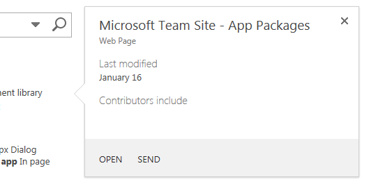
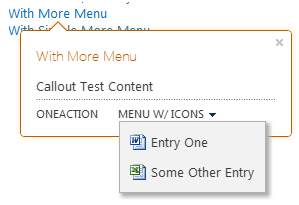

# <a name="highlight-content-and-enhance-the-functionality-of-sharepoint-hosted-sharepoint-add-ins-with-the-callout-control"></a>Hervorheben von Inhalten und Erweitern der Funktionen in von SharePoint gehosteten SharePoint-Add-Ins mithilfe des Popupsteuerelements
Das Popupsteuerelement von SharePoint ermöglicht eine flexible Interaktion mit dem Benutzer sowie die Präsentation der Funktionen Ihres von SharePoint gehosteten Add-Ins. Das Steuerelement kann auf vielfältige Weise konfiguriert werden, um es auf die UI Ihres Add-Ins zuzuschneiden. In diesem Artikel erfahren Sie, wie Sie dieses Steuerelement erstellen und Ihrer Seite hinzufügen sowie Darstellung und Verhalten des Steuerelements anpassen.
 
Bei Suchvorgängen auf einer SharePoint-Website sehen Sie das Popupsteuerelement in Aktion: Es erscheint immer dann, wenn Sie auf ein Suchergebnis zeigen. Abbildung 1 zeigt das Popup für ein einzelnes Suchergebnis sowie einige typische Elemente eines Inhaltssteuerelements: einen Titel, einige Informationen zum Element auf der Seite sowie Aktionen (**Öffnen** und **Senden**), die für das Element ausgeführt werden können. In diesem Fall sind die Informationen und Aktionen zwar relativ simpel, Sie können jedoch bereits zwei Vorteile erkennen. Erstens: Sie können zusätzliche Informationen zu Elementen auf einer Seite anzeigen, wenn dies erforderlich ist. Und zweitens: Der Funktionsumfang der Seite lässt sich so auf elegante Weise erweitern. 
 

**Abbildung 1: Beispiel des Popupsteuerelements auf einer Seite mit SharePoint-Suchergebnissen**

 

 

 

 

 

 **Hinweis** Der Name „Apps für SharePoint“ wird in „SharePoint-Add-Ins“ geändert. Während des Übergangszeitraums wird in der Dokumentation und der Benutzeroberfläche einiger SharePoint-Produkte und Visual Studio-Tools möglicherweise weiterhin der Begriff „Apps für SharePoint“ verwendet. Weitere Informationen finden Sie unter [Neuer Name für Office- und SharePoint-Apps](new-name-for-apps-for-sharepoint#bk_newname).
 


## <a name="make-the-control-available-to-your-html-page-by-including-the-calloutjs-file"></a>Verfügbarmachen des Steuerelements für die HTML-Seite durch Einbeziehen der Datei „callout.js“
<a name="GettingStarted"> </a>

In diesem Beispiel wird mithilfe der Methode `SP.SOD.executeFunc` sichergestellt, dass die Skriptdatei geladen wird, bevor Sie davon abhängigen Code ausführen.
 

 

```
SP.SOD.executeFunc("callout.js", "Callout", function () {
    });
```

Die Funktion, die Sie an die Funktion  `SP.SOD.executeFunc` übergeben, enthält den Code, der ausgeführt werden soll, nachdem die Datei "callout.js" geladen wurde. Nach dem Laden dieser Dateien wird mithilfe des Objekts `CalloutManager` für jedes Seitenelement, dem ein Popupsteuerelement zugeordnet sein soll, ein Objekt vom Typ `Callout` erstellt. Bei `CalloutManager` handelt es sich um einen Singleton, mit dem Verweise auf sämtliche Objekte vom Typ `Callout` auf einer Seite innerhalb eines assoziativen Arrays gespeichert werden. Das Objekt `Callout` besitzt zwei erforderliche Elemente: `ID` und `launchPoint`. Das Element  `ID` ist der Schlüssel, der dem Objekt `Callout` in `CalloutManager` zugeordnet ist: `CalloutManager["value of the callout's ID member"]`. Das Element  `launchPoint` ist ein HTML-Seitenelement. Sie können beispielsweise ein Element vom Typ `div` auf Ihrer Seite erstellen oder abrufen und es als Element des Objekts `Callout` übergeben. Standardmäßig erscheint das Popupsteuerelement, wenn ein Benutzer auf das Element `launchPoint` klickt. Das folgende Beispiel zeigt, wie Sie das einfachste aller Popupsteuerelemente mit lediglich den beiden erforderlichen Elementen und einer Titelzeichenfolge erstellen:
 

 


```
var calloutPageElement = document.createElement("div");
var callout = CalloutManager.createNew({
   ID: "unique identifier",
   launchPoint: calloutPageElement,
   title: "callout title"
});

```

Dieses Popup wird mit einem Titel am oberen Rand des Steuerelements angezeigt, wenn ein Benutzer auf das Seitenelement klickt. Mithilfe der optionalen Elemente lassen sich Aspekte wie Darstellung, Verhalten, Position und Aktionen des Steuerelements auf vielfältige Weise und überaus wirkungsvoll anpassen. Das Popupsteuerelement verfügt auch über eine set-Methode, mit der Sie nach Erstellung einer Instanz des Steuerelements einen Wert für einen beliebigen Parameter festlegen können.
 

 


```
callout.set({openOptions:{event: "hover"}});
```

Sie können auch Werte für alle Popupelemente in einem `CalloutOptions`-Objekt festlegen und dieses Objekt dann an die `createNew`-Methode übergeben.
 

 


```
var calloutPageElement = document.createElement("div");
var calloutOptions = new CalloutOptions();
calloutOptions.ID = unique identifier;
calloutOptions.launchPoint = calloutPageElement;
calloutOptions.title = callout title;
var callout = CalloutManager.createNew(calloutOptions);
```


## <a name="how-to-customize-the-appearance-of-the-callout-control"></a>Anpassen der Darstellung des Popupsteuerelements
<a name="Appearance"> </a>

Die folgenden Elemente können zum Steuern der Anzeige des Popups verwendet werden.
 

 


|**Element**|**Zweck**|**Gültige Werte (Standardwert in Fettformatierung)**|
|:-----|:-----|:-----|
|title|Zeigt einen Titel am oberen Rand des Steuerelements an.|Zeichenfolge, **NULL**, Zeichenfolge mit HTML|
|content|Zeigt HTML-Code innerhalb des Steuerelements an, wenn kein Wert für das Element `contentElement` vorhanden ist.|Zeichenfolge mit HTML, **NULL**, muss NULL sein, wenn `contentElement` einen Wert besitzt|
|contentElement|Zeigt ein HTML-Element innerhalb des Steuerelements an, wenn kein Wert für das Element `content` vorhanden ist.|Beliebiges HTML-Element, **NULL**, muss NULL sein, wenn `content` einen Wert besitzt|
|contentWidth|Dient zum Angeben der Breite (in Pixel) des Popuptextcontainers. Dieser Container besitzt einen Rand mit einer Breite von einem Pixel sowie einen Abstand mit einer Breite von 15 Pixeln an jeder Seite, wodurch die Breite des Steuerelements die angegebene Textbreite um 32 Pixel übersteigt. Die CSS-Eigenschaft  `overflow` des Steuerelements ist auf `hidden` festgelegt, sodass der Inhalt abgeschnitten wird, falls er nicht in die angegebene Breite passt. Falls Sie dieses Element für ein geöffnetes Popup festlegen, wird die Änderung umgehend wirksam. Bei den anderen Elementen ist dies nicht der Fall. |Beliebige Zahl zwischen 240 und 610, **350** (wodurch die Breite des Steuerelements standardmäßig 382 Pixel beträgt)|
|beakOrientation|Gibt die Ausrichtung der Spitze oder des Zeigers des Popupsteuerelements an.|**topBottom**, siehe Abbildung 2:**Abbildung 2: Position der Spitze des Popupsteuerelements bei Verwendung der Ausrichtung „topBottom“**  **leftRight**, siehe Abbildung 3:**Abbildung 3: Position der Spitze des Popupsteuerelements bei Verwendung der Ausrichtung „leftRight“** |

## <a name="how-to-customize-the-behavior-of-the-callout-control"></a>Anpassen des Verhaltens des Popupsteuerelements
<a name="Behavior"> </a>

Die folgenden Elemente dienen zum Steuern des Popupverhaltens. Beginnen Sie mit dem wichtigen Element  `openOptions`, da Sie damit angeben können, wie das Steuerelement geöffnet und geschlossen werden soll, wenn der Benutzer auf der Seite damit interagiert.
 

 


|**Werte für das Element `openOptions` **|**Zweck**|
|:-----|:-----|
|**{event: "click", closeCalloutOnBlur: true}**|Das Popup erscheint, wenn der Benutzer mit einer Maus auf das Element  `launchPoint` klickt, und wird geschlossen, wenn der Benutzer die Maus vom Element `launchPoint` wegbewegt. Da `event` den Wert `click` besitzt, lautet der Wert der Option `showCloseButton` standardmäßig **true** und kann nicht geändert werden. Hierbei handelt es sich um die standardmäßige Wertekombination. |
| `{event: "hover", showCloseButton: true}`|Das Popup erscheint, wenn der Benutzer mit einer Maus auf das Element  `launchPoint` zeigt, und wird geschlossen, wenn der Benutzer auf ein **X** in der rechten oberen Ecke des Steuerelements klickt. Da `event` den Wert `hover` besitzt, ist der Wert von `closeCalloutOnBlur` nicht anwendbar und kann auch nicht festgelegt werden. |
| `{event: "click", closeCalloutOnBlur: false}`|Das Popup erscheint, wenn der Benutzer mit einer Maus auf das Element  `launchPoint` zeigt, und wird nur geschlossen, wenn der Benutzer auf ein **X** in der rechten oberen Ecke des Steuerelements klickt. Da `event` den Wert `click` besitzt, lautet der Wert der Option `showClosebutton` standardmäßig **true** und kann nicht geändert werden. |
Im Anschluss finden Sie die anderen Elemente, die Sie zum Steuern des Popupverhaltens festlegen können.
 

 


|**Element**|**Zweck**|**Gültige Werte (Standardwert in Fettformatierung)**|
|:-----|:-----|:-----|
|onOpeningCallback|Dient zum Ausführen von Aktionen, die vor dem Rendern des Popups auf der Seite ausgeführt werden müssen. Da das Objekt  `Callout` als Parameter an die angegebene Funktion übergeben werden muss, können Sie mithilfe dieses Elements Werte für Eigenschaften des Steuerelements festlegen, bevor das Steuerelement gerendert wird. Mit diesem Element können Sie auch asynchrone Aktionen starten, um dem Steuerelement Inhalte hinzuzufügen oder Inhalte des Steuerelements zu ändern. Für dieses Element kann nur einmal ein Wert festgelegt werden.| `function(callout /*=Callout*/) {...}`, **null**|
|onOpenedCallback|Dient zum Ausführen von Aktionen, die ausgeführt werden müssen, nachdem das Popup gerendert und vollständig animiert wurde. Mit diesem Element können Sie beispielsweise das Dokumentobjektmodell (DOM) des Steuerelements ändern. Für dieses Element kann nur einmal ein Wert festgelegt werden.| `function(callout /*=Callout*/) {...}`, **null**|
|onClosingCallback|Dient zum Ausführen von Aktionen, die ausgeführt werden müssen, wenn das Steuerelement geschlossen wird, aber noch vollständig von der Seite entfernt wurde. Für dieses Element kann nur einmal ein Wert festgelegt werden.| `function(callout /*=Callout*/) {...}`, **null**|
|onClosedCallback|Dient zum Ausführen von Aktionen, die ausgeführt werden müssen, wenn das Steuerelement geschlossen und vollständig von der Seite entfernt wurde. Für dieses Element kann nur einmal ein Wert festgelegt werden.| `function(callout /*=Callout*/) {...}`, **null**|

## <a name="how-to-use-the-callout-control-methods"></a>Verwenden der Methoden des Popupsteuerelements
<a name="CalloutMethods"> </a>

Sie können das Verhalten des Popupsteuerelements mit den folgenden Methoden anpassen.
 

 


|**Methode**|**Zweck**|**Gültige Parameterwerte**|
|:-----|:-----|:-----|
|set({member:value})|Legt Werte für Elemente fest, nachdem Sie eine Instanz des Steuerelements erstellt haben.|Ein Name-Wert-Paar, das einen Wert für ein beliebiges Element des Popupsteuerelements definiert.```var callout = new Callout({openOptions:{event: "click"}});callout.set({openOptions:{event: "hover"}});```|
|getOrientation()|Gibt ein Objekt vom Typ `CalloutOrientation` zurück, das angibt, in welche Richtung das Popupsteuerelement zeigt. Dieses Objekt besitzt vier boolesche Elemente: `up`, `down`, `left` und `right`. Wenn das Steuerelement geöffnet ist, sind zwei dieser Werte **true** und zwei **false** (beispielsweise `up` und `right`).|Keine Parameter|
|addEventCallback(string eventName, CalloutCallback callback|Registriert eine Rückruffunktion, die aufgerufen wird, wenn das Popupsteuerelement in den im Parameter `eventName` angegebenen Zustand wechselt.|Der Parameter  `eventName` muss einen der folgenden Werte besitzen: `opening`,  `open`,  `closing`,  `closed`. Beim Parameter  `callback` muss es sich um eine Funktion handeln, die eine Instanz des Popupsteuerelements als ersten Parameter verwendet. |
|open()|Dient zum Anzeigen des Steuerelements. Ist das Steuerelement bereits geöffnet oder wird es gerade geöffnet, gibt diese Methode nur **false** zurück.|Keine Parameter|
|close(bool useAnimation)|Dient zum Ausblenden des Steuerelements. Ist das Steuerelement bereits geschlossen oder wird es gerade geschlossen, gibt diese Methode nur **false** zurück.|Ein boolescher Wert, der angibt, ob das Steuerelement mit Animation geschlossen wird. Die Animation ist standardmäßig deaktiviert.|
|toggle()|Dient zum Wechseln des Öffnungszustands des Steuerelements.|Keine Parameter|
|addAction(CallOutAction calloutAction)|Hiermit können Sie dem Array von Objekten des Typs  `CalloutAction` für das Steuerelement eine neue Aktion vom Typ `CalloutAction` hinzufügen. Mithilfe dieser Objekte werden die Aktionen definiert, die in der Fußzeile des Steuerelements angezeigt werden sollen. Im Abschnitt [So wird's gemacht: Hinzufügen von Aktionen zum Popupsteuerelement](#AddActions) erfahren Sie, wie Sie diese Objekte erstellen. Aktionen können erst nach dem Erstellen einer Instanz des Steuerelements hinzugefügt werden. Das Steuerelement kann mit maximal drei Aktionen versehen werden. Beim Versuch, noch mehr Aktionen hinzuzufügen, tritt ein Ausnahmefehler auf. |Ein `CalloutAction`-Objekt.|
|refreshActions()|Lädt alle Aktionen neu, die dem Steuerelement hinzugefügt wurden. Mithilfe dieser Methode können Sie Aktionen ändern, aktivieren oder deaktivieren, während das Steuerelement geöffnet ist.|Keine Parameter|

## <a name="how-to-add-actions-to-the-callout-control"></a>Hinzufügen von Aktionen zum Popupsteuerelement
<a name="AddActions"> </a>

Aktionen werden nach Erstellung einer Instanz des Popupsteuerelements hinzugefügt. Bei einer Popupaktion kann es sich um einzelne Aktion oder um ein Menü mit Aktionen handeln. Ein Popupsteuerelement kann mit bis zu drei Aktionen versehen werden. Nach Erstellung einer Popupaktion können Sie sie dem Objekt  `CalloutControl` mit der zugehörigen Methode vom Typ `addAction` hinzufügen. Die folgende Beispielaktion öffnet ein neues Browserfenster, wenn der Benutzer auf den Text klickt:
 

 

```
//Create CalloutAction
var calloutAction = new CalloutAction({
            text: "Open window"
            onClickCallback: function() {                
                window.open(url);
            }
        });

//Add Action to an instance of the CalloutControl        
        myCalloutControl.addAction(calloutAction);
```

Sie können auch Werte für alle `CalloutAction`-Elemente in einem `CalloutActionOptions`-Objekt festlegen und dieses Objekt dann an den Konstruktor `CalloutAction` übergeben.
 

 


```
//Create CalloutAction
var calloutActionOptions = new CalloutActionOptions();
calloutActionOptions.text = "Open window";
actionOptions.onClickCallback = function() {
    window.open(url);
};
var calloutAction = new CalloutAction(calloutActionOptions);

//Add Action to an instance of the CalloutControl        
        myCalloutControl.addAction(calloutAction);
```

Die folgenden Elemente dienen zum Definieren des Verhaltens einer Popupaktion.
 

 


|**Element**|**Zweck**|**Gültige Werte (Standardwert in Fettformatierung)**|
|:-----|:-----|:-----|
|text (erforderlich)|Dient zum Anzeigen einer Beschriftung für die Aktion.|Zeichenfolge, **NULL**|
|onClickCallback|Definiert die Aktion, die auftritt, wenn der Benutzer auf die Aktionsbeschriftung des Popups klickt.| `function(calloutAction /*=CalloutAction*/) {...}`, **null**|
|isEnabledCallback|Dient zum Definieren einer Rückruffunktion, die vor der Darstellung des Popups ausgeführt wird und bestimmt, ob die Aktion aktiviert ist. Gibt die Funktion **true** zurück, wird im Popup die aktivierte Aktion angezeigt. Bei **false** wird zwar der Aktionstext im Popup angezeigt, die Aktion wird jedoch deaktiviert. `function(calloutAction /*=CalloutAction*/) {...}`, **null**|
|isVisibleCallback|Dient zum Definieren einer Rückruffunktion, die vor der Darstellung des Popups ausgeführt wird und bestimmt, ob der Aktionstext angezeigt wird. Gibt die Funktion **true** zurück, wird im Popup der Aktionstext angezeigt. Bei **false** wird der Aktionstext nicht angezeigt. Weitere Aktionen rücken nach links, um die Position der ausgeblendeten Aktion einzunehmen.| `function(calloutAction /*=CalloutAction*/) {...}`, **null**|
|tooltip|Zeigt Text an, wenn der Benutzer die Maus über den Aktionstext des Popups bewegt.|Zeichenfolge, **NULL**|
|disabledTooltip|Zeigt Text an, wenn der Benutzer die Maus über den Aktionstext des Popups bewegt und die Popupaktion deaktiviert wurde (wenn die `isEnabledCallback`-Funktion **false** zurückgibt).|Zeichenfolge, **NULL**|
|menuEntries|Dient zum Definieren eines Menüs mit Aktionen anstelle einer einzelnen Aktion. Wie Sie ein Element vom Typ  `CalloutActionMenuEntry` erstellen und einem Objekt vom Typ `CalloutAction` hinzufügen, erfahren Sie im nächsten Abschnitt. |[ `CalloutActionMenuEntry`, ...], null|

### <a name="how-to-add-action-menus-to-the-callout-control"></a>Hinzufügen von Aktionsmenüs zum Popupsteuerelement

Wenn eine Popupaktion anstelle einer einzelnen Aktion ein Menü enthält, wird dem Benutzer neben dem Aktionstext des Popups ein Abwärtspfeil angezeigt (siehe Abbildung 4).
 

 

**Abbildung 4: Eine Popupaktion zeigt ein Menü an, wenn ein Benutzer auf den Pfeil neben der Aktionsbeschriftung klickt.**

 

 

 
Sie können beliebig viele Menüeinträge erstellen und der Popupaktion hinzufügen, indem Sie sie in einem Array als Wert des Elements  `menuEntries` des Objekts `CalloutAction` übergeben.
 

 


```
//Create two menu entries.
var menuEntry1 = new CalloutActionMenuEntry("Entry One", calloutActionCallbackFunction, "/_layouts/images/DOC16.GIF");
var menuEntry2 = new CalloutActionMenuEntry("Some Other Entry", calloutActionCallbackFunction, "/_layouts/images/XLS16.GIF");

//Add the menu entries to the callout action.
var calloutAction = new CalloutAction({
   text: "MENU W/ ICONS",
   menuEntries: [menuEntry1, menuEntry2]
})

//Add the callout action to the callout control.
callout.addAction(calloutAction);

```

Der Konstruktor  `CalloutActionMenuEntry` akzeptiert drei Parameter. Die ersten beiden Parameter sind erforderlich. Der dritte ist optional, kann jedoch hilfreich sein, da Sie damit ein Symbol mit dem Text anzeigen können.
 

 

 

- Übergeben Sie als ersten Parameter eine Zeichenfolge, um eine Beschriftung für die einzelnen Menüeinträge anzuzeigen.
    
 
- Übergeben Sie als zweiten Parameter eine Funktion, um die Aktion zu definieren, die ausgeführt werden soll, wenn der Benutzer auf den Text des Menüeintrags klickt.
    
 
- Übergeben Sie eine Zeichenfolge mit der URL für das Symbol, das links neben der Beschriftung angezeigt werden soll.
    
 

## <a name="how-to-use-the-calloutmanager-to-create-and-manage-instances-of-the-callout-control"></a>Erstellen und Verwalten von Instanzen des Popupsteuerelements mithilfe von CalloutManager
<a name="UseCalloutManager"> </a>

Das Singleton-Objekt  `CalloutManager` dient zum Speichern von Verweisen auf die einzelnen Objekte vom Typ `Callout` auf einer Seite. Es speichert jede Instanz des Popupsteuerelements in einem assoziativen Array, wobei der Wert `ID` der einzelnen Steuerelemente als Schlüssel fungiert. `CalloutManager` enthält Methoden, die Sie beim Erstellen und Verwalten der gespeicherten Objekte vom Typ `Callout` unterstützen.
 

 


|**Methode**|**Zweck**|**Gültige Parameterwerte**|
|:-----|:-----|:-----|
|createNew(members)|Dient zum Erstellen eines neuen Objekts vom Typ  `Callout`. Bei dieser Aktion wird von  `CalloutManager` ein Eintrag für das Steuerelement im zugehörigen assoziativen Array erstellt. Der Wert des erforderlichen Elements `ID` fungiert dabei als Schlüssel. |Ein assoziatives Array, durch das jedem Element, das Sie verwenden möchten, Werte zugewiesen werden. Die Elemente `ID` und `launchPoint` sind erforderlich.|
|createNewIfNecessary (members)|Dient zum Erstellen eines `Callout`-Objekts, falls dem als Parameter übergebenen `launchPoint`-Element nicht bereits ein Popupsteuerelement zugewiesen ist.|Ein assoziatives Array, durch das jedem Element, das Sie verwenden möchten, Werte zugewiesen werden. Die Elemente `ID` und `launchPoint` sind erforderlich.|
|getFromLaunchPoint: function (/*@type(HTMLElement)*/launchPoint)|Dient zum Abrufen des Objekts  `Callout`, das dem in der Funktion angegebenen Element  `launchPoint` zugeordnet ist. Von dieser Methode wird eine Ausnahme ausgelöst, wenn `launchPoint` kein Objekt vom Typ `Callout` zugewiesen ist. |Keine Parameter|
|getFromLaunchPointIfExists: function (/*@type(HTMLElement)*/launchPoint)|Dient zum Abrufen des `Callout`-Objekts, das dem in der Funktion angegebenen Element `launchPoint` zugewiesen ist. Diese Methode gibt NULL zurück, wenn `launchPoint` kein `Callout`-Objekt zugewiesen ist.|Keine Parameter|
|getFromCalloutDescendant: function (/*@type(HTMLElement)*/descendant)|Dient zum Abrufen des Objekts  `Callout`, das dem HTML-Element zugeordnet ist, welches im durch die Funktion angegebenen Element angegeben ist. Bei diesem Element kann es sich um ein beliebiges Nachfolgerelement des Popupelements handeln. So können Sie beispielsweise den Wert des Elements  `contentElement` übergeben, das Sie beim Erstellen des Objekts `Callout` zugewiesen haben. Von dieser Methode wird eine Ausnahme ausgelöst, wenn dem Nachfolgerelement kein Objekt vom Typ `Callout` zugeordnet ist. |Keine Parameter|
|closeAll()|Schließt alle geöffneten `Callout`-Objekte. Diese Methode gibt „True“ zurück, wenn mindestens ein Popup geschlossen wird.|Keine Parameter|
|isAtLeastOneCalloutOpen()|Dient zum Überprüfen, ob mindestens ein Popup geöffnet ist.|Keine Parameter|

## <a name="how-to-position-the-callout-control-on-the-page"></a>Positionieren des Popupsteuerelements auf der Seite
<a name="Positioning"> </a>


|**Element**|**Zweck**|**Gültige Werte (Standardwert in Fettformatierung)**|
|:-----|:-----|:-----|
|boundingBox|Dient zum Angeben des HTML-Elements, das als Äquivalent von  `offsetParent` des Popupsteuerelements fungiert. Standardmäßig wird hierfür der Wert `offsetParent` des Popupsteuerelements verwendet, Sie können mithilfe dieses Elements jedoch die korrekte Positionierung des Steuerelements sicherstellen. Es wird versucht, das Popupsteuerelement so zu positionieren, dass es innerhalb dieses Felds sichtbar ist. Gegebenenfalls wird die Ausrichtung (von oben nach unten oder von links nach rechts, je nach Ausrichtung der Spitze) geändert, damit es sichtbar bleibt. |Beliebiges HTML-Element, **der offsetParent-Wert des HTML-Elements mit dem Popupsteuerelement**|
|positionAlgorithm|Dient zum Überschreiben des standardmäßigen Positionierungsalgorithmus für das Popupsteuerelement. Im folgenden Abschnitt erfahren Sie, wie Sie unter Verwendung des Objekts  `calloutPositioningProxy` Positionierungsalgorithmen für das Popupsteuerelement erstellen.|**CalloutOptions.prototype.defaultPositionAlgorithm**, `function(calloutPositioningProxy) { ... }`|

### <a name="how-to-write-positioning-algorithms-with-calloutpositioningproxy"></a>Erstellen von Positionierungsalgorithmen mit „calloutPositioningProxy“

Das Objekt  `calloutPositioningProxy` enthält Methoden und Eigenschaften zum Überschreiben der standardmäßigen Positionierungslogik des Popupsteuerelements. Soll das Steuerelement also beispielsweise immer unterhalb und rechts des Elements `launchPoint` angezeigt werden, können Sie einen Positionierungsalgorithmus nach dem folgenden Muster erstellen:
 

 

```
function alwaysGoDownAndRight(calloutPositioningProxy)  {
    calloutPositioningProxy.moveDownAndRight();
} 

```

Die Funktion wird dann als Wert des Elements  `positionAlgorithm` des Objekts `Callout` übergeben. Dieser Schritt kann beim Erstellen des Objekts `Callout` oder später durch Festlegen des Werts ausgeführt werden.
 

 


```
callout.set({positionAlgorithm: alwaysGoDownAndRight});

```

Sie können sich jederzeit die standardmäßige Positionierungslogik ansehen, indem Sie die JavaScript-Konsole Ihres Browsers starten (beispielsweise die F12-Entwicklertools von Internet Explorer).
 

 


```
CalloutOptions.prototype.positionAlgorithm.toString()
```

Die folgenden Methoden im `CalloutPositioningProxy`-Objekt dienen zum Erstellen einer eigenen Positionierungslogik.
 

 


|**Methode**|**Beschreibung**|
|:-----|:-----|
|isCalloutTooFarTop()|Gibt einen booleschen Wert zurück.|
|isCalloutTooFarRight()|Gibt einen booleschen Wert zurück.|
|isCalloutTooFarBottom()|Gibt einen booleschen Wert zurück.|
|isCalloutTooFarLeft()|Gibt einen booleschen Wert zurück.|
|isCalloutLeftOfHardBoundingBox()|Gibt einen booleschen Wert zurück. Bei **true** befindet sich die linke Seite des Steuerelements außerhalb des zugehörigen Containerelements. Sie ist nicht sichtbar, und der Benutzer kann keinen Bildlauf dorthin ausführen.|
|isCalloutRightOfHardBoundingBox()|Gibt einen booleschen Wert zurück. Bei **true** befindet sich die rechte Seite des Steuerelements außerhalb des zugehörigen Containerelements. Sie ist nicht sichtbar, und der Benutzer kann keinen Bildlauf dorthin ausführen.|
|isCalloutAboveHardBoundingBox()|Gibt einen booleschen Wert zurück. Bei **true** befindet sich der obere Teil des Steuerelements außerhalb des zugehörigen Containerelements. Er ist nicht sichtbar, und der Benutzer kann keinen Bildlauf dorthin ausführen.|
|isCalloutBelowHardBoundingBox()|Gibt einen booleschen Wert zurück. Bei **true** befindet sich der untere Teil des Steuerelements außerhalb des zugehörigen Containerelements. Er ist nicht sichtbar, und der Benutzer kann keinen Bildlauf dorthin ausführen.|
|isOrientedUp()|Gibt einen booleschen Wert zurück.|
|isOrientedDown()|Gibt einen booleschen Wert zurück.|
|isOrientedLeft()|Gibt einen booleschen Wert zurück.|
|isOrientedRight()|Gibt einen booleschen Wert zurück.|
|moveUpAndRight()|Gibt nichts zurück. Dient zum Ändern der Richtung des Steuerelements.|
|moveUpAndLeft()|Gibt nichts zurück. Dient zum Ändern der Richtung des Steuerelements.|
|moveDownAndRight()|Gibt nichts zurück. Dient zum Ändern der Richtung des Steuerelements.|
|moveDownAndLeft()|Gibt nichts zurück. Dient zum Ändern der Richtung des Steuerelements.|
|moveTowardsOppositeQuadrant()|Gibt nichts zurück. Dient zum Ändern der Richtung des Steuerelements.|
|flipHorizontal()|Gibt nichts zurück. Dient zum Ändern der Richtung des Steuerelements.|
|flipVertical()|Gibt nichts zurück. Dient zum Ändern der Richtung des Steuerelements.|
|numberOfEdgesCollidingWithBoundingBox()|Gibt eine ganze Zahl zwischen 0 und 4 zurück. Diese Zahl steht für die Anzahl von Kanten, an denen das Popup mit dem sichtbaren Begrenzungsrahmen kollidiert. Beispiel: Wird der obere Teil des Steuerelements nach dem Aufrufen der Methode  `moveUpAndRight()` durch den oberen Teil des Dokumenttexts abgeschnitten, wird von der Methode `numberOfEdgesCollidingWithBoundingBox()` eine Zahl größer 1 zurückgegeben. |
Der Positionierungsalgorithmus sorgt dafür, dass das Steuerelement ober- oder unterhalb des Texts positioniert wird. Die Eigenschaft  `isRTL` von `CalloutPositioningProxy` gibt Aufschluss darüber, ob es sich bei dem angezeigten Text um eine Rechts-nach-links-Sprache handelt. Durch die Überprüfung dieser Eigenschaft wird sichergestellt, dass das Steuerelement stets korrekt in Relation zum Text auf der Seite positioniert wird.
 

 


```
function examplePositionAlgorithm(calloutPositioningProxy) {
    if (!calloutPositioningProxy.isRTL) {
        calloutPositioningProxy.moveDownAndRight();
        if (calloutPositioningProxy.isCalloutTooFarBottom()) {
            calloutPositioningProxy.moveUpAndRight();
        }
    }
    else {
        calloutPositioningProxy.moveDownAndLeft();
        if (calloutPositioningProxy.isCalloutTooFarBottom()) {
            calloutPositioningProxy.moveUpAndLeft();
        }
    }
}
callout.set({positionAlgorithm: examplePositionAlgorithm});

```

Der folgende Positionierungsalgorithmus ändert die Standardrichtung des Steuerelements von  `upAndRight` in `downAndRight`, greift im Falle von Kollisionen aber auf den Standardalgorithmus zurück:
 

 


```
function tryDownAndRightThenGoDefault(calloutPositioningProxy) {
    if (!calloutPositioningProxy.isRTL)
        calloutPositioningProxy.moveDownAndRight();
    else
        calloutPositioningProxy.moveDownAndLeft();
    
    if (calloutPositioningProxy.numberOfEdgesCollidingWithBoundingBox() > 0)
        return CalloutOptions.prototype.positionAlgorithm.apply(this, arguments);
};
callout.set({positionAlgorithm: tryDownAndRightThenGoDefault});

```


## <a name="additional-resources"></a>Zusätzliche Ressourcen
<a name="bk_addresources"> </a>


-  [SharePoint: Verwenden von Listenansichten, Popups und Dialogfeldern in von SharePoint gehosteten Add-Ins](http://code.msdn.microsoft.com/officeapps/SharePoint-2013-Use-list-cb3e4e14)
    
 
-  [Erste Schritte beim Erstellen von von SharePoint gehosteten SharePoint-Add-Ins](get-started-creating-sharepoint-hosted-sharepoint-add-ins)
    
 
-  [UX-Design für SharePoint-Add-Ins](ux-design-for-sharepoint-add-ins)
    
 

 

 
