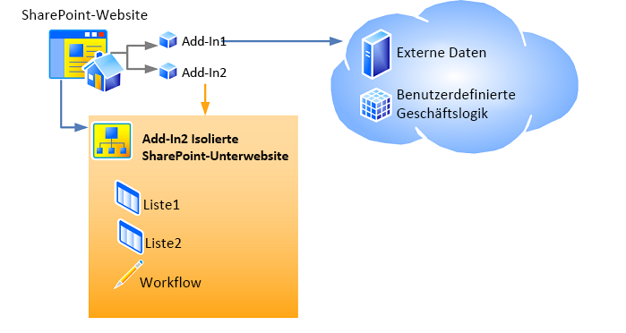

# <a name="host-webs-add-in-webs-and-sharepoint-components-in-sharepoint"></a>Hostwebsites, Add-In-Websites und SharePoint-Komponenten in SharePoint

Wenn ein Add-In mit SharePoint-Komponenten auf einer Website installiert ist, wird es auf der Seite **Websiteinhalte** aufgeführt, über die es gestartet werden kann. Diese Liste, die zum Starten des Add-Ins dient, ist der einzige erforderliche Zusatz zur Website. Bestimmte andere Komponenten wie eine benutzerdefinierte Aktion oder eine Add-In-Komponente können optional hinzugefügt werden. Informationen zu diesen Optionen finden Sie unter [Zugreifen auf das Add-In über die Benutzeroberfläche](important-aspects-of-the-sharepoint-add-in-architecture-and-development-landscap.md#AccessingApp). 

<a name="IsolatedDomain"> </a>
## <a name="host-webs-add-in-webs-and-the-isolated-domain"></a>Hostwebs, Add-In-Webs und die isolierte Domäne

Andere Benutzeroberflächenelemente, SharePoint-Add-In-Komponenten und Inhalte, z. B. Listen, Inhaltstypen, Workflows und Seiten, werden auf einer anderen Website in einer speziellen isolierten Domäne bereitgestellt. Diese Tatsache bleibt vor dem Benutzer weitgehend verborgen. Die spezielle Website, auf der das Add-In *bereitgestellt* wird, wird als Add-In-Web bezeichnet. Die Website, auf der das Add-In *installiert* ist, wird als Hostweb bezeichnet. Obwohl das Add-In-Web über eine eigene isolierte Domäne verfügt, befindet es sich in der gleichen Websitesammlung wie das Hostweb. (Eine Ausnahme zu dieser Regel ist, wenn das Add-In mit einem Mandantenbereich installiert ist. In diesem Szenario ist das Add-In-Web in der Websitesammlung des Add-In-Katalogs des Unternehmens installiert.) 

Abbildung 1 zeigt ein Hostweb mit zwei SharePoint-Add-Ins. Add-In 1 hat Remotekomponenten, verfügt jedoch über keine SharePoint-Komponenten und somit auch über kein Add-In-Web. Add-In 2 enthält keine Remotekomponenten, enthält jedoch zwei SharePoint-Listen und einen Workflow. Diese wurden auf einer isolierten Unterwebsite bereitgestellt (ein SharePoint-Add-In kann sowohl über Remote- als auch SharePoint-gehostete Komponenten verfügen, wobei dies bei keinem der Add-Ins in diesem Diagramm zutrifft).

*Abbildung 1: Hostweb mit einem Anbieter-gehosteten Add-In und einem SharePoint-gehosteten Add-In*


 
Angenommen, ein Add-In mit SharePoint-Komponenten, die über die Benutzeroberflächenelemente hinausgehen, die für eine Hostweb bereitgestellt werden können, wird für eine Hostweb unter der folgenden URL installiert:

    `https://www.fabrikam.com/sites/Marketing`

Die SharePoint-Add-In wird für eine neu erstellte Website mit einer URL wie der folgenden bereitgestellt:

    `http://add-in-bdf2016ea7dacb.fabrikamadd-ins.com/sites/Marketing/Scheduler`

Beachten Sie, dass diese URL die folgende Struktur hat:

    `https://` _Add-in_Prefix_ `-` _Add-in_ID_ `.` _Add-in_Base_Domain_ `/` _Domain_Relative_URL_of_Host_Web_ `/` _Add-in_Name_

Die Platzhalter sind wie folgt definiert:

-  _Add-In_Präfix_ ist eine beliebige, vom Farmadministrator in der Zentraladministration festgelegte Zeichenfolge. Der Standardwert ist "Standard". In diesem Beispiel wurde dies vom Administrator in "Add-In" geändert.

-  _Add-In_ID_ ist eine hexadezimale Zahl, die intern bei der Installation des Add-Ins erstellt wird.

-  _Add-in_Base_Domain_ ist eine beliebige Zeichenfolge, die in der Zentraladministration oder mit der SharePoint-Verwaltungsshell vom Farmadministrator festgelegt wird. Diese sollte *nicht* auf eine Unterdomäne der SharePoint-Webanwendung festgelegt werden, andernfalls wird der Zweck der Add-In-Isolation weitgehend zunichte gemacht. In diesem Beispiel hat der Administrator „www.“ entfernt und „add-ins“ zum Namen des Unternehmens hinzugefügt. Die Add-In-Basisdomäne lautet nun `fabrikamadd-ins.com`.

-  _Domäne_Relative_URL_von_Hostweb_ ist die relative URL des übergeordneten Hostwebs, in diesem Fall `sites/Marketing`.

-  _Add-In_Name_ ist der Wert des **Name**-Attributs des **App**-Elements in der Datei „appmanifest.xml“.

Es gibt zwei Hauptgründe, warum SharePoint-Komponenten in Add-In-Webs statt im Hostweb bereitgestellt werden. Beide Gründe beziehen sich auf die Sicherheit.

-  **Erzwingen von Add-In-Berechtigungen:** Im Modell für SharePoint-Add-Ins hat ein Add-In eine eigene Identität und besitzt Berechtigungen, die nicht zwangsläufig mit den Berechtigungen des Benutzers übereinstimmen, der das Add-In ausführt. Diese Berechtigungen werden bei der Installation des Add-Ins angefordert und von dem Benutzer gewährt, welcher das Add-In installiert, falls dieser Benutzer über alle vom Add-In angeforderten Berechtigungen verfügt. (Wenn der betreffende Benutzer nicht über alle vom Add-In angeforderten Berechtigungen verfügt, kann er das Add-In nicht installieren.) Indem jedem Add-In eine eigene Domäne zugewiesen wird, kann SharePoint Anforderungen des Add-Ins zuverlässig identifizieren und die Berechtigungen des Add-Ins überprüfen. Weitere Informationen über Add-In-Berechtigungen finden Sie unter [Add-In-Berechtigungen](important-aspects-of-the-sharepoint-add-in-architecture-and-development-landscap.md#AppPermissions).

-  **Domänenübergreifende Scripting-Sicherheit:** Moderne Browser unterstützen das als "Same-Origin-Policy" bezeichnete Sicherheitskonzept im Hinblick auf JavaScript-Methodenaufrufe. Indem jede SharePoint-Add-In in einer eigenen Domäne bereitgestellt wird, nutzt SharePoint die Same-Origin-Policy des Browsers, um sicherzustellen, dass JavaScript in der SharePoint-Add-In kein JavaScript von einer anderen Domäne ausführen kann, einschließlich der Domäne, in der (aus der Endbenutzerperspektive) das Add-In installiert ist.
    
   SharePoint bietet auch eine Möglichkeit zur sicheren Überwindung der Einschränkungen des Konzepts. Unter anderem können dadurch die Remotekomponenten eines SharePoint-Add-Ins, Daten von jeder beliebigen Website in der allgemeinen Mandanteneinheit der Host- und der Add-In-Website abfragen. Weitere Informationen finden Sie unter [Zugreifen auf SharePoint-Daten über Add-Ins mithilfe der domänenübergreifenden Bibliothek](access-sharepoint-data-from-add-ins-using-the-cross-domain-library.md).

<a name="TypesOfSPComponentsInApps"> </a>
## <a name="types-of-sharepoint-components-that-can-be-in-a-sharepoint-add-in"></a>Typen von SharePoint-Komponenten in einem SharePoint-Add-In

Im Allgemeinen kann ein SharePoint-Add-In Komponenten aus der folgenden Liste enthalten. Diese Komponenten müssen, mit einigen Ausnahmen, in Features mit **Web**bereich innerhalb einer SharePoint-Lösungspaketdatei (WSP) bereitgestellt werden.

> [!NOTE]
> Die mit einem Sternchen (\*) gekennzeichneten Komponenten werden im Abschnitt [Warnhinweise für die Bereitstellung von SharePoint-Komponenten](#SpecialCases) weiter unten in diesem Artikel ausführlicher behandelt.

- Features (nur mit **Webbereich**)
- Benutzerdefinierte Aktionen (einschließlich Kontextmenüelemente und Anpassungen des Menübands)\*
- Remote-Ereignisempfänger\*
- Markup, das auf Webparts verweist, einschließlich Add-In-Parts, die SharePoint hinzugefügt werden (jedoch keine benutzerdefinierten Webparts)\*
- Angepasste Cascading Stylesheets (CSS)-Dateien zur Verwendung für SharePoint-Seiten
- Angepasste JavaScript-Dateien zur Verwendung für SharePoint-Seiten
- Module (Dateigruppen)
- Seiten
- Listenvorlagen
- Listen- und Bibliotheksinstanzen
- Angepasste Listenformulare
- Angepasste Listenansichten
- Angepasste Inhaltstypen
- Felder (von Feldtypen, die in SharePoint integriert sind)
- Microsoft Business Connectivity Services (BCS)-Modelle (nur mit **Webbereich**), externe Inhaltstypen auf Grundlage des Modells und externe Listen, die Inhaltstypen verwenden\*
- Workflows\*
- Eigenschaftenbehälter
- Webvorlagen (jedoch keine Websitedefinitionen)\*

Kein anderer SharePoint-Komponententyp kann in einem SharePoint-Add-In bereitgestellt werden. Weitere Informationen über Einschränkungen im Hinblick darauf, was in einem SharePoint-Add-In enthalten sein kann, finden Sie unter [SharePoint-Add-Ins im Vergleich zu SharePoint-Lösungen](http://msdn.microsoft.com/library/0e9efadb-aaf2-4c0d-afd5-d6cf25c4e7a8%28Office.15%29.aspx).

<a name="SpecialCases"> </a>
## <a name="caveats-for-deploying-sharepoint-components"></a>Vorsichtsmaßnahmen für die Bereitstellung von SharePoint-Komponenten

Im folgenden finden Sie einige Vorsichtsmaßnahmen und Details in Bezug auf die Bereitstellung von bestimmte Typen von SharePoint-Komponenten in einem Add-In: 

- **Benutzerdefinierte Aktionen:** Sie können benutzerdefinierte Aktionen nicht nur der Add-In-Website, sondern auch der Hostwebsite hinzufügen. Um die benutzerdefinierte Aktion der Add-In-Website hinzuzufügen, fügen Sie sie einem Feature mit **Web**-Bereich hinzu, das in einer WSP-Datei enthalten ist. Dabei gehen Sie genauso vor wie bei jeder anderen Komponente, die Sie der Add-In-Website hinzufügen. Um eine benutzerdefinierte Aktion der Hostweb hinzuzufügen, können Sie (selbst bei einem extern basierten Add-In) ein **CustomAction**-Markup in ein Feature einschließen, das sich im Add-In-Paket, jedoch außerhalb einer WSP-Datei befindet. Komponenten in einem solchen "losen" Feature gelten nur für die Hostweb und nicht für die Add-In-Website. Daher wird dieser Feature-Typ als Hostweb-Feature bezeichnet. 

- **Webparts:** Eine Art von Webpart, ein Add-In-Part, kann in einem Add-In bereitgestellt werden. Ein Add-In-Part kann entweder für die Add-In-Website oder die Hostwebsite verwendet werden. Auf alle anderen Typen von Webparts kann in Add-Ins verwiesen, jedoch nicht von ihnen bereitgestellt werden. Wenn ein Add-In-Part für die Hostweb bereitgestellt wird, sollte es in ein Hostweb-Feature eingeschlossen sein.

- **Remote-Ereignisempfänger:** Diese sind neu in SharePoint. Sie ähneln den klassischen SharePoint-Ereignisempfängern, mit der Ausnahme, dass der Code in der Cloud ausgeführt wird. Sie sind in einem in SharePoint gehosteten Add-In nicht verfügbar.

- **Workflows:** Workflows in SharePoint verwenden die in Microsoft Azure gehostete Workflow-Laufzeit, was in SharePoint neu ist. Codierte Workflows, welche die in SharePoint gehostete Workflow-Laufzeit verwenden, können einer SharePoint-Add-In nicht hinzugefügt werden. Zulässig sind nur deklarative Workflows oder Workflows, welche die neuere Laufzeit verwenden.

- **Microsoft Business Connectivity Services (BCS)-Modelle, externe Inhaltstypen und externen Listen:** Business Data Connectivity (BDC)-Dienstmodelle weisen in der Regel einen Bereich auf, der umfassender ist als eine Websitesammlung. Wenn ein BDC-Dienstmodell in einem Add-In bereitgestellt wird, ist der Bereich jedoch auf das Add-In-Web eingeschränkt. Wenn ein BDC-Dienstmodell in einem Add-In enthalten ist, wird es nicht im diese nicht in dem gemeinsam verwendeten BDC-Dienstspeicher gespeichert. Es wird stattdessen als Datei im Add-In-Web gespeichert.

- **Webvorlagen:** In den meisten Fällen empfiehlt es sich, dass das Add-In-Web die neu integrierte Websitedefinitionskonfiguration **APP#0** instanziiert, die für das Add-In-Web optimiert ist. (Weitere Informationen finden Sie unter [Zugreifen auf das Add-In über die Benutzeroberfläche](important-aspects-of-the-sharepoint-add-in-architecture-and-development-landscap.md#AccessingApp).) SharePoint verwendet automatisch **APP #0**, wenn das Add-In-Paket kein [WebTemplate](http://msdn.microsoft.com/library/ff4ba91a-cc5f-47ff-9101-a7651f452185%28Office.15%29.aspx)-Element enthält.
    
   Sie können auch einen benutzerdefinierten Websitetyp für das Add-In-Web definieren. Hierbei sind zwei Hauptschritte durchzuführen:
    
   - Fügen Sie ein benutzerdefiniertes [WebTemplate-Element (Webvorlage)](http://msdn.microsoft.com/library/ff4ba91a-cc5f-47ff-9101-a7651f452185%28Office.15%29.aspx), eine Datei „onet.xml“ und möglicherweise andere zugehörige Dateien in dem Add-In-Webfeature für das Add-In hinzu. Stellen Sie wie gewohnt die Webvorlage im Feature mit Webbereich in einer WSP-Datei innerhalb des Add-In-Pakets bereit.

   - Fügen Sie dem Add-In-Manifest ein [WebTemplate-Element (PropertiesDefinition ComplexType) (SharePoint-Add-In-Manifest)](http://msdn.microsoft.com/library/62302903-e97a-a9a3-a64e-13176a7c4e1e%28Office.15%29.aspx) als untergeordnetes Element des **Properties**-Elements hinzu, und legen Sie sein **Id**-Attribut auf die GUID des Add-In-Web-Features und den Wert des **Name**-Attributs des [WebTemplate-Elements (Webvorlage)](http://msdn.microsoft.com/library/ff4ba91a-cc5f-47ff-9101-a7651f452185%28Office.15%29.aspx) fest. Beachten Sie, dass die GUID mit Bindestrichen geschrieben und in geschweifte Klammern „{}“ eingeschlossen werden muss, außerdem müssen die GUID und der Vorlagenname durch das Zeichen „#“ getrennt werden. Es folgt ein Beispiel:
    
     ```XML
       <WebTemplate Id="{81dd4ae5-873b-4759-9838-4ad9c3dd2952}#NewSiteType" />
     ```

   > [!NOTE]
   > Das neue [WebTemplate](http://msdn.microsoft.com/library/62302903-e97a-a9a3-a64e-13176a7c4e1e%28Office.15%29.aspx)-Element für Add-In-Manifeste ist nicht das gleiche Markup wie das [WebTemplate](http://msdn.microsoft.com/library/ff4ba91a-cc5f-47ff-9101-a7651f452185%28Office.15%29.aspx)-Element, das in Features enthalten sein kann. Das **WebTemplate**-Element, das in Features enthalten sein kann, definiert einen Websitetyp, das **WebTemplate**-Element für Add-In-Manifeste identifiziert jedoch lediglich, welcher Websitetyp zu verwenden ist. Weitere Informationen über das Add-In-Manifest eines SharePoint-Add-Ins finden Sie unter [Add-In-Paketstruktur](important-aspects-of-the-sharepoint-add-in-architecture-and-development-landscap.md#SPAppModelArch_Package).

   > [!CAUTION]
   > Verwenden Sie das **WebTemplate**-Element nicht im Add-In-Manifest, um eine der integrierten SharePoint-Websitedefinitionskonfigurationen als Websitetyp des Add-In-Web festzulegen. Für das Add-In-Web werden keinen anderen integrierten Websitedefinitionskonfigurationen als **APP#0** unterstützt. 

   Weitere Informationen zu Websitedefinitionskonfigurationen und Webvorlagen finden Sie unter [Arbeiten mit Websitevorlagen und Definitionen](http://msdn.microsoft.com/library/1edf6d4d-eddb-4cb5-9034-ed394e8a3e01%28Office.15%29.aspx).
    
## <a name="see-also"></a>Siehe auch
<a name="SP15hostedwebs_bk_addlresources"> </a>

- [Kritische Aspekte der Architektur und der Entwicklungslandschaft für SharePoint-Add-Ins](important-aspects-of-the-sharepoint-add-in-architecture-and-development-landscap.md)
- [Sicherer Datenzugriff und Clientobjektmodelle für SharePoint-Add-Ins](secure-data-access-and-client-object-models-for-sharepoint-add-ins.md)
- [SharePoint-Add-Ins im Vergleich zu SharePoint-Lösungen](http://msdn.microsoft.com/library/0e9efadb-aaf2-4c0d-afd5-d6cf25c4e7a8%28Office.15%29.aspx)

