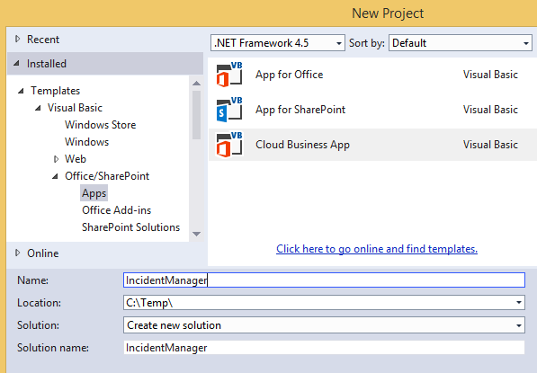
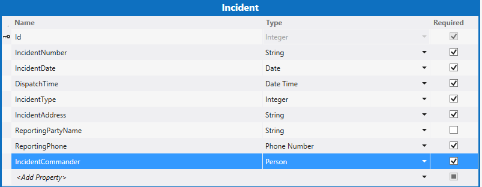
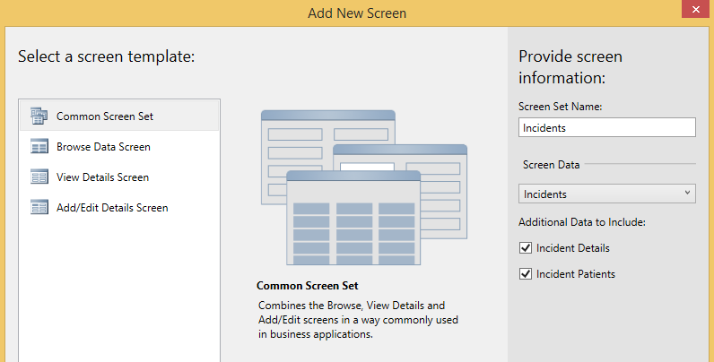
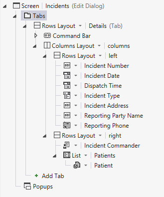
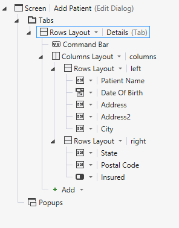
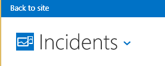
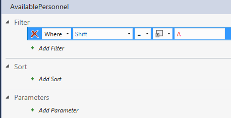
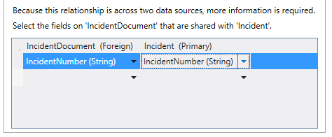
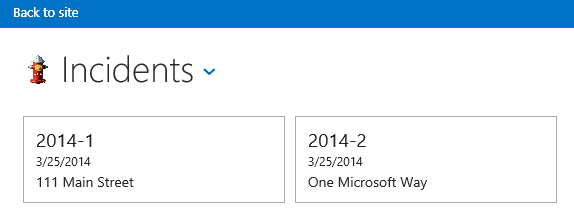

# <a name="incident-manager-a-cloud-business-add-in-tutorial"></a>Vorfallverwaltung: Lernprogramm für das Cloud-Business-Add-In
Mit der **Cloud-Business-Add-In**-Vorlage in Visual Studio können Sie ein in SharePoint gehostetes Add-In erstellen, in dem mobile Benutzer an einem Remotestandort mithilfe moderner Geräte wie Smartphones und Tablet-PCs mit Toucheingabe Daten anzeigen, hinzufügen und aktualisieren können. In diesem Lernprogramm erstellen Sie ein Add-In für eine fiktive Contoso-Feuerwehr zur Bearbeitung der Einsatz-Vorfallverwaltung. Diese exemplarische Vorgehensweise umfasst die Kernkonzepte des Entwickelns eines Cloud-Business-Add-Ins sowie weiterführendere Konzepte wie das Einbinden von SharePoint-Listen und Dokumentbibliotheken.
 
Sie können die Vorfallverwaltung-Beispielanwendung und die dazugehörigen Dateien aus der MSDN-Beispielgalerie herunterladen: [Vorfallverwaltung: Lernprogramm für das Cloud-Business-Add-In](http://code.msdn.microsoft.com/Incident-Manager-A-Cloud-c32d9b04).
 

 **Hinweis** Der Name „Apps für SharePoint“ wird in „SharePoint-Add-Ins“ geändert. Während des Übergangszeitraums wird in der Dokumentation und der Benutzeroberfläche einiger SharePoint-Produkte und Visual Studio-Tools möglicherweise weiterhin der Begriff „Apps für SharePoint“ verwendet. Weitere Informationen finden Sie unter [Neuer Name für Office- und SharePoint-Apps](new-name-for-apps-for-sharepoint#bk_newname).
 


## <a name="prerequisites"></a>Voraussetzungen

Diese exemplarische Vorgehensweise erfordert Visual Studio 2013 Update 1 und Microsoft Developer Tools für Visual Studio-2013 - Update vom März 2014.
 

 
Zum Hosten des Add-Ins benötigen Sie außerdem eine SharePoint-Entwicklerwebsite in Office 365, die Sie hier erhalten  [Registrieren für eine Office 365-Entwicklerwebsite](http://go.microsoft.com/fwlink/?LinkId=263490).
 

 

 **Hinweis** Außerdem können Sie ein Cloud-Business-Add-In auf einer SharePoint-Website hosten.
 


## <a name="create-the-incident-management-application"></a>Erstellen der Anwendung für die Vorfallverwaltung
<a name="add-in"> </a>

Die Contoso-Feuerwehr reagiert auf Brände, medizinische Notfälle, Verkehrsunfälle und andere Notfälle. Bei jedem Notfall-Vorfall entsteht ein erheblicher Verwaltungsaufwand für die Dokumentation des Vorfalls. Aktuell füllen Sie beim Einsatz Papier-Formulare aus und geben sie anschließend in der Feuerwache in ihr Computersystem ein. Seit kurzem setzen Sie SharePoint für Office 365 zur Datensatzverwaltung ein und haben Tablets erworben, damit Sie Daten während eines Einsatzes über den Incident Commander erfassen können.
 

 
Sie entwickeln das mobile Add-In, die zur Eingabe der wichtigsten Informationen zu einem Vorfall dient. Da viele Vorfälle auch medizinische Versorgung umfassen, muss es mit dem Add-In möglich sein, Daten für mehrere Patienten pro Vorfall angeben zu können. In diesem Abschnitt entwickeln Sie ein einfaches Add-In und erlernen so die Grundlagen von Cloud-Geschäfts-Add-Ins.
 

 

### <a name="to-create-a-project"></a>So erstellen Sie ein Projekt


1. Wählen Sie auf der Menüleiste die Optionen **Datei**, **Neu**, **Projekt**.
    
    Das Dialogfeld **Neues Projekt** wird geöffnet.
    
 
2. Erweitern Sie in der Vorlagenliste den Knoten **Visual Basic** oder **Visual C#**, dann den Knoten **Office/SharePoint**, klicken Sie auf den Knoten **Add-Ins** und anschließend auf die **Cloud-Business-Add-In**-Vorlage, wie in Abbildung 1 dargestellt.
    
    **Abbildung 1: Vorlage für Cloud-Business-Add-Ins**

 

  
 

 

 
3. Geben Sie in das Textfeld **Name** „Vorfallverwaltung“ ein, und klicken Sie anschließend auf die Schaltfläche **OK**.
    
    Der Assistent **Neues Cloud-Geschäfts-Add-In** wird geöffnet.
    
 
4. Geben Sie im Assistenten **Neues Cloud-Geschäfts-Add-In** die URL Ihrer Office 365-Entwicklerseite ein, und klicken Sie dann auf die Schaltfläche **Fertig stellen**.
    
    Die URL sollte das Format „https://_MeineWebsite_.sharepoint.com/sites/Developer/“ haben.
    
    Eine **Vorfallverwaltung**-Lösung wird im Projektmappen-Explorer mit vier Projekten hinzugefügt: ein **Vorfallverwaltung**-Projekt auf oberster Ebene,ein **Vorfallverwaltung.HTMLClient**-Projekt, ein **Vorfallverwaltung.Server**-Projekt und ein **Vorfallverwaltung.SharePoint**-Projekt.
    
    
 

    
    Im nächsten Schritt fügen Sie eine Entität für Vorfallsammlungen hinzu. Die Entität erstellt eine speziell auf das Add-In zugeschnittene SQL Server-Datenbanktabelle. In ihr werden Informationen zu jedem einzelnen Vorfall gespeichert.
    
 

### <a name="to-add-the-incident-entity"></a>So fügen Sie die Vorfall-Entität hinzu


1. Klicken Sie auf dem **Start**-Bildschirm auf den Hyperlink **Neue Tabelle erstellen**.
    
    Der Entity Designer wird geöffnet.
    
 
2. Geben Sie im Fenster **Eigenschaften** im Textfeld der Eigenschaft **Name** „Vorfall“ ein.
    
 
3. Klicken Sie im Entity Designer auf den Link **<Add Property>**, und geben Sie „Vorfallnummer“ ein.
    
 
4. Drücken Sie die EINGABETASTE, wodurch Sie die Standardwerte für **Typ** und **String** übernehmen, und lassen Sie das Kontrollkästchen **Erforderlich** ausgewählt.
    
 
5. Aktivieren Sie im Fenster **Eigenschaften** das Kontrollkästchen **In eindeutigen Index einschließen**.
    
    Die Vorfallnummer muss für jeden Vorfall eindeutig sein.
    
 
6. Wählen Sie den Link **<Add Property>**, geben Sie „Vorfalldatum“ ein, und drücken Sie dann die **TAB**-Taste.
    
 
7. Wählen Sie in der Spalte **Typ** den Eintrag **Datum**, und drücken Sie dann zweimal die TAB-Taste.
    
 
8. Geben Sie in der Spalte **Name** „Ausrückzeit“ ein, und wählen Sie in der Spalte **Typ** den Datentyp **DateTime** aus.
    
 
9. Geben Sie in die nächste Zeile „Vorfalltyp“ ein, und wählen Sie als Datentyp **Integer**.
    
 
10. Geben Sie in die nächste Zeile „Vorfalladresse“ ein, und wählen Sie als Datentyp **String**.
    
 
11. Geben Sie in die nächste Zeile „NameMeldender“ ein, und wählen Sie als Datentyp **String**. Deaktivieren Sie dann das Kontrollkästchen **Erforderlich**.
    
    In einigen Fällen werden Vorfälle anonym gemeldet, sodass es nicht erforderlich sein muss, einen Wert in diesem Feld angeben zu müssen.
    
 
12. Geben Sie in die nächste Zeile „TelefonMeldender“ ein, und wählen Sie als Datentyp **PhoneNumber**.
    
     **Telefonnummer** ist ein benutzerdefinierter Geschäftstyp, der Telefonnummern automatisch formatiert und validiert.
    
 
13. Klicken Sie im Fenster **Eigenschaften** auf den Hyperlink **Telefonnummernformate**.
    
    Das Dialogfeld **Telefonnummernformate** wird geöffnet.
    
 
14. Klicken Sie im Dialogfeld **Telefonnummernformate** auf das entsprechende Format für Ihr Gebietsschema und dann auf die Schaltfläche **Nach oben**, um sie an die erste Stelle in der Liste zu verschieben.
    
 
15. Geben Sie im Textfeld **Validierung der Testtelefonnummer** eine Telefonnummer ein, und überprüfen Sie, ob sie korrekt formatiert ist. Klicken Sie anschließend auf die Schaltfläche **Speichern**.
    
    Der **Telefonnummer**-Geschäftstyp nimmt die Formatierung und Überprüfung für Sie auf allen Bildschirmen vor, auf denen er angezeigt wird.
    
 
16. Geben Sie in die nächste Zeile „Vorfallkommandant“ ein, und wählen Sie den Datentyp **Person**.
    
    Der Geschäftstyp **Person** stellt eine Verbindung zum SharePoint-Benutzerprofildienst bereit, die Benutzerinformationen aus Active Directory zieht.
    
    Abbildung 2 zeigt die fertige Entität.
    

    **Abbildung 2: Die Vorfall-Entität**

 

  
 

    
 

    
    Im nächsten Schritt fügen Sie eine Auswahlliste hinzu, mit der der Benutzer aus einem festen Satz von Werten auswählen kann. In diesem Fall verfügt die Feuerwehr über einen Satz von häufig auftretenden Vorfalltypen.
    
 

### <a name="to-add-a-list-of-choices"></a>So fügen Sie eine Auswahlliste hinzu


1. Wählen Sie im Entity Designer das Feld **Vorfalltyp**, und wählen Sie dann im Fenster **Eigenschaften** den Hyperlink **Auswahlliste**.
    
    Das Dialogfeld **Auswahlliste** wird geöffnet.
    
 
2. Klicken Sie im Dialogfeld **Auswahlliste** auf den Link **Wert hinzufügen**, und geben Sie „1“ ein.
    
 
3. Geben Sie in der Spalte **Anzeigename** **Feuer - Gewerbegebiet** ein.
    
 
4. Geben Sie die folgenden Werte und Anzeigenamen ein, und klicken Sie anschließend auf **OK**.
    

|**Wert**|**Anzeigename**|
|:-----|:-----|
|2|Feuer - Wohngebiet|
|3|Feuer - Reaktionszeit eines einzelnen Feuerwehrfahrzeugs|
|4| Hilfe - erweiterte Erste Hilfe|
|5| Hilfe - Lebensrettende Sofortmaßnahmen|
|6|Fahrzeugkollision|
|7|Notruf|
|||

Zur Laufzeit wird dem Benutzer eine Liste der Anzeigenamen angezeigt. Wenn er eine Auswahl trifft, wird der entsprechende **Integer**-Wert in der Datenbank gespeichert.
    
Im nächsten Schritt fügen Sie eine Patient-Entität hinzu. Viele Vorfälle der Feuerwehr umfassen Erste Hilfe und zu einem einzelnen Vorfall gehören oft mehrere Patienten.
    
 

### <a name="to-add-the-patient-entity"></a>So fügen Sie die Patient-Entität hinzu


1. Öffnen Sie im **Projektmappen-Explorer** das Kontextmenü des Knotens **Datenquellen**, und klicken Sie dann auf **Tabelle hinzufügen**.
    
 
2. Geben Sie im Fenster **Eigenschaften** im Textfeld der Eigenschaft **Name** „Patient“ ein.
    
 
3. Fügen Sie im Entity Designer die folgenden Felder hinzu, wie in Abbildung 3 dargestellt:
    
    **Abbildung 3: Die fertige Patient-Entität**

 

  
 

    
 

    
    Im nächsten Schritt definieren Sie eine Beziehung zwischen den Vorfall- und Patient-Entitäten. Ein Vorfall kann mehrere Patienten umfassen.
    
 

### <a name="to-define-a-relationship"></a>Definieren einer Beziehung


1. Öffnen Sie im **Projektmappen-Explorer** das Kontextmenü des Knotens **Incidents.lsml**, und klicken Sie auf **Öffnen**.
    
 
2. Klicken Sie in der Symbolleiste auf die Schaltfläche **Beziehung**.
    
    Das Dialogfeld **Neue Beziehung hinzufügen** wird angezeigt.
    
 
3. Klicken Sie im Dialogfeld **Neue Beziehung hinzufügen** in der **Zu**-Spalte der Zeile **Name** auf **Patient**.
    
 
4. Klicken Sie in der Zeile **Multiplizität** in der **Von**-Spalte auf **0 oder eins**.
    
 
5. Klicken Sie in der **Zu**-Spalte auf **Viele**, und klicken Sie dann auf **OK**.
    
    Abbildung 4 zeigt die Beziehung.
    

    **Abbildung 4: Vorfälle-Patienten-Beziehung**

 

  
 

    Dadurch wird eine Null-oder-Eins-zu-Viele-Beziehung zwischen den Vorfällen und Patienten erstellt. Für einen Vorfalldatensatz ist kein Patient erforderlich, jedem Patienten muss jedoch ein Vorfalldatensatz zugeordnet werden.
    
    
 

    
    Im nächsten Schritt fügen Sie Bildschirme zum Anzeigen, Hinzufügen und Bearbeiten von Patient- und Vorfalldatensätzen hinzu.
    
 

### <a name="to-add-screens"></a>So fügen Sie Bildschirme hinzu


1. Öffnen Sie im **Projektmappen-Explorer** das Kontextmenü des Knotens **Incidents.lsml**, und klicken Sie auf **Öffnen**.
    
 
2. Klicken Sie im Bildschirm-Designer in der Leiste **Perspektive** auf die Registerkarte **HTML-Client** und anschließend in der Symbolleiste auf die Schaltfläche **Bildschirm**.
    
    Das Dialogfeld **Neuen Bildschirm hinzufügen** wird geöffnet.
    
 
3. Klicken Sie im Dialogfeld **Neuen Bildschirm hinzufügen** in der Liste **Bildschirmvorlage auswählen** auf **Übliche Bildschirmanordnung**.
    
 
4. Geben Sie in das Textfeld **Name der Bildschirmanordnung** „Vorfälle“ ein.
    
 
5. Klicken Sie in der Liste **Bildschirmdaten** auf **Vorfälle**.
    
 
6. Aktivieren Sie die Kontrollkästchen **Vorfalldetails** und **Vorfallpatienten**, und klicken Sie dann auf **OK**.
    
    Abbildung 5 zeigt das Dialogfeld „Neuen Bildschirm hinzufügen“.
    

    **Abbildung 5: Dialogfeld „Neuen Bildschirm hinzufügen“**

 

  
 

    Zu dem HTMLClient-Projekt werden Such-, Detailansicht- und Hinzufügen-/Bearbeiten-Bildschirme hinzugefügt. Der Such-Bildschirm wird automatisch als Startbildschirm der App festgelegt und die zum Starten der Anzeige- und Hinzufügen-/Bearbeiten-Bildschirme werden automatisch bereitgestellt.
    
 
7. Klicken Sie in der Menüleiste auf **Debuggen**, **Debuggen starten**, um die Anwendung auszuführen. Geben Sie im Dialogfeld **Mit SharePoint verbinden** ggf. Benutzername und Kennwort ein.
    
 
8. Klicken Sie, wenn Sie dazu aufgefordert werden, auf die Schaltfläche **Vertrauen**. Das Add-In wird mit einem leeren Bildschirm geöffnet. Beachten Sie, dass der Bildschirmtitel **IncidentsSet** lautet.
    
 
9. Klicken Sie auf die Schaltfläche **Hinzufügen**.
    
    Das Dialogfeld **Incidents** wird geöffnet. Beachten Sie, dass während der Eingabe der Vorfalldaten keine Möglichkeit besteht, Patienten hinzuzufügen. Diese und andere Designprobleme können Sie durch Anpassen der Bildschirme beheben.
    
    
 

    
    Im nächsten Schritt passen Sie den Bildschirm „Durchsuchen“ an.
    
 
10. Schließen Sie das Dialogfeld **Vorfälle**, und schließen Sie anschließend das Browserfenster, um in den Entwurfsmodus zurückzukehren.
    
 

### <a name="to-customize-the-browse-screen"></a>So passen Sie den Bildschirm „Durchsuchen“ an


1. Öffnen Sie im **Projektmappen-Explorer** das Kontextmenü des Knotens **BrowseIncidentsSet.lsml**, und klicken Sie dann auf **Öffnen**.
    
 
2. Klicken Sie im Fenster **Eigenschaften** auf die Eigenschaft **Anzeigename**, und geben Sie „Vorfälle“ ein.
    
 
3. Klicken Sie im Bildschirm-Designer auf den Knoten **Zeilenlayout | Zeilen**, erweitern Sie anschließend die Liste **Hinzufügen**, und klicken Sie dann auf **Vorfalladresse**.
    
 
4. Klicken Sie auf den Knoten **Ausrückzeit** und anschließend in der Symbolleiste auf die Schaltfläche **Löschen**.
    
    Abbildung 6 zeigt das fertige Bildschirmlayout.
    

    **Abbildung 6: Layout des Bildschirms „Durchsuchen“**

 

  
 

    Zur Laufzeit zeigt der Bildschirm eine Kachel für jeden Vorfall inklusive Vorfallnummer, -datum und -adresse an.
    
    
 

    
    Im nächsten Schritt passen Sie den Hinzufügen-/Bearbeiten-Bildschirm an.
    
 

### <a name="to-customize-the-addedit-screen"></a>Anpassen des Bildschirms zum Hinzufügen/Bearbeiten


1. Öffnen Sie im **Projektmappen-Explorer** das Kontextmenü des Knotens **AddEditIncidents.lsml**, und klicken Sie dann auf **Öffnen**.
    
 
2. Wählen Sie die Knoten **Vorfalladresse**, **NameMeldender** und **TelefonMeldender**, und ziehen Sie sie in den Abschnitt **Zeilenlayout | links** unter dem Knoten **Vorfalltyp**.
    
 
3. Klicken Sie auf den Knoten **Ausrückzeit**, und deaktivieren Sie im Fenster **Eigenschaften** das Kontrollkästchen **Datumsauswahl aktiviert**.
    
    Das Datum wird nicht benötigt, da es immer mit dem Datum des Vorfalls identisch ist.
    
 
4. Klicken Sie im linken Bereich des Bildschirm-Designers auf den Link **Patienten hinzufügen**, wie in Abbildung 7 dargestellt.
    
    **Abbildung 7: Der Link „Patienten hinzufügen“**

 

  
 

 

 
5. Klicken Sie im linken Bereich auf den Knoten **Patienten**, und ziehen Sie ihn im mittleren Bereich unter den Knoten **Vorfallkommandant**.
    
    Abbildung 8 zeigt das fertige Bildschirmlayout.
    

    **Abbildung 8: Das Layout des Bildschirms zum Hinzufügen/Bearbeiten**

 

  
 

    
 

    
    Im nächsten Schritt erstellen Sie einen Bildschirm zum Hinzufügen von Patientendatensätzen.
    
 

### <a name="to-add-a-patients-screen"></a>So fügen Sie einen Bildschirm „Patienten“ hinzu


1. Öffnen Sie im **Projektmappen-Explorer** das Kontextmenü des Knotens **AddEditIncidents.lsml**, und klicken Sie dann auf **Öffnen**.
    
 
2. Öffnen Sie im Bildschirm-Designer unter dem Knoten **Zeilenlayout | Details (Registerkarte)** das Kontextmenü des Knotens **Befehlsleiste**, und klicken Sie anschließend auf **Schaltfläche „Hinzufügen“**.
    
 
3. Erweitern Sie im Dialogfeld **Schaltfläche „Hinzufügen“** die Liste **showTab**, und klicken Sie dann in der Gruppe **Patienten** auf **addAndEditNew**, und klicken Sie dann auf **OK**.
    
    Das Dialogfeld **Neuen Bildschirm hinzufügen** wird geöffnet.
    
 
4. Akzeptieren Sie im Dialogfeld **Neuen Bildschirm hinzufügen** die Standardwerte, und klicken Sie auf **OK**.
    
    Der Bildschirm **AddEditPatient** wird im Bildschirm-Designer geöffnet.
    
 
5. Klicken Sie im Eigenschaftsfenster auf die Eigenschaft **Anzeigename**, und geben Sie „Patient hinzufügen“ ein.
    
 
6. Wählen Sie im Bildschirm-Designer den Knoten **Vorfall**, und löschen Sie ihn.
    
    Das Feld **Vorfälle** ist nicht erforderlich, da der Patient bereits mit einem Vorfall verknüpft ist.
    
    Abbildung 9 zeigt das fertige Bildschirmlayout.
    

    **Abbildung 9: Das Layout des Bildschirms zum Hinzufügen/Bearbeiten**

 

  
 

    
 

    
    Im nächsten Schritt starten Sie das Add-In und fügen einige Daten hinzu.
    
 

### <a name="to-test-the-add-in"></a>So testen Sie das Add-In


1. Klicken Sie in der Menüleiste auf **Debuggen**, **Debuggen starten**.
    
 
2. Klicken Sie im laufenden Add-In auf die Schaltfläche **Hinzufügen**.
    
    Das Popup **Vorfälle** wird geöffnet, wie in Abbildung 10 dargestellt.
    

    **Abbildung 10: Das Vorfälle-Popup**

 

  
 

 

 
3. Geben Sie im Textfeld **Vorfallnummer** die Zahl „2014-1“ ein.
    
 
4. Verwenden Sie in den Feldern **Vorfalldatum** und **Ausrückzeit** die Steuerelemente **Datumsauswahl** und **Zeitauswahl**, um ein Datum und eine Uhrzeit auszuwählen.
    
 
5. Klicken Sie in der Liste **Vorfalltyp** auf **Hilfe - Lebensrettende Sofortmaßnahmen**.
    
 
6. Geben Sie im Textfeld **Vorfalladresse** eine Postanschrift im Ort ein.
    
     Schließen Sie nicht den Ort, das Bundesland oder die Postleitzahl ein. Es wird vorausgesetzt, dass die Feuerwehr nur an einem Ort tätig ist.
    
 
7. Geben Sie im Steuerelement **Vorfallkommandant**-**Personenauswahl** den Namen eines Benutzers der SharePoint-Website ein.
    
    Beachten Sie, dass während der Eingabe einer Liste mit allen übereinstimmenden Namen angezeigt wird.
    
 
8. Klicken Sie auf die Schaltfläche **Patient hinzufügen**.
    
    Das Popup **Patient hinzufügen** wird geöffnet, wie in Abbildung 11 dargestellt.
    

    **Abbildung 11: das Popup „Patient hinzufügen“**

 

  
 

 

 
9. Geben Sie Informationen zu einem Patienten ein, und klicken Sie anschließend auf **Speichern**.
    
    Der Name des von Ihnen hinzugefügten Patienten wird im Popup **Vorfälle** angezeigt. Sie können bei Bedarf weitere Patienten hinzufügen.
    
 
10. Klicken Sie im Popup **Vorfälle** auf **Speichern**.
    
    Wenn Sie die Anweisungen befolgen, wird eine Überprüfungsfehlermeldung angezeigt. Das Feld **TelefonMeldender** ist ein Pflichtfeld. Cloud-Business-Add-Ins verfügen über eine integrierte Prüfung für Pflichtfelder.
    
 
11. Geben Sie eine Telefonnummer ein, und klicken Sie erneut auf **Speichern**.
    
    Auf dem Bildschirm **Vorfälle** wird eine Kachel mit der Vorfallnummer, dem -datum und der -adresse angezeigt.
    
 
12. Wählen Sie die Kachel aus, um den Ansichtsbildschirm für den Vorfall zu öffnen.
    
    Beachten Sie, dass das Feld **TelefonMeldender** als Hyperlink angezeigt wird, der einen direkten Zugriff auf Ihre Standard-Telefonanwendung bereitstellt.
    
 
13. Klicken Sie zum Öffnen des Bildschirms **AddEditIncidents** auf die Schaltfläche **Bearbeiten** und anschließend auf die Schaltfläche **Verwerfen**, um zum Bildschirm **Anzeige** zurückzukehren.
    
 
14. Klicken Sie auf die Registerkarte **Patienten**, um eine Liste der Patienten anzuzeigen, und wählen Sie anschließend eine Patienten-Kachel.
    
    Beachten Sie, dass kein Ansichtsbildschirm für den Patienten geöffnet wird. Dies kommt daher, dass Sie noch keinen Patienten erstellt haben.
    
 
15. Klicken Sie in Ihrem Browser auf **Schließen**, um zum Entwurfsmodus zurückzukehren.
    
    
 

    
    Im nächsten Schritt fügen Sie einen Bildschirm zum Anzeigen von Patienten hinzu.
    
 

### <a name="to-add-a-view-screen"></a>So fügen Sie einen Ansichtsbildschirm hinzu


1. Öffnen Sie im **Projektmappen-Explorer** das Kontextmenü des Knotens **Patients.lsml**, und klicken Sie dann auf **Öffnen**.
    
 
2. Klicken Sie im Entity Designer in der Leiste **Perspektive** auf **HTMLClient** und anschließend in der Symbolleiste auf die Schaltfläche **Bildschirm**.
    
    Das Dialogfeld **Neuen Bildschirm hinzufügen** wird geöffnet.
    
 
3. Klicken Sie im Dialogfeld **Neuen Bildschirm hinzufügen** in der Liste **Bildschirmvorlage auswählen** auf **Bildschirm zum Anzeigen von Details**.
    
 
4. Geben Sie im Textfeld **Bildschirmname****AnsichtPatient** ein, klicken Sie in der Liste **Bildschirmdaten** auf **Patient**, und klicken Sie dann auf **OK**.
    
    Der Bildschirm **AnsichtPatient** wird im Bildschirm-Designer geöffnet.
    
 
5. Öffnen Sie im Bildschirm-Designer unter dem Knoten **Zeilenlayout | Details (Registerkarte)** das Kontextmenü des Knotens **Befehlsleiste**, und klicken Sie anschließend auf **Schaltfläche „Hinzufügen“**.
    
 
6. Erweitern Sie im Dialogfeld **Schaltfläche „Hinzufügen“** die Liste **showTab**, klicken Sie in der Gruppe **Patient** auf **Bearbeiten**, und klicken Sie dann auf **OK**.
    
 
7. Führen Sie die Anwendung aus, und überprüfen Sie, ob Sie nun die Patientendatensätze anzeigen und bearbeiten können.
    
    
 

    
    Sie haben jetzt ein voll funktionsfähiges Vorfallverwaltungs-Add-In entwickelt, Sie können jedoch noch viel mehr mit Cloud-Geschäfts-Add-Ins machen. Im nächsten Abschnitt erfahren Sie, wie Sie Ressourcen auf der SharePoint-Website aus dem Vorfallverwaltungs-Add-In verwenden können.
    
 

## <a name="integrate-sharepoint-resources"></a>Integrieren von SharePoint-Ressourcen
<a name="integrate"> </a>

Die Contoso-Feuerwehr hat mit der Verwendung des Vorfallverwaltungs-Add-Ins begonnen und wie üblich bei Softwareentwicklungsprojekten fragen sie nun ein neues Feature an. Zusätzlich zu Vorfall- und Patienteninformationen benötigen sie außerdem Funktionen zum Verwalten von Ressourcen wie Feuerlöschgeräten und Personal. Sie besitzen bereits Geräte- und Personallisten auf ihrer SharePoint-Website, die Sie als weitere Datenquelle für das Add-In nutzen.
 

 
Im ersten Schritt fügen Sie Ihrer Entwicklerwebsite einige vorausgefüllte Listenvorlagen hinzu.
 

 

### <a name="to-add-list-templates"></a>So fügen Sie Listenvorlagen hinzu


1. Klicken Sie in der Menüleiste auf **Debuggen**, **Debuggen starten**, um das Add-In auszuführen.
    
 
2. Klicken Sie in dem laufenden Add-In in der Chromleiste auf den Link **Zurück zur Website**, um zu Ihrer SharePoint-Entwicklerwebsite zu navigieren, wie in Abbildung 12 dargestellt.
    
    **Abbildung 12: Der Link „Zurück zur Website“**

 

  
 

 

 
3. Klicken Sie auf der Seite **Entwickler** auf den Link **Websiteinhalte**.
    
 
4. Klicken Sie auf der Seite **Websiteinhalte** auf den Link **Einstellungen**, wie in Abbildung 13 dargestellt.
    
    **Abbildung 13: Der Link „Einstellungen“**

 

  
 

 

 
5. Klicken Sie auf der Seite **Websiteeinstellungen** in der Liste **Web-Designer-Kataloge** auf den Link **Listenvorlagen**, wie in Abbildung 14 dargestellt.
    
    **Abbildung 14: Der Link „Listenvorlagen“**

 

  
 

 

 
6. Klicken Sie auf der Seite **Listenvorlagenkatalog** auf die Registerkarte **DATEIEN** und anschließend im Menüband auf die Schaltfläche **Dokument hochladen**.
    
 
7. Klicken Sie im Dialogfeld **Vorlage hinzufügen** auf die Schaltfläche **Durchsuchen** und navigieren Sie anschließend zu dem heruntergeladenen Vorfallverwaltungsbeispiel im Ordner **Ressourcen**.
    
 
8. Klicken Sie auf die Datei **ContosoApparatus.stp**, dann auf **Öffnen** und schließlich auf **OK**.
    
 
9. Klicken Sie im Dialogfeld **Listenvorlagenkatalog** auf die Schaltfläche **Speichern**.
    
 
10. Wiederholen Sie diesen Vorgang, und laden Sie dann die **ContosoPersonnel.stp**-Datei hoch.
    
    **Abbildung 15: Die hochgeladenen Dateien**

 

  
 

 

 
11. Klicken Sie auf den Link **Websiteinhalte**, und klicken Sie dann auf der Seite **Websiteinhalte** auf die Kachel **Add-In hinzufügen**.
    
 
12. Klicken Sie auf der Seite **Websiteinhalte > Ihre Add-Ins** auf die Kachel **Contoso-Geräte**.
    
     **Hinweis** Möglicherweise müssen Sie auf die zweite Seite der Add-Ins wechseln, um die Kachel **Contoso-Geräte** zu finden.
13. Klicken Sie im Dialogfeld **Benutzerdefinierte Liste hinzufügen** auf das Textfeld **Name**, geben Sie „Contoso-Geräte“ ein, und klicken Sie anschließend auf die Schaltfläche **Erstellen**.
    
 
14. Wiederholen Sie den Vorgang, und fügen Sie die **Contoso-Personal**-Liste hinzu, geben Sie dabei als Namen „Contoso-Personal“ ein.
    
 
15. Überprüfen Sie auf der Seite **Websiteinhalte**, dass nun die Listen **Contoso-Geräte** und **Contoso-Personal** angezeigt werden.
    
    
 

    
    Im nächsten Schritt fügen Sie Ihre SharePoint-Website als Datenquelle hinzu.
    
 

### <a name="to-add-a-sharepoint-data-source"></a>So fügen Sie eine SharePoint-Datenquelle hinzu


1. Öffnen Sie im **Projektmappen-Explorer** das Kontextmenü des Knotens **Datenquellen**, und klicken Sie dann auf **Datenquelle hinzufügen**.
    
    Der **Assistent zum Hinzufügen von Datenquellen** wird geöffnet.
    
 
2. Klicken Sie im **Assistent zum Hinzufügen von Datenquellen** auf das **SharePoint**-Symbol, wie in Abbildung 16 dargestellt, und anschließend auf die Schaltfläche **Weiter**.
    
    **Abbildung 16: SharePoint-Datenquelle**

 

  
 

 

 
3. Überprüfen Sie auf der Seite **Verbindungsinformationen eingeben**, dass die URL Ihrer SharePoint-Entwicklerwebsite korrekt ist, und klicken Sie anschließend auf **Weiter**.
    
 
4. Aktivieren Sie auf der Seite **SharePoint-Elemente auswählen** die Kontrollkästchen der Listen **Contoso-Gerät** und **Contoso-Personal**, wie in Abbildung 17 dargestellt, und klicken Sie anschließend auf **Fertig stellen**.
    
    **Abbildung 17: Die ausgewählten Listen**

 

  
 

    Die Entitäten werden unter dem Knoten **Datenquellen** im **Projektmappen-Explorer** zu einem neuen **Entwicklerdaten**-Knoten hinzugefügt und die Entität **Contoso-Geräte** wird im Entity Designer geöffnet.
    
    
     **Hinweis** Sie haben vielleicht bemerkt, dass außerdem eine **UserInformationLists**-Entität hinzugefügt wurde. Diese Liste wird von SharePoint zum Verwalten der Felder **CreatedBy** und **ModifiedBy** für Listen verwendet.
5. Klicken Sie im Fenster **Eigenschaften** auf die Eigenschaft **Anzeigename**, und ändern Sie ihn zu „Geräte“.
    
    
 

    
    Im nächsten Schritt definieren Sie eine Abfrage, um die von der **ApparatusSet**-Entität zurückgegebenen Daten zu begrenzen. In diesem Fall möchten Sie nur Geräte anzeigen, die in Betrieb sind.
    
 

### <a name="to-define-the-availableapparatus-query"></a>So definieren Sie die AvailableApparatus-Abfrage


1. Öffnen Sie im **Projektmappen-Explorer** das Kontextmenü des Knotens **ApparatusSet.lsml**, und klicken Sie dann auf **Abfrage hinzufügen**.
    
    Der Abfrage-Designer wird geöffnet.
    
 
2. Klicken Sie im Fenster **Eigenschaften** auf die Eigenschaft **Name**, und geben Sie „VerfügbareGeräte“ ein.
    
 
3. Klicken Sie im Abfrage-Designer auf den Link **Filter hinzufügen** und in der zweiten Dropdownliste auf **Verfügbar**.
    
 
4. Ändern Sie in dem letzten Textfeld **False** zu **True**.
    
    Abbildung 18 zeigt die Abfrage.
    

    **Abbildung 18: Die Abfrage „VerfügbareGeräte“**

 

  
 

    
 

    
    Im nächsten Schritt definieren Sie eine weitere Abfrage für die **ContosoPersonnel**-Entität. In diesem Fall möchten Sie nur Personal anzeigen, dem die „A"-Schicht zugeteilt wurde.
    
 

### <a name="to-define-the-availablepersonnel-query"></a>So definieren Sie die Abfrage „VerfügbaresPersonal“


1. Öffnen Sie im **Projektmappen-Explorer** das Kontextmenü des Knotens **ContosoPersonnels.lsml**, und klicken Sie dann auf **Abfrage hinzufügen**.
    
    Der Abfrage-Designer wird geöffnet.
    
 
2. Klicken Sie im Fenster **Eigenschaften** auf die Eigenschaft **Name**, und geben Sie „VerfügbaresPersonal“ ein.
    
 
3. Klicken Sie im Abfrage-Designer auf den Link **Filter hinzufügen** und in der zweiten Dropdownliste auf **Schicht**.
    
 
4. Geben Sie im letzten Textfeld **A** ein.
    
    Abbildung 19 zeigt die Abfrage.
    

    **Abbildung 19: Die Abfrage „VerfügbaresPersonal“**

 

  
 

    
 

    
    Im nächsten Schritt fügen Sie zum **ViewIncidents**-Bildschirm Listen der verfügbaren Geräte und des verfügbaren Personals hinzu.
    
 

### <a name="to-add-queries-to-the-screen"></a>So fügen Sie dem Bildschirm Abfragen hinzu


1. Öffnen Sie im **Projektmappen-Explorer** das Kontextmenü des Knotens **ViewIncidents.lsml**, und klicken Sie dann auf **Öffnen**.
    
 
2. Öffnen Sie im Bildschirm-Designer das Kontextmenü des Knotens **Registerkarte**, und klicken Sie dann auf **Registerkarte hinzufügen**.
    
 
3. Ändern Sie im Fenster **Eigenschaften** die Eigenschaft **Name** in „Ressourcen“.
    
 
4. Klicken Sie im Bildschirm-Designer in der Symbolleiste auf **Datenelement hinzufügen**.
    
    Das Dialogfeld **Datenelement hinzufügen** wird geöffnet.
    
 
5. Klicken Sie im Dialogfeld **Datenelement hinzufügen** auf die Optionsschaltfläche **Abfrage**.
    
 
6. Klicken Sie in der Liste auf **DeveloperData.AvailableApparatus**, wie in Abbildung 20 dargestellt, und anschließend auf **OK**.
    
    **Abbildung 20: Die Abfrage „VerfügbareGeräte“**

 

  
 

    Die **AvailableApparatus**-Sammlung wird im linken Bereich des Bildschirm-Designers hinzugefügt.
    
 
7. Wiederholen Sie den Vorgang, um die **VerfügbaresPersonal**-Abfrage zum Bildschirm hinzuzufügen.
    
 
8. Öffnen Sie unter dem Knoten **Zeilenlayout | Ressourcen** die **Hinzufügen**-Liste, und klicken Sie dann auf **Verfügbare Geräte**.
    
 
9. Klicken Sie auf den Knoten **Liste | Verfügbare Geräte**, öffnen Sie die Liste **Liste**, und klicken Sie dann auf **Kachelliste**.
    
 
10. Löschen Sie alle Elemente unter dem Knoten **Zeilenlayout | Contoso-Geräte**, außer **Gerätenummer** und **Gerätetyp**.
    
 
11. Öffnen Sie unter dem Knoten **Zeilenlayout | Ressourcen** die **Hinzufügen**-Liste, und klicken Sie dann auf **Verfügbares Personal**.
    
 
12. Klicken Sie auf den Knoten **Liste | Verfügbares Personal**, öffnen Sie die Liste **Liste**, und klicken Sie dann auf **Tabelle**.
    
 
13. Löschen Sie alle Elemente unter dem Knoten **Tabellenzeile | Contoso-Personal**, außer **Name**, **Rang** und **Zuweisung**.
    
    Abbildung 21 zeigt das Bildschirmlayout.
    

    **Abbildung 21: Das Bildschirmlayout**

 

  
 

 

 
14. Starten Sie das Add-In, und beachten Sie die Änderungen. Klicken Sie auf einen Vorfall und anschließend auf die Registerkarte **Ressourcen**, um eine Liste der verfügbaren Ressourcen anzuzeigen.
    
    
 

    
    Die Änderungen sind jetzt abgeschlossen. Im nächsten Abschnitt lernen Sie, wie Sie einem Add-In eine SharePoint-Dokumentbibliothek hinzufügen und damit verknüpfen.
    
 

## <a name="associate-a-document-library"></a>Verknüpfen einer Dokumentbibliothek
<a name="associate"> </a>

Bei einem Vorfall müssen viele Sachverhalte im Incident Commander dokumentiert werden, einige verwenden vorhandene und andere Ad-Hoc-Formulare. Die bei einem Vorgang erstellten Dokumente müssen zu einem späteren Zeitpunkt zugänglich sein und nach Vorfall gegliedert sein, damit sie schnell aufgerufen werden können. Für das Vorfallverwaltungs-Add-In können Sie das benutzerdefinierte Dokumentbibliothek-Feature in SharePoint verwenden, um den einzelnen Vorfällen Dokumente zuzuordnen.
 

 

### <a name="to-add-a-document-library-to-the-sharepoint-site"></a>So fügen Sie der SharePoint-Website eine Dokumentbibliothek hinzu


1. Klicken Sie in der Menüleiste auf **Debuggen**, **Debuggen starten**, um das Add-In auszuführen.
    
 
2. Klicken Sie in dem laufenden Add-In in der Chromleiste auf den Link **Zurück zur Website**, wie in Abbildung 22 dargestellt, um zu Ihrer SharePoint-Entwicklerwebsite zu navigieren.
    
    **Abbildung 22: Der Link „Zurück zur Website“**

 

  
 

 

 
3. Klicken Sie auf der Seite **Entwickler** auf den Link **Websiteinhalte**.
    
 
4. Klicken Sie auf der Seite **Websiteinhalte** auf die Kachel **Add-In hinzufügen**.
    
 
5. Klicken Sie auf der Seite **Websiteinhalte > Ihre Add-Ins** auf die Kachel **Dokumentbibliothek**.
    
 
6. Geben Sie im Dialogfeld **Dokumentbibliothek hinzufügen** im Textfeld **Name** „Vorfalldokumente“ ein, und klicken Sie dann auf die Schaltfläche **Erstellen**.
    
 
7. Klicken Sie zum Öffnen der Bibliothek auf der Seite **Websiteinhalte** auf die Kachel **Vorfalldokumente** und dann auf die Registerkarte **BIBLIOTHEK**.
    
 
8. Klicken Sie im **Menüband** auf die Schaltfläche **Spalte erstellen**.
    
 
9. Geben Sie im Dialogfeld **Spalte erstellen** im Textfeld **Spaltenname** „Vorfallnummer“ ein, und klicken Sie anschließend auf die Schaltfläche **OK**.
    
    Abbildung 23 zeigt die neu hinzugefügte Spalte.
    

    **Abbildung 23: Die Dokumentbibliothek „Vorfalldokumente“**

 

  
 

    Damit Sie die Dokumentbibliothek mit Ihrem Add-In verknüpfen können, muss die Dokumentbibliothek eine benutzerdefinierte Spalte enthalten, die einem eindeutigen Feld in Ihrer Entität zugeordnet ist. In diesem Fall ist die Spalte **Vorfallnummer** dem Feld **Vorfallnummer** in der Entität **Vorfälle** zugeordnet.
    
    
 

    
    Im nächsten Schritt fügen Sie die Dokumentbibliothek dem Add-In hinzu.
    
 

### <a name="to-add-a-document-library-to-a-project"></a>So fügen Sie einem Projekt eine Dokumentbibliothek hinzu


1. Öffnen Sie im **Projektmappen-Explorer** das Kontextmenü des Knotens **Entwicklerdaten**, und klicken Sie dann auf **Datenquelle aktualisieren**.
    
 
2. Klicken Sie auf der Seite **Wählen Sie Ihre SharePoint-Elemente** im linken Bereich auf das Listenelement **Dokumentbibliotheken**, und aktivieren Sie dann im rechten Bereich das Kontrollkästchen **Vorfalldokumente**, wie in Abbildung 24 dargestellt. Klicken Sie dann auf **Fertig stellen**.
    
    **Abbildung 24: Die Entität „Vorfalldokumente“**

 

  
 

    Ein **IncidentDocuments.lsml**-Knoten wird im Projektmappen-Explorer hinzugefügt.
    
    
 

    
    Im nächsten Schritt erstellen Sie eine Beziehung zwischen der Dokumentbibliothek und die Vorfälle-Entität.
    
 

### <a name="to-create-a-relationship-across-data-sources"></a>So erstellen Sie eine Beziehung über Datenquellen


1. Öffnen Sie im **Projektmappen-Explorer** das Kontextmenü des Knotens **IncidentDocuments.lsml** und klicken Sie dann auf **Öffnen**.
    
 
2. Klicken Sie im Entity Designer in der Leiste **Perspektive** auf **Server**, und klicken Sie anschließend in der Symbolleiste auf **Beziehung**.
    
 
3. Klicken Sie im Dialogfeld **Neue Beziehung hinzufügen** in der Dropdownliste **Zu** auf **Vorfall**, wie in Abbildung 25 dargestellt.
    
    **Abbildung 25: Das Dialogfeld „Neue Beziehung hinzufügen“**

 

  
 

 

 
4. Klicken Sie in der Dropdownliste **Fremdschlüssel** auf das Feld **Vorfallnummer (String)** aus der **Vorfalldokumente**-Entität.
    
 
5. Klicken Sie in der Dropdownliste **Primärschlüssel** auf das Feld **Vorfallnummer (String)** aus der **Vorfälle**-Entität und dann auf die Schaltfläche **OK**.
    
    Abbildung 26 zeigt den Fremdschlüssel und Primärschlüssel.
    

    **Abbildung 26: Fremdschlüssel und Primärschlüssel**

 

  
 

    
 

    
    Im nächsten Schritt fügen Sie dem **ViewIncidents**-Bildschirm die Dokumentbibliothek hinzu.
    
 

### <a name="to-add-a-document-library-to-a-screen"></a>So fügen Sie einem Bildschirm eine Dokumentbibliothek hinzu


1. Öffnen Sie im **Projektmappen-Explorer** das Kontextmenü des Knotens **ViewIncidents.lsml**, und klicken Sie dann auf **Öffnen**.
    
 
2. Öffnen Sie im Bildschirm-Designer das Kontextmenü des Knotens **Registerkarte**, und klicken Sie dann auf **Registerkarte hinzufügen**.
    
 
3. Ändern Sie im Fenster **Eigenschaften** die Eigenschaft **Name** zu „Dokumente“.
    
 
4. Klicken Sie im Bildschirm-Designer im linken Bereich auf den Link **Vorfalldokumente hinzufügen**.
    
 
5. Öffnen Sie im mittleren Bereich unter dem Knoten **Zeilenlayout | Dokumente** die Liste **Hinzufügen**, und klicken Sie dann auf **Vorfalldokumente**.
    
 
6. Öffnen Sie unter dem Knoten **Zeilenlayout | Dokumente** das Kontextmenü des Knotens **Befehlsleiste**, und klicken Sie dann auf **Schaltfläche „Hinzufügen“**.
    
 
7. Erweitern Sie im Dialogfeld **Schaltfläche „Hinzufügen“** die Liste **showTab**, und klicken Sie dann in der Gruppe **Vorfalldokumente** auf **createOrUploadDocument**, wie in Abbildung 27 dargestellt, und klicken Sie dann auf **OK**.
    
    **Abbildung 27: Das Dialogfeld „Schaltfläche Hinzufügen“**

 

  
 

 

 
8. Klicken Sie im Fenster **Eigenschaften** auf die Eigenschaft **Anzeigename**, und geben Sie „Dokument hinzufügen“ ein.
    
 
9. Erweitern Sie die Eigenschaftsliste **Symbol**, und klicken Sie dann auf **Anhang**.
    
 
10. Klicken Sie in der Menüleiste auf **Debuggen**, **Debuggen starten**, um das Add-In auszuführen.
    
 
11. Klicken Sie auf einen Vorfall, dann auf die Registerkarte **Dokumente** und anschließend auf die Schaltfläche **Dokument hinzufügen**.
    
    Das Dialogfeld **Neue Datei erstellen** wird in SharePoint geöffnet, wie in Abbildung 28 dargestellt.
    

    **Abbildung 28: Erstellen eines neuen Dateidialogfelds**

 

  
 

 

 
12. Klicken Sie auf den Link **VORHANDENE DATEI HOCHLADEN**, wählen Sie dann eine Datei aus, die hochgeladen werden soll, und klicken Sie auf **Öffnen**.
    
    Die Datei wird zur Registerkarte **Dokumente** hinzugefügt.
    
     **Tipp** Wenn Sie auf ein Office-Dokument klicken, können Sie es im Add-In anzeigen.
13. Klicken Sie auf die Schaltfläche „Dokument hinzufügen“ und im Dialogfeld **Neue Datei erstellen** auf **Word-Dokument**.
    
    Ein neues Word-Dokument wird in **Word Online** geöffnet.
    
 
14. Klicken Sie in der Titelleiste auf das Namensfeld **Dokument**, wie in Abbildung 29 dargestellt, und geben Sie „Vorfallbericht“ ein.
    
    **Abbildung 29: Das Namensfeld „Dokument“**

 

  
 

    Dies wird als den Dateinamen für das Dokument verwendet.
    
    
     **Hinweis** Wenn Sie keinen Dateinamen eingeben, wird das Dokument mit dem Standardnamen **Dokument.docx** gespeichert. Nachdem das Dokument gespeichert wurde, kann der Dateiname nur geändert werden, indem Sie darauf in der Dokumentbibliothek in SharePoint zugreifen.
15. Klicken Sie im Browser auf die Schaltfläche „Zurück“, um zum Add-In zurückzukehren. Das Dokument **Vorfallbericht** sollte auf der Registerkarte **Dokumente** angezeigt werden.
    
 
16. Klicken Sie in Ihrem Browser auf **Schließen**, um zum Entwurfsmodus zurückzukehren.
    
    
 

    
    Im nächsten Abschnitt passen Sie das Add-In an und fügen JavaScript-Code hinzu.
    
 

## <a name="customize-the-add-in"></a>Anpassen des Add-Ins
<a name="custom"> </a>

Die Mitarbeiter der Contoso-Feuerwehr sind sehr zufrieden mit den zusätzlichen Funktionen im Vorfallverwaltungs-Add-In. Es befinden sich jedoch noch ein paar Elemente auf ihrer Liste, die angepasst und fertig gestellt werden müssen. Sie möchten ihr Logo statt des Standardlogos auf den Bildschirmen anzeigen. Ihnen gefällt das Steuerelement **FlipSwitch** für das Feld **Versichert** auf dem **AddEditPatient**-Bildschirm nicht, und sie möchten es durch ein Kontrollkästchen ersetzen. Da nicht bei allen Vorfällen Patienten beteiligt sind, soll die Registerkarte **Patienten** auf dem Bildschirm **ViewIncidents** nicht angezeigt werden, wenn keine Patienten involviert sind.
 

 

### <a name="to-display-a-custom-logo"></a>Anzeigen eines benutzerdefinierten Logos


1. Erweitern Sie im **Projektmappen-Explorer** im **IncidentManager.HtmlClient**-Projekt die Knoten **Inhalt** und **Bilder**.
    
 
2. Klicken Sie auf die Dateien **user-logo.png** und **user-splash-screen.png**, wie in Abbildung 30 dargestellt, und löschen Sie sie.
    
    **Abbildung 30: Die zu löschenden Dateien**

 

  
 

 

 
3. Öffnen Sie das Kontextmenü des Knotens **Bilder**, klicken Sie auf **Hinzufügen**, **Vorhandenes Element**.
    
 
4. Klicken Sie im Dialogfeld **Vorhandenes Element hinzufügen** auf die Schaltfläche **Durchsuchen**, und navigieren Sie anschließend zum heruntergeladenen Vorfallverwaltungsbeispiel im Ordner **Ressourcen**.
    
 
5. Klicken Sie auf die Dateien **user-logo.png** und **user-splash-screen.png** und anschließend auf die Schaltfläche **Hinzufügen**.
    
    Die neuen Bilder werden in der Titelleiste des Add-Ins auf dem Begrüßungsbildschirm beim Laden des Add-Ins angezeigt.
    
    
 

    
    Im nächsten Schritt ersetzen Sie das Steuerelement **FlipSwitch** durch ein Kontrollkästchen.
    
 

### <a name="to-replace-the-flipswitch-control"></a>So ersetzen Sie das FlipSwitch-Steuerelement


1. Öffnen Sie im **Projektmappen-Explorer** das Kontextmenü des Knotens **AddEditPatient.lsml**, und klicken Sie dann auf **Öffnen**.
    
 
2. Erweitern Sie im Bildschirm-Designer die Liste des Knotens **Versichert**, und klicken Sie dann auf **Benutzerdefiniertes Steuerelement**.
    
 
3. Klicken Sie im Fenster **Eigenschaften** auf den Link **Render-Code bearbeiten**.
    
 
4. Fügen Sie im Code-Editor folgenden Code zur **Insured_render**-Methode hinzu:
    
```
  // Create the checkbox and add it to the DOM.
    var checkbox = $("<input type='checkbox'/>")
            .css({
                height: 20,
                width: 20,
                margin: "10px"
            })
            .appendTo($(element));

    // Determine if the change was initiated by the user.
    var changingValue = false;

    checkbox.change(function () {
        changingValue = true;
        contentItem.value = checkbox[0].checked;
        changingValue = false;
    });
    contentItem.dataBind("value", function (newValue) {
        if (!changingValue) {
            checkbox[0].checked = newValue;
        }
    });
```


    This code creates a  **CheckBox** control when the screen is rendered. You'll also need to add code to set an initial value.
    
 
5. Öffnen Sie im **Projektmappen-Explorer** das Kontextmenü des Entitätknotens **Patients.lsml**, und klicken Sie dann auf **Öffnen**.
    
 
6. Klicken Sie im Entity Designer in der Leiste **Perspektive** auf die Registerkarte **HTMLClient**.
    
 
7. Erweitern Sie in der Symbolleiste die Liste **Code schreiben**, und klicken Sie dann auf **erstellt**.
    
 
8. Fügen Sie im Code-Editor folgenden Code zur **created**-Methode hinzu:
    
```
  entity.Insured = new Boolean();
    entity.Insured = 'true';
```


    This code sets the initial value of the control to checked (true) when the screen is created.
    
    
 

    
    In the next step, you'll add code to hide the  **Patients** tab if no patients exist.
    
 

### <a name="to-conditionally-hide-a-tab"></a>So blenden Sie eine Registerkarte unter bestimmten Bedingungen aus


1. Öffnen Sie im **Projektmappen-Explorer** das Kontextmenü des Knotens **ViewIncidents.lsml**, und klicken Sie dann auf **Öffnen**.
    
 
2. Öffnen Sie in der Symbolleiste die Liste **Code schreiben**, und klicken Sie dann auf **erstellt**.
    
 
3. Fügen Sie im Code-Editor folgenden Code zur **ViewIncidents_created**-Methode hinzu:
    
```
  screen.getPatients().then(function (results) {
        var queryCount = results.count;
        if (queryCount == 0 ) {
            screen.findContentItem("Patients").isVisible = false;
        }
    });
```


    This code runs the  **GetPatients** query to get a count of **Patients**. If the result is zero, the  **findContentItem** method sets the **isVisible** property of the **Patients** tab to false, hiding it.
    
 
4. Klicken Sie in der Menüleiste auf **Debuggen**, **Debuggen starten**, um das Add-In auszuführen. Beachten Sie, dass das neue Logo auf den Bildschirmen angezeigt wird. Öffnen Sie den ersten Vorfall, den Sie zuvor erstellt haben, und bearbeiten Sie einen Patienten. Prüfen Sie, ob das Feld „Versichert“ nun ein Kontrollkästchen ist. Fügen Sie einen neuen Vorfall ohne Patienten hinzu, und überprüfen Sie, ob die Registerkarte **Patienten** auf dem Anzeigebildschirm ausgeblendet ist.
    
    
 

    
    Im letzten Abschnitt veröffentlichen Sie das fertige Add-In in SharePoint.
    
 

## <a name="publish-to-sharepoint"></a>Veröffentlichen in SharePoint
<a name="pub"> </a>

Bis jetzt haben Sie das Add-In nur im Debuggingmodus ausgeführt, der SharePoint verwendet, um eine Authentifizierung bereitzustellen und zur lokalen IIS Express-Instanz des Computers umzuleiten. Als Nächstes veröffentlichen Sie das Add-In als automatisch gehostetes SharePoint-Add-In, das automatisch Platz für das Add-In und eine systeminterne Datenbank in Office 365 bereitstellt. Genau genommen wird das Add-In in Microsoft Azure und die Datenbank in SQL Azure gehostet. Nachdem Sie Ih Add-In veröffentlicht haben, können die Benutzer sie auf ihren Computern und mobilen Geräten aus SharePoint starten.
 

 

### <a name="to-publish-the-add-in"></a>So veröffentlichen Sie das Add-In


1. Öffnen Sie in der Symbolleiste von Visual Studio die Liste **Debuggen**, und klicken Sie dann auf **Freigeben**.
    
 
2. Öffnen Sie im **Projektmappen-Explorer** das Kontextmenü des Knotens **Vorfallverwaltung**, wie in Abbildung 31 dargestellt, und klicken Sie dann auf **Veröffentlichen**.
    
    **Abbildung 31: Der Knoten „Vorfallverwaltung“**

 

  
 

    Der **Assistent zum Veröffentlichen von LightSwitch-Anwendungen** wird angezeigt.
    
 
3. Klicken Sie auf der Optionsseite **SharePoint** auf die Optionsschaltfläche **Automatisch gehostet**, wie in Abbildung 32 dargestellt, und klicken Sie dann auf die Schaltfläche **Veröffentlichen**.
    
    **Abbildung 32: Die Option „Autohosted“**

 

  
 

    Nachdem Ihr Add-In veröffentlicht wurde, wird der **Datei-Explorer** und darin derOrdner **Veröffentlichen** Ihres Projekts angezeigt.
    
 
4. Navigieren Sie im Browser zu Ihrer SharePoint-Entwicklerwebsite
    
 
5. Klicken Sie in der Liste **Add-Ins im Test** auf den Auslassungszeichen-Link (…) neben **Vorfallverwaltung**, und klicken Sie dann auf den Link **Entfernen**, wie in Abbildung 33 dargestellt.
    
    **Abbildung 33: Der Link „Entfernen“**

 

  
 

 

 
6. Klicken Sie auf den Link **Neues Add-In zum Bereitstellen**.
    
 
7. Klicken Sie im Dialogfeld **Add-In bereitstellen** auf den Link **Hochladen**, wie in Abbildung 34 dargestellt.
    
    **Abbildung 34: Der Link „Hochladen“**

 

  
 

    Das Dialogfeld **Add-In hochladen** wird geöffnet.
    
 
8. Klicken Sie im Dialogfeld **Add-In hochladen** auf die Schaltfläche **Durchsuchen**, navigieren Sie zu dem Ordner **Veröffentlichen** Ihres Add-Ins, klicken Sie dann auf die Datei **IncidentManager.SharePoint.app**, klicken Sie auf die Schaltfläche **Öffnen** und anschließend auf die Schaltfläche **OK**.
    
    Nachdem die Datei hochgeladen wurde, öffnet sich das Dialogfeld **Add-In bereitstellen**.
    
 
9. Klicken Sie im Dialogfeld **Add-In bereitstellen** auf die Schaltfläche **Bereitstellen**.
    
 
10. Klicken Sie im Dialogfeld **Add-In hochladen** auf die Schaltfläche **Vertrauen**.
    
    Das Add-In wird auf Ihrer SharePoint-Website installiert. Das kann einige Minuten dauern.
    
    Abbildung 35 zeigt die Add-Ins in der Testliste , während das Add-In installiert wird.
    

    **Abbildung 35: Die Add-Ins in der Testliste**

 

  
 

 

 
11. Klicken Sie auf den Link **Websiteinhalte**.
    
    Abbildung 37 zeigt die Liste „Websiteinhalt“ an, während das Add-In installiert wird.
    

    **Abbildung 37. Das Add-In ist installiert**

 

  
 

 

 
12. Nachdem die Installation des Add-Ins abgeschlossen ist, klicken Sie auf die Kachel **Vorfallvewaltung**, um das Add-In zu starten.
    
    Abbildung 38 zeigt die Liste „Websiteinhalt“ an, nachdem das Add-In installiert wurde.
    

    **Abbildung 38: Das Add-In wird installiert**

 

  
 

    Das Add-In öffnet sich im Browser und sieht genauso aus, als hätten Sie das Add-In im Debuggingmodus gestartet. Beachten Sie, dass die von Ihnen während der Entwicklung eingegebenen Daten nicht mehr vorhanden sind. Beim Bereitstellen des Add-Ins wird die Datenbank bereitgestellt, jedoch nicht die Daten.
    
 
13. Geben Sie einige Daten ein und überprüfen Sie, ob alles wie erwartet funktioniert.
    
    Abbildung 39 zeigt das Add-In, wie es in einem Desktop-Browser angezeigt wird.
    

    **Abbildung 39: Ansicht nebeneinander**

 

  
 

    Sie können Ihr Add-In auch auf einem mobilen Gerät überprüfen. Melden Sie sich aus dem Webbrowser auf Ihrem Gerät auf Ihrer SharePoint-Website an, und starten Sie anschließend das Add-In.
    
    Abbildung 40 zeigt das Add-In, wie ese in einem mobilen Browser angezeigt wird.
    

    **Abbildung 40: Listenansicht**

 

  
 

 

 
Herzlichen Glückwunsch! Sie haben das Lernprogramm beendet und beherrschen die Grundlagen zum Entwickeln eines Cloud-Geschäfts-Add-Ins. Nun können Sie Ihr eigenes Add-In entwickeln - mithilfe der unten aufgeführten zusätzlichen Ressource können Sie direkt loslegen.
 

## <a name="additional-resources"></a>Zusätzliche Ressourcen
<a name="bk_addresources"> </a>


-  [Erste Schritte mit dem Entwickeln von Cloud-Business-Add-Ins](get-started-developing-cloud-business-add-ins)
    
 
-  [Entwickeln von Cloud-Business-Add-Ins](develop-cloud-business-add-ins)
    
 
-  [Veröffentlichen von Cloud-Business-Add-Ins](publish-cloud-business-add-ins)
    
 

