# <a name="incident-manager-a-cloud-business-add-in-tutorial"></a><span data-ttu-id="2afbf-101">Vorfallverwaltung: Lernprogramm für das Cloud-Business-Add-In</span><span class="sxs-lookup"><span data-stu-id="2afbf-101">Incident manager: A cloud business add-in tutorial</span></span>
<span data-ttu-id="2afbf-p101">Mit der **Cloud-Business-Add-In**-Vorlage in Visual Studio können Sie ein in SharePoint gehostetes Add-In erstellen, in dem mobile Benutzer an einem Remotestandort mithilfe moderner Geräte wie Smartphones und Tablet-PCs mit Toucheingabe Daten anzeigen, hinzufügen und aktualisieren können. In diesem Lernprogramm erstellen Sie ein Add-In für eine fiktive Contoso-Feuerwehr zur Bearbeitung der Einsatz-Vorfallverwaltung. Diese exemplarische Vorgehensweise umfasst die Kernkonzepte des Entwickelns eines Cloud-Business-Add-Ins sowie weiterführendere Konzepte wie das Einbinden von SharePoint-Listen und Dokumentbibliotheken.</span><span class="sxs-lookup"><span data-stu-id="2afbf-p101">By using the **Cloud Business Add-in** template in Visual Studio, you can create a SharePoint hosted in which mobile users can view, add, and update data from remote locations by using modern, touch-oriented devices such as phones and tablets. In this tutorial, you'll create an add-in for a fictional Contoso Fire Department to handle on-scene incident management. The walkthrough covers the core concepts of building a Cloud Business Add-in as well as more advanced concepts such as integrating SharePoint lists and document libraries.</span></span>
 
<span data-ttu-id="2afbf-105">Sie können die Vorfallverwaltung-Beispielanwendung und die dazugehörigen Dateien aus der MSDN-Beispielgalerie herunterladen: [Vorfallverwaltung: Lernprogramm für das Cloud-Business-Add-In](http://code.msdn.microsoft.com/Incident-Manager-A-Cloud-c32d9b04).</span><span class="sxs-lookup"><span data-stu-id="2afbf-105">You can download the Incident Management sample application and associated files from the MSDN Samples Gallery: [Incident Manager: A Cloud Business Add-in Tutorialhttp://code.msdn.microsoft.com/Incident-Manager-A-Cloud-c32d9b04](http://code.msdn.microsoft.com/Incident-Manager-A-Cloud-c32d9b04).</span></span>
 

 <span data-ttu-id="2afbf-p102">**Hinweis** Der Name „Apps für SharePoint“ wird in „SharePoint-Add-Ins“ geändert. Während des Übergangszeitraums wird in der Dokumentation und der Benutzeroberfläche einiger SharePoint-Produkte und Visual Studio-Tools möglicherweise weiterhin der Begriff „Apps für SharePoint“ verwendet. Weitere Informationen finden Sie unter [Neuer Name für Office- und SharePoint-Apps](new-name-for-apps-for-sharepoint#bk_newname).</span><span class="sxs-lookup"><span data-stu-id="2afbf-p102">The name "apps for SharePoint" is changing to "SharePoint Add-ins". During the transition, the documentation and the UI of some SharePoint products and Visual Studio tools might still use the term "apps for SharePoint". For details, see [New name for apps for Office and SharePoint](new-name-for-apps-for-sharepoint#bk_newname).</span></span>
 


## <a name="prerequisites"></a><span data-ttu-id="2afbf-109">Voraussetzungen</span><span class="sxs-lookup"><span data-stu-id="2afbf-109">Prerequisites</span></span>

<span data-ttu-id="2afbf-110">Diese exemplarische Vorgehensweise erfordert Visual Studio 2013 Update 1 und Microsoft Developer Tools für Visual Studio-2013 - Update vom März 2014.</span><span class="sxs-lookup"><span data-stu-id="2afbf-110">This walkthrough requires Visual Studio 2013 Update 1 and Microsoft Developer Tools for Visual Studio 2013 - March 2014 Update.</span></span>
 

 
<span data-ttu-id="2afbf-111">Zum Hosten des Add-Ins benötigen Sie außerdem eine SharePoint-Entwicklerwebsite in Office 365, die Sie hier erhalten  [Registrieren für eine Office 365-Entwicklerwebsite](http://go.microsoft.com/fwlink/?LinkId=263490).</span><span class="sxs-lookup"><span data-stu-id="2afbf-111">To host the add-in, you'll also need a SharePoint Developer site on Office 365, which you can get from the  [Sign up for an Office 365 Developer Site](http://go.microsoft.com/fwlink/?LinkId=263490).</span></span>
 

 

 <span data-ttu-id="2afbf-112">**Hinweis** Außerdem können Sie ein Cloud-Business-Add-In auf einer SharePoint-Website hosten.</span><span class="sxs-lookup"><span data-stu-id="2afbf-112">**Note** You can also host a Cloud Business Add-in on a SharePoint site.</span></span>
 


## <a name="create-the-incident-management-application"></a><span data-ttu-id="2afbf-113">Erstellen der Anwendung für die Vorfallverwaltung</span><span class="sxs-lookup"><span data-stu-id="2afbf-113">Create the Incident Management Application</span></span>
<span data-ttu-id="2afbf-114"><a name="add-in"> </a></span><span class="sxs-lookup"><span data-stu-id="2afbf-114"></span></span>

<span data-ttu-id="2afbf-p103">Die Contoso-Feuerwehr reagiert auf Brände, medizinische Notfälle, Verkehrsunfälle und andere Notfälle. Bei jedem Notfall-Vorfall entsteht ein erheblicher Verwaltungsaufwand für die Dokumentation des Vorfalls. Aktuell füllen Sie beim Einsatz Papier-Formulare aus und geben sie anschließend in der Feuerwache in ihr Computersystem ein. Seit kurzem setzen Sie SharePoint für Office 365 zur Datensatzverwaltung ein und haben Tablets erworben, damit Sie Daten während eines Einsatzes über den Incident Commander erfassen können.</span><span class="sxs-lookup"><span data-stu-id="2afbf-p103">The Contoso Fire Department responds to fires, medical aid emergencies, motor vehicle accidents and other emergencies. Each emergency incident requires considerable paperwork to document the incident. They currently enter information using paper forms on-scene, and then enter the information into their computer system when they return to the firehouse. They have recently adopted SharePoint for Office 365 for records management, and they have purchased tablets to enable the Incident Commander to enter data on-scene.</span></span>
 

 
<span data-ttu-id="2afbf-p104">Sie entwickeln das mobile Add-In, die zur Eingabe der wichtigsten Informationen zu einem Vorfall dient. Da viele Vorfälle auch medizinische Versorgung umfassen, muss es mit dem Add-In möglich sein, Daten für mehrere Patienten pro Vorfall angeben zu können. In diesem Abschnitt entwickeln Sie ein einfaches Add-In und erlernen so die Grundlagen von Cloud-Geschäfts-Add-Ins.</span><span class="sxs-lookup"><span data-stu-id="2afbf-p104">You will build the mobile add-in that will be used to enter basic information about the incident. Since many incidents also involve medical aid, the add-in will also need to be able to enter data for multiple patients per incident. In this section you will build the basic application, learning the fundamentals of Cloud Business Add-ins along the way.</span></span>
 

 

### <a name="to-create-a-project"></a><span data-ttu-id="2afbf-122">So erstellen Sie ein Projekt</span><span class="sxs-lookup"><span data-stu-id="2afbf-122">To create a project</span></span>


1. <span data-ttu-id="2afbf-123">Wählen Sie auf der Menüleiste die Optionen **Datei**, **Neu**, **Projekt**.</span><span class="sxs-lookup"><span data-stu-id="2afbf-123">On the menu bar, choose  **File**,  **New**,  **Project**.</span></span>
    
    <span data-ttu-id="2afbf-124">Das Dialogfeld **Neues Projekt** wird geöffnet.</span><span class="sxs-lookup"><span data-stu-id="2afbf-124">The  **New Project** dialog box opens.</span></span>
    
 
2. <span data-ttu-id="2afbf-125">Erweitern Sie in der Vorlagenliste den Knoten **Visual Basic** oder **Visual C#**, dann den Knoten **Office/SharePoint**, klicken Sie auf den Knoten **Add-Ins** und anschließend auf die **Cloud-Business-Add-In**-Vorlage, wie in Abbildung 1 dargestellt.</span><span class="sxs-lookup"><span data-stu-id="2afbf-125">In the list of templates, expand the **Visual Basic** or **Visual C#** node, expand the **Office/SharePoint** node, choose the **Add-ins** node, and then choose the **Cloud Business Add-in** template, as shown in Figure 1.</span></span>
    
    <span data-ttu-id="2afbf-126">**Abbildung 1: Vorlage für Cloud-Business-Add-Ins**</span><span class="sxs-lookup"><span data-stu-id="2afbf-126">**Figure 1. Cloud Business Add-in template**</span></span>

 

  
 

 

 
3. <span data-ttu-id="2afbf-128">Geben Sie in das Textfeld **Name** „Vorfallverwaltung“ ein, und klicken Sie anschließend auf die Schaltfläche **OK**.</span><span class="sxs-lookup"><span data-stu-id="2afbf-128">In the **Name** text box, enterIncidentManager, and then choose the **OK** button.</span></span>
    
    <span data-ttu-id="2afbf-129">Der Assistent **Neues Cloud-Geschäfts-Add-In** wird geöffnet.</span><span class="sxs-lookup"><span data-stu-id="2afbf-129">The **New Cloud Business Add-in** wizard opens.</span></span>
    
 
4. <span data-ttu-id="2afbf-130">Geben Sie im Assistenten **Neues Cloud-Geschäfts-Add-In** die URL Ihrer Office 365-Entwicklerseite ein, und klicken Sie dann auf die Schaltfläche **Fertig stellen**.</span><span class="sxs-lookup"><span data-stu-id="2afbf-130">In the **New Cloud Business Add-in** wizard, enter the URL for your Office 365 Developer site, and then choose the **Finish** button.</span></span>
    
    <span data-ttu-id="2afbf-131">Die URL sollte das Format „https://_MeineWebsite_.sharepoint.com/sites/Developer/“ haben.</span><span class="sxs-lookup"><span data-stu-id="2afbf-131">The URL should take the form https://  _MySite_.sharepoint.com/sites/Developer/.</span></span>
    
    <span data-ttu-id="2afbf-132">Eine **Vorfallverwaltung**-Lösung wird im Projektmappen-Explorer mit vier Projekten hinzugefügt: ein **Vorfallverwaltung**-Projekt auf oberster Ebene,ein **Vorfallverwaltung.HTMLClient**-Projekt, ein **Vorfallverwaltung.Server**-Projekt und ein **Vorfallverwaltung.SharePoint**-Projekt.</span><span class="sxs-lookup"><span data-stu-id="2afbf-132">A **IncidentManager** solution is added to Solution Explorer with four projects: a top-level **IncidentManager** project, a **IncidentManager.HTMLClient** project, a **IncidentManager.Server** project, and a **IncidentManager.SharePoint** project.</span></span>
    
    
 

    
    <span data-ttu-id="2afbf-p105">Im nächsten Schritt fügen Sie eine Entität für Vorfallsammlungen hinzu. Die Entität erstellt eine speziell auf das Add-In zugeschnittene SQL Server-Datenbanktabelle. In ihr werden Informationen zu jedem einzelnen Vorfall gespeichert.</span><span class="sxs-lookup"><span data-stu-id="2afbf-p105">In the next step, you'll add an entity to represent a collection of incidents. The entity creates a SQL Server database table that is intrinsic to the add-in. It will store information about each incident.</span></span>
    
 

### <a name="to-add-the-incident-entity"></a><span data-ttu-id="2afbf-136">So fügen Sie die Vorfall-Entität hinzu</span><span class="sxs-lookup"><span data-stu-id="2afbf-136">To add the Incident entity</span></span>


1. <span data-ttu-id="2afbf-137">Klicken Sie auf dem **Start**-Bildschirm auf den Hyperlink **Neue Tabelle erstellen**.</span><span class="sxs-lookup"><span data-stu-id="2afbf-137">On the **Start** screen, choose the **Create New Table** hyperlink.</span></span>
    
    <span data-ttu-id="2afbf-138">Der Entity Designer wird geöffnet.</span><span class="sxs-lookup"><span data-stu-id="2afbf-138">The entity designer opens.</span></span>
    
 
2. <span data-ttu-id="2afbf-139">Geben Sie im Fenster **Eigenschaften** im Textfeld der Eigenschaft **Name** „Vorfall“ ein.</span><span class="sxs-lookup"><span data-stu-id="2afbf-139">In the **Properties** window, in the text box for the **Name** property, enterIncident.</span></span>
    
 
3. <span data-ttu-id="2afbf-140">Klicken Sie im Entity Designer auf den Link **<Add Property>**, und geben Sie „Vorfallnummer“ ein.</span><span class="sxs-lookup"><span data-stu-id="2afbf-140">In the entity designer, choose the <Add Property> link and enter Name.</span></span>
    
 
4. <span data-ttu-id="2afbf-141">Drücken Sie die EINGABETASTE, wodurch Sie die Standardwerte für **Typ** und **String** übernehmen, und lassen Sie das Kontrollkästchen **Erforderlich** ausgewählt.</span><span class="sxs-lookup"><span data-stu-id="2afbf-141">Choose the Enter key, accepting the default **Type**, **String**, and leaving the **Required** checkbox selected.</span></span>
    
 
5. <span data-ttu-id="2afbf-142">Aktivieren Sie im Fenster **Eigenschaften** das Kontrollkästchen **In eindeutigen Index einschließen**.</span><span class="sxs-lookup"><span data-stu-id="2afbf-142">In the **Properties** window, select the **Include in Unique Index** check box.</span></span>
    
    <span data-ttu-id="2afbf-143">Die Vorfallnummer muss für jeden Vorfall eindeutig sein.</span><span class="sxs-lookup"><span data-stu-id="2afbf-143">The incident number must be unique for each incident.</span></span>
    
 
6. <span data-ttu-id="2afbf-144">Wählen Sie den Link **<Add Property>**, geben Sie „Vorfalldatum“ ein, und drücken Sie dann die **TAB**-Taste.</span><span class="sxs-lookup"><span data-stu-id="2afbf-144">Choose the  **<Add Property>** link and enterIncidentDate, and then choose the  **Tab** key.</span></span>
    
 
7. <span data-ttu-id="2afbf-145">Wählen Sie in der Spalte **Typ** den Eintrag **Datum**, und drücken Sie dann zweimal die TAB-Taste.</span><span class="sxs-lookup"><span data-stu-id="2afbf-145">In the **Type** column, choose **Date**, and then choose the Tab key twice.</span></span>
    
 
8. <span data-ttu-id="2afbf-146">Geben Sie in der Spalte **Name** „Ausrückzeit“ ein, und wählen Sie in der Spalte **Typ** den Datentyp **DateTime** aus.</span><span class="sxs-lookup"><span data-stu-id="2afbf-146">In the **Name** column enterDispatchTime, and in the **Type** column choose the **DateTime** data type.</span></span>
    
 
9. <span data-ttu-id="2afbf-147">Geben Sie in die nächste Zeile „Vorfalltyp“ ein, und wählen Sie als Datentyp **Integer**.</span><span class="sxs-lookup"><span data-stu-id="2afbf-147">In the next row enter IncidentType and choose **Integer** as the data type.</span></span>
    
 
10. <span data-ttu-id="2afbf-148">Geben Sie in die nächste Zeile „Vorfalladresse“ ein, und wählen Sie als Datentyp **String**.</span><span class="sxs-lookup"><span data-stu-id="2afbf-148">In the next row enter IncidentAddress and choose **String** as the data type.</span></span>
    
 
11. <span data-ttu-id="2afbf-149">Geben Sie in die nächste Zeile „NameMeldender“ ein, und wählen Sie als Datentyp **String**. Deaktivieren Sie dann das Kontrollkästchen **Erforderlich**.</span><span class="sxs-lookup"><span data-stu-id="2afbf-149">In the next row enter ReportingPartyName and choose **String** as the data type, and then clear the **Required** check box.</span></span>
    
    <span data-ttu-id="2afbf-150">In einigen Fällen werden Vorfälle anonym gemeldet, sodass es nicht erforderlich sein muss, einen Wert in diesem Feld angeben zu müssen.</span><span class="sxs-lookup"><span data-stu-id="2afbf-150">Sometimes incidents are reported anonymously, so you don't want to require a value in this field.</span></span>
    
 
12. <span data-ttu-id="2afbf-151">Geben Sie in die nächste Zeile „TelefonMeldender“ ein, und wählen Sie als Datentyp **PhoneNumber**.</span><span class="sxs-lookup"><span data-stu-id="2afbf-151">In the next row enter ReportingPhone and choose the **PhoneNumber** data type.</span></span>
    
     <span data-ttu-id="2afbf-152">**Telefonnummer** ist ein benutzerdefinierter Geschäftstyp, der Telefonnummern automatisch formatiert und validiert.</span><span class="sxs-lookup"><span data-stu-id="2afbf-152">**Phone Number** is acustom business type that automatically formats and provides validation for telephone numbers.</span></span>
    
 
13. <span data-ttu-id="2afbf-153">Klicken Sie im Fenster **Eigenschaften** auf den Hyperlink **Telefonnummernformate**.</span><span class="sxs-lookup"><span data-stu-id="2afbf-153">In the **Properties** window, choose the **Phone Number Formats** hyperlink.</span></span>
    
    <span data-ttu-id="2afbf-154">Das Dialogfeld **Telefonnummernformate** wird geöffnet.</span><span class="sxs-lookup"><span data-stu-id="2afbf-154">The **Phone Number Formats** dialog box opens.</span></span>
    
 
14. <span data-ttu-id="2afbf-155">Klicken Sie im Dialogfeld **Telefonnummernformate** auf das entsprechende Format für Ihr Gebietsschema und dann auf die Schaltfläche **Nach oben**, um sie an die erste Stelle in der Liste zu verschieben.</span><span class="sxs-lookup"><span data-stu-id="2afbf-155">In the **Phone Number Formats** dialog box, choose the appropriate format for your locale, and then choose the **Move Up** button to move it to the top of the list.</span></span>
    
 
15. <span data-ttu-id="2afbf-156">Geben Sie im Textfeld **Validierung der Testtelefonnummer** eine Telefonnummer ein, und überprüfen Sie, ob sie korrekt formatiert ist. Klicken Sie anschließend auf die Schaltfläche **Speichern**.</span><span class="sxs-lookup"><span data-stu-id="2afbf-156">In the **Test Phone Number Validation** text box, enter a phone number and verify that it's properly formatted, and then choose the **Save** button.</span></span>
    
    <span data-ttu-id="2afbf-157">Der **Telefonnummer**-Geschäftstyp nimmt die Formatierung und Überprüfung für Sie auf allen Bildschirmen vor, auf denen er angezeigt wird.</span><span class="sxs-lookup"><span data-stu-id="2afbf-157">The **Phone Number** business type handles formatting and validation for you on any screen where it appears.</span></span>
    
 
16. <span data-ttu-id="2afbf-158">Geben Sie in die nächste Zeile „Vorfallkommandant“ ein, und wählen Sie den Datentyp **Person**.</span><span class="sxs-lookup"><span data-stu-id="2afbf-158">In the next row enter IncidentCommander and choose the **Person** data type.</span></span>
    
    <span data-ttu-id="2afbf-159">Der Geschäftstyp **Person** stellt eine Verbindung zum SharePoint-Benutzerprofildienst bereit, die Benutzerinformationen aus Active Directory zieht.</span><span class="sxs-lookup"><span data-stu-id="2afbf-159">The **Person** business type provides a connection to the SharePoint User Profile Service, which pulls user information from Active Directory.</span></span>
    
    <span data-ttu-id="2afbf-160">Abbildung 2 zeigt die fertige Entität.</span><span class="sxs-lookup"><span data-stu-id="2afbf-160">Figure 2 shows the finished entity.</span></span>
    

    <span data-ttu-id="2afbf-161">**Abbildung 2: Die Vorfall-Entität**</span><span class="sxs-lookup"><span data-stu-id="2afbf-161">**Figure 2. The Incidents entity**</span></span>

 

  
 

    
 

    
    <span data-ttu-id="2afbf-p106">Im nächsten Schritt fügen Sie eine Auswahlliste hinzu, mit der der Benutzer aus einem festen Satz von Werten auswählen kann. In diesem Fall verfügt die Feuerwehr über einen Satz von häufig auftretenden Vorfalltypen.</span><span class="sxs-lookup"><span data-stu-id="2afbf-p106">In the next step, you'll add a choice list that allows the user to choose from a fixed set of values. In this case, the fire department has a set of common incident types.</span></span>
    
 

### <a name="to-add-a-list-of-choices"></a><span data-ttu-id="2afbf-165">So fügen Sie eine Auswahlliste hinzu</span><span class="sxs-lookup"><span data-stu-id="2afbf-165">To add a list of choices</span></span>


1. <span data-ttu-id="2afbf-166">Wählen Sie im Entity Designer das Feld **Vorfalltyp**, und wählen Sie dann im Fenster **Eigenschaften** den Hyperlink **Auswahlliste**.</span><span class="sxs-lookup"><span data-stu-id="2afbf-166">In the entity designer, choose the **IncidentType** field, and then in the **Properties** window choose the **Choice List** hyperlink.</span></span>
    
    <span data-ttu-id="2afbf-167">Das Dialogfeld **Auswahlliste** wird geöffnet.</span><span class="sxs-lookup"><span data-stu-id="2afbf-167">The **Choice List** dialog box opens.</span></span>
    
 
2. <span data-ttu-id="2afbf-168">Klicken Sie im Dialogfeld **Auswahlliste** auf den Link **Wert hinzufügen**, und geben Sie „1“ ein.</span><span class="sxs-lookup"><span data-stu-id="2afbf-168">In the **Choice List** dialog box, choose the **Add Value** link and enter1.</span></span>
    
 
3. <span data-ttu-id="2afbf-169">Geben Sie in der Spalte **Anzeigename** **Feuer - Gewerbegebiet** ein.</span><span class="sxs-lookup"><span data-stu-id="2afbf-169">In the **Display Name** column, enter **Fire - Commercial**.</span></span>
    
 
4. <span data-ttu-id="2afbf-170">Geben Sie die folgenden Werte und Anzeigenamen ein, und klicken Sie anschließend auf **OK**.</span><span class="sxs-lookup"><span data-stu-id="2afbf-170">Enter the following values and display names, and then choose the **OK** button.</span></span>
    

|<span data-ttu-id="2afbf-171">**Wert**</span><span class="sxs-lookup"><span data-stu-id="2afbf-171">**Value**</span></span>|<span data-ttu-id="2afbf-172">**Anzeigename**</span><span class="sxs-lookup"><span data-stu-id="2afbf-172">**Display Name**</span></span>|
|:-----|:-----|
|<span data-ttu-id="2afbf-173">2</span><span class="sxs-lookup"><span data-stu-id="2afbf-173"> :=2</span></span>|<span data-ttu-id="2afbf-174">Feuer - Wohngebiet</span><span class="sxs-lookup"><span data-stu-id="2afbf-174">Fire - Residential</span></span>|
|<span data-ttu-id="2afbf-175">3</span><span class="sxs-lookup"><span data-stu-id="2afbf-175"> :=3</span></span>|<span data-ttu-id="2afbf-176">Feuer - Reaktionszeit eines einzelnen Feuerwehrfahrzeugs</span><span class="sxs-lookup"><span data-stu-id="2afbf-176">Fire - Single Engine Response</span></span>|
|<span data-ttu-id="2afbf-177">4</span><span class="sxs-lookup"><span data-stu-id="2afbf-177">4*</span></span>| <span data-ttu-id="2afbf-178">Hilfe - erweiterte Erste Hilfe</span><span class="sxs-lookup"><span data-stu-id="2afbf-178">Aid - Advanced Life Support</span></span>|
|<span data-ttu-id="2afbf-179">5</span><span class="sxs-lookup"><span data-stu-id="2afbf-179"> :=5</span></span>| <span data-ttu-id="2afbf-180">Hilfe - Lebensrettende Sofortmaßnahmen</span><span class="sxs-lookup"><span data-stu-id="2afbf-180">Aid - Basic Life Support</span></span>|
|<span data-ttu-id="2afbf-181">6</span><span class="sxs-lookup"><span data-stu-id="2afbf-181"> :=6</span></span>|<span data-ttu-id="2afbf-182">Fahrzeugkollision</span><span class="sxs-lookup"><span data-stu-id="2afbf-182">Motor Vehicle Collision</span></span>|
|<span data-ttu-id="2afbf-183">7</span><span class="sxs-lookup"><span data-stu-id="2afbf-183"> :=7</span></span>|<span data-ttu-id="2afbf-184">Notruf</span><span class="sxs-lookup"><span data-stu-id="2afbf-184">Service Call</span></span>|
|||

<span data-ttu-id="2afbf-p107">Zur Laufzeit wird dem Benutzer eine Liste der Anzeigenamen angezeigt. Wenn er eine Auswahl trifft, wird der entsprechende **Integer**-Wert in der Datenbank gespeichert.</span><span class="sxs-lookup"><span data-stu-id="2afbf-p107">At run time, a list of the display names will be presented to the user. When they make a choice, the corresponding **Integer** value will be stored in the database.</span></span>
    
<span data-ttu-id="2afbf-p108">Im nächsten Schritt fügen Sie eine Patient-Entität hinzu. Viele Vorfälle der Feuerwehr umfassen Erste Hilfe und zu einem einzelnen Vorfall gehören oft mehrere Patienten.</span><span class="sxs-lookup"><span data-stu-id="2afbf-p108">In the next step, you'll add a Patient entity. Many of the fire department's incidents involve medical aid, and a single incident often involves multiple patients.</span></span>
    
 

### <a name="to-add-the-patient-entity"></a><span data-ttu-id="2afbf-189">So fügen Sie die Patient-Entität hinzu</span><span class="sxs-lookup"><span data-stu-id="2afbf-189">To add the Patient entity</span></span>


1. <span data-ttu-id="2afbf-190">Öffnen Sie im **Projektmappen-Explorer** das Kontextmenü des Knotens **Datenquellen**, und klicken Sie dann auf **Tabelle hinzufügen**.</span><span class="sxs-lookup"><span data-stu-id="2afbf-190">In **Solution Explorer**, open the shortcut menu for the **Data Sources** node and choose **Add Table**.</span></span>
    
 
2. <span data-ttu-id="2afbf-191">Geben Sie im Fenster **Eigenschaften** im Textfeld der Eigenschaft **Name** „Patient“ ein.</span><span class="sxs-lookup"><span data-stu-id="2afbf-191">In the **Properties** window, in the text box for the **Name** property, enterPatient.</span></span>
    
 
3. <span data-ttu-id="2afbf-192">Fügen Sie im Entity Designer die folgenden Felder hinzu, wie in Abbildung 3 dargestellt:</span><span class="sxs-lookup"><span data-stu-id="2afbf-192">In the entity designer, add the following fields as shown in Figure 3:</span></span>
    
    <span data-ttu-id="2afbf-193">**Abbildung 3: Die fertige Patient-Entität**</span><span class="sxs-lookup"><span data-stu-id="2afbf-193">**Figure 3. The finished Patient entity**</span></span>

 

  
 

    
 

    
    <span data-ttu-id="2afbf-p109">Im nächsten Schritt definieren Sie eine Beziehung zwischen den Vorfall- und Patient-Entitäten. Ein Vorfall kann mehrere Patienten umfassen.</span><span class="sxs-lookup"><span data-stu-id="2afbf-p109">In the next step, you'll define a relationship between the Incident and Patient entities. An incident can have multiple related patients.</span></span>
    
 

### <a name="to-define-a-relationship"></a><span data-ttu-id="2afbf-197">Definieren einer Beziehung</span><span class="sxs-lookup"><span data-stu-id="2afbf-197">To define a relationship</span></span>


1. <span data-ttu-id="2afbf-198">Öffnen Sie im **Projektmappen-Explorer** das Kontextmenü des Knotens **Incidents.lsml**, und klicken Sie auf **Öffnen**.</span><span class="sxs-lookup"><span data-stu-id="2afbf-198">In **Solution Explorer**, open the shortcut menu for the **Incidents.lsml** node and choose **Open**.</span></span>
    
 
2. <span data-ttu-id="2afbf-199">Klicken Sie in der Symbolleiste auf die Schaltfläche **Beziehung**.</span><span class="sxs-lookup"><span data-stu-id="2afbf-199">On the toolbar, choose the **Relationship** button.</span></span>
    
    <span data-ttu-id="2afbf-200">Das Dialogfeld **Neue Beziehung hinzufügen** wird angezeigt.</span><span class="sxs-lookup"><span data-stu-id="2afbf-200">The **Add New Relationship** dialog box appears.</span></span>
    
 
3. <span data-ttu-id="2afbf-201">Klicken Sie im Dialogfeld **Neue Beziehung hinzufügen** in der **Zu**-Spalte der Zeile **Name** auf **Patient**.</span><span class="sxs-lookup"><span data-stu-id="2afbf-201">In the **Add New Relationship** dialog box, in the **To** column of the **Name** row, choose **Patient**.</span></span>
    
 
4. <span data-ttu-id="2afbf-202">Klicken Sie in der Zeile **Multiplizität** in der **Von**-Spalte auf **0 oder eins**.</span><span class="sxs-lookup"><span data-stu-id="2afbf-202">In the **Multiplicity** row, in the **From** column choose **Zero or one**.</span></span>
    
 
5. <span data-ttu-id="2afbf-203">Klicken Sie in der **Zu**-Spalte auf **Viele**, und klicken Sie dann auf **OK**.</span><span class="sxs-lookup"><span data-stu-id="2afbf-203">In the **To** column, choose **Many**, and then choose the **OK** button.</span></span>
    
    <span data-ttu-id="2afbf-204">Abbildung 4 zeigt die Beziehung.</span><span class="sxs-lookup"><span data-stu-id="2afbf-204">Figure 4 shows the relationship.</span></span>
    

    <span data-ttu-id="2afbf-205">**Abbildung 4: Vorfälle-Patienten-Beziehung**</span><span class="sxs-lookup"><span data-stu-id="2afbf-205">**Figure 4. Incidents and Patients relationship**</span></span>

 

  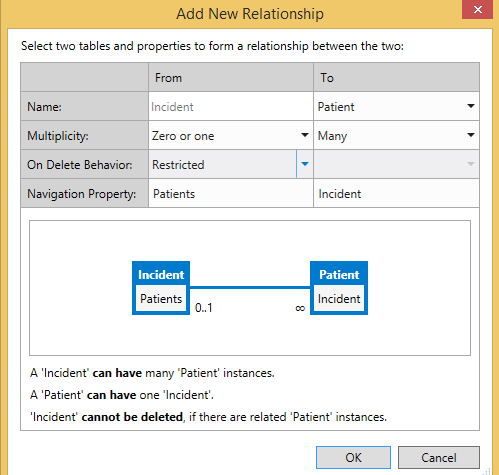
 

    <span data-ttu-id="2afbf-p110">Dadurch wird eine Null-oder-Eins-zu-Viele-Beziehung zwischen den Vorfällen und Patienten erstellt. Für einen Vorfalldatensatz ist kein Patient erforderlich, jedem Patienten muss jedoch ein Vorfalldatensatz zugeordnet werden.</span><span class="sxs-lookup"><span data-stu-id="2afbf-p110">This creates a zero or one to many relationship between incidents and patients. An incident record doesn't have to have a patient, but every patient has to have a related incident record.</span></span>
    
    
 

    
    <span data-ttu-id="2afbf-209">Im nächsten Schritt fügen Sie Bildschirme zum Anzeigen, Hinzufügen und Bearbeiten von Patient- und Vorfalldatensätzen hinzu.</span><span class="sxs-lookup"><span data-stu-id="2afbf-209">In the next step, you'll add screens to view, add, and edit both Patient and Incident records.</span></span>
    
 

### <a name="to-add-screens"></a><span data-ttu-id="2afbf-210">So fügen Sie Bildschirme hinzu</span><span class="sxs-lookup"><span data-stu-id="2afbf-210">To add screens</span></span>


1. <span data-ttu-id="2afbf-211">Öffnen Sie im **Projektmappen-Explorer** das Kontextmenü des Knotens **Incidents.lsml**, und klicken Sie auf **Öffnen**.</span><span class="sxs-lookup"><span data-stu-id="2afbf-211">In **Solution Explorer**, open the shortcut menu for the **Incidents.lsml** node and choose **Open**.</span></span>
    
 
2. <span data-ttu-id="2afbf-212">Klicken Sie im Bildschirm-Designer in der Leiste **Perspektive** auf die Registerkarte **HTML-Client** und anschließend in der Symbolleiste auf die Schaltfläche **Bildschirm**.</span><span class="sxs-lookup"><span data-stu-id="2afbf-212">In the screen designer, on the **Perspective** bar, choose the **HTML Client** tab, and then on the toolbar choose the **Screen** button.</span></span>
    
    <span data-ttu-id="2afbf-213">Das Dialogfeld **Neuen Bildschirm hinzufügen** wird geöffnet.</span><span class="sxs-lookup"><span data-stu-id="2afbf-213">The **Add New Screen** dialog box opens.</span></span>
    
 
3. <span data-ttu-id="2afbf-214">Klicken Sie im Dialogfeld **Neuen Bildschirm hinzufügen** in der Liste **Bildschirmvorlage auswählen** auf **Übliche Bildschirmanordnung**.</span><span class="sxs-lookup"><span data-stu-id="2afbf-214">In the **Add New Screen** dialog box, in the **Select a screen template** list, choose **Common Screen Set**.</span></span>
    
 
4. <span data-ttu-id="2afbf-215">Geben Sie in das Textfeld **Name der Bildschirmanordnung** „Vorfälle“ ein.</span><span class="sxs-lookup"><span data-stu-id="2afbf-215">In the **Screen Set Name** text box, enterIncidents.</span></span>
    
 
5. <span data-ttu-id="2afbf-216">Klicken Sie in der Liste **Bildschirmdaten** auf **Vorfälle**.</span><span class="sxs-lookup"><span data-stu-id="2afbf-216">In the **Screen Data** list, choose **Incidents**.</span></span>
    
 
6. <span data-ttu-id="2afbf-217">Aktivieren Sie die Kontrollkästchen **Vorfalldetails** und **Vorfallpatienten**, und klicken Sie dann auf **OK**.</span><span class="sxs-lookup"><span data-stu-id="2afbf-217">Select both the **Incident Details** and **Incident Patients** check boxes, and then choose the **OK** button.</span></span>
    
    <span data-ttu-id="2afbf-218">Abbildung 5 zeigt das Dialogfeld „Neuen Bildschirm hinzufügen“.</span><span class="sxs-lookup"><span data-stu-id="2afbf-218">Figure 5 shows the Add New Screen dialog.</span></span>
    

    <span data-ttu-id="2afbf-219">**Abbildung 5: Dialogfeld „Neuen Bildschirm hinzufügen“**</span><span class="sxs-lookup"><span data-stu-id="2afbf-219">**Figure 5. Add New Screen dialog**</span></span>

 

  
 

    <span data-ttu-id="2afbf-p111">Zu dem HTMLClient-Projekt werden Such-, Detailansicht- und Hinzufügen-/Bearbeiten-Bildschirme hinzugefügt. Der Such-Bildschirm wird automatisch als Startbildschirm der App festgelegt und die zum Starten der Anzeige- und Hinzufügen-/Bearbeiten-Bildschirme werden automatisch bereitgestellt.</span><span class="sxs-lookup"><span data-stu-id="2afbf-p111">Browse, View Details, and Add/Edit screens are added to the HTMLClient project. The Browse screen is automatically set as the home screen for the application, and the necessary commands for launching the View and Add/Edit screens are automatically provided.</span></span>
    
 
7. <span data-ttu-id="2afbf-p112">Klicken Sie in der Menüleiste auf **Debuggen**, **Debuggen starten**, um die Anwendung auszuführen. Geben Sie im Dialogfeld **Mit SharePoint verbinden** ggf. Benutzername und Kennwort ein.</span><span class="sxs-lookup"><span data-stu-id="2afbf-p112">On the menu bar, choose **Debug**, **Start Debugging** to run the application. If the **Connect to SharePoint** dialog box appears, enter your user name and password.</span></span>
    
 
8. <span data-ttu-id="2afbf-p113">Klicken Sie, wenn Sie dazu aufgefordert werden, auf die Schaltfläche **Vertrauen**. Das Add-In wird mit einem leeren Bildschirm geöffnet. Beachten Sie, dass der Bildschirmtitel **IncidentsSet** lautet.</span><span class="sxs-lookup"><span data-stu-id="2afbf-p113">If prompted, choose the **Trust It** button. The add-in will open with a blank screen. Notice that the screen title is **IncidentsSet**.</span></span>
    
 
9. <span data-ttu-id="2afbf-228">Klicken Sie auf die Schaltfläche **Hinzufügen**.</span><span class="sxs-lookup"><span data-stu-id="2afbf-228">Choose the **Add** button.</span></span>
    
    <span data-ttu-id="2afbf-p114">Das Dialogfeld **Incidents** wird geöffnet. Beachten Sie, dass während der Eingabe der Vorfalldaten keine Möglichkeit besteht, Patienten hinzuzufügen. Diese und andere Designprobleme können Sie durch Anpassen der Bildschirme beheben.</span><span class="sxs-lookup"><span data-stu-id="2afbf-p114">The **Incidents** dialog box opens. Notice that while you can enter incident data, there's no provision for adding patients. You'll fix that and other design issues by customizing the screens.</span></span>
    
    
 

    
    <span data-ttu-id="2afbf-232">Im nächsten Schritt passen Sie den Bildschirm „Durchsuchen“ an.</span><span class="sxs-lookup"><span data-stu-id="2afbf-232">In the next step, you'll customize the Browse screen.</span></span>
    
 
10. <span data-ttu-id="2afbf-233">Schließen Sie das Dialogfeld **Vorfälle**, und schließen Sie anschließend das Browserfenster, um in den Entwurfsmodus zurückzukehren.</span><span class="sxs-lookup"><span data-stu-id="2afbf-233">Close the **Incident** dialog box, and then close the browser window to return to design mode.</span></span>
    
 

### <a name="to-customize-the-browse-screen"></a><span data-ttu-id="2afbf-234">So passen Sie den Bildschirm „Durchsuchen“ an</span><span class="sxs-lookup"><span data-stu-id="2afbf-234">To customize the browse screen</span></span>


1. <span data-ttu-id="2afbf-235">Öffnen Sie im **Projektmappen-Explorer** das Kontextmenü des Knotens **BrowseIncidentsSet.lsml**, und klicken Sie dann auf **Öffnen**.</span><span class="sxs-lookup"><span data-stu-id="2afbf-235">In **Solution Explorer** screen, open the shortcut menu for the **BrowseIncidentsSet.lsml** node and choose **Open**.</span></span>
    
 
2. <span data-ttu-id="2afbf-236">Klicken Sie im Fenster **Eigenschaften** auf die Eigenschaft **Anzeigename**, und geben Sie „Vorfälle“ ein.</span><span class="sxs-lookup"><span data-stu-id="2afbf-236">In the **Properties** window, choose the **Display Name** property and enterIncidents.</span></span>
    
 
3. <span data-ttu-id="2afbf-237">Klicken Sie im Bildschirm-Designer auf den Knoten **Zeilenlayout | Zeilen**, erweitern Sie anschließend die Liste **Hinzufügen**, und klicken Sie dann auf **Vorfalladresse**.</span><span class="sxs-lookup"><span data-stu-id="2afbf-237">In the screen designer, choose the **Rows Layout | rows** node, and then expand the **Add** list and choose **Incident Address**.</span></span>
    
 
4. <span data-ttu-id="2afbf-238">Klicken Sie auf den Knoten **Ausrückzeit** und anschließend in der Symbolleiste auf die Schaltfläche **Löschen**.</span><span class="sxs-lookup"><span data-stu-id="2afbf-238">Choose the **Dispatch Time** node, and then on the toolbar choose the **Delete** button.</span></span>
    
    <span data-ttu-id="2afbf-239">Abbildung 6 zeigt das fertige Bildschirmlayout.</span><span class="sxs-lookup"><span data-stu-id="2afbf-239">Figure 6 shows the finished screen layout.</span></span>
    

    <span data-ttu-id="2afbf-240">**Abbildung 6: Layout des Bildschirms „Durchsuchen“**</span><span class="sxs-lookup"><span data-stu-id="2afbf-240">**Figure 6. Browse screen layout**</span></span>

 

  
 

    <span data-ttu-id="2afbf-242">Zur Laufzeit zeigt der Bildschirm eine Kachel für jeden Vorfall inklusive Vorfallnummer, -datum und -adresse an.</span><span class="sxs-lookup"><span data-stu-id="2afbf-242">At run time the screen will display a tile for each incident, and each tile will display the incident number, date, and address.</span></span>
    
    
 

    
    <span data-ttu-id="2afbf-243">Im nächsten Schritt passen Sie den Hinzufügen-/Bearbeiten-Bildschirm an.</span><span class="sxs-lookup"><span data-stu-id="2afbf-243">In the next step, you'll customize the Add/Edit screen.</span></span>
    
 

### <a name="to-customize-the-addedit-screen"></a><span data-ttu-id="2afbf-244">Anpassen des Bildschirms zum Hinzufügen/Bearbeiten</span><span class="sxs-lookup"><span data-stu-id="2afbf-244">To customize the add/edit screen</span></span>


1. <span data-ttu-id="2afbf-245">Öffnen Sie im **Projektmappen-Explorer** das Kontextmenü des Knotens **AddEditIncidents.lsml**, und klicken Sie dann auf **Öffnen**.</span><span class="sxs-lookup"><span data-stu-id="2afbf-245">In **Solution Explorer** screen, open the shortcut menu for the **AddEditIncidents.lsml** node and choose **Open**.</span></span>
    
 
2. <span data-ttu-id="2afbf-246">Wählen Sie die Knoten **Vorfalladresse**, **NameMeldender** und **TelefonMeldender**, und ziehen Sie sie in den Abschnitt **Zeilenlayout | links** unter dem Knoten **Vorfalltyp**.</span><span class="sxs-lookup"><span data-stu-id="2afbf-246">Choose the **Incident Address**, **Reporting Party Name**, and **Reporting Phone** nodes and drag them to the **Rows Layout | left** section, below the **Incident Type** node.</span></span>
    
 
3. <span data-ttu-id="2afbf-247">Klicken Sie auf den Knoten **Ausrückzeit**, und deaktivieren Sie im Fenster **Eigenschaften** das Kontrollkästchen **Datumsauswahl aktiviert**.</span><span class="sxs-lookup"><span data-stu-id="2afbf-247">Choose the **Dispatch Time** node, and in the **Properties** window clear the **Date Picker Enabled** check box.</span></span>
    
    <span data-ttu-id="2afbf-248">Das Datum wird nicht benötigt, da es immer mit dem Datum des Vorfalls identisch ist.</span><span class="sxs-lookup"><span data-stu-id="2afbf-248">The date isn't needed since it will always be the same as the incident date.</span></span>
    
 
4. <span data-ttu-id="2afbf-249">Klicken Sie im linken Bereich des Bildschirm-Designers auf den Link **Patienten hinzufügen**, wie in Abbildung 7 dargestellt.</span><span class="sxs-lookup"><span data-stu-id="2afbf-249">In the left pane of the screen designer, choose the **Add Patients** link, as shown in figure 7.</span></span>
    
    <span data-ttu-id="2afbf-250">**Abbildung 7: Der Link „Patienten hinzufügen“**</span><span class="sxs-lookup"><span data-stu-id="2afbf-250">**Figure 7. Add Patients link**</span></span>

 

  
 

 

 
5. <span data-ttu-id="2afbf-252">Klicken Sie im linken Bereich auf den Knoten **Patienten**, und ziehen Sie ihn im mittleren Bereich unter den Knoten **Vorfallkommandant**.</span><span class="sxs-lookup"><span data-stu-id="2afbf-252">In the left pane, choose the **Patients** node and drag it under the **Incident Commander** node in the center pane.</span></span>
    
    <span data-ttu-id="2afbf-253">Abbildung 8 zeigt das fertige Bildschirmlayout.</span><span class="sxs-lookup"><span data-stu-id="2afbf-253">Figure 8 shows the finished screen layout.</span></span>
    

    <span data-ttu-id="2afbf-254">**Abbildung 8: Das Layout des Bildschirms zum Hinzufügen/Bearbeiten**</span><span class="sxs-lookup"><span data-stu-id="2afbf-254">**Figure 8. The Add/Edit screen layout**</span></span>

 

  
 

    
 

    
    <span data-ttu-id="2afbf-256">Im nächsten Schritt erstellen Sie einen Bildschirm zum Hinzufügen von Patientendatensätzen.</span><span class="sxs-lookup"><span data-stu-id="2afbf-256">In the next step, you'll create a screen to add patient records.</span></span>
    
 

### <a name="to-add-a-patients-screen"></a><span data-ttu-id="2afbf-257">So fügen Sie einen Bildschirm „Patienten“ hinzu</span><span class="sxs-lookup"><span data-stu-id="2afbf-257">To add a Patients screen</span></span>


1. <span data-ttu-id="2afbf-258">Öffnen Sie im **Projektmappen-Explorer** das Kontextmenü des Knotens **AddEditIncidents.lsml**, und klicken Sie dann auf **Öffnen**.</span><span class="sxs-lookup"><span data-stu-id="2afbf-258">In **Solution Explorer** screen, open the shortcut menu for the **AddEditIncidents.lsml** node and choose **Open**.</span></span>
    
 
2. <span data-ttu-id="2afbf-259">Öffnen Sie im Bildschirm-Designer unter dem Knoten **Zeilenlayout | Details (Registerkarte)** das Kontextmenü des Knotens **Befehlsleiste**, und klicken Sie anschließend auf **Schaltfläche „Hinzufügen“**.</span><span class="sxs-lookup"><span data-stu-id="2afbf-259">In the screen designer, under the **Rows Layout | Details (Tab)** node, open the shortcut menu for the **Command Bar** node and choose **Add Button**.</span></span>
    
 
3. <span data-ttu-id="2afbf-260">Erweitern Sie im Dialogfeld **Schaltfläche „Hinzufügen“** die Liste **showTab**, und klicken Sie dann in der Gruppe **Patienten** auf **addAndEditNew**, und klicken Sie dann auf **OK**.</span><span class="sxs-lookup"><span data-stu-id="2afbf-260">In the **Add Button** dialog box, expand the **showTab** list and in the **Patients** group choose **addAndEditNew**, and then choose the **OK** button.</span></span>
    
    <span data-ttu-id="2afbf-261">Das Dialogfeld **Neuen Bildschirm hinzufügen** wird geöffnet.</span><span class="sxs-lookup"><span data-stu-id="2afbf-261">The **Add New Screen** dialog box opens.</span></span>
    
 
4. <span data-ttu-id="2afbf-262">Akzeptieren Sie im Dialogfeld **Neuen Bildschirm hinzufügen** die Standardwerte, und klicken Sie auf **OK**.</span><span class="sxs-lookup"><span data-stu-id="2afbf-262">In the **Add New Screen** dialog box, accept the default values and choose the **OK** button.</span></span>
    
    <span data-ttu-id="2afbf-263">Der Bildschirm **AddEditPatient** wird im Bildschirm-Designer geöffnet.</span><span class="sxs-lookup"><span data-stu-id="2afbf-263">The **AddEditPatient** screen opens in the screen designer.</span></span>
    
 
5. <span data-ttu-id="2afbf-264">Klicken Sie im Eigenschaftsfenster auf die Eigenschaft **Anzeigename**, und geben Sie „Patient hinzufügen“ ein.</span><span class="sxs-lookup"><span data-stu-id="2afbf-264">In the Properties window, choose the **Display Name** property and enterAdd Patient.</span></span>
    
 
6. <span data-ttu-id="2afbf-265">Wählen Sie im Bildschirm-Designer den Knoten **Vorfall**, und löschen Sie ihn.</span><span class="sxs-lookup"><span data-stu-id="2afbf-265">In the screen designer, choose the **Incident** node and delete it.</span></span>
    
    <span data-ttu-id="2afbf-266">Das Feld **Vorfälle** ist nicht erforderlich, da der Patient bereits mit einem Vorfall verknüpft ist.</span><span class="sxs-lookup"><span data-stu-id="2afbf-266">The **Incidents** field isn't needed since the patient is already associated with an incident.</span></span>
    
    <span data-ttu-id="2afbf-267">Abbildung 9 zeigt das fertige Bildschirmlayout.</span><span class="sxs-lookup"><span data-stu-id="2afbf-267">Figure 9 shows the finished screen layout.</span></span>
    

    <span data-ttu-id="2afbf-268">**Abbildung 9: Das Layout des Bildschirms zum Hinzufügen/Bearbeiten**</span><span class="sxs-lookup"><span data-stu-id="2afbf-268">**Figure 9. The Add/Edit screen layout**</span></span>

 

  
 

    
 

    
    <span data-ttu-id="2afbf-270">Im nächsten Schritt starten Sie das Add-In und fügen einige Daten hinzu.</span><span class="sxs-lookup"><span data-stu-id="2afbf-270">In the next step, you'll run the add-in and add some data.</span></span>
    
 

### <a name="to-test-the-add-in"></a><span data-ttu-id="2afbf-271">So testen Sie das Add-In</span><span class="sxs-lookup"><span data-stu-id="2afbf-271">To test the add-in</span></span>


1. <span data-ttu-id="2afbf-272">Klicken Sie in der Menüleiste auf **Debuggen**, **Debuggen starten**.</span><span class="sxs-lookup"><span data-stu-id="2afbf-272">On the menu bar, choose **Debug**, **Start Debugging**.</span></span>
    
 
2. <span data-ttu-id="2afbf-273">Klicken Sie im laufenden Add-In auf die Schaltfläche **Hinzufügen**.</span><span class="sxs-lookup"><span data-stu-id="2afbf-273">In the running add-in, choose the **Add** button.</span></span>
    
    <span data-ttu-id="2afbf-274">Das Popup **Vorfälle** wird geöffnet, wie in Abbildung 10 dargestellt.</span><span class="sxs-lookup"><span data-stu-id="2afbf-274">The **Incidents** Popup opens, as shown in figure 10.</span></span>
    

    <span data-ttu-id="2afbf-275">**Abbildung 10: Das Vorfälle-Popup**</span><span class="sxs-lookup"><span data-stu-id="2afbf-275">**Figure 10. The Incidents Popup**</span></span>

 

  
 

 

 
3. <span data-ttu-id="2afbf-277">Geben Sie im Textfeld **Vorfallnummer** die Zahl „2014-1“ ein.</span><span class="sxs-lookup"><span data-stu-id="2afbf-277">In the **Incident Number** text box, enter2014-1.</span></span>
    
 
4. <span data-ttu-id="2afbf-278">Verwenden Sie in den Feldern **Vorfalldatum** und **Ausrückzeit** die Steuerelemente **Datumsauswahl** und **Zeitauswahl**, um ein Datum und eine Uhrzeit auszuwählen.</span><span class="sxs-lookup"><span data-stu-id="2afbf-278">In the **Incident Date** and **Dispatch Time** fields, use the **Date Picker** and **Time Picker** controls to select a date and time.</span></span>
    
 
5. <span data-ttu-id="2afbf-279">Klicken Sie in der Liste **Vorfalltyp** auf **Hilfe - Lebensrettende Sofortmaßnahmen**.</span><span class="sxs-lookup"><span data-stu-id="2afbf-279">In the **Incident Type** list, choose **Aid - Basic Life Support**.</span></span>
    
 
6. <span data-ttu-id="2afbf-280">Geben Sie im Textfeld **Vorfalladresse** eine Postanschrift im Ort ein.</span><span class="sxs-lookup"><span data-stu-id="2afbf-280">In the **Incident Address** text box, enter a street address in your city.</span></span>
    
     <span data-ttu-id="2afbf-p115">Schließen Sie nicht den Ort, das Bundesland oder die Postleitzahl ein. Es wird vorausgesetzt, dass die Feuerwehr nur an einem Ort tätig ist.</span><span class="sxs-lookup"><span data-stu-id="2afbf-p115">Don't include city, state, or postal code. It's assumed that the fire department only serves one city.</span></span>
    
 
7. <span data-ttu-id="2afbf-283">Geben Sie im Steuerelement **Vorfallkommandant**-**Personenauswahl** den Namen eines Benutzers der SharePoint-Website ein.</span><span class="sxs-lookup"><span data-stu-id="2afbf-283">In the **Incident Commander** **Person Picker** control, enter the name of a user on your SharePoint site.</span></span>
    
    <span data-ttu-id="2afbf-284">Beachten Sie, dass während der Eingabe einer Liste mit allen übereinstimmenden Namen angezeigt wird.</span><span class="sxs-lookup"><span data-stu-id="2afbf-284">Notice that as you type a list of all matching names is displayed.</span></span>
    
 
8. <span data-ttu-id="2afbf-285">Klicken Sie auf die Schaltfläche **Patient hinzufügen**.</span><span class="sxs-lookup"><span data-stu-id="2afbf-285">Choose the **Add Patient** button.</span></span>
    
    <span data-ttu-id="2afbf-286">Das Popup **Patient hinzufügen** wird geöffnet, wie in Abbildung 11 dargestellt.</span><span class="sxs-lookup"><span data-stu-id="2afbf-286">The **Add Patient** Popup opens, as shown in Figure 11.</span></span>
    

    <span data-ttu-id="2afbf-287">**Abbildung 11: das Popup „Patient hinzufügen“**</span><span class="sxs-lookup"><span data-stu-id="2afbf-287">**Figure 11. The Add Patient Popup**</span></span>

 

  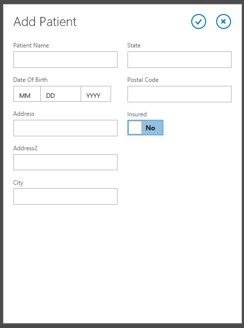
 

 

 
9. <span data-ttu-id="2afbf-289">Geben Sie Informationen zu einem Patienten ein, und klicken Sie anschließend auf **Speichern**.</span><span class="sxs-lookup"><span data-stu-id="2afbf-289">Enter information for a patient, and then choose the **Save** button.</span></span>
    
    <span data-ttu-id="2afbf-p116">Der Name des von Ihnen hinzugefügten Patienten wird im Popup **Vorfälle** angezeigt. Sie können bei Bedarf weitere Patienten hinzufügen.</span><span class="sxs-lookup"><span data-stu-id="2afbf-p116">The name of the patient that you added is displayed on the **Incidents** Popup. If you want, you can add more patients.</span></span>
    
 
10. <span data-ttu-id="2afbf-292">Klicken Sie im Popup **Vorfälle** auf **Speichern**.</span><span class="sxs-lookup"><span data-stu-id="2afbf-292">On the **Incidents** Popup, choose the **Save** button.</span></span>
    
    <span data-ttu-id="2afbf-p117">Wenn Sie die Anweisungen befolgen, wird eine Überprüfungsfehlermeldung angezeigt. Das Feld **TelefonMeldender** ist ein Pflichtfeld. Cloud-Business-Add-Ins verfügen über eine integrierte Prüfung für Pflichtfelder.</span><span class="sxs-lookup"><span data-stu-id="2afbf-p117">If you were following instructions, you will see a validation error message. The **Reporting Phone** field is a required field. Cloud Business Add-ins have built-in validation for required fields.</span></span>
    
 
11. <span data-ttu-id="2afbf-296">Geben Sie eine Telefonnummer ein, und klicken Sie erneut auf **Speichern**.</span><span class="sxs-lookup"><span data-stu-id="2afbf-296">Enter a phone number and then choose the **Save** button again.</span></span>
    
    <span data-ttu-id="2afbf-297">Auf dem Bildschirm **Vorfälle** wird eine Kachel mit der Vorfallnummer, dem -datum und der -adresse angezeigt.</span><span class="sxs-lookup"><span data-stu-id="2afbf-297">A tile is displayed on the home **Incidents** screen with the incident number, date, and address.</span></span>
    
 
12. <span data-ttu-id="2afbf-298">Wählen Sie die Kachel aus, um den Ansichtsbildschirm für den Vorfall zu öffnen.</span><span class="sxs-lookup"><span data-stu-id="2afbf-298">Choose the tile to open the View screen for the incident.</span></span>
    
    <span data-ttu-id="2afbf-299">Beachten Sie, dass das Feld **TelefonMeldender** als Hyperlink angezeigt wird, der einen direkten Zugriff auf Ihre Standard-Telefonanwendung bereitstellt.</span><span class="sxs-lookup"><span data-stu-id="2afbf-299">Notice that the **Reporting Phone** field is displayed as a hyperlink, providing direct access to your default phone application.</span></span>
    
 
13. <span data-ttu-id="2afbf-300">Klicken Sie zum Öffnen des Bildschirms **AddEditIncidents** auf die Schaltfläche **Bearbeiten** und anschließend auf die Schaltfläche **Verwerfen**, um zum Bildschirm **Anzeige** zurückzukehren.</span><span class="sxs-lookup"><span data-stu-id="2afbf-300">Choose the **Edit** button to open the **AddEditIncidents** screen, and the choose the **Discard** button to return to the **View** screen.</span></span>
    
 
14. <span data-ttu-id="2afbf-301">Klicken Sie auf die Registerkarte **Patienten**, um eine Liste der Patienten anzuzeigen, und wählen Sie anschließend eine Patienten-Kachel.</span><span class="sxs-lookup"><span data-stu-id="2afbf-301">Choose the **Patients** tab to display a list of patients, and then choose a patient tile.</span></span>
    
    <span data-ttu-id="2afbf-p118">Beachten Sie, dass kein Ansichtsbildschirm für den Patienten geöffnet wird. Dies kommt daher, dass Sie noch keinen Patienten erstellt haben.</span><span class="sxs-lookup"><span data-stu-id="2afbf-p118">Notice that it doesn't open a view screen for the patient. That's because you haven't created one yet.</span></span>
    
 
15. <span data-ttu-id="2afbf-304">Klicken Sie in Ihrem Browser auf **Schließen**, um zum Entwurfsmodus zurückzukehren.</span><span class="sxs-lookup"><span data-stu-id="2afbf-304">Choose the **Close** button in your browser to return to design mode.</span></span>
    
    
 

    
    <span data-ttu-id="2afbf-305">Im nächsten Schritt fügen Sie einen Bildschirm zum Anzeigen von Patienten hinzu.</span><span class="sxs-lookup"><span data-stu-id="2afbf-305">In the next step, you'll add a screen to view patients.</span></span>
    
 

### <a name="to-add-a-view-screen"></a><span data-ttu-id="2afbf-306">So fügen Sie einen Ansichtsbildschirm hinzu</span><span class="sxs-lookup"><span data-stu-id="2afbf-306">To add a view screen</span></span>


1. <span data-ttu-id="2afbf-307">Öffnen Sie im **Projektmappen-Explorer** das Kontextmenü des Knotens **Patients.lsml**, und klicken Sie dann auf **Öffnen**.</span><span class="sxs-lookup"><span data-stu-id="2afbf-307">In **Solution Explorer** screen, open the shortcut menu for the **Patients.lsml** node and choose **Open**.</span></span>
    
 
2. <span data-ttu-id="2afbf-308">Klicken Sie im Entity Designer in der Leiste **Perspektive** auf **HTMLClient** und anschließend in der Symbolleiste auf die Schaltfläche **Bildschirm**.</span><span class="sxs-lookup"><span data-stu-id="2afbf-308">In the entity designer, on the **Perspective** bar, choose **HTMLClient**, and then on the toolbar choose the **Screen** button.</span></span>
    
    <span data-ttu-id="2afbf-309">Das Dialogfeld **Neuen Bildschirm hinzufügen** wird geöffnet.</span><span class="sxs-lookup"><span data-stu-id="2afbf-309">The **Add New Screen** dialog box opens.</span></span>
    
 
3. <span data-ttu-id="2afbf-310">Klicken Sie im Dialogfeld **Neuen Bildschirm hinzufügen** in der Liste **Bildschirmvorlage auswählen** auf **Bildschirm zum Anzeigen von Details**.</span><span class="sxs-lookup"><span data-stu-id="2afbf-310">In the **Add New Screen** dialog box, in the **Select a screen template** list, choose **View Details Screen**.</span></span>
    
 
4. <span data-ttu-id="2afbf-311">Geben Sie im Textfeld **Bildschirmname****AnsichtPatient** ein, klicken Sie in der Liste **Bildschirmdaten** auf **Patient**, und klicken Sie dann auf **OK**.</span><span class="sxs-lookup"><span data-stu-id="2afbf-311">In the **Screen Name** text box, enter **ViewPatient**, choose **Patient** in the **Screen Data** list, and then choose the **OK** button.</span></span>
    
    <span data-ttu-id="2afbf-312">Der Bildschirm **AnsichtPatient** wird im Bildschirm-Designer geöffnet.</span><span class="sxs-lookup"><span data-stu-id="2afbf-312">The **ViewPatient** screen opens in the screen designer.</span></span>
    
 
5. <span data-ttu-id="2afbf-313">Öffnen Sie im Bildschirm-Designer unter dem Knoten **Zeilenlayout | Details (Registerkarte)** das Kontextmenü des Knotens **Befehlsleiste**, und klicken Sie anschließend auf **Schaltfläche „Hinzufügen“**.</span><span class="sxs-lookup"><span data-stu-id="2afbf-313">In the screen designer, under the **Rows Layout | Details (Tab)** node, open the shortcut menu for the **Command Bar** node and choose **Add Button**.</span></span>
    
 
6. <span data-ttu-id="2afbf-314">Erweitern Sie im Dialogfeld **Schaltfläche „Hinzufügen“** die Liste **showTab**, klicken Sie in der Gruppe **Patient** auf **Bearbeiten**, und klicken Sie dann auf **OK**.</span><span class="sxs-lookup"><span data-stu-id="2afbf-314">In the **Add Button** dialog box, expand the **showTab** list and in the **Patient** group choose **Edit**, and then choose the **OK** button.</span></span>
    
 
7. <span data-ttu-id="2afbf-315">Führen Sie die Anwendung aus, und überprüfen Sie, ob Sie nun die Patientendatensätze anzeigen und bearbeiten können.</span><span class="sxs-lookup"><span data-stu-id="2afbf-315">Run the application and verify that you can now view and edit patient records.</span></span>
    
    
 

    
    <span data-ttu-id="2afbf-p119">Sie haben jetzt ein voll funktionsfähiges Vorfallverwaltungs-Add-In entwickelt, Sie können jedoch noch viel mehr mit Cloud-Geschäfts-Add-Ins machen. Im nächsten Abschnitt erfahren Sie, wie Sie Ressourcen auf der SharePoint-Website aus dem Vorfallverwaltungs-Add-In verwenden können.</span><span class="sxs-lookup"><span data-stu-id="2afbf-p119">You have now built a fully functional incident management add-in, but there's much more you can do with Cloud Business Add-ins. In the next section, you'll learn how to utilize resources on the SharePoint site from the incident management add-in.</span></span>
    
 

## <a name="integrate-sharepoint-resources"></a><span data-ttu-id="2afbf-318">Integrieren von SharePoint-Ressourcen</span><span class="sxs-lookup"><span data-stu-id="2afbf-318">Integrate SharePoint Resources</span></span>
<span data-ttu-id="2afbf-319"><a name="integrate"> </a></span><span class="sxs-lookup"><span data-stu-id="2afbf-319"></span></span>

<span data-ttu-id="2afbf-p120">Die Contoso-Feuerwehr hat mit der Verwendung des Vorfallverwaltungs-Add-Ins begonnen und wie üblich bei Softwareentwicklungsprojekten fragen sie nun ein neues Feature an. Zusätzlich zu Vorfall- und Patienteninformationen benötigen sie außerdem Funktionen zum Verwalten von Ressourcen wie Feuerlöschgeräten und Personal. Sie besitzen bereits Geräte- und Personallisten auf ihrer SharePoint-Website, die Sie als weitere Datenquelle für das Add-In nutzen.</span><span class="sxs-lookup"><span data-stu-id="2afbf-p120">The Contoso Fire Department has started using the Incident Manager add-in, and as is typical in software development projects they are now requesting a new feature. In addition to incident and patient information, they also need to manage resources such as fire apparatus and personnel. They already have lists of apparatus and personnel on their SharePoint site, so you will utilize those lists as another data source for the add-in.</span></span>
 

 
<span data-ttu-id="2afbf-323">Im ersten Schritt fügen Sie Ihrer Entwicklerwebsite einige vorausgefüllte Listenvorlagen hinzu.</span><span class="sxs-lookup"><span data-stu-id="2afbf-323">The first step is to add a couple of pre-populated list templates to your developer site.</span></span>
 

 

### <a name="to-add-list-templates"></a><span data-ttu-id="2afbf-324">So fügen Sie Listenvorlagen hinzu</span><span class="sxs-lookup"><span data-stu-id="2afbf-324">To add list templates</span></span>


1. <span data-ttu-id="2afbf-325">Klicken Sie in der Menüleiste auf **Debuggen**, **Debuggen starten**, um das Add-In auszuführen.</span><span class="sxs-lookup"><span data-stu-id="2afbf-325">On the menu bar, choose **Debug**, **Start Debugging** to run the add-in.</span></span>
    
 
2. <span data-ttu-id="2afbf-326">Klicken Sie in dem laufenden Add-In in der Chromleiste auf den Link **Zurück zur Website**, um zu Ihrer SharePoint-Entwicklerwebsite zu navigieren, wie in Abbildung 12 dargestellt.</span><span class="sxs-lookup"><span data-stu-id="2afbf-326">In the running add-in, on the chrome bar, choose **Back to site** link to navigate to your SharePoint developer site, as shown in Figure 12.</span></span>
    
    <span data-ttu-id="2afbf-327">**Abbildung 12: Der Link „Zurück zur Website“**</span><span class="sxs-lookup"><span data-stu-id="2afbf-327">**Figure 12. The Back to site link**</span></span>

 

  
 

 

 
3. <span data-ttu-id="2afbf-329">Klicken Sie auf der Seite **Entwickler** auf den Link **Websiteinhalte**.</span><span class="sxs-lookup"><span data-stu-id="2afbf-329">On the **Developer** page, choose the **Site Contents** link.</span></span>
    
 
4. <span data-ttu-id="2afbf-330">Klicken Sie auf der Seite **Websiteinhalte** auf den Link **Einstellungen**, wie in Abbildung 13 dargestellt.</span><span class="sxs-lookup"><span data-stu-id="2afbf-330">On the **Site Contents** page, choose the **Settings** link, as shown in Figure 13.</span></span>
    
    <span data-ttu-id="2afbf-331">**Abbildung 13: Der Link „Einstellungen“**</span><span class="sxs-lookup"><span data-stu-id="2afbf-331">**Figure 13. The Settings link**</span></span>

 

  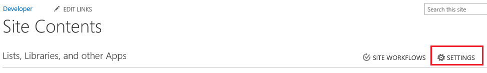
 

 

 
5. <span data-ttu-id="2afbf-333">Klicken Sie auf der Seite **Websiteeinstellungen** in der Liste **Web-Designer-Kataloge** auf den Link **Listenvorlagen**, wie in Abbildung 14 dargestellt.</span><span class="sxs-lookup"><span data-stu-id="2afbf-333">On the **Site Settings** page, in the **Web Designer Galleries** list, choose the **List templates** link as shown in Figure 14.</span></span>
    
    <span data-ttu-id="2afbf-334">**Abbildung 14: Der Link „Listenvorlagen“**</span><span class="sxs-lookup"><span data-stu-id="2afbf-334">**Figure 14. The List templates link**</span></span>

 

  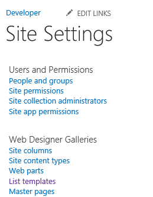
 

 

 
6. <span data-ttu-id="2afbf-336">Klicken Sie auf der Seite **Listenvorlagenkatalog** auf die Registerkarte **DATEIEN** und anschließend im Menüband auf die Schaltfläche **Dokument hochladen**.</span><span class="sxs-lookup"><span data-stu-id="2afbf-336">On the **List Template Gallery** page, choose the **FILES** tab, and then on the ribbon choose the **Upload Document** button.</span></span>
    
 
7. <span data-ttu-id="2afbf-337">Klicken Sie im Dialogfeld **Vorlage hinzufügen** auf die Schaltfläche **Durchsuchen** und navigieren Sie anschließend zu dem heruntergeladenen Vorfallverwaltungsbeispiel im Ordner **Ressourcen**.</span><span class="sxs-lookup"><span data-stu-id="2afbf-337">In the **Add a template** dialog box, choose the **Browse** button and then navigate to the **Resources** folder for the downloaded Incident Management sample.</span></span>
    
 
8. <span data-ttu-id="2afbf-338">Klicken Sie auf die Datei **ContosoApparatus.stp**, dann auf **Öffnen** und schließlich auf **OK**.</span><span class="sxs-lookup"><span data-stu-id="2afbf-338">Choose the **ContosoApparatus.stp** file and choose the **Open** button, then choose the **OK** button.</span></span>
    
 
9. <span data-ttu-id="2afbf-339">Klicken Sie im Dialogfeld **Listenvorlagenkatalog** auf die Schaltfläche **Speichern**.</span><span class="sxs-lookup"><span data-stu-id="2afbf-339">In the **List Template Gallery** dialog box, choose the **Save** button.</span></span>
    
 
10. <span data-ttu-id="2afbf-340">Wiederholen Sie diesen Vorgang, und laden Sie dann die **ContosoPersonnel.stp**-Datei hoch.</span><span class="sxs-lookup"><span data-stu-id="2afbf-340">Repeat the process and upload the **ContosoPersonnel.stp** file.</span></span>
    
    <span data-ttu-id="2afbf-341">**Abbildung 15: Die hochgeladenen Dateien**</span><span class="sxs-lookup"><span data-stu-id="2afbf-341">**Figure 15. The uploaded files**</span></span>

 

  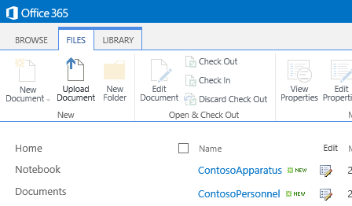
 

 

 
11. <span data-ttu-id="2afbf-343">Klicken Sie auf den Link **Websiteinhalte**, und klicken Sie dann auf der Seite **Websiteinhalte** auf die Kachel **Add-In hinzufügen**.</span><span class="sxs-lookup"><span data-stu-id="2afbf-343">Choose the **Site Contents** link, and on the **Site Contents** page choose the **add an add-in** tile.</span></span>
    
 
12. <span data-ttu-id="2afbf-344">Klicken Sie auf der Seite **Websiteinhalte > Ihre Add-Ins** auf die Kachel **Contoso-Geräte**.</span><span class="sxs-lookup"><span data-stu-id="2afbf-344">On the **Site Contents > Your Add-ins** page, choose the **Contoso Apparatus** tile.</span></span>
    
     <span data-ttu-id="2afbf-345">**Hinweis** Möglicherweise müssen Sie auf die zweite Seite der Add-Ins wechseln, um die Kachel **Contoso-Geräte** zu finden.</span><span class="sxs-lookup"><span data-stu-id="2afbf-345">**Note** You may need to go to the second page of add-ins to find the **Contoso Apparatus** tile.</span></span>
13. <span data-ttu-id="2afbf-346">Klicken Sie im Dialogfeld **Benutzerdefinierte Liste hinzufügen** auf das Textfeld **Name**, geben Sie „Contoso-Geräte“ ein, und klicken Sie anschließend auf die Schaltfläche **Erstellen**.</span><span class="sxs-lookup"><span data-stu-id="2afbf-346">In the **Adding Custom List** dialog box, choose the **Name** text box and enterContoso Apparatus, and then choose the **Create** button.</span></span>
    
 
14. <span data-ttu-id="2afbf-347">Wiederholen Sie den Vorgang, und fügen Sie die **Contoso-Personal**-Liste hinzu, geben Sie dabei als Namen „Contoso-Personal“ ein.</span><span class="sxs-lookup"><span data-stu-id="2afbf-347">Repeat the process and add the **Contoso Personnel** list, enteringContoso Personnel as the name.</span></span>
    
 
15. <span data-ttu-id="2afbf-348">Überprüfen Sie auf der Seite **Websiteinhalte**, dass nun die Listen **Contoso-Geräte** und **Contoso-Personal** angezeigt werden.</span><span class="sxs-lookup"><span data-stu-id="2afbf-348">On the **Site Contents** page, verify that the **Contoso Apparatus** and **Contoso Personnel** lists now appear.</span></span>
    
    
 

    
    <span data-ttu-id="2afbf-349">Im nächsten Schritt fügen Sie Ihre SharePoint-Website als Datenquelle hinzu.</span><span class="sxs-lookup"><span data-stu-id="2afbf-349">In the next step, you'll add your SharePoint site as a data source.</span></span>
    
 

### <a name="to-add-a-sharepoint-data-source"></a><span data-ttu-id="2afbf-350">So fügen Sie eine SharePoint-Datenquelle hinzu</span><span class="sxs-lookup"><span data-stu-id="2afbf-350">To add a SharePoint data source</span></span>


1. <span data-ttu-id="2afbf-351">Öffnen Sie im **Projektmappen-Explorer** das Kontextmenü des Knotens **Datenquellen**, und klicken Sie dann auf **Datenquelle hinzufügen**.</span><span class="sxs-lookup"><span data-stu-id="2afbf-351">In **Solution Explorer**, open the shortcut menu for the **Data Sources** node and choose **Add Data Source**.</span></span>
    
    <span data-ttu-id="2afbf-352">Der **Assistent zum Hinzufügen von Datenquellen** wird geöffnet.</span><span class="sxs-lookup"><span data-stu-id="2afbf-352">The **Attach Data Source Wizard** opens.</span></span>
    
 
2. <span data-ttu-id="2afbf-353">Klicken Sie im **Assistent zum Hinzufügen von Datenquellen** auf das **SharePoint**-Symbol, wie in Abbildung 16 dargestellt, und anschließend auf die Schaltfläche **Weiter**.</span><span class="sxs-lookup"><span data-stu-id="2afbf-353">In the **Attach Data Source Wizard**, choose the **SharePoint** icon as shown in Figure 16, and then choose the **Next** button.</span></span>
    
    <span data-ttu-id="2afbf-354">**Abbildung 16: SharePoint-Datenquelle**</span><span class="sxs-lookup"><span data-stu-id="2afbf-354">**Figure 16. SharePoint data source**</span></span>

 

  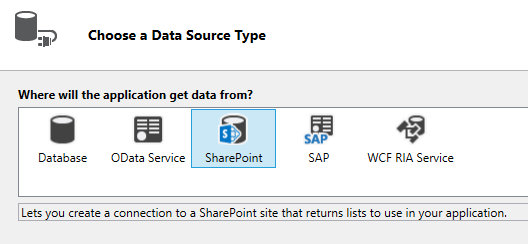
 

 

 
3. <span data-ttu-id="2afbf-356">Überprüfen Sie auf der Seite **Verbindungsinformationen eingeben**, dass die URL Ihrer SharePoint-Entwicklerwebsite korrekt ist, und klicken Sie anschließend auf **Weiter**.</span><span class="sxs-lookup"><span data-stu-id="2afbf-356">On the **Enter Connection Information** page, verify that the URL for your SharePoint developer site is correct, and then choose the **Next** button.</span></span>
    
 
4. <span data-ttu-id="2afbf-357">Aktivieren Sie auf der Seite **SharePoint-Elemente auswählen** die Kontrollkästchen der Listen **Contoso-Gerät** und **Contoso-Personal**, wie in Abbildung 17 dargestellt, und klicken Sie anschließend auf **Fertig stellen**.</span><span class="sxs-lookup"><span data-stu-id="2afbf-357">On the **Choose your SharePoint Items** page, select the check boxes for the **ContosoApparatus** and **ContosoPersonnel** lists as shown in Figure 17, and then choose the **Finish** button.</span></span>
    
    <span data-ttu-id="2afbf-358">**Abbildung 17: Die ausgewählten Listen**</span><span class="sxs-lookup"><span data-stu-id="2afbf-358">**Figure 17. The selected lists**</span></span>

 

  
 

    <span data-ttu-id="2afbf-360">Die Entitäten werden unter dem Knoten **Datenquellen** im **Projektmappen-Explorer** zu einem neuen **Entwicklerdaten**-Knoten hinzugefügt und die Entität **Contoso-Geräte** wird im Entity Designer geöffnet.</span><span class="sxs-lookup"><span data-stu-id="2afbf-360">The entities are added to a new **Developer Data** node under the **Data Sources** node in **Solution Explorer**, and the **ContosoApparatus** entity opens in the entity designer.</span></span>
    
    
     <span data-ttu-id="2afbf-p121">**Hinweis** Sie haben vielleicht bemerkt, dass außerdem eine **UserInformationLists**-Entität hinzugefügt wurde. Diese Liste wird von SharePoint zum Verwalten der Felder **CreatedBy** und **ModifiedBy** für Listen verwendet.</span><span class="sxs-lookup"><span data-stu-id="2afbf-p121">**Note** You may have noticed that a **UserInformationLists** entity was also added. This list is used by SharePoint to manage the **CreatedBy** and **ModifiedBy** fields for lists.</span></span>
5. <span data-ttu-id="2afbf-363">Klicken Sie im Fenster **Eigenschaften** auf die Eigenschaft **Anzeigename**, und ändern Sie ihn zu „Geräte“.</span><span class="sxs-lookup"><span data-stu-id="2afbf-363">In the **Properties** window, choose the **Display Name** property and change it toApparatus.</span></span>
    
    
 

    
    <span data-ttu-id="2afbf-p122">Im nächsten Schritt definieren Sie eine Abfrage, um die von der **ApparatusSet**-Entität zurückgegebenen Daten zu begrenzen. In diesem Fall möchten Sie nur Geräte anzeigen, die in Betrieb sind.</span><span class="sxs-lookup"><span data-stu-id="2afbf-p122">In the next step, you'll define a query to limit the data returned from the **ApparatusSet** entity. In this case, you only want to see apparatus that are in service.</span></span>
    
 

### <a name="to-define-the-availableapparatus-query"></a><span data-ttu-id="2afbf-366">So definieren Sie die AvailableApparatus-Abfrage</span><span class="sxs-lookup"><span data-stu-id="2afbf-366">To define the AvailableApparatus query</span></span>


1. <span data-ttu-id="2afbf-367">Öffnen Sie im **Projektmappen-Explorer** das Kontextmenü des Knotens **ApparatusSet.lsml**, und klicken Sie dann auf **Abfrage hinzufügen**.</span><span class="sxs-lookup"><span data-stu-id="2afbf-367">In **Solution Explorer**, open the shortcut menu for the **ApparatusSet.lsml** node and choose **Add Query**.</span></span>
    
    <span data-ttu-id="2afbf-368">Der Abfrage-Designer wird geöffnet.</span><span class="sxs-lookup"><span data-stu-id="2afbf-368">The query designer opens.</span></span>
    
 
2. <span data-ttu-id="2afbf-369">Klicken Sie im Fenster **Eigenschaften** auf die Eigenschaft **Name**, und geben Sie „VerfügbareGeräte“ ein.</span><span class="sxs-lookup"><span data-stu-id="2afbf-369">In the **Properties** window, choose the **Name** property and enterAvailableApparatus.</span></span>
    
 
3. <span data-ttu-id="2afbf-370">Klicken Sie im Abfrage-Designer auf den Link **Filter hinzufügen** und in der zweiten Dropdownliste auf **Verfügbar**.</span><span class="sxs-lookup"><span data-stu-id="2afbf-370">In the query designer, choose the **Add Filter** link, and in the second drop-down list choose **Available**.</span></span>
    
 
4. <span data-ttu-id="2afbf-371">Ändern Sie in dem letzten Textfeld **False** zu **True**.</span><span class="sxs-lookup"><span data-stu-id="2afbf-371">In the last text box, change **False** to **True**.</span></span>
    
    <span data-ttu-id="2afbf-372">Abbildung 18 zeigt die Abfrage.</span><span class="sxs-lookup"><span data-stu-id="2afbf-372">Figure 18 shows the query.</span></span>
    

    <span data-ttu-id="2afbf-373">**Abbildung 18: Die Abfrage „VerfügbareGeräte“**</span><span class="sxs-lookup"><span data-stu-id="2afbf-373">**Figure 18. The AvailableApparatus query**</span></span>

 

  
 

    
 

    
    <span data-ttu-id="2afbf-p123">Im nächsten Schritt definieren Sie eine weitere Abfrage für die **ContosoPersonnel**-Entität. In diesem Fall möchten Sie nur Personal anzeigen, dem die „A"-Schicht zugeteilt wurde.</span><span class="sxs-lookup"><span data-stu-id="2afbf-p123">In the next step, you'll define another query for the **ContosoPersonnel** entity. In this case, you only want to see personnel that are assigned to the "A" shift.</span></span>
    
 

### <a name="to-define-the-availablepersonnel-query"></a><span data-ttu-id="2afbf-377">So definieren Sie die Abfrage „VerfügbaresPersonal“</span><span class="sxs-lookup"><span data-stu-id="2afbf-377">To define the AvailablePersonnel query</span></span>


1. <span data-ttu-id="2afbf-378">Öffnen Sie im **Projektmappen-Explorer** das Kontextmenü des Knotens **ContosoPersonnels.lsml**, und klicken Sie dann auf **Abfrage hinzufügen**.</span><span class="sxs-lookup"><span data-stu-id="2afbf-378">In **Solution Explorer**, open the shortcut menu for the **ContosoPersonnels.lsml** node and choose **Add Query**.</span></span>
    
    <span data-ttu-id="2afbf-379">Der Abfrage-Designer wird geöffnet.</span><span class="sxs-lookup"><span data-stu-id="2afbf-379">The query designer opens.</span></span>
    
 
2. <span data-ttu-id="2afbf-380">Klicken Sie im Fenster **Eigenschaften** auf die Eigenschaft **Name**, und geben Sie „VerfügbaresPersonal“ ein.</span><span class="sxs-lookup"><span data-stu-id="2afbf-380">In the **Properties** window, choose the **Name** property and enterAvailablePersonnel.</span></span>
    
 
3. <span data-ttu-id="2afbf-381">Klicken Sie im Abfrage-Designer auf den Link **Filter hinzufügen** und in der zweiten Dropdownliste auf **Schicht**.</span><span class="sxs-lookup"><span data-stu-id="2afbf-381">In the query designer, choose the **Add Filter** link, and in the second drop-down list choose **Shift**.</span></span>
    
 
4. <span data-ttu-id="2afbf-382">Geben Sie im letzten Textfeld **A** ein.</span><span class="sxs-lookup"><span data-stu-id="2afbf-382">In the last text box, enter **A**.</span></span>
    
    <span data-ttu-id="2afbf-383">Abbildung 19 zeigt die Abfrage.</span><span class="sxs-lookup"><span data-stu-id="2afbf-383">Figure 19 shows the query.</span></span>
    

    <span data-ttu-id="2afbf-384">**Abbildung 19: Die Abfrage „VerfügbaresPersonal“**</span><span class="sxs-lookup"><span data-stu-id="2afbf-384">**Figure 19. The AvailablePersonnel query**</span></span>

 

  
 

    
 

    
    <span data-ttu-id="2afbf-386">Im nächsten Schritt fügen Sie zum **ViewIncidents**-Bildschirm Listen der verfügbaren Geräte und des verfügbaren Personals hinzu.</span><span class="sxs-lookup"><span data-stu-id="2afbf-386">In the next step, you'll add lists of available apparatus and personnel to the **ViewIncidents** screen.</span></span>
    
 

### <a name="to-add-queries-to-the-screen"></a><span data-ttu-id="2afbf-387">So fügen Sie dem Bildschirm Abfragen hinzu</span><span class="sxs-lookup"><span data-stu-id="2afbf-387">To add queries to the screen</span></span>


1. <span data-ttu-id="2afbf-388">Öffnen Sie im **Projektmappen-Explorer** das Kontextmenü des Knotens **ViewIncidents.lsml**, und klicken Sie dann auf **Öffnen**.</span><span class="sxs-lookup"><span data-stu-id="2afbf-388">In **Solution Explorer**, open the shortcut menu for the **ViewIncidents.lsml** node and choose **Open**.</span></span>
    
 
2. <span data-ttu-id="2afbf-389">Öffnen Sie im Bildschirm-Designer das Kontextmenü des Knotens **Registerkarte**, und klicken Sie dann auf **Registerkarte hinzufügen**.</span><span class="sxs-lookup"><span data-stu-id="2afbf-389">In the screen designer, open the shortcut menu for the **Tab** node and choose **Add Tab**.</span></span>
    
 
3. <span data-ttu-id="2afbf-390">Ändern Sie im Fenster **Eigenschaften** die Eigenschaft **Name** in „Ressourcen“.</span><span class="sxs-lookup"><span data-stu-id="2afbf-390">In the **Properties** window, change the **Name** property toResources.</span></span>
    
 
4. <span data-ttu-id="2afbf-391">Klicken Sie im Bildschirm-Designer in der Symbolleiste auf **Datenelement hinzufügen**.</span><span class="sxs-lookup"><span data-stu-id="2afbf-391">In the screen designer, on the toolbar, choose **Add Data Item**.</span></span>
    
    <span data-ttu-id="2afbf-392">Das Dialogfeld **Datenelement hinzufügen** wird geöffnet.</span><span class="sxs-lookup"><span data-stu-id="2afbf-392">The **Add Data Item** dialog box opens.</span></span>
    
 
5. <span data-ttu-id="2afbf-393">Klicken Sie im Dialogfeld **Datenelement hinzufügen** auf die Optionsschaltfläche **Abfrage**.</span><span class="sxs-lookup"><span data-stu-id="2afbf-393">In the **Add Data Item** dialog box, choose the **Query** option button.</span></span>
    
 
6. <span data-ttu-id="2afbf-394">Klicken Sie in der Liste auf **DeveloperData.AvailableApparatus**, wie in Abbildung 20 dargestellt, und anschließend auf **OK**.</span><span class="sxs-lookup"><span data-stu-id="2afbf-394">In the list, choose **DeveloperData.AvailableApparatus** as shown in Figure 20, and then choose the **OK** button.</span></span>
    
    <span data-ttu-id="2afbf-395">**Abbildung 20: Die Abfrage „VerfügbareGeräte“**</span><span class="sxs-lookup"><span data-stu-id="2afbf-395">**Figure 20. The AvailableApparatus query**</span></span>

 

  
 

    <span data-ttu-id="2afbf-397">Die **AvailableApparatus**-Sammlung wird im linken Bereich des Bildschirm-Designers hinzugefügt.</span><span class="sxs-lookup"><span data-stu-id="2afbf-397">The **AvailableApparatus** collection is added to the left pane of the screen designer.</span></span>
    
 
7. <span data-ttu-id="2afbf-398">Wiederholen Sie den Vorgang, um die **VerfügbaresPersonal**-Abfrage zum Bildschirm hinzuzufügen.</span><span class="sxs-lookup"><span data-stu-id="2afbf-398">Repeat the process to add the **AvailablePersonnel** query to the screen.</span></span>
    
 
8. <span data-ttu-id="2afbf-399">Öffnen Sie unter dem Knoten **Zeilenlayout | Ressourcen** die **Hinzufügen**-Liste, und klicken Sie dann auf **Verfügbare Geräte**.</span><span class="sxs-lookup"><span data-stu-id="2afbf-399">Under the **Rows Layout | Resources** node, open the **Add** list and choose **Available Apparatus**.</span></span>
    
 
9. <span data-ttu-id="2afbf-400">Klicken Sie auf den Knoten **Liste | Verfügbare Geräte**, öffnen Sie die Liste **Liste**, und klicken Sie dann auf **Kachelliste**.</span><span class="sxs-lookup"><span data-stu-id="2afbf-400">Choose the **List | Available Apparatus** node, open the **List** list and choose **Tile List**.</span></span>
    
 
10. <span data-ttu-id="2afbf-401">Löschen Sie alle Elemente unter dem Knoten **Zeilenlayout | Contoso-Geräte**, außer **Gerätenummer** und **Gerätetyp**.</span><span class="sxs-lookup"><span data-stu-id="2afbf-401">Delete all of the items under the **Rows Layout | Contoso Apparatus** node except for **Apparatus Number** and **Apparatus Type**.</span></span>
    
 
11. <span data-ttu-id="2afbf-402">Öffnen Sie unter dem Knoten **Zeilenlayout | Ressourcen** die **Hinzufügen**-Liste, und klicken Sie dann auf **Verfügbares Personal**.</span><span class="sxs-lookup"><span data-stu-id="2afbf-402">Under the **Rows Layout | Resources** node, open the **Add** list and choose **Available Personnel**.</span></span>
    
 
12. <span data-ttu-id="2afbf-403">Klicken Sie auf den Knoten **Liste | Verfügbares Personal**, öffnen Sie die Liste **Liste**, und klicken Sie dann auf **Tabelle**.</span><span class="sxs-lookup"><span data-stu-id="2afbf-403">Choose the **List | Available Personnel** node, open the **List** list and choose **Table**.</span></span>
    
 
13. <span data-ttu-id="2afbf-404">Löschen Sie alle Elemente unter dem Knoten **Tabellenzeile | Contoso-Personal**, außer **Name**, **Rang** und **Zuweisung**.</span><span class="sxs-lookup"><span data-stu-id="2afbf-404">Delete all of the items under the **Table Row | Contoso Personnel** node except for **Name**, **Rank**, and **Assignment**.</span></span>
    
    <span data-ttu-id="2afbf-405">Abbildung 21 zeigt das Bildschirmlayout.</span><span class="sxs-lookup"><span data-stu-id="2afbf-405">Figure 21 shows the screen layout.</span></span>
    

    <span data-ttu-id="2afbf-406">**Abbildung 21: Das Bildschirmlayout**</span><span class="sxs-lookup"><span data-stu-id="2afbf-406">**Figure 21. The screen layout**</span></span>

 

  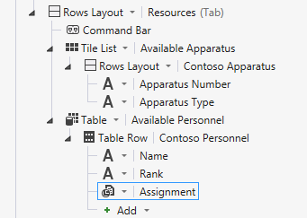
 

 

 
14. <span data-ttu-id="2afbf-p124">Starten Sie das Add-In, und beachten Sie die Änderungen. Klicken Sie auf einen Vorfall und anschließend auf die Registerkarte **Ressourcen**, um eine Liste der verfügbaren Ressourcen anzuzeigen.</span><span class="sxs-lookup"><span data-stu-id="2afbf-p124">Run the add-in and observe the changes. Choose an incident, and then choose the **Resources** tab to see a list of available resources.</span></span>
    
    
 

    
    <span data-ttu-id="2afbf-p125">Die Änderungen sind jetzt abgeschlossen. Im nächsten Abschnitt lernen Sie, wie Sie einem Add-In eine SharePoint-Dokumentbibliothek hinzufügen und damit verknüpfen.</span><span class="sxs-lookup"><span data-stu-id="2afbf-p125">The changes are now complete. In the next section, you'll learn how add and associate a SharePoint document library with add-in.</span></span>
    
 

## <a name="associate-a-document-library"></a><span data-ttu-id="2afbf-412">Verknüpfen einer Dokumentbibliothek</span><span class="sxs-lookup"><span data-stu-id="2afbf-412">Associate a Document Library</span></span>
<span data-ttu-id="2afbf-413"><a name="associate"> </a></span><span class="sxs-lookup"><span data-stu-id="2afbf-413"></span></span>

<span data-ttu-id="2afbf-p126">Bei einem Vorfall müssen viele Sachverhalte im Incident Commander dokumentiert werden, einige verwenden vorhandene und andere Ad-Hoc-Formulare. Die bei einem Vorgang erstellten Dokumente müssen zu einem späteren Zeitpunkt zugänglich sein und nach Vorfall gegliedert sein, damit sie schnell aufgerufen werden können. Für das Vorfallverwaltungs-Add-In können Sie das benutzerdefinierte Dokumentbibliothek-Feature in SharePoint verwenden, um den einzelnen Vorfällen Dokumente zuzuordnen.</span><span class="sxs-lookup"><span data-stu-id="2afbf-p126">On the scene of an incident the Incident Commander has to document many things, some using existing forms and some ad-hoc. The documents created on-scene must be accessible later, and they Must be organized by incident for easy retrieval. For the Incident Management add-in, you can utilize the custom document library feature in SharePoint to associate documents with each incident.</span></span>
 

 

### <a name="to-add-a-document-library-to-the-sharepoint-site"></a><span data-ttu-id="2afbf-417">So fügen Sie der SharePoint-Website eine Dokumentbibliothek hinzu</span><span class="sxs-lookup"><span data-stu-id="2afbf-417">To add a document library to the SharePoint site</span></span>


1. <span data-ttu-id="2afbf-418">Klicken Sie in der Menüleiste auf **Debuggen**, **Debuggen starten**, um das Add-In auszuführen.</span><span class="sxs-lookup"><span data-stu-id="2afbf-418">On the menu bar, choose **Debug**, **Start Debugging** to run the add-in.</span></span>
    
 
2. <span data-ttu-id="2afbf-419">Klicken Sie in dem laufenden Add-In in der Chromleiste auf den Link **Zurück zur Website**, wie in Abbildung 22 dargestellt, um zu Ihrer SharePoint-Entwicklerwebsite zu navigieren.</span><span class="sxs-lookup"><span data-stu-id="2afbf-419">In the running add-in, on the chrome bar, choose **Back to site** link as shown in Figure 22 to navigate to your SharePoint developer site.</span></span>
    
    <span data-ttu-id="2afbf-420">**Abbildung 22: Der Link „Zurück zur Website“**</span><span class="sxs-lookup"><span data-stu-id="2afbf-420">**Figure 22. The Back to site link**</span></span>

 

  
 

 

 
3. <span data-ttu-id="2afbf-422">Klicken Sie auf der Seite **Entwickler** auf den Link **Websiteinhalte**.</span><span class="sxs-lookup"><span data-stu-id="2afbf-422">On the **Developer** page, choose the **Site Contents** link.</span></span>
    
 
4. <span data-ttu-id="2afbf-423">Klicken Sie auf der Seite **Websiteinhalte** auf die Kachel **Add-In hinzufügen**.</span><span class="sxs-lookup"><span data-stu-id="2afbf-423">On the **Site Contents** page, choose the **add an add-in** tile.</span></span>
    
 
5. <span data-ttu-id="2afbf-424">Klicken Sie auf der Seite **Websiteinhalte > Ihre Add-Ins** auf die Kachel **Dokumentbibliothek**.</span><span class="sxs-lookup"><span data-stu-id="2afbf-424">On the **Site Contents > Your Add-ins** page, choose the **Document Library** tile.</span></span>
    
 
6. <span data-ttu-id="2afbf-425">Geben Sie im Dialogfeld **Dokumentbibliothek hinzufügen** im Textfeld **Name** „Vorfalldokumente“ ein, und klicken Sie dann auf die Schaltfläche **Erstellen**.</span><span class="sxs-lookup"><span data-stu-id="2afbf-425">In the **Adding Document Library** dialog box, in the **Name** text box enterIncident Documents, and then choose the **Create** button.</span></span>
    
 
7. <span data-ttu-id="2afbf-426">Klicken Sie zum Öffnen der Bibliothek auf der Seite **Websiteinhalte** auf die Kachel **Vorfalldokumente** und dann auf die Registerkarte **BIBLIOTHEK**.</span><span class="sxs-lookup"><span data-stu-id="2afbf-426">On the **Site Contents** page, choose the **Incident Documents** tile to open the library, and then choose the **LIBRARY** tab.</span></span>
    
 
8. <span data-ttu-id="2afbf-427">Klicken Sie im **Menüband** auf die Schaltfläche **Spalte erstellen**.</span><span class="sxs-lookup"><span data-stu-id="2afbf-427">On the **Ribbon**, choose the **Create Column** button.</span></span>
    
 
9. <span data-ttu-id="2afbf-428">Geben Sie im Dialogfeld **Spalte erstellen** im Textfeld **Spaltenname** „Vorfallnummer“ ein, und klicken Sie anschließend auf die Schaltfläche **OK**.</span><span class="sxs-lookup"><span data-stu-id="2afbf-428">In the **Create Column** dialog box, in the **Column name** text box enterIncidentNumber, and then choose the **OK** button.</span></span>
    
    <span data-ttu-id="2afbf-429">Abbildung 23 zeigt die neu hinzugefügte Spalte.</span><span class="sxs-lookup"><span data-stu-id="2afbf-429">Figure 23 shows the newly added column.</span></span>
    

    <span data-ttu-id="2afbf-430">**Abbildung 23: Die Dokumentbibliothek „Vorfalldokumente“**</span><span class="sxs-lookup"><span data-stu-id="2afbf-430">**Figure 23. The Incident Documents document library**</span></span>

 

  
 

    <span data-ttu-id="2afbf-p127">Damit Sie die Dokumentbibliothek mit Ihrem Add-In verknüpfen können, muss die Dokumentbibliothek eine benutzerdefinierte Spalte enthalten, die einem eindeutigen Feld in Ihrer Entität zugeordnet ist. In diesem Fall ist die Spalte **Vorfallnummer** dem Feld **Vorfallnummer** in der Entität **Vorfälle** zugeordnet.</span><span class="sxs-lookup"><span data-stu-id="2afbf-p127">In order to associate the document library with your add-in, the document library must contain a custom column that maps to a unique field in your entity. In this case the **IncidentNumber** column maps to the **IncidentNumber** field in the **Incidents** entity.</span></span>
    
    
 

    
    <span data-ttu-id="2afbf-434">Im nächsten Schritt fügen Sie die Dokumentbibliothek dem Add-In hinzu.</span><span class="sxs-lookup"><span data-stu-id="2afbf-434">In the next step, you'll add the document library to your add-in.</span></span>
    
 

### <a name="to-add-a-document-library-to-a-project"></a><span data-ttu-id="2afbf-435">So fügen Sie einem Projekt eine Dokumentbibliothek hinzu</span><span class="sxs-lookup"><span data-stu-id="2afbf-435">To add a document library to a project</span></span>


1. <span data-ttu-id="2afbf-436">Öffnen Sie im **Projektmappen-Explorer** das Kontextmenü des Knotens **Entwicklerdaten**, und klicken Sie dann auf **Datenquelle aktualisieren**.</span><span class="sxs-lookup"><span data-stu-id="2afbf-436">In **Solution Explorer**, open the shortcut menu for the **Developer Data** node and choose **Update Data Source**.</span></span>
    
 
2. <span data-ttu-id="2afbf-437">Klicken Sie auf der Seite **Wählen Sie Ihre SharePoint-Elemente** im linken Bereich auf das Listenelement **Dokumentbibliotheken**, und aktivieren Sie dann im rechten Bereich das Kontrollkästchen **Vorfalldokumente**, wie in Abbildung 24 dargestellt. Klicken Sie dann auf **Fertig stellen**.</span><span class="sxs-lookup"><span data-stu-id="2afbf-437">On the **Choose your SharePoint Items** page, in the left pane, choose the **Document Libraries** list item, and in the right pane, select the **IncidentDocuments** checkbox as shown in Figure 24, and then choose the **Finish** button.</span></span>
    
    <span data-ttu-id="2afbf-438">**Abbildung 24: Die Entität „Vorfalldokumente“**</span><span class="sxs-lookup"><span data-stu-id="2afbf-438">**Figure 24. The IncidentDocuments entity**</span></span>

 

  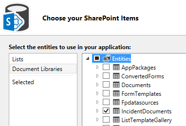
 

    <span data-ttu-id="2afbf-440">Ein **IncidentDocuments.lsml**-Knoten wird im Projektmappen-Explorer hinzugefügt.</span><span class="sxs-lookup"><span data-stu-id="2afbf-440">An **IncidentDocuments.lsml** node is added to Solution Explorer.</span></span>
    
    
 

    
    <span data-ttu-id="2afbf-441">Im nächsten Schritt erstellen Sie eine Beziehung zwischen der Dokumentbibliothek und die Vorfälle-Entität.</span><span class="sxs-lookup"><span data-stu-id="2afbf-441">In the next step, you'll create a relationship between the document library and the Incidents entity..</span></span>
    
 

### <a name="to-create-a-relationship-across-data-sources"></a><span data-ttu-id="2afbf-442">So erstellen Sie eine Beziehung über Datenquellen</span><span class="sxs-lookup"><span data-stu-id="2afbf-442">To create a relationship across data sources</span></span>


1. <span data-ttu-id="2afbf-443">Öffnen Sie im **Projektmappen-Explorer** das Kontextmenü des Knotens **IncidentDocuments.lsml** und klicken Sie dann auf **Öffnen**.</span><span class="sxs-lookup"><span data-stu-id="2afbf-443">In **Solution Explorer**, open the shortcut menu for the **IncidentDocuments.lsml** node and choose **Open**.</span></span>
    
 
2. <span data-ttu-id="2afbf-444">Klicken Sie im Entity Designer in der Leiste **Perspektive** auf **Server**, und klicken Sie anschließend in der Symbolleiste auf **Beziehung**.</span><span class="sxs-lookup"><span data-stu-id="2afbf-444">In the entity designer, on the **Perspective** bar choose **Server**, and then on the toolbar choose **Relationship**.</span></span>
    
 
3. <span data-ttu-id="2afbf-445">Klicken Sie im Dialogfeld **Neue Beziehung hinzufügen** in der Dropdownliste **Zu** auf **Vorfall**, wie in Abbildung 25 dargestellt.</span><span class="sxs-lookup"><span data-stu-id="2afbf-445">In the **Add New Relationship** dialog box, in the **To** dropdown list, choose **Incident** as shown in Figure 25.</span></span>
    
    <span data-ttu-id="2afbf-446">**Abbildung 25: Das Dialogfeld „Neue Beziehung hinzufügen“**</span><span class="sxs-lookup"><span data-stu-id="2afbf-446">**Figure 25. The Add New Relationship dialog box**</span></span>

 

  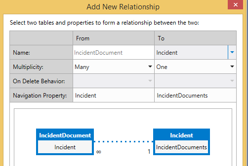
 

 

 
4. <span data-ttu-id="2afbf-448">Klicken Sie in der Dropdownliste **Fremdschlüssel** auf das Feld **Vorfallnummer (String)** aus der **Vorfalldokumente**-Entität.</span><span class="sxs-lookup"><span data-stu-id="2afbf-448">In the **Foreign** key dropdown list, choose the **IncidentNumber (String)** field from the **IncidentDocuments** entity.</span></span>
    
 
5. <span data-ttu-id="2afbf-449">Klicken Sie in der Dropdownliste **Primärschlüssel** auf das Feld **Vorfallnummer (String)** aus der **Vorfälle**-Entität und dann auf die Schaltfläche **OK**.</span><span class="sxs-lookup"><span data-stu-id="2afbf-449">In the **Primary** key dropdown list, choose the **IncidentNumber (String)** field from the **Incidents** entity, and then choose the **OK** button.</span></span>
    
    <span data-ttu-id="2afbf-450">Abbildung 26 zeigt den Fremdschlüssel und Primärschlüssel.</span><span class="sxs-lookup"><span data-stu-id="2afbf-450">Figure 26 shows the Foreign and Primary keys.</span></span>
    

    <span data-ttu-id="2afbf-451">**Abbildung 26: Fremdschlüssel und Primärschlüssel**</span><span class="sxs-lookup"><span data-stu-id="2afbf-451">**Figure 26. Foreign and primary keys**</span></span>

 

  
 

    
 

    
    <span data-ttu-id="2afbf-453">Im nächsten Schritt fügen Sie dem **ViewIncidents**-Bildschirm die Dokumentbibliothek hinzu.</span><span class="sxs-lookup"><span data-stu-id="2afbf-453">In the next step, you'll add the document library to the **ViewIncidents** screen.</span></span>
    
 

### <a name="to-add-a-document-library-to-a-screen"></a><span data-ttu-id="2afbf-454">So fügen Sie einem Bildschirm eine Dokumentbibliothek hinzu</span><span class="sxs-lookup"><span data-stu-id="2afbf-454">To add a document library to a screen</span></span>


1. <span data-ttu-id="2afbf-455">Öffnen Sie im **Projektmappen-Explorer** das Kontextmenü des Knotens **ViewIncidents.lsml**, und klicken Sie dann auf **Öffnen**.</span><span class="sxs-lookup"><span data-stu-id="2afbf-455">In **Solution Explorer**, open the shortcut menu for the **ViewIncidents.lsml** node and choose **Open**.</span></span>
    
 
2. <span data-ttu-id="2afbf-456">Öffnen Sie im Bildschirm-Designer das Kontextmenü des Knotens **Registerkarte**, und klicken Sie dann auf **Registerkarte hinzufügen**.</span><span class="sxs-lookup"><span data-stu-id="2afbf-456">In the screen designer, open the shortcut menu for the **Tab** node and choose **Add Tab**.</span></span>
    
 
3. <span data-ttu-id="2afbf-457">Ändern Sie im Fenster **Eigenschaften** die Eigenschaft **Name** zu „Dokumente“.</span><span class="sxs-lookup"><span data-stu-id="2afbf-457">In the **Properties** window, change the **Name** property toDocuments.</span></span>
    
 
4. <span data-ttu-id="2afbf-458">Klicken Sie im Bildschirm-Designer im linken Bereich auf den Link **Vorfalldokumente hinzufügen**.</span><span class="sxs-lookup"><span data-stu-id="2afbf-458">In the screen designer, in the left pane, choose the **Add IncidentDocuments** link.</span></span>
    
 
5. <span data-ttu-id="2afbf-459">Öffnen Sie im mittleren Bereich unter dem Knoten **Zeilenlayout | Dokumente** die Liste **Hinzufügen**, und klicken Sie dann auf **Vorfalldokumente**.</span><span class="sxs-lookup"><span data-stu-id="2afbf-459">In the center pane, under the **Rows Layout | Documents** node, open the **Add** list and choose **Incident Documents**.</span></span>
    
 
6. <span data-ttu-id="2afbf-460">Öffnen Sie unter dem Knoten **Zeilenlayout | Dokumente** das Kontextmenü des Knotens **Befehlsleiste**, und klicken Sie dann auf **Schaltfläche „Hinzufügen“**.</span><span class="sxs-lookup"><span data-stu-id="2afbf-460">Under the **Rows Layout | Documents** node, open the shortcut menu for the **Command Bar** node and choose **Add Button**.</span></span>
    
 
7. <span data-ttu-id="2afbf-461">Erweitern Sie im Dialogfeld **Schaltfläche „Hinzufügen“** die Liste **showTab**, und klicken Sie dann in der Gruppe **Vorfalldokumente** auf **createOrUploadDocument**, wie in Abbildung 27 dargestellt, und klicken Sie dann auf **OK**.</span><span class="sxs-lookup"><span data-stu-id="2afbf-461">In the **Add Button** dialog box, expand the **showTab** list and in the **IncidentDocuments** group choose **createOrUploadDocument** as shown in Figure 27, and then choose the **OK** button.</span></span>
    
    <span data-ttu-id="2afbf-462">**Abbildung 27: Das Dialogfeld „Schaltfläche Hinzufügen“**</span><span class="sxs-lookup"><span data-stu-id="2afbf-462">**Figure 27. The Add Button dialog box**</span></span>

 

  
 

 

 
8. <span data-ttu-id="2afbf-464">Klicken Sie im Fenster **Eigenschaften** auf die Eigenschaft **Anzeigename**, und geben Sie „Dokument hinzufügen“ ein.</span><span class="sxs-lookup"><span data-stu-id="2afbf-464">In the **Properties** window, choose the **Display Name** property and enterAdd Document.</span></span>
    
 
9. <span data-ttu-id="2afbf-465">Erweitern Sie die Eigenschaftsliste **Symbol**, und klicken Sie dann auf **Anhang**.</span><span class="sxs-lookup"><span data-stu-id="2afbf-465">Expand the **Icon** property list and choose **Attachment**.</span></span>
    
 
10. <span data-ttu-id="2afbf-466">Klicken Sie in der Menüleiste auf **Debuggen**, **Debuggen starten**, um das Add-In auszuführen.</span><span class="sxs-lookup"><span data-stu-id="2afbf-466">On the menu bar, choose **Debug**, **Start Debugging** to run the add-in.</span></span>
    
 
11. <span data-ttu-id="2afbf-467">Klicken Sie auf einen Vorfall, dann auf die Registerkarte **Dokumente** und anschließend auf die Schaltfläche **Dokument hinzufügen**.</span><span class="sxs-lookup"><span data-stu-id="2afbf-467">Choose an incident, choose the **Documents** tab, and then choose the **Add Document** button.</span></span>
    
    <span data-ttu-id="2afbf-468">Das Dialogfeld **Neue Datei erstellen** wird in SharePoint geöffnet, wie in Abbildung 28 dargestellt.</span><span class="sxs-lookup"><span data-stu-id="2afbf-468">The SharePoint **Create a new file** dialog box opens, as shown in Figure 28.</span></span>
    

    <span data-ttu-id="2afbf-469">**Abbildung 28: Erstellen eines neuen Dateidialogfelds**</span><span class="sxs-lookup"><span data-stu-id="2afbf-469">**Figure 28. The Create a new file dialog box**</span></span>

 

  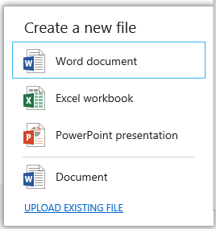
 

 

 
12. <span data-ttu-id="2afbf-471">Klicken Sie auf den Link **VORHANDENE DATEI HOCHLADEN**, wählen Sie dann eine Datei aus, die hochgeladen werden soll, und klicken Sie auf **Öffnen**.</span><span class="sxs-lookup"><span data-stu-id="2afbf-471">Choose the **UPLOAD EXISTING FILE** link and choose any file to upload, and then choose the **Open** button.</span></span>
    
    <span data-ttu-id="2afbf-472">Die Datei wird zur Registerkarte **Dokumente** hinzugefügt.</span><span class="sxs-lookup"><span data-stu-id="2afbf-472">The file is added to the **Documents** tab.</span></span>
    
     <span data-ttu-id="2afbf-473">**Tipp** Wenn Sie auf ein Office-Dokument klicken, können Sie es im Add-In anzeigen.</span><span class="sxs-lookup"><span data-stu-id="2afbf-473">**TIP** If you choose an Office document, you can view it in the add-in.</span></span>
13. <span data-ttu-id="2afbf-474">Klicken Sie auf die Schaltfläche „Dokument hinzufügen“ und im Dialogfeld **Neue Datei erstellen** auf **Word-Dokument**.</span><span class="sxs-lookup"><span data-stu-id="2afbf-474">Choose the Add Document button, and in the **Create a new file** dialog box, choose **Word document**.</span></span>
    
    <span data-ttu-id="2afbf-475">Ein neues Word-Dokument wird in **Word Online** geöffnet.</span><span class="sxs-lookup"><span data-stu-id="2afbf-475">A new Word document opens in **Word Online**.</span></span>
    
 
14. <span data-ttu-id="2afbf-476">Klicken Sie in der Titelleiste auf das Namensfeld **Dokument**, wie in Abbildung 29 dargestellt, und geben Sie „Vorfallbericht“ ein.</span><span class="sxs-lookup"><span data-stu-id="2afbf-476">On the title bar, choose the **Document** name field as shown in Figure 29 and enterIncident Report.</span></span>
    
    <span data-ttu-id="2afbf-477">**Abbildung 29: Das Namensfeld „Dokument“**</span><span class="sxs-lookup"><span data-stu-id="2afbf-477">**Figure 29. The Document name field**</span></span>

 

  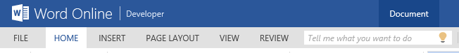
 

    <span data-ttu-id="2afbf-479">Dies wird als den Dateinamen für das Dokument verwendet.</span><span class="sxs-lookup"><span data-stu-id="2afbf-479">This will be used as the file name for the document.</span></span>
    
    
     <span data-ttu-id="2afbf-p128">**Hinweis** Wenn Sie keinen Dateinamen eingeben, wird das Dokument mit dem Standardnamen **Dokument.docx** gespeichert. Nachdem das Dokument gespeichert wurde, kann der Dateiname nur geändert werden, indem Sie darauf in der Dokumentbibliothek in SharePoint zugreifen.</span><span class="sxs-lookup"><span data-stu-id="2afbf-p128">**Note** If you don't enter a file name, it will be saved with the default name **Document.docx**. Once saved, the file name can only be changed by accessing it in the document library in SharePoint.</span></span>
15. <span data-ttu-id="2afbf-p129">Klicken Sie im Browser auf die Schaltfläche „Zurück“, um zum Add-In zurückzukehren. Das Dokument **Vorfallbericht** sollte auf der Registerkarte **Dokumente** angezeigt werden.</span><span class="sxs-lookup"><span data-stu-id="2afbf-p129">Choose the back button in your browser to return to the add-in. The **Incident Report** document should appear on the **Documents** tab.</span></span>
    
 
16. <span data-ttu-id="2afbf-484">Klicken Sie in Ihrem Browser auf **Schließen**, um zum Entwurfsmodus zurückzukehren.</span><span class="sxs-lookup"><span data-stu-id="2afbf-484">Choose the **Close** button in your browser to return to design mode.</span></span>
    
    
 

    
    <span data-ttu-id="2afbf-485">Im nächsten Abschnitt passen Sie das Add-In an und fügen JavaScript-Code hinzu.</span><span class="sxs-lookup"><span data-stu-id="2afbf-485">In the next section, you'll customize the add-in and add some JavaScript code.</span></span>
    
 

## <a name="customize-the-add-in"></a><span data-ttu-id="2afbf-486">Anpassen des Add-Ins</span><span class="sxs-lookup"><span data-stu-id="2afbf-486">Customize the Add-in</span></span>
<span data-ttu-id="2afbf-487"><a name="custom"> </a></span><span class="sxs-lookup"><span data-stu-id="2afbf-487"></span></span>

<span data-ttu-id="2afbf-p130">Die Mitarbeiter der Contoso-Feuerwehr sind sehr zufrieden mit den zusätzlichen Funktionen im Vorfallverwaltungs-Add-In. Es befinden sich jedoch noch ein paar Elemente auf ihrer Liste, die angepasst und fertig gestellt werden müssen. Sie möchten ihr Logo statt des Standardlogos auf den Bildschirmen anzeigen. Ihnen gefällt das Steuerelement **FlipSwitch** für das Feld **Versichert** auf dem **AddEditPatient**-Bildschirm nicht, und sie möchten es durch ein Kontrollkästchen ersetzen. Da nicht bei allen Vorfällen Patienten beteiligt sind, soll die Registerkarte **Patienten** auf dem Bildschirm **ViewIncidents** nicht angezeigt werden, wenn keine Patienten involviert sind.</span><span class="sxs-lookup"><span data-stu-id="2afbf-p130">The Contoso Fire Department is pleased with the additions to the Incident Management add-in, but there are few more "fit and finish" items on their list. They want to display their logo on the screens instead of the default icon. They don't like the **FlipSwitch** control for **Insured** field on the **AddEditPatient** screen and want it replaced with a check box. Finally, since not all incidents have patients, they don't want the **Patients** tab on the **ViewIncidents** screen at appear if there aren't any patients.</span></span>
 

 

### <a name="to-display-a-custom-logo"></a><span data-ttu-id="2afbf-492">Anzeigen eines benutzerdefinierten Logos</span><span class="sxs-lookup"><span data-stu-id="2afbf-492">To display a custom logo</span></span>


1. <span data-ttu-id="2afbf-493">Erweitern Sie im **Projektmappen-Explorer** im **IncidentManager.HtmlClient**-Projekt die Knoten **Inhalt** und **Bilder**.</span><span class="sxs-lookup"><span data-stu-id="2afbf-493">In **Solution Explorer**, in the **IncidentManager.HtmlClient** project, expand the **Content** and **Images** nodes.</span></span>
    
 
2. <span data-ttu-id="2afbf-494">Klicken Sie auf die Dateien **user-logo.png** und **user-splash-screen.png**, wie in Abbildung 30 dargestellt, und löschen Sie sie.</span><span class="sxs-lookup"><span data-stu-id="2afbf-494">Choose the **user-logo.png** and **user-splash-screen.png** files as shown in Figure 30 and delete them.</span></span>
    
    <span data-ttu-id="2afbf-495">**Abbildung 30: Die zu löschenden Dateien**</span><span class="sxs-lookup"><span data-stu-id="2afbf-495">**Figure 30. The files to delete**</span></span>

 

  
 

 

 
3. <span data-ttu-id="2afbf-497">Öffnen Sie das Kontextmenü des Knotens **Bilder**, klicken Sie auf **Hinzufügen**, **Vorhandenes Element**.</span><span class="sxs-lookup"><span data-stu-id="2afbf-497">Open the shortcut menu for the **Images** node, choose **Add**, **Existing Item**.</span></span>
    
 
4. <span data-ttu-id="2afbf-498">Klicken Sie im Dialogfeld **Vorhandenes Element hinzufügen** auf die Schaltfläche **Durchsuchen**, und navigieren Sie anschließend zum heruntergeladenen Vorfallverwaltungsbeispiel im Ordner **Ressourcen**.</span><span class="sxs-lookup"><span data-stu-id="2afbf-498">In the **Add Existing Item** dialog box, choose the **Browse** button and then navigate to the **Resources** folder for the downloaded Incident Management sample.</span></span>
    
 
5. <span data-ttu-id="2afbf-499">Klicken Sie auf die Dateien **user-logo.png** und **user-splash-screen.png** und anschließend auf die Schaltfläche **Hinzufügen**.</span><span class="sxs-lookup"><span data-stu-id="2afbf-499">Choose the **user-logo.png** and **user-splash-screen.png** files, and then choose the **Add** button.</span></span>
    
    <span data-ttu-id="2afbf-500">Die neuen Bilder werden in der Titelleiste des Add-Ins auf dem Begrüßungsbildschirm beim Laden des Add-Ins angezeigt.</span><span class="sxs-lookup"><span data-stu-id="2afbf-500">The new images will be displayed on the title bar of the add-in and in the splash screen shown when the add-in is loading.</span></span>
    
    
 

    
    <span data-ttu-id="2afbf-501">Im nächsten Schritt ersetzen Sie das Steuerelement **FlipSwitch** durch ein Kontrollkästchen.</span><span class="sxs-lookup"><span data-stu-id="2afbf-501">In the next step, you'll replace the **FlipSwitch** control with a checkbox.</span></span>
    
 

### <a name="to-replace-the-flipswitch-control"></a><span data-ttu-id="2afbf-502">So ersetzen Sie das FlipSwitch-Steuerelement</span><span class="sxs-lookup"><span data-stu-id="2afbf-502">To replace the FlipSwitch control</span></span>


1. <span data-ttu-id="2afbf-503">Öffnen Sie im **Projektmappen-Explorer** das Kontextmenü des Knotens **AddEditPatient.lsml**, und klicken Sie dann auf **Öffnen**.</span><span class="sxs-lookup"><span data-stu-id="2afbf-503">In **Solution Explorer**, open the shortcut menu for the **AddEditPatient.lsml** screen node and choose **Open**.</span></span>
    
 
2. <span data-ttu-id="2afbf-504">Erweitern Sie im Bildschirm-Designer die Liste des Knotens **Versichert**, und klicken Sie dann auf **Benutzerdefiniertes Steuerelement**.</span><span class="sxs-lookup"><span data-stu-id="2afbf-504">In the screen designer, expand the list for the **Insured** node and choose **Custom Control**.</span></span>
    
 
3. <span data-ttu-id="2afbf-505">Klicken Sie im Fenster **Eigenschaften** auf den Link **Render-Code bearbeiten**.</span><span class="sxs-lookup"><span data-stu-id="2afbf-505">In the **Properties** window, choose the **Edit Render Code** link.</span></span>
    
 
4. <span data-ttu-id="2afbf-506">Fügen Sie im Code-Editor folgenden Code zur **Insured_render**-Methode hinzu:</span><span class="sxs-lookup"><span data-stu-id="2afbf-506">In the Code Editor, add the following code to the **Insured_render** method:</span></span>
    
```
  // Create the checkbox and add it to the DOM.
    var checkbox = $("<input type='checkbox'/>")
            .css({
                height: 20,
                width: 20,
                margin: "10px"
            })
            .appendTo($(element));

    // Determine if the change was initiated by the user.
    var changingValue = false;

    checkbox.change(function () {
        changingValue = true;
        contentItem.value = checkbox[0].checked;
        changingValue = false;
    });
    contentItem.dataBind("value", function (newValue) {
        if (!changingValue) {
            checkbox[0].checked = newValue;
        }
    });
```


    This code creates a  **CheckBox** control when the screen is rendered. You'll also need to add code to set an initial value.
    
 
5. <span data-ttu-id="2afbf-507">Öffnen Sie im **Projektmappen-Explorer** das Kontextmenü des Entitätknotens **Patients.lsml**, und klicken Sie dann auf **Öffnen**.</span><span class="sxs-lookup"><span data-stu-id="2afbf-507">In **Solution Explorer**, open the shortcut menu for the **Patients.lsml** entity node and choose **Open**.</span></span>
    
 
6. <span data-ttu-id="2afbf-508">Klicken Sie im Entity Designer in der Leiste **Perspektive** auf die Registerkarte **HTMLClient**.</span><span class="sxs-lookup"><span data-stu-id="2afbf-508">In the entity designer, on the **Perspective** bar, choose the **HTMLClient** tab.</span></span>
    
 
7. <span data-ttu-id="2afbf-509">Erweitern Sie in der Symbolleiste die Liste **Code schreiben**, und klicken Sie dann auf **erstellt**.</span><span class="sxs-lookup"><span data-stu-id="2afbf-509">On the toolbar, expand the **Write Code** list and choose **created**.</span></span>
    
 
8. <span data-ttu-id="2afbf-510">Fügen Sie im Code-Editor folgenden Code zur **created**-Methode hinzu:</span><span class="sxs-lookup"><span data-stu-id="2afbf-510">In the Code Editor, add the following code to the **created** method:</span></span>
    
```
  entity.Insured = new Boolean();
    entity.Insured = 'true';
```


    This code sets the initial value of the control to checked (true) when the screen is created.
    
    
 

    
    In the next step, you'll add code to hide the  **Patients** tab if no patients exist.
    
 

### <a name="to-conditionally-hide-a-tab"></a><span data-ttu-id="2afbf-511">So blenden Sie eine Registerkarte unter bestimmten Bedingungen aus</span><span class="sxs-lookup"><span data-stu-id="2afbf-511">To conditionally hide a tab</span></span>


1. <span data-ttu-id="2afbf-512">Öffnen Sie im **Projektmappen-Explorer** das Kontextmenü des Knotens **ViewIncidents.lsml**, und klicken Sie dann auf **Öffnen**.</span><span class="sxs-lookup"><span data-stu-id="2afbf-512">In **Solution Explorer**, open the shortcut menu for the **ViewIncidents.lsml** screen node and choose **Open**.</span></span>
    
 
2. <span data-ttu-id="2afbf-513">Öffnen Sie in der Symbolleiste die Liste **Code schreiben**, und klicken Sie dann auf **erstellt**.</span><span class="sxs-lookup"><span data-stu-id="2afbf-513">On the toolbar, open the **Write Code** list and choose **created**.</span></span>
    
 
3. <span data-ttu-id="2afbf-514">Fügen Sie im Code-Editor folgenden Code zur **ViewIncidents_created**-Methode hinzu:</span><span class="sxs-lookup"><span data-stu-id="2afbf-514">In the Code Editor, add the following code to the **ViewIncidents_created** method:</span></span>
    
```
  screen.getPatients().then(function (results) {
        var queryCount = results.count;
        if (queryCount == 0 ) {
            screen.findContentItem("Patients").isVisible = false;
        }
    });
```


    This code runs the  **GetPatients** query to get a count of **Patients**. If the result is zero, the  **findContentItem** method sets the **isVisible** property of the **Patients** tab to false, hiding it.
    
 
4. <span data-ttu-id="2afbf-p131">Klicken Sie in der Menüleiste auf **Debuggen**, **Debuggen starten**, um das Add-In auszuführen. Beachten Sie, dass das neue Logo auf den Bildschirmen angezeigt wird. Öffnen Sie den ersten Vorfall, den Sie zuvor erstellt haben, und bearbeiten Sie einen Patienten. Prüfen Sie, ob das Feld „Versichert“ nun ein Kontrollkästchen ist. Fügen Sie einen neuen Vorfall ohne Patienten hinzu, und überprüfen Sie, ob die Registerkarte **Patienten** auf dem Anzeigebildschirm ausgeblendet ist.</span><span class="sxs-lookup"><span data-stu-id="2afbf-p131">On the menu bar, choose **Debug**, **Start Debugging** to run the add-in. Notice that the new logo appears on the screens. Open the first incident that you created earlier and edit a patient. Verify that the Insured field is now a checkbox. Add a new incident without any patients, and verify that the **Patients** tab is hidden on the view screen.</span></span>
    
    
 

    
    <span data-ttu-id="2afbf-520">Im letzten Abschnitt veröffentlichen Sie das fertige Add-In in SharePoint.</span><span class="sxs-lookup"><span data-stu-id="2afbf-520">In the final section, you'll publish the finished add-in to SharePoint.</span></span>
    
 

## <a name="publish-to-sharepoint"></a><span data-ttu-id="2afbf-521">Veröffentlichen in SharePoint</span><span class="sxs-lookup"><span data-stu-id="2afbf-521">Publish to SharePoint</span></span>
<span data-ttu-id="2afbf-522"><a name="pub"> </a></span><span class="sxs-lookup"><span data-stu-id="2afbf-522"></span></span>

<span data-ttu-id="2afbf-p132">Bis jetzt haben Sie das Add-In nur im Debuggingmodus ausgeführt, der SharePoint verwendet, um eine Authentifizierung bereitzustellen und zur lokalen IIS Express-Instanz des Computers umzuleiten. Als Nächstes veröffentlichen Sie das Add-In als automatisch gehostetes SharePoint-Add-In, das automatisch Platz für das Add-In und eine systeminterne Datenbank in Office 365 bereitstellt. Genau genommen wird das Add-In in Microsoft Azure und die Datenbank in SQL Azure gehostet. Nachdem Sie Ih Add-In veröffentlicht haben, können die Benutzer sie auf ihren Computern und mobilen Geräten aus SharePoint starten.</span><span class="sxs-lookup"><span data-stu-id="2afbf-p132">So far you've only run the add-in in Debug mode, which uses SharePoint to provide authentication and redirects to the local computer's instance of IIS Express. Next you'll publish the add-in as an auto-hosted SharePoint add-in, which will automatically provision space in Office 365 for both the add-in and an intrinsic database. Specifically, the add-in will be hosted in Microsoft Azure and the database in SQL Azure. After you publish your add-in, others can start it from SharePoint on their computers and mobile devices.</span></span>
 

 

### <a name="to-publish-the-add-in"></a><span data-ttu-id="2afbf-527">So veröffentlichen Sie das Add-In</span><span class="sxs-lookup"><span data-stu-id="2afbf-527">To publish the add-in</span></span>


1. <span data-ttu-id="2afbf-528">Öffnen Sie in der Symbolleiste von Visual Studio die Liste **Debuggen**, und klicken Sie dann auf **Freigeben**.</span><span class="sxs-lookup"><span data-stu-id="2afbf-528">On the Visual Studio toolbar, open the **Debug** list and choose **Release**.</span></span>
    
 
2. <span data-ttu-id="2afbf-529">Öffnen Sie im **Projektmappen-Explorer** das Kontextmenü des Knotens **Vorfallverwaltung**, wie in Abbildung 31 dargestellt, und klicken Sie dann auf **Veröffentlichen**.</span><span class="sxs-lookup"><span data-stu-id="2afbf-529">In **Solution Explorer**, open the shortcut menu for the **IncidentManager** node as shown in Figure 31, and then choose **Publish**.</span></span>
    
    <span data-ttu-id="2afbf-530">**Abbildung 31: Der Knoten „Vorfallverwaltung“**</span><span class="sxs-lookup"><span data-stu-id="2afbf-530">**Figure 31. The IncidentManager node**</span></span>

 

  
 

    <span data-ttu-id="2afbf-532">Der **Assistent zum Veröffentlichen von LightSwitch-Anwendungen** wird angezeigt.</span><span class="sxs-lookup"><span data-stu-id="2afbf-532">The **LightSwitch Publish Application Wizard** appears.</span></span>
    
 
3. <span data-ttu-id="2afbf-533">Klicken Sie auf der Optionsseite **SharePoint** auf die Optionsschaltfläche **Automatisch gehostet**, wie in Abbildung 32 dargestellt, und klicken Sie dann auf die Schaltfläche **Veröffentlichen**.</span><span class="sxs-lookup"><span data-stu-id="2afbf-533">On the **SharePoint** options page, choose the **Autohosted** option button as shown in Figure 32, and then choose the **Publish** button.</span></span>
    
    <span data-ttu-id="2afbf-534">**Abbildung 32: Die Option „Autohosted“**</span><span class="sxs-lookup"><span data-stu-id="2afbf-534">**Figure 32. The Autohosted option**</span></span>

 

  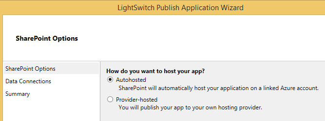
 

    <span data-ttu-id="2afbf-536">Nachdem Ihr Add-In veröffentlicht wurde, wird der **Datei-Explorer** und darin derOrdner **Veröffentlichen** Ihres Projekts angezeigt.</span><span class="sxs-lookup"><span data-stu-id="2afbf-536">When your add-in is published, **File Explorer** appears and displays the **Publish** folder for your project.</span></span>
    
 
4. <span data-ttu-id="2afbf-537">Navigieren Sie im Browser zu Ihrer SharePoint-Entwicklerwebsite</span><span class="sxs-lookup"><span data-stu-id="2afbf-537">In the browser, navigate to your SharePoint Developer site</span></span>
    
 
5. <span data-ttu-id="2afbf-538">Klicken Sie in der Liste **Add-Ins im Test** auf den Auslassungszeichen-Link (…) neben **Vorfallverwaltung**, und klicken Sie dann auf den Link **Entfernen**, wie in Abbildung 33 dargestellt.</span><span class="sxs-lookup"><span data-stu-id="2afbf-538">In the **Add-ins in Testing** list, choose the ellipsis (…) link next to **IncidentManager**, and then choose the **Remove** link, as shown in Figure 33.</span></span>
    
    <span data-ttu-id="2afbf-539">**Abbildung 33: Der Link „Entfernen“**</span><span class="sxs-lookup"><span data-stu-id="2afbf-539">**Figure 33. The Remove link**</span></span>

 

  
 

 

 
6. <span data-ttu-id="2afbf-541">Klicken Sie auf den Link **Neues Add-In zum Bereitstellen**.</span><span class="sxs-lookup"><span data-stu-id="2afbf-541">Choose the **new add-in to deploy** link.</span></span>
    
 
7. <span data-ttu-id="2afbf-542">Klicken Sie im Dialogfeld **Add-In bereitstellen** auf den Link **Hochladen**, wie in Abbildung 34 dargestellt.</span><span class="sxs-lookup"><span data-stu-id="2afbf-542">In the **Deploy Add-in** dialog box, choose the **upload** link, as shown in Figure 34.</span></span>
    
    <span data-ttu-id="2afbf-543">**Abbildung 34: Der Link „Hochladen“**</span><span class="sxs-lookup"><span data-stu-id="2afbf-543">**Figure 34. The upload link**</span></span>

 

  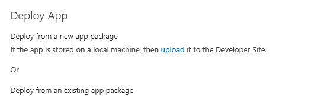
 

    <span data-ttu-id="2afbf-545">Das Dialogfeld **Add-In hochladen** wird geöffnet.</span><span class="sxs-lookup"><span data-stu-id="2afbf-545">The **Upload Add-in** dialog box opens.</span></span>
    
 
8. <span data-ttu-id="2afbf-546">Klicken Sie im Dialogfeld **Add-In hochladen** auf die Schaltfläche **Durchsuchen**, navigieren Sie zu dem Ordner **Veröffentlichen** Ihres Add-Ins, klicken Sie dann auf die Datei **IncidentManager.SharePoint.app**, klicken Sie auf die Schaltfläche **Öffnen** und anschließend auf die Schaltfläche **OK**.</span><span class="sxs-lookup"><span data-stu-id="2afbf-546">In the **Upload Add-in** dialog box, choose the **Browse** button and navigate to the **Publish** folder for your add-in and choose the **IncidentManager.SharePoint.app** file, choose the **Open** button, and then choose the **OK** button.</span></span>
    
    <span data-ttu-id="2afbf-547">Nachdem die Datei hochgeladen wurde, öffnet sich das Dialogfeld **Add-In bereitstellen**.</span><span class="sxs-lookup"><span data-stu-id="2afbf-547">Once the file has been uploaded, the **Deploy Add-in** dialog box opens.</span></span>
    
 
9. <span data-ttu-id="2afbf-548">Klicken Sie im Dialogfeld **Add-In bereitstellen** auf die Schaltfläche **Bereitstellen**.</span><span class="sxs-lookup"><span data-stu-id="2afbf-548">In the **Deploy Add-in** dialog box, choose the **Deploy** button.</span></span>
    
 
10. <span data-ttu-id="2afbf-549">Klicken Sie im Dialogfeld **Add-In hochladen** auf die Schaltfläche **Vertrauen**.</span><span class="sxs-lookup"><span data-stu-id="2afbf-549">In the **Upload Add-in** dialog box, choose the **Trust It** button.</span></span>
    
    <span data-ttu-id="2afbf-p133">Das Add-In wird auf Ihrer SharePoint-Website installiert. Das kann einige Minuten dauern.</span><span class="sxs-lookup"><span data-stu-id="2afbf-p133">The add-in will be installed on your SharePoint site. The process may take a few minutes.</span></span>
    
    <span data-ttu-id="2afbf-552">Abbildung 35 zeigt die Add-Ins in der Testliste , während das Add-In installiert wird.</span><span class="sxs-lookup"><span data-stu-id="2afbf-552">Figure 35 shows the Add-ins in Testing list as the add-in is installing.</span></span>
    

    <span data-ttu-id="2afbf-553">**Abbildung 35: Die Add-Ins in der Testliste**</span><span class="sxs-lookup"><span data-stu-id="2afbf-553">**Figure 35. The Add-ins in Testing list**</span></span>

 

  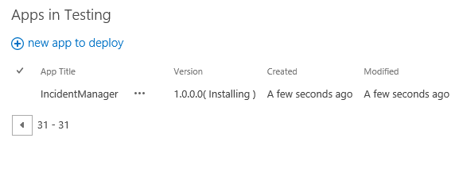
 

 

 
11. <span data-ttu-id="2afbf-555">Klicken Sie auf den Link **Websiteinhalte**.</span><span class="sxs-lookup"><span data-stu-id="2afbf-555">Choose the **Site Contents** link.</span></span>
    
    <span data-ttu-id="2afbf-556">Abbildung 37 zeigt die Liste „Websiteinhalt“ an, während das Add-In installiert wird.</span><span class="sxs-lookup"><span data-stu-id="2afbf-556">Figure 37 shows the Site Contents list as the add-in is installing.</span></span>
    

    <span data-ttu-id="2afbf-557">**Abbildung 37. Das Add-In ist installiert**</span><span class="sxs-lookup"><span data-stu-id="2afbf-557">**Figure 37. The add-in is installing**</span></span>

 

  
 

 

 
12. <span data-ttu-id="2afbf-559">Nachdem die Installation des Add-Ins abgeschlossen ist, klicken Sie auf die Kachel **Vorfallvewaltung**, um das Add-In zu starten.</span><span class="sxs-lookup"><span data-stu-id="2afbf-559">Once the add-in has finished installing, choose the **Incident Manager** tile to run the add-in.</span></span>
    
    <span data-ttu-id="2afbf-560">Abbildung 38 zeigt die Liste „Websiteinhalt“ an, nachdem das Add-In installiert wurde.</span><span class="sxs-lookup"><span data-stu-id="2afbf-560">Figure 38 shows the Site Contents list after the add-in is installed.</span></span>
    

    <span data-ttu-id="2afbf-561">**Abbildung 38: Das Add-In wird installiert**</span><span class="sxs-lookup"><span data-stu-id="2afbf-561">**Figure 38. The add-in is installed**</span></span>

 

  
 

    <span data-ttu-id="2afbf-p134">Das Add-In öffnet sich im Browser und sieht genauso aus, als hätten Sie das Add-In im Debuggingmodus gestartet. Beachten Sie, dass die von Ihnen während der Entwicklung eingegebenen Daten nicht mehr vorhanden sind. Beim Bereitstellen des Add-Ins wird die Datenbank bereitgestellt, jedoch nicht die Daten.</span><span class="sxs-lookup"><span data-stu-id="2afbf-p134">The add-in opens in the browser and looks exactly the same as when you ran the add-in in Debug mode. Notice that the data you entered during development is gone. When deploying the add-in, the database is deployed but not the data.</span></span>
    
 
13. <span data-ttu-id="2afbf-566">Geben Sie einige Daten ein und überprüfen Sie, ob alles wie erwartet funktioniert.</span><span class="sxs-lookup"><span data-stu-id="2afbf-566">Enter some data and verify that everything works as expected.</span></span>
    
    <span data-ttu-id="2afbf-567">Abbildung 39 zeigt das Add-In, wie es in einem Desktop-Browser angezeigt wird.</span><span class="sxs-lookup"><span data-stu-id="2afbf-567">Figure 39 shows the add-in as displayed in a desktop browser.</span></span>
    

    <span data-ttu-id="2afbf-568">**Abbildung 39: Ansicht nebeneinander**</span><span class="sxs-lookup"><span data-stu-id="2afbf-568">**Figure 39. Tile view**</span></span>

 

  
 

    <span data-ttu-id="2afbf-p135">Sie können Ihr Add-In auch auf einem mobilen Gerät überprüfen. Melden Sie sich aus dem Webbrowser auf Ihrem Gerät auf Ihrer SharePoint-Website an, und starten Sie anschließend das Add-In.</span><span class="sxs-lookup"><span data-stu-id="2afbf-p135">You can also verify your add-in on a mobile device. Sign in to your SharePoint site from the web browser on your device, and then start the add-in.</span></span>
    
    <span data-ttu-id="2afbf-572">Abbildung 40 zeigt das Add-In, wie ese in einem mobilen Browser angezeigt wird.</span><span class="sxs-lookup"><span data-stu-id="2afbf-572">Figure 40 shows the add-in as displayed in a mobile browser.</span></span>
    

    <span data-ttu-id="2afbf-573">**Abbildung 40: Listenansicht**</span><span class="sxs-lookup"><span data-stu-id="2afbf-573">**Figure 40. List view**</span></span>

 

  
 

 

 
<span data-ttu-id="2afbf-p136">Herzlichen Glückwunsch! Sie haben das Lernprogramm beendet und beherrschen die Grundlagen zum Entwickeln eines Cloud-Geschäfts-Add-Ins. Nun können Sie Ihr eigenes Add-In entwickeln - mithilfe der unten aufgeführten zusätzlichen Ressource können Sie direkt loslegen.</span><span class="sxs-lookup"><span data-stu-id="2afbf-p136">Congratulations! You have now finished the tutorial, and you know the basics of a creating a Cloud Business Add-in. Now go and build an add-in of your own - the additional resource below should help you to go further.</span></span>
 

## <a name="additional-resources"></a><span data-ttu-id="2afbf-578">Zusätzliche Ressourcen</span><span class="sxs-lookup"><span data-stu-id="2afbf-578">Additional resources</span></span>
<span data-ttu-id="2afbf-579"><a name="bk_addresources"> </a></span><span class="sxs-lookup"><span data-stu-id="2afbf-579"></span></span>


-  [<span data-ttu-id="2afbf-580">Erste Schritte mit dem Entwickeln von Cloud-Business-Add-Ins</span><span class="sxs-lookup"><span data-stu-id="2afbf-580">Get started developing cloud business add-ins</span></span>](get-started-developing-cloud-business-add-ins)
    
 
-  [<span data-ttu-id="2afbf-581">Entwickeln von Cloud-Business-Add-Ins</span><span class="sxs-lookup"><span data-stu-id="2afbf-581">Develop cloud business add-ins</span></span>](develop-cloud-business-add-ins)
    
 
-  [<span data-ttu-id="2afbf-582">Veröffentlichen von Cloud-Business-Add-Ins</span><span class="sxs-lookup"><span data-stu-id="2afbf-582">Publish cloud business add-ins</span></span>](publish-cloud-business-add-ins)
    
 

