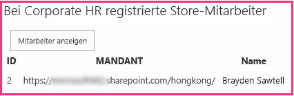

# <a name="include-a-custom-button-in-the-provider-hosted-add-in"></a><span data-ttu-id="7773f-103">Einschließen benutzerdefinierter Schaltflächen in anbietergehosteten Add-Ins</span><span class="sxs-lookup"><span data-stu-id="7773f-103">Include a custom button in the provider-hosted add-in</span></span>

<span data-ttu-id="7773f-104">Dies ist der dritte einer Reihe von Artikeln über die Grundlagen der Entwicklung von vom Anbieter gehosteten SharePoint-Add-Ins. Machen Sie sich zunächst mit [SharePoint-Add-Ins](sharepoint-add-ins.md) und den vorherigen Artikeln dieser Reihe vertraut, die Sie unter [Erste Schritte beim Erstellen von von einem Anbieter gehosteten SharePoint-Add-Ins](get-started-creating-provider-hosted-sharepoint-add-ins.md#SP15createprovider_nextsteps) finden.</span><span class="sxs-lookup"><span data-stu-id="7773f-104">This is the third in a series of articles about the basics of developing provider-hosted SharePoint Add-ins. You should first be familiar with [SharePoint Add-ins](sharepoint-add-ins.md) and the previous articles in this series:</span></span> 
    
> [!NOTE]
> <span data-ttu-id="7773f-105">Wenn Sie unsere Artikelreihe zum Thema anbietergehostete Add-Ins durchgearbeitet haben, haben Sie bereits eine Visual Studio-Lösung, die Sie für diesen Artikel verwenden können.</span><span class="sxs-lookup"><span data-stu-id="7773f-105">If you have been working through this series about provider-hosted add-ins, you have a Visual Studio solution that you can use to continue with this topic.</span></span> <span data-ttu-id="7773f-106">Sie können auch das Repository unter [SharePoint_Provider-hosted_Add-Ins_Tutorials](https://github.com/OfficeDev/SharePoint_Provider-hosted_Add-ins_Tutorials) herunterladen und die Datei „BeforeAdd-inPart.sln“ öffnen.</span><span class="sxs-lookup"><span data-stu-id="7773f-106">You can also download the repository at [SharePoint_Provider-hosted_Add-Ins_Tutorials](https://github.com/OfficeDev/SharePoint_Provider-hosted_Add-ins_Tutorials) and open the BeforeRibbonButton.sln file.</span></span>

<span data-ttu-id="7773f-107">Ein SharePoint-Add-In kann benutzerdefinierte Aktionen umfasst; dies ist die SharePoint-Bezeichnung für benutzerdefinierte Menüelemente oder Menübandschaltflächen.</span><span class="sxs-lookup"><span data-stu-id="7773f-107">A SharePoint Add-in can include custom actions, which is the SharePoint term for custom menu items or ribbon buttons.</span></span> <span data-ttu-id="7773f-108">In diesem Artikel erfahren Sie, wie eine benutzerdefinierte Schaltfläche erstellt wird, die eine SharePoint-Liste mit einer Remotedatenbank synchronisiert.</span><span class="sxs-lookup"><span data-stu-id="7773f-108">In this article, you'll learn how to create a custom button that synchronizes a SharePoint list with a remote database.</span></span>
 
## <a name="create-a-custom-list-on-the-host-website"></a><span data-ttu-id="7773f-109">Erstellen einer benutzerdefinierten Liste auf der Hostwebsite</span><span class="sxs-lookup"><span data-stu-id="7773f-109">Create a custom list on the host website</span></span>

<span data-ttu-id="7773f-p103">Die benutzerdefinierte Schaltfläche wird sich auf dem Menüband einer bestimmte Liste befinden, in der die Mitarbeiter eines lokalen Geschäfts aufgezeichnet werden. In einem späteren Artikel dieser Reihe erfahren Sie, wie Sie eine benutzerdefinierte Liste programmgesteuert zu einer Hostwebsite hinzufügen, aber für den Moment werden Sie diese manuell hinzufügen.</span><span class="sxs-lookup"><span data-stu-id="7773f-p103">The custom button is going to be on the ribbon of a specific list that records the employees of the local store. In a later article in this series, you'll learn how to programmatically add a custom list to a host website, but for now you'll add one manually.</span></span> 

1. <span data-ttu-id="7773f-112">Navigieren Sie auf der Startseite des Fabrikam-Stores in Hongkong zu **Websiteinhalte** > **Add-In hinzufügen** > ** Benutzerdefinierte Liste**.</span><span class="sxs-lookup"><span data-stu-id="7773f-112">From the home page of the Fabrikam Hong Kong Store, go to **Site Contents** > **Add an add-in** > **Custom List**.</span></span> 

2. <span data-ttu-id="7773f-113">Geben Sie im Dialogfeld **Benutzerdefinierte Liste** **Lokale Mitarbeiter** als Name an, und klicken Sie auf **Erstellen**.</span><span class="sxs-lookup"><span data-stu-id="7773f-113">In the **Adding Custom List** dialog, specify **Local Employees** as the name, and then select **Create**.</span></span> 

3. <span data-ttu-id="7773f-114">Öffnen Sie auf der Seite **Websiteinhalte** die Liste **Lokale Mitarbeiter**.</span><span class="sxs-lookup"><span data-stu-id="7773f-114">On the **Site Contents** page, open the **Local Employees** list.</span></span>

4. <span data-ttu-id="7773f-115">Klicken Sie auf dem Menüband auf der Registerkarte **Liste** auf **Listeneinstellungen**.</span><span class="sxs-lookup"><span data-stu-id="7773f-115">On the **List** tab on the ribbon, select **List Settings**.</span></span>

5. <span data-ttu-id="7773f-116">Klicken Sie im Abschnitt **Spalten** der Seite **Listeneinstellungen** auf die Spalte **Titel**.</span><span class="sxs-lookup"><span data-stu-id="7773f-116">In the **Columns** section of the **List Settings** page, select the **Title** column.</span></span>

6. <span data-ttu-id="7773f-117">Ändern Sie im Formular **Spalte bearbeiten** den **Spaltenname** von **Title** in **Name**, und klicken Sie dann auf **OK**.</span><span class="sxs-lookup"><span data-stu-id="7773f-117">In the **Edit Column** form, change the **Column name** from **Title** to **Name**, and then select **OK**.</span></span>

7. <span data-ttu-id="7773f-118">Klicken Sie auf der Seite **Einstellungen** auf **Spalte erstellen**.</span><span class="sxs-lookup"><span data-stu-id="7773f-118">On the **Settings** page, select **Create column**.</span></span>

8. <span data-ttu-id="7773f-119">Gehen Sie im Formular **Spalte erstellen** folgendermaßen vor:</span><span class="sxs-lookup"><span data-stu-id="7773f-119">In the **Create Column** form, do the following:</span></span>
    
   1. <span data-ttu-id="7773f-120">Geben Sie **Zur Unternehmensdatenbank hinzugefügt** als **Spaltenname** ein.</span><span class="sxs-lookup"><span data-stu-id="7773f-120">For **Column name**, enter **Added to Corporate DB**.</span></span>
   2. <span data-ttu-id="7773f-121">Legen Sie den **Typ** auf **Ja/Nein (Kontrollkästchen)** fest.</span><span class="sxs-lookup"><span data-stu-id="7773f-121">Set **type** to **Yes/No (check box)**.</span></span>
   3. <span data-ttu-id="7773f-122">Legen Sie den **Standardwert** auf **Nein** fest.</span><span class="sxs-lookup"><span data-stu-id="7773f-122">Set **Default value** to **No**.</span></span>
   4. <span data-ttu-id="7773f-123">Klicken Sie auf **OK**. </span><span class="sxs-lookup"><span data-stu-id="7773f-123">Select **OK**.</span></span> <span data-ttu-id="7773f-124">Sie gelangen zurück zur Seite **Einstellungen**.</span><span class="sxs-lookup"><span data-stu-id="7773f-124">You are taken back to the **Settings** page.</span></span>
    
9. <span data-ttu-id="7773f-125">Wählen Sie **Websiteinhalte** aus, um die Seite **Websiteinhalte** zu öffnen.</span><span class="sxs-lookup"><span data-stu-id="7773f-125">Select **Site Contents** to open the **Site Contents** page.</span></span> <span data-ttu-id="7773f-126">Dort befindet sich die Kachel für die neute Liste.</span><span class="sxs-lookup"><span data-stu-id="7773f-126">The tile for the new list is there.</span></span> <span data-ttu-id="7773f-127">Öffnen Sie sie.</span><span class="sxs-lookup"><span data-stu-id="7773f-127">Open it.</span></span>
    
10. <span data-ttu-id="7773f-128">Klicken Sie auf **Neues Element**, und geben Sie auf dem Formular zu Erstellen eines Elements einen Namen ein, wählen Sie jedoch *nicht* die Option **Zur Unternehmensdatenbank hinzugefügt** aus.</span><span class="sxs-lookup"><span data-stu-id="7773f-128">Click **new item**, and on the create item form, enter a name, but do *not* select **Added to Corporate DB**.</span></span> <span data-ttu-id="7773f-129">Klicken Sie auf **Speichern**.</span><span class="sxs-lookup"><span data-stu-id="7773f-129">Select **Save**.</span></span> <span data-ttu-id="7773f-130">Die Liste sollte ähnlich wie im folgenden Beispiel aussehen:</span><span class="sxs-lookup"><span data-stu-id="7773f-130">The list should look similar to the following.</span></span>

    <span data-ttu-id="7773f-131">*Abbildung 1. Die Liste der lokalen Mitarbeiter mit einem einzelnen Element*</span><span class="sxs-lookup"><span data-stu-id="7773f-131">*Figure 1. Local Employees list with a single item*</span></span>

    

## <a name="add-the-custom-button"></a><span data-ttu-id="7773f-135">Hinzufügen der benutzerdefinierten Schaltfläche</span><span class="sxs-lookup"><span data-stu-id="7773f-135">Add the custom button</span></span>

<span data-ttu-id="7773f-136">In diesem Abschnitt schließen Sie das Markup in das Add-In ein, das eine Schaltfläche für das Menüband der Liste bereitstellt.</span><span class="sxs-lookup"><span data-stu-id="7773f-136">In this section, you include markup in the add-in that deploys a button to the list's ribbon.</span></span> <span data-ttu-id="7773f-137">Wenn ein Benutzer einen Mitarbeiter in der Liste markiert und die Schaltfläche auswählt, wird der Name des Mitarbeiters zur Unternehmensdatenbank hinzugefügt, und das Feld **Zur Unternehmensdatenbank hinzugefügt** ändert sich von **Nein** zu **Ja**.</span><span class="sxs-lookup"><span data-stu-id="7773f-137">When a user highlights an employee in the list and selects the button, the employee's name is added to the corporate database, and the **Added to Corporate DB** field for the employee switches from **No** to **Yes**.</span></span>

1.  <span data-ttu-id="7773f-138">Wenn Visual Studio geöffnet ist, müssen Sie es schließen und die Projektmappe „ChainStore“ erneut öffen, damit Visual Studio Ihre neue Liste erkennen kann. (Führen Sie Visual Studio als Administrator aus.)</span><span class="sxs-lookup"><span data-stu-id="7773f-138">If Visual Studio is open, you have to close it and reopen the Chain Store solution so that Visual Studio can discover your new list (run Visual Studio as an administrator).</span></span>
    
   > [!NOTE]
   > <span data-ttu-id="7773f-139">Die Einstellungen für Startprojekte in Visual Studio werden in der Regel nach dem erneuten Öffnen wieder auf die Standardwerte eingestellt.</span><span class="sxs-lookup"><span data-stu-id="7773f-139">The settings for Startup Projects in Visual Studio tend to revert to defaults whenever the solution is reopened.</span></span> <span data-ttu-id="7773f-140">Wann immer Sie beim Durcharbeiten dieser Artikelreihe die Beispiellösung erneut öffnen, müssen Sie umgehend die folgenden Schritte durchführen:</span><span class="sxs-lookup"><span data-stu-id="7773f-140">Always take these steps immediately after reopening the sample solution in this series of articles:</span></span> 

   > 1. <span data-ttu-id="7773f-141">Klicken Sie oben im **Projektmappen-Explorer** mit der rechten Maustaste auf den Lösungsknoten, und wählen Sie die Option **Startprojekte festlegen** aus.</span><span class="sxs-lookup"><span data-stu-id="7773f-141">Right-click the solution node at the top of **Solution Explorer**, and then select **Set startup projects**.</span></span>  
   > 2. <span data-ttu-id="7773f-142">Stellen Sie sicher, dass alle drei Projekte in der Spalte **Aktion** auf **Start** festgelegt sind.</span><span class="sxs-lookup"><span data-stu-id="7773f-142">Ensure that all three projects are set to **Start** in the **Action** column.</span></span>

2. <span data-ttu-id="7773f-143">Klicken Sie im **Projektmappen-Explorer** mit der rechten Maustaste auf das **ChainStore**-Projekt, und wählen Sie **Hinzufügen** > **Neues Element** aus.</span><span class="sxs-lookup"><span data-stu-id="7773f-143">Right-click the **ChainStore** project in **Solution Explorer**, and then select **Add** > **New Item**.</span></span> 
    
3. <span data-ttu-id="7773f-144">Wählen Sie im Dialogfeld **Neues Element hinzufügen** die Option **Benutzerdefinierte Menübandaktion** aus, nennen Sie sie **AddEmployeeToCorpDB**, und klicken Sie dann auf **Hinzufügen**.</span><span class="sxs-lookup"><span data-stu-id="7773f-144">In the **Add New Item** dialog, select **Ribbon Custom Action**, name it **AddEmployeeToCorpDB**, and then select **Add**.</span></span>

4. <span data-ttu-id="7773f-p110">In dem Dialogfeld, das geöffnet wird, werden drei Fragen gestellt. Geben Sie die folgenden Antworten ein:</span><span class="sxs-lookup"><span data-stu-id="7773f-p110">The dialog that opens asks three questions. Give the following answers:</span></span>

   |<span data-ttu-id="7773f-147">**Frage**</span><span class="sxs-lookup"><span data-stu-id="7773f-147">**Question**</span></span>|<span data-ttu-id="7773f-148">**Geben Sie die folgende Antwort ein:**</span><span class="sxs-lookup"><span data-stu-id="7773f-148">**Give this answer:**</span></span>|
   |:-----|:-----|
   |<span data-ttu-id="7773f-149">**Wo möchten Sie die benutzerdefinierte Aktion verfügbar machen?**</span><span class="sxs-lookup"><span data-stu-id="7773f-149">**Where do you want to expose the custom action?**</span></span>|<span data-ttu-id="7773f-150">Hostweb</span><span class="sxs-lookup"><span data-stu-id="7773f-150">Host Web</span></span>|
   |<span data-ttu-id="7773f-151">**Wo gilt die benutzerdefinierte Aktion?**</span><span class="sxs-lookup"><span data-stu-id="7773f-151">**Where is the custom action scoped to?**</span></span>|<span data-ttu-id="7773f-152">Listeninstanz</span><span class="sxs-lookup"><span data-stu-id="7773f-152">List Instance</span></span>|
   |<span data-ttu-id="7773f-153">**Für welches spezielle Element gilt die benutzerdefinierte Aktion?**</span><span class="sxs-lookup"><span data-stu-id="7773f-153">**Which particular item is the custom action scoped to?**</span></span>|<span data-ttu-id="7773f-154">Lokale Mitarbeiter</span><span class="sxs-lookup"><span data-stu-id="7773f-154">Local Employees</span></span>|

5. <span data-ttu-id="7773f-155">Klicken Sie auf **Weiter**, und Sie erhalten drei weitere Fragen:</span><span class="sxs-lookup"><span data-stu-id="7773f-155">Select **Next** and you get three more questions:</span></span>

   |<span data-ttu-id="7773f-156">**Frage**</span><span class="sxs-lookup"><span data-stu-id="7773f-156">**Question**</span></span>|<span data-ttu-id="7773f-157">**Geben Sie die folgende Antwort ein:**</span><span class="sxs-lookup"><span data-stu-id="7773f-157">**Give this answer:**</span></span>|
   |:-----|:-----|
   |<span data-ttu-id="7773f-158">**Wo befindet sich das Steuerelement?**</span><span class="sxs-lookup"><span data-stu-id="7773f-158">**Where is the control located?**</span></span>|<span data-ttu-id="7773f-159">Ribbon.ListItem.Actions</span><span class="sxs-lookup"><span data-stu-id="7773f-159">Ribbon.ListItem.Actions</span></span>|
   |<span data-ttu-id="7773f-160">**Was ist die Beschriftung für das Schaltflächen-Steuerelement?**</span><span class="sxs-lookup"><span data-stu-id="7773f-160">**What is the label text for the button control?**</span></span>|<span data-ttu-id="7773f-161">Zur Unternehmensdatenbank hinzufügen</span><span class="sxs-lookup"><span data-stu-id="7773f-161">Add to Corporate DB</span></span>|
   |<span data-ttu-id="7773f-162">**Wohin navigiert das Schaltflächen-Steuerelement?**</span><span class="sxs-lookup"><span data-stu-id="7773f-162">**Where does the button control navigate to?**</span></span>|<span data-ttu-id="7773f-163">ChainStoreWeb\Pages\EmployeeAdder.aspx</span><span class="sxs-lookup"><span data-stu-id="7773f-163">ChainStoreWeb\Pages\EmployeeAdder.aspx</span></span><br/><span data-ttu-id="7773f-164">(Dies ist eine Seite, deren zugrunde liegender Code den Mitarbeiter zur Datenbank hinzufügt.)</span><span class="sxs-lookup"><span data-stu-id="7773f-164">(this is a page whose code-behind is going to add the employee to the database)</span></span>|

6. <span data-ttu-id="7773f-165">Klicken Sie auf **Fertig stellen**.</span><span class="sxs-lookup"><span data-stu-id="7773f-165">Click  **Finish**.</span></span>
    
   <span data-ttu-id="7773f-166">Eine Datei „elements.xml“, die die benutzerdefinierte Aktion definiert, wird dem Projekt hinzugefügt und geöffnet.</span><span class="sxs-lookup"><span data-stu-id="7773f-166">An elements.xml file that defines the custom action is added to the project and opened.</span></span> <span data-ttu-id="7773f-167">In den meisten Fällen können Sie diese Datei als Blackbox betrachten; Sie werden erst in einem späteren Artikel in dieser Reihe Änderungen daran vornehmen.</span><span class="sxs-lookup"><span data-stu-id="7773f-167">For the most part, you can treat this file as a black box, and you won't need to make any changes in it until a later article in this series.</span></span> <span data-ttu-id="7773f-168">Beachten Sie für den Moment Folgendes:</span><span class="sxs-lookup"><span data-stu-id="7773f-168">For now, note only the following:</span></span>

   - <span data-ttu-id="7773f-169">Das **Location**-Attribut des **CommandUIDefinition**-Elements hat den Wert `Ribbon.ListItem.Actions.Controls_children`.</span><span class="sxs-lookup"><span data-stu-id="7773f-169">The  **Location** attribute of the **CommandUIDefinition** element has the value `Ribbon.ListItem.Actions.Controls_children`.</span></span> <span data-ttu-id="7773f-170">Der zweite Teil davon, `ListItem`, identifiziert die *Registerkarte* auf dem Menüband, auf der die Schaltfläche platziert wird (dies ist aber möglicherweise nicht genau der Anzeigename der Registerkarte).</span><span class="sxs-lookup"><span data-stu-id="7773f-170">The second part of this, `ListItem`, identifies the *tab* on the ribbon where the button will be placed (but that may not be the exact display name of the tab).</span></span> <span data-ttu-id="7773f-171">Der dritte Teil, `Actions`, ist der Name des *Abschnitts* des Menübands, in dem die Schaltfläche platziert wird.</span><span class="sxs-lookup"><span data-stu-id="7773f-171">The third part, `Actions`, is the name of the *section* of the ribbon where the button will be placed.</span></span>

   - <span data-ttu-id="7773f-p113">Das Attribut **CommandAction** des Elements **CommandUIHandler** beginnt mit dem Platzhalter `~remoteAppUrl`. Dieser wird bei der Bereitstellung der Schaltfläche ersetzt durch die URL der Remotewebanwendung.</span><span class="sxs-lookup"><span data-stu-id="7773f-p113">The  **CommandAction** attribute of the **CommandUIHandler** element begins with the placeholder `~remoteAppUrl`. This will be replaced with the URL of the remote web application when the button is deployed.</span></span>

   - <span data-ttu-id="7773f-174">Dem Wert **CommandAction** wurden einige Abfrageparameter mit Platzhalterwerte in Klammern „{ }“ hinzugefügt.</span><span class="sxs-lookup"><span data-stu-id="7773f-174">A few query parameters have been added to the **CommandAction** value with placeholder values in braces "{ }".</span></span> <span data-ttu-id="7773f-175">Diese Platzhalter werden zur Laufzeit aufgelöst.</span><span class="sxs-lookup"><span data-stu-id="7773f-175">These placeholders are resolved at runtime.</span></span> <span data-ttu-id="7773f-176">Beachten Sie, dass einer der Platzhalter die ID des Listenelements ist, das vom Benutzer ausgewählt wurde, bevor die benutzerdefinierte Schaltfläche auf dem Menüband ausgewählt wurde.</span><span class="sxs-lookup"><span data-stu-id="7773f-176">Note that one of them is the ID of the list item that is selected by the user before she selects the custom button on the ribbon.</span></span>

7. <span data-ttu-id="7773f-177">Öffnen Sie im Projekt **ChainStoreWeb** die Datei **Pages/EmployeeAdder.aspx**.</span><span class="sxs-lookup"><span data-stu-id="7773f-177">In the **ChainStoreWeb** project, open the **Pages/EmployeeAdder.aspx** file.</span></span> <span data-ttu-id="7773f-178">Beachten Sie, dass diese keine Benutzeroberfläche aufweist.</span><span class="sxs-lookup"><span data-stu-id="7773f-178">Notice that it doesn't have any UI.</span></span> <span data-ttu-id="7773f-179">Dass Add-In verwendet diese Seite als eine Art Webdienst.</span><span class="sxs-lookup"><span data-stu-id="7773f-179">The add-in is going to use this page as a kind of web service.</span></span> <span data-ttu-id="7773f-180">Dies ist möglich, da die **System.Web.UI.Page**-Klasse von ASP.NET **System.Web.IHttpHandler** implementiert und da das **Page\_Load**-Ereignis automatisch ausgeführt wird, wenn die Seite angefordert wird.</span><span class="sxs-lookup"><span data-stu-id="7773f-180">This is possible because the ASP.NET **System.Web.UI.Page** class implements **System.Web.IHttpHandler** and because the **Page\_Load** event runs automatically when the page is requested.</span></span>  
 
8. <span data-ttu-id="7773f-181">Öffnen Sie die Code-Behind-Datei **Pages/EmployeeAdder.aspx.cs**.</span><span class="sxs-lookup"><span data-stu-id="7773f-181">Open the code-behind file **Pages/EmployeeAdder.aspx.cs**.</span></span> <span data-ttu-id="7773f-182">Die Methode, die den Mitarbieter zu der Remotedatenbank hinzufügt (`AddLocalEmployeeToCorpDB`) ist bereits vorhanden.</span><span class="sxs-lookup"><span data-stu-id="7773f-182">The method that adds the employee to the remote database, `AddLocalEmployeeToCorpDB`, is already present.</span></span> <span data-ttu-id="7773f-183">Sie verwendet das **SharePointContext**-Objekt, um die URL des Hostwebs abzurufen, die das Add-In als Mandantendiskriminator verwendet.</span><span class="sxs-lookup"><span data-stu-id="7773f-183">It uses the **SharePointContext** object to get the host web's URL, which the add-in uses as its tenant discriminator.</span></span> <span data-ttu-id="7773f-184">Das erste, was die **Page_Load**-Methode tun muss, ist die Initialisierung des Objekts.</span><span class="sxs-lookup"><span data-stu-id="7773f-184">The first thing the **Page_Load** method needs to do is initialize this object.</span></span> <span data-ttu-id="7773f-185">Das Objekt wird erstellt und in der Sitzung zwischengespeichert, wenn die Startseite des Add-Ins geladen wird, fügen Sie den folgenden Code daher zur **Page_Load**-Methode hinzu.</span><span class="sxs-lookup"><span data-stu-id="7773f-185">The object is created and cached in the Session when the add-in's start page loads, so add the following code to the **Page_Load** method.</span></span> <span data-ttu-id="7773f-186">(Das **SharePointContext**-Objekt wird in der Datei „SharePointContext.cs“ definiert, die von den Office-Entwicklertools für Visual Studio generiert wird, wenn die Add-In-Lösung erstellt wird.</span><span class="sxs-lookup"><span data-stu-id="7773f-186">(The **SharePointContext** object is defined in the SharePointContext.cs file that the Office Developer Tools for Visual Studio generates when the add-in solution is created.)</span></span>
    
    ```C#
      spContext = Session["SPContext"] as SharePointContext;
    ```

9. <span data-ttu-id="7773f-187">Da die `AddLocalEmployeeToCorpDB`-Methode den Namen des Mitarbeiters als Parameter akzeptiert, fügen Sie die folgende Zeile zur **Page_Load**-Methode hinzu.</span><span class="sxs-lookup"><span data-stu-id="7773f-187">The `AddLocalEmployeeToCorpDB` method takes the employee's name as a parameter, so add the following line to the **Page_Load** method.</span></span> <span data-ttu-id="7773f-188">Sie erstellen die `GetLocalEmployeeName`-Methode in einem späteren Schritt.</span><span class="sxs-lookup"><span data-stu-id="7773f-188">You'll create the `GetLocalEmployeeName` method in a later step.</span></span>
    
    ```C#
      // Read from SharePoint 
    string employeeName = GetLocalEmployeeName();
    ```

10. <span data-ttu-id="7773f-189">Fügen Sie unterhalb dieser Zeile den Aufruf der `AddLocalEmployeeToCorpDB`-Methode hinzu.</span><span class="sxs-lookup"><span data-stu-id="7773f-189">Under this line, add the call to the `AddLocalEmployeeToCorpDB` method.</span></span>
    
    ```C#
      // Write to remote database 
    AddLocalEmployeeToCorpDB(employeeName);
    ```

11. <span data-ttu-id="7773f-p118">Fügen Sie eine **using**-Anweisung zur Datei für den Namespace  `Microsoft.SharePoint.Client` hinzu. (Die Office-Entwicklertools für Visual Studio enthielten die Microsoft.SharePoint.Client-Assembly im **ChainStoreWeb**-Projekt, als dieses erstellt wurde.)</span><span class="sxs-lookup"><span data-stu-id="7773f-p118">Add a **using** statement to file for the namespace `Microsoft.SharePoint.Client`. (The Office Developer Tools for Visual Studio included the Microsoft.SharePoint.Client assembly in the **ChainStoreWeb** project when it was created.)</span></span>
    
12. <span data-ttu-id="7773f-192">Fügen Sie der `EmployeeAdder`-Klasse jetzt die folgende Methode hinzu.</span><span class="sxs-lookup"><span data-stu-id="7773f-192">Now add the following method to the `EmployeeAdder` class.</span></span> <span data-ttu-id="7773f-193">Das clientseitige SharePoint .NET-Objektmodell (CSOM) wird an einer anderen Stelle in MSDN ausführlich beschrieben, und es wird empfohlen, dass Sie sich dieses genauer ansehen, wenn Sie mit dieser Artikelreihe fertig sind.</span><span class="sxs-lookup"><span data-stu-id="7773f-193">The SharePoint .NET Client-side Object Model (CSOM) is documented in detail elsewhere on MSDN, and we encourage you to explore it when you are finished with this series of articles.</span></span> <span data-ttu-id="7773f-194">Beachten Sie, dass in diesem Artikel die **ListItem**-Klasse ein Element in einer SharePoint-Liste darstellt und dass auf einen Wert eines Felds in dem Element mit der „indexer“-Syntax verwiesen werden kann.</span><span class="sxs-lookup"><span data-stu-id="7773f-194">For this article, note that the **ListItem** class represents an item in a SharePoint list, and that the value of a field in the item can be referenced with "indexer" syntax.</span></span> <span data-ttu-id="7773f-195">Beachten Sie außerdem, dass der Code das Feld als **Titel** bezeichnet, obwohl Sie den Feldnamen in **Name** geändert haben.</span><span class="sxs-lookup"><span data-stu-id="7773f-195">Also notice that the code refers to the field as **Title** even though you changed the field name to **Name**.</span></span> <span data-ttu-id="7773f-196">Dies liegt daran, dass Felder im Code immer mit ihrem *internen* Namen und nicht mit ihrem Anzeigenamen bezeichnet werden.</span><span class="sxs-lookup"><span data-stu-id="7773f-196">This is because fields are always referred to in code by their *internal* name, not their display name.</span></span> <span data-ttu-id="7773f-197">Der interne Name eines Felds wird festgelegt, wenn das Feld erstellt wird, und kann nie geändert werden.</span><span class="sxs-lookup"><span data-stu-id="7773f-197">The internal name of a field is set when the field is created and can never change.</span></span> <span data-ttu-id="7773f-198">Sie schließen den `TODO1` in einem späteren Schritt ab.</span><span class="sxs-lookup"><span data-stu-id="7773f-198">You complete the `TODO1` in a later step.</span></span>
    
    ```C#
      private string GetLocalEmployeeName()
    {
        ListItem localEmployee;

        // TODO1: Initialize the localEmployee object by getting  
        // the item from SharePoint.

        return localEmployee["Title"].ToString();
    }
    ```

13. <span data-ttu-id="7773f-199">Unser Code benötigt die ID des Listenelements, bevor dieser aus SharePoint abgerufen werden kann.</span><span class="sxs-lookup"><span data-stu-id="7773f-199">Our code will need the list item's ID before it can retrieve it from SharePoint.</span></span> <span data-ttu-id="7773f-200">Fügen Sie die folgende Deklaration der `EmployeeAdder`-Klasse direkt unter der Deklaration für das `spContext`-Objekt hinzu.</span><span class="sxs-lookup"><span data-stu-id="7773f-200">Add the following declaration to the `EmployeeAdder` class just under the declaration for the `spContext` object.</span></span>
    
    ```C#
      private int listItemID;
    ```

14. <span data-ttu-id="7773f-201">Fügen Sie jetzt die folgende Methode der `EmployeeAdder`-Klasse hinzu, um die ID dieses Listenelements aus dem Abfrageparameter abzurufen.</span><span class="sxs-lookup"><span data-stu-id="7773f-201">Now add the following method to the `EmployeeAdder` class to get the list item's ID from the query parameter.</span></span>
    
    ```C#
      private int GetListItemIDFromQueryParameter()
    {
        int result;
        Int32.TryParse(Request.QueryString["SPListItemId"], out result);
        return result;
    }
    ```

15. <span data-ttu-id="7773f-202">Um die `listItemID`-Variable zu initialisieren, fügen Sie der **Page_Load**-Methode die folgende Zeile unter der Zeile hinzu, die die `spContext`-Variable initialisiert.</span><span class="sxs-lookup"><span data-stu-id="7773f-202">To initialize the `listItemID` variable, add the following line to the **Page_Load** method just under the line that initializes the `spContext` variable.</span></span>
    
    ```C#
      listItemID = GetListItemIDFromQueryParameter();
    ```

16. <span data-ttu-id="7773f-203">Ersetzen Sie in `GetLocalEmployeeName` die Zeile `TODO1` durch den folgenden Code.</span><span class="sxs-lookup"><span data-stu-id="7773f-203">In the `GetLocalEmployeeName`, replace the `TODO1` with the following code.</span></span> <span data-ttu-id="7773f-204">Behandeln Sie diesen Code vorerst wie eine Blackbox, solange wir uns auf das darauf konzentrieren, die benutzerdefinierte Schaltfläche zum Laufen zu bringen.</span><span class="sxs-lookup"><span data-stu-id="7773f-204">For the time being, just treat this code as a black box while we concentrate on getting the custom button working.</span></span> <span data-ttu-id="7773f-205">Im nächsten Artikel in dieser Reihe, in der es um das clientseitige SharePoint-Objektmodell geht, erfahren Sie mehr über diesen Code.</span><span class="sxs-lookup"><span data-stu-id="7773f-205">We'll learn more about this code in the next article in this series, which is all about the SharePoint client-side object model.</span></span>
    
    ```C#
      using (var clientContext = spContext.CreateUserClientContextForSPHost())
    {
        List localEmployeesList = clientContext.Web.Lists.GetByTitle("Local Employees");
        localEmployee = localEmployeesList.GetItemById(listItemID);
        clientContext.Load(localEmployee);
        clientContext.ExecuteQuery();
    }

    ```

   <span data-ttu-id="7773f-206">Die gesamte Methode sollte jetzt wie folgt aussehen.</span><span class="sxs-lookup"><span data-stu-id="7773f-206">The entire method should now look like the following.</span></span>

    ```C#
      private string GetLocalEmployeeName()
     {
         ListItem localEmployee;

         using (var clientContext = spContext.CreateUserClientContextForSPHost())
         {
             List localEmployeesList = clientContext.Web.Lists.GetByTitle("Local Employees");
             selectedLocalEmployee = localEmployeesList.GetItemById(listItemID);
             clientContext.Load(selectedLocalEmployee);
             clientContext.ExecuteQuery();
         }
         return localEmployee["Title"].ToString();
     }
     ```

17. <span data-ttu-id="7773f-207">Die Seite „EmployeeAdder“ sollte tatsächlich nicht gerendert werden, fügen Sie Folgendes als letzte Zeile in der **Page_Load**-Methode hinzu.</span><span class="sxs-lookup"><span data-stu-id="7773f-207">The EmployeeAdder page should not actually render, so add the following as the last line in the **Page_Load** method.</span></span> <span data-ttu-id="7773f-208">Dadurch wird der Browser zurück zur Listenansichtsseite für die **Local Employees**-Liste geleitet.</span><span class="sxs-lookup"><span data-stu-id="7773f-208">This redirects the browser back to the list view page for the **Local Employees** list.</span></span>
    
    ```C#
      // Go back to the Local Employees page
    Response.Redirect(spContext.SPHostUrl.ToString() + "Lists/LocalEmployees/AllItems.aspx", true);

    ```

   <span data-ttu-id="7773f-209">Die gesamte **Page_Load**-Methode sollte jetzt wie folgt aussehen.</span><span class="sxs-lookup"><span data-stu-id="7773f-209">The entire **Page_Load** method should now look like the following.</span></span>

    ```C#
          protected void Page_Load(object sender, EventArgs e)
        {
            spContext = Session["SPContext"] as SharePointContext;
            listItemID = GetListItemIDFromQueryParameter();

            // Read from SharePoint
            string employeeName = GetLocalEmployeeName();

            // Write to remote database
            AddLocalEmployeeToCorpDB(employeeName);

            // Go back to the preceding page
            Response.Redirect(spContext.SPHostUrl.ToString() + "Lists/LocalEmployees/AllItems.aspx", true);
        }
    ```


## <a name="request-permission-to-read-the-host-web-list"></a><span data-ttu-id="7773f-210">Anfordern der Berechtigung zum Lesen der Hostwebliste</span><span class="sxs-lookup"><span data-stu-id="7773f-210">Request permission to read the host web list</span></span>

<span data-ttu-id="7773f-211">Wie Sie bereits gesehen haben, werden Sie in SharePoint aufgefordert, die Add-In-Berechtigungen zum Hostweb hinzuzufügen, wenn es installiert wird.</span><span class="sxs-lookup"><span data-stu-id="7773f-211">As you have seen, SharePoint prompts you to grant the add-in permissions to the host web when it is installed.</span></span> <span data-ttu-id="7773f-212">Jedes Mal, wenn Sie F5 drücken, haben Sie das Add-In erneut installiert.</span><span class="sxs-lookup"><span data-stu-id="7773f-212">You have been re-installing the add-in every time you select F5.</span></span> <span data-ttu-id="7773f-213">Bisher benötigte das Add-In nur minimale Berechtigungen, die `GetLocalEmployeeName`-Methode benötigt jedoch die Berechtigung zum Lesen der Listen der Hostwebsite.</span><span class="sxs-lookup"><span data-stu-id="7773f-213">So far, the add-in has only needed minimal permissions, but the `GetLocalEmployeeName` method requires permission to read the lists of the host website.</span></span> <span data-ttu-id="7773f-214">Das Add-In verwendet sein Add-In-Manifest, um SharePoint mitzuteilen, welche Berechtigungen es benötigt.</span><span class="sxs-lookup"><span data-stu-id="7773f-214">The add-in uses its add-in manifest to tell SharePoint what permissions it needs.</span></span> <span data-ttu-id="7773f-215">Führen Sie die folgenden Schritte aus.</span><span class="sxs-lookup"><span data-stu-id="7773f-215">Follow these steps.</span></span>

1. <span data-ttu-id="7773f-216">Öffnen Sie im **Projektmappen-Explorer** die Datei AppManifest.xml im **ChainStore**-Projekt. (Die Datei heißt AppManifest, da Add-Ins früher als „Apps" bezeichnet wurden.)</span><span class="sxs-lookup"><span data-stu-id="7773f-216">In **Solution Explorer**, open the AppManifest.xml file in the **ChainStore** project (the file is called AppManifest because add-ins used to be called "apps").</span></span> <span data-ttu-id="7773f-217">Der Manifest-Designer wird geöffnet.</span><span class="sxs-lookup"><span data-stu-id="7773f-217">The manifest designer opens.</span></span>

2. <span data-ttu-id="7773f-218">Öffnen Sie die Registerkarte **Berechtigungen**, wählen Sie die leere Zelle unter der Spalte **Bereich** aus, und wählen Sie dann **Liste** aus der Dropdownliste aus.</span><span class="sxs-lookup"><span data-stu-id="7773f-218">Open the **Permissions** tab, select the empty cell under the **Scope** column, and then select **List** from the drop-down.</span></span>

3. <span data-ttu-id="7773f-219">Wählen Sie im Feld **Berechtigung** die Option **Lesen** aus der Dropdownliste aus.</span><span class="sxs-lookup"><span data-stu-id="7773f-219">In the **Permission** field, select **Read** from the drop-down.</span></span>

4. <span data-ttu-id="7773f-220">Lassen Sie das Feld **Eigenschaften** leer, und speichern Sie die Datei.</span><span class="sxs-lookup"><span data-stu-id="7773f-220">Leave the **Properties** field empty and save the file.</span></span> <span data-ttu-id="7773f-221">Die Registerkarte **Berechtigungen** sollte etwa wie folgt aussehen.</span><span class="sxs-lookup"><span data-stu-id="7773f-221">The **Permissions** tab should look similar to the following.</span></span>

   <span data-ttu-id="7773f-222">*Abbildung 2. Die Registerkarte „Berechtigungen“*</span><span class="sxs-lookup"><span data-stu-id="7773f-222">*Figure 2. Permissions tab*</span></span>

   


## <a name="run-the-add-in-and-test-the-button"></a><span data-ttu-id="7773f-224">Ausführen des Add-Ins und Testen der Schaltfläche</span><span class="sxs-lookup"><span data-stu-id="7773f-224">Run the add-in and test the button</span></span>

1. <span data-ttu-id="7773f-225">Drücken Sie die Taste F5, um Ihr Add-In bereitzustellen und auszuführen.</span><span class="sxs-lookup"><span data-stu-id="7773f-225">Use the F5 key to deploy and run your add-in.</span></span> <span data-ttu-id="7773f-226">Visual Studio hostet die Remotewebanwendung in IIS Express und die SQL-Datenbank in SQL Express.</span><span class="sxs-lookup"><span data-stu-id="7773f-226">Visual Studio hosts the remote web application in IIS Express and hosts the SQL database in SQL Express.</span></span> <span data-ttu-id="7773f-227">Zudem installiert Visual Studio das Add-In vorübergehend auf Ihrer SharePoint-Testwebsite und führt es sofort aus.</span><span class="sxs-lookup"><span data-stu-id="7773f-227">It also makes a temporary installation of the add-in on your test SharePoint site and immediately runs the add-in.</span></span> <span data-ttu-id="7773f-228">Sie werden aufgefordert, Berechtigungen für das Add-In zu erteilen, bevor die Startseite geöffnet wird.</span><span class="sxs-lookup"><span data-stu-id="7773f-228">You are prompted to grant permissions to the add-in before its start page opens.</span></span> <span data-ttu-id="7773f-229">Dieses Mal weist die Aufforderung ein Dropdownmenü auf, in dem Sie die Liste auswählen, die die App zum Lesen benötigt, wie im folgenden Screenshot dargestellt.</span><span class="sxs-lookup"><span data-stu-id="7773f-229">This time the prompt has a drop-down where you select the list that the app needs to read as seen in the following screenshot.</span></span> 
  
   <span data-ttu-id="7773f-230">*Abbildung 3. SharePoint-Add-In-Berechtigungsaufforderung*</span><span class="sxs-lookup"><span data-stu-id="7773f-230">*Figure 3. SharePoint add-in permission prompt*</span></span>

   

2. <span data-ttu-id="7773f-232">Wählen Sie **Lokale Mitarbeiter** aus der Liste aus, und klicken Sie dann auf **Vertrauen**.</span><span class="sxs-lookup"><span data-stu-id="7773f-232">Select **Local Employees** from the list, and then select **Trust it**.</span></span>

3. <span data-ttu-id="7773f-233">Wenn die Add-In-Startseite geöffnet wird, klicken Sie auf **Zurück zur Website** im Chromesteuerelement im oberen Bereich.</span><span class="sxs-lookup"><span data-stu-id="7773f-233">When the add-in's start page opens, select **Back to Site** on the chrome control at the top.</span></span>

4. <span data-ttu-id="7773f-234">Gehen Sie auf der Startseite der Website zu **Websiteinhalte** > **Lokale Mitarbeiter**.</span><span class="sxs-lookup"><span data-stu-id="7773f-234">From the website's home page, go to **Site Contents** > **Local Employees**.</span></span> <span data-ttu-id="7773f-235">Die Listenansichtsseite wird geöffnet.</span><span class="sxs-lookup"><span data-stu-id="7773f-235">The list view page opens.</span></span>

5. <span data-ttu-id="7773f-236">Fügen Sie der Liste ein paar Mitarbeiter hinzu.</span><span class="sxs-lookup"><span data-stu-id="7773f-236">Add a few employees to the list.</span></span> <span data-ttu-id="7773f-237">*Aktivieren Sie das Kontrollkästchen __Zur Unternehmensdatenbank hinzugefügt__ nicht.*</span><span class="sxs-lookup"><span data-stu-id="7773f-237">*Do not select the __Added to Corporate DB__ check box.*</span></span> 

6. <span data-ttu-id="7773f-238">Öffnen Sie auf dem Menüband die Registerkarte **Elemente**. Im Abschnitt **Aktionen** der Registerkarte wird die benutzerdefinierte Schaltfläche **Zur Unternehmensdatenbank hinzufügen** angezeigt.</span><span class="sxs-lookup"><span data-stu-id="7773f-238">On the ribbon, open the **Items** tab. In the **Actions** section of the tab is the custom button **Add to Corporate DB**.</span></span>

7. <span data-ttu-id="7773f-239">Wählen Sie ein Element in der Liste aus.</span><span class="sxs-lookup"><span data-stu-id="7773f-239">Select an item in the list.</span></span> <span data-ttu-id="7773f-240">Die Seite und das Menüband sollten in etwa wie folgt aussehen:</span><span class="sxs-lookup"><span data-stu-id="7773f-240">The page and ribbon should look similar to the following.</span></span>

   <span data-ttu-id="7773f-241">*Abbildung 4. Die Liste „Lokale Mitarbeiter“*</span><span class="sxs-lookup"><span data-stu-id="7773f-241">*Figure 4. Local Employees list*</span></span>  

   

8. <span data-ttu-id="7773f-245">Klicken Sie nach dem Auswählen eines Elements in der Liste auf **Zur Unternehmensdatenbank hinzufügen**.</span><span class="sxs-lookup"><span data-stu-id="7773f-245">After selecting an item in the list, select **Add to Corporate DB**.</span></span> 

9. <span data-ttu-id="7773f-246">Die Seite scheint neu geladen zu werden, da die **Page_Load**-Methode der Seite „EmployeeAdder“ eine direkte Umleitung aufweist.</span><span class="sxs-lookup"><span data-stu-id="7773f-246">The page seems to reload because the **Page_Load** method of the EmployeeAdder page redirects back to it.</span></span>

10. <span data-ttu-id="7773f-247">Klicken Sie im Browser zweimal auf die Schaltfläche „Zurück“, um zurück zur Startseite für das Add-In zu navigieren.</span><span class="sxs-lookup"><span data-stu-id="7773f-247">Use the browser's back button twice to go back to the add-in's start page.</span></span> 

11. <span data-ttu-id="7773f-248">Klicken Sie auf **Mitarbeiter anzeigen**, und die Liste der Mitarbeiter wird mit dem Mitarbeiter, den Sie hinzugefügt haben, aufgefüllt.</span><span class="sxs-lookup"><span data-stu-id="7773f-248">Select **Show Employees**, and the list of employees will be populated with the employee that you added.</span></span> <span data-ttu-id="7773f-249">Sie sollte etwa wie folgt aussehen:</span><span class="sxs-lookup"><span data-stu-id="7773f-249">It should look similar to the following:</span></span>

   <span data-ttu-id="7773f-250">*Abbidlung 5. Die Liste der Unternehmensmitarbeiter auf der Startseite des Add-Ins*</span><span class="sxs-lookup"><span data-stu-id="7773f-250">*Figure 5. Corporate employees list on the add-in start page*</span></span> 

   

12. <span data-ttu-id="7773f-252">Schließen Sie zum Beenden der Debugsitzung das Browserfenster, oder beenden Sie das Debuggen in Visual Studio.</span><span class="sxs-lookup"><span data-stu-id="7773f-252">To end the debugging session, close the browser window or stop debugging in Visual Studio.</span></span> <span data-ttu-id="7773f-253">Wann immer Sie F5 drücken, zieht Visual Studio die bisherige Version des Add-Ins zurück und installiert die jeweils neueste Version.</span><span class="sxs-lookup"><span data-stu-id="7773f-253">Each time that you select F5, Visual Studio retracts the previous version of the add-in and installs the latest one.</span></span>

13. <span data-ttu-id="7773f-254">Da Sie mit diesem Add-In und dieser Visual Studio-Lösung auch in anderen Artikeln arbeiten werden, empfiehlt es sich, das Add-In ein letztes Mal zurückzuziehen, sobald Sie eine Weile nicht mehr an ihm arbeiten werden.</span><span class="sxs-lookup"><span data-stu-id="7773f-254">You will work with this add-in and Visual Studio solution in other articles, and it's a good practice to retract the add-in one last time when you are done working with it for a while.</span></span> <span data-ttu-id="7773f-255">Klicken Sie im **Projektmappen-Explorer** mit der rechten Maustaste auf das Projekt, und wählen Sie die Option **Zurückziehen** aus.</span><span class="sxs-lookup"><span data-stu-id="7773f-255">Right-click the project in **Solution Explorer** and select **Retract**.</span></span>

## <a name="next-steps"></a><span data-ttu-id="7773f-256">Nächste Schritte</span><span class="sxs-lookup"><span data-stu-id="7773f-256">Next steps</span></span>
<span data-ttu-id="7773f-257"><a name="Nextsteps"> </a></span><span class="sxs-lookup"><span data-stu-id="7773f-257"></span></span>

<span data-ttu-id="7773f-258">In diesem Artikel legen Sie eine kurze Pause vom Codieren ein, um einen [schnellen Überblick über das SharePoint-Clientobjektmodell (CSOM) zu erhalten](get-a-quick-overview-of-the-sharepoint-object-model.md).</span><span class="sxs-lookup"><span data-stu-id="7773f-258">In the next article, we'll take a brief break from coding to [get a quick overview of the SharePoint client-side object model](get-a-quick-overview-of-the-sharepoint-object-model.md).</span></span>
 

 

