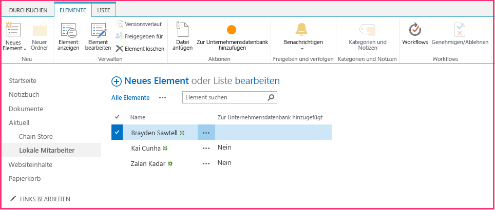

# <a name="include-a-custom-button-in-the-provider-hosted-add-in"></a>Einschließen benutzerdefinierter Schaltflächen in anbietergehosteten Add-Ins

Dies ist der dritte einer Reihe von Artikeln über die Grundlagen der Entwicklung von vom Anbieter gehosteten SharePoint-Add-Ins. Machen Sie sich zunächst mit [SharePoint-Add-Ins](sharepoint-add-ins.md) und den vorherigen Artikeln dieser Reihe vertraut, die Sie unter [Erste Schritte beim Erstellen von von einem Anbieter gehosteten SharePoint-Add-Ins](get-started-creating-provider-hosted-sharepoint-add-ins.md#SP15createprovider_nextsteps) finden. 
    
> [!NOTE]
> Wenn Sie unsere Artikelreihe zum Thema anbietergehostete Add-Ins durchgearbeitet haben, haben Sie bereits eine Visual Studio-Lösung, die Sie für diesen Artikel verwenden können. Sie können auch das Repository unter [SharePoint_Provider-hosted_Add-Ins_Tutorials](https://github.com/OfficeDev/SharePoint_Provider-hosted_Add-ins_Tutorials) herunterladen und die Datei „BeforeAdd-inPart.sln“ öffnen.

Ein SharePoint-Add-In kann benutzerdefinierte Aktionen umfasst; dies ist die SharePoint-Bezeichnung für benutzerdefinierte Menüelemente oder Menübandschaltflächen. In diesem Artikel erfahren Sie, wie eine benutzerdefinierte Schaltfläche erstellt wird, die eine SharePoint-Liste mit einer Remotedatenbank synchronisiert.
 
## <a name="create-a-custom-list-on-the-host-website"></a>Erstellen einer benutzerdefinierten Liste auf der Hostwebsite

Die benutzerdefinierte Schaltfläche wird sich auf dem Menüband einer bestimmte Liste befinden, in der die Mitarbeiter eines lokalen Geschäfts aufgezeichnet werden. In einem späteren Artikel dieser Reihe erfahren Sie, wie Sie eine benutzerdefinierte Liste programmgesteuert zu einer Hostwebsite hinzufügen, aber für den Moment werden Sie diese manuell hinzufügen. 

1. Navigieren Sie auf der Startseite des Fabrikam-Stores in Hongkong zu **Websiteinhalte** > **Add-In hinzufügen** > ** Benutzerdefinierte Liste**. 

2. Geben Sie im Dialogfeld **Benutzerdefinierte Liste** **Lokale Mitarbeiter** als Name an, und klicken Sie auf **Erstellen**. 

3. Öffnen Sie auf der Seite **Websiteinhalte** die Liste **Lokale Mitarbeiter**.

4. Klicken Sie auf dem Menüband auf der Registerkarte **Liste** auf **Listeneinstellungen**.

5. Klicken Sie im Abschnitt **Spalten** der Seite **Listeneinstellungen** auf die Spalte **Titel**.

6. Ändern Sie im Formular **Spalte bearbeiten** den **Spaltenname** von **Title** in **Name**, und klicken Sie dann auf **OK**.

7. Klicken Sie auf der Seite **Einstellungen** auf **Spalte erstellen**.

8. Gehen Sie im Formular **Spalte erstellen** folgendermaßen vor:
    
   1. Geben Sie **Zur Unternehmensdatenbank hinzugefügt** als **Spaltenname** ein.
   2. Legen Sie den **Typ** auf **Ja/Nein (Kontrollkästchen)** fest.
   3. Legen Sie den **Standardwert** auf **Nein** fest.
   4. Klicken Sie auf **OK**.  Sie gelangen zurück zur Seite **Einstellungen**.
    
9. Wählen Sie **Websiteinhalte** aus, um die Seite **Websiteinhalte** zu öffnen. Dort befindet sich die Kachel für die neute Liste. Öffnen Sie sie.
    
10. Klicken Sie auf **Neues Element**, und geben Sie auf dem Formular zu Erstellen eines Elements einen Namen ein, wählen Sie jedoch *nicht* die Option **Zur Unternehmensdatenbank hinzugefügt** aus. Klicken Sie auf **Speichern**. Die Liste sollte ähnlich wie im folgenden Beispiel aussehen:

    *Abbildung 1. Die Liste der lokalen Mitarbeiter mit einem einzelnen Element*

    

## <a name="add-the-custom-button"></a>Hinzufügen der benutzerdefinierten Schaltfläche

In diesem Abschnitt schließen Sie das Markup in das Add-In ein, das eine Schaltfläche für das Menüband der Liste bereitstellt. Wenn ein Benutzer einen Mitarbeiter in der Liste markiert und die Schaltfläche auswählt, wird der Name des Mitarbeiters zur Unternehmensdatenbank hinzugefügt, und das Feld **Zur Unternehmensdatenbank hinzugefügt** ändert sich von **Nein** zu **Ja**.

1.  Wenn Visual Studio geöffnet ist, müssen Sie es schließen und die Projektmappe „ChainStore“ erneut öffen, damit Visual Studio Ihre neue Liste erkennen kann. (Führen Sie Visual Studio als Administrator aus.)
    
   > [!NOTE]
   > Die Einstellungen für Startprojekte in Visual Studio werden in der Regel nach dem erneuten Öffnen wieder auf die Standardwerte eingestellt. Wann immer Sie beim Durcharbeiten dieser Artikelreihe die Beispiellösung erneut öffnen, müssen Sie umgehend die folgenden Schritte durchführen: 

   > 1. Klicken Sie oben im **Projektmappen-Explorer** mit der rechten Maustaste auf den Lösungsknoten, und wählen Sie die Option **Startprojekte festlegen** aus.  
   > 2. Stellen Sie sicher, dass alle drei Projekte in der Spalte **Aktion** auf **Start** festgelegt sind.

2. Klicken Sie im **Projektmappen-Explorer** mit der rechten Maustaste auf das **ChainStore**-Projekt, und wählen Sie **Hinzufügen** > **Neues Element** aus. 
    
3. Wählen Sie im Dialogfeld **Neues Element hinzufügen** die Option **Benutzerdefinierte Menübandaktion** aus, nennen Sie sie **AddEmployeeToCorpDB**, und klicken Sie dann auf **Hinzufügen**.

4. In dem Dialogfeld, das geöffnet wird, werden drei Fragen gestellt. Geben Sie die folgenden Antworten ein:

   |**Frage**|**Geben Sie die folgende Antwort ein:**|
   |:-----|:-----|
   |**Wo möchten Sie die benutzerdefinierte Aktion verfügbar machen?**|Hostweb|
   |**Wo gilt die benutzerdefinierte Aktion?**|Listeninstanz|
   |**Für welches spezielle Element gilt die benutzerdefinierte Aktion?**|Lokale Mitarbeiter|

5. Klicken Sie auf **Weiter**, und Sie erhalten drei weitere Fragen:

   |**Frage**|**Geben Sie die folgende Antwort ein:**|
   |:-----|:-----|
   |**Wo befindet sich das Steuerelement?**|Ribbon.ListItem.Actions|
   |**Was ist die Beschriftung für das Schaltflächen-Steuerelement?**|Zur Unternehmensdatenbank hinzufügen|
   |**Wohin navigiert das Schaltflächen-Steuerelement?**|ChainStoreWeb\Pages\EmployeeAdder.aspx<br/>(Dies ist eine Seite, deren zugrunde liegender Code den Mitarbeiter zur Datenbank hinzufügt.)|

6. Klicken Sie auf **Fertig stellen**.
    
   Eine Datei „elements.xml“, die die benutzerdefinierte Aktion definiert, wird dem Projekt hinzugefügt und geöffnet. In den meisten Fällen können Sie diese Datei als Blackbox betrachten; Sie werden erst in einem späteren Artikel in dieser Reihe Änderungen daran vornehmen. Beachten Sie für den Moment Folgendes:

   - Das **Location**-Attribut des **CommandUIDefinition**-Elements hat den Wert `Ribbon.ListItem.Actions.Controls_children`. Der zweite Teil davon, `ListItem`, identifiziert die *Registerkarte* auf dem Menüband, auf der die Schaltfläche platziert wird (dies ist aber möglicherweise nicht genau der Anzeigename der Registerkarte). Der dritte Teil, `Actions`, ist der Name des *Abschnitts* des Menübands, in dem die Schaltfläche platziert wird.

   - Das Attribut **CommandAction** des Elements **CommandUIHandler** beginnt mit dem Platzhalter `~remoteAppUrl`. Dieser wird bei der Bereitstellung der Schaltfläche ersetzt durch die URL der Remotewebanwendung.

   - Dem Wert **CommandAction** wurden einige Abfrageparameter mit Platzhalterwerte in Klammern „{ }“ hinzugefügt. Diese Platzhalter werden zur Laufzeit aufgelöst. Beachten Sie, dass einer der Platzhalter die ID des Listenelements ist, das vom Benutzer ausgewählt wurde, bevor die benutzerdefinierte Schaltfläche auf dem Menüband ausgewählt wurde.

7. Öffnen Sie im Projekt **ChainStoreWeb** die Datei **Pages/EmployeeAdder.aspx**. Beachten Sie, dass diese keine Benutzeroberfläche aufweist. Dass Add-In verwendet diese Seite als eine Art Webdienst. Dies ist möglich, da die **System.Web.UI.Page**-Klasse von ASP.NET **System.Web.IHttpHandler** implementiert und da das **Page\_Load**-Ereignis automatisch ausgeführt wird, wenn die Seite angefordert wird.  
 
8. Öffnen Sie die Code-Behind-Datei **Pages/EmployeeAdder.aspx.cs**. Die Methode, die den Mitarbieter zu der Remotedatenbank hinzufügt (`AddLocalEmployeeToCorpDB`) ist bereits vorhanden. Sie verwendet das **SharePointContext**-Objekt, um die URL des Hostwebs abzurufen, die das Add-In als Mandantendiskriminator verwendet. Das erste, was die **Page_Load**-Methode tun muss, ist die Initialisierung des Objekts. Das Objekt wird erstellt und in der Sitzung zwischengespeichert, wenn die Startseite des Add-Ins geladen wird, fügen Sie den folgenden Code daher zur **Page_Load**-Methode hinzu. (Das **SharePointContext**-Objekt wird in der Datei „SharePointContext.cs“ definiert, die von den Office-Entwicklertools für Visual Studio generiert wird, wenn die Add-In-Lösung erstellt wird.
    
    ```C#
      spContext = Session["SPContext"] as SharePointContext;
    ```

9. Da die `AddLocalEmployeeToCorpDB`-Methode den Namen des Mitarbeiters als Parameter akzeptiert, fügen Sie die folgende Zeile zur **Page_Load**-Methode hinzu. Sie erstellen die `GetLocalEmployeeName`-Methode in einem späteren Schritt.
    
    ```C#
      // Read from SharePoint 
    string employeeName = GetLocalEmployeeName();
    ```

10. Fügen Sie unterhalb dieser Zeile den Aufruf der `AddLocalEmployeeToCorpDB`-Methode hinzu.
    
    ```C#
      // Write to remote database 
    AddLocalEmployeeToCorpDB(employeeName);
    ```

11. Fügen Sie eine **using**-Anweisung zur Datei für den Namespace  `Microsoft.SharePoint.Client` hinzu. (Die Office-Entwicklertools für Visual Studio enthielten die Microsoft.SharePoint.Client-Assembly im **ChainStoreWeb**-Projekt, als dieses erstellt wurde.)
    
12. Fügen Sie der `EmployeeAdder`-Klasse jetzt die folgende Methode hinzu. Das clientseitige SharePoint .NET-Objektmodell (CSOM) wird an einer anderen Stelle in MSDN ausführlich beschrieben, und es wird empfohlen, dass Sie sich dieses genauer ansehen, wenn Sie mit dieser Artikelreihe fertig sind. Beachten Sie, dass in diesem Artikel die **ListItem**-Klasse ein Element in einer SharePoint-Liste darstellt und dass auf einen Wert eines Felds in dem Element mit der „indexer“-Syntax verwiesen werden kann. Beachten Sie außerdem, dass der Code das Feld als **Titel** bezeichnet, obwohl Sie den Feldnamen in **Name** geändert haben. Dies liegt daran, dass Felder im Code immer mit ihrem *internen* Namen und nicht mit ihrem Anzeigenamen bezeichnet werden. Der interne Name eines Felds wird festgelegt, wenn das Feld erstellt wird, und kann nie geändert werden. Sie schließen den `TODO1` in einem späteren Schritt ab.
    
    ```C#
      private string GetLocalEmployeeName()
    {
        ListItem localEmployee;

        // TODO1: Initialize the localEmployee object by getting  
        // the item from SharePoint.

        return localEmployee["Title"].ToString();
    }
    ```

13. Unser Code benötigt die ID des Listenelements, bevor dieser aus SharePoint abgerufen werden kann. Fügen Sie die folgende Deklaration der `EmployeeAdder`-Klasse direkt unter der Deklaration für das `spContext`-Objekt hinzu.
    
    ```C#
      private int listItemID;
    ```

14. Fügen Sie jetzt die folgende Methode der `EmployeeAdder`-Klasse hinzu, um die ID dieses Listenelements aus dem Abfrageparameter abzurufen.
    
    ```C#
      private int GetListItemIDFromQueryParameter()
    {
        int result;
        Int32.TryParse(Request.QueryString["SPListItemId"], out result);
        return result;
    }
    ```

15. Um die `listItemID`-Variable zu initialisieren, fügen Sie der **Page_Load**-Methode die folgende Zeile unter der Zeile hinzu, die die `spContext`-Variable initialisiert.
    
    ```C#
      listItemID = GetListItemIDFromQueryParameter();
    ```

16. Ersetzen Sie in `GetLocalEmployeeName` die Zeile `TODO1` durch den folgenden Code. Behandeln Sie diesen Code vorerst wie eine Blackbox, solange wir uns auf das darauf konzentrieren, die benutzerdefinierte Schaltfläche zum Laufen zu bringen. Im nächsten Artikel in dieser Reihe, in der es um das clientseitige SharePoint-Objektmodell geht, erfahren Sie mehr über diesen Code.
    
    ```C#
      using (var clientContext = spContext.CreateUserClientContextForSPHost())
    {
        List localEmployeesList = clientContext.Web.Lists.GetByTitle("Local Employees");
        localEmployee = localEmployeesList.GetItemById(listItemID);
        clientContext.Load(localEmployee);
        clientContext.ExecuteQuery();
    }

    ```

   Die gesamte Methode sollte jetzt wie folgt aussehen.

    ```C#
      private string GetLocalEmployeeName()
     {
         ListItem localEmployee;

         using (var clientContext = spContext.CreateUserClientContextForSPHost())
         {
             List localEmployeesList = clientContext.Web.Lists.GetByTitle("Local Employees");
             selectedLocalEmployee = localEmployeesList.GetItemById(listItemID);
             clientContext.Load(selectedLocalEmployee);
             clientContext.ExecuteQuery();
         }
         return localEmployee["Title"].ToString();
     }
     ```

17. Die Seite „EmployeeAdder“ sollte tatsächlich nicht gerendert werden, fügen Sie Folgendes als letzte Zeile in der **Page_Load**-Methode hinzu. Dadurch wird der Browser zurück zur Listenansichtsseite für die **Local Employees**-Liste geleitet.
    
    ```C#
      // Go back to the Local Employees page
    Response.Redirect(spContext.SPHostUrl.ToString() + "Lists/LocalEmployees/AllItems.aspx", true);

    ```

   Die gesamte **Page_Load**-Methode sollte jetzt wie folgt aussehen.

    ```C#
          protected void Page_Load(object sender, EventArgs e)
        {
            spContext = Session["SPContext"] as SharePointContext;
            listItemID = GetListItemIDFromQueryParameter();

            // Read from SharePoint
            string employeeName = GetLocalEmployeeName();

            // Write to remote database
            AddLocalEmployeeToCorpDB(employeeName);

            // Go back to the preceding page
            Response.Redirect(spContext.SPHostUrl.ToString() + "Lists/LocalEmployees/AllItems.aspx", true);
        }
    ```


## <a name="request-permission-to-read-the-host-web-list"></a>Anfordern der Berechtigung zum Lesen der Hostwebliste

Wie Sie bereits gesehen haben, werden Sie in SharePoint aufgefordert, die Add-In-Berechtigungen zum Hostweb hinzuzufügen, wenn es installiert wird. Jedes Mal, wenn Sie F5 drücken, haben Sie das Add-In erneut installiert. Bisher benötigte das Add-In nur minimale Berechtigungen, die `GetLocalEmployeeName`-Methode benötigt jedoch die Berechtigung zum Lesen der Listen der Hostwebsite. Das Add-In verwendet sein Add-In-Manifest, um SharePoint mitzuteilen, welche Berechtigungen es benötigt. Führen Sie die folgenden Schritte aus.

1. Öffnen Sie im **Projektmappen-Explorer** die Datei AppManifest.xml im **ChainStore**-Projekt. (Die Datei heißt AppManifest, da Add-Ins früher als „Apps" bezeichnet wurden.) Der Manifest-Designer wird geöffnet.

2. Öffnen Sie die Registerkarte **Berechtigungen**, wählen Sie die leere Zelle unter der Spalte **Bereich** aus, und wählen Sie dann **Liste** aus der Dropdownliste aus.

3. Wählen Sie im Feld **Berechtigung** die Option **Lesen** aus der Dropdownliste aus.

4. Lassen Sie das Feld **Eigenschaften** leer, und speichern Sie die Datei. Die Registerkarte **Berechtigungen** sollte etwa wie folgt aussehen.

   *Abbildung 2. Die Registerkarte „Berechtigungen“*

   


## <a name="run-the-add-in-and-test-the-button"></a>Ausführen des Add-Ins und Testen der Schaltfläche

1. Drücken Sie die Taste F5, um Ihr Add-In bereitzustellen und auszuführen. Visual Studio hostet die Remotewebanwendung in IIS Express und die SQL-Datenbank in SQL Express. Zudem installiert Visual Studio das Add-In vorübergehend auf Ihrer SharePoint-Testwebsite und führt es sofort aus. Sie werden aufgefordert, Berechtigungen für das Add-In zu erteilen, bevor die Startseite geöffnet wird. Dieses Mal weist die Aufforderung ein Dropdownmenü auf, in dem Sie die Liste auswählen, die die App zum Lesen benötigt, wie im folgenden Screenshot dargestellt. 
  
   *Abbildung 3. SharePoint-Add-In-Berechtigungsaufforderung*

   

2. Wählen Sie **Lokale Mitarbeiter** aus der Liste aus, und klicken Sie dann auf **Vertrauen**.

3. Wenn die Add-In-Startseite geöffnet wird, klicken Sie auf **Zurück zur Website** im Chromesteuerelement im oberen Bereich.

4. Gehen Sie auf der Startseite der Website zu **Websiteinhalte** > **Lokale Mitarbeiter**. Die Listenansichtsseite wird geöffnet.

5. Fügen Sie der Liste ein paar Mitarbeiter hinzu. *Aktivieren Sie das Kontrollkästchen __Zur Unternehmensdatenbank hinzugefügt__ nicht.* 

6. Öffnen Sie auf dem Menüband die Registerkarte **Elemente**. Im Abschnitt **Aktionen** der Registerkarte wird die benutzerdefinierte Schaltfläche **Zur Unternehmensdatenbank hinzufügen** angezeigt.

7. Wählen Sie ein Element in der Liste aus. Die Seite und das Menüband sollten in etwa wie folgt aussehen:

   *Abbildung 4. Die Liste „Lokale Mitarbeiter“*  

   

8. Klicken Sie nach dem Auswählen eines Elements in der Liste auf **Zur Unternehmensdatenbank hinzufügen**. 

9. Die Seite scheint neu geladen zu werden, da die **Page_Load**-Methode der Seite „EmployeeAdder“ eine direkte Umleitung aufweist.

10. Klicken Sie im Browser zweimal auf die Schaltfläche „Zurück“, um zurück zur Startseite für das Add-In zu navigieren. 

11. Klicken Sie auf **Mitarbeiter anzeigen**, und die Liste der Mitarbeiter wird mit dem Mitarbeiter, den Sie hinzugefügt haben, aufgefüllt. Sie sollte etwa wie folgt aussehen:

   *Abbidlung 5. Die Liste der Unternehmensmitarbeiter auf der Startseite des Add-Ins* 

   

12. Schließen Sie zum Beenden der Debugsitzung das Browserfenster, oder beenden Sie das Debuggen in Visual Studio. Wann immer Sie F5 drücken, zieht Visual Studio die bisherige Version des Add-Ins zurück und installiert die jeweils neueste Version.

13. Da Sie mit diesem Add-In und dieser Visual Studio-Lösung auch in anderen Artikeln arbeiten werden, empfiehlt es sich, das Add-In ein letztes Mal zurückzuziehen, sobald Sie eine Weile nicht mehr an ihm arbeiten werden. Klicken Sie im **Projektmappen-Explorer** mit der rechten Maustaste auf das Projekt, und wählen Sie die Option **Zurückziehen** aus.

## <a name="next-steps"></a>Nächste Schritte
<a name="Nextsteps"> </a>

In diesem Artikel legen Sie eine kurze Pause vom Codieren ein, um einen [schnellen Überblick über das SharePoint-Clientobjektmodell (CSOM) zu erhalten](get-a-quick-overview-of-the-sharepoint-object-model.md).
 

 

