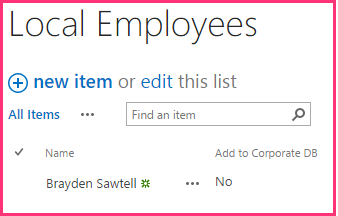
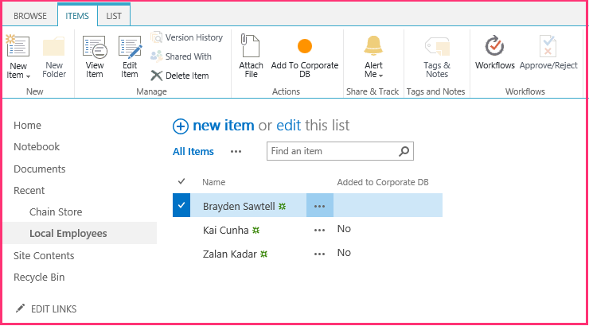

# <a name="include-a-custom-button-in-the-provider-hosted-add-in"></a><span data-ttu-id="87c77-101">Einschließen einer benutzerdefinierten Schaltfläche im vom Anbieter gehosteten Add-In</span><span class="sxs-lookup"><span data-stu-id="87c77-101">Include a custom button in the provider-hosted add-in</span></span>
<span data-ttu-id="87c77-102">Erfahren Sie, wie Sie eine benutzerdefinierte Menübandschaltfläche in ein vom Anbieter gehostetes SharePoint-Add-In einfügen.</span><span class="sxs-lookup"><span data-stu-id="87c77-102">Learn how to include a custom ribbon button in a provider-hosted spappsing.</span></span>
 

 <span data-ttu-id="87c77-p101">**Hinweis** Der Name „Apps für SharePoint“ wird in „SharePoint-Add-Ins“ geändert. Während des Übergangszeitraums wird in der Dokumentation und der Benutzeroberfläche einiger SharePoint-Produkte und Visual Studio-Tools möglicherweise weiterhin der Begriff „Apps für SharePoint“ verwendet. Weitere Informationen finden Sie unter [Neuer Name für Office- und SharePoint-Apps](new-name-for-apps-for-sharepoint#bk_newname).</span><span class="sxs-lookup"><span data-stu-id="87c77-p101">The name "apps for SharePoint" is changing to "SharePoint Add-ins". During the transition, the documentation and the UI of some SharePoint products and Visual Studio tools might still use the term "apps for SharePoint". For details, see [New name for apps for Office and SharePoint](new-name-for-apps-for-sharepoint#bk_newname).</span></span>
 

<span data-ttu-id="87c77-p102">Dies ist der dritte in einer Reihe von Artikeln über die Grundlagen der Entwicklung von vom Anbieter gehosteten SharePoint-Add-Ins. Sie sollten sich zuerst mit [SharePoint Add-Ins](sharepoint-add-ins) und den vorherigen Artikeln in dieser Reihe vertraut machen:</span><span class="sxs-lookup"><span data-stu-id="87c77-p102">Learn how to include a custom ribbon button in a provider-hosted SharePoint Add-in. This is the third in a series of articles about the basics of developing provider-hosted SharePoint Add-ins. You should first be familiar with  [SharePoint Add-ins](sharepoint-add-ins) and the previous articles in this series:</span></span>
 

-  [<span data-ttu-id="87c77-108">Erste Schritte beim Erstellen von einem Anbieter gehosteten SharePoint-Add-Ins</span><span class="sxs-lookup"><span data-stu-id="87c77-108">Get started creating provider-hosted SharePoint Add-ins</span></span>](get-started-creating-provider-hosted-sharepoint-add-ins)
    
 
-  [<span data-ttu-id="87c77-109">Übertragen des SharePoint-Aussehens und -Verhaltens auf Ihr vom Anbieter gehostetes Add-In</span><span class="sxs-lookup"><span data-stu-id="87c77-109">Give your provider-hosted add-in the SharePoint look-and-feel</span></span>](give-your-provider-hosted-add-in-the-sharepoint-look-and-feel)
    
 

 <span data-ttu-id="87c77-p103">**Hinweis** Wenn Sie diese Reihe zu vom Anbieter gehosteten Add-Ins durchgearbeitet haben, haben Sie eine Visual Studio-Projektmappe, die Sie verwenden können, um mit diesem Thema fortzufahren. Sie können außerdem das Repository unter  [SharePoint_Provider-hosted_Add-Ins_Tutorials](https://github.com/OfficeDev/SharePoint_Provider-hosted_Add-ins_Tutorials) herunterladen und die Datei „BeforeRibbonButton.sln" öffnen.</span><span class="sxs-lookup"><span data-stu-id="87c77-p103">**Note** If you have been working through this series about provider-hosted add-ins, then you have a Visual Studio solution that you can use to continue with this topic. You can also download the repository at  [SharePoint_Provider-hosted_Add-Ins_Tutorials](https://github.com/OfficeDev/SharePoint_Provider-hosted_Add-ins_Tutorials) and open the BeforeRibbonButton.sln file.</span></span>
 

<span data-ttu-id="87c77-p104">Ein SharePoint-Add-In kann benutzerdefinierte Aktionen enthalten, was der SharePoint-Ausdruck für benutzerdefinierte Menüelemente oder Menübandschaltflächen ist. In diesem Artikel erfahren Sie, wie Sie eine benutzerdefinierte Schaltfläche erstellen, die eine SharePoint-Liste mit einer Remotedatenbank synchronisiert.</span><span class="sxs-lookup"><span data-stu-id="87c77-p104">A SharePoint Add-in can include custom actions, which is the SharePoint term for a custom menu items or ribbon buttons. In this article you'll learn how to create a custom button that synchronizes a SharePoint list with a remote database.</span></span>
 

## <a name="create-a-custom-list-on-the-host-website"></a><span data-ttu-id="87c77-114">Erstellen einer benutzerdefinierten Liste auf der Hostwebsite</span><span class="sxs-lookup"><span data-stu-id="87c77-114">Create a custom list on the host website</span></span>

<span data-ttu-id="87c77-p105">Die benutzerdefinierte Schaltfläche wird sich auf dem Menüband einer bestimmte Liste befinden, in der die Mitarbeiter eines lokalen Geschäfts aufgezeichnet werden. In einem späteren Artikel dieser Reihe erfahren Sie, wie Sie eine benutzerdefinierte Liste programmgesteuert zu einer Hostwebsite hinzufügen, aber für den Moment werden Sie diese manuell hinzufügen.</span><span class="sxs-lookup"><span data-stu-id="87c77-p105">The custom button is going to be on the ribbon of a specific list that records the employees of the local store. In a later article in this series, you'll learn how to programmatically add a custom list to a host website, but for now you'll add one manually.</span></span> 
 

 

1. <span data-ttu-id="87c77-117">Navigieren Sie auf der Startseite des Fabrikam-Stores in Hongkong zu **Websiteinhalte | Add-In hinzufügen | Benutzerdefinierte Liste**.</span><span class="sxs-lookup"><span data-stu-id="87c77-117">From the home page of the Fabrikam Hong Kong Store, navigate to **Site Contents | add an add-in | Custom List**.</span></span> 
    
 
2. <span data-ttu-id="87c77-118">Geben Sie im Dialogfeld **Benutzerdefinierte Liste**Lokale Mitarbeiter als Name an, und klicken Sie auf **Erstellen**.</span><span class="sxs-lookup"><span data-stu-id="87c77-118">In the **Adding Custom List** dialog, specifyLocal Employees as the name and press **Create**.</span></span> 
    
 
3. <span data-ttu-id="87c77-119">Öffnen Sie auf der Seite **Websiteinhalte** die Liste **Lokale Mitarbeiter**.</span><span class="sxs-lookup"><span data-stu-id="87c77-119">On the **Site Contents** page, open the **Local Employees** list.</span></span>
    
 
4. <span data-ttu-id="87c77-120">Öffnen Sie die Registerkarte **Liste** auf dem Menüband, und klicken Sie dann auf die Schaltfläche **Listeneinstellungen**.</span><span class="sxs-lookup"><span data-stu-id="87c77-120">Open the **List** tab on the ribbon, and then click the **List Settings** button.</span></span>
    
 
5. <span data-ttu-id="87c77-121">Klicken Sie im Abschnitt **Spalten** der Seite **Listeneinstellungen** auf die Spalte **Titel**.</span><span class="sxs-lookup"><span data-stu-id="87c77-121">In the **Columns** section of the **List Settings** page, click the **Title** column.</span></span>
    
 
6. <span data-ttu-id="87c77-122">Ändern Sie im Formular **Spalte bearbeiten** den **Spaltenname** von „Titel" inName, und klicken Sie dann auf **OK**.</span><span class="sxs-lookup"><span data-stu-id="87c77-122">In the **Edit Column** form, change the **Column name** from Title toName; and then click **OK**.</span></span>
    
 
7. <span data-ttu-id="87c77-123">Klicken Sie auf der Seite **Einstellungen** auf **Spalte erstellen**.</span><span class="sxs-lookup"><span data-stu-id="87c77-123">On the **Settings** page, click **Create column**.</span></span>
    
 
8. <span data-ttu-id="87c77-124">Gehen Sie im Formular **Spalte erstellen** folgendermaßen vor:</span><span class="sxs-lookup"><span data-stu-id="87c77-124">In the **Create Column** form, do the following:</span></span>
    
      1. <span data-ttu-id="87c77-125">Geben Sie „Zu Unternehmens-DB hinzugefügt“ als **Spaltenname** ein.</span><span class="sxs-lookup"><span data-stu-id="87c77-125">Enter Added to Corporate DB as the **Column name**.</span></span>
    
 
  2. <span data-ttu-id="87c77-126">Legen Sie den Typ auf **Ja/Nein (Kontrollkästchen)** fest.</span><span class="sxs-lookup"><span data-stu-id="87c77-126">Set the type to **Yes/No (check box)**.</span></span>
    
 
  3. <span data-ttu-id="87c77-127">Legen Sie den **Standardwert** auf **Nein** fest.</span><span class="sxs-lookup"><span data-stu-id="87c77-127">Set the **Default value** to **No**.</span></span>
    
 
  4. <span data-ttu-id="87c77-p106">Klicken Sie auf **OK**. Sie gelangen zurück zur Seite **Einstellungen**.</span><span class="sxs-lookup"><span data-stu-id="87c77-p106">Press **OK**. You are taken back to the **Settings** page.</span></span>
    
 
9. <span data-ttu-id="87c77-p107">Klicken Sie auf **Websiteinhalte**, um die Seite **Websiteinhalte** zu öffnen. Die Kachel für die neue Liste ist vorhanden. Öffnen Sie sie.</span><span class="sxs-lookup"><span data-stu-id="87c77-p107">Click **Site Contents** to open the **Site Contents** page. The tile for the new list is there. Open it.</span></span>
    
 
10. <span data-ttu-id="87c77-p108">Klicken Sie auf **Neues Element**, und geben Sie auf dem Formular zum Erstellen eines Element einen Namen ein, aber aktivieren Sie  *nicht***Zu Unternehmens-DB hinzugefügt**. Klicken Sie dann auf **Speichern**. Die Liste sollte etwa wie folgt aussehen:</span><span class="sxs-lookup"><span data-stu-id="87c77-p108">Click **new item** and on the create item form, enter a name, but do *not*  check **Added to Corporate DB**. Then click **Save**. The list should look similar to the following:</span></span>
    
  
 

 

 

## <a name="add-the-custom-button"></a><span data-ttu-id="87c77-139">Hinzufügen der benutzerdefinierten Schaltfläche</span><span class="sxs-lookup"><span data-stu-id="87c77-139">Add the custom button</span></span>

<span data-ttu-id="87c77-p110">In diesem Abschnitt fügen Sie ein Markup in das Add-In ein, das eine Schaltfläche auf dem Menüband der Liste bereitstellt. Wenn ein Benutzer einen Mitarbeiter in der Liste markiert und auf die Schaltfläche klickt, wird der Name des Mitarbeiters zur Unternehmensdatenbank hinzugefügt das Feld **Zu Unternehmens-DB hinzugefügt** wechselt von „Nein" auf „Ja".</span><span class="sxs-lookup"><span data-stu-id="87c77-p110">In this section, you include markup in the add-in that will deploy a button to the list's ribbon. When a user highlights an employee on the list and clicks the button, the employee's name will be added to the corporate database and the **Added to Corporate DB** field for the employee will be switched from No to Yes.</span></span>
 

 

1.  <span data-ttu-id="87c77-p111">*Wenn Visual Studio geöffnet ist, müssen Sie es schließen*  und die Projektmappe ChainStore erneut öffen, damit Visual Studio Ihre neue Liste erkennen kann. (Führen Sie Visual Studio als Administrator aus.)</span><span class="sxs-lookup"><span data-stu-id="87c77-p111">*If Visual Studio is open, you have to close it*  and reopen the Chain Store solution so that Visual Studio can discover your new list. (Run Visual Studio as an administrator.)</span></span>
    
     <span data-ttu-id="87c77-p112">**Hinweis** Die Einstellungen für Startprojekte in Visual Studio werden normalerweise auf die Standardwerte zurückgesetzt, wann immer die Projektmappe erneut geöffnet wird. Führen Sie die folgenden Schritte immer unmittelbar nach dem erneuten Öffnen der Beispielprojektmappe in dieser Artikelreihe durch: Klicken Sie mit der rechten Maustaste oben im **Projektmappen-Explorer** auf den Projektmappenknoten, und wählen Sie **Startprojekte festlegen** aus. Stellen Sie sicher, dass alle drei Projekte in der Spalte **Aktion** auf **Starten** festgelegt sind.</span><span class="sxs-lookup"><span data-stu-id="87c77-p112">**Note**   The settings for Startup Projects in Visual Studio tend to revert to defaults whenever the solution is reopened. Always take these steps immediately after reopening the sample solution in this series of articles: Right-click the solution node at the top of **Solution Explorer** and select **Set startup projects**.  Make sure all three projects are set to **Start** in the **Action** column.</span></span>
2. <span data-ttu-id="87c77-147">Klicken Sie mit der rechten Maustaste auf das Projekt **ChainStore** im **Projektmappen-Explorer**, und wählen Sie **Hinzufügen | Neues Element** aus.</span><span class="sxs-lookup"><span data-stu-id="87c77-147">Right-click the **ChainStore** project in **Solution Explorer** and choose **Add | New Item**.</span></span> 
    
 
3. <span data-ttu-id="87c77-148">Wählen Sie im Dialogfeld **Neues Element hinzufügen** die Option **Benutzerdefinierte Menübandaktion** aus, nennen Sie sieAddEmployeeToCorpDB, und klicken Sie dann auf **Hinzufügen**.</span><span class="sxs-lookup"><span data-stu-id="87c77-148">In the **Add New Item** dialog, select **Ribbon Custom Action**, give it the name AddEmployeeToCorpDB, and then click **Add**.</span></span>
    
 
4. <span data-ttu-id="87c77-p113">In dem Dialogfeld, das geöffnet wird, werden drei Fragen gestellt. Geben Sie die folgenden Antworten ein:</span><span class="sxs-lookup"><span data-stu-id="87c77-p113">The dialog that opens asks three questions. Give the following answers:</span></span>
    

|<span data-ttu-id="87c77-151">**Frage**</span><span class="sxs-lookup"><span data-stu-id="87c77-151">**Question**</span></span>|<span data-ttu-id="87c77-152">**Geben Sie die folgende Antwort ein:**</span><span class="sxs-lookup"><span data-stu-id="87c77-152">**Give this answer:**</span></span>|
|:-----|:-----|
|<span data-ttu-id="87c77-153">**Wo möchten Sie die benutzerdefinierte Aktion verfügbar machen?**</span><span class="sxs-lookup"><span data-stu-id="87c77-153">**Where do you want to expose the custom action?**</span></span>|<span data-ttu-id="87c77-154">Hostweb</span><span class="sxs-lookup"><span data-stu-id="87c77-154">Host Web</span></span>|
|<span data-ttu-id="87c77-155">**Wo gilt die benutzerdefinierte Aktion?**</span><span class="sxs-lookup"><span data-stu-id="87c77-155">**Where is the custom action scoped to?**</span></span>|<span data-ttu-id="87c77-156">Listeninstanz</span><span class="sxs-lookup"><span data-stu-id="87c77-156">List Instance</span></span>|
|<span data-ttu-id="87c77-157">**Für welches spezielle Element gilt die benutzerdefinierte Aktion?**</span><span class="sxs-lookup"><span data-stu-id="87c77-157">**Which particular item is the custom action scoped to?**</span></span>|<span data-ttu-id="87c77-158">Lokale Mitarbeiter</span><span class="sxs-lookup"><span data-stu-id="87c77-158">Local Employees</span></span>|
5. <span data-ttu-id="87c77-159">Klicken Sie auf **Weiter**, und Sie erhalten drei weitere Fragen:</span><span class="sxs-lookup"><span data-stu-id="87c77-159">Click **Next** and you get three more questions:</span></span>
    

|<span data-ttu-id="87c77-160">**Frage**</span><span class="sxs-lookup"><span data-stu-id="87c77-160">**Question**</span></span>|<span data-ttu-id="87c77-161">**Geben Sie die folgende Antwort ein:**</span><span class="sxs-lookup"><span data-stu-id="87c77-161">**Give this answer:**</span></span>|
|:-----|:-----|
|<span data-ttu-id="87c77-162">**Wo befindet sich das Steuerelement?**</span><span class="sxs-lookup"><span data-stu-id="87c77-162">**Where is the control located?**</span></span>|<span data-ttu-id="87c77-163">Ribbon.ListItem.Actions</span><span class="sxs-lookup"><span data-stu-id="87c77-163">Ribbon.ListItem.Actions</span></span>|
|<span data-ttu-id="87c77-164">**Was ist die Beschriftung für das Schaltflächen-Steuerelement?**</span><span class="sxs-lookup"><span data-stu-id="87c77-164">**What is the label text for the button control?**</span></span>|<span data-ttu-id="87c77-165">Zur Unternehmensdatenbank hinzufügen</span><span class="sxs-lookup"><span data-stu-id="87c77-165">Add to Corporate DB</span></span>|
|<span data-ttu-id="87c77-166">**Wohin navigiert das Schaltflächen-Steuerelement?**</span><span class="sxs-lookup"><span data-stu-id="87c77-166">**Where does the button control navigate to?**</span></span>|<span data-ttu-id="87c77-167">ChainStoreWeb\Pages\EmployeeAdder.aspx (Dies ist eine Seite, deren zugrunde liegender Code den Mitarbeiter zur Datenbank hinzufügt.)</span><span class="sxs-lookup"><span data-stu-id="87c77-167">ChainStoreWebPagesEmployeeAdder.aspx (This is a page whose code behind is going to add the employee to the database.)</span></span>|
6. <span data-ttu-id="87c77-168">Klicken Sie auf **Fertig stellen**.</span><span class="sxs-lookup"><span data-stu-id="87c77-168">Click **Finish**.</span></span>
    
    <span data-ttu-id="87c77-p114">Eine elements.xml-Datei, die die benutzerdefinierte Aktion definiert, wird dem Projekt hinzugefügt und geöffnet. Größtenteils können Sie diese Datei als schwarzes Feld behandeln und müssen Sie bis zu einem späteren Artikel dieser Reihe keine Änderungen darin vornehmen. Jetzt beachten Sie nur Folgendes:</span><span class="sxs-lookup"><span data-stu-id="87c77-p114">An elements.xml file that defines the custom action is added to the project and opened. For the most part, you can treat this file as a black box, and you won't need to make any changes in it untill a later article in this series. For now, note only the following:</span></span>
    
      - <span data-ttu-id="87c77-p115">Das Attribut **Location** des Elements **CommandUIDefinition** hat den Wert `Ribbon.ListItem.Actions.Controls_children`. Der zweite Teil,  `ListItem`, identifiziert die Registerkarte des Menübands, in der die Schaltfläche abgelegt wird (ist aber möglicherweise nicht der genaue Namen der Registerkarte), und der dritte Teil,  `Actions`, ist der Name des Abschnitts des Menübands, in den die Schaltfläche eingefügt wird.</span><span class="sxs-lookup"><span data-stu-id="87c77-p115">The **Location** attribute of the **CommandUIDefinition** element has the value `Ribbon.ListItem.Actions.Controls_children`. The second part of this,  `ListItem`, identifies the tab on the ribbon where the button will be placed (but that may not be the exact display name of the tab) and the third part,  `Actions`, is the name of the section of the ribbon where the button will be placed.</span></span>
    
 
  - <span data-ttu-id="87c77-p116">Das Attribut **CommandAction** des Elements **CommandUIHandler** beginnt mit dem Platzhalter `~remoteAppUrl`. Dieser wird bei der Bereitstellung der Schaltfläche ersetzt durch die URL der Remotewebanwendung.</span><span class="sxs-lookup"><span data-stu-id="87c77-p116">The **CommandAction** attribute of the **CommandUIHandler** element begins with the placeholder `~remoteAppUrl`. This will be replaced with the URL of the remote web application when the button is deployed.</span></span>
    
 
  - <span data-ttu-id="87c77-p117">Einige Abfrageparameter wurden zum Wert **CommandAction** mit Platzhalterwerten in geschweiften Klammern „{}" hinzugefügt. Diese Platzhalter werden zur Laufzeit aufgelöst. Beachten Sie, dass einer davon die ID des Listenelements ist, das vom Benutzer ausgewählt wird, bevor er auf die benutzerdefinierte Schaltfläche im Menüband klickt.</span><span class="sxs-lookup"><span data-stu-id="87c77-p117">A few query parameters have been added to the **CommandAction** value with placeholder values in braces "{ }". These placeholders are resolved at runtime. Note that one of them is the ID of the list item that is selected by the user before she presses the custom button on the ribbon.</span></span>
    
 
7. <span data-ttu-id="87c77-p118">Öffnen Sie im **ChainStoreWeb**-Projekt die Datei **Pages/EmployeeAdder.aspx**. Beachten Sie, dass keine Benutzeroberfläche vorhanden ist. Das Add-In wird diese Seite als eine Art Webdienst verwenden. Dies ist möglich, da die ASP.NET**-System.Web.UI.Page**-Klasse **System.Web.IHttpHandler** implementiert und das **Page\_Load**-Ereignis automatisch ausgeführt wird, wenn die Seite angefordert wird.</span><span class="sxs-lookup"><span data-stu-id="87c77-p118">In the ChainStoreWeb project, open the Pages/EmployeeAdder.aspx file. Notice that it doesn't have any UI. The add-in is going to use this page as a kind of web service. This is possible because the ASP.NET System.Web.UI.Page class implements System.Web.IHttpHandler and because the Page_Load event runs automatically when the page is requested.</span></span>
    
 
8. <span data-ttu-id="87c77-p119">Öffnen Sie die CodeBehind-Datei **Pages/EmployeeAdder.aspx.cs**. Die Methode, die den Mitarbeiter zur Remotedatenbank hinzufügt,  `AddLocalEmployeeToCorpDB`, ist bereits vorhanden. Sie verwendet das Objekt **SharePointContext**, um die URL des Hostwebs abzurufen, das das Add-In als Mandantendiskriminator verwendet. Die Methode **Page_Load** muss also zuerst dieses Objekt initialisieren. Das Objekt wird erstellt und in der Sitzung zwischengespeichert, wenn die Startseite des Add-Ins geladen wird. Fügen Sie also den folgenden Code zur Methode **Page_Load** hinzu. (Das Objekt **SharePointContext** ist in der SharePointContext.cs-Datei definiert, die von den Office-Entwicklertools für Visual Studio generiert wird, wenn die Add-In-Projektmappe erstellt wird.)</span><span class="sxs-lookup"><span data-stu-id="87c77-p119">Open the code behind file **Pages/EmployeeAdder.aspx.cs**. The method that adds the employee to the remote database,  `AddLocalEmployeeToCorpDB`, is already present. It uses the **SharePointContext** object to get the host web's URL, which the add-in uses as its tenant discriminator. So the first thing the **Page_Load** method needs to do is initialize this object. The object is created and cached in the Session when the add-in's start page loads, so add the following code to the **Page_Load** method. (The **SharePointContext** object is defined in the SharePointContext.cs file that the Office Developer Tools for Visual Studio generate when the add-in solution is created.)</span></span>
    
```C#
  spContext = Session["SPContext"] as SharePointContext;
```

9. <span data-ttu-id="87c77-p120">Da die Methode  `AddLocalEmployeeToCorpDB` den Namen des Mitarbeiters als Parameter akzeptiert, fügen Sie die folgende Zeile zur Methode **Page_Load** hinzu. Sie erstellen die Methode `GetLocalEmployeeName` in einem späteren Schritt.</span><span class="sxs-lookup"><span data-stu-id="87c77-p120">The  `AddLocalEmployeeToCorpDB` method takes the employee's name as a parameter, so add the following line to the **Page_Load** method. You'll create the `GetLocalEmployeeName` method in a later step.</span></span>
    
```C#
  // Read from SharePoint 
string employeeName = GetLocalEmployeeName();
```

10. <span data-ttu-id="87c77-191">Fügen Sie unterhalb dieser Zeile den Aufruf der `AddLocalEmployeeToCorpDB`-Methode hinzu.</span><span class="sxs-lookup"><span data-stu-id="87c77-191">Below this line, add the call to the  `AddLocalEmployeeToCorpDB` method.</span></span>
    
```C#
  // Write to remote database 
AddLocalEmployeeToCorpDB(employeeName);
```

11. <span data-ttu-id="87c77-p121">Fügen Sie eine **using**-Anweisung zur Datei für den Namespace  `Microsoft.SharePoint.Client` hinzu. (Die Office-Entwicklertools für Visual Studio enthielten die Microsoft.SharePoint.Client-Assembly im **ChainStoreWeb**-Projekt, als dieses erstellt wurde.)</span><span class="sxs-lookup"><span data-stu-id="87c77-p121">Add a **using** statement to file for the namespace `Microsoft.SharePoint.Client`. (The Office Developer Tools for Visual Studio included the Microsoft.SharePoint.Client assembly in the **ChainStoreWeb** project when it was created.)</span></span>
    
 
12. <span data-ttu-id="87c77-p122">Fügen Sie jetzt die folgende Methode zur Klasse  `EmployeeAdder` hinzu. Das SharePoint-.NET-CSOM (clientseitiges Objektmodell) ist im Detail an anderer Stelle auf MSDN dokumentiert, und wir empfehlen Ihnen, dieses zu erkunen, wenn Sie mit dieser Artikelreihe fertig sind. Beachten Sie für diesen Artikel, dass die Klasse **ListItem** ein Element in einer SharePoint-Liste darstellt und der Wert eines Felds in dem Element mit der „Indexer"-Syntax referenziert werden kann. Beachten Sie außerdem, dass der Code auf das Feld als „Titel" verweist, obwohl Sie den Feldnamen in „Name" geändert haben. Der Grund hierfür ist, dass in Code auf Felder immer mit ihrem *internen*  Namen verwiesen wird, nicht mit ihrem Anzeigenamen. Der interne Name eines Felds wird festgelegt, wenn das Feld erstellt wird, und kann nicht geändert werden. Sie schließen `TODO1` in einem späteren Schritt ab.</span><span class="sxs-lookup"><span data-stu-id="87c77-p122">Now add the following method to the  `EmployeeAdder` class. The SharePoint .NET Client-side Object Model (CSOM) is documented in detail elsewhere on MSDN and we encourage you to explore it when you are finished with this series of articles. For this article, note that the **ListItem** class represents an item in a SharePoint list and that the value of a field in the item can be referenced with "indexer" syntax. Notice also, that the code refers to the field as "Title" even though you changed the field name to "Name". This is because fields are always referred to in code by their *internal*  name, not their display name. The internal name of a field is set when the field is created and can never change. You complete the `TODO1` in a later step.</span></span>
    
```C#
  private string GetLocalEmployeeName()
{
    ListItem localEmployee;

    // TODO1: Initialize the localEmployee object by getting  
    // the item from SharePoint.
 
    return localEmployee["Title"].ToString();
}
```

13. <span data-ttu-id="87c77-p123">Unser Code benötigt die ID des Listenelements, bevor er dieses von SharePoint abrufen kann. Fügen Sie die folgende Deklaration zur Klasse  `EmployeeAdder` direkt unterhalb der Deklaration für das Objekt `spContext` hinzu.</span><span class="sxs-lookup"><span data-stu-id="87c77-p123">Our code will need the list item's ID before it can retrieve it from SharePoint. Add the following declaration to the  `EmployeeAdder` class just below the declaration for the `spContext` object.</span></span>
    
```C#
  private int listItemID;
```

14. <span data-ttu-id="87c77-203">Fügen Sie jetzt die folgende Methode der `EmployeeAdder`-Klasse hinzu, um die ID dieses Listenelements aus dem Abfrageparameter abzurufen.</span><span class="sxs-lookup"><span data-stu-id="87c77-203">Now add the following method to the  `EmployeeAdder` class to get the list item's ID from the query parameter.</span></span>
    
```C#
  private int GetListItemIDFromQueryParameter()
{
    int result;
    Int32.TryParse(Request.QueryString["SPListItemId"], out result);
    return result;
}
```

15. <span data-ttu-id="87c77-204">Um die `listItemID`-Variable zu initialisieren, fügen Sie der **Page_Load**-Methode die folgende Zeile unter der Zeile hinzu, die die `spContext`-Variable initialisiert.</span><span class="sxs-lookup"><span data-stu-id="87c77-204">To initialize the  `listItemID` variable, add the following line to the **Page_Load** method just below the line that initializes the `spContext` variable.</span></span>
    
```C#
  listItemID = GetListItemIDFromQueryParameter();
```

16. <span data-ttu-id="87c77-p124">Ersetzen Sie in  `GetLocalEmployeeName` `TODO1` durch den folgenden Code. Behandeln sie den Code für den Moment einfach als schwarzes Feld, während wir uns darauf konzentrieren, dass die benutzerdefinierte Schaltfläche funktioniert. Sie erfahren mehr über diesen Code im nächsten Artikel dieser Reihe, in dem es um das clientseitige SharePoint-Objektmodell geht.</span><span class="sxs-lookup"><span data-stu-id="87c77-p124">In the  `GetLocalEmployeeName`, replace the  `TODO1` with the following code. For the time being, just treat this code as a black box while we concentrate on getting the custom button working. We'll learn more about this code in the next article in this series, which is all about the SharePoint client-side object model.</span></span>
    
```C#
  using (var clientContext = spContext.CreateUserClientContextForSPHost())
{
    List localEmployeesList = clientContext.Web.Lists.GetByTitle("Local Employees");
    localEmployee = localEmployeesList.GetItemById(listItemID);
    clientContext.Load(localEmployee);
    clientContext.ExecuteQuery();
}

```


    The whole method should now look like the following.
    


```C#
  private string GetLocalEmployeeName()
{
    ListItem localEmployee;

    using (var clientContext = spContext.CreateUserClientContextForSPHost())
    {
        List localEmployeesList = clientContext.Web.Lists.GetByTitle("Local Employees");
        selectedLocalEmployee = localEmployeesList.GetItemById(listItemID);
        clientContext.Load(selectedLocalEmployee);
        clientContext.ExecuteQuery();
    }
    return localEmployee["Title"].ToString();
}
```

17. <span data-ttu-id="87c77-p125">Da die Seite EmployeeAdder nicht tatsächlich gerendert werden sollte, fügen Sie Folgendes als letzte Zeile in der Methode **Page_Load** hinzu. Damit wird der Browser zurück zur Listenansichtseite für die Liste **Lokale Mitarbeiter** gebracht.</span><span class="sxs-lookup"><span data-stu-id="87c77-p125">The EmployeeAdder page should not actually render, so add the following as the last line in the **Page_Load** method. This will redirect the browser back to the list view page for the **Local Employees** list.</span></span>
    
```C#
  // Go back to the Local Employees page
Response.Redirect(spContext.SPHostUrl.ToString() + "Lists/LocalEmployees/AllItems.aspx", true);

```


    The whole  **Page_Load** method should now look like the following.
    


```C#
  protected void Page_Load(object sender, EventArgs e)
{
    spContext = Session["SPContext"] as SharePointContext;
    listItemID = GetListItemIDFromQueryParameter();

    // Read from SharePoint
    string employeeName = GetLocalEmployeeName();

    // Write to remote database
    AddLocalEmployeeToCorpDB(employeeName);

    // Go back to the preceding page
    Response.Redirect(spContext.SPHostUrl.ToString() + "Lists/LocalEmployees/AllItems.aspx", true);
}
```


## <a name="request-permission-to-read-the-host-web-list"></a><span data-ttu-id="87c77-210">Anfordern der Berechtigung zum Lesen der Hostwebliste</span><span class="sxs-lookup"><span data-stu-id="87c77-210">Request permission to read the host web list</span></span>

<span data-ttu-id="87c77-p126">Wie Sie gesehen haben, werden Sie von SharePoint aufgefordert, die Add-In-Berechtigungen für das Hostweb zu gewähren, bei es installiert wird. Sie haben das Add-In jedes Mal erneut installiert, wenn Sie F5 gedrückt haben. Bisher hat das Add-In nur minimale Berechtigungen benötigt, aber die Methode  `GetLocalEmployeeName` erfordert die Berechtigung zum Lesen der Listen auf der Hostwebsite. Das Add-In verwendet sein Add-In-Manifest, um SharePoint anzuweisen, welche Berechtigungen es benötigt. Gehen Sie folgendermaßen vor.</span><span class="sxs-lookup"><span data-stu-id="87c77-p126">As you have seen, SharePoint prompts you to grant the add-in permissions to the host web when it is installed. You have been re-installing the add-in every time you press F5. So far, the add-in has only needed minimal permissions, but the  `GetLocalEmployeeName` method requires permission to read the lists of the host website. The add-in uses its add-in manifest to tell SharePoint what permissions it needs. Follow these steps.</span></span>
 

 

1. <span data-ttu-id="87c77-p127">Öffnen Sie im **Projektmappen-Explorer** die Datei AppManifest.xml im **ChainStore**-Projekt. (Die Datei heißt AppManifest, da Add-Ins früher als „Apps" bezeichnet wurden.) Der Manifest-Designer wird geöffnet.</span><span class="sxs-lookup"><span data-stu-id="87c77-p127">In **Solution Explorer**, open the AppManifest.xml file in the **ChainStore** project. (The file is called AppManifest because add-ins used to be called "apps".) The manifest designer opens.</span></span>
    
 
2. <span data-ttu-id="87c77-218">Öffnen Sie die Registerkarte **Berechtigungen**, und klicken Sie auf die leere Zelle unter der Spalte **Bereich**. Wählen Sie dann **Liste** aus der Dropdownliste aus.</span><span class="sxs-lookup"><span data-stu-id="87c77-218">Open the **Permissions** tab and click the empty cell under the **Scope** column; and then select **List** from the drop down.</span></span>
    
 
3. <span data-ttu-id="87c77-219">Wählen Sie im Feld **Berechtigung** die Option **Lesen** aus der Dropdownliste aus.</span><span class="sxs-lookup"><span data-stu-id="87c77-219">In the **Permission** field, select **Read** from the drop down.</span></span>
    
 
4. <span data-ttu-id="87c77-p128">Lassen Sie die das Feld **Eigenschaften** leer, und speichern Sie die Datei. Die Registerkarte **Berechtigung** sollte etwa wie folgt aussehen:</span><span class="sxs-lookup"><span data-stu-id="87c77-p128">Leave the **Properties** field empty and save the file. The **Permission** tab should look similar to the following:</span></span>
    
  
 

 

 

## <a name="run-the-add-in-and-test-the-button"></a><span data-ttu-id="87c77-223">Ausführen des Add-Ins und Testen der Schaltfläche</span><span class="sxs-lookup"><span data-stu-id="87c77-223">Run the add-in and test the button</span></span>


 

 

1. <span data-ttu-id="87c77-p129">Verwenden Sie die F5-TASTE, um Ihr Add-In bereitzustellen und auszuführen. Visual Studio hostet die Remotewebanwendung in IIS Express und die SQL-Datenbank in SQL Express. Außerdem wird eine temporäre Installation des Add-Ins auf Ihrer SharePoint-Testwebsite durchgeführt, und das Add-In wird sofort ausgeführt. Sie werden aufgefordert, Berechtigungen für das Add-In zu erteilen, bevor die Startseite geöffnet wird. Diesmal umfasst die Aufforderung eine Dropdownliste, aus der Sie die Liste auswählen, die das Add-In lesen muss, wie im folgenden Screenshot dargestellt.</span><span class="sxs-lookup"><span data-stu-id="87c77-p129">Use the F5 key to deploy and run your add-in. Visual Studio hosts the remote web application in IIS Express and hosts the SQL database in a SQL Express. It also makes a temporary installation of the add-in on your test SharePoint site and immediately runs the add-in. You are prompted to grant permissions to the add-in before it's start page opens. This time the prompt has a drop down where you select the list that the app needs to read as seen in the following screenshot.</span></span> 
    
  
 

 

 
2. <span data-ttu-id="87c77-230">Wählen Sie **Lokale Mitarbeiter** aus der Liste aus, und klicken Sie dann auf **Vertrauen**.</span><span class="sxs-lookup"><span data-stu-id="87c77-230">Choose **Local Employees** from the list and then click **Trust it**.</span></span>
    
 
3. <span data-ttu-id="87c77-231">Wenn die Add-In-Startseite geöffnet wird, klicken Sie auf **Zurück zur Website** im Chromesteuerelement im oberen Bereich.</span><span class="sxs-lookup"><span data-stu-id="87c77-231">When the add-in's start page opens, click **Back to Site** on the chrome control at the top.</span></span>
    
 
4. <span data-ttu-id="87c77-p130">Navigieren Sie auf der Startseite der Website zu **Websiteinhalte | Lokale Mitarbeiter**. Die Seite mit der Listenansicht wird geöffnet.</span><span class="sxs-lookup"><span data-stu-id="87c77-p130">From the website's home page navigate to **Site Contents | Local Employees**. The list view page opens.</span></span>
    
 
5. <span data-ttu-id="87c77-p131">Fügen Sie einige Mitarbeiter zur Liste hinzu.  *Aktivieren Sie nicht das Kontrollkästchen **Zu Unternehmens-DB hinzugefügt**.*</span><span class="sxs-lookup"><span data-stu-id="87c77-p131">Add a few employees to the list.  *Do not check the **Added to Corporate DB** checkbox.*</span></span> 
    
 
6. <span data-ttu-id="87c77-p132">Öffnen Sie auf dem Menüband die Registerkarte **Elemente**. Im Abschnitt **Aktionen** der Registerkarte wird die benutzerdefinierte Schaltfläche **Zu Unternehmens-DB hinzufügen** angezeigt.</span><span class="sxs-lookup"><span data-stu-id="87c77-p132">On the ribbon, open the **Items** tab. In the **Actions** section of the tab, is the custom button **Add to Corporate DB**.</span></span>
    
 
7. <span data-ttu-id="87c77-p133">Wählen Sie ein Element in der Liste aus. Die Seite und das Menüband sollten in etwa wie folgt aussehen:</span><span class="sxs-lookup"><span data-stu-id="87c77-p133">Select an item on the list. The page and ribbon should look similar to the following:</span></span>
    
  
 

 

 
8. <span data-ttu-id="87c77-p135">Klicken Sie auf die Schaltfläche **Zu Unternehmens-DB hinzufügen**. * **Sie müssen zuerst ein Element auswählen!***</span><span class="sxs-lookup"><span data-stu-id="87c77-p135">Press the **Add to Corporate DB** button. * **An item must be selected first!***</span></span> 
    
 
9. <span data-ttu-id="87c77-245">Da Seite scheint neu geladen zu werden, da die Methode **Page_Load** der Seiteb EmployeeAdder zur Seite umleitet.</span><span class="sxs-lookup"><span data-stu-id="87c77-245">The page will seem to reload because the **Page_Load** method of the EmployeeAdder page redirects back to it.</span></span>
    
 
10. <span data-ttu-id="87c77-246">Klicken Sie im Browser zweimal auf die Schaltfläche „Zurück“, um zurück zur Startseite für das Add-In zu navigieren.</span><span class="sxs-lookup"><span data-stu-id="87c77-246">Use the browser's back button twice to go back to the add-in's start page.</span></span> 
    
 
11. <span data-ttu-id="87c77-p136">Klicken Sie auf **Mitarbeiter anzeigen**, und die Liste der Mitarbeiter wird mit dem Mitarbeiter, den Sie hinzugefügt haben, aufgefüllt. Sie sollte etwa wie folgt aussehen:</span><span class="sxs-lookup"><span data-stu-id="87c77-p136">Click **Show Employees** and the list of employees will be populated with the employee that you added. It should look similar to the following:</span></span>
    
  
 

 

 
12. <span data-ttu-id="87c77-p137">Schließen Sie zum Beenden der Debugsitzung das Browserfenster, oder beenden Sie das Debuggen in Visual Studio. Jedes Mal, wenn Sie F5 drücken, zieht Visual Studio die vorherige Version des Add-Ins zurück und installiert die neueste.</span><span class="sxs-lookup"><span data-stu-id="87c77-p137">To end the debugging session, close the browser window or stop debugging in Visual Studio. Each time that you press F5, Visual Studio will retract the previous version of the add-in and install the latest one.</span></span>
    
 
13. <span data-ttu-id="87c77-p138">Da Sie mit diesem Add-In und dieser Visual Studio-Projektmappe in anderen Artikeln arbeiten werden, hat es sich bewährt, das Add-In ein letztes Mal zurückzuziehen, wenn Sie Ihre Arbeit daran für eine Weile abgeschlossen haben. Klicken Sie mit der rechten Maustaste auf das Projekt im **Projektmappen-Explorer**, und wählen Sie **Zurückziehen** aus.</span><span class="sxs-lookup"><span data-stu-id="87c77-p138">You will work with this add-in and Visual Studio solution in other articles, and it's a good practice to retract the add-in one last time when you are done working with it for a while. Right-click the project in **Solution Explorer** and choose **Retract**.</span></span>
    
 

## 
<span data-ttu-id="87c77-254"><a name="Nextsteps"> </a></span><span class="sxs-lookup"><span data-stu-id="87c77-254"></span></span>

 <span data-ttu-id="87c77-255">Im nächsten Artikel unterbrechen wir die Programmierung kurz und stellen eine Übersicht über das clientseitige SharePoint-Objektmodell bereit: [Schnelle Übersicht über das SharePoint-Objektmodell](get-a-quick-overview-of-the-sharepoint-object-model).</span><span class="sxs-lookup"><span data-stu-id="87c77-255">In the next article, we'll take a brief break from coding for an overview of the SharePoint client-side object model: [Get a quick overview of the SharePoint object model](get-a-quick-overview-of-the-sharepoint-object-model).</span></span>
 

 

