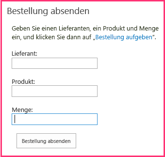

# Einfügen eines Add-In-Webparts in das vom Anbieter gehostete Add-InInclude an add-in part in the provider-hosted add-in
Erfahren Sie, wie Sie ein Remotewebformular in einer SharePoint-Seite in einem vom Anbieter gehosteten SharePoint-Add-In anzeigen.Learn how to surface a remote web form in a SharePoint page in a provider-hosted SharePoint Add-in.
 

 **Hinweis** Der Name „Apps für SharePoint“ wird in „SharePoint-Add-Ins“ geändert. Während des Übergangszeitraums wird in der Dokumentation und der Benutzeroberfläche einiger SharePoint-Produkte und Visual Studio-Tools möglicherweise weiterhin der Begriff „Apps für SharePoint“ verwendet. Weitere Informationen finden Sie unter [Neuer Name für Office- und SharePoint-Apps](new-name-for-apps-for-sharepoint.md#bk_newname).**Note**  The name "apps for SharePoint" is changing to "SharePoint Add-ins". During the transition, the documentation and the UI of some SharePoint products and Visual Studio tools might still use the term "apps for SharePoint". For details, see  [New name for apps for Office and SharePoint](new-name-for-apps-for-sharepoint.md#bk_newname).
 

Dies ist der sechste in einer Reihe von Artikeln über die Grundlagen der Entwicklung von vom Anbieter gehosteten SharePoint-Add-Ins. Sie sollten sich zuerst mit [SharePoint Add-Ins](sharepoint-add-ins.md) und den vorherigen Artikeln in dieser Reihe vertraut machen:This is the sixth in a series of articles about the basics of developing provider-hosted SharePoint Add-ins. You should first be familiar with  [SharePoint Add-ins](sharepoint-add-ins.md) and the previous articles in this series:
 

-  [Erste Schritte beim Erstellen von von einem Anbieter gehosteten SharePoint-Add-InsGet started creating provider-hosted SharePoint Add-ins](get-started-creating-provider-hosted-sharepoint-add-ins.md)
    
 
-  [Übertragen des SharePoint-Aussehens und -Verhaltens auf Ihr vom Anbieter gehostetes Add-InGive your provider-hosted add-in the SharePoint look-and-feel](give-your-provider-hosted-add-in-the-sharepoint-look-and-feel.md)
    
 
-  [Einfügen einer benutzerdefinierten Schaltfläche in das vom Anbieter gehostete Add-InInclude a custom button in the provider-hosted add-in](include-a-custom-button-in-the-provider-hosted-add-in.md)
    
 
-  [Schnelle Übersicht über das SharePoint-ObjektmodellGet a quick overview of the SharePoint object model](get-a-quick-overview-of-the-sharepoint-object-model.md)
    
 
-  [Hinzufügen von SharePoint-Schreibvorgängen zum vom Anbieter gehosteten Add-InAdd SharePoint write operations to the provider-hosted add-in](add-sharepoint-write-operations-to-the-provider-hosted-add-in.md)
    
 

 **Hinweis** Wenn Sie diese Reihe zu vom Anbieter gehosteten Add-Ins durchgearbeitet haben, haben Sie eine Visual Studio-Projektmappe, die Sie verwenden können, um mit diesem Thema fortzufahren. Sie können außerdem das Repository unter [SharePoint_Provider-hosted_Add-Ins_Tutorials](https://github.com/OfficeDev/SharePoint_Provider-hosted_Add-ins_Tutorials) herunterladen und die Datei „BeforeAdd-inPart.sln“ öffnen.**Note**  If you have been working through this series about provider-hosted add-ins, then you have a Visual Studio solution that you can use to continue with this topic. You can also download the repository at  [SharePoint_Provider-hosted_Add-Ins_Tutorials](https://github.com/OfficeDev/SharePoint_Provider-hosted_Add-ins_Tutorials) and open the BeforeAdd-inPart.sln file.
 

In diesem Artikel fügen Sie eine besondere Art von Webpart namens Add-In-Webpart zum SharePoint-Add-In hinzu. Das Add-In-Webpart stellt das Bestellformular des Add-Ins Bestellformular auf einer SharePoint-Seite zur Verfügung.In this article, you add a special kind of Web Part, called an add-in part to the SharePoint Add-in. The add-in part exposes the add-in's order form on a SharePoint page.
 

## Erstellen des Add-In-WebpartsCreate the add-in part

 

 

 **Hinweis** Die Einstellungen für Startprojekte in Visual Studio werden normalerweise auf die Standardwerte zurückgesetzt, wann immer die Projektmappe erneut geöffnet wird. Führen Sie die folgenden Schritte immer unmittelbar nach dem erneuten Öffnen der Beispielprojektmappe in dieser Artikelreihe durch: Klicken Sie mit der rechten Maustaste oben im **Projektmappen-Explorer** auf den Projektmappenknoten, und wählen Sie **Startprojekte festlegen** aus. Stellen Sie sicher, dass alle drei Projekte in der Spalte **Aktion** auf **Starten** festgelegt sind.**Note**   The settings for Startup Projects in Visual Studio tend to revert to defaults whenever the solution is reopened. Always take these steps immediately after reopening the sample solution in this series of articles: Right-click the solution node at the top of **Solution Explorer** and select **Set startup projects**.  Make sure all three projects are set to **Start** in the **Action** column.
 

1. Klicken Sie im **Projektmappen-Explorer** mit der rechten Maustaste auf das **ChainStore**-Projekt, und wählen Sie **Hinzufügen | Neues Element** aus.In  **Solution Explorer**, right-click the  **ChainStore** project and select **Add | New Item**.
    
 
2. Wählen Sie **Clientwebpart (Hostweb)** aus, nennen Sie es „Bestellung absenden“, und klicken Sie dann auf **Hinzufügen**. (Clientwebpart ist eine andere Bezeichnung für Add-In-Webpart.)Select  **Client Web Part (Host Web)**, give it the name Place Order, and then press  **Add**. ("Client Web Part" is another name for "add-in part".)
    
 
3. Wählen Sie auf der nächsten Seite des Assistenten das zweite Optionsfeld aus: **URL einer vorhandenen Webseite für den Clientwebpart-Inhalt auswählen oder eingeben**.On the next page of the wizard, select the second radio button:  **Select or enter the URL of an existing web page for the client web part content**.
    
 
4. Wählen Sie in der Dropdownliste die URL für die Seite **OrderForm.aspx** aus, und klicken Sie dann auf **Fertig stellen**.In the drop down list, select the URL for the  **OrderForm.aspx** page, and then press **Finish**.
    
    Eine Datei „elements.xml“, die das Add-In-Webpart definiert, wird dem Projekt hinzugefügt und geöffnet.An elements.xml file that defines the add-in part is added to the project and opened.
    
 
5. Ändern Sie im Element **ClientWebPart** die folgenden Attribute auf die angegebenen Werte:In the  **ClientWebPart** element, change the following attributes to these values:
    

|**Attribut****Attribute**|**Wert****Value**|
|:-----|:-----|
|TitleTitle|Bestellung absendenPlace Order|
|BeschreibungDescription|Formular zum Aufgeben einer BestellungForm to place an order|
|DefaultHeightDefaultHeight|320320|

    Leave all the other attributes with their defaults and save the file.
    
 

## Ausführen des Add-Ins und Testen de Add-In-WebspartsRun the add-in and test the add-in part

 

 

1. Verwenden Sie die F5-TASTE, um Ihr Add-In bereitzustellen und auszuführen. Visual Studio hostet die Remotewebanwendung in IIS Express und die SQL-Datenbank in SQL Express. Außerdem wird eine temporäre Installation des Add-Ins auf Ihrer SharePoint-Testwebsite durchgeführt, und das Add-In wird sofort ausgeführt. Sie werden aufgefordert, Berechtigungen für das Add-In zu erteilen, bevor die Startseite geöffnet wird.Use the F5 key to deploy and run your add-in. Visual Studio hosts the remote web application in IIS Express and hosts the SQL database in a SQL Express. It also makes a temporary installation of the add-in on your test SharePoint site and immediately runs the add-in. You are prompted to grant permissions to the add-in before it's start page opens.
    
 
2. Wenn die Add-In-Startseite geöffnet wird, wurde das Add-In bereitgestellt, und das Add-In-Webpart **Bestellung absenden** steht Benutzern zum Hinzufügen zu einem beliebigen Webpart-Bereich auf einer beliebigen SharePoint-Seite der Hongkong Store-Website zur Verfügung. Führen Sie die folgenden Schritte aus, um es der Startseite hinzuzufügen.When the add-in's start page opens, the add-in has been deployed and the  **Place Order** add-in part is available to for users to add to any Web Part area on any SharePoint page in the Hong Kong store's website. Follow these steps to add it to the home page.
    
      1. Klicken Sie auf **Zurück zur Website** im Chromsteuerelement am oberen Rand der Seite, um die Startseite des Store in Hongkong zu öffnen.Press  **Back to Site** on the chrome control at the top of the start page to open the home page of the Hong Kong store.
    
 
  2. Öffnen Sie auf dem Menüband die Registerkarte **Seite**, und klicken Sie auf die Schaltfläche **Bearbeiten**.On the ribbon, open the  **Page** tab and press the **Edit** button.
    
 
  3. Nachdem sich die Seite im Bearbeitungsmodus befindet, öffnen Sie die Registerkarte **Einfügen** auf dem Menüband, und klicken Sie auf die Schaltfläche **Add-In-Webpart**. (Die Schaltfläche heißt möglicherweise immer noch **App-Webpart**.)After the page is in edit mode, open the  **Insert** tab on the ribbon, and the press the **Add-in Part** button. (The button may still be called **App Part**.)
    
 
  4. Wählen Sie im geöffneten Webpart-Einfügesteuerelement das Add-In-Webpart **Bestellung absenden** aus. Das Steuerelement sieht ähnlich aus wie folgt.On the Web Part insertion control that opens, select the  **Place Order** add-in part. The control will look similar to the following.
    
  
 

 

 
  5. Klicken Sie in eine beliebige Webpartzone im Formular. Damit wird der Standort festgelegt, an dem das Add-In-Webpart eingefügt wird.Click somewhere in one of the Web Part zones of the form. This is to set the location where the add-in part will go. 
    
 
  6. Klicken Sie im Webpart-Einfügesteuerelement auf **Hinzufügen**. Das Add-In-Webpart **Bestellung absenden** wird der Webpartzone hinzugefügt.Click  **Add** on the Web Part insertion control. The **Place Order** add-in part will be added to the Web Part zone.
    
 
  7. Klicken Sie auf deim Menüband auf **Speichern**.On the ribbon press  **Save**.
    
 
3. Das Bestellformular wird nun auf der Seite angezeigt und hat das Aussehen und Verhalten des Rests der Seite übernommen. Es sollte wie folgt aussehen:The order form now appears on the page and it has the look-and-feel of the rest of the page. It should look like the following: 
    
  
 

 

 
4. Geben Sie Werte für **Lieferant**, **Produkt** und **Menge** ein, und klicken Sie auf **Bestellung absenden**. Es scheint nichts zu passieren, aber es wird eine Bestellung in die Datenbank des Unternehmens eingegeben. Optional können Sie die Felder des Add-In-Webparts leeren, indem Sie die Seite aktualisieren.Enter values for  **Supplier**,  **Product**, and  **Quantity** and press **Place Order**. Nothing will appear to happen, but an order is entered in the corporate database. Optionally, you can empty the fields of the add-in part by refreshing the page.
    
 
5. Verwenden Sie im Browser die Schaltfläche „Zurück“, bis Sie wieder auf die Startseite für das ChainStore-Add-In zurückgekehrt sind, und klicken Sie dann auf die Schaltfläche **Bestellungen anzeigen**. Ihre neue Bestellung wird jetzt aufgelistet.Use the browser's back button until you are back at the Chain Store add-in's start page; and then press  **Show Orders**. Your new order is listed.
    
 
6. Schließen Sie zum Beenden der Debugsitzung das Browserfenster, oder beenden Sie das Debuggen in Visual Studio. Jedes Mal, wenn Sie F5 drücken, zieht Visual Studio die vorherige Version des Add-Ins zurück und installiert die neueste.To end the debugging session, close the browser window or stop debugging in Visual Studio. Each time that you press F5, Visual Studio will retract the previous version of the add-in and install the latest one.
    
 
7. Da Sie mit diesem Add-In und dieser Visual Studio-Lösung in anderen Artikeln arbeiten werden, hat es sich bewähr, das Add-In ein letztes Mal zurückzuziehen, wenn Sie Ihre Arbeit daran für eine Weile abgeschlossen haben. Klicken Sie mit der rechten Maustaste auf das Projekt im **Projektmappen-Explorer**, und wählen Sie **Zurückziehen** aus.You will work with this add-in and Visual Studio solution in other articles, and it's a good practice to retract the add-in one last time when you are done working with it for a while. Right-click the project in  **Solution Explorer** and choose **Retract**.
    
 

## 

 Das Add-In hängt von zwei Listen ab, die Sie manuell erstellt haben. Sie möchten nicht, dass Ihre Benutzer dies ausführen müssen. Im nächsten Artikel beginnen Sie mit dem Prozess, diese Listen automatisch zu erstellen. Der erste wichtige Schritt ist die Erstellung von benutzerdefinierten Handlern für das Ereignis der Installation eines Add-ins: [Behandeln von Add-In-Ereignissen im vom Anbieter gehosteten Add-In](handle-add-in-events-in-the-provider-hosted-add-in.md)The add-in depends on two lists that you created manually. You don't want your users to have to do that. In the next article you begin the process of automatically creating these lists. The first major step is to create custom handlers for the event of installing an add-in: [Handle add-in events in the provider-hosted add-in](handle-add-in-events-in-the-provider-hosted-add-in.md)
 

 

