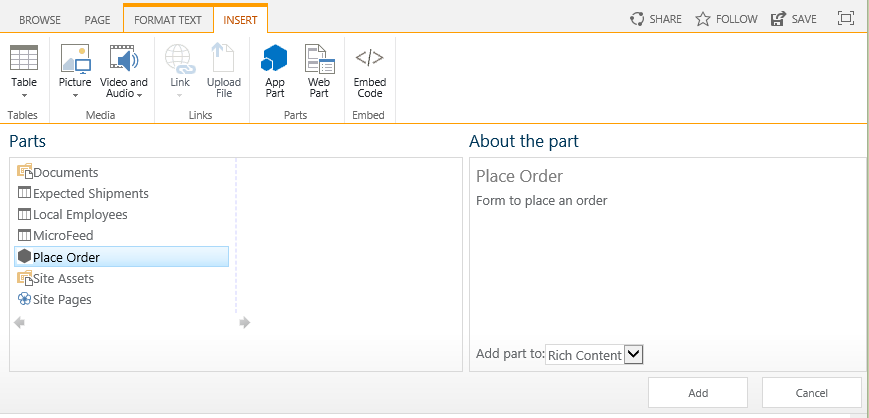

# Einfügen eines Add-In-Webparts in das vom Anbieter gehostete Add-In
Erfahren Sie, wie Sie ein Remotewebformular in einer SharePoint-Seite in einem vom Anbieter gehosteten SharePoint-Add-In anzeigen.
 

 **Hinweis** Der Name „Apps für SharePoint“ wird in „SharePoint-Add-Ins“ geändert. Während des Übergangszeitraums wird in der Dokumentation und der Benutzeroberfläche einiger SharePoint-Produkte und Visual Studio-Tools möglicherweise weiterhin der Begriff „Apps für SharePoint“ verwendet. Weitere Informationen finden Sie unter [Neuer Name für Office- und SharePoint-Apps](new-name-for-apps-for-sharepoint#bk_newname).
 

Dies ist der sechste in einer Reihe von Artikeln über die Grundlagen der Entwicklung von vom Anbieter gehosteten SharePoint-Add-Ins. Sie sollten sich zuerst mit [SharePoint Add-Ins](sharepoint-add-ins) und den vorherigen Artikeln in dieser Reihe vertraut machen:
 

-  [Erste Schritte beim Erstellen von von einem Anbieter gehosteten SharePoint-Add-Ins](get-started-creating-provider-hosted-sharepoint-add-ins)
    
 
-  [Übertragen des SharePoint-Aussehens und -Verhaltens auf Ihr vom Anbieter gehostetes Add-In](give-your-provider-hosted-add-in-the-sharepoint-look-and-feel)
    
 
-  [Einfügen einer benutzerdefinierten Schaltfläche in das vom Anbieter gehostete Add-In](include-a-custom-button-in-the-provider-hosted-add-in)
    
 
-  [Schnelle Übersicht über das SharePoint-Objektmodell](get-a-quick-overview-of-the-sharepoint-object-model)
    
 
-  [Hinzufügen von SharePoint-Schreibvorgängen zum vom Anbieter gehosteten Add-In](add-sharepoint-write-operations-to-the-provider-hosted-add-in)
    
 

 **Hinweis** Wenn Sie diese Reihe zu vom Anbieter gehosteten Add-Ins durchgearbeitet haben, haben Sie eine Visual Studio-Projektmappe, die Sie verwenden können, um mit diesem Thema fortzufahren. Sie können außerdem das Repository unter [SharePoint_Provider-hosted_Add-Ins_Tutorials](https://github.com/OfficeDev/SharePoint_Provider-hosted_Add-ins_Tutorials) herunterladen und die Datei „BeforeAdd-inPart.sln“ öffnen.
 

In diesem Artikel fügen Sie eine besondere Art von Webpart namens Add-In-Webpart zum SharePoint-Add-In hinzu. Das Add-In-Webpart stellt das Bestellformular des Add-Ins Bestellformular auf einer SharePoint-Seite zur Verfügung.
 

## Erstellen des Add-In-Webparts

 

 

 **Hinweis** Die Einstellungen für Startprojekte in Visual Studio werden normalerweise auf die Standardwerte zurückgesetzt, wann immer die Projektmappe erneut geöffnet wird. Führen Sie die folgenden Schritte immer unmittelbar nach dem erneuten Öffnen der Beispielprojektmappe in dieser Artikelreihe durch: Klicken Sie mit der rechten Maustaste oben im **Projektmappen-Explorer** auf den Projektmappenknoten, und wählen Sie **Startprojekte festlegen** aus. Stellen Sie sicher, dass alle drei Projekte in der Spalte **Aktion** auf **Starten** festgelegt sind.
 

1. Klicken Sie im **Projektmappen-Explorer** mit der rechten Maustaste auf das **ChainStore**-Projekt, und wählen Sie **Hinzufügen | Neues Element** aus.
    
 
2. Wählen Sie **Clientwebpart (Hostweb)** aus, nennen Sie es „Bestellung absenden“, und klicken Sie dann auf **Hinzufügen**. (Clientwebpart ist eine andere Bezeichnung für Add-In-Webpart.)
    
 
3. Wählen Sie auf der nächsten Seite des Assistenten das zweite Optionsfeld aus: **URL einer vorhandenen Webseite für den Clientwebpart-Inhalt auswählen oder eingeben**.
    
 
4. Wählen Sie in der Dropdownliste die URL für die Seite **OrderForm.aspx** aus, und klicken Sie dann auf **Fertig stellen**.
    
    Eine Datei „elements.xml“, die das Add-In-Webpart definiert, wird dem Projekt hinzugefügt und geöffnet.
    
 
5. Ändern Sie im Element **ClientWebPart** die folgenden Attribute auf die angegebenen Werte:
    

|**Attribut**|**Wert**|
|:-----|:-----|
|Title|Bestellung absenden|
|Beschreibung|Formular zum Aufgeben einer Bestellung|
|DefaultHeight|320|

    Leave all the other attributes with their defaults and save the file.
    
 

## Ausführen des Add-Ins und Testen de Add-In-Websparts

 

 

1. Verwenden Sie die F5-TASTE, um Ihr Add-In bereitzustellen und auszuführen. Visual Studio hostet die Remotewebanwendung in IIS Express und die SQL-Datenbank in SQL Express. Außerdem wird eine temporäre Installation des Add-Ins auf Ihrer SharePoint-Testwebsite durchgeführt, und das Add-In wird sofort ausgeführt. Sie werden aufgefordert, Berechtigungen für das Add-In zu erteilen, bevor die Startseite geöffnet wird.
    
 
2. Wenn die Add-In-Startseite geöffnet wird, wurde das Add-In bereitgestellt, und das Add-In-Webpart **Bestellung absenden** steht Benutzern zum Hinzufügen zu einem beliebigen Webpart-Bereich auf einer beliebigen SharePoint-Seite der Hongkong Store-Website zur Verfügung. Führen Sie die folgenden Schritte aus, um es der Startseite hinzuzufügen.
    
      1. Klicken Sie auf **Zurück zur Website** im Chromsteuerelement am oberen Rand der Seite, um die Startseite des Store in Hongkong zu öffnen.
    
 
  2. Öffnen Sie auf dem Menüband die Registerkarte **Seite**, und klicken Sie auf die Schaltfläche **Bearbeiten**.
    
 
  3. Nachdem sich die Seite im Bearbeitungsmodus befindet, öffnen Sie die Registerkarte **Einfügen** auf dem Menüband, und klicken Sie auf die Schaltfläche **Add-In-Webpart**. (Die Schaltfläche heißt möglicherweise immer noch **App-Webpart**.)
    
 
  4. Wählen Sie im geöffneten Webpart-Einfügesteuerelement das Add-In-Webpart **Bestellung absenden** aus. Das Steuerelement sieht ähnlich aus wie folgt.
    
  
 

 

 
  5. Klicken Sie in eine beliebige Webpartzone im Formular. Damit wird der Standort festgelegt, an dem das Add-In-Webpart eingefügt wird. 
    
 
  6. Klicken Sie im Webpart-Einfügesteuerelement auf **Hinzufügen**. Das Add-In-Webpart **Bestellung absenden** wird der Webpartzone hinzugefügt.
    
 
  7. Klicken Sie auf deim Menüband auf **Speichern**.
    
 
3. Das Bestellformular wird nun auf der Seite angezeigt und hat das Aussehen und Verhalten des Rests der Seite übernommen. Es sollte wie folgt aussehen: 
    
  
 

 

 
4. Geben Sie Werte für **Lieferant**, **Produkt** und **Menge** ein, und klicken Sie auf **Bestellung absenden**. Es scheint nichts zu passieren, aber es wird eine Bestellung in die Datenbank des Unternehmens eingegeben. Optional können Sie die Felder des Add-In-Webparts leeren, indem Sie die Seite aktualisieren.
    
 
5. Verwenden Sie im Browser die Schaltfläche „Zurück“, bis Sie wieder auf die Startseite für das ChainStore-Add-In zurückgekehrt sind, und klicken Sie dann auf die Schaltfläche **Bestellungen anzeigen**. Ihre neue Bestellung wird jetzt aufgelistet.
    
 
6. Schließen Sie zum Beenden der Debugsitzung das Browserfenster, oder beenden Sie das Debuggen in Visual Studio. Jedes Mal, wenn Sie F5 drücken, zieht Visual Studio die vorherige Version des Add-Ins zurück und installiert die neueste.
    
 
7. Da Sie mit diesem Add-In und dieser Visual Studio-Projektmappe in anderen Artikeln arbeiten werden, hat es sich bewährt, das Add-In ein letztes Mal zurückzuziehen, wenn Sie Ihre Arbeit daran für eine Weile abgeschlossen haben. Klicken Sie mit der rechten Maustaste auf das Projekt im **Projektmappen-Explorer**, und wählen Sie **Zurückziehen** aus.
    
 

## 

 Das Add-In hängt von zwei Listen ab, die Sie manuell erstellt haben. Sie möchten nicht, dass Ihre Benutzer dies ausführen müssen. Im nächsten Artikel beginnen Sie mit dem Prozess, diese Listen automatisch zu erstellen. Der erste wichtige Schritt ist die Erstellung von benutzerdefinierten Handlern für das Ereignis der Installation eines Add-ins: [Behandeln von Add-In-Ereignissen im vom Anbieter gehosteten Add-In](handle-add-in-events-in-the-provider-hosted-add-in)
 

 

