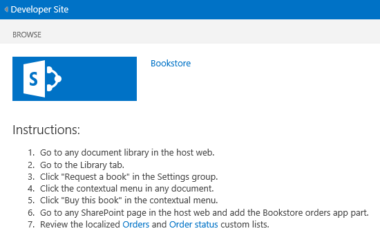

# <a name="localize-sharepoint-add-ins"></a>Lokalisieren von Add-Ins für SharePoint
Lokalisieren Sie ein SharePoint-Add-In mithilfe von Ressourcendateien, JavaScript-Ressourcendateien und anderen Techniken.
 

 **Hinweis** Der Name „Apps für SharePoint“ wird in „SharePoint-Add-Ins“ geändert. Während des Übergangszeitraums wird in der Dokumentation und der Benutzeroberfläche einiger SharePoint-Produkte und Visual Studio-Tools möglicherweise weiterhin der Begriff „Apps für SharePoint“ verwendet. Weitere Informationen finden Sie unter [Neuer Name für Office- und SharePoint-Apps](new-name-for-apps-for-sharepoint#bk_newname).
 


 **Hinweis** In diesem Thema wird davon ausgegangen, dass Sie mit der grundlegenden Erstellung von SharePoint-Add-Ins ebenso vertraut sind wie mit SharePoint-Features, dem Unterschied zwischen Add-In-Webs und Hostwebs,  [welche Arten von SharePoint-Komponenten in einem Add-In enthalten sein können](host-webs-add-in-webs-and-sharepoint-components-in-sharepoint-2013#TypesOfSPComponentsInApps) und den Grundlagen der Lokalisierung mit RESX-Dateien.
 


## <a name="get-ready-to-localize-a-sharepoint-add-in"></a>Vorbereiten der Lokalisierung eines Add-Ins für SharePoint
<a name="Prerequisites"> </a>

Bevor Sie beginnen, sollten Sie Folgendes festlegen: 
 

 

- Die Gebietsschemas, die das Add-In unterstützen muss. SharePoint Online und die lokale Bereitstellung von SharePoint mit installierten Sprachpaketen ermöglichen Benutzern das Erstellen von Websites in einer bestimmten Sprache und Kultur. Entscheiden Sie, welche lokalisierten Websites Ihre Kunden verwenden werden, und bestimmen Sie, welche dieser Websites Sie mit einer lokalisierten Version Ihrer Add-In-Komponenten unterstützen möchten.
    
 
- Die zu lokalisierenden Komponenten Ihres Add-Ins.
    
 
Achten Sie auch auf Folgendes:
 

 

-  Bei den Verfahren in diesem Artikel wird davon ausgegangen, dass Sie die neueste Version von [Office Developer Tools für Visual Studio 2013](http://aka.ms/OfficeDevToolsForVS2013) oder von [Office Developer Tools für Visual Studio 2015](http://aka.ms/OfficeDevToolsForVS2015) verwenden.
    
     **Hinweis** Wenn sich Ihre SharePoint-Testwebsite auf einer lokalen SharePoint-Farm statt auf einer Microsoft SharePoint Online-Entwicklerwebsite befindet, müssen Sie möglicherweise die Sprachpakete der Sprachen installieren, in die Sie Ihre SharePoint-Add-In übersetzen. Weitere Informationen dazu finden Sie unter [Installieren oder Deinstallieren von Sprachpaketen für SharePoint](http://technet.microsoft.com/en-us/library/cc262108%28v=office.15%29.aspx) und [Sprachpakete in SharePoint Server 2013](http://technet.microsoft.com/en-us/library/ff463597%28v=office.15%29.aspx), sowie unter den Downloadlinks.
- Die Screenshots und Codebeispiele in diesem Artikel stammen aus dem Beispiel  [SharePoint-Add-In-Lokalisierung](https://github.com/OfficeDev/SharePoint-Add-in-Localization). Dieses Beispiel können Sie herunterladen, um sich die Ergebnisse der Vorgehensweisen aus diesem Artikel anzusehen.
    
 

## <a name="localize-the-add-in-web-components"></a>Lokalisieren der Add-In-Web-Komponenten
<a name="LocalizingAppWeb"> </a>

Ein Add-In-Web kann bestimmte Arten von SP-Komponenten enthalten. Weitere Informationen zu den verschiedenen Arten von SharePoint-Komponenten, die in einem SharePoint-Add-In enthalten sein können, finden Sie unter  [Typen von SharePoint-Komponenten, die in einem SharePoint-Add-In enthalten sein können](host-webs-add-in-webs-and-sharepoint-components-in-sharepoint-2013#TypesOfSPComponentsInApps). Zum Lokalisieren von Komponenten, die für ein Add-In-Web bereitgestellt werden, fügen Sie RESX-Dateien in Modulen im selben Feature hinzu, das die Add-In-Web-Komponente enthält. Sie verweisen im Markup der Komponente auf die Ressource. Wie das geht, wird weiter unten in diesem Artikel erläutert. Auf benutzerdefinierten Websiteseiten in einem SharePoint-Add-In werden anstelle von RESX-Dateien jedoch JavaScript-Zeichenfolgenvariablendateien verwendet, wie weiter unten in diesem Abschnitt beschrieben.
 

 

 **Hinweis** Ressourcendateien können nicht gemeinsam von mehreren Features des Add-In-Webs genutzt werden. Für jedes Feature in der WSP-Datei müssen separate Gruppen von Ressourcendateien erstellt werden.
 


### <a name="to-create-the-add-in-web-resource-files"></a>So erstellen Sie die Ressourcendateien für das Add-In-Web


1. Öffnen Sie das SharePoint-Add-In-Projekt in Visual Studio. (Das Beispiel, aus dem die Screenshots in diesem Thema stammen, ist ein vom Anbieter gehostetes Add-In mit ASP.NET-Webformularen als Remote-Webanwendungsteil des Projekts).
    
 
2. Öffnen Sie im **Projektmappen-Explorer** das Kontextmenü für den Featurenamen, und wählen Sie **Funktionsressource hinzufügen**.
    
 
3. Wählen Sie im Dialogfeld **Ressource hinzufügen** die Option **Invariante Sprache (Invariantes Land)** und dann die Schaltfläche **OK**. Die Datei „Resources.resx“ wird im **Projektmappen-Explorer** dem Ordner des Features hinzugefügt und im **Ressourcen-Editor** von Visual Studio geöffnet. 
    
    Nach der Bearbeitung enthält diese „invariante Sprachdatei“ die Zeichenfolgen, die im **Featurekatalog** auf allen Websites in Sprachen verwendet werden, für die Sie *keine* lokalisierte Version der Zeichenfolgen bereitstellen. Daher sollten Sie für die Zeichenfolgen in dieser Datei die Sprache verwenden, die mit der höchsten Wahrscheinlichkeit die Zweitsprache der Personen ist, die SharePoint verwenden. Üblicherweise wird zu diesem Zweck Englisch verwendet, in einigen Szenarien kann jedoch eine andere Sprache die bessere Wahl sein. In bestimmten Regionen ist beispielsweise Französisch als Zweitsprache verbreiteter als Englisch. Im weitergeführten Beispiel dieses Themas wird Englisch als invariante Sprache verwendet.
    
     **Hinweis** Ein SharePoint-Add-In kann nicht auf einer Website installiert werden, deren Sprache nicht im Abschnitt **Unterstützte Gebietsschemas** des Add-In-Manifests aufgeführt ist. Beachten Sie, dass Sie Sprachen, die Sie in einem lokalisierten Add-In *nicht*  anbieten, dennoch zum Add-In-Manifest hinzufügen müssen. Weitere Informationen zu im Add-In-Manifest unterstützten Gebietsschemas finden Sie im Verfahren **So erstellen Sie die Hostweb-Ressourcendateien** dieses Artikels.
4. Geben Sie in der Spalte **Name** in der obersten Zeile im **Ressourcen-Editor** einen aussagekräftigen Namen für die Zeichenfolge (oder eine andere Ressource) ein z. B.OrdersListInstance_Title undOrdersListInstance_Description. Diese Namen lokalisierbarer Ressourcen werden selbst nicht lokalisiert. Die Namen müssen in der Datei eindeutig sein. 
    
 
5. Geben Sie in der Spalte **Wert** eine geeignete Zeichenfolge (oder URL oder andere Ressource) in der invarianten Sprache an - beispielsweiseBestellungen undListe zum Speichern der Bestellungen.
    
 
6. Fügen Sie weitere Name-Wert-Paare für alle Zeichenfolgen und Ressourcen hinzu, die für die Verwendung in beliebigen Komponenten Ihres Features lokalisiert werden sollen.
    
 
7. Speichern Sie die Datei.
    
 
8. Fügen Sie dem Feature wie oben beschrieben eine weitere Ressourcendaten hinzu, wobei Sie jedoch eine bestimmte Sprache statt **Invariante Sprache (Invariantes Land)** auswählen. Sie können zum Beispiel **Spanisch (Spanien)** auswählen. Eine Datei „Resources.LL-CC.resx“ (wobei  `LL` und `CC` [Internet Engineering Task Force (IETF)-konforme](http://tools.ietf.org/html/rfc1766) Sprach- und Kulturcodes sind) wird dem Ordner „Feature“ im **Projektmappen-Explorer** hinzugefügt, und die Datei wird im **Ressourcen-Editor** von Visual Studio geöffnet. 
    
 
9. Kopieren Sie im **Ressourcen-Editor** alle Zeilen aus der Datei Resources.resx, und fügen Sie sie in die neue Datei Resources.LL-CC.resx ein. (Falls die **Kopieren**-Funktion im Kontextmenü des Ressourcen-Editors nicht aktiviert ist, können Sie auch die Tastenkombination STRG-C verwenden, um die Zeilen in die Zwischenablage zu kopieren).
    
 
10. Ersetzen Sie in der Datei „Resources.LL-CC.resx“ die Werte in der Spalte **Wert** durch übersetzte Versionen der Zeichenfolgenwerte. Bei URLs und anderen Ressourcen, die keine Zeichenfolgen sind, ersetzen Sie den Wert durch einen anderen, für die betreffende Sprache und Kultur geeigneten Wert.
    
 
11. Speichern Sie die neue Datei.
    
 
12. Wiederholen Sie die letzten vier Schritte für jede Fremdsprache. 
    
     **Hinweis** Ziehen Sie in Betracht, eine sprachspezifische Datei für die Sprache hinzuzufügen, die Sie als invariante Sprache verwendet haben. Wenn Sie dies tun, können Sie die Zeilen kopieren, ohne die Werte der Zeichenfolgen zu ändern. In vielen Situationen ist keine sprachspezifische Datei für dieselbe Sprache erforderlich, die in der Ressourcendatei als invariante Sprache verwendet wird, insbesondere wenn in den Dateien nur Zeichenfolgen als Ressourcen vorhanden sind. Ressourcendateien können jedoch auch Bilder, Symbole, Dateien und andere Arten von Ressourcen enthalten. Manchmal benötigen Sie die Ressourcendatei in der invarianten Sprache, um ein Bild oder eine sonstige Ressource, die von der entsprechenden Ressource in  *beliebigen*  sprachspezifischen Dateien abweicht, zu verwenden.
13. Vergewissern Sie sich bei jeder Datei, dass die Eigenschaft **Buildvorgang** auf **Inhalt** festgelegt ist.
    
 

### <a name="to-call-the-localized-resources-in-custom-lists"></a>So rufen Sie die lokalisierten Ressourcen in benutzerdefinierten Listen auf


1. Öffnen Sie zum Lokalisieren der Titel- und Beschreibungseigenschaften einer benutzerdefinierten Liste die Datei **Elements.xml** der Listeninstanz. Im Beispiel, das dieses Thema begleitet, würden Sie beispielsweise im **Projektmappen-Explorer** zu **BookstoreApp** > **Bestellstatus** > **OrderStatusInstance** > **Elements.xml** navigieren.
    
 
2. Geben Sie im Attribut **Titel** die Zeichenfolge$Resources: _StringName_ ein, wobei _StringName_ für den Namen (nicht für den Wert) steht, den Sie in der vorherigen Vorgehensweise für die Zeichenfolge zur Benennung der benutzerdefinierten Liste vergeben haben (beispielsweise$Resources: OrdersListInstance_Title). Beachten Sie, dass hier im Gegensatz zu anderen Kontexten, in denen RESX-Dateien verwendet werden, der Name der Ressourcendatei  *nicht*  Bestandteil Ihrer Eingabe ist.
    
 
3. Verwenden Sie das Attribut **Beschreibung**, um auf die gleiche Weise die Zeichenfolgenressource der Listenbeschreibung aufzurufen - beispielsweise $Resources:OrdersListInstance_Description. Im Folgenden finden Sie das Markup, von dem die lokalisierten Zeichenfolgen aus der Datei "Elements.xml" der Listeninstanz verwendet werden:
    
```XML
  <?xml version="1.0" encoding="utf-8"?>
<Elements xmlns="http://schemas.microsoft.com/sharepoint/">
  <ListInstance 
      Title="$Resources:OrdersListInstance_Title" 
      OnQuickLaunch="TRUE" 
      TemplateType="10000" 
      Url="Lists/Orders" 
      Description="$Resources:OrdersListInstance_Description">
  </ListInstance>
</Elements>
```


    The following image shows the localized custom list in English.
    

    **Localized custom list**

 

  
 

 

 

### <a name="to-localize-the-column-names-of-a-custom-list"></a>So lokalisieren Sie die Spaltennamen einer benutzerdefinierten Liste


1. Sie können die Spaltennamen der benutzerdefinierten Liste nicht auf die gleiche Weise wie den Titel und die Beschreibung lokalisieren. Zum Lokalisieren der Spaltennamen müssen Sie die Listenfelder in einer Datei vom Typ **Elements.xml** deklarieren und den Attributwert **DisplayName** mit Verweisen in den Add-In-Web-Ressourcendateien festlegen. Öffnen Sie zunächst die Datei **Elements.xml** Ihrer benutzerdefinierten Liste. Suchen Sie nach dem Knoten **Fields**, und kopieren Sie alle seiner **Field**-Knoten.
    
 
2. Öffnen Sie die Datei **Elements.xml** Ihrer benutzerdefinierten Liste. Achten Sie darauf, die Datei "Elements.xml" der Listendefinition (nicht die Datei der Listeninstanz) zu öffnen. Fügen Sie die Knoten aus dem vorherigen Schritt als untergeordnete Elemente des Knotens **Elements** ein.
    
 
3. Geben Sie für jeden Knoten vom Typ **Field** einen Wert nach dem Muster$Resources: _StringName_ in das Attribut **DisplayName** ein, wobei _StringName_ für den Namen eines Eintrags in der Add-In-Web-Ressourcendatei steht.
    
 
4. Entfernen Sie in der Datei **Schema.xml** Ihrer benutzerdefinierten Liste das Attribut **DisplayName** aus jedem Knoten vom Typ **Field**, den Sie zuvor kopiert haben. Im Anschluss finden Sie ein Beispiel-Markup, von dem lokalisierte Zeichenfolgen in der Datei **Elements.xml** der Listendefinition verwendet werden:
    
```
  <?xml version="1.0" encoding="utf-8"?>
<Elements xmlns="http://schemas.microsoft.com/sharepoint/">
    <ListTemplate
        Name="Orders"
        Type="10000"
        BaseType="0"
        OnQuickLaunch="TRUE"
        SecurityBits="11"
        Sequence="410"
        DisplayName="Orders"
        Description="My List Definition"
        Image="/_layouts/15/images/itgen.png"/>
    <Field
        Name="Bookname"
        ID="{2ef60a05-29b6-41db-9611-c0cf7d8e73c5}"
        DisplayName="$Resources:OrdersListColumn_Bookname"
        Type="Text"
        Required="TRUE" />
    <Field
        Name="Price"
        ID="{7af42815-d69e-426a-a1c8-9da5610e362c}"
        DisplayName="$Resources:OrdersListColumn_Price"
        Type="Currency"
        Required="FALSE" />
    <Field
        Name="Orderstatus"
        ID="{687ee751-2e0a-4099-966e-d2c225d48234}"
        DisplayName="$Resources:OrdersListColumn_Orderstatus"
        Type="Lookup"
        Required="FALSE"
        List="Lists/Order status"
        ShowField="Title" />
</Elements>
```


### <a name="to-create-javascript-resource-files-for-custom-pages"></a>So erstellen Sie JavaScript-Ressourcendateien für benutzerdefinierte Seiten


1. Benutzerdefinierte Seiten auf einer Website in einem SharePoint-Add-In verwenden JavaScript-Zeichenfolgenvariablendateien statt RESX-Dateien. 
    
    Fügen Sie zunächst im **Projektmappen-Explorer** einen Ordner namens „Skripts“ zum SharePoint-Add-In-Projekt (nicht zum Webanwendungsprojekt) hinzu, wenn noch keiner vorhanden ist. Klicken Sie mit der rechten Maustaste auf den Ordner **Skripts**, und wählen Sie **Hinzufügen** > **Neues Element** > **Web** > **JavaScript-Datei** aus. Geben Sie der Datei den Namen „Resources._LL_- _CC_.js (wobei _LL_ für einen Sprachcode und _CC_ für einen Länder- oder Kulturcode steht). Beispiel:Resources.en-US.js.
    
 
2. Wiederholen Sie den vorstehenden Schritt für jede Fremdsprache. Für jede Sprache sollte eine neue leere JavaScript-Datei vorhanden sein. Erstellen Sie  *keine*  invariante Sprachdatei namens "Resources.js". Der Grund hierfür wird weiter unten in diesem Verfahren erklärt.
    
 
3. Öffnen Sie die erste der neuen JavaScript-Dateien.
    
 
4. Deklarieren Sie in der Datei für jede lokalisierbare Zeichenfolge der benutzerdefinierten Seiten eine Variable mit einem Namen, der den Zweck der Zeichenfolge angibt, und weisen Sie ihr einen für die Sprache geeigneten Wert zu. Im Anschluss finden Sie den Inhalt der Datei "Resources.en-US.js":
    
```
  var instructionstitle = "Instructions:";
var step01 = "Go to any document library in the host web.";
var step02 = "Go to the Library tab.";
var step03 = "Click \"Request a book\" in the Settings group.";
var step04 = "Click the contextual menu in any document.";
var step05 = "Click \"Buy this book\" in the contextual menu.";
var step06 = "Go to any SharePoint page in the host web and add the" +
    " Bookstore orders add-in part.";
var step07 = "Review the localized <a href=\"../Lists/Orders\">Orders</a>" +
    " and <a href=\"../Lists/Order status\">Order status</a> custom lists.";

```

5. Kopieren Sie den Inhalt der Datei jeweils in jede der übrigen JavaScript-Dateien, und speichern Sie dann alle Dateien.
    
 
6. Ersetzen Sie in jeder Datei jeweils den Wert der Variablen durch einen neuen für die Sprache der Datei geeigneten Wert.  *Ändern Sie keinesfalls die Variablennamen.* 
    
 

### <a name="to-call-the-localized-variables-in-custom-aspx-pages"></a>So rufen Sie die lokalisierten Variablen in benutzerdefinierten ASPX-Seiten auf


1. Öffnen Sie im **Projektmappen-Explorer** eine benutzerdefinierte ASPX-Seitendatei.
    
 
2. Stellen Sie sicher, dass beim Laden der Seite nur eine der lokalisierten JavaScript-Dateien geladen wird und dass es sich dabei um die Datei handelt, die für die Sprache des SharePoint-Add-In-Webs geeignet ist. Fügen Sie dazu dem Element **asp:content** mit einer `ContentPlaceholderId` mit dem Wert `PlaceholderAdditionalPageHead` das folgende Markup hinzu. *Dieses Markup enthält keine Platzhalter. Geben Sie das Markup genau wie hier angegeben ein.* 
    
```HTML
  <script type="text/javascript" src="../scripts/Resources.<SharePoint:EncodedLiteral runat='server' text='<%$Resources:wss,language_value%>' EncodeMethod='HtmlEncode' />.js"></script>
```


    This markup loads one of your JavaScript files. It determines which language file to load by reading the SharePoint resource named "language_value." This resource resolves to a language-culture name in the pattern  _LL_- _CC_ that was described in an earlier procedure. Specifically, it resolves to the language of the add-in web.
    
     **Note**  The SharePoint resource "language_value" is never null, so a file named "Resources.js" would never be called by this script. That is why you did not make one in the preceding procedure. When the value of "language_value" is a language for which there is no .js file, this script loads nothing. The next step explains how strings get an invariant language value in that situation.
3. Geben Sie für jedes lokalisierbare Element und jeden lokalisierbaren Attributwert auf der Seite einen Standardwert in der invarianten Sprache an, verwenden Sie dann aber JavaScript, um die entsprechende Variable aus der Datei "Resources. _LL_- _CC_.js zuzuweisen. Wenn die Seite beispielsweise einen öffentlichen Titel in einem Element vom Typ **h2** enthält, versehen Sie das Element mit einem Attribut vom Typ **id**, und fügen Sie dann ein Element vom Typ **script** unter den lokalisierbaren Elementen ein, um lokalisierte Zeichenfolgen zu der **innerText**-Eigenschaft der lokalisierten Elemente hinzuzufügen. Dieser Lokalisierungscode sollte nur ausgeführt werden, wenn eine Resources. _LL_- _CC_.js-Datei geladen und die Variablen deklariert wurden. Fügen Sie sie in einen Bedingungsblock, der zunächst prüft, ob eine der Variablen definiert wurden. Wenn das nicht der Fall ist, wird kein Ressourcenskript geladen und die Standardwerte (invariant) sollten unverändert bleiben. Im Folgenden ein Beispiel dafür. 
    
     **Tipp** Das Wort „INVARIANT“ wurde zur ersten invarianten Zeichenfolge hinzugefügt. In einem Produktions-Add-In wäre das nicht der Fall. Während Sie testen, ist das jedoch eine gute Möglichkeit, um sich einen Überblick darüber zu verschaffen, ob invariante Sprachzeichenfolgen verwendet werden oder die Datei „Resources. _LL_- _CC_.js“ für die Sprache geladen wurde, die Ihre invariante Sprache darstellt.

```HTML
  <h2 id="instructionsheading">INVARIANT Instructions</h2>
<ol>
    <li id="step01">Go to any document library in the host web.</li>
    <li id="step02">Go to the Library tab.</li>
    <li id="step03">Click "Request a book" in the Settings group.</li>
    <li id="step04">Click the contextual menu in any document.</li>
    <li id="step05">Click "Buy this book" in the contextual menu.</li>
    <li id="step06">Go to any SharePoint page in the host web and add the Bookstore orders add-in part.</li>
    <li id="step07">Review the localized <a href="../Lists/Orders">Orders</a> and <a href="../Lists/Order status">Order status</a> custom lists.</li>
</ol>

<!-- Use the localized strings in the resource JavaScript file -->
<script type="text/javascript">
    window.onload = function () {
        <!-- Test whether a Resources.LL-CC.js loaded.
             If none was, the invariant values remain unchanged. -->
        if (typeof instructionstitle != 'undefined')  
        {
            document.getElementById("instructionsheading").innerText = instructionstitle;
            document.getElementById("step01").innerText = step01;
            document.getElementById("step02").innerText = step02;
            document.getElementById("step03").innerText = step03;
            document.getElementById("step04").innerText = step04;
            document.getElementById("step05").innerText = step05;
            document.getElementById("step06").innerText = step06;
            document.getElementById("step07").innerHTML = step07;
        }
    }
</script>

```


    The following image gives a preview of how the English version of the page will look when the add-in is completed. 
    

    **Webpage using localized strings from a JavaScript resource file**

 

  
 

 

 

## <a name="localize-the-host-web-components"></a>Lokalisieren der Hostweb-Komponenten
<a name="LocalizingHostWeb"> </a>

Sie können den in der Datei "AppManifest.xml" angegebenen Add-In-Titel lokalisieren. Hierbei handelt es sich um den Text, der Benutzern auf der Seite **Your Add-ins** angezeigt wird. Das Hostweb für ein SharePoint-Add-In kann auch eine benutzerdefinierte Aktion, ein Add-In-Webpart oder beides enthalten. Diese Komponenten werden in einem Hostweb-Feature bereitgestellt. Beide Komponenten können lokalisierbare Zeichenfolgen enthalten.
 

 
Die Methode zum Lokalisieren von Hostweb-Komponenten entspricht im Grunde der Methode zum Lokalisieren von Add-In-Web-Komponenten: Lokalisierte Ressourcen werden in einer RESX-Datei einzeln aufgeführt und von den Markupdateien aufgerufen. Allerdings unterstützt Visual Studio nicht so viele Tools für diesen Prozess, da es für Hostweb-Features vorgesehen ist. Hier gibt es einen manuellen Prozess, der später in diesem Abschnitt erläutert wird.
 

 

### <a name="to-create-resource-files-for-the-host-web"></a>So erstellen Sie die Hostweb-Ressourcendateien


1. Wählen Sie im Projektmappen-Explorer die Datei **AppManifest.xml** aus, um den Add-In-Manifest-Designer zu öffnen.
    
 
2. Öffnen Sie die Registerkarte **Unterstützte Gebietsschemas**.
    
 
3. Öffnen Sie die Dropdownliste in der obersten leeren Zelle der Spalte **Gebietsschemas**, und wählen Sie das erste zu unterstützende Gebietsschema aus. Zwei Dateien werden erstellt und dem SharePoint-Add-In-Projekt hinzugefügt: "Resources.resx" (die Ressourcendatei für die invariante Sprache) und "Resources. _LL_- _CC_.resx" (enthält die lokalisierten Ressourcen).  *Die Namen dieser Dateien dürfen nicht geändert werden.* 
    
 
4. Wiederholen Sie den vorherigen Schritt für jedes zu unterstützende Gebietsschema. Für jedes Gebietsschema wird eine weitere Datei vom Typ Resources. _LL_- _CC_.resx erstellt.
    
     **Hinweis** Die Eigenschaft **Build Action** dieser Dateien ist nicht auf **Resource** festgelegt, sondern auf **Content**.  *Diese Einstellung darf nicht geändert werden.* 
5. Fügen Sie außerdem Gebietsschema-Einträge für jedes Gebietsschema hinzu, für das Ihr Add-In installierbar sein soll, jedoch die invariante Sprache verwenden soll; d. h. Gebietsschemas, für die Sie  *keine*  lokalisierte Version des Add-Ins bereitstellen möchten. *Löschen Sie die RESX-Dateien, die für diese Gebietsschemas erstellt wurden.* 
    
 
6. Öffnen Sie die Datei "Resources.resx", und fügen Sie ihr Ressourcennamen und -werte hinzu. Gehen Sie dabei auf die gleiche Weise vor wie bei den Add-In-Web-Ressourcendateien. Es muss mindestens eine Ressource für den Add-In-Titel vorhanden sein. Das Hostweb-Feature wird nicht auf der SharePoint-Benutzeroberfläche angezeigt, Sie benötigen also keine lokalisierten Zeichenfolgen für den Hostweb-Featuretitel oder seine Beschreibung. Wenn das Feature eine benutzerdefinierte Aktion enthält, benötigen Sie eine Ressource für das **Title**-Attribut des **CustomAction**-Elements und möglicherweise weitere Zeichenfolgen im Markup für die benutzerdefinierte Aktion. Wenn ein Add-In-Webpart vorhanden ist, benötigen Sie Ressourcen für die **Titel**- und **Beschreibung**-Attribute des **ClientWebPart**-Elements. Wenn das Add-In-Webpart benutzerdefinierte Eigenschaften besitzt, besitzt jede **Property** ein Attribut, das ebenfalls lokalisiert werden muss. Die Ressourcendatei muss für jedes dieser Elemente eine Zeile enthalten.
    
 
7. Kopieren Sie den Inhalt der Datei „Resources.resx“ jeweils in die anderen Resources. _LL_- _CC_.resx-Dateien.
    
 
8. Lokalisieren Sie die Ressourcen in jeder Datei vom Typ „Resources._LL_- _CC_.resx“ auf die gleiche Weise wie bei den Add-In-Web-Ressourcendateien.
    
 

### <a name="to-call-the-localized-resources-in-the-add-in-manifest-and-other-xml-files"></a>So rufen Sie die lokalisierten Ressourcen im Add-In-Manifest und in anderen XML-Dateien auf


1. Öffnen Sie die Datei „AppManifest.xml", und ersetzen Sie den Wert des Elements **Title** durch einen Aufruf der entsprechenden Ressourcenzeichenfolge. Wenn Sie die Zeichenfolge beispielsweiseAddin_Title genannt haben, sollte das Element **Title** wie folgt aussehen:
    
```XML
  <Title>$Resources:Addin_Title;</Title>
```


     **Caution**  The value of  **Title** can contain *only*  the call to the resource. There can be no other text, symbols, or white space.
2. Zum Aufrufen lokalisierter Ressourcen in anderen XML-Dateien (beispielsweise "Elements.xml" für Add-In-Webparts und benutzerdefinierte Aktionen) wird das gleiche Format verwendet wie in der Add-In-Manifestdatei.
    
 

## <a name="localize-remote-components-in-a-sharepoint-add-in"></a>Lokalisieren von Remotekomponenten in einem SharePoint-Add-In
<a name="LocalizingAutohosted"> </a>

Wenn die Remotekomponenten im PHP-Format oder einem anderen Format eines anderen Anbieters als Microsoft vorliegen, dann lesen Sie die Lokalisierungsanleitungen für die entsprechende Plattform. Wenn die Remotekomponenten das Format ASP.NET aufweisen, können Sie sie so lokalisieren wie jede andere ASP.NET-Anwendung. Weitere Informationen dazu finden Sie unter  [ASP.NET Globalization and Localization](http://msdn.microsoft.com/library/8ef3838e-9d05-4236-9dd0-ceecff9df80d.aspx).
 

 
Überschreiben Sie die Seitensprache und die Threadsprache, um sie mit der Sprache des Hostwebs abzugleichen. Dazu müssen Sie die **InitializeCulture**-Methode im CodeBehind Ihrer ASP.NET-Seiten überschreiben. Verwenden Sie zum Ermitteln der Hostwebsprache den **SPLanguage**-Abfrageparameter, den SharePoint an die Remoteseite übergibt. Der folgende Code zeigt, wie das in ASP.NET erfolgt. Dasselbe sollten Sie in einer PHP-Webanwendung oder anderen Plattform vornehmen.
 

 


```C#
protected override void InitializeCulture()
{
    if (Request.QueryString["SPLanguage"] != null)
    {
        string selectedLanguage = Request.QueryString["SPLanguage"];
        
        // Override the page language.
        UICulture = selectedLanguage;
        Culture = selectedLanguage;

        // Reset the thread language.
        Thread.CurrentThread.CurrentCulture =
            CultureInfo.CreateSpecificCulture(selectedLanguage);
        Thread.CurrentThread.CurrentUICulture = new
            CultureInfo(selectedLanguage);
    }
    base.InitializeCulture();
}
```


## <a name="localize-remote-javascript-and-the-sharepoint-chrome-control"></a>Lokalisieren des Remote-JavaScript- und des SharePoint-Chromsteuerelements
<a name="JSandChrome"> </a>

Wenn lokalisierbare Zeichenfolgenwerte im JavaScript Ihrer Webanwendung vorhanden sind, können Sie sie mithilfe der JavaScript-Ressourcendateien lokalisieren. Ein besonders wichtiges Beispiel eines lokalisierbaren JavaScript ist das  [SharePoint-Chromsteuerelement](use-the-client-chrome-control-in-sharepoint-add-ins), das dazu verwendet werden kann, Remoteseiten das Design von SharePoint-Seiten zu verleihen. Wir verwenden die Lokalisierung des Chromsteuerelements in diesem Abschnitt als Beispiel.
 

 

 **Hinweis** In diesem Abschnitt wird nur die Zeichenfolgenlokalisierung erläutert. Für anspruchsvollere Lokalisierungsanforderungen, wie die Lokalisierung des Datums oder der Währungsformatierung sollten Sie erwägen, eine Lokalisierungs- oder Globalisierungsbibliothek zu verwenden, z. B. das  [Globalize-Add-On für jQuery](https://github.com/jquery/globalize).
 


### <a name="to-localize-the-chrome-control"></a>So lokalisieren Sie das Chromsteuerelement


1. Nachdem das Chromsteuerelement funktioniert, müssen Sie die `renderChrome`-Methode zurückgeben, in der Sie die Chromsteuerelementoptionen festgelegt haben.
    
```
  function renderChrome() {
    var options = {
        "appIconUrl": "siteicon.png",
        "appTitle": "My SharePoint add-in", // Localizable string
        "appHelpPageUrl": "Help.html?"
            + document.URL.split("?")[1],
        "onCssLoaded": "chromeLoaded()",
        "settingsLinks": [
            {
                "linkUrl": "Account.html?"
                    + document.URL.split("?")[1],
                "displayName": "Account settings" // Localizable string
            },
            {
                "linkUrl": "Contact.html?"
                    + document.URL.split("?")[1],
                "displayName": "Contact us" // Localizable string
            }
        ]
    };

```

2. Wie bereits in den Kommentaren erwähnt, sind mindestens drei lokalisierbare Zeichenfolgen vorhanden. Ersetzen Sie diese durch einen Variablennamen, den Sie in einem späteren Schritt deklarieren. 
    
```
  function renderChrome() {
    var options = {
        "appIconUrl": "siteicon.png",
        "appTitle": chromeAppTitle, // Localized value
        "appHelpPageUrl": "Help.html?"
            + document.URL.split("?")[1],
        "onCssLoaded": "chromeLoaded()",
        "settingsLinks": [
            {
                "linkUrl": "Account.html?"
                    + document.URL.split("?")[1],
                "displayName": chromeAccountLinkName // Localized value
            },
            {
                "linkUrl": "Contact.html?"
                    + document.URL.split("?")[1],
                "displayName": chromeContactUsLinkName // Localized value
            }
        ]
    };

```

3. Fügen Sie eine JavaScript-Datei mit der Bezeichnung "ChromeStrings.js" zum Webanwendungsprojekt hinzu. Sie sollte die Variablen deklarieren, die Sie im vorherigen Schritt verwendet haben, und ihnen einen Wert in der invarianten Sprache zuweisen. 
    
```
  var chromeAppTitle = "My SharePoint add-in";
var chromeAccountLinkName = "Account settings";
var chromeContactUsLinkName = "Contact us";

```

4. Fügen Sie für jede Sprache, in die Sie das Add-In lokalisieren, eine weitere JavaScript-Datei mit der Bezeichnung "ChromeStrings. _LL-CC_.js" hinzu.  _LL-CC_ stellt dabei die Sprachen-ID dar. *Die Basis des Dateinamens, in diesem Fall "ChromeStrings", muss der Bezeichnung für die invariante Sprachdatei genau entsprechen.*  Kopieren Sie die Inhalte der invarianten Sprachdatei in jede der lokalisierten Dateien, und ersetzen Sie die Werte durch übersetzte Entsprechungen.
    
```
  var chromeAppTitle = "Mi aplicación SharePoint";
var chromeAccountLinkName = "Preferencias";
var chromeContactUsLinkName = "Contacto";

```

5. In Seitendateien, in denen das Skript "SP.UI.controls.js" aufgerufen wird, müssen Sie einen Aufruf zur "ChromeStrings.js" darüber hinzufügen. Wenn beispielsweise der Aufruf zur "SP.UI.controls.js" in einer Zwischendatei mit der Bezeichnung "ChromeLoader.js" geladen wird, sollte das Markup auf der Seite nun Folgendem ähneln.
    
```
  <Scripts>
  <asp:ScriptReference Path="Scripts/ChromeStrings.js" />
  <asp:ScriptReference Path="Scripts/ChromeLoader.js" />
</Scripts>
```

6. Fügen Sie ein **ResourceUICultures**-Attribut zum **ScriptReference**-Element hinzu, das die Zeichenfolgen aufruft. Der Wert besteht aus einer kommagetrennten Liste der Sprachen, die Sie unterstützen möchten.
    
```
  <Scripts>
  <asp:ScriptReference Path="Scripts/ChromeStrings.js" ResourceUICultures="en-US,es-ES" />
  <asp:ScriptReference Path="Scripts/ChromeLoader.js" />
</Scripts>
```


    The effect of the  **ResourceUICultures** attribute is that ASP.NET will look for a file with the name ChromeStrings. _LL-CC_.js, where  _LL-CC_ is the language of the page and load it. If it doesn't find such a file, it will load the ChromeStrings.js file.
    
 

## <a name="test-your-localized-sharepoint-add-in"></a>Testen Ihres lokalisierten Add-Ins für SharePoint
<a name="TestingLocalizedApps"> </a>

Testen Sie Ihr Add-In, indem Sie es für eine SharePoint-Website bereitstellen, die in einer der unterstützten Sprachen Ihres Add-Ins bereitgestellt wurde. Das Add-In kann auf einer SharePoint Online-Website oder auf einer lokalen Website getestet werden.
 

 

### <a name="to-test-your-add-in-on-a-sharepoint-online-website"></a>So testen Sie Ihr Add-In auf einer SharePoint Online-Website


1. Wechseln Sie zum Office 365 Admin Center.
    
 
2. Wählen Sie im Navigationsmenü die Option **Diensteinstellungen** und anschließend **Websites** aus.
    
 
3. Wählen Sie unter „Websitesammlungen“ die Option **Websitesammlung erstellen** aus.
    
 
4. Wählen Sie unter **Sprache auswählen** die Sprache aus, in der Sie Ihr Add-In testen möchten.
    
 
5. Wählen Sie unter **Vorlage auswählen** die Option **Entwicklerwebsite** aus.
    
 
6. Aktualisieren Sie in Ihrem SharePoint-Add-In-Projekt die Eigenschaft **SiteUrl** mit der URL der soeben erstellten Websitesammlung.
    
 
7. Drücken Sie F5, um das Add-In auszuführen.
    
 

**Seite „Websitesammlung erstellen“**

 

 

 

### <a name="to-test-your-add-in-an-on-premises-website"></a>So testen Sie Ihr Add-In auf einer lokalen Website


1. Installieren Sie das Sprachpaket, mit dem Sie Ihr Add-In testen möchten. Weitere Informationen finden Sie unter  [Installieren oder Deinstallieren von Sprachpaketen für SharePoint](http://technet.microsoft.com/library/cc262108.aspx) und [Sprachpakete in SharePoint Server 2013](http://technet.microsoft.com/en-us/library/ff463597%28v=office.15%29.aspx).
    
 
2. Öffnen Sie die Zentraladministration der Farm.
    
 
3. Wählen Sie unter **Anwendungsverwaltung** die Option **Websitesammlungen erstellen** aus.
    
 
4. Wählen Sie unter **Sprache auswählen** die Sprache aus, in der Sie Ihr Add-In testen möchten.
    
 
5. Wählen Sie unter **Vorlage auswählen** die Option **Entwicklerwebsite** aus.
    
 
6. Aktualisieren Sie in Ihrem SharePoint-Add-In-Projekt das Element **SiteUrl** mit der URL der soeben erstellten Websitesammlung.
    
 
7. Drücken Sie F5, um das Add-In auszuführen.
    
 

## <a name="additional-resources"></a>Zusätzliche Ressourcen
<a name="SP15Localizeapp_addlresources"> </a>

-  [Entwickeln von SharePoint-Add-Ins](develop-sharepoint-add-ins)
-  [Lokalisierung für Office-Add-Ins](http://msdn.microsoft.com/library/5a1a1cd7-b716-4597-b51f-fa70357d0833%28Office.15%29.aspx)
-  [ASP.NET-Globalisierung und -Lokalisierung](http://msdn.microsoft.com/library/8ef3838e-9d05-4236-9dd0-ceecff9df80d.aspx)
-  [SharePoint-Add-in-Localization](https://github.com/OfficeDev/SharePoint-Add-in-Localization)
    
 

