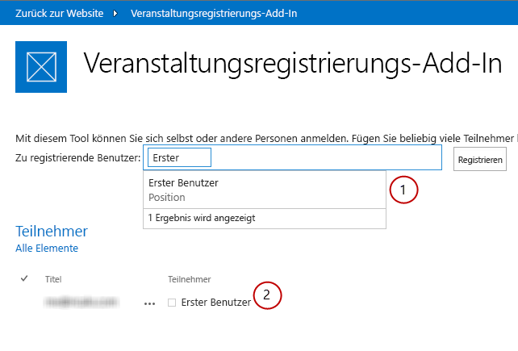

# Office Web Widgets – Experimentelle ÜbersichtOffice Web Widgets - Experimental overview
Erfahren Sie mehr über die Office Web Widgets - Experimental, die Sie in Office-Add-Ins, SharePoint-Add-Ins und auf Websites verwenden können.Learn about the Office Web Widgets - Experimental that you can use in Office Add-ins, SharePoint Add-ins, and websites.
 

 **Hinweis** Der Name „Apps für SharePoint“ wird in „SharePoint-Add-Ins“ geändert. Während des Übergangszeitraums wird in der Dokumentation und der Benutzeroberfläche einiger SharePoint-Produkte und Visual Studio-Tools möglicherweise weiterhin der Begriff „Apps für SharePoint“ verwendet. Weitere Informationen finden Sie unter [Neuer Name für Office- und SharePoint-Apps](new-name-for-apps-for-sharepoint.md#bk_newname).**Note**  The name "apps for SharePoint" is changing to "SharePoint Add-ins". During the transition, the documentation and the UI of some SharePoint products and Visual Studio tools might still use the term "apps for SharePoint". For details, see  [New name for apps for Office and SharePoint](new-name-for-apps-for-sharepoint.md#bk_newname).
 

 **Vorsicht** Die Office Web Widgets - Experimental werden nur zu Recherche- und Feedbackzwecken bereitgestellt. Verwenden Sie sie nicht in Produktionsszenarios. Das Verhalten von Office Web Widgets kann sich in künftigen Versionen erheblich ändern. Lesen und prüfen Sie die  [Lizenzbedingungen für Office Web Widgets - Experimental](office-web-widgetsexperimental-license-terms.md).**Caution**  The Office Web Widgets - Experimental are only provided for research and feedback purposes. Do not use in production scenarios. The Office Web Widgets behavior may change significantly in future releases. Read and review the  [Office Web Widgets - Experimental License Terms](office-web-widgetsexperimental-license-terms.md).
 

Clientsteuerelemente wie die Office Web Widgets - Experimental können den Arbeitsaufwand zur Erstellung von Add-Ins deutlich reduzieren und gleichzeitig die Qualität der Add-Ins steigern. Damit dies zutrifft, müssen die Widgets bestimmte Kriterien erfüllen:Client controls, such as the Office Web Widgets - Experimental, can greatly reduce the amount of time required to build add-ins, and at the same time, increase the quality of the add-ins. For this to be true, we have to be sure the widgets meet certain criteria:
 

- Widgets müssen auf die Verwendung in jeder Webseite ausgelegt sein, auch wenn die Seite nicht auf SharePoint gehostet wird.Widgets must be designed to be used in any webpage, even if the page is not hosted on SharePoint.
    
 
- Widgets funktionieren innerhalb der Office-Steuerelementelaufzeit. Dadurch können Sie einen allgemeinen Satz von Anforderungen und eine einheitliche Syntax zur Verwendung der Widgets bereitstellen.Widgets work within the Office controls runtime. This lets us to provide a common set of requirements and a consistent syntax to use the widgets.
    
 
- Widgets, die mit SharePoint kommunizieren, verwenden die domänenübergreifende Bibliothek. Die Widgets weisen keine Abhängigkeiten von einer bestimmten serverseitigen Plattform oder Technologie auf. Sie können die Widgets unabhängig von der von Ihnen gewählten Servertechnologie verwenden.Widgets that communicate back to SharePoint use the cross-domain library. The widgets don't have a dependency on a particular server-side platform or technology. You can use the widgets regardless of your choice of server technology.
    
 
- Widgets müssen mit anderen Elementen in der Seite zusammen verwendet werden können. Der Einschluss des Widgets in einer Seite sollte darin befindliche Elemente nicht ändern.Widgets must coexist with other elements in the page. The inclusion of the widget to a page should not modify other elements in it.
    
 
- Gehen Sie umsichtig mit vorhandenen Frameworks um. Wir möchten sichergehen, dass Sie die Tools und Technologien, die Sie gewöhnt sind, auch weiterhin nutzen können.Play nice with existing frameworks. We want to be sure you can still use the tools and technologies that you are used to.
    
 

**Abbildung 1: Ein Add-In, das Office Web Widgets - Experimental verwendet****Figure 1. An add-in using Office Web Widgets - Experimental**

 

 

 
Sie können die Widgets verwenden, indem Sie das **Office Web Widgets – Experimental**-NuGet-Paket von Visual Studio installieren. Weitere Informationen finden Sie unter [Verwalten von NuGet-Paketen mithilfe des Dialogfelds](http://docs.nuget.org/docs/start-here/managing-nuget-packages-using-the-dialog). Sie können auch die [NuGet-Galerieseite](http://www.nuget.org/packages/Microsoft.Office.WebWidgets.Experimental/) durchsuchen.You can use the widgets by installing the  **Office Web Widgets - Experimental** NuGet package from Visual Studio For more information, see [Managing NuGet Packages Using the Dialog](http://docs.nuget.org/docs/start-here/managing-nuget-packages-using-the-dialog). You can also browse the  [NuGet gallery page](http://www.nuget.org/packages/Microsoft.Office.WebWidgets.Experimental/).
 
Ihr Feedback und Ihre Kommentare haben uns bei der Auswahl bereitgestellter Widgets geholfen. Wie Sie in Abbildung 1 sehen können, können Sie jetzt das (1) Personenauswahl- und das (2) Desktoplistenansichts-Widget ausprobieren und damit experimentieren. Bitte geben Sie auf der [Office Developer Platform UserVoice](http://officespdev.uservoice.com/).Your feedback and comments helped us decide what widgets to provide. As you can see in Figure 1, the (1) People Picker and (2) Desktop List View widgets are ready for you to try and experiment. Please keep the feedback coming at the  [Office Developer Platform UserVoice site](http://officespdev.uservoice.com/)
 
Sie können außerdem im Codebeispiel [Demo zu Office Web Widgets - Experimental](http://code.msdn.microsoft.com/SharePoint-Office-Web-6d44aa9e) sehen, wie die Widgets eingesetzt werden.You can also see the widgets in action in the  [Office Web Widgets - Experimental Demo](http://code.msdn.microsoft.com/SharePoint-Office-Web-6d44aa9e) code sample.
 

## Personenauswahl-WidgetPeople Picker widget

Sie können das experimentelle Personenauswahl-Widget in Add-Ins verwenden, um Ihren Benutzern zu helfen, Personen und Gruppen in einem Mandanten zu suchen und auszuwählen. Benutzer können beginnen, etwas in das Textfeld einzugeben, und das Widget ruft die Personen ab, deren Name oder E-Mail-Adresse mit dem Text übereinstimmt.You can use the experimental People Picker widget in add-ins to help your users find and select people and groups in a tenant. Users can start typing in the text box and the widget retrieves the people whose name or e-mail matches the text.
 

 

**Abbildung 2: Personenauswahl-Widget beim Auflösen einer Abfrage****Figure 2. People Picker widget solving a query**

 

 

 
Sie können das Widget im HTML-Markup oder programmgesteuert mithilfe von JavaScript deklarieren. In beiden Fällen können Sie ein **div**-Element als Platzhalter für das Widget verwenden. Sie können auch Eigenschaften und Ereignishandler für das Personenauswahl-Widget festlegen. Die folgende Tabelle zeigt die im Personenauswahl-Widget verfügbaren Eigenschaften und Ereignisse.You can declare the widget in the HTML markup or programmatically using JavaScript. In either case, you use a  **div** element as a placeholder for the widget. You can also set properties and event handlers for the People Picker widget. The following table shows the available properties and events in the People Picker widget.
 

 

|**Eigenschaft/Ereignis****Property/Event**|**Typ****Type**|**Beschreibung****Description**|
|:-----|:-----|:-----|
|**objectType****objectType**|JSON-Objekt (Liste mit Zeichenfolgen)JSON Object (list of strings)| Art von Elementen, die das Widget auflöst. Optionen: Benutzer, Gruppe, Standardeinstellung: nur Benutzer.Type of items the widget will resolve. Options: User Group Default to user only.|
|**allowMultipleSelections****allowMultipleSelections**|Boolescher WertBoolean|Wahr/Falsch. Wenn falsch, sollte das Widget die Auswahl von jeweils nur einem Element zulassen. Standard=Falsch.True/False. If False, the widget should allow selecting only one item at the time.  Default=False.|
|**rootGroupName****rootGroupName**|Zeichenfolgestring|Wenn angegeben, beschränkt das Widget die Auswahl auf Elemente in dieser Gruppe. Wenn nicht angegeben, fragt das Widget Objekte aus dem gesamten Mandanten ab.If provided, the widget will limit the selection to items in this group.  If not provided, the widget will query objects from the whole tenancy.|
|**selectedItems****selectedItems**|JSON-ArrayJSON array|Liste ausgewählter Elemente. Jedes Element gibt ein Objekt zurück, das einen Benutzer oder eine Gruppe darstellt.List of items selected. Each item will return an object representing a user or group.|
|**onAdded****onAdded**|FunktionFunction|Ereignis, das ausgelöst wird, wenn der Auswahl ein neues Objekt hinzugefügt wird. Die Handlerfunktion hat das hinzugefügte Objekt erhalten.Event that fires when a new object is added to the selection. The handler function received the object added.|
|**onRemoved****onRemoved**|FunktionFunction|Ereignis, das ausgelöst wird, wenn aus der Auswahl ein neues Objekt entfernt wird. Die Handlerfunktion hat das entfernte Objekt erhalten.Event that fires when a new object is removed from the selection. The handler function received the object removed.|
|**onChange****onChange**|FunktionFunction|Das Hinzufügen oder Entfernen von Objekten löst dieses Ereignis aus. An die Handlerfunktion werden keine Parameter übergeben.Either adding or removing objects triggers this event. No parameters are passed to the handler function.|
|**validationErrors****validationErrors**|BereichArray| Bereich möglicher Validierungsfehler: leer, uresolvedItem, tooManyItemsArray of possible validation errors: empty unresolvedItem tooManyItems|
|**autoShowValidationMessage****autoShowValidationMessage**|Boolescher WertBoolean|Wahr=Anzeigen Falsch=Nicht anzeigenTrue=Show False=Don't show|
|**hasErrors****hasErrors**|Boolescher WertBoolean|Wahr= Es liegen 1 oder mehrere Validierungsfehler vor Falsch=Es liegen keine Validierungsfehler vorTrue= There are 1 or more validation errors False=There are no validation errors|
|**errors****errors**|BereichArray| Bereich möglicher Validierungsfehler: leer, uresolvedItem, tooManyItemsArray of possible validation errors: empty unresolvedItem tooManyItems|
|**displayErrors****displayErrors**|Boolescher WertBoolean|Wahr=Fehler anzeigen Falsch=Fehler nicht anzeigenTrue=Display the errors False=Don't display the errors|
Die CSS-Klassen für das Personenauswahl-Widget sind im Stylesheet **Office.Controls.css** definiert. Sie können die Klassen überschreiben und das Widget für Ihr Add-In anpassen.The CSS classes for the People Picker widget are defined in the  **Office.Controls.css** style sheet. You can override the classes and style the widget for your add-in.
 

 
Weitere Informationen finden Sie unter  [Verwenden des experimentellen Personenauswahl-Widgets in SharePoint-Add-Ins](use-the-experimental-people-picker-widget-in-sharepoint-add-ins.md) und im Codebeispiel [Use the People Picker experimental widget in an add-in](http://code.msdn.microsoft.com/SharePoint-Use-the-57859f85.md).For more information, see  [Use the experimental People Picker widget in SharePoint Add-ins](use-the-experimental-people-picker-widget-in-sharepoint-add-ins.md) and [Use the People Picker experimental widget in an add-in](http://code.msdn.microsoft.com/SharePoint-Use-the-57859f85.md) code sample.
 

 

## Desktoplistenansichts-WidgetDesktop List View widget

Ihre Benutzer können vom Desktoplistenansichts-Widget profitieren und die Daten wie mit dem regulären Listenansichts-Widget in einer Liste anzeigen. Sie können es aber in Add-Ins verwenden, die nicht unbedingt in SharePoint gehostet werden.Your users can benefit from the List View widget and display the data in a list just like the regular List View widget, but you can use it in your add-ins that are not necessarily hosted in SharePoint.
 

 

**Abbildung 3: Desktoplistenansichts-Widget zeigt Daten in einer Liste an****Figure 3. Desktop List View widget displaying the data in a list**

 

 

 
Sie können eine vorhandene Ansicht für die Liste festlegen. Das Widget gibt die Felder in der Reihenfolge wieder, in der sie in der Ansicht angezeigt werden.You can specify an existing view on the list, the widget renders the fields in the order that they appear in the view.
 

 

    
 **Hinweis** Aktuell zeigt das Desktoplistenansichts-Widget nur die Daten an. Es bietet keine Funktionen zur Bearbeitung.**Note**  At this moment, the Desktop List View widget only displays the data. It doesn't offer editing capabilities.
 

Sie können mit einem **div**-Element einen Platzhalter für das Widget angeben. Sie können das Widget programmgesteuert oder deklarativ verwenden.You can provide a placeholder for the widget using a  **div** element. You can programmatically or declaratively use the widget.
 

 
Sie können außerdem Eigenschaften oder Ereignishandler für das Desktoplistenansichts-Widget festlegen. Die folgende Tabelle zeigt die im Desktoplistenansichts-Widget verfügbaren Eigenschaften und Ereignisse.You also can set properties or event handlers for the Desktop List View widget. The following table shows the available properties and events in the Desktop List View widget.
 

 

|**Eigenschaft/Ereignis****Property/Event**|**Typ****Type**|**Beschreibung****Description**|
|:-----|:-----|:-----|
|**listUrl****listUrl**|URLURL|URL der Listenansicht, aus der Elemente abgerufen werden. Es kann sich um eine relative URL handeln, wobei dann davon ausgegangen wird, dass sie sich im Add-In-Web selbst oder unter einer absoluten URL befindet.URL of the list view to draw items from. It can be a relative URL in which case it will be assumed to be located on the add-in web itself or an absolute URL.|
|**viewName****viewName**|Zeichenfolgestring|Name der angezeigten Ansicht. Dies ist der Programmname der Ansicht (nicht der Anzeigename).Name of the view to show. This is the programmatic name of the view (not its display name).|
|**onItemSelected****onItemSelected**|FunktionFunction|Ereignis, das ausgelöst wird, wenn ein Element in der Liste ausgewählt wird.Event that fires when an item is selected on the list.|
|**onItemAdded****onItemAdded**|FunktionFunction|Ereignis, das ausgelöst wird, wenn der Liste ein neues Objekt hinzugefügt wird.Event that fires when a new item is added to the list.|
|**onItemRemoved****onItemRemoved**|FunktionFunction|Ereignis, das ausgelöst wird, wenn ein Element aus der Liste entfernt wird.Event that fires when an item is removed from the list.|
|**selectedItems****selectedItems**|BereichArray|Liste ausgewählter Elemente im JSON-Format.List of Selected items in JSON format.|
Das Widget erfordert das SharePoint-Website-Stylesheet. Sie können direkt auf das SharePoint-Stylesheet verweisen oder das Chrome-Widget verwenden. Weitere Informationen zum Stylesheet finden Sie unter  [Verwenden des Stylesheets einer SharePoint-Website in Add-Ins für SharePoint](use-a-sharepoint-website-s-style-sheet-in-sharepoint-add-ins.md) und [Verwenden des Client-Chromsteuerelements in Add-Ins für SharePoint](use-the-client-chrome-control-in-sharepoint-add-ins.md).The widget requires the SharePoint website style sheet. You can reference the SharePoint style sheet directly or use the chrome widget. For more information about the style sheet, see  [Use a SharePoint website's style sheet in SharePoint Add-ins](use-a-sharepoint-website-s-style-sheet-in-sharepoint-add-ins.md) and [Use the client chrome control in SharePoint Add-ins](use-the-client-chrome-control-in-sharepoint-add-ins.md). 
 

 
Erfahren Sie im Codebeispiel  [Use the Desktop List View experimental widget in an add-in](http://code.msdn.microsoft.com/SharePoint-Use-the-c3edb076), wie das Listenansichts-Widget eingesetzt wird. Lesen Sie außerdem  [Verwenden des experimentellen Desktoplistenansichts-Widgets in Add-Ins für SharePoint](use-the-experimental-desktop-list-view-widget-in-sharepoint-add-ins.md).To see the List View widget in action, see the  [Use the Desktop List View experimental widget in an add-in](http://code.msdn.microsoft.com/SharePoint-Use-the-c3edb076) code sample. Also see [Use the experimental Desktop List View widget in SharePoint Add-ins](use-the-experimental-desktop-list-view-widget-in-sharepoint-add-ins.md).
 

 

## SchlussbemerkungConclusion

Widgets können Ihnen helfen, den Entwicklungsprozess zu beschleunigen, die Kosten zu reduzieren und die Markteinführung Ihrer Add-Ins zu verkürzen. Office Web Widgets - Experimental bietet Widgets, die Sie in Nicht-Produktions-Add-Ins verwenden können. Wir freuen uns auf Ihr Feedback und Ihre Kommentare auf der  [Office Developer Platform UserVoice-Website](http://officespdev.uservoice.com/).Widgets can help to speed up the development process and reduce the cost and time-to-market of your add-ins. Office Web Widgets - Experimental provide widgets that you can use in your non-production add-ins. Your feedback and comments are welcome in the  [Office Developer Platform UserVoice site](http://officespdev.uservoice.com/).
 

 

## Zusätzliche RessourcenAdditional resources

-  [Lizenzbedingungen für Office Web Widgets - ExperimentalOffice Web Widgets - Experimental License Terms](office-web-widgetsexperimental-license-terms.md)
    
 
-  [Office Web Widgets - Experimental – NuGet-GalerieseiteOffice Web Widgets - Experimental NuGet gallery page](http://www.nuget.org/packages/Microsoft.Office.WebWidgets.Experimental/)
    
 
-  [Verwenden des experimentellen Personenauswahl-Widgets in SharePoint-Add-InsUse the experimental People Picker widget in SharePoint Add-ins](use-the-experimental-people-picker-widget-in-sharepoint-add-ins.md)
    
 
-  [Codebeispiel: Office Web Widgets - Experimentelle DemoCode sample: Office Web Widgets - Experimental Demo](http://code.msdn.microsoft.com/SharePoint-Office-Web-6d44aa9e)
    
 
-  [Verwenden des experimentellen Desktoplistenansichts-Widgets in SharePoint-Add-InsUse the experimental Desktop List View widget in SharePoint Add-ins](use-the-experimental-desktop-list-view-widget-in-sharepoint-add-ins.md)
    
 
-  [Codebeispiel: Verwenden des experimentellen Personenauswahl-Widgets in einem Add-InCode sample: Use the People Picker experimental widget in an add-in](http://code.msdn.microsoft.com/SharePoint-Use-the-57859f85)
    
 
-  [Codebeispiel: Verwenden des experimentellen Desktoplistenansichts-Widgets in einem Add-InCode sample: Use the Desktop List View experimental widget in an add-in](http://code.msdn.microsoft.com/SharePoint-Use-the-c3edb076)
    
 
