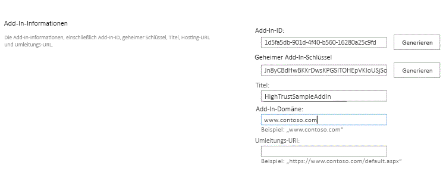
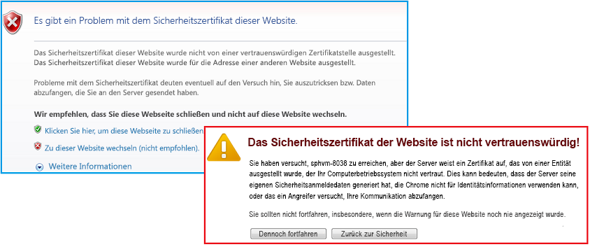

# <a name="package-and-publish-high-trust-sharepoint-add-ins"></a><span data-ttu-id="2776c-102">Packen und Veröffentlichen besonders vertrauenswürdiger Add-Ins für SharePoint</span><span class="sxs-lookup"><span data-stu-id="2776c-102">Package and publish high-trust SharePoint Add-ins</span></span>
<span data-ttu-id="2776c-103">Hier erfahren Sie, wie eine besonders vertrauenswürdige SharePoint-Add-Ins für die lokale Nutzung packen und veröffentlichen.</span><span class="sxs-lookup"><span data-stu-id="2776c-103">Learn how to package and publish a high-trust SharePoint Add-in for on-premises use.</span></span>
 

 <span data-ttu-id="2776c-p101">**Hinweis** Der Name „Apps für SharePoint“ wird in „SharePoint-Add-Ins“ geändert. Während des Übergangszeitraums wird in der Dokumentation und der Benutzeroberfläche einiger SharePoint-Produkte und Visual Studio-Tools möglicherweise weiterhin der Begriff „Apps für SharePoint“ verwendet. Weitere Informationen finden Sie unter [Neuer Name für Office- und SharePoint-Apps](new-name-for-apps-for-sharepoint.md#bk_newname).</span><span class="sxs-lookup"><span data-stu-id="2776c-p101">**Note**  The name "apps for SharePoint" is changing to "SharePoint Add-ins". During the transition, the documentation and the UI of some SharePoint products and Visual Studio tools might still use the term "apps for SharePoint". For details, see  [New name for apps for Office and SharePoint](new-name-for-apps-for-sharepoint.md#bk_newname).</span></span>
 


## <a name="prerequisites-for-packaging-and-publishing-high-trust-add-ins"></a><span data-ttu-id="2776c-107">Voraussetzungen für das Packen und Veröffentlichen besonders vertrauenswürdiger Add-Ins</span><span class="sxs-lookup"><span data-stu-id="2776c-107">Prerequisites for packaging and publishing high-trust add-ins</span></span>
<span data-ttu-id="2776c-108"><a name="Prereqs"> </a></span><span class="sxs-lookup"><span data-stu-id="2776c-108"><a name="Prereqs"> </a></span></span>

<span data-ttu-id="2776c-109">Sie benötigen Folgendes:</span><span class="sxs-lookup"><span data-stu-id="2776c-109">You need the following:</span></span>
 

 

- <span data-ttu-id="2776c-p102">Eine lokale SharePoint-Entwicklungsumgebung. Anweisungen zur Einrichtung finden Sie unter [Einrichten einer lokalen Entwicklungsumgebung für SharePoint-Add-Ins](set-up-an-on-premises-development-environment-for-sharepoint-add-ins.md).</span><span class="sxs-lookup"><span data-stu-id="2776c-p102">An on-premises SharePoint development environment. See  [Set up an on-premises development environment for SharePoint Add-ins](set-up-an-on-premises-development-environment-for-sharepoint-add-ins.md) for the setup instructions.</span></span>
    
 
- <span data-ttu-id="2776c-p103">Einen IIS-Webserver zum Hosten der Remotewebanwendung. Der IIS-Manager sollte installiert sein.</span><span class="sxs-lookup"><span data-stu-id="2776c-p103">An IIS web server to host the remote web application. IIS Manager should be installed.</span></span>
    
 
- <span data-ttu-id="2776c-114">Remoteinstallation von Visual Studio bzw. auf dem Computer, auf dem SharePoint installiert ist.</span><span class="sxs-lookup"><span data-stu-id="2776c-114">Visual Studio installed either remotely or on the computer where you have installed SharePoint.</span></span>
    
 
- <span data-ttu-id="2776c-115">Microsoft Office Developer Tools für Visual Studio</span><span class="sxs-lookup"><span data-stu-id="2776c-115">Microsoft Office Developer Tools for Visual Studio</span></span>
    
 
-  <span data-ttu-id="2776c-116">Installation von [Web Deploy](http://www.iis.net/downloads/microsoft/web-deploy) auf dem Visual Studio-Computer und dieselbe Version von **Web Deploy** auf dem Remote-Webanwendungsserver.</span><span class="sxs-lookup"><span data-stu-id="2776c-116">[Web Deploy](http://www.iis.net/downloads/microsoft/web-deploy) installed on the Visual Studio computer, and the same version of **Web Deploy** installed on the remote web application server.</span></span>
    
 
<span data-ttu-id="2776c-117">Tabelle 1 enthält eine Liste einiger hilfreicher Artikel, die zum Verständnis der für die Erstellung von SharePoint-Add-Ins relevanten Konzepte hilfreich sein können.</span><span class="sxs-lookup"><span data-stu-id="2776c-117">Table 1 lists some useful articles that can help you to understand the concepts involved in creating SharePoint Add-ins.</span></span>
 

 

<span data-ttu-id="2776c-118">**Tabelle 1: Kernkonzepte für die Veröffentlichung besonders vertrauenswürdiger Add-Ins**</span><span class="sxs-lookup"><span data-stu-id="2776c-118">**Table 1. Core concepts for publishing high-trust add-ins**</span></span>


|<span data-ttu-id="2776c-119">**Titel des Artikels**</span><span class="sxs-lookup"><span data-stu-id="2776c-119">**Article Title**</span></span>|<span data-ttu-id="2776c-120">**Beschreibung**</span><span class="sxs-lookup"><span data-stu-id="2776c-120">**Description**</span></span>|
|:-----|:-----|
| [<span data-ttu-id="2776c-121">Erste Schritte beim Erstellen von von einem Anbieter gehosteten SharePoint-Add-Ins</span><span class="sxs-lookup"><span data-stu-id="2776c-121">Get started creating provider-hosted SharePoint Add-ins</span></span>](get-started-creating-provider-hosted-sharepoint-add-ins.md)|<span data-ttu-id="2776c-122">Erfahren Sie, wie Sie ein einfaches von einem Anbieter gehostetes SharePoint-Add-In mit Office Developer Tools für Visual Studio erstellen.</span><span class="sxs-lookup"><span data-stu-id="2776c-122">Learn how to create a basic provider-hosted SharePoint Add-in with the Office Developer Tools for Visual Studio.</span></span>|
| [<span data-ttu-id="2776c-123">Erstellen von besonders vertrauenswürdigen SharePoint-Add-Ins</span><span class="sxs-lookup"><span data-stu-id="2776c-123">Create high-trust SharePoint Add-ins</span></span>](create-high-trust-sharepoint-add-ins.md)|<span data-ttu-id="2776c-124">Erfahren Sie, wie Sie eine einfache besonders vertrauenswürdige SharePoint-Add-In mit den Office-Entwicklertools für Visual Studio erstellen, indem Sie ein selbstsigniertes Zertifikat und eine dazugehörige Aussteller-ID verwenden.</span><span class="sxs-lookup"><span data-stu-id="2776c-124">Learn how to create a basic high-trust SharePoint Add-in with the Office Developer Tools for Visual Studio by using a self-signed certificate and an associated issuer ID.</span></span>|
| [<span data-ttu-id="2776c-125">Web Deploy</span><span class="sxs-lookup"><span data-stu-id="2776c-125">Web Deploy</span></span>](http://www.iis.net/downloads/microsoft/web-deploy)|<span data-ttu-id="2776c-126">Web Deploy vereinfacht die Bereitstellung von Webanwendungen und Websites auf IIS-Servern.</span><span class="sxs-lookup"><span data-stu-id="2776c-126">Web Deploy simplifies deployment of web applications and websites to IIS servers.</span></span>|
| <span data-ttu-id="2776c-127">[Digitale Zertifikate](http://msdn.microsoft.com/library/e523b335-0156-4f47-b55c-b80495587c4f.aspx) und [Arbeiten mit Zertifikaten](http://msdn.microsoft.com/library/6ffb8682-8f07-4a45-afbb-8d2487e9dbc3.aspx)</span><span class="sxs-lookup"><span data-stu-id="2776c-127">[Digital Certificates](http://msdn.microsoft.com/library/e523b335-0156-4f47-b55c-b80495587c4f.aspx) and [Working with Certificates](http://msdn.microsoft.com/library/6ffb8682-8f07-4a45-afbb-8d2487e9dbc3.aspx)</span></span>|<span data-ttu-id="2776c-128">Lernen Sie die grundlegenden Ideen hinter digitalen Zertifikaten kennen.</span><span class="sxs-lookup"><span data-stu-id="2776c-128">Learn the basic ideas behind digital certificates.</span></span>|

 <span data-ttu-id="2776c-p104">**Hinweis** Besonders vertrauenswürdige SharePoint-Add-Ins können nur in lokalen SharePoint-Installationen installiert werden, nicht in Microsoft SharePoint Online. Sie sind vorrangig zur Verwendung in einer lokalen Installation statt in einer cloudbasierten Webanwendung gedacht. In diesem Artikel wird die Veröffentlichung des Add-Ins in einem solchen Szenario beschrieben. Zudem bezieht sich „Kunde“ in diesem Artikel auf das Unternehmen, das das SharePoint-Add-In installiert und die Remotekomponenten des Add-Ins hostet.</span><span class="sxs-lookup"><span data-stu-id="2776c-p104">**Note**  High-trust SharePoint Add-ins can only be installed to on premises SharePoint, not to Microsoft SharePoint Online, and they are primarily intended for use with an on premises, rather than cloud-based, web application. This article explains how to publish the add-in in that scenario. Also, in this article 'customer' refers to the business that installs the SharePoint Add-in and hosts the remote components of the add-in.</span></span>
 


## <a name="register-the-high-trust-add-in"></a><span data-ttu-id="2776c-132">Registrieren des besonders vertrauenswürdigen Add-Ins</span><span class="sxs-lookup"><span data-stu-id="2776c-132">Register the high-trust add-in</span></span>
<span data-ttu-id="2776c-133"><a name="Register"> </a></span><span class="sxs-lookup"><span data-stu-id="2776c-133"><a name="Register"> </a></span></span>

<span data-ttu-id="2776c-p105">Bevor Sie das Add-In veröffentlichen können, muss es beim Add-In-Verwaltungsdienst der SharePoint-Farm registriert werden. Besonders vertrauenswürdige SharePoint-Add-Ins werden immer in der SharePoint-Farm registriert, in der das Add-In installiert werden soll. (Sie können nicht über den Office Store verkauft werden.) Die Registrierung erfolgt auf der Seite "http:// _SharePoint-Website_/_layouts/15/appregnew.aspx", wie im folgenden Verfahren beschrieben.</span><span class="sxs-lookup"><span data-stu-id="2776c-p105">Before you can publish the add-in, it has to be registered with the SharePoint farm's add-in management service. High-trust SharePoint Add-ins are always registered on the SharePoint farm on which the add-in is to be installed. (They cannot be sold through the Office Store.) Registration is done on the page http:// _SharePoint_website_/_layouts/15/appregnew.aspx as described in the following procedure.</span></span>
 

 

### <a name="to-register-the-add-in"></a><span data-ttu-id="2776c-137">So registrieren Sie das Add-In</span><span class="sxs-lookup"><span data-stu-id="2776c-137">To register the add-in</span></span>


1. <span data-ttu-id="2776c-p106">Navigieren Sie zur Seite „http:// _SharePoint-Website_/_layouts/15/appregnew.aspx“. Verwenden Sie die Schaltflächen zum **Generieren**, um Werte für die Add-In-ID und den geheimen Schlüssel zu erzeugen. (Der geheime Schlüssel wird nicht wirklich in besonders vertrauenswürdigen SharePoint-Add-Ins verwendet, aber er ist für das Formular erforderlich.) Geben Sie die Basis-URL der Domäne an, in der die Remotewebanwendung des Add-Ins ausgeführt wird. Geben Sie die Domäne ohne das Protokoll (HTTPS) an, aber fügen Sie den Port an, den die Remotekomponenten für HTTPS-Anforderungen verwenden sollen, falls nicht 443 verwendet wird (Beispiel: www.contoso.com:5555 oderMyAppServer:4444).</span><span class="sxs-lookup"><span data-stu-id="2776c-p106">Navigate to the http:// _SharePoint_website_/_layouts/15/appregnew.aspx page. Choose the  **Generate** buttons to generate values for the add-in ID and secret. (The secret is not actually used in high-trust SharePoint Add-ins, but the form requires one.) Provide the base URL of the domain where the remote web application of the add-in will run. Do not include the protocol (HTTPS) in the domain, but you have to include the port that the remote components will use for HTTPS requests if it is not 443 (for example,www.contoso.com:5555 orMyAppServer:4444).</span></span>
    
    <span data-ttu-id="2776c-p107">Falls Sie einen Umleitungs-URI benötigen, können Sie dafür auch einen Wert eingeben. Eine Erklärung der Verwendung eines Umleitungs-URI finden Sie unter  [OAuth-Ablauf mit Authentifizierungscode für SharePoint-Add-Ins](authorization-code-oauth-flow-for-sharepoint-add-ins.md).</span><span class="sxs-lookup"><span data-stu-id="2776c-p107">If you need a redirect URI, enter a value for that also. See  [Authorization Code OAuth flow for SharePoint Add-ins](authorization-code-oauth-flow-for-sharepoint-add-ins.md) for an explanation of how the redirect URI can be used.</span></span>
    
    <span data-ttu-id="2776c-p108">Das Formular auf der Seite sollte Abbildung 1 ähneln. In diesem Beispiel lauscht der Remote-Webanwendungsserver am Standardport 443 auf HTTPS-Anforderungen. Daher muss der Port nicht in der Add-In-Domäne angegeben werden.</span><span class="sxs-lookup"><span data-stu-id="2776c-p108">The form on the page should look similar to Figure 1. In this example, the remote web application server is listening for HTTPS requests on the default port 443, so it's not necessary to specify the port in the add-in domain.</span></span>
    

    <span data-ttu-id="2776c-146">**Abbildung 1: Registrieren des Add-Ins auf „appregnew.aspx“**</span><span class="sxs-lookup"><span data-stu-id="2776c-146">**Figure 1. Register add-in on appregnew.aspx**</span></span>

 

  
 

 

 
2. <span data-ttu-id="2776c-p109">Wählen Sie **Erstellen**. Die Informationen, die Sie für das Add-In eingegeben haben, werden auf der nächsten Seite angezeigt. Notieren Sie sich diese Informationen, da Sie sie beim Verwenden der Veröffentlichungstools von Visual Studio benötigen. Erstellen Sie ggf. einen Screenshot der Seite.</span><span class="sxs-lookup"><span data-stu-id="2776c-p109">Choose  **Create**. The information that you entered for the add-in will be displayed on the next page. Be sure to keep this information available because you will need it when you use the Visual Studio publishing tools. Consider taking a quick screenshot of the page.</span></span>
    
 

## <a name="choose-a-strategy-for-obtaining-maintaining-and-deploying-certificates-for-high-trust-sharepoint-add-ins"></a><span data-ttu-id="2776c-152">Wählen einer Strategie für die Beschaffung, Pflege und Bereitstellung von Zertifikaten für besonders vertrauenswürdige SharePoint-Add-Ins</span><span class="sxs-lookup"><span data-stu-id="2776c-152">Choose a strategy for obtaining, maintaining and deploying certificates for high-trust SharePoint Add-ins</span></span>
<span data-ttu-id="2776c-153"><a name="Certificate"> </a></span><span class="sxs-lookup"><span data-stu-id="2776c-153"><a name="Certificate"> </a></span></span>

<span data-ttu-id="2776c-p110">Wenn ein Entwickler unter Verwendung von **F5** in Visual Studio ein besonders vertrauenswürdiges SharePoint-Add-In entwickelt und debuggt, kann er ein selbstsigniertes Zertifikat verwenden, wie in [Erstellen besonders vertrauenswürdiger SharePoint-Add-Ins](create-high-trust-sharepoint-add-ins.md) beschrieben. Wird das Add-In jedoch *veröffentlicht*, hat die Verwendung eines selbstsignierten Zertifikats zur Folge, dass im Browser vor dem Öffnen der Startseite der Remotewebanwendung eine Warnseite angezeigt wird. Der Benutzer muss wählen, ob der Vorgang fortgesetzt werden soll. Abbildung 2 zeigt Beispiele solcher Warnungen.</span><span class="sxs-lookup"><span data-stu-id="2776c-p110">When a developer is using  **F5** in Visual Studio to develop and debug a high-trust SharePoint Add-in, the developer can use a self-signed certificate, as described in [Create high-trust SharePoint Add-ins](create-high-trust-sharepoint-add-ins.md). However, when the add-in is  *published*  , using a self-signed certificate causes the browser to display a warning page before it will open the remote web application's start page. The user has to choose whether to proceed. Figure 2 shows examples of such warnings.</span></span>
 

 

<span data-ttu-id="2776c-157">**Abbildung 2: Warnungen für selbstsignierte Zertifikate**</span><span class="sxs-lookup"><span data-stu-id="2776c-157">**Figure 2. Warnings for self-signed certificates**</span></span>

 

 

 
<span data-ttu-id="2776c-p111">Dieses Ärgernis ist möglicherweise akzeptabel für Entwickler, aber nicht für Kunden. Daher muss der Kunde vor der endgültigen Veröffentlichung in einer Produktionsumgebung ein Zertifikat anfordern, das von einem vertrauenswürdigen Drittanbieter signiert ist. Der Drittanbieter kann eine kommerzielle Zertifizierungsstelle (CA) oder eine lokale Zertifizierungsstelle sein. Beachten Sie bei kommerziellen Zertifizierungsstellen, dass in der Branche "Nur Intranet"-Zertifikate für Webserver schrittweise abgeschafft werden. Sie können weiterhin erworben werden, aber alle diese Zertifikate laufen im November 2016 oder früher ab. Ein solches Zertifikat ist für eine besonders vertrauenswürdige SharePoint-Add-In nicht notwendig, da für Internet-Webserver verwendete Zertifikate auch für Intranet-Webserver verwendet werden können. Diese kosten jedoch normalerweise mehr.</span><span class="sxs-lookup"><span data-stu-id="2776c-p111">This annoyance might be acceptable for a developer, but it would be unacceptable for customers. So before final publication to a production environment, the customer has to get a certificate that is signed by a trusted third party. The third party can be a commercial Certificate Authority (CA) or an on-premises CA. In regard to commercial CAs, note that the industry is phasing out "intranet-only" certificates for web servers. They can still be purchased, but all such certificates will expire in November, 2016, or sooner. It is not necessary to have this kind of certificate for a high-trust SharePoint Add-in, because certificates that can be used for internet-facing web servers can also be used for intranet web servers, but the latter generally cost more.</span></span> 
 

 
<span data-ttu-id="2776c-p112">Das Zertifikat sollte in zwei Formaten, PFX (Personal Information Exchange) und CER (Sicherheitszertifikat) vorliegen. Wurde es ursprünglich nicht in einem dieser Formate ausgestellt, kann der Kunde es mithilfe eines Hilfsprogramms konvertieren. Wenn eine PFX-Formatversion erstellt wurde, kann die PFX-Datei auch in IIS importiert und dann die CER-Version exportiert werden, wie unten beschrieben.</span><span class="sxs-lookup"><span data-stu-id="2776c-p112">The certificate should be in two formats, Personal Information Exchange (pfx) and Security Certificate (cer). If it is not in either of these formats when originally obtained, the customer can convert it using a utility. Also, once a pfx format version has been obtained, the pfx file can be imported into IIS and then the cer version exported as described below.</span></span>
 

 
<span data-ttu-id="2776c-p113">Wenn das Zertifikat ursprünglich im CER-Format erstellt wurde, enthält es den privaten und den öffentlichen Schlüssel. Grundsätzlich sollte die von SharePoint verwendete CER-Datei den privaten Schlüssel nicht enthalten. Ziehen Sie es in Betracht, das ursprüngliche Zertifikat in IIS zu importieren und dann eine neue CER-Version zu exportieren, die den privaten Schlüssel nicht enthält. Diese Vorgehensweise ist unten beschrieben. Weitere Informationen zu PFX- und CER-Dateien finden Sie unter  [Softwareherausgeberzertifikat](http://msdn.microsoft.com/de-de/library/windows/hardware/ff552299%28v=vs.85%29.aspx).</span><span class="sxs-lookup"><span data-stu-id="2776c-p113">If the certificate is originally obtained is a cer format, it will contain both the private and public keys. As a general practice, the .cer file that is used by SharePoint should not contain the private key. Consider importing the original certificate to IIS and then exporting a new cer version that does not include the private key as described below. For more information about .pfx and .cer files, see  [Software Publisher Certificate](http://msdn.microsoft.com/de-de/library/windows/hardware/ff552299%28v=vs.85%29.aspx).</span></span>
 

 
<span data-ttu-id="2776c-p114">Außerdem muss sich der Kunde überlegen, ob er ein Zertifikat für alle besonders vertrauenswürdigen SharePoint-Add-Ins oder ein separates Zertifikat für jedes Add-In verwenden möchte. Weitere Informationen zu dieser Entscheidung finden Sie unter  [Entscheiden zwischen der Verwendung eines oder mehrerer Zertifikate für besonders vertrauenswürdige SharePoint-Add-Ins](creating-sharepoint-add-ins-that-use-high-trust-authorization.md#Deciding).</span><span class="sxs-lookup"><span data-stu-id="2776c-p114">In addition, the customer has to consider whether to use a single certificate for all high-trust SharePoint Add-ins or separate certificates for each. For more information about this decision, see  [Deciding between using one certificate or many for high-trust SharePoint Add-ins](creating-sharepoint-add-ins-that-use-high-trust-authorization.md#Deciding).</span></span>
 

 

## <a name="configure-the-remote-web-server-with-the-certificate"></a><span data-ttu-id="2776c-174">Konfigurieren des Remotewebservers mit dem Zertifikat</span><span class="sxs-lookup"><span data-stu-id="2776c-174">Configure the remote web server with the certificate</span></span>
<span data-ttu-id="2776c-175"><a name="ConfigureRemote"> </a></span><span class="sxs-lookup"><span data-stu-id="2776c-175"><a name="ConfigureRemote"> </a></span></span>

<span data-ttu-id="2776c-176">Die folgenden Verfahren werden auf dem Remotewebserver ausgeführt, der die Remotewebanwendung hostet.</span><span class="sxs-lookup"><span data-stu-id="2776c-176">The following procedures are performed on the remote web server hosting the remote web application.</span></span>
 

 

### <a name="to-configure-the-remote-web-server-and-pfx-certificate"></a><span data-ttu-id="2776c-177">So konfigurieren Sie den Remotewebserver und das PFX-Zertifikat</span><span class="sxs-lookup"><span data-stu-id="2776c-177">To configure the remote web server and pfx certificate</span></span>


1. <span data-ttu-id="2776c-p115">Weisen Sie dem PFX-Zertifikat ein sicheres Kennwort zu. Weitere Informationen finden Sie unter [Richtlinien für die Erstellung sicherer Kennwörter](http://msdn.microsoft.com/de-de/library/bb416446.aspx) und [Sichere Kennwörter](http://msdn.microsoft.com/de-de/library/ms161962.aspx).</span><span class="sxs-lookup"><span data-stu-id="2776c-p115">Give the .pfx certificate a strong password. For more information, see  [Guidelines for creating strong passwords](http://msdn.microsoft.com/de-de/library/bb416446.aspx) and [Strong passwords](http://msdn.microsoft.com/de-de/library/ms161962.aspx).</span></span>
    
 
2. <span data-ttu-id="2776c-180">Importieren Sie das Zertifikat mit den folgenden Schritten in IIS auf dem Remotewebserver:</span><span class="sxs-lookup"><span data-stu-id="2776c-180">Import the certificate into IIS on the remote web server with these steps:</span></span>
    
      1. <span data-ttu-id="2776c-181">Wählen Sie im IIS-Manager in der Strukturansicht auf der linken Seite den Knoten _ServerName_ aus.</span><span class="sxs-lookup"><span data-stu-id="2776c-181">In IIS Manager, select the  _ServerName_ node in the tree view on the left.</span></span>
    
 
  2. <span data-ttu-id="2776c-182">Doppelklicken Sie auf das Symbol **Serverzertifikate**.</span><span class="sxs-lookup"><span data-stu-id="2776c-182">Double-click the  **Server Certificates** icon.</span></span>
    
 
  3. <span data-ttu-id="2776c-183">Wählen Sie im Bereich **Aktionen** auf der rechten Seite **Importieren** aus.</span><span class="sxs-lookup"><span data-stu-id="2776c-183">Select  **Import** in the **Actions** pane on the right.</span></span>
    
 
  4. <span data-ttu-id="2776c-184">Verwenden Sie im Dialogfeld **Zertifikat importieren** die Schaltfläche „Durchsuchen“, um zur PFX-Datei zu navigieren, und geben Sie dann das Kennwort des Zertifikats ein.</span><span class="sxs-lookup"><span data-stu-id="2776c-184">On the  **Import Certificate** dialog, use the browse button to browse to the .pfx file, and then enter the password of the certificate.</span></span>
    
 
  5. <span data-ttu-id="2776c-p116">Wenn Sie IIS-Manager 8 verwenden, gibt es eine Dropdownliste **Zertifikatspeicher auswählen**. Wählen Sie **Persönlich** aus. (Dies bezieht sich auf den „persönlichen“ Zertifikatspeicher des Computers, nicht des Benutzers.)</span><span class="sxs-lookup"><span data-stu-id="2776c-p116">If you are using IIS Manager 8, there is a  **Select Certificate Store** drop down. Choose **Personal**. (This refers to the "personal" certificate storage of the computer, not the user.)</span></span>
    
 
  6. <span data-ttu-id="2776c-188">Wenn nicht bereits eine CER-Version vorliegt oder diese nicht den privaten Schlüssel enthält, aktivieren Sie **Export dieses Zertifikats zulassen**.</span><span class="sxs-lookup"><span data-stu-id="2776c-188">If you don't already have a cer version, or you do but it includes the private key, enable  **Allow this certificate to be exported**.</span></span>
    
 
  7. <span data-ttu-id="2776c-189">Klicken Sie auf **OK**.</span><span class="sxs-lookup"><span data-stu-id="2776c-189">Click  **OK**.</span></span>
    
 

### <a name="to-open-the-windows-certificate-store"></a><span data-ttu-id="2776c-190">So öffnen Sie den Windows-Zertifikatspeicher</span><span class="sxs-lookup"><span data-stu-id="2776c-190">To open the Windows Certificate Store</span></span>


1. <span data-ttu-id="2776c-191">Öffnen Sie auf demselben Server die **Microsoft Management Console** gemäß der Beschreibung in [Öffnen von MMC 3.0](http://technet.microsoft.com/de-de/library/cc766121.aspx).</span><span class="sxs-lookup"><span data-stu-id="2776c-191">On the same server, open the  **Microsoft Management Console** and as described in [Open MMC 3.0](http://technet.microsoft.com/de-de/library/cc766121.aspx).</span></span>
    
 
2. <span data-ttu-id="2776c-p117">Fügen Sie das **Zertifikat**-Snap-In für das Computerkonto hinzu, wie unter [Hinzufügen des Zertifikat-Snap-Ins zu einer MMC-Konsole](http://technet.microsoft.com/de-de/library/cc754431.aspx) beschrieben. Achten Sie darauf, dass Sie das Verfahren für den *Computer* verwenden, nicht für einen Benutzer oder Dienst. Wählen Sie bei der entsprechenden Aufforderung *lokaler* Computer und nicht „anderer“ Computer.</span><span class="sxs-lookup"><span data-stu-id="2776c-p117">Add the  **Certificates** snap-in for the computer account as described in [Add the Certificates Snap-in to an MMC](http://technet.microsoft.com/de-de/library/cc754431.aspx). Be sure to use the procedure for the  *computer*  , not a user or service. Choose the *local*  computer, not "another" computer, when prompted.</span></span>
    
 
<span data-ttu-id="2776c-195">Überspringen Sie das nächste Verfahren, wenn Sie ISS-Manager 8 verwenden.</span><span class="sxs-lookup"><span data-stu-id="2776c-195">Skip the next procedure if you are using ISS Manager 8.</span></span>
 

 

### <a name="additional-steps-for-iss-manager-7-to-get-the-certificate-into-the-windows-certificate-store"></a><span data-ttu-id="2776c-196">Zusätzliche Schritte für ISS-Manager 7, um das Zertifikat in den Windows-Zertifikatspeicher zu übertragen.</span><span class="sxs-lookup"><span data-stu-id="2776c-196">Additional steps for ISS Manager 7 to get the certificate into the Windows Certificate Store</span></span>


1. <span data-ttu-id="2776c-197">Erstellen Sie einen Ordner im Serverdateisystem als temporären Speicherort für das Zertifikat.</span><span class="sxs-lookup"><span data-stu-id="2776c-197">Create a folder on the server file system to be used as a very temporary storage place for the certificate.</span></span>
    
 
2. <span data-ttu-id="2776c-198">Wählen Sie im IIS-Manager in der Strukturansicht auf der linken Seite den Knoten _ServerName_ aus.</span><span class="sxs-lookup"><span data-stu-id="2776c-198">In IIS Manager, select the  _ServerName_ node in the tree view on the left.</span></span>
    
 
3. <span data-ttu-id="2776c-199">Doppelklicken Sie auf das Symbol **Serverzertifikate**.</span><span class="sxs-lookup"><span data-stu-id="2776c-199">Double-click the  **Server Certificates** icon.</span></span>
    
 
4. <span data-ttu-id="2776c-200">Klicken Sie in der Liste **Serverzertifikate** mit der rechten Maustaste auf das Zertifikat, und wählen Sie dann **Exportieren** aus, wie in Abbildung 3 gezeigt.</span><span class="sxs-lookup"><span data-stu-id="2776c-200">In the  **Server Certificates** list, right-click the certificate, and then select **Export**, as shown in Figure 3.</span></span>
    
    <span data-ttu-id="2776c-201">**Abbildung 3: Exportieren eines Zertifikats**</span><span class="sxs-lookup"><span data-stu-id="2776c-201">**Figure 3. Exporting a certificate**</span></span>

 

  
 

 

 
5. <span data-ttu-id="2776c-203">Exportieren Sie die Datei in den erstellten Ordner, und geben Sie das Kennwort für die Datei ein.</span><span class="sxs-lookup"><span data-stu-id="2776c-203">Export the file to the folder that you created and enter its password.</span></span>
    
 
6. <span data-ttu-id="2776c-p118">Importieren Sie in der **Microsoft Management Console** das Zertifikat, wie unter [Importieren eines Zertifikats](http://technet.microsoft.com/de-de/library/cc754489.aspx) beschrieben. Geben Sie dabei unbedingt den **persönlichen** Speicher an.</span><span class="sxs-lookup"><span data-stu-id="2776c-p118">In the  **Microsoft Management Console** import the certificate as described in [Import a Certificate](http://technet.microsoft.com/de-de/library/cc754489.aspx). Be sure to specify the  **Personal** store.</span></span>
    
 
7. <span data-ttu-id="2776c-206">Lassen Sie die Konsole für das nächste Verfahren geöffnet.</span><span class="sxs-lookup"><span data-stu-id="2776c-206">Leave the console open for the next procedure.</span></span>
    
 
8.  <span data-ttu-id="2776c-p119">*Löschen Sie den Ordner, den Sie im ersten Schritt erstellt haben, und die Zertifikatdatei darin.*  Der Sicherheitsvorteil der Speicherung des Zertifikats im Zertifikatspeicher wird zunichte gemacht, wenn es auch im Dateisystem vorhanden ist.</span><span class="sxs-lookup"><span data-stu-id="2776c-p119">*Delete the folder that you created in the first step and the certificate file in it.*  The security advantages of keeping the certificate in the certificate store are defeated if it is also on the file system.</span></span>
    
 
<span data-ttu-id="2776c-209">Das nächste Verfahren gilt für IIS-Manager 7 und 8.</span><span class="sxs-lookup"><span data-stu-id="2776c-209">The next procedure applies to both IIS Manager 7 and 8.</span></span>
 

 

### <a name="to-get-the-serial-number-of-the-certificate"></a><span data-ttu-id="2776c-210">So rufen Sie die Seriennummer des Zertifikats ab</span><span class="sxs-lookup"><span data-stu-id="2776c-210">To get the serial number of the certificate</span></span>


1. <span data-ttu-id="2776c-211">Navigieren Sie in der **Microsoft Management Console** zum Ordner **Zertifikate** unter dem Ordner **Persönlich** des Snap-Ins **Zertifikate (lokaler Computer)**, wenn er nicht bereits geöffnet ist.</span><span class="sxs-lookup"><span data-stu-id="2776c-211">In the  **Microsoft Management Console**, navigate to the  **Certificates** folder under the **Personal** folder of the **Certificates (Local Computer)** snap-in, if it is not already open.</span></span>
    
 
2. <span data-ttu-id="2776c-212">Doppelklicken Sie auf das Zertifikat für das SharePoint-Add-In, um es zu öffnen. Öffnen Sie dann die Registerkarte **Details**.</span><span class="sxs-lookup"><span data-stu-id="2776c-212">Double-click the certificate for your SharePoint Add-in to open it, and then open the  **Details** tab.</span></span>
    
 
3. <span data-ttu-id="2776c-213">Wählen Sie das Feld **Seriennummer** aus, um die gesamte Seriennummer im Feld sichtbar zu machen.</span><span class="sxs-lookup"><span data-stu-id="2776c-213">Select the  **Serial Number** field to make the entire serial number is visible in the box.</span></span>
    
 
4. <span data-ttu-id="2776c-214">Kopieren Sie die Seriennummer *ohne Leerzeichen* in eine Textdatei, und übergeben Sie diese an den Entwickler des SharePoint-Add-Ins.</span><span class="sxs-lookup"><span data-stu-id="2776c-214">Copy the serial number,  *without the spaces*  , to a text file and give it to the developer of the SharePoint Add-in.</span></span>
    
     <span data-ttu-id="2776c-p120">**Tipp** In einigen Blogbeiträgen von Entwicklern und Forumfragen wird berichtet, dass beim direkten Kopieren der Seriennummer in die Zwischenablage eine Zeichenfolge mit ausgeblendeten Zeichen erstellt wird, in der die Seriennummer vom Code in der SharePoint-Add-In nicht erkannt wird. Geben Sie daher die Nummer lieber manuell ein, statt sie zu kopieren. Als Nächstes erstellen Sie eine CER-Version des Zertifikats. Diese enthält den öffentlichen Schlüssel des Remotewebservers und wird von SharePoint zum Entschlüsseln der Anforderungen von der Remotewebanwendung und zum Überprüfen der Zugriffstoken in diesen Anforderungen verwendet. Sie wird auf dem Remotewebserver erstellt und anschließend in die SharePoint-Farm verschoben.</span><span class="sxs-lookup"><span data-stu-id="2776c-p120">**Tip**  Some developer blog posts and forum questions report that copying the serial number directly into the clipboard creates a string with hidden characters that makes the serial number unrecognizable to code in the SharePoint Add-in. Consider manually typing the number instead of copying it. Next you create a cer version of the certificate. This contains the public key of the remote web server and is used by SharePoint to unencrypt requests from the remote web application and validate the access tokens in those requests. It is created on the remote web server and then moved to the SharePoint farm.</span></span>
 

 

### <a name="to-create-the-cer-certificate"></a><span data-ttu-id="2776c-220">So erstellen Sie das CER-Zertifikat</span><span class="sxs-lookup"><span data-stu-id="2776c-220">To create the cer certificate</span></span>


1. <span data-ttu-id="2776c-221">Wählen Sie im IIS-Manager in der Strukturansicht auf der linken Seite den Knoten _ServerName_ aus.</span><span class="sxs-lookup"><span data-stu-id="2776c-221">In IIS manager, select the  _ServerName_ node in the tree view on the left.</span></span>
    
 
2. <span data-ttu-id="2776c-222">Doppelklicken Sie auf **Serverzertifikate**.</span><span class="sxs-lookup"><span data-stu-id="2776c-222">Double-click  **Server Certificates**.</span></span>
    
 
3. <span data-ttu-id="2776c-223">Doppelklicken Sie in der Ansicht **Serverzertifikate** auf das Zertifikat, um die Zertifikatdetails anzuzeigen.</span><span class="sxs-lookup"><span data-stu-id="2776c-223">In  **Server Certificates** view, double-click the certificate to display the certificate details.</span></span>
    
 
4. <span data-ttu-id="2776c-224">Wählen Sie auf der Registerkarte **Details** die Option **In Datei kopieren**, um den **Zertifikatexport-Assistenten** zu starten. Klicken Sie anschließend auf **Weiter**.</span><span class="sxs-lookup"><span data-stu-id="2776c-224">On the  **Details** tab, choose **Copy to File** to launch the **Certificate Export Wizard**, and then choose  **Next**.</span></span>
    
 
5. <span data-ttu-id="2776c-225">Verwenden Sie den Standardwert **Nein, privaten Schlüssel nicht exportieren**, und wählen Sie dann **Weiter**.</span><span class="sxs-lookup"><span data-stu-id="2776c-225">Use the default value  **No, do not export the private key**, and then choose  **Next**.</span></span>
    
 
6. <span data-ttu-id="2776c-p121">Verwenden Sie auf der nächsten Seite die Standardwerte. Wählen Sie **Weiter**.</span><span class="sxs-lookup"><span data-stu-id="2776c-p121">Use the default values on the next page. Choose  **Next**.</span></span>
    
 
7. <span data-ttu-id="2776c-p122">Wählen Sie **Durchsuchen**, und navigieren Sie zu einem beliebigen Ordner. (Die CER-Datei wird später sowieso auf einen anderen Computer verschoben.) Benennen Sie die Datei genauso wie die PFX-Datei, und wählen Sie dann **Speichern**. Das Zertifikat wird in einer CER-Datei gespeichert.</span><span class="sxs-lookup"><span data-stu-id="2776c-p122">Choose  **Browse** and browse to any folder. (The cer file is going to be moved off of this computer anyway.) Give the file the same name as the pfx file, and then choose **Save**. The certificate is saved as a .cer file.</span></span>
    
 
8. <span data-ttu-id="2776c-231">Wählen Sie **Weiter**.</span><span class="sxs-lookup"><span data-stu-id="2776c-231">Choose  **Next**.</span></span>
    
 
9. <span data-ttu-id="2776c-232">Wählen Sie **Fertig stellen**.</span><span class="sxs-lookup"><span data-stu-id="2776c-232">Choose  **Finish**.</span></span>
    
 

## <a name="configure-sharepoint-to-use-the-certificate"></a><span data-ttu-id="2776c-233">Konfigurieren von SharePoint für die Verwendung des Zertifikats</span><span class="sxs-lookup"><span data-stu-id="2776c-233">Configure SharePoint to use the certificate</span></span>
<span data-ttu-id="2776c-234"><a name="ConfigureSP"> </a></span><span class="sxs-lookup"><span data-stu-id="2776c-234"><a name="ConfigureSP"> </a></span></span>

<span data-ttu-id="2776c-235">Die Verfahren in diesem Abschnitt können auf jedem SharePoint-Server ausgeführt werden, auf dem die **SharePoint-Verwaltungsshell** installiert ist.</span><span class="sxs-lookup"><span data-stu-id="2776c-235">The procedures in this section can be performed on any SharePoint server on which the  **SharePoint Management Shell** is installed.</span></span>
 

 

### <a name="to-distribute-the-cer-file-to-sharepoint"></a><span data-ttu-id="2776c-236">So verteilen Sie die CER-Datei an SharePoint</span><span class="sxs-lookup"><span data-stu-id="2776c-236">To distribute the cer file to SharePoint</span></span>


1. <span data-ttu-id="2776c-237">Erstellen Sie einen Ordner, und stellen Sie sicher, dass die Add-In-Pool-Identitäten für die folgenden IIS-Add-In-Pools über Leseberechtigungen dafür verfügen:</span><span class="sxs-lookup"><span data-stu-id="2776c-237">Create a folder and be sure that the add-in pool identities for the following IIS add-in pools have Read right to it:</span></span>
    
      -  <span data-ttu-id="2776c-238">**SecurityTokenServiceApplicationPool**</span><span class="sxs-lookup"><span data-stu-id="2776c-238">**SecurityTokenServiceApplicationPool**</span></span>
    
 
  - <span data-ttu-id="2776c-p123">Der Add-In-Pool, der die IIS-Website bedient, die die übergeordnete SharePoint-Webanwendung für Ihre SharePoint-Testwebsite hostet. Für die IIS-Website **SharePoint - 80** wird der Pool als **OServerPortalAppPool** bezeichnet.</span><span class="sxs-lookup"><span data-stu-id="2776c-p123">The add-in pool that serves the IIS web site that hosts the parent SharePoint web application for your test SharePoint website. For the  **SharePoint - 80** IIS website, the pool is called **OServerPortalAppPool**.</span></span>
    
 
2.  <span data-ttu-id="2776c-p124">*Verschieben*  Sie die CER-Datei (kopieren Sie sie nicht nur) vom Remotewebserver in den soeben erstellten Ordner auf dem SharePoint-Server. Die Datei bleibt nur vorübergehend in diesem Ordner.</span><span class="sxs-lookup"><span data-stu-id="2776c-p124">*Move*  (don't merely copy) the .cer file from the remote web server to the folder you just created on the SharePoint server. The file will be in this folder only temporarily.</span></span>
    
 
<span data-ttu-id="2776c-p125">Mit dem folgenden Verfahren wird das Zertifikat als vertrauenswürdiger Tokenaussteller in SharePoint konfiguriert. Das Verfahren wird nur einmal durchgeführt (für jedes besonders vertrauenswürdige SharePoint.Add-In).</span><span class="sxs-lookup"><span data-stu-id="2776c-p125">The following procedure configures the certificate as a trusted token issuer in SharePoint. It is performed just once (for each high-trust SharePoint Add-in).</span></span>
 

 

### <a name="to-configure-the-certificate"></a><span data-ttu-id="2776c-245">So konfigurieren Sie das Zertifikat</span><span class="sxs-lookup"><span data-stu-id="2776c-245">To configure the certificate</span></span>


1. <span data-ttu-id="2776c-246">Erstellen Sie ggf. die benötigten besonders vertrauenswürdigen Windows PowerShell-Konfigurationsskripts, wie in  [Besonders vertrauenswürdige Konfigurationsskripts für SharePoint](high-trust-configuration-scripts-for-sharepoint.md) beschrieben.</span><span class="sxs-lookup"><span data-stu-id="2776c-246">If you have not done so already, create the high-trust configuration Windows PowerShell script or scripts that you need, as described in  [High-trust configuration scripts for SharePoint](high-trust-configuration-scripts-for-sharepoint.md).</span></span>
    
 
2. <span data-ttu-id="2776c-247">Kopieren Sie die Skripts auf den SharePoint-Server.</span><span class="sxs-lookup"><span data-stu-id="2776c-247">Copy the scripts to the SharePoint server.</span></span>
    
 
3. <span data-ttu-id="2776c-248">Öffnen Sie die **SharePoint-Verwaltungsshell** als Administrator, und führen Sie die entsprechenden Skripts aus.</span><span class="sxs-lookup"><span data-stu-id="2776c-248">Open the  **SharePoint Management Shell** as an administrator and run the appropriate scripts.</span></span>
    
 
4. <span data-ttu-id="2776c-p126">Eines der Skripts gilt für den Fall, dass der Kunde ein einzelnes Zertifikat für mehrere SharePoint-Add-Ins verwendet. Das Skript gibt eine Datei aus, die die GUID des Tokenausstellers enthält. Wenn Sie dieses Skript verwenden, geben Sie die ausgegebene Datei an den Entwickler der besonders vertrauenswürdigen SharePoint-Add-In weiter.</span><span class="sxs-lookup"><span data-stu-id="2776c-p126">One of the scripts is intended for use when the customer is sharing a single certificate among multiple SharePoint Add-ins. That script outputs a file that contains the GUID for the token issuer. If you use that script, give the file that it outputs to the developer of the high-trust SharePoint Add-in.</span></span>
    
 
5.  <span data-ttu-id="2776c-251">*Löschen Sie die CER-Datei aus dem Dateisystem des SharePoint-Servers.*</span><span class="sxs-lookup"><span data-stu-id="2776c-251">*Delete the cer file from the file system of the SharePoint server.*</span></span> 
    
 

 <span data-ttu-id="2776c-p127">**Hinweis** Die Registrierung des Zertifikats als Tokenaussteller ist nicht sofort wirksam, und das Add-In ist erst anschließend funktionsfähig. Es dauert bis zu 24 Stunden, bis alle SharePoint-Server den neuen Tokenaussteller erkennen. Wenn Sie iisreset auf allen SharePoint-Servern ausführen können, ohne SharePoint-Benutzer zu stören, wird der Aussteller sofort erkannt.</span><span class="sxs-lookup"><span data-stu-id="2776c-p127">**Note**  The registration of the certificate as a token issuer is not effective immediately and the add-in will not work until it is. It may take as long as 24 hours before all the SharePoint servers recognize the new token issuer. Running an iisreset on all the SharePoint servers, if you can do that without disturbing SharePoint users, would cause them to immediately recognize the issuer.</span></span>
 


## <a name="modify-the-webconfig-file"></a><span data-ttu-id="2776c-255">Ändern der Datei „web.config“</span><span class="sxs-lookup"><span data-stu-id="2776c-255">Modify the web.config file</span></span>
<span data-ttu-id="2776c-256"><a name="WebConfig"> </a></span><span class="sxs-lookup"><span data-stu-id="2776c-256"><a name="WebConfig"> </a></span></span>


 <span data-ttu-id="2776c-257">**Tipp** Ein Codebeispiel mit einer geänderten Datei „web.config“ finden Sie unter [PnP / Samples / Core.OnPrem.S2S.WindowsCertStore](https://github.com/OfficeDev/PnP/tree/dev/Samples/Core.OnPrem.S2S.WindowsCertStore).</span><span class="sxs-lookup"><span data-stu-id="2776c-257">**Tip**  For a code sample that includes a modified web.config, see  [PnP / Samples / Core.OnPrem.S2S.WindowsCertStore](https://github.com/OfficeDev/PnP/tree/dev/Samples/Core.OnPrem.S2S.WindowsCertStore)..</span></span>
 

<span data-ttu-id="2776c-258">Bearbeiten Sie die Datei „web.config“ so, dass sie die neuen Werte für die folgenden Schlüssel im `appSettings`-Knoten enthält:</span><span class="sxs-lookup"><span data-stu-id="2776c-258">Edit the web.config file so that it contains new values for the following keys in the  `appSettings` node:</span></span>
 

 

-  <span data-ttu-id="2776c-259">**ClientID:** Dies ist die Client-ID der Webanwendung (GUID), die auf „appregnew.aspx“ generiert wurde.</span><span class="sxs-lookup"><span data-stu-id="2776c-259">**ClientID:** This is the web application's client ID (GUID) that was generated on appregnew.aspx.</span></span>
    
 
-  <span data-ttu-id="2776c-p128">**ClientSigningCertificateSerialNumber:** *(Sie müssen diesen Schlüssel hinzufügen, wenn er nicht von den Microsoft Office-Entwicklertools für Visual Studio hinzugefügt wurde.)*  Dies ist die Seriennummer des Zertifikats. Der Wert darf keine Leerzeichen oder Bindestriche enthalten.</span><span class="sxs-lookup"><span data-stu-id="2776c-p128">**ClientSigningCertificateSerialNumber:** *(You will need to add this key, if the Microsoft Office Developer Tools for Visual Studio did not add it.)*  This is the serial number of the certificate. There should be no spaces or hyphens in the value.</span></span>
    
 
-  <span data-ttu-id="2776c-p129">**IssuerId:** Dies ist die GUID des Tokenausstellers (*Kleinbuchstaben* erforderlich). Der Wert hängt von der Zertifikatstrategie des Kunden ab:</span><span class="sxs-lookup"><span data-stu-id="2776c-p129">**IssuerId:** This is the GUID of token issuer ( *which must be lower-case*  ). Its value depends on the certificate strategy of the customer:</span></span>
    
      - <span data-ttu-id="2776c-264">Wenn die besonders vertrauenswürdige SharePoint-Add-In über ein eigenes Zertifikat verfügt, das nicht von anderen SharePoint-Add-Ins verwendet wird, ist die  `IssuerId` mit der `ClientId` identisch.</span><span class="sxs-lookup"><span data-stu-id="2776c-264">If the high-trust SharePoint Add-in has its own certificate that it is not sharing with other SharePoint Add-ins, the  `IssuerId` is the same as the `ClientId`.</span></span>
    
 
  - <span data-ttu-id="2776c-p130">Wenn die SharePoint-Add-In das gleiche Zertifikat wie andere SharePoint-Add-Ins verwendet, ist die  `IssuerId` eine beliebige GUID. Das Skript für dieses Szenario, das Sie in [Besonders vertrauenswürdige Konfigurationsskripts für SharePoint](high-trust-configuration-scripts-for-sharepoint.md) finden, generiert eine Textdatei mit dieser GUID. IT-Mitarbeiter können die ausgegebene Datei an den Add-In-Entwickler weitergeben, damit er sie als `IssuerId` in die Datei "web.config" einfügen kann.</span><span class="sxs-lookup"><span data-stu-id="2776c-p130">If the SharePoint Add-in is sharing the same certificate that other SharePoint Add-ins are using, the  `IssuerId` is an arbitrary GUID. The script for this scenario that you can find in [High-trust configuration scripts for SharePoint](high-trust-configuration-scripts-for-sharepoint.md) generates a text file with this GUID in it. The IT staff can pass the outputted file to the add-in developer for insertion as the `IssuerId` in the web.config file.</span></span>
    
 

 <span data-ttu-id="2776c-p131">**Hinweis** Möglicherweise wurden von Office Developer Tools für Visual Studio Add-In-Einstellungsschlüssel für **ClientSigningCertificatePath** und **ClientSigningCertificatePassword** hinzugefügt. Diese werden in einem Produktions-Add-In nicht verwendet und sollten gelöscht werden.</span><span class="sxs-lookup"><span data-stu-id="2776c-p131">**Note**  The Office Developer Tools for Visual Studio may have added add-in setting keys for  **ClientSigningCertificatePath** and **ClientSigningCertificatePassword**. These are not used in a production add-in and should be deleted.</span></span>
 

<span data-ttu-id="2776c-p132">Der folgende Code ist ein Beispiel dafür. Beachten Sie, dass für ein besonders vertrauenswürdiges SharePoint-Add-In kein **ClientSecret**-Schlüssel enthalten ist.</span><span class="sxs-lookup"><span data-stu-id="2776c-p132">The following is an example. Note that there is no  **ClientSecret** key for a high-trust SharePoint Add-in.</span></span>
 

 


```XML
<appSettings>
  <add key="ClientID" value="c1c12d4c-4900-43c2-8b89-c05725e0ba30" />
  <add key="ClientSigningCertificateSerialNumber" value="556a1c9c5a5415994941abd0ef2f947b" />
  <add key="IssuerId" value="f94591d5-89e3-47cd-972d-f1895cc158c6" />
</appSettings>

```


## <a name="modify-the-tokenhelper-file"></a><span data-ttu-id="2776c-272">Ändern der TokenHelper-Datei</span><span class="sxs-lookup"><span data-stu-id="2776c-272">Modify the TokenHelper file</span></span>
<span data-ttu-id="2776c-273"><a name="WebConfig"> </a></span><span class="sxs-lookup"><span data-stu-id="2776c-273"><a name="WebConfig"> </a></span></span>

<span data-ttu-id="2776c-p133">Die von den Office-Entwicklertools für Visual Studio generierte Datei "TokenHelper.cs" (oder .vb) muss geändert werden, damit sie das Zertifikat im Windows-Zertifikatspeicher verwendet und anhand der Seriennummer abruft. Das folgende Beispiel zeigt eine Möglichkeit dafür. In dem Beispiel wird C# verwendet.</span><span class="sxs-lookup"><span data-stu-id="2776c-p133">The TokenHelper.cs (or .vb) file generated by Office Developer Tools for Visual Studio needs to be modified to work with the certificate stored in the Windows Certificate Store and to retrieve it by its serial number. The example below shows one way. The example uses C#.</span></span>
 

 

 <span data-ttu-id="2776c-277">**Tipp** Ein Codebeispiel mit einer geänderten Datei „tokenhelper.cs“ finden Sie unter [PnP / Samples / Core.OnPrem.S2S.WindowsCertStore](https://github.com/OfficeDev/PnP/tree/dev/Samples/Core.OnPrem.S2S.WindowsCertStore).</span><span class="sxs-lookup"><span data-stu-id="2776c-277">**Tip**  For a code sample that includes a modified tokenhelper.cs, see  [PnP / Samples / Core.OnPrem.S2S.WindowsCertStore](https://github.com/OfficeDev/PnP/tree/dev/Samples/Core.OnPrem.S2S.WindowsCertStore)..</span></span>
 


### <a name="to-modify-the-tokenhelper"></a><span data-ttu-id="2776c-278">So ändern Sie die TokenHelper-Datei</span><span class="sxs-lookup"><span data-stu-id="2776c-278">To modify the TokenHelper</span></span>


1. <span data-ttu-id="2776c-p134">Unten im Teil `#region private fields` der Datei befinden sich Deklarationen für `ClientSigningCertificatePath`, `ClientSigningCertificatePassword` und `ClientCertificate`. Entfernen Sie alle drei.</span><span class="sxs-lookup"><span data-stu-id="2776c-p134">Near the bottom of the  `#region private fields` part of the file are declarations for `ClientSigningCertificatePath`,  `ClientSigningCertificatePassword`, and  `ClientCertificate`. Remove all three.</span></span>
    
 
2. <span data-ttu-id="2776c-281">Fügen Sie an ihrer Stelle folgende Zeile hinzu:</span><span class="sxs-lookup"><span data-stu-id="2776c-281">In their place, add the following line:</span></span>
    
```
  private static readonly string ClientSigningCertificateSerialNumber 
    = WebConfigurationManager.AppSettings.Get("ClientSigningCertificateSerialNumber");
```

3. <span data-ttu-id="2776c-p135">Suchen Sie die Zeile mit der Deklaration des `SigningCredentials`-Felds. Ersetzen Sie sie durch die folgende Zeile:</span><span class="sxs-lookup"><span data-stu-id="2776c-p135">Find the line that declares the  `SigningCredentials` field. Replace it with the following line:</span></span>
    
```
  private static readonly X509SigningCredentials SigningCredentials 
    = GetSigningCredentials(GetCertificateFromStore());
```

4. <span data-ttu-id="2776c-284">Wechseln Sie zum Teil `#region private methods` der Datei, und fügen Sie die folgenden beiden Methoden hinzu:</span><span class="sxs-lookup"><span data-stu-id="2776c-284">Go to the  `#region private methods` part of the file and add the following two methods:</span></span>
    
```
  private static X509SigningCredentials GetSigningCredentials(X509Certificate2 cert)
{
    return (cert == null) ? null 
                          : new X509SigningCredentials(cert, 
                                                       SecurityAlgorithms.RsaSha256Signature, 
                                                       SecurityAlgorithms.Sha256Digest);
}

private static X509Certificate2 GetCertificateFromStore()
{
    if (string.IsNullOrEmpty(ClientSigningCertificateSerialNumber))
    {
        return null;
    }  

    // Get the machine's personal store
    X509Certificate2 storedCert;
    X509Store store = new X509Store(StoreName.My, StoreLocation.LocalMachine); 

    try
    {
        // Open for read-only access                 
        store.Open(OpenFlags.ReadOnly);

        // Find the cert
        storedCert = store.Certificates.Find(X509FindType.FindBySerialNumber, 
                                             ClientSigningCertificateSerialNumber, 
                                             true)
                       .OfType<X509Certificate2>().SingleOrDefault();
    }
    finally
    {
        store.Close();
    }

    return storedCert;
}
```


## <a name="use-the-visual-studio-wizards-to-package-your-remote-web-application-and-sharepoint-add-in-for-publishing"></a><span data-ttu-id="2776c-285">Verwenden der Visual Studio-Assistenten zum Packen der Remotewebanwendung und des SharePoint-Add-Ins für die Veröffentlichung</span><span class="sxs-lookup"><span data-stu-id="2776c-285">Use the Visual Studio wizards to package your remote web application and SharePoint Add-in for publishing</span></span>
<span data-ttu-id="2776c-286"><a name="Package"> </a></span><span class="sxs-lookup"><span data-stu-id="2776c-286"><a name="Package"> </a></span></span>


 <span data-ttu-id="2776c-p136">**Tipp** Microsoft aktualisiert Visual Studio und Office Developer Tools für Visual Studio wesentlich häufiger als in der Vergangenheit, und die Dokumentation kann nicht immer sofort entsprechend aktualisiert werden. Dieser Abschnitt wurde anhand der Visual Studio-Version vom Oktober 2013 und der darin enthaltenen Version von Office Developer Tools für Visual Studio verfasst. Wenn Sie eine frühere oder spätere Version von Visual Studio oder der Tools verwenden, müssen Sie möglicherweise die Visual Studio-Hilfe und Blogbeiträge hinzuziehen, um die entsprechenden Methoden zum Ausführen der Schritte in diesen Verfahren zu finden.</span><span class="sxs-lookup"><span data-stu-id="2776c-p136">**Tip**  Microsoft updates Visual Studio and Office Developer Tools for Visual Studio on a much more frequent schedule than in the past and documentation cannot always be updated to keep up with the changes. This section was written using the version of Visual Studio released in October, 2013, and the version of Office Developer Tools for Visual Studio that was included in it. If you are working with an earlier or later version of either Visual Studio or the tools, you may need to consult Visual Studio help and blog posts to find the equivalent ways of carrying out the steps in these procedures.</span></span>
 


### <a name="to-package-the-remote-web-application"></a><span data-ttu-id="2776c-290">So packen Sie die Remotewebanwendung</span><span class="sxs-lookup"><span data-stu-id="2776c-290">To package the remote web application</span></span>


1. <span data-ttu-id="2776c-291">Klicken Sie im **Projektmappen-Explorer** mit der rechten Maustaste auf das Webanwendungsprojekt (nicht das SharePoint-Add-In-Projekt), und wählen Sie **Veröffentlichen** aus.</span><span class="sxs-lookup"><span data-stu-id="2776c-291">In  **Solution Explorer**, right-click the web application project (not the SharePoint Add-in project), and select  **Publish**.</span></span> 
    
 
2. <span data-ttu-id="2776c-292">Wählen Sie auf der Registerkarte **Profil** die Option **Neues Profil** in der Dropdownliste aus.</span><span class="sxs-lookup"><span data-stu-id="2776c-292">On the  **Profile** tab, select **New Profile** on the drop-down list.</span></span>
    
 
3. <span data-ttu-id="2776c-p137">Wenn Sie dazu aufgefordert werden, geben Sie dem Profil einen geeigneten Namen. Beispiel: SP-Add-In für Gehaltsliste – Remotewebanwendung.</span><span class="sxs-lookup"><span data-stu-id="2776c-p137">When prompted, give the profile an appropriate name. For example, Payroll SP add-in - Remote Web Application.</span></span>
    
 
4. <span data-ttu-id="2776c-295">Wählen Sie auf der Registerkarte **Verbindung** in der Dropdownliste **Veröffentlichungsmethode** die Option **Web Deploy-Paket** aus.</span><span class="sxs-lookup"><span data-stu-id="2776c-295">On the  **Connection** tab, select **Web Deploy Package** in the **Publish** method drop-down list.</span></span>
    
 
5. <span data-ttu-id="2776c-p138">Verwenden Sie für **Paketspeicherort** einen beliebigen Ordner. Um spätere Verfahren zu vereinfachen, sollte dies ein leerer Ordner sein. In der Regel wird der Unterordner des Ordners „bin“ des Projekts verwendet.</span><span class="sxs-lookup"><span data-stu-id="2776c-p138">For  **Package location**, use any folder. To simplify later procedures, this should be an empty folder. The subfolder of the bin folder of the project is typically used.</span></span>
    
 
6. <span data-ttu-id="2776c-p139">Geben Sie für den Websitenamen den Namen der IIS-Website ein, die die Webanwendung hosten wird. Geben Sie den Namen ohne das Protokoll, den Port oder Schrägstriche an, zum Beispiel "GehaltslisteSite". Wenn die Webanwendung ein untergeordnetes Element der Standardwebsite sein soll, verwenden Sie Standardwebsite _/<website name>_, z. B. "Standardwebsite/GehaltslisteSite". (Wenn die IIS-Website noch nicht vorhanden ist, wird sie beim Ausführen des Web Deploy-Pakets in einem späteren Verfahren erstellt.)</span><span class="sxs-lookup"><span data-stu-id="2776c-p139">For the site name, enter the name of the IIS website that will host the web application. Do not include protocol or port or slashes in the name; for example "PayrollSite." If you want the web application to be a child of the Default Web Site, use Default Web Site _/<website name>_; for example, "Default Web Site/PayrollSite." (If the IIS website does not already exist, it is created when you execute the Web Deploy package in a later procedure.)</span></span>
    
 
7. <span data-ttu-id="2776c-303">Klicken Sie auf **Weiter**.</span><span class="sxs-lookup"><span data-stu-id="2776c-303">Click  **Next**.</span></span>
    
 
8. <span data-ttu-id="2776c-304">Wählen Sie auf der Registerkarte **Einstellungen** im Dropdownmenü **Konfiguration** entweder **Release** oder **Debug** aus.</span><span class="sxs-lookup"><span data-stu-id="2776c-304">On the  **Settings** tab select either **Release** or **Debug** on the **Configuration** drop down.</span></span>
    
 
9. <span data-ttu-id="2776c-p140">Klicken Sie auf **Weiter** und dann auf **Veröffentlichen**. Am Paketspeicherort werden eine ZIP-Datei und verschiedene andere Dateien erstellt, die zur Installation der Webanwendung in einem späteren Verfahren verwendet werden.</span><span class="sxs-lookup"><span data-stu-id="2776c-p140">Click  **Next** and then **Publish**. A zip file and various other files that will be used in to install the web application in a later procedure are created in the package location.</span></span>
    
 

### <a name="to-create-a-sharepoint-add-in-package"></a><span data-ttu-id="2776c-307">So erstellen Sie ein SharePoint-Add-In-Paket</span><span class="sxs-lookup"><span data-stu-id="2776c-307">To create a SharePoint Add-in package</span></span>


1. <span data-ttu-id="2776c-308">Klicken Sie in Ihrer Projektmappe mit der rechten Maustaste auf das SharePoint-Add-In-Projekt, und wählen Sie die Option **Veröffentlichen**.</span><span class="sxs-lookup"><span data-stu-id="2776c-308">Right-click the SharePoint Add-in project in your solution, and then choose  **Publish**.</span></span>
    
 
2. <span data-ttu-id="2776c-309">Wählen Sie im Dropdownmenü **Aktuelles Profil** das Profil aus, das Sie im letzten Verfahren erstellt haben.</span><span class="sxs-lookup"><span data-stu-id="2776c-309">In the  **Current profile** drop-down, select the profile that you created in the last procedure.</span></span>
    
 
3. <span data-ttu-id="2776c-p141">Wenn ein kleines gelbes Warnsymbol neben der Schaltfläche **Bearbeiten** erscheint, klicken Sie auf die Schaltfläche **Bearbeiten**. Ein Formular wird geöffnet, in dem die gleichen Informationen erfragt werden, die Sie in der Datei „web.config“ angegeben haben. Diese Informationen sind nicht erforderlich, da Sie die Veröffentlichungsmethode **Web Deploy-Paket** verwenden. Sie können das Formular jedoch nicht leer lassen. Geben Sie beliebige Zeichen in die vier Textfelder ein, und klicken Sie auf **Fertig stellen**.</span><span class="sxs-lookup"><span data-stu-id="2776c-p141">If a small yellow warning symbol appears next to the  **Edit** button, click the **Edit** button. A form opens asking for the same information that you included in the web.config file. This information is not required since you are using the **Web Deploy Package** publishing method, but you cannot leave the form blank. Enter any characters in the four text boxes and click **Finish**.</span></span>
    
 
4. <span data-ttu-id="2776c-p142">Klicken Sie auf die Schaltfläche **Add-In verpacken**. (Klicken Sie nicht auf **Webprojekt bereitstellen**. Mit dieser Schaltfläche wird nur wiederholt, was Sie bereits im abschließenden Schritt des letzten Verfahrens ausgeführt haben.) Ein Formular **Add-In verpacken** wird geöffnet.</span><span class="sxs-lookup"><span data-stu-id="2776c-p142">Click the  **Package the add-in** button. (Do not click **Deploy your web project**. This button simply repeats what you did in the final step of the last procedure.) A  **Package the add-in** form opens.</span></span>
    
 
5. <span data-ttu-id="2776c-p143">Geben Sie im Textfeld **Wo wird Ihre Website gehostet?** die URL der Domäne der Remotewebanwendung ein. Sie müssen das Protokoll, HTTPS, einschließen. Wenn die Webanwendung an einem anderen Port als 443 auf HTTPS-Anforderungen lauscht, müssen Sie den Port ebenfalls angeben. Beispiel: https://MyServer:4444. (Diesen Wert verwendet Office Developer Tools für Visual Studio, um das Token „~remoteAppUr“ im Add-In-Manifest des SharePoint-Add-Ins zu ersetzen.)</span><span class="sxs-lookup"><span data-stu-id="2776c-p143">In the  **Where is your website hosted?** text box, enter the URL of the domain of the remote web application. You must include the protocol, HTTPS, and if the port that the web application will listen for HTTPS requests is not 443, then you must include the port as well; for example,https://MyServer:4444. (This is the value that Office Developer Tools for Visual Studio uses to replace the ~remoteAppUrl token in the add-in manifest for the SharePoint Add-in.)</span></span>
    
 
6. <span data-ttu-id="2776c-320">Geben Sie im Textfeld **Wie lautet die Client-ID des Add-Ins?** die Client-ID ein, die auf der Seite „appregnew.aspx“ generiert wurde und die Sie auch in der Datei „web.config“ angegeben haben.</span><span class="sxs-lookup"><span data-stu-id="2776c-320">In the  **What is the add-in's Client ID?** text box, enter the client ID that was generated on the appregnew.aspx page, and which you also entered in the web.config file.</span></span>
    
 
7. <span data-ttu-id="2776c-p144">Klicken Sie auf **Fertig stellen**. Das Add-In-Paket wird erstellt.</span><span class="sxs-lookup"><span data-stu-id="2776c-p144">Click  **Finish**. Your add-in package is created.</span></span>
    
 

## <a name="publish-the-remote-web-application-and-install-the-sharepoint-add-in"></a><span data-ttu-id="2776c-323">Veröffentlichen der Remotewebanwendung und Installieren des SharePoint-Add-Ins</span><span class="sxs-lookup"><span data-stu-id="2776c-323">Publish the remote web application and install the SharePoint Add-in</span></span>
<span data-ttu-id="2776c-324"><a name="PublishRemote"> </a></span><span class="sxs-lookup"><span data-stu-id="2776c-324"><a name="PublishRemote"> </a></span></span>


 

 

### <a name="to-publish-the-web-application"></a><span data-ttu-id="2776c-325">So veröffentlichen Sie die Webanwendung</span><span class="sxs-lookup"><span data-stu-id="2776c-325">To publish the web application</span></span>


1. <span data-ttu-id="2776c-326">Navigieren Sie zu dem Ordner, den Sie beim Packen der Remotewebanwendung als **Paketspeicherort** verwendet haben. Kopieren Sie dann alle Dateien dieses Ordners in einen Ordner auf dem Remoteserver.</span><span class="sxs-lookup"><span data-stu-id="2776c-326">Navigate to the folder you used as the  **Package location** when you packaged the remote web application, and then copy all the files in it to a folder on the remote server.</span></span>
    
 
2. <span data-ttu-id="2776c-327">Öffnen Sie in diesem Ordner die Datei " _Projektname_.deploy-readme.txt" (wobei  _Projektname_ der Name des Visual Studio-Webanwendungsprojekts ist). Folgen Sie den Anweisungen in der Datei zum Installieren der Webanwendung mit der Datei " _Projektname_.deploy.cmd".</span><span class="sxs-lookup"><span data-stu-id="2776c-327">In this folder, open the  _project_name_.deploy-readme.txt file (where  _project_name_ is the name of the Visual Studio web application project), and follow the instructions in the file to install the web application using the _project_name_.deploy.cmd file.</span></span>
    
 

### <a name="to-configure-protocol-binding-for-the-web-application"></a><span data-ttu-id="2776c-328">So konfigurieren Sie die Protokollbindung für die Webanwendung</span><span class="sxs-lookup"><span data-stu-id="2776c-328">To configure protocol binding for the web application</span></span>


1. <span data-ttu-id="2776c-p145">Markieren Sie im IIS-Manager die neue Website im Bereich **Verbindungen**. (Ist die neue Webanwendung ein untergeordnetes Element der **Standardwebsite**, markieren Sie die **Standardwebsite**, und führen Sie dieses Verfahren für die **Standardwebsite** aus.)</span><span class="sxs-lookup"><span data-stu-id="2776c-p145">In IIS Manager, highlight the new website in the  **Connections** pane. (If the new web application is a child of the **Default Web Site**, highlight the  **Default Web Site** and carry out this procedure for the **Default Web Site**.)</span></span>
    
 
2. <span data-ttu-id="2776c-331">Klicken Sie im Bereich **Aktionen** auf **Bindungen**.</span><span class="sxs-lookup"><span data-stu-id="2776c-331">Click  **Bindings** in the **Actions** pane.</span></span>
    
 
3. <span data-ttu-id="2776c-p146">Klicken Sie im Dialogfeld **Websitebindungen** auf **Hinzufügen**. Führen Sie im daraufhin geöffneten Dialogfeld **Websitebindungen hinzufügen** die folgenden Schritte aus.</span><span class="sxs-lookup"><span data-stu-id="2776c-p146">Click  **Add** on the **Site Bindings** dialog. On the **Add Site Binding** dialog that opens, take the following steps.</span></span>
    
      1. <span data-ttu-id="2776c-334">Wählen Sie in der Dropdownliste **Typ** die Option **HTTPS** aus.</span><span class="sxs-lookup"><span data-stu-id="2776c-334">Select  **HTTPS** in the **Type** drop down list.</span></span>
    
 
  2. <span data-ttu-id="2776c-335">Wählen Sie in der Dropdownliste **IP-Adresse** die Option **Keine zugewiesen** aus.</span><span class="sxs-lookup"><span data-stu-id="2776c-335">Select  **All Unassigned** in the **IP address** drop down list.</span></span>
    
 
  3. <span data-ttu-id="2776c-p147">Geben Sie im Textfeld **Port** den Port ein. Wenn Sie beim Registrieren des SharePoint-Add-Ins auf „appregnew.aspx“ einen Port in der Add-In-Domäne angegeben haben (wie unter [Registrieren des besonders vertrauenswürdigen Add-Ins](#Register) beschrieben), müssen Sie hier dieselbe Nummer verwenden. Haben Sie auf „appregnew“ keinen Port angegeben, verwenden Sie hier 443.</span><span class="sxs-lookup"><span data-stu-id="2776c-p147">Enter the port in the  **Port** text box. If you specified a port in the add-in domain when you registered the SharePoint Add-in on appregnew.aspx (as described in [Register the high-trust add-in](#Register)), then you have to use the same number here. If you did not specify a port on appregnew, then use 443 here.</span></span>
    
 
  4. <span data-ttu-id="2776c-339">Wählen Sie in der Dropdownliste **SSL-Zertifikat** das Zertifikat aus, das Sie zuvor unter [Konfigurieren des Remotewebservers mit dem Zertifikat](#ConfigureRemote) zum Konfigurieren des Servers verwendet haben.</span><span class="sxs-lookup"><span data-stu-id="2776c-339">In the  **SSL certificate** drop down list, select the certificate that you used to configure the server in [Configure the remote web server with the certificate](#ConfigureRemote) above.</span></span>
    
 
  5. <span data-ttu-id="2776c-340">Klicken Sie auf **OK**.</span><span class="sxs-lookup"><span data-stu-id="2776c-340">Click  **OK**.</span></span>
    
 
4. <span data-ttu-id="2776c-341">Klicken Sie auf **Schließen**.</span><span class="sxs-lookup"><span data-stu-id="2776c-341">Click  **Close**.</span></span>
    
 

### <a name="to-configure-authentication-for-the-web-application"></a><span data-ttu-id="2776c-342">So konfigurieren Sie die Authentifizierung für die Webanwendung</span><span class="sxs-lookup"><span data-stu-id="2776c-342">To configure authentication for the web application</span></span>


1. <span data-ttu-id="2776c-p148">Bei der Installation einer neuen Webanwendung in IIS wird sie anfänglich für anonymen Zugriff konfiguriert. Fast jedes besonders vertrauenswürdige SharePoint-Add-In ist jedoch so konzipiert, dass Benutzer sich authentifizieren müssen. Daher müssen Sie die Konfiguration ändern. Markieren Sie im IIS-Manager die Webanwendung im Bereich **Verbindungen**. Es handelt sich entweder um eine Peer-Website der Standardwebsite oder ein untergeordnetes Element der Standardwebsite.</span><span class="sxs-lookup"><span data-stu-id="2776c-p148">When a new web application is installed in IIS, it is initially configured for anonymous access, but almost all high-trust SharePoint Add-in are designed to require authentication of users, so you need to change it. In IIS Manager, highlight the web application in the  **Connections** pane. It will be either a peer website of the Default Web Site or a child of the Default Web Site.</span></span>
    
 
2. <span data-ttu-id="2776c-346">Doppelklicken Sie auf das Symbol **Authentifizierung** in der Mitte, um den Bereich **Authentifizierung** zu öffnen.</span><span class="sxs-lookup"><span data-stu-id="2776c-346">Double-click the  **Authentication** icon in the center pane to open the **Authentication** pane.</span></span>
    
 
3. <span data-ttu-id="2776c-347">Markieren Sie **Anonyme Authentifizierung**, und klicken Sie dann im Bereich **Aktionen** auf **Deaktivieren**.</span><span class="sxs-lookup"><span data-stu-id="2776c-347">Highlight  **Anonymous Authentication** and then click **Disable** in the **Actions** pane.</span></span>
    
 
4. <span data-ttu-id="2776c-348">Markieren Sie das Authentifizierungssystem, das die Webanwendung verwenden soll, und klicken Sie im Bereich **Aktionen** auf **Aktivieren**.</span><span class="sxs-lookup"><span data-stu-id="2776c-348">Highlight the authentication system that the web application is designed to use and click  **Enable** in the **Actions** pane.</span></span>
    
    <span data-ttu-id="2776c-349">Wenn der Code der Webanwendung den generierten Code in den TokenHelper- und SharePointContext-Dateien ohne Änderungen an den Benutzerauthentifizierungsteilen der Dateien verwendet, verwendet die Webanwendung **Windows-Authentifizierung**. Somit sollten Sie diese Option aktivieren.</span><span class="sxs-lookup"><span data-stu-id="2776c-349">If the web application's code uses the generated code in the TokenHelper and SharePointContext files without modifications to the user authentication parts of the files, then the web application is using  **Windows Authentication**, so that is the option you should enable.</span></span>
    
 
5. <span data-ttu-id="2776c-350">Wenn Sie die generierten Codedateien ohne Änderungen an den Benutzerauthentifizierungsteilen der Dateien verwenden, müssen Sie auch den Authentifizierungsanbieter mit den folgenden Schritten konfigurieren:</span><span class="sxs-lookup"><span data-stu-id="2776c-350">If you are using the generated code files without modifications to the user authentication parts of the files, you also need to configure the authentication provider with the following steps:</span></span>
    
      1. <span data-ttu-id="2776c-351">Markieren Sie im Bereich **Authentifizierung** die Option **Windows-Authentifizierung**.</span><span class="sxs-lookup"><span data-stu-id="2776c-351">Highlight  **Windows Authentication** in the **Authentication** pane.</span></span>
    
 
  2. <span data-ttu-id="2776c-352">Klicken Sie auf **Anbieter**.</span><span class="sxs-lookup"><span data-stu-id="2776c-352">Click  **Providers**.</span></span>
    
 
  3. <span data-ttu-id="2776c-353">Stellen Sie im Dialogfeld **Anbieter** sicher, dass **NTLM** *oberhalb von* **Aushandeln** aufgelistet ist.</span><span class="sxs-lookup"><span data-stu-id="2776c-353">In the  **Providers** dialog, ensure that **NTLM** is listed *above*  **Negotiate**.</span></span>
    
 
  4. <span data-ttu-id="2776c-354">Klicken Sie auf **OK**.</span><span class="sxs-lookup"><span data-stu-id="2776c-354">Click  **OK**.</span></span>
    
 

### <a name="to-upload-and-install-the-sharepoint-add-in"></a><span data-ttu-id="2776c-355">So laden Sie das SharePoint-Add-In hoch und installieren es</span><span class="sxs-lookup"><span data-stu-id="2776c-355">To upload and install the SharePoint Add-in</span></span>


1. <span data-ttu-id="2776c-p149">Laden Sie die Paketdatei "*.app" der SharePoint-Add-In in den Add-In-Katalog des Unternehmens hoch. (Besonders vertrauenswürdige SharePoint-Add-Ins können nicht über den Office Store verteilt werden.) Details finden Sie unter  [Hinzufügen von Add-Ins zum Add-In-Katalog](http://technet.microsoft.com/de-de/library/fp161234.aspx#AddApps).</span><span class="sxs-lookup"><span data-stu-id="2776c-p149">Upload the *.app package file of the SharePoint Add-in to the organization add-in catalog. (High-trust SharePoint Add-ins cannot be distributed through the Office Store.) For details, see  [Add add-ins to the Add-in Catalog](http://technet.microsoft.com/de-de/library/fp161234.aspx#AddApps).</span></span>
    
 
2. <span data-ttu-id="2776c-p150">Installieren Sie das Add-In auf einer Website in derselben übergeordneten SharePoint-Webanwendung, die den Add-In-Katalog enthält. Details zum Hochladen und Installieren der SharePoint-Add-In finden Sie unter  [Hinzufügen von Add-Ins für SharePoint auf einer SharePoint-Website](http://technet.microsoft.com/de-de/library/fp161231).</span><span class="sxs-lookup"><span data-stu-id="2776c-p150">Install the add-in on any website within the same parent SharePoint web application that contains the add-in catalog. For details about uploading and installing the SharePoint Add-in, see  [Add SharePoint Add-ins to a SharePoint site](http://technet.microsoft.com/de-de/library/fp161231).</span></span>
    
 

## <a name="additional-resources"></a><span data-ttu-id="2776c-360">Zusätzliche Ressourcen</span><span class="sxs-lookup"><span data-stu-id="2776c-360">Additional resources</span></span>
<span data-ttu-id="2776c-361"><a name="bk_addresources"> </a></span><span class="sxs-lookup"><span data-stu-id="2776c-361"><a name="bk_addresources"> </a></span></span>


-  [<span data-ttu-id="2776c-362">Erstellen von besonders vertrauenswürdigen SharePoint-Add-Ins</span><span class="sxs-lookup"><span data-stu-id="2776c-362">Create high-trust SharePoint Add-ins</span></span>](create-high-trust-sharepoint-add-ins.md)
    
 
-  [<span data-ttu-id="2776c-363">Veröffentlichen von SharePoint-Add-Ins mithilfe von Visual Studio</span><span class="sxs-lookup"><span data-stu-id="2776c-363">Publish SharePoint Add-ins by using Visual Studio</span></span>](publish-sharepoint-add-ins-by-using-visual-studio.md)
    
 
-  [<span data-ttu-id="2776c-364">Registrieren von SharePoint-Add-Ins 2013</span><span class="sxs-lookup"><span data-stu-id="2776c-364">Register SharePoint Add-ins 2013</span></span>](register-sharepoint-add-ins.md)
    
 
-  [<span data-ttu-id="2776c-365">Erste Schritte beim Erstellen von von einem Anbieter gehosteten SharePoint-Add-Ins</span><span class="sxs-lookup"><span data-stu-id="2776c-365">Get started creating provider-hosted SharePoint Add-ins</span></span>](get-started-creating-provider-hosted-sharepoint-add-ins.md)
    
 

