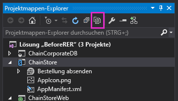

# <a name="programmatically-deploy-a-custom-button-in-the-provider-hosted-add-in"></a>Programmgesteuertes Bereitstellen einer benutzerdefinierten Schaltfläche in anbietergehosteten Add-Ins

Dies ist der neunte einer Reihe von Artikeln über die Grundlagen der Entwicklung von vom Anbieter gehosteten SharePoint-Add-Ins. Machen Sie sich zunächst mit [SharePoint-Add-Ins](sharepoint-add-ins.md) und den vorherigen Artikeln dieser Reihe vertraut, die Sie unter [Erste Schritte beim Erstellen von von einem Anbieter gehosteten SharePoint-Add-Ins](get-started-creating-provider-hosted-sharepoint-add-ins.md#SP15createprovider_nextsteps) finden. 

> [!NOTE]
> Wenn Sie unsere Artikelreihe zum Thema anbietergehostete Add-Ins durchgearbeitet haben, haben Sie bereits eine Visual Studio-Lösung, die Sie für diesen Artikel verwenden können. Alternativ können Sie das Repository unter [SharePoint_Provider-hosted_Add-Ins_Tutorials](https://github.com/OfficeDev/SharePoint_Provider-hosted_Add-ins_Tutorials) herunterladen und die Datei „BeforeProgrammaticButton.sln“ öffnen.

In diesem Artikel erfahren Sie, wie Sie eine benutzerdefinierte Menübandschaltfläche in ein SharePoint-Add-In einfügen können, wenn die Liste, deren Menüband die Schaltfläche abruft, selbst programmgesteuert in dem betreffenden Add-In bereitgestellt wird.

## <a name="re-add-the-custom-button-to-the-project"></a>Erneutes Hinzufügen der benutzerdefinierten Schaltfläche zum Projekt

> [!NOTE]
> Die Einstellungen für Startprojekte in Visual Studio werden in der Regel nach jedem erneuten Öffnen der Lösung wieder auf die Standardwerte zurückgesetzt. Wann immer Sie beim Durcharbeiten dieser Artikelreihe die Beispiellösung erneut öffnen, müssen Sie umgehend die folgenden Schritte durchführen: 
> 1. Klicken Sie oben im **Projektmappen-Explorer** mit der rechten Maustaste auf den Lösungsknoten, und wählen Sie die Option **Startprojekte festlegen** aus.  
> 2. Stellen Sie sicher, dass alle drei Projekte in der Spalte **Aktion** auf **Start** festgelegt sind.

Im vorherigen Artikel haben Sie die benutzerdefinierte Menübandschaltfläche **AddEmployeeToCorpDB** aus dem Projekt entfernt. Gehen Sie nun wie folgt vor, um sie dem Projekt wieder hinzuzufügen:

1. Klicken Sie auf der Symbolleiste oben im **Projektmappen-Explorer** auf die Schaltfläche **Alle Dateien anzeigen**.

   *Abbildung 1: Symbolleiste im Projektmappen-Explorer*

   

2. Klicken Sie im Projekt **ChainStore** mit der rechten Maustaste auf **AddEmployeeToCorpDB**, und wählen Sie die Option **Zu Projekt hinzufügen** aus.

3. Klicken Sie erneut auf die Schaltfläche **Alle Dateien anzeigen**.

4. Erweitern Sie im Projekt **ChainStore** das Element **AddEmployeeToCorpDB**, und öffnen Sie die Datei „elements.xml".

## <a name="understand-a-dilemma-and-its-solution"></a>Ein Problem und seine Lösung

In der Datei „elements.xml" identifiziert das Attribut **RegistrationId** des Elements **CustomAction** die Liste, auf deren Menüband die Schaltfläche hinzugefügt wird: `{$ListId:Lists/Local Employees;}`. Das hat einwandfrei funktioniert, als die Liste bereits manuell zum Hostweb hinzugefügt wurde. Aber jetzt, da die Liste programmgesteuert in der zuerst ausgeführten Logik bereitgestellt wird, ist die Liste nicht vorhanden, wenn SharePoint das Add-In installiert und versucht, die Schaltfläche bereitzustellen. Bei der Installation des Add-Ins wird eine Ausnahme ausgelöst, und es treten Fehler auf.

Eine Bereitstellung der Liste im Installationsereignishandler statt in der zuerst auszuführenden Logik wird das Problem nicht lösen, da SharePoint benutzerdefinierte deskriptiv definierte Komponenten wie die benutzerdefinierte Schaltfläche (und das Add-In-Part **Bestellung aufgeben**) bereitstellt, *bevor* der benutzerdefinierte Handler ausgeführt wird. Die Liste wird also nicht vorhanden sein, wenn SharePoint versucht, die Schaltfläche bereitzustellen.

Eine vollständig programmgesteuerte Erstellung von benutzerdefinierten Schaltflächen ist aus verschiedenen Gründen nicht zweckmäßig. Deren Erörterung würde jedoch den Rahmen dieses Artikels sprengen. Glücklicherweise ist eine solche vollständig programmgesteuerte Erstellung auch nicht erforderlich. Es gibt eine relativ unkomplizierte Methode, benutzerdefinierte Schaltflächen halb-programmgesteuert zu erstellen und einer benutzerdefinierten Liste zuzuweisen. 

Gehen Sie dazu wie folgt vor:

1. Behalten Sie die deskriptiv definierte Schaltfläche im Projekt bei, aber weisen Sie diese dem Menüband von etwas zu, das immer auf SharePoint-Websites vorhanden ist, statt einer Liste,die programmgesteuert mit demselben Add-In bereitgestellt wird. 

2. Fügen Sie in der zuerst auszuführenden Logik (First-Run-Logik) nach dem Code für die programmgesteuerte Erstellung der Liste programmgesteuert eine nicht definierte Schaltfläche zum Menüband der Liste hinzu.

3. Initialisieren Sie die Eigenschaften der neuen Schaltfläche mit den Werten der ursprünglichen Schaltfläche. Jetzt existieren zwei identische Schaltflächen. Die zweite Schaltfläche ist dem Menüband der Liste **Lokale Mitarbeiter** zugewiesen.

4. Löschen Sie die ursprüngliche Schaltfläche programmgesteuert.

## <a name="programmatically-register-the-custom-button"></a>Programmgesteuertes Registrieren der benutzerdefinierten Schaltfläche

Mithilfe der nachfolgenden Anleitung können Sie diese Strategie umsetzen:

1. Erweitern Sie im Projekt **ChainStore** das Element **AddEmployeeToCorpDB**, öffnen Sie die Datei „elements.xml“, und ändern Sie den Wert des Attributs **RegistrationId** des Elements **CustomAction** in „100“. Dies ist die ID eines Listentyps. Auch wenn auf der Website keine Instanzen von Listen dieses Typs vorhanden sind, existiert der *Listentyp* dennoch auf jeder SharePoint-Website. Das Attribut sollte jetzt wie folgt aussehen:
    
    ```XML
      RegistrationId="100"
    ```

2. Fügen Sie in der Datei „SharePointComponentDeployer.cs“ die folgende Zeile zur Methode **DeployChainStoreComponentsToHostWeb** hinzu, direkt unterhalb der Zeile, die `CreateLocalEmployeesList` aufruft (diese Methode erstellen Sie im nächsten Schritt):
    
    ```C#
      ChangeCustomActionRegistration();
    ```

3. Fügen Sie der Klasse `SharePointComponentDeployer` die folgende Methode hinzu: 

    ```C#
      private static void ChangeCustomActionRegistration()
    {
        using (var clientContext = sPContext.CreateUserClientContextForSPHost())
        {
         var query = from action in clientContext.Web.UserCustomActions
                 where action.Name == "{button_GUID} .AddEmployeeToCorpDB"
                 select action;
          IEnumerable<UserCustomAction> matchingActions = clientContext.LoadQuery(query);          
             clientContext.ExecuteQuery();

          UserCustomAction webScopedEmployeeAction = matchingActions.Single();

         // TODO8: Get a reference to the (empty) collection of custom actions 
         // that are registered with the custom list.

         // TODO9: Add a blank custom action to the list's collection.

         // TODO10: Copy property values from the descriptively deployed
         // custom action to the new custom action

        // TODO11: Delete the original custom action.         

          clientContext.ExecuteQuery();
        }
    }
    ```

   Zu diesem Code ist Folgendes anzumerken:
    
   - Da die benutzerdefinierte Aktion (d. h. die benutzerdefinierte Schaltfläche) im Menüband eines *Listentyps* registriert wurde, umfasst ihr Bereich die gesamte Website. Zudem ist die Aktion Teil der Sammlung von benutzerdefinierten Aktionen dieser Website. Der Code ruft sie also aus dieser Sammlung ab.
    
   - Der Wert von `action.Name` wird aus dem Attribut **ID** des Elements **CustomAction** in der Datei „elements.xml“ in **AddEmployeeToCorpDB** abgerufen.
    
   > [!IMPORTANT]
   > **Sie müssen in Ihrem Code als Wert für `action.Name` den Wert aus der Datei „elements.xml“ angeben.** Der Name wird einen anderen GUID-Teil haben. Dabei muss zwischen der GUID und dem Rest des Namens ein Zeichen des Typs `"."` stehen. Unten sehen Sie ein Beispiel für diese Zeile: 
   > 
   > `where action.Name == "4a926a42-3577-4e02-9d06-fef78586b1bc.AddEmployeeToCorpDB"`

4. Ersetzen Sie `TODO8` durch den unten aufgeführten Code. Bedenken Sie dabei, dass beim Zurückziehen eines Add-Ins die von diesem Add-In erstellten Komponenten nicht entfernt werden. Nach der Ausführung der First-Run-Logik wird in der Sammlung **UserCustomActions** der Liste eine benutzerdefinierte Aktion aufgeführt, die nicht zurückgezogen wird, wenn Sie das nächste Mal die Taste F5 drücken. Um Verwirrung vorzubeugen, leert die letzte Zeile in diesem Codebeispiel (`listActions.Clear();`) die Sammlung.

    ```C#
    var queryForList = from list in clientContext.Web.Lists
               where list.Title == "Local Employees"
               select list;
    IEnumerable<List> matchingLists = clientContext.LoadQuery(queryForList);
    clientContext.ExecuteQuery();

    List employeeList = matchingLists.First();
    var listActions = employeeList.UserCustomActions;
    clientContext.Load(listActions);
    listActions.Clear();
    ```

5. Ersetzen Sie `TODO9` durch die nachfolgende Zeile. Sie fügt der Liste **Lokale Mitarbeiter** eine nicht definierte benutzerdefinierte Aktion hinzu.
    
    ```C#
      var listScopedEmployeeAction = listActions.Add();
    ```

6. Ersetzen Sie `TODO10` durch den folgenden Code: 

    ```C#
    listScopedEmployeeAction.Title = webScopedEmployeeAction.Title;
    listScopedEmployeeAction.Location = webScopedEmployeeAction.Location;
    listScopedEmployeeAction.Sequence = webScopedEmployeeAction.Sequence;
    listScopedEmployeeAction.CommandUIExtension = webScopedEmployeeAction.CommandUIExtension;
    listScopedEmployeeAction.Update();
    ```

   Zu diesem Code ist Folgendes anzumerken:
    
   - Er weist die Eigenschaftswerte der Schaltfläche für den Webbereich (die mit beschreibendem Markup bereitgestellt wurde) den entsprechenden Eigenschaften der Schaltfläche für den Listenbereich zu, damit die beiden Schaltflächen außer im Bereich identisch sind.
    
   - Die Eigenschaft **Sequence** legt die relative Reihenfolge für die Anzeige der Schaltfläche in dem Menübereich fest, in dem sie platziert werden soll. In unserem Fall wird die Schaltfläche im Abschnitt **Aktionen** der Menübandregisterkarte **Elemente** platziert. Im deskriptiven Markup war der Wert auf „10001“ gesetzt, also hoch genug, dass die Schaltfläche nach (d. h. rechts von) den standardmäßigen Schaltflächen angezeigt wird, die SharePoint im Bereich **Aktionen** des Menübands platziert.

7. Ersetzen Sie `TODO11` durch die nachfolgend aufgeführte Zeile. Sie löscht die ursprüngliche deskriptiv definierte Schaltfläche. Ohne diese Zeile würde die benutzerdefinierte Schaltfläche auf der Website in jeder Liste angezeigt, die die Listenvorlage „100“ verwendet. Da die Funktionalität der Schaltfläche eng verzahnt ist mit der Liste **Lokale Mitarbeiter**, wäre es nicht sinnvoll, die Schaltfläche in andere Listen zu integrieren. Zudem würde die Schaltfläche ohne diese Zeile *doppelt* in der Liste **Lokale Mitarbeiter** angezeigt, da die Liste die Vorlage „100“ verwendet.
    
    ```C#
      webScopedEmployeeAction.DeleteObject();
    ```
    
8. Insgesamt sollte die Methode jetzt wie unten dargestellt aussehen (mit einer GUID statt des Platzhalters):
    
    ```C#
      private static void ChangeCustomActionRegistration()
    {
        using (var clientContext = SPContext.CreateUserClientContextForSPHost())
        {
         var query = from action in clientContext.Web.UserCustomActions
                 where action.Name == "{button_GUID} .AddEmployeeToCorpDB"
                 select action;
          IEnumerable<UserCustomAction> matchingActions = clientContext.LoadQuery(query);          
             clientContext.ExecuteQuery();

          UserCustomAction webScopedEmployeeAction = matchingActions.Single();

         var queryForList = from list in clientContext.Web.Lists
                    where list.Title == "Local Employees"
                    select list;
         IEnumerable<List> matchingLists = clientContext.LoadQuery(queryForList);
         clientContext.ExecuteQuery();

        List employeeList = matchingLists.First();
        var listActions = employeeList.UserCustomActions;
        clientContext.Load(listActions);
        listActions.Clear();

        var listScopedEmployeeAction = listActions.Add();

        listScopedEmployeeAction.Title = webScopedEmployeeAction.Title;
        listScopedEmployeeAction.Location = webScopedEmployeeAction.Location;
        listScopedEmployeeAction.Sequence = webScopedEmployeeAction.Sequence;
        listScopedEmployeeAction.CommandUIExtension = webScopedEmployeeAction.CommandUIExtension;
        listScopedEmployeeAction.Update();

        webScopedEmployeeAction.DeleteObject();         

        clientContext.ExecuteQuery();
        }
    }
    ```


## <a name="request-full-control-of-the-host-web"></a>Anfordern von Vollzugriff vom Hostweb

Da das Add-In jetzt auf den Bereich „Web“ bezogene benutzerdefinierte Aktionen hinzufügt und löscht, müssen Sie die vom Add-In angeforderten Berechtigungen von „Verwalten“ auf „Vollzugriff“ erweitern:

1. Öffnen Sie im **Projektmappen-Explorer** im Projekt **ChainStore** die Datei „AppManifest.xml“.

2. Öffnen Sie die Registerkarte **Berechtigungen**. Behalten Sie für **Bereich** den Wert **Web** bei, aber wählen Sie im Feld **Berechtigung** aus der Dropdownliste die Option **Vollzugriff** aus.

3. Speichern Sie die Datei.

## <a name="run-the-add-in-and-test-the-button-deployment"></a>Ausführen des Add-Ins und Testen der Schaltflächenbereitstellung

1. Öffnen Sie die Seite **Websiteinhalte** der Website des Hongkong-Stores, und entfernen Sie die Liste **Lokale Mitarbeiter**. 
    
   > [!NOTE]
   > Wenn Sie ein Add-In in Visual Studio zurückziehen, werden die von dem betreffenden Add-In erstellten Listen nicht entfernt. Sie müssen die Liste also jedes Mal manuell löschen, wenn Sie den Code testen, der sie erstellt.

2. Drücken Sie die Taste F5, um das Add-In bereitzustellen und auszuführen. Visual Studio hostet die Remotewebanwendung in IIS Express und die SQL-Datenbank in SQL Express. Zudem installiert Visual Studio das Add-In vorübergehend auf Ihrer SharePoint-Testwebsite und führt es sofort aus. Bevor die Startseite des Add-Ins geöffnet wird, werden Sie aufgefordert, dem Add-In Berechtigungen zu erteilen.

3. Wenn die Add-In-Startseite geöffnet wird, wählen Sie den Link **Zurück zur Website** auf dem Chromesteuerelement im oberen Bereich aus.

4. Wechseln Sie auf die Seite **Websiteinhalte**. Die Liste **Lokale Mitarbeiter** wird angezeigt, da sie von der First-Run-Logik hinzugefügt wurde.
    
   > [!NOTE]
   > Falls die Liste nicht angezeigt wird oder Sie Grund zu der Annahme haben, dass die First-Run-Logik nicht ausgeführt wird, kann das daran liegen, wird möglicherweise die Tabelle **Mandanten** beim Drücken von F5 nicht in den leeren Zustand zurückgesetzt. Die häufigste Ursache hierfür: Das Projekt **ChainCorporateDB** ist in Visual Studio nicht mehr als Startprojekt gekennzeichnet. Eine Lösung für dieses Problem finden Sie in dem [Hinweis oben in diesem Artikel](#re-add-the-custom-button-to-the-project). Vergewissern Sie sich außerdem, dass die Datenbank so konfiguriert ist, dass sie neu erstellt wird (siehe [Konfigurieren von Visual Studio zum Neuerstellen der Unternehmensdatenbank in jeder Debugsitzung](give-your-provider-hosted-add-in-the-sharepoint-look-and-feel.md#Rebuild)).

5. Öffnen Sie die Liste, und fügen Sie ein Element hinzu.

6. Wählen Sie das Element in der Listenansicht aus, und wechseln Sie auf dem Menüband auf die Registerkarte **Element**. 

7. Klicken Sie auf der Registerkarte **Element** auf die Schaltfläche **Zur Unternehmensdatenbank hinzufügen**. Der Mitarbeiter wird der Unternehmensdatenbank hinzugefügt, und das Feld **Zur Unternehmensdatenbank hinzugefügt** wird in **Ja** geändert.

8. Wechseln Sie wieder auf die Seite **Websiteinhalte**, und klicken Sie dort auf **Add-In hinzufügen**.

9. Fügen Sie eine neue **benutzerdefinierte Liste** hinzu. Als Typ wird standardmäßig „Generic“ festgelegt (d. h. der Listentyp „100“). Öffnen Sie nach der Erstellung der Liste auf dem Menüband die Registerkarte **Element**. Wie Sie sehen, wird die Schaltfläche **Zur Unternehmensdatenbank hinzufügen** zu diesem Zeitpunkt *nicht* auf dem Menüband angezeigt. Das liegt daran, dass Ihr Code die Schaltfläche mit dem Bezugsbereich „Web“ gelöscht hat.

10. Schließen Sie zum Beenden der Debugsitzung das Browserfenster, oder beenden Sie das Debuggen in Visual Studio. Wann immer Sie F5 drücken, zieht Visual Studio die bisherige Version des Add-Ins zurück und installiert die jeweils neueste Version.

11. Da Sie mit diesem Add-In und dieser Visual Studio-Lösung auch in anderen Artikeln arbeiten werden, empfiehlt es sich, das Add-In ein letztes Mal zurückzuziehen, sobald Sie eine Weile nicht mehr an ihm arbeiten werden. Klicken Sie im **Projektmappen-Explorer** mit der rechten Maustaste auf das Projekt, und wählen Sie die Option **Zurückziehen** aus.

## <a name="next-steps"></a>Nächste Schritte
<a name="Nextsteps"> </a>

Listenereignisse und Listenelementereignisse können in SharePoint ebenfalls von benutzerdefinierten Handlern verarbeitet werden. Wie Sie einen solchen Handler erstellen und in der First-Run-Logik bereitstellen, erfahren Sie im Artikel [Handle list item events in the provider-hosted add-in](handle-list-item-events-in-the-provider-hosted-add-in.md).
 

 

