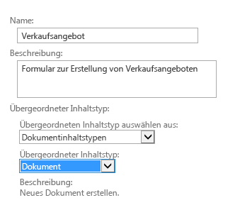
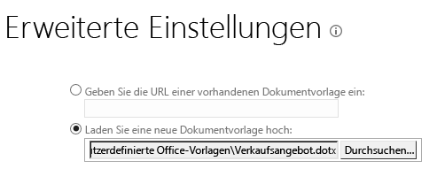

# Angeben einer Vorlage für eine Dokumentbibliothek in einem Cloud-Business-Add-In
Zusätzlich zu den Office-Vorlagen, die beim Hinzufügen eines Dokuments zu einer SharePoint-Dokumentbibliothek verfügbar sind, können Sie auch Ihre eigenen Vorlagen verwenden. Sie haben möglicherweise Ihre eigene Verkaufsangebotsvorlage, die Sie verwenden möchten, wenn neue Aufträge hinzugefügt werden.
 

 **Hinweis** Der Name „Apps für SharePoint“ wird in „SharePoint-Add-Ins“ geändert. Während des Übergangszeitraums wird in der Dokumentation und der Benutzeroberfläche einiger SharePoint-Produkte und Visual Studio-Tools möglicherweise weiterhin der Begriff „Apps für SharePoint“ verwendet. Weitere Informationen finden Sie unter [Neuer Name für Office- und SharePoint-Apps](new-name-for-apps-for-sharepoint.md#bk_newname).
 

## 

Wenn Sie dies noch nicht getan haben, ordnen Sie Ihrem Cloud-Business-Add-In eine Dokumentbibliothek hinzu. Weitere Informationen finden Sie unter [Zuordnen einer Dokumentbibliothek zu einer Entität](associate-a-document-library-with-an-entity.md).
 

 

### So fügen Sie eine Vorlage hinzu

1. Wechseln Sie zu Ihrer SharePoint-Entwicklerwebsite, und klicken Sie anschließend auf der Seite **Entwickler** auf **Websiteinhalte**.
    
 
2. Klicken Sie auf der Seite **Websiteinhalte** auf **Einstellungen**, wie in Abbildung 1 dargestellt.
    
    **Abbildung 1. Der Link „Einstellungen“**

 

  
 

 

 
3. Klicken Sie auf der Seite **Websiteeinstellungen** in der Liste **Web-Designer-Kataloge** auf **Websiteinhaltstypen**, wie in Abbildung 2 dargestellt.
    
    **Abbildung 2. Der Link „Websiteinhaltstypen“**

 

  
 

 

 
4. Klicken Sie auf der Seite **Websiteinhaltstypen** auf **Erstellen**, wie in Abbildung 3 dargestellt.
    
    **Abbildung 3. Der Link „Erstellen“**

 

  
 

 

 
5. Geben Sie auf der Seite **Neuer Websiteinhaltstyp** einen Namen und eine Beschreibung für Ihre Vorlage ein. Wählen Sie bei **Übergeordneter Inhaltstyp** **Dokumentinhaltstyp** und **Dokument** aus, wie in Abbildung 4 dargestellt.
    
    **Abbilgung 4. Auswahloptionen für „Übergeordneter Inhaltstyp“**

 

  
 

 

 
6. Klicken Sie im Abschnitt **Gruppe** in der Liste **Vorhandene Gruppe** auf **Dokumentinhaltstypen**, wie in Abbildung 5 dargestellt, und anschließend auf **OK**.
    
    **Abbildung 5. Gruppeneinstellung**

 

  
 

 

 
7. Klicken Sie auf der Seite **Websiteinhaltstyp** auf **Erweiterte Einstellungen**.
    
 
8. Geben Sie auf der Seite **Erweiterte Einstellungen** entweder die URL einer vorhandenen Dokumentvorlage ein oder laden Sie eine neue Dokumentvorlage hoch, wie in Abbildung 6 dargestellt, und klicken Sie anschließend auf **OK**.
    
    **Abbildung 6. Angeben der Dokumentvorlage**

 

  
 

 

 
9. Wechseln Sie zur Seite **Websiteinhalte**, klicken Sie auf Ihre Dokumentbibliothek, und wechseln Sie dann auf die Seite **Einstellungen**.
    
 
10. Klicken Sie auf der Seite **Einstellungen** auf **Aus vorhandenen Websiteinhaltstypen hinzufügen**.
    
 
11. Fügen Sie Ihre Vorlage auf der Seite **Inhaltstypen hinzufügen** wie in Abbildung 7 dargestellt hinzu, und klicken Sie anschließend auf **OK**.
    
    **Abbildung 7. Hinzufügen der Vorlage**

 

  
 

 

 
12. Führen Sie Ihr Add-In aus, und fügen Sie ein Dokument hinzu. Ihre Vorlage sollte im Dialogfeld **Neue Datei erstellen** angezeigt werden, wie in Abbildung 8 dargestellt.
    
    **Abbildung 8. Das Dialogfeld „Neue Datei erstellen“ mit der neuen Vorlage**

 

  
 

 

 

## Zusätzliche Ressourcen

-  [Entwickeln von Cloud-Business-Add-Ins](develop-cloud-business-add-ins.md)
    
 
-  [Zuordnen einer Dokumentbibliothek zu einer Entität](associate-a-document-library-with-an-entity.md)
    
 

