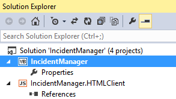

# Veröffentlichen eines Cloud-Business-Add-Ins in SharePointPublish a cloud business add-in to SharePoint
Sie können Ihr Cloud-Geschäfts-Add-In als vom Anbieter gehostetes SharePoint-Add-In veröffentlichen. Mit einem vom Anbieter gehosteten Add-In sind Sie hinsichtlich der Bereitstellung Ihrer Web App und Datenbank flexibel. Sie können sie lokal auf einer SharePoint-Website, in Windows Azure oder auf einer Hosting-Website eines Drittanbieters bereitstellen. Nachdem Sie Ihr Add-In veröffentlicht haben, können die Benutzer das Add-In auf ihren Computern und mobilen Geräten aus SharePoint starten.You can publish your cloud business add-in as a provider-hosted SharePoint add-in. A provider-hosted add-in gives you the flexibility of deploying your web app and database to an on-premise SharePoint site, to Microsoft Azure, or to a third-party hosting site. After you publish your add-in, others can run it from SharePoint on their computers and mobile devices.
 
Sie können Ihr Add-In mit WebDeploy direkt auf einer Website veröffentlichen oder ein Paket für Ihr Add-In erstellen, das auf mehreren Servern bereitgestellt werden kann.You can publish your add-in directly to a site using WebDeploy, or you can create a package for your add-in that can be deployed to multiple servers.
 

 **Hinweis** Der Name „Apps für SharePoint“ wird in „SharePoint-Add-Ins“ geändert. Während des Übergangszeitraums wird in der Dokumentation und der Benutzeroberfläche einiger SharePoint-Produkte und Visual Studio-Tools möglicherweise weiterhin der Begriff „Apps für SharePoint“ verwendet. Weitere Informationen finden Sie unter [Neuer Name für Office- und SharePoint-Apps](new-name-for-apps-for-sharepoint#bk_newname).The name "apps for SharePoint" is changing to "SharePoint Add-ins". During the transition, the documentation and the UI of some SharePoint products and Visual Studio tools might still use the term "apps for SharePoint". For details, see [New name for apps for Office and SharePoint](new-name-for-apps-for-sharepoint#bk_newname).
 

## So veröffentlichen Sie ein Add-InTo publish an add-in

1. Öffnen Sie im **Projektmappen-Explorer** das Kontextmenü des Anwendungsknotens auf der obersten Ebene wie in Abbildung 1 dargestellt, und klicken Sie dann auf **Veröffentlichen**.In **Solution Explorer**, open the shortcut menu for the top-level application node as shown in Figure 1, and then choose **Publish**.
    
    **Abbildung 1. Der Knoten auf oberster Ebene****Figure 1. The top-level node**

 

  
 

 

 
2. Klicken Sie im Assistenten zum Veröffentlichen von LightSwitch-Anwendungen auf der Seite **SharePoint-Optionen** auf das Optionsfeld **Von Anbieter gehostet** und dann auf **Weiter**.In the LightSwitch Publish Application Wizard, on the **SharePoint Options** page, choose the **Provider-hosted** option button, and then choose **Next**.
    
 
3. Klicken Sie auf der Seite **Anwendungsserverkonfiguration** auf das Optionsfeld **IIS-Server** und dann auf **Weiter**.On the **Application Server Configuration** page, choose the **IIS Server** option button, and then choose **Next**.
    
     **Hinweis** Wenn Sie über eine Datei mit Veröffentlichungseinstellungen (.publishsettings oder .pubxml) verfügen, die für ein anderes Add-In erstellt wurde, können Sie diese Datei verwenden, um die restlichen zum Veröffentlichen erforderlichen Informationen bereitzustellen. Wenn dies der Fall ist, klicken Sie im Assistenten auf die Schaltfläche **Einstellungen importieren**.**Note** If you have a publish settings (.publishsettings or .pubxml) file that was created for another add-in, you can use that file to provide the rest of the information that you need for publishing. If so, choose the **Import Settings** button in the wizard.
4. Klicken Sie auf der Seite **Ausgabe veröffentlichen** auf das Optionsfeld **Jetzt direkt auf einem Server veröffentlichen**, und klicken Sie dann auf **Weiter**.On the **Publish Output** page, choose the **Publish directly to a server now** option button, and then choose **Next**.
    
 
5. Geben Sie auf der Seite **Veröffentlichungseinstellungen** in das Textfeld **Dienst-URL** die URL des Servers ein, auf dem Sie Ihr Add-In veröffentlichen möchten.On the **Publish Settings** page, in the **Service URL** text box, enter the URL for the server where you want to publish your add-in.
    
    Wenn Sie an ein Hostingunternehmen veröffentlichen, wird dieser Wert vom Unternehmen bereitgestellt. Er kann in jedem der folgenden Formate vorliegen:If you're publishing to a hosting company, the company provides this value. It can be in any of the following formats:
    
      -  _HostingCompanyURL_ (z. B. `contoso.com`)_HostingCompanyURL_ (for example, `contoso.com`)
    
 
  -  `https://` _HostingCompanyURL_ (z. B. `https://contoso.com`)`https://` _HostingCompanyURL_ (for example, `https://contoso.com`)
    
 
  -  `https://` _HostingCompanyURL_ `:8172/msdeploy.axd` (z. B. `https://contoso.com:8172/msdeploy.axd`)`https://` _HostingCompanyURL_ `:8172/msdeploy.axd` (for example, `https://contoso.com:8172/msdeploy.axd`)
    
 

    Wenn Sie zu Testzwecken an Internetinformationsdienste (IIS) auf Ihrem eigenen Computer veröffentlichen, geben Sie `localhost` oder den Namen Ihres Computers ein.If you're publishing to Internet Information Services (IIS) on your own computer for testing, enter  `localhost` or the name of your computer.
    
    Wenn Sie an einen Server in Ihrem eigenen Netzwerk veröffentlichen, geben Sie eine der folgenden URLs ein:If you're publishing to a server on your own network, enter one of these URLs:
    
      -  `http://` _ServerName_`http://` _servername_
    
 
  -  `http://` _ServerName_ `/msdeployagentservice``http://` _servername_ `/msdeployagentservice`
    
 

     **Hinweis** Wenn Sie durch eine Firewall hindurch veröffentlichen, müssen Sie möglicherweise Port 8172 öffnen.**Note** If you're publishing through a firewall, you might have to open port 8172.
6. Geben Sie im Textfeld **Website/Anwendung** den Namen der IIS-Website und den Ihres Add-Ins ein.In the **Site/application** text box, enter the names of the IIS website and your add-in.
    
    Wenn Sie Ihr Add-In bei einem Hosting-Unternehmen veröffentlichen, stellt das Unternehmen diesen Wert bereit. In der Regel ist das ein Domänenname (z. B.  `contoso.com`) oder ein Domänenname und ein Add-In-Name (z. B.  `contoso.com/MyApp`).If you're publishing to a hosting company, the company provides this value. It's typically either a domain name (for example,  `contoso.com`) or a domain and add-in name (for example,  `contoso.com/MyApp`).
    
    Wenn Sie Ihr Add-In zu Testzwecken in IIS auf Ihrem Computer oder auf einem Server in Ihrem internen Netzwerk veröffentlichen, geben Sie den Namen der Website und des Add-Ins so ein, wie sie im IIS-Manager angezeigt werden. Wenn Sie das Add-In "MyApp" auf der Standardwebsite in IIS veröffentlichen, geben Sie Standwardwebsite/MyApp ein.If you're publishing to IIS on your own computer for testing, or you're publishing to a server on your internal network, enter the site and add-in name as they appear in IIS Manager. For example, if you're publishing the add-in MyApp to the default website in IIS, enter Default Web Site/MyApp.
    
     **Hinweis** Wenn Sie in einem vorhandenen Webordner veröffentlichen und vorhandene Inhalte entfernen möchten, müssen Sie das Kontrollkästchen **Zusätzliche Dateien auf dem Ziel entfernen** aktivieren.**Note** If you're publishing to an existing web folder and want to remove any existing content, select the **Remove additional files at destination** check box.
7. Geben Sie in den Textfeldern **Benutzername** und **Kennwort** die Anmeldeinformationen eines Kontos ein, das über ausreichende Bereichtigungen verfügt, um Bereitstellungsaufgaben auf dem Zielwebserver auszuführen, und klicken Sie dann auf **Weiter**.In the **User Name** and **Password** text boxes, enter credentials for an account that has sufficient authority to perform deployment tasks on the destination web server, and then choose **Next**.
    
    Wenn Sie an ein Hostingunternehmen veröffentlichen, werden diese Werte vom Unternehmen bereitgestelltIf you're publishing to a hosting company, the company provides these values.
    
 
8. Klicken Sie auf der Seite **Sicherheitseinstellungen** auf das Optionsfeld **Ja, Benutzer müssen eine Verbindung mithilfe von HTTPS herstellen** und dann auf **Weiter**.On the **Security Settings** page, choose the **Yes, users must connect using HTTPS** option button, and then choose **Next**.
    
 
9. Geben Sie auf der Seite **Datenverbindungen** auf der Registerkarte **Datenbankverbindungen** die Administrator- und Benutzerverbindungszeichenfolgen des Datenbankservers ein, auf dem Sie die Datenbank Ihres Add-Ins veröffentlichen möchten.On the **Data connections** page, on the **Database Connections** tab, enter the administrator and user connection strings for the database server where you want to publish your add-in's database.
    
     **Hinweis** Die Datenbank muss nicht auf dem Server gespeichert sein, auf dem Sie das Add-In veröffentlichen.**Note** The database doesn't have to be located on the server where you are publishing the add-in.
10. Aktualisieren Sie bei Bedarf auf der Registerkarte **Angefügte Datenquellen** die Verbindungszeichenfolgen von zusätzlichen Verbindungen, und klicken Sie dann auf **Weiter**.On the **Attached Data Sources** tab, update the connection strings for any additional connections as needed, and then choose **Next**.
    
 
11. Geben Sie auf der Seite **Anbieter-Hosting** im Textfeld **Wo wird Ihre LightSwitch-Anwendung gehostet** die vollständige URL Ihres Add-Ins ein.On the **Provider Hosting** page, in the **Where is your LightSwitch application hosted** text box, enter the full URL for your add-in.
    
    In den meisten Fällen stimmt diese URL mit den von Ihnen zuvor eingegebenen Werten unter **Dienst-URL** und **Website/Anwendung** überein (z. B. `https://contoso.com/MyApplication`).In most cases this URL will be the same as the **Service URL** and **Site/application** values that you entered earlier (for example `https://contoso.com/MyApplication`).
    
 
12. Geben Sie die Werte **Client-ID** und **Clientgeheimnis** für Ihr Add-In ein.Enter the **Client ID** and **Client Secret** values for your add-in.
    
    Sie können diese Werte von der Seite **appregnew** Ihrer SharePoint-Website oder aus dem Verkäuferdashboard abrufen. Weitere Informationen dazu finden Sie unter [Richtlinien für das Registrieren von SharePoint-Add-Ins 2013](http://msdn.microsoft.com/en-us/library/office/jj687469%28v=office.15%29.aspx).You can get these values from the **appregnew** page of your SharePoint site or from the Seller dashboard. See [Guidelines for registering SharePoint Add-ins 2013](http://msdn.microsoft.com/en-us/library/office/jj687469%28v=office.15%29.aspx).
    
 
13. Klicken Sie auf **Veröffentlichen**, um Ihr Add-In zu veröffentlichen.Choose **Publish** to publish your add-in.
    
    Nachdem Ihr Add-In veröffentlicht wurde, wird der **Datei-Explorer** geöffnet. Er zeigt das Verzeichnis **Veröffentlichen** Ihres Projekts an.When your add-in is published, **File Explorer** opens and displays the **Publish** directory for your project.
    
 

## So packen Sie ein Add-InTo package an add-in

1. Öffnen Sie im **Projektmappen-Explorer** das Kontextmenü des Anwendungsknotens auf der obersten Ebene wie in Abbildung 1 dargestellt, und klicken Sie dann auf **Veröffentlichen**.In **Solution Explorer**, open the shortcut menu for the top-level application node as shown in Figure 1, and then choose **Publish**.
    
    **Abbildung 1. Der Knoten auf oberster Ebene****Figure 1. The top-level node**

 

  
 

    
    
 
2. Klicken Sie im Assistenten zum Veröffentlichen von LightSwitch-Anwendungen auf der Seite **SharePoint-Optionen** auf das Optionsfeld **Von Anbieter gehostet** und dann auf **Weiter**.In the LightSwitch Publish Application Wizard, on the **SharePoint Options** page, choose the **Provider-hosted** option button, and then choose **Next**.
    
 
3. Klicken Sie auf der Seite **Anwendungsserverkonfiguration** auf das Optionsfeld **IIS-Server** und dann auf **Weiter**.On the **Application Server Configuration** page, choose the **IIS Server** option button, and then choose **Next**.
    
     **Hinweis** Wenn Sie über eine Datei mit Veröffentlichungseinstellungen (.publishsettings oder .pubxml) verfügen, die für ein anderes Add-In erstellt wurde, können Sie diese Datei verwenden, um die restlichen zum Veröffentlichen erforderlichen Informationen bereitzustellen. Wenn dies der Fall ist, klicken Sie im Assistenten auf die Schaltfläche **Einstellungen importieren**.**Note** If you have a publish settings (.publishsettings or .pubxml) file that was created for another add-in, you can use that file to provide the rest of the information that you need for publishing. If so, choose the **Import Settings** button in the wizard.
4. Klicken Sie auf der Seite **Ausgabe veröffentlichen** auf das Optionsfeld **Paket auf Datenträger erstellen** und dann auf **Weiter**.On the **Publish Output** page, choose the **Create a package on disk** option button, and then choose **Next**.
    
 
5. Geben Sie auf der Seite **Veröffentlichungseinstellungen** im Textfeld **Wie soll der Name der Website lauten?** den Namen für Ihre Website ein.On the **Publish Settings** page, in the **What should the website be named?** text box, enter a name for the website.
    
    Der Standardname ist der Name des Add-Ins.The default name is the add-in name.
    
 
6. Geben Sie im Textfeld **Wo soll das Paket erstellt werden?** den Pfad des Speicherorts ein, an dem die Ausgabe veröffentlicht werden soll, und klicken Sie dann auf **Weiter**.In the **Where should the package be created?** text box, enter the path for the location where you want the output to be published, and then choose **Next**.
    
    Der Standardspeicherort ist das Unterverzeichnis „Veröffentlichen“ Ihres Projektordners.The default location is the Publish subdirectory under your project directory.
    
 
7. Klicken Sie auf der Seite **Sicherheitseinstellungen** auf das Optionsfeld **Ja, Benutzer müssen eine Verbindung mithilfe von HTTPS herstellen** und dann auf **Weiter**.On the **Security Settings** page, choose the **Yes, users must connect using HTTPS** option button, and then choose **Next**.
    
 
8. Klicken Sie auf der Seite **Datenbankkonfiguration** auf das Optionsfeld **Neue Datenbank mit folgendem Namen erstellen**, und geben Sie den Namen Ihres Add-Ins als Datenbanknamen ein.On the **Database Configuration** page, choose the **Generate a new database called** option button and enter your add-in's name as the database name.
    
 
9. Klicken Sie auf die Registerkarte **Angefügte Datenquellen**, aktualisieren Sie bei Bedarf die Verbindungszeichenfolgen von zusätzlichen Verbindungen, und klicken Sie dann auf **Weiter**.Choose the **Attached Data Sources** tab and update the connection strings for any additional connections as needed, and then choose **Next**.
    
 
10. Geben Sie auf der Seite **Anbieter-Hosting** im Textfeld **Wo wird Ihre LightSwitch-Anwendung gehostet** die vollständige URL Ihres Add-Ins ein.On the **Provider Hosting** page, in the **Where is your LightSwitch application hosted** text box, enter the full URL for your add-in.
    
    In den meisten Fällen stimmt diese URL mit den von Ihnen zuvor eingegebenen Werten unter **Dienst-URL** und **Website/Anwendung** überein (z. B. `https://contoso.com/MyApplication`).In most cases this URL will be the same as the **Service URL** and **Site/application** values that you entered earlier (for example `https://contoso.com/MyApplication`).
    
 
11. Geben Sie die Werte **Client-ID** und **Clientgeheimnis** für Ihr Add-In ein.Enter the **Client ID** and **Client Secret** for your add-in.
    
    Sie können diese Werte von der Seite **appregnew** Ihrer SharePoint-Website oder aus dem Verkäuferdashboard abrufen. Weitere Informationen dazu finden Sie unter [Richtlinien für das Registrieren von SharePoint-Add-Ins 2013](http://msdn.microsoft.com/en-us/library/office/jj687469%28v=office.15%29.aspx).You can get these values from the **appregnew** page of your SharePoint site or from the Seller dashboard. See [Guidelines for registering SharePoint Add-ins 2013](http://msdn.microsoft.com/en-us/library/office/jj687469%28v=office.15%29.aspx).
    
 
12. Klicken Sie auf **Veröffentlichen**, um Ihr Add-In zu veröffentlichen.Choose **Publish** to publish your add-in.
    
    Nachdem Ihr Add-In veröffentlicht wurde, wird eine ZIP-Datei, die das Paket enthält, in das Verzeichnis kopiert, das Sie in Schritt 4 angegeben haben. Nachdem dieses Paket erstellt wurde, kann ein Administrator das MSDeploy-Tool verwenden, um Ihr Add-In auf Servern bereitzustellen, die IIS und SQL Server ausführen.When your add-in is published, a .zip file that contains the package is placed in the directory that you specified in step 4. After this package has been created, a server administrator can use the MSDeploy tool to deploy your add-in to servers that are running IIS and SQL Server.
    
 

## Zusätzliche RessourcenAdditional resources

-  [Registrieren von SharePoint-Add-Ins 2013Register SharePoint Add-ins 2013](register-sharepoint-add-ins-2013)
    
 
-  [Veröffentlichen von Cloud-Business-Add-InsPublish cloud business add-ins](publish-cloud-business-add-ins)
    
 

