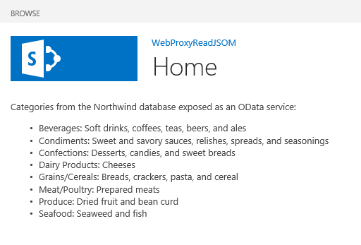

# <a name="query-a-remote-service-using-the-web-proxy-in-sharepoint"></a>Abfragen eines Remotediensts mithilfe des Webproxys in SharePoint
In diesem Artikel erfahren Sie, wie von einer in SharePoint gehosteten Seite mithilfe des Webproxys auf Daten in einer Remotedomäne zugegriffen wird.
 

 **Hinweis** Der Name „Apps für SharePoint“ wird in „SharePoint-Add-Ins“ geändert. Während des Übergangszeitraums wird in der Dokumentation und der Benutzeroberfläche einiger SharePoint-Produkte und Visual Studio-Tools möglicherweise weiterhin der Begriff „Apps für SharePoint“ verwendet. Weitere Informationen finden Sie unter [Neuer Name für Office- und SharePoint-Apps](new-name-for-apps-for-sharepoint#bk_newname).
 

Beim Erstellen von SharePoint-Add-Ins müssen Sie in der Regel Daten aus verschiedenen Quellen einbinden. Aus Sicherheitsgründen gibt es Blockierungsmechanismen, die eine domänenübergreifende Kommunikation verhindern. Wenn Sie den Webproxy verwenden, kann von den Webseiten in Ihrer App auf Daten in Ihrer Remotedomäne und in der SharePoint-Domäne zugegriffen werden.
 

Als Entwickler können Sie den Webproxy verwenden, der in Client-APIs wie den JavaScript- und .NET-Clientobjektmodellen verfügbar gemacht wird. Wenn Sie den Webproxy verwenden, senden Sie die ursprüngliche Anforderung an SharePoint. SharePoint fordert die Daten wiederum am angegebenen Endpunkt an und gibt die Antwort zurück an die Seite. Verwenden Sie den Webproxy, wenn die Kommunikation auf der Serverebene stattfinden soll. Weitere Informationen finden Sie unter [Sicherer Datenzugriff und Clientobjektmodelle für SharePoint Add-Ins](secure-data-access-and-client-object-models-for-sharepoint-add-ins).
 


**SharePoint-Webproxy als Vermittler zwischen Ihrem Code und der externen Datenquelle**

 

 

 

 

 

## <a name="prerequisites-for-using-the-examples-in-this-article"></a>Voraussetzungen für die Verwendung der Beispiele in diesem Artikel
<a name="SP15Queryremoteservice_Prereq"> </a>

Um die Schritte in diesem Beispiel auszuführen, benötigen Sie Folgendes:
 

 

-  [Visual Studio 2015 und die neuesten Microsoft Office Developer Tools ](https://www.visualstudio.com/features/office-tools-vs.aspx)
    
 
- Eine SharePoint-Entwicklungsumgebung (Add-In-Isolierung für lokale Szenarios erforderlich)
    
 

### <a name="core-concepts-to-know-before-using-the-web-proxy"></a>Kernkonzepte für die Verwendung des Webproxys

In der folgenden Tabelle werden einige wichtige Artikel aufgelistet, in denen die relevanten Konzepte für ein domänenübergreifendes Szenario für SharePoint-Add-Ins erläutert werden.
 

 

**Tabelle 1. Kernkonzepte für den Webproxy**


|**Titel des Artikels**|**Beschreibung**|
|:-----|:-----|
| [SharePoint-Add-Ins](sharepoint-add-ins)|Hier finden Sie Informationen über das neue Add-In-Modell in SharePoint, das es Ihnen ermöglicht, Add-Ins als kompakte, einfach zu verwendende Lösungen für Endbenutzer zu erstellen.|
| [Sicherer Datenzugriff und Clientobjektmodelle für SharePoint-Add-Ins](secure-data-access-and-client-object-models-for-sharepoint-add-ins)|Erfahren Sie mehr über Datenzugriffsoptionen in SharePoint-Add-Ins. In diesem Artikel finden Sie Anleitungen zu den allgemeinen Entscheidungen, die Sie beim Arbeiten mit Daten in Ihrer App treffen müssen.|
| [Hostwebs, Add-In-Webs und SharePoint-Komponenten in SharePoint](host-webs-add-in-webs-and-sharepoint-components-in-sharepoint-2013)|In diesem Artikel erfahren Sie, welche Unterschiede zwischen Hostwebsites und Add-In-Websites bestehen. Sie erfahren zudem, welche SharePoint-Komponenten in eine SharePoint-Add-In aufgenommen werden können, welche Komponenten für die Hostwebsite und welche für die Add-In-Website bereitgestellt werden und wie die Add-In-Website in einer isolierten Domäne bereitgestellt wird.|
| [Clientseitige domänenübergreifende Sicherheit](http://msdn.microsoft.com/en-us/library/cc709423%28v=vs.85%29.aspx)|Machen Sie sich mit domänenübergreifende Bedrohungen und Anwendungsfällen sowie Sicherheitsprinzipien für ursprungsübergreifende Anforderungen vertraut, und wägen Sie die Risiken ab, die Entwickler eingehen, wenn sie den domänenübergreifenden Zugriff von im Browser ausgeführten Webanwendungen erweitern.|

## <a name="code-example-access-data-in-a-remote-service-using-the-web-proxy"></a>Codebeispiel: Zugreifen auf Daten in einem Remotedienst mithilfe des Webproxys
<a name="SP15Queryremoteservice_Codeexample"> </a>

Führen Sie die folgenden Schritte aus, um Daten von einem Remotedienst zu lesen: 
 

 

1. Erstellen Sie ein SharePoint-Add-In-Projekt.
    
 
2. Ändern Sie die Seite **Default.aspx**, um den Webproxy zum Abfragen des Remotediensts zu verwenden.
    
 
3. Ändern Sie das App-Manifest so, dass die Kommunikation mit der Remotedomäne zugelassen wird.
    
 
In Abbildung 1 ist das Browserfenster mit Daten vom Remotedienst auf einer SharePoint-Webseite dargestellt.
 

 

**Abbildung 1. SharePoint-Webseite mit Daten vom Remotedienst**

 

 

 

### <a name="to-create-the-sharepoint-add-in-project"></a>So erstellen Sie das App für SharePoint-Projekt


1. Öffnen Sie 2015 als Administrator. (Klicken Sie hierzu im Menü **Start** mit der rechten Maustaste auf das Symbol 2015, und wählen Sie **Als Administrator ausführen** aus.)
    
 
2. Erstellen Sie ein neues Projekt unter Verwendung der Vorlage **SharePoint-Add-In**.
    
    Abbildung 2 zeigt den Speicherort der Vorlage **SharePoint-Add-In** in 2015 unter **Vorlagen**, **Visual C#**, **Office/SharePoint**, **Office-Add-Ins**.
    

    **Abbildung 2. Visual Studio-Vorlage für SharePoint-Add-Ins**

 

  
 

 

 
3. Geben Sie die URL der SharePoint-Website an, die Sie für das Debugging verwenden möchten.
    
 
4. Wählen Sie **Von SharePoint gehostet** als Hostingoption für Ihr Add-In aus.
    
 

### <a name="to-modify-the-defaultaspx-page-to-use-the-web-proxy-by-using-the-javascript-object-model"></a>So ändern Sie die Seite „Default.aspx“ für die Verwendung des Webproxys mithilfe des JavaScript-Objektmodells


1. Doppelklicken Sie im Ordner **Seiten** auf die Datei **Default.aspx**.
    
 
2. Kopieren Sie das folgende Markup, und fügen Sie es in das **PlaceHolderMain**-Inhaltstag der Seite ein. Das Markup führt die folgenden Aufgaben aus:
    
      - Bereitstellen eines Platzhalters für die Remotedaten.
    
 
  - Verweisen auf die SharePoint-JavaScript-Dateien.
    
 
  - Vorbereiten der Anforderung mit einem **WebRequestInfo**-Objekt.
    
 
  - Vorbereiten der **Accept**-Kopfzeile der Anforderung für das Angeben der Antwort im JavaScript Object Notation (JSON)-Format.
    
 
  - Ausgeben eines Aufrufs des Remoteendpunkts.
    
 
  - Behandeln des erfolgreichen Abschlusses durch Rendern der Remotedaten auf der SharePoint-Webseite.
    
 
  - Behandeln eventuell auftretender Fehler durch Rendern der Fehlermeldung auf der SharePoint-Webseite.
    
 

```
  Categories from the Northwind database exposed as an OData service: 
    
<!-- Placeholder for the remote content -->
<span id="categories"></span>

<!-- Add references to the JavaScript libraries. -->
<script 
    type="text/javascript" 
    src="../_layouts/15/SP.Runtime.js">
</script>
<script 
    type="text/javascript" 
    src="../_layouts/15/SP.js">
</script>
<script type="text/javascript">
(function () {
    "use strict";

    // Prepare the request to an OData source
    // using the GET verb.
    var context = SP.ClientContext.get_current();
    var request = new SP.WebRequestInfo();
    request.set_url(
        "http://services.odata.org/Northwind/Northwind.svc/Categories"
        );
    request.set_method("GET");

    // We need the response formatted as JSON.
    request.set_headers({ "Accept": "application/json;odata=verbose" });
    var response = SP.WebProxy.invoke(context, request);

    // Let users know that there is some
    // processing going on.
    document.getElementById("categories").innerHTML =
                "<P>Loading categories...</P>";

    // Set the event handlers and invoke the request.
    context.executeQueryAsync(successHandler, errorHandler);

    // Event handler for the success event.
    // Get the totalResults node in the response.
    // Render the value in the placeholder.
    function successHandler() {

        // Check for status code == 200
        // Some other status codes, such as 302 redirect
        // do not trigger the errorHandler. 
        if (response.get_statusCode() == 200) {
            var categories;
            var output;

            // Load the OData source from the response.
            categories = JSON.parse(response.get_body());

            // Extract the CategoryName and Description
            // from each result in the response.
            // Build the output as a list.
            output = "<UL>";
            for (var i = 0; i < categories.d.results.length; i++) {
                var categoryName;
                var description;
                categoryName = categories.d.results[i].CategoryName;
                description = categories.d.results[i].Description;
                output += "<LI>" + categoryName + ":&amp;nbsp;" +
                    description + "</LI>";
            }
            output += "</UL>";

            document.getElementById("categories").innerHTML = output;
        }
        else {
            var errordesc;

            errordesc = "<P>Status code: " +
                response.get_statusCode() + "<br/>";
            errordesc += response.get_body();
            document.getElementById("categories").innerHTML = errordesc;
        }
    }

    // Event handler for the error event.
    // Render the response body in the placeholder.
    // The body includes the error message.
    function errorHandler() {
        document.getElementById("categories").innerHTML =
            response.get_body();
    }
})();
</script>
```


### <a name="optional-to-modify-the-defaultaspx-page-to-use-the-web-proxy-by-using-the-rest-endpoint"></a>(Optional) So ändern Sie die Seite "Default.aspx" für die Verwendung des Webproxys mithilfe des REST-Endpunkts


1. Doppelklicken Sie im Ordner **Seiten** auf die Datei **Default.aspx**.
    
 
2. Kopieren Sie das folgende Markup, und fügen Sie es in das **PlaceHolderMain**-Inhaltstag der Seite ein. Das Markup führt die folgenden Aufgaben aus:
    
      - Bereitstellen eines Platzhalters für die Remotedaten.
    
 
  - Verweisen auf die jQuery-Bibliothek.
    
 
  - Vorbereiten der Anforderung auf den **SP.WebRequest.Invoke**-Endpunkt.
    
 
  - Vorbereiten des Textkörpers der Anforderung mit einem **SP.WebrequestInfo**-Objekt. Das Objekt enthält eine **Accept**-Kopfzeile zum Angeben der Antwort im JavaScript Object Notation (JSON)-Format.
    
 
  - Ausgeben eines Aufrufs des Remoteendpunkts.
    
 
  - Behandeln des erfolgreichen Abschlusses durch Rendern der Remotedaten auf der SharePoint-Webseite.
    
 
  - Behandeln eventuell auftretender Fehler durch Rendern der Fehlermeldung auf der SharePoint-Webseite.
    
 

```
  Categories from the Northwind database exposed as an OData service: 
    
<!-- Placeholder for the remote content -->
<span id="categories"></span>

<script 
    type="text/javascript" 
    src="//ajax.aspnetcdn.com/ajax/jQuery/jquery-1.8.0.min.js">
</script>

<script type="text/javascript">
(function () {
    "use strict";

    // The Northwind categories endpoint.
    var url =
        "http://services.odata.org/Northwind/Northwind.svc/Categories";

    // Let users know that there is some
    // processing going on.
    document.getElementById("categories").innerHTML =
                "<P>Loading categories...</P>";

    // Issue a POST request to the SP.WebProxy.Invoke endpoint.
    // The body has the information to issue a GET request
    // to the Northwind service.
    $.ajax({
        url: "../_api/SP.WebProxy.invoke",
        type: "POST",
        data: JSON.stringify(
            {
                "requestInfo": {
                    "__metadata": { "type": "SP.WebRequestInfo" },
                    "Url": url,
                    "Method": "GET",
                    "Headers": {
                        "results": [{
                            "__metadata": { "type": "SP.KeyValue" },
                            "Key": "Accept",
                            "Value": "application/json;odata=verbose",
                            "ValueType": "Edm.String"
                        }]
                    }
                }
            }),
        headers: {
            "Accept": "application/json;odata=verbose",
            "Content-Type": "application/json;odata=verbose",
            "X-RequestDigest": $("#__REQUESTDIGEST").val()
        },
        success: successHandler,
        error: errorHandler
    });

    // Event handler for the success event.
    // Get the totalResults node in the response.
    // Render the value in the placeholder.
    function successHandler(data) {
        // Check for status code == 200
        // Some other status codes, such as 302 redirect,
        // do not trigger the errorHandler. 
        if (data.d.Invoke.StatusCode == 200) {
            var categories;
            var output;

            // Load the OData source from the response.
            categories = JSON.parse(data.d.Invoke.Body);

            // Extract the CategoryName and Description
            // from each result in the response.
            // Build the output as a list
            output = "<UL>";
            for (var i = 0; i < categories.d.results.length; i++) {
                var categoryName;
                var description;
                categoryName = categories.d.results[i].CategoryName;
                description = categories.d.results[i].Description;
                output += "<LI>" + categoryName + ":&amp;nbsp;" +
                    description + "</LI>";
            }
            output += "</UL>";

            document.getElementById("categories").innerHTML = output;
        }
        else {
            var errordesc;

            errordesc = "<P>Status code: " +
                data.d.Invoke.StatusCode + "<br/>";
            errordesc += response.get_body();
            document.getElementById("categories").innerHTML = errordesc;
        }
    }

    // Event handler for the error event.
    // Render the response body in the placeholder.
    // The 2nd argument includes the error message.
    function errorHandler() {
        document.getElementById("categories").innerHTML =
            arguments[2];
    }
})();
</script>

```


### <a name="to-edit-the-add-in-manifest-file"></a>So bearbeiten Sie die App-Manifestdatei


1. Öffnen Sie im **Projektmappen-Explorer** das Kontextmenü der Datei **AppManifest.xml**, und wählen Sie **Code anzeigen** aus.
    
 
2. Kopieren Sie die folgende **RemoteEndPoints**-Definition als untergeordneten Knoten des **App**-Knotens.
    
```XML
  <RemoteEndpoints>
    <RemoteEndpoint Url=" http://services.odata.org" />
</RemoteEndpoints>
```


    The  **RemoteEndpoint** element is used to specify the remote domain. The web proxy validates that the requests issued to remote domains are declared in the add-in manifest. You can create up to 20 entries in the **RemoteEndpoints** element. Only the authority part is considered; `http://domain:port` and `http://domain:port/website` are considered the same endpoint. You can issue calls to many different endpoints within the same domain with just one **RemoteEndpoint** definition.
    
 

### <a name="to-build-and-run-the-solution"></a>So erstellen Sie die Lösung und führen sie aus


1. Drücken Sie F5.
    
     **Hinweis** Wenn Sie F5 drücken, erstellt Visual Studio die Lösung, stellt das Add-In bereit und öffnet die Berechtigungsseite für das Add-In.
2. Klicken Sie auf die Schaltfläche **Vertrauen**.
    
 
3. Klicken Sie auf der Seite „Websiteinhalte“ auf das App-Symbol.
    
    In Abbildung 3 sind die Remotedaten auf der SharePoint-Webseite dargestellt.
    

    **Abbildung 3. Remotedaten auf der SharePoint-Webseite**

 

  
 

 

 

**Tabelle 2: Problembehandlung für die Lösung**


|**Problem**|**Lösung**|
|:-----|:-----|
|Der Browser wird nicht geöffnet, nachdem Sie F5 gedrückt haben.|Legen Sie das SharePoint-Add-In-Projekt als Startprojekt fest.|
|Die Schema-Port-Kombination wird nicht unterstützt.|Die Aufrufschema-Port-Kombination muss folgende Kriterien erfüllen:|**Schema**|**Port**|
|:-----|:-----|
|http|80|
|https|443|
|http oder https|7000-10000|

 **Wichtig** Die ausgehenden Ports unterliegen der Hostfirewallverfügbarkeit. Insbesondere sind in SharePoint Online nur HTTP-Port 80 und HTTPS-Port 443 verfügbar.
 

| |Ausnahmefehler  **SP ist nicht definiert**.|Stellen Sie sicher, dass Sie auf die Datei „SP.RequestExecutor.js“ in einem Browserfenster zugreifen können. Wenn Sie den lokalen Server als Entwicklungsumgebung verwenden, müssen Sie die IIS-Loopbackprüfung deaktivieren. Führen Sie den folgenden Befehle von einer Windows PowerShell-Eingabeaufforderung aus.```New-ItemProperty HKLM:\System\CurrentControlSet\Control\Lsa -Name "DisableLoopbackCheck" -value "1" -PropertyType dword``` **Vorsicht** Die Deaktivierung der IIS-Loopbackprüfung wird in einer Produktionsumgebung nicht empfohlen. | |Die Größe der Antwort vom Remote-Endpunkt überschreitet den konfigurierten Grenzwert.|Die Größe der Antwort für Webproxyanforderungen darf 200 KB nicht überschreiten.|

## <a name="next-steps"></a>Nächste Schritte
<a name="SP15Queryremoteservice_Next"> </a>

In diesem Artikel wurde veranschaulicht, wie Daten in einem Remotedienst von einer SharePoint-Webseite aus gelesen werden. Als Nächstes können Sie andere in SharePoint-Add-Ins verfügbare Datenzugriffsoptionen kennen lernen. Weitere Informationen finden Sie in den folgenden Ressourcen:
 

 

-  [Codebeispiel: Abrufen von Daten von einem Remotedienst mithilfe des Webproxys](http://code.msdn.microsoft.com/SharePoint-2013-Get-data-705bdcd5)
    
 
-  [Erstellen einer benutzerdefinierten Proxyseite für die domänenübergreifende Bibliothek in SharePoint](create-a-custom-proxy-page-for-the-cross-domain-library-in-sharepoint-2013)
    
 
-  [Zugreifen auf SharePoint-Daten über Add-Ins mithilfe der domänenübergreifenden Bibliothek](access-sharepoint-2013-data-from-add-ins-using-the-cross-domain-library)
    
 
-  [Gewusst wie: Zugreifen auf externe Daten mit REST in SharePoint 2013](http://msdn.microsoft.com/library/0663cc8c-a736-434d-9858-6ce12ce7f748%28Office.15%29.aspx)
    
 

## <a name="additional-resources"></a>Zusätzliche Ressourcen
<a name="SP15Queryremoteservice_Addresources"> </a>


-  [Einrichten einer lokalen Entwicklungsumgebung für SharePoint-Add-Ins](set-up-an-on-premises-development-environment-for-sharepoint-add-ins)
    
 
-  [Arbeiten mit externen Daten in SharePoint](work-with-external-data-in-sharepoint-2013)
    
 
-  [Sicherer Datenzugriff und Clientobjektmodelle für SharePoint-Add-Ins](secure-data-access-and-client-object-models-for-sharepoint-add-ins)
    
 
-  [Autorisierung und Authentifizierung von SharePoint-Add-Ins](authorization-and-authentication-of-sharepoint-add-ins)
    
 
-  [Verwenden von OData-Abfragevorgängen in SharePoint REST-Anforderungen](use-odata-query-operations-in-sharepoint-rest-requests)
    
 
-  [Drei Ansätze, um Entwurfsentscheidungen für SharePoint-Add-Ins zu treffen](three-ways-to-think-about-design-options-for-sharepoint-add-ins)
    
 
-  [Kritische Aspekte der Architektur und der Entwicklungslandschaft für SharePoint-Add-Ins](important-aspects-of-the-sharepoint-add-in-architecture-and-development-landscape)
    
 
-  [Datenspeicheroptionen in SharePoint Add-Ins](important-aspects-of-the-sharepoint-add-in-architecture-and-development-landscape#Data)
    
 
