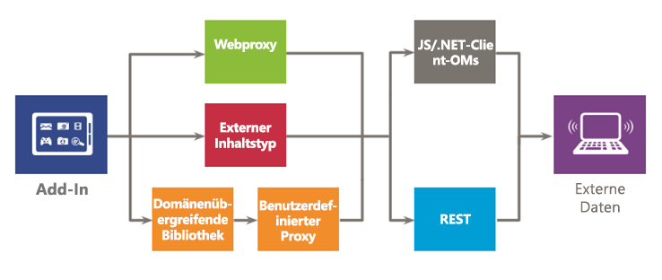

# Sicherer Datenzugriff und Clientobjektmodelle für SharePoint-Add-Ins

Bei der Auswertung der Datenzugriffsoptionen für SharePoint-Add-Ins müssen Sie die Add-In-Umgebung und mehrere andere Faktoren berücksichtigen, wie z. B. die Kommunikation zwischen Client und Server sowie die Berechtigungsstufe, die Ihr Add-In benötigt, um die gewünschten Aufgaben auszuführen. Darüber hinaus sollten Sie die APIs im Modell für SharePoint-Add-Ins auswerten.

## Allgemeine Übersicht über Daten in SharePoint-Add-Ins

Es ist schwierig, sich ein SharePoint-Add-In vorzustellen (oder ein Add-In in diesem Fall), das keine Daten abfragen, speichern oder bearbeiten muss. Im Add-In müssen Sie häufig SharePoint-Daten abrufen und bearbeiten, z. B. Elemente in Dokumentbibliotheken und Listen, Metadaten oder Benutzerprofile. Ebenso müssen Sie möglicherweise in manchen Szenarien auf externe Daten im Add-In zugreifen. Das Modell für SharePoint-Add-Ins bietet mehrere Konnektivitätsoptionen und umfassende APIs für den Zugriff auf Daten und Dienste, die sich in SharePoint und in externen Systemen befinden.

Beim Entwurf eines Add-Ins und der Planung des Datenzugriffs müssen Sie im Wesentlichen zwei Entscheidungen fällen:

1. Welche Konnektivitätsoption soll ich verwenden?
2. Welche APIs soll ich zum Zugriff auf die benötigten Daten verwenden?

In den folgenden Abbildungen sind die in Modell für SharePoint-Add-Ins verfügbaren Optionen zusammengefasst. In den folgenden Abschnitten werden die einzelnen Optionen ausführlich behandelt und ihre Einsatzmöglichkeiten beschrieben.

Abbildung 1 zeigt die Optionen für den Zugriff auf SharePoint-Daten in Ihrem Add-In. Im Umgang mit diesen Szenarien müssen Sie entscheiden, ob Sie für die Authentifizierung von und Kommunikation mit SharePoint OAuth (1) oder (2) die domänenübergreifende Bibliothek verwenden möchten. Für die Datenzugriffs-API müssen Sie sich zwischen (3) dem Clientobjektmodell (JavaScript/.NET-Clientobjektmodelle) und (4) REST (Representational State Transfer) entscheiden.

Beachten Sie, dass Sie auch auf bestimmte Daten mit (5) Remoteereignisempfängern zugreifen können. Das Hauptszenario für Remoteereignisempfänger ist aber die Ausführung von Remotecode.

*Abbildung 1. Optionen zur Verwendung von SharePoint-Daten in Ihrem Add-In*

 
Abbildung 2 zeigt die Optionen, die für den Zugriff auf externe Daten im Add-In verfügbar sind. Im Umgang mit diesen Szenarien müssen Sie entscheiden, ob Sie (1) den Webproxy, (2) externe Inhaltstypen oder (3) die domänenübergreifende Bibliothek mit einer benutzerdefinierten Proxyseite für die Authentifizieren von und Kommunikation mit externen Diensten oder Systemen verwenden möchten. Sie können auch (4) das Clientobjektmodell (JavaScript/.NET-Clientobjektmodelle) und (5) REST (Representational State Transfer) verwenden.

*Abbildung 2. Optionen zur Verwendung externer Daten in Ihrem Add-In*

## Datenkonnektivitätsoptionen für SharePoint-Add-Ins

Es gibt einige Aspekte, die Sie beim Arbeiten mit Daten in Ihrem Add-In berücksichtigen müssen. Zum Beispiel welche Route die Daten verwenden? Stammen die Daten vom Server oder werden Sie über den Server weitergeleitet? Werden Sie über den Client weitergeleitet? Ist es in Ordnung, eine Authentifizierung als angemeldeter Benutzer vorzunehmen? Benötigt das Add-In erweiterte Berechtigungen? Die Informationen in den folgenden Abschnitten sind bei diesen und anderen Fragen hilfreich.

### SharePoint-Datenkonnektivität

Die folgenden Konnektivitätsoptionen sind verfügbar, wenn Sie auf SharePoint-Daten zugreifen (Abbildung 1):

- **OAuth:** Ein offenes Protokoll, das eine sichere Autorisierung auf einfache und standardmäßige Weise ermöglicht. Mit OAuth können Benutzer einer Anwendung erlauben, in ihrem Auftrag zu handeln, ohne dass Benutzername und Kennwort freigegeben werden. Sie können OAuth mit serverseitigem Code verwenden. Es ist eine gute Wahl, wenn Sie einen nicht interaktiven Vorgang ausführen müssen oder andere erweitere Berechtigungen als die des angemeldeten Benutzers gewähren müssen. Weitere Informationen zu OAuth finden Sie unter [Autorisierung und Authentifizierung von SharePoint-Add-Ins](authorization-and-authentication-of-sharepoint-add-ins.md)  
 
- **Domänenübergreifende Bibliothek:** Eine clientseitige Alternative in Form einer auf der SharePoint-Website gehosteten JavaScript-Datei (**SP.RequestExecutor.js**), auf die Sie in Ihrem Remote-Add-In verweisen können. Mit der domänenübergreifenden Bibliothek können Sie mit mehr als einer Domäne auf der Remote-Add-In-Seite über einen Proxy interagieren. Dies ist eine gute Wahl, wenn Sie den Add-In-Code im Client statt auf dem Server ausführen möchten oder wenn Konnektivitätshindernisse wie Firewalls zwischen SharePoint und Ihrer Remote-Infrastruktur vorhanden sind. Weitere Informationen finden Sie unter [Zugreifen auf SharePoint-Daten über Add-Ins mithilfe der domänenübergreifenden Bibliothek](access-sharepoint-data-from-add-ins-using-the-cross-domain-library.md).
     
- **Remoteereignisempfänger:** Remoteereignisempfänger behandeln Ereignisse, die bei Elementen in Add-Ins auftreten, z. B. einer Liste, einem Listenelement oder einer Website. Diese Ereignisse ähneln denen in einer herkömmlichen SharePoint-Lösung, mit dem Unterschied, dass sie Remotekomponenten für das SharePoint-Add-In arbeiten können. Beachten Sie, dass einige Eigenschaften des Elements Remoteereignisempfängern zur Verfügung stehen. Weitere Informationen finden Sie unter [Erstellen eines Remoteereignisempfängers in SharePoint-Add-Ins](create-a-remote-event-receiver-in-sharepoint-add-ins.md). Auf ähnliche Weise können Sie mit Add-In-Ereignisempfängern die Installation, Aktualisierung und Deinstallation von Add-Ins anpassen. Weitere Informationen finden Sie unter [Erstellen eines Add-In-Ereignisempfängers in SharePoint-Add-Ins](create-an-add-in-event-receiver-in-sharepoint-add-ins.md).

### Optionen für SharePoint-Datenkonnektivität: Welche soll ich verwenden?

In der folgenden Tabelle sind die allgemeinen Anforderungen und Szenarien aufgelistet, die bei der Erstellung von Add-Ins bestehen können. Ein **x** in der Spalte zeigt an, welche Option Sie jeweils verwenden können.

**Tabelle 1. Optionen für SharePoint-Datenkonnektivität**

|**Anforderung/Szenario**|**OAuth**|**Domänenübergreifende Bibliothek**|
|:-----|:-----:|:-----:|
|Ich verwende clientseitige Technologien (HTML + JavaScript).||x|
|Ich möchte REST-Schnittstellen verwenden.|x|x|
|Zwischen SharePoint und dem Remote-Add-In ist eine Firewall vorhanden und ich muss die Aufrufe über Browser ausgeben.||x|
|Das Add-In muss als der angemeldete Benutzer auf Ressourcen zugreifen.|x|x|
|Das Add-In benötigt andere erweiterte Berechtigungen als der aktuell angemeldete Benutzer.|x||
|Das Add-In muss im Namen eines anderen als des angemeldeten Benutzers handeln.|x||
|Das Add-In muss nur Vorgänge ausführen, solange der Benutzer angemeldet ist.|x|x|
|Das Add-In muss auch Vorgänge ausführen, wenn der Benutzer nicht angemeldet ist.|x||
|Das Add-In muss Remotecode als Antwort auf ein Ereignis in SharePoint ausführen.|||

Da Remoteereignisempfänger auf OAuth aufbauen, stellt ein Vergleich in dieser Tabelle nicht die beste Möglichkeit dar, um zu entscheiden, ob sie verwendet werden sollen. Verwenden Sie Remoteereignisempfänger, wenn Sie zusätzlich zum Datenaustausch Remotecode ausführen müssen.

### Externe Datenkonnektivität

Die folgenden Konnektivitätsoptionen sind verfügbar, wenn Sie auf externe Daten zugreifen (Abbildung 2):

-  **Webproxy:** Als Entwickler können Sie den Webproxy verwenden, der in Client-APIs wie JSOM verfügbar gemacht wird. Wenn Sie den Webproxy verwenden, senden Sie die ursprüngliche Anforderung an SharePoint. SharePoint fordert die Daten wiederum am angegebenen Endpunkt an und gibt die Antwort zurück an Ihre Seite. Verwenden Sie den Webproxy, wenn die Kommunikation auf der Serverebene stattfinden soll. Der Webproxy soll auf unstrukturierte Daten zugreifen, die keine Authentifizierung benötigen. Weitere Informationen finden Sie unter [Abfragen eines Remotediensts mithilfe des Webproxys in SharePoint](query-a-remote-service-using-the-web-proxy-in-sharepoint.md).

-  **Externe Inhaltstypen:** Erstellen Sie Add-Ins, die Zugriff auf externe Daten von SAP, Netflix, und proprietäre und andere Typen von Daten ohne Beteiligung des Mandantenadministrators haben. Zugriff auf externe Anwendungen wird durch Business Connectivity Services (BCS), beibehalten, die eine konsistente und einheitliche Benutzeroberfläche bereitstellt, die von anderen SharePoint-Anwendungen verwendet werden kann. Externe Inhaltstypen auf App-Ebene sind eine gute Wahl, wenn Sie ein BCS-Modell verwenden und eine Authentifizierung für den Datenzugriff erforderlich ist. Weitere Informationen dazu finden Sie unter [Externe Inhaltstypen auf Add-In-Ebene in SharePoint](http://msdn.microsoft.com/library/a34cbbba-dc38-4d3d-b796-d54b5848bdfb%28Office.15%29.aspx).

-  **Benutzerdefinierte Proxyseite für die domänenübergreifende Bibliothek:** Sie können mit der domänenübergreifenden Bibliothek auf Daten in Ihrem Remote-Add-In zugreifen, wenn Sie eine benutzerdefinierte Proxyseite bereitstellen, die in der Remote-Add-In-Infrastruktur gehostet wird. Als Entwickler sind Sie für die Implementierung der benutzerdefinierten Proxyseite zuständig. Darüber hinaus müssen Sie sich um benutzerdefinierte Logik kümmern, z. B. den Authentifizierungsmechanismus gegenüber dem Remote-Add-In. Verwenden Sie die domänenübergreifende Bibliothek mit einer benutzerdefinierten Proxyseite, wenn die Kommunikation auf der Clientebene stattfinden soll. Weitere Inforationen finden Sie unter [Erstellen einer benutzerdefinierten Proxyseite für die domänenübergreifende Bibliothek in SharePoint](create-a-custom-proxy-page-for-the-cross-domain-library-in-sharepoint.md).

### Optionen für externe Datenkonnektivität: Welche soll ich verwenden?

In der folgenden Tabelle sind die allgemeinen Anforderungen und Szenarien aufgelistet, die bei der Erstellung von Add-Ins bestehen können. Ein **x** in der Spalte zeigt an, welche Option Sie jeweils verwenden können.

**Tabelle 2. Optionen für extern Datenkonnektivität**

|**Anforderung/Szenario**|**Webproxy**|**Externe Inhaltstypen**|**Domänenübergreifende Bibliothek mit benutzerdefinierter Proxyseite**|
|:-----|:-----:|:-----:|:-----:|
|Ich verwende clientseitige Technologien (HTML + JavaScript).|x|x|x|
|Ich kann dem Remote-Add-In oder dem Remotedienst keine Seiten oder Komponenten hinzufügen.|x|x||
|Ich möchte REST-Schnittstellen verwenden.|x|x|x|
|Ich möchte das JavaScript-CSOM verwenden.|x|x|x|
|Ich möchte das .NET-CSOM verwenden.|x|x||
|Es besteht keine direkte Konnektivität zwischen der SharePoint-Infrastruktur und meinem Add-In. Ich muss Aufrufe über den Browser senden.||x|x|
|Das Add-In muss als der angemeldete Benutzer auf Ressourcen zugreifen.|x|x|x|

## Verfügbare Datenzugriffs-APIs für SharePoint-Add-Ins

Für den Zugriff auf SharePoint-Daten von Ihrem Add-In aus stehen Ihnen die folgenden APIs zur Verfügung:

- **REST (Representational State Transfer):** Für den Zugriff auf SharePoint-Entitäten über Clienttechnologien, die nicht JavaScript verwenden und nicht auf den Plattformen .NET Framework basieren, bietet SharePoint eine Implementierung eines REST-Webdiensts, der CRUDQ-Vorgänge (Create, Read, Update, Delete, and Query) bei SharePointDaten über das [OData-Protokoll (Open Data)](http://www.odata.org/) ausführt. Zudem verfügt nahezu jede API in den Clientobjektmodellen über einen entsprechenden REST-Endpunkt. Dadurch kann im Code mithilfe jeder Technologie, die REST-Standardfunktionen unterstützt, direkt mit SharePoint interagiert werden. Zur Verwendung der in SharePoint integrierten REST-Funktionen wird im Code eine "RESTful HTTP"-Anforderung an einen Endpunkt generiert, der dem gewünschten SharePoint-Objekt entspricht. Der REST-Dienst behandelt die HTTP-Anforderung und liefert eine Antwort im Atom- oder JavaScript Object Notation (JSON)-Format. Weitere Informationen zu REST in SharePoint finden Sie unter [Verwenden von OData-Abfragevorgängen in SharePoint REST-Anforderungen](use-odata-query-operations-in-sharepoint-rest-requests.md).
    
- **.NET Framework-Clientobjektmodell (.NET-Client-OM):** Nahezu jede Klasse im zentralen serverseitigen Objektmodell für Websites und Listen verfügt über eine entsprechende Klasse im .NET Framework-Clientobjektmodell. Darüber hinaus bietet das .NET Framework-Clientobjektmodell einen vollständigen Satz von APIs zur Erweiterung anderer Features, einschließlich einiger Features auf SharePoint-Ebene, wie ECM, Taxonomie, Benutzerprofile, erweiterte Suche, Analyse, BCS und andere. Weitere Informationen zu clientseitigen Objektmodellen finden Sie unter [Auswählen des richtigen API-Satzes in SharePoint](http://msdn.microsoft.com/library/f36645da-77c5-47f1-a2ca-13d4b62b320d%28Office.15%29.aspx). 
 
- **JavaScript-Clientobjektmodell (JS-Client-OM):** SharePoint bietet ein JavaScript-Objektmodell zur Verwendung in Inlineskript oder in gesonderten .JS-Dateien. Es umfasst die gleiche Funktionalität wie das .NET Framework-Clientobjektmodell. Das JSOM ist nützlich, um benutzerdefinierten SharePoint-Code in ein Add-In einzuschließen, da benutzerdefinierter serverseitiger Code insbesondere in Von SharePoint gehostetes Add-In nicht zulässig ist. Zudem können Webentwickler ihre vorhandenen JavaScript-Kenntnisse für die Erstellung von SharePoint-Add-Ins mit einer minimalen Lernkurve nutzen. Weitere Informationen zu clientseitigen Objektmodellen finden Sie unter [Auswählen des richtigen API-Satzes in SharePoint](http://msdn.microsoft.com/library/f36645da-77c5-47f1-a2ca-13d4b62b320d%28Office.15%29.aspx).
    
Möglicherweise gibt es weitere APIs, die Sie mit SharePoint-Add-In verwenden können, wenn Sie auf externe Daten zugreifen. Dies hängt aber von den Schnittstellen der externen Dienste und Systeme ab Sie sollten diese Schnittstellen auch bei Ihrem Entwurf berücksichtigen.

## Siehe auch

-  [Autorisierung und Authentifizierung für Add-Ins in SharePoint](authorization-and-authentication-of-sharepoint-add-ins.md)
-  [Zugreifen auf SharePoint-Daten über Add-Ins mithilfe der domänenübergreifenden Bibliothek](access-sharepoint-data-from-add-ins-using-the-cross-domain-library.md)
-  [Erstellen einer benutzerdefinierten Proxyseite für die domänenübergreifende Bibliothek in SharePoint](create-a-custom-proxy-page-for-the-cross-domain-library-in-sharepoint.md)
-  [Abfragen eines Remotediensts mithilfe des Webproxys in SharePoint](query-a-remote-service-using-the-web-proxy-in-sharepoint.md)
-  [Erstellen eines Remoteereignisempfängers in SharePoint-Add-Ins](create-a-remote-event-receiver-in-sharepoint-add-ins.md)
-  [Auswählen des richtigen API-Satzes in SharePoint](http://msdn.microsoft.com/library/f36645da-77c5-47f1-a2ca-13d4b62b320d%28Office.15%29.aspx)
-  [Verwenden von OData-Abfragevorgängen in SharePoint REST-Anforderungen](use-odata-query-operations-in-sharepoint-rest-requests.md)
    
 

