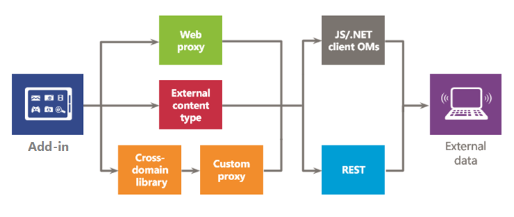

# Sicherer Datenzugriff und Clientobjektmodelle für SharePoint-Add-Ins
Erfahren Sie mehr über die Datenzugriffsoptionen beim Erstellen von SharePoint-Add-Ins, wie z. B. Datenkonnektivitätsoptionen für den Zugriff auf Daten in SharePoint, und die verfügbaren APIs zum Zugriff auf Daten von Ihrem Add-In.
 

 **Hinweis** Der Name „Apps für SharePoint“ wird in „SharePoint-Add-Ins“ geändert. Während des Übergangszeitraums wird in der Dokumentation und der Benutzeroberfläche einiger SharePoint-Produkte und Visual Studio-Tools möglicherweise weiterhin der Begriff „Apps für SharePoint“ verwendet. Weitere Informationen finden Sie unter [Neuer Name für Office- und SharePoint-Apps](new-name-for-apps-for-sharepoint#bk_newname).
 

Bei der Auswertung der Datenzugriffsoptionen für SharePoint-Add-Ins müssen Sie die Add-In-Umgebung und mehrere andere Faktoren berücksichtigen, wie z. B. die Kommunikation zwischen Client und Server sowie die Berechtigungsstufe, die Ihr Add-In benötigt, um die gewünschten Aufgaben auszuführen. Darüber hinaus sollten Sie die APIs im Modell für SharePoint-Add-Ins auswerten.
 

## Allgemeine Übersicht über Daten in SharePoint-Add-Ins

Eine SharePoint-Add-In (oder ein beliebiges anderes Add-In), die keine Daten abfragt, speichert oder ändert, ist schwer vorstellbar. Häufig müssen in Add-Ins SharePoint-Daten, wie Elemente in Dokumentbibliotheken und Listen, Metadaten oder Benutzerprofile, abgerufen und bearbeitet werden. Entsprechend müssen Sie in bestimmten Szenarien von einer SharePoint-Seite oder -Komponente aus auf Daten zugreifen, die von Ihrem Add-In verfügbar gemacht werden. Das Modell für SharePoint-Add-Ins bietet mehrere Konnektivitätsoptionen und einen umfangreichen Satz von APIs für den Zugriff auf die Daten und Dienste in SharePoint und in externen Systemen.
 

 
Beim Entwurf eines Add-Ins und der Planung des Datenzugriffs müssen Sie im Wesentlichen zwei Entscheidungen fällen:
 

 

1. Welche Konnektivitätsoption soll ich verwenden?
    
 
2. Welche APIs soll ich zum Zugriff auf die benötigten Daten verwenden?
    
 
In den folgenden Abbildungen sind die in Modell für SharePoint-Add-Ins verfügbaren Optionen zusammengefasst. In den folgenden Abschnitten werden die einzelnen Optionen ausführlich behandelt und ihre Einsatzmöglichkeiten beschrieben.
 

 
In Abbildung 1 sind die Optionen für den Zugriff auf SharePoint-Daten in Ihrem Add-In dargestellt. Bei diesen Szenarien müssen Sie entscheiden, ob die Authentifizierung und Kommunikation mit SharePoint mithilfe von (1) OAuth oder (2) derdomänenübergreifenden Bibliothek erfolgen soll. Anschließend müssen Sie sich bezüglich der Datenzugriffs-API entscheiden zwischen (3) demClientobjektmodell (JavaScript/.NET-Clientobjektmodelle) oder (4)REST (Representational State Transfer).
 

 
Beachten Sie, dass Sie auch auf bestimmte Daten mit (5)  *Remoteereignisempfängern*  zugreifen können. Das Hauptszenario für Remoteereignisempfänger ist aber die Ausführung von Remotecode.
 

 

**Abbildung 1. Optionen zur Verwendung von SharePoint-Daten in Ihrem Add-In**

 

 

 
In Abbildung 2 sind die Optionen für den Zugriff auf externe Daten von Ihrem Add-In aus dargestellt. Bei diesen Szenarien müssen Sie entscheiden, ob Sie (1) den  *Webproxy*  , (2) *externen Inhaltstypen*  oder (3) die *domänenübergreifende Bibliothek mit einer benutzerdefinierten Proxyseite*  für die Authentifizierung und Kommunikation mit externen Diensten oder Systemen verwenden möchten. Die können außerdem (4) dasClientobjektmodell (JavaScript/.NET-Clientobjektmodelle) oder (5)Representational State Transfer (REST) verwenden.
 

 

**Abbildung 2. Optionen zur Verwendung externer Daten in Ihrem Add-In**

 

 

 

 

 

## Datenkonnektivitätsoptionen für SharePoint-Add-Ins

Bei der Arbeit mit Daten in Ihrem Add-In müssen Sie mehrere Aspekte berücksichtigen. Welche Route nehmen die Daten? Kommen sie vom Server, oder durchlaufen sie den Server? Durchlaufen sie den Client? Ist eine Authentifizierung als der angemeldete Benutzer angemessen? Benötigt das Add-In erhöhte Rechte? In den folgenden Abschnitten werden diese und andere Fragen behandelt.
 

 

### SharePoint-Datenkonnektivität

Die folgenden Konnektivitätsoptionen sind verfügbar, wenn Sie auf SharePoint-Daten zugreifen (Abbildung 1):
 

 

-  **OAuth:** Ein offenes Protokoll, das eine sichere Autorisierung auf einfache und standardmäßige Weise ermöglicht. Mit OAuth können Benutzer einer Anwendung erlauben, in ihrem Namen zu handeln, ohne ihren Benutzernamen und ihr Kennwort freizugeben. OAuth kann mit serverseitigem Code verwendet werden. Es stellt die geeignete Option dar, wenn Sie einen nicht interaktiven Prozess ausführen oder Rechte auf andere als die des angemeldeten Benutzers erhöhen müssen. Weitere Informationen zu OAuth finden Sie unter [Autorisierung und Authentifizierung für Add-Ins in SharePoint](authorization-and-authentication-of-sharepoint-add-ins).
    
 
-  **Domänenübergreifende Bibliothek:** Eine clientseitige Alternative in Form einer auf der SharePoint-Website gehosteten JavaScript-Datei ( **SP.RequestExecutor.js** ), auf die Sie in dem Remote-Add-In verweisen können, sofern sie sich in derselben Internetzone befindet. Die domänenübergreifende Bibliothek ermöglicht die Interaktion mit mehreren Domänen auf der Remote-Add-In-Seite über einen Proxy. Diese Option ist geeignet, wenn Sie den Add-In-Code lieber auf dem Client als auf dem Server ausführen möchten oder wenn Konnektivitätsbarrieren, wie z. B. Firewalls, zwischen SharePoint und der Remoteinfrastruktur bestehen. Weitere Informationen finden Sie unter [Zugreifen auf SharePoint-Daten über Add-Ins mithilfe der domänenübergreifenden Bibliothek](access-sharepoint-2013-data-from-add-ins-using-the-cross-domain-library).
    
 
-  **Remoteereignisempfänger:** Sie können Remoteereignisempfänger zum Behandeln von Ereignissen verwenden, die für ein Element in dem Add-In auftreten, z. B. eine Liste, ein Listenelement oder eine Website. Diese Ereignisse ähneln den Ereignissen in einer herkömmlichen SharePointLösung, Sie können jedoch außerdem mit den Remotekomponenten der SharePoint-Add-In zusammenarbeiten. Einige Eigenschaften des Elements sind für den Remoteereignisempfänger verfügbar. Weitere Informationen finden Sie unter [Erstellen eines Remoteereignisempfängers in Add-Ins für SharePoint](create-a-remote-event-receiver-in-sharepoint-add-ins). Auf ähnliche Weise können Sie auch Add-In-Ereignisempfänger verwenden, um die Installation, Aktualisierung und Deinstallation des Add-Ins anzupassen. Weitere Informationen finden Sie unter  [Erstellen eines Add-In-Ereignisempfängers in SharePoint-Add-Ins](create-an-add-in-event-receiver-in-sharepoint-add-ins).
    
 

### Optionen für SharePoint-Datenkonnektivität: Welche soll ich verwenden?

In der folgenden Tabelle sind die allgemeinen Anforderungen und Szenarios aufgelistet, die bei der Erstellung von Add-Ins bestehen können. Ein **x** in der Spalte zeigt an, welche Option Sie jeweils verwenden können.
 

 

**Tabelle 1. Optionen für SharePoint-Datenkonnektivität**

|**Anforderung/Szenario**|**OAuth**|**Domänenübergreifende Bibliothek**|
|:-----|:-----|:-----|
|Ich verwende clientseitige Technologien (HTML + JavaScript).||x|
|Ich möchte REST-Schnittstellen verwenden.|x|x|
|Zwischen SharePoint und meinem Remote-Add-In befindet sich eine Firewall, und ich muss die Aufrufe über den Browser senden.||x|
|Das Add-In muss als der angemeldete Benutzer auf Ressourcen zugreifen.|x|x|
|Das Add-In muss Rechte über die des angemeldeten Benutzers hinaus erhöhen.|x||
|Dias Add-In muss im Namen eines anderen als des angemeldeten Benutzers handeln.|x||
|Das Add-In muss nur Vorgänge ausführen, solange der Benutzer angemeldet ist.|x|x|
|Das Add-In muss auch Vorgänge ausführen, wenn der Benutzer nicht angemeldet ist.|x||
|Das Add-In muss Remotecode als Antwort auf ein Ereignis in SharePoint ausführen.|||
Da Remoteereignisempfänger auf OAuth aufbauen, sollten Sie nicht einen Vergleich aus dieser Tabelle als Entscheidungshilfe heranziehen, ob diesen Empfänger verwenden sollten oder nicht. Verwenden Sie Remoteereignisempfänger, wenn Sie neben dem Datenaustausch auch Remotecode ausführen müssen.
 

 

### Externe Datenkonnektivität

Die folgenden Konnektivitätsoptionen sind verfügbar, wenn Sie auf externe Daten zugreifen (Abbildung 2):
 

 

-  **Webproxy:** Als Entwickler können Sie den Webproxy verwenden, der in Client-APIs wie JSOM verfügbar gemacht wird. Wenn Sie den Webproxy verwenden, senden Sie die ursprüngliche Anforderung an SharePoint. SharePoint fordert die Daten wiederum am angegebenen Endpunkt an und gibt die Antwort zurück an Ihre Seite. Verwenden Sie den Webproxy, wenn die Kommunikation auf der Serverebene stattfinden soll. Der Webproxy soll auf unstrukturierte Daten zugreifen, die keine Authentifizierung benötigen. Weitere Informationen finden Sie unter [Abfragen eines Remotediensts mithilfe des Webproxys in SharePoint](query-a-remote-service-using-the-web-proxy-in-sharepoint-2013).
    
 
-  **Externe Inhaltstypen:** Sie können Add-Ins erstellen, die auf externe Daten von SAP und Netflix sowie auf proprietäre und andere Daten ohne Einbeziehung des Mandantenadministrators zugreifen. Der Zugriff auf externe Anwendungen wird über Business Connectivity Services (BCS) verwaltet, die eine konsistente und einheitliche Schnittstelle bereitstellen, die auch von anderen SharePoint-Anwendungen verwendet werden kann. Externe Inhaltstypen auf App-Ebene sind eine gute Alternative, wenn Sie ein BCS-Modell verwenden und auf Daten zugreifen, die authentifiziert werden müssen. Weitere Informationen finden Sie in [Add-in-bezogenen externen Inhaltstypen in SharePoint](http://msdn.microsoft.com/library/a34cbbba-dc38-4d3d-b796-d54b5848bdfb%28Office.15%29.aspx).
    
 
-  **Benutzerdefinierte Proxyseite für die domänenübergreifende Bibliothek:** Sie können mit der domänenübergreifenden Bibliothek auf Daten in Ihrem Remote-Add-In zugreifen, wenn Sie eine benutzerdefinierte Proxyseite bereitstellen, die in der Remote-Add-In-Infrastruktur gehostet wird. Als Entwickler sind Sie für die Implementierung der benutzerdefinierten Proxyseite zuständig. Darüber hinaus müssen Sie sich um benutzerdefinierte Logik kümmern, z. B. den Authentifizierungsmechanismus gegenüber dem Remote-Add-In. Verwenden Sie die domänenübergreifende Bibliothek mit einer benutzerdefinierten Proxyseite, wenn die Kommunikation auf der Clientebene stattfinden soll. Weitere Inforationen finden Sie unter [Erstellen einer benutzerdefinierten Proxyseite für die domänenübergreifende Bibliothek in SharePoint](create-a-custom-proxy-page-for-the-cross-domain-library-in-sharepoint-2013).
    
 

### Optionen für externe Datenkonnektivität: Welche soll ich verwenden?

In der folgenden Tabelle sind die allgemeinen Anforderungen und Szenarios aufgelistet, die bei der Erstellung von Add-Ins bestehen können. Ein **x** in der Spalte zeigt an, welche Option Sie jeweils verwenden können.
 

 

**Tabelle 2. Optionen für extern Datenkonnektivität**

|**Anforderung/Szenario**|**Webproxy**|**Externe Inhaltstypen**|**Domänenübergreifende Bibliothek mit benutzerdefinierter Proxyseite**|
|:-----|:-----|:-----|:-----|
|Ich verwende clientseitige Technologien (HTML + JavaScript).|x|x|x|
|Ich kann dem Remote-Add-In oder dem Remotedienst keine Seiten oder Komponenten hinzufügen.|x|x||
|Ich möchte REST-Schnittstellen verwenden.|x|x|x|
|Ich möchte das JavaScript-CSOM verwenden.|x|x|x|
|Ich möchte das .NET-CSOM verwenden.|x|x||
|Es besteht keine direkte Konnektivität zwischen der SharePoint-Infrastruktur und meinem Add-In. Ich muss Aufrufe über den Browser senden.||x|x|
|Das Add-In muss als der angemeldete Benutzer auf Ressourcen zugreifen.|x|x|x|

## Verfügbare Datenzugriffs-APIs für SharePoint-Add-Ins

Für den Zugriff auf SharePoint-Daten von Ihrem Add-In aus stehen Ihnen die folgenden APIs zur Verfügung:
 

 

-  **REST (Representational State Transfer):** Für den Zugriff auf SharePoint-Entitäten über Clienttechnologien, die nicht JavaScript verwenden und nicht auf den Plattformen .NET Framework basieren, bietet SharePoint eine Implementierung eines REST-Webdiensts, der CRUDQ-Vorgänge (Create, Read, Update, Delete, and Query) bei SharePointDaten über das [OData-Protokoll (Open Data)](http://www.odata.org/) ausführt. Zudem verfügt nahezu jede API in den Clientobjektmodellen über einen entsprechenden REST-Endpunkt. Dadurch kann im Code mithilfe jeder Technologie, die REST-Standardfunktionen unterstützt, direkt mit SharePoint interagiert werden. Zur Verwendung der in SharePoint integrierten REST-Funktionen wird im Code eine "RESTful HTTP"-Anforderung an einen Endpunkt generiert, der dem gewünschten SharePoint-Objekt entspricht. Der REST-Dienst behandelt die HTTP-Anforderung und liefert eine Antwort im Atom- oder JavaScript Object Notation (JSON)-Format. Weitere Informationen zu REST in SharePoint finden Sie unter [Verwenden von OData-Abfragevorgängen in SharePoint REST-Anforderungen](use-odata-query-operations-in-sharepoint-rest-requests).
    
 
-  **.NET Framework-Clientobjektmodell (.NET-Client-OM):** Nahezu jede Klasse im zentralen serverseitigen Objektmodell für Websites und Listen verfügt über eine entsprechende Klasse im .NET Framework-Clientobjektmodell. Darüber hinaus bietet das .NET Framework-Clientobjektmodell einen vollständigen Satz von APIs zur Erweiterung anderer Features, einschließlich einiger Features auf SharePoint-Ebene, wie ECM, Taxonomie, Benutzerprofile, erweiterte Suche, Analyse, BCS und andere. Weitere Informationen zu clientseitigen Objektmodellen finden Sie unter [Auswählen des richtigen API-Satzes in SharePoint](http://msdn.microsoft.com/library/f36645da-77c5-47f1-a2ca-13d4b62b320d%28Office.15%29.aspx).
    
 
-  **JavaScript-Clientobjektmodell (JS-Client-OM):** SharePoint bietet ein JavaScript-Objektmodell zur Verwendung in Inlineskript oder in gesonderten .JS-Dateien. Es umfasst die gleiche Funktionalität wie das .NET Framework-Clientobjektmodell. Das JSOM ist nützlich, um benutzerdefinierten SharePoint-Code in ein Add-In einzuschließen, da benutzerdefinierter serverseitiger Code insbesondere in Von SharePoint gehostetes Add-In nicht zulässig ist. Zudem können Webentwickler ihre vorhandenen JavaScript-Kenntnisse für die Erstellung von SharePoint-Add-Ins mit einer minimalen Lernkurve nutzen. Weitere Informationen zu clientseitigen Objektmodellen finden Sie unter [Auswählen des richtigen API-Satzes in SharePoint](http://msdn.microsoft.com/library/f36645da-77c5-47f1-a2ca-13d4b62b320d%28Office.15%29.aspx).
    
 
Möglicherweise gibt es weitere APIs, die Sie mit SharePoint-Add-In verwenden können, wenn Sie auf externe Daten zugreifen. Dies hängt aber von den Schnittstellen der externen Dienste und Systeme ab Sie sollten diese Schnittstellen auch bei Ihrem Entwurf berücksichtigen.
 

 

## Zusätzliche Ressourcen

-  [Autorisierung und Authentifizierung von SharePoint-Add-Ins](authorization-and-authentication-of-sharepoint-add-ins)
    
 
-  [Zugreifen auf SharePoint-Daten über Add-Ins mithilfe der domänenübergreifenden Bibliothek](access-sharepoint-2013-data-from-add-ins-using-the-cross-domain-library)
    
 
-  [Erstellen einer benutzerdefinierten Proxyseite für die domänenübergreifende Bibliothek in SharePoint](create-a-custom-proxy-page-for-the-cross-domain-library-in-sharepoint-2013)
    
 
-  [Abfragen eines Remotediensts mithilfe des Webproxys in SharePoint](query-a-remote-service-using-the-web-proxy-in-sharepoint-2013)
    
 
-  [Erstellen eines Remoteereignisempfängers in SharePoint-Add-Ins](create-a-remote-event-receiver-in-sharepoint-add-ins)
    
 
-  [Auswählen des richtigen API-Satzes in SharePoint](http://msdn.microsoft.com/library/f36645da-77c5-47f1-a2ca-13d4b62b320d%28Office.15%29.aspx)
    
 
-  [Verwenden von OData-Abfragevorgängen in SharePoint REST-Anforderungen](use-odata-query-operations-in-sharepoint-rest-requests)
    
 

