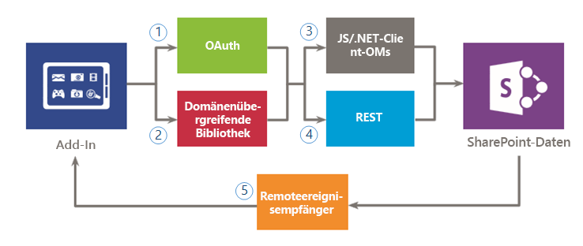

# Sicherer Datenzugriff und Clientobjektmodelle für SharePoint-Add-InsSecure data access and client object models for SharePoint Add-ins

Bei der Auswertung der Datenzugriffsoptionen für SharePoint-Add-Ins müssen Sie die Add-In-Umgebung und mehrere andere Faktoren berücksichtigen, wie z. B. die Kommunikation zwischen Client und Server sowie die Berechtigungsstufe, die Ihr Add-In benötigt, um die gewünschten Aufgaben auszuführen. Darüber hinaus sollten Sie die APIs im Modell für SharePoint-Add-Ins auswerten.In evaluating your data access options for SharePoint Add-ins, you have to assess your add-in environment and consider several factors, such as communication between the client and server, and the permission level that is required for your add-in to perform the required tasks. You also have to evaluate the APIs that are available in the model for SharePoint Add-ins.

## Allgemeine Übersicht über Daten in SharePoint-Add-InsHigh-level overview of data in SharePoint Add-ins

Es ist schwierig, sich ein SharePoint-Add-In vorzustellen (oder ein Add-In in diesem Fall), das keine Daten abfragen, speichern oder bearbeiten muss.It is difficult to imagine a SharePoint Add-in (or any add-in for that matter) that does not need to query, store, or manipulate data. Im Add-In müssen Sie häufig SharePoint-Daten abrufen und bearbeiten, z. B. Elemente in Dokumentbibliotheken und Listen, Metadaten oder Benutzerprofile.In your add-in, you will frequently have to retrieve and manipulate SharePoint data, such as items in document libraries and lists, metadata, or user profiles. Ebenso müssen Sie möglicherweise in manchen Szenarien auf externe Daten im Add-In zugreifen.Similarly, you might have scenarios where you need to access external data in your add-in. Das Modell für SharePoint-Add-Ins bietet mehrere Konnektivitätsoptionen und umfassende APIs für den Zugriff auf Daten und Dienste, die sich in SharePoint und in externen Systemen befinden.The model for SharePoint Add-ins provides multiple connectivity options and a rich set of APIs for accessing the data and services that reside on SharePoint and on external systems.

Beim Entwurf eines Add-Ins und der Planung des Datenzugriffs müssen Sie im Wesentlichen zwei Entscheidungen fällen:As you design your add-in and plan for data access, you have to make two key decisions:

1. Welche Konnektivitätsoption soll ich verwenden?Which connectivity option should I use?
2. Welche APIs soll ich zum Zugriff auf die benötigten Daten verwenden?What APIs should I use for accessing the data I need?

In den folgenden Abbildungen sind die in Modell für SharePoint-Add-Ins verfügbaren Optionen zusammengefasst. In den folgenden Abschnitten werden die einzelnen Optionen ausführlich behandelt und ihre Einsatzmöglichkeiten beschrieben.The following figures summarize the different options that are provided by the model for SharePoint Add-ins. In the sections that follow, you will examine each option in detail and learn when to use them.

Abbildung 1 zeigt die Optionen für den Zugriff auf SharePoint-Daten in Ihrem Add-In.Figure 1 illustrates the options you have for accessing SharePoint data in your add-in. Im Umgang mit diesen Szenarien müssen Sie entscheiden, ob Sie für die Authentifizierung von und Kommunikation mit SharePoint OAuth (1) oder (2) die domänenübergreifende Bibliothek verwenden möchten.When you are dealing with these scenarios, you have to decide whether you want to authenticate and communicate to SharePoint by using (1) OAuth or (2) the cross-domain library. Für die Datenzugriffs-API müssen Sie sich zwischen (3) dem Clientobjektmodell (JavaScript/.NET-Clientobjektmodelle) und (4) REST (Representational State Transfer) entscheiden.For the data access API, you must decide between (3) the client object model (JavaScript/.NET client object models) or (4) Representational State Transfer (REST).

Beachten Sie, dass Sie auch auf bestimmte Daten mit (5) Remoteereignisempfängern zugreifen können. Das Hauptszenario für Remoteereignisempfänger ist aber die Ausführung von Remotecode.Keep in mind that you can also access certain data using (5) remote event receivers; however, the main scenario for remote event receivers is remote code execution.

*Abbildung 1. Optionen zur Verwendung von SharePoint-Daten in Ihrem Add-In**Figure 1. Options for using SharePoint data in your add-in*

 
Abbildung 2 zeigt die Optionen, die für den Zugriff auf externe Daten im Add-In verfügbar sind.Figure 2 shows the options that you have for accessing external data on your add-in. Im Umgang mit diesen Szenarien müssen Sie entscheiden, ob Sie (1) den Webproxy, (2) externe Inhaltstypen oder (3) die domänenübergreifende Bibliothek mit einer benutzerdefinierten Proxyseite für die Authentifizieren von und Kommunikation mit externen Diensten oder Systemen verwenden möchten.When you are working with these scenarios, you have to decide whether you want to use (1) the web proxy, (2) external content types, or (3) the cross-domain library with a custom proxy page to authenticate and communicate with external services or systems. Sie können auch (4) das Clientobjektmodell (JavaScript/.NET-Clientobjektmodelle) und (5) REST (Representational State Transfer) verwenden.You can also use (4) the client object model (JavaScript/.NET client object models) or (5) Representational State Transfer (REST).

*Abbildung 2. Optionen zur Verwendung externer Daten in Ihrem Add-In**Figure 2. Options for using external data in your add-in*

## Datenkonnektivitätsoptionen für SharePoint-Add-InsData connectivity options for SharePoint Add-ins

Es gibt einige Aspekte, die Sie beim Arbeiten mit Daten in Ihrem Add-In berücksichtigen müssen.You have to consider several aspects when you work with data in your add-in. Zum Beispiel welche Route die Daten verwenden?For example, what route is the data using? Stammen die Daten vom Server oder werden Sie über den Server weitergeleitet?Is it coming from or going through the server? Werden Sie über den Client weitergeleitet?Is it going through the client? Ist es in Ordnung, eine Authentifizierung als angemeldeter Benutzer vorzunehmen?Is it okay to authenticate as the signed-in user? Benötigt das Add-In erweiterte Berechtigungen?Does the add-in need elevated privileges? Die Informationen in den folgenden Abschnitten sind bei diesen und anderen Fragen hilfreich.The following sections can help you with these and other questions you may have.

### SharePoint-DatenkonnektivitätSharePoint data connectivity

Die folgenden Konnektivitätsoptionen sind verfügbar, wenn Sie auf SharePoint-Daten zugreifen (Abbildung 1):The following connectivity options are available when accessing SharePoint data (see Figure 1):

- **OAuth:** Ein offenes Protokoll, das eine sichere Autorisierung auf einfache und standardmäßige Weise ermöglicht.**OAuth:** An open protocol that enables secure authorization in a simple and standard way. Mit OAuth können Benutzer einer Anwendung erlauben, in ihrem Auftrag zu handeln, ohne dass Benutzername und Kennwort freigegeben werden.OAuth enables users to approve an application to act on their behalf without sharing their user name and password. Sie können OAuth mit serverseitigem Code verwenden.You can use OAuth with server-side code. Es ist eine gute Wahl, wenn Sie einen nicht interaktiven Vorgang ausführen müssen oder andere erweitere Berechtigungen als die des angemeldeten Benutzers gewähren müssen.It is a good option if you need to run a non-interactive process, or if you need to elevate privileges to other than those of the signed-in user. Weitere Informationen zu OAuth finden Sie unter [Autorisierung und Authentifizierung von SharePoint-Add-Ins](authorization-and-authentication-of-sharepoint-add-ins.md)For information about OAuth, see [Authorization and authentication of SharePoint Add-ins](authorization-and-authentication-of-sharepoint-add-ins.md).  
 
- **Domänenübergreifende Bibliothek:** Eine clientseitige Alternative in Form einer auf der SharePoint-Website gehosteten JavaScript-Datei (**SP.RequestExecutor.js**), auf die Sie in Ihrem Remote-Add-In verweisen können.**Cross-domain library:** A client-side alternative in the form of a JavaScript file (**SP.RequestExecutor.js**) hosted in the SharePoint website that you can reference in your remote add-in. Mit der domänenübergreifenden Bibliothek können Sie mit mehr als einer Domäne auf der Remote-Add-In-Seite über einen Proxy interagieren.The cross-domain library allows you to interact with more than one domain in your remote add-in page through a proxy. Dies ist eine gute Wahl, wenn Sie den Add-In-Code im Client statt auf dem Server ausführen möchten oder wenn Konnektivitätshindernisse wie Firewalls zwischen SharePoint und Ihrer Remote-Infrastruktur vorhanden sind.This is a good option if you prefer your add-in code to run in the client rather than in the server, or if there are connectivity barriers, such as firewalls, between SharePoint and your remote infrastructure. Weitere Informationen finden Sie unter [Zugreifen auf SharePoint-Daten über Add-Ins mithilfe der domänenübergreifenden Bibliothek](access-sharepoint-data-from-add-ins-using-the-cross-domain-library.md).For more information, see [Access SharePoint data from add-ins using the cross-domain library](access-sharepoint-data-from-add-ins-using-the-cross-domain-library.md).
     
- **Remoteereignisempfänger:** Remoteereignisempfänger behandeln Ereignisse, die bei Elementen in Add-Ins auftreten, z. B. einer Liste, einem Listenelement oder einer Website.**Remote event receivers:** You can use remote event receivers to handle events that occur to an item in the add-in, such as a list, a list item, or a web. Diese Ereignisse ähneln denen in einer herkömmlichen SharePoint-Lösung, mit dem Unterschied, dass sie Remotekomponenten für das SharePoint-Add-In arbeiten können.These events resemble those in a traditional SharePoint solution, except that they can work with the remote components of the SharePoint Add-in. Beachten Sie, dass einige Eigenschaften des Elements Remoteereignisempfängern zur Verfügung stehen.Note that some properties of the item are available to the remote event receiver. Weitere Informationen finden Sie unter [Erstellen eines Remoteereignisempfängers in SharePoint-Add-Ins](create-a-remote-event-receiver-in-sharepoint-add-ins.md). Auf ähnliche Weise können Sie mit Add-In-Ereignisempfängern die Installation, Aktualisierung und Deinstallation von Add-Ins anpassen.For more information, see [Create a remote event receiver in SharePoint Add-ins](create-a-remote-event-receiver-in-sharepoint-add-ins.md). In a similar way, you can use add-in event receivers to customize how your add-in is installed, updated, and uninstalled. Weitere Informationen finden Sie unter [Erstellen eines Add-In-Ereignisempfängers in SharePoint-Add-Ins](create-an-add-in-event-receiver-in-sharepoint-add-ins.md).For more information, see [Create an add-in event receiver in SharePoint Add-ins](create-an-add-in-event-receiver-in-sharepoint-add-ins.md).

### Optionen für SharePoint-Datenkonnektivität: Welche soll ich verwenden?SharePoint data connectivity options: Which one should I use?

In der folgenden Tabelle sind die allgemeinen Anforderungen und Szenarien aufgelistet, die bei der Erstellung von Add-Ins bestehen können. Ein **x** in der Spalte zeigt an, welche Option Sie jeweils verwenden können.The following table lists the common requirements and scenarios you might encounter when you are building add-ins. An **x** in the column indicates which option you can use in each case.

**Tabelle 1. Optionen für SharePoint-Datenkonnektivität****Table 1. SharePoint data connectivity options**

|**Anforderung/Szenario****Requirement/Scenario**|**OAuth****OAuth**|**Domänenübergreifende Bibliothek****Cross-domain library**|
|:-----|:-----:|:-----:|
|Ich verwende clientseitige Technologien (HTML + JavaScript).I use client-side technologies (HTML + JavaScript).||xx|
|Ich möchte REST-Schnittstellen verwenden.I want to use REST interfaces.|xx|xx|
|Zwischen SharePoint und dem Remote-Add-In ist eine Firewall vorhandenThere is a firewall between SharePoint and my remote add-in, und ich muss die Aufrufe über Browser ausgeben.and I need to issue the calls through the browser.||xx|
|Das Add-In muss als der angemeldete Benutzer auf Ressourcen zugreifen.My add-in needs to access resources as the signed-in user.|xx|xx|
|Das Add-In benötigt andere erweiterte Berechtigungen alsMy add-in needs to elevate privileges to other than der aktuell angemeldete Benutzer.those of the current signed-in user.|xx||
|Das Add-In muss im Namen eines anderen als des angemeldeten Benutzers handeln.My add-in needs to act on behalf of a user other than the one who is signed in.|xx||
|Das Add-In muss nur Vorgänge ausführen, solange der Benutzer angemeldet ist.My add-in needs to perform operations only while the user is signed in.|xx|xx|
|Das Add-In muss auch Vorgänge ausführen, wenn der Benutzer nicht angemeldet ist.My add-in needs to perform operations even when the user is not signed in.|xx||
|Das Add-In muss Remotecode als Antwort auf ein Ereignis in SharePoint ausführen.My add-in needs to execute remote code as a response to an event in SharePoint.|||

Da Remoteereignisempfänger auf OAuth aufbauen, stellt ein Vergleich in dieser Tabelle nicht die beste Möglichkeit dar, um zu entscheiden, ob sie verwendet werden sollen.Because Remote Event Receivers are built on top of OAuth, a comparison in this table is not the best way to decide whether you should use them or not. Verwenden Sie Remoteereignisempfänger, wenn Sie zusätzlich zum Datenaustausch Remotecode ausführen müssen.Use Remote Event Receivers when you need to execute remote code in addition to data exchange.

### Externe DatenkonnektivitätExternal data connectivity

Die folgenden Konnektivitätsoptionen sind verfügbar, wenn Sie auf externe Daten zugreifen (Abbildung 2):The following connectivity options are available when accessing external data (see Figure 2):

-  **Webproxy:** Als Entwickler können Sie den Webproxy verwenden, der in Client-APIs wie JSOM verfügbar gemacht wird. Wenn Sie den Webproxy verwenden, senden Sie die ursprüngliche Anforderung an SharePoint. SharePoint fordert die Daten wiederum am angegebenen Endpunkt an und gibt die Antwort zurück an Ihre Seite. Verwenden Sie den Webproxy, wenn die Kommunikation auf der Serverebene stattfinden soll. Der Webproxy soll auf unstrukturierte Daten zugreifen, die keine Authentifizierung benötigen. Weitere Informationen finden Sie unter [Abfragen eines Remotediensts mithilfe des Webproxys in SharePoint](query-a-remote-service-using-the-web-proxy-in-sharepoint.md).**Web proxy:** As a developer, you can use the web proxy exposed in client APIs such as the JSOM. When you use the web proxy, you issue the initial request to SharePoint. In turn, SharePoint requests the data to the specified endpoint and forwards the response back to your page. Use the web proxy when you want the communication to occur at the server level. The web proxy is designed to access unstructured data that doesn't require authentication. For more information, see [Query a remote service using the web proxy in SharePoint](query-a-remote-service-using-the-web-proxy-in-sharepoint.md).

-  **Externe Inhaltstypen:** Erstellen Sie Add-Ins, die Zugriff auf externe Daten von SAP, Netflix, und proprietäre und andere Typen von Daten ohne Beteiligung des Mandantenadministrators haben.**External content types:** You can create add-ins that access external data from SAP, Netflix, and proprietary and other types of data without involving the tenant administrator. Zugriff auf externe Anwendungen wird durch Business Connectivity Services (BCS), beibehalten, die eine konsistente und einheitliche Benutzeroberfläche bereitstellt, die von anderen SharePoint-Anwendungen verwendet werden kann.Access to external applications is maintained through Business Connectivity Services (BCS), which provides a consistent and uniform interface that can be used by other SharePoint applications. Externe Inhaltstypen auf App-Ebene sind eine gute Wahl, wenn Sie ein BCS-Modell verwenden und eine Authentifizierung für den Datenzugriff erforderlich ist.App-scoped ECTs are a good option when you are using a BCS model and access to the data requires authentication. Weitere Informationen dazu finden Sie unter [Externe Inhaltstypen auf Add-In-Ebene in SharePoint](http://msdn.microsoft.com/library/a34cbbba-dc38-4d3d-b796-d54b5848bdfb%28Office.15%29.aspx).For more information, see [Add-in-scoped external content types in SharePoint](http://msdn.microsoft.com/library/a34cbbba-dc38-4d3d-b796-d54b5848bdfb%28Office.15%29.aspx).

-  **Benutzerdefinierte Proxyseite für die domänenübergreifende Bibliothek:** Sie können mit der domänenübergreifenden Bibliothek auf Daten in Ihrem Remote-Add-In zugreifen, wenn Sie eine benutzerdefinierte Proxyseite bereitstellen, die in der Remote-Add-In-Infrastruktur gehostet wird. Als Entwickler sind Sie für die Implementierung der benutzerdefinierten Proxyseite zuständig. Darüber hinaus müssen Sie sich um benutzerdefinierte Logik kümmern, z. B. den Authentifizierungsmechanismus gegenüber dem Remote-Add-In. Verwenden Sie die domänenübergreifende Bibliothek mit einer benutzerdefinierten Proxyseite, wenn die Kommunikation auf der Clientebene stattfinden soll. Weitere Inforationen finden Sie unter [Erstellen einer benutzerdefinierten Proxyseite für die domänenübergreifende Bibliothek in SharePoint](create-a-custom-proxy-page-for-the-cross-domain-library-in-sharepoint.md).**Custom proxy page for the cross-domain library:** You can use the cross-domain library to access data in your remote add-in if you provide a custom proxy page that is hosted in the remote add-in infrastructure. As the developer, you are responsible for the custom proxy page implementation and must provide custom logic, such as the authentication mechanism to the remote add-in. Use the cross-domain library with a custom proxy page if you want the communication to occur at the client level. For more information, see [Create a custom proxy page for the cross-domain library in SharePoint](create-a-custom-proxy-page-for-the-cross-domain-library-in-sharepoint.md).

### Optionen für externe Datenkonnektivität: Welche soll ich verwenden?External data connectivity options: Which one should I use?

In der folgenden Tabelle sind die allgemeinen Anforderungen und Szenarien aufgelistet, die bei der Erstellung von Add-Ins bestehen können. Ein **x** in der Spalte zeigt an, welche Option Sie jeweils verwenden können.The following table lists the common requirements and scenarios you might encounter when you are building add-ins. An **x** in the column indicates which option you can use in each case.

**Tabelle 2. Optionen für extern Datenkonnektivität****Table 2. External data connectivity options**

|**Anforderung/Szenario****Requirement/Scenario**|**Webproxy****Web proxy**|**Externe Inhaltstypen****External content types**|**Domänenübergreifende Bibliothek mit benutzerdefinierter Proxyseite****Cross-domain library with custom proxy page**|
|:-----|:-----:|:-----:|:-----:|
|Ich verwende clientseitige Technologien (HTML + JavaScript).I use client-side technologies (HTML + JavaScript).|xx|xx|xx|
|Ich kann dem Remote-Add-In oder dem Remotedienst keine Seiten oder Komponenten hinzufügen.I cannot add pages or components to the remote add-in or service.|xx|xx||
|Ich möchte REST-Schnittstellen verwenden.I want to use REST interfaces.|xx|xx|xx|
|Ich möchte das JavaScript-CSOM verwenden.I want to use the JavaScript CSOM.|xx|xx|xx|
|Ich möchte das .NET-CSOM verwenden.I want to use the .NET CSOM.|xx|xx||
|Es besteht keine direkte Konnektivität zwischen der SharePoint-Infrastruktur und meinem Add-In. Ich muss Aufrufe über den Browser senden.There is no direct connectivity between the SharePoint infrastructure and my add-in. I need to issue calls through the browser.||xx|xx|
|Das Add-In muss als der angemeldete Benutzer auf Ressourcen zugreifen.My add-in needs to access resources as the signed-in user.|xx|xx|xx|

## Verfügbare Datenzugriffs-APIs für SharePoint-Add-InsAvailable data access APIs for SharePoint Add-ins

Für den Zugriff auf SharePoint-Daten von Ihrem Add-In aus stehen Ihnen die folgenden APIs zur Verfügung:The following API choices are available when you want to access SharePoint data from your add-in:

- **REST (Representational State Transfer):** Für den Zugriff auf SharePoint-Entitäten über Clienttechnologien, die nicht JavaScript verwenden und nicht auf den Plattformen .NET Framework basieren, bietet SharePoint eine Implementierung eines REST-Webdiensts, der CRUDQ-Vorgänge (Create, Read, Update, Delete, and Query) bei SharePointDaten über das [OData-Protokoll (Open Data)](http://www.odata.org/) ausführt. Zudem verfügt nahezu jede API in den Clientobjektmodellen über einen entsprechenden REST-Endpunkt. Dadurch kann im Code mithilfe jeder Technologie, die REST-Standardfunktionen unterstützt, direkt mit SharePoint interagiert werden. Zur Verwendung der in SharePoint integrierten REST-Funktionen wird im Code eine "RESTful HTTP"-Anforderung an einen Endpunkt generiert, der dem gewünschten SharePoint-Objekt entspricht. Der REST-Dienst behandelt die HTTP-Anforderung und liefert eine Antwort im Atom- oder JavaScript Object Notation (JSON)-Format. Weitere Informationen zu REST in SharePoint finden Sie unter [Verwenden von OData-Abfragevorgängen in SharePoint REST-Anforderungen](use-odata-query-operations-in-sharepoint-rest-requests.md).**Representational State Transfer (REST):** For scenarios in which you need to access SharePoint entities from client technologies that do not use JavaScript and are not built on the .NET Framework platform, SharePoint provides an implementation of a REST web service that uses the [Open Data (OData) protocol](http://www.odata.org/) to perform CRUDQ (Create, Read, Update, Delete, and Query) operations on SharePoint data. In addition, nearly every API in the client object models has a corresponding REST endpoint. This enables your code to interact directly with SharePoint by using any technology that supports standard REST capabilities. To use the REST capabilities that are built into SharePoint, your code constructs a RESTful HTTP request to an endpoint that corresponds to the desired SharePoint object. The REST service handles the HTTP request and serves a response in either Atom or JavaScript Object Notation (JSON) format. To learn more about REST in SharePoint, see [Use OData query operations in SharePoint REST requests](use-odata-query-operations-in-sharepoint-rest-requests.md).
    
- **.NET Framework-Clientobjektmodell (.NET-Client-OM):** Nahezu jede Klasse im zentralen serverseitigen Objektmodell für Websites und Listen verfügt über eine entsprechende Klasse im .NET Framework-Clientobjektmodell. Darüber hinaus bietet das .NET Framework-Clientobjektmodell einen vollständigen Satz von APIs zur Erweiterung anderer Features, einschließlich einiger Features auf SharePoint-Ebene, wie ECM, Taxonomie, Benutzerprofile, erweiterte Suche, Analyse, BCS und andere. Weitere Informationen zu clientseitigen Objektmodellen finden Sie unter [Auswählen des richtigen API-Satzes in SharePoint](http://msdn.microsoft.com/library/f36645da-77c5-47f1-a2ca-13d4b62b320d%28Office.15%29.aspx).**.NET Framework client object model (.NET client OM):** Almost every class in the core site and list server-side object model has a corresponding class in the .NET Framework client object model. In addition, the .NET Framework client object model also exposes a full set of APIs for extending other features, including some SharePoint-level features such as ECM, taxonomy, user profiles, advanced search, analytics, BCS, and others. To learn more about client-side object models, see [Choose the right API set in SharePoint](http://msdn.microsoft.com/library/f36645da-77c5-47f1-a2ca-13d4b62b320d%28Office.15%29.aspx). 
 
- **JavaScript-Clientobjektmodell (JS-Client-OM):** SharePoint bietet ein JavaScript-Objektmodell zur Verwendung in Inlineskript oder in gesonderten .JS-Dateien. Es umfasst die gleiche Funktionalität wie das .NET Framework-Clientobjektmodell. Das JSOM ist nützlich, um benutzerdefinierten SharePoint-Code in ein Add-In einzuschließen, da benutzerdefinierter serverseitiger Code insbesondere in Von SharePoint gehostetes Add-In nicht zulässig ist. Zudem können Webentwickler ihre vorhandenen JavaScript-Kenntnisse für die Erstellung von SharePoint-Add-Ins mit einer minimalen Lernkurve nutzen. Weitere Informationen zu clientseitigen Objektmodellen finden Sie unter [Auswählen des richtigen API-Satzes in SharePoint](http://msdn.microsoft.com/library/f36645da-77c5-47f1-a2ca-13d4b62b320d%28Office.15%29.aspx).**JavaScript client object model (JSOM):** SharePoint provides a JavaScript object model for use in either inline script or separate .js files. It includes all the same functionality as the .NET Framework client object model. The JSOM is a useful way of including custom SharePoint code in an add-in, especially in a SharePoint-hosted add-in, where custom server-side code is not allowed. It also enables web developers to use their existing JavaScript skills to create SharePoint Add-ins with a minimal learning curve. To learn more about client-side object models, see [Choose the right API set in SharePoint](http://msdn.microsoft.com/library/f36645da-77c5-47f1-a2ca-13d4b62b320d%28Office.15%29.aspx).
    
Möglicherweise gibt es weitere APIs, die Sie mit SharePoint-Add-In verwenden können, wenn Sie auf externe Daten zugreifen. Dies hängt aber von den Schnittstellen der externen Dienste und Systeme ab Sie sollten diese Schnittstellen auch bei Ihrem Entwurf berücksichtigen.There might be additional APIs that you can use in your SharePoint Add-in when accessing external data. It depends on what interfaces the external services and systems have to offer. You should also consider these interfaces in your design.

## Siehe auchSee also

-  [Autorisierung und Authentifizierung für Add-Ins in SharePointAuthorization and authentication of SharePoint Add-ins](authorization-and-authentication-of-sharepoint-add-ins.md)
-  [Zugreifen auf SharePoint-Daten über Add-Ins mithilfe der domänenübergreifenden BibliothekAccess SharePoint data from add-ins using the cross-domain library](access-sharepoint-data-from-add-ins-using-the-cross-domain-library.md)
-  [Erstellen einer benutzerdefinierten Proxyseite für die domänenübergreifende Bibliothek in SharePointCreate a custom proxy page for the cross-domain library in SharePoint](create-a-custom-proxy-page-for-the-cross-domain-library-in-sharepoint.md)
-  [Abfragen eines Remotediensts mithilfe des Webproxys in SharePointQuery a remote service using the web proxy in SharePoint](query-a-remote-service-using-the-web-proxy-in-sharepoint.md)
-  [Erstellen eines Remoteereignisempfängers in SharePoint-Add-InsCreate a remote event receiver in SharePoint Add-ins](create-a-remote-event-receiver-in-sharepoint-add-ins.md)
-  [Auswählen des richtigen API-Satzes in SharePointChoose the right API set in SharePoint](http://msdn.microsoft.com/library/f36645da-77c5-47f1-a2ca-13d4b62b320d%28Office.15%29.aspx)
-  [Verwenden von OData-Abfragevorgängen in SharePoint REST-AnforderungenUse OData query operations in SharePoint REST requests](use-odata-query-operations-in-sharepoint-rest-requests.md)
    
 

