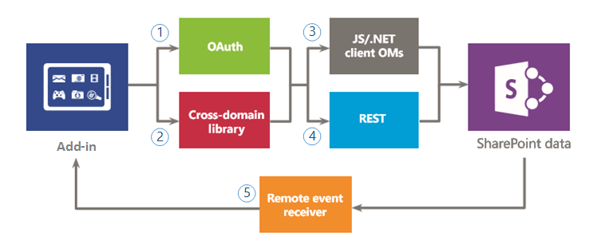

# Sicherer Datenzugriff und Clientobjektmodelle für SharePoint-Add-InsSecure data access and client object models for SharePoint Add-ins
Erfahren Sie mehr über die Datenzugriffsoptionen beim Erstellen von SharePoint-Add-Ins, wie z. B. Datenkonnektivitätsoptionen für den Zugriff auf Daten in SharePoint, und die verfügbaren APIs zum Zugriff auf Daten von Ihrem Add-In.Learn about the data access options you have when you build spappplural, including connectivity options for accessing data on spnv and on external systems, as well as the APIs that are available when you want to access data from your add-in.
 

 **Hinweis** Der Name „Apps für SharePoint“ wird in „SharePoint-Add-Ins“ geändert. Während des Übergangszeitraums wird in der Dokumentation und der Benutzeroberfläche einiger SharePoint-Produkte und Visual Studio-Tools möglicherweise weiterhin der Begriff „Apps für SharePoint“ verwendet. Weitere Informationen finden Sie unter [Neuer Name für Office- und SharePoint-Apps](new-name-for-apps-for-sharepoint#bk_newname).The name "apps for SharePoint" is changing to "SharePoint Add-ins". During the transition, the documentation and the UI of some SharePoint products and Visual Studio tools might still use the term "apps for SharePoint". For details, see [New name for apps for Office and SharePoint](new-name-for-apps-for-sharepoint#bk_newname).
 

Bei der Auswertung der Datenzugriffsoptionen für SharePoint-Add-Ins müssen Sie die Add-In-Umgebung und mehrere andere Faktoren berücksichtigen, wie z. B. die Kommunikation zwischen Client und Server sowie die Berechtigungsstufe, die Ihr Add-In benötigt, um die gewünschten Aufgaben auszuführen. Darüber hinaus sollten Sie die APIs im Modell für SharePoint-Add-Ins auswerten.In evaluating your data access options for spappplural, you have to assess your add-in environment and consider several factors, such as communication between the client and server, and the permission level that is required for your add-in to perform the required tasks. You also have to evaluate the APIs that are available in the spappmodel.
 

## Allgemeine Übersicht über Daten in SharePoint-Add-InsHigh-level overview of data in SharePoint Add-ins

Eine SharePoint-Add-In (oder ein beliebiges anderes Add-In), die keine Daten abfragt, speichert oder ändert, ist schwer vorstellbar. Häufig müssen in Add-Ins SharePoint-Daten, wie Elemente in Dokumentbibliotheken und Listen, Metadaten oder Benutzerprofile, abgerufen und bearbeitet werden. Entsprechend müssen Sie in bestimmten Szenarien von einer SharePoint-Seite oder -Komponente aus auf Daten zugreifen, die von Ihrem Add-In verfügbar gemacht werden. Das Modell für SharePoint-Add-Ins bietet mehrere Konnektivitätsoptionen und einen umfangreichen Satz von APIs für den Zugriff auf die Daten und Dienste in SharePoint und in externen Systemen.It is hard to imagine a SharePoint Add-in (or any add-in for that matter) that does not need to query, store, or manipulate data. In your add-in, you will frequently have to retrieve and manipulate SharePoint data, such as items in document libraries and lists, metadata, or user profiles. Similarly, you might have scenarios where you need to access external data in your add-in. The model for SharePoint Add-ins provides multiple connectivity options and a rich set of APIs for accessing the data and services that reside on SharePoint and on external systems.
 

 
Beim Entwurf eines Add-Ins und der Planung des Datenzugriffs müssen Sie im Wesentlichen zwei Entscheidungen fällen:As you design your add-in and plan for data access, you have to make two key decisions:
 

 

1. Welche Konnektivitätsoption soll ich verwenden?Which connectivity option should I use?
    
 
2. Welche APIs soll ich zum Zugriff auf die benötigten Daten verwenden?What APIs should I use for accessing the data I need?
    
 
In den folgenden Abbildungen sind die in Modell für SharePoint-Add-Ins verfügbaren Optionen zusammengefasst. In den folgenden Abschnitten werden die einzelnen Optionen ausführlich behandelt und ihre Einsatzmöglichkeiten beschrieben.The following figures summarize the different options that are provided by the model for SharePoint Add-ins. In the sections that follow, you will examine each option in detail and learn when to use them.
 

 
In Abbildung 1 sind die Optionen für den Zugriff auf SharePoint-Daten in Ihrem Add-In dargestellt. Bei diesen Szenarien müssen Sie entscheiden, ob die Authentifizierung und Kommunikation mit SharePoint mithilfe von (1) OAuth oder (2) derdomänenübergreifenden Bibliothek erfolgen soll. Anschließend müssen Sie sich bezüglich der Datenzugriffs-API entscheiden zwischen (3) demClientobjektmodell (JavaScript/.NET-Clientobjektmodelle) oder (4)REST (Representational State Transfer).Figure 1 illustrates the options you have for accessing SharePoint data in your add-in. When you are dealing with these scenarios, you have to decide whether you want to authenticate and communicate to SharePoint by using (1) OAuth, or (2) the cross-domain library. Then, for the data access API, you must decide between (3) the client object model (JavaScript/.NET client object models), or (4) Representational State Transfer (REST).
 

 
Beachten Sie, dass Sie auch auf bestimmte Daten mit (5)  *Remoteereignisempfängern*  zugreifen können. Das Hauptszenario für Remoteereignisempfänger ist aber die Ausführung von Remotecode.Keep in mind that you can also access certain data using (5)  *remote event receivers*  , however, the main scenario for remote event receivers is remote code execution.
 

 

**Abbildung 1. Optionen zur Verwendung von SharePoint-Daten in Ihrem Add-In****Figure 1. Options for using SharePoint data in your add-in**

 

 

 
In Abbildung 2 sind die Optionen für den Zugriff auf externe Daten von Ihrem Add-In aus dargestellt. Bei diesen Szenarien müssen Sie entscheiden, ob Sie (1) den  *Webproxy*  , (2) *externen Inhaltstypen*  oder (3) die *domänenübergreifende Bibliothek mit einer benutzerdefinierten Proxyseite*  für die Authentifizierung und Kommunikation mit externen Diensten oder Systemen verwenden möchten. Die können außerdem (4) dasClientobjektmodell (JavaScript/.NET-Clientobjektmodelle) oder (5)Representational State Transfer (REST) verwenden.Figure 2 shows the options that you have for accessing external data on your add-in. When you are working with these scenarios, you have to decide whether you want to use (1) the  *web proxy*  , (2) *external content types*  , or (3) the *cross-domain library with a custom proxy page*  to authenticate and communicate with external services or systems. You can also use (4) theclient object model (JavaScript/.NET client object models), or (5) Representational State Transfer (REST).
 

 

**Abbildung 2. Optionen zur Verwendung externer Daten in Ihrem Add-In****Figure 2. Options for using external data in your add-in**

 

 

 

 

 

## Datenkonnektivitätsoptionen für SharePoint-Add-InsData connectivity options for SharePoint Add-ins

Bei der Arbeit mit Daten in Ihrem Add-In müssen Sie mehrere Aspekte berücksichtigen. Welche Route nehmen die Daten? Kommen sie vom Server, oder durchlaufen sie den Server? Durchlaufen sie den Client? Ist eine Authentifizierung als der angemeldete Benutzer angemessen? Benötigt das Add-In erhöhte Rechte? In den folgenden Abschnitten werden diese und andere Fragen behandelt.You have to consider several aspects when you work with data in your add-in. For example, what route is the data using? Is it coming from or going through the server? Is it going through the client? Is it OK to authenticate as the logged-on user? Does the add-in need elevated privileges? The following sections can help you with these and other questions you may have.
 

 

### SharePoint-DatenkonnektivitätSharePoint data connectivity

Die folgenden Konnektivitätsoptionen sind verfügbar, wenn Sie auf SharePoint-Daten zugreifen (Abbildung 1):The following connectivity options are available when accessing SharePoint data (see Figure 1):
 

 

-  **OAuth:** Ein offenes Protokoll, das eine sichere Autorisierung auf einfache und standardmäßige Weise ermöglicht. Mit OAuth können Benutzer einer Anwendung erlauben, in ihrem Namen zu handeln, ohne ihren Benutzernamen und ihr Kennwort freizugeben. OAuth kann mit serverseitigem Code verwendet werden. Es stellt die geeignete Option dar, wenn Sie einen nicht interaktiven Prozess ausführen oder Rechte auf andere als die des angemeldeten Benutzers erhöhen müssen. Weitere Informationen zu OAuth finden Sie unter [Autorisierung und Authentifizierung für Add-Ins in SharePoint](authorization-and-authentication-of-sharepoint-add-ins).**OAuth:** An open protocol that enables secure authorization in a simple and standard way. OAuth enables users to approve an application to act on their behalf without sharing their user name and password. You can use OAuth with server-side code. It is a good option if you need to run a non-interactive process, or if you need to elevate privileges to other than those of the logged-on user. For information about OAuth, see [Authorization and authentication of SharePoint Add-ins](authorization-and-authentication-of-sharepoint-add-ins).
    
 
-  **Domänenübergreifende Bibliothek:** Eine clientseitige Alternative in Form einer auf der SharePoint-Website gehosteten JavaScript-Datei ( **SP.RequestExecutor.js** ), auf die Sie in dem Remote-Add-In verweisen können, sofern sie sich in derselben Internetzone befindet. Die domänenübergreifende Bibliothek ermöglicht die Interaktion mit mehreren Domänen auf der Remote-Add-In-Seite über einen Proxy. Diese Option ist geeignet, wenn Sie den Add-In-Code lieber auf dem Client als auf dem Server ausführen möchten oder wenn Konnektivitätsbarrieren, wie z. B. Firewalls, zwischen SharePoint und der Remoteinfrastruktur bestehen. Weitere Informationen finden Sie unter [Zugreifen auf SharePoint-Daten über Add-Ins mithilfe der domänenübergreifenden Bibliothek](access-sharepoint-2013-data-from-add-ins-using-the-cross-domain-library).**Cross-domain library:** A client-side alternative in the form of a JavaScript file ( **SP.RequestExecutor.js** ) hosted in the SharePoint website that you can reference in your remote add-in. The cross-domain library allows you to interact with more than one domain in your remote add-in page through a proxy. This is a good option if you prefer your add-in code to run in the client rather than in the server, or if there are connectivity barriers, such as firewalls, between SharePoint and your remote infrastructure. For more information, see [Access SharePoint data from add-ins using the cross-domain library](access-sharepoint-2013-data-from-add-ins-using-the-cross-domain-library).
    
 
-  **Remoteereignisempfänger:** Sie können Remoteereignisempfänger zum Behandeln von Ereignissen verwenden, die für ein Element in dem Add-In auftreten, z. B. eine Liste, ein Listenelement oder eine Website. Diese Ereignisse ähneln den Ereignissen in einer herkömmlichen SharePointLösung, Sie können jedoch außerdem mit den Remotekomponenten der SharePoint-Add-In zusammenarbeiten. Einige Eigenschaften des Elements sind für den Remoteereignisempfänger verfügbar. Weitere Informationen finden Sie unter [Erstellen eines Remoteereignisempfängers in Add-Ins für SharePoint](create-a-remote-event-receiver-in-sharepoint-add-ins). Auf ähnliche Weise können Sie auch Add-In-Ereignisempfänger verwenden, um die Installation, Aktualisierung und Deinstallation des Add-Ins anzupassen. Weitere Informationen finden Sie unter  [Erstellen eines Add-In-Ereignisempfängers in SharePoint-Add-Ins](create-an-add-in-event-receiver-in-sharepoint-add-ins).**Remote event receivers:** You can use remote event receivers to handle events that occur to an item in the add-in, such as a list, a list item, or a web. These events resemble those in a traditional SharePoint solution, except that they can work with the remote components of the SharePoint Add-in. Note that some properties of the item are available to the remote event receiver. For more information, see [Create a remote event receiver in SharePoint Add-ins](create-a-remote-event-receiver-in-sharepoint-add-ins). In a similar way, you can use add-in event receivers to customize how your add-in is installed, updated, and uninstalled. For more information, see  [Create an add-in event receiver in SharePoint Add-ins](create-an-add-in-event-receiver-in-sharepoint-add-ins).
    
 

### Optionen für SharePoint-Datenkonnektivität: Welche soll ich verwenden?SharePoint data connectivity options: Which one should I use?

In der folgenden Tabelle sind die allgemeinen Anforderungen und Szenarios aufgelistet, die bei der Erstellung von Add-Ins bestehen können. Ein **x** in der Spalte zeigt an, welche Option Sie jeweils verwenden können.The following table lists the common requirements and scenarios you might encounter when you are building add-ins. An **x** in the column indicates which option you can use in each case.
 

 

**Tabelle 1. Optionen für SharePoint-Datenkonnektivität****Table 1. SharePoint data connectivity options**

|**Anforderung/Szenario****Requirement/Scenario**|**OAuth****OAuth**|**Domänenübergreifende Bibliothek****Cross-domain library**|
|:-----|:-----|:-----|
|Ich verwende clientseitige Technologien (HTML + JavaScript).I use client-side technologies (HTML + JavaScript).||xx|
|Ich möchte REST-Schnittstellen verwenden.I want to use REST interfaces.|xx|xx|
|Zwischen SharePoint und meinem Remote-Add-In befindet sich eine Firewall, und ich muss die Aufrufe über den Browser senden.There is a firewall between SharePoint and my remote add-in, and I need to issue the calls through the browser.||xx|
|Das Add-In muss als der angemeldete Benutzer auf Ressourcen zugreifen.My add-in needs to access resources as the logged-on user.|xx|xx|
|Das Add-In muss Rechte über die des angemeldeten Benutzers hinaus erhöhen.My add-in needs to elevate privileges to other than those of the current logged-on user.|xx||
|Dias Add-In muss im Namen eines anderen als des angemeldeten Benutzers handeln.My add-in needs to act on behalf of a user other than the one who is logged on.|xx||
|Das Add-In muss nur Vorgänge ausführen, solange der Benutzer angemeldet ist.My add-in needs to perform operations only while the user is logged on.|xx|xx|
|Das Add-In muss auch Vorgänge ausführen, wenn der Benutzer nicht angemeldet ist.My add-in needs to perform operations even when the user is not logged on.|xx||
|Das Add-In muss Remotecode als Antwort auf ein Ereignis in SharePoint ausführen.My add-in needs to execute remote code as a response to an event in SharePoint.|||
Da Remoteereignisempfänger auf OAuth aufbauen, sollten Sie nicht einen Vergleich aus dieser Tabelle als Entscheidungshilfe heranziehen, ob diesen Empfänger verwenden sollten oder nicht. Verwenden Sie Remoteereignisempfänger, wenn Sie neben dem Datenaustausch auch Remotecode ausführen müssen.Since Remote Event Receivers are built on top of OAuth, a comparison in this table is not the best way to decide whether you should use them or not. Use Remote Event Receivers when you need to execute remote code in addition to data exchange.
 

 

### Externe DatenkonnektivitätExternal data connectivity

Die folgenden Konnektivitätsoptionen sind verfügbar, wenn Sie auf externe Daten zugreifen (Abbildung 2):The following connectivity options are available when accessing external data (see Figure 2):
 

 

-  **Webproxy:** Als Entwickler können Sie den Webproxy verwenden, der in Client-APIs wie JSOM verfügbar gemacht wird. Wenn Sie den Webproxy verwenden, senden Sie die ursprüngliche Anforderung an SharePoint. SharePoint fordert die Daten wiederum am angegebenen Endpunkt an und gibt die Antwort zurück an Ihre Seite. Verwenden Sie den Webproxy, wenn die Kommunikation auf der Serverebene stattfinden soll. Der Webproxy soll auf unstrukturierte Daten zugreifen, die keine Authentifizierung benötigen. Weitere Informationen finden Sie unter [Abfragen eines Remotediensts mithilfe des Webproxys in SharePoint](query-a-remote-service-using-the-web-proxy-in-sharepoint-2013).**Web proxy:** As a developer, you can use the web proxy exposed in client APIs such as the JSOM. When you use the web proxy, you issue the initial request to SharePoint. In turn, SharePoint requests the data to the specified endpoint and forwards the response back to your page. Use the web proxy when you want the communication to occur at the server level. The web proxy is designed to access unstructured data that doesn't require authentication. For more information, see [Query a remote service using the web proxy in SharePoint](query-a-remote-service-using-the-web-proxy-in-sharepoint-2013).
    
 
-  **Externe Inhaltstypen:** Sie können Add-Ins erstellen, die auf externe Daten von SAP und Netflix sowie auf proprietäre und andere Daten ohne Einbeziehung des Mandantenadministrators zugreifen. Der Zugriff auf externe Anwendungen wird über Business Connectivity Services (BCS) verwaltet, die eine konsistente und einheitliche Schnittstelle bereitstellen, die auch von anderen SharePoint-Anwendungen verwendet werden kann. Externe Inhaltstypen auf App-Ebene sind eine gute Alternative, wenn Sie ein BCS-Modell verwenden und auf Daten zugreifen, die authentifiziert werden müssen. Weitere Informationen finden Sie in [Add-in-bezogenen externen Inhaltstypen in SharePoint](http://msdn.microsoft.com/library/a34cbbba-dc38-4d3d-b796-d54b5848bdfb%28Office.15%29.aspx).**External content types:** You can create add-ins that access external data from SAP, Netflix, and proprietary and other types of data without involving the tenant administrator.Access to external applications is maintained through Business Connectivity Services (BCS), which provides a consistent and uniform interface that can be used by other SharePoint applications. App-scoped ECTs are a good option when you are using a BCS model and access to the data requires authentication. For more information, see [Add-in-scoped external content types in SharePoint](http://msdn.microsoft.com/library/a34cbbba-dc38-4d3d-b796-d54b5848bdfb%28Office.15%29.aspx).
    
 
-  **Benutzerdefinierte Proxyseite für die domänenübergreifende Bibliothek:** Sie können mit der domänenübergreifenden Bibliothek auf Daten in Ihrem Remote-Add-In zugreifen, wenn Sie eine benutzerdefinierte Proxyseite bereitstellen, die in der Remote-Add-In-Infrastruktur gehostet wird. Als Entwickler sind Sie für die Implementierung der benutzerdefinierten Proxyseite zuständig. Darüber hinaus müssen Sie sich um benutzerdefinierte Logik kümmern, z. B. den Authentifizierungsmechanismus gegenüber dem Remote-Add-In. Verwenden Sie die domänenübergreifende Bibliothek mit einer benutzerdefinierten Proxyseite, wenn die Kommunikation auf der Clientebene stattfinden soll. Weitere Inforationen finden Sie unter [Erstellen einer benutzerdefinierten Proxyseite für die domänenübergreifende Bibliothek in SharePoint](create-a-custom-proxy-page-for-the-cross-domain-library-in-sharepoint-2013).**Custom proxy page for the cross-domain library:** You can use the cross-domain library to access data in your remote add-in if you provide a custom proxy page that is hosted in the remote add-in infrastructure. As the developer, you are responsible for the custom proxy page implementation and must provide custom logic, such as the authentication mechanism to the remote add-in. Use the cross-domain library with a custom proxy page if you want the communication to occur at the client level. For more information, see [Create a custom proxy page for the cross-domain library in SharePoint](create-a-custom-proxy-page-for-the-cross-domain-library-in-sharepoint-2013).
    
 

### Optionen für externe Datenkonnektivität: Welche soll ich verwenden?External data connectivity options: Which one should I use?

In der folgenden Tabelle sind die allgemeinen Anforderungen und Szenarios aufgelistet, die bei der Erstellung von Add-Ins bestehen können. Ein **x** in der Spalte zeigt an, welche Option Sie jeweils verwenden können.The following table lists the common requirements and scenarios you might encounter when you are building add-ins. An **x** in the column indicates which option you can use in each case.
 

 

**Tabelle 2. Optionen für extern Datenkonnektivität****Table 2. External data connectivity options**

|**Anforderung/Szenario****Requirement/Scenario**|**Webproxy****Web proxy**|**Externe Inhaltstypen****External content types**|**Domänenübergreifende Bibliothek mit benutzerdefinierter Proxyseite****Cross-domain library with custom proxy page**|
|:-----|:-----|:-----|:-----|
|Ich verwende clientseitige Technologien (HTML + JavaScript).I use client-side technologies (HTML + JavaScript).|xx|xx|xx|
|Ich kann dem Remote-Add-In oder dem Remotedienst keine Seiten oder Komponenten hinzufügen.I cannot add pages or components to the remote add-in or service.|xx|xx||
|Ich möchte REST-Schnittstellen verwenden.I want to use REST interfaces.|xx|xx|xx|
|Ich möchte das JavaScript-CSOM verwenden.I want to use the JavaScript CSOM.|xx|xx|xx|
|Ich möchte das .NET-CSOM verwenden.I want to use the .NET CSOM.|xx|xx||
|Es besteht keine direkte Konnektivität zwischen der SharePoint-Infrastruktur und meinem Add-In. Ich muss Aufrufe über den Browser senden.There is no direct connectivity between the SharePoint infrastructure and my add-in. I need to issue calls through the browser.||xx|xx|
|Das Add-In muss als der angemeldete Benutzer auf Ressourcen zugreifen.My add-in needs to access resources as the logged-on user.|xx|xx|xx|

## Verfügbare Datenzugriffs-APIs für SharePoint-Add-InsAvailable data access APIs for SharePoint Add-ins

Für den Zugriff auf SharePoint-Daten von Ihrem Add-In aus stehen Ihnen die folgenden APIs zur Verfügung:The following API choices are available when you want to access SharePoint data from your add-in:
 

 

-  **REST (Representational State Transfer):** Für den Zugriff auf SharePoint-Entitäten über Clienttechnologien, die nicht JavaScript verwenden und nicht auf den Plattformen .NET Framework basieren, bietet SharePoint eine Implementierung eines REST-Webdiensts, der CRUDQ-Vorgänge (Create, Read, Update, Delete, and Query) bei SharePointDaten über das [OData-Protokoll (Open Data)](http://www.odata.org/) ausführt. Zudem verfügt nahezu jede API in den Clientobjektmodellen über einen entsprechenden REST-Endpunkt. Dadurch kann im Code mithilfe jeder Technologie, die REST-Standardfunktionen unterstützt, direkt mit SharePoint interagiert werden. Zur Verwendung der in SharePoint integrierten REST-Funktionen wird im Code eine "RESTful HTTP"-Anforderung an einen Endpunkt generiert, der dem gewünschten SharePoint-Objekt entspricht. Der REST-Dienst behandelt die HTTP-Anforderung und liefert eine Antwort im Atom- oder JavaScript Object Notation (JSON)-Format. Weitere Informationen zu REST in SharePoint finden Sie unter [Verwenden von OData-Abfragevorgängen in SharePoint REST-Anforderungen](use-odata-query-operations-in-sharepoint-rest-requests).**Representational State Transfer (REST):** For scenarios in which you need to access SharePoint entities from client technologies that do not use JavaScript and are not built on the .NET Framework platform, SharePoint provides an implementation of a REST web service that uses the [Open Data (OData) protocol](http://www.odata.org/) to perform CRUDQ (Create, Read, Update, Delete, and Query) operations on SharePoint data. In addition, nearly every API in the client object models has a corresponding REST endpoint. This enables your code to interact directly with SharePoint by using any technology that supports standard REST capabilities. To use the REST capabilities that are built into SharePoint, your code constructs a RESTful HTTP request to an endpoint that corresponds to the desired SharePoint object. The REST service handles the HTTP request and serves a response in either Atom or JavaScript Object Notation (JSON) format. To learn more about REST in SharePoint, see [Use OData query operations in SharePoint REST requests](use-odata-query-operations-in-sharepoint-rest-requests).
    
 
-  **.NET Framework-Clientobjektmodell (.NET-Client-OM):** Nahezu jede Klasse im zentralen serverseitigen Objektmodell für Websites und Listen verfügt über eine entsprechende Klasse im .NET Framework-Clientobjektmodell. Darüber hinaus bietet das .NET Framework-Clientobjektmodell einen vollständigen Satz von APIs zur Erweiterung anderer Features, einschließlich einiger Features auf SharePoint-Ebene, wie ECM, Taxonomie, Benutzerprofile, erweiterte Suche, Analyse, BCS und andere. Weitere Informationen zu clientseitigen Objektmodellen finden Sie unter [Auswählen des richtigen API-Satzes in SharePoint](http://msdn.microsoft.com/library/f36645da-77c5-47f1-a2ca-13d4b62b320d%28Office.15%29.aspx).**.NET Framework client object model (.NET client OM):** Almost every class in the core site and list server-side object model has a corresponding class in the .NET Framework client object model. In addition, the .NET Framework client object model also exposes a full set of APIs for extending other features, including some SharePoint-level features such as ECM, taxonomy, user profiles, advanced search, analytics, BCS, and others. To learn more about client-side object models, see [Choose the right API set in SharePoint](http://msdn.microsoft.com/library/f36645da-77c5-47f1-a2ca-13d4b62b320d%28Office.15%29.aspx).
    
 
-  **JavaScript-Clientobjektmodell (JS-Client-OM):** SharePoint bietet ein JavaScript-Objektmodell zur Verwendung in Inlineskript oder in gesonderten .JS-Dateien. Es umfasst die gleiche Funktionalität wie das .NET Framework-Clientobjektmodell. Das JSOM ist nützlich, um benutzerdefinierten SharePoint-Code in ein Add-In einzuschließen, da benutzerdefinierter serverseitiger Code insbesondere in Von SharePoint gehostetes Add-In nicht zulässig ist. Zudem können Webentwickler ihre vorhandenen JavaScript-Kenntnisse für die Erstellung von SharePoint-Add-Ins mit einer minimalen Lernkurve nutzen. Weitere Informationen zu clientseitigen Objektmodellen finden Sie unter [Auswählen des richtigen API-Satzes in SharePoint](http://msdn.microsoft.com/library/f36645da-77c5-47f1-a2ca-13d4b62b320d%28Office.15%29.aspx).**JavaScript client object model (JSOM):** SharePoint provides a JavaScript object model for use in either inline script or separate .js files. It includes all the same functionality as the .NET Framework client object model. The JSOM is a useful way of including custom SharePoint code in an add-in, especially in a SharePoint-hosted add-in, where custom server-side code is not allowed. It also enables web developers to use their existing JavaScript skills to create SharePoint Add-ins with a minimal learning curve. To learn more about client-side object models, see [Choose the right API set in SharePoint](http://msdn.microsoft.com/library/f36645da-77c5-47f1-a2ca-13d4b62b320d%28Office.15%29.aspx).
    
 
Möglicherweise gibt es weitere APIs, die Sie mit SharePoint-Add-In verwenden können, wenn Sie auf externe Daten zugreifen. Dies hängt aber von den Schnittstellen der externen Dienste und Systeme ab Sie sollten diese Schnittstellen auch bei Ihrem Entwurf berücksichtigen.There might be additional APIs that you can use in your SharePoint Add-in when accessing external data. It depends on what interfaces the external services and systems have to offer. You should also consider these interfaces in your design.
 

 

## Zusätzliche RessourcenAdditional resources

-  [Autorisierung und Authentifizierung von SharePoint-Add-InsAuthorization and authentication of SharePoint Add-ins](authorization-and-authentication-of-sharepoint-add-ins)
    
 
-  [Zugreifen auf SharePoint-Daten über Add-Ins mithilfe der domänenübergreifenden BibliothekAccess SharePoint data from add-ins using the cross-domain library](access-sharepoint-2013-data-from-add-ins-using-the-cross-domain-library)
    
 
-  [Erstellen einer benutzerdefinierten Proxyseite für die domänenübergreifende Bibliothek in SharePointCreate a custom proxy page for the cross-domain library in SharePoint](create-a-custom-proxy-page-for-the-cross-domain-library-in-sharepoint-2013)
    
 
-  [Abfragen eines Remotediensts mithilfe des Webproxys in SharePointQuery a remote service using the web proxy in SharePoint](query-a-remote-service-using-the-web-proxy-in-sharepoint-2013)
    
 
-  [Erstellen eines Remoteereignisempfängers in SharePoint-Add-InsCreate a remote event receiver in SharePoint Add-ins](create-a-remote-event-receiver-in-sharepoint-add-ins)
    
 
-  [Auswählen des richtigen API-Satzes in SharePointChoose the right API set in SharePoint](http://msdn.microsoft.com/library/f36645da-77c5-47f1-a2ca-13d4b62b320d%28Office.15%29.aspx)
    
 
-  [Verwenden von OData-Abfragevorgängen in SharePoint REST-AnforderungenUse OData query operations in SharePoint REST requests](use-odata-query-operations-in-sharepoint-rest-requests)
    
 

