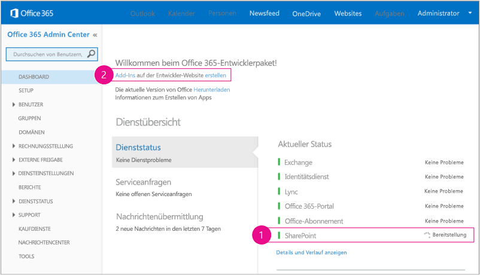

# Einrichten einer Entwicklungsumgebung für SharePoint-Add-Ins in Office 365

Bevor Sie die Anleitungen in diesem Artikel umsetzen, sollten Sie sich einen Überblick über Ihre Optionen verschaffen. Lesen Sie dazu den Artikel [Tools und Umgebungen für die Entwicklung von SharePoint-Add-Ins](tools-and-environments-for-developing-sharepoint-add-ins.md). 

Wenn Sie sich nicht sicher sind, welche Art SharePoint-Add-In Sie erstellen möchten, ist der Artikel [SharePoint Add-ins](sharepoint-add-ins.md) hilfreich.
 

## Installieren von Visual Studio und Tools auf Ihrem Computer

- Falls Sie **Visual Studio 2013** oder höher noch nicht installiert haben: Installieren Sie es mithilfe der Anweisungen unter [Installieren von Visual Studio](https://docs.microsoft.com/de-DE/visualstudio/install/install-visual-studio). Wir empfehlen die Verwendung der [aktuellen Version aus dem Microsoft Download Center](https://www.visualstudio.com/downloads/download-visual-studio-vs).

- Visual Studio umfasst die **Microsoft Office Developer Tools für Visual Studio**. Gelegentlich wird jedoch zwischen zwei Updates von Visual Studio eine neue Version der Tools veröffentlicht. Führen Sie das [Installationsprogramm für Office Developer Tools für Visual Studio 2013](http://aka.ms/OfficeDevToolsForVS2013) oder das [Installationsprogramm für Office Developer Tools für Visual Studio 2015](http://aka.ms/OfficeDevToolsForVS2015) aus, um sicherzustellen, dass Sie die aktuelle Version der Tools haben. 

### Ausführliche Protokollierung in Visual Studio

Gehen Sie wie folgt vor, wenn Sie die ausführliche Protokollierung aktivieren möchten:

1. Öffnen Sie die Registrierung, und navigieren Sie zu **HKEY_CURRENT_USER\Software\Microsoft\VisualStudio\ _nn.n_\SharePointTools**. Dabei ist _nn.n_ die Version von Visual Studio, beispielsweise 12.0 oder 14.0.

2. Fügen Sie einen DWORD-Schlüssel mit dem Namen **EnableDiagnostics** hinzu.

3. Geben Sie dem Schlüssel den Wert **1**.

In zukünftigen Versionen von Visual Studio wird ein anderer Registrierungspfad verwendet werden.

## Registrieren für eine Office 365-Entwicklerwebsite

> [!NOTE]
> Möglicherweise haben Sie bereits Zugriff auf eine Office 365-Entwicklerwebsite: 
> - **Sind Sie MSDN-Abonnent?** Visual Studio Enterprise mit MSDN-Abonnenten erhalten als Bonus ein einjähriges Office 365 Developer-Abonnement. [Lösen Sie Ihren Bonus heute ein.](https://msdn.microsoft.com/subscriptions/manage/default.aspx) 
> - **Besitzen Sie einen der folgenden Office 365-Abonnementpläne?** Wenn ja, kann ein Administrator des jeweiligen Office 365-Abonnements über das [Office 365 Admin Center](https://portal.microsoftonline.com/admin/default.aspx) eine Entwicklerwebsite für Sie erstellen. Weitere Informationen finden Sie unter [Erstellen einer Entwicklerwebsite in einem vorhandenen Office 365-Abonnement](create-a-developer-site-on-an-existing-office-365-subscription.md). 
 

Sie haben drei Möglichkeiten, einen Office 365-Plan zu erhalten:

- Sie können die [kostenlose 30-Tage-Testversion](https://portal.microsoftonline.com/Signup/MainSignUp.aspx?OfferId=6881A1CB-F4EB-4db3-9F18-388898DAF510&amp;DL=DEVELOPERPACK) nutzen, die eine einzige Benutzerlizenz enthält.

- Sie können ein [Office 365-Entwicklerabonnement](https://portal.microsoftonline.com/Signup/MainSignUp.aspx?OfferId=C69E7747-2566-4897-8CBA-B998ED3BAB88&amp;DL=DEVELOPERPACK) erwerben. 

- Sie können sich über das Office 365-Entwicklerprogramm für ein kostenloses Office 365-Entwicklerkonto mit einem Jahr Laufzeit registrieren. Weitere Informationen finden Sie [hier](http://dev.office.com/devprogram). Alternativ können Sie direkt das [Registrierungsformular](https://profile.microsoft.com/RegSysProfileCenter/wizardnp.aspx?wizid=14b845d0-938c-45af-b061-f798fbb4d170) ausfüllen. Nach der Registrierung für das Entwicklerprogramm erhalten Sie eine E-Mail mit einem Link, unter dem Sie sich für ein Entwicklerkonto registrieren können. Nachfolgend finden Sie eine Anleitung.

> [!TIP]
> Öffnen Sie diese Links in einem anderen Fenster oder auf einer anderen Registerkarte, damit Sie die Anleitung jederzeit einsehen können.

1. Die erste Seite des Registrierungsformulars ist selbsterklärend. Geben Sie die geforderten Informationen ein, und klicken Sie anschließend auf **Next**.
    
2. Geben Sie auf der zweiten Seite, die in Abbildung 1 gezeigt ist, eine Benutzer-ID für den Administrator des Abonnements an.
    
   *Abbildung 1: Domänenname der Office 365-Entwicklerwebsite*

    

3. Erstellen Sie eine Unterdomäne von **.onmicrosoft.com**, zum Beispiel „contoso.onmicrosoft.com“. 
    
    Sobald die Registrierung abgeschlossen ist, können Sie sich mit den daraus resultierenden Anmeldeinformationen (im Format *Benutzer-ID@ihredomäne.onmicrosoft.com*) bei Ihrer Office 365-Portalwebsite anmelden und dort Ihr Konto verwalten. Ihre SharePoint Online-Entwicklerwebsite wird in Ihrer neuen Domäne bereitgestellt: `http://yourdomain.sharepoint.com`.

4. Klicken Sie auf **Next**, und füllen Sie die letzte Seite des Formulars aus. Wenn Sie sich telefonisch einen Bestätigungscode durchgeben lassen möchten, können Sie wahlweise eine Mobiltelefonnummer oder eine Festnetznummer angeben. VoIP-Nummern (Voice over Internet Protocol) werden jedoch *nicht* unterstützt.

   > [!NOTE]
   > Falls Sie zum Zeitpunkt Ihrer Registrierung für ein Entwicklerkonto noch bei einem anderen Microsoft-Konto angemeldet sind, wird unter Umständen die folgende Meldung angezeigt: „Sorry, that user ID you entered didn‘t work. It looks like it's not valid. Be sure you enter the user ID that your organization assigned to you. Your user ID usually looks like *someone@example.com* or *someone@example.onmicrosoft.com*.“ 
   
   > Sollte diese Meldung angezeigt werden, müssen Sie sich von dem betreffenden Microsoft-Konto abmelden und die Registrierung erneut versuchen. Wird Ihnen die Meldung weiterhin angezeigt: Leeren Sie den Cache Ihres Browsers, oder schalten Sie um auf **InPrivate-Browsen**, und füllen Sie das Formular erneut aus.

   Sobald der Registrierungsprozess abgeschlossen ist, wird in Ihrem Browser die Office 365-Installationsseite geöffnet. Klicken Sie auf das Symbol **Admin**, um das Admin Center zu öffnen.

   *Abbildung 2: Office 365 Admin Center-Seite*

   

5. Warten Sie, bis der Einrichtungsprozess für Ihre Entwicklerwebsite abgeschlossen ist. Nach Abschluss der Bereitstellung aktualisieren Sie die Admin Center-Seite im Browser.
    
6. Klicken Sie oben links auf der Seite auf **Build Add-ins**, um Ihre Entwicklerwebsite zu öffnen. Nun sollten Sie eine Website sehen, die wie Abbildung 3 aussieht. Dass die Liste **Add-ins in Testing** auf der Seite angezeigt wird, ist der Beleg dafür, dass die Website auf Basis der Vorlage für SharePoint-Entwicklerwebsites erstellt wurde. Falls stattdessen eine normale Teamwebsite angezeigt wird: Warten Sie einige Minuten, und starten Sie dann die Website neu.
 
7. Notieren Sie die URL der Website. Diese wird verwendet, wenn Sie SharePoint-Add-Ins-Projekte in Visual Studio erstellen.

   *Abb. 3: Die Startseite Ihrer Entwicklerwebsite mit der Liste der Add-Ins im Test*

   
 

## Siehe auch

- [SharePoint-Add-Ins](sharepoint-add-ins.md)
- [Erste Schritte beim Erstellen von von einem Anbieter gehosteten SharePoint-Add-Ins](get-started-creating-provider-hosted-sharepoint-add-ins.md)
- [Erste Schritte zum Erstellen SharePoint-gehosteter SharePoint-Add-Ins](get-started-creating-sharepoint-hosted-sharepoint-add-ins.md) 
- [Visual Studio-Dokumentation](https://docs.microsoft.com/de-DE/visualstudio/)
- [Installieren älterer Versionen von Visual Studio](https://msdn.microsoft.com/library/da049020-cfda-40d7-8ff4-7492772b620f.aspx)
    
 
