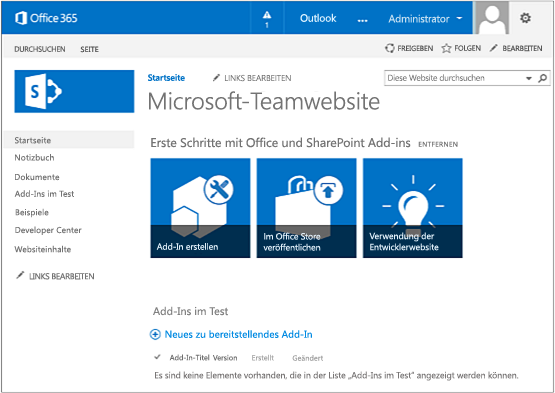

# Einrichten einer Entwicklungsumgebung für SharePoint-Add-Ins in Office 365
Einrichten einer Entwicklungsumgebung für SharePoint-Add-Ins auf einer Office 365-Entwicklerwebsite
 

 **Hinweis** Der Name „Apps für SharePoint“ wird in „SharePoint-Add-Ins“ geändert. Während des Übergangszeitraums wird in der Dokumentation und der Benutzeroberfläche einiger SharePoint-Produkte und Visual Studio-Tools möglicherweise weiterhin der Begriff „Apps für SharePoint“ verwendet. Weitere Informationen finden Sie unter [Neuer Name für Office- und SharePoint-Apps](new-name-for-apps-for-sharepoint.md#bk_newname).
 

Lesen Sie [Tools und Umgebungen für die Entwicklung von Add-Ins für SharePoint](tools-and-environments-for-developing-sharepoint-add-ins.md), um Ihre Optionen zu verstehen, bevor Sie die Verfahren in diesem Artikel ausführen. Sie finden weitere Informationen unter  [SharePoint-Add-Ins](sharepoint-add-ins.md), wenn Sie nicht sicher sind, welche Arten von SharePoint-Add-Ins Sie erstellen möchten.
 

## Installieren von Visual Studio und Tools auf Ihrem Computer

- Wenn Sie **Visual Studio** 2013 oder höher noch nicht installiert haben, installieren Sie es mithilfe der Anweisungen unter [Install Visual Studio](http://msdn.microsoft.com/library/da049020-cfda-40d7-8ff4-7492772b620f.aspx). Wir empfehlen die Verwendung der [aktuellsten Version aus dem Microsoft Download Center](https://www.visualstudio.com/downloads/download-visual-studio-vs).
    
 
- Visual Studio umfasst **Microsoft Office Developer Tools für Visual Studio**, es gibt jedoch auch Fälle, in denen eine Version der Tools zwischen den Updates von Visual Studio veröffentlicht wird. Um sicherzustellen, dass Sie die aktuellste Version der Tools verwenden, führen Sie das [Installationsprogramm für Office Developer Tools für Visual Studio 2013](http://aka.ms/OfficeDevToolsForVS2013) oder das [Installationsprogramm für Office Developer Tools für Visual Studio 2015](http://aka.ms/OfficeDevToolsForVS2015) aus. 
    
 

### Ausführliche Protokollierung in Visual Studio

Führen Sie die folgenden Schritte aus, wenn Sie die ausführliche Protokollierung aktivieren möchten:
 

 

1. Öffnen Sie die Registrierung, und navigieren Sie zu **HKEY_CURRENT_USER\Software\Microsoft\VisualStudio\ _nn.n_\SharePointTools**, wobei _nn.n_ die Version von Visual Studio ist, z. B. 12.0 oder 14.0.
    
 
2. Fügen Sie einen DWORD-Schlüssel mit dem Namen **EnableDiagnostics** hinzu.
    
 
3. Geben Sie dem Schlüssel den Wert **1**.
    
 
Der Registrierungspfad wird sich in kommenden Versionen von Visual Studio ändern.
 

 

## Registrieren für eine Office 365-Entwicklerwebsite

 **Hinweis** Sie haben möglicherweise bereits Zugriff auf eine Office 365-Entwicklerwebsite: **Sind Sie MSDN-Abonnent?** Visual Studio Enterprise mit MSDN-Abonnenten erhalten ein Office 365-Entwicklerabonnement als Vorteil. [Lösen Sie Ihren Vorteil noch heute ein. ](https://msdn.microsoft.com/subscriptions/manage/default.aspx) **Haben Sie einen der folgenden Office 365-Abonnementpläne?** **Wenn ja, kann ein Administrator des Office 365-Abonnements eine Entwicklerwebsite erstellen**, und zwar im [Office 365 Admin Center](https://portal.microsoftonline.com/admin/default.aspx). Weitere Informationen finden Sie unter [Erstellen einer Entwicklerwebsite in einem vorhandenen Office 365-Abonnement](create-a-developer-site-on-an-existing-office-365-subscription.md). 
 

Es gibt drei Wege, um einen Office 365-Plan zu erhalten. 
 

 

- Registrieren Sie sich über das Office 365-Entwicklerprogramm für ein kostenloses einjähriges Office 365-Entwicklerkonto.  [Informieren Sie sich ausführlicher](http://dev.office.com/devprogram), oder wechseln Sie direkt zum  [Registrierungsformular](https://profile.microsoft.com/RegSysProfileCenter/wizardnp.aspx?wizid=14b845d0-938c-45af-b061-f798fbb4d170). Nach der Registrierung für das Entwicklerprogramm erhalten Sie eine E-Mail mit einem Link, über den Sie sich für das Entwicklerkonto registrieren können. Beachten Sie die nachstehenden Anweisungen.
    
 
- Beginnen Sie mit einer [kostenlosen 30-Tage-Testversion](https://portal.microsoftonline.com/Signup/MainSignUp.aspx?OfferId=6881A1CB-F4EB-4db3-9F18-388898DAF510&amp;DL=DEVELOPERPACK) mit einer Benutzerlizenz.
    
 
- Erwerben Sie ein [Office 365 Developer-Abonnement](https://portal.microsoftonline.com/Signup/MainSignUp.aspx?OfferId=C69E7747-2566-4897-8CBA-B998ED3BAB88&amp;DL=DEVELOPERPACK). 
    
 

 **Tipp** Öffnen Sie diese Links in einem anderen Fenster oder einer anderen Registerkarte, damit die nachfolgenden Anweisungen übersichtlich bleiben.
 

**Abb. 1. Domänenname der Office 365-Entwicklerwebsite**

 

 

 

 

 

 

1. Die erste Seite (nicht abgebildet) des Registrierungsformulars ist selbsterklärend. Geben Sie einfach die erforderlichen Informationen zu Ihrer Person an, und wählen Sie **Weiter** aus.
    
 
2. Geben Sie auf der zweiten Seite, die in Abbildung 1 gezeigt ist, eine Benutzer-ID für den Administrator des Abonnements an.
    
 
3. Erstellen Sie eine Unterdomäne von **.onmicrosoft.com**. 
    
    Nach der Registrierung müssen Sie die resultierenden Anmeldeinformationen (im Format _UserID_@ _IhreDomäne_.onmicrosoft.com) benutzen, um sich auf Ihrer Office 365-Portalwebsite anzumelden, auf der Sie Ihr Konto verwalten. Ihre SharePoint Online-Entwicklerwebsite wird unter Ihrer neuen Domäne **http:// _IhreDomäne_.sharepoint.com** bereitgestellt.
    
 
4. Wählen Sie **Weiter** aus, und füllen Sie die letzte Seite des Formulars aus. Wenn Sie eine Telefonnummer bereitstellen, um Ihren Bestätigungscode zu erhalten, können Sie eine Mobil- oder Festnetznummer, aber *keine* VoIP-Nummer (Voice over Internet Protocol) bereitstellen.
    
 

    
 **Hinweis** Wenn Sie beim Versuch, sich bei einem Entwicklerkonto anzumelden, bei einem anderen Microsoft-Konto angemeldet sind, wird möglicherweise die folgende Nachricht angezeigt: „Die eingegebene Benutzer-ID hat leider nicht funktioniert. Sie ist anscheinend nicht gültig. Geben Sie die Benutzer-ID ein, die Ihnen von Ihrem Unternehmen zugewiesen wurde. Ihre Benutzer-ID hat in der Regel das Format *someone@example.com* oder *someone@example.onmicrosoft.com*.“ Wenn diese Meldung angezeigt wird, melden Sie sich von dem Microsoft-Konto ab, das Sie verwendet haben, und versuchen Sie es erneut. Wenn Sie weiterhin die Meldung erhalten, löschen Sie den Browsercache, oder wechseln Sie zu **InPrivate-Browsen**, und füllen Sie dann das Formular aus.
 

Nachdem Sie die Registrierung abgeschlossen haben, wird in Ihrem Browser die Office 365-Installationsseite geöffnet. Wählen Sie das Admin-Symbol aus, um die Admin Center-Seite zu öffnen.
 

 

**Abb. 2. Office 365 Admin Center-Seite**

 

 

 

 

1. Warten Sie, bis der Bereitstellungsprozess für Ihre Entwicklerwebsite abgeschlossen ist. Nach Abschluss der Bereitstellung aktualisieren Sie die Admin Center-Seite im Browser.
    
 
2. Wählen Sie dann links oben den Link **Add-Ins erstellen** aus, um Ihre Website für Entwickler zu öffnen. Sie sollten eine Website wie in Abbildung 3 dargestellt sehen. Auf der Seite wird die Liste **Add-Ins im Test** angezeigt. Damit wird bestätigt, dass die Website mit der Entwicklerwebsitevorlage von SharePoint erstellt wurde. Wird stattdessen eine Teamwebsite angezeigt, warten Sie einige Minuten und starten dann Ihre Website erneut.
    
 
3. Notieren Sie die URL der Website. Diese wird verwendet, wenn Sie SharePoint-Add-Ins-Projekte in Visual Studio erstellen.
    
 

**Abb. 3: Die Startseite Ihrer Entwicklerwebsite mit der Liste der Add-Ins im Test**

 

 

 

 

 

## Zusätzliche Ressourcen

-  [SharePoint-Add-Ins](sharepoint-add-ins.md)
    
 
-  [Erste Schritte beim Erstellen von von einem Anbieter gehosteten SharePoint-Add-Ins](get-started-creating-provider-hosted-sharepoint-add-ins.md)
    
 
-  [Erste Schritte beim Erstellen von von SharePoint gehosteten SharePoint-Add-Ins](get-started-creating-sharepoint-hosted-sharepoint-add-ins.md)
    
 

 

 

