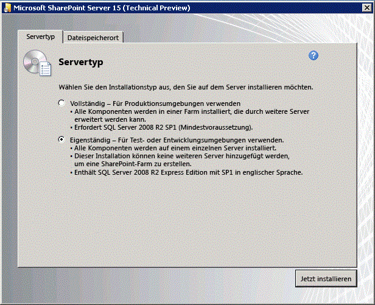

# <a name="set-up-an-on-premises-development-environment-for-sharepoint-add-ins"></a><span data-ttu-id="555f9-103">Einrichten einer lokalen Entwicklungsumgebung für SharePoint-Add-Ins</span><span class="sxs-lookup"><span data-stu-id="555f9-103">Set up an on-premises development environment for SharePoint Add-ins</span></span>

<span data-ttu-id="555f9-104">Die Anforderungen für eine Entwicklungsumgebung sind weniger strikt und nicht so kostspielig wie die Anforderungen für eine Produktionsumgebung, und die hier beschriebenen Richtlinien gelten nicht für die Installation einer Produktionsumgebung.</span><span class="sxs-lookup"><span data-stu-id="555f9-104">The requirements for a development environment are less stringent and costly than the requirements for a production environment, and the guidelines described here do not support a production environment installation.</span></span> 

<span data-ttu-id="555f9-105">Die Anweisungen zur Installation einer SharePoint-Produktionsumgebung finden Sie unter:</span><span class="sxs-lookup"><span data-stu-id="555f9-105">For the instructions to set up a production environment installation of SharePoint, see:</span></span>

- [<span data-ttu-id="555f9-106">Übersicht über die SharePoint-Installation und -Konfiguration</span><span class="sxs-lookup"><span data-stu-id="555f9-106">Overview of SharePoint installation and configuration</span></span>](http://technet.microsoft.com/de-DE/library/ee667264%28v=office.15%29)
- [<span data-ttu-id="555f9-107">Hardware- und Softwareanforderungen für SharePoint</span><span class="sxs-lookup"><span data-stu-id="555f9-107">Hardware and software requirements for SharePoint</span></span>](http://technet.microsoft.com/de-DE/library/cc262485%28v=office.15%29)
- [<span data-ttu-id="555f9-108">Konfigurieren einer Umgebung für SharePoint-Add-Ins</span><span class="sxs-lookup"><span data-stu-id="555f9-108">Configure an environment for SharePoint Add-ins</span></span>](http://technet.microsoft.com/de-DE/library/fp161236%28office.15%29.aspx) 

<span data-ttu-id="555f9-109"><a name="bk_installOS"> </a></span><span class="sxs-lookup"><span data-stu-id="555f9-109"><a name="bk_installOS"> </a></span></span>
## <a name="install-the-operating-system-for-your-development-environment-for-sharepoint-add-ins"></a><span data-ttu-id="555f9-110">Installieren des Betriebssystems für Ihre Entwicklungsumgebung für SharePoint-Add-Ins</span><span class="sxs-lookup"><span data-stu-id="555f9-110">Install the operating system for your development environment for SharePoint Add-ins</span></span>

<span data-ttu-id="555f9-111">In jeder Entwicklungsumgebung sollten Sie einen Computer mit einer x64-fähigen CPU und mindestens 16 Gigabyte (GB) RAM für die Installation und Ausführung von SharePoint verwenden (24 GB RAM empfohlen).</span><span class="sxs-lookup"><span data-stu-id="555f9-111">In any development environment, you should use a computer with an x64-capable CPU, and at least 16 GB of RAM to install and run SharePoint; 24 GB of RAM is preferable.</span></span>

<span data-ttu-id="555f9-112">Je nach Ihren spezifischen Anforderungen und Ihrem Budget können Sie unter folgenden Optionen wählen:</span><span class="sxs-lookup"><span data-stu-id="555f9-112">Depending on your specific requirements and budget, you can choose from the following options:</span></span>

- <span data-ttu-id="555f9-113">Installieren von SharePoint unter Windows Server 2008 R2 Servicepack 1 x64 oder Windows Server 2012.</span><span class="sxs-lookup"><span data-stu-id="555f9-113">Install SharePoint on Windows Server 2008 R2 Service Pack 1 x64 or Windows Server 2012.</span></span>
 
- <span data-ttu-id="555f9-114">Verwenden Sie Microsoft Hyper-V und installieren Sie SharePoint auf einem virtuellen Computer mit dem Gastbetriebssystem Windows Server 2008 R2 Service Pack 1 X64 oder Windows Server 2012.</span><span class="sxs-lookup"><span data-stu-id="555f9-114">Use Microsoft Hyper-V and install SharePoint on a virtual machine running a Windows Server 2008 R2 Service Pack 1 x64 or a Windows Server 2012 guest operating system.</span></span> <span data-ttu-id="555f9-115">Eine Anleitung zum Einrichten eines virtuellen Microsoft Hyper-V-Computers für SharePoint finden Sie unter [Anwenden bewährter Konfigurationsmethoden für virtuelle SharePoint-Computer und Hyper-V-Umgebung](http://technet.microsoft.com/de-DE/library/ff621103%28v=office.15%29.aspx).</span><span class="sxs-lookup"><span data-stu-id="555f9-115">For guidance on setting up a Microsoft Hyper-V virtual machine for SharePoint, see [Use best practice configurations for the SharePoint virtual machines and Hyper-V environment](http://technet.microsoft.com/de-DE/library/ff621103%28v=office.15%29.aspx).</span></span> 
    
> [!NOTE]
> <span data-ttu-id="555f9-116">Die Installation von SharePoint wir nur unter Windows Server 2008 R2 Servicepack 1 x64 oder Windows Server 2012 unterstützt.</span><span class="sxs-lookup"><span data-stu-id="555f9-116">Installation of SharePoint is supported only on Windows Server 2008 R2 Service Pack 1 x64 or Windows Server 2012.</span></span> <span data-ttu-id="555f9-117">Wenn Sie SharePoint-Add-Ins für SharePoint unter Windows 7 oder Windows 8 entwickeln möchten, können Sie sich für eine Office 365 Entwicklerwebsite registrieren und Add-Ins remote entwickeln.</span><span class="sxs-lookup"><span data-stu-id="555f9-117">If you want to develop SharePoint Add-ins for SharePoint on Windows 7 or Windows 8, you can sign up for an Office 365 Developer Site and develop add-ins remotely.</span></span> 

<span data-ttu-id="555f9-118"><a name="bk_prereqsOS"> </a></span><span class="sxs-lookup"><span data-stu-id="555f9-118"><a name="bk_prereqsOS"> </a></span></span>
## <a name="install-the-prerequisites-for-the-operating-system-and-sharepoint"></a><span data-ttu-id="555f9-119">Installieren der Voraussetzungen für das Betriebssystem und SharePoint</span><span class="sxs-lookup"><span data-stu-id="555f9-119">Install the prerequisites for the operating system and SharePoint</span></span>

1. <span data-ttu-id="555f9-120">Führen Sie das Tool „PrerequisiteInstaller.exe“ aus, das in Ihren Installationsdateien enthalten ist.</span><span class="sxs-lookup"><span data-stu-id="555f9-120">Run the PrerequisiteInstaller.exe tool that is included with your installation files.</span></span>

2. <span data-ttu-id="555f9-121">Führen Sie das in den Installationsdateien enthaltene Setup.exe-Tool aus.</span><span class="sxs-lookup"><span data-stu-id="555f9-121">Run the Setup.exe tool that is included with your installation files.</span></span>

3. <span data-ttu-id="555f9-122">Akzeptieren Sie die Microsoft-Software-Lizenzbedingungen.</span><span class="sxs-lookup"><span data-stu-id="555f9-122">Accept the Microsoft Software License Terms.</span></span>

4. <span data-ttu-id="555f9-123">Wählen Sie auf der Seite **Gewünschte Installation auswählen** die Option **Eigenständig** aus.</span><span class="sxs-lookup"><span data-stu-id="555f9-123">On the **Choose the installation you want** page, select **Stand-alone**.</span></span>
    
   <span data-ttu-id="555f9-124">*Abbildung 1. Wahl des Installationstyps*</span><span class="sxs-lookup"><span data-stu-id="555f9-124">*Figure 1. Installation type choice*</span></span>

   

5. <span data-ttu-id="555f9-p103">Wenn bei der Installation Fehler auftreten, überprüfen Sie die Protokolldatei. Sie finden die Protokolldatei, indem Sie ein Eingabeaufforderungsfenster öffnen und die folgenden Befehle an der Eingabeaufforderung eingeben. Beim Abschluss der Installation wird ebenfalls ein Link zur Protokolldatei angezeigt.</span><span class="sxs-lookup"><span data-stu-id="555f9-p103">If any errors occur in the installation, review the log file. To find the log file, open a Command Prompt window, and then type the following commands at the command prompt. A link to the log file also appears when the installation is complete.</span></span>
    
   ```
     cd %temp%
   dir /od *.log
   ```

6. <span data-ttu-id="555f9-129">Nach Abschluss der Installation werden Sie aufgefordert, den Konfigurations-Assistenten für SharePoint-Produkte und -Technologien zu starten.</span><span class="sxs-lookup"><span data-stu-id="555f9-129">After the installation is complete, you're prompted to start the SharePoint Products and Technologies Configuration Wizard.</span></span>
    
   > [!NOTE]
   > <span data-ttu-id="555f9-130">Der Konfigurations-Assistent für SharePoint-Produkte und -Technologien kann fehlschlagen, wenn Sie einen Computer verwenden, der zwar Mitglied einer Domäne ist, jedoch nicht an einen Domänencontroller angebunden ist.</span><span class="sxs-lookup"><span data-stu-id="555f9-130">The SharePoint Products and Technologies Configuration Wizard may fail if you're using a computer that is joined to a domain but that is not connected to a domain controller.</span></span> <span data-ttu-id="555f9-131">Falls dieser Fehler auftritt, müssen Sie entweder eine direkte Verbindung oder eine VPN (Virtual Private Network)-Verbindung zu einem Domänencontroller herstellen oder sich mit einem lokalen Konto anmelden, das auf dem Computer über Administratorrechte verfügt.</span><span class="sxs-lookup"><span data-stu-id="555f9-131">If you see this failure, connect to a domain controller either directly or through a Virtual Private Network (VPN) connection, or sign in with a local account that has administrative privileges on the computer.</span></span>

7. <span data-ttu-id="555f9-132">Nach Abschluss des Konfigurations-Assistenten wird die Seite **Vorlagenauswahl** der neuen SharePoint-Website angezeigt.</span><span class="sxs-lookup"><span data-stu-id="555f9-132">After the configuration wizard is complete, you see the **Template Selection** page of the new SharePoint site.</span></span> <span data-ttu-id="555f9-133">Wählen Sie auf dieser Seite die Vorlage **Entwicklerwebsite**.</span><span class="sxs-lookup"><span data-stu-id="555f9-133">On this page, select the **Developer Site** template.</span></span> <span data-ttu-id="555f9-134">Sie können SharePoint-Add-Ins aus Visual Studio nur auf einer Entwicklerwebsite bereitstellen.</span><span class="sxs-lookup"><span data-stu-id="555f9-134">You can only deploy SharePoint Add-ins from Visual Studio to a Developer Site.</span></span>
    
   <span data-ttu-id="555f9-135">*Abbildung 2: Auswählen der Websitevorlagenseite*</span><span class="sxs-lookup"><span data-stu-id="555f9-135">*Figure 2. Select the site template page*</span></span>

   

<span data-ttu-id="555f9-137"><a name="Servertoserver"> </a></span><span class="sxs-lookup"><span data-stu-id="555f9-137"><a name="Servertoserver"> </a></span></span>
## <a name="configure-services-in-sharepoint-for-server-to-server-add-in-use"></a><span data-ttu-id="555f9-138">Konfigurieren von Diensten in SharePoint für die Verwendung in Server-zu-Server-Add-Ins</span><span class="sxs-lookup"><span data-stu-id="555f9-138">Configure services in SharePoint for server-to-server add-in use</span></span>

<span data-ttu-id="555f9-139">In diesem Schritt konfigurieren Sie Dienste in SharePoint für die Verwendung in Server-zu-Server-Add-Ins.</span><span class="sxs-lookup"><span data-stu-id="555f9-139">In this step, you configure services in SharePoint for server-to-server add-in use.</span></span> <span data-ttu-id="555f9-140">Mit diesen Schritten wird gewährleistet, dass Sie mit Ihrer Installation vom Anbieter gehostete Add-Ins mit hoher Vertrauensstellung erstellen können.</span><span class="sxs-lookup"><span data-stu-id="555f9-140">These steps ensure that you will be able to create high trust provider-hosted add-ins with your installation.</span></span> <span data-ttu-id="555f9-141">Weitere Informationen zum Erstellen dieser Art von Add-Ins finden Sie unter [Erstellen von SharePoint-Add-Ins mit hoher Vertrauensstellung](create-high-trust-sharepoint-add-ins.md).</span><span class="sxs-lookup"><span data-stu-id="555f9-141">For more information about creating this kind of add-in, see [Create high-trust SharePoint Add-ins](create-high-trust-sharepoint-add-ins.md).</span></span>

<span data-ttu-id="555f9-142">Stellen Sie sicher, dass der App-Verwaltungsdienst und die Benutzerprofilanwendung konfiguriert sind. (Es heißt „App-Verwaltungsdienst“, da SharePoint-Add-Ins ursprünglich „Apps für SharePoint“ hießen).</span><span class="sxs-lookup"><span data-stu-id="555f9-142">Ensure that the App Management Service and user profile application are configured (it is called "App Management Service" because SharePoint Add-ins were originally named "apps for SharePoint").</span></span> <span data-ttu-id="555f9-143">Führen Sie dazu folgende Schritte aus:</span><span class="sxs-lookup"><span data-stu-id="555f9-143">The steps are as follows:</span></span>
    
1. <span data-ttu-id="555f9-144">Wählen Sie in **Zentraladministration** unter **Anwendungsverwaltung** den Eintrag **Dienstanwendungen verwalten** aus.</span><span class="sxs-lookup"><span data-stu-id="555f9-144">In **Central Administration**, under **Application Management**, select **Manage service applications**.</span></span>
   
2. <span data-ttu-id="555f9-145">Überzeugen Sie sich auf der Seite **Dienstanwendungen** davon, dass die folgenden Dienste gestartet wurden:</span><span class="sxs-lookup"><span data-stu-id="555f9-145">On the **Service Applications** page, ensure that the following services are started:</span></span>
   
   - <span data-ttu-id="555f9-146">Benutzerprofildienst-Anwendung</span><span class="sxs-lookup"><span data-stu-id="555f9-146">User Profile Service Application</span></span>
   - <span data-ttu-id="555f9-147">App-Verwaltungsdienst</span><span class="sxs-lookup"><span data-stu-id="555f9-147">App Management Service</span></span>
    
3. <span data-ttu-id="555f9-148">Wählen Sie unter **Anwendungsverwaltung** den Eintrag **Dienstanwendungen verwalten** aus.</span><span class="sxs-lookup"><span data-stu-id="555f9-148">Under **Application Management**, select **Manage services on server**.</span></span> 
   
4. <span data-ttu-id="555f9-149">Stellen Sie auf der Seite **Dienste auf dem Server** sicher, dass die folgenden Dienste gestartet wurden:</span><span class="sxs-lookup"><span data-stu-id="555f9-149">On the **Services on Server** page, ensure that the following services are started:</span></span>
    
   - <span data-ttu-id="555f9-150">Benutzerprofildienst</span><span class="sxs-lookup"><span data-stu-id="555f9-150">User Profile Service</span></span> 

<span data-ttu-id="555f9-p108">Stellen Sie sicher, dass mindestens ein Profil in der **Benutzerprofildienst-Anwendung** erstellt wird. Führen Sie dazu folgende Schritte aus:</span><span class="sxs-lookup"><span data-stu-id="555f9-p108">Ensure that at least one profile is created in the **User Profile Service Application**. The steps are as follows:</span></span>
    
1. <span data-ttu-id="555f9-153">Wählen Sie in **Zentraladministration** unter **Anwendungsverwaltung** den Eintrag **Dienstanwendungen verwalten** aus.</span><span class="sxs-lookup"><span data-stu-id="555f9-153">In **Central Administration**, under **Application Management**, select **Manage service applications**.</span></span>
    
2. <span data-ttu-id="555f9-154">Wählen Sie dann **Benutzerprofildienst-Anwendung** aus.</span><span class="sxs-lookup"><span data-stu-id="555f9-154">Next, select **User Profile Service Application**.</span></span>
    
3. <span data-ttu-id="555f9-155">Wählen Sie auf der Seite **Profildienst verwalten: Benutzerprofildienst-Anwendung** unter **Personen** den Eintrag **Benutzerprofile verwalten** aus.</span><span class="sxs-lookup"><span data-stu-id="555f9-155">On the **Manage Profile Service: User Profile Service Application** page, under **People**, select **Manage User Profiles**.</span></span>
    
4. <span data-ttu-id="555f9-156">Wählen Sie auf der Seite **Benutzerprofile verwalten** die Option **Neue Profile** aus.</span><span class="sxs-lookup"><span data-stu-id="555f9-156">On the **Manage User Profiles** page, select **New Profiles**.</span></span>
    
5. <span data-ttu-id="555f9-157">Geben Sie auf der Seite **Benutzerprofil hinzufügen** Ihren Kontonamen und Ihre E-Mail-Adresse ein.</span><span class="sxs-lookup"><span data-stu-id="555f9-157">On the **Add User Profile** page, type your account name and email address.</span></span>
    
6. <span data-ttu-id="555f9-158">Wählen Sie **Speichern und schließen** aus.</span><span class="sxs-lookup"><span data-stu-id="555f9-158">Select **Save and Close**.</span></span>
    
   > [!NOTE]
   > <span data-ttu-id="555f9-159">Wenn eine Meldung mit der Information angezeigt wird, dass das zu erstellende Profil bereits vorhanden ist, wählen Sie **Abbrechen und zurückgehen** aus.</span><span class="sxs-lookup"><span data-stu-id="555f9-159">If you get a message saying that the profile you are trying to create already exists, select **Cancel and Go Back**.</span></span>

7. <span data-ttu-id="555f9-160">Die Seite **Benutzerprofile verwalten**, die daraufhin wieder angezeigt wird, sollte den Eintrag **Gesamtanzahl der Profile: 1** enthalten.</span><span class="sxs-lookup"><span data-stu-id="555f9-160">Back on the **Manage User Profiles** page, you should see **Total number of profiles: 1**.</span></span>
    

<span data-ttu-id="555f9-161"><a name="SP15Appdevonprem_bk_installVS"> </a></span><span class="sxs-lookup"><span data-stu-id="555f9-161"><a name="SP15Appdevonprem_bk_installVS"> </a></span></span> 
## <a name="install-visual-studio-and-office-developer-tools-for-visual-studio"></a><span data-ttu-id="555f9-162">Installieren von Visual Studio und Office Developer Tools für Visual Studio</span><span class="sxs-lookup"><span data-stu-id="555f9-162">Install Visual Studio and Office Developer Tools for Visual Studio</span></span>

- <span data-ttu-id="555f9-163">Wenn Sie **Visual Studio** 2013 oder höher noch nicht installiert haben, installieren Sie es mithilfe der Anweisungen unter [Install Visual Studio](https://docs.microsoft.com/de-DE/visualstudio/install/install-visual-studio).</span><span class="sxs-lookup"><span data-stu-id="555f9-163">If you don't already have **Visual Studio** 2013 or later installed, install it with the instructions at [Install Visual Studio](https://docs.microsoft.com/de-DE/visualstudio/install/install-visual-studio).</span></span> <span data-ttu-id="555f9-164">Wir empfehlen die Verwendung der [aktuellsten Version aus dem Microsoft Download Center](https://www.visualstudio.com/downloads/download-visual-studio-vs).</span><span class="sxs-lookup"><span data-stu-id="555f9-164">We recommend using the [latest version from the Microsoft Download Center](https://www.visualstudio.com/downloads/download-visual-studio-vs).</span></span>

- <span data-ttu-id="555f9-165">Visual Studio umfasst die **Microsoft Office Developer Tools für Visual Studio**, manchmal wird eine Version der Tools jedoch zwischen Updates von Visual Studio veröffentlicht.</span><span class="sxs-lookup"><span data-stu-id="555f9-165">Visual Studio includes the **Microsoft Office Developer Tools for Visual Studio**, but sometimes a version of the tools is released between updates of Visual Studio.</span></span> <span data-ttu-id="555f9-166">Um sicherzustellen, dass Sie über die neueste Version der Tools verfügen, führen Sie das [Installationsprogramm für Office Developer Tools für Visual Studio 2013](http://aka.ms/OfficeDevToolsForVS2013) oder das [Installationsprogramm für Office Developer Tools für Visual Studio 2015](http://aka.ms/OfficeDevToolsForVS2015) aus.</span><span class="sxs-lookup"><span data-stu-id="555f9-166">To be sure that you have the latest version of the tools, run the [installer for Office Developer Tools for Visual Studio 2013](http://aka.ms/OfficeDevToolsForVS2013) or the [installer for Office Developer Tools for Visual Studio 2015](http://aka.ms/OfficeDevToolsForVS2015).</span></span>

### <a name="verbose-logging-in-visual-studio"></a><span data-ttu-id="555f9-167">Ausführliche Protokollierung in Visual Studio</span><span class="sxs-lookup"><span data-stu-id="555f9-167">Verbose logging in Visual Studio</span></span>

<span data-ttu-id="555f9-168">Gehen Sie wie folgt vor, wenn Sie die ausführliche Protokollierung aktivieren möchten:</span><span class="sxs-lookup"><span data-stu-id="555f9-168">Follow these steps if you want to turn on verbose logging:</span></span>

1. <span data-ttu-id="555f9-169">Öffnen Sie die Registrierung, und navigieren Sie zu **HKEY_CURRENT_USER\Software\Microsoft\VisualStudio\ _nn.n_\SharePointTools**. Dabei ist _nn.n_ die Version von Visual Studio, beispielsweise 12.0 oder 14.0.</span><span class="sxs-lookup"><span data-stu-id="555f9-169">Open the registry, and go to **HKEY_CURRENT_USER\Software\Microsoft\VisualStudio\ _nn.n_\SharePointTools**, where _nn.n_ is the version of Visual Studio, such as 12.0 or 14.0.</span></span>

2. <span data-ttu-id="555f9-170">Fügen Sie einen DWORD-Schlüssel mit dem Namen **EnableDiagnostics** hinzu.</span><span class="sxs-lookup"><span data-stu-id="555f9-170">Add a DWORD key named **EnableDiagnostics**.</span></span>

3. <span data-ttu-id="555f9-171">Geben Sie dem Schlüssel den Wert **1**.</span><span class="sxs-lookup"><span data-stu-id="555f9-171">Give the key the value **1**.</span></span>

<span data-ttu-id="555f9-172">In zukünftigen Versionen von Visual Studio wird ein anderer Registrierungspfad verwendet werden.</span><span class="sxs-lookup"><span data-stu-id="555f9-172">The registry path will change in future versions of Visual Studio.</span></span>

<span data-ttu-id="555f9-173"><a name="SP15appdevonprem_bk_configure"> </a></span><span class="sxs-lookup"><span data-stu-id="555f9-173"><a name="SP15appdevonprem_bk_configure"> </a></span></span>
## <a name="configure-an-isolated-add-in-domain-in-sharepoint"></a><span data-ttu-id="555f9-174">Konfigurieren einer isolierten Add-In-Domäne in SharePoint</span><span class="sxs-lookup"><span data-stu-id="555f9-174">Configure an isolated add-in domain in SharePoint</span></span>

<span data-ttu-id="555f9-175">Bevor Sie Vorgänge dieses Abschnitts ausführen, lesen Sie zunächst [Hostwebs, Add-In-Webs und die isolierte Domäne](host-webs-add-in-webs-and-sharepoint-components-in-sharepoint.md#IsolatedDomain).</span><span class="sxs-lookup"><span data-stu-id="555f9-175">Before you carry out any procedures in this section, read [Host webs, add-in webs, and the isolated domain](host-webs-add-in-webs-and-sharepoint-components-in-sharepoint.md#IsolatedDomain).</span></span>

<span data-ttu-id="555f9-p111">Sie müssen auf der Test-SharePoint-Farm eine isolierte Domäne erstellen. Außerdem erfordert Ihre SharePoint-Installation eine allgemeine Platzhalter-Hostheaderdomäne, auf der sie in SharePoint gehostete Add-Ins Apps bereitstellen.</span><span class="sxs-lookup"><span data-stu-id="555f9-p111">You must create an isolated domain in your test SharePoint farm. Also, your SharePoint installation needs a general wildcard host header domain where it can provision SharePoint-hosted add-ins.</span></span>

<span data-ttu-id="555f9-p112">Für Entwicklungszwecke können Sie Ihre Hostdatei nach Bedarf ändern, um den Entwicklungscomputer zum Testen einer Instanz von SharePoint-Add-In weiterzuleiten. Visual Studio ändert Ihre Hostdatei automatisch, wenn Sie das Add-In erstellen und bereitstellen.</span><span class="sxs-lookup"><span data-stu-id="555f9-p112">For development purposes, you can modify your hosts file as you need to route your development computer to a test instance of a SharePoint Add-in. Visual Studio modifies your hosts file automatically when you build and deploy the add-in.</span></span> 
 
> [!NOTE]
> <span data-ttu-id="555f9-180">Für Produktionsfarmen müssen Sie eine DNS-Routingstrategie innerhalb Ihres Intranets erstellen. Optional können Sie Ihre Firewall konfigurieren.</span><span class="sxs-lookup"><span data-stu-id="555f9-180">For production farms, you would have to create a DNS routing strategy within your intranet and optionally configure your firewall.</span></span> <span data-ttu-id="555f9-181">Weitere Informationen zum Erstellen und Konfigurieren einer Produktionsumgebung für SharePoint-Add-Ins finden Sie unter [Installieren und Verwalten von SharePoint-Add-Ins](http://technet.microsoft.com/de-DE/library/fp161232%28v=office.15%29).</span><span class="sxs-lookup"><span data-stu-id="555f9-181">For more information about how to create and configure a production environment for SharePoint Add-ins, see [Install and Manage SharePoint Add-ins](http://technet.microsoft.com/de-DE/library/fp161232%28v=office.15%29).</span></span>

<span data-ttu-id="555f9-182">Führen Sie die Schritte im folgenden Verfahren aus, um eine isolierte Add-In-Domäne zu erstellen.</span><span class="sxs-lookup"><span data-stu-id="555f9-182">Perform the steps in the following procedure to create an isolated add-in domain.</span></span>
 
> [!NOTE]
> <span data-ttu-id="555f9-183">Führen Sie alle Schritte im folgenden Verfahren aus, während Sie als Farmadministrator angemeldet sind. Führen Sie die Eingabeaufforderung und die SharePoint-Verwaltungsshell als Administrator aus.</span><span class="sxs-lookup"><span data-stu-id="555f9-183">You must perform all the steps in the following procedure while signed in as the farm administrator, and you must run the command prompt and the SharePoint Management Shell as an administrator.</span></span>

### <a name="create-an-isolated-add-in-domain-on-your-development-computer"></a><span data-ttu-id="555f9-184">Erstellen einer isolierten Add-In-Domäne auf Ihrem Entwicklungscomputer</span><span class="sxs-lookup"><span data-stu-id="555f9-184">Create an isolated add-in domain on your development computer</span></span>

1. <span data-ttu-id="555f9-185">Stellen Sie sicher, dass der spadmin- und der sptimer-Dienst ausgeführt werden, indem Sie eine Eingabeaufforderung öffnen und die folgenden Befehle eingeben.</span><span class="sxs-lookup"><span data-stu-id="555f9-185">Ensure that the spadmin and sptimer services are running by opening a command prompt and entering the following commands:</span></span>
    
    ```
      net start spadminv4
      net start sptimerv4
    ```

2. <span data-ttu-id="555f9-186">Erstellen Sie die isolierte Add-In-Domäne, indem Sie die SharePoint-Verwaltungsshell als Administrator ausführen und den folgenden Befehl eingeben.</span><span class="sxs-lookup"><span data-stu-id="555f9-186">Create your isolated add-in domain by running the SharePoint Management Shell as an administrator and entering the following command.</span></span>

   <span data-ttu-id="555f9-187">Ersetzen Sie _contosoaddins.com_ durch Ihre Add-In-Domäne.</span><span class="sxs-lookup"><span data-stu-id="555f9-187">Replace the  _contosoaddins.com_ with your add-in domain.</span></span> <span data-ttu-id="555f9-188">Es sollte sich dabei *nicht* um eine Unterdomäne der Host-SharePoint-Domäne handeln.</span><span class="sxs-lookup"><span data-stu-id="555f9-188">It should *not* be a subdomain of the host SharePoint domain.</span></span> <span data-ttu-id="555f9-189">Wenn Sie dennoch eine solche Unterdomäne verwenden, werden die Sicherheitsvorteile von isolierten Add-In-Domänen größtenteils zunichte gemacht.</span><span class="sxs-lookup"><span data-stu-id="555f9-189">Doing so largely defeats the security advantages of having isolated add-in domains.</span></span> <span data-ttu-id="555f9-190">Wenn die Hostdomäne z. B. "contoso.com" ist, verwenden Sie nicht addins.contoso.com als Add-In-Domäne.</span><span class="sxs-lookup"><span data-stu-id="555f9-190">For example, if the host domain is contoso.com, do not use addins.contoso.com as the add-in domain.</span></span>
    
    ```
      Set-SPAppDomain "contosoaddins.com"
    ```

3. <span data-ttu-id="555f9-191">Stellen Sie sicher, dass die Dienste SPSubscriptionSettingsService und AppManagementServiceInstance ausgeführt werden, indem Sie den folgenden Befehl in die SharePoint-Verwaltungsshell eingeben.</span><span class="sxs-lookup"><span data-stu-id="555f9-191">Ensure that the SPSubscriptionSettingsService and AppManagementServiceInstance services are running by entering the following command in the SharePoint Management Shell:</span></span>
    
    ```
      Get-SPServiceInstance | where{$_.GetType().Name -eq "AppManagementServiceInstance" -or $_.GetType().Name -eq "SPSubscriptionSettingsServiceInstance"} | Start-SPServiceInstance
    ```

4. <span data-ttu-id="555f9-192">Überprüfen Sie, dass die Dienste SPSubscriptionSettingsService und AppManagementServiceInstance ausgeführt werden, indem Sie den folgenden Befehl in die SharePoint-Verwaltungsshell eingeben.</span><span class="sxs-lookup"><span data-stu-id="555f9-192">Verify that the SPSubscriptionSettingsService and AppManagementServiceInstance services are running by entering the following command in the SharePoint Management Shell.</span></span> <span data-ttu-id="555f9-193">Die Ausgabe zeigt an, ob alle Dienste online sind.</span><span class="sxs-lookup"><span data-stu-id="555f9-193">The output will indicate whether each service is online.</span></span>
    
    ```
      Get-SPServiceInstance | where{$_.GetType().Name -eq "AppManagementServiceInstance" -or $_.GetType().Name -eq "SPSubscriptionSettingsServiceInstance"}
    ```

5. <span data-ttu-id="555f9-194">Sie müssen ein Konto angeben, unter dem die Dienstinstanzen SPSubscriptionService und AppManagementServiceInstance ausgeführt werden.</span><span class="sxs-lookup"><span data-stu-id="555f9-194">You must specify an account under which the SPSubscriptionService and AppManagementServiceInstance service instances will run.</span></span> <span data-ttu-id="555f9-195">Dieses Konto muss ein SPManagedAccount sein.</span><span class="sxs-lookup"><span data-stu-id="555f9-195">This account must be an SPManagedAccount.</span></span> <span data-ttu-id="555f9-196">Sie können ein SPManagedAccount erstellen, indem Sie den folgenden Befehl in die SharePoint-Verwaltungsshell eingeben (Sie werden zur Eingabe der Kontodomäne/des Kontobenutzers und des Kennworts aufgefordert):</span><span class="sxs-lookup"><span data-stu-id="555f9-196">You can create an SPManagedAccount by entering the following command in the SharePoint Management Shell (you'll be prompted for the account domain\user and password):</span></span>
    
    ```
      $account = New-SPManagedAccount
    ```

6. <span data-ttu-id="555f9-p117">Geben Sie ein Konto, einen Anwendungspool und Datenbankeinstellungen für die Dienste SPSubscriptionService und AppManagementServiceInstance an, indem Sie den folgenden Code in der SharePoint-Verwaltungsshell eingeben. Wenn Sie im vorherigen Schritt ein SPManagedAccount erstellt haben, verwenden Sie diesen Kontonamen hier.</span><span class="sxs-lookup"><span data-stu-id="555f9-p117">Specify an account, application pool, and database settings for the SPSubscriptionService and AppManagementServiceInstance services by typing the following code in the SharePoint Management Shell. If you created a SPManagedAccount in the preceding step, use that account name here.</span></span>
    
    ```
     $account = Get-SPManagedAccount "domain\user" 
     $appPoolSubSvc = New-SPServiceApplicationPool -Name SettingsServiceAppPool -Account $account
     $appPoolAppSvc = New-SPServiceApplicationPool -Name AppServiceAppPool -Account $account
     $appSubSvc = New-SPSubscriptionSettingsServiceApplication -ApplicationPool $appPoolSubSvc -Name SettingsServiceApp -DatabaseName SettingsServiceDB 
     $proxySubSvc = New-SPSubscriptionSettingsServiceApplicationProxy -ServiceApplication $appSubSvc
     $appAppSvc = New-SPAppManagementServiceApplication -ApplicationPool $appPoolAppSvc -Name AppServiceApp -DatabaseName AppServiceDB
     $proxyAppSvc = New-SPAppManagementServiceApplicationProxy -ServiceApplication $appAppSvc

    ```

7. <span data-ttu-id="555f9-199">Geben Sie Ihr Add-In-Präfix an (siehe [Hostwebs, Add-In-Webs und die isolierte Domäne](host-webs-add-in-webs-and-sharepoint-components-in-sharepoint.md#IsolatedDomain)), indem Sie folgenden Code in die SharePoint-Verwaltungsshell eingeben.</span><span class="sxs-lookup"><span data-stu-id="555f9-199">Specify your add-in prefix (see [Host webs, add-in webs, and the isolated domain](host-webs-add-in-webs-and-sharepoint-components-in-sharepoint.md#IsolatedDomain)) by typing the following code in the SharePoint Management Shell:</span></span>
    
    ```
      Set-SPAppSiteSubscriptionName -Name "add-in" -Confirm:$false
    ```

<span data-ttu-id="555f9-p118">**Führen Sie die Schritte in der folgenden Prozedur nur durch, wenn Sie einen Proxyserver verwenden.** Nachdem Sie Ihre isolierte Add-In-Domäne erstellt haben, führen Sie die in der folgenden Prozedur beschriebenen Schritte durch, um die Domäne zu Ihrer Umgehungsliste im Internet Explorer hinzuzufügen. Dadurch wird sichergestellt, dass Sie zu dieser Domäne navigieren können, nachdem Sie ein in SharePoint gehostetes Add-In oder ein vom Anbieter gehostetes Add-In bereitgestellt haben, das ein Add-In-Web umfasst.</span><span class="sxs-lookup"><span data-stu-id="555f9-p118">**Carry out the following procedure only if your environment uses a proxy server.** After you create your isolated add-in domain, perform the steps in the following procedure to add that domain to your bypass list in Internet Explorer. This ensures that you can navigate to this domain after you deploy a SharePoint-hosted add-in or a provider-hosted add-in that includes an add-in web.</span></span>

### <a name="add-your-isolated-add-in-domain-to-your-bypass-list-in-internet-explorer"></a><span data-ttu-id="555f9-203">Hinzufügen der isolierten Add-In-Domäne zu Ihrer Umgehungsliste in Internet Explorer</span><span class="sxs-lookup"><span data-stu-id="555f9-203">Add your isolated add-in domain to your bypass list in Internet Explorer</span></span>

1. <span data-ttu-id="555f9-204">Gehen Sie im Internet Explorer auf **Extras**.</span><span class="sxs-lookup"><span data-stu-id="555f9-204">In Internet Explorer, go to **Tools**.</span></span>

2. <span data-ttu-id="555f9-205">Wählen Sie **Internetoptionen** aus.</span><span class="sxs-lookup"><span data-stu-id="555f9-205">Select **Internet options**.</span></span>

3. <span data-ttu-id="555f9-206">Wählen Sie auf der Registerkarte **Verbindungen** die Schaltfläche **LAN-Einstellungen** aus.</span><span class="sxs-lookup"><span data-stu-id="555f9-206">On the **Connections** tab, select the **LAN Settings** button.</span></span>

4. <span data-ttu-id="555f9-207">Deaktivieren Sie das Kontrollkästchen **Automatische Suche der Einstellungen**.</span><span class="sxs-lookup"><span data-stu-id="555f9-207">Clear the **Automatically detect settings** check box.</span></span>

5. <span data-ttu-id="555f9-208">Aktivieren Sie das Kontrollkästchen **Proxyserver für LAN verwenden**.</span><span class="sxs-lookup"><span data-stu-id="555f9-208">Select the **Use a proxy server for your LAN** check box.</span></span>

6. <span data-ttu-id="555f9-209">Wählen Sie die Schaltfläche **Erweitert** aus, und fügen Sie dann \*.YourAddInDomain.com zu der Liste **Ausnahmen** hinzu.</span><span class="sxs-lookup"><span data-stu-id="555f9-209">Select the **Advanced** button, and then add \*.YourAddinsDomain.com to the **Exceptions** list.</span></span>

7. <span data-ttu-id="555f9-210">Wählen Sie **OK** aus.</span><span class="sxs-lookup"><span data-stu-id="555f9-210">Select **OK**.</span></span>

8. <span data-ttu-id="555f9-211">Wählen Sie **OK** aus, um das Dialogfeld **Einstellungen für lokales Netzwerk** zu schließen.</span><span class="sxs-lookup"><span data-stu-id="555f9-211">Select **OK** to close the **Local Area Network (LAN) Settings** dialog box.</span></span>

9. <span data-ttu-id="555f9-212">Wählen Sie **OK** aus, um das Dialogfeld **Internetoptionen** zu schließen.</span><span class="sxs-lookup"><span data-stu-id="555f9-212">Select **OK** to close the **Internet Options** dialog box.</span></span>
    
<span data-ttu-id="555f9-213">Weitere Informationen über die verfügbaren Optionen für die Bereitstellung Ihrer Add-Ins finden Sie unter [Bereitstellen und Installieren von SharePoint-Add-Ins: Methoden und Optionen](deploying-and-installing-sharepoint-add-ins-methods-and-options.md).</span><span class="sxs-lookup"><span data-stu-id="555f9-213">For information about your options for deploying your add-ins, see [Deploying and installing SharePoint Add-ins: methods and options](deploying-and-installing-sharepoint-add-ins-methods-and-options.md).</span></span>
 
> [!TIP]
> <span data-ttu-id="555f9-214">Nachdem Sie eine von SharePoint gehostete Add-In in Ihrer Installation bereitgestellt haben, werden Sie möglicherweise beim Start der Add-In aufgefordert, sich mit Ihren Anmeldeinformationen anzumelden.</span><span class="sxs-lookup"><span data-stu-id="555f9-214">After you deploy a SharePoint-hosted add-in to your installation, you may be prompted to sign in with your credentials when you try to launch it.</span></span> <span data-ttu-id="555f9-215">Sie müssen die Loopbacküberprüfung deaktivieren, um diese Aufforderungen auszuschalten.</span><span class="sxs-lookup"><span data-stu-id="555f9-215">You need to disable the loopback check to get rid of these prompts.</span></span> <span data-ttu-id="555f9-216">Informationen zum Deaktivieren der Loopbacküberprüfung finden Sie unter [ Anzeige des Fehlers 401.1 beim Durchsuchen einer Website, die die integrierte Authentifizierung verwendet und mit IIS 5.1 oder einer höheren Version gehostet wird](http://support.microsoft.com/kb/896861).</span><span class="sxs-lookup"><span data-stu-id="555f9-216">For instructions about how to disable the loopback check, see [You receive error 401.1 when you browse a Web site that uses Integrated Authentication and is hosted on IIS 5.1 or a later version](http://support.microsoft.com/kb/896861).</span></span>
 

## <a name="see-also"></a><span data-ttu-id="555f9-217">Siehe auch</span><span class="sxs-lookup"><span data-stu-id="555f9-217">See also</span></span>
<span data-ttu-id="555f9-218"><a name="SP15SetupSPO365_bk_addlresources"> </a></span><span class="sxs-lookup"><span data-stu-id="555f9-218"><a name="SP15SetupSPO365_bk_addlresources"> </a></span></span>

- [<span data-ttu-id="555f9-219">SharePoint-Add-Ins</span><span class="sxs-lookup"><span data-stu-id="555f9-219">SharePoint Add-ins</span></span>](sharepoint-add-ins.md)
- [<span data-ttu-id="555f9-220">Erste Schritte beim Erstellen von von einem Anbieter gehosteten SharePoint-Add-Ins</span><span class="sxs-lookup"><span data-stu-id="555f9-220">Get started creating provider-hosted SharePoint Add-ins</span></span>](get-started-creating-provider-hosted-sharepoint-add-ins.md)
- [<span data-ttu-id="555f9-221">Erste Schritte beim Erstellen von von SharePoint gehosteten SharePoint-Add-Ins</span><span class="sxs-lookup"><span data-stu-id="555f9-221">Get started creating SharePoint-hosted SharePoint Add-ins</span></span>](get-started-creating-sharepoint-hosted-sharepoint-add-ins.md)
- [<span data-ttu-id="555f9-222">Installieren älterer Versionen von Visual Studio</span><span class="sxs-lookup"><span data-stu-id="555f9-222">Install earlier versions of Visual Studio</span></span>](http://msdn.microsoft.com/library/da049020-cfda-40d7-8ff4-7492772b620f.aspx)
- [<span data-ttu-id="555f9-223">Visual Studio-Dokumentation</span><span class="sxs-lookup"><span data-stu-id="555f9-223">Visual Studio documentation</span></span>](https://docs.microsoft.com/de-DE/visualstudio/)    
 
