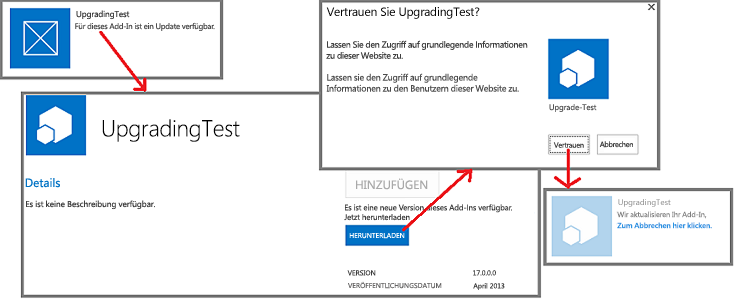

# Aktualisierungsprozess von Add-Ins für SharePoint

Sie müssen ein SharePoint-Add-In aktualisieren, wenn Sie Funktionen hinzufügen, einen Fehler korrigieren oder ein Sicherheitsupdate durchführen. Ein Update für ein Add-In wird auf die gleiche Weise in einem SharePoint-Add-In-Paket bereitgestellt wie das ursprüngliche Add-In. Mit dem Aktualisierungsverfahren für SharePoint-Add-Ins wird sichergestellt, dass die Daten des Add-Ins erhalten bleiben, wenn die Aktualisierung aus irgendeinem Grund fehlschlägt.
 
> [!IMPORTANT]
> Der *Add-In-Typ* kann nicht mithilfe des Updatesystems geändert werden. Sie können beispielsweise nicht ein von SharePoint gehostetes Add-In durch ein Update in ein vom Anbieter gehostetes Add-In ändern. Um den Add-In-Typ zu ändern, müssen Sie [von einem alten Add-In zu einem neuen migrieren](#Major). Insbesondere weil [das Vorschauprogramm für automatisch gehostete Add-Ins beendet wurde](http://blogs.office.com/2014/05/16/update-on-autohosted-apps-preview-program/), sollten Sie beachten, dass ein automatisch gehostetes Add-In nicht durch ein Update in ein vom Anbieter gehostetes Add-In geändert werden kann. Sie müssen das Add-In wie in [Konvertieren eines automatisch gehosteten Add-Ins für SharePoint in ein vom Anbieter gehostetes Add-In](convert-an-autohosted-sharepoint-add-in-to-a-provider-hosted-add-in.md) erklärt konvertieren.

## Aktualisierungsverfahren für ein SharePoint-Add-In

Sie verwenden für Aktualisierungen dieselbe Produkt-ID im Add-In-Manifest, die Sie für die ursprüngliche Version verwendet haben. Die Versionsnummer im Add-In-Manifest sollte größer als die Versionsnummer des Original-Add-Ins oder der letzten Aktualisierung sein.

Innerhalb von 24 Stunden, nachdem Sie das Update im Add-In-Katalog eines Unternehmens bereitgestellt haben, und innerhalb einer Woche, nachdem Sie es in den Office Store hochgeladen haben, wird auf der Seite **Websiteinhalte** jeder Website, auf der das Add-In installiert ist, neben dem Add-In-Eintrag angezeigt, dass ein Update verfügbar ist. Die Benutzer können auf einen Hyperlink klicken, um das Add-In zu aktualisieren (siehe Abbildung 1). Verfügbare Updates werden auch in der Mandantenverwaltungsoberfläche angezeigt.

*Abbildung 1: Updateprozess für SharePoint-Add-Ins*

> [!TIP]
> Wenn Sie ein Update entwickeln, möchten Sie nicht jedes Mal 24 Stunden warten, wenn Sie eine neue Version in Ihren SharePoint-Add-In-Testkatalog hochladen. Informationen dazu, wie Sie ein Add-In sofort aktualisieren, finden Sie unter [Aktualisieren eines Add-Ins, ohne 24 Stunden zu warten](update-sharepoint-add-ins.md#ImmediateUpdateNotice). 

> SharePoint prüft standardmäßig alle 24 Stunden auf Updates für installierte Add-Ins. Ein Farmadministrator kann hierfür einen anderen Wert festlegen, indem er den folgenden SharePoint-Verwaltungsshell-Befehl verwendet, wobei `n` die Anzahl der Stunden zwischen Prüfungen angibt: 

> `Set-SPInternalAppStateUpdateInterval -AppStateSyncHours n` 

> Wenn der Wert auf 0 festgelegt ist, erfolgt die Prüfung bei jeder Ausführung des integrierten Zeitgeberauftrags **Interne Add-In-Statusaktualisierung**, was standardmäßig jede Stunde ist. Farmadministratoren können die zentrale Verwaltung verwenden, um die Häufigkeit des Zeitgeberauftrags zu ändern oder ihn sofort auszuführen.

SharePoint führt die folgenden Aktionen aus, wenn ein Benutzer ein Update für ein SharePoint-Add-In installiert. Diese Ereignisse erfolgen nicht unbedingt in der unten angegebenen Reihenfolge. Einige Aktionen können auch gleichzeitig erfolgen. Wenn ein Update fehlschlägt, wird außerdem ein vollständiges Rollback ausgeführt.

- SharePoint fordert den Benutzer auf, von dem Add-In angeforderte Berechtigungen zu genehmigen.

- SharePoint sperrt das Add-In zeitweilig für Benutzerzugriffe.

- Wenn das Add-In ein SharePoint-Lösungspaket (.WSP) enthält und sich der Inhalt dieses Lösungspakets verändert hat, dann führt SharePoint Folgendes aus:
    
   - Erstellt eine Sicherungskopie des Add-In-Webs. (Die tatsächlich in SharePoint-Listen enthaltenen Daten werden in SharePoint Online und in lokalen SharePoint 2016-Bereitstellungen und höher nur gesichert, wenn durch das Update eine Änderung im Schema der Liste vorgenommen wird).

   - Das Update wird an der Sicherungskopie getestet.

   - Wenn der Test erfolgreich ist, wird das ursprüngliche Add-In-Web aktualisiert. Beachten Sie, dass die neue im Add-In-Paket enthaltene WSP-Datei zur Aktualisierung der Features und anderen Elemente des Add-In-Webs verwendet wird. (Die Updatekomponenten des Featureschemas wurden in SharePoint erweitert.)

- SharePoint führt den **UpgradedEventEndpoint**-Webdienst aus, falls im Add-In-Manifest einer registriert ist.
    
   > [!NOTE]
   > Handelt es sich um ein von einem Anbieter gehostetes Add-In, dann stellen Sie die Updatelogik für alle Komponenten des Add-Ins bereit, die keine SharePoint-Komponenten sind. Sie aktualisieren diese Komponenten größtenteils separat vom Update des SharePoint-Add-Ins selbst, genauso wie Sie diese Komponenten separat von der Installation des Add-Ins installiert haben. Es kann aber einige Änderungen geben, die nur durchgeführt werden sollten, wenn ein Benutzer das SharePoint-Add-In aktualisiert. Diese Logik kann in einen **UpgradedEventEndpoint**-Webdienst oder in die Logik für die „erste Ausführung nach dem Update“ eingefügt werden.

- SharePoint macht das Add-In und die zugehörigen Komponenten wieder verfügbar.

> [!NOTE]
> Wenn das Schema einer Liste im Add-In-Web geändert wird, wird die Liste zusammen mit dem restlichen Add-In-Web gesichert. Dieser Vorgang kann einige Zeit in Anspruch nehmen, wenn die Liste viele Daten enthält. Wenn der Updateprozess nach einer Stunde nicht abgeschlossen ist, wird er angehalten und das Update zurückgesetzt.

## Migrieren von einem alten Add-In zu einem neuen

In einigen Szenarien ist es sinnvoll, ein völlig neues Add-In zu erstellen, das ein altes Add-In ersetzt, statt das ursprüngliche Add-In zu aktualisieren. Das neue Add-In kann den gleichen Anzeigenamen haben wie das alte Add-In, muss jedoch im Add-In-Manifest eine neue Produkt-ID erhalten. Es wird im öffentlichen Office Store sowie auf SharePoint-Websites auf der Seite **Add-In hinzufügen** als von der Originalversion unabhängiges Element angezeigt.
 
> [!NOTE]
> Elemente im Add-In-Katalog einer Organisation werden durch den *Dateinamen* des Add-In-Pakets unterschieden, nicht durch die Produkt-ID oder den Namen des Add-Ins. Wenn das neue Add-In den gleichen Paketdateinamen hat wie das alte Add-In, wird das alte Add-In im Add-In-Katalog ersetzt, und das alte Add-In wird nicht mehr auf der Seite **Add-In hinzufügen** angezeigt. Wenn Sie die Versionsverwaltung für das Add-In-Paket aktivieren, wenn Sie es zum Katalog hochladen, bleibt die alte Version der Datei (das alte Add-In) im Verlauf des Elements verfügbar. Sie können das alte Add-In-Paket herunterladen oder es wiederherstellen. Sowohl die alten als auch die neuen Add-Ins können aber nur dann als separate Elemente im Katalog oder auf der Seite **Add-In hinzufügen** platziert werden, wenn sie unterschiedliche Dateinamen haben.

In manchen Fällen kann es erforderlich sein, Daten zu migrieren. Das neue Add-In kann beispielsweise eine Microsoft Azure SQL-Datenbank-Datenbank verwenden, die ein anderes Schema als bei dem alten Add-In hat. Oder das neue Add-In verwendet einen anderen Datenspeicherungsmechanismus, z. B. eine externe Datenbank statt SharePoint-Listen. Sie müssen den Code für die Datenmigration bereitstellen.

Wenn sich die alten Daten an einem Speicherort befinden, auf den ein Remoteereignishandler zugreifen kann, dann können Sie die Migrationslogik in einen **InstalledEventEndpoint**-Webdienst des neuen Add-Ins implementieren. Wenn das neue Add-In Zugriff auf die alten Daten hat, können Sie stattdessen die Migrationslogik in Code einfügen, der beim ersten Start des neuen Add-Ins ausgeführt wird. Sind die alten Daten weder für Remoteereignishandler noch für das neue Add-In zugänglich, dann können Sie ein Update dem alten Add-In erstellen, um eine Datenexportfunktion und eine Benutzeroberfläche für die Funktion hinzuzufügen. Benutzer würden zuerst das alte Add-In aktualisieren und es dann verwenden, um die Daten an einen Speicherort zu exportieren, auf den das neue Add-In zugreifen kann. Die Funktion und die Benutzeroberfläche zum Importieren von Daten fügen Sie in das neue Add-In ein.

Im Prinzip können Sie eine externe Datenquelle, Rechenkomponente oder eine andere externe Komponente in dem neuen Add-In wiederverwenden, die in dem alten Add-In verwendet wurde. Beachten Sie aber, dass bei der Deinstallation einer SharePoint-Add-In die SharePoint-Infrastruktur alle installierten Komponenten deinstalliert. Daher sollte eine SharePoint-Add-In nur von ihr installierte Komponenten oder externe Komponenten verwenden, die nicht von der SharePoint-Infrastruktur installiert wurden.
 
> [!NOTE]
> Wenn Sie einen **InstalledEventEndpoint** oder einen **UpgradedEventEndpoint** implementieren, der Komponenten installiert, empfehlen wir, auch einen **UninstallingEventEndpoint** zu implementieren, der diese Komponenten deinstalliert. Dadurch werden die Designgrundsätze erfüllt, dass Add-Ins eigenständig sein und sauber deinstalliert werden sollten. Daten, die für die Benutzer auch nach der Deinstallation des Add-Ins nützlich wären, sollten aber nicht gelöscht werden. Websites, die durch ein Add-In erstellt wurden – mit Ausnahme des Add-In-Webs – sollten als Daten betrachtet werden.

Wenn sowohl das alte als auch das neue Add-In jeweils ein Add-In-Web enthalten, müssen Sie berücksichtigen, dass das neue Add-In-Web während der Installation des neuen Add-Ins erstellt wird. Verwenden Sie daher nicht das zum Update gehörige XML-Markup im SharePoint-Featureschema. Dieses Markup funktioniert nicht, weil Sie keine vorhandenen SharePoint-Komponenten aktualisieren, sondern ein altes Add-In durch ein neues Add-In ersetzen.

## Siehe auch

-  [Aktualisieren von SharePoint-Add-Ins](update-sharepoint-add-ins.md)
-  [Aktualisieren von Add-In-Webkomponenten in SharePoint](update-add-in-web-components-in-sharepoint.md)
-  [Aktualisieren von Hostwebkomponenten in SharePoint](update-host-web-components-in-sharepoint.md)
-  [Erstellen eines Handlers für das Updateereignis in SharePoint-Add-Ins](create-a-handler-for-the-update-event-in-sharepoint-add-ins.md)
-  [Aktualisieren von Remotekomponenten in SharePoint-Add-Ins](update-remote-components-in-sharepoint-add-ins.md)
-  [Veröffentlichen von SharePoint-Add-Ins](publish-sharepoint-add-ins.md)
-  [Kritische Aspekte der Architektur und der Entwicklungslandschaft für SharePoint-Add-Ins](important-aspects-of-the-sharepoint-add-in-architecture-and-development-landscap.md)
-  [Bereitstellen und Installieren von SharePoint-Add-Ins: Methoden und Optionen](deploying-and-installing-sharepoint-add-ins-methods-and-options.md)

